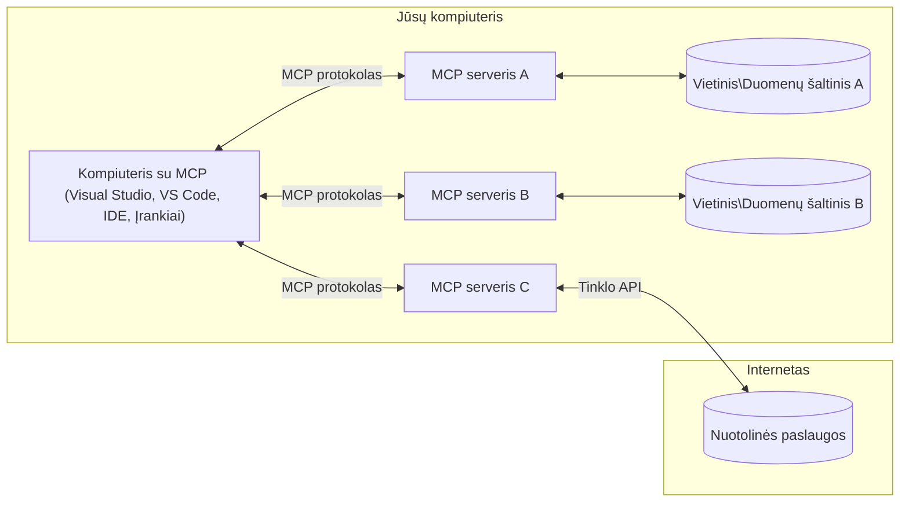

# MCP Pagrindinės Sąvokos: Modelio Konteksto Protokolo Valdymas AI Integracijai

[](https://youtu.be/earDzWGtE84)

_(Spustelėkite aukščiau esantį paveikslėlį, kad peržiūrėtumėte šios pamokos vaizdo įrašą)_

[Modelio Konteksto Protokolas (MCP)](https://github.com/modelcontextprotocol) yra galinga, standartizuota sistema, optimizuojanti komunikaciją tarp Didelių Kalbos Modelių (LLM) ir išorinių įrankių, programų bei duomenų šaltinių.
Šiame vadove susipažinsite su MCP pagrindinėmis sąvokomis. Išmoksite apie kliento-serverio architektūrą, svarbiausias sudedamąsias dalis, komunikacijos mechanizmus ir diegimo gerąsias praktikas.

- **Aiškus Vartotojo Sutikimas**: Visa duomenų prieiga ir operacijos reikalauja aiškaus vartotojo pritarimo prieš vykdymą. Vartotojai turi aiškiai suprasti, kokie duomenys bus pasiekiami ir kokie veiksmai bus atlikti, su galimybe smulkiai valdyti leidimus ir autorizacijas.

- **Duomenų Privatumo Apsauga**: Vartotojo duomenys atskleidžiami tik su aiškiu sutikimu ir turi būti saugomi naudojant stiprias prieigos kontrolės priemones visos sąveikos metu. Įgyvendinimai turi užkirsti kelią neteisėtai duomenų perdavimui ir palaikyti griežtas privatumo ribas.

- **Įrankių Vykdymo Saugumas**: Kiekvienas įrankio iškvietimas reikalauja aiškaus vartotojo sutikimo su aiškiu supratimu apie įrankio funkcionalumą, parametrus ir galimą poveikį. Stiprūs saugumo ribojimai turi užkirsti kelią netyčiniam, nesaugiems ar piktybiniams įrankių vykdymams.

- **Transporto Sluoksnio Saugumas**: Visi komunikacijos kanalai turi naudoti tinkamas šifravimo ir autentifikacijos priemones. Nuotoliniai ryšiai turi įgyvendinti saugius transporto protokolus ir tinkamą kredencialų valdymą.

#### Įgyvendinimo Gairės:

- **Leidimų Valdymas**: Įgyvendinti smulkios kontrolės leidimų sistemas, leidžiančias vartotojams valdyti, kurie serveriai, įrankiai ir ištekliai yra pasiekiami
- **Autentifikacija ir Autorizacija**: Naudoti saugius autentifikacijos metodus (OAuth, API raktai) su tinkamu žetonų valdymu ir galiojimo pabaigos nustatymais
- **Įvesties Validacija**: Tikrinti visus parametrus ir duomenų įvestis pagal apibrėžtas schemas, siekiant apsisaugoti nuo injekcijos atakų
- **Auditavimo Įrašai**: Palaikyti išsamius visų operacijų žurnalus saugumui stebėti ir atitikties reikalavimams

## Apžvalga

Ši pamoka nagrinėja pagrindinę architektūrą ir komponentus, sudarančius Modelio Konteksto Protokolo (MCP) ekosistemą. Susipažinsite su kliento-serverio architektūra, pagrindinėmis dalimis ir komunikacijos mechanizmais, kurie valdo MCP sąveikas.

## Pagrindiniai Mokymosi Tikslai

Pamokos pabaigoje jūs:

- Suprasite MCP kliento-serverio architektūrą.
- Identifikuosite šeimininko, kliento ir serverio vaidmenis bei atsakomybes.
- Analizuosite pagrindines savybes, kurios daro MCP lankstų integracijos sluoksnį.
- Išmoksite, kaip informacija teka MCP ekosistemoje.
- Gausite praktinių įžvalgų per kodo pavyzdžius .NET, Java, Python ir JavaScript kalbomis.

## MCP Architektūra: Gilesnis Žvilgsnis

MCP ekosistema remiasi kliento-serverio modeliu. Ši modulio struktūra leidžia AI programoms efektyviai sąveikauti su įrankiais, duomenų bazėmis, API ir kontekstiniais ištekliais. Panagrinėkime šią architektūrą pagrindinėms dalims.

MCP esmė yra kliento-serverio architektūra, kurioje vienas šeimininkas gali prisijungti prie kelių serverių:



- **MCP Šeimininkai**: programos, tokios kaip VSCode, Claude Desktop, IDE ar AI įrankiai, norintys pasiekti duomenis per MCP
- **MCP Klientai**: protokolo klientai, palaikantys 1:1 ryšius su serveriais
- **MCP Serveriai**: lengvos programos, kurios kiekviena teikia specifines galimybes per standartizuotą Modelio Konteksto Protokolą
- **Vietiniai Duomenų Šaltiniai**: jūsų kompiuterio failai, duomenų bazės ir paslaugos, prie kurių MCP serveriai gali saugiai prisijungti
- **Nuotolinės Paslaugos**: išorinės sistemos, pasiekiamos per internetą, prie kurių MCP serveriai gali jungtis per API.

MCP Protokolas yra besivystantis standartas, naudojantis datos pagrindu nustatomą versiją (YYYY-MM-DD formatu). Dabartinė protokolo versija yra **2025-11-25**. Naujausią atnaujinimą galite matyti [protokolo specifikacijoje](https://modelcontextprotocol.io/specification/2025-11-25/)

> **Žvelgiant į ateitį:** naujos specifikacijos versijos, **2026-07-28**, leidimo kandidatas buvo paskelbtas 2026 m. gegužę ir planuojamas išleisti 2026 m. liepos 28 d. Jis padarys protokolą be valstybės transporto sluoksnyje (pašalinant `initialize` rankos paspaudimą ir sesijos ID), formalizuos Išplėtimo sistemą ir panaikins Roots, Sampling ir Logging naudodamas naujesnius modelius. Visą apžvalgą rasite [Kas keičiasi MCP: 2026-07-28 Leidimo Kandidatas](./mcp-2026-07-28-release-candidate.md).

### 1. Šeimininkai

Modelio Konteksto Protokole (MCP) **Šeimininkai** yra AI programos, kurios veikia kaip pagrindinė sąsaja, per kurią vartotojai bendrauja su protokolu. Šeimininkai koordinuoja ir valdo ryšius su keliais MCP serveriais, kuriant kiekvienam serverio ryšiui skirtus MCP klientus. Šeimininkų pavyzdžiai:

- **AI Programos**: Claude Desktop, Visual Studio Code, Claude Code
- **Kūrimo Aplinkos**: IDE ir kodo redaktoriai su MCP integracija
- **Individualios Programos**: specialiai sukurti AI agentai ir įrankiai

**Šeimininkai** yra programos, kurios koordinuoja AI modelių sąveikas. Jie:

- **Orkestra AI Modelius**: vykdo arba bendrauja su LLM, generuodami atsakymus ir koordinuodami AI darbo eigas
- **Valdo Klientų Ryšius**: kuria ir palaiko po vieną MCP klientą kiekvienam MCP serverio ryšiui
- **Valdo Vartotojo Sąsają**: tvarko pokalbių eigą, vartotojo sąveikas ir atsakymų pateikimą
- **Užtikrina Saugumą**: kontroliuoja leidimus, saugumo apribojimus ir autentifikaciją
- **Tvarko Vartotojo Sutikimą**: valdo vartotojo pritarimą duomenų dalijimuisi ir įrankių vykdymui


### 2. Klientai

**Klientai** yra esminiai komponentai, kurie palaiko dedikuotus vienas su vienu ryšius tarp Šeimininkų ir MCP serverių. Kiekvienas MCP klientas yra sukuriamas Šeimininko, kad jungtųsi su konkrečiu MCP serveriu, užtikrinant organizuotą ir saugų komunikacijos kanalą. Keli klientai leidžia Šeimininkams vienu metu jungtis prie kelių serverių.

**Klientai** yra jungiamieji komponentai viduje šeimininko programos. Jie:

- **Protokolo Komunikacija**: siunčia JSON-RPC 2.0 užklausas serveriams su užklausomis ir instrukcijomis
- **Galimybių Derybos**: derasi su serveriais dėl palaikomų funkcijų ir protokolo versijų inicijavimo metu
- **Įrankių Vykdymas**: valdo modelių prašymus įrankių vykdymui ir apdoroja atsakymus
- **Realaus Laiko Atnaujinimai**: tvarko pranešimus ir realaus laiko atnaujinimus iš serverių
- **Atsakymų Apdorojimas**: apdoroja ir formatuoja serverių atsakymus vartotojų rodymui

### 3. Serveriai

**Serveriai** yra programos, kurios suteikia kontekstą, įrankius ir galimybes MCP klientams. Jie gali veikti vietoje (toje pačioje mašinoje kaip Šeimininkas) arba nuotoliniu būdu (išorinėse platformose), atsakingi už kliento užklausų tvarkymą ir struktūrizuotų atsakymų teikimą. Serveriai teikia specifinį funkcionalumą per standartizuotą Modelio Konteksto Protokolą.

**Serveriai** yra paslaugos, teikiančios kontekstą ir galimybes. Jie:

- **Funkcijų Registracija**: registruoja ir atskleidžia klientams prieinamus primityvus (išteklius, užklausas, įrankius)
- **Užklausų Apdorojimas**: priima ir vykdo įrankių iškvietimus, išteklių ir užklausų prašymus iš klientų
- **Konteksto Pateikimas**: teikia kontekstinę informaciją ir duomenis modelio atsakymams pagerinti
- **Būsenos Valdymas**: palaiko sesijos būseną ir tvarko būsenos priklausomas sąveikas, kai reikia
- **Realaus Laiko Pranešimai**: siunčia pranešimus apie galimybių pokyčius ir atnaujinimus sujungtiems klientams

Serverius gali kurti bet kas, kad praplėstų modelio galimybes su specializuotu funkcionalumu, ir jie palaiko tiek vietinį, tiek nuotolinį diegimą.

### 4. Serverio Primityvai

Modelio Konteksto Protokolo (MCP) serveriai suteikia tris pagrindinius **primityvus**, kurie apibrėžia pagrindinius statybinius blokus turtingoms sąveikoms tarp klientų, šeimininkų ir kalbos modelių. Šie primityvai apibrėžia kontekstinės informacijos ir veiksmų tipus, prieinamus per protokolą.

MCP serveriai gali atskleisti bet kurią iš šių trijų pagrindinių primityvų kombinaciją:

#### Ištekliai

**Ištekliai** yra duomenų šaltiniai, teikiantys kontekstinę informaciją AI programoms. Jie atspindi statinį ar dinamišką turinį, kuris gali pagerinti modelio supratimą ir sprendimų priėmimą:

- **Kontekstinė Informacija**: struktūruota informacija ir kontekstas AI modeliui
- **Žinių Bazės**: dokumentų archyvai, straipsniai, vadovai ir moksliniai darbai
- **Vietiniai Duomenų Šaltiniai**: failai, duomenų bazės ir vietinės sistemos informacija
- **Išoriniai Duomenys**: API atsakymai, internetinės paslaugos ir nuotoliniai sistemos duomenys
- **Dinaminis Turinys**: realaus laiko duomenys, atnaujinami pagal išorines sąlygas

Ištekliai identifikuojami URI ir palaiko atradimą per `resources/list` bei gavimą per `resources/read` metodus:

```text
file://documents/project-spec.md
database://production/users/schema
api://weather/current
```

#### Užklausos

**Užklausos** yra pakartotinai naudojamos šabloninės struktūros, kurios padeda struktūruoti sąveikas su kalbos modeliais. Jos suteikia standartinius sąveikos modelius ir šablonines darbo eigas:

- **Šabloninės Sąveikos**: iš anksto struktūruotos žinutės ir pokalbių pradžios
- **Darbo Eigos Šablonai**: standartizuotos sekos įprastoms užduotims ir sąveikoms
- **Mažo Pavyzdžio Pavyzdžiai**: pavyzdžiais pagrįsti šablonai modelio instrukcijoms
- **Sistemos Užklausos**: pagrindinės užklausos, apibrėžiančios modelio elgesį ir kontekstą
- **Dinaminiai Šablonai**: parametruoti užklausos, pritaikomi konkretiems kontekstams

Užklausos palaiko kintamųjų keitimą ir gali būti randamos per `prompts/list` bei gaunamos su `prompts/get`:

```markdown
Generate a {{task_type}} for {{product}} targeting {{audience}} with the following requirements: {{requirements}}
```

#### Įrankiai

**Įrankiai** yra vykdomos funkcijos, kurias AI modeliai gali iškviesti konkretūs veiksmai. Jie yra MCP ekosistemos „veiksmažodžiai“, leidžiantys modeliams bendrauti su išorinėmis sistemomis:

- **Vykdomos Operacijos**: konkretūs veiksmai, kuriuos modeliai gali iškviesti su specifiniais parametrais
- **Išorinės Sistemos Integracija**: API kvietimai, duomenų bazių užklausos, failų operacijos, skaičiavimai
- **Unikali Tapatybė**: kiekvienas įrankis turi unikalų pavadinimą, aprašymą ir parametrų schemą
- **Struktūruota Įvestis/Išvestis**: įrankiai priima patikrintus parametrus ir grąžina struktūrizuotus, tipizuotus atsakymus
- **Veiksmų Galimybės**: leidžia modeliams atlikti realaus pasaulio veiksmus ir gauti gyvus duomenis

Įrankiai apibrėžiami JSON Schema pagalba parametrų validacijai ir yra randami per `tools/list` bei iškviečiami per `tools/call`. Įrankiai taip pat gali turėti **piktogramas** kaip papildomą metaduomenį geresniam UI pateikimui.

**Įrankių Anotacijos**: įrankiai palaiko elgesio anotacijas (pvz., `readOnlyHint`, `destructiveHint`), kurios nurodo, ar įrankis yra tik skaitomas ar destruktyvus, padedančios klientams priimti pagrįstus sprendimus dėl įrankių vykdymo.

Įrankio apibrėžimo pavyzdys:

```typescript
server.tool(
  "search_products", 
  {
    query: z.string().describe("Search query for products"),
    category: z.string().optional().describe("Product category filter"),
    max_results: z.number().default(10).describe("Maximum results to return")
  }, 
  async (params) => {
    // Vykdyti paiešką ir grąžinti struktūrizuotus rezultatus
    return await productService.search(params);
  }
);
```

## Kliento Primityvai

Modelio Konteksto Protokole (MCP) **klientai** gali atskleisti primityvus, leidžiančius serveriams prašyti papildomų galimybių iš šeimininko programos. Šie kliento pusės primityvai leidžia turtingesnius ir interaktyvesnius serverių įgyvendinimus, galinčius pasiekti AI modelio galimybes ir vartotojų sąveikas.

### Imties (Sampling)

> **Panaikinimo pranešimas:** `2026-07-28` leidimo kandidatas žymi Sampling kaip nebenaudotiną, kartu rekomenduojant tiesioginę integraciją su LLM teikėjų API. Sampling veiks `2025-11-25` versijoje ir bent metus po panaikinimo, bet naujuose dizainuose turėtų būti naudojamas pakeitimo modelis. Plačiau žr. [Kas keičiasi MCP: 2026-07-28 Leidimo Kandidatas](./mcp-2026-07-28-release-candidate.md).

**Sampling** leidžia serveriams prašyti kalbos modelio užbaigimų iš kliento AI programos. Šis primityvas leidžia serveriams pasiekti LLM galimybes be tiesioginių modelio priklausomybių:

- **Modelio Nepriklausoma Prieiga**: serveriai gali prašyti užbaigimų be LLM SDK ar modelio valdymo
- **Serverio Inicijuota AI**: leidžia serveriams savarankiškai generuoti turinį naudojant kliento AI modelį
- **Rekursyvios LLM Sąveikos**: palaiko sudėtingus scenarijus, kai serveriams reikalinga AI pagalba apdorojant
- **Dinaminis Turinio Generavimas**: leidžia serveriams kurti kontekstinius atsakymus naudojant šeimininko modelį
- **Įrankių Iškvietimo Palaikymas**: serveriai gali įtraukti `tools` ir `toolChoice` parametrus, leidžiančius kliento modeliui iškviesti įrankius Sampling metu

Sampling inicijuojamas per `sampling/complete` metodą, kai serveriai siunčia užklausas klientams.

### Šaknys (Roots)

> **Panaikinimo pranešimas:** `2026-07-28` leidimo kandidatas žymi Roots kaip nebenaudotinas, siūlant naudoti įrankių parametrus, išteklių URI ar serverio konfigūraciją. Veiks `2025-11-25` versijoje ir bent metus po panaikinimo. Žr. [Kas keičiasi MCP: 2026-07-28 Leidimo Kandidatas](./mcp-2026-07-28-release-candidate.md).

**Roots** suteikia standartizuotą būdą klientams atskleisti failų sistemos ribas serveriams, padėdami serveriams suprasti, prie kurių katalogų ir failų jie turi prieigą:

- **Failų Sistemos Ribos**: apibrėžia ribas, kur serveriai gali veikti failų sistemoje
- **Prieigos Kontrolė**: padeda serveriams suprasti, prie kurių katalogų ir failų jie turi leidimą pasiekti
- **Dinaminiai Atnaujinimai**: klientai gali pranešti serveriams, kai šaknų sąrašas keičiasi
- **URI pagrindu identifikavimas**: šaknys naudoja `file://` URI identifikuoti pasiekiamus katalogus ir failus

Šaknys aptinkamos per `roots/list` metodą, o klientai siunčia `notifications/roots/list_changed`, kai šaknys keičiasi.

### Informacijos Surinkimas (Elicitation)

**Elicitation** leidžia serveriams per kliento sąsają prašyti papildomos informacijos ar vartotojo patvirtinimo:

- **Vartotojo Įvesčių Prašymai**: serveriai gali prašyti papildomos informacijos, kai jos reikia įrankių vykdymui
- **Patvirtinimo Dialogai**: prašo vartotojo sutikimo jautrioms ar reikšmingoms operacijoms
- **Interaktyvios Darbo Eigos**: leidžia serveriams kurti žingsnis po žingsnio vartotojo sąveikas
- **Dinaminis parametrų rinkimas**: renka trūkstamus ar pasirenkamus parametrus vykdant įrankius

Elicitation užklausos atliekamos naudojant `elicitation/request` metodą, rinkiant vartotojo įvestį per kliento sąsają.

**URL režimo Elicitation**: serveriai taip pat gali prašyti vartotojo sąveikų su URL, leidžiančių nukreipti vartotojus į išorines interneto svetaines autentifikacijai, patvirtinimui ar duomenų įvedimui.

### Žurnalo Vertimas (Logging)


> **Atsisakymo pranešimas:** „2026-07-28“ leidimo kandidatas pažymi, kad Logging yra atsisakomas vietoje `stderr` naudoti stdio transportui ir OpenTelemetry struktūruotam stebėjimui. Jis toliau veikia `2025-11-25` ir bent metus po bet kokio atsisakymo. Žr. [Kas keičiasi MCP: 2026-07-28 leidimo kandidatas](./mcp-2026-07-28-release-candidate.md).

**Logging** leidžia serveriams siųsti struktūruotas žurnalų žinutes klientams derinimui, stebėjimui ir operatyvumui matyti:

- **Derinimo palaikymas**: Leidžia serveriams pateikti detalius vykdymo žurnalus problemų sprendimui
- **Operatyvus stebėjimas**: Siųsti būsenos atnaujinimus ir veiklos metrikas klientams
- **Klaidų ataskaitos**: Pateikti detalią klaidų kontekstą ir diagnostinę informaciją
- **Audito sekos**: Kurti išsamius serverio operacijų ir sprendimų žurnalus

Žurnalų žinutės siunčiamos klientams, kad būtų suteikta skaidrumo į serverio veiklą ir palengvintas derinimas.

## Informacijos srautas MCP

Modelio konteksto protokolas (MCP) apibrėžia struktūruotą informacijos srautą tarp šeimininkų, klientų, serverių ir modelių. Supratimas apie šį srautą padeda paaiškinti, kaip apdorojami vartotojų užklausimai ir kaip išoriniai įrankiai bei duomenys integruojami į modelių atsakymus.

- **Šeimininkas inicijuoja ryšį**  
  Šeimininko programa (pvz., IDE arba pokalbių sąsaja) užmezga ryšį su MCP serveriu, paprastai per STDIO, WebSocket ar kitą palaikomą transportą.

- **Galimybių derinimas**  
  Klientas (įdėtas į šeimininką) ir serveris keičiasi informacija apie palaikomas funkcijas, įrankius, išteklius ir protokolo versijas. Tai užtikrina, kad abi pusės supranta, kokios galimybės yra prieinamos sesijoje.

- **Vartotojo užklausa**  
  Vartotojas sąveikauja su šeimininku (pvz., įveda užklausą ar komandą). Šeimininkas surenka šį įvestį ir perduoda ją klientui apdorojimui.

- **Ištekliaus arba įrankio naudojimas**  
  - Klientas gali paprašyti papildomos konteksto arba išteklių iš serverio (pvz., failų, duomenų bazės įrašų ar žinių bazės straipsnių), kad praturtintų modelio supratimą.
  - Jei modelis nustato, kad reikalingas įrankis (pvz., gauti duomenis, atlikti skaičiavimą arba iškviesti API), klientas siunčia užklausą serveriui dėl įrankio iškvietimo, nurodant įrankio pavadinimą ir parametrus.

- **Serverio vykdymas**  
  Serveris gauna išteklių ar įrankio užklausą, atlieka būtinus veiksmus (pvz., vykdo funkciją, užklausia duomenų bazės ar pasiekia failą) ir grąžina rezultatus klientui struktūruota forma.

- **Atsakymo generavimas**  
  Klientas integruoja serverio atsakymus (išteklių duomenis, įrankių rezultatus ir pan.) į vykstančią modelio sąveiką. Modelis naudoja šią informaciją kuriant išsamų ir kontekstualiai tinkamą atsakymą.

- **Rezultato pateikimas**  
  Šeimininkas gauna galutinį rezultatą iš kliento ir pateikia jį vartotojui, dažnai įtraukiant ir modelio sugeneruotą tekstą, ir įrankių vykdymo ar išteklių paieškos rezultatus.

Šis srautas leidžia MCP palaikyti pažangias, interaktyvias ir kontekstualiai suvokiančias DI programas, sklandžiai jungiant modelius su išoriniais įrankiais ir duomenų šaltiniais.

## Protokolo architektūra ir sluoksniai

MCP susideda iš dviejų atskirų architektūrinių sluoksnių, kurie veikia kartu, kad suteiktų pilną komunikacijos sistemą:

### Duomenų sluoksnis

**Duomenų sluoksnis** įgyvendina pagrindinį MCP protokolą, naudodamas **JSON-RPC 2.0** kaip pagrindą. Šis sluoksnis apibrėžia žinučių struktūrą, semantiką ir sąveikos modelius:

#### Pagrindinės sudedamosios dalys:

- **JSON-RPC 2.0 protokolas**: Visa komunikacija naudoja standartizuotą JSON-RPC 2.0 žinučių formatą metodo kvietimams, atsakymams ir pranešimams
- **Gyvavimo ciklo valdymas**: Tvarko ryšio inicializavimą, galimybių derinimą ir sesijos uždarymą tarp klientų ir serverių
- **Serverio pradinės funkcijos**: Leidžia serveriams suteikti pagrindines funkcijas per įrankius, išteklius ir užklausas
- **Kliento pradinės funkcijos**: Leidžia serveriams prašyti LLM mėginių paėmimo, gauti vartotojo įvestį bei siųsti žurnalų žinutes
- **Realaus laiko pranešimai**: Palaiko asinchroninius pranešimus dinamiškiems atnaujinimams be apklausos

#### Pagrindinės savybės:

- **Protokolo versijos derinimas**: Naudoja datomis pagrįstą versijavimą (YYYY-MM-DD), kad užtikrintų suderinamumą
- **Galimybių atradimas**: Klientai ir serveriai keičiasi palaikomų funkcijų informacija inicializacijos metu
- **Būsenos sesijos**: Laiko ryšio būseną per kelis sąveikos atvejus, siekiant išlaikyti konteksto tęstinumą

### Transporto sluoksnis

**Transporto sluoksnis** valdo komunikacijos kanalus, žinučių rėminimą ir autentifikaciją tarp MCP dalyvių:

#### Palaikomos transporto priemonės:

1. **STDIO transportas**:
   - Naudoja standartines įvesties/išvesties sroves tiesioginei procesų komunikacijai
   - Optimalus vietiniams procesams toje pačioje mašinoje be tinklo sąnaudų
   - Dažnai naudojamas vietinėms MCP serverio įgyvendinimo versijoms

2. **Streamable HTTP transportas**:
   - Naudoja HTTP POST klientas–serveris žinutėms  
   - Pasirenkamas Server-Sent Events (SSE) srautiniam serverio į klientą perdavimui
   - Leidžia nuotolinį serverio ryšį per tinklus
   - Palaiko standartinę HTTP autentifikaciją (bearer token’us, API raktus, pasirinktinus antraštes)
   - MCP rekomenduoja OAuth saugiai tokenais pagrįstai autentifikacijai

#### Transporto abstrakcija:

Transporto sluoksnis abstrahuoja komunikacijos detales nuo duomenų sluoksnio, leidžiant naudoti tą patį JSON-RPC 2.0 žinučių formatą visuose transporto mechanizmuose. Ši abstrakcija leidžia programoms sklandžiai pereiti tarp vietinių ir nuotolinių serverių.

### Saugumo aspektai

MCP įgyvendinimai privalo laikytis kelių svarbių saugumo principų, kad užtikrintų saugias, patikimas ir saugias sąveikas visose protokolo operacijose:

- **Vartotojo sutikimas ir kontrolė**: Vartotojai turi aiškiai suteikti sutikimą prieš bet kokius duomenų pasiekimus ar operacijų vykdymą. Jie turi aiškią kontrolę, kokie duomenys yra dalijami ir kokios veiksmai autorizuoti, remiantis patogiais vartotojo sąsajos sprendimais prižiūrėti ir patvirtinti veiklas.

- **Duomenų privatumas**: Vartotojo duomenys gali būti atskleisti tik gavus aiškų sutikimą ir turi būti apsaugoti tinkamomis prieigos kontrolėmis. MCP įgyvendinimai turi apsaugoti nuo neteisėto duomenų perdavimo ir užtikrinti konfidencialumą visose sąveikose.

- **Įrankių saugumas**: Prieš iškviečiant bet kurį įrankį, reikalingas aiškus vartotojo sutikimas. Vartotojai turi gerai suprasti kiekvieno įrankio funkcionalumą, ir turi būti taikomos tvirtos saugumo ribos, kad būtų užkirstas kelias nepageidaujamam ar nesaugiui įrankio vykdymui.

Vadovaudamiesi šiais saugumo principais, MCP užtikrina vartotojų pasitikėjimą, privatumą ir saugumą per visą protokolo darbo procesą ir įgalina galingas DI integracijas.

## Kodo pavyzdžiai: pagrindinės sudedamosios dalys

Žemiau pateikti kelių populiarių programavimo kalbų kodo pavyzdžiai, kurie iliustruoja, kaip įgyvendinti pagrindines MCP serverio komponentes ir įrankius.

### .NET pavyzdys: paprasto MCP serverio kūrimas su įrankiais

Čia pateikiamas praktinis .NET kodo pavyzdys, rodantis, kaip įgyvendinti paprastą MCP serverį su pasirinktiniais įrankiais. Šis pavyzdys demonstruoja, kaip apibrėžti ir užregistruoti įrankius, tvarkyti užklausas ir susieti serverį naudojant Model Context Protocol.

```csharp
using System;
using System.Threading.Tasks;
using ModelContextProtocol.Server;
using ModelContextProtocol.Server.Transport;
using ModelContextProtocol.Server.Tools;

public class WeatherServer
{
    public static async Task Main(string[] args)
    {
        // Create an MCP server
        var server = new McpServer(
            name: "Weather MCP Server",
            version: "1.0.0"
        );
        
        // Register our custom weather tool
        server.AddTool<string, WeatherData>("weatherTool", 
            description: "Gets current weather for a location",
            execute: async (location) => {
                // Call weather API (simplified)
                var weatherData = await GetWeatherDataAsync(location);
                return weatherData;
            });
        
        // Connect the server using stdio transport
        var transport = new StdioServerTransport();
        await server.ConnectAsync(transport);
        
        Console.WriteLine("Weather MCP Server started");
        
        // Keep the server running until process is terminated
        await Task.Delay(-1);
    }
    
    private static async Task<WeatherData> GetWeatherDataAsync(string location)
    {
        // This would normally call a weather API
        // Simplified for demonstration
        await Task.Delay(100); // Simulate API call
        return new WeatherData { 
            Temperature = 72.5,
            Conditions = "Sunny",
            Location = location
        };
    }
}

public class WeatherData
{
    public double Temperature { get; set; }
    public string Conditions { get; set; }
    public string Location { get; set; }
}
```

### Java pavyzdys: MCP serverio komponentai

Šis pavyzdys demonstruoja tą patį MCP serverį ir įrankių registraciją kaip .NET pavyzdyje aukščiau, tačiau įgyvendintą Java kalba.

```java
import io.modelcontextprotocol.server.McpServer;
import io.modelcontextprotocol.server.McpToolDefinition;
import io.modelcontextprotocol.server.transport.StdioServerTransport;
import io.modelcontextprotocol.server.tool.ToolExecutionContext;
import io.modelcontextprotocol.server.tool.ToolResponse;

public class WeatherMcpServer {
    public static void main(String[] args) throws Exception {
        // Sukurkite MCP serverį
        McpServer server = McpServer.builder()
            .name("Weather MCP Server")
            .version("1.0.0")
            .build();
            
        // Registruokite oro sąlygų įrankį
        server.registerTool(McpToolDefinition.builder("weatherTool")
            .description("Gets current weather for a location")
            .parameter("location", String.class)
            .execute((ToolExecutionContext ctx) -> {
                String location = ctx.getParameter("location", String.class);
                
                // Gaukite oro sąlygų duomenis (supaprastinta)
                WeatherData data = getWeatherData(location);
                
                // Grąžinkite suformatuotą atsakymą
                return ToolResponse.content(
                    String.format("Temperature: %.1f°F, Conditions: %s, Location: %s", 
                    data.getTemperature(), 
                    data.getConditions(), 
                    data.getLocation())
                );
            })
            .build());
        
        // Prisijunkite prie serverio naudodami stdio transportą
        try (StdioServerTransport transport = new StdioServerTransport()) {
            server.connect(transport);
            System.out.println("Weather MCP Server started");
            // Laikykite serverį veikiančią tol, kol procesas bus nutrauktas
            Thread.currentThread().join();
        }
    }
    
    private static WeatherData getWeatherData(String location) {
        // Įgyvendinimas kvies oro sąlygų API
        // Supaprastinta pavyzdžio tikslais
        return new WeatherData(72.5, "Sunny", location);
    }
}

class WeatherData {
    private double temperature;
    private String conditions;
    private String location;
    
    public WeatherData(double temperature, String conditions, String location) {
        this.temperature = temperature;
        this.conditions = conditions;
        this.location = location;
    }
    
    public double getTemperature() {
        return temperature;
    }
    
    public String getConditions() {
        return conditions;
    }
    
    public String getLocation() {
        return location;
    }
}
```

### Python pavyzdys: MCP serverio kūrimas

Šis pavyzdys naudoja fastmcp, todėl įsitikinkite, kad jis yra įdiegtas:

```python
pip install fastmcp
```
Kodo pavyzdys:

```python
#!/usr/bin/env python3
import asyncio
from fastmcp import FastMCP
from fastmcp.transports.stdio import serve_stdio

# Sukurkite FastMCP serverį
mcp = FastMCP(
    name="Weather MCP Server",
    version="1.0.0"
)

@mcp.tool()
def get_weather(location: str) -> dict:
    """Gets current weather for a location."""
    return {
        "temperature": 72.5,
        "conditions": "Sunny",
        "location": location
    }

# Alternatyvus metodas naudojant klasę
class WeatherTools:
    @mcp.tool()
    def forecast(self, location: str, days: int = 1) -> dict:
        """Gets weather forecast for a location for the specified number of days."""
        return {
            "location": location,
            "forecast": [
                {"day": i+1, "temperature": 70 + i, "conditions": "Partly Cloudy"}
                for i in range(days)
            ]
        }

# Registruoti klasės įrankius
weather_tools = WeatherTools()

# Paleisti serverį
if __name__ == "__main__":
    asyncio.run(serve_stdio(mcp))
```

### JavaScript pavyzdys: MCP serverio kūrimas

Šis pavyzdys rodo MCP serverio kūrimą JavaScript kalba ir kaip užregistruoti du orui susijusius įrankius.

```javascript
// Naudojant oficialų Model Context Protocol SDK
import { McpServer } from "@modelcontextprotocol/sdk/server/mcp.js";
import { StdioServerTransport } from "@modelcontextprotocol/sdk/server/stdio.js";
import { z } from "zod"; // Parametrų patikrinimui

// Sukurkite MCP serverį
const server = new McpServer({
  name: "Weather MCP Server",
  version: "1.0.0"
});

// Apibrėžkite orų įrankį
server.tool(
  "weatherTool",
  {
    location: z.string().describe("The location to get weather for")
  },
  async ({ location }) => {
    // Paprastai tai kviestų orų API
    // Supaprastinta demonstracijai
    const weatherData = await getWeatherData(location);
    
    return {
      content: [
        { 
          type: "text", 
          text: `Temperature: ${weatherData.temperature}°F, Conditions: ${weatherData.conditions}, Location: ${weatherData.location}` 
        }
      ]
    };
  }
);

// Apibrėžkite prognozės įrankį
server.tool(
  "forecastTool",
  {
    location: z.string(),
    days: z.number().default(3).describe("Number of days for forecast")
  },
  async ({ location, days }) => {
    // Paprastai tai kviestų orų API
    // Supaprastinta demonstracijai
    const forecast = await getForecastData(location, days);
    
    return {
      content: [
        { 
          type: "text", 
          text: `${days}-day forecast for ${location}: ${JSON.stringify(forecast)}` 
        }
      ]
    };
  }
);

// Pagalbinės funkcijos
async function getWeatherData(location) {
  // Simuliuoti API kvietimą
  return {
    temperature: 72.5,
    conditions: "Sunny",
    location: location
  };
}

async function getForecastData(location, days) {
  // Simuliuoti API kvietimą
  return Array.from({ length: days }, (_, i) => ({
    day: i + 1,
    temperature: 70 + Math.floor(Math.random() * 10),
    conditions: i % 2 === 0 ? "Sunny" : "Partly Cloudy"
  }));
}

// Prisijunkite prie serverio naudodami stdio transportą
const transport = new StdioServerTransport();
server.connect(transport).catch(console.error);

console.log("Weather MCP Server started");
```

Šis JavaScript pavyzdys demonstruoja, kaip sukurti MCP serverį naudojant Model Context Protocol SDK. Jame parodyta, kaip užregistruoti du įrankius pavadinimais `weatherTool` ir `forecastTool` ir padaryti juos prieinamus MCP klientams per `StdioServerTransport`.

## Saugumas ir autorizacija

MCP apima keletą integruotų konceptų ir mechanizmų, skirtų saugumo ir autorizacijos valdymui per visą protokolą:

1. **Įrankių leidimų kontrolė**:  
  Klientai gali nurodyti, kuriuos įrankius modelis gali naudoti sesijos metu. Tai užtikrina, kad prieinami yra tik aiškiai autorizuoti įrankiai, sumažinant nenorimų ar nesaugių veiksmų riziką. Leidimai gali būti dinamiškai konfigūruojami pagal vartotojo nuostatas, organizacijos politiką ar sąveikos kontekstą.

2. **Autentifikacija**:  
  Serveriai gali reikalauti autentifikacijos prieš suteikiant prieigą prie įrankių, išteklių ar jautrių veiksmų. Tai gali apimti API raktus, OAuth token’us ar kitus autentifikavimo metodus. Teisinga autentifikacija užtikrina, kad galėtų iškviesti serverio galimybes tik pasitikintys klientai ir vartotojai.

3. **Tinkamumo patikra**:  
  Parametrų tikrinimas vykdomas visiems įrankių iškvietimams. Kiekvienas įrankis apibrėžia laukiamus tipus, formatus ir apribojimus savo parametrams, o serveris pagal tai tikrina gaunamas užklausas. Tai užkerta kelią netinkamai ar kenksmingai įvesties pasiekimui į įrankių įgyvendinimus ir palaiko veiksmų vientisumą.

4. **Ribojimo dažniu mechanizmas**:  
  Siekiant užkirsti kelią piktnaudžiavimui ir užtikrinti sąžiningą serverio išteklių naudojimą, MCP serveriai gali įgyvendinti ribojimus įrankių kvietimams ir išteklių prieigoms. Ribojimai gali būti taikomi pagal vartotoją, sesiją arba globaliai, padedant apsaugoti nuo paslaugos neigimo atakų ar per didelio išteklių naudojimo.

Sujungę šiuos mechanizmus MCP suteikia saugią platformą kalbos modelių integracijai su išoriniais įrankiais ir duomenų šaltiniais, suteikdama vartotojams ir kūrėjams didelio detalumo kontrolę prieigai ir naudojimui.

## Protokolo žinutės ir komunikacijos srautas

MCP komunikacija naudoja struktūruotas **JSON-RPC 2.0** žinutes, kad palengvintų aiškias ir patikimas sąveikas tarp šeimininkų, klientų ir serverių. Protokolas apibrėžia specifinius žinučių modelius skirtingų tipų operacijoms:

### Pagrindiniai žinučių tipai:

#### **Inicializacijos žinutės**
- **`initialize` užklausa**: Nustato ryšį ir derina protokolo versiją bei galimybes
- **`initialize` atsakymas**: Patvirtina palaikomas funkcijas ir serverio informaciją  
- **`notifications/initialized`**: Signalizuoja, kad inicializavimas baigtas ir sesija paruošta

#### **Atradimo žinutės**
- **`tools/list` užklausa**: Nustato galimus įrankius iš serverio
- **`resources/list` užklausa**: Išvardina turimus išteklius (duomenų šaltinius)
- **`prompts/list` užklausa**: Paimama galimų užklausų šablonų

#### **Vykdymo žinutės**  
- **`tools/call` užklausa**: Vykdo konkretų įrankį su pateiktais parametrais
- **`resources/read` užklausa**: Gauna turinį iš konkretaus išteklių
- **`prompts/get` užklausa**: Paimama užklausos šablonas su pasirenkamais parametrais

#### **Kliento pusės žinutės**
- **`sampling/complete` užklausa**: Serveris prašo LLM užbaigimo kliento pusėje
- **`elicitation/request`**: Serveris per klientą prašo vartotojo įvesties
- **Logging žinutės**: Serveris siunčia struktūruotas žurnalo žinutes klientui

#### **Pranešimų žinutės**
- **`notifications/tools/list_changed`**: Serveris praneša klientui apie įrankių pokyčius
- **`notifications/resources/list_changed`**: Serveris praneša klientui apie išteklių pokyčius  
- **`notifications/prompts/list_changed`**: Serveris praneša klientui apie užklausų šablonų pokyčius

### Žinučių struktūra:

Visos MCP žinutės atitinka JSON-RPC 2.0 formatą su:
- **Užklausų žinutėmis**: Apima `id`, `method` ir pasirinktinus `params`
- **Atsakymų žinutėmis**: Apima `id` ir arba `result`, arba `error`  
- **Pranešimų žinutėmis**: Apima `method` ir pasirinktinus `params` (nereikalaujama `id` ar atsakymo)

Ši struktūruota komunikacija užtikrina patikimas, sekamas ir plečiamas sąveikas, palaikančias pažangias scenarijus, pvz., realaus laiko atnaujinimus, įrankių grandinavimą ir tvirtą klaidų valdymą.

### Užduotys (eksperimentinės)

> **Žvilgsnis į priekį:** „2026-07-28“ leidimo kandidatas perkelia Užduotis iš eksperimentinės pagrindinės specifikacijos į atskirą Užduočių plėtinį su perprojektuotu gyvavimo ciklu (`tasks/get`, `tasks/update`, `tasks/cancel`; `tasks/list` panaikinamas). Jei kuriate pagal žemiau aprašytą eksperimentinį API, planuokite migraciją. Žr. [Kas keičiasi MCP: 2026-07-28 leidimo kandidatas](./mcp-2026-07-28-release-candidate.md).

**Užduotys** yra eksperimentinė funkcija, suteikianti patvarius vykdymo įvyniojimus, leidžiančius atidėtą rezultatų gavimą ir būsenos stebėjimą MCP užklausoms:

- **Ilgai trunkančios operacijos**: Stebėti išlaidas skaičiavimams, darbo eigų automatizavimą ir partijų apdorojimą
- **Atidėti rezultatai**: Apklausinėkite užduoties būseną ir gaukite rezultatus, kai operacijos baigiamos
- **Būsenos stebėjimas**: Stebėti užduoties pažangą per apibrėžtas gyvavimo ciklo būsenas
- **Daugiapakopės operacijos**: Palaikyti sudėtingas darbo eigas, apimančias kelias sąveikas

Užduotys „įvynioja“ standartines MCP užklausas, kad leistų vykdyti asinchroninius operacijų modelius, kurių negalima vykdyti iškart.

## Pagrindinės įžvalgos

- **Architektūra**: MCP naudoja klientas-serveris architektūrą, kur šeimininkai valdo kelis klientų ryšius su serveriais
- **Dalyviai**: Ekosistemoje yra šeimininkai (DI programos), klientai (protokolo jungtys) ir serveriai (galimybių tiekėjai)
- **Transporto mechanizmai**: Komunikacija palaiko STDIO (vietinis) ir Streamable HTTP su pasirinktiniais SSE (nuotolinis)
- **Pagrindinės primityvios funkcijos**: Serveriai atskleidžia įrankius (vykdomas funkcijas), išteklius (duomenų šaltinius) ir užklausas (šablonus)
- **Kliento primityvios funkcijos**: Serveriai gali prašyti mėginių (LLM užbaigimai su įrankių iškvietimo palaikymu), iškvietimų (vartotojo įvesties, įskaitant URL režimą), šaknų (failų sistemos ribų) ir žurnalų iš klientų
- **Eksperimentinės funkcijos**: Užduotys suteikia patvarius vykdymo įvyniojimus ilgai trunkančioms operacijoms
- **Protokolo pagrindas**: Sukurtas JSON-RPC 2.0 su datomis pagrįstu versijavimu (dabartinė: 2025-11-25)
- **Realaus laiko galimybės**: Palaiko pranešimus dinamiškiems atnaujinimams ir realaus laiko sinchronizacijai
- **Saugumas pirmoje vietoje**: Aiškus vartotojo sutikimas, duomenų privatumo apsauga ir saugus transportas yra pagrindiniai reikalavimai

## Užduotis

Sukurkite paprastą MCP įrankį, kuris būtų naudingas jūsų srityje. Apibrėžkite:
1. Koks būtų įrankio pavadinimas
2. Kokius parametrus jis priimtų
3. Ką grąžintų kaip išvestį
4. Kaip modelis galėtų naudoti šį įrankį vartotojo problemoms spręsti


---

## Kas toliau

Toliau: [2 skyrius: Saugumas](../02-Security/README.md)


Smalsu, kas bus po `2025-11-25`? Skaitykite [Kas keičiasi MCP: 2026-07-28 leidimo kandidatas](./mcp-2026-07-28-release-candidate.md).

---

<!-- CO-OP TRANSLATOR DISCLAIMER START -->
**Atsakomybės apribojimas**:
Šis dokumentas buvo išverstas naudojant dirbtinio intelekto vertimo paslaugą [Co-op Translator](https://github.com/Azure/co-op-translator). Nors siekiame tikslumo, prašome atkreipti dėmesį, kad automatiniai vertimai gali turėti klaidų ar netikslumų. Originalus dokumentas jo gimtąja kalba laikomas autoritetingu šaltiniu. Svarbiai informacijai rekomenduojama naudoti profesionalų žmogiškąjį vertimą. Mes neatsakome už jokius nesusipratimus ar neteisingą interpretaciją, kilusią naudojantis šiuo vertimu.
<!-- CO-OP TRANSLATOR DISCLAIMER END -->