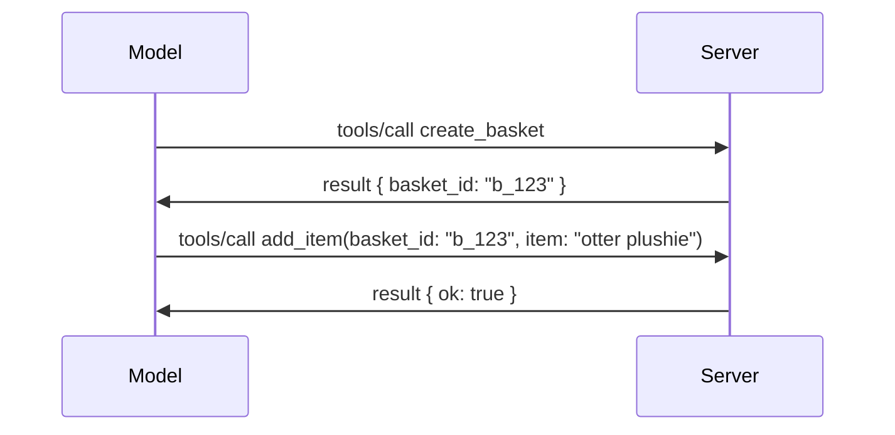

# Kas keičiasi MCP: 2026-07-28 Leidimo kandidatas

> **Būsena:** Leidimo kandidatas. `2026-07-28` specifikacija šiame rašymo etape nėra galutinė. Ji buvo paskelbta 2026 m. gegužės 21 d. ir numatyta išleisti 2026 m. liepos 28 d. Viskas šiame pamokame aprašyta pagal leidimo kandidatą; prieš kurdami pagal ją, patikrinkite [projekto specifikaciją](https://modelcontextprotocol.io/specification/draft) ir jos [pakeitimų žurnalą](https://modelcontextprotocol.io/specification/draft/changelog) naujausią būseną. Likusi šio kurso dalis parašyta remiantis dabartiniu stabiliu leidimu, **MCP Specifikacija 2025-11-25**, ir bus atnaujinta po `2026-07-28` išleidimo.

## Apžvalga

`2026-07-28` – didžiausias MCP pataisymas nuo jos paleidimo. Šeši specifikacijos patobulinimo pasiūlymai (SEP) pašalina protokolo lygio sesijas ir daro MCP bevalentį transporto sluoksnyje, plėtiniai tampa pirmos klasės, su versijomis mechanizmu, ir keletas funkcijų, kurias anksčiau mokėtės šiame kursu (Šaknys, Imimas, Registravimas) pažymimos pasenusiomis pagal naują gyvavimo ciklo politiką. Ši pamoka apibendrina, kas keičiasi, kodėl tai svarbu ir ką tai reiškia kodui, kurį jau parašėte remdamiesi `2025-11-25`.

Šaltinis: [2026-07-28 MCP Specifikacijos Leidimo Kandidatas](https://blog.modelcontextprotocol.io/posts/2026-07-28-release-candidate/) (Model Context Protocol tinklaraštis, David Soria Parra ir Den Delimarsky).

## Mokymosi tikslai

Pamokos pabaigoje sugebėsite:

- Paaiškinti, kodėl MCP pereina prie bevalentės protokolo branduolio ir kokią problemą tai sprendžia horizontaliai išplėstose diegimuose.
- Apibūdinti, kaip pakeičiami `initialize`/`initialized` rankų paspaudimas ir `Mcp-Session-Id` antraštė.
- Nustatyti naujas antraštes `Mcp-Method` ir `Mcp-Name` bei `ttlMs`/`cacheScope` talpyklos metaduomenis.
- Atpažinti Plėtinių sistemą ir du šiam leidimui priklausančius plėtinius: MCP Apps ir Tasks.
- Išvardyti šešis autorizacijos SEP, kurie sustiprina OAuth 2.0 / OIDC suderinamumą.
- Nustatyti, kurios pagrindinės funkcijos (Šaknys, Imimas, Registravimas) dabar yra pasenusios ir ką tai reiškia praktikoje.
- Paaiškinti išsamų JSON schemos 2020-12 pakeitimą įrankių `inputSchema`/`outputSchema`.

## Bevalentis protokolas

Pagrindinis pakeitimas: MCP tampa bevalente protokolo lygyje.

### Prieš (2025-11-25): sesijos prijungia jus prie konkretaus serverio egzemplioriaus

Įrankio kvietimas per Streamable HTTP prasideda `initialize` rankų paspaudimu. Serveris atsako su `Mcp-Session-Id` antrašte, kurią privalo nešioti kiekvienas vėlesnis užklausimas:

```http
POST /mcp HTTP/1.1
Mcp-Session-Id: 1868a90c-3a3f-4f5b
Content-Type: application/json

{"jsonrpc":"2.0","id":2,"method":"tools/call",
 "params":{"name":"search","arguments":{"q":"otters"}}}
```

Kadangi sesija pririšta prie serverio egzemplioriaus, kuris ją išdavė, horizontaliai išplėsti diegimai reikalauja **klijuojamo maršrutizavimo** apkrovos balansavimo lygyje ir **bendros sesijų saugyklos** tarp egzempliorių.

### Po (2026-07-28): kiekvienas užklausimas yra savarankiškas

```http
POST /mcp HTTP/1.1
MCP-Protocol-Version: 2026-07-28
Mcp-Method: tools/call
Mcp-Name: search
Content-Type: application/json

{"jsonrpc":"2.0","id":1,"method":"tools/call",
 "params":{"name":"search","arguments":{"q":"otters"},
           "_meta":{"io.modelcontextprotocol/clientInfo":{"name":"my-app","version":"1.0"}}}}
```

Bet kuris serverio egzempliorius gali apdoroti šį užklausimą. Pagrindiniai pakeitimai:

- **Pašalinamas `initialize`/`initialized` rankų paspaudimas** ([SEP-2575](https://github.com/modelcontextprotocol/modelcontextprotocol/pull/2575)). Protokolo versija, kliento informacija ir galimybės perkeliamos į `_meta` kiekviename užklausoje. Naujas metodas `server/discover` leidžia klientui iš anksto gauti serverio galimybes, kai jų reikia.
- **Pašalinama `Mcp-Session-Id` antraštė ir protokolo lygio sesija** ([SEP-2567](https://github.com/modelcontextprotocol/modelcontextprotocol/pull/2567)). Klijuojamas maršrutizavimas ir bendros sesijų saugyklos protokolo lygyje nebereikalingos.

### Bevalentis protokolas, būseną saugančios programos

Pašalinus protokolo lygio sesiją, serveris gali ir toliau būti būseną saugantis. Rekomenduojama praktika tokia pati, kokią HTTP API visada naudojo: sugeneruoti aiškų valdiklį (pvz., `basket_id`, `browser_id`) iš vieno įrankio kvietimo, o modelis perduoda tą valdiklį tolesniuose kvietimuose kaip įprastą argumentą.



Tai leidžia būseną padaryti matomą ir prasmingą modeliui, o ne paslėpti transporto metaduomenyse, ir leidžia bet kuriam serverio egzemplioriui apdoroti bet kokį kvietimą.

### Serverio į kliento užklausas pertvarkytos

Bevalentis protokolas vis tiek turi būdą, kaip serveris gali tarpinio kvietimo metu paklausti kliento (pvz., paklausimą paskatinti):

- **Serverio inicijuotos užklausos gali būti siunčiamos tik tuo metu, kai serveris aktyviai apdoroja kliento užklausą** ([SEP-2260](https://github.com/modelcontextprotocol/modelcontextprotocol/pull/2260)) — anksčiau tai buvo rekomendacija, dabar būtina. Vartotojas niekada nėra klausiama iš niekur.
- **Daugkarto užklausų ritmai** ([SEP-2322](https://github.com/modelcontextprotocol/modelcontextprotocol/pull/2322)) pakeičia SSE srauto laikymą atidarytą. Vietoj to serveris grąžina `InputRequiredResult`:

  ```json
  {
    "resultType": "inputRequired",
    "inputRequests": {
      "confirm": {
        "type": "elicitation",
        "message": "Delete 3 files?",
        "schema": { "type": "boolean" }
      }
    },
    "requestState": "eyJzdGVwIjoxLCJmaWxlcyI6WyJhIiwiYiIsImMiXX0="
  }
  ```

  Klientas surenka atsakymus ir pakartoja pradinį kvietimą su `inputResponses` ir atkartotu `requestState`. Bet kuris serverio egzempliorius gali priimti pakartotinį kvietimą, nes visas reikalingas informaciją turi žinutės krovinys.

### Maršrutuojama, talpinama į talpyklą, stebima

Trys smulkūs pakeitimai palengvina bevalentiškos eismo operacijas:

- **`Mcp-Method` ir `Mcp-Name` antraštės yra privalomos Streamable HTTP** ([SEP-2243](https://github.com/modelcontextprotocol/modelcontextprotocol/pull/2243)), todėl apkrovos balansavimo įrenginiai, vartai ir ribotuvai gali maršrutuoti pagal operaciją be JSON turinio tikrinimo. Serveriai atmeta užklausas, kur antraštės ir turinys nesutampa.
- **`tools/list` ir resursų nuskaitymo rezultatai turi `ttlMs` ir `cacheScope`** ([SEP-2549](https://github.com/modelcontextprotocol/modelcontextprotocol/pull/2549)), modeliuojant HTTP `Cache-Control`. Klientai žino, kiek ilgai rezultatas yra šviežias ir ar jį saugu bendrinti tarp vartotojų, nereikalaudami ilgo SSE srauto norint sužinoti apie pakeitimus.
- **W3C Trace Context perdavimas `_meta` dokumentuotas** ([SEP-414](https://github.com/modelcontextprotocol/modelcontextprotocol/pull/414)), ištaisant `traceparent`, `tracestate` ir `baggage` raktų pavadinimus, kad paskirstytas stebėjimas galėtų sekti kvietimą per kliento SDK, MCP serverį ir žemesnio lygio sistemas [OpenTelemetry](https://opentelemetry.io/) suderinamoje aplinkoje.

## Plėtiniai tampa pirmos klasės objektais

Plėtiniai neformaliai egzistavo `2025-11-25`. [SEP-2133](https://github.com/modelcontextprotocol/modelcontextprotocol/pull/2133) juos formalizuoja:

- Plėtiniai identifikuojami pagal atvirkštinį DNS ID.
- Jie derinami per `extensions` žemėlapį kliento ir serverio galimybėse.
- Jie yra savo atskiruose `ext-*` saugyklose su deleguotais prižiūrėtojais ir nepriklauso nuo pagrindinės specifikacijos versijų.
- Naujas SEP procese Plėtinių takas suteikia kelią nuo eksperimentinių iki oficialių.

Šiame leidime pristatomi du oficialūs plėtiniai.

### MCP Apps: serverio generuojamos vartotojo sąsajos

[MCP Apps](https://blog.modelcontextprotocol.io/posts/2026-01-26-mcp-apps/) ([SEP-1865](https://github.com/modelcontextprotocol/modelcontextprotocol/pull/1865)) leidžia serveriams pristatyti interaktyvias HTML sąsajas, kurias šeimininkai atvaizduoja izoliuotame iframe. Įrankiai iš anksto deklaruoja savo UI šablonus, kad šeimininkai galėtų juos iš anksto paimti, įrašyti į talpyklą ir peržiūrėti saugumo požiūriu prieš paleidimą. Jūs jau susipažinote su šio pagrindais [Pamokoje 15: MCP Apps](../03-GettingStarted/15-mcp-apps/README.md) – pagal Plėtinių sistemą MCP Apps dabar yra oficialiai plėtinys, o ne eksperimentinė pagrindinė funkcija.

### Tasks tampa plėtiniu

Tasks buvo pristatytas kaip eksperimentinė pagrindinė funkcija `2025-11-25`. Produkcijos naudojimas atskleidė tiek daug pertvarkymų, kad tinkama vieta jam yra plėtinys: [Tasks plėtinys](https://github.com/modelcontextprotocol/modelcontextprotocol/pull/2663) keičia gyvavimo ciklą pagal bevalentį modelį – serveris gali atsakyti į `tools/call` su užduoties valdikliu, o klientas valdo užduotį per `tasks/get`, `tasks/update` ir `tasks/cancel`. Užduoties kūrimas yra serverio valdomas: klientas reklamuoja plėtinį, o serveris nusprendžia, kada kvietimas vykdomas kaip užduotis. `tasks/list` visiškai pašalinamas, nes jo saugus apribojimas be sesijų neįmanomas.

> **Migracijos pastaba:** jei įdiegėte eksperimentinį `2025-11-25` Tasks API, turėsite migraciją į naują plėtinio gyvavimo ciklą – jis nėra suderinamas atgaline tvarka.

## Autorizacijos sustiprinimas

Šeši SEP sustiprina [autorizacijos specifikaciją](https://modelcontextprotocol.io/specification/draft/basic/authorization), kad ji artimiau atitiktų realaus pasaulio OAuth 2.0 / OpenID Connect diegimus:

| SEP | Pakeitimas |
|---|---|
| [SEP-2468](https://github.com/modelcontextprotocol/modelcontextprotocol/pull/2468) | Klientai privalo patvirtinti `iss` parametrą autorizacijos atsakymuose pagal [RFC 9207](https://www.rfc-editor.org/rfc/rfc9207), taip mažindami maišymo atakų riziką, būdingą MCP vieno kliento, daug serverių modeliui. Būsima versija reikalauja atmesti atsakymus be `iss`. |
| [SEP-837](https://github.com/modelcontextprotocol/modelcontextprotocol/pull/837) | Klientai deklaruoja savo OpenID Connect `application_type` dinaminės kliento registracijos metu, vengiant, kad autorizacijos serveriai numatytų stalinių/CLI klientą kaip `"web"` ir atmestų jo localhost peradresavimo URI. |
| [SEP-2352](https://github.com/modelcontextprotocol/modelcontextprotocol/pull/2352) | Klientai susieja registruotus kredencialus su autorizacijos serverio `issuer` ir registruojasi iš naujo, kai išteklis perkeliamos tarp serverių. |
| [SEP-2207](https://github.com/modelcontextprotocol/modelcontextprotocol/pull/2207) | Aprašo, kaip kreiptis dėl atnaujinimo žetonų iš OpenID Connect tipo autorizacijos serverių. |
| [SEP-2350](https://github.com/modelcontextprotocol/modelcontextprotocol/pull/2350) | Paaiškina apimtį (scope) patvirtinimo metu, einant į aukštesnį leidimų lygį. |
| [SEP-2351](https://github.com/modelcontextprotocol/modelcontextprotocol/pull/2351) | Paaiškina `.well-known` atradimo sufiksą. |

Jei šiandien kuriate MCP autorizacijos serverį, pradėkite dabar teikti `iss` autorizacijos atsakymuose – žr. [02-Security](../02-Security/README.md) dėl esamos autorizacijos gairių, kurias tai papildys.

## Šaknys, Imimas ir Registravimas yra pasenę

Pagal naują [funkcijų gyvavimo ciklo politiką](https://github.com/modelcontextprotocol/modelcontextprotocol/pull/2577) ([SEP-2577](https://github.com/modelcontextprotocol/modelcontextprotocol/pull/2577)), trys pagrindiniai kliento pradai, kuriuos išmokote [Pagrindinių Koncepcijų](./README.md#roots) skyriuje, pereina į **Pasenusių** statusą:

| Funkcija | Rekomenduojamas pakaitalas |
|---|---|
| Šaknys | Įrankių parametrai, išteklių URI arba serverio konfigūracija |
| Imimas | Tiesioginė integracija su LLM tiekėjų API |
| Registravimas | `stderr` stdio transportams; OpenTelemetry struktūrizuotam stebėjimui |

Tai yra **tik anotacijų pasenimas**: metodai, tipai ir galimybių žymės veikia šiame leidime ir kiekvienoje specifikacijos versijoje, išleistoje per metus po jo. Bet koks jų pašalinimas reikalautų atskiro SEP pagal gyvavimo ciklo politiką – taigi jūsų esami [Imimo](../03-GettingStarted/14-sampling/README.md) pavyzdžiai šiandien neveiks, bet nauji serveriai turėtų pirmenybę teikti aukščiau pateiktiems pakaitalams.

## Pilnas JSON Schema 2020-12 įrankiams

Įrankių `inputSchema` ir `outputSchema` dabar yra pilno [JSON Schema 2020-12](https://json-schema.org/draft/2020-12) versijos ([SEP-2106](https://github.com/modelcontextprotocol/modelcontextprotocol/pull/2106)):

- Įvesties schemos išlaiko `type: "object"` šakninę apribojimą, bet dabar leidžia sudėtinius tipus (`oneOf`, `anyOf`, `allOf`), sąlygas ir nuorodas (`$ref`, `$defs`).
- Išvesties schemos yra neribotos, o `structuredContent` dabar gali būti bet kokia JSON reikšmė, ne tik objektas.
- Įgyvendinimai neturi automatiškai dereferecuoti išorinių `$ref` URI ir turėtų riboti schemos gylį bei validacijos laiką (paslaugų atsisakymo apsvarstymas serverio pusėje).

Atskirai, klaidos kodas dėl trūkstamo resurso keičiasi iš MCP specifinio `-32002` į JSON-RPC standartą `-32602` (Neteisingi parametrai) ([SEP-2164](https://github.com/modelcontextprotocol/modelcontextprotocol/pull/2164)). Jei jūsų klientas tikrina literalią reikšmę `-32002`, reikės jį atnaujinti.

## Kaip protokolas vystosi toliau

Šiame leidime yra sulaužančių pakeitimų, kurių MCP priežiūros komanda neplanuoja daryti norma ateityje. Trys valdymo SEP siekia užkirsti kelią pakartojimui:

- **Funkcijų gyvavimo ciklo politika** suteikia kiekvienai funkcijai kelią nuo Aktyvios → Pasenusios → Pašalintos su mažiausiai dvylikos mėnesių intervalu tarp pasenimo ir ankstyviausio galimo pašalinimo.
- **Plėtinių sistema** leidžia naujoms galimybėms pirmiausia būti įtrauktoms kaip pasirenkami plėtiniai ir ten stabilizuotis prieš (jei apskritai) patekiant į pagrindinę specifikaciją.

- Standartų takelio SEP nebegali pasiekti Galutinio statuso, kol atitinkamas scenarijus nepateks į [suderinamumo paketą](https://github.com/modelcontextprotocol/conformance) ([SEP-2484](https://github.com/modelcontextprotocol/modelcontextprotocol/pull/2484)) — tą patį paketą, su kuriuo [SDK sluoksnių sistema](https://github.com/modelcontextprotocol/modelcontextprotocol/pull/1777) vertina oficialius SDK.

## Leidimo laiko planas ir patikra

- Leidimo kandidatas buvo užrakintas 2026 m. gegužės 21 d.
- Galutinė specifikacija suplanuota 2026 m. liepos 28 d.
- Dešimties savaičių laikotarpis tarp šių dviejų leidžia SDK priežiūros komandoms ir klientų diegėjams patikrinti pakeitimus realiose apkrovose; 1 lygio SDK tikimasi, kad palaikymą išleis per šį laikotarpį pagal [SDK sluoksnių sistemą](https://modelcontextprotocol.io/docs/sdk).
- Sekite visą pakeitimų rinkinį [projektinėje specifikacijoje](https://modelcontextprotocol.io/specification/draft) ir jos [pakeitimų žurnale](https://modelcontextprotocol.io/specification/draft/changelog).

## Ką tai reiškia šiai mokymo programai

Visa, ko išmokote iki šiol šiame kurse, taikoma **2025-11-25** versijai, kuri išlieka dabartine stabiliąja specifikacija iki `2026-07-28`. Konkretizuojant:

- **Seansai ir `initialize` rankos paspaudimas** (aptarta [Pagrindinėse sąvokose](./README.md) ir [Pamokoje 6: HTTP srautinimas](../03-GettingStarted/06-http-streaming/README.md)) vis dar veikia kaip aprašyta šiandien, tačiau tikimasi, kad juos pakeis bevaldis užklausos modelis aukščiau, kai atnaujinsite SDK, suderinamus su `2026-07-28`.
- **Imtuvai ir Šaknys** (taip pat aptarta [Pagrindinėse sąvokose](./README.md)) lieka visiškai funkcionalūs, bet yra pasenę — naujieji dizainai turėtų rinktis aukščiau nurodytus pakaitinius modelius.
- **Eksperimentinė Užduočių funkcija**, jei ją naudojote, reiks migruoti į Užduočių plėtinio naują gyvavimo ciklą.
- **MCP programėlės** ([Pamoka 15](../03-GettingStarted/15-mcp-apps/README.md)) praktiškai nepasikeičia; jos tiesiog perkeliamos į oficialią Plėtinių sistemą.

## Papildomi ištekliai

- [2026-07-28 MCP specifikacijos leidimo kandidatas (tinklaraščio įrašas)](https://blog.modelcontextprotocol.io/posts/2026-07-28-release-candidate/)
- [MCP transportų ateitis](https://blog.modelcontextprotocol.io/posts/2025-12-19-mcp-transport-future/)
- [MCP projektinė specifikacija](https://modelcontextprotocol.io/specification/draft)
- [MCP pakeitimų žurnalas](https://modelcontextprotocol.io/specification/draft/changelog)
- [SEP gairės](https://modelcontextprotocol.io/community/sep-guidelines)
- [MCP SDK sluoksnių sistema](https://modelcontextprotocol.io/docs/sdk)

## Kiti žingsniai

Grįžkite į [Pagrindines sąvokas](./README.md) arba tęskite į [Saugumą](../02-Security/README.md), kad pamatytumėte, kaip dabartinės `2025-11-25` gairės atitinka tai, kas ateina.

---

<!-- CO-OP TRANSLATOR DISCLAIMER START -->
**Atsakomybės apribojimas**:
Šis dokumentas buvo išverstas naudojant dirbtinio intelekto vertimo paslaugą [Co-op Translator](https://github.com/Azure/co-op-translator). Nors siekiame tikslumo, prašome atkreipti dėmesį, kad automatiniai vertimai gali turėti klaidų ar netikslumų. Originalus dokumentas jo gimtąja kalba laikomas autoritetingu šaltiniu. Svarbiai informacijai rekomenduojama naudoti profesionalų žmogiškąjį vertimą. Mes neatsakome už jokius nesusipratimus ar neteisingą interpretaciją, kilusią naudojantis šiuo vertimu.
<!-- CO-OP TRANSLATOR DISCLAIMER END -->