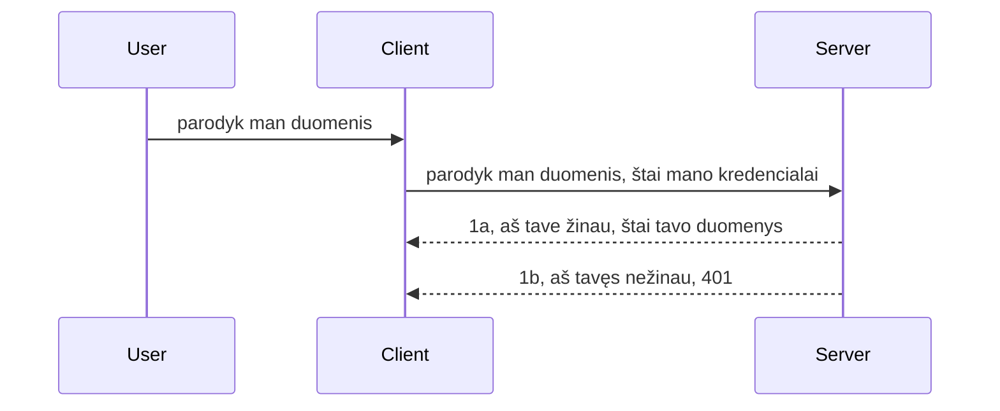

# Paprastas autentifikavimas

MCP SDK palaiko OAuth 2.1 naudojimą, kuri, tiesą sakant, yra gana sudėtingas procesas, apimantis tokias sąvokas kaip autentifikavimo serveris, resursų serveris, kredencialų siuntimas, kodo gavimas, kodo keitimas į nešėjo ženklą, kol galiausiai galite gauti savo resursų duomenis. Jei nesate įpratę prie OAuth, kuris yra puikus dalykas įgyvendinti, gera pradėti nuo paprastesnio autentifikavimo lygio ir palaipsniui kurti geresnį saugumą. Todėl egzistuoja šis skyrius – kad supažindintų jus su pažangesniu autentifikavimu.

## Autentifikavimas, ką tai reiškia?

Autentifikavimas yra trumpinys nuo autentifikacijos ir autorizacijos. Idėja yra ta, kad mums reikia atlikti du veiksmus:

- **Autentifikacija**, tai procesas, kurio metu nusprendžiama, ar leidžiame asmeniui patekti į mūsų namus, ar jis turi teisę būti „čia“, t.y. turėti prieigą prie mūsų resursų serverio, kur veikia mūsų MCP serverio funkcijos.
- **Autorizacija**, tai procesas, kurio metu nustatoma, ar vartotojas turėtų turėti prieigą prie konkrečių išteklių, kurių jis prašo, pavyzdžiui, užsakymų ar produktų, arba ar jam leidžiama skaityti turinį, bet ne ištrinti, kaip kitas pavyzdys.

## Kredencialai: kaip mes sakome sistemai, kas mes esame

Na, dauguma žiniatinklio kūrėjų pradeda mąstyti apie kredencialo pateikimą serveriui, paprastai slapreto, kuris nurodo, ar jie leidžiami būti čia („Autentifikacija“). Šis kredencialas paprastai būna base64 koduota vartotojo vardo ir slaptažodžio versija arba API raktas, kuris unikalus identifikuoja konkretų vartotoją.

Tai apima siuntimą per antraštę pavadinimu „Authorization“ taip:

```json
{ "Authorization": "secret123" }
```

Tai paprastai vadinama baziniu autentifikavimu. Bendras srautas veikia taip:



Dabar, kai suprantame, kaip tai veikia iš srauto požiūrio taško, kaip tai įgyvendinti? Na, dauguma žiniatinklio serverių turi tokį dalyką kaip tarpinė programa (middleware), kodo dalį, kuri vykdoma kaip užklausos dalis ir gali patikrinti kredencialus, ir jei jie galioja, leidžia užklausai pereiti. Jei užklausa neturi galiojančių kredencialų, gaunate autentifikavimo klaidą. Pažiūrėkime, kaip tai galima įgyvendinti:

**Python**

```python
class AuthMiddleware(BaseHTTPMiddleware):
    async def dispatch(self, request, call_next):

        has_header = request.headers.get("Authorization")
        if not has_header:
            print("-> Missing Authorization header!")
            return Response(status_code=401, content="Unauthorized")

        if not valid_token(has_header):
            print("-> Invalid token!")
            return Response(status_code=403, content="Forbidden")

        print("Valid token, proceeding...")
       
        response = await call_next(request)
        # pridėti bet kokius kliento antraštes arba kokiu nors būdu pakeisti atsakymą
        return response


starlette_app.add_middleware(CustomHeaderMiddleware)
```

Čia mes turime:

- Sukūrėme tarpinę programą pavadinimu `AuthMiddleware`, kurios `dispatch` metodas kviečiamas per žiniatinklio serverį.
- Pridėjome tarpinę programą prie žiniatinklio serverio:

    ```python
    starlette_app.add_middleware(AuthMiddleware)
    ```

- Parašėme validacijos logiką, kuri tikrina, ar yra Authorization antraštė ir ar siunčiamas slaptas kodas yra galiojantis:

    ```python
    has_header = request.headers.get("Authorization")
    if not has_header:
        print("-> Missing Authorization header!")
        return Response(status_code=401, content="Unauthorized")

    if not valid_token(has_header):
        print("-> Invalid token!")
        return Response(status_code=403, content="Forbidden")
    ```

Jei slaptas kodas yra pateiktas ir galiojantis, leidžiame užklausai pereiti kviesdami `call_next` ir grąžiname atsakymą.

    ```python
    response = await call_next(request)
    # pridėti bet kokius kliento antraštes arba pakeisti atsakymą tam tikru būdu
    return response
    ```

Tai veikia taip, kad jei vykdoma žiniatinklio užklausa į serverį, tarpinė programa yra kviečiama ir pagal jos įgyvendinimą ji arba leis užklausai pereiti, arba grąžins klaidą, kad klientui neleista tęsti.

**TypeScript**

Čia mes kuriame tarpinę programą su populiaria sistema Express ir gaudome užklausą, kol ji pasiekia MCP serverį. Štai kodo pavyzdys:

```typescript
function isValid(secret) {
    return secret === "secret123";
}

app.use((req, res, next) => {
    // 1. Ar yra autorizacijos antraštė?
    if(!req.headers["Authorization"]) {
        res.status(401).send('Unauthorized');
    }
    
    let token = req.headers["Authorization"];

    // 2. Patikrinkite galiojimą.
    if(!isValid(token)) {
        res.status(403).send('Forbidden');
    }

   
    console.log('Middleware executed');
    // 3. Pateikia užklausą kitam užklausos apdorojimo etapui.
    next();
});
```

Šiame kode mes:

1. Tikriname, ar iš viso yra Authorization antraštė, jei jos nėra, siunčiame 401 klaidą.
2. Užtikriname, kad kredencialas/ženklas yra galiojantis; jei ne, siunčiame 403 klaidą.
3. Galiausiai leidžiame užklausai tęsti užklausų vamzdyne ir grąžiname prašomą resursą.

## Užduotis: Įgyvendinkite autentifikavimą

Išnaudokime savo žinias ir pabandykime tai įgyvendinti. Planas:

Serveris

- Sukurkite žiniatinklio serverį ir MCP instanciją.
- Įgyvendinkite tarpinę programą serveriui.

Klientas

- Siųskite žiniatinklio užklausą su kredencialu antraštėje.

### -1- Sukurkite žiniatinklio serverį ir MCP instanciją

> **Žiūrint į priekį:** tam TypeScript pavyzdyje žemiau HTTP transportai sekami „transports“ žemėlapyje, kurio raktas yra `mcp-session-id`, pagal **MCP Specifikaciją 2025-11-25**. `2026-07-28` versijos kandidatas panaikina „initialize“ pakalbėjimą ir sesijos ID iš viso, todėl šis pagal sesiją transporto žemėlapis panaikinamas vietoj bevalentės, savarankiškos užklausos. Daugiau informacijos žr. [Kas keičiasi MCP: 2026-07-28 versijos kandidatas](../../01-CoreConcepts/mcp-2026-07-28-release-candidate.md).

Pirmajame žingsnyje turime sukurti žiniatinklio serverio instanciją ir MCP serverį.

**Python**

Čia kuriame MCP serverio instanciją, kuriame starlette web programėlę ir talpiname ją uvicorn.

```python
# kuriamas MCP serveris

app = FastMCP(
    name="MCP Resource Server",
    instructions="Resource Server that validates tokens via Authorization Server introspection",
    host=settings["host"],
    port=settings["port"],
    debug=True
)

# kuriama starlette interneto programa
starlette_app = app.streamable_http_app()

# diegiama programa per uvicorn
async def run(starlette_app):
    import uvicorn
    config = uvicorn.Config(
            starlette_app,
            host=app.settings.host,
            port=app.settings.port,
            log_level=app.settings.log_level.lower(),
        )
    server = uvicorn.Server(config)
    await server.serve()

run(starlette_app)
```

Šiame kode mes:

- Sukuriame MCP serverį.
- Sukonstruojame starlette web programėlę iš MCP serverio, `app.streamable_http_app()`.
- Talpiname ir valdome web programėlę naudojant uvicorn `server.serve()`.

**TypeScript**

Čia kuriame MCP serverio instanciją.

```typescript
const server = new McpServer({
      name: "example-server",
      version: "1.0.0"
    });

    // ... paruošti serverio išteklius, įrankius ir užklausas ...
```

Šis MCP serverio kūrimas turi vykti mūsų POST /mcp maršruto apibrėžime, todėl paimsime aukščiau esantį kodą ir perkelsime taip:

```typescript
import express from "express";
import { randomUUID } from "node:crypto";
import { McpServer } from "@modelcontextprotocol/sdk/server/mcp.js";
import { StreamableHTTPServerTransport } from "@modelcontextprotocol/sdk/server/streamableHttp.js";
import { isInitializeRequest } from "@modelcontextprotocol/sdk/types.js"

const app = express();
app.use(express.json());

// Žemėlapis transportui saugoti pagal sesijos ID
const transports: { [sessionId: string]: StreamableHTTPServerTransport } = {};

// Apdoroti POST užklausas klientas-serveris komunikacijai
app.post('/mcp', async (req, res) => {
  // Patikrinti, ar sesijos ID jau egzistuoja
  const sessionId = req.headers['mcp-session-id'] as string | undefined;
  let transport: StreamableHTTPServerTransport;

  if (sessionId && transports[sessionId]) {
    // Pakartotinai naudoti esamą transportą
    transport = transports[sessionId];
  } else if (!sessionId && isInitializeRequest(req.body)) {
    // Naujas inicializacijos užklausimas
    transport = new StreamableHTTPServerTransport({
      sessionIdGenerator: () => randomUUID(),
      onsessioninitialized: (sessionId) => {
        // Saugoti transportą pagal sesijos ID
        transports[sessionId] = transport;
      },
      // DNS peradresavimo apsauga pagal nutylėjimą išjungta dėl atgalinio suderinamumo. Jei paleidžiate šį serverį
      // lokaliai, būtinai nustatykite:
      // enableDnsRebindingProtection: true,
      // allowedHosts: ['127.0.0.1'],
    });

    // Išvalyti transportą uždarius
    transport.onclose = () => {
      if (transport.sessionId) {
        delete transports[transport.sessionId];
      }
    };
    const server = new McpServer({
      name: "example-server",
      version: "1.0.0"
    });

    // ... nustatyti serverio išteklius, įrankius ir užklausas ...

    // Prisijungti prie MCP serverio
    await server.connect(transport);
  } else {
    // Neteisinga užklausa
    res.status(400).json({
      jsonrpc: '2.0',
      error: {
        code: -32000,
        message: 'Bad Request: No valid session ID provided',
      },
      id: null,
    });
    return;
  }

  // Apdoroti užklausą
  await transport.handleRequest(req, res, req.body);
});

// Pakartotinai naudojamas tvarkytojas GET ir DELETE užklausoms
const handleSessionRequest = async (req: express.Request, res: express.Response) => {
  const sessionId = req.headers['mcp-session-id'] as string | undefined;
  if (!sessionId || !transports[sessionId]) {
    res.status(400).send('Invalid or missing session ID');
    return;
  }
  
  const transport = transports[sessionId];
  await transport.handleRequest(req, res);
};

// Apdoroti GET užklausas serveris-klientas pranešimams per SSE
app.get('/mcp', handleSessionRequest);

// Apdoroti DELETE užklausas sesijos nutraukimui
app.delete('/mcp', handleSessionRequest);

app.listen(3000);
```

Dabar matote, kaip MCP serverio kūrimas buvo perkeltas į `app.post("/mcp")`.

Pereikime prie kito žingsnio – sukurti tarpinę programą, kad galėtume patikrinti atėjusius kredencialus.

### -2- Įgyvendinkite tarpinę programą serveriui

Toliau sukursime tarpinę programą, kuri ieškos kredencialo `Authorization` antraštėje ir jį tikrins. Jei jis priimtinas, užklausa toliau vykdys tai, ką reikia (pvz., įrašys įrankius, perskaitys resursą ar kokią nors MCP funkciją, kurios klientas prašė).

**Python**

Norėdami sukurti tarpinę programą, turime įkurti klasę, kuri paveldi iš `BaseHTTPMiddleware`. Yra du įdomūs elementai:

- Užklausa `request`, iš kurios skaitome antraštės informaciją.
- `call_next` yra atgalinis skambutis, kurį reikia iškviesti, jei klientas pateikė priimtiną kredencialą.

Pirmiausia turime apdoroti situaciją, kai `Authorization` antraštė trūksta:

```python
has_header = request.headers.get("Authorization")

# antraštė nėra, atsisakyti su 401, kitu atveju tęsti.
if not has_header:
    print("-> Missing Authorization header!")
    return Response(status_code=401, content="Unauthorized")
```

Čia siunčiame 401 neautorizuoto pranešimą, nes klientas nepavyksta autentifikuotis.

Tada, jei buvo pateiktas kredencialas, turime patikrinti jo galiojimą taip:

```python
 if not valid_token(has_header):
    print("-> Invalid token!")
    return Response(status_code=403, content="Forbidden")
```

Atkreipkite dėmesį, kad aukščiau siunčiame 403 draudžiamo pranešimą. Pažiūrėkime pilną tarpinės programos įgyvendinimą žemiau, kuriį aprašėme:

```python
class AuthMiddleware(BaseHTTPMiddleware):
    async def dispatch(self, request, call_next):

        has_header = request.headers.get("Authorization")
        if not has_header:
            print("-> Missing Authorization header!")
            return Response(status_code=401, content="Unauthorized")

        if not valid_token(has_header):
            print("-> Invalid token!")
            return Response(status_code=403, content="Forbidden")

        print("Valid token, proceeding...")
        print(f"-> Received {request.method} {request.url}")
        response = await call_next(request)
        response.headers['Custom'] = 'Example'
        return response

```

Puiku, o kaip dėl `valid_token` funkcijos? Ji pateikta žemiau:

```python
# NENAUDOKITE gamyboje - patobulinkite tai !!
def valid_token(token: str) -> bool:
    # pašalinkite "Bearer " priešdėlį
    if token.startswith("Bearer "):
        token = token[7:]
        return token == "secret-token"
    return False
```

Šią funkciją, žinoma, reikėtų tobulinti.

SVARBU: Tokios paslapties kaip ši NIEKADA nereikėtų laikyti tiesiog kode. Vertę, su kuria lyginsite, geriausia gauti iš duomenų šaltinio arba identifikacijos paslaugų tiekėjo (IDP), arba dar geriau, leisti IDP atlikti patvirtinimą.

**TypeScript**

Norint įgyvendinti tai su Express, reikia naudoti `use` metodą, kuris priima tarpinės programos funkcijas.

Reikia:

- Sąveikauti su užklausa ir tikrinti perduotą kredencialą `Authorization` savyje.
- Patikrinti kredencialą ir, jei jis galiojantis, leisti užklausai tęsti ir leisti kliento MCP užklausai atlikti savo funkciją (pvz., įrašyti įrankius, skaityti resursą ar kt).

Čia tikriname, ar yra `Authorization` antraštė ir jei jos nėra, sustabdome užklausą:

```typescript
if(!req.headers["authorization"]) {
    res.status(401).send('Unauthorized');
    return;
}
```

Jei antraštė visiškai nepateikta, gaunate 401.

Toliau tikriname, ar kredencialas galiojantis, jei ne – vėl sustabdome užklausą, bet su šiek tiek kita žinute:

```typescript
if(!isValid(token)) {
    res.status(403).send('Forbidden');
    return;
} 
```

Atkreipkite dėmesį, dabar gaunate 403 klaidą.

Čia visas kodas pilnai:

```typescript
app.use((req, res, next) => {
    console.log('Request received:', req.method, req.url, req.headers);
    console.log('Headers:', req.headers["authorization"]);
    if(!req.headers["authorization"]) {
        res.status(401).send('Unauthorized');
        return;
    }
    
    let token = req.headers["authorization"];

    if(!isValid(token)) {
        res.status(403).send('Forbidden');
        return;
    }  

    console.log('Middleware executed');
    next();
});
```

Nustatėme žiniatinklio serverį priimti tarpinę programą, kuri tikrina kredencialą, kurį klientas tikisi mums atsiųsti. O kaip su pačiu klientu?

### -3- Siųskite žiniatinklio užklausą su kredencialu antraštėje

Turime užtikrinti, kad klientas perduoda kredencialą per antraštę. Kadangi naudosime MCP klientą, turime išsiaiškinti, kaip tai daroma.

**Python**

Klientui turime perduoti antraštę su savo kredencialu taip:

```python
# NENUSTATYKITE reikšmės tiesiogiai, bent jau laikykite ją aplinkos kintamajame arba saugesnėje saugykloje
token = "secret-token"

async with streamablehttp_client(
        url = f"http://localhost:{port}/mcp",
        headers = {"Authorization": f"Bearer {token}"}
    ) as (
        read_stream,
        write_stream,
        session_callback,
    ):
        async with ClientSession(
            read_stream,
            write_stream
        ) as session:
            await session.initialize()
      
            # TODO, ką norite atlikti kliente, pvz., įrankių sąrašo rodymas, įrankių kvietimas ir pan.
```

Atkreipkite dėmesį, kaip užpildome `headers` taip: `headers = {"Authorization": f"Bearer {token}"}`.

**TypeScript**

Galime tai padaryti dviem žingsniais:

1. Užpildyti konfigūracijos objektą mūsų kredencialu.
2. Perdavimo objektui perduoti konfigūracijos objektą.

```typescript

// NENAUDOJITE griežtai užkoduotos reikšmės, kaip parodyta čia. Bent jau laikykite ją kaip aplinkos kintamąjį ir naudokite kažką panašaus į dotenv (plėtros režimu).
let token = "secret123"

// apibrėžkite kliento transporto parinkčių objektą
let options: StreamableHTTPClientTransportOptions = {
  sessionId: sessionId,
  requestInit: {
    headers: {
      "Authorization": "secret123"
    }
  }
};

// perduokite parinkčių objektą transportui
async function main() {
   const transport = new StreamableHTTPClientTransport(
      new URL(serverUrl),
      options
   );
```

Čia matote aukščiau, kaip turėjome sukurti `options` objektą ir mūsų antraštes patalpinti į `requestInit` savybę.

SVARBU: Kaip tai pagerinti toliau? Dabartinis įgyvendinimas turi trūkumų. Pirmiausia, perduoti tokį kredencialą yra gana rizikinga, nebent bent jau turite HTTPS. Net ir tada kredencialas gali būti pavogtas, todėl reikia sistemos, kur lengvai atšaukiate ženklą ir pridedate papildomas patikras, pavyzdžiui, iš kur pasaulyje jis ateina, ar užklausa vyksta per dažnai (botų elgesys), trumpai tariant, yra daug rūpesčių.

Vis dėlto, paprastiems API, kur nenorite, kad kas nors kviečia jūsų API be autentifikacijos, tai yra gera pradžia.

Tai pasakius, pabandykime sustiprinti saugumą šiek tiek, naudodami standartizuotą formatą, pvz., JSON Web Token, dar žinomą kaip JWT arba „JOT“ ženklus.

## JSON Web Ženklai, JWT

Taigi, mes bandome patobulinti paprastų kredencialų siuntimą. Kokie yra pagrindiniai privalumai, įgyvendinus JWT?

- **Saugumo patobulinimai**. Naudojant bazinį autentifikavimą, nuolat siunčiate vartotojo vardą ir slaptažodį kaip base64 koduotą ženklą (arba API raktą), kas didina riziką. Su JWT siunčiate vartotojo vardą ir slaptažodį ir gaunate ženklą atsakymui, kuris taip pat yra laiko ribotas ir pasibaigs. JWT leidžia lengvai naudoti smulkiai reguliuojamą prieigos kontrolę pagal vaidmenis, sritis ir leidimus.
- **Bevalentiškumas ir mastelį didinimas**. JWT yra savarankiški, nešioja visą vartotojo informaciją ir nereikalauja saugoti sesijų serveryje. Ženklas gali būti patikrintas vietoje.
- **Suderinamumas ir federacija**. JWT yra pagrindas Open ID Connect ir naudojami su žinomais identiteto tiekėjais kaip Entra ID, Google Identity ir Auth0. Jie taip pat leidžia naudoti vieno prisijungimo (single sign-on) funkcijas ir daug daugiau, todėl yra tinkami įmonių lygiui.
- **Moduliškumas ir lankstumas**. JWT taip pat gali būti naudojami su API vartais kaip Azure API Management, NGINX ir kita. Jie palaiko autentifikavimo scenarijus ir serverių tarpusavio komunikaciją, įskaitant įgaliotinės veikimo ir delegavimo scenarijus.
- **Veikimas ir talpykla**. JWT galima kešuoti po dekodavimo, kas sumažina poreikį vėl ir vėl analizuoti ženklą. Tai padeda ypač su didelio srauto programomis, nes pagerina pralaidumą ir sumažina apkrovą infrastruktūrai.
- **Pažangios funkcijos**. Taip pat palaiko introspekciją (galiojimo patikrinimą serveryje) ir atšaukimą (ženklas padaromas negaliojantis).

Naudojant šias galimybes, pažiūrėkime, kaip galime patobulinti mūsų įgyvendinimą.

## Kaip paversti bazinį autentifikavimą į JWT

Pagrindiniai pakeitimai, kuriuos turime atlikti:

- **Išmokti sukurti JWT ženklą** paruoštą siųsti iš kliento į serverį.
- **Patikrinti JWT ženklą**, ir jei jis galiojantis, leisti klientui gauti mūsų resursus.
- **Saugiai saugoti ženklą**. Kaip šį ženklą saugome.
- **Apsaugoti maršrutus**. Turime apsaugoti maršrutus, mūsų atveju – ir konkrečias MCP funkcijas.
- **Pridėti atnaujinimo ženklus**. Užtikrinti, kad kuriame trumpalaikius ženklus, bet ilgaamžius atnaujinimo ženklus, kurie leidžia gauti naujus ženklus pasibaigus seniesiems. Taip pat turi būti atnaujinimo pabaigos taškas ir rotacijos strategija.

### -1- Sukurkite JWT ženklą

Pradžioje, JWT ženklas turi šias dalis:

- **antraštę** (header), kurioje nurodomas naudojamas algoritmas ir ženklo tipas.
- **duomenis** (payload), kuriuose yra pareiškimai, pvz., sub (vartotojo ar subjekto, kurį ženklo atstovauja; autentifikavimo atveju dažniausiai vartotojo ID), exp (galiojimo pabaigos laikas), role (vaidmuo).
- **parašą** (signature), pasirašytą slaptažodžiu arba privačiu raktu.

Tam mums reikės sukurti antraštę, duomenis ir užkoduotą ženklą.

**Python**

```python

import jwt
import jwt
from jwt.exceptions import ExpiredSignatureError, InvalidTokenError
import datetime

# Slaptas raktas, naudojamas JWT pasirašymui
secret_key = 'your-secret-key'

header = {
    "alg": "HS256",
    "typ": "JWT"
}

# vartotojo informacija, jo teiginiai ir galiojimo laikas
payload = {
    "sub": "1234567890",               # Tema (vartotojo ID)
    "name": "User Userson",                # Pasirinktinis teiginys
    "admin": True,                     # Pasirinktinis teiginys
    "iat": datetime.datetime.utcnow(),# Išduota
    "exp": datetime.datetime.utcnow() + datetime.timedelta(hours=1)  # Galiojimo pabaiga
}

# užkoduoti tai
encoded_jwt = jwt.encode(payload, secret_key, algorithm="HS256", headers=header)
```

Aukščiau pateiktame kode mes:

- Nustatėme antraštę, naudojant HS256 algoritmą ir tipą JWT.
- Sukonstravome duomenis, kuriuose yra subjektas arba vartotojo ID, vartotojo vardas, vaidmuo, kada jis buvo sukurtas ir kada turėtų pasibaigti, taip įgyvendindami anksčiau minėtą laiko ribojimą.

**TypeScript**

Čia reikės kai kurių priklausomybių, kurios padės sukonstruoti JWT ženklą.

Priklausomybės

```sh

npm install jsonwebtoken
npm install --save-dev @types/jsonwebtoken
```

Dabar, kai viskas paruošta, sukurkime antraštę, duomenis ir per tai – užkoduotą ženklą.

```typescript
import jwt from 'jsonwebtoken';

const secretKey = 'your-secret-key'; // Naudokite aplinkos kintamuosius gamyboje

// Apibrėžkite duomenų pakrautą
const payload = {
  sub: '1234567890',
  name: 'User usersson',
  admin: true,
  iat: Math.floor(Date.now() / 1000), // Išduota
  exp: Math.floor(Date.now() / 1000) + 60 * 60 // Galiojimas baigiasi po 1 valandos
};

// Apibrėžkite antraštę (neprivaloma, jsonwebtoken nustato numatytuosius)
const header = {
  alg: 'HS256',
  typ: 'JWT'
};

// Sukurkite žetoną
const token = jwt.sign(payload, secretKey, {
  algorithm: 'HS256',
  header: header
});

console.log('JWT:', token);
```

Šis ženklas yra:

Pasirašytas naudojant HS256
Galiojantis 1 valandą
Apima pareiškimus kaip sub, name, admin, iat ir exp.

### -2- Patikrinti ženklą

Taip pat turėsime patikrinti ženklą – tai turėtų būti daroma serveryje, kad įsitikintume, jog klientas tikrai siuntė galiojantį ženklą. Čia turime atlikti daugybę patikrinimų, nuo struktūros iki galiojimo. Taip pat raginame pridėti papildomų patikrinimų, pvz., ar vartotojas yra jūsų sistemoje ir pan.

Norėdami patikrinti ženklą, turime jį dekoduoti, kad galėtume perskaityti ir tada pradėti tikrinti galiojimą:

**Python**

```python

# Iššifruokite ir patikrinkite JWT
try:
    decoded = jwt.decode(token, secret_key, algorithms=["HS256"])
    print("✅ Token is valid.")
    print("Decoded claims:")
    for key, value in decoded.items():
        print(f"  {key}: {value}")
except ExpiredSignatureError:
    print("❌ Token has expired.")
except InvalidTokenError as e:
    print(f"❌ Invalid token: {e}")

```


Šiame kode kviečiame `jwt.decode` naudodami tokeną, slaptą raktą ir pasirinktą algoritmą kaip įvestį. Atkreipkite dėmesį, kaip naudojame try-catch konstrukciją, nes nepavykus patvirtinimui, sukeliama klaida.

**TypeScript**

Čia turime iškviesti `jwt.verify`, kad gautume iškoduotą tokeno versiją, kurią galime toliau analizuoti. Jei šis kvietimas nepavyksta, tai reiškia, kad tokeno struktūra yra neteisinga arba jis nebėra galiojantis.

```typescript

try {
  const decoded = jwt.verify(token, secretKey);
  console.log('Decoded Payload:', decoded);
} catch (err) {
  console.error('Token verification failed:', err);
}
```

PASTABA: kaip minėta anksčiau, turėtume atlikti papildomus patikrinimus, kad įsitikintume, jog šis tokenas nurodo vartotoją mūsų sistemoje ir užtikrintume, kad vartotojas turi teises, kurias teigia turintis.

Toliau pažvelkime į pagal vaidmenis vykdomą prieigos kontrolę, dar žinomą kaip RBAC.

## Pridėti pagal vaidmenis vykdomą prieigos kontrolę

Mintis yra ta, kad norime išreikšti, jog skirtingi vaidmenys turi skirtingas teisės. Pavyzdžiui, manome, kad administratorius gali viską, paprastas vartotojas gali skaityti/rašyti, o svečias gali tik skaityti. Todėl čia yra keletas galimų leidimų lygių:

- Administratorius.Rašymas 
- Vartotojas.Skaitymas
- Svečias.Skaitymas

Pažiūrėkime, kaip galime tokį valdymą įgyvendinti su tarpinio programavimo sluoksniu (middleware). Middleware galima pridėti kiekvienam maršrutui arba visiems maršrutams.

**Python**

```python
from starlette.middleware.base import BaseHTTPMiddleware
from starlette.responses import JSONResponse
import jwt

# NESLAIKYKITE slaptumo kode, pavyzdžiui, tai skirta tik demonstravimo tikslams. Skaitykite jį iš saugios vietos.
SECRET_KEY = "your-secret-key" # įdėkite tai į aplinkos kintamąjį
REQUIRED_PERMISSION = "User.Read"

class JWTPermissionMiddleware(BaseHTTPMiddleware):
    async def dispatch(self, request, call_next):
        auth_header = request.headers.get("Authorization")
        if not auth_header or not auth_header.startswith("Bearer "):
            return JSONResponse({"error": "Missing or invalid Authorization header"}, status_code=401)

        token = auth_header.split(" ")[1]
        try:
            decoded = jwt.decode(token, SECRET_KEY, algorithms=["HS256"])
        except jwt.ExpiredSignatureError:
            return JSONResponse({"error": "Token expired"}, status_code=401)
        except jwt.InvalidTokenError:
            return JSONResponse({"error": "Invalid token"}, status_code=401)

        permissions = decoded.get("permissions", [])
        if REQUIRED_PERMISSION not in permissions:
            return JSONResponse({"error": "Permission denied"}, status_code=403)

        request.state.user = decoded
        return await call_next(request)


```

Yra keletas būdų pridėti middleware, kaip parodyta žemiau:

```python

# 1 variantas: pridėti tarpinę programinę įrangą konstruojant starlette programą
middleware = [
    Middleware(JWTPermissionMiddleware)
]

app = Starlette(routes=routes, middleware=middleware)

# 2 variantas: pridėti tarpinę programinę įrangą po to, kai starlette programa jau sukurta
starlette_app.add_middleware(JWTPermissionMiddleware)

# 3 variantas: pridėti tarpinę programinę įrangą kiekvienam maršrutui
routes = [
    Route(
        "/mcp",
        endpoint=..., # apdorotojas
        middleware=[Middleware(JWTPermissionMiddleware)]
    )
]
```

**TypeScript**

Galime naudoti `app.use` ir middleware, kuris veiks visiems užklausimams.

```typescript
app.use((req, res, next) => {
    console.log('Request received:', req.method, req.url, req.headers);
    console.log('Headers:', req.headers["authorization"]);

    // 1. Patikrinkite, ar buvo išsiųstas autorizacijos antraštė

    if(!req.headers["authorization"]) {
        res.status(401).send('Unauthorized');
        return;
    }
    
    let token = req.headers["authorization"];

    // 2. Patikrinkite, ar žetonas yra galiojantis
    if(!isValid(token)) {
        res.status(403).send('Forbidden');
        return;
    }  

    // 3. Patikrinkite, ar žetono vartotojas egzistuoja mūsų sistemoje
    if(!isExistingUser(token)) {
        res.status(403).send('Forbidden');
        console.log("User does not exist");
        return;
    }
    console.log("User exists");

    // 4. Patvirtinkite, ar žetonas turi reikiamas teises
    if(!hasScopes(token, ["User.Read"])){
        res.status(403).send('Forbidden - insufficient scopes');
    }

    console.log("User has required scopes");

    console.log('Middleware executed');
    next();
});

```

Yra nemažai dalykų, kuriuos galime leisti mūsų middleware daryti ir kuriuos mūsų middleware TURĖTŲ daryti, būtent:

1. Patikrinti, ar yra autorizacijos antraštė
2. Patikrinti, ar tokenas yra galiojantis, kviečiame `isValid` metodą, kurį rašėme patikrinimui dėl JWT tokeno vientisumo ir galiojimo laiko.
3. Patikrinti, ar vartotojas egzistuoja mūsų sistemoje, tai turėtume patikrinti.

   ```typescript
    // vartotojai duomenų bazėje
   const users = [
     "user1",
     "User usersson",
   ]

   function isExistingUser(token) {
     let decodedToken = verifyToken(token);

     // TODO, patikrinti, ar vartotojas egzistuoja duomenų bazėje
     return users.includes(decodedToken?.name || "");
   }
   ```

   Aukščiau sukūrėme labai paprastą `users` sąrašą, kuris turėtų būti aišku, kad duomenų bazėje.

4. Be to, turėtume taip pat patikrinti, ar tokenas turi tinkamas teises.

   ```typescript
   if(!hasScopes(token, ["User.Read"])){
        res.status(403).send('Forbidden - insufficient scopes');
   }
   ```

   Šiame middleware kode aukščiau, mes tikriname, ar tokenas turi User.Read leidimą, jei ne, siunčiame 403 klaidą. Toliau pateiktas `hasScopes` pagalbinis metodas.

   ```typescript
   function hasScopes(scope: string, requiredScopes: string[]) {
     let decodedToken = verifyToken(scope);
    return requiredScopes.every(scope => decodedToken?.scopes.includes(scope));
  }
   ```

Have a think which additional checks you should be doing, but these are the absolute minimum of checks you should be doing.

Using Express as a web framework is a common choice. There are helpers library when you use JWT so you can write less code.

- `express-jwt`, helper library that provides a middleware that helps decode your token.
- `express-jwt-permissions`, this provides a middleware `guard` that helps check if a certain permission is on the token.

Here's what these libraries can look like when used:

```typescript
const express = require('express');
const jwt = require('express-jwt');
const guard = require('express-jwt-permissions')();

const app = express();
const secretKey = 'your-secret-key'; // put this in env variable

// Decode JWT and attach to req.user
app.use(jwt({ secret: secretKey, algorithms: ['HS256'] }));

// Check for User.Read permission
app.use(guard.check('User.Read'));

// multiple permissions
// app.use(guard.check(['User.Read', 'Admin.Access']));

app.get('/protected', (req, res) => {
  res.json({ message: `Welcome ${req.user.name}` });
});

// Error handler
app.use((err, req, res, next) => {
  if (err.code === 'permission_denied') {
    return res.status(403).send('Forbidden');
  }
  next(err);
});

```

Dabar matėte, kaip middleware gali būti naudojamas tiek autentifikacijai, tiek autorizacijai, bet kaip dėl MCP, ar tai keičia, kaip mes atliekame autentifikaciją? Sužinokime kitoje dalyje.

### -3- Pridėti RBAC prie MCP

Iki šiol matėte, kaip RBAC galima pridėti per middleware, tačiau MCP atveju nėra lengvo būdo pridėti RBAC pagal MCP funkciją, ką tada daryti? Na, tiesiog reikia pridėti tokį kodą, kuris tikrina, ar klientas turi teises kviesti tam tikrą įrankį:

Turite keletą skirtingų pasirinkimų, kaip įgyvendinti RBAC pagal funkciją, štai keletas:

- Pridėti patikrinimą kiekvienam įrankiui, ištekliui, užklausai, kur reikia patikrinti leidimų lygį.

   **python**

   ```python
   @tool()
   def delete_product(id: int):
      try:
          check_permissions(role="Admin.Write", request)
      catch:
        pass # klientas nepavyko patvirtinti, iškelkite patvirtinimo klaidą
   ```

   **typescript**

   ```typescript
   server.registerTool(
    "delete-product",
    {
      title: Delete a product",
      description: "Deletes a product",
      inputSchema: { id: z.number() }
    },
    async ({ id }) => {
      
      try {
        checkPermissions("Admin.Write", request);
        // daroma, siųsti ID į productService ir nuotolinį įrašą
      } catch(Exception e) {
        console.log("Authorization error, you're not allowed");  
      }

      return {
        content: [{ type: "text", text: `Deletected product with id ${id}` }]
      };
    }
   );
   ```


- Naudoti pažangų serverio požiūrį ir užklausų tvarkytojus, kad sumažintumėte vietų, kur reikia atlikti patikrinimą, skaičių.

   **Python**

   ```python
   
   tool_permission = {
      "create_product": ["User.Write", "Admin.Write"],
      "delete_product": ["Admin.Write"]
   }

   def has_permission(user_permissions, required_permissions) -> bool:
      # user_permissions: vartotojo turimų leidimų sąrašas
      # required_permissions: įrankiui reikalingų leidimų sąrašas
      return any(perm in user_permissions for perm in required_permissions)

   @server.call_tool()
   async def handle_call_tool(
     name: str, arguments: dict[str, str] | None
   ) -> list[types.TextContent]:
    # Tarkime, kad request.user.permissions yra leidimų vartotojui sąrašas
     user_permissions = request.user.permissions
     required_permissions = tool_permission.get(name, [])
     if not has_permission(user_permissions, required_permissions):
        # Iškelti klaidą "Neturite leidimo naudoti įrankį {name}"
        raise Exception(f"You don't have permission to call tool {name}")
     # tęsti ir iškviesti įrankį
     # ...
   ```   
   

   **TypeScript**

   ```typescript
   function hasPermission(userPermissions: string[], requiredPermissions: string[]): boolean {
       if (!Array.isArray(userPermissions) || !Array.isArray(requiredPermissions)) return false;
       // Grąžink true, jei vartotojas turi bent vieną reikiamą leidimą
       
       return requiredPermissions.some(perm => userPermissions.includes(perm));
   }
  
   server.setRequestHandler(CallToolRequestSchema, async (request) => {
      const { params: { name } } = request;
  
      let permissions = request.user.permissions;
  
      if (!hasPermission(permissions, toolPermissions[name])) {
         return new Error(`You don't have permission to call ${name}`);
      }
  
      // tęskime..
   });
   ```

   Pastaba, turėsite užtikrinti, kad jūsų middleware priskirtų iškoduotą tokeną užklausos user savybei, kad aukščiau pateiktas kodas būtų paprastas.

### Apibendrinimas

Dabar, kai aptarėme, kaip apskritai pridėti RBAC palaikymą ir konkrečiai MCP, metas pabandyti įgyvendinti saugumą pačiam, kad įsitikintumėte, jog supratote pateiktas koncepcijas.

## Užduotis 1: Sukurkite MCP serverį ir MCP klientą, naudodami pagrindinę autentifikaciją

Čia panaudosite tai, ko išmokote apie kredencialų siuntimą per antraštes.

## Sprendimas 1

[Sprendimas 1](./code/basic/README.md)

## Užduotis 2: Patobulinkite sprendimą iš Užduoties 1 naudodami JWT

Paimkite pirmą sprendimą, bet šį kartą jį patobulinkime.

Vietoj Basic Auth naudokite JWT.

## Sprendimas 2

[Sprendimas 2](./solution/jwt-solution/README.md)

## Iššūkis

Pridėkite RBAC pagal įrankį, kurį aprašome skyriuje "Pridėti RBAC prie MCP".

## Santrauka

Tikimės, kad šiame skyriuje daug ką išmokote, nuo jokio saugumo iki pagrindinio saugumo, iki JWT ir kaip jį galima pridėti prie MCP.

Mes sukūrėme tvirtą pagrindą su pasirinktiniais JWT, bet augdami pereiname prie standartizuoto identiteto modelio. Priėmimas IdP kaip Entra ar Keycloak leidžia mums perkelti tokenų išdavimą, patvirtinimą ir gyvenimo ciklo valdymą į patikimą platformą – taip galime daugiau dėmesio skirti programėlės logikai ir vartotojo patirčiai.

Tam turime pažangesnį [skyrių apie Entra](../../05-AdvancedTopics/mcp-security-entra/README.md)

## Kas toliau

- Toliau: [MCP hostų nustatymas](../12-mcp-hosts/README.md)

---

<!-- CO-OP TRANSLATOR DISCLAIMER START -->
**Atsakomybės apribojimas**:
Šis dokumentas buvo išverstas naudojant dirbtinio intelekto vertimo paslaugą [Co-op Translator](https://github.com/Azure/co-op-translator). Nors siekiame tikslumo, prašome atkreipti dėmesį, kad automatiniai vertimai gali turėti klaidų ar netikslumų. Originalus dokumentas jo gimtąja kalba laikomas autoritetingu šaltiniu. Svarbiai informacijai rekomenduojama naudoti profesionalų žmogiškąjį vertimą. Mes neatsakome už jokius nesusipratimus ar neteisingą interpretaciją, kilusią naudojantis šiuo vertimu.
<!-- CO-OP TRANSLATOR DISCLAIMER END -->