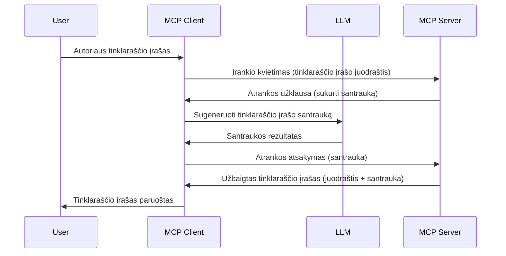

# Imties paėmimas - funkcijų delegavimas klientui

> **Atsisakymo pranešimas:** `2026-07-28` MCP specifikacijos leidimo kandidatas pažymi Imties paėmimą kaip pasenusią naudoti tiesiogiai su LLM tiekėjo API integracija. Imties paėmimas veikia `2025-11-25` versijoje ir bent metus po bet kokio formalaus atsisakymo, todėl visa ši pamoka lieka aktuali — tačiau nauji serverių dizainai turėtų įvertinti pakaitinį modelį. Žr. [Kas keičiasi MCP: 2026-07-28 leidimo kandidatas](../../01-CoreConcepts/mcp-2026-07-28-release-candidate.md).

Kartais reikia, kad MCP klientas ir MCP serveris bendradarbiautų siekdami bendro tikslo. Gali būti atvejis, kai serveriui reikia LLM pagalbos, esančios kliente. Tokiu atveju turėtumėte naudoti imties paėmimą.

Pažiūrėkime į keletą panaudojimo atvejų ir kaip sukurti sprendimą naudojant imties paėmimą.

## Apžvalga

Šioje pamokoje daugiausia dėmesio skiriame paaiškinimui, kada ir kur naudoti imties paėmimą ir kaip jį sukonfigūruoti.

## Mokymosi tikslai

Šiame skyriuje mes:

- Paaiškinsime, kas yra imties paėmimas ir kada jį naudoti.
- Parodysime, kaip sukonfigūruoti imties paėmimą MCP.
- Pateiksime imties paėmimo veikimo pavyzdžių.

## Kas yra imties paėmimas ir kodėl jį naudoti?

Imties paėmimas yra pažangi funkcija, veikianti taip:



### Imties paėmimo užklausa

Na, dabar turėdami bendrą patikimą scenarijų, pakalbėkime apie imties paėmimo užklausą, kurią serveris siunčia klientui. Štai kaip tokia užklausa gali atrodyti JSON-RPC formatu:

```json
{
  "jsonrpc": "2.0",
  "id": 1,
  "method": "sampling/createMessage",
  "params": {
    "messages": [
      {
        "role": "user",
        "content": {
          "type": "text",
          "text": "Create a blog post summary of the following blog post: <BLOG POST>"
        }
      }
    ],
    "modelPreferences": {
      "hints": [
        {
          "name": "claude-3-sonnet"
        }
      ],
      "intelligencePriority": 0.8,
      "speedPriority": 0.5
    },
    "systemPrompt": "You are a helpful assistant.",
    "maxTokens": 100
  }
}
```

Čia verta paminėti kelis dalykus:

- Prompt, po content -> text, yra mūsų užklausa, kuri yra nurodymas LLM apibendrinti tinklaraščio įrašo turinį.

- **modelPreferences**. Ši dalis yra tiesiog pageidavimas, rekomendacija, kokia konfigūracija turėtų būti naudojama su LLM. Vartotojas gali pasirinkti, ar sekti šias rekomendacijas, ar jas pakeisti. Šiuo atveju yra rekomendacijos, kokį modelį naudoti, taip pat greičio ir intelekto prioritetas.
- **systemPrompt**, tai normalus sistemos užklausimas, suteikiantis LLM asmenybę ir nurodymus.
- **maxTokens**, tai kita savybė, nurodanti, kiek simbolių rekomenduojama naudoti šiai užduočiai.

### Imties paėmimo atsakymas

Šis atsakymas yra tai, ką MCP klientas galiausiai siunčia atgal MCP serveriui ir tai yra klientui iškvietus LLM, palaukus atsakymo ir suformavus šį pranešimą rezultatas. Štai kaip jis gali atrodyti JSON-RPC formatu:

```json
{
  "jsonrpc": "2.0",
  "id": 1,
  "result": {
    "role": "assistant",
    "content": {
      "type": "text",
      "text": "Here's your abstract <ABSTRACT>"
    },
    "model": "gpt-5",
    "stopReason": "endTurn"
  }
}
```

Atkreipkite dėmesį, kad atsakymas yra tinklaraščio įrašo santrauka, kaip ir prašėme. Taip pat pažymėkite, kad naudotas `model` nėra tas, kurį prašėme, o "gpt-5" vietoje "claude-3-sonnet". Tai iliustruoja, kad vartotojas gali pasikeisti nuomonę dėl naudojamo modelio ir imties paėmimo užklausa yra rekomendacija.

Gerai, dabar, kai suprantame pagrindinį srautą ir naudingą užduotį „tinklaraščio įrašo kūrimas + santrauka“, pažiūrėkime, ką turime padaryti, kad visa tai veiktų.

### Pranešimų tipai

Imties paėmimo pranešimai neribojami vien tekstu, jūs taip pat galite siųsti vaizdus ir garso įrašus. Štai kaip JSON-RPC atrodo kitaip:

**Tekstas**

```json
{
  "type": "text",
  "text": "The message content"
}
```

**Vaizdo turinys**

```json
{
  "type": "image",
  "data": "base64-encoded-image-data",
  "mimeType": "image/jpeg"
}
```

**Garso turinys**

```json
{
  "type": "audio",
  "data": "base64-encoded-audio-data",
  "mimeType": "audio/wav"
}
```

> PASTABA: dėl išsamesnės informacijos apie Imties paėmimą žr. [oficialią dokumentaciją](https://modelcontextprotocol.io/specification/2025-11-25/client/sampling)

## Kaip sukonfigūruoti imties paėmimą klientui

> Pastaba: jei kuriate tik serverį, čia daug ko daryti nereikia.

Kliente turite nurodyti šią funkciją taip:

```json
{
  "capabilities": {
    "sampling": {}
  }
}
```

Tai bus užfiksuota, kai jūsų pasirinktas klientas užsiregistruos serveriui.

## Imties paėmimo demonstracija - sukurkite tinklaraščio įrašą

Kartu parašykime imties paėmimo serverį, turėsime atlikti šiuos veiksmus:

1. Sukurkite įrankį serveryje.
1. Šis įrankis turėtų sukurti imties paėmimo užklausą.
1. Įrankis turėtų palaukti, kol bus atsakyta į kliento imties paėmimo užklausą.
1. Tada turi būti pateiktas įrankio rezultatas.

Pažiūrėkime kodą žingsnis po žingsnio:

### -1- Sukurkite įrankį

**python**

```python
@mcp.tool()
async def create_blog(title: str, content: str, ctx: Context[ServerSession, None]) -> str:
    """Create a blog post and generate a summary"""

```

### -2- Sukurkite imties paėmimo užklausą

Plečiame įrankį tokiu kodu:

**python**

```python
post = BlogPost(
        id=len(posts) + 1,
        title=title,
        content=content,
        abstract=""
    )

prompt = f"Create an abstract of the following blog post: title: {title} and draft: {content} "

result = await ctx.session.create_message(
        messages=[
            SamplingMessage(
                role="user",
                content=TextContent(type="text", text=prompt),
            )
        ],
        max_tokens=100,
)

```

### -3- Laukite atsakymo ir grąžinkite jį

**python**

```python
post.abstract = result.content.text

posts.append(post)

# grąžinti galutinį produktą
return json.dumps({
    "id": post.title,
    "abstract": post.abstract
})
```

### -4- Pilnas kodas

**python**

```python
from starlette.applications import Starlette
from starlette.routing import Mount, Host

from mcp.server.fastmcp import Context, FastMCP

from mcp.server.session import ServerSession
from mcp.types import SamplingMessage, TextContent

import json


from uuid import uuid4
from typing import List
from pydantic import BaseModel


mcp = FastMCP("Blog post generator")

# app = FastAPI()

posts = []

class BlogPost(BaseModel):
    id: int
    title: str
    content: str
    abstract: str

posts: List[BlogPost] = []

@mcp.tool()
async def create_blog(title: str, content: str, ctx: Context[ServerSession, None]) -> str:
    """Create a blog post and generate a summary"""

    post = BlogPost(
        id=len(posts) + 1,
        title=title,
        content=content,
        abstract=""
    )

    prompt = f"Create an abstract of the following blog post: title: {title} and draft: {content} "

    result = await ctx.session.create_message(
        messages=[
            SamplingMessage(
                role="user",
                content=TextContent(type="text", text=prompt),
            )
        ],
        max_tokens=100,
    )

    post.abstract = result.content.text

    posts.append(post)

    # grąžina pilną tinklaraščio įrašą
    return json.dumps({
        "id": post.title,
        "abstract": post.abstract
    })

if __name__ == "__main__":
    print("Starting server...")
    # mcp.run()
    mcp.run(transport="streamable-http")

# paleiskite programą su: python server.py
```

### -5- Testavimas Visual Studio Code

Norėdami išbandyti tai Visual Studio Code, atlikite šiuos veiksmus:

1. Paleiskite serverį terminale
1. Įtraukite jį į *mcp.json* (ir įsitikinkite, kad jis paleistas), pavyzdžiui štai taip:

   ```json
   "servers": {
      "blog-server": {
        "type": "http",
        "url": "http://localhost:8000/mcp"
      }
   }
   ```

1. Įveskite užklausą:

   ```text
   create a blog post named "Where Python comes from", the content is "Python is actually named after Monty Python Flying Circus"
   ```

1. Leiskite vykti imties paėmimui. Pirmą kartą tai testuojant bus pateiktas papildomas dialogas, kurį turėsite patvirtinti, tada pamatysite įprastą dialogą, kviečiantį paleisti įrankį

1. Peržiūrėkite rezultatus. Pamatysite rezultatus gražiai atvaizduotus GitHub Copilot Chat lange, bet taip pat galėsite peržiūrėti žalią JSON atsakymą.

**Papildoma dovana**. Visual Studio Code įrankiai turi puikią imties paėmimo palaikymą. Galite sukonfigūruoti Imties paėmimo prieigą prie jūsų įdiegto serverio šitaip:

1. Nueikite į plėtinių skyrių.
1. Pasirinkite krumpliaračio piktogramą savo įdiegto serverio skiltyje „MCP SERVERS - INSTALLED“.
1. Pasirinkite „Configure Model Access“, čia galite pasirinkti, kuriuos modelius GitHub Copilot gali naudoti vykdant imties paėmimą. Taip pat galite pamatyti visas paskutines imties paėmimo užklausas, pasirinkę „Show Sampling requests“.

## Užduotis

Šioje užduotyje kursite šiek tiek kitokį imties paėmimą, būtent integraciją, kuri generuoja produkto aprašymą. Štai jūsų scenarijus:

**Scenarijus**: el. prekybos biuro darbuotojui reikalinga pagalba, nes per daug laiko užtrunka sukurti produkto aprašymą. Todėl turite sukurti sprendimą, kuriame galite iškviesti įrankį „create_product“ su argumentais „title“ ir „keywords“, o jis turi sukurti pilną produktą, įskaitant „description“ lauką, užpildytą kliento LLM.

PATARIMAS: naudokite tai, ką išmokote anksčiau, kad sukurtumėte šį serverį ir jo įrankį, naudodami imties paėmimo užklausą.

## Sprendimas

[Sprendimas](./solution/README.md)

## Pagrindinės išvados

Imties paėmimas yra galinga funkcija, leidžianti serveriui deleguoti užduotis klientui, kai reikalinga LLM pagalba.

## Kas toliau

- [4 skyrius - Praktinė įgyvendinimas](../../04-PracticalImplementation/README.md)

---

<!-- CO-OP TRANSLATOR DISCLAIMER START -->
**Atsakomybės apribojimas**:
Šis dokumentas buvo išverstas naudojant dirbtinio intelekto vertimo paslaugą [Co-op Translator](https://github.com/Azure/co-op-translator). Nors siekiame tikslumo, prašome atkreipti dėmesį, kad automatiniai vertimai gali turėti klaidų ar netikslumų. Originalus dokumentas jo gimtąja kalba laikomas autoritetingu šaltiniu. Svarbiai informacijai rekomenduojama naudoti profesionalų žmogiškąjį vertimą. Mes neatsakome už jokius nesusipratimus ar neteisingą interpretaciją, kilusią naudojantis šiuo vertimu.
<!-- CO-OP TRANSLATOR DISCLAIMER END -->