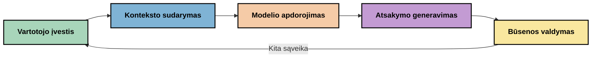
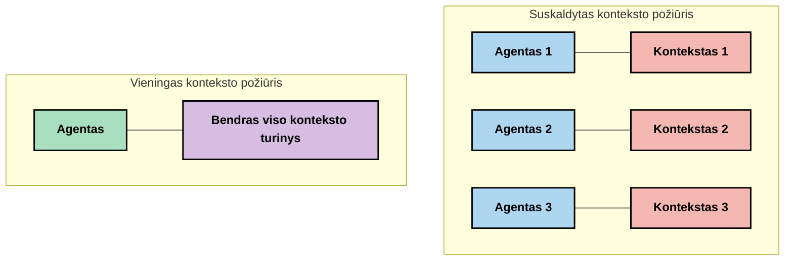
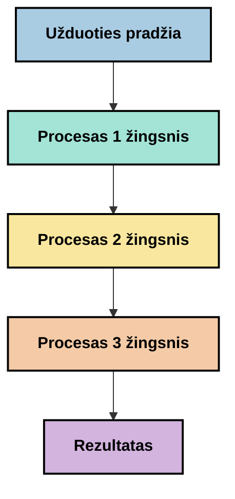
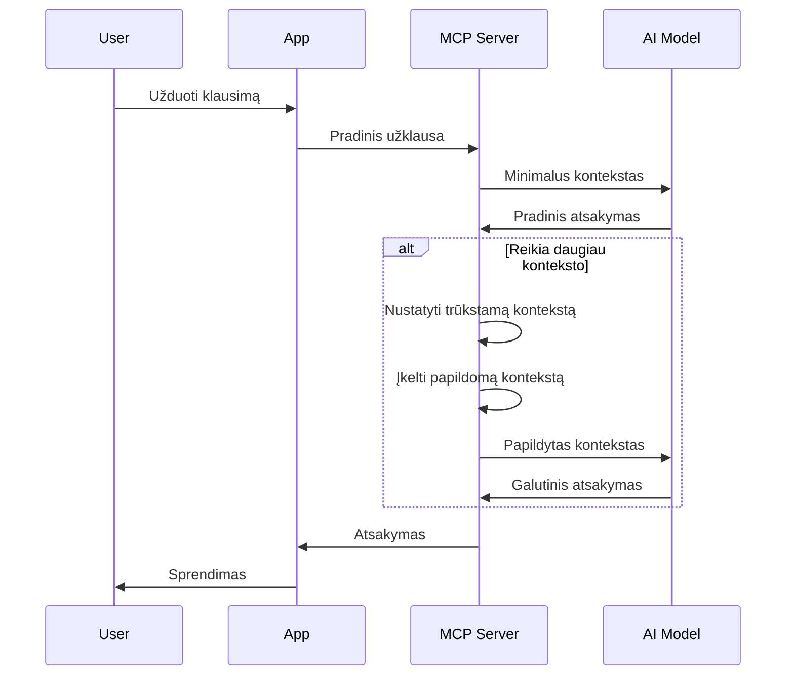
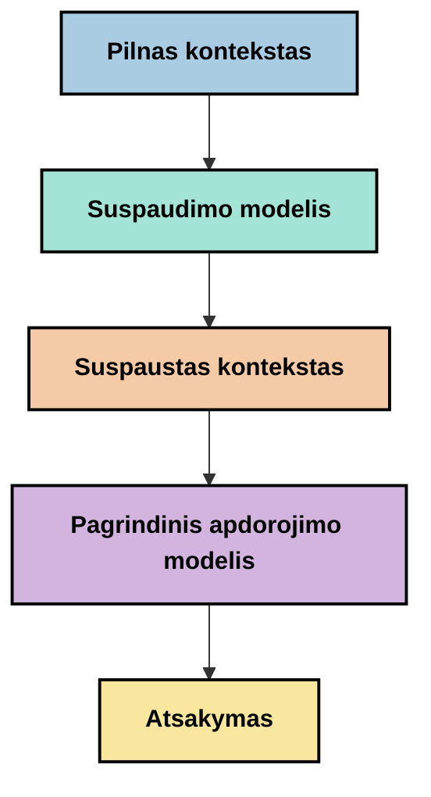
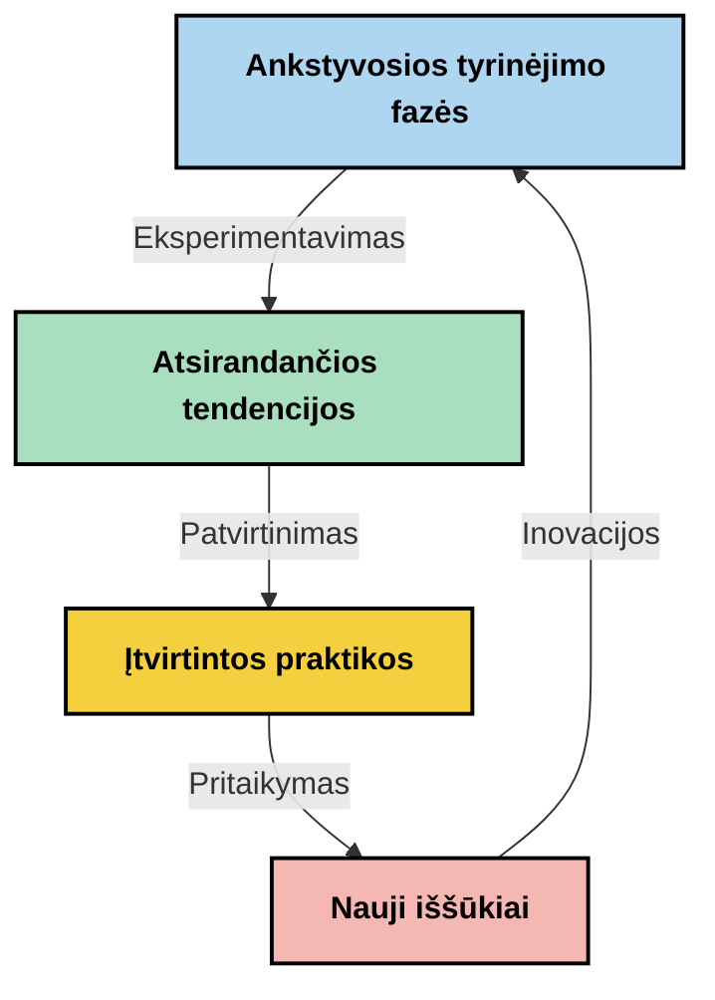

# Konteksto inžinerija: naujoviška sąvoka MCP ekosistemoje

## Apžvalga

Konteksto inžinerija yra naujoviška AI srityje, kuri tiria, kaip informacija struktūrizuojama, perduodama ir palaikoma sąveikų tarp klientų ir AI paslaugų metu. Kuo toliau vystosi Modelio konteksto protokolo (MCP) ekosistema, tuo svarbiau tampa efektyviai valdyti kontekstą. Šis modulis supažindina su konteksto inžinerijos sąvoka ir nagrinėja jos galimas taikymo sritis MCP įgyvendinimuose.

## Mokymosi tikslai

Baigę šį modulį, gebėsite:

- Suprasti konteksto inžinerijos naujovišką sąvoką ir jos galimą vaidmenį MCP taikymuose
- Identifikuoti pagrindines konteksto valdymo iššūkius, kuriuos sprendžia MCP protokolo dizainas
- Tyrinėti technikas, skirtas modelio našumui gerinti per geresnį konteksto tvarkymą
- Apsvarstyti požiūrius konteksto veiksmingumo matavimui ir vertinimui
- Taikyti šias naujoviškas sąvokas siekiant pagerinti AI patirtis per MCP sistemą

## Įvadas į konteksto inžineriją

Konteksto inžinerija yra naujoviška sritis, orientuota į sąmoningą informacijos srauto dizainą ir valdymą tarp vartotojų, programų ir AI modelių. Skirtingai nuo gerai įsitvirtinusių sričių, tokių kaip komandų inžinerija, konteksto inžinerija dar yra apibrėžiama praktikų, kurie sprendžia unikalius iššūkius, kaip AI modeliams pateikti tinkamą informaciją tinkamu laiku.

Didelių kalbos modelių (LLM) vystymuisi progresuojant, konteksto svarba tapo vis aiškesnė. Konteksto kokybė, aktualumas ir struktūra tiesiogiai veikia modelio išvestis. Konteksto inžinerija nagrinėja šį ryšį ir siekia sukurti principus efektyviam konteksto valdymui.

> „2025 m. modeliai yra itin išmanūs. Tačiau net protingiausias žmogus negalės efektyviai atlikti savo darbo be konteksto apie tai, kas jo prašoma... 'Konteksto inžinerija' yra sekantis komandų inžinerijos lygis. Tai yra automatizuotas procesas dinamiškoje sistemoje.“ — Walden Yan, Cognition AI

Konteksto inžinerija gali apimti:

1. **Konteksto pasirinkimas**: Nustatyti, kokia informacija yra svarbi konkrečiai užduočiai
2. **Konteksto struktūravimas**: Organizuoti informaciją, kad maksimaliai pagerėtų modelio supratimas
3. **Konteksto pateikimas**: Optimizuoti, kaip ir kada informacija siunčiama modeliams
4. **Konteksto palaikymas**: Valdyti konteksto būseną ir evoliuciją laikui bėgant
5. **Konteksto vertinimas**: Matuoti ir gerinti konteksto veiksmingumą

Šios sritys yra ypač svarbios MCP ekosistemai, kuri teikia standartizuotą būdą programoms pateikti kontekstą LLM.


## Konteksto kelionės perspektyva

Vienas iš būdų vaizduoti konteksto inžineriją yra sekti informacijos kelionę MCP sistemoje:



### Pagrindiniai konteksto kelionės etapai:

1. **Vartotojo įvestis**: Žaliava informacija iš vartotojo (tekstas, paveikslėliai, dokumentai)
2. **Konteksto surinkimas**: Vartotojo įvesties derinimas su sistemos kontekstu, pokalbio istorija ir kita gauta informacija
3. **Modelio apdorojimas**: AI modelis apdoroja surinktą kontekstą
4. **Atsakymo generavimas**: Modelis generuoja atsakymus remdamasis pateiktu kontekstu
5. **Būsenos valdymas**: Sistema atnaujina savo vidinę būseną pagal sąveiką

Ši perspektyva pabrėžia dinamišką konteksto pobūdį AI sistemose ir kelia svarbius klausimus, kaip geriausiai valdyti informaciją kiekviename etape.

## Nauji konteksto inžinerijos principai

Kuomet konteksto inžinerijos sritis formuojasi, kai kurie ankstyvieji principai pradeda kilti praktikos srityje. Šie principai gali padėti formuoti MCP įgyvendinimo pasirinkimus:

### Principas 1: Bendrinkite kontekstą visiškai

Kontekstas turėtų būti visiškai bendrinamas visų sistemos komponentų, o ne fragmentuotai tarp kelių agentų ar procesų. Kai kontekstas yra paskirstytas, sprendimai priimami vienoje sistemos dalyje gali prieštarauti sprendimams kitoje.



MCP programose tai reiškia sistemų projektavimą, kur kontekstas sklandžiai teka per visą apdorojimo kelią, o ne yra suskaidytas.

### Principas 2: Pripažinkite, kad veiksmai apima numatytus sprendimus

Kiekvienas modelio veiksmas reiškia numatytus sprendimus, kaip interpretuoti kontekstą. Kai keli komponentai veikia skirtose konteksto dalyse, šie numatyti sprendimai gali prieštarauti, sukelti nenuoseklius rezultatus.

Šis principas turi svarbių pasekmių MCP programoms:
- Pirmenybė teikiama linijiniam sudėtingų užduočių apdorojimui prieš paralelinį vykdymą su fragmentuotu kontekstu
- Užtikrinkite, kad visi sprendimų taškai turėtų prieigą prie tos pačios kontekstinės informacijos
- Projektuokite sistemas taip, kad vėlesni žingsniai matytų ankstesnių sprendimų visą kontekstą

### Principas 3: Subalansuokite konteksto gylį su lango apribojimais

Kad pokalbiai ir procesai ilgėja, konteksto langai galiausiai perpildomi. Efektyvi konteksto inžinerija ieško būdų, kaip valdyti šį kontrastą tarp išsamaus konteksto ir techninių apribojimų.

Galimi nagrinėjami metodai:
- Konteksto suspaudimas, kuris išlaiko svarbią informaciją sumažinant žodžių skaičių
- Progresyvus konteksto užkrovimas pagal dabartinį reikalingumą
- Ankstesnių sąveikų santrauka, išsaugant svarbius sprendimus ir faktus

## Konteksto iššūkiai ir MCP protokolo dizainas

Modelio konteksto protokolas (MCP) buvo sukurtas atsižvelgiant į unikalius konteksto valdymo iššūkius. Šių iššūkių supratimas paaiškina svarbius MCP protokolo dizaino aspektus:


### Iššūkis 1: Konteksto lango apribojimai
Dauguma AI modelių turi fiksuoto dydžio konteksto langus, ribojančius kiek informacijos jie gali apdoroti vienu metu.

**MCP dizaino atsakas:** 
- Protokolas palaiko struktūrizuotą, resursais grįstą kontekstą, kuris gali būti efektyviai cituojamas
- Ištekliai gali būti puslapiuojami ir užkraunami palaipsniui

### Iššūkis 2: Aktualumo nustatymas
Nustatyti, kuri informacija yra svarbiausia įtraukti į kontekstą, yra sudėtinga.

**MCP dizaino atsakas:**
- Lanksti įrankių sistema leidžia dinamiškai ieškoti informacijos pagal poreikį
- Struktūrizuoti iškvietimai užtikrina nuoseklią konteksto organizaciją

### Iššūkis 3: Konteksto išliekamumas
Valdyti būseną per sąveikas reikalauja kruopštaus konteksto sekimo.

**MCP dizaino atsakas:**
- Standartizuotas sesijų valdymas
- Aiškiai apibrėžti sąveikos modeliai konteksto evoliucijai

### Iššūkis 4: Daugiapakopis kontekstas
Skirtingi duomenų tipai (tekstas, paveikslėliai, struktūruota informacija) reikalauja skirtingo tvarkymo.

**MCP dizaino atsakas:**
- Protokolo dizainas palaiko įvairius turinio tipus
- Standartizuotas daugiapakopės informacijos reprezentavimas

### Iššūkis 5: Saugumas ir privatumas
Kontekstas dažnai turi jautrios informacijos, kuri turi būti apsaugota.

**MCP dizaino atsakas:**
- Aiškios ribos tarp kliento ir serverio atsakomybių
- Vietinio apdorojimo galimybės, siekiant sumažinti duomenų atskleidimą

Šių iššūkių supratimas ir kaip MCP juos sprendžia sudaro pagrindą gilintis į pažangesnes konteksto inžinerijos technikas.

## Nauji konteksto inžinerijos metodai

Vystantis konteksto inžinerijos sričiai, kyla keli perspektyvūs požiūriai. Tai yra dabartinės idėjos, o ne pripažintos geriausios praktikos, kurios tikėtina vystysis toliau su patirtimi MCP įgyvendinimuose.

### 1. Vienos gijos linijinis apdorojimas

Skirtingai nuo daugiaagentės architektūros, skirstančios kontekstą, kai kurie praktikai randa, kad vienos gijos linijinis apdorojimas suteikia nuoseklesnius rezultatus. Tai atitinka principą, kad kontekstas turi būti vieningas.



Nors šis metodas gali atrodyti mažiau efektyvus nei paralelinis apdorojimas, dažnai jis duoda labiau nuoseklius ir patikimus rezultatus, nes kiekvienas žingsnis remiasi pilnu ankstesnių sprendimų supratimu.

### 2. Konteksto suskaidymas ir prioritizavimas

Didelių kontekstų suskaidymas į valdomas dalis ir svarbiausių dalių prioritetizavimas.

```python
# Konceptualus pavyzdys: konteksto skaidymas ir prioritetizavimas
def process_with_chunked_context(documents, query):
    # 1. Padalykite dokumentus į mažesnius gabalus
    chunks = chunk_documents(documents)
    
    # 2. Apskaičiuokite svarbos balus kiekvienam gabalui
    scored_chunks = [(chunk, calculate_relevance(chunk, query)) for chunk in chunks]
    
    # 3. Surūšiuokite gabalus pagal svarbos balą
    sorted_chunks = sorted(scored_chunks, key=lambda x: x[1], reverse=True)
    
    # 4. Naudokite svarbiausius gabalus kaip kontekstą
    context = create_context_from_chunks([chunk for chunk, score in sorted_chunks[:5]])
    
    # 5. Apdorokite su prioritetizuotu kontekstu
    return generate_response(context, query)
```

Aukščiau pateikta koncepcija iliustruoja, kaip galėtume didelius dokumentus suskaidyti į valdomas dalis bei pasirinkti tik svarbiausias kontekstui dalis. Šis požiūris padeda dirbti su konteksto langų apribojimais, išnaudojant dideles žinių bazes.

### 3. Progresyvus konteksto užkrovimas

Konteksto užkrovimas palaipsniui pagal poreikį, o ne iš karto visa informacija.



Progresyvus konteksto užkrovimas prasideda nuo minimalaus konteksto ir plečiasi tik tada, kai reikia. Tai gali žymiai sumažinti žodžių naudojimą paprastiems užklausoms, tuo pačiu išlaikant gebėjimą atsakyti į sudėtingus klausimus.

### 4. Konteksto suspaudimas ir santrauka

Konteksto apimties mažinimas išlaikant svarbiausią informaciją.



Konteksto suspaudimas orientuojasi į:
- Dublikatinės informacijos pašalinimą
- Išsamios medžiagos santrauką
- Svarbių faktų ir detalių išskyrimą
- Kritinių konteksto elementų išsaugojimą
- Optimizavimą žodžių panaudojimui

Šis metodas ypač naudingas ilgų pokalbių palaikymui konteksto languose arba didelių dokumentų efektyviam apdorojimui. Kai kurie praktiškai naudoja specializuotus modelius būtent konteksto suspaudimui ir pokalbio istorijos santraukai.


## Eksperimentiniai konteksto inžinerijos svarstymai

Tyrinėjant naują konteksto inžinerijos sritį, yra keletas svarbių aspektų, kuriuos verta apsvarstyti dirbant su MCP įgyvendinimais. Tai nėra griežtos geriausios praktikos, o tyrimų sritys, kurios gali pagerinti jūsų specifinį naudojimo atvejį.

### Apžvelkite savo konteksto tikslus

Prieš diegiant sudėtingus konteksto valdymo sprendimus, aiškiai apibrėžkite, ką norite pasiekti:
- Kokios konkrečios informacijos modelis reikia sėkmei?
- Kokia informacija yra esminė, o kokia papildoma?
- Kokie jūsų našumo apribojimai (vėlinimas, žodžių ribos, kaštai)?

### Tyrinėkite sluoksniuotas konteksto schemas

Kai kurie praktikai sėkmingai naudoja kontekstą, išdėstytą konceptualiais sluoksniais:
- **Pagrindinis sluoksnis**: Esminė informacija, kurios modelis visuomet turi turėti
- **Situacinis sluoksnis**: Kontekstas, specifinis dabartinei sąveikai
- **Papildomas sluoksnis**: Papildoma informacija, kuri gali būti naudinga
- **Atsarginis sluoksnis**: Informacija, prieinama tik esant reikalui

### Tiriamos paieškos strategijos

Konteksto veiksmingumas dažnai priklauso nuo to, kaip informacija randama:
- Semantinė paieška ir įdėjiniai, siekiant rasti konceptualiai svarbią informaciją
- Raktinių žodžių paieška specifiniams faktiniams duomenims
- Hibridiniai metodai, jungiantys kelis paieškos būdus
- Metaduomenų filtravimas, susiaurinantis apimtį pagal kategorijas, datas ar šaltinius

### Eksperimentuokite su konteksto nuoseklumu

Konteksto struktūra ir eiga gali paveikti modelio supratimą:
- Susietos informacijos grupavimas kartu
- Nuoseklaus formatavimo ir organizacijos naudojimas
- Logiško arba chronologinio tvarkos palaikymas, kai tinkama
- Vengimas prieštaringos informacijos

### Įvertinkite daugiaagentės architektūros kompromisus

Nors daugiaagentės architektūros yra populiarios daugelyje AI sistemų, jos kelia reikšmingus konteksto valdymo iššūkius:
- Konteksto fragmentacija gali sukelti nenuoseklius sprendimus tarp agentų
- Paralelinis apdorojimas gali sukelti konfliktus, kuriais sunku suvaldyti
- Komunikacijos papildomas srautas tarp agentų gali sumažinti naudingumą
- Reikalingas sudėtingas būsenos valdymas, siekiant išlaikyti nuoseklumą

Daugeliais atvejais vieno agento požiūris su išsamiu konteksto valdymu gali duoti labiau patikimus rezultatus nei keli specializuoti agentai su suskaidytu kontekstu.

### Kurkite vertinimo metodus

Siekdami laikui bėgant tobulinti konteksto inžineriją, apmąstykite, kaip matuosite sėkmę:
- A/B testavimas skirtingų konteksto struktūrų
- Žodžių naudojimo ir atsakymo laikų stebėsena
- Vartotojų pasitenkinimo ir užduočių atlikimo rodiklių sekimas
- Analizė, kada ir kodėl konteksto strategijos nepavyksta

Šie aspektai atspindi aktyvias tyrimų sritis konteksto inžinerijos srityje. Augant sričiai, greičiausiai atsiras daug aiškesni modeliai ir praktikos.

## Konteksto veiksmingumo matavimas: besivystantis pagrindas

Konteksto inžinerijai formuojantis kaip sąvokai, praktikai pradeda tyrinėti, kaip galėtume matuoti jos efektyvumą. Nėra dar oficialaus sistemos, tačiau įvairūs metrikos mąstymai gali padėti ateities darbui.

### Galimos matavimo kryptys


#### 1. Įvesties efektyvumo aspektai

- **Konteksto ir atsakymo santykis**: Kiek konteksto reikia, palyginti su atsakymo dydžiu?
- **Žodžių naudojimas**: Kiek pateiktų konteksto žodžių, atrodo, veikia atsakymą?
- **Konteksto mažinimas**: Kaip efektyviai galime suspausti neapdorotą informaciją?

#### 2. Našumo aspektai

- **Vėlinimo poveikis**: Kaip konteksto valdymas veikia atsakymo laiką?
- **Žodžių ekonomija**: Ar efektyviai optimizuojame žodžių naudojimą?
- **Paieškos tikslumas**: Kaip aktuali yra surasta informacija?
- **Resursų naudojimas**: Kokie kompiuteriniai resursai reikalingi?

#### 3. Kokybės aspektai

- **Atsakymo aktualumas**: Kaip gerai atsakymas atitinka užklausą?
- **Faktinis tikslumas**: Ar konteksto valdymas gerina faktinį teisingumą?
- **Nuoseklumas**: Ar atsakymai yra nuoseklūs panašioms užklausoms?
- **Halucinacijų dažnis**: Ar geresnis kontekstas sumažina modelio klaidas?

#### 4. Vartotojo patirties aspektai

- **Tolesnių klausimų dažnis**: Kaip dažnai vartotojai prašo paaiškinimų?
- **Užduočių užbaigimas**: Ar vartotojai sėkmingai įvykdo savo tikslus?
- **Pasitenkinimo rodikliai**: Kaip vartotojai vertina savo patirtį?

### Eksperimentiniai matavimo metodai

Eksperimentuojant su konteksto inžinerija MCP įgyvendinimuose, apsvarstykite šiuos naujoviškus metodus:

1. **Pagrindinių verčių lyginimas**: Nustatykite pradinį lygį su paprastais konteksto metodais prieš išbandant sudėtingesnius

2. **Inkrementiniai pakeitimai**: Vienu metu keiskite vieną konteksto valdymo aspektą, kad būtų galima izoliuoti jo poveikį

3. **Vartotojui orientuotas vertinimas**: derinkite kiekybinius rodiklius su kokybine vartotojų atsiliepimų analize

4. **Klaidų analizė**: Išnagrinėkite atvejus, kai konteksto strategijos nepavyksta, siekiant suprasti galimus patobulinimus

5. **Daugiadimensinis vertinimas**: Apsvarstykite efektyvumo, kokybės ir vartotojo patirties kompromisus

Šis eksperimentinis, daugiaprasmis matavimo požiūris atitinka kylančią konteksto inžinerijos prigimtį.

## Baigiamoji mintis

Konteksto inžinerija yra nauja tyrimų sritis, kuri gali tapti pagrindine efektyviuose MCP taikymuose. Atsargiai apmąstydami, kaip informacija teka jūsų sistemoje, galite sukurti AI patirtis, kurios yra efektyvesnės, tikslesnės ir vertingesnės vartotojams.

Šiame modulyje aprašyti metodai ir požiūriai atspindi ankstyvą galvojimą šioje srityje, o ne įsteigtas praktikas. Konteksto inžinerija gali išsivystyti į labiau apibrėžtą discipliną, kai AI galimybės progresuos ir mūsų supratimas gilės. Šiuo metu eksperimentavimas kartu su kruopščiu matavimu atrodo produktyviausias kelias.

## Potencialios ateities kryptys

Konteksto inžinerijos sritis dar yra ankstyvoje stadijoje, tačiau kyla kelios perspektyvios kryptys:

- Konteksto inžinerijos principai gali reikšmingai paveikti modelio veikimą, efektyvumą, vartotojo patirtį ir patikimumą
- Vienos gijos metodai su išsamiu konteksto valdymu gali pranokti daugiaagentines architektūras daugeliu atvejų
- Specializuoti konteksto suspaudimo modeliai gali tapti standartiniais AI sprendimų komponentais
- Konteksto pilnumo ir žodžių apribojimų įtampa greičiausiai skatins inovacijas konteksto tvarkyme
- Kai modeliai taps pajėgesni efektyviai bendrauti panašiai kaip žmogus, tikra daugiaagentė bendradarbiavimo sistema taps realistiškesnė
- MCP įgyvendinimai gali vystytis standartizuojant konteksto valdymo modelius, kurie kils iš dabartinių eksperimentų



## Ištekliai

### Oficialūs MCP ištekliai
- [Model Context Protocol Website](https://modelcontextprotocol.io/)
- [Model Context Protocol Specification](https://github.com/modelcontextprotocol/modelcontextprotocol)

- [MCP dokumentacija](https://modelcontextprotocol.io/docs)
- [MCP C# SDK](https://github.com/modelcontextprotocol/csharp-sdk)
- [MCP Python SDK](https://github.com/modelcontextprotocol/python-sdk)
- [MCP TypeScript SDK](https://github.com/modelcontextprotocol/typescript-sdk)
- [MCP Inspector](https://github.com/modelcontextprotocol/inspector) - Vizualaus testavimo įrankis MCP serveriams

### Konteksto inžinerijos straipsniai
- [Nekurkite daugiagentinių sistemų: konteksto inžinerijos principai](https://cognition.ai/blog/dont-build-multi-agents) - Walden Yano įžvalgos apie konteksto inžinerijos principus
- [Praktinis vadovas, kaip kurti agentus](https://cdn.openai.com/business-guides-and-resources/a-practical-guide-to-building-agents.pdf) - OpenAI vadovas efektyviam agentų dizainui
- [Efektyvių agentų kūrimas](https://www.anthropic.com/engineering/building-effective-agents) - Anthropic požiūris į agentų vystymą

### Susiję tyrimai
- [Dinaminė informaciją papildanti paieška dideliems kalbos modeliams](https://arxiv.org/abs/2310.01487) - Tyrimai apie dinaminio paieškos metodus
- [Prarasta viduryje: kaip kalbos modeliai naudoja ilgus kontekstus](https://arxiv.org/abs/2307.03172) - Svarbūs tyrimai apie konteksto apdorojimo modelius
- [Hierarchinė tekstu sąlygota atvaizdų generacija su CLIP latentais](https://arxiv.org/abs/2204.06125) - DALL-E 2 straipsnis su įžvalgomis apie konteksto struktūrizavimą
- [Konteksto vaidmens tyrimas didelių kalbos modelių architektūrose](https://aclanthology.org/2023.findings-emnlp.124/) - Naujausi tyrimai apie konteksto valdymą
- [Daugiagentinė bendradarbiavimo apžvalga](https://arxiv.org/abs/2304.03442) - Tyrimai apie daugiagentines sistemas ir jų iššūkius

### Papildomi šaltiniai
- [Konteksto lango optimizavimo technikos](https://learn.microsoft.com/en-us/azure/ai-services/openai/concepts/context-window)
- [Išplėstinės RAG technologijos](https://www.microsoft.com/en-us/research/blog/retrieval-augmented-generation-rag-and-frontier-models/)
- [Semantic Kernel dokumentacija](https://github.com/microsoft/semantic-kernel)
- [Dirbtinio intelekto įrankių rinkinys konteksto valdymui](https://github.com/microsoft/aitoolkit)

## Kas toliau 

- [5.15 MCP užsakytasis transportas](../mcp-transport/README.md)

---

<!-- CO-OP TRANSLATOR DISCLAIMER START -->
**Atsakomybės apribojimas**:
Šis dokumentas buvo išverstas naudojant dirbtinio intelekto vertimo paslaugą [Co-op Translator](https://github.com/Azure/co-op-translator). Nors siekiame tikslumo, prašome atkreipti dėmesį, kad automatiniai vertimai gali turėti klaidų ar netikslumų. Originalus dokumentas jo gimtąja kalba laikomas autoritetingu šaltiniu. Svarbiai informacijai rekomenduojama naudoti profesionalų žmogiškąjį vertimą. Mes neatsakome už jokius nesusipratimus ar neteisingą interpretaciją, kilusią naudojantis šiuo vertimu.
<!-- CO-OP TRANSLATOR DISCLAIMER END -->