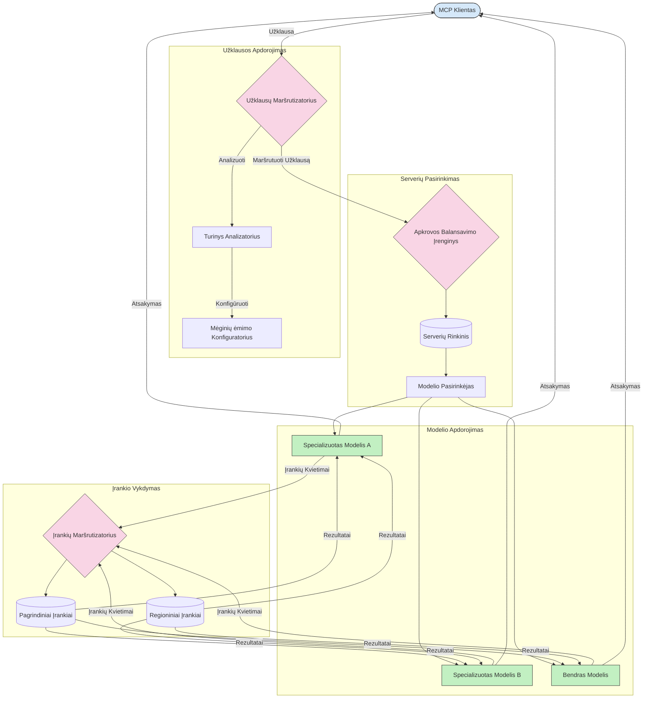

# Maršrutizavimas Modelio Konteksto Protokope

Maršrutizavimas yra būtinas nukreipiant užklausas tinkamiems modeliams, įrankiams ar paslaugoms MCP ekosistemoje.

## Įvadas

Maršrutizavimas Modelio Konteksto Protokope (MCP) apima užklausų nukreipimą tinkamiausiems modeliams ar paslaugoms pagal įvairius kriterijus, tokius kaip turinio tipas, vartotojo kontekstas ir sistemos apkrova. Tai užtikrina efektyvų apdorojimą ir optimalų išteklių naudojimą.

## Mokymosi Tikslai

Šios pamokos pabaigoje jūs gebėsite:

- Suprasti maršrutizavimo MCP principus.
- Įgyvendinti turinio pagrindu veikiančią maršrutizaciją, nukreipiančią užklausas specializuotoms paslaugoms.
- Taikyti išmanias apkrovos balansavimo strategijas optimizuojant išteklių naudojimą.
- Įgyvendinti dinaminį įrankių maršrutizavimą pagal užklausos kontekstą.

## Turinio Pagrindu Veikianti Maršrutizacija

Turinio pagrindu veikianti maršrutizacija nukreipia užklausas specializuotoms paslaugoms pagal užklausos turinį. Pavyzdžiui, užklausos, susijusios su kodo generavimu, gali būti nukreiptos į specializuotą kodo modelį, o kūrybinio rašymo užklausos – į kūrybinio rašymo modelį.

Pažiūrėkime pavyzdinę įgyvendinimą skirtingomis programavimo kalbomis.

<details>
<summary>.NET</summary>

```csharp
// .NET Example: Content-based routing in MCP
public class ContentBasedRouter
{
    private readonly Dictionary<string, McpClient> _specializedClients;
    private readonly RoutingClassifier _classifier;
    
    public ContentBasedRouter()
    {
        // Initialize specialized clients for different domains
        _specializedClients = new Dictionary<string, McpClient>
        {
            ["code"] = new McpClient("https://code-specialized-mcp.com"),
            ["creative"] = new McpClient("https://creative-specialized-mcp.com"),
            ["scientific"] = new McpClient("https://scientific-specialized-mcp.com"),
            ["general"] = new McpClient("https://general-mcp.com")
        };
        
        // Initialize content classifier
        _classifier = new RoutingClassifier();
    }
    
    public async Task<McpResponse> RouteAndProcessAsync(string prompt, IDictionary<string, object> parameters = null)
    {
        // Classify the prompt to determine the best specialized service
        string category = await _classifier.ClassifyPromptAsync(prompt);
        
        // Get the appropriate client or fall back to general
        var client = _specializedClients.ContainsKey(category) 
            ? _specializedClients[category] 
            : _specializedClients["general"];
            
        Console.WriteLine($"Routing request to {category} specialized service");
        
        // Send request to the selected service
        return await client.SendPromptAsync(prompt, parameters);
    }
    
    // Simple classifier for routing decisions
    private class RoutingClassifier
    {
        public Task<string> ClassifyPromptAsync(string prompt)
        {
            prompt = prompt.ToLowerInvariant();
            
            if (prompt.Contains("code") || prompt.Contains("function") || 
                prompt.Contains("program") || prompt.Contains("algorithm"))
            {
                return Task.FromResult("code");
            }
            
            if (prompt.Contains("story") || prompt.Contains("creative") || 
                prompt.Contains("imagine") || prompt.Contains("design"))
            {
                return Task.FromResult("creative");
            }
            
            if (prompt.Contains("science") || prompt.Contains("research") || 
                prompt.Contains("analyze") || prompt.Contains("study"))
            {
                return Task.FromResult("scientific");
            }
            
            return Task.FromResult("general");
        }
    }
}
```

Ankstesniame kode mes:

- Sukūrėme `ContentBasedRouter` klasę, kuri maršrutizuoja užklausas pagal užklausos turinį.
- Inicijavome specializuotus klientus skirtingoms sritims (kodas, kūrybinis rašymas, mokslinis, bendras).
- Įgyvendinome paprastą klasifikatorių, kuris nustato užklausos kategoriją ir nukreipia ją į atitinkamą specializuotą paslaugą.
- Naudojome atsarginį mechanizmą, kad užklausos būtų nukreiptos į bendrą paslaugą, jei nėra specializuotos.
- Įgyvendinome asinchroninį apdorojimą, kad efektyviai apdorotume užklausas.
- Naudojome žodyną, susiejantį turinio kategorijas su specializuotais MCP klientais.
- Įgyvendinome paprastą klasifikatorių, kuris analizuoja užklausą ir grąžina tinkamą kategoriją.
- Naudojome specializuotą klientą, kad išsiųstume užklausą ir gautume atsakymą.
- Tvarkėme atvejus, kai užklausa neatitiko jokios specializuotos kategorijos, nukreipiant ją į bendrą paslaugą.

</details>

## Išmanusis Apkrovos Balansavimas

Apkrovos balansavimas optimizuoja išteklių naudojimą ir užtikrina aukštą MCP paslaugų prieinamumą. Yra keletas apkrovos balansavimo būdų, tokių kaip round-robin, svorinis atsako laikas arba turinio pagrindu veikiantys metodai.

Pažiūrėkime žemiau pateiktą pavyzdinį įgyvendinimą, kuris naudoja šias strategijas:

- **Round Robin**: tolygiai paskirsto užklausas tarp prieinamų serverių.
- **Svorinis Atsako Laikas**: nukreipia užklausas į serverius, remiantis jų vidutiniu atsako laiku.
- **Turinio Pagrindu Veikiantis**: nukreipia užklausas į specializuotus serverius pagal užklausos turinį.

<details>
<summary>Java</summary>

```java
// Java pavyzdys: Inteligentiškas apkrovos balansavimas MCP serveriams
public class McpLoadBalancer {
    private final List<McpServerNode> serverNodes;
    private final LoadBalancingStrategy strategy;
    
    public McpLoadBalancer(List<McpServerNode> nodes, LoadBalancingStrategy strategy) {
        this.serverNodes = new ArrayList<>(nodes);
        this.strategy = strategy;
    }
    
    public McpResponse processRequest(McpRequest request) {
        // Pasirinkite geriausią serverį pagal strategiją
        McpServerNode selectedNode = strategy.selectNode(serverNodes, request);
        
        try {
            // Nukreipkite užklausą į pasirinktą mazgą
            return selectedNode.processRequest(request);
        } catch (Exception e) {
            // Tvarkykite klaidas - įgyvendinkite pakartojimo arba atsarginio veikimo logiką
            System.err.println("Error processing request on node " + selectedNode.getId() + ": " + e.getMessage());
            
            // Pažymėkite mazgą kaip potencialiai nesveiką
            selectedNode.recordFailure();
            
            // Pabandykite kitą geriausią mazgą kaip atsarginę galimybę
            List<McpServerNode> remainingNodes = new ArrayList<>(serverNodes);
            remainingNodes.remove(selectedNode);
            
            if (!remainingNodes.isEmpty()) {
                McpServerNode fallbackNode = strategy.selectNode(remainingNodes, request);
                return fallbackNode.processRequest(request);
            } else {
                throw new RuntimeException("All MCP server nodes failed to process the request");
            }
        }
    }
    
    // Mazgo sveikatos tikrinimo užduotis
    public void startHealthChecks(Duration interval) {
        ScheduledExecutorService scheduler = Executors.newScheduledThreadPool(1);
        scheduler.scheduleAtFixedRate(() -> {
            for (McpServerNode node : serverNodes) {
                try {
                    boolean isHealthy = node.checkHealth();
                    System.out.println("Node " + node.getId() + " health status: " + 
                                      (isHealthy ? "HEALTHY" : "UNHEALTHY"));
                } catch (Exception e) {
                    System.err.println("Health check failed for node " + node.getId());
                    node.setHealthy(false);
                }
            }
        }, 0, interval.toMillis(), TimeUnit.MILLISECONDS);
    }
    
    // Sąsaja apkrovos balansavimo strategijoms
    public interface LoadBalancingStrategy {
        McpServerNode selectNode(List<McpServerNode> nodes, McpRequest request);
    }
    
    // Apvalių eilučių strategija
    public static class RoundRobinStrategy implements LoadBalancingStrategy {
        private AtomicInteger counter = new AtomicInteger(0);
        
        @Override
        public McpServerNode selectNode(List<McpServerNode> nodes, McpRequest request) {
            List<McpServerNode> healthyNodes = nodes.stream()
                .filter(McpServerNode::isHealthy)
                .collect(Collectors.toList());
            
            if (healthyNodes.isEmpty()) {
                throw new RuntimeException("No healthy nodes available");
            }
            
            int index = counter.getAndIncrement() % healthyNodes.size();
            return healthyNodes.get(index);
        }
    }
    
    // Svorinė reakcijos laiko strategija
    public static class ResponseTimeStrategy implements LoadBalancingStrategy {
        @Override
        public McpServerNode selectNode(List<McpServerNode> nodes, McpRequest request) {
            return nodes.stream()
                .filter(McpServerNode::isHealthy)
                .min(Comparator.comparing(McpServerNode::getAverageResponseTime))
                .orElseThrow(() -> new RuntimeException("No healthy nodes available"));
        }
    }
    
    // Turinį atitinkanti strategija
    public static class ContentAwareStrategy implements LoadBalancingStrategy {
        @Override
        public McpServerNode selectNode(List<McpServerNode> nodes, McpRequest request) {
            // Nustatyti užklausos ypatybes
            boolean isCodeRequest = request.getPrompt().contains("code") || 
                                   request.getAllowedTools().contains("codeInterpreter");
            
            boolean isCreativeRequest = request.getPrompt().contains("creative") || 
                                       request.getPrompt().contains("story");
            
            // Surasti specializuotus mazgus
            Optional<McpServerNode> specializedNode = nodes.stream()
                .filter(McpServerNode::isHealthy)
                .filter(node -> {
                    if (isCodeRequest && node.getSpecialization().equals("code")) {
                        return true;
                    }
                    if (isCreativeRequest && node.getSpecialization().equals("creative")) {
                        return true;
                    }
                    return false;
                })
                .findFirst();
            
            // Grąžinti specializuotą mazgą arba mažiausiai apkrautą mazgą
            return specializedNode.orElse(
                nodes.stream()
                    .filter(McpServerNode::isHealthy)
                    .min(Comparator.comparing(McpServerNode::getCurrentLoad))
                    .orElseThrow(() -> new RuntimeException("No healthy nodes available"))
            );
        }
    }
}
```

Ankstesniame kode mes:

- Sukūrėme `McpLoadBalancer` klasę, kuri tvarko MCP serverių mazgų sąrašą ir nukreipia užklausas pagal pasirinktą apkrovos balansavimo strategiją.
- Įgyvendinome skirtingas apkrovos balansavimo strategijas: `RoundRobinStrategy`, `ResponseTimeStrategy` ir `ContentAwareStrategy`.
- Naudojome `ScheduledExecutorService`, kad periodiškai tikrintume serverių mazgų sveikatą.
- Įgyvendinome sveikatos tikrinimo mechanizmą, kuris žymi mazgus kaip sveikus arba nesveikus pagal jų atsakymus į sveikatos patikras.
- Tvarkėme užklausų apdorojimą su klaidų valdymu ir atsarginio funkcionalumo logika, siekiant užtikrinti aukštą prieinamumą.
- Naudojome `McpServerNode` klasę, kad atvaizduotume atskirus MCP serverių mazgus, įskaitant jų būklę, vidutinį atsako laiką ir dabartinę apkrovą.
- Įgyvendinome `McpRequest` klasę užklausų duomenims apibendrinti, tokiems kaip užklausos turinys ir leistini įrankiai.
- Naudojome Java srautus (Streams), kad filtruotume ir pasirinktume mazgus pagal sveikatos būseną ir specializaciją.

</details>

## Dinaminis Įrankių Maršrutizavimas

Įrankių maršrutizavimas užtikrina, kad įrankių kvietimai būtų nukreipti į tinkamiausią paslaugą pagal kontekstą. Pavyzdžiui, orų įrankio kvietimas gali būti nukreiptas į regioninį galinį tašką, remiantis vartotojo vieta, o skaičiuoklio įrankis gali naudoti tam tikrą API versiją.

Pažiūrėkime pavyzdinę įgyvendinimo versiją, kuri demonstruoja dinaminį įrankių maršrutizavimą pagal užklausos analizę, regioninius galinius taškus ir versijų palaikymą.

<details>
<summary>Python</summary>

```python
# Python pavyzdys: Dinaminis įrankio maršrutavimas pagal užklausos analizę
class McpToolRouter:
    def __init__(self):
        # Užregistruoti galimus įrankio galinius taškus
        self.tool_endpoints = {
            "weatherTool": "https://weather-service.example.com/api",
            "calculatorTool": "https://calculator-service.example.com/compute",
            "databaseTool": "https://database-service.example.com/query",
            "searchTool": "https://search-service.example.com/search"
        }
        
        # Regioniniai galiniai taškai pasauliniam paskirstymui
        self.regional_endpoints = {
            "us": {
                "weatherTool": "https://us-west.weather-service.example.com/api",
                "searchTool": "https://us.search-service.example.com/search"
            },
            "europe": {
                "weatherTool": "https://eu.weather-service.example.com/api",
                "searchTool": "https://eu.search-service.example.com/search"
            },
            "asia": {
                "weatherTool": "https://asia.weather-service.example.com/api",
                "searchTool": "https://asia.search-service.example.com/search"
            }
        }
        
        # Įrankio versijų palaikymas
        self.tool_versions = {
            "weatherTool": {
                "default": "v2",
                "v1": "https://weather-service.example.com/api/v1",
                "v2": "https://weather-service.example.com/api/v2",
                "beta": "https://weather-service.example.com/api/beta"
            }
        }
    
    async def route_tool_request(self, tool_name, parameters, user_context=None):
        """Route a tool request to the appropriate endpoint based on context"""
        endpoint = self._select_endpoint(tool_name, parameters, user_context)
        
        if not endpoint:
            raise ValueError(f"No endpoint available for tool: {tool_name}")
        
        # Atlikti faktinę užklausą pasirinktame galiniame taške
        return await self._execute_tool_request(endpoint, tool_name, parameters)
    
    def _select_endpoint(self, tool_name, parameters, user_context=None):
        """Select the most appropriate endpoint based on context"""
        # Pagrindinis galinis taškas iš registro
        if tool_name not in self.tool_endpoints:
            return None
            
        base_endpoint = self.tool_endpoints[tool_name]
        
        # Patikrinti, ar reikia naudoti konkrečią įrankio versiją
        if tool_name in self.tool_versions:
            version_info = self.tool_versions[tool_name]
            
            # Naudoti nurodytą versiją arba numatytąją
            requested_version = parameters.get("_version", version_info["default"])
            if requested_version in version_info:
                base_endpoint = version_info[requested_version]
        
        # Patikrinti regioninį maršrutavimą, jei vartotojo regionas žinomas
        if user_context and "region" in user_context:
            user_region = user_context["region"]
            
            if user_region in self.regional_endpoints:
                regional_tools = self.regional_endpoints[user_region]
                
                if tool_name in regional_tools:
                    # Naudoti regionui specifinį galinį tašką
                    return regional_tools[tool_name]
        
        # Patikrinti duomenų saugojimo reikalavimus
        if user_context and "data_residency" in user_context:
            # Čia būtų įgyvendinta logika, užtikrinanti, kad duomenys išliktų nurodytoje jurisdikcijoje
            pass
        
        # Patikrinti vėlinimo pagrindu atliekamą maršrutavimą
        if user_context and "latency_sensitive" in user_context and user_context["latency_sensitive"]:
            # Čia būtų įgyvendinta logika, leidžianti pasirinkti mažiausio vėlinimo galinį tašką
            pass
            
        return base_endpoint
        
    async def _execute_tool_request(self, endpoint, tool_name, parameters):
        """Execute the actual tool request to the selected endpoint"""
        try:
            async with aiohttp.ClientSession() as session:
                async with session.post(
                    endpoint,
                    json={"toolName": tool_name, "parameters": parameters},
                    headers={"Content-Type": "application/json"}
                ) as response:
                    if response.status == 200:
                        result = await response.json()
                        return result
                    else:
                        error_text = await response.text()
                        raise Exception(f"Tool execution failed: {error_text}")
        except Exception as e:
            # Įgyvendinti pakartotinės bandymo logiką arba atsarginę strategiją
            print(f"Error executing tool {tool_name} at {endpoint}: {str(e)}")
            raise
```

Ankstesniame kode mes:

- Sukūrėme `McpToolRouter` klasę, kuri tvarko įrankių maršrutizavimą pagal užklausos analizę, regioninius galinius taškus ir versijų palaikymą.
- Užregistravome prieinamus įrankių galinius taškus ir regioninius galinius taškus pasauliniam paskirstymui.
- Įgyvendinome dinaminę maršrutizavimo logiką, kuri parenka tinkamą galinį tašką pagal vartotojo kontekstą, pvz., regioną ir duomenų vietos reikalavimus.
- Įgyvendinome versijų palaikymą įrankiams, leidžiant vartotojams nurodyti, kurios įrankio versijos jie nori naudoti.
- Naudojome asinchroninius HTTP užklausimus įrankių kvietimams vykdyti ir atsakymams apdoroti.

</details>

## Imties Ūgio ir Maršrutizavimo Architektūra MCP

Imties ėmimas yra esminė Modelio Konteksto Protokolo (MCP) dalis, leidžianti efektyviai apdoroti ir maršrutizuoti užklausas. Tai apima gaunamų užklausų analizę, kad būtų nustatytas tinkamiausias modelis ar paslauga, greta įvairių kriterijų, tokių kaip turinio tipas, vartotojo kontekstas ir sistemos apkrova.

Imties ėmimas ir maršrutizavimas gali būti sujungti, sukuriant patikimą architektūrą, optimizuojančią išteklių naudojimą ir užtikrinančią aukštą prieinamumą. Imties ėmimo procesas gali būti naudojamas užklausų klasifikavimui, o maršrutizavimas – jų nukreipimui tinkamiems modeliams ar paslaugoms.

Žemiau pateiktas diagrama iliustruoja, kaip imties ėmimas ir maršrutizavimas veikia kartu išsamiame MCP architektūroje:



## Kas toliau

- [5.6 Imties Ūgis](../mcp-sampling/README.md)

---

<!-- CO-OP TRANSLATOR DISCLAIMER START -->
**Atsakomybės apribojimas**:
Šis dokumentas buvo išverstas naudojant dirbtinio intelekto vertimo paslaugą [Co-op Translator](https://github.com/Azure/co-op-translator). Nors siekiame tikslumo, prašome atkreipti dėmesį, kad automatiniai vertimai gali turėti klaidų ar netikslumų. Originalus dokumentas jo gimtąja kalba laikomas autoritetingu šaltiniu. Svarbiai informacijai rekomenduojama naudoti profesionalų žmogiškąjį vertimą. Mes neatsakome už jokius nesusipratimus ar neteisingą interpretaciją, kilusią naudojantis šiuo vertimu.
<!-- CO-OP TRANSLATOR DISCLAIMER END -->