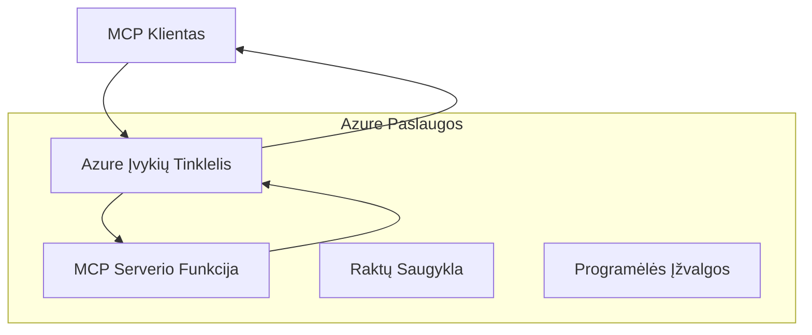
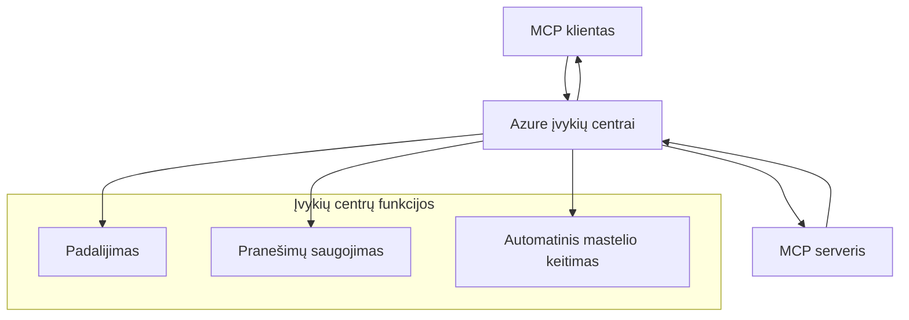

# MCP Tinkinti transportai – pažengusioji įgyvendinimo vadovas

Modelio konteksto protokolas (MCP) suteikia lankstumą transporto mechanizmuose, leidžiantį įgyvendinti tinkintus sprendimus specializuotoms įmonių aplinkoms. Šis pažengusiųjų vadovas nagrinėja tinkintų transportų įgyvendinimą, naudojant „Azure Event Grid“ ir „Azure Event Hubs“ kaip praktinius pavyzdžius, skirtus kurti mastelio keičiamus, debesų natūralius MCP sprendimus.

> **Žvilgsnis į ateitį:** šis vadovas parašytas pagal **MCP specifikaciją 2025-11-25**, kurioje seansų užsakymas turi būti išsaugotas kiekvienam seansui (žr. žemiau – Pranešimų protokolas). Kandidatas į „2026-07-28“ leidimą visiškai pašalina protokolo lygmens seansą ir reikalauja `Mcp-Method`/`Mcp-Name` antraščių, kad vartai ir tinkinti transportai galėtų maršrutuoti užklausas atskirai, o ne pagal seansą. Žr. [Kas keičiasi MCP: 2026-07-28 kandidatas į leidimą](../../01-CoreConcepts/mcp-2026-07-28-release-candidate.md).

## Įvadas

Nors MCP standartiniai transportai (stdio ir HTTP srautinis perdavimas) atitinka daugumą naudojimo atvejų, įmonių aplinkos dažnai reikalauja specializuotų transporto mechanizmų, siekiant pagerinti mastelį, patikimumą ir integraciją su esama debesų infrastruktūra. Tinkinti transportai leidžia MCP pasinaudoti debesų natūraliomis žinučių paslaugomis asinchroninei komunikacijai, įvykių varomoms architektūroms ir paskirstytam apdorojimui.

Ši pamoka nagrinėja pažangius transportų įgyvendinimus, pagrįstus naujausia MCP specifikacija (2025-11-25), „Azure“ žinučių paslaugomis ir įprastais įmonių integracijos modeliais.

### **MCP transporto architektūra**

**Iš MCP specifikacijos (2025-11-25):**

- **Standartiniai transportai**: stdio (rekomenduojamas), HTTP srautinis (nuotolinėms situacijoms)
- **Tinkinti transportai**: bet kuris transportas, kuris įgyvendina MCP žinučių mainų protokolą
- **Žinutės formatas**: JSON-RPC 2.0 su MCP specifinėmis plėtiniais
- **Dvišalis ryšys**: reikalingas pilno duplex ryšys pranešimams ir atsakymams

## Mokymosi tikslai

Iki šios pažangios pamokos pabaigos sugebėsite:

- **Suprasti tinkintų transportų reikalavimus**: įgyvendinti MCP protokolą per bet kurį transporto sluoksnį, laikantis reikalavimų
- **Sukurti Azure Event Grid transportą**: kurti įvykių varomus MCP serverius, naudojant Azure Event Grid nevaldomam mastelio keitimui
- **Įgyvendinti Azure Event Hubs transportą**: projektuoti didelio pralaidumo MCP sprendimus naudojant Azure Event Hubs realaus laiko srautiniam perdavimui
- **Taikyti įmonių modelius**: integruoti tinkintus transportus su esama Azure infrastruktūra ir saugumo modeliais
- **Tvarkyti transporto patikimumą**: įgyvendinti žinučių patvarumą, tvarką ir klaidų valdymą įmonių scenarijoms
- **Optimizuoti našumą**: projektuoti transporto sprendimus pagal mastelio, delsos ir pralaidumo reikalavimus

## **Transporto reikalavimai**

### **Pagrindiniai reikalavimai iš MCP specifikacijos (2025-11-25):**

```yaml
Message Protocol:
  format: "JSON-RPC 2.0 with MCP extensions"
  bidirectional: "Full duplex communication required"
  ordering: "Message ordering must be preserved per session"
  
Transport Layer:
  reliability: "Transport MUST handle connection failures gracefully"
  security: "Transport MUST support secure communication"
  identification: "Each session MUST have unique identifier"
  
Custom Transport:
  compliance: "MUST implement complete MCP message exchange"
  extensibility: "MAY add transport-specific features"
  interoperability: "MUST maintain protocol compatibility"
```

## **Azure Event Grid transporto įgyvendinimas**

Azure Event Grid teikia serverių neturintį įvykių maršruto paslaugą, idealiai tinkančią įvykių varomoms MCP architektūroms. Šis įgyvendinimas demonstruoja, kaip statyti mastelio keičiamas, laisvai sujungtas MCP sistemas.

### **Architektūros apžvalga**



### **C# įgyvendinimas – Event Grid transportas**

```csharp
using Azure.Messaging.EventGrid;
using Microsoft.Extensions.Azure;
using System.Text.Json;

public class EventGridMcpTransport : IMcpTransport
{
    private readonly EventGridPublisherClient _publisher;
    private readonly string _topicEndpoint;
    private readonly string _clientId;
    
    public EventGridMcpTransport(string topicEndpoint, string accessKey, string clientId)
    {
        _publisher = new EventGridPublisherClient(
            new Uri(topicEndpoint), 
            new AzureKeyCredential(accessKey));
        _topicEndpoint = topicEndpoint;
        _clientId = clientId;
    }
    
    public async Task SendMessageAsync(McpMessage message)
    {
        var eventGridEvent = new EventGridEvent(
            subject: $"mcp/{_clientId}",
            eventType: "MCP.MessageReceived",
            dataVersion: "1.0",
            data: JsonSerializer.Serialize(message))
        {
            Id = Guid.NewGuid().ToString(),
            EventTime = DateTimeOffset.UtcNow
        };
        
        await _publisher.SendEventAsync(eventGridEvent);
    }
    
    public async Task<McpMessage> ReceiveMessageAsync(CancellationToken cancellationToken)
    {
        // Event Grid is push-based, so implement webhook receiver
        // This would typically be handled by Azure Functions trigger
        throw new NotImplementedException("Use EventGridTrigger in Azure Functions");
    }
}

// Azure Function for receiving Event Grid events
[FunctionName("McpEventGridReceiver")]
public async Task<IActionResult> HandleEventGridMessage(
    [EventGridTrigger] EventGridEvent eventGridEvent,
    ILogger log)
{
    try
    {
        var mcpMessage = JsonSerializer.Deserialize<McpMessage>(
            eventGridEvent.Data.ToString());
        
        // Process MCP message
        var response = await _mcpServer.ProcessMessageAsync(mcpMessage);
        
        // Send response back via Event Grid
        await _transport.SendMessageAsync(response);
        
        return new OkResult();
    }
    catch (Exception ex)
    {
        log.LogError(ex, "Error processing Event Grid MCP message");
        return new BadRequestResult();
    }
}
```

### **TypeScript įgyvendinimas – Event Grid transportas**

```typescript
import { EventGridPublisherClient, AzureKeyCredential } from "@azure/eventgrid";
import { McpTransport, McpMessage } from "./mcp-types";

export class EventGridMcpTransport implements McpTransport {
    private publisher: EventGridPublisherClient;
    private clientId: string;
    
    constructor(
        private topicEndpoint: string,
        private accessKey: string,
        clientId: string
    ) {
        this.publisher = new EventGridPublisherClient(
            topicEndpoint,
            new AzureKeyCredential(accessKey)
        );
        this.clientId = clientId;
    }
    
    async sendMessage(message: McpMessage): Promise<void> {
        const event = {
            id: crypto.randomUUID(),
            source: `mcp-client-${this.clientId}`,
            type: "MCP.MessageReceived",
            time: new Date(),
            data: message
        };
        
        await this.publisher.sendEvents([event]);
    }
    
    // Įvykių pagrindu pagrįstas gavimas per Azure Functions
    onMessage(handler: (message: McpMessage) => Promise<void>): void {
        // Įgyvendinimas naudotų Azure Functions Event Grid triggere
        // Tai yra koncepcinis sąsajos apibrėžimas webhook gavėjui
    }
}

// Azure Functions įgyvendinimas
import { app, InvocationContext, EventGridEvent } from "@azure/functions";

app.eventGrid("mcpEventGridHandler", {
    handler: async (event: EventGridEvent, context: InvocationContext) => {
        try {
            const mcpMessage = event.data as McpMessage;
            
            // Apdoroti MCP žinutę
            const response = await mcpServer.processMessage(mcpMessage);
            
            // Siųsti atsakymą per Event Grid
            await transport.sendMessage(response);
            
        } catch (error) {
            context.error("Error processing MCP message:", error);
            throw error;
        }
    }
});
```

### **Python įgyvendinimas – Event Grid transportas**

```python
from azure.eventgrid import EventGridPublisherClient, EventGridEvent
from azure.core.credentials import AzureKeyCredential
import asyncio
import json
from typing import Callable, Optional
import uuid
from datetime import datetime

class EventGridMcpTransport:
    def __init__(self, topic_endpoint: str, access_key: str, client_id: str):
        self.client = EventGridPublisherClient(
            topic_endpoint, 
            AzureKeyCredential(access_key)
        )
        self.client_id = client_id
        self.message_handler: Optional[Callable] = None
    
    async def send_message(self, message: dict) -> None:
        """Send MCP message via Event Grid"""
        event = EventGridEvent(
            data=message,
            subject=f"mcp/{self.client_id}",
            event_type="MCP.MessageReceived",
            data_version="1.0"
        )
        
        await self.client.send(event)
    
    def on_message(self, handler: Callable[[dict], None]) -> None:
        """Register message handler for incoming events"""
        self.message_handler = handler

# Azure funkcijų įgyvendinimas
import azure.functions as func
import logging

def main(event: func.EventGridEvent) -> None:
    """Azure Functions Event Grid trigger for MCP messages"""
    try:
        # Analizuoti MCP žinutę iš Event Grid įvykio
        mcp_message = json.loads(event.get_body().decode('utf-8'))
        
        # Apdoroti MCP žinutę
        response = process_mcp_message(mcp_message)
        
        # Siųsti atsakymą atgal per Event Grid
        # (Įgyvendinimas sukurtų naują Event Grid klientą)
        
    except Exception as e:
        logging.error(f"Error processing MCP Event Grid message: {e}")
        raise
```

## **Azure Event Hubs transporto įgyvendinimas**

Azure Event Hubs teikia didelio pralaidumo, realaus laiko srautinių duomenų perdavimo galimybes MCP scenarijams, kuriems reikalinga maža delsos trukmė ir didelis žinučių kiekis.

### **Architektūros apžvalga**



### **C# įgyvendinimas – Event Hubs transportas**

```csharp
using Azure.Messaging.EventHubs;
using Azure.Messaging.EventHubs.Producer;
using Azure.Messaging.EventHubs.Consumer;
using System.Text;

public class EventHubsMcpTransport : IMcpTransport, IDisposable
{
    private readonly EventHubProducerClient _producer;
    private readonly EventHubConsumerClient _consumer;
    private readonly string _consumerGroup;
    private readonly CancellationTokenSource _cancellationTokenSource;
    
    public EventHubsMcpTransport(
        string connectionString, 
        string eventHubName,
        string consumerGroup = "$Default")
    {
        _producer = new EventHubProducerClient(connectionString, eventHubName);
        _consumer = new EventHubConsumerClient(
            consumerGroup, 
            connectionString, 
            eventHubName);
        _consumerGroup = consumerGroup;
        _cancellationTokenSource = new CancellationTokenSource();
    }
    
    public async Task SendMessageAsync(McpMessage message)
    {
        var messageBody = JsonSerializer.Serialize(message);
        var eventData = new EventData(Encoding.UTF8.GetBytes(messageBody));
        
        // Add MCP-specific properties
        eventData.Properties.Add("MessageType", message.Method ?? "response");
        eventData.Properties.Add("MessageId", message.Id);
        eventData.Properties.Add("Timestamp", DateTimeOffset.UtcNow);
        
        await _producer.SendAsync(new[] { eventData });
    }
    
    public async Task StartReceivingAsync(
        Func<McpMessage, Task> messageHandler)
    {
        await foreach (PartitionEvent partitionEvent in _consumer.ReadEventsAsync(
            _cancellationTokenSource.Token))
        {
            try
            {
                var messageBody = Encoding.UTF8.GetString(
                    partitionEvent.Data.EventBody.ToArray());
                var mcpMessage = JsonSerializer.Deserialize<McpMessage>(messageBody);
                
                await messageHandler(mcpMessage);
            }
            catch (Exception ex)
            {
                // Handle deserialization or processing errors
                Console.WriteLine($"Error processing message: {ex.Message}");
            }
        }
    }
    
    public void Dispose()
    {
        _cancellationTokenSource?.Cancel();
        _producer?.DisposeAsync().AsTask().Wait();
        _consumer?.DisposeAsync().AsTask().Wait();
        _cancellationTokenSource?.Dispose();
    }
}
```

### **TypeScript įgyvendinimas – Event Hubs transportas**

```typescript
import { 
    EventHubProducerClient, 
    EventHubConsumerClient, 
    EventData 
} from "@azure/event-hubs";

export class EventHubsMcpTransport implements McpTransport {
    private producer: EventHubProducerClient;
    private consumer: EventHubConsumerClient;
    private isReceiving = false;
    
    constructor(
        private connectionString: string,
        private eventHubName: string,
        private consumerGroup: string = "$Default"
    ) {
        this.producer = new EventHubProducerClient(
            connectionString, 
            eventHubName
        );
        this.consumer = new EventHubConsumerClient(
            consumerGroup,
            connectionString,
            eventHubName
        );
    }
    
    async sendMessage(message: McpMessage): Promise<void> {
        const eventData: EventData = {
            body: JSON.stringify(message),
            properties: {
                messageType: message.method || "response",
                messageId: message.id,
                timestamp: new Date().toISOString()
            }
        };
        
        await this.producer.sendBatch([eventData]);
    }
    
    async startReceiving(
        messageHandler: (message: McpMessage) => Promise<void>
    ): Promise<void> {
        if (this.isReceiving) return;
        
        this.isReceiving = true;
        
        const subscription = this.consumer.subscribe({
            processEvents: async (events, context) => {
                for (const event of events) {
                    try {
                        const messageBody = event.body as string;
                        const mcpMessage: McpMessage = JSON.parse(messageBody);
                        
                        await messageHandler(mcpMessage);
                        
                        // Atnaujinti kontrolinį tašką dėl bent vieno pristatymo
                        await context.updateCheckpoint(event);
                    } catch (error) {
                        console.error("Error processing Event Hubs message:", error);
                    }
                }
            },
            processError: async (err, context) => {
                console.error("Event Hubs error:", err);
            }
        });
    }
    
    async close(): Promise<void> {
        this.isReceiving = false;
        await this.producer.close();
        await this.consumer.close();
    }
}
```

### **Python įgyvendinimas – Event Hubs transportas**

```python
from azure.eventhub import EventHubProducerClient, EventHubConsumerClient
from azure.eventhub import EventData
import json
import asyncio
from typing import Callable, Dict, Any
import logging

class EventHubsMcpTransport:
    def __init__(
        self, 
        connection_string: str, 
        eventhub_name: str,
        consumer_group: str = "$Default"
    ):
        self.producer = EventHubProducerClient.from_connection_string(
            connection_string, 
            eventhub_name=eventhub_name
        )
        self.consumer = EventHubConsumerClient.from_connection_string(
            connection_string,
            consumer_group=consumer_group,
            eventhub_name=eventhub_name
        )
        self.is_receiving = False
    
    async def send_message(self, message: Dict[str, Any]) -> None:
        """Send MCP message via Event Hubs"""
        event_data = EventData(json.dumps(message))
        
        # Pridėti MCP specifines savybes
        event_data.properties = {
            "messageType": message.get("method", "response"),
            "messageId": message.get("id"),
            "timestamp": "2025-01-14T10:30:00Z"  # Naudoti tikrą laiko žymą
        }
        
        async with self.producer:
            event_data_batch = await self.producer.create_batch()
            event_data_batch.add(event_data)
            await self.producer.send_batch(event_data_batch)
    
    async def start_receiving(
        self, 
        message_handler: Callable[[Dict[str, Any]], None]
    ) -> None:
        """Start receiving MCP messages from Event Hubs"""
        if self.is_receiving:
            return
        
        self.is_receiving = True
        
        async with self.consumer:
            await self.consumer.receive(
                on_event=self._on_event_received(message_handler),
                starting_position="-1"  # Pradėti nuo pradžios
            )
    
    def _on_event_received(self, handler: Callable):
        """Internal event handler wrapper"""
        async def handle_event(partition_context, event):
            try:
                # Išanalizuoti MCP žinutę iš Event Hubs įvykio
                message_body = event.body_as_str(encoding='UTF-8')
                mcp_message = json.loads(message_body)
                
                # Apdoroti MCP žinutę
                await handler(mcp_message)
                
                # Atnaujinti kontrolinį tašką dėl bent vieno pristatymo
                await partition_context.update_checkpoint(event)
                
            except Exception as e:
                logging.error(f"Error processing Event Hubs message: {e}")
        
        return handle_event
    
    async def close(self) -> None:
        """Clean up transport resources"""
        self.is_receiving = False
        await self.producer.close()
        await self.consumer.close()
```

## **Pažangūs transporto modeliai**

### **Žinučių patvarumas ir patikimumas**

```csharp
// Implementing message durability with retry logic
public class ReliableTransportWrapper : IMcpTransport
{
    private readonly IMcpTransport _innerTransport;
    private readonly RetryPolicy _retryPolicy;
    
    public async Task SendMessageAsync(McpMessage message)
    {
        await _retryPolicy.ExecuteAsync(async () =>
        {
            try
            {
                await _innerTransport.SendMessageAsync(message);
            }
            catch (TransportException ex) when (ex.IsRetryable)
            {
                // Log and retry
                throw;
            }
        });
    }
}
```

### **Transporto saugumo integracija**

```csharp
// Integrating Azure Key Vault for transport security
public class SecureTransportFactory
{
    private readonly SecretClient _keyVaultClient;
    
    public async Task<IMcpTransport> CreateEventGridTransportAsync()
    {
        var accessKey = await _keyVaultClient.GetSecretAsync("EventGridAccessKey");
        var topicEndpoint = await _keyVaultClient.GetSecretAsync("EventGridTopic");
        
        return new EventGridMcpTransport(
            topicEndpoint.Value.Value,
            accessKey.Value.Value,
            Environment.MachineName
        );
    }
}
```

### **Transporto stebėsena ir matomumas**

```csharp
// Adding telemetry to custom transports
public class ObservableTransport : IMcpTransport
{
    private readonly IMcpTransport _transport;
    private readonly ILogger _logger;
    private readonly TelemetryClient _telemetryClient;
    
    public async Task SendMessageAsync(McpMessage message)
    {
        using var activity = Activity.StartActivity("MCP.Transport.Send");
        activity?.SetTag("transport.type", "EventGrid");
        activity?.SetTag("message.method", message.Method);
        
        var stopwatch = Stopwatch.StartNew();
        
        try
        {
            await _transport.SendMessageAsync(message);
            
            _telemetryClient.TrackDependency(
                "EventGrid",
                "SendMessage",
                DateTime.UtcNow.Subtract(stopwatch.Elapsed),
                stopwatch.Elapsed,
                true
            );
        }
        catch (Exception ex)
        {
            _telemetryClient.TrackException(ex);
            throw;
        }
    }
}
```

## **Įmonių integracijos scenarijai**

### **Scenarijus 1: Paskirstytas MCP apdorojimas**

Naudojant Azure Event Grid MCP užklausų paskirstymui per kelis apdorojimo mazgus:

```yaml
Architecture:
  - MCP Client sends requests to Event Grid topic
  - Multiple Azure Functions subscribe to process different tool types
  - Results aggregated and returned via separate response topic
  
Benefits:
  - Horizontal scaling based on message volume
  - Fault tolerance through redundant processors
  - Cost optimization with serverless compute
```

### **Scenarijus 2: Realiojo laiko MCP srautinis perdavimas**

Naudojant Azure Event Hubs didelio dažnio MCP sąveikoms:

```yaml
Architecture:
  - MCP Client streams continuous requests via Event Hubs
  - Stream Analytics processes and routes messages
  - Multiple consumers handle different aspect of processing
  
Benefits:
  - Low latency for real-time scenarios
  - High throughput for batch processing
  - Built-in partitioning for parallel processing
```

### **Scenarijus 3: Hibridinė transporto architektūra**

Kombinuojant kelis transportus skirtingiems naudojimo atvejams:

```csharp
public class HybridMcpTransport : IMcpTransport
{
    private readonly IMcpTransport _realtimeTransport; // Event Hubs
    private readonly IMcpTransport _batchTransport;    // Event Grid
    private readonly IMcpTransport _fallbackTransport; // HTTP Streaming
    
    public async Task SendMessageAsync(McpMessage message)
    {
        // Route based on message characteristics
        var transport = message.Method switch
        {
            "tools/call" when IsRealtime(message) => _realtimeTransport,
            "resources/read" when IsBatch(message) => _batchTransport,
            _ => _fallbackTransport
        };
        
        await transport.SendMessageAsync(message);
    }
}
```

## **Našumo optimizavimas**

### **Žinučių grupavimas Event Grid**

```csharp
public class BatchingEventGridTransport : IMcpTransport
{
    private readonly List<McpMessage> _messageBuffer = new();
    private readonly Timer _flushTimer;
    private const int MaxBatchSize = 100;
    
    public async Task SendMessageAsync(McpMessage message)
    {
        lock (_messageBuffer)
        {
            _messageBuffer.Add(message);
            
            if (_messageBuffer.Count >= MaxBatchSize)
            {
                _ = Task.Run(FlushMessages);
            }
        }
    }
    
    private async Task FlushMessages()
    {
        List<McpMessage> toSend;
        lock (_messageBuffer)
        {
            toSend = new List<McpMessage>(_messageBuffer);
            _messageBuffer.Clear();
        }
        
        if (toSend.Any())
        {
            var events = toSend.Select(CreateEventGridEvent);
            await _publisher.SendEventsAsync(events);
        }
    }
}
```

### **Particionavimo strategija Event Hubs**

```csharp
public class PartitionedEventHubsTransport : IMcpTransport
{
    public async Task SendMessageAsync(McpMessage message)
    {
        // Partition by client ID for session affinity
        var partitionKey = ExtractClientId(message);
        
        var eventData = new EventData(JsonSerializer.SerializeToUtf8Bytes(message))
        {
            PartitionKey = partitionKey
        };
        
        await _producer.SendAsync(new[] { eventData });
    }
}
```

## **Tinkintų transportų testavimas**

### **Vienetinis testavimas naudojant testinius dublius**

```csharp
[Test]
public async Task EventGridTransport_SendMessage_PublishesCorrectEvent()
{
    // Arrange
    var mockPublisher = new Mock<EventGridPublisherClient>();
    var transport = new EventGridMcpTransport(mockPublisher.Object);
    var message = new McpMessage { Method = "tools/list", Id = "test-123" };
    
    // Act
    await transport.SendMessageAsync(message);
    
    // Assert
    mockPublisher.Verify(
        x => x.SendEventAsync(
            It.Is<EventGridEvent>(e => 
                e.EventType == "MCP.MessageReceived" &&
                e.Subject == "mcp/test-client"
            )
        ),
        Times.Once
    );
}
```

### **Integracijos testavimas naudojant Azure Test Containers**

```csharp
[Test]
public async Task EventHubsTransport_IntegrationTest()
{
    // Using Testcontainers for integration testing
    var eventHubsContainer = new EventHubsContainer()
        .WithEventHub("test-hub");
    
    await eventHubsContainer.StartAsync();
    
    var transport = new EventHubsMcpTransport(
        eventHubsContainer.GetConnectionString(),
        "test-hub"
    );
    
    // Test message round-trip
    var sentMessage = new McpMessage { Method = "test", Id = "123" };
    McpMessage receivedMessage = null;
    
    await transport.StartReceivingAsync(msg => {
        receivedMessage = msg;
        return Task.CompletedTask;
    });
    
    await transport.SendMessageAsync(sentMessage);
    await Task.Delay(1000); // Allow for message processing
    
    Assert.That(receivedMessage?.Id, Is.EqualTo("123"));
}
```

## **Geriausios praktikos ir gairės**

### **Transporto dizaino principai**

1. **Idempotentiškumas**: užtikrinti, kad žinučių apdorojimas būtų idempotentiškas ir galėtų valdyti pasikartojimus
2. **Klaidų valdymas**: įgyvendinti išsamų klaidų tvarkymą ir negyvąjų laiškų eilutes
3. **Stebėsena**: pridėti detalią telemetriją ir sveikatos patikrinimus
4. **Saugumas**: naudoti valdomas tapatybes ir mažiausią leidimų principą
5. **Našumas**: projektuoti pagal konkrečius delsos ir pralaidumo reikalavimus

### **Rekomendacijos Azure aplinkai**

1. **Naudoti valdomą tapatybę**: išvengti jungčių verčių gamybos aplinkoje
2. **Įgyvendinti grandinės pertraukiklius**: apsaugoti nuo Azure paslaugų gedimų
3. **Stebėti išlaidas**: sekti žinučių kiekį ir apdorojimo išlaidas
4. **Planuoti mastelį**: anksti projektuoti particionavimo ir mastelio keitimo strategijas
5. **Išsamiai testuoti**: naudoti Azure DevTest Labs pilnam testavimui

## **Išvados**

Tinkinti MCP transportai leidžia įgyvendinti galingus įmonių scenarijus, naudojant Azure žinučių paslaugas. Įgyvendindami Event Grid arba Event Hubs transportus galite kurti mastelio keičiamus, patikimus MCP sprendimus, kurie sklandžiai integruojasi su esama Azure infrastruktūra.

Pateikti pavyzdžiai demonstruoja gamybai paruoštus modelius tinkintų transportų įgyvendinimui, išlaikant MCP protokolo atitiktį ir Azure gerąsias praktikas.

## **Papildomi ištekliai**

- [MCP specifikacija 2025-11-25](https://modelcontextprotocol.io/specification/2025-11-25/)
- [Azure Event Grid dokumentacija](https://docs.microsoft.com/azure/event-grid/)
- [Azure Event Hubs dokumentacija](https://docs.microsoft.com/azure/event-hubs/)
- [Azure Functions Event Grid trigeris](https://docs.microsoft.com/azure/azure-functions/functions-bindings-event-grid)
- [Azure SDK .NET](https://github.com/Azure/azure-sdk-for-net)
- [Azure SDK TypeScript](https://github.com/Azure/azure-sdk-for-js)
- [Azure SDK Python](https://github.com/Azure/azure-sdk-for-python)

---

> *Šis vadovas orientuotas į praktinius įgyvendinimo modelius gamybinėms MCP sistemoms. Visada patikrinkite transportų įgyvendinimus pagal savo konkrečius reikalavimus ir Azure paslaugų ribas.*
> **Dabartinis standartas**: šis vadovas atspindi [MCP specifikacijos 2025-11-25](https://modelcontextprotocol.io/specification/2025-11-25/) transporto reikalavimus ir pažangius transportų modelius įmonių aplinkoms.


## Kas toliau
- [6. Bendruomenės indėliai](../../06-CommunityContributions/README.md)

---

<!-- CO-OP TRANSLATOR DISCLAIMER START -->
**Atsakomybės apribojimas**:
Šis dokumentas buvo išverstas naudojant dirbtinio intelekto vertimo paslaugą [Co-op Translator](https://github.com/Azure/co-op-translator). Nors siekiame tikslumo, prašome atkreipti dėmesį, kad automatiniai vertimai gali turėti klaidų ar netikslumų. Originalus dokumentas jo gimtąja kalba laikomas autoritetingu šaltiniu. Svarbiai informacijai rekomenduojama naudoti profesionalų žmogiškąjį vertimą. Mes neatsakome už jokius nesusipratimus ar neteisingą interpretaciją, kilusią naudojantis šiuo vertimu.
<!-- CO-OP TRANSLATOR DISCLAIMER END -->