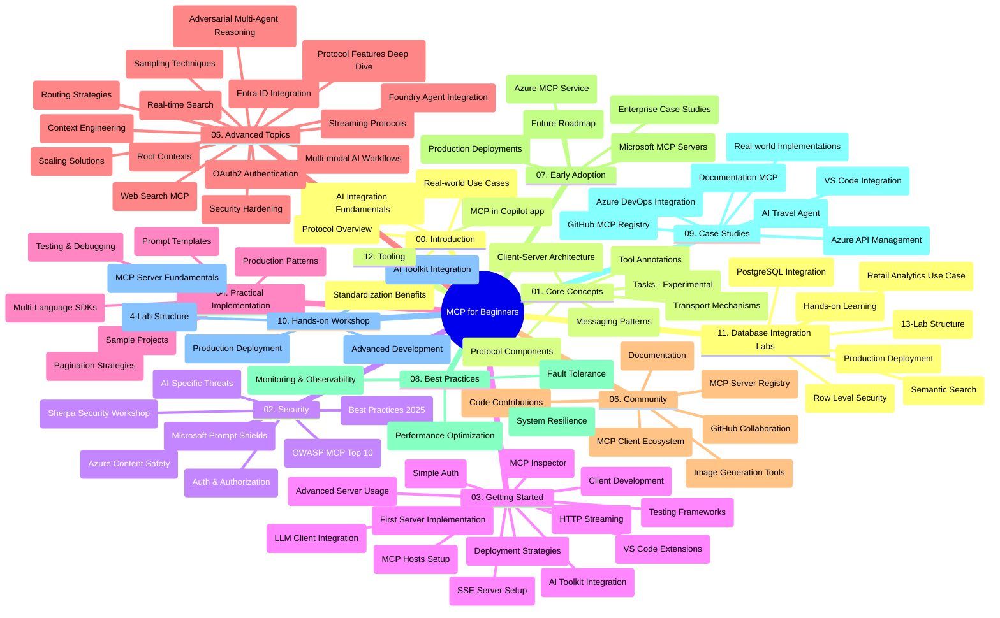

# Modelio konteksto protokolas (MCP) pradedantiesiems - studijų vadovas

Šis studijų vadovas pateikia apžvalgą apie saugyklos struktūrą ir turinį „Modelio konteksto protokolas (MCP) pradedantiesiems“ mokymo programai. Naudokite šį vadovą, kad efektyviai naršytumėte saugyklą ir maksimaliai išnaudotumėte prieinamus išteklius.

## Saugyklos apžvalga

Modelio konteksto protokolas (MCP) yra standartizuota sistema, skirta sąveikai tarp DI modelių ir klientų programų. Iš pradžių sukurtas Anthropic, MCP dabar prižiūrimas platesnės MCP bendruomenės per oficialią GitHub organizaciją. Ši saugykla suteikia išsamų mokymo planą su praktiniais kodo pavyzdžiais C#, Java, JavaScript, Python ir TypeScript kalbomis, skirtą DI kūrėjams, sistemų architektams ir programinės įrangos inžinieriams.

## Vaizdinė mokymo programos schema

## Saugyklos struktūra

Saugykla suskirstyta į dvylika pagrindinių skyrių, kiekvienas iš jų skirtas skirtingiems MCP aspektams:

1. **Įvadas (00-Introduction/)**
   - Modelio konteksto protokolo apžvalga
   - Kodėl standartizavimas svarbus DI procesuose
   - Praktiniai panaudojimo atvejai ir nauda

2. **Pagrindinės sąvokos (01-CoreConcepts/)**
   - Klientų-serverių architektūra
   - Pagrindiniai protokolo komponentai
   - Žinučių šablonai MCP
   - Žvilgsnis į ateitį: [Kas keičiasi MCP: 2026-07-28 leidimo kandidatas](./01-CoreConcepts/mcp-2026-07-28-release-candidate.md) — be valstybės protokolo šerdis, Praplėtimų sistema ir Šaknų/Mėginių/Registravimo pašalinimas, numatomas kitoje specifikacijos versijoje

3. **Saugumas (02-Security/)**
   - Grėsmės MCP pagrindu veikiančiose sistemose
   - Geriausios saugumo praktikos diegimui
   - Autentifikavimo ir autorizacijos strategijos
   - **Išsami saugumo dokumentacija**:
     - MCP saugumo geriausios praktikos 2025
     - Azure turinio saugos įgyvendinimo vadovas
     - MCP saugumo valdikliai ir technikos
     - MCP geriausių praktikų greitoji nuoroda
   - **Pagrindinės saugumo temos**:
     - Užklausų injekcijos ir įrankių užnuodijimo atakos
     - Seansų perėmimas ir painiojimo problemos
     - Žetonų perleidimo pažeidžiamumai
     - Per didelės teisės ir prieigos kontrolė
     - Tiekimo grandinės saugumas DI komponentams
     - Microsoft užklausų skydų integracija

4. **Pradžia (03-GettingStarted/)**
   - Aplinkos nustatymas ir konfigūracija
   - Pirmųjų MCP serverių ir klientų kūrimas
   - Integracija su esamomis programomis
   - Įtrauktos sekcijos:
     - Pirmoji serverio įgyvendinimas
     - Kliento kūrimas
     - LLM kliento integracija
     - VS Code integracija
     - Server-Sent Events (SSE) serveris
     - Pažangus serverio naudojimas
     - HTTP srautas
     - DI įrankių rinkinys integracija
     - Testavimo strategijos
     - Diegimo gairės

5. **Praktinė įgyvendinimas (04-PracticalImplementation/)**
   - SDK naudojimas skirtingose programavimo kalbose
   - Nagrinėjimo, testavimo ir tikrinimo metodai
   - Pakartotinai naudojamų užklausų šablonų ir darbo eigų kūrimas
   - Pavyzdiniai projektai su įgyvendinimo pavyzdžiais

6. **Pažangios temos (05-AdvancedTopics/)**
   - Konteksto inžinerijos metodai
   - Foundry agento integracija
   - Multi-modalūs DI darbo procesai
   - OAuth2 autentifikacijos demonstracijos
   - Realaus laiko paieškos galimybės
   - Realaus laiko transliacija
   - Šakninių kontekstų įgyvendinimas
   - Maršruto strategijos
   - Mėginių ėmimo metodai
   - Skalavimo metodai
   - Saugumo svarstymai
   - Entra ID saugumo integracija
   - Interneto paieškos integracija
   - Konfliktinių daugiaagentinių sprendimų (debatai) modeliai

7. **Bendruomenės indėliai (06-CommunityContributions/)**
   - Kaip prisidėti prie kodo ir dokumentacijos
   - Bendradarbiavimas per GitHub
   - Bendruomenės inicijuoti patobulinimai ir atsiliepimai
   - Įvairių MCP klientų naudojimas (Claude Desktop, Cline, VSCode)
   - Darbas su populiariais MCP serveriais, įskaitant vaizdų generavimą

8. **Pamokos iš ankstyvo priėmimo (07-LessonsfromEarlyAdoption/)**
   - Realūs įgyvendinimai ir sėkmės istorijos
   - MCP pagrindu sukurtų sprendimų kūrimas ir diegimas
   - Tendencijos ir ateities planai
   - **Microsoft MCP serverių vadovas**: Išsamus vadovas apie 10 gamyboje pasiruošusių Microsoft MCP serverių, įskaitant:
     - Microsoft Learn Docs MCP serveris
     - Azure MCP serveris (15+ specializuotų jungčių)
     - GitHub MCP serveris
     - Azure DevOps MCP serveris
     - MarkItDown MCP serveris
     - SQL Server MCP serveris
     - Playwright MCP serveris
     - Dev Box MCP serveris
     - Microsoft Foundry MCP serveris
     - Microsoft 365 Agents Toolkit MCP serveris

9. **Geriausios praktikos (08-BestPractices/)**
   - Veiklos reguliavimas ir optimizavimas
   - Atsparių MCP sistemų projektavimas
   - Testavimo ir atsparumo strategijos

10. **Atvejų analizės (09-CaseStudy/)**
    - **Septynios išsamios atvejų analizės** demonstruojančios MCP universalumą įvairiuose scenarijuose:
    - **Azure DI kelionių agentai**: daugiaagentinė orkestracija su Azure OpenAI ir DI paieška
    - **Azure DevOps integracija**: darbo procesų automatizavimas su YouTube duomenų atnaujinimais
    - **Realaus laiko dokumentų gavimas**: Python konsolės klientas su HTTP srautu
    - **Interaktyvus studijų plano generatorius**: Chainlit žiniatinklio programa su pokalbių DI
    - **Redaktoriaus vidinė dokumentacija**: VS Code integracija su GitHub Copilot darbo eigomis
    - **Azure API valdymas**: įmonių API integracija su MCP serverių kūrimu
    - **GitHub MCP registras**: ekosistemos kūrimas ir agentinė integracijos platforma
    - Įgyvendinimo pavyzdžiai apimantys įmonių integraciją, kūrėjų produktyvumą ir ekosistemos vystymą

11. **Praktinis seminaras (10-StreamliningAIWorkflowsBuildingAnMCPServerWithAIToolkit/)**
    - Išsamus seminaras derinant MCP su DI įrankių rinkiniu
    - Išmaniųjų programų kūrimas, jungiant DI modelius su realaus pasaulio įrankiais
    - Praktiniai moduliai apimantys pagrindus, pasirinktinį serverio kūrimą ir produkcinio diegimo strategijas
    - **Laboratorijų struktūra**:
      - Laboratorija 1: MCP serverio pagrindai
      - Laboratorija 2: Pažangus MCP serverio kūrimas
      - Laboratorija 3: DI įrankių rinkinio integracija
      - Laboratorija 4: Produkcinis diegimas ir mastelio keitimas
    - Mokymasis remiantis laboratorijomis su nuosekliomis instrukcijomis

12. **MCP serverio duomenų bazių integracijos laboratorijos (11-MCPServerHandsOnLabs/)**
    - **Išsamus 13 laboratorijų mokymosi kelias** MCP serverio, parengto gamybai, kūrimui su PostgreSQL integracija
    - **Realaus pasaulio mažmeninės prekybos analizės įgyvendinimas** naudojant Zava Retail atvejį
    - **Įmonių lygio modeliai**, įskaitant eilutės lygio saugumą (RLS), semantinę paiešką ir daugiapaslauginę prieigą
    - **Visas laboratorijų sąrašas**:
      - **Laboratorijos 00-03: Pagrindai** – Įvadas, architektūra, saugumas, aplinkos nustatymas
      - **Laboratorijos 04-06: MCP serverio kūrimas** – Duomenų bazės dizainas, MCP serverio įgyvendinimas, įrankių kūrimas
      - **Laboratorijos 07-09: Pažangios funkcijos** – Semantinė paieška, testavimas ir derinimas, VS Code integracija
      - **Laboratorijos 10-12: Gamyba ir geriausios praktikos** – Diegimas, stebėjimas, optimizavimas
    - **Naudotos technologijos**: FastMCP karkasas, PostgreSQL, Azure OpenAI, Azure Container Apps, Application Insights
    - **Mokymosi rezultatai**: gamybai pasiruošę MCP serveriai, duomenų bazių integracijos modeliai, DI pagrindu veikiančios analizės, įmonių saugumas

13. **Įrankiai (12-tooling/)**
    - Sužinokite, kaip naudoti MCP Copilot programoje ir kituose įrankiuose

## Papildomi ištekliai

Saugykla apima palaikomuosius išteklius:

- **Paveikslėlių aplankas**: talpina diagramas ir iliustracijas, naudojamas visoje mokymo programoje
- **Vertimai**: daugiakalbė palaikymas su automatizuotais dokumentacijos vertimais
- **Oficialūs MCP ištekliai**:
  - [MCP dokumentacija](https://modelcontextprotocol.io/)
  - [MCP specifikacija](https://spec.modelcontextprotocol.io/)
  - [MCP GitHub saugykla](https://github.com/modelcontextprotocol)

## Kaip naudotis šia saugykla

1. **Dėstytinis mokymasis**: vadovaukitės skyriais nuo 00 iki 11, kad gautumėte struktūruotą mokymo patirtį.
2. **Kalbų specifinis fokusas**: jei domina tam tikra programavimo kalba, peržiūrėkite pavyzdžių katalogus, kuriuose yra įgyvendinimai jūsų pageidaujama kalba.
3. **Praktinis įgyvendinimas**: pradėkite nuo „Pradžios“ skyriaus, kad nustatytumėte aplinką ir sukurtumėte pirmą MCP serverį ir klientą.
4. **Pažangus tyrinėjimas**: susipažinę su pagrindais, gilinkitės į pažangias temas, kad praplėstumėte žinias.
5. **Bendruomenės įsitraukimas**: prisijunkite prie MCP bendruomenės per GitHub diskusijas ir Discord kanalus, kad susisiektumėte su ekspertais ir kitais kūrėjais.

## MCP klientai ir įrankiai

Mokymo programa apima įvairius MCP klientus ir įrankius:

1. **Oficialūs klientai**:
   - Visual Studio Code
   - MCP Visual Studio Code aplinkoje
   - Claude Desktop
   - Claude VSCode aplinkoje
   - Claude API

2. **Bendruomenės klientai**:
   - Cline (terminalo pagrindu)
   - Cursor (kodo redaktorius)
   - ChatMCP
   - Windsurf

3. **MCP valdymo įrankiai**:
   - MCP CLI
   - MCP vadybininkas
   - MCP rišiklis
   - MCP maršrutizatorius

## Populiarūs MCP serveriai

Saugykla pristato įvairius MCP serverius, įskaitant:

1. **Oficialūs Microsoft MCP serveriai**:
   - Microsoft Learn Docs MCP serveris
   - Azure MCP serveris (15+ specializuotų jungčių)
   - GitHub MCP serveris
   - Azure DevOps MCP serveris
   - MarkItDown MCP serveris
   - SQL Server MCP serveris
   - Playwright MCP serveris
   - Dev Box MCP serveris
   - Microsoft Foundry MCP serveris
   - Microsoft 365 Agents Toolkit MCP serveris

2. **Oficialūs etaloniniai serveriai**:
   - Failų sistema
   - Fetch
   - Atmintis
   - Sekvencinis mąstymas

3. **Vaizdų generavimas**:
   - Azure OpenAI DALL-E 3
   - Stable Diffusion WebUI
   - Replicate

4. **Kūrimo įrankiai**:
   - Git MCP
   - Terminalo valdymas
   - Kodo asistentas

5. **Specializuoti serveriai**:
   - Salesforce
   - Microsoft Teams
   - Jira ir Confluence

## Prisidėjimas

Ši saugykla kviečia bendruomenės indėlį. Peržiūrėkite Bendruomenės įnašų skyrių, kaip efektyviai prisidėti prie MCP ekosistemos.

----

*Šis studijų vadovas paskutinį kartą atnaujintas 2026 m. vasario 5 d., atspindint naujausią MCP specifikaciją 2025-11-25 ir pateikia saugyklos apžvalgą iki šios datos. Saugyklos turinys gali būti atnaujinamas po šios datos.*

*Papildas (2026 m. liepos 2 d.): pamoka apie `2026-07-28` MCP specifikacijos leidimo kandidatą pridėta skyriuje [01-CoreConcepts](./01-CoreConcepts/mcp-2026-07-28-release-candidate.md); mokymo programos bazė lieka 2025-11-25 iki naujos specifikacijos išleidimo.*

---

<!-- CO-OP TRANSLATOR DISCLAIMER START -->
**Atsakomybės apribojimas**:
Šis dokumentas buvo išverstas naudojant dirbtinio intelekto vertimo paslaugą [Co-op Translator](https://github.com/Azure/co-op-translator). Nors siekiame tikslumo, prašome atkreipti dėmesį, kad automatiniai vertimai gali turėti klaidų ar netikslumų. Originalus dokumentas jo gimtąja kalba laikomas autoritetingu šaltiniu. Svarbiai informacijai rekomenduojama naudoti profesionalų žmogiškąjį vertimą. Mes neatsakome už jokius nesusipratimus ar neteisingą interpretaciją, kilusią naudojantis šiuo vertimu.
<!-- CO-OP TRANSLATOR DISCLAIMER END -->