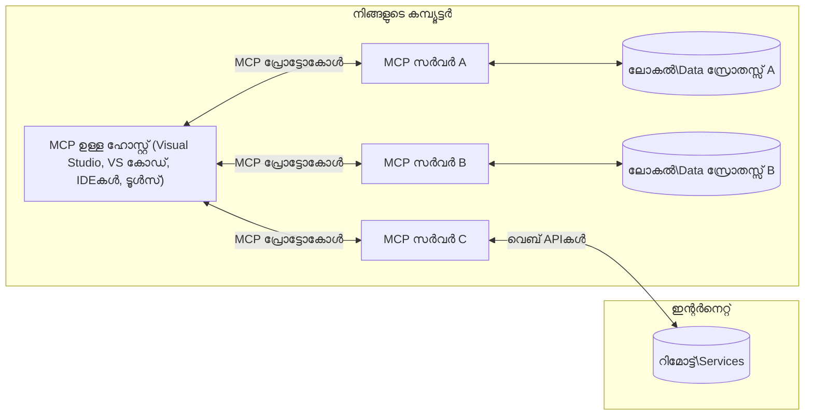

# MCP കോർ ആശയങ്ങൾ: എഐ ഇന്റഗ്രേഷനിനുള്ള മോഡൽ കോൺടെകസ്റ്റ് പ്രോട്ടോക്കോൾ സമീപനം

[](https://youtu.be/earDzWGtE84)

_(ഈ പാഠത്തിന്റെ വീഡിയോ കാണാൻ മുകളില്‍ ഉള്ള ചിത്രം ക്ലിക്ക് ചെയ്യുക)_

[Model Context Protocol (MCP)](https://github.com/modelcontextprotocol) വലിയ ഭാഷാ മോഡലുകളും (LLMs) ബാഹ്യ ഉപകരണങ്ങൾ, ആപ്ലിക്കേഷന്‍സ്, ഡാറ്റ സ്രോതസ്സുകൾ എന്നിവ തമ്മിലുള്ള ആശയവിനിമയം മെച്ചപ്പെടുത്തുന്ന ഒരു ശക്തമായ, പ്രമിതമായ ഫ്രെയിംവർക്കാണ്. 
ഈ ഗൈഡ് MCPയുടെ കോർ ആശയങ്ങളിലൂടെ നിങ്ങളെ നടത്തും. അതിന്റെ ക്ലയിന്റ്-സെർവർ വസ്തുതകൾ, അസംബന്ധ ഘടകങ്ങൾ, ആശയവിനിമയ രീതി, നടപ്പാക്കൽ മികച്ച പ്രാക്ടീസുകൾ എന്നിവയെ കുറിച്ച് നിങ്ങൾ പഠിക്കും.

- **വ്യക്തമായ ഉപയോക്തൃ സമ്മതം**: എല്ലാ ഡാറ്റ ആക്സസ്, പ്രവർത്തനങ്ങളും നടപ്പിലാക്കുന്നതിന് മുമ്പ് വ്യക്തമായ ഉപയോക്തൃ അംഗീകാരമുണ്ടിരിക്കണം. ഉപയോക്താക്കൾക്ക് ഏത് ഡാറ്റ ആക്സസ് ചെയ്യപ്പെടുക, എന്ത് നടപടികൾ സ്വീകരിക്കപ്പെടുക എന്നിവ വ്യക്തമായി മനസിലാകണം, അനുവാദങ്ങളും അധികാരങ്ങളും വിശദമായി നിയന്ത്രിക്കണം.

- **ഡാറ്റാ സ്വകാര്യത സംരക്ഷണം**: ഉപയോക്തൃ ഡാറ്റ വ്യക്തമായ സമ്മതത്തോടെ മാത്രമേ പുറത്തുവിടാവുക. ഇന്ററാക്‌ഷൻ ജീവിതചക്രം മുഴുവൻ ശക്തമായ ആക്സസ് നിയന്ത്രണങ്ങളാൽ സംരക്ഷിക്കണം. അനധികൃത ഡാറ്റ സഞ്ചാരം തടയുകയും കടുത്ത സ്വകാര്യതാ അതിരുകൾ പാലിക്കുകയും implementations നിർബന്ധമാണ്.

- **ഉപകരണ പ്രവർത്തന സുരക്ഷ**: ഓരോ ഉപകരണ വിളിപ്പാടിനും വ്യക്തമായ ഉപയോക്തൃ സമ്മതവും ഉപകരണത്തിന്റെ പ്രവർത്തനം, പാർട്ടാമീറ്ററുകൾ, സാധ്യതാ സ്വഭാവം എന്നിവയെക്കുറിച്ചുള്ള സുതാര്യ ബോധവും വേണം. അനൊരു ലക്ഷ്യമില്ലാത്ത, അപകടകാരിയായ, ദുരുപയോഗം ചെയ്യുന്ന പ്രവർത്തനം തടയാൻ ശക്തമായ സുരക്ഷാ അതിരുകൾ വേണം.

- **ട്രാൻസ്പോർട്ട് ലെയർ സുരക്ഷ**: എല്ലാ ആശയവിനിമയ ചാനലുകളും അനുയോജ്യമായ ഗൂഢലിഖിതവും authentication സംവിധാനങ്ങളും ഉപയോഗിക്കണം. ദൂരസ്ത ബന്ധങ്ങൾ സുരക്ഷിത ട്രാൻസ്പോർട്ട് പ്രോട്ടോക്കോളുകൾ നടപ്പിലാക്കി ശരിയായ ക്രെഡൻഷ്യൽ മാനേജുമെന്റ് വേണം.

#### നടപ്പാക്കൽ മാർഗ്ഗനിർദ്ദേശങ്ങൾ:

- **അനുമതി മാനേജുമെന്റ്**: ഉപയോക്താക്കൾക്ക് ഏത് സെർവർ, ഉപകരണങ്ങൾ, സ്രോതസ്സുകൾ ആക്സസ് ചെയ്യം എന്നതിന് സൂക്ഷ്മമായ നിയന്ത്രണം അനുവദിക്കുന്ന fine-grained permission സിസ്റ്റങ്ങൾ നടപ്പിലാക്കുക
- **അംഗീകാരവും അധികാരവും**: സുരക്ഷിത authentication രീതികൾ (OAuth, API കീകൾ) ഉപയോഗിച്ച് ശരിയായ ടോക്കൺ മാനേജുമെന്റും കാലഹരണവും നടപ്പിലാക്കുക  
- **ഇൻപുട്ട് വാലിഡേഷൻ**: അക്ക്രമണങ്ങൾ തടയാൻ നിർവചിച്ച സ്കീമകൾ അനുസരിച്ച് എല്ലാ പാർട്ടാമീറ്ററുകളും ഡാറ്റാ ഇൻപുട്ടുകളും വാലിഡേറ്റ് ചെയ്യുക
- **ഓഡിറ്റ് ലോഗിംഗ്**: സുരക്ഷാ നിരീക്ഷണത്തിനും കംപ്ലിയൻസിനും എല്ലാ പ്രവർത്തനങ്ങൾക്കും സമഗ്രമായ ലോഗുകൾ സൂക്ഷിക്കുക

## അവലോകനം

ഈ പാഠം Model Context Protocol (MCP) പരിസ്ഥിതിയെ രൂപപ്പെടുത്തുന്ന അടിസ്ഥാന ഘടനകളും ഘടകങ്ങളും പരിശോധിക്കുന്നു. MCP ആശയവിനിമയങ്ങൾക്ക് ശക്തി നൽകുന്ന ക്ലയിന്റ്-സെർവർ വസ്തുത, പ്രധാന ഘടകങ്ങൾ, ആശയവിനിമയ രീതി എന്നിവയെ കുറിച്ച് പഠിക്കാം.

## പ്രധാന പഠന ലക്ഷ്യങ്ങൾ

ഈ പാഠം കഴിഞ്ഞാൽ നിങ്ങൾക്ക്:

- MCP ക്ലയന്റും സെർവർ ആർക്കിടെക്ചറും മനസ്സിലാക്കുക.
- ഹോസ്റ്റുകൾ, ക്ലയന്റുകൾ, സെർവർമാരുടെ പങ്കും ഉത്തരവാദിത്വങ്ങളും തിരിച്ചറിയുക.
- MCP ഫ്ലെക്സിബിൾ ഇന്റഗ്രേഷൻ ലെയർ ആക്കുന്ന കോർ ഫീച്ചേഴ്സ് വിശകലനം ചെയ്യുക.
- MCP പരിസ്ഥിതിയിൽ വിവരങ്ങൾ എങ്ങനെ ഉദ്വഹനം ചെയ്യപ്പെടുന്നു എന്നു പഠിക്കുക.
- .NET, Java, Python, JavaScript എന്നിവയിൽ കോഡ് ഉദാഹരണങ്ങളിലൂടെ പ്രായോഗിക ബോധം നേടുക.

## MCP ആർക്കിടെക്ചർ: ഒരു ഗഹന വീക്ഷണം

MCP പരിസ്ഥിതി ക്ലയന്റും സെർവർ മോഡലിൽ നിർമ്മിച്ചതാണ്. ഈ മൊഡുലാർ ഘടന AI ആപ്ലിക്കേഷനുകൾക്ക് ഉപകരണങ്ങൾ, ഡാറ്റാബേസുകൾ, APIകൾ, കോൺടെക്സ്ച്വൽ റിസോഴ്സുകൾ എന്നിവയുടെ സൗകര്യപ്രദമായ സംയോജനം സാധ്യമാക്കുന്നു. ഇവയുടെ കോർ ഘടകങ്ങൾ നാം വിശദീകരിക്കാം.

MCPയുടെ മദ്ധ്യത്തിൽ, ഒരു ഹോസ്റ്റ് ആപ്ലിക്കറ്റ്‌ഷൻ പല സെർവറുകളുമായി ബന്ധിപ്പിക്കാനും പ്രവര്‍ത്തിക്കാനും കഴിയും.



- **MCP ഹോസ്റ്റുകൾ**: VSCode, Claude ഡെസ്ക്ടോപ്പ്, IDEകൾ അല്ലെങ്കിൽ MCP വഴി ഡാറ്റ ആക്സസ് ചെയ്യാൻ ആഗ്രഹിക്കുന്ന എഐ ഉപകരണങ്ങൾ
- **MCP ക്ലയന്റുകൾ**: സെർവറുകളുമായി 1:1 ബന്ധം നിലനിർത്തുന്ന പ്രോട്ടോക്കോൾ ക്ലയന്റുകൾ
- **MCP സെർവറുകൾ**: ഓരോത് തങ്ങളുടെ പ്രത്യേക ശേഷികൾ പ്രമിതമായ Model Context Protocol മുഖേന പുറപ്പെടുവിക്കുന്ന ലഘുവായ പ്രോഗ്രാമുകൾ
- **ലോകൽ ഡാറ്റാ സ്രോതസ്സുകൾ**: നിങ്ങളുടെ കമ്പ്യൂട്ടറിന്റെ ഫയലുകൾ, ഡാറ്റാബേസുകൾ, MCP സെർവർസ് സുരക്ഷിതമായി ആക്സസ് ചെയ്യാവുന്ന സേവനങ്ങൾ
- **ദൂരസ്ഥാന സേവനങ്ങൾ**: ഇന്റർനെറ്റിലൂടെ ലഭ്യമായ ബാഹ്യ സിസ്റ്റങ്ങൾ, MCP സെർവർസ് APIകൾ വഴി ബന്ധപ്പെടുന്നു

MCP പ്രോട്ടോക്കോൾ വർഷനായി തിയതി അടിസ്ഥാനത്തിലായ (YYYY-MM-DD ഫോർമാറ്റ്) ഒരു പരിണമിക്കുന്ന ശൈലി സ്വീകരിക്കുന്നു. നിലവിലെ പ്രോട്ടോക്കോൾ	version **2025-11-25** ആണ്. ഏറ്റവും പുതിയ അപ്ഡേറ്റുകൾ [പ്രോട്ടോക്കോൾ നിർദേശത്തിൽ](https://modelcontextprotocol.io/specification/2025-11-25/) കാണാം.

> **ഭാവിയില്‍ നോക്കുമ്പോള്‍:** അടുത്ത പ്രത്യേകാംശം വേർഷൻ, **2026-07-28**, 2026 മേയിൽ പ്രഖ്യാപിച്ചിട്ടുള്ളതാണ്, ഇത് 2026 ജൂലൈ 28-ന് പുറത്തിറങ്ങും. ഇത് transport layer-ൽ പ്രോട്ടോക്കോൾ stateless ആക്കുന്നു (`initialize` ഹാൻഡ്‌ഷേക്ക്, session IDകൾ നീക്കംചെയ്യുന്നു), Extensions ഫ്രെയിംവർക്കിനെ ഔദ്യോഗികമാക്കുന്നു, Roots, Sampling, Logging എന്നിവ പുതിയ മാതൃകകൾക്കായി ഡീപ്രിക്കേറ്റ് ചെയ്യുന്നു. മുഴുവൻ വിശദാംശങ്ങൾക്ക്  [What's Changing in MCP: The 2026-07-28 Release Candidate](./mcp-2026-07-28-release-candidate.md) കാണുക.

### 1. ഹോസ്റ്റുകൾ

Model Context Protocol (MCP)യിൽ, **ഹോസ്റ്റുകൾ** എഐ അപ്ലിക്കേഷനുകളാണ്, ഉപയോക്താക്കൾ പ്രോട്ടോക്കോളുമായി ഇടപെടുന്ന പ്രധാന ഇന്റർഫേസ്. ഹോസ്റ്റുകൾ ഒട്ടവ MCP സെർവറുകളുമായി ബന്ധം പാലിക്കുന്നതിനായി ഓരോ സെർവർ ബന്ധത്തിനും പ്രത്യേകം MCP ക്ലയന്റ് സൃഷ്‌ടിക്കുന്നു. ഹോസ്റ്റുകളുടെ ഉദാഹരണങ്ങൾ:

- **എഐ അപ്ലിക്കേഷനുകൾ**: Claude ഡെസ്ക്ടോപ്പ്, Visual Studio Code, Claude Code
- **ഡെവലപ്പ്മെന്റ് പരിതസ്ഥിതികൾ**: MCP ഇന്റഗ്രേഷൻ ഉള്ള IDEകൾ, കോഡ് എഡിറ്ററുകൾ  
- **സ്വകാര്യ ആപ്ലിക്കേഷനുകൾ**: പ്രത്യേക ആവശ്യങ്ങൾക്ക് നിർമ്മിച്ച AI ഏജന്റുകളും ഉപകരണങ്ങളും

**ഹോസ്റ്റുകൾ** AI മോഡലുകളുടെ ഇടപെടലുകളെ ഏകോപിപ്പിക്കുന്ന ആപ്ലിക്കേഷനുകളാണ്. അവ:

- **AI മോഡലുകൾ ഏകോപിപ്പിക്കുക**: LLMs പ്രവർത്തിപ്പിച്ച് മറുപടികൾ സൃഷ്‌ടിക്കുകയും AI പ്രവൃത്തി പ്രവാഹങ്ങൾ നിയന്ത്രിക്കുകയും ചെയ്യുക
- **ക്ലയന്റ് ബന്ധങ്ങൾ നിയന്ത്രിക്കുക**: ഓരോ MCP സെർവർ ബന്ധത്തിനും ഒരു MCP ക്ലയന്റ് സൃഷ്ടിച്ച് പരിപാലിക്കുക
- **ഉപയോക്തൃ ഇന്റർഫേസ്സ് നിയന്ത്രിക്കുക**: സംഭാഷണ പ്രവാഹം, ഉപയോക്തൃ ഇടപെടൽ, മറുപടി പ്രദർശനം എന്നിവ കൈകാര്യം ചെയ്യുക  
- **സുരക്ഷ പാലിക്കുക**: അനുവാദങ്ങൾ, സുരക്ഷാ മിതികൾ, authentication നിയന്ത്രിക്കുക
- **ഉപയോക്തൃ സമ്മതം കൈകാര്യം ചെയ്യുക**: ഡാറ്റ പങ്കിടലിനും ഉപകരണ പ്രവർത്തനത്തിനും ഉപയോക്തൃ അംഗീകാരം മാനേജുചെയ്യുക


### 2. ക്ലയന്റുകൾ

**ക്ലയന്റുകൾ** ഹോസ്റ്റുകളും MCP സെർവറുകളും തമ്മിലുള്ള 1:1 സമർപ്പിത ബന്ധം നിലനിർത്തുന്ന നിർണായക ഘടകങ്ങളാണ്. ഓരോ MCP ക്ലയന്റും ഒരു പ്രത്യേക MCP സെർവറുമായി ബന്ധിപ്പിക്കാൻ ഹോസ്റ്റ് സൃഷ്ടിക്കുന്നു, ഏത് ഉറപ്പുള്ള സുരക്ഷിത ആശയവിനിമയം നിശ്ചയിക്കുന്നു. ഒരേ സമയം നിരവധി സെർവറുകളിൽ ബന്ധം സ്ഥാപിക്കാൻ മൾട്ടിപ്പിൾ ക്ലയന്റുകൾ സഹായിക്കുന്നു.

**ക്ലയന്റുകൾ** ഹോസ്റ്റ് ആപ്ലിക്കേഷനിലെ ബന്ധിപ്പിക്കുന്ന ഘടകങ്ങളാണ്. അവ:

- **പ്രോട്ടോക്കോൾ ആശയവിനിമയം**: JSON-RPC 2.0 അഭ്യർത്ഥനകൾ സെർവറുകളിൽ പ്രേംപ്റ്റുകൾക്കും നിർദ്ദേശങ്ങൾക്കും അയയ്‌ക്കുക
- **ശേഷി ചർച്ച**: ആരംഭിക്കുമ്പോൾ സെർവറുമായി പിന്തുണയുള്ള ഫീച്ചറുകളും പ്രോട്ടോക്കോൾ വേർഷനുകളും ചർച്ച ചെയ്യുക
- **ഉപകരണ പ്രവർത്തനം**: മോഡലുകളിൽ നിന്നുള്ള ഉപകരണ പ്രവർത്തന അഭ്യർത്ഥനകളെ കൈകാര്യം ചെയ്ത് മറുപടികൾ പ്രോസസ്സ് ചെയ്യുക
- **തത്സമയ അപ്‌ഡേറ്റുകൾ**: സെർവറുകളിൽ നിന്നുള്ള വാർത്തകളും തത്സമയ അപ്‌ഡേറ്റുകളും കൈകാര്യം ചെയ്യുക
- **മറുപടി പ്രോസസിംഗ്**: ഉപയോക്താക്കൾക്ക് കാണിക്കാൻ സെർവർ മറുപടികൾ പ്രോസസ്സ് ചെയ്ത് രൂപമാറ്റുക

### 3. സെർവറുകൾ

**സെർവറുകൾ** MCP ക്ലയന്റുകൾക്ക് കോൺടെക്‌സ്‌റ്റ്, ഉപകരണങ്ങൾ, ശേഷികൾ നൽകുന്ന പ്രോഗ്രാമുകളാണ്. അവ ലോക്കലായി (ഹോസ്റ്റിനൊപ്പം) പ്രവർത്തിക്കാം, അല്ലെങ്കിൽ റിമോട്ട് പ്ലാറ്റ്‌ഫോമുകളിൽ പ്രവർത്തിക്കാം. ക്ലയന്റ് അഭ്യർത്ഥനകൾ കൈകാര്യം ചെയ്ത് ഘടനാപരമായ മറുപടികൾ നൽകുന്നത് ഇവയുടെ ഉത്തരവാദിത്വമാണ്. MCP ഉപയോഗിച്ചും സെർവറുകൾ പ്രത്യേകം ഫംഗ്ഷണാലിറ്റി പുറത്തുവിടുന്നു.

**സെർവറുകൾ** കോൺടെക്സ്റ്റും ശേഷികളും നൽകുന്ന സേവനങ്ങളാണ്. അവർ:

- **ഫീച്ചർ രജിസ്ട്രേഷൻ**: ലഭ്യമാക്കിയിരിക്കുന്ന പ്രിമിറ്റീവുകൾ (സ്രോതസ്സ്, പ്രേംപ്റ്റ്, ഉപകരണങ്ങൾ) ക്ലയന്റിന് രജിസ്റ്റർ ചെയ്യുക
- **അഭ്യർത്ഥന പ്രോസസ്സ്**: ഉപകരണ വിളികൾ, സ്രോതസ് അഭ്യർത്ഥനകൾ, പ്രേംപ്റ്റ് അഭ്യർത്ഥനകൾ സ്വീകരിച്ച് നിർവഹിച്ചു കൊടുക്കുക
- **കോൺടെക്സ്‌റ്റ് നൽകൽ**: മോഡൽ മറുപടികൾ മെച്ചപ്പെടുത്താൻ കോൺടെക്സ്റ്റ് വിവരവും ഡാറ്റയും നൽകുക
- **സ്റ്റേറ്റ് മാനേജ്‌മെന്റ്**: സെഷൻ സ്റ്റേറ്റ് പരിരക്ഷിച്ച് അവശ്യമായപ്പോൾ സ്റ്റേറ്റ്‌ഫുൾ ഇടപെടലുകൾ കൈകാര്യം ചെയ്യുക
- **തത്സമയ അറിയിപ്പുകൾ**: ശേഷി മാറ്റങ്ങൾ, അപ്‌ഡേറ്റുകൾ സംബന്ധിച്ച് ബന്ധപ്പെട്ട ക്ലയന്റുകൾക്ക് അറിയിപ്പുകൾ അയയ്‌ക്കുക

സെർവറുകൾ ആരും വികസിപ്പിച്ച് മോഡൽ ശേഷികളെ പ്രത്യേക ഫംഗ്ഷണാലിറ്റികളാൽ വിപുലീകരിക്കാം, അവർ ലോക്കൽ, റിമോട്ട് വിന്യസിക്കൽ സൌജന്യങ്ങൾ പിന്തുണയ്ക്കുന്നു.

### 4. സെർവർ പ്രിമിറ്റീവുകൾ

Model Context Protocol (MCP) സെർവറുകൾ മൂന്ന് പ്രധാന **പ്രിമിറ്റീവുകൾ** നൽകുന്നു, ക്ലയന്റ്സ്, ഹോസ്റ്റ്സ്, ഭാഷാ മോഡലുകൾ തമ്മിലുള്ള സമ്പന്നമായ ഇടപെടലുകൾ നിര്‍വ്വഹിക്കാൻ അടിസ്ഥാന ഘടകങ്ങൾ നിർവചിക്കുന്നു. ഈ പ്രിമിറ്റീവുകൾ പ്രോട്ടോക്കോളിലൂടെ ലഭ്യമായ കോൺടെക്സ്ച്വൽ വിവരവും ക്രിയകളും വ്യക്തമാക്കുന്നു.

MCP സെർവറുകൾ താഴെപ്പറയുന്ന മൂന്നും ചേർന്നോ ഏതൊന്നോ പുറത്തുവിടാം:

#### സ്രോതസ്സുകൾ 

**സ്രോതസ്സുകൾ** എഐ അപ്ലിക്കേഷനുകൾക്ക് കോൺടെക്സ്ച്വൽ വിവരങ്ങൾ നൽകുന്ന ഡാറ്റ സ്രോതസ്സുകളാണ്. സ്റ്റാറ്റിക് അല്ലെങ്കിൽ ഡൈനാമിക് ഉള്ളടക്കം ഈ മോഡലിന്റെ വിവരാവബോധവും തീരുമാനമെടുക്കലും മെച്ചപ്പെടുത്തുന്നു:

- **കോൺടെക്സ്‌ച്വൽ ഡാറ്റ**: AI മോഡൽ ഉപയോഗത്തിനായി ഘടനാപരമായ വിവരങ്ങളും കോൺടെക്സ്‌റ്റും
- **അറിയിപ്പ് ബേസുകൾ**: ഡോക്യുമെന്റ് സംഭരണികൾ, ലേഖനങ്ങൾ, മാന്വലുകൾ, ഗവേഷണ പേപ്പറുകൾ
- **ലോകൽ ഡാറ്റ സ്രോതസ്സുകൾ**: ഫയലുകൾ, ഡാറ്റാബേസുകൾ, ലോക്കൽ സിസ്റ്റം വിവരങ്ങൾ  
- **ബാഹ്യ ഡാറ്റ**: API മറുപടികൾ, വെബ് സേവനങ്ങൾ, റിമോട്ട് സിസ്റ്റം ഡാറ്റ
- **ഡൈനാമിക് ഉള്ളടക്കം**: ബാഹ്യ സാഹചര്യങ്ങൾ അടിസ്ഥാനമാക്കി തത്സമയം അപ്‌ഡേറ്റ് ചെയ്യുന്ന ഡാറ്റ

സ്രോതസ്സുകൾ URIs ഉപയോഗിച്ച് തിരിച്ചറിയപ്പെടുകയും `resources/list` വഴി കണ്ടെത്തുകയും `resources/read` വഴി കൈക്കൊള്ളുകയും ചെയ്യുന്നു:

```text
file://documents/project-spec.md
database://production/users/schema
api://weather/current
```

#### പ്രേംപ്റ്റുകൾ

**പ്രേംപ്റ്റുകൾ** ഭാഷ മോഡലുകളുമായുള്ള ഇടപെടലുകൾ ഘടിപ്പിക്കുന്ന പുനഃയോഗ്യമായ ടെംപ്ലേറ്റുകളാണ്. അവർ മാനദണ്ഡം പാലിച്ച ഇടപെടൽ മാതൃകകളും ടെംപ്ലേറ്റായുള്ള പ്രവൃത്തി പ്രവാഹങ്ങളും നൽകുന്നു:

- **ടെംപ്ലേറ്റ് അടിസ്ഥാന ഇടപെടലുകൾ**: മുന്‍കൂട്ടി ഘടന ചെയ്ത സന്ദേശങ്ങൾ, സംഭാഷണാരംഭകങ്ങൾ
- **പ്രവൃത്തി താളികകൾ**: സാധാരണ ജോലികൾക്കും ഇടപെടലുകൾക്കും മാനദണ്ഡ മത്സരങ്ങൾ
- **ചുരുക്കം ഉദാഹരണങ്ങൾ**: മോഡൽ നിർദ്ദേശത്തിനുള്ള ഉദാഹരണ അധിഷ്ഠിത ടെംപ്ലേറ്റുകൾ
- **സിസ്റ്റം പ്രേംപ്റ്റുകൾ**: മോഡൽ හැരിച്ചാടൽ, കോൺടെക്സ്റ്റ് നിർവചിക്കുന്ന അടിസ്ഥാന പ്രേംപ്റ്റുകൾ
- **ഡൈനാമിക് ടെംപ്ലേറ്റുകൾ**: പ്രത്യേക കോൺടെക്സ്റ്റുകളിലേക്ക് അനുയോജ്യമായി മാറുന്ന പാരാമീറ്റർ അടങ്ങിയ പ്രേംപ്റ്റുകൾ

പ്രേംപ്റ്റുകൾ വേരിയബിൾ സബ്സ്റ്റിറ്റ്യൂഷനും പിന്തുണയ്ക്കുന്നു, `prompts/list` വഴി കണ്ടെത്താനും `prompts/get` ഉപയോഗിച്ച് കൈക്കൊള്ളാനും കഴിയും:

```markdown
Generate a {{task_type}} for {{product}} targeting {{audience}} with the following requirements: {{requirements}}
```

#### ഉപകരണങ്ങൾ

**ഉപകരണങ്ങൾ** പ്രത്യേക പ്രവർത്തനങ്ങൾ നിർവഹിക്കാൻ AI മോഡലുകൾക്ക് വിളിക്കാവുന്ന നിർവഹണ ഫംഗ്ഷനുകളാണ്. MCP പരിസ്ഥിതിയിലെ "ക്രിയകൾ" ആയി അവ പ്രവർത്തിക്കുന്നു, മോഡലുകൾക്ക് ബാഹ്യ സിസ്റ്റങ്ങളുമായി ഇടപെടാൻ സാധിക്കുന്നു:

- **നിർവഹണ ഫംഗ്ഷനുകൾ**: മോഡലുകൾ പ്രത്യേക പാർട്ടാമീറ്ററുകളോടെ വിളിക്കാവുന്ന വേർതിരിച്ച പ്രവർത്തനങ്ങൾ
- **ബാഹ്യ സിസ്റ്റം സംയോജനം**: API വിളികൾ, ഡാറ്റാബേസ് ക്വറികൾ, ഫയൽ പ്രവർത്തനങ്ങൾ, ക്രമീകരണങ്ങൾ
- **ദ്വന്ദ്വം വ്യക്തിമുദ്ര**: ഓരോ ഉപകരണത്തിനും വ്യത്യസ്ത പേരും വിവരണവും പാർട്ടാമീറ്റർ സ്കീമ ഉം ഉണ്ടാകും
- **ഘടനാ ശരിയായ I/O**: ഉപകരണങ്ങൾ വാലിഡേറ്റുചെയ്ത പാർട്ടാമീറ്ററുകൾ സ്വീകരിച്ച് ഘടനാപരവും ടൈപ് ചെയ്ത മടക്കുമറുപടികൾ നൽകുന്നു
- **പ്രവൃത്തി ശേഷികൾ**: മോഡലുകൾക്ക് യഥാർത്ഥ ലോക പ്രവർത്തനങ്ങൾ നിർവഹിക്കാൻ, ലൈവ് ഡാറ്റ ലഭിക്കാൻ സഹായിക്കുന്നു

ഉപകരണങ്ങൾ JSON സ്കീമ ഉപയോഗിച്ച് പാർട്ടാമീറ്റർ പരിശോധനയ്ക്ക് നിർവചിക്കപ്പെടുന്നു, `tools/list` വഴി കണ്ടെത്തുകയും `tools/call` വഴി പ്രവർത്തിപ്പിക്കുകയും ചെയ്യുന്നു. മെച്ചപ്പെട്ട UI നിർവചനത്തിനായി **ഐക്കണുകൾ** ഉൾപ്പെടുത്താനും കഴിയും.

**ഉപകരണ നിർദ്ദേശങ്ങൾ**: ഉപകരണങ്ങൾ പ്രവൃത്തിശൈലി കുറിപ്പുകൾ (ഉദാ., `readOnlyHint`, `destructiveHint`) പിന്തുണയ്ക്കുന്നു, വായന മാത്രം അല്ലെങ്കിൽ നാശകരമായത് ആണോ എന്ന വിവരം നൽകുന്നു, ഉപകരണ പ്രവർത്തനത്തിൽ ക്ലയന്റുകൾ ബോധം വച്ചു തീരുമാനം എടുക്കാൻ സഹായിക്കുന്നു.

ഉപകരണ നിർവചനത്തിന്റെ ഉദാഹരണം:

```typescript
server.tool(
  "search_products", 
  {
    query: z.string().describe("Search query for products"),
    category: z.string().optional().describe("Product category filter"),
    max_results: z.number().default(10).describe("Maximum results to return")
  }, 
  async (params) => {
    // തിരയൽ निष്പാദിപ്പിച്ച് ഘടനാപരമായ ഫലങ്ങൾ നൽകുക
    return await productService.search(params);
  }
);
```

## ക്ലയന്റ് പ്രിമിറ്റീവുകൾ

Model Context Protocol (MCP) ൽ, **ക്ലയന്റുകൾ** സെർവറുകൾക്ക് ഹോസ്റ്റ് അപ്ലിക്കേഷനിൽ നിന്നും അധിക ശേഷികൾ അഭ്യർത്ഥിക്കാൻ അനുവദിക്കുന്ന പ്രിമിറ്റീവുകൾ പുറത്തുവിടാവുന്നതാണ്. ഈ ക്ലയന്റ്-ഭാഗം പ്രിമിറ്റീവുകൾ സമ്പന്നവും, കൂടുതൽ ഇടപെടലുള്ള സെർവർ നടപ്പാക്കലുകൾക്ക് സഹായകമാണ്, AI മോഡൽ ശേഷികളും ഉപയോക്തൃ ഇടപെടലുകളും ആക്സസ് ചെയ്യാനാകുന്നു.

### സാമ്പ്ലിംഗ്

> **ഡീപ്രിക്കേഷൻ അറിയിപ്പ്:** `2026-07-28` റിലീസ് അപേക്ഷകൻ സാമ്പ്ലിംഗിനെ LLM പ്രൊവൈഡർ APIകളുമായി നേരിട്ട് സംയോജിപ്പിക്കുന്നതിന് പകരം ഡീപ്രിക്കേറ്റ് ചെയ്യുന്നു. `2025-11-25`ൽ ഇത് ഇതുവരെ പ്രവർത്തിക്കുന്നു, ഡീപ്രിക്കേഷനു ശേഷം ഒരു വർഷം വരെ പ്രവര്‍ത്തിക്കും, എന്നാൽ പുതിയ രൂപകൽപ്പനകൾ പകരമാക്കിയ മാതൃകയെ പ്രാധാന്യം നൽകണം. [What's Changing in MCP: The 2026-07-28 Release Candidate](./mcp-2026-07-28-release-candidate.md) കാണുക.

**സാമ്പ്ലിംഗ്** സെർവറുകൾക്ക് ക്ലയന്റിന്റെ AI അപ്ലിക്കേഷനിൽ നിന്നുള്ള ഭാഷാ മോഡൽ പൂര്‍ത്തീകരണങ്ങൾ അഭ്യർത്ഥിക്കാൻ അനുവദിക്കുന്നു. ഈ പ്രിമിറ്റീവ് സെർവർമാർക്ക് അവരുടെ സ്വന്തം മോഡൽ ആശ്രയത്വം ഇല്ലാതെ LLM ശേഷികൾ ഉപയോഗിക്കാം:

- **മോഡൽ സ്വതന്ത്ര ആക്സസ്**: LLM SDKകൾ ഉൾപ്പെടുത്താതെ സെർവർമാർക്ക് പൂർത്തീകരണങ്ങൾ അഭ്യർത്ഥിക്കാം
- **സെർവർ ആരംഭിച്ച AI**: സെർവറുകൾക്ക് ക്ലയന്റിന്റെ AI മോഡൽ ഉപയോഗിച്ച് സ്വയം ഉള്ളടക്കം സൃഷ്‌ടിക്കാൻ സാധിക്കുന്നു
- **Recursive LLM ഇടപെടലുകൾ**: പ്രോസസ്സിംഗിന് AI സഹായം ആവശ്യമായ സങ്കുചിത സാഹചര്യങ്ങൾക്ക് പിന്തുണ
- **ഡൈനാമിക് ഉള്ളടക്കം സൃഷ്ടി**: ഹോസ്റ്റിന്റെ മോഡൽ ഉപയോഗിച്ച് കോൺടെക്സ്‌ച്വൽ മറുപടികൾ സൃഷ്ടിക്കാൻ അനുവദിക്കുന്നു
- **ഉപകരണ വിളിക്കൽ പിന്തുണ**: സെർവർമാർ `tools`യും `toolChoice`യും ഉൾപ്പെടുത്താം, സാമ്പ്ലിംഗിനിടെ ക്ലയന്റിന്റെ മോഡൽ ഉപകരണങ്ങൾ വിളിക്കാം

സാമ്പ്ലിംഗ് `"sampling/complete"` മാർഗ്ഗത്തിലൂടെ ആരംഭിക്കപ്പെടുന്നു, സെർവർമാർ ക്ലയന്റിന് പൂർത്തീകരണ അഭ്യർത്ഥനകൾ അയയ്‌ക്കുന്നു.

### റൂട്ടുകൾ

> **ഡീപ്രിക്കേഷൻ അറിയിപ്പ്:** `2026-07-28` റിലീസ് അപേക്ഷകൻ റൂട്ടുകൾ ഉപകരണ പാർട്ടാമീറ്ററുകളിലേക്കും റിസോഴ്‌സ് URIകൾക്കുമായി സെർവർ കോൺഫിഗറേഷനുള്ളതിനു പകരം ഡീപ്രിക്കേറ്റ് ചെയ്യുന്നു. `2025-11-25`ൽ ഇത് ഇപ്പോഴും പ്രവർത്തിക്കുന്നു, ഡീപ്രിക്കേഷനു ശേഷം കുറഞ്ഞത് ഒരു വർഷം വരെ. [What's Changing in MCP: The 2026-07-28 Release Candidate](./mcp-2026-07-28-release-candidate.md) കാണുക.

**റൂട്ടുകൾ** സെർവറുകൾക്ക് ഫയൽ സിസ്റ്റം പരിധികൾ வெளളിവാക്കാൻ ക്ലയന്റുകൾ ഉപയോഗിക്കുന്ന സ്റ്റാൻഡേർഡുചെയ്ത മാർഗമാണ്, ഇത് സെർവർമാർക്ക് അവർക്കുള്ള ഡയറക്ടറികളും ഫയലുകളും തിരിച്ചറിയാൻ സഹായിക്കുന്നു:

- **ഫയൽ സിസ്റ്റം പരിധികൾ**: സെർവർമാർ ഫയൽ സിസ്റ്റമിലെ പ്രവർത്തന പരിധികൾ നിർവചിക്കാൻ
- **ആക്സസ് നിയന്ത്രണം**: സെർവർമാർക്ക് ഏത് ഡയറക്ടറികൾക്ക് ഫയലുകൾക്ക് അവകാശമുണ്ട് എന്ന് അറിയാൻ സഹായിക്കുക
- **ഡൈനാമിക് അപ്‌ഡേറ്റുകൾ**: റൂട്ടുകൾ മാറ്റപ്പെട്ടാൽ ക്ലയന്റുകൾ സെർവർമാരെ അറിയിക്കണം
- **URI അടിസ്ഥാന തിരിച്ചറിയൽ**: `file://` URIകൾ ഉപയോഗിച്ച് ആക്സസബിൾ ഡയറക്ടറികളും ഫയലുകളും തിരിച്ചറിയുന്നു

റൂട്ടുകൾ `"roots/list"` വഴി കണ്ടെത്തപ്പെടുന്നു, റൂട്ടുകൾ മാറിയപ്പോൾ `"notifications/roots/list_changed"` ഉപയോഗിച്ച് ക്ലയന്റുകൾ അറിയിക്കുന്നു.

### ഇലിസിറ്റേഷൻ  

**ഇലിസിറ്റേഷൻ** സെർവർമാർക്ക് ഉപയോക്താക്കളുടെ പ്രതിപ്രതികരണത്തോടെയുള്ള അധിക വിവരങ്ങൾ അഭ്യർത്ഥിക്കാൻ ക്ലയന്റ് ഇന്റർഫേസ് വഴി അനുവദിക്കുന്നു:

- **ഉപയോക്തൃ ഇൻപുട്ട് അഭ്യർത്ഥനകൾ**: ഉപകരണ നിർവഹണത്തിന് ആവശ്യമായ അധിക വിവരങ്ങൾ സെർവർമാർ ചോദിക്കാം
- **സ്ഥിരീകരണ ഡയലോഗുകൾ**: സംവേദനശീലമായ അല്ലെങ്കിൽ ഭംഗിയുള്ള പ്രവർത്തനങ്ങൾക്ക് ഉപയോക്തൃ അംഗീകാരം അഭ്യർത്ഥിക്കുക
- **ഇടപെടൽ പ്രവൃത്തി പ്രവാഹങ്ങൾ**: ഉപയോക്താക്കളുമായി കാൽവട്ടം ഇടപെടലുകൾ സൃഷ്‌ടിക്കാൻ അനുവാദം
- **ഡൈനാമിക് പാർട്ടാമീറ്റർ ശേഖരണം**: ഉപകരണ പ്രവർത്തനം നടക്കുന്നതിനിടെ നഷ്ടപ്പെട്ട അല്ലെങ്കിൽ താല്പര്യമുള്ള പാർട്ടാമീറ്ററുകൾ ശേഖരിക്കുക

ഇലിസിറ്റേഷൻ അഭ്യർത്ഥനകൾ `"elicitation/request"` മാർഗ്ഗം ഉപയോക്തൃ ഇൻപുട്ട് ശേഖരിക്കാൻ ക്ലയന്റ് ഇന്റർഫേസ് വഴി ഉന്നയിക്കുന്നു.

**URL മോഡ് ഇലിസിറ്റേഷൻ**: സെർവർമാർ ബാഹ്യ വെബ് പേജുകളിലേക്കുയ käyttäjä ohjaa käyttäjän autentikointiin, vahvistukseen tai tietojen syöttöön.

### ലോഗിംഗ്


> **നിരസിക്കൽ അറിയിപ്പ്:** `2026-07-28` റിലീസ് കാൻഡിടേറ്റ് stdio ട്രാൻസ്പോർട്ടുകൾക്ക് `stderr` നെ ഓപ്പൺടെലിമെട്രി ഉപയോഗിച്ച് ഘടനാപരമായ ഓബ്ജർവബിലിറ്റിക്ക് പ്രാധാന്യം നൽകുന്നതിനായി ലോഗിംഗിനെ നിരസിക്കപ്പെട്ടതായി കാണിക്കുന്നു. ഇത് `2025-11-25`-ലും നിരസിയ്ക്കലിനുശേഷം കുറഞ്ഞത് ഒരു വർഷം പ്രവർത്തിക്കും. കൂടുതൽ വായിക്കാൻ [What's Changing in MCP: The 2026-07-28 Release Candidate](./mcp-2026-07-28-release-candidate.md) കാണുക.

**ലോഗിംഗ്** സെർവറുകൾക്ക് ഡീബഗ് ചെയ്യൽ, മേൽനോട്ടം, ഓപ്പറേഷൻ ദൃശ്യത എന്നിവക്ക് ക്ലയന്റുകൾക്ക് ഘടനാപരമായ ലോഗ് സന്ദേശങ്ങൾ അയയ്ക്കാൻ അനുവദിക്കുന്നു:

- **ഡീബഗ് പിന്തുണ**: പ്രശ്‌നപരിഹാരത്തിനായി വിശദമായ എക്സിക്യൂഷൻ ലോഗുകൾ സെർവർ നൽകാൻ സാധ്യമാക്കുക
- **ഓപ്പറേഷൻ മേൽനോട്ടം**: ക്ലയന്റുകൾക്ക് സ്റ്റാറ്റസ് അപ്ഡേറ്റുകളും പ്രകടന മാനദണ്ഡങ്ങളും അയയ്ക്കുക
- **പിശക് റിപ്പോർട്ടിംഗ്**: വിശദമായ പിശക് പശ്ചാത്തലവും നിദാന വിവരങ്ങളും നൽകുക
- **ഓഡിറ്റ് ട്രെയിലുകൾ**: സെർവർ ഓപ്പറേഷനുകളും തീരുമാനങ്ങളും സമഗ്രമായ ലോഗുകൾ രൂപപ്പെടുത്തുക

സെർവർ ഓപ്പറേഷനുകളിൽ പാരദർശകത നൽകാനും ഡീബഗ് ചെയ്യലിന് സുഗമമാക്കാനുമായി ലോഗിംഗ് സന്ദേശങ്ങൾ ക്ലയന്റുകളിൽ അയയ്ക്കപ്പെടുന്നു.

## MCP- യിലെ വിവരം പ്രവാഹം

മോഡൽ കോൺടെക്സ്റ്റ് പ്രോട്ടോക്കോൾ (MCP) ഹോസ്റ്റുകൾ, ക്ലയന്റുകൾ, സെർവറുകൾ, മോഡലുകൾ എന്നിവ തമ്മിലുള്ള ഘടനാപരമായ വിവരപ്രവാഹം നിർവചിക്കുന്നു. ഈ പ്രവാഹം മനസ്സിലാക്കുന്നത് ഉപയോക്തൃ അഭ്യർത്ഥനകൾ എങ്ങനെ പ്രോസസ്സ് ചെയ്യുന്നുവെന്നും എങ്ങനെ ബാഹ്യ ഉപകരണങ്ങളും ഡാറ്റകളും മോഡൽ പ്രതികരണങ്ങളിൽ സംയോജിപ്പിക്കുന്നുവെന്നും വ്യക്തമാക്കുന്നു.

- **ഹോസ്റ്റ് കണക്ഷൻ ആരംഭിക്കുന്നു**  
  ഹോസ്റ്റ് അപ്ലിക്കേഷൻ (IDE അല്ലെങ്കിൽ ചാറ്റ് ഇന്റർഫേസ് പോലുള്ളത്) സാധാരണയായി STDIO, WebSocket അല്ലെങ്കിൽ മറ്റേതെങ്കിലും പിന്തുണയുള്ള ട്രാൻസ്പോർട്ടിലൂടെ MCP സെർവറുമായി കണക്ഷൻ സ്ഥാപിക്കുന്നു.

- **ശേഷിശേഷി പശ്ചാത്തല സംരക്ഷണം**  
  ഹോസ്റ്റിൽ ഉൾപ്പെടുത്തിയ ക്ലയന്റും സെർവറും അവരെ പിന്തുണക്കുന്ന സവിശേഷതകൾ, ഉപകരണങ്ങൾ, വിഭവങ്ങൾ, പ്രോട്ടോക്കോൾ പതിപ്പുകൾ എന്നിവ തമ്മിൽ വിവരങ്ങൾ കൈമാറ്റം നടത്തുന്നു. ഈ ഇരുവശങ്ങ들도 സत्रത്തിനായി എന.available ശേഷിശേഷി മനസിലാക്കുന്നത് ഉറപ്പാക്കുന്നു.

- **ഉപയോക്തൃ അഭ്യർത്ഥന**  
  ഉപയോക്താവ് ഹോസ്റ്റുമായി ഇടപെടുന്നു (ഉദാ: പ്രോംപ്റ്റ് അല്ലെങ്കിൽ കമാൻഡ് നൽകുന്നു). ഹോസ്റ്റ് ഈ ഇൻപുട്ട് സ്വീകരിച്ച് പ്രോസസിംഗിന് ക്ലയന്റിലേക്ക് അയയ്ക്കുന്നു.

- **വിനോദം അല്ലെങ്കിൽ ഉപകരണം ഉപയോഗം**  
  - മോഡലിന്റെ മനസ്സിലാക്കലിനെ സമ്പന്നമാക്കാൻ ക്ലയന്റ് സെർവറിൽ നിന്നു അധിക പശ്ചാത്തലവും വിഭവങ്ങളും (ഫയലുകൾ, ഡേറ്റാബേസ് എൻട്രികൾ, നോളിദ്ജ് ബേസ് ലേഖനങ്ങൾ തുടങ്ങിയവ) ആവശ്യപ്പെടും.
  - മോഡൽ ഒരു ഉപകരണം (ഉദാ: ഡാറ്റ ലഭ്യമാക്കൽ, കണക്കുകൂട്ടൽ, API വിളിക്കൽ) ആവശ്യമായതായി തീരുമാനിച്ചാൽ, ഉപകരണം പേര്, പാരാമീറ്ററുകൾ എന്നിവ വിശദീകരിച്ച് ടൂൾ .Invocation അഭ്യർത്ഥന സെർവറിലേക്ക് അയയ്ക്കും.

- **സെർവർ പ്രവർത്തനം**  
  സെർവർ വിഭവം അല്ലെങ്കിൽ ടൂൾ അഭ്യർത്ഥന സ്വീകരിച്ച് ആവശ്യമായ പ്രവർത്തനങ്ങൾ നടത്തും (ഫംഗ്ഷൻ റൺ ചെയ്യുക, ഡേറ്റാബേസ് ക്വറി ചെയ്യുക, ഫയൽ വീണ്ടെടുക്കുക തുടങ്ങിയവ), ഫലങ്ങൾ ഘടനാപരമായ ഫോർമാറ്റിൽ ക്ലയന്റിന് തിരിച്ചയക്കും.

- **പ്രതിനിധാനം നിർമ്മാണം**  
  ക്ലയന്റ് സെർവറിന്റെ പ്രതികരണങ്ങൾ (വിവരങ്ങൾ, ടൂൾ ഔട്ട്പുട്ടുകൾ മുതലായവ) തുടർ മോഡൽ ഇടപെടലിലേക്ക് സംയോജിപ്പിക്കുന്നു. മോഡൽ ഈ വിവരങ്ങൾ ഉപയോഗിച്ച് സമഗ്രവും സാഹചര്യപരമായി ബന്ധപ്പെട്ട പ്രതികരണവും സൃഷ്ടിക്കുന്നു.

- **ഫലം അവതരണം**  
  ഹോസ്റ്റ് ക്ലയന്റിന് നിന്നും അന്തിമ ഔട്ട്‌പുട്ട് സ്വീകരിച്ച് ഉപയോക്താവിന് കാണിക്കും, സാധാരണ മോഡലിന്റെ സൃഷ്ടിച്ച എഴുത്തും ടൂൾ പ്രവർത്തനങ്ങളോ വിഭവ അന്വേഷണം ഫലങ്ങളോ ഉൾപ്പെടുന്നു.

ഈ പ്രവാഹം MCP-യെ മുന്നോട്ടുള്ള, സംവാദാത്മകമായ, പശ്ചാത്തല-അറിയുള്ള AI അപ്ലിക്കേഷനുകൾക്ക് പിന്തുണ നൽകുവാൻ സഹായിക്കുന്നു, മോഡലുകൾ ബാഹ്യ ഉപകരണങ്ങളുമായി ഡാറ്റ ഉറവിടങ്ങളുമായി സുതാര്യമായി കണക്ട് ചെയ്യുന്നതിലൂടെ.

## പ്രോട്ടോക്കോൾ ആർക്കിടെക്ചർ & ലെയറുകൾ

MCP രണ്ട് വ്യത്യസ്ത ആർക്കിടെക്ചറൽ ലെയറുകളിൽ നിന്നു രൂപപ്പെട്ട ഒരു സമ്പൂർണ്ണ കമ്മ്യൂണിക്കേഷൻ ഫ്രെയ്ത്വർക്കാണ്:

### ഡാറ്റ ലെയർ

**ഡാറ്റ ലെയർ** MCP പ്രോട്ടോക്കോൾ മുഖ്യമായും **JSON-RPC 2.0** ഉപയോഗിച്ച് നടപ്പിലാക്കുന്നു. ഈ ലെയർ സന്ദേശ ഘടന, അർത്ഥം, ഇടപെടൽ പാറ്റേണുകൾ നിർവചിക്കുന്നു:

#### പ്രധാനം ഘടകങ്ങൾ:

- **JSON-RPC 2.0 പ്രോട്ടോക്കോൾ**: മേധാവിത്വം, പ്രതികരണങ്ങൾ, നോട്ടിഫിക്കേഷനുകൾ എന്നിവയ്ക്ക് സ്റ്റാൻഡേർഡൈസ്ഡ് JSON-RPC 2.0 സന്ദേശ ഫോർമാറ്റ് ഉപയോഗിക്കുന്നു
- **ലൈഫ്‌സൈക്കിൾ മാനേജ്മെന്റ്**: കണക്ഷൻ ആരംഭിക്കൽ, ശേഷിശേഷി ചർച്ച, സെഷൻ അവസാനിപ്പിക്കൽ എന്നിവ കൈകാര്യം ചെയ്യുന്നു
- **സെർവർ പ്രിമിറ്റീവുകൾ**: ടൂളുകൾ, വിഭവങ്ങൾ, പ്രോംപ്റ്റുകൾ മുഖേന സെർവറുകൾക്ക് കോർ പ്രവർത്തനങ്ങൾ നൽകുന്നു
- **ക്ലയന്റ് പ്രിമിറ്റീവുകൾ**: LLM-കളിൽ നിന്ന് സാമ്പിളിംഗ് അഭ്യർത്ഥിക്കൽ, ഉപയോക്തൃ ഇൻപുട്ട് ചോദിക്കുക, ലോഗ് സന്ദേശങ്ങൾ അയയ്ക്കുക തുടങ്ങിയവയ്ക്ക് പ്രത്യുത്പാദനം ലഭ്യമാക്കുന്നു
- **റിയൽ-ടൈം നോട്ടിഫിക്കേഷനുകൾ**: പോളിംഗ് ഇല്ലാതെ പ്രാപ്യമായ അപ്ഡേറ്റുകൾക്ക് അസിങ്ക്രോണസ് നോട്ടിഫിക്കേഷനുകൾ പിന്തുണയ്‌ക്കുന്നു

#### പ്രധാന സവിശേഷതകൾ:

- **പ്രോട്ടോക്കോൾ പതിപ്പ് ചർച്ച**: YYYY-MM-DD അടിസ്ഥാനത്തിലുള്ള പതിപ്പ്കണക്കുകൂട്ടൽ ഉപയോഗിക്കുന്നു, സुसঙ্গത ഉറപ്പാക്കാൻ
- **ശേഷിശേഷി കണ്ടെത്തൽ**: ക്ലയന്റും സെർവറും തുടക്കത്തിൽ പിന്തുണയുള്ള സവിശേഷത വിവരങ്ങൾ കൈമാറ്റം ചെയ്യുന്നു
- **സ്ഥിതികൂടിയ സെഷനുകൾ**: പല ഇടപെടലുകളും പരസ്പരം ബന്ധിപ്പിക്കുന്നതിനായി കണക്ഷൻ നില നിലനിർത്തുന്നു

### ട്രാൻസ്പോർട്ട് ലെയർ

**ട്രാൻസ്പോർട്ട് ലെയർ** MCP പങ്കാളികളിൽ മദ്ധ്യേ ആശയവിനിമയം നടത്തുന്ന ചാനലുകൾ, സന്ദേശ ഫ്രെയിമിംഗ്, അവ autenticatiuishini കൈകാര്യം ചെയ്യുന്നു:

#### പിന്തുണയുള്ള ട്രാൻസ്പോർട്ട് സംവിധാനം:

1. **STDIO Transport**:
   - പ്രോസസ്സുകൾ നേരിട്ടുള്ള ആശയവിനിമയത്തിന് സ്റ്റാൻഡേർഡ് ഇൻപുട്ട്/ഔട്ട്പുട്ട് സ്ട്രീമുകൾ ഉപയോഗിക്കുന്നു
   - ഒരേ യന്ത്രത്തിൽ തന്നെ പ്രാദേശിക പ്രോസസ്സുകൾക്കായി ഏറ്റവും അനുയോജ്യം
   - പ്രാദേശിക MCP സെർവർ നടപ്പാക്കലുകളിൽ സാധാരണയായി ഉപയോഗിക്കുന്നു

2. **Streamable HTTP Transport**:
   - ക്ലയന്റ് മുതൽ സെർവറിലേക്കുള്ള സന്ദേശങ്ങൾക്ക് HTTP POST ഉപയോഗിക്കുന്നു  
   - സെർവർ മുതൽ ക്ലയന്റിലേക്കുള്ള സ്ട്രീമിങ്ങിനായി Server-Sent Events (SSE) ഓപ്ഷണൽ ആയി ഉണ്ട്
   - നെറ്റ്വർക്കുകളിൽ നിന്നുള്ള_REMOTE സെർവർ ആശയവിനിമയം സാധ്യമാക്കുന്നു
   - സ്റ്റാൻഡേർഡ്_HTTP അഥന്റിക്കേഷൻ (ബെയർ ടോക്കൺ, API കീകൾ, കസ്റ്റം ഹെഡറുകൾ) പിന്തള്ളിെക്കുന്നു
   - സുരക്ഷിത ടോക്കൺ അടിസ്ഥാനത്തിലായ അഥന്റിക്കേഷനായി MCP OAuth ശിപാർശ ചെയ്യുന്നു

#### ട്രാൻസ്പോർട്ട് അബ്സ്ട്രാക്ഷൻ:

ഡാറ്റ ലെയറിൽ നിന്നുള്ള ആശയവിനിമയ വിവരങ്ങൾ ട്രാൻസ്പോർട്ട് ലെയർ അവസാനിപ്പിക്കുന്നു, എല്ലാ ട്രാൻസ്പോർട്ട് സംവിധാനങ്ങളിലും JSON-RPC 2.0 സന്ദേശ ഫോർമാറ്റ് ഒരുപോലെ എളുപ്പമാകുന്നു. ഇത് പ്രാദേശികവും_REMOTE സെർവറുകളുമായി കൃത്യമായ മാറുക അനുവദിക്കുന്നു.

### സുരക്ഷാ പരിഗണനകൾ

MCP നടപ്പാക്കലുകൾ സർവ്വ പ്രോട്ടോക്കോൾ പ്രവർത്തനങ്ങളിൽ സുരക്ഷിതവും വിശ്വാസയോഗ്യവുമായ ഇടപെടലുകൾ ഉറപ്പാക്കുന്നതിന് ചില പ്രധാന സുരക്ഷാ സിദ്ധാന്തങ്ങൾ പാലിക്കണം:

- **ഉപയോക്തൃ സമ്മതി നിയന്ത്രണം**: ഡാറ്റയിൽ പ്രവേശനം അല്ലെങ്കിൽ പ്രവർത്തനങ്ങൾ നടത്തുന്ന മുൻപ് ഉപയോക്താക്കൾ വ്യക്തമായ സമ്മതം നൽകണം. പങ്കിടുന്ന ഡാറ്റയും അനുഭാവിക്കുന്ന പ്രവർത്തനങ്ങളും നിർണായകമായി നിയന്ത്രിക്കാൻ ഉപയോക്താക്കൾക്ക് സൗകര്യമുണ്ടാകണം, ഇതിന് പ്രവർത്തനങ്ങൾ അവലോകനം ചെയ്യാനും അംഗീകരിക്കാനും എളുപ്പമുള്ള UI-കൾ കര്യാവത്തിലാവണം.

- **ഡാറ്റ സ്വകാര്യത**: ഉപയോക്തൃ ഡാറ്റ വ്യക്തമായ സമ്മതത്തോടെ മാത്രം പുറത്തെറിയാനും ശരിയായ പ്രവേശന നിയന്ത്രണങ്ങളാൽ സംരക്ഷിക്കപ്പെടുകയും വേണം. അനധികൃത ഡാറ്റ പ്രക്ഷേപണത്തിനെതിരെ MCP நடைമുറികൾ ഏർപ്പെടുത്തണമെന്നും കൂടാതെ എല്ലാ ഇടപെടലുകളിലും സ്വകാര്യത ഉറപ്പാക്കണം.

- **ഉപകരണം സുരക്ഷ**: ഏതൊരു ഉപകരണവും വിളിക്കുന്നതിന് മുമ്പ് വ്യക്തമായ ഉപയോക്തൃ സമ്മതി ആവശ്യമാണ്. ഉപകരണത്തിന്റെ പ്രവർത്തനം വ്യക്തമാക്കണം, അനാച്ഛാദിത അല്ലെങ്കിൽ അപകടകരമായ പ്രവർത്തനം തടയാൻ ശക്തമായ സുരക്ഷാ പരിധികൾ നടപ്പിലാക്കണം.

ഈ സുരക്ഷാ സിദ്ധാന്തങ്ങള് പാലിച്ചുകൊണ്ട് MCP എല്ലാ പ്രോട്ടോക്കോൾ ഇടപെടലുകളിലും ഉപയോക്തൃ വിശ്വാസം, സ്വകാര്യത, സുരക്ഷ ഉറപ്പാക്കുന്നു, ശക്തമായ AI സംയോജനങ്ങൾ സാധ്യമാക്കുന്നു.

## കോഡ് ഉദാഹരണങ്ങൾ: പ്രധാന ഘടകങ്ങൾ

താഴെ ചില പ്രശസ്ത പ്രോഗ്രാമിങ് ഭാഷകളിൽ MCP സെർവർ ഘടകങ്ങൾ, ഉപകരണങ്ങൾ എന്നിവ നടപ്പിലാക്കുന്നതിന്റെ ഉദാഹരണങ്ങൾ കാണിക്കുന്നു.

### .NET ഉദാഹരണം: ടൂളുകളുമായി ലളിതമായ MCP സെർവർ സൃഷ്ടിക്കൽ

.NET കോഡ് ഉദാഹരണത്തിൽ പരിസ്ഥിതി സജ്ജീകരിച്ചാണ് ലളിതമായ MCP സെർവർ ടൂളുകൾ നിർവചിച്ച് രജിസ്റ്റർ ചെയ്യുന്നതും, അഭ്യർത്ഥനകൾ കൈകാര്യം ചെയ്യുന്നതും, Model Context Protocol ഉപയോഗിച്ച് സെർവർ ബന്ധിപ്പിക്കുന്നതുമാണ്.

```csharp
using System;
using System.Threading.Tasks;
using ModelContextProtocol.Server;
using ModelContextProtocol.Server.Transport;
using ModelContextProtocol.Server.Tools;

public class WeatherServer
{
    public static async Task Main(string[] args)
    {
        // Create an MCP server
        var server = new McpServer(
            name: "Weather MCP Server",
            version: "1.0.0"
        );
        
        // Register our custom weather tool
        server.AddTool<string, WeatherData>("weatherTool", 
            description: "Gets current weather for a location",
            execute: async (location) => {
                // Call weather API (simplified)
                var weatherData = await GetWeatherDataAsync(location);
                return weatherData;
            });
        
        // Connect the server using stdio transport
        var transport = new StdioServerTransport();
        await server.ConnectAsync(transport);
        
        Console.WriteLine("Weather MCP Server started");
        
        // Keep the server running until process is terminated
        await Task.Delay(-1);
    }
    
    private static async Task<WeatherData> GetWeatherDataAsync(string location)
    {
        // This would normally call a weather API
        // Simplified for demonstration
        await Task.Delay(100); // Simulate API call
        return new WeatherData { 
            Temperature = 72.5,
            Conditions = "Sunny",
            Location = location
        };
    }
}

public class WeatherData
{
    public double Temperature { get; set; }
    public string Conditions { get; set; }
    public string Location { get; set; }
}
```

### ജാവ ഉദാഹരണം: MCP സെർവർ ഘടകങ്ങൾ

.NET ഉദാഹരണത്തിലെ പോലെ തന്ന MCP സെർവർ, ടൂൾ രജിസ്ട്രേഷൻ ഇതില് ജാവ ഉപയോഗിച്ച് നടപ്പിലാക്കിയിരിക്കുന്നു.

```java
import io.modelcontextprotocol.server.McpServer;
import io.modelcontextprotocol.server.McpToolDefinition;
import io.modelcontextprotocol.server.transport.StdioServerTransport;
import io.modelcontextprotocol.server.tool.ToolExecutionContext;
import io.modelcontextprotocol.server.tool.ToolResponse;

public class WeatherMcpServer {
    public static void main(String[] args) throws Exception {
        // ഒരു MCP സെർവർ സൃഷ്ടിക്കുക
        McpServer server = McpServer.builder()
            .name("Weather MCP Server")
            .version("1.0.0")
            .build();
            
        // ഒരു കാലാവസ്ഥാ ഉപകരണം രജിസ്റ്റർ ചെയ്യുക
        server.registerTool(McpToolDefinition.builder("weatherTool")
            .description("Gets current weather for a location")
            .parameter("location", String.class)
            .execute((ToolExecutionContext ctx) -> {
                String location = ctx.getParameter("location", String.class);
                
                // കാലാവസ്ഥാ ഡാറ്റ ലഭിക്കുക (സമർത്ഥിതം)
                WeatherData data = getWeatherData(location);
                
                // ഫോർമാറ്റ് ചെയ്ത പ്രതികരണം മറുക്കുക
                return ToolResponse.content(
                    String.format("Temperature: %.1f°F, Conditions: %s, Location: %s", 
                    data.getTemperature(), 
                    data.getConditions(), 
                    data.getLocation())
                );
            })
            .build());
        
        // stdio ട്രാൻസ്പോർട്ട് ഉപയോഗിച്ച് സെർവർ കണക്ട് ചെയ്യുക
        try (StdioServerTransport transport = new StdioServerTransport()) {
            server.connect(transport);
            System.out.println("Weather MCP Server started");
            // പ്രോസസ് അവസാനിക്കുന്ന വരെ സെർവർ പ്രവർത്തിപ്പിച്ച് നിർത്തുക
            Thread.currentThread().join();
        }
    }
    
    private static WeatherData getWeatherData(String location) {
        // നടപ്പാക്കൽ കാലാവസ്ഥാ API വിളിക്കും
        // ഉദാഹരണാർത്ഥം ലളിതമാക്കിയിരിക്കുന്നു
        return new WeatherData(72.5, "Sunny", location);
    }
}

class WeatherData {
    private double temperature;
    private String conditions;
    private String location;
    
    public WeatherData(double temperature, String conditions, String location) {
        this.temperature = temperature;
        this.conditions = conditions;
        this.location = location;
    }
    
    public double getTemperature() {
        return temperature;
    }
    
    public String getConditions() {
        return conditions;
    }
    
    public String getLocation() {
        return location;
    }
}
```

### പൈതൺ ഉദാഹരണം: MCP സെർവർ നിർമ്മാണം

ഈ ഉദാഹരണം fastmcp ഉപയോഗിക്കുന്നു, അതിനാൽ ആദ്യം ഇൻസ്റ്റാൾ ചെയ്തിട്ടുണ്ടെന്ന് ഉറപ്പാക്കുക:

```python
pip install fastmcp
```
കോഡ് സാമ്പിൾ:

```python
#!/usr/bin/env python3
import asyncio
from fastmcp import FastMCP
from fastmcp.transports.stdio import serve_stdio

# ഒരു FastMCP സര്‍വര് സൃഷ്ടിക്കുക
mcp = FastMCP(
    name="Weather MCP Server",
    version="1.0.0"
)

@mcp.tool()
def get_weather(location: str) -> dict:
    """Gets current weather for a location."""
    return {
        "temperature": 72.5,
        "conditions": "Sunny",
        "location": location
    }

# ക്ലാസ് ഉപയോഗിച്ച് പരിക്കല്‍ സമീപനം
class WeatherTools:
    @mcp.tool()
    def forecast(self, location: str, days: int = 1) -> dict:
        """Gets weather forecast for a location for the specified number of days."""
        return {
            "location": location,
            "forecast": [
                {"day": i+1, "temperature": 70 + i, "conditions": "Partly Cloudy"}
                for i in range(days)
            ]
        }

# ക്ലാസ് ഉപകരണങ്ങള്‍ രജിസ്റ്റര്‍ ചെയ്യുക
weather_tools = WeatherTools()

# സര്‍വര് തുടങ്ങിയ്ക്കുക
if __name__ == "__main__":
    asyncio.run(serve_stdio(mcp))
```

### ജാവാസ്ക്രിപ്റ്റ് ഉദാഹരണം: MCP സെർവർ സൃഷ്ടിക്കൽ

MCP സെർവർ സൃഷ്ടിക്കാനും രണ്ട് കാലാവസ്ഥയെ ബന്ധപ്പെട്ട ടൂളുകൾ രജിസ്റ്റർ ചെയ്യാനും ജാവാസ്ക്രിപ്റ്റ് ഉദാഹരണം കാണിക്കുന്നു.

```javascript
// ഔദ്യോഗിക മോഡൽ കോൺടെക്സ് പ്രോട്ടോക്കോൾ SDK ഉപയോഗിക്കുന്നു
import { McpServer } from "@modelcontextprotocol/sdk/server/mcp.js";
import { StdioServerTransport } from "@modelcontextprotocol/sdk/server/stdio.js";
import { z } from "zod"; // പാരാമീറ്റർ പരിശോധനയ്ക്കായി

// ഒരു MCP സർവർ സൃഷ്ടിക്കുക
const server = new McpServer({
  name: "Weather MCP Server",
  version: "1.0.0"
});

// ഒരു കാലാവസ്ഥ ടൂൾ നിർവചിക്കുക
server.tool(
  "weatherTool",
  {
    location: z.string().describe("The location to get weather for")
  },
  async ({ location }) => {
    // ഇത് സാധാരണയായി ഒരു കാലാവസ്ഥ API യെ കോൾ ചെയ്യും
    // പ്രകടനത്തിന് ലളിതമാക്കിയതാണ്
    const weatherData = await getWeatherData(location);
    
    return {
      content: [
        { 
          type: "text", 
          text: `Temperature: ${weatherData.temperature}°F, Conditions: ${weatherData.conditions}, Location: ${weatherData.location}` 
        }
      ]
    };
  }
);

// ഒരു പ്രവചന ടൂൾ നിർവചിക്കുക
server.tool(
  "forecastTool",
  {
    location: z.string(),
    days: z.number().default(3).describe("Number of days for forecast")
  },
  async ({ location, days }) => {
    // ഇത് സാധാരണയായി ഒരു കാലാവസ്ഥ API യെ കോൾ ചെയ്യും
    // പ്രകടനത്തിന് ലളിതമാക്കിയതാണ്
    const forecast = await getForecastData(location, days);
    
    return {
      content: [
        { 
          type: "text", 
          text: `${days}-day forecast for ${location}: ${JSON.stringify(forecast)}` 
        }
      ]
    };
  }
);

// സഹായക ഫംഗ്ഷനുകൾ
async function getWeatherData(location) {
  // API കോൾ സിമുലേറ്റ് ചെയ്യുക
  return {
    temperature: 72.5,
    conditions: "Sunny",
    location: location
  };
}

async function getForecastData(location, days) {
  // API കോൾ സിമുലേറ്റ് ചെയ്യുക
  return Array.from({ length: days }, (_, i) => ({
    day: i + 1,
    temperature: 70 + Math.floor(Math.random() * 10),
    conditions: i % 2 === 0 ? "Sunny" : "Partly Cloudy"
  }));
}

// stdio ട്രാൻസ്പോർട്ട് ഉപയോഗിച്ച് സർവർ ബന്ധിപ്പിക്കുക
const transport = new StdioServerTransport();
server.connect(transport).catch(console.error);

console.log("Weather MCP Server started");
```

ഈ ജാവാസ്ക്രിപ്റ്റ് ഉദാഹരണം Model Context Protocol SDK ഉപയോഗിച്ച് MCP സെർവർ സൃഷ്ടിക്കൽ കാണിക്കുന്നു. 'weatherTool' ഉം 'forecastTool' ഉം എന്ന രണ്ട് ടൂളുകൾ രജിസ്റ്റർ ചെയ്ത് StdioServerTransport വഴി MCP ക്ലയന്റുകൾക്ക് ലഭ്യമാക്കുന്നു.

## സുരക്ഷയും അംഗീകൃതിയും

MCP പ്രോട്ടോകളിലുടൻ സുരക്ഷയും അംഗീകൃതിയും കൈകാര്യം ചെയ്യുന്നതിന് നിരവധി ഉൾപ്പെടുത്തിയ ആശയങ്ങളും സംവിധാനങ്ങളും ഉൾക്കൊള്ളുന്നു:

1. **ടൂൾ അനുമതി നിയന്ത്രണം**:  
  സെഷനിൽ മോഡലിന് ഉപയോഗിക്കാനുള്ള ടൂളുകൾ ക്ലയന്റുകൾ വ്യക്തമാക്കാം. ഇതുവഴി നിർദ്ദിഷ്ടമായി അംഗീകൃതമായ ടൂളുകൾക്ക് മാത്രമായി ആക്‌സസ് ലഭിക്കുന്നു, അനിയന്ത്രിത പ്രവർത്തനങ്ങൾ തടയുന്നു. അനുമതികൾ ഉപയോക്തൃ ഇഷ്ടാനുസരണം, സംഘടനാ നയങ്ങൾ, ഇടപെടൽ പശ്ചാത്തലം അടിസ്ഥാനമാക്കി ക്രമീകരിക്കാം.

2. **അθεν്റ്റിക്കേഷൻ**:  
  ടൂളുകൾക്കും വിഭവങ്ങൾക്കും യാഥാർത്ഥ്യപരിശോധനം ആവശ്യപ്പെട്ട് സെർവർ നൽകാം. API കീകൾ, OAuth ടോക്കണുകൾ, മറ്റ് അθεν്റ്റിക്കേഷൻ തന്ത്രങ്ങൾ ഉപയോഗിക്കാം. ശരിയായ അത്തണ്ടിക്കേഷൻ വഴി മാത്രമേ വിശ്വസനീയയമായ ക്ലയന്റുകളും ഉപയോക്താക്കളും സെർവർ ശക്തികൾ ഉപയോഗിക്കാനാകൂ.

3. **സാധുത പരിശോധിക്കൽ**:  
  എല്ലാ ടൂൾ invocation-കൾക്കും പാരാമീറ്റർ സാധുത പരിശോധന നടത്തുന്നു. ഓരോ ടൂളും ആവശ്യമുള്ള ടൈപ്പുകളും ഫോർമാറ്റുകളും പരിധികളും നിർവചിച്ച് സെർവർ എത്തുന്ന അഭ്യർത്ഥനകൾ പരിശോധിക്കുന്നു. ഇത് തെറ്റായ അല്ലെങ്കിൽ ദുർദ്ദേശ്യമായ ഇൻപുട്ടുകൾ ഉപകരണങ്ങൾ ഗുണനിലവാരം സംരക്ഷിക്കുന്നതിന് തടയുന്നു.

4. **റേറ്റ് ലിമിറ്റിംഗ്**:  
  ഉപയോക്തൃ ഉപഭോഗം നിയന്ത്രിക്കാൻ സെർവറുകൾക്ക് ടൂൾ കോൾ, വിഭവ ആക്സസ് എന്നിവയ്ക്ക് നിരക്ക് സീമകൾ ഏർപ്പെടുത്താം. ഓരോ ഉപയോക്താവിനും, സെഷനിലുമോ, ആഗോളമായോ നിരക്കുകൾ പ്രയോഗിക്കാം. ഇത് സർവീസ് നിഷേധ ആക്രമണങ്ങൾ, അത്യധികം വിഭവ ഉപഭോഗം എന്നിവയിൽ നിന്ന് സംരക്ഷണമാണ്.

ഈ സംവിധാനങ്ങൾ ചേർന്ന് MCP ഭാഷാ മോഡലുകൾ ബാഹ്യ ഉപകരണങ്ങളുമായി സംയോജിപ്പിക്കാനുള്ള സുരക്ഷിത അടിസ്ഥാനം നൽകുന്നു, ഉപയോക്താക്കൾക്കും വികസിപ്പിപ്പിച്ചവർക്കും ആക്‌സസ് നിയന്ത്രണവും ഉപയോഗ നിയന്ത്രണവും കൃത്യമായി കൈകാര്യം ചെയ്യാൻ സഹായിക്കുന്നു.

## പ്രോട്ടോക്കോൾ സന്ദേശങ്ങളും ആശയവിനിമയ പ്രവാഹവും

MCP ആശയവിനിമയം ഘടനാപരമായ **JSON-RPC 2.0** സന്ദേശങ്ങൾ ഉപയോഗിച്ചാണ് നടത്തുന്നത്, ഹോസ്റ്റ്, ക്ലയന്റ്, സെർവർ എന്നിവക്ക് ഇടയിൽ വ്യക്തവും വിശ്വസനീയവുമായ ഇടപെടലുകൾ സാധ്യമാക്കാൻ. വ്യത്യസ്ത പ്രവർത്തനങ്ങൾക്കായി പ്രവൃത്തി മാതൃകകൾ നിർവചിച്ചിരിക്കുന്നു:

### പ്രധാൻ സന്ദേശങ്ങൾ:

#### **ആരംഭക്കൾ സന്ദേശങ്ങൾ**
- **`initialize` അഭ്യർത്ഥന**: കണക്ഷൻ സ്ഥാപിക്കുകയും പ്രോട്ടോക്കോൾ പതിപ്പും ശേഷിശേഷികളും ചർച്ച ചെയ്യുകയും ചെയ്യുന്നു
- **`initialize` പ്രതികരണം**: പിന്തുണയുള്ള സവിശേഷതകളും സെർവർ വിവരങ്ങളും സ്ഥിരീകരിക്കുന്നു  
- **`notifications/initialized`**: ആരംഭം പൂർത്തിയായതു അതും സെഷൻ തയാറാണെന്നു സൂചിപ്പിക്കുന്നു

#### **കണ്ടെത്തൽ സന്ദേശങ്ങൾ**
- **`tools/list` അഭ്യർത്ഥന**: സെർവറിൽ ലഭ്യമായ ടൂളുകൾ കണ്ടെത്തുന്നു
- **`resources/list` അഭ്യർത്ഥന**: ലഭ്യമായ വിഭവങ്ങൾ (ഡാറ്റാ ഉറവിടങ്ങൾ) പട്ടികപ്പെടുത്തുന്നു
- **`prompts/list` അഭ്യർത്ഥന**: ലഭ്യമായ പ്രോംപ്റ്റ് ടEMPL ടേറ്റുകൾ നേടുന്നു

#### **നടത്തൽ സന്ദേശങ്ങൾ**  
- **`tools/call` അഭ്യർത്ഥന**: നൽകിയ പാരാമീറ്ററുകളുമായി ഒരു ടൂൾ പ്രവർത്തിപ്പിക്കുന്നു
- **`resources/read` അഭ്യർത്ഥന**: ഒരു പ്രത്യേക വിഭവത്തിലെ ഉള്ളടക്കം വീണ്ടെടുക്കുന്നു
- **`prompts/get` അഭ്യർത്ഥന**: ഓപ്ഷണൽ പാരാമീറ്ററുകളോടെ ഒരു പ്രോംപ്റ്റ് ടെംപ്ലേറ്റ് പൊരുത്തപ്പെടുത്തുന്നു

#### **ക്ലയന്റ്-സൈഡ് സന്ദേശങ്ങൾ**
- **`sampling/complete` അഭ്യർത്ഥന**: സെർവർ ക്ലയന്റിൽ നിന്ന് LLM പൂർത്തീകരണം അഭ്യർത്ഥിക്കുന്നു
- **`elicitation/request`**: ഉപയോക്തൃ ഇൻപുട്ടിനായി സെർവർ ക്ലയന്റ് ഇന്റർഫേസ് ഉപയോഗിക്കുന്നു
- **ലോഗിംഗ് സന്ദേശങ്ങൾ**: സെർവർ ഘടനാപരമായ ലോഗ് സന്ദേശങ്ങൾ ക്ലയന്റിലേക്കയയ്ക്കുന്നു

#### **നോട്ടിഫിക്കേഷൻ സന്ദേശങ്ങൾ**
- **`notifications/tools/list_changed`**: ടൂൾ മാറ്റങ്ങളെ കുറിച്ച് സെർവർ ക്ലയന്റിനെ അറിയിക്കുന്നു
- **`notifications/resources/list_changed`**: വിഭവ മാറ്റങ്ങളെ കുറിച്ച് സെർവർ ക്ലയന്റിനെ അറിയിക്കുന്നു  
- **`notifications/prompts/list_changed`**: പ്രോംപ്റ്റ് മാറ്റങ്ങളെ കുറിച്ച് സെർവർ ക്ലയന്റിനെ അറിയിക്കുന്നു

### സന്ദേശ ഘടന:

എല്ലാ MCP സന്ദേശങ്ങളും JSON-RPC 2.0 ഫോർമാറ്റിൽ ചുവടെ കാണുന്നവ ഉൾക്കൊള്ളുന്നു:
- **അഭ്യർത്ഥന സന്ദേശങ്ങൾ**: `id`, `method`, ഓപ്ഷണൽ `params` ഉൾപ്പെടുന്നു
- **പ്രതികരണം സന്ദേശങ്ങൾ**: `id`യും `result` അല്ലെങ്കിൽ `error`യും ഉൾക്കൊള്ളുന്നു  
- **നോട്ടിഫിക്കേഷൻ സന്ദേശങ്ങൾ**: `method`യും ഓപ്ഷണൽ `params` (id അല്ലെങ്കിൽ പ്രതികരണം പ്രതീക്ഷിക്കില്ല) ഉൾപ്പെടുന്നു

ഈ ഘടിത ആശയവിനിമയം വിശ്വസനീയവും, ട്രസെബിൾവുമായും വികസിക്കുന്ന ആശയവിനിമയങ്ങൾക്കായി സഹായിക്കുന്നു, റിയൽ-ടൈം അപ്ഡേറ്റുകൾ, ഉപകരണം ശൃംഖല, ശക്തമായ പിശക് കൈകാര്യം എന്നിവയ്ക്കായി പിന്തുണ നൽകുന്നു.

### ടാസ്കുകൾ (പരീക്ഷണ ഘട്ടം)

> **ഭാവിയിൽ:** `2026-07-28` റിലീസ് കാൻഡിഡേറ്റ് ടാസ്കുകൾ പരീക്ഷണ കോർ സ്പെസിഫിക്കേഷനിൽ നിന്നും മറികടന്ന് ഒരു സമർപ്പിത ടാസ്ക് വിപുലീകരണത്തിലേക്ക് കൂടുന്നു, നവീകരിച്ച ലൈഫ്‌സൈക്കിൾ സ്കീമ സമ്പർത്തിക്കുന്നു (`tasks/get`, `tasks/update`, `tasks/cancel`; `tasks/list` ഒഴിവാക്കി). താഴെ വിവരണപ്പെടുത്തിയ പരീക്ഷണ എപിഐയ്ക്ക് അടിസ്ഥാനമാക്കി നിർമ്മിക്കുന്നത് ഉണ്ടെങ്കിൽ, മാറ്റം ആസൂത്രണം ചെയ്യുക. [What's Changing in MCP: The 2026-07-28 Release Candidate](./mcp-2026-07-28-release-candidate.md) കാണുക.

**ടാസ്കുകൾ** MCP അഭ്യർത്ഥനകളുടെ ഫലം പ്രാപിക്കുക, നില ത്രോൺക് ചെയ്യുക എന്നിവയ്ക്ക് ദീർഘകാലം പ്രവർത്തിക്കുന്ന നടപടി പിന്നീട് നിർവ്വഹിക്കാൻ സഹായിക്കുന്ന പരീക്ഷണ സവിശേഷതയാണ്:

- **ദീർഘകാല പ്രവർത്തനങ്ങൾ**: ചെലവേറിയ കണക്കുകൂട്ടലുകൾ, വർക്‌ഫ്ലോ ഓട്ടോമേഷൻ, ബാച്ച് പ്രോസസ്സിംഗ് നിരീക്ഷിക്കുന്നു
- **പിന്നീട് ഫലം**: ടാസ്‌ക്കും നേട്ടം ലഭിക്കുന്ന സമയത്ത് നില പരിശോധിച്ച് ഫലം പിൻവലിച്ച് എടുക്കാം
- **സ്ഥിതി തുടർച്ച**: നിർവചിച്ചുള്ള ജീവിതചക്ര നിലകളിലൂടെ ടാസ്‌ക് പുരോഗതി നിരീക്ഷിക്കുന്നു
- **ബഹുജട സംബന്ധിച്ച പ്രവർത്തനങ്ങൾ**: ബഹുമുഖ ഇടപെടലുകൾ ഉൾപ്പെടുത്തുന്ന സങ്കീർണ്ണ വർക്‌ഫ്ലോകൾ പിന്തുണയ്ക്കുന്നു

ടാസ്കുകൾ സാധാരണ MCP അഭ്യർത്ഥനകളുടെ അസിങ്ക്രോണസ് പ്രവർത്തന മാതൃകകൾ നൽകുന്നു, ഉടൻ പൂർത്തിയാക്കാൻ കഴിയാത്ത പ്രവർത്തനങ്ങൾക്കായി.

## പ്രധാന സന്ദേശങ്ങൾ

- **ആർക്കിടെക്ചർ**: MCP ഹോസ്റ്റുകൾ വിവിധ ക്ലയന്റ് കണക്ഷനുകൾ സെർവറുകളിൽ നിയന്ത്രിക്കുന്ന ക്ലയന്റ്-സെർവർ ആർക്കിടെക്ചർ ഉപയോഗിക്കുന്നു
- **പങ്കാളികൾ**: ഹോസ്റ്റുകൾ (AI അപ്ലിക്കേഷനുകൾ), ക്ലയന്റുകൾ (പ്രോട്ടോക്കോൾ കണക്റ്ററുകൾ), സെർവർകൾ (ശേഷിശേഷി ദാതാക്കൾ) ഉൾപ്പെടുന്നു
- **ട്രാൻസ്പോർട്ട് സംവിധാനങ്ങൾ**: STDIO (പ്രാദേശികം), Streamable HTTP, ഓപ്ഷണൽ SSE (REMOTE) പിന്തുണയ്‌ക്കുന്നു
- **പ്രധാന പ്രിമിറ്റീവുകൾ**: ടൂളുകൾ (നടത്താവുന്ന ഫംഗ്ഷനുകൾ), വിഭവങ്ങൾ (ഡാറ്റ ഉറവിടങ്ങൾ), പ്രോംപ്റ്റുകൾ (ടെംപ്ലേറ്റുകൾ) സെർവർ പുറത്തുവിടുന്നു
- **ക്ലയന്റ് പ്രിമിറ്റീവുകൾ**: LLM സാമ്പിളിംഗ് അഭ്യർത്ഥന, elicitation (ഉപയോക്തൃ ഇൻപുട്ട് URL മോഡ് ഉൾപ്പെടെ), റൂട്ടുകൾ (ഫയൽസിസ്റ്റം പരിധികൾ), ലോഗിംഗ്
- **പരീക്ഷണ സവിശേഷതകൾ**: ദീർഘകാല പ്രവർത്തനങ്ങൾക്ക് ടാസ്കുകൾ നൽകുന്ന ദൃഢമായ എക്സിക്യൂഷൻ റാപ്പറുകൾ
- **പ്രോട്ടോക്കോൾ അടിസ്ഥാനങ്ങൾ**: JSON-RPC 2.0 അടിസ്ഥാനമാക്കി, തീയതിആധാരിത പതിപ്പ്കൂട്ടിൽ (നിലവിലെ: 2025-11-25)
- **റിയൽ-ടൈം ശേഷിശേഷികൾ**: ഡൈനാമിക് അപ്ഡേറ്റുകൾക്കും സിംക്രണൈസേഷനും നോട്ടിഫിക്കേഷനുകൾക്കായുള്ള പിന്തുണ
- **സുരക്ഷ പ്രാഥമ്യം**: വ്യക്തമായ ഉപയോക്തൃ സമ്മതി, ഡാറ്റ സ്വകാര്യത സംരക്ഷണം, സുരക്ഷിത ട്രാൻസ്പോർട്ട് പ്രധാന ആവശ്യകതകൾ

## സമീപനം

നിങ്ങളുടെ ഡൊമെയ്‌നിൽ ഉപയോഗിച്ച് കുഴപ്പമുള്ള ഒരു ലളിതമായ MCP ടൂൾ രൂപകല്പന ചെയ്യുക. നിർവചിക്കുക:
1. ടൂൾ പേരെന്താകും
2. എവിടെ പ്രതിമാസങ്ങൾ സ്വീകരിക്കും
3. എന്ത് ഔട്ട്പുട്ട് നൽകും
4. ഉപയോക്തൃ പ്രശ്നങ്ങൾ പരിഹരിക്കാൻ മോഡൽ ഈ ടൂൾ എങ്ങനെ ഉപയോഗിക്കാം


---

## അതിജീവിപ്പിക്കൽ

അടുത്തത്: [Chapter 2: Security](../02-Security/README.md)


`2025-11-25` ന് ശേഷം എന്തുണ്ടാകുമെന്ന്.jan ചോദ്യമാണോ? [MCP ലെ മാറ്റങ്ങൾ: 2026-07-28 റിലീസ് കടിഡേറ്റ്](./mcp-2026-07-28-release-candidate.md) വായിക്കുക.

---

<!-- CO-OP TRANSLATOR DISCLAIMER START -->
**അറിയിപ്പ്**:
ഈ രേഖ AI പരിഭാഷാ സേവനം [Co-op Translator](https://github.com/Azure/co-op-translator) ഉപയോഗിച്ച് പരിഭാഷപ്പെടുത്തിയതാണ്. ഞങ്ങൾ കൃത്യതയ്ക്കായി ശ്രമിക്കുന്നുവെങ്കിലും, ഓട്ടോമേറ്റഡ് പരിഭാഷകളിൽ പിഴവുകൾ അല്ലെങ്കിൽ തെറ്റായ വിവരങ്ങൾ ഉണ്ടാകാൻ സാധ്യതയുണ്ട്. അതിന്റെ സ്വാഭാവിക ഭാഷയിലുള്ള അസൽ രേഖയാണ് പ്രാമാണികമായ ഉറവിടമായി പരിഗണിക്കേണ്ടത്. നിർണായകമായ വിവരങ്ങൾക്ക്, പ്രൊഫഷണൽ മനുഷ്യ പരിഭാഷ ശുപാർശ ചെയ്യുന്നു. ഈ പരിഭാഷ ഉപയോഗിച്ച് ഉണ്ടാകുന്ന തെറ്റിദ്ധാരണകൾ അല്ലെങ്കിൽ തെറ്റായ വ്യാഖ്യാനങ്ങൾക്കായി ഞങ്ങൾ ഉത്തരവാദികളല്ല.
<!-- CO-OP TRANSLATOR DISCLAIMER END -->