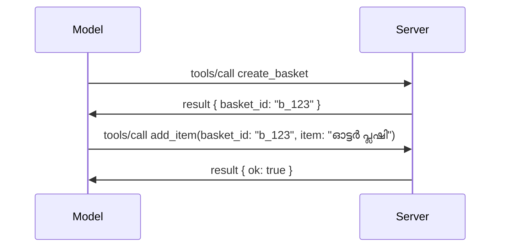

# MCP-ൽ എന്താണ് മാറുന്നത്: 2026-07-28 റിലീസ് കാൻഡിയിഡേറ്റ്

> **നില:** റിലീസ് കാൻഡിയിഡേറ്റ്. `2026-07-28` സ്പെസിഫിക്കേഷൻ എഴുത്തിൻ സമയത്ത് അന്തിമമല്ല. ഇത് 2026 മെയ് 21-ന് പ്രഖ്യാപിച്ചു, 2026 ജൂലൈ 28-ന് പുറത്തിറക്കാൻ പദ്ധതിയിടുന്നു. ഈ പാഠത്തിലെ എല്ലാ വിവരങ്ങളും റിലೀಸ್ കാൻഡിയിഡേറ്റിനെക്കുറിച്ച് വിവരിക്കുന്നു; ഇതിനെതിരെ നിർമ്മിക്കുന്നതിന് മുമ്പ് ഏറ്റവും പുതിയ നില പരിശോധിക്കാൻ [ഡ്രാഫ്റ്റ് സ്പെസിഫിക്കേഷൻ](https://modelcontextprotocol.io/specification/draft) കൂടാതെ അതിന്റെ [ചേഞ്ച് ലോഗ്](https://modelcontextprotocol.io/specification/draft/changelog) പരിശോധിക്കുക. ബാക്കി ഈ പാഠ്യപദ്ധതി നിലവിലുള്ള സ്ഥിരതയുള്ള റിലീസായ **MCP Specification 2025-11-25**-നെ അടിസ്ഥാനമാക്കി എഴുതിയതാണ്, `2026-07-28` പുറത്തിറങ്ങിയതിനു ശേഷം പരിഷ്‌ക്കരിക്കപ്പെടും.

## അവലോകനം

`2026-07-28` MCPന്റെ ആദ്യ വിപുലീകരണമായാണ് ഇത്. ആറു സ്പെസിഫിക്കേഷൻ എൻഹാൻസ്മെന്റ് പ്രൊപ്പോസലുകൾ (SEPs) പ്രോട്ടോക്കോൾ ലെവൽ സെഷനുകൾ നീക്കംചെയ്യുകയും MCPനെ ട്രാൻസ്പോർട്ട് ലെയറിൽ സ്റ്റേറ്റ്‌ലസ് ആകുകയും ചെയ്യുന്നു, എക്സ്റ്റൻഷനുകൾ പ്രഥമ-ക്ലാസ്, വേർഷൻഡ് മിക്കാനിസം ആയി മാറുന്നു, നേരത്തെ പഠിച്ച ചില ഫീച്ചറുകൾ (Roots, Sampling, Logging) പുതിയ ലൈഫ്സൈക്ക് നയത്തിന് കീഴിൽ ഡിപ്രിക്കേറ്റഡ് ആയി അടയാളപ്പെടുത്തിയിട്ടുണ്ട്. ഈ പാഠം മാറ്റങ്ങൾ, അതിന്റെ പ്രാധാന്യം, നിങ്ങൾ ഇതിനകം `2025-11-25` നെതിരെ എഴുതിയ കോഡിനുള്ള പ്രത്യാഘാതങ്ങൾ സംഗ്രഹിക്കുന്നു.

ഉറവിടം: [The 2026-07-28 MCP Specification Release Candidate](https://blog.modelcontextprotocol.io/posts/2026-07-28-release-candidate/) (Model Context Protocol Blog, ഡേവിഡ് സോഷ്യാ പര്രയും ഡെൻ ഡെലിമാർസ്കിയുമാണ്).

## പഠന ലക്ഷ്യങ്ങൾ

ഈ പാഠം അവസാനിപ്പിക്കുമ്പോൾ, നിങ്ങൾക്ക് സാധിക്കാം:

- MCP ഒരു സ്റ്റേറ്റ്‌ലസ് പ്രോട്ടോക്കോൾ കോറിലേക്ക് മാറുന്ന കാരണം വിശദീകരിക്കുക, പ്രത്യേകിച്ച് ഹോരിസോണ്ടാലി സ്കെയിൽ ചെയ്ത വിന്യാസങ്ങൾക്കായി ഇത് എന്ത് പ്രശ്നം പരിഹരിക്കുന്നു എന്ന്.
- `initialize`/`initialized` കൈമാറ്റവും `Mcp-Session-Id` ഹെഡറും എങ്ങനെ മാറ്റി വെച്ചിരിക്കുന്നു എന്ന് വിവരിക്കുക.
- പുതിയ `Mcp-Method`യും `Mcp-Name` ഹെഡറുകളും `ttlMs`/`cacheScope` ക്യാഷിംഗ് മെറ്റാഡാറ്റയും തിരിച്ചറിയുക.
- Extensions ഫ്രെയിംവർക്കും ഈ റിലീസുമായി എത്തുന്ന രണ്ട് എക്സ്റ്റൻഷനുകളും MCP ആപ്പുകളും ടാസ്ക്കുകളും തിരിച്ചറിയുക.
- OAuth 2.0 / OIDC നിരക്കുകൾ കർശനമാക്കുന്ന ആറ് സ്റ്റാൻഡേർഡ് SEPകൾ സൂചിപ്പിക്കുക.
- ഏതെല്ലാം കോർ ഫീച്ചറുകൾ (Roots, Sampling, Logging) ഡിപ്രിക്കേറ്റഡ് ആയി മാറിയിട്ടുണ്ട്, അതിന്റെ പ്രായോഗിക അർത്ഥം എന്താണെന്ന് വ്യക്തമാക്കുക.
- ടൂൾസ് `inputSchema`/`outputSchema` ന് ഫുൾ JSON Schema 2020-12 ഉള്ള മാറ്റം വിശദീകരിക്കുക.

## ഒരു സ്റ്റേറ്റ്‌ലസ് പ്രോട്ടോക്കോൾ

മുൻനിരയിലെ മാറ്റം: MCP പ്രോട്ടോക്കോൾ ലെയറിൽ സ്റ്റേറ്റ്‌ലസ് ആകുന്നു.

### മുമ്പ് (2025-11-25): സെഷനുകൾ നിങ്ങളെ ഒരു സേർവർ ഇൻസ്റ്റൻസ്‌ക്കു പിന്മടങ്ങുന്നു

Streamable HTTP-ൽ ഒരു ടൂൾ കോൾ ചെയ്യുമ്പോൾ `initialize` ഹാൻഡ്‌ഷേക്കുമായി ആരംഭിക്കുന്നു. സംവർത്തകൻ `Mcp-Session-Id` ഹെഡർ നൽകി പോകും, ഓരോ പിന്നീട് വരുന്ന അഭ്യർത്ഥനയും ഇത് ഉൾപ്പെടുത്തണം:

```http
POST /mcp HTTP/1.1
Mcp-Session-Id: 1868a90c-3a3f-4f5b
Content-Type: application/json

{"jsonrpc":"2.0","id":2,"method":"tools/call",
 "params":{"name":"search","arguments":{"q":"otters"}}}
```

സെഷൻ ഏതെങ്കിലും സേർവർ ഇൻസ്റ്റൻസുമായി ബന്ധിപ്പിക്കപ്പെട്ടതിനാൽ, ഹോരിസോണ്ടൽ സ്കെയിൽ ചെയ്യുന്ന വിന്യാസങ്ങൾക്ക് ലോഡ് ബാലൻസറിൽ **സ്റ്റിക്കി റൂട്ടിംഗ്**യും ഇൻസ്റ്റൻസുകൾക്കിടയിൽ **ഇക്കാലം പങ്കിടുന്ന സെഷൻ സ്റ്റോർ** ഉം ആവശ്യമുണ്ട്.

### ശേഷിക്കുന്ന മാറ്റം (2026-07-28): ഓരോ അഭ്യർത്ഥനയും സ്വയം പര്യാപ്തമാണ്

```http
POST /mcp HTTP/1.1
MCP-Protocol-Version: 2026-07-28
Mcp-Method: tools/call
Mcp-Name: search
Content-Type: application/json

{"jsonrpc":"2.0","id":1,"method":"tools/call",
 "params":{"name":"search","arguments":{"q":"otters"},
           "_meta":{"io.modelcontextprotocol/clientInfo":{"name":"my-app","version":"1.0"}}}}
```

ഏതെങ്കിലും സേർവർ ഇൻസ്റ്റൻസ് ഈ അഭ്യർത്ഥന കൈകാര്യം ചെയ്യാൻ കഴിയും. മുഖ്യ മാറ്റങ്ങൾ:

- **`initialize`/`initialized` ഹാൻഡ്‌ഷേക്കുകൾ നീക്കംചെയ്തു** ([SEP-2575](https://github.com/modelcontextprotocol/modelcontextprotocol/pull/2575)). പ്രോട്ടോക്കോൾ വേർഷൻ, ക്ലയന്റ് വിവരങ്ങൾ, കഴിവുകൾ ഓരോ അഭ്യർത്ഥനയുടെയും `_meta`-യിൽ ചേർക്കുന്നു. പുതിയ `server/discover` മെതഡ് വഴി ക്ലയന്റ് ആവശ്യത്തിന് മുന്നറിയിപ്പായി സേർവർ കഴിവുകൾ എടുക്കാം.
- **`Mcp-Session-Id` ഹെഡറും പ്രോട്ടോക്കോൾ ലെവൽ സെഷനും നീക്കംചെയ്തു** ([SEP-2567](https://github.com/modelcontextprotocol/modelcontextprotocol/pull/2567)). പ്രോട്ടോക്കോൾ ലെവലിൽ സ്റ്റിക്കി റൂട്ടിംഗ്, പോളിച്ച സെഷൻ സ്റ്റോറുകൾ ഇനി ആവശ്യമില്ല.

### സ്റ്റേറ്റ്‌ലസ് പ്രോട്ടോക്കോൾ, സ്റ്റേറ്റ്‌ഫുൾ ആപ്ലിക്കേഷനുകൾ

പ്രോട്ടോക്കോൾ ലെവൽ സെഷൻ നീക്കംചെയ്യുന്നത് നിങ്ങളുടെ സേർവർ സ്റ്റേറ്റ്‌ഫുൾ ആാകാനില്ല എന്നതല്ല. HTTP API-കൾ എപ്പോഴും ഉപയോഗിച്ചിരുന്നത് പോലെ ഒരു വ്യക്തമായ ഹാൻഡിൽ (ഉദാഹരണത്തിന് `basket_id`, `browser_id`) ഒരു ടൂൾ കോൾ വഴി സൃഷ്ടിച്ച് അതിനെ പിന്നീട് സാധാരണ ആർഗ്യുമെന്റായി ഓരോ കോളിലും പ്രവാഹിപ്പിക്കുക എന്നതാണ് നിർദ്ദേശിക്കപ്പെട്ട മാതൃക.



ഇത് സ്റ്റേറ്റ് ട്രാൻസ്പോർട്ട് മെറ്റാഡാറ്റയിൽ മറയ്ക്കാതെ മോഡലിനു ദൃശ്യവും പ്രാപ്യവുമാക്കുന്നു, കൂടാതെ ഏതെങ്കിലും സേർവർ ഇൻസ്റ്റൻസ് ഏത് കോൾവുമെങ്കിലും കൈകാര്യം ചെയ്യാനാകും.

### സേർവർ-ടു-ക്ലയന്റ് അഭ്യർത്ഥനകളുടെ പുനഃസംഘടനം

സ്റ്റേറ്റ്‌ലസ് പ്രോട്ടോക്കോൾ പോലും ഒരു സേർവർക്ക് മദ്ധ്യത്തിൽ (ഉദാഹരണം elicitation prompt) ക്ലയന്റോട് എന്തെങ്കിലും ആവശ്യപ്പെടാൻ മാർഗ്ഗം വേണം:

- **സേർവർ ആരംഭിക്കുന്ന അഭ്യർത്ഥനകൾക്ക് സേർവർ സജീവമായി ക്ലയന്റ് അഭ്യർത്ഥന പ്രോസസ്സ് ചെയ്‌തിരിക്കുമ്പോഴേയുള്ളൂ** ([SEP-2260](https://github.com/modelcontextprotocol/modelcontextprotocol/pull/2260)) — ഇന്‍റെറെണ്ണൽ നിർദേശം ആയതില്‍ നിന്ന് ആവശ്യമായ നയമായി മാറി. ഉപയോക്താവിന് യാദृച്ഛികമായ പ്രമ്പ്റ്റുകൾ കിട്ടില്ല.
- **മൾട്ടി റൗണ്ട്-ട്രിപ്പ് അഭ്യർത്ഥനകൾ** ([SEP-2322](https://github.com/modelcontextprotocol/modelcontextprotocol/pull/2322)) SSE സ്ട്രീം തുറന്ന നിലയിൽ വയ്ക്കുന്നതിനുപകരം ഉപയോഗിക്കുന്നു. അതിന് പകരം സേർവർ ഒരു `InputRequiredResult` നൽകുന്നു:

  ```json
  {
    "resultType": "inputRequired",
    "inputRequests": {
      "confirm": {
        "type": "elicitation",
        "message": "Delete 3 files?",
        "schema": { "type": "boolean" }
      }
    },
    "requestState": "eyJzdGVwIjoxLCJmaWxlcyI6WyJhIiwiYiIsImMiXX0="
  }
  ```

  ക്ലയന്റ് ഉത്തറുകൾ ശേഖരിച്ച് `inputResponses` കൂടാതെ മടക്കായി `requestState` ഉൾപ്പെടുത്തി യഥാർത്ഥ കോൾ വീണ്ടും അയയ്ക്കും. ആവശ്യമുള്ള മുഴുവൻ വിവരവും പെയ്ലോഡിൽ ആയതിനാൽ ഏത് സേർവർ ഇൻസ്റ്റൻസും റിറ്റ്രൈ ഏറ്റെടുക്കാം.

### റൂട്ടബിൾ, ക്യാഷബിൾ, ട്രേസബിൾ

മൂന്നു ചെറിയ മാറ്റങ്ങൾ സ്റ്റേറ്റ്‌ലസ്സ് ട്രാഫിക് എളുപ്പത്തിൽ നടത്താൻ സഹായിക്കുന്നു:

- **`Mcp-Method`യും `Mcp-Name` ഹെഡറുകളും Streamable HTTP-യിൽ നിർബന്ധമാണ്** ([SEP-2243](https://github.com/modelcontextprotocol/modelcontextprotocol/pull/2243)), അതിനാൽ ലോഡ് ബാലൻസറും ഗേറ്റ്വേയും റേറ്റ് ലിമിറ്ററുകളും JSON ബോഡി പരിശോധിക്കാതെ ഓപ്പറേഷൻ അടിസ്ഥാനമാക്കി റൂട്ടിംഗ് ചെയ്യാം. ഹെഡറുകളും ബോഡിയും പൊരുത്തപ്പെടാത്ത അഭ്യർത്ഥനകൾ സേർവർ തള്ളും.
- **`tools/list`യും റിസോഴ്‌സ് റീഡ് ഫലങ്ങളും `ttlMs`യും `cacheScope`ഉം സഞ്ചരിക്കുന്നു** ([SEP-2549](https://github.com/modelcontextprotocol/modelcontextprotocol/pull/2549)), HTTP `Cache-Control`-നെ അനുകരിച്ച്. ക്ലയന്റുകൾക്ക് ലിസ്റ്റിന്റെ ഫ്രഷ് ആയിരിക്കാനുള്ള കാലവും ഉപയോഗക്കാർക്കിടയിൽ പങ്കിടുമ്പോൾ സുരക്ഷിതമാണോ എന്ന് അറിയാം, നീണ്ടകാലം മേൽനോട്ടം ഉള്ള SSE സ്ട്രീം ആവശ്യമില്ലാതെ.
- **W3C ട്രേസ് കോൺടക്റ്റ് പ്രൊപ്പഗേഷൻ `_meta`-യിൽ രേഖപ്പെടുത്തി** ([SEP-414](https://github.com/modelcontextprotocol/modelcontextprotocol/pull/414)), `traceparent`, `tracestate`, `baggage` കീ നാമങ്ങൾ ശരിയാക്കി ώστε ഒരു ഡിസ്‌ട്രിബ്യൂട്ടഡ് ട്രേസ് ക്ലയന്റ് SDK, MCP സേർവർ, ഡൗൺസ്ട്രീം സിസ്റ്റങ്ങൾ എന്നിവിടങ്ങളിലിലൂടെ [OpenTelemetry](https://opentelemetry.io/)- അനുയോജ്യമായ ബാക്ക엔്ഡിൽ പിന്തുടരാൻ സാധിക്കും.

## എക്സ്റ്റൻഷനുകൾ പ്രഥമ-ക്ലാസ് ആകുന്നു

2025-11-25-ൽ എക്സ്റ്റൻഷനുകൾ ഒരു അനൗപചാരിക രൂപത്തിൽ മാത്രമായിരുന്നു. [SEP-2133](https://github.com/modelcontextprotocol/modelcontextprotocol/pull/2133) അവയെ ഔപചാരികമാക്കുന്നു:

- എക്സ്റ്റൻഷനുകൾ റിവേഴ്സ്-ഡി.എന്‍.എസ് IDകളാൽ തിരിച്ചറിയപ്പെടുന്നു.
- അവ ക്ലയന്റും സേർവറും ഉള്ള കഴിവുകളുടെ `extensions` മാപ്പിൽ പഞ്‌ജീകരിക്കുന്നു.
- അവ താൻയ്ക്ക് സ്വന്തം `ext-*` റിപോസിറ്ററികളിൽ നിലനിൽക്കുന്നു, ഡെലഗേറ്റഡ് മെയിന്റിനർമാരുമായി മാത്രവു മാത്രമല്ല, കോർ സ്പെസിഫിക്കേഷനിൽ നിന്നു സ്വതന്ത്രമായ വേർഷൻ നടത്തിപ്പിൻ കൂടെ.
- SEP പ്രക്രിയയിൽ പുതിയ എക്സ്റ്റൻഷൻ ട്രാക്ക് കുറിച്ച്, അവ പരീക്ഷണ ഘട്ടത്തിൽ നിന്നും ഔപചാരിക സ്ഥിതിയിലേക്ക് പോകാൻ മാർഗ്ഗം ഒരുക്കുന്നു.

ഈ റിലീസിൽ രണ്ട് ഔപചാരിക എക്‌സ്ടൻഷനുകൾ ഷിപ്പ് ചെയ്യുന്നു.

### MCP ആപ്പുകൾ: സേർവർ-റെൻഡർ ചെയ്ത ഉപയോക്തൃ ഇന്റർഫേസുകൾ

[MCP Apps](https://blog.modelcontextprotocol.io/posts/2026-01-26-mcp-apps/) ([SEP-1865](https://github.com/modelcontextprotocol/modelcontextprotocol/pull/1865)) സേർവർകൾ ഇന്റർആക്റ്റീവ് HTML ഇന്റർ‌ഫേസുകൾ ഷിപ്പ് ചെയ്യാൻ അനുവദിക്കുന്നു, ഹൊസ്റ്റുകൾ സമർപ്പണിക്കുക സ്ക്രീൻ ഐഫ്രെയിം ഉള്ളിൽ. ടൂളുകൾ അവരുടെ UI ടെംപ്ലേറ്റുകൾ മുമ്പേ പ്രഖ്യാപിക്കുന്നുവെന്ന് ഹൊസ്റ്റുകൾ പ്രിഫെച്ച്, ക്യാഷ് ചെയ്യുകയും സുരക്ഷാ പരിശോധന നടത്തുകയും ചെയ്യാൻ സാധിക്കുന്നു. നിങ്ങള് ഇതിനകം [പാഠം 15: MCP ആപ്പുകൾ](../03-GettingStarted/15-mcp-apps/README.md) പഠിച്ചിട്ടുണ്ട് — എക്സ്റ്റൻഷൻസ് ഫ്രെയിംവർക് കീഴിൽ MCP ആപ്പുകൾ ഔപചാരിക എക്സ്റ്റൻഷൻ ആയി മാറി, പരീക്ഷണ കോർ ഫീച്ചർ അല്ല.

### ടാസ്കുകൾ ഒരു എക്സ്ററ്റൻഷനായി കടന്നെത്തുന്നു

ടാസ്കുകൾ 2025-11-25 പരിഷ്കരണത്തിൽ പരീക്ഷണ കോർ ഫീച്ചറായി എത്തിച്ചേർത്തത്. പ്രൊഡക്ഷന്‍ ഉപയോഗം റീഡിസൈൻ ആവശ്യപ്പെട്ടു അതിനായി ശരിയായ സ്ഥലം ഒരു എക്സ്റ്റൻഷൻ: [ടാസ്ക്സ് എക്സ്റ്റൻഷൻ](https://github.com/modelcontextprotocol/modelcontextprotocol/pull/2663) സ്റ്റേറ്റ്‌ലസ് മോഡലിനെ ചുറ്റിപ്പറ്റി ജീവിതചക്രം പുനക്രമീകരിക്കുന്നു — സേർവർ `tools/call` ഒരിക്കൽ ടാസ്‌ക്ക് ഹാൻഡിൽ നൽകി മറുപടി നൽകാം, ക്ലയന്റ് `tasks/get`, `tasks/update`, `tasks/cancel` വഴി അത് മുന്നോട്ട് നയിക്കുന്നു. ടാസ്‌ക് സൃഷ്ടി സേർവർ നിർദ്ദേശം: ക്ലയന്റ് എക്സ്റ്റെൻഷൻ പരസ്യപ്പെടുത്തി, സേർവർ ഒരു കോൾ ടാസ്കായി ഓടേണ്ടത് തീരുമാനിക്കും. സെഷനുകൾ ഇല്ലാതെ സുരക്ഷിതമായി ടാസ്‌ക്ക് ലിസ്റ്റ് കരുതാൻ കഴിയാത്തതിനാൽ `tasks/list` പൂർണ്ണമായും നീക്കം ചെയ്തിരിക്കുന്നു.

> **മൈഗ്രേഷൻ നോട്ട്സ്:** പരീക്ഷണ `2025-11-25` ടാസ്‌ക്സ് API പ്രവർത്തിപ്പിച്ചിരുന്നോ? പുതിയ എക്സ്റ്റൻഷൻ ലൈഫ്‌സൈക്ക് നൽകുന്ന നയത്തിലേക്ക് മൈഗ്രേറ്റ് ചെയ്യേണ്ടതാണ് — പഴയ രീതിയോട് പൊരുത്തപ്പെടുന്നില്ല.

## അനുമതി കർശനമാക്കൽ

ആറ് SEP വെബ് OAuth 2.0 / OpenID Connect വിന്യാസങ്ങളോട് കൂടുതൽ കർശനമായി അനുമതി സ്പെസിഫിക്കേഷൻ [authorization specification](https://modelcontextprotocol.io/specification/draft/basic/authorization) ഒത്തുചേരാൻ സഹായിക്കുന്നു:

| SEP | മാറ്റം |
|---|---|
| [SEP-2468](https://github.com/modelcontextprotocol/modelcontextprotocol/pull/2468) | അദ്ധ്യക്ഷകർന്ന് സമർപ്പിച്ച.authorization response-കളിലെ `iss` പരാമീറ്റർ RFC 9207 മൂലം പരിശോധിക്കണം, MCPയുടെ സിംഗിൾ-ക്ലയന്റ്, മൾട്ടി-സേർവർ പ്ലാറ്റ്‌ഫോമിൽ വിഭ്രമം ഒഴിവാക്കാൻ. ഭാവിയിലുള്ള വേർഷൻ `iss` ഇല്ലാത്ത പ്രതികരണങ്ങൾ ഒഴിവ് ചെയ്യും. |
| [SEP-837](https://github.com/modelcontextprotocol/modelcontextprotocol/pull/837) | ഡൈനമിക് ക്ലയന്റ് രജിസ്ട്രേഷൻ സമയത്ത് ക്ലയന്റുകൾ അവരുടെ OpenID Connect `application_type` പ്രഖ്യാപിക്കും, ഡെസ്ക്ടോപ്/CLI ക്ലയന്റ് `"web"` ആയി ഡീഫോൾട്ട് ചെയ്തതിന് അനുമതി നൽകുവാനും ലൊക്കൽഹോസ്റ്റ് റീഡയറക്ട് URI തള്ളുന്നതിൽ നിന്ന് എവോയിൽറെന്യസെ. |
| [SEP-2352](https://github.com/modelcontextprotocol/modelcontextprotocol/pull/2352) | രജിസ്റ്റർ ചെയ്ത ക്രെഡൻഷ്യലുകൾ ഉടമസ്ഥതയുള്ള.authorization server ന്റെ `issuer`- ന് ബന്ധിപ്പിക്കുകയും, ഒരു റിസോഴ്‌സ്.authorization server മാറ്റുമ്പോൾ വീണ്ടും രജിസ്റ്റർ ചെയ്യുകയും ചെയ്യും. |
| [SEP-2207](https://github.com/modelcontextprotocol/modelcontextprotocol/pull/2207) | OpenID Connect-സ്റ്റൈൽ.authorization server-കളിൽ നിന്ന് റിഫ്രഷ് ടോക്കണുകൾ ആവശ്യപ്പെടുന്ന വിധം രേഖപ്പെടുത്തുന്നു. |
| [SEP-2350](https://github.com/modelcontextprotocol/modelcontextprotocol/pull/2350) | സ്റ്റേപ്പ്-അപ്പ്.authorization സമയത്ത് സ്‌കോപ്പ് ആമുഖം വിശദീകരിക്കുന്നു. |
| [SEP-2351](https://github.com/modelcontextprotocol/modelcontextprotocol/pull/2351) | `.well-known` ഡിസ്കവറി സഫിക്‌സ് വിശദീകരിക്കുന്നു. |

നിങ്ങൾ ഇന്നത്തെ MCP.authorization server നിർമ്മിച്ചാൽ, ഈ authorization responses-ൽ `iss` നൽകാൻ തുടങ്ങുക — നിലവിലെ.authorization മാർഗ്ഗനിർദ്ദേശം അറിയാൻ [02-Security](../02-Security/README.md) കാണുക.

## Roots, Sampling, Logging ഡിപ്രിക്കേറ്റഡ് ആകുന്നു

പുതിയ [ഫീച്ചർ ലൈഫ്സൈക്ക് നയം](https://github.com/modelcontextprotocol/modelcontextprotocol/pull/2577) ([SEP-2577](https://github.com/modelcontextprotocol/modelcontextprotocol/pull/2577)) പ്രകാരം, [Core Concepts](./README.md#roots) ൽ പഠിച്ച മൂന്ന് കോർ ക്ലയന്റ് പ്രിമിറ്റിവുകൾ **ഡിപ്രിക്കേറ്റഡ്** ആയി മാറുന്നു:

| ഫീച്ചർ | നിർദ്ദേശിച്ച മാറ്റ് |
|---|---|
| Roots | ടൂൾ പാരാമീറ്ററുകൾ, റിസോഴ്‌സ് URIകൾ, അല്ലെങ്കിൽ സേർവർ കോൺഫിഗറേഷൻ |
| Sampling | LLM പ്രൊവൈഡർ APIകളുമായി നേരിട്ട് ഇന്റഗ്രേഷൻ |
| Logging | stdio ട്രാൻസ്പോർട്ടുകൾക്കായുള്ള `stderr`; സ്ട്രക്ചർ ചെയ്ത മോണിറ്ററിംഗിനായി OpenTelemetry |

ഇതൊക്കെ **അനോട്ടേഷൻ മാത്രം ഡിപ്രിക്കേറ്റുകൾ** ആണ്: ഈ റിലീസിലും പിന്നീട് പുറത്തിറങ്ങുന്ന ഒരു വർഷത്തിനുള്ളിൽ ഉള്ള പതിപ്പുകളിലും ഇവയുടെ പ്രവർത്തനം നിലനിൽക്കും. അവ ഏതെങ്കിലും ഒറ്റതായി നീക്കംചെയ്യാൻ, ലൈഫ്സൈക്ക് നയം പ്രകാരം മറ്റൊരു SEP ആവശ്യമുണ്ട് — അതിനാൽ നിങ്ങളുടെ നിലവിലെ [Sampling](../03-GettingStarted/14-sampling/README.md) ഉദാഹരണങ്ങളിൽ ഇപ്പോൾ ഒന്നും പൊളിക്കില്ല, എന്നാൽ പുതിയ സേർവർകൾ മുകളിൽ കൊടുത്ത മാറ്റങ്ങൾ മുൻതൂക്കം നൽകണം.

## ടൂളുകൾക്കായി ഫുൾ JSON Schema 2020-12

ടൂൾസ് `inputSchema`-ഉം `outputSchema`-ഉം ഫുൾ [JSON Schema 2020-12](https://json-schema.org/draft/2020-12) ആയി ഉയർത്തിയിരിക്കുന്നു ([SEP-2106](https://github.com/modelcontextprotocol/modelcontextprotocol/pull/2106)):

- ഇൻപുട്ട് സ്കീമകൾക്ക് `type: "object"` റൂട്ടും തുടരുമെങ്കിലും ഇപ്പോൾ സംയോജനം (`oneOf`, `anyOf`, `allOf`), നിബന്ധനകൾ, റഫറൻസുകൾ (`$ref`, `$defs`) അനുമതിയാണ്.
- ഔട്ട്പുട്ട് സ്കീമകൾക്ക് തടസ്സമില്ല. `structuredContent` ഇപ്പോൾ ഒരു JSON മൂല്യമായി എല്ലാതരം ആകാം, ഒബ്ജക്ട് മാത്രമല്ല.
- ഇംപ്ലിമെന്റേഷനുകൾ ബാഹ്യ `$ref` URIകൾ സ്വയം-ഡിരഫറൻസ് ചെയ്യാൻ പാടില്ല, സ്കീമ ലബ്ധിയുടെ ആഴവും പരിശോദന സമയം നിയന്ത്രിക്കണം (സെർവർ-വശം സർവീസ് നിഷേധം പ്രതിരോധിക്കാൻ).

അതുപോലെ, ഒരു നഷ്ടപ്പെട്ട റിസോഴ്‌സിനുള്ള പിഴവ് കോഡ് MCP-ഉള്‍പ്പടെ `-32002` നിന്നു JSON-RPC സ്റ്റാൻഡേർഡ് `-32602` (അസാധുവായ പാരാമീറ്ററുകൾ) ആയി മാറുന്നു ([SEP-2164](https://github.com/modelcontextprotocol/modelcontextprotocol/pull/2164)). നിങ്ങളുടെ ക്ലയന്റ് തീർച്ചയായി `-32002` മൂല്യത്തിൽ ആശ്രയിച്ചിരുന്നെങ്കിൽ, അത് പുതുക്കേണ്ടിവരും.

## പ്രോട്ടോക്കോൾ ഇതുവരെ എങ്ങനെ വളരുന്നു

ഈ റിലീസ് ബ്രേക്കിംഗ് ചേഞ്ചുകൾ ഉൾക്കൊള്ളുന്നു, MCP പരിപാലകര്‍ പത്രികയായി ഇത് തുടരില്ല. മൂന്ന് ഗവർണൻസ് SEPകൾ ഇത് ആവർത്തിക്കുന്നത് തടയാൻ ശ്രമിക്കുന്നു:

- **ഫീച്ചർ ലൈഫ്സൈക് നയം** ഓരോ ഫീച്ചറും സജീവം → ഡിപ്രിക്കേറ്റഡ് → നീക്കം എന്ന പാതയിലാണ്, ഡിപ്രിക്കേഷൻ മുതൽ തുടക്കം വരെ കുറഞ്ഞത് പന്ത്രണ്ട് മാസം ഇടവേള കൂടിവരുന്നത്.
- **എക്സ്റ്റൻഷൻസ് ഫ്രെയിംവർക്ക്** പുതിയ കഴിവുകൾ ഓപ്റ്റ്-ഇൻ എക്സ്റ്റൻഷൻ ആയി ഷിപ്പ് ചെയ്‌തുകൊണ്ട് അവ ഉറപ്പുവരുത്തുന്നതിനു ശേഷം (എങ്കിൽ) കോർ സ്പെസിഫിക്കേഷനിലേക്ക് കടക്കാൻ അനുവദിക്കുന്നു.

- ഒരു സ്റ്റാൻഡേರ್ಡ് ട്രാക്ക് SEP ഫൈനൽ നിലയ്ക്ക് എത്താൻ കഴിയുന്നത് [conformance suite](https://github.com/modelcontextprotocol/conformance)യിൽ ഒരു പൊരി കണ്ടുമുട്ടുമ്പോഴോളെയാണ് ([SEP-2484](https://github.com/modelcontextprotocol/modelcontextprotocol/pull/2484)) — അതേ സ്യൂട്ട് [SDK ടിയർ സിസ്റ്റം](https://github.com/modelcontextprotocol/modelcontextprotocol/pull/1777) ഔദ്യോഗിക SDK കളെതിരെ സ്കോർ ചെയ്യുന്നതും.

## റിലീസ് ടൈംലൈൻയും സ്ഥിരീകരണവും

- റിലീസ് കാൻഡിഡേറ്റ് മെയ് 21, 2026ന് ലോക്ക് ചെയ്തു.
- ഫൈനൽ സ്പെസിഫിക്കേഷൻ ജൂലൈ 28, 2026 ന് ഷെഡ്യൂൾ ചെയ്തു.
- ഇരുവർക്കും ഇടയിൽ പത്ത് ആഴ്ചകളുള്ള വിൻഡോ SDK മാനേജർമാരും ക്ലയന്റ് നടപ്പാക്കുന്നവരും മാറ്റങ്ങൾ യഥാർത്ഥ വർക്ക്‌ലോഡുകളോട് പൊരുത്തപ്പെടുന്നതായി പരിശോധിക്കാൻ അനുവദിക്കുന്നു; ടിയർ 1 SDKകൾ ഈ വിൻഡോയിൽ പിന്തുണ നൽകണമെന്ന് പ്രതീക്ഷിക്കുന്നു [SDK ടിയർ സിസ്റ്റം](https://modelcontextprotocol.io/docs/sdk) പ്രകാരം.
- മുഴുവൻ മാറ്റങ്ങളും [ഡ്രാഫ്റ്റ് സ്പെസിഫിക്കേഷൻ](https://modelcontextprotocol.io/specification/draft)ലും ഇതിന്റെ [ചേഞ്ച്‌ലോഗിലും](https://modelcontextprotocol.io/specification/draft/changelog) ട്രാക്ക് ചെയ്യുക.

## ഈ പാഠ്യക്കുറിപ്പിന് ഇതിന്റെ അർത്ഥം

ഈ കോഴ്സിൽ ഇതുവരെ നിങ്ങൾ പഠിച്ചിട്ടുള്ളവ എല്ലാം **2025-11-25**-നെയാണ് ലക്ഷ്യമിടുന്നത്, അത് ഇപ്പോഴും `2026-07-28` പുറത്തിറങ്ങുന്നതുവരെ നിലവിലെ സ്ഥിരമായ സ്പെസിഫിക്കേഷൻ ആണ്. വ്യക്തമായി:

- **സെഷനുകളും `initialize` ഹാൻഡ്‌ഷേക്ക്** ( [Core Concepts](./README.md) ലും [Lesson 6: HTTP Streaming](../03-GettingStarted/06-http-streaming/README.md) ലും ഉൾപ്പെടുത്തിയതു) ഇപ്പോഴുള്ള രേഖ പ്രകാരമേ പ്രവർത്തിക്കുന്നത്, പക്ഷേ `2026-07-28`-നോട് അനുയോജ്യമായ SDKകളിലേക്ക് അപ്ഡേറ്റ് ചെയ്തത് കൊണ്ട് മുകളിൽപ്പറഞ്ഞ സ്റ്റാറ്റ്‌ലെസ് റിക്വസ്റ്റ് മോഡലാൽ പകരപ്പെടുമെന്ന് പ്രതീക്ഷിക്കുക.
- **സാമ്പ്ലിംഗും റൂട്ട്സും** (അതും [Core Concepts](./README.md) ലിൽ ഉൾപ്പെടുത്തിയതാണ്) ഇപ്പോൾ മുഴുവൻ ഫംഗ്ഷണലുമാണ് പക്ഷേ ഡീപ്രിക്കേറ്റ് ചെയ്തു കഴിഞ്ഞു — പുതിയ ഡിസൈനുകൾ മുകളിൽ പറയുന്ന പകരം തലങ്ങൾ ആണ് മുൻഗണന നൽകേണ്ടത്.
- **പരീക്ഷണപരമായ ടാസ്ക്സ് ഫീച്ചർ**, നിങ്ങൾ ഉപയോഗിച്ചിട്ടുണ്ടെങ്കിൽ, ടാസ്ക്സ് എക്സ്ടൻഷന്റെ പുതിയ ലൈഫ്സൈക്കിളിലേക്ക് മാറേണ്ടതുണ്ട്.
- **MCP ആപ്സ്** ([Lesson 15](../03-GettingStarted/15-mcp-apps/README.md)) പ്രാക്ടിക്കും ബാധിക്കില്ല; അതു വെറും ഔദ്യോഗിക എക്സ്ടൻഷൻസ് ഫ്രെയിംവർകിന് കീഴിൽ മാറുന്നത് മാത്രമാണ്.

## അധിക വിഭവങ്ങൾ

- [2026-07-28 MCP സ്പെസിഫിക്കേഷൻ റിലീസ് കാൻഡിഡേറ്റ് (ബ്ലോഗ് പോസ്റ്റ്)](https://blog.modelcontextprotocol.io/posts/2026-07-28-release-candidate/)
- [MCP ട്രാൻസ്‌പോർട്ടുകളുടെ ഭാവി](https://blog.modelcontextprotocol.io/posts/2025-12-19-mcp-transport-future/)
- [MCP ഡ്രാഫ്റ്റ് സ്പെസിഫിക്കേഷൻ](https://modelcontextprotocol.io/specification/draft)
- [MCP ഡ്രാഫ്റ്റ് ചേഞ്ച്‌ലോഗ്](https://modelcontextprotocol.io/specification/draft/changelog)
- [SEP മാർഗനിർദ്ദേശങ്ങൾ](https://modelcontextprotocol.io/community/sep-guidelines)
- [MCP SDK ടിയർ സിസ്റ്റം](https://modelcontextprotocol.io/docs/sdk)

## അടുത്തവർക്ക്

[Core Concepts](./README.md) ലേക്കു മടങ്ങി പോകുക അല്ലെങ്കിൽ [Security](../02-Security/README.md) ലേക്ക് തുടരുക ഇന്നത്തെ `2025-11-25` മാർഗ്ഗനിർദ്ദേശം വരാനിരിക്കുന്നതുമായി എങ്ങനെ പൊരുത്തപ്പെടുന്നതാണ് നോക്കാൻ.

---

<!-- CO-OP TRANSLATOR DISCLAIMER START -->
**അറിയിപ്പ്**:
ഈ രേഖ AI പരിഭാഷാ സേവനം [Co-op Translator](https://github.com/Azure/co-op-translator) ഉപയോഗിച്ച് പരിഭാഷപ്പെടുത്തിയതാണ്. ഞങ്ങൾ കൃത്യതയ്ക്കായി ശ്രമിക്കുന്നുവെങ്കിലും, ഓട്ടോമേറ്റഡ് പരിഭാഷകളിൽ പിഴവുകൾ അല്ലെങ്കിൽ തെറ്റായ വിവരങ്ങൾ ഉണ്ടാകാൻ സാധ്യതയുണ്ട്. അതിന്റെ സ്വാഭാവിക ഭാഷയിലുള്ള അസൽ രേഖയാണ് പ്രാമാണികമായ ഉറവിടമായി പരിഗണിക്കേണ്ടത്. നിർണായകമായ വിവരങ്ങൾക്ക്, പ്രൊഫഷണൽ മനുഷ്യ പരിഭാഷ ശുപാർശ ചെയ്യുന്നു. ഈ പരിഭാഷ ഉപയോഗിച്ച് ഉണ്ടാകുന്ന തെറ്റിദ്ധാരണകൾ അല്ലെങ്കിൽ തെറ്റായ വ്യാഖ്യാനങ്ങൾക്കായി ഞങ്ങൾ ഉത്തരവാദികളല്ല.
<!-- CO-OP TRANSLATOR DISCLAIMER END -->