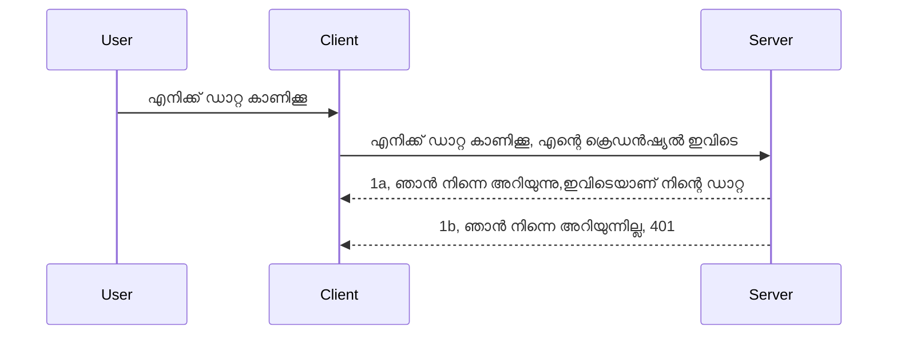

# ലളിതമായ ഓതെന്‍റിക്കേഷന്‍

MCP SDKകൾ OAuth 2.1 ഉപയോഗിക്കുന്നത് പിന്തുണയ്ക്കുന്നു, ഇത് സത്യത്തിൽ വളരെ സങ്കീർണമായ പ്രക്രിയയാണ്, അതിൽ ഓതെന്തിക്കേഷൻ സെർവർ, റിസോഴ്‌സ് സെർവർ, ക്രെഡൻഷ്യൽസ് പോസ്റ്റ് ചെയ്യൽ, കോഡ് ലഭിക്കൽ, കോഡ് ബിയർർ ടോക്കനിലേക്ക് മാറ്റൽ എന്നിവ ഉൾപ്പെടുന്നു, ഒടുവിൽ നിങ്ങൾക്ക് നിങ്ങളുടെ റിസോഴ്‌സ് ഡാറ്റ ലഭിക്കാനാകും. നിങ്ങൾക്ക് OAuth ഉപയോഗിക്കുന്ന പരിചയം ഇല്ലാത്തവരാണ് എങ്കിൽ (ഇത് നടപ്പിലാക്കാൻ മികച്ച വിഷയം), ചില അടിസ്ഥാന തരം ഓതെന്‍റിക്കേഷൻ ഉപയോഗിച്ച് ആരംഭിച്ച് മികച്ച സുരക്ഷയിലേക്ക് മുന്നോട്ട് പോകുന്നത് നല്ലതാണ്. അതുകൊണ്ട് ഈ അധ്യായം ഉണ്ട്, നിങ്ങളെ കൂടുതൽ പുരോഗമന ഓതെന്‍റിക്കേഷനിലേക്ക് കൊണ്ടുപോകാൻ.

## ഓതെന്‍റിക്കേഷന്‍ എന്ന് ഞങ്ങൾ എന്താണെന്ന് പറയുന്നത്?

ഓതെന്‍റിക്കേഷൻ(Authentication)യും ഓതോരൈസേഷൻ(Authorization)ഉം ചേർന്നതാണ് 'auth'. ഞങ്ങൾ രണ്ടുഭാഗങ്ങൾ ചെയ്യണം:

- **Authentication**, അത് നമ്മുടെ വീട്ടിലേക്ക് ആളെ പ്രവേശിക്കാൻ അനുവദിക്കണമോ എന്ന് പരിശോധിക്കുന്ന പ്രക്രിയയാണ്, അവരെ "ഇവിടെ" ഉണ്ടാകാനാവശ്യമായ അവകാശം ഉണ്ട് എന്ന് തിരിച്ചറിയുക, അതായത് നമ്മുടെ MCP സെർവർ ഫീച്ചറുകൾ പ്രവർത്തിക്കുന്ന റിസോഴ്‌സ് സെർവറിന് പ്രവേശനം ലഭ്യമാകണം.
- **Authorization**, ഉപയോക്താവ് ആവശ്യപ്പെടുന്ന പ്രത്യേക റിസോഴ്‌സുകളിൽ അവരെ എത്രവരെ പ്രവേശനം നൽകണമെന്ന് കണ്ടെത്തുക, ഉദാഹരണത്തിന് ഈ ഓർഡറുകൾ അല്ലെങ്കിൽ ഉത്പന്നങ്ങൾ, അല്ലെങ്കിൽ അവർ ഉള്ളടക്കം വായിക്കാമെങ്കിലും ഇല്ലാതാക്കാൻ അനുവാദമില്ല പോലുള്ള മറ്റൊരു ഉദാഹരണം.

## ക്രെഡൻഷ്യൽസ്: സിസ്റ്റം ഞങ്ങളെ ആരാണെന്ന് അറിയിക്കുന്നത് എങ്ങനെ

വെബ് ഡെവലപ്പർമാരിൽ ഭൂരിഭാഗവും സെർവറിന് ഒരു ക്രെഡൻഷ്യൽ നൽകുകയാണ് ചിന്തിക്കുന്നത്, സാധാരണയായി "Authentication" എന്നതിന് അവരെ ഇവിടെ പ്രവേശിക്കാൻ അനുമതി നൽകിയിരിക്കുന്നില്ലെന്ന് കാണിക്കുന്ന ഒരു രഹസ്യം. ഈ ക്രെഡൻഷ്യൽ സാധാരണയായി യൂസർനേം, പാസ്സ്‌വേര്‍ഡ് എന്നിവയുടെ ബേസ്64 എൻകോഡ് പതിപ്പോ അല്ലെങ്കിൽ സവിശേഷമായി ഒരു ഉപയോക്താവിനെ തിരിച്ചറിയുന്ന API കീയോ ആയിരിക്കും.

ഇത് "Authorization" എന്നാണ് വിളിക്കുന്ന ഹെഡറിൽ ഇങ്ങനെ അയക്കുന്നത്:

```json
{ "Authorization": "secret123" }
```

ഇത് സാധാരണയായി അടിസ്ഥാന ഓതെന്‍റിക്കേഷൻ (basic authentication) എന്നറിയപ്പെടുന്നു. തുടർന്ന് ആകെ ഫ്ലോയുടെ പ്രവർത്തനം ഇങ്ങനെ ആണ്:



ഫ്ലോയുടെ നജങ്കെട്ട് നമുക്ക് മനസ്സിലായി, ഇനി ഇത് എങ്ങനെയാണ് നടപ്പിലാക്കുന്നത്? കൂടുതൽവെബ് സെർവറുകൾ ക്കു ഒരു "middleware" എന്ന ആശയം ഉണ്ട്, ആവശ്യമുള്ള കോഡ് ഭാഗം, ഇത് റിക്വസ്റ്റ് ഭാഗമായാണ് പ്രവർത്തിക്കുന്നത്, ക്രെഡൻഷ്യൽസ് ശരിയാണെന്ന് പരിശോധിക്കുകയും ശരിയായാൽ റിക്വസ്റ്റ് കടത്തിമാറ്റാൻ അനുവദിക്കുകയും ചെയ്യുന്നു. റിക്വസ്റ്റ് സാധുവായ ക്രെഡൻഷ്യൽസ് ഇല്ലാതിരിക്കുകയാണെങ്കിൽ, ഓതെന്‍റിക്കേഷൻ പിശക് കാണിക്കും. ഇതു എങ്ങനെ നടപ്പിലാക്കാമെന്ന് നോക്കാം:

**Python**

```python
class AuthMiddleware(BaseHTTPMiddleware):
    async def dispatch(self, request, call_next):

        has_header = request.headers.get("Authorization")
        if not has_header:
            print("-> Missing Authorization header!")
            return Response(status_code=401, content="Unauthorized")

        if not valid_token(has_header):
            print("-> Invalid token!")
            return Response(status_code=403, content="Forbidden")

        print("Valid token, proceeding...")
       
        response = await call_next(request)
        # പ്രതികരണത്തിൽ ഏതെങ്കിലും കസ്റ്റമർ ഹെഡറുകൾ ചേർക്കുക അല്ലെങ്കിൽ ചില രീതിയിൽ മാറ്റം വരുത്തുക
        return response


starlette_app.add_middleware(CustomHeaderMiddleware)
```

ഇവിടെ ഞങ്ങൾ:

- `AuthMiddleware` എന്ന മിഡിൽവെയർ സൃഷ്ടിച്ചു, അതിന്റെ `dispatch` മെത്തഡ് വെബ് സെർവറിൽ നിന്ന് വിളിക്കപ്പെടുന്നു.
- മിഡിൽവെയർ വെബ് സെർവറിലേക്ക് ചേർത്തു:

    ```python
    starlette_app.add_middleware(AuthMiddleware)
    ```

- Authorization ഹെഡർ ഉണ്ടോ എന്നു ചെക്ക് ചെയ്യുകയും അയക്കുന്ന രഹസ്യം സാധുവാണോ എന്നു പരിശോധന നടത്തുകയും ചെയ്യുന്ന വെരിഫിക്കേഷൻ ലൊജിക് എഴുതിയിട്ടുണ്ട്:

    ```python
    has_header = request.headers.get("Authorization")
    if not has_header:
        print("-> Missing Authorization header!")
        return Response(status_code=401, content="Unauthorized")

    if not valid_token(has_header):
        print("-> Invalid token!")
        return Response(status_code=403, content="Forbidden")
    ```

    രഹസ്യം ഉണ്ടും സാധുവുമായെങ്കിൽ `call_next` കോളുചെയ്ത് റിക്വസ്റ്റ് കടത്തിമാറ്റുകയും റസ്‌പോൺസ് റിട്ടേൺ ചെയ്യുകയും ചെയ്യുന്നു.

    ```python
    response = await call_next(request)
    # ഉപഭോക്തൃ ഹെഡറുകൾ ചേർക്കുക അഥവാ പ്രതികരണത്തിൽ ഏതെങ്കിലും രൂപത്തിൽ മാറ്റം വരുത്തുക
    return response
    ```

ഇത് എങ്ങനെയാണ് പ്രവർത്തിക്കുന്നത് എന്ന്; വെബ് റിക്വസ്റ്റ് സെർവറിലേക്ക് വന്നാൽ മിഡിൽവെയർ വിളിക്കപ്പെടും, അതിന്റെ നടപ്പാക്കൽ പ്രകാരം റിക്വസ്റ്റ് കടത്തിവിടുകയോ അല്ലെങ്കിൽ ഉപഭോക്താവിന് മുന്നോട്ടു പോകാൻ അനുമതിയില്ലെന്ന് കാണിക്കുന്ന പിശക് തിരിച്ചു തരുകയും ചെയ്യും.

**TypeScript**

ഇവിടെ പ്രശസ്തമായ Express ഫ്രെയിംവർക്ക് ഉപയോഗിച്ച് ഒരു മിഡിൽവെയർ സൃഷ്ടിച്ച് MCP സെർവറിലേക്ക് റിക്വസ്റ്റ് എത്തുന്നതിനുമുമ്പ് അത് കുത്തിപ്പിടിക്കുന്നുണ്ട്. അതിന്റെ കോഡ് ഇവിടെ:

```typescript
function isValid(secret) {
    return secret === "secret123";
}

app.use((req, res, next) => {
    // 1. ഓതോറൈസേഷൻ ഹെഡർ ഉണ്ടോ?
    if(!req.headers["Authorization"]) {
        res.status(401).send('Unauthorized');
    }
    
    let token = req.headers["Authorization"];

    // 2. സാധുത പരിശോധിക്കുക.
    if(!isValid(token)) {
        res.status(403).send('Forbidden');
    }

   
    console.log('Middleware executed');
    // 3. അഭ്യർത്ഥന അടുത്ത ഘട്ടത്തിൽ പാസ് ചെയ്യുന്നു.
    next();
});
```

ഈ കോഡിൽ ഞങ്ങൾ:

1. ആദ്യം Authorization ഹെഡർ ഉണ്ടോയെന്ന് പരിശോധിക്കുന്നു, ഇല്ലെങ്കിൽ 401 പിശക് അയയ്ക്കുന്നു.
2. ക്രെഡൻഷ്യൽ/ടോക്കൺ സാധുവാണെന്ന് ഉറപ്പാക്കുന്നു, ഇല്ലെങ്കിൽ 403 പിശക് അയയ്ക്കുന്നു.
3. അവസാനം റിക്വസ്റ്റ് പൈപ്പ്‍ലൈനിൽ റിക്വസ്റ്റ് കടത്തിവിടുകയും ആവശ്യപ്പെട്ട റിസോഴ്‌സ് റിട്ടേൺ ചെയ്യുകയും ചെയ്യുന്നു.

## അഭ്യാസം: ഓതെന്‍റിക്കേഷൻ നടപ്പിലാക്കുക

നമ്മുടെ അറിവ് ഉപയോഗിച്ച് ഒരു പ്രയോഗം പരിശ്രമിക്കാം. പദ്ധതിയാണ്:

സർവര്‍

- ഒരു വെബ് സെർവർ ഒപ്പം MCP ഇൻസ്റ്റൻസ് സൃഷ്ടിക്കുക.
- സർ‌‌വറിനായി ഒരു മിഡിൽവെയർ നടപ്പിലാക്കുക.

ക്ലയന്റ്  

- ഹെഡറിലൂടെയാണ് ക്രെഡൻഷ്യൽ സഹിതം വെബ് റിക്വസ്റ്റ് അയയ്ക്കുക.

### -1- ഒരു വെബ് സെർവർ ഒപ്പം MCP ഇൻസ്റ്റൻസ് സൃഷ്ടിക്കുക

> **മുന്നോട്ട് നോക്കുക:** താഴെയുള്ള TypeScript ഉദാഹരണം `mcp-session-id` കീ ഉപയോഗിച്ചുള്ള `transports` മാപ്പിൽ HTTP ട്രാൻസ്പോർട്ടുകൾ ട്രാക്ക് ചെയ്യുന്നു, **MCP സ്പെസിഫിക്കേഷൻ 2025-11-25** പ്രകാരം. `2026-07-28` റിലീസ് കാൻഡിഡേറ്റ് `initialize` ഹാൻഡ്‌ഷേക്ക് ഒപ്പം സെഷൻ ID പൂർണ്ണമായും അകറ്റുന്നു, അതിനാൽ ഈ സെഷൻ അടിസ്ഥാന ട്രാൻസ്പോർട്ട് മാപ്പ് ഒഴിവാക്കപ്പെടും സ്റ്റേറ്റ്‌ലസും സ്വയം ഉൾക്കൊള്ളുന്ന റിക്വസ്റ്റ് കൾക്കായി. കൂടുതൽ വായിക്കൂ [MCP-ൽ എന്തെല്ലാം മാറുന്നു: 2026-07-28 റിലീസ് കാൻഡിഡേറ്റ്](../../01-CoreConcepts/mcp-2026-07-28-release-candidate.md).

ആദ്യ ഘട്ടത്തിൽ, ഞങ്ങൾ വെബ് സെർവർ ഇൻസ്റ്റൻസ് ഒപ്പം MCP സെർവർ സൃഷ്ടിക്കണം.

**Python**

ഇവിടെ MCP സെർവർ ഇൻസ്റ്റൻസ് സൃഷ്ടിച്ച്, സ്റ്റാർലെറ്റ് വെബ് ആപ്പ് ഉണ്ടാക്കി അത് uvicorn ഉപയോഗിച്ച് ഹോസ്റ്റ് ചെയ്യുന്നു.

```python
# MCP സെർവർ സൃഷ്ടിക്കുന്നു

app = FastMCP(
    name="MCP Resource Server",
    instructions="Resource Server that validates tokens via Authorization Server introspection",
    host=settings["host"],
    port=settings["port"],
    debug=True
)

# സ്റ്റാർലെറ്റ് വെബ് അപ്ലിക്കേഷൻ സൃഷ്ടിക്കുന്നു
starlette_app = app.streamable_http_app()

# uvicorn വഴി അപ്ലിക്കേഷൻ സർവ് ചെയ്യുന്നു
async def run(starlette_app):
    import uvicorn
    config = uvicorn.Config(
            starlette_app,
            host=app.settings.host,
            port=app.settings.port,
            log_level=app.settings.log_level.lower(),
        )
    server = uvicorn.Server(config)
    await server.serve()

run(starlette_app)
```

ഈ കോഡിൽ ഞങ്ങൾ:

- MCP സെർവർ സൃഷ്ടിച്ചു.
- MCP സെർവറിൽ നിന്നും Starlette വെബ് ആപ്പ് നിർമ്മിച്ചു, `app.streamable_http_app()`.
- uvicorn ഉപയോഗിച്ച് വെബ് ആപ്പ് ഹോസ്റ്റ് ചെയ്തു, സർവു ചെയ്തു `server.serve()`.

**TypeScript**

ഇവിടെ MCP സെർവർ ഇൻസ്റ്റൻസ് സൃഷ്ടിക്കുന്നു.

```typescript
const server = new McpServer({
      name: "example-server",
      version: "1.0.0"
    });

    // ... സെർവർ റിസോഴ്‌സുകൾ, ടൂളുകളും പ്രോംപ്റ്റുകളും ക്രമീകരിക്കുക ...
```

ഈ MCP സെർവർ സൃഷ്ടിക്കുന്നത് POST /mcp റൂട്ടിൽ സംഭവിക്കണം, അതിനാൽ മേൽ കൊടുത്ത കോഡ് എടുത്ത് ഇങ്ങനെ മാറ്റാം:

```typescript
import express from "express";
import { randomUUID } from "node:crypto";
import { McpServer } from "@modelcontextprotocol/sdk/server/mcp.js";
import { StreamableHTTPServerTransport } from "@modelcontextprotocol/sdk/server/streamableHttp.js";
import { isInitializeRequest } from "@modelcontextprotocol/sdk/types.js"

const app = express();
app.use(express.json());

// സെഷൻ ഐഡിയാൽ ട്രാൻസ്പോർട്ടുകൾ സംഭരിക്കാൻ മാപ്പ്
const transports: { [sessionId: string]: StreamableHTTPServerTransport } = {};

// ക്ലയന്റ്-ടു-സെർവർ കമ്മ്യൂണിക്കേഷനിനുള്ള POST അഭ്യർത്ഥനകൾ കൈകാര്യം ചെയ്യുക
app.post('/mcp', async (req, res) => {
  // നിലവിൽ ഉണ്ടായ സെഷൻ ഐഡി പരിശോധിക്കുക
  const sessionId = req.headers['mcp-session-id'] as string | undefined;
  let transport: StreamableHTTPServerTransport;

  if (sessionId && transports[sessionId]) {
    // നിലവിലുള്ള ട്രാൻസ്പോർട്ട് വീണ്ടും ഉപയോഗിക്കുക
    transport = transports[sessionId];
  } else if (!sessionId && isInitializeRequest(req.body)) {
    // പുതിയ ഓർമ്മപ്പെടുത്തൽ അഭ്യർത്ഥന
    transport = new StreamableHTTPServerTransport({
      sessionIdGenerator: () => randomUUID(),
      onsessioninitialized: (sessionId) => {
        // സെഷൻ ഐഡിയാൽ ട്രാൻസ്പോർട്ട് സംഭരിക്കുക
        transports[sessionId] = transport;
      },
      // പിന്ന backward കോമ്പാറ്റിബിലിറ്റിക്ക് ഡിഎൻഎസ് റിബൈൻഡിംഗ് പ്രൊട്ടക്ഷൻ ഡിഫോൾട്ടായി അസක්‍රීയമാണ്. നിങ്ങൾ ഈ സെർവർ
      // ലോക്കലായി ഓടിക്കുന്നുവെങ്കിൽ, ഉറപ്പാക്കുക ഇത് സജ്ജമാക്കാൻ:
      // enableDnsRebindingProtection: true,
      // allowedHosts: ['127.0.0.1'],
    });

    // ക്ലോസ് ചെയ്തപ്പോൾ ട്രാൻസ്പോർട്ട് ശുചിയാക്കുക
    transport.onclose = () => {
      if (transport.sessionId) {
        delete transports[transport.sessionId];
      }
    };
    const server = new McpServer({
      name: "example-server",
      version: "1.0.0"
    });

    // ... സെർവർ റിസോഴ്‌സുകൾ, ടൂൾസ്, പ്രോംപ്റ്റുകൾ സജ്ജീകരിക്കുക ...

    // MCP സെർവറോട് കണക്ടുചെയ്യുക
    await server.connect(transport);
  } else {
    // അസാധുവായ അഭ്യർത്ഥന
    res.status(400).json({
      jsonrpc: '2.0',
      error: {
        code: -32000,
        message: 'Bad Request: No valid session ID provided',
      },
      id: null,
    });
    return;
  }

  // അഭ്യർത്ഥന കൈകാര്യം ചെയ്യുക
  await transport.handleRequest(req, res, req.body);
});

// GET, DELETE അഭ്യർത്ഥനകൾക്ക് പുനരുപയോഗയോഗ്യമായ ഹാൻഡ്ളർ
const handleSessionRequest = async (req: express.Request, res: express.Response) => {
  const sessionId = req.headers['mcp-session-id'] as string | undefined;
  if (!sessionId || !transports[sessionId]) {
    res.status(400).send('Invalid or missing session ID');
    return;
  }
  
  const transport = transports[sessionId];
  await transport.handleRequest(req, res);
};

// SSE മുഖാന്തിരം സെർവർ-ടു-ക്ലയന്റ് അറിയിപ്പുകൾക്കുള്ള GET അഭ്യർത്ഥനകൾ കൈകാര്യം ചെയ്യുക
app.get('/mcp', handleSessionRequest);

// സെഷൻ അവസാനിപ്പിക്കുന്നതിനുള്ള DELETE അഭ്യർത്ഥനകൾ കൈകാര്യം ചെയ്യുക
app.delete('/mcp', handleSessionRequest);

app.listen(3000);
```

ഇനി കാണാം MCP സെർവർ സൃഷ്ടിക്കൽ `app.post("/mcp")`യിലേക്ക് മാറ്റിയതാണ്.

ഇനി അടുത്ത ഘട്ടത്തിലേക്ക് പോവാം, മിഡിൽവെയർ സൃഷ്ടിക്കുകയും അതിലൂടെ വരുന്ന ക്രെഡൻഷ്യൽ സാധുവായതായി ഉറപ്പുവരുത്തുകയും ചെയ്യാം.

### -2- സർവറിനായി മിഡിൽവെയർ നടപ്പിലാക്കുക

മിഡിൽവെയർ തയ്യാറാക്കാം. ഇത് `Authorization` ഹെഡറിൽ നിന്ന് ക്രെഡൻഷ്യൽ അന്വേഷിക്കുന്നതാണ്, അത് സ്വീകരിക്കാവുന്നതാണെങ്കിൽ റിക്വസ്റ്റ് അഗലായും MCP ക്ലയന്റ് ചോദിച്ച ഫങ്ഷണാലിറ്റികള്‍ പോലെ നിർബന്ധമനുസരിച്ച് പ്രവർത്തിക്കും (ഉദാഹരണത്തിന് ടൂൾസ് ലിസ്റ്റ് ചെയ്യുക, റിസോഴ്‌സ് വായിക്കുക).

**Python**

മിഡിൽവെയർ സൃഷ്ടിക്കാൻ, `BaseHTTPMiddleware` ക്ലാസ് ഇറക്കുമതി ചെയ്തതിൽനിന്ന് വംശപരമ്പരയായി ഒരു ക്ലാസ് ഉണ്ടാകണം. രണ്ട് പ്രധാന ഘടകങ്ങളുണ്ട്:

- റിക്വസ്റ്റ് `request`, അതിൽ നിന്നും ഹെഡർ വിവരങ്ങൾ വായിക്കുന്നു.
- `call_next`, ഉപഭോക്താവ് നല്കിയ ക്രെഡൻഷ്യൽ സ്വീകരിച്ചാൽ ഇത് വിളിക്കേണ്ട കോൾബാക്ക്.

ആദ്യം, `Authorization` ഹെഡർ ഇല്ലായെങ്കിൽ കൈകാര്യം ചെയ്യണം:

```python
has_header = request.headers.get("Authorization")

# ഹെഡർ ഇല്ല, 401-ന് പരാജയപ്പെടുക, അല്ലെങ്കിൽ മുന്നോട്ട് പോവുക.
if not has_header:
    print("-> Missing Authorization header!")
    return Response(status_code=401, content="Unauthorized")
```

ഇവിടെ 401 unauthorized സന്ദേശം അയക്കുന്നു, ഉപഭോക്താവ് ഓതെന്‍റിക്കേഷൻ പരാജയപ്പെട്ടു എന്ന് കാണിക്കുന്നു.

തുടർന്ന്, ക്രെഡൻഷ്യൽ നൽകിയാൽ അതിന്റെ സാധുത പരിശോധിക്കണം:

```python
 if not valid_token(has_header):
    print("-> Invalid token!")
    return Response(status_code=403, content="Forbidden")
```

മുകളിൽ 403 forbidden സന്ദേശം അയക്കുന്നത് കാണുക. മുഴുവൻ മിഡിൽവെയർ ഇവിൾപ്പിച്ചത് താഴെയുള്ളതാണ്:

```python
class AuthMiddleware(BaseHTTPMiddleware):
    async def dispatch(self, request, call_next):

        has_header = request.headers.get("Authorization")
        if not has_header:
            print("-> Missing Authorization header!")
            return Response(status_code=401, content="Unauthorized")

        if not valid_token(has_header):
            print("-> Invalid token!")
            return Response(status_code=403, content="Forbidden")

        print("Valid token, proceeding...")
        print(f"-> Received {request.method} {request.url}")
        response = await call_next(request)
        response.headers['Custom'] = 'Example'
        return response

```

നല്ലതു, പക്ഷേ `valid_token` ഫങ്ഷൻ എവിടെ? താഴെ കാണുക:

```python
# ഉത്പാദനത്തിന് ഉപയോഗിക്കരുത് - ഇത് മെച്ചപ്പെടുത്തുക !!
def valid_token(token: str) -> bool:
    # "Bearer " പ്രിഫിക്സ് നീക്കം ചെയ്യുക
    if token.startswith("Bearer "):
        token = token[7:]
        return token == "secret-token"
    return False
```

ഇതു വ്യക്തമാകെ മെച്ചപ്പെടുത്തേണ്ടതാണ്.

പ്രധാനമാണ്: എപ്പോഴും ഇത്തരം രഹസ്യങ്ങൾ കോഡിൽ സൂക്ഷിക്കരുത്. മൂല്യം നീക്കം ചെയ്യുന്നതിനായി ഡേറ്റാപ്രവാഹം, ഐ.ഡി.പി. (identity service provider) എന്നിവയിൽ നിന്നോ അല്ലെങ്കിൽ ഐ.ഡി.പി. സേവനം തന്നെ സാധുത പരിശോധന നടത്തേണ്ടതാണ്.

**TypeScript**

Express ഉപയോഗിച്ച് ഇത് നടപ്പാക്കാൻ, മിഡിൽവെയർ ഫങ്ഷനുകൾ സ്വീകരിക്കുന്ന `use` മെത്തഡ് വിളിക്കണം.

ചെയ്യേണ്ടത്:

- റിക്വസ്റ്റ് വേരിയബിളിൽ പ്രവർത്തിച്ച് `Authorization` പ്രോപ്പർട്ടിയിലെ ക്രെഡൻഷ്യൽ പരിശോധിക്കുക.
- ക്രെഡൻഷ്യൽ സാധുവാണെന്ന് തിരസ്കരിച്ച് വമ്പിച്ചാൽ, റിക്വസ്റ്റ് തുടർന്ന കൊണ്ടുപോകുകയും ഉപഭോക്താവിന്റെ MCP അഭ്യർത്ഥന ചെയ്യേണ്ടതു ചെയ്യും (ഉദാ: ടൂൾസ് ലിസ്റ്റ് ചെയ്യുക, റിസോഴ്‌സ് വായിക്കുക).

ഇവിടെ, `Authorization` ഹെഡർ ഉണ്ടോയെന്ന് പരിശോധിക്കുന്നു, ഇല്ലെങ്കിൽ റിക്വസ്റ്റ് വഴിയില്ലാതാക്കുന്നു:

```typescript
if(!req.headers["authorization"]) {
    res.status(401).send('Unauthorized');
    return;
}
```

ഹെഡർ തുടങ്ങുന്നില്ലെങ്കിൽ ആദ്യം 401 ലഭിക്കും.

തുടർന്ന്, ക്രെഡൻഷ്യൽ സാധുവാണെന്ന് നോക്കി, അല്ലെങ്കിൽ റിക്വസ്റ്റ് തടയുന്നു, പക്ഷേ വ്യത്യസ്ത പിശക് സന്ദേശം ആണ്:

```typescript
if(!isValid(token)) {
    res.status(403).send('Forbidden');
    return;
} 
```

കാണൂ, ഇനി 403 പിശക് ലഭിക്കും.

മുഴുവൻ കോഡ്:

```typescript
app.use((req, res, next) => {
    console.log('Request received:', req.method, req.url, req.headers);
    console.log('Headers:', req.headers["authorization"]);
    if(!req.headers["authorization"]) {
        res.status(401).send('Unauthorized');
        return;
    }
    
    let token = req.headers["authorization"];

    if(!isValid(token)) {
        res.status(403).send('Forbidden');
        return;
    }  

    console.log('Middleware executed');
    next();
});
```

വെബ് സെർവർ മിഡിൽവെയർ സ്വീകരിക്കാൻ സജ്ജമാക്കി, ഉപഭോക്താവ് നമുക്ക് അയയ്ക്കാൻ ഉറപ്പുള്ള ക്രെഡൻഷ്യൽ പരിശോധിക്കാൻ. ഉപഭോക്താവ് തന്നെ എങ്ങനെയാണ്?

### -3- ഹെഡറിലൂടെയുള്ള ക്രെഡൻഷ്യൽ സഹിതം വെബ് റിക്വസ്റ്റ് അയയ്ക്കുക

ഉപഭോക്താവ് ക്രെഡൻഷ്യൽ ഹെഡറിൽ പോകുന്നതായി ഉറപ്പാക്കണം. MCP ക്ലയന്റ് ഉപയോഗിക്കാനായി അത് എങ്ങനെ ചെയ്യാമെന്ന് മനസ്സിലാക്കണം.

**Python**

ക്ലയന്റിനായി ഹെഡറുമായി ക്രെഡൻഷ്യൽ ഇങ്ങനെ നൽകണം:

```python
# മൂല്യം ഹാർഡ്‌കോഡ് ചെയ്യരുത്, ഏതാണ്ട് പരിസ്ഥിതി വേരിയബിളിൽ അല്ലെങ്കിൽ കൂടുതൽ സുരക്ഷിതമായ സംഭരണത്തിൽ വയ്ക്കുക
token = "secret-token"

async with streamablehttp_client(
        url = f"http://localhost:{port}/mcp",
        headers = {"Authorization": f"Bearer {token}"}
    ) as (
        read_stream,
        write_stream,
        session_callback,
    ):
        async with ClientSession(
            read_stream,
            write_stream
        ) as session:
            await session.initialize()
      
            # ചെയ്യേണ്ടത്, ക്ലയന്റിൽ എന്ത് ചെയ്യണമെന്ന്, ഉദാഹരണത്തിന് ടൂൾസ് ലിസ്റ്റ് ചെയ്യുക, ടൂൾസ് വിളിക്കുക മുതലായവ.
```

കാണൂ, `headers` പ്രോപ്പർട്ടി ഇങ്ങനെ നിറവേറ്റുന്നു: ` headers = {"Authorization": f"Bearer {token}"}`.

**TypeScript**

ഇത് രണ്ട് ഘട്ടത്തിൽ തീർക്കാം:

1. ക്രെഡൻഷ്യൽ സ്വീകരിച്ച കോൺഫിഗറേഷൻ ഒബ്ജക്റ്റ് പൂരിപ്പിക്കുക.
2. ട്രാൻസ്പോർട്ടിലേക്ക് കോൺഫിഗറേഷൻ ഒബ്ജക്റ്റ് നൽകുക.

```typescript

// ഇവിടെ കാണിച്ചുപോലെയുള്ള മൂല്യം ഹാർഡ്കോഡ് ചെയ്യരുത്. ಕನಿಷ್ಠ അതിനെ ഒരു env വേരിയബിളായി വെക്കാനും ഡെവേൽപ്‌മെന്റ് മോദിൽ dotenv പോലുള്ള ഒന്നിനെ ഉപയോഗിക്കാനുമാണ് ഉദ്ദേശ്യം.
let token = "secret123"

// ക്ലയന്റ് ട്രാൻസ്പോർട്ട് ഓപ്‌ഷൻ ഓബ്‌ജക്റ്റ് നിർവചിക്കുക
let options: StreamableHTTPClientTransportOptions = {
  sessionId: sessionId,
  requestInit: {
    headers: {
      "Authorization": "secret123"
    }
  }
};

// ഓപ്‌ഷൻസ് ഓബ്‌ജക്റ്റ് ട്രാൻസ്പോർട്ടിലേക്ക് പാസ്സ് ചെയ്യുക
async function main() {
   const transport = new StreamableHTTPClientTransport(
      new URL(serverUrl),
      options
   );
```

മുകളിൽ കാണൂ, `options` ഒബ്ജക്റ്റ് ഉണ്ടാക്കി `requestInit` പ്രോപ്പർട്ടിയിൽ ഹെഡറുകൾ വെച്ചു.

പ്രധാനമാണ്: ഇവിടെ ഇത് മെച്ചപ്പെടുത്തേണ്ടത് എങ്ങനെ? ഇപ്പഴത്തെ നടപ്പാക്കൽ ചില പ്രശ്നങ്ങളുണ്ട്. ആദ്യം, ഈ രകാരം ക്രെഡൻഷ്യൽ അയയ്ക്കുന്നത് എല്ലാ മുന്നിൽ HTTPS ഇല്ലെങ്കിൽ അപകടകാരിയാണ്. HTTPS ഉള്ളപ്പോൾ പോലും, ടോക്കൺ മോഷ്ടിക്കപ്പെടാം, അവിടെ ടോക്കൺ റദ്ദ് ചെയ്യാനും, ലോകത്തിലെ എവിടെ നിന്നാണെന്ന് പരിശോധിക്കാനും (ബോട്ട് പോലുള്ള പെരുമാറ്റം), കൂടുതൽ പരിശോധനകൾ ചേർക്കാനും വേണ്ടിയുള്ള ഒരു സംവിധാനമുണ്ടാകണം.

എന്ന് പറയപ്പെടണം, വളരെ ലളിതമായ APIകൾക്കുള്ളതിന്, ആരെയും ഓതെന്‍റിക്കേഷൻ ഇല്ലാതെ API ആകർഷിക്കുന്നില്ലെങ്കില്‍ ഞങ്ങൾ ഇതു നല്ല തുടക്കം.

അതുപോലെ, സുരക്ഷ കുറച്ച് ശക്തമാക്കാൻ JSON വെബ് ടോക്കൺ, ഉദാഹരണം പോലെ JWT അല്ലെങ്കിൽ "ജോട്ടി" ടോക്കണുകൾ ഉപയോഗിക്കാം.

## JSON വെബ് ടോക്കൺസ്, JWT

അതായത്, ലളിതമായ ക്രെഡൻഷ്യൽ അയയ്ക്കുന്നത് മെച്ചപ്പെടുത്താൻ ശ്രമിക്കുകയാണ് ഞങ്ങൾ. JWT സ്വീകരിക്കുന്നത് കൊണ്ട് ഉടനടി നേടുന്ന മെച്ചപ്പെടുത്തലുകൾ എന്തൊക്കെയാണ്?

- **സുരക്ഷ മെച്ചപ്പെടുത്തലുകൾ**. അടിസ്ഥാന ഓതെന്‍റിക്കേഷനിൽ, നിങ്ങൾ ഓരോ നേരവും യൂസർനേം-പാസ്സ്‌വേർഡ് ബേസ്64 എൻകോഡുചെയ്ത് (അല്ലെങ്കിൽ API കീ) അയക്കുന്നുണ്ടെങ്കിൽ അപകടം കൂടുന്നു. JWT-യിൽ, നിങ്ങൾ യൂസർനേം-പാസ്സ്‌വേർഡ് അയച്ച് ടോക്കൺ കിട്ടും, ഇത് സമയബന്ധിതമാണ്, അർത്ഥം കാലഹരണപെടുത്തപ്പെടും. JWT നിങ്ങൾക്ക് മുൻ‌നിലവിലെ നിയന്ത്രണം അനുവദിക്കുന്നു മറ്റുപ്രത്യേകം റോൾസ്, സ്‌കോപ്പുകൾ, അനുമതികൾ ഉപയോഗിച്ച്.
- **സ്റ്റേറ്റ്‌ലസും സ്കെയിലബിലിറ്റിയും**. JWT സ്വയം ഉൾക്കൊള്ളുന്നതാണ്, എല്ലാ ഉപയോക്തൃ വിവരങ്ങളും ഉൾക്കൊള്ളുന്നു, സර්വർപാര്ട്ടി സെഷൻ സ്റ്റോറേജ് ആവശ്യമില്ലാതാക്കുന്നു. ടോക്കൺ തുറക്കാനും സാധുത പരിശോധിക്കാനും പ്രാദേശികമായി സാധിക്കും.
- **ഇന്റർഓപ്പറബിലിറ്റിയും ഫെഡറേഷനും**. JWT ഓപ്പൺ ഐഡി കണക്ടിന്റെ കേന്ദ്രമാണ്, Entra ID, Google Identity, Auth0 പോലുള്ള അറിയപ്പെടുന്ന ഐഡന്റിറ്റി പ്രൊവൈഡറുകളുമായി ഉപയോഗിക്കുന്നു. ഒറ്റ-സൈൻ-ഓൺ സാധ്യവും മറ്റും ഒരു എന്റർപ്രൈസ് ഗ്രേഡായി മാറ്റുന്നു.
- **മൊഡുലാരിറ്റിയും സൗമ്യതയും**. JWT Azure API Management, NGINX പോലുള്ള API ഗേറ്റ്വേസ് ഉപയോഗിക്കാം. ഓതെന്‍റിക്കേഷൻ സീനാരിയോകളും സേർവർ-ടു-സേർവർ കമ്മ്യൂണിക്കേഷനുകളും ഇംപ്രസണേഷൻ, ഡെലിഗേഷൻ ഉൾപ്പെടെ പിന്തുണയ്ക്കുന്നു.
- **പ്രകടനവും ക്യാഷിങും**. JWT ഡികോഡ് ചെയ്ത ശേഷം ക്യാഷേ ചെയ്‌ത് പാഴ്‌സിംഗ് ആവശ്യം കുറയ്ക്കും. ഇത് പ്രത്യേകിച്ച് ഉയർന്ന ട്രാഫിക് ആപ്പുകൾക്ക് ഗുണം ചെയ്യും, ത്രൂപുട്ട് മെച്ചപ്പെടുത്തും, നിങ്ങളുടെ അടിസ്ഥാന സംവിധാനത്തിൽ ചരക്ക് കുറയ്‌ക്കും.
- **അധിക സവിശേഷതകൾ**. ഇന്ററോസ്പെക്ഷനും (സെർവറിൽ സാധുത പരിശോധിക്കൽ), റിവോക്കേഷനും (ടോക്കൺ അസാധുവാക്കൽ) പിന്തുണയ്ക്കുന്നു.

ഈ എല്ലാ ഗുണങ്ങളും കൊണ്ട്, എങ്ങനെ നടപ്പാക്കൽ അടുത്ത നിലയിലേക്ക് കൊണ്ടുപോകാമെന്ന് നോക്കാം.

## അടിസ്ഥാന ഓതെന്‍റിക്കേഷൻ JWTയാക്കി മാറ്റുക

അതായത്, ഉയർന്ന നിലയിൽ ചെയ്യേണ്ട മാറ്റങ്ങൾ:

- **JWT ടോക്കൺ സൃഷ്ടിക്കേണ്ടത്** ഉപഭോക്താവിൽ നിന്നും സെർവറിലേക്ക് അയക്കാൻ തയ്യാറാക്കുക.
- **JWT ടോക്കൺ സാധുത പരിശോധിക്കുക**, ശരിയാണെങ്കിൽ ഉപഭോക്താവ് നമ്മുടെ റിസോഴ്‌സുകൾക്ക് പ്രവേശനം ലഭിക്കും.
- **സുരക്ഷിത ടോക്കൺ സൂക്ഷിക്കൽ**. ഈ ടോക്കൺ എങ്ങനെ സൂക്ഷിക്കും.
- **റൂട്ടുകൾ സംരക്ഷിക്കുക**. റൂട്ടുകളും പ്രത്യേക MCP ഫീച്ചറുകളും സംരക്ഷിക്കണം.
- **റിഫ്രഷ് ടോക്കണുകൾ ചേർക്കുക**. കുറച്ചു കാലം ഉള്ള ടോക്കണുകൾ സൃഷ്ടിച്ച്, കാലഹരണപെട്ടാൽ പുതുതായി ടോക്കൺ ലഭിക്കാൻ ദൈർഘ്യമുള്ള റിഫ്രഷ് ടോക്കണുകളും ഉണ്ടാക്കുക. റിഫ്രഷ് എണ്ട്പോയിന്റും റോട്ടേഷൻ നയവും ഉറപ്പാക്കുക.

### -1- JWT ടോക്കൺ നിർമ്മിക്കുക

ആദ്യം, JWT ടോക്കണിന് താഴെപ്പറഞ്ഞ ഭാഗങ്ങൾ ഉണ്ട്:

- **header**, ആൽഗോരിഥം ഉപയോഗിച്ച ഘടകം, ടോക്കൺ തരവും.
- **payload**, ക്ലെയിംസ്, ഉദാഹരണത്തിന് sub (ടോക്കൺ പ്രതിനിധീകരിക്കുന്ന ഉപയോക്താവ് അല്ലെങ്കിൽ സംസ്ഥാനം, സാധാരണ userid), exp (കാലഹരണ തീയതി), role (പങ്ക്)
- **signature**, രഹസ്യത്തോടോ പ്രൈവറ്റ് കിയോഡോയോ ഒപ്പിട്ടതാണ്.

ഇതിന്, header, payload നിർമ്മിച്ച് എൻകോഡുചെയ്‌ത ടോക്കൺ സൃഷ്ടിക്കണം.

**Python**

```python

import jwt
import jwt
from jwt.exceptions import ExpiredSignatureError, InvalidTokenError
import datetime

# JWT സൈൻ ചെയ്യാൻ ഉപയോഗിക്കുന്ന രഹസ്യ കീ
secret_key = 'your-secret-key'

header = {
    "alg": "HS256",
    "typ": "JWT"
}

# ഉപയോക്തൃ വിവരങ്ങളും അതിന്റെ അവകാശങ്ങളും കാലഹരണപ്പൂർത്തിയായ സമയം
payload = {
    "sub": "1234567890",               # വിഷയം (ഉപയോക്തൃ ഐഡി)
    "name": "User Userson",                # ഇഷ്‌ടാനുസൃത അവകാശം
    "admin": True,                     # ഇഷ്‌ടാനുസൃത അവകാശം
    "iat": datetime.datetime.utcnow(),# പുറപ്പെടുവിച്ചത്
    "exp": datetime.datetime.utcnow() + datetime.timedelta(hours=1)  # കാലഹരണം
}

# ഇത് എൻകോഡ് ചെയ്യുക
encoded_jwt = jwt.encode(payload, secret_key, algorithm="HS256", headers=header)
```

മുകളിൽ കാണുന്ന കോഡിൽ:

- HS256 ആൽഗോരിഥമായി ഉപയോഗിച്ച്, ടോക്കൺ കോഡ് JWT ആണെന്ന് header നിർവ്വചിച്ചു.
- ഒരു payload സൃഷ്ടിച്ചു, അതിൽ ഉപയോക്തൃ ഐഡി, യൂസർനെയിം, റോൾ, ഇഷ്യൂ ചെയ്ത തീയതി, കാലഹരണ തീയതി ഉൾക്കൊള്ളുന്നു, കാലഹരണത്തിന്റെയും സമയബന്ധിതത്വത്തിന്റെ നടപ്പാക്കൽ.

**TypeScript**

ഇവിടെ JWT ടോക്കൺ സൃഷ്ടിക്കാൻ സഹായിക്കുന്ന ചില ഡിപ്പൻഡൻസികൾ വേണം.

ഡിപ്പൻഡൻസികൾ

```sh

npm install jsonwebtoken
npm install --save-dev @types/jsonwebtoken
```

അത് ഒരുക്കിയ ശേഷം, header, payload സൃഷ്ടിച്ച് എൻകോഡുചെയ്‌ത് ടോക്കൺ സൃഷ്ടിക്കാം.

```typescript
import jwt from 'jsonwebtoken';

const secretKey = 'your-secret-key'; // പ്രൊഡക്ഷനിൽ env vars ഉപയോഗിക്കുക

// പേലോഡ് നിർവചിക്കുക
const payload = {
  sub: '1234567890',
  name: 'User usersson',
  admin: true,
  iat: Math.floor(Date.now() / 1000), // പുറത്തുവിട്ടത്
  exp: Math.floor(Date.now() / 1000) + 60 * 60 // 1 മണിക്കൂറിൽ കാലഹരണപ്പെടും
};

// ഹെഡർ നിർവചിക്കുക (ഐച്ഛികം, jsonwebtoken ഡിഫോൾട്ടുകൾ സജ്ജീകരിക്കുന്നു)
const header = {
  alg: 'HS256',
  typ: 'JWT'
};

// ടോക്കൺ സൃഷ്ടിക്കുക
const token = jwt.sign(payload, secretKey, {
  algorithm: 'HS256',
  header: header
});

console.log('JWT:', token);
```

ഈ ടോക്കൺ:

HS256 ഉപയോഗിച്ച് ഒപ്പിട്ടതും
1 മണിക്കൂറായി സാധുവമായതും
sub, name, admin, iat, exp പോലുള്ള ക്ലെയിംസ് ഉൾക്കൊള്ളുന്നതും ആണ്.

### -2- ടോക്കൺ സാധുത പരിശോധിക്കുക

ടോക്കൺ സാധുത പരിശോധിക്കേണ്ടതാണ്, സെർവറിൽ ഇത് ചെയ്യണം ഉപഭോക്താവ് അയക്കുന്നത് ശരിയാണ് എന്ന് ഉറപ്പാക്കാൻ. ഘടന മുതൽ സാധുത വരെയുള്ള വലുതായും ചെറിയവയായ പരിശോധനകൾ ചെയ്യേണ്ടതുണ്ട്. ഉപയോക്താവ് നിങ്ങളുടെ സിസ്റ്റത്തിലുണ്ടോയെന്നും മറ്റു പരിശോധനകളും ചേർക്കാൻ ഉത്സാഹിപ്പിക്കുന്നു.

ടോക്കൺ പരിശോധിക്കാൻ, അത് ഡികോഡ് ചെയ്ത് വായിച്ച് സാധുത പരിശോധിക്കണം:

**Python**

```python

# JWT ഡീകോഡ് ചെയ്ത് സ്ഥിരീകരിക്കുക
try:
    decoded = jwt.decode(token, secret_key, algorithms=["HS256"])
    print("✅ Token is valid.")
    print("Decoded claims:")
    for key, value in decoded.items():
        print(f"  {key}: {value}")
except ExpiredSignatureError:
    print("❌ Token has expired.")
except InvalidTokenError as e:
    print(f"❌ Invalid token: {e}")

```


ഈ കോഡിൽ, ടോക്കൺ, രഹസ്യ കീ, തിരഞ്ഞെടുക്കപ്പെട്ട ആൽഗോരിതം എന്നിവ इनपुटയായി ഉപയോഗിച്ച് `jwt.decode` വിളിക്കുന്നു. സാധൂകരണം പരാജയപ്പെടുമ്പോൾ പിശക് ഉയർന്നുവരുന്നതായതിനാൽ നാം ഒരു try-catch ഘടന ഉപയോഗിക്കുന്ന വിധം ശ്രദ്ധിക്കുക.

**TypeScript**

ഇവിടെ നാം ടോക്കൺ ഡികോഡ് ചെയ്ത പതിപ്പ് ലഭിക്കുന്നതിനായി `jwt.verify` വിളിക്കണം, അതിനെ പിന്നീട് വിശദമായി വിശകലനം ചെയ്യാൻ കഴിയും. ഈ വിളിപ്പ് പരാജയപ്പെട്ടാൽ, ടോക്കണിന്റെ ഘടന തെറ്റ് ആണെന്നോ അല്ലെങ്കിൽ അത് ഇനി സാധുവായിട്ടില്ലെന്നോ അർത്ഥം.

```typescript

try {
  const decoded = jwt.verify(token, secretKey);
  console.log('Decoded Payload:', decoded);
} catch (err) {
  console.error('Token verification failed:', err);
}
```

കുറിപ്പ്: മുമ്പ് പറഞ്ഞപോലെ, ഈ ടോക്കൺ നമ്മുടെ സിസ്റ്റത്തിൽ ഒരു ഉപയോക്താവിനെ സൂചിപ്പിക്കുന്നുണ്ടെന്നും ഉപയോക്താവിന് അവകാശങ്ങൾ ഉണ്ടെന്ന് ഉറപ്പുവരുത്താൻ അധിക പരിശോധനകൾ നടത്തണം.

പിന്നീട്, റോൾ അടിസ്ഥാനControlled പ്രവേശന നിയന്ത്രണമായ RBAC നോക്കാം.

## റോൾ അടിസ്ഥാനControlled പ്രവേശന നിയന്ത്രണം ചേർക്കൽ

വ്യത്യസ്ത റോളുകൾക്ക് വ്യത്യസ്താനുമതികൾ ഉണ്ടെന്നു നമ്മൾ അറിയിക്കാൻ ഉദ്ദേശിക്കുന്നു. ഉദാഹരണത്തിന്, ഒരു അഡ്മിൻ എല്ലാം ചെയ്യാവുന്നവനായി കരുതുന്നു, ഒരു സാധാരണ ഉപയോക്താവ് വായന/വഴുതും ചെയ്യാൻ കഴിയും എന്നും, ഒരു ഗസ്റ്റ് പകരം വായിക്കുന്നത് മാത്രമേ സാധൂകരിക്കൂവെന്നും കരുതുന്നു. അതിനാൽ, ചില അനുമതിയുടെ നിലകൾ ഈസാധ്യമാണ്:

- Admin.Write 
- User.Read
- Guest.Read

മിഡിൽവെയർ ഉപയോഗിച്ച് അത്തരം നിയന്ത്രണം എങ്ങനെ നടപ്പാക്കാമെന്ന് നോക്കാം. മിഡിൽവെയർ ഓരോ റൂട്ടിനും അതുപോലെ എല്ലാ റൂട്ടിനും ചേർക്കാം.

**Python**

```python
from starlette.middleware.base import BaseHTTPMiddleware
from starlette.responses import JSONResponse
import jwt

# ഇതുപോലെ രഹസ്യം കോഡിൽ ഉണ്ടായിരിക്കരുത്, ഇത് പ്രദർശനത്തിന് മാത്രമാണ്. സുരക്ഷിതമായ സ്ഥലത്ത് നിന്ന് വായിക്കുക.
SECRET_KEY = "your-secret-key" # ഇത് എൻവാറിയബിൾ ആയി ഇടുക.
REQUIRED_PERMISSION = "User.Read"

class JWTPermissionMiddleware(BaseHTTPMiddleware):
    async def dispatch(self, request, call_next):
        auth_header = request.headers.get("Authorization")
        if not auth_header or not auth_header.startswith("Bearer "):
            return JSONResponse({"error": "Missing or invalid Authorization header"}, status_code=401)

        token = auth_header.split(" ")[1]
        try:
            decoded = jwt.decode(token, SECRET_KEY, algorithms=["HS256"])
        except jwt.ExpiredSignatureError:
            return JSONResponse({"error": "Token expired"}, status_code=401)
        except jwt.InvalidTokenError:
            return JSONResponse({"error": "Invalid token"}, status_code=401)

        permissions = decoded.get("permissions", [])
        if REQUIRED_PERMISSION not in permissions:
            return JSONResponse({"error": "Permission denied"}, status_code=403)

        request.state.user = decoded
        return await call_next(request)


```

മിഡിൽവെയർ ചേർക്കുന്നതിനുള്ള ചില വ്യത്യസ്ത മാർഗങ്ങൾ താഴെപ്പോലെ ഉണ്ട്:

```python

# വഴിയറ്റു 1: സ്റ്റാർലെറ്റ് ആപ്പ് നിർമ്മിക്കുന്നപ്പോൾ മിഡിൽവെയർ ചേർക്കുക
middleware = [
    Middleware(JWTPermissionMiddleware)
]

app = Starlette(routes=routes, middleware=middleware)

# വഴിയറ്റു 2: സ്റ്റാർലെറ്റ് ആപ്പ് ഇതിനകം നിർമ്മിച്ചശേഷം മിഡിൽവെയർ ചേർക്കുക
starlette_app.add_middleware(JWTPermissionMiddleware)

# വഴിയറ്റു 3: ഓരോ റൂട്ടിനും മിഡിൽവെയർ ചേർക്കുക
routes = [
    Route(
        "/mcp",
        endpoint=..., # ഹാൻഡ്ലർ
        middleware=[Middleware(JWTPermissionMiddleware)]
    )
]
```

**TypeScript**

`app.use` ഉപയോഗിച്ച് എല്ലാ അഭ്യർത്ഥനകൾക്കും പ്രവർത്തിക്കുന്ന ഒരു മിഡിൽവെയർ ഉപയോഗിക്കാം.

```typescript
app.use((req, res, next) => {
    console.log('Request received:', req.method, req.url, req.headers);
    console.log('Headers:', req.headers["authorization"]);

    // 1. ഓതോറൈസേഷൻ ഹെഡർ അയച്ചിട്ടുണ്ടോ എന്ന് പരിശോധിക്കുക

    if(!req.headers["authorization"]) {
        res.status(401).send('Unauthorized');
        return;
    }
    
    let token = req.headers["authorization"];

    // 2. ടോക്കൺ സാധുവാണോ എന്ന് പരിശോധിക്കുക
    if(!isValid(token)) {
        res.status(403).send('Forbidden');
        return;
    }  

    // 3. ടോക്കണിലെ ഉപയോക്താവ് നമ്മുടെ സിസ്റ്റത്തിലുണ്ടോ എന്ന് പരിശോധിക്കുക
    if(!isExistingUser(token)) {
        res.status(403).send('Forbidden');
        console.log("User does not exist");
        return;
    }
    console.log("User exists");

    // 4. ടോക്കണിന് ശരിയായ അനുമതികൾ ഉണ്ടോ എന്ന് സ്ഥിരീകരിക്കുക
    if(!hasScopes(token, ["User.Read"])){
        res.status(403).send('Forbidden - insufficient scopes');
    }

    console.log("User has required scopes");

    console.log('Middleware executed');
    next();
});

```

മിഡിൽവെയർ ചെയ്യേണ്ട ചില കാര്യങ്ങൾ ഇതുവരെ ധാരണയായിട്ടുണ്ട്, അവ പൊതുവെ:

1..authorization ഹെഡർ ഉണ്ടോ എന്ന് പരിശോധിക്കുക
2. ടോക്കൺ സാധുവാണോയെന്ന് പരിശോധിക്കുക, ഞങ്ങൾ എഴുതിയ `isValid` മെത്തഡ് ഉപയോഗിച്ച് JWT ടോക്കൺയുടെ അക്കാദക്ഷതയും സാധുതയും പരിശോധിക്കും.
3. ഉപയോക്താവ് നമ്മുടെ സിസ്റ്റത്തിൽ നിലവിലുണ്ടോ എന്ന് പരിശോധിക്കുക, ഇത് ഉറപ്പാക്കണം.

   ```typescript
    // ഡാറ്റാബേസിലെ ഉപയോക്താക്കൾ
   const users = [
     "user1",
     "User usersson",
   ]

   function isExistingUser(token) {
     let decodedToken = verifyToken(token);

     // ചെയ്യേണ്ടത്, ഉപയോക്താവ് ഡാറ്റാബേസിൽ നിലവിലുണ്ടോ എന്ന് പരിശോധിക്കുക
     return users.includes(decodedToken?.name || "");
   }
   ```

   മുകളിൽ ഒരു ലളിതമായ `users` ലിസ്റ്റ് സൃഷ്ടിച്ചിട്ടുണ്ട്, ഇത് സാധാരണയായി ഡേറ്റാബേസിൽ വയ്ക്കണം.

4. കൂടാതെ, ടോക്കൺ ശരിയായ അനുമതികൾ ഉൾക്കൊള്ളുന്നുണ്ടോ എന്ന് പരിശോധിക്കണം.

   ```typescript
   if(!hasScopes(token, ["User.Read"])){
        res.status(403).send('Forbidden - insufficient scopes');
   }
   ```

   മിഡിൽവെയർ കോഡിൽ മുകളിൽ കാണുന്നത് പോലെ, ടോക്കണിന് User.Read അനുമതി ഉണ്ടെങ്കിലേ കടന്നുപോകൂ; അല്ലെങ്കിൽ 403 പിശക് അയയ്ക്കും. താഴെയുള്ളത് `hasScopes` സഹായി മെത്തഡാണ്.

   ```typescript
   function hasScopes(scope: string, requiredScopes: string[]) {
     let decodedToken = verifyToken(scope);
    return requiredScopes.every(scope => decodedToken?.scopes.includes(scope));
  }
   ```

Have a think which additional checks you should be doing, but these are the absolute minimum of checks you should be doing.

Using Express as a web framework is a common choice. There are helpers library when you use JWT so you can write less code.

- `express-jwt`, helper library that provides a middleware that helps decode your token.
- `express-jwt-permissions`, this provides a middleware `guard` that helps check if a certain permission is on the token.

Here's what these libraries can look like when used:

```typescript
const express = require('express');
const jwt = require('express-jwt');
const guard = require('express-jwt-permissions')();

const app = express();
const secretKey = 'your-secret-key'; // put this in env variable

// Decode JWT and attach to req.user
app.use(jwt({ secret: secretKey, algorithms: ['HS256'] }));

// Check for User.Read permission
app.use(guard.check('User.Read'));

// multiple permissions
// app.use(guard.check(['User.Read', 'Admin.Access']));

app.get('/protected', (req, res) => {
  res.json({ message: `Welcome ${req.user.name}` });
});

// Error handler
app.use((err, req, res, next) => {
  if (err.code === 'permission_denied') {
    return res.status(403).send('Forbidden');
  }
  next(err);
});

```

മിഡിൽവെയർ സ്വന്തമായി authentication ഒപ്പം authorizationക്കും ഉപയോഗിക്കുന്ന വിധം നിങ്ങ കാണിച്ചു കഴിഞ്ഞു, പക്ഷേ MCP എന്ന പക്ഷം എങ്ങനെ? auth ചെയ്യുന്നതിന്റെ രീതിയെ മാറ്റുമോ? അടുത്ത ഭാഗത്തു നോക്കാം.

### -3- MCP ലേക്ക് RBAC ചേർക്കുക

ഇതുവരെ മിഡിൽവെയർ വഴി RBAC എങ്ങനെ ചേർക്കാമെന്ന് കണ്ടു, എന്നാൽ MCP-നു ഓരോ ഫീച്ചർ അധിഷ്ഠിതമായ RBAC ചേർക്കാനൊരു എളുപ്പ മാർഗം ഇല്ല; എങ്കിൽ എന്ത് ചെയ്യും? ഈ സാഹചര്യത്തിൽ ഒരു പ്രത്യേക ടൂൾക്ക് ഒരു ക്ലയന്റ് കോളു അനുവദിച്ചിട്ടുണ്ടോ എന്നു പരിശോധിക്കുന്ന കൊഡ് ചേർക്കണം:

ഓരോ ഫീച്ചറിനും RBAC നടപ്പാക്കുന്നതിനുള്ള ചില വഴികൾ ഉണ്ട്, ഇവയാണിവ:

- ഓരോ ടൂൾ, റിസോഴ്‌സ്, പ്രോമ്പ്റ്റിനും അനുമതി നിലവാരം പരിശോധിക്കാൻ ഒരു ചെക്കും ചേർക്കുക.

   **python**

   ```python
   @tool()
   def delete_product(id: int):
      try:
          check_permissions(role="Admin.Write", request)
      catch:
        pass # ക്ലയന്റ് പ്രാമാണികീകരണം പരാജയപ്പെടുത്തി, പ്രാമാണികതാ പിശക് ഉയർത്തുക
   ```

   **typescript**

   ```typescript
   server.registerTool(
    "delete-product",
    {
      title: Delete a product",
      description: "Deletes a product",
      inputSchema: { id: z.number() }
    },
    async ({ id }) => {
      
      try {
        checkPermissions("Admin.Write", request);
        // ചെയ്യേണ്ടത്, id-productService-ലും remote entry-ലും അയയ്ക്കുക
      } catch(Exception e) {
        console.log("Authorization error, you're not allowed");  
      }

      return {
        content: [{ type: "text", text: `Deletected product with id ${id}` }]
      };
    }
   );
   ```


- വികസിത സെർവർ സമീപനം ഉപയോഗിച്ച് അഭ്യർത്ഥന കൈകാര്യം ചെയ്യുന്ന ആളുകൾക്കുണ്ടായിട്ടുള്ള എണ്ണ കുറയ്ക്കുക.

   **Python**

   ```python
   
   tool_permission = {
      "create_product": ["User.Write", "Admin.Write"],
      "delete_product": ["Admin.Write"]
   }

   def has_permission(user_permissions, required_permissions) -> bool:
      # user_permissions: ഉപയോക്താവിന് ഉള്ളാനുമതികളുടെ പട്ടിക
      # required_permissions: ടൂളിന് ആവശ്യമായ അനുമതികളുടെ പട്ടിക
      return any(perm in user_permissions for perm in required_permissions)

   @server.call_tool()
   async def handle_call_tool(
     name: str, arguments: dict[str, str] | None
   ) -> list[types.TextContent]:
    # request.user.permissions ഒരു ഉപയോക്താവിന് ഉള്ള അനുമതികളുടെ പട്ടിക എന്നാണു കരുതുക
     user_permissions = request.user.permissions
     required_permissions = tool_permission.get(name, [])
     if not has_permission(user_permissions, required_permissions):
        # പിശക് ഉയർത്തുക "നിങ്ങള്‍ക്ക് ടൂൾ {name} കോൾ ചെയ്യാനുള്ള അനുമതി ഇല്ല"
        raise Exception(f"You don't have permission to call tool {name}")
     # തുടരുക և ടൂൾ കോൾ ചെയ്യുക
     # ...
   ```   
   

   **TypeScript**

   ```typescript
   function hasPermission(userPermissions: string[], requiredPermissions: string[]): boolean {
       if (!Array.isArray(userPermissions) || !Array.isArray(requiredPermissions)) return false;
       // ഉപയോക്താവിന് കുറഞ്ഞത് ഒരുപിഴഞ്ഞ അനുമതി ഉണ്ടെങ്കിൽ സത്യം മടക്കുക
       
       return requiredPermissions.some(perm => userPermissions.includes(perm));
   }
  
   server.setRequestHandler(CallToolRequestSchema, async (request) => {
      const { params: { name } } = request;
  
      let permissions = request.user.permissions;
  
      if (!hasPermission(permissions, toolPermissions[name])) {
         return new Error(`You don't have permission to call ${name}`);
      }
  
      // തുടര്‍ന്നു പോകൂ..
   });
   ```

   ശ്രദ്ധിക്കുക, നിങ്ങളുടെ മിഡിൽവെയർ ഡികോഡ് ചെയ്ത ടോക്കൺ അഭ്യർത്ഥനയിലെ user പ്രോപ്പർടിയിലേക്കു നൽകുന്നത് ഉറപ്പാക്കണം അതിനാൽ മേൽ കാണിച്ച കൊഡ് ലളിതമാകുന്നു.

### സംഗ്രഹം

സാധാരണയായി RBAC ചേർക്കുന്നത് എങ്ങനെ ആണെന്നും MCP-നു പ്രത്യേകിച്ച് എങ്ങനെ ആണെന്നും ചർച്ചചെയ്തപ്പോൾ, നിങ്ങൾക്ക് പതിവ് തത്വങ്ങൾ മനസ്സിലാക്കിയെന്ന് ഉറപ്പാക്കാൻ സുരക്ഷ നടപ്പിലാക്കാൻ ശ്രമിക്കാനുള്ള സമയം കഴിഞ്ഞു.

## അസൈൻമെന്റ് 1: അടിസ്ഥാന authentication ഉപയോഗിച്ച് mcp സർവർ കൂടാതെ mcp ക്ലയന്റ് നിർമ്മിക്കുക

ഇവിടെ തലയിൽ പഠിച്ച പോലെ ഹെഡറുകൾ വഴി ക്രെഡൻഷ്യലുകൾ അയച്ചരുത്.

## പരിഹാരം 1

[Solution 1](./code/basic/README.md)

## അസൈൻമെന്റ് 2: അസൈൻമെന്റ് 1 ലെ പരിഹാരം JWT ഉപയോഗിച്ച് അപ്ഗ്രേഡ് ചെയ്യുക

ആദ്യ പരിഹാരം എടുത്തു, പക്ഷേ ഈ തവണ അത് മെച്ചപ്പെടുത്താം.

ബേസിക് ഓതിനു പകരം JWT ഉപയോഗിക്കാം.

## പരിഹാരം 2

[Solution 2](./solution/jwt-solution/README.md)

## വെല്ലുവിളി

"MCP-ന് RBAC ചേർക്കുക" എന്ന വിഭാഗത്തിൽ വിവരിച്ചിട്ടുള്ള ടൂൾവൈസ് RBAC ചേർക്കുക.

## സംഗ്രഹം

ഈ അധ്യായത്തിൽ നിങ്ങൾക്ക് അറിഞ്ഞുകഴിഞ്ഞിരിക്കാം: പൂർണ സുരക്ഷയില്ലാതെ തുടങ്ങിയതു മുതൽ, അടിസ്ഥാന സുരക്ഷ, JWT, MCP-ൽ അതിനെ എങ്ങനെ ചേർക്കാം.

ഞങ്ങൾ കസ്റ്റം JWT-കളോടു ചേർന്ന് ശക്തമായ അടിത്തറ പണിതിട്ടുണ്ട്, പക്ഷേ വളർന്നുപോകുമ്പോൾ സ്റ്റാൻഡേർഡ് അടിസ്ഥാനമാക്കിയ ഐഡന്റിറ്റി മോഡലിലേക്കു പോകുകയാണ്. Entra അല്ലെങ്കിൽ Keycloak പോലുള്ള IdP സ്വീകരിക്കുന്നത് ടോക്കൺ ഇഷ്യൂ, സാധൂകരണം, ലൈഫ്‌സൈക്കിൾ മാനേജ്മെന്റ് എന്നിവ വിശ്വസനീയമായ പ്ലാറ്റ്ഫോമിലേക്ക് മാറ്റാൻ സഹായിക്കും — ആപ് ലოგിക്കും ഉപയോക്തൃ അനുഭവത്തിനും കൂടുതൽ ശ്രദ്ധ നൽകാൻ കഴിയും.

അതിന്, ഞങ്ങൾക്കുണ്ട് ഒരു കൂടുതൽ [അധികവിഭാഗം പഠനം Entra-യിൽ](../../05-AdvancedTopics/mcp-security-entra/README.md)

## അടുത്തത്

- അടുത്തത്: [MCP ഹോസ്റ്റുകൾ ക്രമീകരിക്കൽ](../12-mcp-hosts/README.md)

---

<!-- CO-OP TRANSLATOR DISCLAIMER START -->
**അറിയിപ്പ്**:
ഈ രേഖ AI പരിഭാഷാ സേവനം [Co-op Translator](https://github.com/Azure/co-op-translator) ഉപയോഗിച്ച് പരിഭാഷപ്പെടുത്തിയതാണ്. ഞങ്ങൾ കൃത്യതയ്ക്കായി ശ്രമിക്കുന്നുവെങ്കിലും, ഓട്ടോമേറ്റഡ് പരിഭാഷകളിൽ പിഴവുകൾ അല്ലെങ്കിൽ തെറ്റായ വിവരങ്ങൾ ഉണ്ടാകാൻ സാധ്യതയുണ്ട്. അതിന്റെ സ്വാഭാവിക ഭാഷയിലുള്ള അസൽ രേഖയാണ് പ്രാമാണികമായ ഉറവിടമായി പരിഗണിക്കേണ്ടത്. നിർണായകമായ വിവരങ്ങൾക്ക്, പ്രൊഫഷണൽ മനുഷ്യ പരിഭാഷ ശുപാർശ ചെയ്യുന്നു. ഈ പരിഭാഷ ഉപയോഗിച്ച് ഉണ്ടാകുന്ന തെറ്റിദ്ധാരണകൾ അല്ലെങ്കിൽ തെറ്റായ വ്യാഖ്യാനങ്ങൾക്കായി ഞങ്ങൾ ഉത്തരവാദികളല്ല.
<!-- CO-OP TRANSLATOR DISCLAIMER END -->