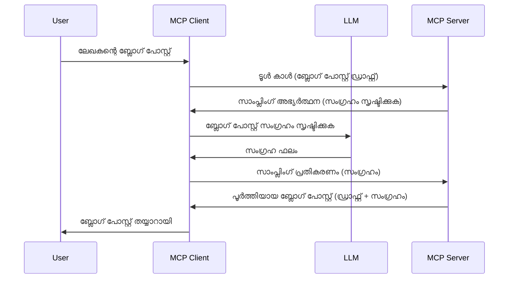

# സാമ്പ്ലിംഗ് - ക്ലയന്റിന് ഫീച്ചറുകൾ ഏൽപ്പിക്കുക

> **പഴയതാക്കൽ അറിയിപ്പ്:** `2026-07-28` MCP സവിശേഷത റിലീസ് കാമ്പിഡേറ്റ് സാമ്പ്ലിംഗിനെ പ്രാഥമികമായി LLM പ്രൊവൈഡർ API-കളുമായി നേരിട്ടുള്ള സംയോജനത്തിന് പകരമായി പഴയതാക്കുന്നു. സാമ്പ്ലിംഗ് `2025-11-25`-ലും ഔദ്യോഗിക പഴയതാക്കലിനു ശേഷം കുറച്ചുകാലം കവിയാതെ ഒരുവർഷം വരെ പ്രവർത്തിക്കുന്നതാണ്, അതിനാൽ ഈ പാഠത്തിൽ ഉള്ളത് മുഴുവൻ പ്രാസംഗികമാണ് — എന്നാൽ പുതിയ സെർവർ ഡിസൈനുകൾ പകരം പാറ്റേൺ വിലയിരുത്തണം. [MCPയിൽ എന്താണ് മാറുന്നത്: 2026-07-28 റിലീസ് കാമ്പിഡേറ്റ്](../../01-CoreConcepts/mcp-2026-07-28-release-candidate.md) കാണുക.

ചിലപ്പോൾ MCP ക്ലയന്റും MCP സെർവറും ഒന്നിച്ച് ഒരു ലക്ഷ്യം നേടാൻ സഹകരിക്കേണ്ടിവരും. സെർവറിന് ക്ലയന്റിലെ ഒരു LLM-ന്റെ സഹായം ആവശ്യമുള്ളൊരു സാഹചര്യം നിങ്ങൾക്കുണ്ടാകാം. ഈ സാഹചര്യത്തിൽ, സാമ്പ്ലിംഗ് ഉപയോഗിക്കേണ്ടത് ആണ്.

ചില ഉപയോഗമാർഗ്ഗങ്ങളും സാമ്പ്ലിംഗ് ഉൾപ്പെടുത്തിയൊരു പരിഹാരത്തിന്റെ നിർമ്മാണം എങ്ങനെ ചെയ്യാമെന്ന് കാണാനായി പോവാം.

## അവലോകനം

ഈ പാഠത്തിൽ, സാമ്പ്ലിംഗ് എപ്പോഴും എവിടെയും എങ്ങനെ ഉപയോഗിക്കാമെന്ന് എങ്ങനെ കൺഫിഗർ ചെയ്യാമെന്നതിനെക്കുറിച്ച് മനസിലാക്കുന്നു.

## പഠന ലക്ഷ്യങ്ങൾ

ഈ അധ്യായത്തിൽ, നമ്മൾ:

- സാമ്പ്ലിംഗ് എന്താണെന്നും എപ്പോഴാണ് അത് ഉപയോഗിക്കേണ്ടത് എന്നും വിശദീകരിക്കും.
- MCP-യിൽ സാമ്പ്ലിംഗ് എങ്ങനെ കൺഫിഗർ ചെയ്യാമെന്നു കാണിക്കും.
- സാമ്പ്ലിംഗ് റൺ ചെയ്തുകൊണ്ടിരിക്കുന്ന ഉദാഹരണങ്ങൾ നൽകും.

## സാമ്പ്ലിംഗ് എന്നത് എന്തും എന്തുകൊണ്ട് ഉപയോഗിക്കണം?

സാമ്പ്ലിംഗ് ഒരു ആധുനിക സവിശേഷതയും ചുവടെ പറയുന്ന വിധത്തിലാണ് പ്രവർത്തിക്കുന്നത്:



### സാമ്പ്ലിംഗ് അഭ്യർത്ഥന

ഇപ്പോൾ ഒരുകൂർപ്പുള്ള വിശ്വാസത്തിനുള്ള ഒരു മൈൽ ഉയരമുള്ള കാഴ്ച കിട്ടിയിരിക്കുന്നു, സെർവർ അയക്കുന്ന സാമ്പ്ലിംഗ് അഭ്യർത്ഥനയെക്കുറിച്ച് സംസാരിക്കാം. JSON-RPC ഫോർമാറ്റിൽ ഒരു അഭ്യർത്ഥനം ഇങ്ങനെ കാണാം:

```json
{
  "jsonrpc": "2.0",
  "id": 1,
  "method": "sampling/createMessage",
  "params": {
    "messages": [
      {
        "role": "user",
        "content": {
          "type": "text",
          "text": "Create a blog post summary of the following blog post: <BLOG POST>"
        }
      }
    ],
    "modelPreferences": {
      "hints": [
        {
          "name": "claude-3-sonnet"
        }
      ],
      "intelligencePriority": 0.8,
      "speedPriority": 0.5
    },
    "systemPrompt": "You are a helpful assistant.",
    "maxTokens": 100
  }
}
```

ചില പ്രധാന കാര്യങ്ങൾ ഇവിടെ ഉണ്ട്:

- content -> text എന്നതിലെ പ്രോംപ്‌റ് LLM-നായി ബ്ലോഗ് പോസ്റ്റ് ഉള്ളടക്കം സംഗ്രഹിക്കാനുള്ള നിർദ്ദേശമാണ്.

- **modelPreferences**. ഈ ഭാഗം ഒരു ഇഷ്ടം മാത്രമാണ്, LLM-ന് ഏതു കോൺഫിഗറേഷൻ ഉപയോഗിക്കണമെന്ന് ശുപാർശ നൽകുന്നു. ഉപയോക്താവ് ഈ ശുപാർശകൾ പിന്തുടരുന്നതോ മാറ്റുന്നതോ തിരഞ്ഞെടുക്കാം. ഇവിടെ മോഡൽ തിരഞ്ഞെടുപ്പ്, വേഗത, ബുദ്ധിമുട്ട് മുൻഗണന എന്നിവയ്ക്കുള്ള ശുപാർശകളുണ്ട്.
- **systemPrompt**, ഇത് സാധാരണ സിസ്റ്റം പ്രോംപ്‌റ്റാണ്, നിങ്ങളുടെ LLM-ന് വ്യക്തിത്വം നൽകുകയും മാർഗ്ഗനിർദ്ദേശങ്ങൾ അടങ്ങിയിരിക്കുന്നു.
- **maxTokens**, ഈ പ്രോപ്പർട്ടി ഈ കാര്യമെടുത്ത് എത്ര ടോക്കൺസ് ഉപയോഗിക്കണമെന്ന് കാണിക്കുന്നു.

### സാമ്പ്ലിംഗ് പ്രതികരണം

MCP ക്ലയന്റ് LLM കോളിംഗ് ചെയ്ത് പ്രപഞ്ചം കാത്തുനിൽക്കുകയും പിന്നീട് ഈ സന്ദേശം സംയോജിപ്പിക്കുകയും ചെയ്യുന്നുള്ള പ്രതികരണമാണ് MCP സെർവറിലേക്ക് അയക്കുന്നത്. ഇതും JSON-RPC ഫോർമാറ്റിൽ ഇങ്ങനെ കാണാം:

```json
{
  "jsonrpc": "2.0",
  "id": 1,
  "result": {
    "role": "assistant",
    "content": {
      "type": "text",
      "text": "Here's your abstract <ABSTRACT>"
    },
    "model": "gpt-5",
    "stopReason": "endTurn"
  }
}
```

എങ്ങനെ പ്രതികരണം ബ്ലോഗ് പോസ്റ്റിന്റെ സംഗ്രഹമാണ് എന്ന് ശ്രദ്ധിക്കുക. കൂടാതെ ഉപയോഗിച്ച മോഡൽ "gpt-5" ആണ്, ചോദിച്ച മോഡൽ "claude-3-sonnet" അല്ല. ഇത് ഉപയോക്താവിന് എന്ത് ഉപയോഗിക്കണമെന്ന് മറിച്ചെടുക്കാം എന്നതിന് ഉദാഹരണമാണ്, സാമ്പ്ലിംഗ് അഭ്യർത്ഥനം ശുപാർശ മാത്രമാണ്.

ഇപ്പോൾ പ്രധാന പ്രവാഹം മനസിലായതോടെ, "ബ്ലോഗ് പോസ്റ്റ് സൃഷ്ടി + സംഗ്രഹം" പോലെ സജീവമായ ഒരു ടാസ്‌കിനായി ഇത് ഉപയോഗിക്കാൻ എന്ത് ചെയ്യേണ്ടതുണ്ട് നോക്കാം.

### സന്ദേശ തരം

സാമ്പ്ലിംഗ് സന്ദേശങ്ങൾ വെറും ടെക്സ്റ്റുമായി മാത്രം പരിമിതമല്ല, ചിത്രങ്ങളും ശബ്ദവും അയയ്ക്കാം. JSON-RPC എങ്ങനെ വ്യത്യാസപ്പെടുന്നുവെന്ന് കാണാം:

**ടെക്സ്റ്റ്**

```json
{
  "type": "text",
  "text": "The message content"
}
```

**ചിത്ര ഉള്ളടക്കമുണ്ട്**

```json
{
  "type": "image",
  "data": "base64-encoded-image-data",
  "mimeType": "image/jpeg"
}
```

**ശബ്ദ ഉള്ളടക്കമുണ്ട്**

```json
{
  "type": "audio",
  "data": "base64-encoded-audio-data",
  "mimeType": "audio/wav"
}
```

> ശ്രദ്ധിക്കുക: കൂടുതൽ വിശദമായ വിവരങ്ങൾക്ക് [അധികൃത ഡോകുകൾ](https://modelcontextprotocol.io/specification/2025-11-25/client/sampling) കാണുക

## ക്ലയന്റിൽ സാമ്പ്ലിംഗ് എങ്ങനെ കൺഫിഗർ ചെയ്യാം

> ബോധിപ്പിക്കൽ: നിങ്ങൾ ഒരു സെർവർ മാത്രമുണ്ടാകുമ്പോൾ, ഇവിടെ കൂടുതൽ ചെയ്യേണ്ട ആവശ്യമില്ല.

ക്ലയന്റിൽ, നിങ്ങൾക്ക് ഇDelta-വിലാസമുദ്രകൾ വിശേഷിപ്പിക്കേണ്ടതുണ്ട് ഇങ്ങനെ:

```json
{
  "capabilities": {
    "sampling": {}
  }
}
```

നിങ്ങളുടെ തിരഞ്ഞെടുക്കപ്പെട്ട ക്ലയന്റ് സെർവറിന്റെ ആരംഭത്തിനൊപ്പം ഇത് ഉൾപ്പെടുത്തിയിരിക്കും.

## സാമ്പ്ലിംഗ് പ്രവർത്തനത്തിൽ - ഒരു ബ്ലോഗ് പോസ്റ്റ് ഉണ്ടാക്കുക

സാമ്പ്ലിംഗ് സെർവർ ഒരുമിച്ച് കോഡ് ചെയ്യാം, ഇതിന് ഒരു ടൂൾ താഴെയുള്ള ഹേദൈക്കണം:

1. സെർവറിൽ ഒരു ടൂൾ സൃഷ്ടിക്കുക.
1. ആ ടൂൾ ഒരു സാമ്പ്ലിംഗ് അഭ്യർത്ഥന സൃഷ്ടിക്കണം.
1. ക്ലയന്റിന്റെ സാമ്പ്ലിംഗ് അഭ്യർത്ഥനയുടെ പ്രതികരണത്തിനായി ടൂൾ കാത്തിരിക്കണം.
1. പിന്നീട് ടൂൾ ഫലം സൃഷ്ടിക്കണം.

ചില ഘട്ടങ്ങൾ കോഡ് കാണാം:

### -1- ടൂൾ സൃഷ്ടിക്കുക

**python**

```python
@mcp.tool()
async def create_blog(title: str, content: str, ctx: Context[ServerSession, None]) -> str:
    """Create a blog post and generate a summary"""

```

### -2- സാമ്പ്ലിംഗ് അഭ്യർത്ഥന സൃഷ്ടിക്കുക

ടൂൾ ഇങ്ങനെ വിപുലീകരിക്കുക:

**python**

```python
post = BlogPost(
        id=len(posts) + 1,
        title=title,
        content=content,
        abstract=""
    )

prompt = f"Create an abstract of the following blog post: title: {title} and draft: {content} "

result = await ctx.session.create_message(
        messages=[
            SamplingMessage(
                role="user",
                content=TextContent(type="text", text=prompt),
            )
        ],
        max_tokens=100,
)

```

### -3- പ്രതികരണം കാത്തിരിക്കുക, പ്രതികരണം റിട്ടേൺ ചെയ്യുക

**python**

```python
post.abstract = result.content.text

posts.append(post)

# സംയോജിത ഉൽപ്പന്നം മടക്കിയിറക്കുക
return json.dumps({
    "id": post.title,
    "abstract": post.abstract
})
```

### -4- പൂർണ്ണ കോഡ്

**python**

```python
from starlette.applications import Starlette
from starlette.routing import Mount, Host

from mcp.server.fastmcp import Context, FastMCP

from mcp.server.session import ServerSession
from mcp.types import SamplingMessage, TextContent

import json


from uuid import uuid4
from typing import List
from pydantic import BaseModel


mcp = FastMCP("Blog post generator")

# app = FastAPI()

posts = []

class BlogPost(BaseModel):
    id: int
    title: str
    content: str
    abstract: str

posts: List[BlogPost] = []

@mcp.tool()
async def create_blog(title: str, content: str, ctx: Context[ServerSession, None]) -> str:
    """Create a blog post and generate a summary"""

    post = BlogPost(
        id=len(posts) + 1,
        title=title,
        content=content,
        abstract=""
    )

    prompt = f"Create an abstract of the following blog post: title: {title} and draft: {content} "

    result = await ctx.session.create_message(
        messages=[
            SamplingMessage(
                role="user",
                content=TextContent(type="text", text=prompt),
            )
        ],
        max_tokens=100,
    )

    post.abstract = result.content.text

    posts.append(post)

    # പൂർണ്ണ ബ്ലോഗ് പോസ്റ്റ് മടക്കൂ
    return json.dumps({
        "id": post.title,
        "abstract": post.abstract
    })

if __name__ == "__main__":
    print("Starting server...")
    # mcp.run()
    mcp.run(transport="streamable-http")

# ആപ്പ് പ്രവർത്തിപ്പിക്കുക: python server.py
```

### -5- Visual Studio Code-ൽ ഇത് പരീക്ഷിക്കുക

Visual Studio Code-ൽ ഇത് പരീക്ഷിക്കാൻ ഇങ്ങനെ ചെയ്യുക:

1. ടെർമിനലിൽ സെർവർ ആരംഭിക്കുക
1. *mcp.json*-ലും ചേർക്കുക (ശ്രദ്ധിക്കുക സെർവർ തുടങ്ങിയത് ഉറപ്പാക്കുക) ഉദാഹരണത്തിന് ഇങ്ങനെ:

   ```json
   "servers": {
      "blog-server": {
        "type": "http",
        "url": "http://localhost:8000/mcp"
      }
   }
   ```

1. ഒരു പ്രോംപ്റ്റ് ടൈപ്പ് ചെയ്യുക:

   ```text
   create a blog post named "Where Python comes from", the content is "Python is actually named after Monty Python Flying Circus"
   ```

1. സാമ്പ്ലിംഗ് നടക്കാൻ അനുവദിക്കുക. ആദ്യമായി പരീക്ഷിക്കുമ്പോൾ അധിക ഡയലോഗ് കാണിക്കും, അത് അംഗീകരിക്കണം. തുടർന്ന് ടൂൾ പ്രവർത്തിപ്പിക്കാൻ സാധാരണ ഡയലോഗ് കാണിക്കും.

1. ഫലങ്ങൾ പരിശോധിക്കുക. ഫലങ്ങൾ GitHub Copilot ചാറ്റിൽ നന്നായി കാണിക്കും, കൂടാതെ റാ JSON പ്രതികരണവും പരിശോധിക്കാം.

**ബോണസ്**: Visual Studio Code ടൂളിംഗ് sampling-ന് മികച്ച പിന്തുണ നൽകുന്നു. ഇൻസ്റ്റാൾ ചെയ്ത സെർവറിന്റെ sampling ആക്സസ് ഇങ്ങനെ കൺഫിഗർ ചെയ്യാം:

1. എക്സ്ടൻഷൻ സെക്ഷനിലേക്ക് പോക്കുക.
1. "MCP SERVERS - INSTALLED" സെക്ഷനിലെ നിങ്ങളുടെ ഇൻസ്റ്റാൾ സെർവറിന്റെ കോഗ് ഐകൺ തിരഞ്ഞെടുക്കുക.
1 "Configure Model Access" തിരഞ്ഞെടുക്കുക, ഇവിടെ GitHub Copilot-ക്ക് sampling നടത്തുമ്പോൾ അനുവദിച്ച മോഡലുകൾ തിരഞ്ഞെടുക്കാം. കൂടാതെ "Show Sampling requests" തിരഞ്ഞെടുക്കി കഴിഞ്ഞ sampling അഭ്യർത്ഥനകൾ കാണാം.

## അസൈൻമെന്റ്

ഈ അസൈൻമെന്റിൽ, നിങ്ങൾ വ്യത്യസ്തമായ ഒരു സാമ്പ്ലിംഗ് നിർമിക്കും, അത് ഉൽപ്പന്ന വിവരണം സൃഷ്ടിക്കുന്ന sampling ഇന്റഗ്രേഷൻ ആണ്. നിങ്ങളുടെ രൂപരേഖ ഇങ്ങനെ:

**രൂപകൽപ്പന**: ഒരു ഇ-കൊമേഴ്സ് ബാക്ക് ഓഫീസ് തൊഴിലാളിക്ക് ഉൽപ്പന്ന വിവരണങ്ങൾ സൃഷ്ടിക്കാൻ വളരെ സമയം വേണം. അതിനാൽ, "create_product" എന്ന ടൂൾ ഒരു "title" ഉം "keywords" ഉം ഉള്ള_ARGUMENTS_ ഉപയോഗിച്ച് വിളിക്കാം, കൂടാതെ ഒരു പൂര്‍ണമായ ഉൽപ്പന്നം ഉപയോഗിച്ച് "description" ഫീൽഡ് ഉൾപ്പെടെയുള്ളതും അവതരിപ്പിക്കണം, അത് ഒരു ക്ലയന്റ് LLM-ൽ നിന്നാണ്.

ടിപ്പ്: മുൻപ് പഠിച്ച മുതല്പ്പാക്ക് ഉപയോഗിച്ച് ഈ സെർവറും ടൂളും ഒരു sampling അഭ്യർത്ഥന ഉപയോഗിച്ച് നിർമ്മിക്കുക.

## പരിഹാരം

[പരിഹാരം](./solution/README.md)

## പ്രധാന ആശയങ്ങൾ

സാധ്യതകൾ MCP സെർവർ LLM സഹായം ആവശ്യമായപ്പോൾ ടാസ്കുകൾ ക്ലയന്റിന് ഏൽപ്പിക്കാൻ sampling ഒരു ശക്തമായ സവിശേഷതയാണ്.

## എന്താണ് അടുത്തത്

- [അധ്യായം 4 - പ്രായോഗിക നടപ്പാക്കൽ](../../04-PracticalImplementation/README.md)

---

<!-- CO-OP TRANSLATOR DISCLAIMER START -->
**അറിയിപ്പ്**:
ഈ രേഖ AI പരിഭാഷാ സേവനം [Co-op Translator](https://github.com/Azure/co-op-translator) ഉപയോഗിച്ച് പരിഭാഷപ്പെടുത്തിയതാണ്. ഞങ്ങൾ കൃത്യതയ്ക്കായി ശ്രമിക്കുന്നുവെങ്കിലും, ഓട്ടോമേറ്റഡ് പരിഭാഷകളിൽ പിഴവുകൾ അല്ലെങ്കിൽ തെറ്റായ വിവരങ്ങൾ ഉണ്ടാകാൻ സാധ്യതയുണ്ട്. അതിന്റെ സ്വാഭാവിക ഭാഷയിലുള്ള അസൽ രേഖയാണ് പ്രാമാണികമായ ഉറവിടമായി പരിഗണിക്കേണ്ടത്. നിർണായകമായ വിവരങ്ങൾക്ക്, പ്രൊഫഷണൽ മനുഷ്യ പരിഭാഷ ശുപാർശ ചെയ്യുന്നു. ഈ പരിഭാഷ ഉപയോഗിച്ച് ഉണ്ടാകുന്ന തെറ്റിദ്ധാരണകൾ അല്ലെങ്കിൽ തെറ്റായ വ്യാഖ്യാനങ്ങൾക്കായി ഞങ്ങൾ ഉത്തരവാദികളല്ല.
<!-- CO-OP TRANSLATOR DISCLAIMER END -->