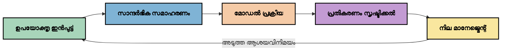
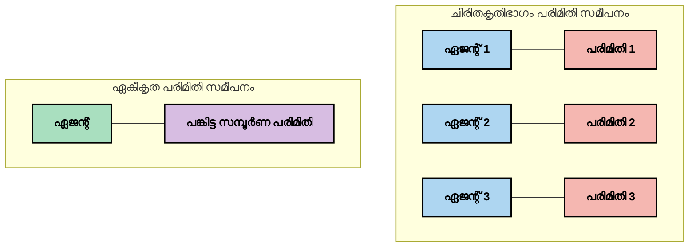
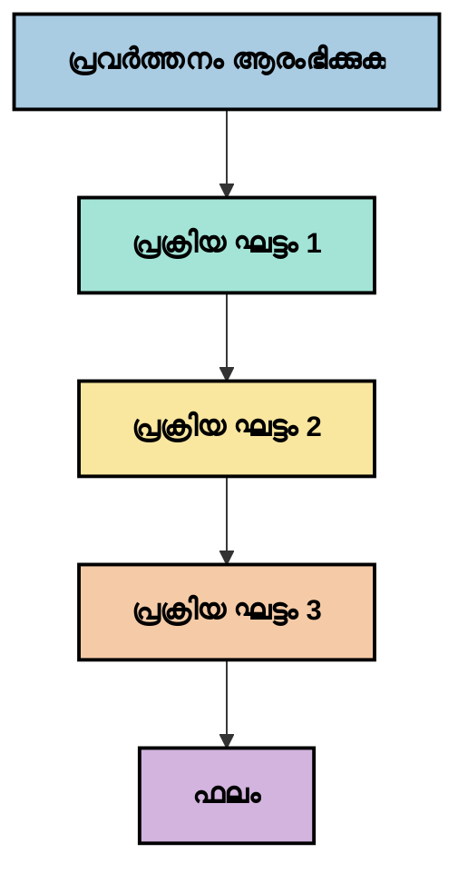
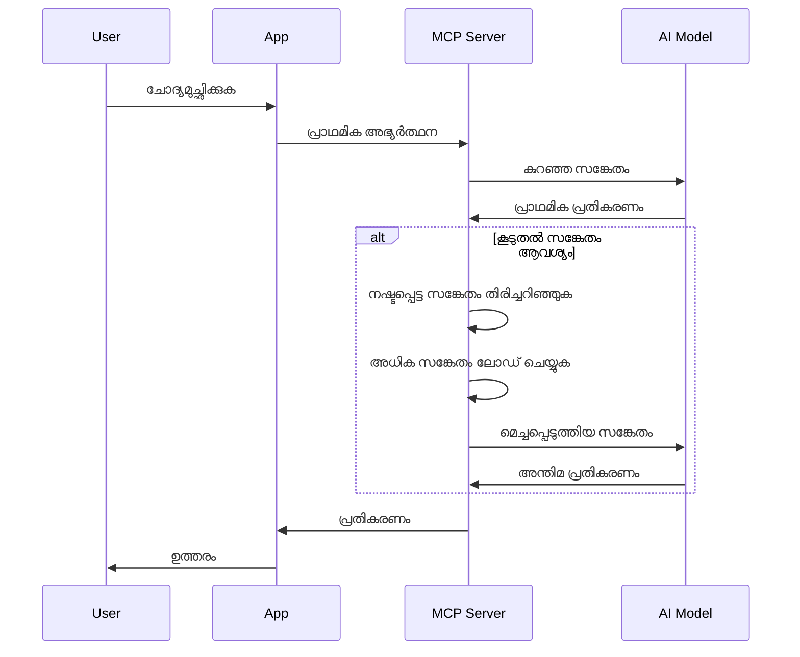
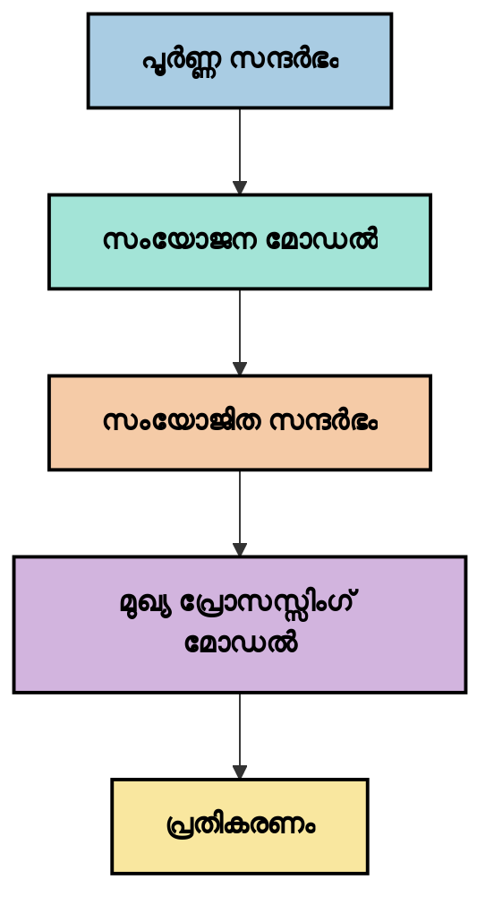
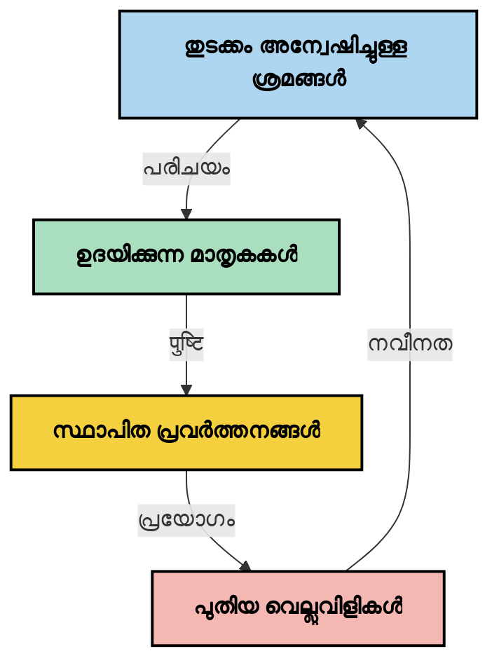

# സന്ധർഭ എഞ്ചിനീയറിംഗ്: MCP ഇകോസിസ്റ്റത്തിലുള്ള ഒരു പുതിയ ആശയം

## അവലോകനം

സന്ധർഭ എഞ്ചിനീയറിംഗ് AI മേഖലയിലെ ഒരു പുതിയ ആശയം ആണ്, അത് ക്ലയന്റുകളും AI സേവനങ്ങളും തമ്മിലുള്ള ഇടപെടലുകളുടെ സമ്പൂർണ്ണത്തിൽ വിവരങ്ങൾ എങ്ങനെ ഘടിപ്പിക്കപ്പെടുന്നു, വിതരണം ചെയ്യപ്പെടുന്നു, പാലിക്കപ്പെടുന്നു എന്നത് അന്വേഷിക്കുന്നു. മോഡൽ സന്ധർഭ പ്രോട്ടോക്കോൾ (MCP) ഇകോസിസ്റ്റം വികസിക്കുമ്പോൾ, സന്ധർഭം ഫലപ്രദമായി കൈകാര്യം ചെയ്യുന്നത് അറിയുക അതിവാൺശ്യമായിരിക്കുന്നു. ഈ മോഡ്യൂൾ സന്ധർഭ എഞ്ചിനീയറിംഗ് ആശയത്തെ പരിചയപ്പെടുത്തി MCP നടപ്പിലാക്കലുകളിൽ അവയുടെ സാധ്യതാപരമായ ഉപയോഗം പരിശോധിക്കുന്നു.

## പഠന ലക്ഷ്യങ്ങൾ

ഈ മോഡ്യൂൾ അവസാനിക്കുന്നപ്പോൾ, നിങ്ങൾക്ക് സാധ്യമാകും:

- സന്ധർഭ എഞ്ചിനീയറിംഗിന്റെ പുതിയ ആശയം മനസിലാക്കുക және MCP ആപ്ലിക്കേഷനുകളിലെ അതിന്റെ സാധ്യതകൾ അറിയുക
- MCP പ്രോട്ടോക്കോൾ ഡിസൈൻ കൈകാര്യം ചെയ്യുന്ന സന്ധർഭ മാനേജുമെന്റിലെ പ്രധാന വെല്ലുവിളികൾ തിരിച്ചറിയുക
- മികച്ച സന്ധർഭ ഹാൻഡ്ലിങ്ങിലൂടെ മോഡൽ പ്രകടനം മെച്ചപ്പെടുത്തുന്നതിനുള്ള സാങ്കേതിക വിദ്യകൾ അന്വേഷിക്കുക
- സന്ധർഭ ഫലപ്രാപ്തി അളക്കാനും വിലയിരുത്താനും ഉള്ള സമീപനങ്ങൾ പരിഗണിക്കുക
- MCP ഫ്രെയിംവർക്ക് വഴി AI അനുഭവങ്ങൾ മെച്ചപ്പെടുത്താൻ ഈ പുതിയ ആശയങ്ങൾ പ്രയോഗിക്കുക

## സന്ധർഭ എഞ്ചിനീയറിംഗിന്റെ പരിചയം

സന്ധർഭ എഞ്ചിനീയറിംഗ് ഉപയോക്താക്കളും ആപ്ലിക്കേഷനുകളും AI മോഡലുകളും തമ്മിലുള്ള വിവര പ്രവാഹത്തിന്റെ ഉദ്ദേശ്യപൂർവ്വമായ ഡിസൈൻ, മാനേജുമെന്റ് എന്നിവയെ കേന്ദ്രീകരിച്ച് വികസിക്കുന്ന പുതിയ ആശയമാണ്. പ്രോംപ്റ്റ് എഞ്ചിനീയറിംഗുപോലുള്ള നിലവിലെ വിഭാഗങ്ങളിൽ നിന്നു വ്യത്യസ്തമായി, സന്ധർഭ എഞ്ചിനീയറിംഗ് ഇപ്പോഴും പ്രായോഗിക പ്രയോജനക്കാർ നിർവചിക്കുമ്പോഴാണ്, ശരിയായ സമയത്ത് AI മോഡലുകൾക്ക് ശരിയായ വിവരങ്ങൾ നൽകുന്നതിലെ പ്രത്യേക വെല്ലുവിളികൾ പരിഹരിക്കാനായി.

വലുതായ ഭാഷാ മോഡലുകൾ (LLMs) വികസിച്ചതിനൊപ്പം, സന്ധർഭത്തിന്റെ പ്രാധാന്യം കൂടുതൽ വ്യക്തമായിരിക്കുന്നു. നാം നൽകുന്ന സന്ധർഭത്തിന്റെ ഗുണമേന്മ, പ്രസക്തി, ഘടന എന്നിവ നേരിട്ടുള്ള മോഡൽ ഔട്ട്‌പുട്ടുകൾക്ക് ബാധകമാണ്. സന്ധർഭ എഞ്ചിനീയറിംഗ് ഈ ബന്ധം അന്വേഷിക്കുകയും ഫലപ്രദമായ സന്ധർഭ മാനേജുമെന്റിന് പ്രിൻസിപ്പിളുകൾ വികസിപ്പിക്കാൻ ശ്രമിക്കുന്നു.

> "2025-ൽ, മോഡലുകൾ അതിവിശാലമായ ബുദ്ധിമുട്ടുള്ളവയാണ്. എന്നാൽ ഏറ്റവും ബുദ്ധിമാൻ മനുഷ്യൻ പോലും എന്ത് ചെയ്യണമെന്ന് context ഇല്ലാതെ ഫലപ്രദമായി ജോലി ചെയ്യാൻ കഴിയില്ല... 'സന്ധർഭ എഞ്ചിനീയറിംഗ്' പ്രോംപ്റ്റ് എഞ്ചിനീയറിംഗിന്റെ അടുത്ത ഘട്ടമാണ്. ഇത് സ്വയംകൃത്യമായും ഡയനാമിക് സിസ്റ്റത്തിൽ ചെയ്യാനുള്ളതാണ്." — വാൽഡൻ യാൻ, കോഗ്നിഷൻ AI

സന്ധർഭ എഞ്ചിനീയറിംഗ് ഉൾപ്പെടാം:

1. **സന്ധർഭ തിരഞ്ഞെടുപ്പ്**: ഒരു പ്രത്യേക കൃത്യത്തിനായി പ്രസക്തമായ വിവരങ്ങൾ നിയുക്തിക്കൽ
2. **സന്ധർഭ ഘടന**: മോഡൽ മനസ്സിലാക്കാനുള്ള ഏറ്റവും നല്ല രീതിയിലാക്കാൻ വിവരങ്ങൾ ഓർഗനൈസ് ചെയ്യുക
3. **സന്ധർഭ വിതരണ**: വിവരങ്ങൾ മോഡലിലേക്ക് എങ്ങിനെ എപ്പോഴെന്നും അയയ്‌ക്കണമെന്ന് മെച്ചപ്പെടുത്തുക
4. **സന്ദർഭ പരിപാലനം**: കാലക്രമ Corys-Dynamic വിലാസംക്കും നിലനിൽപ്പിനും മാനേജുമെന്റ്
5. **സന്ധർഭ വിലയിരുത്തൽ**: സന്ധർഭ ഫലപ്രാപ്തി അളക്കുകയും മെച്ചപ്പെടുത്തുകയും ചെയ്യുക

ഈ ശ്രദ്ധ കേന്ദ്രങ്ങൾ MCP ഇകോസിസ്റ്റത്തിനായി വളരെ പ്രസക്തമാണ്, കാരണം ഇത് ആപ്ലിക്കേഷനുകൾ LLMs-ന് സന്ധർഭം നൽകാനുള്ള സംസ്കൃതമായ മാർഗ്ഗമെതാണ്.


## സന്ധർഭ യാത്രയുടെ കാഴ്ചപ്പാട്

സന്ധർഭ എഞ്ചിനീയറിംഗ് കണക്കാക്കാനുള്ള ഒരു മാർഗ്ഗം MCP സംവിധാനത്തിലൂടെ വിവരങ്ങൾ എങ്ങനെ യാത്ര ചെയ്യുന്നു എന്നത് നിരീക്ഷിക്കുകയാണ്:



### സന്ധർഭ യാത്രയിലെ പ്രധാന ഘട്ടങ്ങൾ:

1. **ഉപയോക്തൃ ഇൻപുട്ട്**: ഉപയോക്താവിനിൽ നിന്നുള്ളخام വിവരങ്ങൾ (ടെക്സ്റ്റ്, ചിത്രം, ഡോക്യുമെന്റുകൾ)
2. **സന്ധർഭ സമാഹരണം**: ഉപയോക്തൃ ഇൻപുട്ട്, സിസ്റ്റം സന്ധർഭം, സംഭാഷണ ചരിത്രം, മറ്റ് വിവരങ്ങൾ കൂട്ടിച്ചേർക്കൽ
3. **മോഡൽ പ്രോസസ്സിംഗ്**: സമാഹരിച്ച സന്ധർഭം AI മോഡൽ പ്രോസസ്സ് ചെയ്യുന്നു
4. **പ്രതിവരം സൃഷ്ടിക്കൽ**: സന്ധർഭത്തിന്റെ അടിസ്ഥാനത്തിൽ മോഡൽ ഔട്ട്‌പുട്ടുകൾ സൃഷ്ടിക്കുന്നു
5. **അവസ്ഥാ മാനേജുമെന്റ്**: ഇടപെടലിന്റെ അടിസ്ഥാനത്തിൽ സിസ്റ്റം അകത്തള അവസ്ഥ അപ്ഡേറ്റ് ചെയ്യുന്നു

ഈ കാഴ്ചപ്പാട് AI സിസ്റ്റങ്ങളിലെ സന്ധർഭത്തിന്റെ ഡയനാമിക് സ്വഭാവം ഉന്നയിക്കുകയും ഓരോ ഘട്ടത്തിലും വിവരങ്ങൾ എങ്ങനെ ഫലപ്രദമായി കൈകാര്യം ചെയ്യാമെന്ന് ചോദ്യങ്ങൾ ഉയർത്തുകയും ചെയ്യുന്നു.

## സന്ധർഭ എഞ്ചിനീയറിംഗിലെ ഉയർന്നു വരുന്ന സിദ്ധാന്തങ്ങൾ

സന്ധർഭ എഞ്ചിനീയറിംഗ് രൂപത് പ്രാരംഭ ഘട്ടത്തിലാണ്, പ്രായോഗികർ ചില മുൻകൂട്ടിയുള്ള സിദ്ധാന്തങ്ങൾ രൂപപ്പെടുത്തി തുടങ്ങുന്നു. ഇവ MCP നടപ്പിലാക്കലുകളിൽ ഉൾപ്പെടുത്താവുന്നതാണ്:

### സിദ്ധാന്തം 1: സന്ധർഭം പൂർണ്ണമായി പങ്കിടുക

സിസ്റ്റങ്ങളുടെ എല്ലാ ഘടകങ്ങൾക്കുചെതിരെ പാറയ്ക്കുക പകരം സന്ധർഭം പരിപൂർണ്ണമായും പങ്കിടേണ്ടതാണ്. സന്ധർഭം പകർന്നുവിതരണമാകുന്നിടത്തോളം സിസ്റ്റത്തിലെ ഒരുവിഭാഗത്തുള്ള തീരുമാനം മറ്റുഭാഗത്തെവിടെയുള്ളതുമായി പൊരുത്തപ്പെടാത്തതാകാം.



MCP ആപ്ലിക്കേഷനുകളിൽ, സന്ധർഭം സുതാര്യമായി മുഴുവൻ പൈപ്പ്ലെയിൻ വഴി ഒഴുകുന്ന വിധം സിസ്റ്റങ്ങൾ രൂപകൽപ്പന ചെയ്യേണ്ടതാണ്.

### സിദ്ധാന്തം 2: പ്രവർത്തനങ്ങൾക്ക് അപ്രത്യക്ഷമായ നിർണയങ്ങൾ ഉണ്ടെന്ന് തിരിച്ചറിയ്ക്കുക

ഓരോ പ്രവർത്തനവും സന്ധർഭം എങ്ങനെ വ്യാഖ്യാനിക്കണമെന്ന് ഉൾകൊള്ളുന്ന നിർണയങ്ങൾ ഉൾക്കൊള്ളുന്നവയാണ്. പല ഘടകങ്ങൾ വ്യത്യസ്ത സന്ധർഭങ്ങളിൽ പ്രവർത്തിക്കുമ്പോൾ, ഈ നിർണയങ്ങൾ കൂട്ടിയിടിച്ച് പൊരുത്തക്കേട് ഉണ്ടാകുന്നതിന് സാധ്യതയുണ്ട്.

MCP ആപ്ലിക്കേഷനുകളിൽ ഈ സിദ്ധാന്തത്തിന് പ്രധാനപ്പെട്ട ആഘാതമുണ്ട്:
- സന്ധർഭം പിളർന്ന രീതിയിലുള്ള സമാന്തര പ്രവർത്തനത്തിൽ നിന്ന് അസമാനതയുള്ള ഫലങ്ങൾ ഒഴിവാക്കാൻ സാദ്ധ്യതയുള്ള സങ്കീർണ്ണ നടപടികൾ ലിനിയർ പ്രോസസിംഗ് മുഖേന നടത്തുക
- എല്ലാ നിർണയ പോയിന്റുകളും ഒരേ സന്ധർഭ വിവരങ്ങളിലേക്ക് പ്രവേശനം ഉറപ്പാക്കുക
- കഴിഞ്ഞ തീരുമാനങ്ങളുടെ മുഴുവൻ സന്ധർഭം പിന്നീട് വരുന്ന ഘട്ടങ്ങൾ കാണാൻ കഴിയുന്ന വിധം സിസ്റ്റങ്ങൾ രൂപകൽപ്പന ചെയ്യുക

### സിദ്ധാന്തം 3: സന്ധർഭ നൈർമ്മല്യം കാറ്റ് ചെയ്തു വിൻഡോ പരിധികളോട് തുല്യം അന്വഷിക്കുക

സംഭാഷണങ്ങളും പ്രക്രിയകളും നീണ്ടുപോകുമ്പോൾ, സന്ധർഭ വിൻഡോകൾ അവസാനിക്കും. സമഗ്രമായ സന്ധർഭവും സാങ്കേതിക പരിധികളും തമ്മിലുള്ള ഈ സംഘർഷം ഫലപ്രദമായി കൈകാര്യം ചെയ്യാനുള്ള മാർഗ്ഗം പരിശോധിക്കുന്നു.

പ്രയോഗത്തിലുള്ള സാധ്യതയുള്ള സമീപനങ്ങൾ ഉൾപ്പെടാം:
- പ്രധാനമായ വിവരങ്ങൾ നിലനിർത്തിക്കൊണ്ട് ടോക്കൺ ഉപയോഗം കുറയ്‌ക്കുന്ന സന്ധർഭ സംക്ഷേപം
- നിലവിലുള്ള ആവശ്യങ്ങൾ പ്രകാരം പ്രാധാന്യത്തോടെ സന്ധർഭം ഇടപെടലോടെ ലോഡ് ചെയ്യൽ
- മുൻപ് നടന്ന ഇടപെടലുകളുടെ സംഗ്രഹണം പ്രധാന തീരുമാനങ്ങളും വിവരങ്ങളും നിലനിർത്തി

## സന്ധർഭ വെല്ലുവിളികൾയും MCP പ്രോട്ടോക്കോൾ ഡിസൈനും

മോഡൽ സന്ധർഭ പ്രോട്ടോക്കോൾ (MCP) സന്ധർഭ മാനേജുമെന്റിലെ പ്രത്യേക വെല്ലുവിളികൾ മനസ്സിലാക്കി രൂപകല്പന ചെയ്തതാണ്. ഈ വെല്ലുവിളികൾ മനസ്സിലാക്കുന്നത് MCP പ്രോട്ടോക്കോൾ ഡിസൈന്റെ പ്രധാന ഭാഗങ്ങൾ വിശദീകരിക്കാൻ സഹായിക്കുന്നു:


### വെല്ലുവിളി 1: സന്ധർഭ വിൻഡോ പരിധികൾ
അധികം AI മോഡലുകൾക്ക് സന്ധർഭ വിൻഡോ വലുപ്പം നിശ്ചിതമാണ്, ഒരേസമയംτέρകൊണ്ടുള്ള വിവരങ്ങളുടെ പരിധി കുറയ്ക്കുന്നു.

**MCP ഡിസൈൻ പ്രതികരണം:**
- സുസ്ഥിരവും സ്രോതസ്സുഭാഗം അടിസ്ഥാനമാക്കിയുള്ള സന്ധർഭം എളുപ്പത്തിൽ റഫറൻസ് ചെയ്യാൻ സാധിക്കുന്ന വിധം പ്രോട്ടോക്കോൾ പിന്തുടരുന്നു
- സ്രോതസ്സുകൾ പേജുകളിൽ വിഭജിച്ചു പ്രഗതിശീലമായി ലോഡ് ചെയ്യാനാകുന്നു

### വെല്ലുവിളി 2: പ്രസക്തി നിർണ്ണയം
സന്ധർഭത്തിൽ ഉൾപ്പെടുത്തേണ്ട ഏറ്റവും പ്രസക്തമായ വിവരങ്ങൾ കണ്ടെത്തുക ബുദ്ധികേട്.

**MCP ഡിസൈൻ പ്രതികരണം:**
- ആവശ്യത്തിന്റെ അടിസ്ഥാനത്തിൽ ഡൈനാമിക് വിവര ترلاسه നൽകാൻ ഫ്ലെക്സിബിൾ ഉപകരണങ്ങൾ
- സുസ്ഥിരമായ പ്രോംപ്റ്റുകൾ സന്ധർഭ സംവരണം ഉറപ്പാക്കുന്നു

### വെല്ലുവിളി 3: സന്ധർഭ സ്ഥിരത
ഇടപെടലുകൾക്കിടയിൽ സ്ഥിതിവിവരം മാനേജുമെന്റ് ശ്രദ്ധാപൂർവ്വം വേണം.

**MCP ഡിസൈൻ പ്രതികരണം:**
- സ്റ്റാൻഡേർഡ് സെഷൻ മാനേജുമെന്റ്
- സന്ധർഭ വികസനത്തിനുള്ള വ്യക്തമായ ഇടപെടൽ മാതൃകകൾ

### വെല്ലുവിളി 4: ബഹുനിദി സന്ധർഭം
വ്യത്യസ്ത തരത്തിലുള്ള ഡാറ്റ (ടെക്സ്റ്റ്, ചിത്രങ്ങൾ, ഘടനയുള്ള ഡാറ്റ) വ്യത്യസ്ത കൈകാര്യം ചെയ്യലുകൾ ആവശ്യമുണ്ട്.

**MCP ഡിസൈൻ പ്രതികരണം:**
- പ്രോട്ടോക്കോൾ വിവിധ തരത്തിലുള്ള ഉള്ളടക്കങ്ങൾ സ്വീകരിക്കുന്നു
- ബഹുനിദി വിവരങ്ങളുടെ സ്റ്റാൻഡേർഡ് പ്രതിനിധാനം

### വെല്ലുവിളി 5: സുരക്ഷയും ഗോപനതയും
സന്ധഭത്തിൽ എപ്പോഴും സംവേദനാത്മകമായ വിവരങ്ങൾ ഉണ്ടാകും, അവ സംരക്ഷിക്കേണ്ടതാണ്.

**MCP ഡിസൈൻ പ്രതികരണം:**
- ക്ലയന്റും സർവറും തമ്മിലുള്ള വ്യക്തമായ ഉത്തരവാദിത്ത പരിധികൾ
- ഡാറ്റാ പ്രദർശനം കുറയ്ക്കുന്നതിന് ലൊക്കൽ പ്രോസസ്സിംഗ് ഓപ്ഷനുകൾ

ഈ വെല്ലുവിളികൾ മനസ്സിലാക്കുകയും MCP അവ എങ്ങനെ പരിഹരിക്കുന്നുവെന്നു കാണുകയും ചെയ്യുന്നത് ഉപരിതല സന്ധർഭ എഞ്ചിനീയറിംഗ് സാങ്കേതിക വിദ്യകൾ അന്വേഷിക്കാൻ അടിസ്ഥാനം നൽകും.

## ഉയർന്നു വരുന്ന സന്ധർഭ എഞ്ചിനീയറിംഗ് സമീപനങ്ങൾ

സന്ധർഭ എഞ്ചിനീയറിംഗ് വികസിക്കുമ്പോൾ, ചില പ്രതീക്ഷാജനക സമീപനങ്ങൾ ഉയർന്ന് വരുന്നു. ഇവ നിലവിലുള്ള ചിന്തകൾ ആണ്, ഉറപ്പായ പ്രാക്ടീസുകൾ അല്ല, MCP നടപ്പിലാക്കലുമായി അനുഭവം വർധിക്കുമ്പോൾ ഇത് കൂടി പുരോഗമിക്കും.

### 1. സിംഗിൾ-ത്രെഡഡ് ലിനിയർ പ്രോസസ്സിംഗ്

നിരവധി ഏജന്റുകൾ ഉള്ള സങ്കേതങ്ങളിൽ സന്ധർഭം പകർത്തുന്നതിന് പകരം, ചില പ്രായോഗികർ സിംഗിൾ-ത്രെഡഡ് ലിനിയർ പ്രോസസ്സിംഗ് കൂടുതൽ സുസ്ഥിര ഫലങ്ങൾ നൽകുന്നു എന്ന് കാണുന്നു. ഇത് ഏകീകൃത സന്ധർഭം നിലനിർത്താനുള്ള സിദ്ധാന്തത്തോട് ಹೊಂದിപ്പോകുന്നു.



പരസ്പരം പ്രവർത്തനത്തിൽ നിന്നും കുറവ് കാര്യക്ഷമമല്ലാത്തതിനാൽ ഈ സമീപനം നൽകുന്നതിൽ പരസ്പരം പ്രതികരണം കൂടുതൽ സുസ്ഥിരവും വിശ്വാസയോഗ്യവുമാകും, കാരണം ഓരോ ഘട്ടവും പഴയ തീരുമാനങ്ങളുടെ പൂർണ്ണ മനസ്സിലാക്കലിൽ അടിസ്ഥിതമാണ്.

### 2. സന്ധർഭ ചങ്കിംഗ്, മുൻഗണന

വലതു സന്ധർഭങ്ങളെ കൈകാര്യം ചെയ്യാവുന്ന അളവിലായി തകരാറാക്കുകയും ഏറ്റവും പ്രധാനപ്പെട്ട ഭാഗങ്ങൾ മുൻഗണന നൽകുകയും ചെയ്യുക.

```python
# ആശയപരമായ ഉദാഹരണം: കോൺടെക്സ് ചങ്കിങ്‌യും മുൻഗണനയും
def process_with_chunked_context(documents, query):
    # 1. ഡോക്യുമെന്റുകൾ ചെറിയ ചങ്കുകളായി വിഭജിക്കുക
    chunks = chunk_documents(documents)
    
    # 2. ഓരോ ചങ്കിനും പ്രസക്തി സ്‌കോറുകൾ കണക്കാക്കുക
    scored_chunks = [(chunk, calculate_relevance(chunk, query)) for chunk in chunks]
    
    # 3. പ്രസക്തി സ്‌കോറിന്റെ അടിസ്ഥാനത്തിൽ ചങ്കുകൾ ക്രമീകരിക്കുക
    sorted_chunks = sorted(scored_chunks, key=lambda x: x[1], reverse=True)
    
    # 4. ഏറ്റവും പ്രസക്തമായ ചങ്കുകൾ കോൺടെക്സ് ആയി ഉപയോഗിക്കുക
    context = create_context_from_chunks([chunk for chunk, score in sorted_chunks[:5]])
    
    # 5. മുൻഗണന നൽകപ്പെട്ട കോൺടെക്സ് ഉപയോഗിച്ച് പ്രോസസ്സ് ചെയ്യുക
    return generate_response(context, query)
```

മിഖൈലിന്റെ വലിയ ഡോക്യുമെന്റുകൾ ഇടിയ്ക്കാനും ഏറ്റവും പ്രസക്തമായ ഭാഗങ്ങൾ മാത്രം സന്ധർഭത്തിന് തെരഞ്ഞെടുക്കുവാനുമുള്ള ആശയം കാണിക്കുന്നു. സന്ധർഭ വിൻഡോ പരിധികളിലിടപെടലും വലിയ നോളേജ് ബേസുകളും ഉപയോഗിക്കാൻ സഹായിക്കുന്ന സമീപനമാണ്.

### 3. പ്രഗതിശീല സന്ധർഭ ലോഡിങ്

എല്ലാ വിവരങ്ങളും ഒരുമിച്ച് ലോഡ് ചെയ്യാതെ ആവശ്യത്തിന് ഓടെയുള്ള മികച്ച സന്ധർഭ ആക്രമണം



പ്രഗതിശീല സന്ധർഭ ലോഡിങ് ഏറ്റവും കുറഞ്ഞ സന്ധർഭത്തോടെ തുടങ്ങിയിട്ട് ആവശ്യമായപ്പോൾ മാത്രമേ കൂടുതൽ വികസിപ്പിക്കപ്പെടുകയുള്ളൂ. ഇത് ലളിതമായ ചോദ്യങ്ങൾക്ക് ടോക്കൺ ഉപയോഗം കുറയ്ക്കാമെന്നും, സങ്കീർണ്ണ ചോദ്യങ്ങൾ കൈകാര്യം ചെയ്യാനുള്ള ശേഷി നിലനിർത്താൻ കഴിയും.

### 4. സന്ധർഭ സംക്ഷേപവും സംഗ്രഹണവും

പ്രധാനം വിവരങ്ങൾ നിലനിർത്തിയുള്ള സന്ധർഭ വലിപ്പം കുറയ്ക്കൽ.



സന്ധർഭ സംക്ഷേപത്തിന്റെ ശ്രദ്ധാകേന്ദ്രങ്ങൾ:
- ആവർത്തിപ്പിക്കുന്ന വിവരങ്ങൾ നീക്കം ചെയ്യൽ
- ദീർഘ ഉള്ളടക്കം സംഗ്രഹിക്കൽ
- പ്രധാന വിവരങ്ങളും വിശദാംശങ്ങളും എടുക്കൽ
- നിർണ്ണായക സന്ധർഭ ഘടകങ്ങൾ സംരക്ഷിക്കൽ
- ടോക്കൺ ദക്ഷതയ്ക്കായി മെച്ചപ്പെടുത്തൽ

ഈ സമീപനം സന്ധർഭ വിൻഡോകളുടെ പരിധിയിൽ ദീർഘ സംഭാഷണങ്ങൾ സംരക്ഷിക്കാനോ, വലിയ ഡോക്യുമെന്റുകൾ ഫലപ്രദമായി പ്രോസസ്സ് ചെയ്യാനോ വളരെ വിലപ്പെടുന്നു. ചില പ്രായോഗികർ സംഭാഷണ ചരിത്രത്തിന്റെ സന്ധർഭ സംക്ഷേപത്തിനും സംഗ്രഹണത്തിനും പ്രത്യേക മോഡലുകൾ ഉപയോഗിക്കുന്നു.


## അന്വേഷണ സന്ധർഭ എഞ്ചിനീയറിംഗ് പരിഗണനകള്‍

സന്ധർഭ എഞ്ചിനീയറിംഗ് രൂപം കൊണ്ടുവരുന്നതിനിടെ, MCP നടപ്പിലാക്കലുകളിൽ പ്രവർത്തിക്കുമ്പോൾ ശ്രദ്ധിക്കേണ്ട ചില പരിഗണനകൾ ഉണ്ട്. ഇവ നിർദ്ദേശിത ശ്രേഷ്ഠ പ്രാക്ടീസുകൾ അല്ല, മറിച്ച് നിങ്ങളുടെ പ്രത്യേക ആവശ്യത്തിനായി മെച്ചപ്പെടുത്തലുകൾ കാഴ്ചവയ്‌ക്കാവുന്ന പരിശോധന മേഖലയാണ്.

### നിങ്ങളുടെ സന്ധർഭ ലക്ഷ്യങ്ങൾ പരിഗണിക്കുക

സങ്കീർണ്ണമായ സന്ധർഭ മാനേജുമെന്റ് പരിഹാരങ്ങൾ നടപ്പിലാക്കുന്നതിന് മുന്‍പ്, നിങ്ങൾ എന്ത് ലക്ഷ്യമിടുന്നുവെന്ന് വ്യക്തമാക്കുക:
- മോഡലിനായി വിജയകരമായി പ്രവർത്തിക്കാൻ ഏതൊക്കെ പ്രത്യേക വിവരങ്ങൾ ആവശ്യമാണെന്ന് വ്യക്തമാക്കുക
- അവശ്യവിവരം എവിടെ ഉണ്ട്, പരിമിതമായ അല്ലെങ്കിൽ കൂട്ടിച്ചേർക്കേണ്ട ആവിശ്യങ്ങൾ എന്തെല്ലാമാണെന്ന് വ്യക്തമാക്കുക
- നിങ്ങളുടെ പ്രകടന പരിധികൾ (ലേറ്റൻസി, ടോക്കൺ പരിധികൾ, ചെലവുകൾ) എന്തൊക്കെയെന്ന് മനസ്സിലാക്കുക

### ലെയർഡ് കോൺടകസ്റ്റ് സമീപനങ്ങൾ പരിശോധിക്കുക

ചില പ്രായോഗികർ ആശയപരമായ ലയിൽസിൽ സന്ധർഭം ക്രമീകരിച്ചതിൽ വിജയിക്കുന്നതായി കണ്ടെത്തുന്നു:
- **കോർ ലെയർ**: മോഡലിന് എല്ലായ്പ്പോഴും ആവശ്യമുള്ള നിർണായക വിവരങ്ങൾ
- **സിറ്റുവേഷൻ ലെയർ**: നിലവിലെ ഇടപെടലിന് പ്രത്യേകമായ സന്ധർഭം
- **സഹായക ലെയർ**: സഹായകമായ可能മായ അധിക വിവരങ്ങൾ
- **ഫാൾബാക്ക് ലെയർ**: ആവശ്യത്തിന് മാത്രമേ പ്രാപ്യമായ വിവരങ്ങൾ

### ലഭിക്കുന്നത് നയങ്ങളാണ്

നിങ്ങളുടെ സന്ധർഭ ഫലപ്രാപ്തി പലതും നിങ്ങൾ വിവരങ്ങൾ എങ്ങനെ തിരഞ്ഞെടുത്തതിൽ ആശ്രയിച്ചിരിക്കുന്നു:
- ആശയപരമായി പ്രസക്തമായ വിവരങ്ങൾ കണ്ടെത്താൻ സെമാന്റിക് തിരയൽ, എംബെഡിങ്ങുകൾ
- പകർപ്പടി അടിസ്ഥാനത്തിലുള്ള തിരച്ചിൽ പ്രത്യേക വസ്തുതകൾക്കായി
- വിവിധ തിരയൽ മാർഗ്ഗങ്ങൾ സംയോജിപ്പിക്കുന്ന സംയോജിത സമീപനങ്ങൾ
- വിഭാഗങ്ങൾ, തീയതികൾ, ഉറവിടങ്ങൾ അടിസ്ഥാനമാക്കി മെറ്റാഡേറ്റാ ഫിൽറ്ററിങ്

### സന്ധർഭ സുസംബന്ധത പരീക്ഷിക്കുക

നിങ്ങളുടെ സന്ധർഭ ഘടനയും പ്രവാഹവും മോഡൽ മനസ്സിലാക്കലിൽ സ്വാധീനം ചെലുത്താം:
- ബന്ധപ്പെട്ട വിവരങ്ങൾ കൂട്ടമായി സമൂഹീകരിക്കൽ
- സ്ഥിരതയുള്ള ഫോർമാറ്റിംഗ്, ഓർഗനൈസേഷൻ ഉപയോഗിക്കൽ
- ആവശ്യമായിടത്ത് തർക്കരഹിതമായ ക്രമാനുസരണം പാലിക്കുക (താരതമ്യത്തിലോ കാലമ്പ്രകാരം)
- എതിര്‍മുഖ വിവരങ്ങൾ ഒഴിവാക്കുക

### ബഹുഏജന്റ് ആർക്കിടെക്ചറുകളുടെ തുലനാപരിശോധന

വിവിധ AI ഫ്രെയിംവർക്കുകളിൽ ബഹുഏജന്റ് ആർക്കിടെക്ചറികൾ പ്രചാരമുണ്ട്, എന്നാൽ സന്ധർഭ മാനേജുമെന്റിൽ വലിയ വെല്ലുവിളികൾ ഉണ്ട്:
- സന്ധർഭ പിളർന്നുപോകുക ഏജൻസികളിൽ വ്യത്യസ്ത തീരുമാനങ്ങൾ ഉണ്ടാകാൻ ദൗർലഭ്യം ഉണ്ടാക്കും
- സമാന്തര പ്രോസസ്സിംഗ് പോരായ്മകൾ പരിഹരിക്കുന്നതിന് ബുദ്ധിമുട്ടുകൾ ഉണ്ടാവും
- ഏജന്റുകൾ തമ്മിലുള്ള ആശയവിനിമയ ഉപയോഗം പ്രകടനം വർധിപ്പിക്കുന്നതിന് തിരിച്ചടിയായി മാറും
- സുസംബന്ധം നിലനിർത്താൻ സങ്കീർണ്ണ അവസ്ഥ മാനേജുമെന്റ് ആവശ്യമാണ്

പല സാഹചര്യങ്ങളിലും, വന്നുവന്ന സന്ധർഭം സമഗ്രമായി കൈകാര്യം ചെയ്യുന്ന ഒരു ഏക ഏജന്റ് സമീപനം പാരൻറഡ് സന്ധർഭമുള്ള പല ബഹുഏജന്റ് ഏജന്റുകൾക്കു പകരം കൂടുതൽ വിശ്വാസയോഗ്യമായ ഫലങ്ങൾ നൽകാനാകും.

### വിലയിരുത്തൽ രീതികൾ വികസിപ്പിക്കുക

സമയാനുസൃതം സന്ധർഭ എഞ്ചിനീയറിംഗ് മെച്ചപ്പെടുത്തുന്നതിന്, വിജയ നിരീക്ഷിക്കാൻ考慮 ചെയ്യുക:
- വ്യത്യസ്ത സന്ധർഭ ഘടനകൾ AB പരീക്ഷണം
- ടോക്കൺ ഉപയോഗവും പ്രതിവilentസമയം നിരീക്ഷണം
- ഉപയോക്തൃ സംതൃപ്തിയും ജോലി പൂർത്തീകരണ നിരക്കും ട്രാക്കിംഗ്
- സന്ധർഭ നയങ്ങൾ പൊളിഞ്ഞു പോകുന്ന കാര്യങ്ങൾ വിശകലനം

ഈ പരിഗണനകൾ സന്ധർഭ എഞ്ചിനീയറിംഗ് മേഖലയിലെ സജീവമായ അന്വേഷണങ്ങളാണ് പ്രതിനിധാനം. ഈ മേഖല വളരുമെന്നന്വേഷിച്ച് കൂടുതൽ വ്യക്തമായ മാതൃകകളും രീതിമുറകളും ഉയരും.

## സന്ധർഭ ഫലപ്രാപ്തി അളക്കൽ: വികസിക്കുന്ന ഘടന

സന്ധർഭ എഞ്ചിനീയറിംഗ് ആശയമായി രൂപപ്പെട്ടതോടെ, പ്രാക്ടിക്ഷണർ അതിന്റെ ഫലപ്രാപ്തി എങ്ങനെ അളക്കാമെന്ന് അന്വേഷിക്കുന്നു. നിലവിൽ ഉറപ്പിച്ച ഘടന ഇല്ല, പക്ഷേ ഭാവി പ്രവർത്തനങ്ങൾക്ക് മാർഗ്ഗനിർദേശം നൽകുന്ന വിവിധ മീറ്റ്രിക് കണക്കാക്കപ്പെടുന്നു.

### സാധ്യതയുള്ള അളക്കുന്ന രീതികൾ


#### 1. ഇൻപുട്ട് കാര്യക്ഷമത പരിഗണനകൾ

- **സന്ധഭം-പ്രതിവരണം അനുപാതം**: പ്രത്യേക പ്രതിവചനത്തിന്റെ വലുപ്പത്തിന് എത്രമാത്രം സന്ധഭം ആവശ്യമാണ്?
- **ടോക്കൺ ഉപയോഗം**: നൽകിയ സന്ധർഭ ടോക്കണുകളിൽ എത്ര ശതമാനം പ്രതികരണത്തെ സ്വാധീനിക്കുന്നു?
- **സന്ധർഭ കുറച്ചൽ**: പ്രാഥമിക വിവരങ്ങൾ എത്ര ഫലപ്രദമായി സംകൈ്റെപിതാക്കാമെന്ന്?

#### 2. പ്രകടനപരമായ പരിഗണനകൾ

- **വിലംബം സ്വാധീനം**: സന്ധർഭ മാനേജുമെന്റ് പ്രതികരണ സമയം എങ്ങനെയാണ് ബാധിക്കുന്നത്?
- **ടോക്കൺ സമ്പദ്‌വ്യവസ്ഥ**: ടോക്കൺ ഉപയോഗം ഫലപ്രദമായി പരിരക്ഷിച്ചുകയോ?
- **തിരഞ്ഞെടുത്ത വിവരങ്ങളുടെ പ്രാസക്തി**: ലഭിച്ച വിവരങ്ങൾ എത്രമാത്രം പ്രസക്തമാണ്?
- ** സ്രോതസ് ഉപയോഗം**: എത്ര കംപ്യൂട്ടേഷൻ സ്രോതസ്സുകൾ ആവശ്യമാണ്?

#### 3. ഗുണനിലവാര പരിഗണനകൾ

- **പ്രതികരണ പ്രസക്തി**: പ്രാപ്തമായ പ്രതികരണം ചോദ്യത്തെ എത്രമാത്രം പരിഗണിക്കുന്നു?
- **യാഥാർത്ഥ്യത ചികിൽസ**: സന്ധർഭ മാനേജുമെന്റ് യാഥാർത്ഥ്യ ശരിയായി മെച്ചപ്പെടുത്തുമോ?
- **സ്ഥിരത**: സമാന ചോദ്യങ്ങളിൽ ഫലങ്ങൾ സ്ഥിരമാണോ?
- **ഹാലൂസിനേഷൻ നിരക്ക്**: മെച്ചപ്പെട്ട സന്ധർഭം മോഡൽ ഹാലൂസിനേഷൻ കുറക്കുമോ?

#### 4. ഉപയോക്തൃ അനുഭവ പരിഗണനകൾ

- **ഫോളോ-അപ്പ് നിരക്ക്**: എത്രമാത്രം ഉപയോക്താക്കൾ وضاحتം ആവശ്യമാക്കുന്നു?
- **ടാസ്‌ക് പൂർത്തീകരണം**: ഉപയോക്താക്കൾ അവരുടെ ലക്ഷ്യങ്ങൾ കാര്യക്ഷമമായി നേടുന്നുണ്ടോ?
- **സംതൃപ്തി സൂചകങ്ങൾ**: ഉപയോക്താക്കൾ അവരുടെ അനുഭവം എങ്ങനെ വിലയിരുത്തുന്നു?

### അളക്കൽ പരിശോധന സമീപനങ്ങൾ

MCP നടപ്പിലാക്കലുകളിൽ സന്ധർഭ എഞ്ചിനീയറിംഗ് പരീക്ഷിക്കുമ്പോൾ, ഈ പരിശോധന സമീപനങ്ങൾ പരിഗണിക്കുക:

1. **ബേസ്‌ലൈൻ താരതമ്യങ്ങൾ**: കൂടുതൽ സങ്കീർണ്ണമായ രീതികൾ പരീക്ഷിക്കുമുമ്പ് ലളിതമായ സന്ധർഭ സമീപനങ്ങൾ ഉപയോഗിച്ച് ഒരു അടിസ്ഥാന രേഖ സൃഷ്ടിക്കുക

2. **ക്രമാശ: മാറ്റങ്ങൾ**: സന്ധർഭ മാനേജുമെന്റിന്റെ ഒരു ഘടകം മാറി അതിന്റെ ഫലങ്ങൾ പ്രത്യേകിച്ച് പരിശോധിക്കുക

3. **ഉപയോക്തൃ കേന്ദ്രീകൃത വിലയിരുത്തൽ**: കണക്കുകൂട്ടലും-ഗുണാത്മക ഉപയോക്തൃ പ്രതികരണവും സംയോജിപ്പിക്കുക

4. **വൈഫല്യ വിശകലനം**: സന്ധർഭ നയങ്ങൾ പരാജയപ്പെടുന്ന സാഹചര്യങ്ങൾ പരിശോധിച്ച് മെച്ചപ്പെടുത്തലുകൾ മുന്നോട്ടുവയ്‌ക്കുക

5. **ബഹുമാനസിക വിലയിരുത്തൽ**: കാര്യക്ഷമത, ഗുണനിലവാരം, ഉപയോക്തൃ അനുഭവം എന്നിവയുടെ ഇടക്കുള്ള തുലനപരിശോധന

ഈ പരീക്ഷണപരവും ബഹുമുഖപരവുമായ അളക്കൽ സമീപനം സന്ധർഭ എഞ്ചിനീയറിംഗിന്റെ വികാസമായ സ്വഭാവത്തോട് മുന്നോട്ടുപോകുന്നു.

## അവസാന ചിന്തകൾ

സന്ധർഭ എഞ്ചിനീയറിംഗ് ഒരു പുതുതായി ഉയരുന്ന ഗവേഷണ മേഖല ആണ്, അത് ഫലപ്രദമായ MCP ആപ്ലിക്കേഷനുകളുടെ കേന്ദ്രഭാഗമായിക്കൂടി തീരാം. നിങ്ങളുടെ സിസ്റ്റത്തിൽ വിവരങ്ങൾ എങ്ങനെ പ്രവഹിക്കുന്നു എന്ന് ശ്രദ്ധാപൂർവം പരിശോധിച്ചാൽ, കൂടുതൽ കാര്യക്ഷമമായ, കൃത്യമായ, വിലപ്പെട്ട AI അനുഭവങ്ങൾ സൃഷ്ടിക്കാനാകും.

ഈ മോഡ്യൂളിൽ പ്രതിപാദിച്ച സാങ്കേതിക വിദ്യകളും സമീപനങ്ങളും ഇതിനകം സ്ഥിരം രീതികൾ അല്ല, പകരം ഈ മേഖലയിലെ പ്രാരംഭ ചിന്തകളാണ്. AI കഴിവുകൾ വികസിക്കുമ്പോൾ ഇത് കൂടുതൽ വ്യക്തമായ ശാസ്ത്രമായി മാറും. നിലവിൽ, പരീക്ഷണം കൃത്യമായ അളവുകളോടുകൂടിയുള്ള സമീപനമാണ് ഏറ്റവും ഫലപ്രദമായി തോന്നുന്നത്.

## ഭാവി സാധ്യതകൾ

സന്ധർഭ എഞ്ചിനീയറിംഗ് മേഖല ഇപ്പോഴും പ്രാരംഭ ഘട്ടത്തിലാണ്, എന്നാൽ ചില പ്രതീക്ഷാജനക ദിശകൾ ഉയർന്നു വരെ:

- സന്ധർഭ എഞ്ചിനീയറിംഗ് സിദ്ധാന്തങ്ങൾ മോഡൽ പ്രകടനം, കാര്യക്ഷമത, ഉപയോക്തൃ അനുഭവം, വിശ്വാസ്യത എന്നിവയിൽ വലിയ സ്വാധീനം ചെലുത്തും
- സിംഗിൾ-ത്രെഡഡ് സമഗ്ര സന്ധർഭ മാനേജുമെന്റ് മൾട്ടി ഏജന്റ് ആർക്കിടെക്ചറുകളെ പല ഉപയോഗങ്ങളിലും മറികടക്കാം
- പ്രത്യേകിച്ചുള്ള സന്ധർഭ സംക്ഷേപ മോഡലുകൾ AI പൈപ്പ്ലൈനുകളിൽ സാധാരണ ഘടകങ്ങളായി മാറാവുന്നതാണ്
- സന്ധർഭ പൂർണ്ണതയും ടോക്കൺ പരിധികളും തമ്മിലുള്ള സംഘർഷം സന്ധർഭ കൈകാര്യമാറ്റത്തിൽ പുതുതായി സൃഷ്ടികൾക്ക് വഴിയൊരുക്കും
- മോഡലുകൾ മനുഷ്യൻപോലുള്ള കാര്യക്ഷമമായ കമ്മ്യൂണിക്കേഷൻ കൂടുതലായി സമർത്ഥമാകുമ്പോൾ യഥാർത്ഥ ബഹുഏജന്റ് സഹകരണങ്ങൾ സാധ്യമാകും
- MCP നടപ്പിലാക്കലുകൾ നിലവിലുള്ള പരീക്ഷണങ്ങളിൽ നിന്നുള്ള സന്ധർഭ മാനേജ്മെന്റ് മാതൃകകൾ സ്റ്റാൻഡേർഡൈസ് ചെയ്യാൻ കഴിയുമെന്ന് പ്രതീക്ഷിക്കുന്നു



## വിഭവങ്ങൾ

### ഔദ്യോഗിക MCP വിഭവങ്ങൾ
- [Model Context Protocol Website](https://modelcontextprotocol.io/)
- [Model Context Protocol Specification](https://github.com/modelcontextprotocol/modelcontextprotocol)

- [MCP ഡോക്യുമെന്റേഷൻ](https://modelcontextprotocol.io/docs)
- [MCP C# SDK](https://github.com/modelcontextprotocol/csharp-sdk)
- [MCP Python SDK](https://github.com/modelcontextprotocol/python-sdk)
- [MCP TypeScript SDK](https://github.com/modelcontextprotocol/typescript-sdk)
- [MCP ഇൻസ്പെക്ടർ](https://github.com/modelcontextprotocol/inspector) - MCP സേർവറുകളെ 위한 വിസ്വൽ ടെസ്റ്റിങ് ഉപകരണം

### കോൺടക്‌സ്റ്റ് എഞ്ചിനീയറിങ് ലേഖനങ്ങൾ
- [മൾട്ടി-എജന്റുകൾ നിർമ്മിക്കരുത്: കോൺടക്‌സ്റ്റ് എഞ്ചിനീയറിങ് സിദ്ധാന്തങ്ങൾ](https://cognition.ai/blog/dont-build-multi-agents) - വാൾഡൻ യാന്റെ കോൺടക്‌സ്റ്റ് എഞ്ചിനീയറിങ് സിദ്ധാന്തങ്ങളെക്കുറിച്ചുള്ള洞察ങ്ങൾ
- [ഏജന്റുകൾ നിർമ്മിക്കുന്നതിനുള്ള പ്രായോഗിക മാർഗ്ഗനിർദ്ദേശം](https://cdn.openai.com/business-guides-and-resources/a-practical-guide-to-building-agents.pdf) - ഫലപ്രദമായ ഏജന്റ് ഡിസൈനിനുള്ള OpenAIയുടെ മാർഗ്ഗനിർദ്ദേശം
- [ഫലപ്രദമായ ഏജന്റുകൾ നിർമ്മിക്കൽ](https://www.anthropic.com/engineering/building-effective-agents) - ഏജന്റ് വികസനത്തിന് Anthropicയുടെ സമീപനം

### ബന്ധപ്പെട്ട ഗവേഷണം
- [വലിയ ഭാഷാ മാതൃകകൾക്കുള്ള സജീവ റിട്രീവൽ വർദ്ധനവ്](https://arxiv.org/abs/2310.01487) - സജീവ റിട്രീവൽ സമീപനങ്ങളിൽ ഗവേഷണം
- [ഇടക്കാലത്ത് നഷ്ടപ്പെട്ടു: ഭാഷാ മാതൃകകൾ എങ്ങനെ ദീർഘ കോൺടക്‌സ്റ്റുകൾ ഉപയോഗിക്കുന്നു](https://arxiv.org/abs/2307.03172) - കോൺടക്‌സ്റ്റ് പ്രോസസ്സിങ്ങ് പാറ്റേണുകളിൽ പ്രധാനപ്പെട്ട ഗവേഷണം
- [CLIP ലേറ്റന്റ് ഉപയോഗിച്ച് ഹയർആർക്കിക്കൽ ടെക്‌സ്‌റ്റ്-കണ്ടീഷൻഡ് ചിത്രം നിർമ്മാണം](https://arxiv.org/abs/2204.06125) - DALL-E 2 പേപ്പറിൽ കോൺടക്‌സ്റ്റ് ഘടനപ്പെരുമാറ്റം സംബന്ധിച്ച洞察ങ്ങൾ
- [വലിയ ഭാഷാ മാതൃകാ രൂപരേഖകളിൽ കോൺടക്‌സ്റ്റിന്റെ പങ്ക് പരിശോധിക്കൽ](https://aclanthology.org/2023.findings-emnlp.124/) - കോൺടക്‌സ്റ്റ് കൈകാര്യം ചെയ്യൽ മുകളിൽ സമകാലീന ഗവേഷണം
- [മൾട്ടി-എജന്റ് സഹകരണം: ഒരു സർവേ](https://arxiv.org/abs/2304.03442) - മൾട്ടി-ഏജന്റ് സിസ്റ്റങ്ങളിൽ നിന്നുള്ള ഗവേഷണം, അവയുടെ വെല്ലുവിളികൾ

### അധിക സ്രോതസ്സുകൾ
- [കോണ്ടക്‌സ്റ്റ് വിൻഡോ ആപ്റ്റിമൈസേഷൻ തന്ത്രങ്ങൾ](https://learn.microsoft.com/en-us/azure/ai-services/openai/concepts/context-window)
- [അഡ്വാൻസ് RAG തന്ത്രങ്ങൾ](https://www.microsoft.com/en-us/research/blog/retrieval-augmented-generation-rag-and-frontier-models/)
- [സെമാന്റിക് കേർണൽ ഡോക്യുമെന്റേഷൻ](https://github.com/microsoft/semantic-kernel)
- [AI ടൂൾകിറ്റ് ഫോർ കോൺടക്‌സ്റ്റ് മാനേജ്‌മെന്റ്](https://github.com/microsoft/aitoolkit)

## തുടർ നടപടികൾ

- [5.15 MCP കസ്റ്റം ട്രാൻസ്പോർട്ട്](../mcp-transport/README.md)

---

<!-- CO-OP TRANSLATOR DISCLAIMER START -->
**അറിയിപ്പ്**:
ഈ രേഖ AI പരിഭാഷാ സേവനം [Co-op Translator](https://github.com/Azure/co-op-translator) ഉപയോഗിച്ച് പരിഭാഷപ്പെടുത്തിയതാണ്. ഞങ്ങൾ കൃത്യതയ്ക്കായി ശ്രമിക്കുന്നുവെങ്കിലും, ഓട്ടോമേറ്റഡ് പരിഭാഷകളിൽ പിഴവുകൾ അല്ലെങ്കിൽ തെറ്റായ വിവരങ്ങൾ ഉണ്ടാകാൻ സാധ്യതയുണ്ട്. അതിന്റെ സ്വാഭാവിക ഭാഷയിലുള്ള അസൽ രേഖയാണ് പ്രാമാണികമായ ഉറവിടമായി പരിഗണിക്കേണ്ടത്. നിർണായകമായ വിവരങ്ങൾക്ക്, പ്രൊഫഷണൽ മനുഷ്യ പരിഭാഷ ശുപാർശ ചെയ്യുന്നു. ഈ പരിഭാഷ ഉപയോഗിച്ച് ഉണ്ടാകുന്ന തെറ്റിദ്ധാരണകൾ അല്ലെങ്കിൽ തെറ്റായ വ്യാഖ്യാനങ്ങൾക്കായി ഞങ്ങൾ ഉത്തരവാദികളല്ല.
<!-- CO-OP TRANSLATOR DISCLAIMER END -->