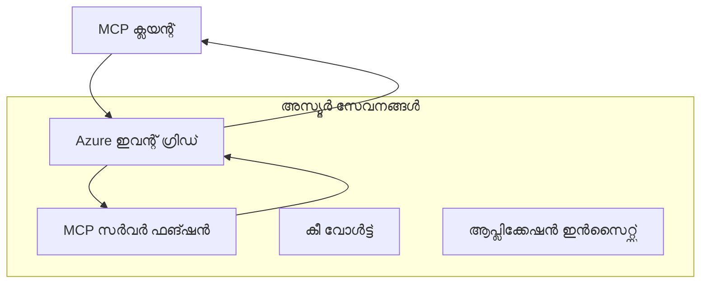
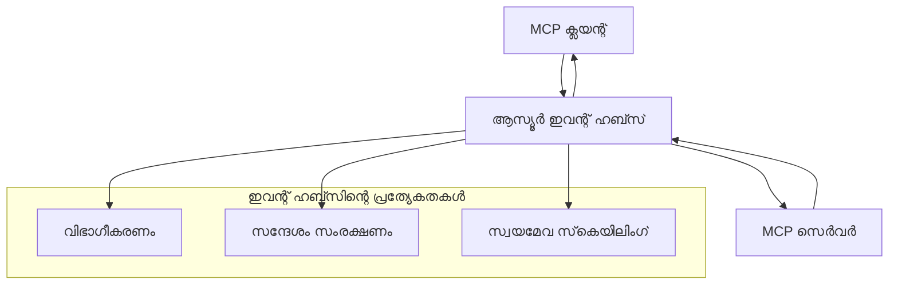

# MCP കസ്റ്റം ട്രാൻസ്പോർട്ടുകൾ - അഡ്വാൻസ്ഡ് ഇൻപ്ലിമെൻറേഷൻ ഗൈഡ്

മോഡൽ കണ്ടെക്സ്റ്റ് പ്രോട്ടോക്കോൾ (MCP) ട്രാൻസ്പോർട്ട് മെക്കാനിസങ്ങൾ വികസ്വരമാക്കുന്നു, പ്രത്യേക എന്റർപ്രൈസ് പരിസരങ്ങൾക്ക് കസ്റ്റം ഇൻപ്ലിമെന്റേഷനുകൾ അനുവദിക്കുന്നു. ഈ ആഡ്‌വാൻസ്ഡ് ഗൈഡ്, സ്കെയിലബിൾ, ക്ലൗഡ്-നെറ്റീവ് MCP സൊല്യൂഷനുകൾ നിർമ്മിക്കുന്നതിനായുളള പ്രായോഗിക ഉദാഹരണങ്ങളായ അജ്യൂർ ഇവന്റ് ഗ്രിഡും അജ്യൂർ ഇവന്റ് ഹബ്സും ഉപയോഗിച്ചുള്ള കസ്റ്റം ട്രാൻസ്പോർട്ട് ഇൻപ്ലിമെന്റേഷനുകൾ പരിചയപ്പെടുത്തുന്നു.

> **ഭാവിയിൽ നോക്കുക:** ഈ ഗൈഡ് **MCP സ്പെസിഫിക്കേഷൻ 2025-11-25** അനുസരിച്ച് എഴുതിയാണ്, ഇവിടെ ഓരോ സെഷനും ഉൾപ്പെടെയുള്ള സെഷൻ ഓർഡറിംഗ് പാലിക്കേണ്ടതുണ്ട് (താഴെ കാണുക - മെസേജ് പ്രോട്ടോക്കോൾ). `2026-07-28` റിലീസ് കാൻഡിഡേറ്റ് പ്രോട്ടോക്കോൾ-ലവൽ സെഷൻ പൂര്‍ണ്ണമായും നീക്കംചെയ്യുകയും, `Mcp-Method`/`Mcp-Name` ഹെഡറുകൾ ആവശ്യമായതിനാൽ ഗേറ്റ്‌വേകളും കസ്റ്റം ട്രാൻസ്പോർട്ടുകളും per-request പ്രിസ്ഥാന്റെ പേരിലായി റൂട്ടിംഗ് നടത്താൻ കഴിയും. [MCPയിൽ എന്താണ് മാറുന്നത്: 2026-07-28 റിലീസ് കാൻഡിഡേറ്റ്](../../01-CoreConcepts/mcp-2026-07-28-release-candidate.md) കാണുക.

## ആമുഖം

MCPയുടെ സ്റ്റാൻഡേർഡ് ട്രാൻസ്പോർട്ടുകൾ (stdio, HTTP സ്ട്രീമിംഗ്) ഭൂരിപക്ഷ ഉപയോഗങ്ങൾക്ക് അനുയോജ്യമാണ്, എന്റർപ്രൈസ് പരിസരങ്ങൾ സ്കെയിലബിലിറ്റി, വിശ്വസനീയത, നിലവിലുള്ള ക്ലൗഡ് ഇൻഫ്രാസ്ട്രക്ചറുമായുള്ള ഇൻറഗ്രേഷനുകൾക്കായി പ്രത്യേകമായ ട്രാൻസ്പോർട്ട് മെക്കാനിസങ്ങൾ ആവശ്യപ്പെടുന്നു. കസ്റ്റം ട്രാൻസ്പോർട്ടുകൾ MCPക്ക് അസിങ്ക്രണസ് കമ്മ്യൂണിക്കേഷൻ, ഇവന്റ്-ഡ്രിവൻ ആർക്കിടെക്‌ചറുകൾ, വിതരണ പ്രോസസിംഗ് എന്നിവയ്ക്കായി ക്ലൗഡ്-നെറ്റീവ് മെസേജിംഗ് സർവീസുകളെ ഉപയോഗപ്പെടുത്താൻ സാദ്ധ്യമാക്കുന്നു.

ഈ പാഠം ഏറ്റവും പുതിയ MCP സ്പെസിഫിക്കേഷൻ (2025-11-25), അജ്യൂർ മെസേജിംഗ് സർവീസുകൾ, സസ്ഥാപിത എന്റർപ്രൈസ് ഇൻറഗ്രേഷൻ പാറ്റേണുകൾ അടിസ്ഥാനമാക്കിയുള്ള അഡ്വാൻസ്ഡ് ട്രാൻസ്പോർട്ട് ഇൻപ്ലിമെൻറേഷനുകൾ പരിശോധിക്കുന്നു.

### **MCP ട്രാൻസ്പോർട്ട് ആർക്കിടെക്‌ചർ**

**MCP സ്പെസിഫിക്കേഷനിൽ നിന്നുള്ള (2025-11-25):**

- **സ്റ്റാൻഡേർഡ് ട്രാൻസ്പോർട്ടുകൾ**: stdio (ശുപാർശചെയ്യപ്പെട്ടത്), HTTP സ്ട്രീമിംഗ് (റിമോട്ട് സീനാരിയോകൾക്കായി)
- **കസ്റ്റം ട്രാൻസ്പോർട്ടുകൾ**: MCP മെസേജ് കൈമാറ്റ പ്രോട്ടോക്കോൾ നടപ്പാക്കുന്ന ഏതെങ്കിലും ട്രാൻസ്പോർട്ട്
- **മെസേജ് ഫോർമാറ്റ്**: MCP-നുകുലമായ വിപുലീകരണങ്ങളുമായി JSON-RPC 2.0
- **ദ്വിതീയസംവാദം**: നോട്ടിഫിക്കേഷനും പ്രതികരണങ്ങൾക്കും ഫുൾ ഡുപ്ലെക്സ്ഡ് കമ്മ്യൂണിക്കേഷൻ ആവശ്യമാണ്

## പഠന ലക്ഷ്യങ്ങൾ

ഈ അഡ്വാൻസ്ഡ് പാഠം അവസാനിക്കുന്നത് വരെ, നിങ്ങൾക്ക് കഴിയും:

- **കസ്റ്റം ട്രാൻസ്പോർട്ട് ആവശ്യകതകൾ മനസ്സിലാക്കുക**: MCP പ്രോട്ടോക്കോൾ ഏത് ട്രാൻസ്പോർട്ട് ലെയറിലും നടപ്പാക്കുക, അഭിമുഖ്യമുള്ള പിൻവാതിൽ പാലിക്കുക
- **അജ്യൂർ ഇവന്റ് ഗ്രിഡ് ട്രാൻസ്പോർട്ട് നിർമ്മിക്കുക**: സർവർലെസ് സ്കെയിലബിലിറ്റിക്കായി അജ്യൂർ ഇവന്റ് ഗ്രിഡ് ഉപയോഗിച്ച് ഇവന്റ്-ഡ്രിവൻ MCP സർവർകൾ സൃഷ്ടിക്കുക
- **അജ്യൂർ ഇവന്റ് ഹബ്സ്എനെ ട്രാൻസ്പോർട്ട് നടപ്പാക്കുക**: ലൈവ് സ്ട്രീമിംഗിനായി ഉയർന്ന ത്രൂപ്പുട്ട് MCP സൊല്യൂഷനുകൾ രൂപകൽപ്പന ചെയ്യുക
- **എന്റർപ്രൈസ് പാറ്റേണുകൾ പ്രയോഗിക്കുക**: നിലവിലുള്ള അജ്യൂർ ഇൻഫ്രാസ്ട്രക്ചറുമായി കസ്റ്റം ട്രാൻസ്പോർട്ടുകൾ ഇന്റഗ്രേറ്റ് ചെയ്യുക
- **ട്രാൻസ്പോർട്ട് വിശ്വസനീയത കൈകാര്യം ചെയ്യുക**: മെസേജ് ദുരാബിലിറ്റി, ഓർഡറിംഗ്, പിശക് കൈകാര്യം ചെയ്യൽ നടപ്പാക്കുക
- **പ്രകടനം മെച്ചപ്പെടുത്തുക**: സ്കെയിൽ, ലാറ്റൻസി, ത്രൂപ്പുട്ട് ആവശ്യകതകൾക്കനുസൃതമായി ട്രാൻസ്പോർട്ട് ഡിസൈൻ ചെയ്യുക

## **ട്രാൻസ്പോർട്ട് ആവശ്യകതകൾ**

### **MCP സ്പെസിഫിക്കേഷനിൽ നിന്നുള്ള പ്രധാന ആവശ്യകതകൾ (2025-11-25):**

```yaml
Message Protocol:
  format: "JSON-RPC 2.0 with MCP extensions"
  bidirectional: "Full duplex communication required"
  ordering: "Message ordering must be preserved per session"
  
Transport Layer:
  reliability: "Transport MUST handle connection failures gracefully"
  security: "Transport MUST support secure communication"
  identification: "Each session MUST have unique identifier"
  
Custom Transport:
  compliance: "MUST implement complete MCP message exchange"
  extensibility: "MAY add transport-specific features"
  interoperability: "MUST maintain protocol compatibility"
```

## **അജ്യൂർ ഇവന്റ് ഗ്രിഡ് ട്രാൻസ്പോർട്ട് ഇൻപ്ലിമെൻറേഷൻ**

അജ്യൂർ ഇവന്റ് ഗ്രിഡ് ഒരു സേർവർലെസ്സ് ഇവന്റ് റൂട്ടിംഗ് സർവീസ് ആണ്, ഇവന്റ്-ഡ്രിവൻ MCP ആർക്കിടെക്‌ചറുകൾക്കായി അനുയോജ്യം. ഈ ഇൻപ്ലിമെന്റേഷൻ സ്കെയിലബിൾ, ലൂസലി-കപ്ല്ഡ് MCP സിസ്റ്റങ്ങൾ എങ്ങനെ നിർമ്മിക്കാമെന്ന് കാണിക്കുന്നു.

### **ആർക്കിടെക്‌ചർ അവലോകനം**



### **C# ഇൻപ്ലിമെൻറേഷൻ - ഇവന്റ് ഗ്രിഡ് ട്രാൻസ്പോർട്ട്**

```csharp
using Azure.Messaging.EventGrid;
using Microsoft.Extensions.Azure;
using System.Text.Json;

public class EventGridMcpTransport : IMcpTransport
{
    private readonly EventGridPublisherClient _publisher;
    private readonly string _topicEndpoint;
    private readonly string _clientId;
    
    public EventGridMcpTransport(string topicEndpoint, string accessKey, string clientId)
    {
        _publisher = new EventGridPublisherClient(
            new Uri(topicEndpoint), 
            new AzureKeyCredential(accessKey));
        _topicEndpoint = topicEndpoint;
        _clientId = clientId;
    }
    
    public async Task SendMessageAsync(McpMessage message)
    {
        var eventGridEvent = new EventGridEvent(
            subject: $"mcp/{_clientId}",
            eventType: "MCP.MessageReceived",
            dataVersion: "1.0",
            data: JsonSerializer.Serialize(message))
        {
            Id = Guid.NewGuid().ToString(),
            EventTime = DateTimeOffset.UtcNow
        };
        
        await _publisher.SendEventAsync(eventGridEvent);
    }
    
    public async Task<McpMessage> ReceiveMessageAsync(CancellationToken cancellationToken)
    {
        // Event Grid is push-based, so implement webhook receiver
        // This would typically be handled by Azure Functions trigger
        throw new NotImplementedException("Use EventGridTrigger in Azure Functions");
    }
}

// Azure Function for receiving Event Grid events
[FunctionName("McpEventGridReceiver")]
public async Task<IActionResult> HandleEventGridMessage(
    [EventGridTrigger] EventGridEvent eventGridEvent,
    ILogger log)
{
    try
    {
        var mcpMessage = JsonSerializer.Deserialize<McpMessage>(
            eventGridEvent.Data.ToString());
        
        // Process MCP message
        var response = await _mcpServer.ProcessMessageAsync(mcpMessage);
        
        // Send response back via Event Grid
        await _transport.SendMessageAsync(response);
        
        return new OkResult();
    }
    catch (Exception ex)
    {
        log.LogError(ex, "Error processing Event Grid MCP message");
        return new BadRequestResult();
    }
}
```

### **ടൈപ്പ്സ്ക്രിപ്റ്റ് ഇൻപ്ലിമെൻറേഷൻ - ഇവന്റ് ഗ്രിഡ് ട്രാൻസ്പോർട്ട്**

```typescript
import { EventGridPublisherClient, AzureKeyCredential } from "@azure/eventgrid";
import { McpTransport, McpMessage } from "./mcp-types";

export class EventGridMcpTransport implements McpTransport {
    private publisher: EventGridPublisherClient;
    private clientId: string;
    
    constructor(
        private topicEndpoint: string,
        private accessKey: string,
        clientId: string
    ) {
        this.publisher = new EventGridPublisherClient(
            topicEndpoint,
            new AzureKeyCredential(accessKey)
        );
        this.clientId = clientId;
    }
    
    async sendMessage(message: McpMessage): Promise<void> {
        const event = {
            id: crypto.randomUUID(),
            source: `mcp-client-${this.clientId}`,
            type: "MCP.MessageReceived",
            time: new Date(),
            data: message
        };
        
        await this.publisher.sendEvents([event]);
    }
    
    // അഴ്യൂർ ഫംഗ്ഷനുകൾ വഴി ഇവന്റ്-നിർബന്ധിത സ്വീകരിക്കൽ
    onMessage(handler: (message: McpMessage) => Promise<void>): void {
        // അഴ്യൂർ ഫംഗ്ഷനുകളുടെ ഇവന്റ് ഗ്രിഡ് ട്രിഗ്ഗർ ഉപയോഗിച്ച് നടപ്പാക്കൽ
        // വെബ്‌ഹുക്ക് സ്വീകരിക്കുന്നതിനുള്ള ഒരു ആശയപരമായ ഇന്റർഫേസ് ഇത്
    }
}

// അഴ്യൂർ ഫംഗ്ഷനുകളുടെ നടപ്പാക്കൽ
import { app, InvocationContext, EventGridEvent } from "@azure/functions";

app.eventGrid("mcpEventGridHandler", {
    handler: async (event: EventGridEvent, context: InvocationContext) => {
        try {
            const mcpMessage = event.data as McpMessage;
            
            // MCP സന്ദേശം പ്രോസസ്സ് ചെയ്യുക
            const response = await mcpServer.processMessage(mcpMessage);
            
            // ഇവന്റ് ഗ്രിഡ് വഴി പ്രതികരണം അയയ്ക്കുക
            await transport.sendMessage(response);
            
        } catch (error) {
            context.error("Error processing MCP message:", error);
            throw error;
        }
    }
});
```

### **പൈത്തൺ ഇൻപ്ലിമെൻറേഷൻ - ഇവന്റ് ഗ്രിഡ് ട്രാൻസ്പോർട്ട്**

```python
from azure.eventgrid import EventGridPublisherClient, EventGridEvent
from azure.core.credentials import AzureKeyCredential
import asyncio
import json
from typing import Callable, Optional
import uuid
from datetime import datetime

class EventGridMcpTransport:
    def __init__(self, topic_endpoint: str, access_key: str, client_id: str):
        self.client = EventGridPublisherClient(
            topic_endpoint, 
            AzureKeyCredential(access_key)
        )
        self.client_id = client_id
        self.message_handler: Optional[Callable] = None
    
    async def send_message(self, message: dict) -> None:
        """Send MCP message via Event Grid"""
        event = EventGridEvent(
            data=message,
            subject=f"mcp/{self.client_id}",
            event_type="MCP.MessageReceived",
            data_version="1.0"
        )
        
        await self.client.send(event)
    
    def on_message(self, handler: Callable[[dict], None]) -> None:
        """Register message handler for incoming events"""
        self.message_handler = handler

# ആസൂർ ഫംഗ്ഷൻസ് നടപ്പാക്കൽ
import azure.functions as func
import logging

def main(event: func.EventGridEvent) -> None:
    """Azure Functions Event Grid trigger for MCP messages"""
    try:
        # ഇവന്റ് ഗ്രിഡ് ഇവന്റിൽ നിന്ന് MCP സന്ദേശം പാഴ്‌സുചെയ്യുക
        mcp_message = json.loads(event.get_body().decode('utf-8'))
        
        # MCP സന്ദേശം പ്രോസസ്സ് ചെയ്യുക
        response = process_mcp_message(mcp_message)
        
        # ഇവന്റ് ഗ്രിഡ് വഴിയുള്ള മറുപടി അയക്കുക
        # (നടപ്പാക്കൽ പുതിയ ഇവന്റ് ഗ്രിഡ് ക്ലയന്റ് സൃഷ്‌ടിക്കും)
        
    except Exception as e:
        logging.error(f"Error processing MCP Event Grid message: {e}")
        raise
```

## **അജ്യൂർ ഇവന്റ് ഹബ്സ്പ്രവർത്തനം**

MCP സീനാരിയോകൾക്കായി കുറഞ്ഞ ലാറ്റൻസി, ഉയർന്ന മെസേജ് വാള്യം അനുവദിക്കുന്ന ഹൈ-ത്രൂപ്പുട്ട്, റിയൽ-ടൈം സ്ട്രീമിംഗ് സവിശേഷതകൾ അജ്യൂർ ഇവന്റ് ഹബ്സുകൾ നൽകുന്നു.

### **ആർക്കിടെക്‌ചർ അവലോകനം**



### **C# ഇൻപ്ലിമെൻറേഷൻ - ഇവന്റ് ഹബ്സ്പ്രവർത്തനം**

```csharp
using Azure.Messaging.EventHubs;
using Azure.Messaging.EventHubs.Producer;
using Azure.Messaging.EventHubs.Consumer;
using System.Text;

public class EventHubsMcpTransport : IMcpTransport, IDisposable
{
    private readonly EventHubProducerClient _producer;
    private readonly EventHubConsumerClient _consumer;
    private readonly string _consumerGroup;
    private readonly CancellationTokenSource _cancellationTokenSource;
    
    public EventHubsMcpTransport(
        string connectionString, 
        string eventHubName,
        string consumerGroup = "$Default")
    {
        _producer = new EventHubProducerClient(connectionString, eventHubName);
        _consumer = new EventHubConsumerClient(
            consumerGroup, 
            connectionString, 
            eventHubName);
        _consumerGroup = consumerGroup;
        _cancellationTokenSource = new CancellationTokenSource();
    }
    
    public async Task SendMessageAsync(McpMessage message)
    {
        var messageBody = JsonSerializer.Serialize(message);
        var eventData = new EventData(Encoding.UTF8.GetBytes(messageBody));
        
        // Add MCP-specific properties
        eventData.Properties.Add("MessageType", message.Method ?? "response");
        eventData.Properties.Add("MessageId", message.Id);
        eventData.Properties.Add("Timestamp", DateTimeOffset.UtcNow);
        
        await _producer.SendAsync(new[] { eventData });
    }
    
    public async Task StartReceivingAsync(
        Func<McpMessage, Task> messageHandler)
    {
        await foreach (PartitionEvent partitionEvent in _consumer.ReadEventsAsync(
            _cancellationTokenSource.Token))
        {
            try
            {
                var messageBody = Encoding.UTF8.GetString(
                    partitionEvent.Data.EventBody.ToArray());
                var mcpMessage = JsonSerializer.Deserialize<McpMessage>(messageBody);
                
                await messageHandler(mcpMessage);
            }
            catch (Exception ex)
            {
                // Handle deserialization or processing errors
                Console.WriteLine($"Error processing message: {ex.Message}");
            }
        }
    }
    
    public void Dispose()
    {
        _cancellationTokenSource?.Cancel();
        _producer?.DisposeAsync().AsTask().Wait();
        _consumer?.DisposeAsync().AsTask().Wait();
        _cancellationTokenSource?.Dispose();
    }
}
```

### **ടൈപ്പ്സ്ക്രിപ്റ്റ് ഇൻപ്ലിമെൻറേഷൻ - ഇവന്റ് ഹബ്സ്പ്രവർത്തനം**

```typescript
import { 
    EventHubProducerClient, 
    EventHubConsumerClient, 
    EventData 
} from "@azure/event-hubs";

export class EventHubsMcpTransport implements McpTransport {
    private producer: EventHubProducerClient;
    private consumer: EventHubConsumerClient;
    private isReceiving = false;
    
    constructor(
        private connectionString: string,
        private eventHubName: string,
        private consumerGroup: string = "$Default"
    ) {
        this.producer = new EventHubProducerClient(
            connectionString, 
            eventHubName
        );
        this.consumer = new EventHubConsumerClient(
            consumerGroup,
            connectionString,
            eventHubName
        );
    }
    
    async sendMessage(message: McpMessage): Promise<void> {
        const eventData: EventData = {
            body: JSON.stringify(message),
            properties: {
                messageType: message.method || "response",
                messageId: message.id,
                timestamp: new Date().toISOString()
            }
        };
        
        await this.producer.sendBatch([eventData]);
    }
    
    async startReceiving(
        messageHandler: (message: McpMessage) => Promise<void>
    ): Promise<void> {
        if (this.isReceiving) return;
        
        this.isReceiving = true;
        
        const subscription = this.consumer.subscribe({
            processEvents: async (events, context) => {
                for (const event of events) {
                    try {
                        const messageBody = event.body as string;
                        const mcpMessage: McpMessage = JSON.parse(messageBody);
                        
                        await messageHandler(mcpMessage);
                        
                        // കുറഞ്ഞത് ഒരുചവണികം ഡെലിവറിയ്ക്ക് ചെക്ക്‌പോയിന്റ് അപ്ഡേറ്റ് ചെയ്യുക
                        await context.updateCheckpoint(event);
                    } catch (error) {
                        console.error("Error processing Event Hubs message:", error);
                    }
                }
            },
            processError: async (err, context) => {
                console.error("Event Hubs error:", err);
            }
        });
    }
    
    async close(): Promise<void> {
        this.isReceiving = false;
        await this.producer.close();
        await this.consumer.close();
    }
}
```

### **പൈത്തൺ ഇൻപ്ലിമെൻറേഷൻ - ഇവന്റ് ഹബ്സ്പ്രവർത്തനം**

```python
from azure.eventhub import EventHubProducerClient, EventHubConsumerClient
from azure.eventhub import EventData
import json
import asyncio
from typing import Callable, Dict, Any
import logging

class EventHubsMcpTransport:
    def __init__(
        self, 
        connection_string: str, 
        eventhub_name: str,
        consumer_group: str = "$Default"
    ):
        self.producer = EventHubProducerClient.from_connection_string(
            connection_string, 
            eventhub_name=eventhub_name
        )
        self.consumer = EventHubConsumerClient.from_connection_string(
            connection_string,
            consumer_group=consumer_group,
            eventhub_name=eventhub_name
        )
        self.is_receiving = False
    
    async def send_message(self, message: Dict[str, Any]) -> None:
        """Send MCP message via Event Hubs"""
        event_data = EventData(json.dumps(message))
        
        # MCP-നിർദിഷ്ട ഗുണങ്ങൾ ചേർക്കുക
        event_data.properties = {
            "messageType": message.get("method", "response"),
            "messageId": message.get("id"),
            "timestamp": "2025-01-14T10:30:00Z"  # യഥാർത്ഥ ടൈംസ്റ്റാമ്പ് ഉപയോഗിക്കുക
        }
        
        async with self.producer:
            event_data_batch = await self.producer.create_batch()
            event_data_batch.add(event_data)
            await self.producer.send_batch(event_data_batch)
    
    async def start_receiving(
        self, 
        message_handler: Callable[[Dict[str, Any]], None]
    ) -> None:
        """Start receiving MCP messages from Event Hubs"""
        if self.is_receiving:
            return
        
        self.is_receiving = True
        
        async with self.consumer:
            await self.consumer.receive(
                on_event=self._on_event_received(message_handler),
                starting_position="-1"  # ആരംഭത്തിൽ നിന്ന് തുടങ്ങുക
            )
    
    def _on_event_received(self, handler: Callable):
        """Internal event handler wrapper"""
        async def handle_event(partition_context, event):
            try:
                # Event Hubs ഇവന്റിൽ നിന്നും MCP സന്ദേശം പാഴ്‌സ് ചെയ്യുക
                message_body = event.body_as_str(encoding='UTF-8')
                mcp_message = json.loads(message_body)
                
                # MCP സന്ദേശം പ്രോസസ്സ് ചെയ്യുക
                await handler(mcp_message)
                
                # കുറഞ്ഞത് ഒരിക്കൽ ഡെലിവറിയ്ക്ക് checkpoint അപ്പ്‌ഡേറ്റ് ചെയ്യുക
                await partition_context.update_checkpoint(event)
                
            except Exception as e:
                logging.error(f"Error processing Event Hubs message: {e}")
        
        return handle_event
    
    async def close(self) -> None:
        """Clean up transport resources"""
        self.is_receiving = False
        await self.producer.close()
        await self.consumer.close()
```

## **അഡ്വാൻസ്ഡ് ട്രാൻസ്പോർട്ട് പാറ്റേണുകൾ**

### **മെസേജ് ദുരാബിലിറ്റി, വിശ്വസനീയത**

```csharp
// Implementing message durability with retry logic
public class ReliableTransportWrapper : IMcpTransport
{
    private readonly IMcpTransport _innerTransport;
    private readonly RetryPolicy _retryPolicy;
    
    public async Task SendMessageAsync(McpMessage message)
    {
        await _retryPolicy.ExecuteAsync(async () =>
        {
            try
            {
                await _innerTransport.SendMessageAsync(message);
            }
            catch (TransportException ex) when (ex.IsRetryable)
            {
                // Log and retry
                throw;
            }
        });
    }
}
```

### **ട്രാൻസ്പോർട്ട് സുരക്ഷാ ഇൻറഗ്രേഷൻ**

```csharp
// Integrating Azure Key Vault for transport security
public class SecureTransportFactory
{
    private readonly SecretClient _keyVaultClient;
    
    public async Task<IMcpTransport> CreateEventGridTransportAsync()
    {
        var accessKey = await _keyVaultClient.GetSecretAsync("EventGridAccessKey");
        var topicEndpoint = await _keyVaultClient.GetSecretAsync("EventGridTopic");
        
        return new EventGridMcpTransport(
            topicEndpoint.Value.Value,
            accessKey.Value.Value,
            Environment.MachineName
        );
    }
}
```

### **ട്രാൻസ്പോർട്ട് മോണിറ്ററിംഗ്, ഒബ്സർവബി‌ലിറ്റി**

```csharp
// Adding telemetry to custom transports
public class ObservableTransport : IMcpTransport
{
    private readonly IMcpTransport _transport;
    private readonly ILogger _logger;
    private readonly TelemetryClient _telemetryClient;
    
    public async Task SendMessageAsync(McpMessage message)
    {
        using var activity = Activity.StartActivity("MCP.Transport.Send");
        activity?.SetTag("transport.type", "EventGrid");
        activity?.SetTag("message.method", message.Method);
        
        var stopwatch = Stopwatch.StartNew();
        
        try
        {
            await _transport.SendMessageAsync(message);
            
            _telemetryClient.TrackDependency(
                "EventGrid",
                "SendMessage",
                DateTime.UtcNow.Subtract(stopwatch.Elapsed),
                stopwatch.Elapsed,
                true
            );
        }
        catch (Exception ex)
        {
            _telemetryClient.TrackException(ex);
            throw;
        }
    }
}
```

## **എന്റർപ്രൈസ് ഇൻറഗ്രേഷൻ സീനാരിയോകൾ**

### **സീനാരി 1: MCP പ്രോസസ്സ് വിതരണവൽക്കരണം**

MCP അഭ്യർത്ഥനകൾ പല പ്രോസസ്സിംഗ് നോട്ടുകളിലായി വിതരണം ചെയ്യുന്നതിനായി അജ്യൂർ ഇവന്റ് ഗ്രിഡ് ഉപയോഗിക്കുന്നു:

```yaml
Architecture:
  - MCP Client sends requests to Event Grid topic
  - Multiple Azure Functions subscribe to process different tool types
  - Results aggregated and returned via separate response topic
  
Benefits:
  - Horizontal scaling based on message volume
  - Fault tolerance through redundant processors
  - Cost optimization with serverless compute
```

### **സീനാരി 2: റിയൽ-ടൈം MCP സ്ട്രീമിംഗ്**

ഉയർന്ന നിരക്കിലുള്ള MCP ഇടപെടലുകൾക്കായി അജ്യൂർ ഇവന്റ് ഹബ്സ് ഉപയോഗിക്കുന്നു:

```yaml
Architecture:
  - MCP Client streams continuous requests via Event Hubs
  - Stream Analytics processes and routes messages
  - Multiple consumers handle different aspect of processing
  
Benefits:
  - Low latency for real-time scenarios
  - High throughput for batch processing
  - Built-in partitioning for parallel processing
```

### **സീനാരി 3: ഹൈബ്രിഡ് ട്രാൻസ്പോർട്ട് ആർക്കിടെക്‌ചർ**

വ്യത്യസ്ത ഉപയോഗത്തിനായി പല ട്രാൻസ്പോർട്ടുകളും സംയോജിപ്പിക്കുന്നു:

```csharp
public class HybridMcpTransport : IMcpTransport
{
    private readonly IMcpTransport _realtimeTransport; // Event Hubs
    private readonly IMcpTransport _batchTransport;    // Event Grid
    private readonly IMcpTransport _fallbackTransport; // HTTP Streaming
    
    public async Task SendMessageAsync(McpMessage message)
    {
        // Route based on message characteristics
        var transport = message.Method switch
        {
            "tools/call" when IsRealtime(message) => _realtimeTransport,
            "resources/read" when IsBatch(message) => _batchTransport,
            _ => _fallbackTransport
        };
        
        await transport.SendMessageAsync(message);
    }
}
```

## **പ്രകടനം മെച്ചപ്പെടുത്തൽ**

### **ഇവന്റ് ഗ്രിഡിനായി മെസേജ് ബാച്ചിംഗ്**

```csharp
public class BatchingEventGridTransport : IMcpTransport
{
    private readonly List<McpMessage> _messageBuffer = new();
    private readonly Timer _flushTimer;
    private const int MaxBatchSize = 100;
    
    public async Task SendMessageAsync(McpMessage message)
    {
        lock (_messageBuffer)
        {
            _messageBuffer.Add(message);
            
            if (_messageBuffer.Count >= MaxBatchSize)
            {
                _ = Task.Run(FlushMessages);
            }
        }
    }
    
    private async Task FlushMessages()
    {
        List<McpMessage> toSend;
        lock (_messageBuffer)
        {
            toSend = new List<McpMessage>(_messageBuffer);
            _messageBuffer.Clear();
        }
        
        if (toSend.Any())
        {
            var events = toSend.Select(CreateEventGridEvent);
            await _publisher.SendEventsAsync(events);
        }
    }
}
```

### **ഇവന്റ് ഹബ്സിനായി പാർട്ടീഷണിംഗ് സ്ട്രാറ്റജി**

```csharp
public class PartitionedEventHubsTransport : IMcpTransport
{
    public async Task SendMessageAsync(McpMessage message)
    {
        // Partition by client ID for session affinity
        var partitionKey = ExtractClientId(message);
        
        var eventData = new EventData(JsonSerializer.SerializeToUtf8Bytes(message))
        {
            PartitionKey = partitionKey
        };
        
        await _producer.SendAsync(new[] { eventData });
    }
}
```

## **കസ്റ്റം ട്രാൻസ്പോർട്ടുകളുടെ ടെസ്റ്റിംഗ്**

### **ടെസ്റ്റ് ഡബിളുകൾ ഉപയോഗിച്ച് യൂണിറ്റ് ടെസ്റ്റിങ്**

```csharp
[Test]
public async Task EventGridTransport_SendMessage_PublishesCorrectEvent()
{
    // Arrange
    var mockPublisher = new Mock<EventGridPublisherClient>();
    var transport = new EventGridMcpTransport(mockPublisher.Object);
    var message = new McpMessage { Method = "tools/list", Id = "test-123" };
    
    // Act
    await transport.SendMessageAsync(message);
    
    // Assert
    mockPublisher.Verify(
        x => x.SendEventAsync(
            It.Is<EventGridEvent>(e => 
                e.EventType == "MCP.MessageReceived" &&
                e.Subject == "mcp/test-client"
            )
        ),
        Times.Once
    );
}
```

### **അജ്യൂർ ടെസ്റ്റ് കണ്ടെയ്‌നറുകളുമായി ഇൻറഗ്രേഷൻ ടെസ്റ്റിങ്**

```csharp
[Test]
public async Task EventHubsTransport_IntegrationTest()
{
    // Using Testcontainers for integration testing
    var eventHubsContainer = new EventHubsContainer()
        .WithEventHub("test-hub");
    
    await eventHubsContainer.StartAsync();
    
    var transport = new EventHubsMcpTransport(
        eventHubsContainer.GetConnectionString(),
        "test-hub"
    );
    
    // Test message round-trip
    var sentMessage = new McpMessage { Method = "test", Id = "123" };
    McpMessage receivedMessage = null;
    
    await transport.StartReceivingAsync(msg => {
        receivedMessage = msg;
        return Task.CompletedTask;
    });
    
    await transport.SendMessageAsync(sentMessage);
    await Task.Delay(1000); // Allow for message processing
    
    Assert.That(receivedMessage?.Id, Is.EqualTo("123"));
}
```

## **മികച്ച പ്രാക്ടീസുകളും മാർഗ്ഗരേഖകളും**

### **ട്രാൻസ്പോർട്ട് ഡിസൈൻ സിദ്ധാന്തങ്ങൾ**

1. **ഐഡംപോടെൻസി**: പുനരവർത്തനങ്ങൾ കൈകാര്യം ചെയ്യാൻ മെസേജ് പ്രോസസ്സിംഗ് ഐഡംപോടെൻറ് ആക്കുക
2. **പിശക് കൈകാര്യം ചെയ്യൽ**: സമഗ്രമായ പിശക് കൈകാര്യം ചെയ്യലും ഡഡ് ലെറ്റർ ക്യുക്കുകളും നടപ്പാക്കുക
3. **മോണിറ്ററിംഗ്**: വിശദമായ ടെലിമെട്രിയും ഹെൽത്ത് ചെക്കുകളും ചേർക്കുക
4. **സുരക്ഷ**: മാനേജുചെയ്‌ത ഐഡന്റിറ്റികളും കുറഞ്ഞ അധികാര ആക്സസ് ഉപയോഗിക്കുക
5. **പ്രകടനം**: നിങ്ങളുടെ ലാറ്റൻസി, ത്രൂപുട്ട് ആവശ്യകതകൾക്കനുസൃതമായി ഡിസൈൻ ചെയ്യുക

### **അജ്യൂർ-സവിശേഷ ശിപാർശകൾ**

1. **മാനേജുചെയ്‌ത ഐഡന്റിറ്റി ഉപയോഗിക്കുക**: പ്രൊഡക്ഷനിൽ കണക്ഷൻ സ്ട്രിങുകൾ ഒഴിവാക്കുക
2. **സർക്ക്യൂട്ട് ബ്രേക്കറുകൾ നടപ്പാക്കുക**: അജ്യൂർ സർവീസ് ഔട്ടേജ്‌സിനെതിരെ സംരക്ഷണം നൽകുക
3. **ച്ചെലവ് നിരീക്ഷിക്കുക**: മെസേജ് വാളവും പ്രോസസ്സിംഗ് ചെലവുകളും ട്രാക്ക് ചെയ്യുക
4. **സ്കെയിലിനായി പദ്ധതിയിടുക**: പാർട്ടീഷണിംഗ്, സ്കെയിലിംഗ് സ്ട്രാറ്റജികൾ മുടക്കാതെ തുടക്കത്തിൽ രൂപകൽപ്പന ചെയ്യുക
5. **വ്യപകമായ പരീക്ഷണങ്ങൾ നടത്തുക**: ആഴൂർ ഡെവ്‌ടെസ്റ്റ് ലാബ്സ് ഉപയോഗിച്ച് സമഗ്രമായ പരിശോധനകൾ നടത്തുക

## **സംഗ്രഹം**

കസ്റ്റം MCP ട്രാൻസ്പോർട്ടുകൾ, അജ്യൂറിന്റെ മെസേജിംഗ് സർവീസുകൾ ഉപയോഗിച്ച് ശക്തമായ എന്റർപ്രൈസ് സീനാരിയോകൾക്ക് വഴി ഒരുക്കുന്നു. ഇവന്റ് ഗ്രിഡ് അല്ലെങ്കിൽ ഇവന്റ് ഹബ്സ് ട്രാൻസ്പോർട്ടുകൾ നടപ്പാക്കുന്നവനായി, നിലവിലുള്ള അജ്യൂർ ഇൻഫ്രാസ്ട്രക്ചറുമായി സുഖമായി ഇന്റഗ്രേറ്റ് ചെയ്യുന്ന സ്കെയിലബിൾ, വിശ്വസനീയ MCP സൊല്യൂഷനുകൾ നിങ്ങൾക്ക് നിർമ്മിക്കാം.

നൽകിയ ഉദാഹരണങ്ങൾ MCP പ്രോട്ടോക്കോൾ പാലനവും അജ്യൂർ മികച്ച പ്രാക്ടീസുകളും കൂട്ടി കസ്റ്റം ട്രാൻസ്പോർട്ടുകൾ നടപ്പാക്കുന്നതിനായുളള പ്രൊഡക്ഷൻ റെഡിയായ പാറ്റേണുകൾ കാണിക്കുന്നു.

## **അധിക സ്രോതസുകൾ**

- [MCP Specification 2025-11-25](https://modelcontextprotocol.io/specification/2025-11-25/)
- [Azure Event Grid Documentation](https://docs.microsoft.com/azure/event-grid/)
- [Azure Event Hubs Documentation](https://docs.microsoft.com/azure/event-hubs/)
- [Azure Functions Event Grid Trigger](https://docs.microsoft.com/azure/azure-functions/functions-bindings-event-grid)
- [Azure SDK for .NET](https://github.com/Azure/azure-sdk-for-net)
- [Azure SDK for TypeScript](https://github.com/Azure/azure-sdk-for-js)
- [Azure SDK for Python](https://github.com/Azure/azure-sdk-for-python)

---

> *ഈ ഗൈഡ് പ്രൊഡക്ഷൻ MCP സിസ്റ്റങ്ങളിലെ പ്രായോഗിക ഇൻപ്ലിമെൻറേഷൻ പാറ്റേണുകൾക്കായി ശ്രദ്ധ കേന്ദ്രീകരിക്കുന്നു. നിങ്ങളുടെ പ്രത്യേക ആവശ്യകതകൾക്കും അജ്യൂർ സർവീസ് പരിധികൾക്കും എതിരായി ട്രാൻസ്പോർട്ട് ഇൻപ്ലിമെന്റേഷനുകൾ എല്ലായ്പ്പോഴും സ്ഥിരീകരിക്കുക.*
> **നിലവിലെ സ്റ്റാൻഡേർഡ്**: ഈ ഗൈഡ് [MCP Specification 2025-11-25](https://modelcontextprotocol.io/specification/2025-11-25/) ട്രാൻസ്പോർട്ട് ആവശ്യകതകൾക്കും എന്റർപ്രൈസ് പരിസരങ്ങളിലെ അഡ്വാൻസ്ഡ് ട്രാൻസ്പോർട്ട് പാറ്റേണുകൾക്കും അനുസരിച്ചാണ്.


## ഇനി എന്താണ്
- [6. Community Contributions](../../06-CommunityContributions/README.md)

---

<!-- CO-OP TRANSLATOR DISCLAIMER START -->
**അറിയിപ്പ്**:
ഈ രേഖ AI പരിഭാഷാ സേവനം [Co-op Translator](https://github.com/Azure/co-op-translator) ഉപയോഗിച്ച് പരിഭാഷപ്പെടുത്തിയതാണ്. ഞങ്ങൾ കൃത്യതയ്ക്കായി ശ്രമിക്കുന്നുവെങ്കിലും, ഓട്ടോമേറ്റഡ് പരിഭാഷകളിൽ പിഴവുകൾ അല്ലെങ്കിൽ തെറ്റായ വിവരങ്ങൾ ഉണ്ടാകാൻ സാധ്യതയുണ്ട്. അതിന്റെ സ്വാഭാവിക ഭാഷയിലുള്ള അസൽ രേഖയാണ് പ്രാമാണികമായ ഉറവിടമായി പരിഗണിക്കേണ്ടത്. നിർണായകമായ വിവരങ്ങൾക്ക്, പ്രൊഫഷണൽ മനുഷ്യ പരിഭാഷ ശുപാർശ ചെയ്യുന്നു. ഈ പരിഭാഷ ഉപയോഗിച്ച് ഉണ്ടാകുന്ന തെറ്റിദ്ധാരണകൾ അല്ലെങ്കിൽ തെറ്റായ വ്യാഖ്യാനങ്ങൾക്കായി ഞങ്ങൾ ഉത്തരവാദികളല്ല.
<!-- CO-OP TRANSLATOR DISCLAIMER END -->