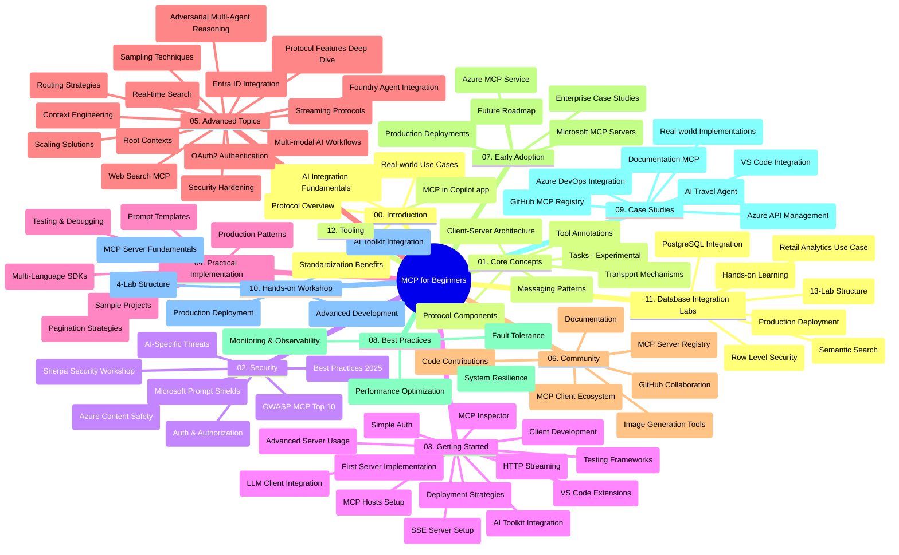

# മോഡൽ കോൺടെക്സ് പ്രോട്ടോക്കോൾ (MCP) പുതുമുഖർക്കുള്ള - പഠന മാർഗ്ഗരേഖ

"മോഡൽ കോൺടെക്സ് പ്രോട്ടോക്കോൾ (MCP) പുതുമുഖർക്കുള്ള" പാഠ്യക്രമത്തിനുള്ള റീപ്പോസിറ്ററി ഘടനയും ഉള്ളടക്കവും ഇതിവൃത്തമാകുന്ന പഠന മാർഗ്ഗരേഖയുള്ളതാണ് ഇത്. റീപ്പോസിറ്ററി ഫലപ്രദമായി നയിക്കുന്നതും ലഭ്യമായ വിഭവങ്ങളെ പരമാവധി പ്രയോജനപ്പെടുത്തുന്നതിനും ഈ മാർഗ്ഗരേഖ ഉപയോഗിക്കുക.

## റീപ്പോസിറ്ററി അവലോകനം

മോഡൽ കോൺടെക്സ് പ്രോട്ടോക്കോൾ (MCP) AI മോഡലുകളും ക്ലയന്റ് അപ്ലിക്കേഷനുകളും തമ്മിലുള്ള ഇടപാടിനുള്ള സ്റ്റാൻഡേർഡ് ഫെയിംവർക്ക് ആണ്. ആദ്യം Anthropic നിർമ്മിച്ച MCP ഇപ്പോൾ ഔദ്യോഗിക GitHub സംഘടന മുഖേന വ്യാപക MCP സമൂഹം പരിപാലിക്കുന്നു. C#, Java, JavaScript, Python, TypeScript എന്നിവയിൽ പ്രായോഗിക കോഡ് ഉദാഹരണങ്ങളോടെ ഒരു സമഗ്ര പാഠ്യക്രമം ഈ റീപ്പോസിറ്ററി നൽകുന്നു, ഇത് AI ഡെവലപ്പർമാർ, സിസ്റ്റം ആർക്കിടെക്റ്റുകളും സോഫ്റ്റ്‌വെയർ എഞ്ചിനീയർമാർക്കും ഉദ്ദേശിച്ചിരിക്കുന്നു.

## ദൃശ്യമായ പാഠ്യക്രമ നക്ഷത്രഭാഗം

## റീപ്പോസിറ്ററി ഘടന

MCPയുടെ വിവിധ ഘടകങ്ങളിൽ കേന്ദ്രീകരിച്ച് പന്ത്രണ്ടു പ്രധാന വിഭാഗങ്ങളായി റീപ്പോസിറ്ററി ക്രമീകരിച്ചിട്ടുണ്ട്:

1. **ആമുഖം (00-Introduction/)**
   - മോഡൽ കോൺടെക്സ് പ്രോട്ടോക്കോൾ സാരാംശം
   - AI പൈപ്പ്‌ലൈൻകളിൽ സ്റ്റാൻഡേർഡൈസേഷന്റെ പ്രാധാന്യം
   - പ്രായോഗിക ഉപയോഗകേസുകളും നേട്ടങ്ങളും

2. **പ്രധാന ആശയങ്ങൾ (01-CoreConcepts/)**
   - ക്ലയന്റ-server സങ്കേതം
   - പ്രധാന പ്രോട്ടോക്കോൾ ഘടകങ്ങൾ
   - MCPയിലെ മെസേജിംഗ് മാതൃകകൾ
   - ഭാവി വീക്ഷണം: [MCPയിലെ മാറ്റങ്ങൾ: 2026-07-28 റിലീസ് കാൻഡിഡേറ്റ്](./01-CoreConcepts/mcp-2026-07-28-release-candidate.md) — സ്റ്റേറ്റ്‌ലെസ് പ്രോട്ടോക്കോൾ കോർ, എക്സ്ടൻഷൻസ് ഫ്രെയിംവർക്ക്, Roots/Sampling/Logging ഉപേക്ഷണങ്ങൾ അടുത്ത സ്‌പെസിഫിക്കേഷൻ പതിപ്പിൽ പ്രതീക്ഷിക്കുന്നു

3. **സുരക്ഷ (02-Security/)**
   - MCP അധിഷ്ഠിത സിസ്റ്റങ്ങളിലുള്ള സുരക്ഷാ ഭീഷണികൾ
   - കുറിച്ച്വയ്ക്കൽ reൽഴിലെ മികച്ച പ്രയോഗങ്ങൾ
   - ആധികൃതി സാധ്യതകളും അംഗീകാര തന്ത്രങ്ങളും
   - **സമഗ്ര സുരക്ഷാ ഡോക്യുമെന്റേഷൻ**:
     - MCP സുരക്ഷാ മികച്ച പ്രയോഗങ്ങൾ 2025
     - Azure കോൺടെന്റ് സേഫ്റ്റി ഇംപ്ലിമെന്റേഷൻ ഗൈഡ്
     - MCP സുരക്ഷാ നിയന്ത്രണങ്ങളും സാങ്കേതിക വിദ്യകളും
     - MCP മികച്ച പ്രയോഗങ്ങളുടെ ക്വിക്ക് റഫറൻസ്
   - **പ്രധാന സുരക്ഷാ വിഷയങ്ങൾ**:
     - പ്രോംപ്റ്റ് ഇൻജക്ഷൻ, ടൂൾ വിഷ ബാധ്യങ്ങൾ
     - സെഷൻ കവർച്ചയും കഫ്യൂസ് ഡെപ്യൂ പ്രശ്നങ്ങളും
     - ടോക്കൺ പാസ്സ് ത്രൂ ദുർബലതകൾ
     - അധികാരവും ആക്‌സസ് കൺട്രോളും
     - AI ഘടകങ്ങൾക്ക് സപ്ലൈ ചെയിൻ സുരക്ഷ
     - മൈക്രോസോഫ്റ്റ് പ്രോംപ്റ്റ് ഷീൽഡുകൾ ചേർക്കൽ

4. **ആരംഭിക്കാം (03-GettingStarted/)**
   - പരിസര ക്രമീകരണവും കോൺഫിഗറേഷനും
   - അടിസ്ഥാന MCP സെർവറും ക്ലയന്റും സൃഷ്ടിക്കൽ
   - നിലവിലുള്ള അപ്ലിക്കേഷനുകളുമായി സംയോജനം
   - ഉൾപ്പെടുത്തുന്ന വിഭാഗങ്ങൾ:
     - ആദ്യ സെർവർ നടപ്പാക്കൽ
     - ക്ലയന്റ് വികസനം
     - LLM ക്ലയന്റ് സംയോജനം
     - VS കോഡ് സംയോജനം
     - സെർവർ-സെന്റ് ഇവന്റ്സ് (SSE) സെർവർ
     - ഉയർന്ന സെർവർ ഉപയോഗം
     - HTTP സ്ട്രീമിംഗ്
     - AI ടൂൾകിറ്റ് സംയോജനം
     - ടെസ്റ്റിങ് തന്ത്രങ്ങൾ
     - വിനിയോഗ മാർഗ്ഗനിർദേശം

5. **പ്രായോഗിക നടപ്പാക്കൽ (04-PracticalImplementation/)**
   - വ്യത്യസ്ത പ്രോഗ്രാമിങ് ഭാഷകളിലുള്ള SDK ഉപയോഗം
   - ഡീബഗ്ഗിങ്, ടെസ്റ്റിങ്, ജാച്പുരോഗങ്ങൾ
   - പുനരുപയോഗയോഗ്യമായ പ്രോംപ്റ്റ് ടെംപ്ലേറ്റുകളും പ്രവാഹങ്ങളും രൂപകൽപ്പന
   - നടപ്പാക്കൽ ഉദാഹരണങ്ങളോടെ സാമ്പിൾ പ്രോജക്ടുകൾ

6. **ഉന്നത വിഷയങ്ങൾ (05-AdvancedTopics/)**
   - കോൺടെക്സ് എഞ്ചിനീയറിങ് സാങ്കേതിക വിദ്യകൾ
   - ഫൗണ്ട്രി ഏജന്റ് സംയോജനം
   - മൾട്ടി-മോഡൽ AI പ്രവാഹങ്ങൾ
   - OAuth2 ആധികൃതി ഡെമോകൾ
   - റിയൽ-ടൈം തിരയൽ ശേഷികളും
   - റിയൽ-ടൈം സ്ട്രീമിംഗ്
   - റുട് കോൺടെക്സ്റ്റുകൾ നടപ്പാക്കൽ
   - റൂട്ടിങ് തന്ത്രങ്ങൾ
   - സാമ്പ്ലിംഗ് സാങ്കേതിക വിദ്യകൾ
   - സ്കീലിംഗ് സമീപനങ്ങൾ
   - സുരക്ഷ പരിഗണനകൾ
   - Entra ID സുരക്ഷ സംയോജനം
   - വെബ് സെർച്ച് സംയോജനം
   - എഡ്വേഴ്സറിയൽ മൾട്ടി-ഏജന്റ് റീസണിംഗ് (വാദ ചർച്ച മാതൃകകൾ)

7. **സമൂഹം സംഭാവനകൾ (06-CommunityContributions/)**
   - കോഡ്, ഡോക്യുമെന്റേഷൻ സംഭാവന എങ്ങനെ ചെയ്യാം
   - GitHub വഴി സഹകരണ രീതി
   - സമൂഹം നേർനോട്ടമുള്ള നേട്ടങ്ങളും പ്രതികരണങ്ങളും
   - വിവിധ MCP ക്ലയന്റുകൾ ഉപയോഗിക്കൽ (Claude ഡെസ്ക്ടോപ്പ്, Cline, VSCode)
   - ഇമേജ് ജനറേഷൻ ഉൾപ്പെടെയുള്ള പ്രചാരപ്രാപ്‌തമാകുന്ന MCP സെർവർlarla പ്രവർത്തനം

8. **ആദ്യ ഉപയോഗത്തിൽ നിന്ന് പാഠങ്ങൾ (07-LessonsfromEarlyAdoption/)**
   - യഥാർത്ഥ നടപ്പാക്കലുകളും വിജയം കഥകളും
   - MCP അധിഷ്ഠിത സൊല്യൂഷനുകളുടെ നിർമ്മാണം, വിനിയോഗം
   - ട്രെൻഡുകളും ഭാവി റോഡ്മാപ്പും
   - **Microsoft MCP സെർവറുകൾ ഗൈഡ്**: 10 പ്രോഡക്ഷൻ-റേഡി മൈക്രോസോഫ്റ്റ് MCP സെർവറുകൾക്ക് സമഗ്രനിർദേശങ്ങൾ ഉൾപ്പെടുന്നു:
     - Microsoft Learn Docs MCP സെർവർ
     - Azure MCP സെർവർ (15+ പ്രത്യേക കണക്റ്ററുകൾ)
     - GitHub MCP സെർവർ
     - Azure DevOps MCP സെർവർ
     - MarkItDown MCP സെർവർ
     - SQL Server MCP സെർവർ
     - Playwright MCP സെർവർ
     - Dev Box MCP സെർവർ
     - Microsoft Foundry MCP സെർവർ
     - Microsoft 365 ഏജന്റ്സ് ടൂൾകിറ്റ് MCP സെർവർ

9. **മികച്ച പ്രയോഗങ്ങൾ (08-BestPractices/)**
   - നിർവാഹം ട്യൂണിങ്, ഒപ്റ്റിമൈസേഷൻ
   - ദോഷ സംഹാര MCP സിസ്റ്റം രൂപകൽപ്പന
   - ടെസ്റ്റിംഗ്, പ്രതിരോധ തന്ത്രങ്ങൾ

10. **കേസ് സ്റ്റഡികൾ (09-CaseStudy/)**
    - MCP വൈവിധ്യമാർന്ന സാഹചര്യങ്ങളിൽ വൈദഗ്ധ്യം തെളിയിക്കുന്ന **ഏഴ് സമഗ്ര കേസ് സ്റ്റഡികൾ**:
    - **Azure AI ട്രാവൽ ഏജന്റുകൾ**: Azure OpenAI, AI Search ഉപയോഗിച്ച മൾട്ടി-ഏജന്റ് ഓർക്കസ്ട്രേഷൻ
    - **Azure DevOps സംയോജനം**: YouTube ഡാറ്റ അപ്‌ഡേറ്റുകൾ ഉപയോഗിച്ച് പ്രവാഹ പ്രക്രിയകൾ ഓട്ടോമാറ്റ് ചെയ്യൽ
    - **റിയൽ-ടൈം ഡോക്യുമെന്റേഷൻ റീട്രീവൽ**: പൈതൺ കൺസോൾ ക്ലയന്റ് HTTP സ്ട്രീമിങ്ങോടുകൂടി
    - **ഇന്ററാക്ടീവ് സ്റ്റഡി പ്ലാൻ ജനറേറ്റർ**: Chainlit വെബ് ആപ്പ് സംസാരിക്കുന്ന AI ഉപയോഗിച്ച്
    - **ഇൻ-എഡിറ്റർ ഡോക്യുമെന്റേഷൻ**: VS കോഡ് GitHub Copilot പ്രവാഹങ്ങൾ സംയോജനം
    - **Azure API മാനേജ്‌മെന്റ്**: MCP സെർവർ സൃഷ്ടിക്കയുമായി എന്റർപ്രൈസ് API സംയോജനം
    - **GitHub MCP റെജിസ്ട്രി**: ഇക്കോസിസ്റ്റം വികസനം, ഏജന്റിക് സംയോജനം പ്ലാറ്റ്‌ഫോം
    - എന്റർപ്രൈസ് സംയോജനം, ഡെവലപ്പർ ഉൽപ്പാദനക്ഷമത, ഇക്കോസിസ്റ്റം വികസനം ഉൾപ്പെടെയുള്ള നടപ്പാക്കൽ ഉദാഹരണങ്ങൾ

11. **പ്രായോഗിക വർക്‌ഷോപ്പ് (10-StreamliningAIWorkflowsBuildingAnMCPServerWithAIToolkit/)**
    - MCP AI ടൂൾകിറ്റുമായി സംയോജിപ്പിക്കുന്ന സമഗ്ര പ്രായോഗിക വർക്‌ഷോപ്പ്
    - ബുദ്ധിമുട്ടുള്ള അപ്ലിക്കേഷനുകൾ നിർമിക്കാൻ AI മോഡലുകളെ യാഥാർത്ഥ ലോക ഉപകരണങ്ങളുമായി ബന്ധിപ്പിക്കുക
    - അടിസ്ഥാനങ്ങൾ, കസ്റ്റം സെർവർ വികസനം, പ്രൊഡക്ഷൻ വിനിയോഗ തന്ത്രങ്ങൾ ഉൾപ്പെടെ പ്രായോഗിക ഘടകങ്ങൾ
    - **ലാബ് ഘടന**:
      - ലാബ് 1: MCP സെർവർ അടിസ്ഥാനങ്ങൾ
      - ലാബ് 2: ഉന്നത MCP സെർവർ വികസനം
      - ലാബ് 3: AI ടൂൾകിറ്റ് സംയോജനം
      - ലാബ് 4: പ്രൊഡക്ഷൻ വിനിയോഗം, സ്കെയ്ലിംഗ്
    - പടി പടിയായി അനുസരണത്തോടെ പഠനപരിചയം

12. **MCP സെർവർ ഡാറ്റാബേസ് ഇന്റഗ്രേഷൻ ലാബുകൾ (11-MCPServerHandsOnLabs/)**
    - പ്രൊഡക്ഷൻ-റേഡി MCP സെർവർ PostgreSQL ചേർത്തുമായി നിർമ്മിക്കാൻ **13-ലാബ് പഠന പാത** സമഗ്രമായി
    - **വാസ്തവ റീട്ടൈൽ അനലിറ്റിക്സ് നടപ്പാക്കൽ** Zava Retail ഉപയോഗകേസുമായി
    - **എന്റർപ്രൈസ് ഗ്രേഡ് മാതൃകകൾ**: Row Level Security (RLS), സെമാന്റിക് സെർച്ച്, മൾട്ടി-ടെനന്റ് ഡാറ്റ ആക്‌സസ്
    - **സമ്പൂർണ ലാബ് ഘടന**:
      - **ലാബുകൾ 00-03: അടിസ്ഥാനങ്ങൾ** - ആമുഖം, ആർക്കിടെക്ചർ, സുരക്ഷ, പരിസര ക്രമീകരണം
      - **ലാബുകൾ 04-06: MCP സെർവർ നിർമ്മാണം** - ഡാറ്റാബേസ് ഡിസൈൻ, MCP സെർവർ നടപ്പാക്കൽ, ടൂൾ വികസനം
      - **ലാബുകൾ 07-09: ഉന്നത സവിശേഷതകൾ** - സെമാന്റിക് സെർച്ച്, ടെസ്റ്റിങ് & ഡീബഗ്ഗിങ്, VS കോഡ് സംയോജനം
      - **ലാബുകൾ 10-12: പ്രൊഡക്ഷൻ & മികച്ച പ്രയോഗങ്ങൾ** - വിനിയോഗം, നിരീക്ഷണം, ഒപ്റ്റിമൈസേഷൻ
    - **സാങ്കേതിക വിദ്യകൾ ഉൾപ്പെടുന്നു**: FastMCP ഫ്രെയിംവർക്ക്, PostgreSQL, Azure OpenAI, Azure Container Apps, Application Insights
    - **പഠനഫലങ്ങൾ**: പ്രൊഡക്ഷൻ-റേഡി MCP സെർവർ, ഡാറ്റാബേസ് സംയോജനം മാതൃകകൾ, AI-പ്രേരിത അനലിറ്റിക്സ്, എന്റർപ്രൈസ് സുരക്ഷ

13. **ടൂളിംഗ് (12-tooling/)**
    - MCP Copilot ആപ്പിലും മറ്റ് ടൂളുകൾშიც എങ്ങനെ ഉപയോഗിക്കാം പഠിക്കുക

## അധിക വിഭവങ്ങൾ

റീപ്പോസിറ്ററി പിന്തുണയുള്ള വിഭവങ്ങൾ ഉൾക്കൊള്ളുന്നു:

- **Images ഫോൾഡർ**: പാഠ്യക്രമം മുഴുവൻ ഉപയോഗിക്കുന്ന ഡയഗ്രാമുകളും ചിത്രീകരണങ്ങളും ഉൾപ്പെടുന്നു
- **സംവാദങ്ങൾ**: ഡോക്യുമെന്റേഷൻ സ്വയം പ്രവർത്തിപ്പിക്കുന്ന വിവർത്തനങ്ങളോടുകൂടിയ ബഹുഭാഷാ പിന്തുണ
- **ഓദ്യോഗിക MCP വിഭവങ്ങൾ**:
  - [MCP ഡോക്യുമെന്റേഷൻ](https://modelcontextprotocol.io/)
  - [MCP സ്‌പെസിഫിക്കേഷൻ](https://spec.modelcontextprotocol.io/)
  - [MCP GitHub റീപ്പോസിറ്ററി](https://github.com/modelcontextprotocol)

## ഈ റീപ്പോസിറ്ററീ എങ്ങനെ ഉപയോഗിക്കാം

1. **ക്രമബദ്ധ പഠനം**: ഘടകങ്ങൾ സുചിതമായി പഠിക്കാൻ (00 മുതൽ 11 വരെ) നല്ല അദ്ധ്യയനാനുഭവം ലഭിക്കും.
2. **ഭാഷാപരമായ കേന്ദ്രീകരണം**: നിങ്ങൾക്ക് ഇഷ്ടമുള്ള പ്രോഗ്രാമിങ് ഭാഷയെ ആധാരമാക്കി സാമ്പിൾ ഡയറക്ടറികൾ പരിശോധിക്കുക.
3. **പ്രായോഗിക നടപ്പാക്കൽ**: പരിസരം ക്രമീകരിച്ചും ആദ്യ MCP സെർവർ-ക്ലയന്റ് സൃഷ്‌ടിച്ചും തുടങ്ങുക.
4. **ഉന്നത പര്യവേക്ഷണം**: അടിസ്ഥാന കാര്യങ്ങളിൽ പഠിച്ചതിന് ശേഷം, പുരോഗമന വിഷയങ്ങളിൽ മുൻകൂർ അറിവ് നേടുക.
5. **സമൂഹ സാന്നിധ്യം**: GitHub ചര്‍ച്ചകളിലും Discord ചാനലുകളിലും MCP സമൂഹത്തിൽ ചേരുക, വിദഗ്ധരും സഹ-ഡെവലപ്പർമാരും കൂടെ.

## MCP ക്ലയന്റുകളും ടൂളുകളും

പാഠ്യക്രമം വിവിധ MCP ക്ലയന്റുകളും ടൂളുകളും ആസ്പദമാക്കുന്നു:

1. **ഓദ്യോഗിക ക്ലയന്റുകൾ**:
   - Visual Studio Code 
   - Visual Studio Codeയിലെ MCP
   - Claude ഡെസ്ക്ടോപ്പ്
   - VSCode-യിലെ Claude
   - Claude API

2. **സമൂഹ ക്ലയന്റുകൾ**:
   - Cline (ടർമിനൽ അടിസ്ഥാനമാക്കിയ)
   - Cursor (കോഡ് എഡിറ്റർ)
   - ChatMCP
   - Windsurf

3. **MCP മാനേജ്മെന്റ് ടൂളുകൾ**:
   - MCP CLI
   - MCP മാനേജർ
   - MCP ലിങ്കർ
   - MCP റൂട്ടർ

## പ്രചരിച്ച MCP സെർവർകൾ

റീപ്പോസിറ്ററി വിവിധ MCP സെർവർകൾ പരിചയപ്പെടുത്തുന്നു, അവയിൽ ഉൾപ്പെടുന്നു:

1. **ഓദ്യോഗിക Microsoft MCP സെർവർകൾ**:
   - Microsoft Learn Docs MCP സെർവർ
   - Azure MCP സെർവർ (15+ പ്രത്യേക കണക്റ്ററുകൾ)
   - GitHub MCP സെർവർ
   - Azure DevOps MCP സെർവർ
   - MarkItDown MCP സെർവർ
   - SQL Server MCP സെർവർ
   - Playwright MCP സെർവർ
   - Dev Box MCP സെർവർ
   - Microsoft Foundry MCP സെർവർ
   - Microsoft 365 ഏജന്റ്സ് ടൂൾകിറ്റ് MCP സെർവർ

2. **ഓദ്യോഗിക റഫറൻസ് സെർവർകൾ**:
   - ഫയൽസിസ്റ്റം
   - ഫെച്ച്
   - മെമ്മറി
   - പരമ്പരാഗത ചിന്തനം

3. **ഇമേജ് ജനറേഷൻ**:
   - Azure OpenAI DALL-E 3
   - സ്റ്റേബിൾ ഡിഫ്യൂഷൻ വെബ്‌യു ഐ
   - റിപ്ലിക്കേറ്റ്

4. **വികസന ടൂളുകൾ**:
   - Git MCP
   - ടർമിനൽ നിയന്ത്രണം
   - കോഡ് അസിസ്റ്റന്റ്

5. **വിശേഷ സെർവർകൾ**:
   - സെൽസ്ഫോഴ്സ്
   - Microsoft Teams
   - Jira & Confluence

## സംഭാവനകൾ

ഈ റീപ്പോസിറ്ററി സമൂഹത്തിൽ നിന്നുള്ള സംഭാവനകൾ സ്വാഗതം ചെയ്യുന്നു. MCP ഇക്കോസിസ്റ്റത്തിലേക്ക് ഫലപ്രദമായി സംഭാവന ചെയ്യുന്നതിനുള്ള മാർഗ്ഗ നിർദേശങ്ങൾക്കായി സമൂഹ സംഭാവനകൾ വിഭാഗം കാണുക.

----

*ഈ പഠന മാർഗ്ഗരേഖ അവസാനമായി 5 ഫെബ്രുവരി 2026ന് അപ്ഡേറ്റ് ചെയ്യപ്പെട്ടതാണ്, MCP സ്‌പെസിഫിക്കേഷൻ 2025-11-25 ന്റെ ഏറ്റവും പുതിയ പതിപ്പ് വരുത്തിയാണ്; ആ തീയതി വരെ റീപ്പോസിറ്ററി ഉള്ളടക്കത്തിന്റെ അവലോകനം നൽകുന്നു. ആ തീയതിക്ക് ശേഷം ഉള്ളടക്കം അപ്ഡേറ്റ് ചെയേണ്ടതുണ്ട്.*

*അഡൻഡം (ജൂലൈ 2, 2026): `2026-07-28` MCP സ്‌പെസിഫിക്കേഷൻ റിലീസ് കാൻഡിഡേറ്റ് പാഠം [01-CoreConcepts](./01-CoreConcepts/mcp-2026-07-28-release-candidate.md) വിഭാഗത്തിൽ ചേർത്ത്; പാഠ്യക്രമം ബേസ്‌ലൈൻ 2025-11-25 തുടരും വരെ പുതിയ സ്‌പെസിഫിക്കേഷൻ വരുന്നത്.*

---

<!-- CO-OP TRANSLATOR DISCLAIMER START -->
**അറിയിപ്പ്**:
ഈ രേഖ AI പരിഭാഷാ സേവനം [Co-op Translator](https://github.com/Azure/co-op-translator) ഉപയോഗിച്ച് പരിഭാഷപ്പെടുത്തിയതാണ്. ഞങ്ങൾ കൃത്യതയ്ക്കായി ശ്രമിക്കുന്നുവെങ്കിലും, ഓട്ടോമേറ്റഡ് പരിഭാഷകളിൽ പിഴവുകൾ അല്ലെങ്കിൽ തെറ്റായ വിവരങ്ങൾ ഉണ്ടാകാൻ സാധ്യതയുണ്ട്. അതിന്റെ സ്വാഭാവിക ഭാഷയിലുള്ള അസൽ രേഖയാണ് പ്രാമാണികമായ ഉറവിടമായി പരിഗണിക്കേണ്ടത്. നിർണായകമായ വിവരങ്ങൾക്ക്, പ്രൊഫഷണൽ മനുഷ്യ പരിഭാഷ ശുപാർശ ചെയ്യുന്നു. ഈ പരിഭാഷ ഉപയോഗിച്ച് ഉണ്ടാകുന്ന തെറ്റിദ്ധാരണകൾ അല്ലെങ്കിൽ തെറ്റായ വ്യാഖ്യാനങ്ങൾക്കായി ഞങ്ങൾ ഉത്തരവാദികളല്ല.
<!-- CO-OP TRANSLATOR DISCLAIMER END -->