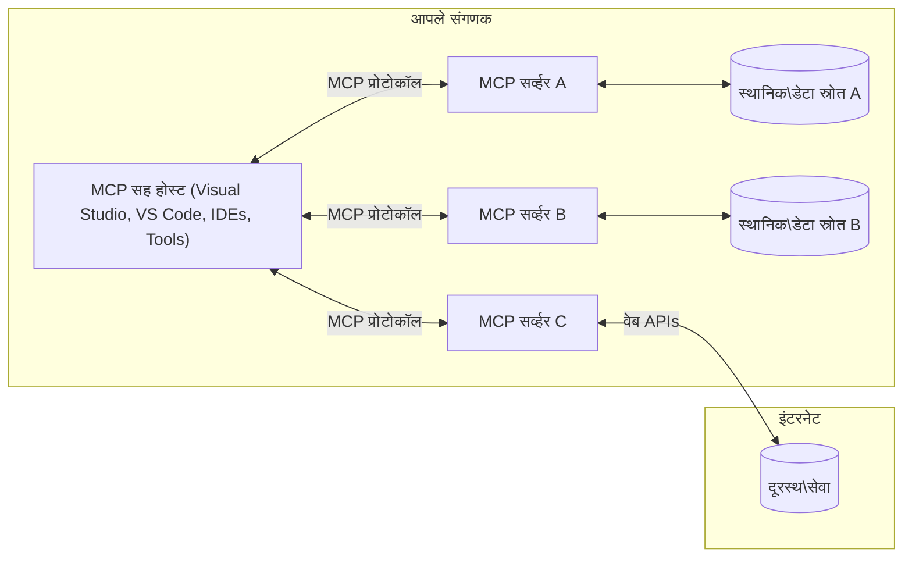

# MCP कोर संकल्पना: AI एकत्रीकरणासाठी मॉडेल कॉनटेक्स्ट प्रोटोकॉलमध्ये प्रावीण्य  

[](https://youtu.be/earDzWGtE84)  

_(वरील प्रतिमा क्लिक करा या धड्याचा व्हिडिओ पाहण्यासाठी)_  

[मॉडेल कॉनटेक्स्ट प्रोटोकॉल (MCP)](https://github.com/modelcontextprotocol) हा एक शक्तिशाली, प्रमाणित फ्रेमवर्क आहे जो मोठ्या भाषा मॉडेल्स (LLMs) आणि बाहेरील साधने, अ‍ॅप्लिकेशन्स, तसेच डेटा स्त्रोतांमधील संवाद ऑप्टिमाइझ करतो.  
हा मार्गदर्शक तुम्हाला MCP ची कोर संकल्पना समजावून सांगेल. तुम्ही त्याच्या क्लायंट-सर्व्हर आर्किटेक्चर, आवश्यक घटक, संवाद यंत्रणा, आणि अंमलबजावणी सर्वोत्तम पद्धती याबद्दल शिकाल.  

- **स्पष्ट वापरकर्ता संमती** : सर्व डेटा प्रवेश आणि ऑपरेशन्ससाठी स्पष्ट वापरकर्ता मान्यता आवश्यक आहे, ज्याअगोदर क्रिया केली जात नाही. वापरकर्त्यांनी स्पष्टपणे समजले पाहिजे की कोणता डेटा प्रवेश केला जाईल आणि कोणती क्रिया पार पडेल, तसेच परवानग्यांवर सूक्ष्म नियंत्रण असले पाहिजे.  

- **डेटा गोपनीयता संरक्षण** : वापरकर्त्याचा डेटा केवळ स्पष्ट संमतीनेच उघड केला जातो आणि पूर्ण संवाद कालावधीमध्ये कडक प्रवेश नियंत्रणाद्वारे संरक्षित केला पाहिजे. अनधिकृत डेटा प्रसारण टाळण्यासाठी अंमलबजावणी आवश्यक आहे आणि कडक गोपनीयता मर्यादा राखणे आवश्यक आहे.  

- **साधन क्रियान्वयन सुरक्षा** : प्रत्येक साधन कॉलसाठी स्पष्ट वापरकर्ता संमती आवश्यक आहे, जेथे साधनाची कार्यक्षमता, पॅरामीटर्स आणि संभाव्य परिणाम यांचा स्पष्ट समज दिला जातो. सुरक्षितता कडक बंधने अनपेक्षित, असुरक्षित किंवा दुष्ट साधन चालवणे रोखतात.  

- **प्रवाह स्तर सुरक्षा (Transport Layer Security)** : सर्व संवाद चॅनेल्समध्ये योग्य एन्क्रिप्शन आणि प्रमाणीकरण यंत्रणा वापरल्या पाहिजेत. दूरस्थ कनेक्शन्ससाठी सुरक्षित वाहतूक प्रोटोकॉल आणि व्यवस्थापित प्रमाणीकरण आवश्यक आहे.  

#### अंमलबजावणी मार्गदर्शक तत्त्वे:  

- **परवानगी व्यवस्थापन** : वापरकर्त्यांना कोणते सर्व्हर्स, साधने, आणि संसाधने प्रवेशयोग्य आहेत हे नियंत्रित करण्यासाठी सूक्ष्म परवानगी प्रणाली अंमलात आणा  
- **प्रमाणीकरण व अधिकारप्राप्ती** : सुरक्षित प्रमाणीकरण पद्धती (OAuth, API कीज) वापरा, योग्य टोकन व्यवस्थापन आणि कालबाह्यता सह  
- **इनपुट पडताळणी** : सर्व पॅरामीटर्स आणि डेटा इनपुट परिभाषित योजनेनुसार पडताळा जेणेकरून इन्जेक्शन हल्ले टाळता येतील  
- **ऑडिट लॉगिंग** : सुरक्षा देखरेख व अनुपालनासाठी सर्व ऑपरेशन्सचे व्यापक लॉग्स ठेवा  

## आढावा  

हा धडा मॉडेल कॉनटेक्स्ट प्रोटोकॉल (MCP) पर्यावरणधर्मातील मूलभूत आर्किटेक्चर आणि घटकांची ओळख करून देतो. तुम्ही क्लायंट-सर्व्हर आर्किटेक्चर, मुख्य घटक, आणि संवाद यंत्रणा याबद्दल शिकाल, जे MCP च्या संवादांना चालना देतात.  

## मुख्य शिकण्याच्या उद्दिष्टे  

या धड्याच्या शेवटी, तुम्ही:  

- MCP क्लायंट-सर्व्हर आर्किटेक्चर समजून घ्या.  
- होस्ट्स, क्लायंट्स, आणि सर्व्हर्स यांचे भूमिका आणि जबाबदाऱ्या ओळखा.  
- MCP ला एक लवचिक एकत्रीकरण लेयर बनवणाऱ्या मुख्य वैशिष्ट्यांचा विश्लेषण करा.  
- जाणून घ्या की माहिती MCP पर्यावरणात कशी प्रवाहित होते.  
- .NET, Java, Python, आणि JavaScript मधील कोड उदाहरणांद्वारे व्यावहारिक अंतर्दृष्टी मिळवा.  

## MCP आर्किटेक्चर: खोलवर नजर  

MCP पर्यावरण क्लायंट-सर्व्हर मॉडेलवर आधारित आहे. ही मॉड्यूलर रचना AI अ‍ॅप्लिकेशन्सना साधने, डेटाबेस, API, आणि संदर्भ संसाधनांशी प्रभावीपणे संवाद साधण्याची परवानगी देते. चला ह्या आर्किटेक्चरचे मुख्य घटक वेगळे करूया.  

MCP चा मूलभूत भाग क्लायंट-सर्व्हर आर्किटेक्चर आहे जिथे एक होस्ट अ‍ॅप्लिकेशन एकाहून अधिक सर्व्हर्सशी कनेक्ट होऊ शकते:  


  
- **MCP होस्ट्स**: VSCode, Claude Desktop, IDEs, किंवा असे AI साधने जी MCP द्वारे डेटा प्रवेश करू इच्छितात  
- **MCP क्लायंट्स**: प्रोटोकॉल क्लायंट्स जे सर्व्हर्सशी 1:1 कनेक्शन राखतात  
- **MCP सर्व्हर्स**: हलक्या प्रोग्राम्स जे प्रमाणित मॉडेल कॉनटेक्स्ट प्रोटोकॉलद्वारे विशिष्ट क्षमता प्रदर्शित करतात  
- **स्थानिक डेटा स्रोत**: तुमच्या संगणकातील फाईल्स, डेटाबेस, आणि सेवा ज्यांना MCP सर्व्हर्स सुरक्षितपणे प्रवेश देऊ शकतात  
- **दूरस्थ सेवा**: इंटरनेटवर उपलब्ध असलेली बाह्य सिस्टम्स ज्यांना MCP सर्व्हर्स API द्वारे कनेक्ट होऊ शकतात.  

MCP प्रोटोकॉल हा दिनांक-आधारित आवृत्ती नियंत्रित करत जाणारा प्रगत प्रमाणक आहे (YYYY-MM-DD फॉरमॅट). चालू प्रोटोकॉल आवृत्ती म्हणजे **2025-11-25**. तुम्ही [प्रोटोकॉल तपशील](https://modelcontextprotocol.io/specification/2025-11-25/) मध्ये नवीन अद्यतने पाहू शकता.  

> **पुढील दृष्टीने:** पुढील प्रोटोकॉल आवृत्तीच्या प्रकाशनासाठी, **2026-07-28**, मे 2026 मध्ये घोषणा करण्यात आली असून तो जुलै 28, 2026 रोजी सार्वजनिक होईल. यात ट्रान्सपोर्ट लेयरला स्टेटलेस (राज्यहीन) केले जाईल (initialize हँडशेक आणि सेशन आयडी काढून टाकले जातील), एक्स्टेंशन्स फ्रेमवर्कची औपचारिकता दिली जाईल, आणि नवीन पद्धतींसाठी Roots, Sampling, आणि Logging ला डिप्रिकेट (अप्रचलित) केले जाईल. पूर्ण तपशीलासाठी [MCP मध्ये काय बदलत आहे: 2026-07-28 रिलीज उमेदवार](./mcp-2026-07-28-release-candidate.md) पहा.  

### 1. होस्ट्स  

मॉडेल कॉनटेक्स्ट प्रोटोकॉल (MCP) मध्ये, **होस्ट्स** म्हणजे AI अ‍ॅप्लिकेशन्स जे वापरकर्ते प्रोटोकॉलशी संवाद साधण्यासाठी मुख्य इंटरफेस म्हणून कार्य करतात. होस्ट्स अनेक MCP सर्व्हर्सशी कनेक्शन व्यवस्थापित करतात आणि प्रत्येक सर्व्हर कनेक्शनसाठी समर्पित MCP क्लायंट तयार करतात. होस्ट्सची उदाहरणे:  

- **AI अ‍ॅप्लिकेशन्स**: Claude Desktop, Visual Studio Code, Claude Code  
- **विकासन पर्यावरण**: IDEs आणि MCP समाकलन असलेले कोड संपादक  
- **सानुकूल अ‍ॅप्लिकेशन्स**: उद्दिष्टाने तयार केलेले AI एजंट्स आणि साधने  

**होस्ट्स** ही अ‍ॅप्लिकेशन्स आहेत ज्या AI मॉडेल संवादांचे समन्वयन करतात. ते:  

- **AI मॉडेल्सचे समन्वय:** प्रतिसाद तयार करण्यासाठी LLMs चालवतात किंवा त्यांच्याशी संवाद साधतात आणि AI वर्कफ्लोज समन्वयित करतात  
- **क्लायंट कनेक्शन्स व्यवस्थापन** : प्रत्येक MCP सर्व्हर कनेक्शनसाठी एक MCP क्लायंट तयार व सांभाळतात  
- **वापरकर्ता इंटरफेस नियंत्रण** : संभाषण प्रवाह, वापरकर्ता संवाद, आणि प्रतिसाद सादरीकरण हाताळतात  
- **सुरक्षा अंमलबजावणी** : परवानग्या, सुरक्षा निर्बंध, आणि प्रमाणीकरण नियंत्रित करतात  
- **वापरकर्ता संमती हाताळणी** : डेटा शेअरिंग आणि साधन चालविण्यासाठी वापरकर्ता मान्यता व्यवस्थापित करतात  


### 2. क्लायंट्स  

**क्लायंट्स** हे आवश्यक घटक आहेत जे होस्ट्स आणि MCP सर्व्हर्समधील समर्पित एका-ते-एका कनेक्शन्स राखतात. प्रत्येक MCP क्लायंट होस्टद्वारे विशिष्ट MCP सर्व्हरशी कनेक्ट होण्यासाठी तयार केला जातो, ज्यामुळे राबवलेली सुरक्षित संवाद वाहिन्या सुनिश्चित होतात. अनेक क्लायंट्स होस्टला एकाच वेळी अनेक सर्व्हर्सशी कनेक्ट होण्यास अनुमती देतात.  

**क्लायंट्स** हे होस्ट अ‍ॅप्लिकेशनमधील कनेक्टर घटक आहेत. ते:  

- **प्रोटोकॉल संवाद** : JSON-RPC 2.0 विनंत्या सर्व्हर्सना पाठवतात ज्यात प्रॉम्प्ट्स आणि सूचना असतात  
- **क्षमता वाटाघाटी** : इनिशिअलायझेशन दरम्यान सर्व्हर्सशी समर्थीत वैशिष्ट्ये आणि प्रोटोकॉल आवृत्त्यांसाठी वाटाघाटी करतात  
- **साधन चालविणे** : मॉडेल कडून साधन चालविणे विनंत्या व्यवस्थापित करतात आणि प्रतिसाद प्रक्रिया करतात  
- **तत्काल अपडेट्स** : सर्व्हर्सकडून सूचना आणि तत्काळ अपडेट्स हाताळतात  
- **प्रतिसाद प्रक्रिया** : डिस्प्ले साठी सर्व्हर प्रतिसाद प्रक्रिया करतात आणि फॉरमॅट करतात  

### 3. सर्व्हर्स  

**सर्व्हर्स** हे प्रोग्राम्स आहेत जे MCP क्लायंट्सना संदर्भ, साधने, आणि क्षमता पुरवतात. ते स्थानिकरित्या (होस्ट समवेत संगणकावर) किंवा दूरस्थ (बाह्य प्लॅटफॉर्मवर) चालवले जाऊ शकतात, आणि क्लायंट विनंत्या हाताळणे व रचनेत प्रतिसाद देणे यासाठी जबाबदार असतात. सर्व्हर्स प्रमाणित मॉडेल कॉनटेक्स्ट प्रोटोकॉलद्वारे विशिष्ट कार्यक्षमता प्रदर्शित करतात.  

**सर्व्हर्स** संदर्भ आणि क्षमता पुरवणाऱ्या सेवा आहेत. ते:  

- **वैशिष्ट्य नोंदणी** : उपलब्ध प्राथमिक (संसाधने, प्रॉम्प्ट्स, साधने) क्लायंट्सना नोंदणी व प्रदर्शन करतात  
- **विनंती प्रक्रिया** : साधन कॉल्स, संसाधन विनंत्या आणि प्रॉम्प्ट विनंत्या क्लायंट्सकडून प्राप्त करून कार्यान्वित करतात  
- **संदर्भ पुरवठा** : मॉडेल प्रतिसाद वाढवण्यासाठी संदर्भ माहिती आणि डेटा पुरवितात  
- **राज्य व्यवस्थापन** : सत्र स्थिती राखतात आणि गरजेनुसार राज्यीय संवाद हाताळतात  

- **रिअल-टाइम Notifications**: कनेक्ट झालेल्या क्लायंटना क्षमता बदलांविषयी आणि अद्ययावत माहिती पाठवा

सर्व्हर्स कोणत्याही व्यक्तीने विकसित केले जाऊ शकतात जे मॉडेलच्या क्षमतांना विशेष कार्यक्षमता देण्यासाठी वाढवतात, आणि ते स्थानिक तसेच रिमोट डिप्लॉयमेंट परिस्थितींना समर्थन देतात.

### ४. सर्व्हर प्रिमिटिव्ह्स

मॉडेल कॉन्टेक्स्ट प्रोटोकॉल (MCP) मधील सर्व्हर्स तीन मुख्य **प्रिमिटिव्ह्स** पुरवतात जे क्लायंट, होस्ट, आणि भाषा मॉडेल्समध्ये समृद्ध संवादासाठी मूलभूत बांधकाम तत्वे ठरवतात. हे प्रिमिटिव्ह्स प्रोटोकॉलद्वारे उपलब्ध असलेल्या संदर्भात्मक माहिती आणि क्रिया प्रकार निर्दिष्ट करतात.

MCP सर्व्हर्स खालील तीन मुख्य प्रिमिटिव्ह्सची कोणतीही संयोजना प्रकट करू शकतात:

#### संसाधने 

**संसाधने** ही अशी डेटा स्रोत आहेत ज्या AI अनुप्रयोगांना संदर्भात्मक माहिती पुरवतात. ते स्थिर किंवा गतिशील सामग्रीचे प्रतिनिधित्व करतात ज्यामुळे मॉडेल समज आणि निर्णयक्षमतेत सुधारणा होते:

- **संदर्भात्मक डेटा**: AI मॉडेल वापरासाठी संरचित माहिती आणि संदर्भ
- **ज्ञान आधार**: कागदपत्र संच, लेख, मॅन्युअल, आणि संशोधन पेपर
- **स्थानिक डेटास्रोत**: फायली, डेटाबेस, आणि स्थानिक सिस्टम माहिती  
- **बाह्य डेटा**: API प्रतिसाद, वेब सेवा, आणि रिमोट सिस्टम डेटा
- **गतिशील सामग्री**: बाह्य परिस्थितींप्रमाणे अद्ययावत होणारे रिअल-टाइम डेटा

संसाधने URI द्वारे ओळखली जातात आणि `resources/list` द्वारे शोध आणि `resources/read` पद्धतीने पुनर्प्राप्त केली जातात:

```text
file://documents/project-spec.md
database://production/users/schema
api://weather/current
```

#### प्रॉम्प्ट्स

**प्रॉम्प्ट्स** पुनर्नवीन वापरासाठी असणाऱ्या टेम्प्लेट्स आहेत ज्यामुळे भाषा मॉडेल्सशी संवादाची रचना करणे सुलभ होते. ते प्रमाणित संवाद नमुने आणि टेम्प्लेटेड कार्यप्रवाह पुरवतात:

- **टेम्प्लेट-आधारित संवाद**: पूर्वनियोजित संदेश आणि संभाषण प्रारंभक
- **कार्यप्रवाह टेम्प्लेट्स**: सामान्य कार्ये आणि संवादांसाठी प्रमाणित अनुक्रमे
- **फ्यू-शॉट उदाहरणे**: मॉडेल सूचनांसाठी उदाहरण-आधारित टेम्प्लेट्स
- **सिस्टम प्रॉम्प्ट्स**: मॉडेल वर्तन आणि संदर्भ निश्चित करणारे मूलगामी प्रॉम्प्ट्स
- **गतिशील टेम्प्लेट्स**: विशिष्ट संदर्भानुसार अनुरूप करणारे पॅरामीट्राइज्ड प्रॉम्प्ट्स

प्रॉम्प्ट्स व्हेरिएबल बदलास समर्थन करतात आणि `prompts/list` द्वारे शोधले जाऊ शकतात आणि `prompts/get` ने पुनर्प्राप्त केले जातात:

```markdown
Generate a {{task_type}} for {{product}} targeting {{audience}} with the following requirements: {{requirements}}
```

#### उपकरणे

**उपकरणे** ही अशा कार्यान्वित करावयाच्या फंक्शन्स आहेत ज्यांना AI मॉडेल्स विशिष्ट क्रिया करण्यासाठी कॉल करू शकतात. हे MCP पर्यावरणातील "क्रियापदे" आहेत जे मॉडेल्सना बाह्य प्रणाल्यांशी संवाद साधण्यास सक्षम करतात:

- **कार्यशील फंक्शन्स**: विशिष्ट पॅरामीटर्ससह मॉडेल्स कॉल करू शकतात अशी स्वतंत्र ऑपरेशन्स
- **बाह्य सिस्टम एकत्रीकरण**: API कॉल, डेटाबेस चौकशी, फाइल ऑपरेशन्स, गणना
- **अद्वितीय ओळख**: प्रत्येक उपकरणाचे वेगळे नाव, वर्णन, आणि पॅरामीटर स्कीमा असतो
- **संरचित इनपुट/आउटपुट**: उपकरणे प्रमाणीत पॅरामीटर्स स्वीकारतात आणि संरचित, प्रकारानुसार प्रतिसाद देतात
- **क्रिया क्षमता**: मॉडेल्सना प्रत्यक्ष क्रिया करण्यास आणि थेट डेटा पुनर्प्राप्त करण्यास सक्षम करतात

उपकरणे पॅरामीटर पडताळणीसाठी JSON स्कीमा वापरून परिभाषित केली जातात आणि `tools/list` द्वारे शोधली जातात आणि `tools/call` वापरून चालवली जातात. उपकरणांमध्ये चांगल्या UI सादरीकरणासाठी अतिरिक्त मेटाडेटा म्हणून **आयकॉन** देखील असू शकतात.

**उपकरण टिप्पण्या**: उपकरणे वर्तणूक टिप्पण्या (उदा. `readOnlyHint`, `destructiveHint`) समर्थन करतात ज्यामुळे क्लायंटना उपकरणाच्या कार्यवाहीबद्दल अधिक माहिती करून घेण्यास मदत होते, जसे ते वाचन-संग्रहीत आहे की विध्वंसक आहे का.

उदाहरण उपकरण व्याख्या:

```typescript
server.tool(
  "search_products", 
  {
    query: z.string().describe("Search query for products"),
    category: z.string().optional().describe("Product category filter"),
    max_results: z.number().default(10).describe("Maximum results to return")
  }, 
  async (params) => {
    // शोध कार्यान्वित करा आणि संरचित परिणाम परत करा
    return await productService.search(params);
  }
);
```

## क्लायंट प्रिमिटिव्ह्स

मॉडेल कॉन्टेक्स्ट प्रोटोकॉल (MCP) मध्ये, **क्लायंट्स** असे प्रिमिटिव्ह्स प्रकट करू शकतात जे सर्व्हर्सना होस्ट अनुप्रयोगाकडून अतिरिक्त क्षमता मागण्यास सक्षम करतात. हे क्लायंट-साइड प्रिमिटिव्ह्स अधिक समृद्ध, संवादात्मक सर्व्हर अंमलबजावणी सक्षम करतात ज्यामुळे AI मॉडेल क्षमता आणि वापरकर्ता संवाद साधता येतात.

### सॅम्पलिंग

> **निष्कर्ष सूचना:** `2026-07-28` विमोचन उमेदवाराने सॅम्पलिंगला LLM प्रदाता APIs सोबत थेट समाकलनांसाठी अप्रचलित घोषित केले आहे. हे `2025-11-25` मध्ये कार्यरत राहील आणि कोणत्याही अप्रचलनानंतर किमान एक वर्ष काम करेल, परंतु नवीन डिझाईन्सना प्रतिस्थापन नमुन्याला प्राधान्य द्यावे. पाहा [MCP मध्ये काय बदलत आहे: 2026-07-28 विमोचन उमेदवार](./mcp-2026-07-28-release-candidate.md).

**सॅम्पलिंग** सर्व्हर्सना क्लायंटच्या AI अनुप्रयोगाकडून भाषा मॉडेल पूर्णता मागण्याची परवानगी देते. हे प्रिमिटिव्ह सर्व्हर्सना स्वतःचे मॉडेल अवलंबित्व न ठेवता LLM क्षमता वापरण्याची परवानगी देते:

- **मॉडेल-स्वतंत्र प्रवेश**: सर्व्हर्सना SDKs समाविष्ट न करता किंवा मॉडेल प्रवेश व्यवस्थापित न करता पूर्णता मागता येते
- **सर्व्हर-प्रेरित AI**: क्लायंटच्या AI मॉडेलचा वापर करत सर्व्हर्सला स्वायत्तपणे सामग्री निर्माण करता येते
- **पुनरावृत्ती LLM संवाद**: जटिल परिस्थितींसाठी ज्यात सर्व्हर्सना AI मदत हवी असते त्या समर्थित करतो
- **गतिशील सामग्री निर्मिती**: होस्टच्या मॉडेलनुसार बंदर्भीक प्रतिसाद तयार करण्यास सक्षम करतो
- **उपकरण कॉलिंग समर्थन**: सॅम्पलिंग दरम्यान क्लायंटच्या मॉडेलला उपकरणे invoke करण्यास अनुमती देणारे `tools` आणि `toolChoice` पॅरामीटर्स समाविष्ट करु शकतात

सॅम्पलिंग `sampling/complete` पद्धतीने सुरू होते, जिथे सर्व्हर्स पूर्णता विनंत्या क्लायंटला पाठवतात.

### रूट्स

> **निष्कर्ष सूचना:** `2026-07-28` विमोचन उमेदवाराने रूट्सना अप्रचलित घोषित केले आहे आणि उपकरण पॅरामीटर्स, संसाधन URI, किंवा सर्व्हर कॉन्फिगरेशनकडे प्राधान्य दिले आहे. हे `2025-11-25` मध्ये कार्यरत राहील आणि कोणत्याही अप्रचलनानंतर किमान एक वर्ष टिकेल. पाहा [MCP मध्ये काय बदलत आहे: 2026-07-28 विमोचन उमेदवार](./mcp-2026-07-28-release-candidate.md).

**रूट्स** सर्व्हर्सना निर्देशिका आणि फायलींपर्यंत प्रवेश कसा आहे हे समजण्यासाठी क्लायंटला फाइलसिस्टम मर्यादा एकसंध करण्याचा प्रमाणित मार्ग पुरवतात:

- **फाइलसिस्टम मर्यादा**: सर्व्हर्स कुठल्या फाइलसिस्टम प्रदेशात कार्य करू शकतात हे मर्यादित करतात
- **प्रवेश नियंत्रण**: सर्व्हर्सना कोणत्या फोल्डर्स आणि फायलींना प्रवेश परवानगी आहे हे समजण्यास मदत करतात
- **गतिशील अद्यतने**: रूट्स बदलेले की क्लायंट सर्व्हर्सना सूचित करु शकतात
- **URI-आधारित ओळख**: रूट्स `file://` URI वापरून प्रविष्ट निर्देशिका आणि फायली ओळखतात

रूट्स `roots/list` पद्धतीने शोधले जातात, आणि क्लायंट `notifications/roots/list_changed` पाठवून बदल असल्यास सर्व्हर्स सूचित करतात.

### माहिती मागणी  

**माहिती मागणी** सर्व्हर्सना क्लायंट इंटरफेसद्वारे वापरकर्त्यांकडून अतिरिक्त माहिती किंवा पुष्टी मागण्यास परवानगी देते:

- **वापरकर्ता इनपुट विनंत्या**: आवश्यक तेव्हा उपकरण क्रियांसाठी अतिरिक्त माहिती विचारू शकतात
- **पुष्टी संवाद**: संवेदनशील किंवा प्रभावी कृतींसाठी वापरकर्त्यांची मान्यता मागतात
- **आंतरक्रियाशील कार्यप्रवाह**: सर्व्हर्सना चरण-दर-चरण वापरकर्ता संवाद निर्माण करण्याची परवानगी देतात
- **गतिशील पॅरामीटर संकलन**: उपकरण क्रियेशन दरम्यान हरवलेली किंवा ऐच्छिक पॅरामीटर्स गोळा करतात

माहिती मागणी विनंती `elicitation/request` पद्धतीने केली जाते ज्याने क्लायंटच्या इंटरफेसद्वारे वापरकर्ता इनपुट संकलित केला जातो.

**URL मोड माहिती मागणी**: सर्व्हर्स यूआरएल-आधारित वापरकर्ता संवाद देखील मागवू शकतात, ज्यामुळे सर्व्हर्स वापरकर्त्यांना प्रमाणीकरण, पुष्टी, किंवा डेटा प्रवेशासाठी बाह्य वेब पृष्ठांवर मार्गदर्शित करू शकतात.

### लॉगिंग


> **डिप्रिकेशन सूचना:** `2026-07-28` रिलीज़ उमेदवार लॉगिंगला `stderr` साठी stdio ट्रान्सपोर्टसाठी आणि संरचित ऑब्झर्व्हेबिलिटीसाठी OpenTelemetry च्या बाजूने डिप्रिकेटेड घोषित करतो. हे `2025-11-25` मध्ये आणि कोणत्याही डिप्रिकेशननंतर किमान एक वर्षासाठी कार्य करते. पाहा [MCP मध्ये काय बदलत आहे: 2026-07-28 रिलीज उमेदवार](./mcp-2026-07-28-release-candidate.md).

**लॉगिंग** सर्व्हरना क्लायंटला डीबगिंग, मॉनिटरिंग आणि ऑपरेशनल दृश्यमानतेसाठी संरचित लॉग संदेश पाठविण्याची परवानगी देते:

- **डीबगिंग समर्थन**: समस्यांचे निवारण करण्यासाठी तपशीलवार अंमलबजावणी लॉग सक्षम करा
- **ऑपरेशनल मॉनिटरिंग**: क्लायंटना स्थिती अद्यतने आणि कार्यक्षमता मेट्रिक्स पाठवा
- **एरर रिपोर्टिंग**: तपशीलवार त्रुटी संदर्भ आणि निदान माहिती प्रदान करा
- **ऑडिट ट्रेल्स**: सर्व्हर ऑपरेशन्स आणि निर्णयांची सर्वसमावेशक लॉग तयार करा

लॉगिंग संदेश सर्व्हर ऑपरेशन्समध्ये पारदर्शकता प्रदान करण्यासाठी आणि डीबगिंग सुलभ करण्यासाठी क्लायंटला पाठविले जातात.

## MCP मध्ये माहिती प्रवाह

मॉडेल कॉन्टेक्स्ट प्रोटोकॉल (MCP) होस्ट, क्लायंट, सर्व्हर आणि मॉडेल्स यांच्यात माहितीचा संरचित प्रवाह परिभाषित करतो. या प्रवाहाचे समजणे वापरकर्त्याच्या विनंत्या कशा प्रक्रिया केल्या जातात आणि बाह्य साधने व डेटा कसे मॉडेल प्रतिसादांमध्ये एकत्रित केले जातात हे स्पष्ट करण्यास मदत करते.

- **होस्ट कनेक्शन सुरू करतो**  
  होस्ट अनुप्रयोग (उदा. IDE किंवा चॅट इंटरफेस) सामान्यतः STDIO, WebSocket किंवा इतर समर्थित ट्रान्सपोर्टद्वारे MCP सर्व्हरशी कनेक्शन स्थापन करतो.

- **क्षमता वाटाघाटी**  
  क्लायंट (होस्टमध्ये एम्बेड केलेला) आणि सर्व्हर त्यांच्या समर्थित वैशिष्ट्ये, साधने, संसाधने, आणि प्रोटोकॉल आवृत्त्यांविषयी माहिती देवाणघेवाण करतात. यामुळे दोन्ही बाजूला सत्रासाठी कोणत्या क्षमता उपलब्ध आहेत हे समजते.

- **वापरकर्ता विनंती**  
  वापरकर्ता होस्टशी संवाद साधतो (उदा., प्रॉम्प्ट किंवा कमांड टाकणे). होस्ट हा इनपुट गोळा करून प्रक्रिया साठी क्लायंटला पाठवितो.

- **संसाधन किंवा साधन वापर**  
  - क्लायंट सर्व्हरकडून अतिरिक्त संदर्भ किंवा संसाधनांची विनंती करू शकतो (उदा., फायली, डेटाबेस एंट्रीज, किंवा ज्ञानसंकलन लेख) जेणेकरून मॉडेलची समज उत्तम होते.
  - जर मॉडेल ठरवत असेल की साधन आवश्यक आहे (उदा. डेटा आणण्यासाठी, गणना करण्यासाठी, किंवा एपीआय कॉल करण्यासाठी), क्लायंट साधन नाव आणि पॅरामीटर्स निर्दिष्ट करून सर्व्हरकडे साधन कॉल विनंती पाठवतो.

- **सर्व्हर अंमलबजावणी**  
  सर्व्हर संसाधन किंवा साधन विनंती प्राप्त करतो, आवश्यक ऑपरेशन्स (उदा. फंक्शन चालवणे, डेटाबेस क्वेरी करणे, किंवा फाइल मिळवणे) पार पाडतो, आणि परिणाम संरचित स्वरूपात क्लायंटला परत करतो.

- **प्रतिसाद निर्माण**  
  क्लायंट सर्व्हरच्या प्रतिसादांना (संसाधन डेटा, साधन आउटपुट, इ.) चालू मॉडेल संवादात समाकलित करतो. मॉडेल या माहितीचा वापर करून एक व्यापक आणि संदर्भानुसार सुसंगत प्रतिसाद तयार करतो.

- **परिणाम सादरीकरण**  
  होस्ट क्लायंटकडून अंतिम आउटपुट प्राप्त करतो आणि वापरकर्त्यास सादर करतो, प्रामुख्याने मॉडेलने तयार केलेल्या मजकुरासह उपकरण अंमलबजावणी किंवा संसाधन शोधचे परिणाम देखील दाखवितो.

हा प्रवाह MCP ला प्रगत, संवादात्मक आणि संदर्भ-जाणकार AI अनुप्रयोगांना समर्थन देण्यास सक्षम करतो ज्याद्वारे मॉडेल्स सहजपणे बाह्य साधने आणि डेटा स्रोतांशी जोडले जातात.

## प्रोटोकॉल आर्किटेक्चर आणि थर

MCP दोन भिन्न आर्किटेक्चरल थरांमध्ये बनलेला आहे जे एकत्र संपूर्ण संवाद फ्रेमवर्क प्रदान करतात:

### डेटा थर

**डेटा थर** मुख्य MCP प्रोटोकॉल **JSON-RPC 2.0** आधारित आहे. हा थर संदेश संरचना, अर्थशास्त्र आणि संवाद नमुने परिभाषित करतो:

#### मुख्य घटक:

- **JSON-RPC 2.0 प्रोटोकॉल**: सर्व संवाद पद्धत कॉल, प्रतिसाद आणि सूचना यासाठी मानक JSON-RPC 2.0 संदेश फॉरमॅट वापरतो
- **जीवनचक्र व्यवस्थापन**: कनेक्शन आरंभ, क्षमता वाटाघाटी, आणि सत्र समाप्ती हाताळतो
- **सर्व्हर प्राथमिके**: सर्व्हरना साधने, संसाधने आणि प्रॉम्प्टद्वारे मुख्य कार्यक्षमतेसाठी सक्षम करतो
- **क्लायंट प्राथमिके**: सर्व्हरना LLM कडून नमुने मागविणे, वापरकर्ता इनपुट मागविणे, आणि लॉग संदेश पाठविणे सक्षम करतो
- **रिअल-टाइम सूचना**: असिंक्रोनस सूचना पाठविण्यास समर्थन देते ज्यासाठी पोलिंग आवश्यक नाही

#### मुख्य वैशिष्ट्ये:

- **प्रोटोकॉल आवृत्ती वाटाघाटी**: दिनांक-आधारित आवृत्तीकरण (YYYY-MM-DD) वापरून सुसंगतता सुनिश्चित करते
- **क्षमता शोध**: क्लायंट आणि सर्व्हर प्रारंभात समर्थित वैशिष्ट्य माहितीची देवाणघेवाण करतात
- **स्थितीपूर्ण सत्रे**: संदर्भ अखंडतेसाठी अनेक संवादांमधील कनेक्शन स्थिती राखते

### ट्रान्सपोर्ट थर

**ट्रान्सपोर्ट थर** MCP सहभागींच्या मध्ये संवाद वाहने, संदेश फ्रेमिंग, आणि प्रमाणीकरण व्यवस्थापित करतो:

#### समर्थित ट्रान्सपोर्ट यंत्रणा:

1. **STDIO ट्रान्सपोर्ट**:
   - थेट प्रक्रियात्मक संवादासाठी मानक इनपुट/आउटपुट स्ट्रिम्स वापरतो
   - एका यंत्रावर स्थानिक प्रक्रियांना उत्कृष्ट, नेटवर्क ओवरहेडशिवाय
   - स्थानिक MCP सर्व्हर अंमलबजावण्या साठी सामान्यतः वापरले जाते

2. **स्ट्रीम करण्यायोग्य HTTP ट्रान्सपोर्ट**:
   - क्लायंट-टू-सर्व्हर संदेशांसाठी HTTP POST वापरतो  
   - सर्व्हर-टू-क्लायंट स्ट्रिमिंगसाठी ऑप्शनल Server-Sent Events (SSE)
   - नेटवर्क ओलांडून रिमोट सर्व्हर संवाद सक्षम करतो
   - मानक HTTP प्रमाणीकरण (बॅरियर टोकन, API की, कस्टम हेडर्स) समर्थित
   - MCP सुरक्षित टोकन-आधारित प्रमाणीकरण साठी OAuth शिफारस करतो

#### ट्रान्सपोर्ट अमूर्तता:

ट्रान्सपोर्ट थर डेटा थरीकडून संवाद तपशील अमूर्त करतो, ज्यामुळे सर्व ट्रान्सपोर्ट यंत्रणांमध्ये सारखे JSON-RPC 2.0 संदेश फॉरमॅट वापरता येतो. या अमूर्ततेमुळे अनुप्रयोग स्थानिक आणि दूरस्थ सर्व्हर्समध्ये सहजपणे स्विच करू शकतात.

### सुरक्षा विचार

MCP अंमलबजावण्या सर्व प्रोटोकॉल ऑपरेशन्स दरम्यान सुरक्षित, विश्वासार्ह, आणि सुरक्षित संवाद सुनिश्चित करण्यासाठी काही महत्त्वाच्या सुरक्षा तत्त्वांचे पालन करणे आवश्यक आहे:

- **वापरकर्ता संमती आणि नियंत्रण**: कोणताही डेटा प्रवेश किंवा ऑपरेशन्स करण्यापूर्वी वापरकर्त्याकडून स्पष्ट संमती आवश्यक आहे. त्यांना काय डेटा सामायिक केला जातो आणि कोणती क्रिया अधिकृत आहे यावर स्पष्ट नियंत्रण असावे, ज्यासाठी पुनरावलोकन आणि मंजुरीसाठी सहज वापरकर्ता इंटरफेस असले पाहिजे.

- **डेटा गोपनीयता**: वापरकर्त्याचा डेटा फक्त स्पष्ट संमतीनेच उघड केला जावा व योग्य प्रवेश नियंत्रणांनी संरक्षित असावा. MCP अंमलबजावण्या अनधिकृत डेटा प्रसारणाविरुद्ध प्रतिबंध करणे आणि संवादांमध्ये गोपनीयता राखणे आवश्यक आहे.

- **साधन सुरक्षितता**: कोणतीही साधन कॉल करण्यापूर्वी वापरकर्त्याची स्पष्ट संमती आवश्यक आहे. वापरकर्त्यांना प्रत्येक साधनाची कार्यक्षमता स्पष्ट समजली पाहिजे, आणि चांगल्या सुरक्षिततेचे बंधने लादली पाहिजेत जेणेकरून अनपेक्षित किंवा असुरक्षित साधन अंमलबजावणी टाळता येईल.

या सुरक्षा तत्त्वांचे पालन करून, MCP सर्व प्रोटोकॉल संवादांमध्ये वापरकर्त्यांचा विश्वास, गोपनीयता आणि सुरक्षितता राखतो तसेच सामर्थ्यशाली AI संलग्नता सक्षम करतो.

## कोड उदाहरणे: मुख्य घटक

खाली काही लोकप्रिय प्रोग्रामिंग भाषांतील कोड उदाहरणे दिली आहेत जी मुख्य MCP सर्व्हर घटक आणि साधने कशी अंमलात आणायची हे दर्शवितात.

### .NET उदाहरण: साधे MCP सर्व्हर साधनांसह तयार करणे

येथे एक साधे MCP सर्व्हर कस्टम साधने वापरून कसे तयार करायचे याचे व्यावहारिक .NET कोड उदाहरण आहे. या उदाहरणात साधने कशी परिभाषित व नोंदणी करायची, विनंत्यांचे हाताळणी कशी करायची, आणि मॉडेल कॉन्टेक्स्ट प्रोटोकॉल वापरून सर्व्हरशी कसे कनेक्ट करायचे याचे दर्शन घडते.

```csharp
using System;
using System.Threading.Tasks;
using ModelContextProtocol.Server;
using ModelContextProtocol.Server.Transport;
using ModelContextProtocol.Server.Tools;

public class WeatherServer
{
    public static async Task Main(string[] args)
    {
        // Create an MCP server
        var server = new McpServer(
            name: "Weather MCP Server",
            version: "1.0.0"
        );
        
        // Register our custom weather tool
        server.AddTool<string, WeatherData>("weatherTool", 
            description: "Gets current weather for a location",
            execute: async (location) => {
                // Call weather API (simplified)
                var weatherData = await GetWeatherDataAsync(location);
                return weatherData;
            });
        
        // Connect the server using stdio transport
        var transport = new StdioServerTransport();
        await server.ConnectAsync(transport);
        
        Console.WriteLine("Weather MCP Server started");
        
        // Keep the server running until process is terminated
        await Task.Delay(-1);
    }
    
    private static async Task<WeatherData> GetWeatherDataAsync(string location)
    {
        // This would normally call a weather API
        // Simplified for demonstration
        await Task.Delay(100); // Simulate API call
        return new WeatherData { 
            Temperature = 72.5,
            Conditions = "Sunny",
            Location = location
        };
    }
}

public class WeatherData
{
    public double Temperature { get; set; }
    public string Conditions { get; set; }
    public string Location { get; set; }
}
```

### Java उदाहरण: MCP सर्व्हर घटक

हे उदाहरण वरील .NET उदाहरणासारखेच MCP सर्व्हर व साधन नोंदणी दाखवते, पण Java मध्ये अंमलात आणलेले आहे.

```java
import io.modelcontextprotocol.server.McpServer;
import io.modelcontextprotocol.server.McpToolDefinition;
import io.modelcontextprotocol.server.transport.StdioServerTransport;
import io.modelcontextprotocol.server.tool.ToolExecutionContext;
import io.modelcontextprotocol.server.tool.ToolResponse;

public class WeatherMcpServer {
    public static void main(String[] args) throws Exception {
        // एक MCP सर्व्हर तयार करा
        McpServer server = McpServer.builder()
            .name("Weather MCP Server")
            .version("1.0.0")
            .build();
            
        // एक हवामान साधन नोंदणी करा
        server.registerTool(McpToolDefinition.builder("weatherTool")
            .description("Gets current weather for a location")
            .parameter("location", String.class)
            .execute((ToolExecutionContext ctx) -> {
                String location = ctx.getParameter("location", String.class);
                
                // हवामान डेटा मिळवा (सरलीकृत)
                WeatherData data = getWeatherData(location);
                
                // स्वरूपित प्रतिसाद परत करा
                return ToolResponse.content(
                    String.format("Temperature: %.1f°F, Conditions: %s, Location: %s", 
                    data.getTemperature(), 
                    data.getConditions(), 
                    data.getLocation())
                );
            })
            .build());
        
        // stdio ट्रान्सपोर्ट वापरून सर्व्हर कनेक्ट करा
        try (StdioServerTransport transport = new StdioServerTransport()) {
            server.connect(transport);
            System.out.println("Weather MCP Server started");
            // प्रक्रिया समाप्त होईपर्यंत सर्व्हर चालू ठेवा
            Thread.currentThread().join();
        }
    }
    
    private static WeatherData getWeatherData(String location) {
        // अंमलबजावणीसाठी हवामान API कॉल केला जाईल
        // उदाहरणासाठी सरलीकृत
        return new WeatherData(72.5, "Sunny", location);
    }
}

class WeatherData {
    private double temperature;
    private String conditions;
    private String location;
    
    public WeatherData(double temperature, String conditions, String location) {
        this.temperature = temperature;
        this.conditions = conditions;
        this.location = location;
    }
    
    public double getTemperature() {
        return temperature;
    }
    
    public String getConditions() {
        return conditions;
    }
    
    public String getLocation() {
        return location;
    }
}
```

### Python उदाहरण: MCP सर्व्हर बांधणी

हे उदाहरण fastmcp वापरते, कृपया सर्वप्रथम ते इंस्टॉल करा:

```python
pip install fastmcp
```
कोड नमुना:

```python
#!/usr/bin/env python3
import asyncio
from fastmcp import FastMCP
from fastmcp.transports.stdio import serve_stdio

# FastMCP सर्व्हर तयार करा
mcp = FastMCP(
    name="Weather MCP Server",
    version="1.0.0"
)

@mcp.tool()
def get_weather(location: str) -> dict:
    """Gets current weather for a location."""
    return {
        "temperature": 72.5,
        "conditions": "Sunny",
        "location": location
    }

# वर्ग वापरून पर्यायी पद्धत
class WeatherTools:
    @mcp.tool()
    def forecast(self, location: str, days: int = 1) -> dict:
        """Gets weather forecast for a location for the specified number of days."""
        return {
            "location": location,
            "forecast": [
                {"day": i+1, "temperature": 70 + i, "conditions": "Partly Cloudy"}
                for i in range(days)
            ]
        }

# वर्ग साधने नोंदणी करा
weather_tools = WeatherTools()

# सर्व्हर सुरू करा
if __name__ == "__main__":
    asyncio.run(serve_stdio(mcp))
```

### JavaScript उदाहरण: MCP सर्व्हर तयार करणे

हे उदाहरण JavaScript मध्ये MCP सर्व्हर तयार करण्याचे आणि दोन हवामान संबंधित साधने नोंदणी करण्याचे दाखविते.

```javascript
// अधिकृत मॉडेल कंटेक्स्ट प्रोटोकॉल SDK वापरणे
import { McpServer } from "@modelcontextprotocol/sdk/server/mcp.js";
import { StdioServerTransport } from "@modelcontextprotocol/sdk/server/stdio.js";
import { z } from "zod"; // पॅरामीटर प्रमाणीकरणासाठी

// एक MCP सर्व्हर तयार करा
const server = new McpServer({
  name: "Weather MCP Server",
  version: "1.0.0"
});

// हवामान साधन परिभाषित करा
server.tool(
  "weatherTool",
  {
    location: z.string().describe("The location to get weather for")
  },
  async ({ location }) => {
    // सामान्यतः हे हवामान API कॉल करेल
    // प्रदर्शनासाठी साधे केलेले
    const weatherData = await getWeatherData(location);
    
    return {
      content: [
        { 
          type: "text", 
          text: `Temperature: ${weatherData.temperature}°F, Conditions: ${weatherData.conditions}, Location: ${weatherData.location}` 
        }
      ]
    };
  }
);

// एक अंदाज साधन परिभाषित करा
server.tool(
  "forecastTool",
  {
    location: z.string(),
    days: z.number().default(3).describe("Number of days for forecast")
  },
  async ({ location, days }) => {
    // सामान्यतः हे हवामान API कॉल करेल
    // प्रदर्शनासाठी साधे केलेले
    const forecast = await getForecastData(location, days);
    
    return {
      content: [
        { 
          type: "text", 
          text: `${days}-day forecast for ${location}: ${JSON.stringify(forecast)}` 
        }
      ]
    };
  }
);

// साहाय्यक फंक्शन्स
async function getWeatherData(location) {
  // API कॉलचे अनुकरण करा
  return {
    temperature: 72.5,
    conditions: "Sunny",
    location: location
  };
}

async function getForecastData(location, days) {
  // API कॉलचे अनुकरण करा
  return Array.from({ length: days }, (_, i) => ({
    day: i + 1,
    temperature: 70 + Math.floor(Math.random() * 10),
    conditions: i % 2 === 0 ? "Sunny" : "Partly Cloudy"
  }));
}

// stdio ट्रान्सपोर्ट वापरून सर्व्हर कनेक्ट करा
const transport = new StdioServerTransport();
server.connect(transport).catch(console.error);

console.log("Weather MCP Server started");
```

ह्या JavaScript उदाहरणात कसे Model Context Protocol SDK वापरून MCP सर्व्हर तयार करायचा ते दिसते. यामध्ये `weatherTool` आणि `forecastTool` नामक दोन साधने कशी नोंदणी करायची आणि `StdioServerTransport` द्वारे MCP क्लायंटना उपलब्ध करायची हे दाखविले आहे.

## सुरक्षा आणि अधिकृतता

MCP मध्ये संपूर्ण प्रोटोकॉल दरम्यान सुरक्षा आणि अधिकृतता व्यवस्थापित करण्यासाठी काही अंतर्निर्मित संकल्पना आणि यंत्रणा समाविष्ट आहेत:

1. **साधन परवानगी नियंत्रण**:  
  क्लायंट सत्रादरम्यान मॉडेलला कोणती साधने वापरण्याची परवानगी आहे हे निर्दिष्ट करू शकतात. यामुळे फक्त स्पष्टपणे अधिकृत साधने उपलब्ध होतात, अनपेक्षित किंवा असुरक्षित ऑपरेशन्सचा धोका कमी होतो. परवानग्या वापरकर्त्याच्या पसंती, संस्थात्मक धोरणे किंवा संवादाच्या संदर्भानुसार गतिशीलरित्या संरचनीय आहेत.

2. **प्रमाणीकरण**:  
  सर्व्हर साधने, संसाधने किंवा संवेदनशील ऑपरेशन्ससाठी प्रवेश देण्यापूर्वी प्रमाणीकरणाची गरज असू शकते. यात API कीज, OAuth टोकन्स, किंवा इतर प्रमाणीकरण योजना असू शकतात. योग्य प्रमाणीकरण फक्त विश्वसनीय क्लायंट व वापरकर्त्यांनाच सर्व्हर क्षमता कॉल करण्याची परवानगी देते.

3. **वैधता तपासणी**:  
  सर्व साधन कॉलसाठी पॅरामीटर तपासणी लागू केली जाते. प्रत्येक साधन त्याच्या पॅरामीटर्ससाठी अपेक्षित प्रकार, स्वरूप आणि बंधने निश्चित करते आणि सर्व्हर यानुसार येणाऱ्या विनंत्यांची पडताळणी करतो. हे विकृत किंवा दूषित इनपुटला साधन अंमलबजावणीकडे पोहोचण्यापासून प्रतिबंधित करते आणि ऑपरेशन्सचे अखंडता राखते.

4. **दर मर्यादा**:  
  गैरवापर टाळण्यासाठी आणि सर्व्हर संसाधनांचा न्याय्य वापर सुनिश्चित करण्यासाठी MCP सर्व्हर साधन कॉल्स आणि संसाधन प्रवेशासाठी दरमर्यादा लागू करू शकतात. दरमर्यादा वापरकर्ता, सत्र किंवा जागतिक पातळीवर लागू केली जाऊ शकते व सेवा नाकारण्याच्या हल्ल्यांपासून संरक्षण करते.

या यंत्रणांना एकत्र करून MCP भाषा मॉडेल्सना बाह्य साधने व डेटा स्रोतांसोबत जोडण्यासाठी सुरक्षित पाया पुरवितो, तसेच वापरकर्ते व विकसकांना प्रवेश आणि वापरावर बारकाईने नियंत्रण देतो.

## प्रोटोकॉल संदेशे आणि संवाद प्रवाह

MCP संवाद स्पष्ट आणि विश्वासार्ह संवादासाठी संरचित **JSON-RPC 2.0** संदेशांचा वापर करतो. वेगवेगळ्या प्रकारच्या ऑपरेशनसाठी प्रोटोकॉल विशिष्ट संदेश नमुने परिभाषित करतो:

### मुख्य संदेश प्रकार:

#### **प्रारंभिक संदेशे**
- **`initialize` विनंती**: कनेक्शन स्थापित करते व प्रोटोकॉल आवृत्ती व क्षमता वाटाघाटी करते
- **`initialize` प्रतिसाद**: समर्थित वैशिष्ट्ये आणि सर्व्हर माहितीची पुष्टी करतो  
- **`notifications/initialized`**: प्रारंभ पूर्ण झाल्याचे आणि सत्र तयार आहे हे संकेत देते

#### **शोध संदेशे**
- **`tools/list` विनंती**: सर्व्हरवरील उपलब्ध साधने शोधते
- **`resources/list` विनंती**: उपलब्ध संसाधने (डेटा स्रोत) यादी करते
- **`prompts/list` विनंती**: उपलब्ध प्रॉम्प्ट टेम्पलेट्स मिळवते

#### **अंमलबजावणी संदेशे**  
- **`tools/call` विनंती**: दिलेल्या पॅरामीटर्ससह विशिष्ट साधन चालवते
- **`resources/read` विनंती**: विशिष्ट संसाधनातील सामग्री प्राप्त करते
- **`prompts/get` विनंती**: ऐच्छिक पॅरामीटर्ससह प्रॉम्प्ट टेम्पलेट आणते

#### **क्लायंट-साइड संदेशे**
- **`sampling/complete` विनंती**: क्लायंटकडून LLM पूर्णता मागवते
- **`elicitation/request`**: क्लायंट इंटरफेसद्वारे वापरकर्ता इनपुट मागवते
- **लॉगिंग संदेशे**: सर्व्हर संरचित लॉग संदेश क्लायंटला पाठवितो

#### **सूचना संदेशे**
- **`notifications/tools/list_changed`**: साधनांच्या बदलांविषयी क्लायंटला सर्व्हर कडून सूचना
- **`notifications/resources/list_changed`**: संसाधनांमधील बदलांविषयी सूचना  
- **`notifications/prompts/list_changed`**: प्रॉम्प्ट बदलांविषयी सूचना

### संदेश संरचना:

सर्व MCP संदेश JSON-RPC 2.0 स्वरूपाचे पालन करतात:
- **विनंती संदेशे**: `id`, `method`, आणि ऐच्छिक `params` अंतर्भूत करतात
- **प्रतिसाद संदेशे**: `id` आणि `result` किंवा `error` यापैकी एक असतो  
- **सूचना संदेशे**: `method` आणि ऐच्छिक `params` असतात (कोणताही `id` किंवा प्रतिसाद अपेक्षित नसतो)

हा संरचित संवाद विश्वासार्ह, ट्रेस करण्यायोग्य, आणि विस्तारक्षम संवाद सुनिश्चित करतो जो रिअल-टाइम अद्यतने, साधन साखळ्या, आणि समृद्ध त्रुटी हाताळणीसारख्या प्रगत संकल्पनांना समर्थन देतो.

### कार्ये (प्रयोगात्मक)

> **भविष्यातील:** `2026-07-28` रिलीज उमेदवार कार्ये (Tasks) ना प्रयोगात्मक कोर स्पेसिफिकेशनमधून वेगळ्या कार्ये विस्तारामध्ये वर्गवारी देतो ज्यामध्ये नव्याने जीवनचक्र आहे (`tasks/get`, `tasks/update`, `tasks/cancel`; `tasks/list` काढले आहे). खाली वर्णन केलेल्या प्रयोगात्मक API वर आधारित तयार करत असल्यास स्थलांतर करण्याचा विचार करा. पाहा [MCP मध्ये काय बदलत आहे: 2026-07-28 रिलीज उमेदवार](./mcp-2026-07-28-release-candidate.md).

**कार्ये** एक प्रयोगात्मक वैशिष्ट्य आहे जे टिकाऊ अंमलबजावणी wrappers पुरवते ज्यामुळे MCP विनंत्यांसाठी विलंबित परिणाम पुनर्प्राप्ती आणि स्थिती ट्रॅकिंग शक्य होते:

- **दीर्घ-कालीन ऑपरेशन्स**: महागड्या गणनांची, कार्यप्रवाह स्वयंचलनाची, आणि बॅच प्रक्रिया टाळणार्या कामांचे ट्रॅकिंग
- **विलंबित परिणाम**: कार्य स्थितीचे पोलिंग करा आणि ऑपरेशन्स पूर्ण झाल्यावर परिणाम मिळवा
- **स्थिती ट्रॅकिंग**: ठरवलेल्या जीवनचक्र स्थितींमधून कार्य प्रगतीचे निरीक्षण करा
- **मल्टी-स्टेप ऑपरेशन्स**: अनेक संवाद घटक व्यापणाऱ्या जटिल कार्यप्रवाहांना समर्थन द्या

कार्ये सर्वसामान्य MCP विनंत्यांना वेगळ्या अंमलबजावणी पॅटर्नसाठी आवरण पुरवतात ज्यामुळे तात्काळ पूर्ण होऊ शकत नाहीत अशा ऑपरेशन्ससाठी समर्थन मिळते.

## मुख्य मुद्दे

- **आर्किटेक्चर**: MCP मध्ये क्लायंट-सर्व्हर आर्किटेक्चर वापरले जाते जिथे होस्ट एकापेक्षा अधिक क्लायंट-कनेक्शन सर्व्हरकडे व्यवस्थापित करतात
- **सहभागी**: परिसंस्थेत होस्ट (AI अनुप्रयोग), क्लायंट (प्रोटोकॉल कनेक्टर्स), आणि सर्व्हर (क्षमता प्रदाते) असतात
- **ट्रान्सपोर्ट यंत्रणा**: संवाद STDIO (स्थानिक) आणि स्ट्रीम करण्यायोग्य HTTP सह ऑप्शनल SSE (रिमोट) समर्थित
- **मुख्य प्राथमिके**: सर्व्हर साधने (कार्यान्वित फंक्शन्स), संसाधने (डेटा स्रोत), आणि प्रॉम्प्ट (टेम्पलेट) एक्सपोज करतात
- **क्लायंट प्राथमिके**: सर्व्हर LLM नमुने निवडणे, वापरकर्ता इनपुट मागविणे (युरेल मोड सह), फाइल सिस्टम सीमारेषा, आणि लॉगिंग क्लायंटकडून मागवू शकतात
- **प्रयोगात्मक वैशिष्ट्ये**: कार्ये दीर्घकालीन ऑपरेशन्ससाठी टिकाऊ अंमलबजावणी wrappers प्रदान करतात
- **प्रोटोकॉल पाया**: JSON-RPC 2.0 वर आधारित आणि दिनांक-आधारित आवृत्तीसह (सद्य: 2025-11-25)
- **रिअल-टाइम क्षमता**: गतिशील अद्यतने व रिअल-टाइम सिंक्रोनायझेशनसाठी सूचना समर्थित
- **सुरक्षा प्रथम**: स्पष्ट वापरकर्ता संमती, डेटा गोपनीयता संरक्षण, आणि सुरक्षित ट्रान्सपोर्ट मूलभूत गरजा

## सराव

आपल्या क्षेत्रात उपयुक्त ठरू शकणारे सोपे MCP साधन डिझाइन करा. परिभाषित करा:
1. साधनाचे नाव काय असेल
2. कोणते पॅरामीटर्स ते स्वीकारेल
3. कोणता आउटपुट ते परत करेल
4. वापरकर्ता समस्या सोडवण्यासाठी मॉडेल या साधनाचा कसा वापर करू शकतो


---

## पुढे काय

पुढे: [अध्याय 2: सुरक्षा](../02-Security/README.md)


`2025-11-25` नंतर काय येणार आहे हे जाणून घ्यायचे आहे? वाचा [MCP मध्ये काय बदलत आहे: 2026-07-28 रिलीझ कॅंडिडेट](./mcp-2026-07-28-release-candidate.md).

---

<!-- CO-OP TRANSLATOR DISCLAIMER START -->
**अस्वीकरण**:
हा दस्तऐवज AI भाषांतर सेवा [Co-op Translator](https://github.com/Azure/co-op-translator) चा वापर करून अनुवादित केला आहे. जरी आम्ही अचूकतेसाठी प्रयत्न करतो, तरी कृपया लक्षात घ्या की स्वयंचलित भाषांतरांमध्ये त्रुटी किंवा अचूकतेची कमतरता असू शकते. मूळ दस्तऐवज त्याच्या मूळ भाषेत अधिकृत स्रोत मानला पाहिजे. महत्त्वाची माहिती असल्यास, व्यावसायिक मानवी भाषांतराची शिफारस केली जाते. या भाषांतराच्या वापरामुळे उद्भवणाऱ्या कोणत्याही गैरसमज किंवा चुकीच्या अर्थलावणीसाठी आम्ही जबाबदार नाही.
<!-- CO-OP TRANSLATOR DISCLAIMER END -->