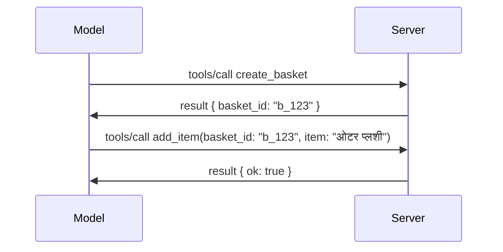

# MCP मध्ये काय बदलत आहे: 2026-07-28 रिलीझ कॅनडिडेट

> **स्थितीः** रिलीझ कॅनडिडेट. `2026-07-28` तपशील लेखनाच्या वेळी अंतिम नाही. हे 21 मे 2026 रोजी जाहीर करण्यात आले आणि 28 जुलै 2026 रोजी शिप होणार आहे. या धड्यातील सर्व काही रिलीझ कॅनडिडेटचे वर्णन करते; त्याच्या विरुद्ध बिल्ड करण्यापूर्वी [ड्राफ्ट तपशील](https://modelcontextprotocol.io/specification/draft) आणि त्याच्या [चेंजलॉग](https://modelcontextprotocol.io/specification/draft/changelog) मध्ये नवीनतम स्थितीसाठी तपासा. या अभ्यासक्रमाच्या शिल्लक भागाला सध्याच्या स्थिर आवृत्तीवर लिहिले गेले आहे, **MCP तपशील 2025-11-25**, आणि `2026-07-28` शिप झाल्यानंतर अद्यतनित केले जाईल.

## आढावा

`2026-07-28` हा MCP चा सर्वात मोठा पुनरावलोकन आहे जेव्हा तो लॉन्च झाला. सहा तपशील सुधारणा प्रस्ताव (SEPs) प्रोटोकॉल-स्तरीय सेशन्स काढून टाकतात आणि MCP ला ट्रान्सपोर्ट स्तरावर स्टेटलेस बनवतात, विस्तार पहिल्या श्रेणीचा, आवृत्तीबद्ध यंत्रणा बनवतात, आणि या अभ्यासक्रमात तुम्हाला आधी शिकवलेल्या काही वैशिष्ट्यांना (Roots, Sampling, Logging) नवीन जीवनचक्र धोरणाखाली निरोप दिला जातो. हा धडा बदल काय आहे, का महत्त्वाचे आहे, आणि `2025-11-25` च्या विरुद्ध तुमच्याद्वारे आधी लिहिलेल्या कोडसाठी ते काय अर्थ आहे याचा सारांश देतो.

स्रोत: [2026-07-28 MCP तपशील रिलीझ कॅनडिडेट](https://blog.modelcontextprotocol.io/posts/2026-07-28-release-candidate/) (मॉडेल कंटेक्स्ट प्रोटोकॉल ब्लॉग, डेव्हिड सोरिया पर्रा आणि डेन डेलिमार्स्की).

## शिकण्याचे उद्दिष्टे

या धड्याच्या शेवटी, तुम्ही सक्षम असाल:

- MCP हे स्टेटलेस प्रोटोकॉल कोर कडे का जात आहे आणि क्षैतिज विस्तारासाठी कोणती समस्या ते सोडवते हे समजावून सांगणे.
- `initialize`/`initialized` हस्तांतर आणि `Mcp-Session-Id` हेडर कसे बदलले जातात ते वर्णन करणे.
- नवीन `Mcp-Method` आणि `Mcp-Name` हेडर्स आणि `ttlMs`/`cacheScope` कॅशिंग मेटाडेटा ओळखणे.
- एक्सटेंशन्स फ्रेमवर्क आणि या रिलीझसह येणाऱ्या दोन एक्सटेंशन्स: MCP Apps आणि Tasks ओळखणे.
- OAuth 2.0 / OIDC संरेखन मजबूत करणारे सहा अधिकृतता SEPs यादी करणे.
- कोणती मुख्य वैशिष्ट्ये (Roots, Sampling, Logging) आता निरोप दिली गेली आहेत, आणि त्याचा व्यवहारात काय अर्थ आहे हे समजावणे.
- टूल `inputSchema`/`outputSchema` साठी पूर्ण JSON स्कीमा 2020-12 च्या बदलाचे स्पष्टीकरण देणे.

## एक स्टेटलेस प्रोटोकॉल

मुख्य बदल: प्रोटोकॉल स्तरावर MCP स्टेटलेस होत आहे.

### आधी (2025-11-25): सेशन्स तुम्हाला एका सर्व्हर इंस्टन्सवर बांधतात

Streamable HTTP वर टूल कॉल करणे `initialize` हस्तांतराने सुरू होते. सर्व्हर प्रतिसाद म्हणून `Mcp-Session-Id` हेडर देते जो प्रत्येक पुढील विनंतीने असणे आवश्यक आहे:

```http
POST /mcp HTTP/1.1
Mcp-Session-Id: 1868a90c-3a3f-4f5b
Content-Type: application/json

{"jsonrpc":"2.0","id":2,"method":"tools/call",
 "params":{"name":"search","arguments":{"q":"otters"}}}
```

कारण सेशन तो सर्व्हर इंस्टन्सवर नियंत्रित आहे ज्याने तो जारी केला, क्षैतिज विस्तारासाठी लोड बॅलन्सरवर **स्टिकी राउटिंग** आणि इंस्टन्सेसमध्ये **शेअर केलेले सेशन स्टोर** आवश्यक होते.

### नंतर (2026-07-28): प्रत्येक विनंती स्वतःत समृद्ध आहे

```http
POST /mcp HTTP/1.1
MCP-Protocol-Version: 2026-07-28
Mcp-Method: tools/call
Mcp-Name: search
Content-Type: application/json

{"jsonrpc":"2.0","id":1,"method":"tools/call",
 "params":{"name":"search","arguments":{"q":"otters"},
           "_meta":{"io.modelcontextprotocol/clientInfo":{"name":"my-app","version":"1.0"}}}}
```

कोणतीही सर्व्हर इंस्टन्स ही विनंती हाताळू शकते. मुख्य बदल:

- **`initialize`/`initialized` हस्तांतर काढून टाकले गेले आहेत** ([SEP-2575](https://github.com/modelcontextprotocol/modelcontextprotocol/pull/2575)). प्रोटोकॉल आवृत्ती, क्लायंट माहिती, आणि क्लायंट क्षमता प्रत्येक विनंतीतील `_meta` मध्ये हलतात. एका नवीन `server/discover` मेथडमुळे क्लायंटला आवश्यक असल्यास सर्व्हर क्षमता आधी मिळवता येतात.
- **`Mcp-Session-Id` हेडर आणि प्रोटोकॉल-स्तरीय सेशन काढून टाकले गेले आहेत** ([SEP-2567](https://github.com/modelcontextprotocol/modelcontextprotocol/pull/2567)). प्रोटोकॉल स्तरावर स्टिकी राउटिंग आणि शेअर केलेले सेशन स्टोअर आवश्यक नाही.

### स्टेटलेस प्रोटोकॉल, स्टेटफुल अ‍ॅप्लिकेशन्स

प्रोटोकॉल-स्तरीय सेशन काढून टाकणे म्हणजे तुमचा सर्व्हर स्टेटफुल असू शकत नाही असे नाही. शिफारस केलेली पद्धत हीच आहे जी HTTP API ने नेहमी वापरली आहे: एका टूल कॉलमधून स्पष्ट हँडल (उदा. `basket_id`, `browser_id`) तयार करा, आणि मॉडेल त्या हँडलला पुढील कॉल्सवर एक सामान्य argument म्हणून परत पाठवेल.



हे स्टेटला मॉडेलसाठी दृश्यमान आणि समजण्यासारखे बनवते, आणि कोणतीही सर्व्हर इंस्टन्स कोणताही कॉल हाताळू शकते.

### सर्व्हर-टू-क्लायंट विनंत्या, पुनर्गठित

स्टेटलेस प्रोटोकॉलला अजूनही आवश्यक आहे की सर्व्हर क्लायंटला मध्य-कॉल काही विचारू शकेल (उदा. elicitation prompt):

- **सर्व्हर-प्रेरित विनंत्या फक्त तेव्हाच दिल्या जातील जेव्हा सर्व्हर सक्रियपणे क्लायंटच्या विनंतीवर प्रक्रिया करत आहे** ([SEP-2260](https://github.com/modelcontextprotocol/modelcontextprotocol/pull/2260)) — पूर्वी शिफारस होती, आता आवश्यकता आहे. वापरकर्त्याला कधीही अचानक पुन्हा विचारले जात नाही.
- **मल्टी राउंड-ट्रिप विनंत्या** ([SEP-2322](https://github.com/modelcontextprotocol/modelcontextprotocol/pull/2322)) SSE स्ट्रीम उघडा ठेवण्याची जागा घेतात. त्याऐवजी, सर्व्हर `InputRequiredResult` पुनरागमन करते:

  ```json
  {
    "resultType": "inputRequired",
    "inputRequests": {
      "confirm": {
        "type": "elicitation",
        "message": "Delete 3 files?",
        "schema": { "type": "boolean" }
      }
    },
    "requestState": "eyJzdGVwIjoxLCJmaWxlcyI6WyJhIiwiYiIsImMiXX0="
  }
  ```

  क्लायंट उत्तरे जमा करतो आणि मूळ कॉल `inputResponses` सोबत आणि `requestState` echo करून पुन्हा पाठवतो. कोणतीही सर्व्हर इंस्टन्स हा पुनर्प्रयत्न घेऊ शकते कारण सर्व काही पेलोडमध्ये असते.

### रूटेबल, कॅशेबल, ट्रेसबल

तीन छोटे बदल स्टेटलेस ट्रॅफिक ऑपरेट करणे सोपे करतात:

- **स्ट्रीमबल HTTP वर `Mcp-Method` आणि `Mcp-Name` हेडर आवश्यक आहेत** ([SEP-2243](https://github.com/modelcontextprotocol/modelcontextprotocol/pull/2243)), ज्यामुळे लोड बॅलन्सर, गेटवे, आणि रेट लिमिटर ऑपरेशनवर JSON बॉडी तपासण्याशिवाय राउट करू शकतात. हेडर आणि बॉडीमध्ये विसंगती असलेल्या विनंत्या नाकारल्या जातात.
- **`tools/list` आणि संसाधन वाचन परिणाम `ttlMs` आणि `cacheScope` सह येतात** ([SEP-2549](https://github.com/modelcontextprotocol/modelcontextprotocol/pull/2549)), HTTP `Cache-Control` प्रमाणे. क्लायंटना माहित असते की यादी निकाल किती काळ ताजे आहे आणि हे अनेक वापरकर्त्यांमध्ये सुरक्षितपणे सामायिक करण्याजोगे आहे का, यासाठी दीर्घकालीन SSE स्ट्रीमची गरज नाही.
- **`_meta` मध्ये W3C Trace Context प्रसार दस्तऐवजीकृत आहे** ([SEP-414](https://github.com/modelcontextprotocol/modelcontextprotocol/pull/414)), `traceparent`, `tracestate`, आणि `baggage` की नावे निश्चित केली आहेत ज्यामुळे वितरित ट्रेस क्लायंट SDK, MCP सर्व्हर, आणि डाउनस्ट्रीम सिस्टम्स मध्ये [OpenTelemetry](https://opentelemetry.io/) अनुरूप बॅकएंड मध्ये कॉलवर अनुसरू शकतो.

## एक्सटेंशन्स पहिल्या श्रेणीत येतात

एक्सटेंशन्स `2025-11-25` मध्ये अनौपचारिकपणे अस्तित्वात होत्या. [SEP-2133](https://github.com/modelcontextprotocol/modelcontextprotocol/pull/2133) त्यांना औपचारिक करते:

- एक्सटेंशन्सना रिव्हर्स-DNS आयडींनी ओळखले जाते.
- ते क्लायंट आणि सर्व्हर क्षमतांवर `extensions` नकाशाद्वारे वाटाघाटी केली जातात.
- ते स्वतःच्या `ext-*` रिपॉझिटरीजमध्ये राहतात ज्या नि:शुल्क देखभाल करणाऱ्यांसह आहेत आणि मुख्य तपशीलापासून स्वतंत्रपणे आवृत्ती बदलतात.
- SEP प्रक्रियेत नवीन Extensions Track त्यांना प्रयोगात्मकतेतून अधिकृततेकडे जाण्याचा मार्ग देते.

हा रिलीझ दोन अधिकृत एक्सटेंशन्स सोबत येतो.

### MCP Apps: सर्व्हर-द्वारे रेंडर केलेल्या वापरकर्ता इंटरफेस

[MCP Apps](https://blog.modelcontextprotocol.io/posts/2026-01-26-mcp-apps/) ([SEP-1865](https://github.com/modelcontextprotocol/modelcontextprotocol/pull/1865)) सर्व्हरना आयएफ्रेममध्ये होस्ट केलेले इंटरॅक्टिव्ह HTML इंटरफेस शिप करण्याची परवानगी देते. टूल्स आपली UI साच्यांची पूर्वनिर्धारित घोषणा करतात त्यामुळे होस्ट्स त्यांना प्रीफेच, कॅशे, आणि सुरक्षा समीक्षा करू शकतात. तुम्ही याचा मूलभूत अभ्यास आधीच [धडा 15: MCP Apps](../03-GettingStarted/15-mcp-apps/README.md) मध्ये केला आहे — Extensions फ्रेमवर्क अंतर्गत, MCP Apps आता औपचारिकपणे एक विस्तार आहे, प्रयोगात्मक मुख्य वैशिष्ट्य नाही.

### Tasks एक एक्सटेंशन झाला

Tasks `2025-11-25` मध्ये प्रयोगात्मक मुख्य वैशिष्ट्य म्हणून आले. उत्पादन वापरात पुनर्रचना पुरेशी समोर आली की त्याचा योग्य गृह एक्सटेंशन आहे: [Tasks एक्सटेंशन](https://github.com/modelcontextprotocol/modelcontextprotocol/pull/2663) स्टेटलेस मॉडेलच्या आसपास जीवनचक्र फिरवते — सर्व्हर `tools/call` ला task हँडलसह उत्तरे देऊ शकतो, आणि क्लायंट `tasks/get`, `tasks/update`, आणि `tasks/cancel` ने पुढे नेतो. टास्क निर्मिती सर्व्हर निर्देशित आहे: क्लायंट एक्सटेंशन जाहिर करते, आणि सर्व्हर कॉल कधी टास्क म्हणून चालवायचा ते ठरवतो. `tasks/list` पूर्णपणे काढले गेले कारण ते सेशन्स शिवाय सुरक्षितपणे स्कोप करता येत नाही.

> **चलनटीप:** जर तुम्ही प्रयोगात्मक `2025-11-25` Tasks API अंमलात आणला असेल, तर तुम्हाला नवीन एक्सटेंशन जीवनचक्रावर स्थलांतर करावे लागेल — ते मागील सुसंगत नाही.

## अधिकृतता मजबूत करणे

सहा SEPs [अधिकृतता तपशील](https://modelcontextprotocol.io/specification/draft/basic/authorization) अधिकपूर्वक OAuth 2.0 / OpenID Connect उद्गमांशी संरेखित करतात:

| SEP | बदल |
|---|---|
| [SEP-2468](https://github.com/modelcontextprotocol/modelcontextprotocol/pull/2468) | ग्राहकांना अधिकृत प्रतिसादांवरील `iss` पॅरामीटरचा [RFC 9207](https://www.rfc-editor.org/rfc/rfc9207) नुसार प्रमाणीकरण करणे आवश्यक आहे, जे MCP च्या सिंगल-क्लायंट, अनेक-सर्व्हर पॅटर्नमधील मिक्स-अप हल्ल्यांपासून संरक्षण करते. येणारी आवृत्ती `iss` नसलेल्या प्रतिसादांना नाकारण्याची आवश्यकता आणू शकते. |
| [SEP-837](https://github.com/modelcontextprotocol/modelcontextprotocol/pull/837) | ग्राहकांनी डायनॅमिक क्लायंट नोंदणी दरम्यान त्यांचा OpenID Connect `application_type` जाहीर करणे आवश्यक आहे, ज्यामुळे अधिकृतता सर्व्हर डेस्कटॉप/CLI क्लायंटला `"web"` डिफॉल्ट करणे आणि त्याचा localhost redirect URI नाकारणे टाळतो. |
| [SEP-2352](https://github.com/modelcontextprotocol/modelcontextprotocol/pull/2352) | ग्राहकांनी नोंदणीकृत क्रेडेन्शियल्स अधिकृतता सर्व्हरच्या `issuer` शी बांधले पाहिजेत आणि जेव्हा संसाधन अधिकृतता सर्व्हर दरम्यान स्थलांतरित होते तेव्हा पुनःनोंदणी करावी. |
| [SEP-2207](https://github.com/modelcontextprotocol/modelcontextprotocol/pull/2207) | OpenID Connect-शैलीच्या अधिकृतता सर्व्हरकडून रिफ्रेश टोकन्स कसे मागवायचे याचे दस्तऐवजीकरण. |
| [SEP-2350](https://github.com/modelcontextprotocol/modelcontextprotocol/pull/2350) | स्टेप-अप अधिकृतता दरम्यान स्कोप संकलन स्पष्ट करणे. |
| [SEP-2351](https://github.com/modelcontextprotocol/modelcontextprotocol/pull/2351) | `.well-known` डिस्कव्हरी उपसर्ग स्पष्ट करणे. |

जर तुम्ही आज MCP साठी अधिकृतता सर्व्हर तयार करत असाल, तर अधिकृतता प्रतिसादांवर `iss` द्यायला सुरुवात करा — वर्तमान अधिकृतता मार्गदर्शनासाठी [02-Security](../02-Security/README.md) पहा ज्यावर हे आधारित राहील.

## Roots, Sampling, आणि Logging ला निरोप दिला गेला आहे

नवीन [वैशिष्ट्य जीवनचक्र धोरण](https://github.com/modelcontextprotocol/modelcontextprotocol/pull/2577) ([SEP-2577](https://github.com/modelcontextprotocol/modelcontextprotocol/pull/2577)) अंतर्गत, तुम्ही [Core Concepts](./README.md#roots) मध्ये शिकलेले तीन मुख्य क्लायंट मूळ (primitives) **निरोप दिलेले** म्हणून वर्गीकृत केले आहेत:

| वैशिष्ट्य | शिफारस केलेले पर्याय |
|---|---|
| Roots | टूल पॅरामीटर्स, संसाधन URIs, किंवा सर्व्हर संरचना |
| Sampling | LLM प्रदाता APIs सोबत थेट समाकलन |
| Logging | `stderr` stdio ट्रान्सपोर्टसाठी; OpenTelemetry स्ट्रक्चर्ड ऑबझर्वबिलिटी साठी |

हे **फक्त अ‍ॅनोटेशन-स्तरीय निरोप** आहेत: पद्धती, प्रकार, आणि क्षमता फलक हे या रिलीझमध्ये आणि त्यानंतर एका वर्षात प्रकाशित होणाऱ्या प्रत्येक तपशील आवृत्तीत कार्यरत राहतील. कोणतेही पूर्णपणे काढून टाकणे जीवनचक्र धोरणाखाली वेगळ्या SEP ची गरज असेल — त्यामुळे तुमचे विद्यमान [Sampling](../03-GettingStarted/14-sampling/README.md) नमुने आज तुटणार नाहीत, पण नवीन सर्व्हर्स वर उल्लेख केलेल्या पर्यायांना प्राधान्य द्यावे.

## टूल्ससाठी पूर्ण JSON स्कीमा 2020-12

टूल `inputSchema` आणि `outputSchema` पूर्ण [JSON स्कीमा 2020-12](https://json-schema.org/draft/2020-12) मध्ये वाढविले गेले आहेत ([SEP-2106](https://github.com/modelcontextprotocol/modelcontextprotocol/pull/2106)):

- इनपुट स्कीमामध्ये `type: "object"` मूळ अट ठेवली गेली आहे पण आता संयोजन (`oneOf`, `anyOf`, `allOf`), परिस्थिती, आणि संदर्भ (`$ref`, `$defs`) परवानगी आहे.
- आउटपुट स्कीमा अबाधित आहेत, आणि `structuredContent` आता फक्त ऑब्जेक्ट नसून कोणताही JSON मूल्य असेल लागू शकते.
- अंमलबजावणी करणाऱ्यांनी बाह्य `$ref` URI ऑटो-ड्रेफरन्स करू नयेत आणि स्कीमा खोली आणि प्रमाणीकरण वेळ मर्यादित ठेवावी (सेवा अस्विकार विचार करण्यायोग्य, जर सर्व्हर बाजूला स्कीमा प्रमाणित करत असाल तर).

वेगळे, हरवलेल्या resource साठी त्रुटी कोड MCP-कस्टम `-32002` पासून JSON-RPC मानक `-32602` (Invalid Params) मध्ये बदलला आहे ([SEP-2164](https://github.com/modelcontextprotocol/modelcontextprotocol/pull/2164)). जर तुमचा क्लायंट `-32002` वर तेच literal जुळवत असेल, तर तुम्हाला ते अद्ययावत करावे लागेल.

## प्रोटोकॉल येथून कसा विकसित होत आहे

हा रिलीझ तुटलेले बदल समाविष्ट करतो, जे MCP मेंटेनर्स पुढेही नियम म्हणून घ्यायला इच्छित नाहीत. तीन शासकीय SEPs हे टाळण्यासाठी आहेत:

- **वैशिष्ट्य जीवनचक्र धोरण** प्रत्येक वैशिष्ट्याला Active → Deprecated → Removed मार्ग देते ज्यामध्ये निरोप आणि काढून टाकण्याच्या सुरुवातीच्या तारखेअगोदर किमान बारा महिने असतात.
- **एक्सटेंशन्स फ्रेमवर्क** नवीन क्षमता ऑप्ट-इन एक्सटेंशन्स म्हणून शिप करतात आणि तेथे स्थिर होतात त्यानंतर (कधीही असे झाले तर) मुख्य तपशीलात समावेश होण्यासाठी.

- एक Standards Track SEP आता अंतिम स्थितीपर्यंत पोहोचू शकत नाही जोपर्यंत जुळणारा परिस्थिती [conformance suite](https://github.com/modelcontextprotocol/conformance) मध्ये नाही ([@SEP-2484](https://github.com/modelcontextprotocol/modelcontextprotocol/pull/2484)) — हेच suite जे [SDK tier system](https://github.com/modelcontextprotocol/modelcontextprotocol/pull/1777) अधिकृत SDKs विरुद्ध स्कोअर करते.

## प्रकाशन वेळापत्रक आणि प्रमाणीकरण

- प्रकाशन उमेदवार २१ मे, २०२६ रोजी लॉक करण्यात आला.
- अंतिम तपशील २८ जुलै, २०२६ साठी नियोजित आहे.
- या दोन तारखांमधील दहा आठवड्यांच्या काळात SDK मेंटेनर्स आणि क्लायंट अमलकारकांना बदल सत्यापित करण्याची संधी मिळते; Tier 1 SDKs यावेळी [SDK tier system](https://modelcontextprotocol.io/docs/sdk) अंतर्गत समर्थन पाठविण्याची अपेक्षा आहे.
- बदलांची पूर्ण यादी [मसुदा तपशील](https://modelcontextprotocol.io/specification/draft) आणि त्याच्या [चेंजलॉग](https://modelcontextprotocol.io/specification/draft/changelog) मध्ये ट्रॅक करा.

## या अभ्यासक्रमासाठी याचा अर्थ काय?

आतापर्यंत तुम्ही या कोर्समध्ये जे काही शिकले ते **2025-11-25** या दिनांकासाठी आहे, जे `2026-07-28` पर्यंत वर्तमान स्थिर तपशील म्हणून राहील. थोडक्यात:

- **Session आणि `initialize` handshake** (जे [Core Concepts](./README.md) आणि [Lesson 6: HTTP Streaming](../03-GettingStarted/06-http-streaming/README.md) मध्ये कव्हर केले आहेत) अद्याप आज जसे दस्तऐवजीकृत आहे तसेच कार्यरत आहेत, पण `2026-07-28`-शी सुसंगत SDKs मध्ये उन्नती करताना ते वरील stateless विनंती मॉडेलने बदलले जातील.
- **Sampling आणि Roots** (तेही [Core Concepts](./README.md) मध्ये कव्हर केलेले आहेत) पूर्णपणे कार्यरत आहेत, पण त्यांचा अवरोध केला गेला आहे — नवीन डिझाइन्स वरील पुनरावृत्ती नमुन्यांना प्राधान्य द्यावेत.
- **प्रायोगिक Tasks वैशिष्ट्य**, जर तुम्ही त्याचा वापर केला असेल तर, ते Tasks विस्ताराच्या नवीन जीवनचक्रात स्थलांतरित करावे लागेल.
- **MCP Apps** ([Lesson 15](../03-GettingStarted/15-mcp-apps/README.md)) प्रत्यक्षात अप्रभावित आहे; ते फक्त औपचारिक Extensions फ्रेमवर्क अंतर्गत येतात.

## अतिरिक्त साधने

- [2026-07-28 MCP तपशील प्रकाशन उमेदवार (ब्लॉग पोस्ट)](https://blog.modelcontextprotocol.io/posts/2026-07-28-release-candidate/)
- [MCP परिवहनाचे भविष्य](https://blog.modelcontextprotocol.io/posts/2025-12-19-mcp-transport-future/)
- [MCP मसुदा तपशील](https://modelcontextprotocol.io/specification/draft)
- [MCP मसुदा चेंजलॉग](https://modelcontextprotocol.io/specification/draft/changelog)
- [SEP मार्गदर्शक तत्त्वे](https://modelcontextprotocol.io/community/sep-guidelines)
- [MCP SDK टियर सिस्टीम](https://modelcontextprotocol.io/docs/sdk)

## पुढच्या टप्पे

[Core Concepts](./README.md) कडे परत या किंवा [Security](../02-Security/README.md) कडे पुढे जा आणि पाहा की आजच्या `2025-11-25` मार्गदर्शनाने येणाऱ्या काळात काय अर्थ लावतात.

---

<!-- CO-OP TRANSLATOR DISCLAIMER START -->
**अस्वीकरण**:
हा दस्तऐवज AI भाषांतर सेवा [Co-op Translator](https://github.com/Azure/co-op-translator) चा वापर करून अनुवादित केला आहे. जरी आम्ही अचूकतेसाठी प्रयत्न करतो, तरी कृपया लक्षात घ्या की स्वयंचलित भाषांतरांमध्ये त्रुटी किंवा अचूकतेची कमतरता असू शकते. मूळ दस्तऐवज त्याच्या मूळ भाषेत अधिकृत स्रोत मानला पाहिजे. महत्त्वाची माहिती असल्यास, व्यावसायिक मानवी भाषांतराची शिफारस केली जाते. या भाषांतराच्या वापरामुळे उद्भवणाऱ्या कोणत्याही गैरसमज किंवा चुकीच्या अर्थलावणीसाठी आम्ही जबाबदार नाही.
<!-- CO-OP TRANSLATOR DISCLAIMER END -->