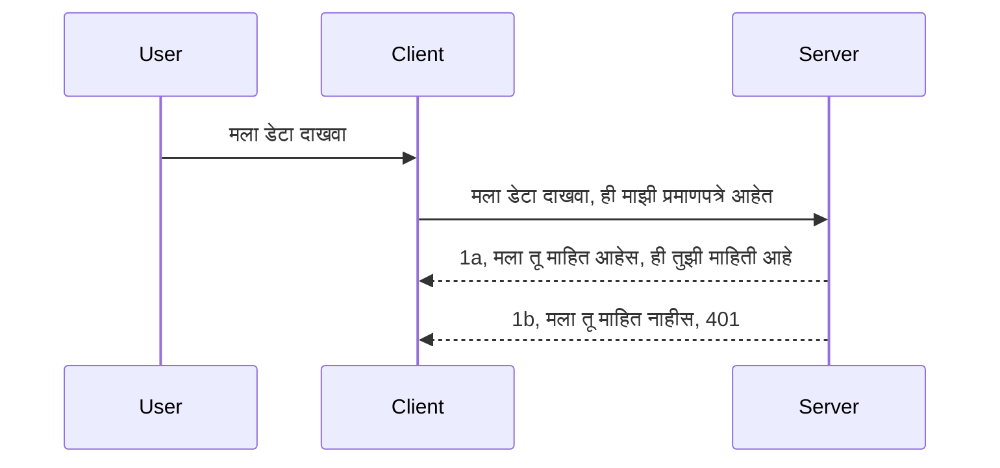

# साधा प्रमाणीकरण

MCP SDKs ओOAuth 2.1 चा वापर करण्यास समर्थन देतात जो की खरोखर एक गुंफलेला प्रक्रिया आहे ज्यामध्ये प्रमाणीकरण सर्व्हर, संसाधन सर्व्हर, क्रेडेन्शियल्स पाठवणे, कोड मिळवणे, त्या कोडला बिअरर टोकनमध्ये बदलणे आणि शेवटी आपले संसाधन डेटा मिळवणे हे संकल्पना समाविष्ट आहेत. जर तुम्हाला OAuth वापरायला ना येत असेल, जे एक चांगले कार्य आहे राबवण्यासाठी, तर बेसिक स्तरावर प्रमाणीकरणास सुरू करणे आणि हळूहळू अधिक चांगल्या सुरक्षिततेकडे प्रगती करणे एक चांगली कल्पना आहे. म्हणूनच हा अध्याय अस्तित्वात आहे, तुम्हाला अधिक प्रगत प्रमाणीकरणाकडे तयार करण्यासाठी.

## प्रमाणीकरण म्हणजे काय?

प्रमाणीकरण म्हणजे authentication आणि authorization या संक्षेपाचा अर्थ आहे. कल्पना अशी आहे की आपल्याला दोन गोष्टी कराव्या लागतात:

- **प्रमाणीकरण (Authentication)**, ज्याचे उद्दीष्ट आहे ठरवणे की आपण कोणाला आपल्या घरात प्रवेश देतो, म्हणजेच त्यांनी "इथे" प्रवेश करण्याचे अधिकार आहेत का, म्हणजेच आमच्या संसाधन सर्व्हरला प्रवेश आहे जिथे आमचे MCP सर्व्हर वैशिष्ट्ये राहतात.
- **अधिकृतता (Authorization)**, ज्यामध्ये तपासले जाते की वापरकर्त्याला त्याने मागितलेल्या विशेष संसाधनांना प्रवेश असावा का, उदाहरणार्थ हे ऑर्डर किंवा उत्पादने किंवा ते वाचू शकतात पण हटवू शकत नाहीत, हे एक उदाहरण म्हणून.

## क्रेडेन्शियल्स: आपण प्रणालीला आपली ओळख कशी सांगतो

बरं, बहुतेक वेब डेव्हलपर्स सामान्यपणे सर्व्हरला एक क्रेडेन्शियल पुरवण्याचा विचार करतात, सहसा एक गुपित जे सांगते की त्यांना येथे "प्रमाणीकरण" करायला परवानगी आहे का. या क्रेडेन्शियलसाठी बरेच वेळा युजरनेम आणि पासवर्डचे बेस64 एन्कोड केलेले रूप किंवा API की वापरली जाते जी विशिष्ट वापरकर्त्याची ओळख करून देते.

यासाठी, ते "Authorization" नावाच्या हेडरद्वारे पाठवले जाते, अशा प्रकारे:

```json
{ "Authorization": "secret123" }
```

हे सहसा बेसिक प्रमाणीकरण म्हणून ओळखले जाते. एकूण प्रक्रिया खालीलप्रमाणे काम करते:



आता आपण प्रक्रिया कशी चालते हे समजल्यावर, आपण ते कसे राबवू? बहुतेक वेब सर्व्हरमध्ये 'middleware' नावाची संकल्पना असते, जी विनंतीचा एक भाग म्हणून चालणारी कोडची एक तुकडी आहे जी क्रेडेन्शियल तपासू शकते आणि जर क्रेडेन्शियल वैध असतील तर विनंतीला पुढे जाण्याची परवानगी देते. जर विनंतीमध्ये वैध क्रेडेन्शियल नसेल तर तुम्हाला प्रमाणीकरण त्रुटी मिळेल. चला पाहूया हे कसे राबवले जाऊ शकते:

**Python**

```python
class AuthMiddleware(BaseHTTPMiddleware):
    async def dispatch(self, request, call_next):

        has_header = request.headers.get("Authorization")
        if not has_header:
            print("-> Missing Authorization header!")
            return Response(status_code=401, content="Unauthorized")

        if not valid_token(has_header):
            print("-> Invalid token!")
            return Response(status_code=403, content="Forbidden")

        print("Valid token, proceeding...")
       
        response = await call_next(request)
        # कोणतेही ग्राहक हेडर जोडा किंवा प्रतिसादात कोणत्यातरी प्रकारे बदल करा
        return response


starlette_app.add_middleware(CustomHeaderMiddleware)
```

येथे आपल्याकडे आहे:

- `AuthMiddleware` नावाचे middleware तयार केले आहे ज्याचे `dispatch` मेथड वेब सर्व्हरद्वारे कॉल केले जाते.
- वेब सर्व्हरमध्ये middleware जोडले आहे:

    ```python
    starlette_app.add_middleware(AuthMiddleware)
    ```

- प्रमाणीकरण हेडर उपलब्ध आहे का आणि पाठवलेले गुपित वैध आहे का हे तपासणारी पडताळणी लॉजिक लिहिले आहे:

    ```python
    has_header = request.headers.get("Authorization")
    if not has_header:
        print("-> Missing Authorization header!")
        return Response(status_code=401, content="Unauthorized")

    if not valid_token(has_header):
        print("-> Invalid token!")
        return Response(status_code=403, content="Forbidden")
    ```

जर गुपित उपलब्ध आणि वैध असेल तर आम्ही विनंतीला `call_next` कॉल करून पुढे जाण्याची परवानगी देतो आणि प्रतिसाद परत करतो.

    ```python
    response = await call_next(request)
    # प्रतिसादात कोणतीही ग्राहक हेडर जोडणे किंवा काही प्रकारे बदल करणे
    return response
    ```

प्रक्रिया अशी आहे की जर वेब विनंती सर्व्हरकडे आला तर middleware कॉल होईल आणि त्याच्या अंमलबजावणीनुसार ती विनंती पुढे जाण्याची परवानगी देईल किंवा क्लायंटला ज्याला पुढे जाण्याची अनुमती नाही त्याला त्रुटी परत करेल.

**TypeScript**

येथे आपण लोकप्रिय फ्रेमवर्क Express सह middleware तयार करतो आणि MCP सर्व्हरपर्यंत विनंती पोहोचण्यापूर्वी त्याला इंटरसेप्ट करतो. खालील कोड पाहा:

```typescript
function isValid(secret) {
    return secret === "secret123";
}

app.use((req, res, next) => {
    // 1. अधिकृतता शीर्षलेख आहे का?
    if(!req.headers["Authorization"]) {
        res.status(401).send('Unauthorized');
    }
    
    let token = req.headers["Authorization"];

    // 2. वैधता तपासा.
    if(!isValid(token)) {
        res.status(403).send('Forbidden');
    }

   
    console.log('Middleware executed');
    // 3. विनंती पाईपलाइनमधील पुढील टप्प्यात विनंती पाठवा.
    next();
});
```

या कोडमध्ये आपण:

1. प्रथम तपासतो की Authorization हेडर उपलब्ध आहे का, जर नाही तर 401 त्रुटी पाठवतो.
2. क्रेडेन्शियल/टोकन वैध आहे का हे तपासतो, जर नाही तर 403 त्रुटी पाठवतो.
3. शेवटी विनंती पुढे पाइपलाइनमध्ये पाठवतो आणि मागितलेले संसाधन परत करतो.

## सराव: प्रमाणीकरण राबवा

आपल्या ज्ञानाचा वापर करून आम्ही राबवणीचा प्रयत्न करूया. योजना अशी आहे:

सर्व्हर

- एक वेब सर्व्हर आणि MCP उदाहरण तयार करा.
- सर्व्हरसाठी middleware राबवा.

क्लायंट 

- क्रेडेन्शियल सह वेब विनंती हेडरद्वारे पाठवा.

### -1- एक वेब सर्व्हर आणि MCP उदाहरण तयार करा

> **पुढे पहात:** खालील TypeScript उदाहरण HTTP ट्रान्सपोर्ट्स `mcp-session-id` की सह `transports` नकाशांमध्ये ट्रॅक करते, **MCP Specification 2025-11-25** नुसार. `2026-07-28` मध्ये रिलीझ कॅन्डिडेट `initialize` हँडशेक आणि सत्र आयडी पूर्णपणे काढून टाकतो, त्यामुळे हा प्रति-सेशन ट्रान्सपोर्ट नकाशा नष्ट होऊन वस्तुनिष्ठ, स्वयं-समाविष्ट विनंत्यांसाठी जागा तयार करतो. तपासा [MCP मध्ये काय बदल होत आहे: 2026-07-28 रिलीझ कॅन्डिडेट](../../01-CoreConcepts/mcp-2026-07-28-release-candidate.md).

आपल्या पहिल्या टप्प्यात, आपल्याला वेब सर्व्हर उदाहरण आणि MCP सर्व्हर तयार करणे आवश्यक आहे.

**Python**

येथे आपण एक MCP सर्व्हर उदाहरण तयार करतो, starlette वेब अ‍ॅप तयार करतो आणि uvicorn सह होस्ट करतो.

```python
# MCP सर्व्हर तयार करत आहे

app = FastMCP(
    name="MCP Resource Server",
    instructions="Resource Server that validates tokens via Authorization Server introspection",
    host=settings["host"],
    port=settings["port"],
    debug=True
)

# starlette वेब अॅप तयार करत आहे
starlette_app = app.streamable_http_app()

# uvicorn द्वारे अॅप सर्व्ह करत आहे
async def run(starlette_app):
    import uvicorn
    config = uvicorn.Config(
            starlette_app,
            host=app.settings.host,
            port=app.settings.port,
            log_level=app.settings.log_level.lower(),
        )
    server = uvicorn.Server(config)
    await server.serve()

run(starlette_app)
```

या कोडमध्ये आपण:

- MCP सर्व्हर तयार केला.
- MCP सर्व्हरपासून starlette वेब अ‍ॅप तयार केला, `app.streamable_http_app()`.
- uvicorn वापरून वेब अ‍ॅप होस्ट आणि सर्व्हर केले `server.serve()`.

**TypeScript**

येथे आपण MCP सर्व्हर उदाहरण तयार करतो.

```typescript
const server = new McpServer({
      name: "example-server",
      version: "1.0.0"
    });

    // ... सर्व्हर संसाधने, साधने, आणि प्रॉम्प्ट्स सेट करा ...
```

ही MCP सर्व्हर निर्मिती आपल्या POST /mcp मार्ग व्याख्येमध्ये करणे आवश्यक आहे, तर वरील कोड आपण असे हलवू:

```typescript
import express from "express";
import { randomUUID } from "node:crypto";
import { McpServer } from "@modelcontextprotocol/sdk/server/mcp.js";
import { StreamableHTTPServerTransport } from "@modelcontextprotocol/sdk/server/streamableHttp.js";
import { isInitializeRequest } from "@modelcontextprotocol/sdk/types.js"

const app = express();
app.use(express.json());

// सत्र आयडीनुसार ट्रान्सपोर्ट साठवण्यासाठी नकाशा
const transports: { [sessionId: string]: StreamableHTTPServerTransport } = {};

// क्लायंट-टू-सर्व्हर संवादासाठी POST विनंत्या हाताळा
app.post('/mcp', async (req, res) => {
  // विद्यमान सत्र आयडीची तपासणी करा
  const sessionId = req.headers['mcp-session-id'] as string | undefined;
  let transport: StreamableHTTPServerTransport;

  if (sessionId && transports[sessionId]) {
    // विद्यमान ट्रान्सपोर्ट पुनर्वापर करा
    transport = transports[sessionId];
  } else if (!sessionId && isInitializeRequest(req.body)) {
    // नवीन प्रारंभिक विनंती
    transport = new StreamableHTTPServerTransport({
      sessionIdGenerator: () => randomUUID(),
      onsessioninitialized: (sessionId) => {
        // सत्र आयडीनुसार ट्रान्सपोर्ट साठवा
        transports[sessionId] = transport;
      },
      // मागील सुसंगततेसाठी DNS रीबाइंडिंग संरक्षण डिफॉल्टने अक्षम केलेले आहे. जर आपण हा सर्व्हर
      // स्थानिकरित्या चालवत असाल, तर नक्की सेट करा:
      // enableDnsRebindingProtection: true,
      // allowedHosts: ['127.0.0.1'],
    });

    // बंद करताना ट्रान्सपोर्ट साफ करा
    transport.onclose = () => {
      if (transport.sessionId) {
        delete transports[transport.sessionId];
      }
    };
    const server = new McpServer({
      name: "example-server",
      version: "1.0.0"
    });

    // ... सर्व्हर संसाधने, साधने आणि प्रॉम्प्ट्स सेट करा ...

    // MCP सर्व्हरशी कनेक्ट करा
    await server.connect(transport);
  } else {
    // अवैध विनंती
    res.status(400).json({
      jsonrpc: '2.0',
      error: {
        code: -32000,
        message: 'Bad Request: No valid session ID provided',
      },
      id: null,
    });
    return;
  }

  // विनंती हाताळा
  await transport.handleRequest(req, res, req.body);
});

// GET आणि DELETE विनंत्यांसाठी पुनर्वापरयोग्य हँडलर
const handleSessionRequest = async (req: express.Request, res: express.Response) => {
  const sessionId = req.headers['mcp-session-id'] as string | undefined;
  if (!sessionId || !transports[sessionId]) {
    res.status(400).send('Invalid or missing session ID');
    return;
  }
  
  const transport = transports[sessionId];
  await transport.handleRequest(req, res);
};

// SSE द्वारे सर्व्हर-टू-क्लायंट सूचना साठी GET विनंत्या हाताळा
app.get('/mcp', handleSessionRequest);

// सत्र समाप्तीसाठी DELETE विनंत्या हाताळा
app.delete('/mcp', handleSessionRequest);

app.listen(3000);
```

आता तुम्ही पाहू शकता कसे MCP सर्व्हर तयार करणे `app.post("/mcp")` मध्ये हलवले गेले आहे.

पुढच्या टप्प्याकडे जाऊया म्हणजे middleware तयार करणे जे येणारे क्रेडेन्शियल तपासेल.

### -2- सर्व्हरसाठी middleware राबवा

पुढील टप्प्यात आपल्याला middleware तयार करायचा आहे जो `Authorization` हेडरमध्ये क्रेडेन्शियल शोधेल आणि तो वैध आहे का ते तपासेल. जर स्वीकारार्ह असेल तर विनंती पुढे जाईल आणि त्यात लागलेल्या कार्यांची पूर्तता होईल (उदा. टूल्सची यादी, संसाधन वाचन किंवा क्लायंटने विचारलेली MCP फंक्शनॅलिटी).

**Python**

middleware तयार करण्यासाठी, आपल्याला `BaseHTTPMiddleware` कडून वारसाहक्क घेतलेला एक वर्ग तयार करणे आवश्यक आहे. दोन महत्त्वाच्या भाग आहेत:

- विनंती `request`, ज्याचा वापर आपण हेडर माहिती वाचण्यासाठी करतो.
- `call_next` हा कॉलबॅक ज्याला आपल्याला कॉल करावे लागते जर क्लायंटने क्रेडेन्शियल दिले असेल जो आपण स्वीकारतो.

प्रथम, आपल्याला हाताळावे लागेल की जर `Authorization` हेडर अनुपस्थित असला तर:

```python
has_header = request.headers.get("Authorization")

# कोणतीही हेडर उपस्थित नाही, 401 सह अयशस्वी, अन्यथा पुढे जा.
if not has_header:
    print("-> Missing Authorization header!")
    return Response(status_code=401, content="Unauthorized")
```

येथे आपण 401 अनधिकृत संदेश पाठवतो कारण क्लायंट प्रमाणीकरणात अयशस्वी झाला आहे.

नंतर, जर क्रेडेन्शियल सादर केले गेले असेल, तर त्याची वैधता तपासावी अशी गरज आहे:

```python
 if not valid_token(has_header):
    print("-> Invalid token!")
    return Response(status_code=403, content="Forbidden")
```

वरील कोड मध्ये आपण 403 प्रतिबंधित संदेश पाठवतो. आता पूर्ण middleware पाहा ज्याने वरील सगळे व्यवहार राबवले आहेत:

```python
class AuthMiddleware(BaseHTTPMiddleware):
    async def dispatch(self, request, call_next):

        has_header = request.headers.get("Authorization")
        if not has_header:
            print("-> Missing Authorization header!")
            return Response(status_code=401, content="Unauthorized")

        if not valid_token(has_header):
            print("-> Invalid token!")
            return Response(status_code=403, content="Forbidden")

        print("Valid token, proceeding...")
        print(f"-> Received {request.method} {request.url}")
        response = await call_next(request)
        response.headers['Custom'] = 'Example'
        return response

```

छान, पण `valid_token` फंक्शन काय आहे? ते खाली दिले आहे:

```python
# उत्पादनासाठी वापरू नका - सुधारणा करा !!
def valid_token(token: str) -> bool:
    # "Bearer " हा पूर्वसूचक काढा
    if token.startswith("Bearer "):
        token = token[7:]
        return token == "secret-token"
    return False
```

हे नक्कीच सुधारले पाहिजे.

महत्त्वाचे: तुम्ही कधीही कोडमध्ये अशा गुपिते ठेवू नयेत. आदर्श म्हणजे तुलना करण्यासाठी मूल्य डेटा स्रोत किंवा IDP (ओळख सेवा प्रदाता) कडून मिळवा किंवा चांगले आहे की IDP स्वतःच वैधता तपासू दे.

**TypeScript**

Express सह हे राबवण्यासाठी, आपल्याला `use` मेथड कॉल करणे आवश्यक आहे ज्यामध्ये middleware फंक्शन्स घेतले जातात.

आपल्याला पुढील गोष्टी कराव्या लागतील:

- विनंती व्हेरिएबलशी संवाद साधून `Authorization` प्रॉपर्टीमधील क्रेडेन्शियल तपासणे.
- क्रेडेन्शियलचे मूल्यांकन करणे, आणि जर ते योग्य असेल तर विनंती पुढे जाण्याची परवानगी देणे आणि क्लायंटच्या MCP विनंतीला आवश्यक सेवा पुरवणे (उदा. साधने सूचीबद्ध करणे, संसाधन वाचणे किंवा MCP संबंधित कुठलेही कार्य).

येथे आपण तपासतो की `Authorization` हेडर आहे का, आणि जर नाही तर विनंती थांबवतो:

```typescript
if(!req.headers["authorization"]) {
    res.status(401).send('Unauthorized');
    return;
}
```

जर हेडर दिलेला नसेल तर तुम्हाला 401 मिळेल.

नंतर, आपण तपासतो की क्रेडेन्शियल वैध आहे का, जर नाही तर पुन्हा विनंती थांबवतो पण थोडक्याच वेगळ्या संदेशासह:

```typescript
if(!isValid(token)) {
    res.status(403).send('Forbidden');
    return;
} 
```

आता तुम्हाला 403 त्रुटी मिळत आहे.

पूर्ण कोड खाली दिला आहे:

```typescript
app.use((req, res, next) => {
    console.log('Request received:', req.method, req.url, req.headers);
    console.log('Headers:', req.headers["authorization"]);
    if(!req.headers["authorization"]) {
        res.status(401).send('Unauthorized');
        return;
    }
    
    let token = req.headers["authorization"];

    if(!isValid(token)) {
        res.status(403).send('Forbidden');
        return;
    }  

    console.log('Middleware executed');
    next();
});
```

आपण वेब सर्व्हर सेट केला आहे ज्याने middleware स्वीकारला आहे ज्यामुळे क्लायंट कदाचित पाठवलेला क्रेडेन्शियल तपासला जाईल. तर क्लायंट स्वतः कसा आहे?

### -3- क्रेडेन्शियल सह वेब विनंती हेडरद्वारे पाठवा

आपण सुनिश्चित करणे आवश्यक आहे की क्लायंट हेडरमार्फत क्रेडेन्शियल पाठवत आहे. आपल्याला MCP क्लायंट वापरायचा आहे म्हणून हे कसे करायचे ते समजून घ्यायला हवे.

**Python**

क्लायंटसाठी, आपल्याला असे हेडर पास करावे लागेल:

```python
# मूल्य हार्डकोड करू नका, ते कमीतकमी एका पर्यावरण चल किंवा अधिक सुरक्षित संचयात ठेवा
token = "secret-token"

async with streamablehttp_client(
        url = f"http://localhost:{port}/mcp",
        headers = {"Authorization": f"Bearer {token}"}
    ) as (
        read_stream,
        write_stream,
        session_callback,
    ):
        async with ClientSession(
            read_stream,
            write_stream
        ) as session:
            await session.initialize()
      
            # TODO, क्लायंटमध्ये काय करायचे आहे ते, उदा. साधने सूचीबद्ध करा, साधने कॉल करा इत्यादी.
```

आपण पाहू शकता कसे `headers` प्रॉपर्टी `headers = {"Authorization": f"Bearer {token}"}` अशा प्रकारे भरली जाते.

**TypeScript**

आपण हे दोन टप्प्यांत सोडवू शकतो:

1. आपल्या क्रेडेन्शियलसह एक कॉन्फिगरेशन ऑब्जेक्ट तयार करा.
2. ट्रान्सपोर्टला कॉन्फिगरेशन ऑब्जेक्ट पास करा.

```typescript

// इथे दाखविल्याप्रमाणे मूल्य हार्डकोड करू नका. कमीत कमी ते एक पर्यावरण चल म्हणून ठेवा आणि dev मोडमध्ये dotenv सारखे काहीतरी वापरा.
let token = "secret123"

// क्लायंट ट्रान्सपोर्ट पर्याय ऑब्जेक्ट परिभाषित करा
let options: StreamableHTTPClientTransportOptions = {
  sessionId: sessionId,
  requestInit: {
    headers: {
      "Authorization": "secret123"
    }
  }
};

// पर्याय ऑब्जेक्ट ट्रान्सपोर्टला द्या
async function main() {
   const transport = new StreamableHTTPClientTransport(
      new URL(serverUrl),
      options
   );
```

येथे आपण पाहू शकता कसे आपण `options` ऑब्जेक्ट तयार केला आणि `headers` `requestInit` प्रॉपर्टीखाली ठेवले.

महत्त्वाचे: पण आपण ते कसे सुधारू? सध्याच्या अंमलबजावणीत काही समस्या आहेत. प्राथमिक म्हणजे, अशा प्रकारे क्रेडेन्शियल पाठवणे रिस्की आहे, किमान HTTPS असणे आवश्यक आहे. त्यानंतर ही क्रेडेन्शियल चोरी होऊ शकते म्हणून अशी प्रणाली असावी ज्यात तुम्ही सहजपणे टोकन रद्द करू शकता आणि आणखी तपासणी करू शकता जसे की, हे कुठून येत आहे, विनंती खूप वारंवार होते का (बॉट प्रमाणे वर्तन), इत्यादी अनेक बाबी.

पण असे म्हणता येईल की अगदी सोप्या API साठी जिथे कोणताही बिनप्रमाणित व्यक्ती तुमची API कॉल करू इच्छित नाही आणि जे काही आपण येथे पाहतो ते एक चांगली सुरुवात आहे.

ह्याबाबत, चला सुरक्षितता थोड्या प्रमाणात कशी वाढवू शकतो ते पाहूया जसे की JSON वेब टोकन, ज्याला JWT किंवा "JOT" टोकन म्हणून ओळखले जाते.

## JSON वेब टोकन्स, JWT

तर, आपल्याला तुरुंगामधील सोप्या क्रेडेन्शियल्सपेक्षा सुधारणे हवे आहे. JWT स्वीकारल्यावर लगेच काय सुधारणा मिळतात?

- **सुरक्षा सुधारणा**. बेसिक प्रमाणीकरणात, तुम्ही वापरकर्ता नाव आणि पासवर्ड बेस64 टोकन किंवा API की वारंवार पाठवता ज्यामुळे धोका वाढतो. JWT सोबत, तुम्ही वापरकर्ता नाव आणि पासवर्ड पाठवता आणि त्याऐवजी टोकन मिळवता जो वेळेवर बंधनकारक असतो म्हणजेच तो कालबाह्य होतो. JWT तुम्हाला भूमिका, स्कोप्स आणि परवानग्यांचा वापर करून सूक्ष्म प्रवेश नियंत्रण सोपे करते.
- **स्टेटलेसनेस आणि स्केलेबिलिटी**. JWT स्वयं-संकलित आहे, ते सर्व वापरकर्त्याची माहिती तयार ठेवतात आणि सर्व्हर बाजूचा सत्र संचयनाचा वापर टाळतात. टोकन स्थानिकपणे वैध ठरवले जाऊ शकते.
- **इंटरऑपरेबिलिटी आणि फेडरेशन**. JWT हे Open ID Connect चे मध्यवर्ती भाग आहेत आणि Entra ID, Google Identity आणि Auth0 सारख्या ओळखीच्या ओळख प्रदात्यांबरोबर वापरले जातात. ते सिंगल साइन ऑन आणि बरेच काही शक्य करतात ज्यामुळे ते एंटरप्राइझ ग्रेड बनतात.
- **मॉड्युलरिटी आणि लवचिकता**. JWT API गेटवे जसे Azure API Management, NGINX आणि इतरांसोबत वापरता येतात. तसेच वापरकर्त्यांच्या प्रमाणीकरणाच्या परिस्थिती आणि सर्व्हर-टू-सेवा संवादासाठी जसे impersonation आणि delegation वापरासाठी समर्थन करतात.
- **कार्यक्षमता आणि कॅशिंग**. JWT डिकोड केल्यावर कॅश केला जाऊ शकतो ज्यामुळे पार्सिंगची गरज कमी होते. हे विशेषतः उच्च ट्रॅफिकसाठी उपयुक्त आहे कारण ते थ्रूपुट सुधारते आणि निवडलेल्या इन्फ्रास्ट्रक्चरवरील लोड कमी करते.
- **अत्याधुनिक वैशिष्ट्ये**. हे introspection (सर्व्हरवर वैधता तपासणी) आणि revocation (टोकन अवैध करणे) सुद्धा समर्थन करते.

या सर्व फायद्यांसह, चला आपण आमच्या अंमलबजावणीला पुढील पातळीवर कसे घेऊन जाऊ शकतो ते पाहूया.

## बेसिक ऑथ पासून JWT मध्ये रूपांतर करणे

तर, खालीवर उल्लेख केलेले आपल्याला ज्या उच्च स्तरावरील बदल करावयाचे आहेत ते:

- **JWT टोकन कसे तयार करायचे** शिकणे आणि ते क्लायंटकडून सर्व्हरकडे पाठवायला तयार करणे.
- **JWT टोकन तपासणी** करणे, जर टोकन वैध असेल तर क्लायंटला संसाधने देणे.
- **टोकन सुरक्षित संचयन** टोकन कसे साठवायचे.
- **मार्गांचे संरक्षण करणे** आपल्याला मार्ग आणि विशिष्ट MCP फिचर्स संरक्षित करणे आवश्यक आहे.
- **रिफ्रेश टोकन जोडा** सुनिश्चित करा की आपण छोट्या कालावधीचे टोकन तयार करता पण दीर्घकालीन रिफ्रेश टोकन जे टोकन कालबाह्य झाली तरी नवीन टोकन मिळवण्यासाठी वापरता येतात. तसेच रिफ्रेश एन्डपॉईंट आणि टोकन फिरवण्याची धोरण असावी.

### -1- JWT टोकन तयार करा

प्रथम, JWT टोकनमध्ये खालील भाग असतात:

- **हेडर**, वापरलेली अल्गोरिदम आणि टोकन प्रकार.
- **पेलोड**, दावे, जसे की sub (वापरकर्ता किंवा टोकन दर्शवणारी इकाई; प्रमाणीकरण परिस्थितीत हे सहसा userid असते), exp (कालबाह्य वेळ) role (भूमिका).
- **स्वाक्षरी**, गुपित किंवा खासगी कळ वापरून सही केलेली.

यासाठी, आपल्याला हेडर, पेलोड आणि एन्कोड केलेले टोकन तयार करावे लागेल.

**Python**

```python

import jwt
import jwt
from jwt.exceptions import ExpiredSignatureError, InvalidTokenError
import datetime

# JWT वर सही करण्यासाठी वापरलेली गुप्त कळी
secret_key = 'your-secret-key'

header = {
    "alg": "HS256",
    "typ": "JWT"
}

# वापरकर्त्याची माहिती आणि त्याचे दावे आणि समाप्ती वेळ
payload = {
    "sub": "1234567890",               # विषय (वापरकर्ता आयडी)
    "name": "User Userson",                # सानुकूल दावा
    "admin": True,                     # सानुकूल दावा
    "iat": datetime.datetime.utcnow(),# जारी केलेले
    "exp": datetime.datetime.utcnow() + datetime.timedelta(hours=1)  # समाप्ती
}

# त्याचे एन्कोड करा
encoded_jwt = jwt.encode(payload, secret_key, algorithm="HS256", headers=header)
```

वर दिलेल्या कोडमध्ये आपण:

- HS256 अल्गोरिदम वापरून हेडर परिभाषित केला आहे आणि टोकन प्रकार JWT आहे असे दिले आहे.
- एक पेलोड तयार केला आहे ज्यात विषय किंवा वापरकर्ता आयडी, वापरकर्त्याचे नाव, भूमिका, कधी जारी केले आणि कधी कालबाह्य होणार आहे, यासह वेळेकडून बंधनकारकता अमलात आणले आहे.

**TypeScript**

येथे आपल्याला काही अवलंबनांची गरज आहे जी JWT टोकन तयार करण्यात मदत करतील.

अवलंबने

```sh

npm install jsonwebtoken
npm install --save-dev @types/jsonwebtoken
```

आता जेव्हा ही तयारी आहे, चला हेडर, पेलोड तयार करू आणि त्यातून एन्कोडेड टोकन तयार करू.

```typescript
import jwt from 'jsonwebtoken';

const secretKey = 'your-secret-key'; // उत्पादनामध्ये पर्यावरण चल वापरा

// पेलोड परिभाषित करा
const payload = {
  sub: '1234567890',
  name: 'User usersson',
  admin: true,
  iat: Math.floor(Date.now() / 1000), // जारी केलेले
  exp: Math.floor(Date.now() / 1000) + 60 * 60 // 1 तासात मुदत समाप्त होईल
};

// हेडर परिभाषित करा (वैकल्पिक, jsonwebtoken डिफॉल्ट्स सेट करते)
const header = {
  alg: 'HS256',
  typ: 'JWT'
};

// टोकन तयार करा
const token = jwt.sign(payload, secretKey, {
  algorithm: 'HS256',
  header: header
});

console.log('JWT:', token);
```

हा टोकन:

HS256 वापरून सही केला आहे
1 तासासाठी वैध आहे
sub, name, admin, iat, आणि exp यांसारखे दावे समाविष्ट आहेत.

### -2- टोकनची तपासणी करा

आपल्याला टोकनची तपासणी करावी लागेल, ही गोष्ट सर्व्हरवर करणे उपयुक्त आहे जेणेकरून काय क्लायंट पाठवत आहे ते खरंच वैध आहे का हे तपासता येईल. अनेक तपासण्या करायला हव्यात जसे त्याची रचना आणि वैधता तपासणे. तुम्हाला आणखी तपासण्या जोडायला प्रोत्साहित केले जाते जसे वापरकर्ता तुमच्या सिस्टिममध्ये आहे का इत्यादी.

टोकन तपासण्यासाठी, आपल्याला त्याचा डिकोड करावा लागेल, जेणेकरून तुम्ही वाचू शकता आणि नंतर त्याच्या वैधतेची तपासणी सुरू करू शकता:

**Python**

```python

# JWT डीकोड करा आणि सत्यापित करा
try:
    decoded = jwt.decode(token, secret_key, algorithms=["HS256"])
    print("✅ Token is valid.")
    print("Decoded claims:")
    for key, value in decoded.items():
        print(f"  {key}: {value}")
except ExpiredSignatureError:
    print("❌ Token has expired.")
except InvalidTokenError as e:
    print(f"❌ Invalid token: {e}")

```


या कोडमध्ये, आपण `jwt.decode` कॉल करतो जेथे टोकन, गुप्त की आणि निवडलेला अल्गोरिदम इनपुट म्हणून दिला जातो. लक्षात घ्या की अपयशी पडताळणीमुळे त्रुटी उद्भवते म्हणून आपण try-catch संरचना वापरतो.

**TypeScript**

येथे, आपल्याला `jwt.verify` कॉल करणे आवश्यक आहे जेणेकरून आपण टोकनची डीकोड केलेली आवृत्ती मिळवू शकू आणि पुढे विश्लेषण करू शकू. जर हा कॉल अयशस्वी ठरला, तर याचा अर्थ टोकनची रचना चुकीची आहे किंवा ते अधिक वैध नाही.

```typescript

try {
  const decoded = jwt.verify(token, secretKey);
  console.log('Decoded Payload:', decoded);
} catch (err) {
  console.error('Token verification failed:', err);
}
```

टीप: जसे आधी नमूद केले, आपण अतिरिक्त तपासण्या करणे आवश्यक आहे जेणेकरून हा टोकन आपल्या प्रणालीतील वापरकर्त्याला सूचित करतो आणि वापरकर्त्याला त्याचा दावा केलेले अधिकार आहेत याची खात्री करावी.

पुढे, आपण भूमिका आधारित प्रवेश नियंत्रणाकडे पाहूया, ज्याला RBAC म्हणूनही ओळखले जाते.

## भूमिका आधारित प्रवेश नियंत्रण जोडणे

कल्पना अशी आहे की वेगवेगळ्या भूमिकांना वेगवेगळे परवानग्या असाव्यात. उदाहरणार्थ, आपण समजू शकतो की एक अ‍ॅडमिन सर्व काही करू शकतो, सामान्य वापरकर्ता वाचू/लिखू शकतो आणि पाहुणा फक्त वाचू शकतो. म्हणून, येथे काही शक्य परवानगी पातळ्या आहेत:

- Admin.Write
- User.Read
- Guest.Read

चला पाहूया की आम्ही अशा नियंत्रणाला मिडलवेअर वापरून कसे राबवू शकतो. मिडलवेअर प्रत्येक मार्गासाठी तसेच सर्व मार्गांसाठी जोडले जाऊ शकते.

**Python**

```python
from starlette.middleware.base import BaseHTTPMiddleware
from starlette.responses import JSONResponse
import jwt

# गुपित कोडमध्ये ठेऊ नका, हे फक्त प्रात्यक्षिकासाठी आहे. ते सुरक्षित ठिकाणाहून वाचा.
SECRET_KEY = "your-secret-key" # हे env व्हेरिएबलमध्ये ठेवा
REQUIRED_PERMISSION = "User.Read"

class JWTPermissionMiddleware(BaseHTTPMiddleware):
    async def dispatch(self, request, call_next):
        auth_header = request.headers.get("Authorization")
        if not auth_header or not auth_header.startswith("Bearer "):
            return JSONResponse({"error": "Missing or invalid Authorization header"}, status_code=401)

        token = auth_header.split(" ")[1]
        try:
            decoded = jwt.decode(token, SECRET_KEY, algorithms=["HS256"])
        except jwt.ExpiredSignatureError:
            return JSONResponse({"error": "Token expired"}, status_code=401)
        except jwt.InvalidTokenError:
            return JSONResponse({"error": "Invalid token"}, status_code=401)

        permissions = decoded.get("permissions", [])
        if REQUIRED_PERMISSION not in permissions:
            return JSONResponse({"error": "Permission denied"}, status_code=403)

        request.state.user = decoded
        return await call_next(request)


```

खालीप्रमाणे मिडलवेअर जोडण्याचे काही भिन्न मार्ग आहेत:

```python

# पर्याय 1: स्टारलेट ऍप तयार करताना मिडलवेअर जोडा
middleware = [
    Middleware(JWTPermissionMiddleware)
]

app = Starlette(routes=routes, middleware=middleware)

# पर्याय 2: स्टारलेट ऍप आधीच तयार झाल्यानंतर मिडलवेअर जोडा
starlette_app.add_middleware(JWTPermissionMiddleware)

# पर्याय 3: प्रत्येक रूटसाठी मिडलवेअर जोडा
routes = [
    Route(
        "/mcp",
        endpoint=..., # हँडलर
        middleware=[Middleware(JWTPermissionMiddleware)]
    )
]
```

**TypeScript**

आपण `app.use` वापरू शकतो आणि एक मिडलवेअर वापरू शकतो जे सर्व विनंत्यांवर चालेल.

```typescript
app.use((req, res, next) => {
    console.log('Request received:', req.method, req.url, req.headers);
    console.log('Headers:', req.headers["authorization"]);

    // 1. तपासा की ऑथरायझेशन हेडर पाठवले गेले आहे का

    if(!req.headers["authorization"]) {
        res.status(401).send('Unauthorized');
        return;
    }
    
    let token = req.headers["authorization"];

    // 2. तपासा की टोकन वैध आहे का
    if(!isValid(token)) {
        res.status(403).send('Forbidden');
        return;
    }  

    // 3. तपासा की टोकन वापरकर्ता आपल्या प्रणालीमध्ये अस्तित्त्वात आहे का
    if(!isExistingUser(token)) {
        res.status(403).send('Forbidden');
        console.log("User does not exist");
        return;
    }
    console.log("User exists");

    // 4. तपासा की टोकनकडे योग्य परवानग्या आहेत का
    if(!hasScopes(token, ["User.Read"])){
        res.status(403).send('Forbidden - insufficient scopes');
    }

    console.log("User has required scopes");

    console.log('Middleware executed');
    next();
});

```

आमच्या मिडलवेअरला आपण काही गोष्टी करण्याची आणि करणे आवश्यक असलेली काही गोष्टी आहेत, म्हणजे:

1. तपासा की authorization हेडर उपस्थित आहे का
2. तपासा की टोकन वैध आहे का, आम्ही `isValid` कॉल करतो जे एक पद्धत आहे ज्याने आम्ही JWT टोकनची अखंडता आणि वैधता तपासत आहोत.
3. तपासा की वापरकर्ता आपल्या प्रणालीमध्ये अस्तित्वात आहे, याची खात्री करणे आवश्यक आहे.

   ```typescript
    // DB मधील वापरकर्ते
   const users = [
     "user1",
     "User usersson",
   ]

   function isExistingUser(token) {
     let decodedToken = verifyToken(token);

     // TODO, तपासा वापरकर्ता DB मध्ये अस्तित्वात आहे का
     return users.includes(decodedToken?.name || "");
   }
   ```

   वर, आम्ही एक अतिशय सोपी `users` यादी तयार केली आहे, जी स्पष्टपणे डेटाबेसमध्ये असावी.

4. याशिवाय, टोकनमध्ये योग्य परवानग्या आहेत का, हे देखील तपासले पाहिजे.

   ```typescript
   if(!hasScopes(token, ["User.Read"])){
        res.status(403).send('Forbidden - insufficient scopes');
   }
   ```

   या कोडमध्ये मिडलवेअर मधून आम्ही तपासतो की टोकनमध्ये User.Read परवानगी आहे का, नसल्यास 403 त्रुटी पाठवितो. खाली `hasScopes` सहाय्यक पद्धत आहे.

   ```typescript
   function hasScopes(scope: string, requiredScopes: string[]) {
     let decodedToken = verifyToken(scope);
    return requiredScopes.every(scope => decodedToken?.scopes.includes(scope));
  }
   ```

Have a think which additional checks you should be doing, but these are the absolute minimum of checks you should be doing.

Using Express as a web framework is a common choice. There are helpers library when you use JWT so you can write less code.

- `express-jwt`, helper library that provides a middleware that helps decode your token.
- `express-jwt-permissions`, this provides a middleware `guard` that helps check if a certain permission is on the token.

Here's what these libraries can look like when used:

```typescript
const express = require('express');
const jwt = require('express-jwt');
const guard = require('express-jwt-permissions')();

const app = express();
const secretKey = 'your-secret-key'; // put this in env variable

// Decode JWT and attach to req.user
app.use(jwt({ secret: secretKey, algorithms: ['HS256'] }));

// Check for User.Read permission
app.use(guard.check('User.Read'));

// multiple permissions
// app.use(guard.check(['User.Read', 'Admin.Access']));

app.get('/protected', (req, res) => {
  res.json({ message: `Welcome ${req.user.name}` });
});

// Error handler
app.use((err, req, res, next) => {
  if (err.code === 'permission_denied') {
    return res.status(403).send('Forbidden');
  }
  next(err);
});

```

आता आपण पाहिले की मिडलवेअर ऑथेंटिकेशन आणि ऑथरायझेशन दोन्ही साठी कसे वापरले जाऊ शकते, परंतु MCP बाबत काय, हे ऑथ कसे बदलते? पुढील विभागात आपण पाहू.

### -3- MCP मध्ये RBAC जोडा

आपण आतापर्यंत पाहिले की मिडलवेअर द्वारा RBAC कसे जोडले जाऊ शकते, तथापि MCP साठी प्रत्येक MCP फीचरसाठी RBAC सोपा मार्ग नाही, तर आपण काय करतो? आपण फक्त असा कोड जोडावा लागतो जो तपासतो की क्लायंटला विशिष्ट साधन कॉल करण्याचा अधिकार आहे का:

आपण प्रत्येक फीचरसाठी RBAC कसे साध्य करू शकता यासाठी काही निवडी आहेत, येथे काही:

- प्रत्येक टूल, संसाधन, प्रॉम्प्ट साठी तपासा जिथे आपल्याला परवानगीची पातळी तपासावी लागते.

   **python**

   ```python
   @tool()
   def delete_product(id: int):
      try:
          check_permissions(role="Admin.Write", request)
      catch:
        pass # क्लायंटची प्रमाणीकरण अयशस्वी, प्रमाणीकरण त्रुटी उचला
   ```

   **typescript**

   ```typescript
   server.registerTool(
    "delete-product",
    {
      title: Delete a product",
      description: "Deletes a product",
      inputSchema: { id: z.number() }
    },
    async ({ id }) => {
      
      try {
        checkPermissions("Admin.Write", request);
        // करायचे आहे, आयडी productService आणि remote entry कडे पाठवा
      } catch(Exception e) {
        console.log("Authorization error, you're not allowed");  
      }

      return {
        content: [{ type: "text", text: `Deletected product with id ${id}` }]
      };
    }
   );
   ```


- प्रगत सर्व्हर दृष्टिकोन आणि विनंती हाताळणाऱ्यांचा वापर करा ज्यामुळे तपासणी करावयाच्या जागा कमी होत जातात.

   **Python**

   ```python
   
   tool_permission = {
      "create_product": ["User.Write", "Admin.Write"],
      "delete_product": ["Admin.Write"]
   }

   def has_permission(user_permissions, required_permissions) -> bool:
      # user_permissions: वापरकर्त्याजवळील परवान्यांची यादी
      # required_permissions: साधनासाठी आवश्यक परवान्यांची यादी
      return any(perm in user_permissions for perm in required_permissions)

   @server.call_tool()
   async def handle_call_tool(
     name: str, arguments: dict[str, str] | None
   ) -> list[types.TextContent]:
    # request.user.permissions ही वापरकर्त्याच्या परवान्यांची यादी आहे असे गृहीत धरा
     user_permissions = request.user.permissions
     required_permissions = tool_permission.get(name, [])
     if not has_permission(user_permissions, required_permissions):
        # त्रुटी उचला "आपल्याकडे साधन {name} कॉल करण्याचा परवानगी नाही"
        raise Exception(f"You don't have permission to call tool {name}")
     # पुढे जा आणि साधन कॉल करा
     # ...
   ```   
   

   **TypeScript**

   ```typescript
   function hasPermission(userPermissions: string[], requiredPermissions: string[]): boolean {
       if (!Array.isArray(userPermissions) || !Array.isArray(requiredPermissions)) return false;
       // वापरकर्त्याकडे किमान एक आवश्यक परवानगी असल्यास खरे परत करा
       
       return requiredPermissions.some(perm => userPermissions.includes(perm));
   }
  
   server.setRequestHandler(CallToolRequestSchema, async (request) => {
      const { params: { name } } = request;
  
      let permissions = request.user.permissions;
  
      if (!hasPermission(permissions, toolPermissions[name])) {
         return new Error(`You don't have permission to call ${name}`);
      }
  
      // पुढे चालू ठेवा..
   });
   ```

   लक्षात ठेवा, आपण सुनिश्चित करणार आहोत की आपल्या मिडलवेअरने विनंतीच्या user प्रॉपर्टीला डीकोड केलेले टोकन असाइन केले आहे त्यामुळे वर दिलेला कोड सोपा होतो.

### सारांश

आता आपण RBAC सामान्यपणे आणि MCP साठी कसे जोडायचे हे चर्चिले आहे, तर आता आपल्या स्वतःच्या सुरक्षेचे राबवणी करण्याचा प्रयत्न करा ज्यामुळे आपणास सादर केलेल्या संकल्पना समजल्या असल्याचे निश्चित होईल.

## असाइनमेंट 1: बेसिक ऑथेंटिकेशन वापरून mcp सर्व्हर आणि mcp क्लायंट तयार करा

येथे आपल्याला हेडरद्वारे क्रेडेन्शियल कसे पाठवायचे ते शिकाल.

## सोल्यूशन 1

[Solution 1](./code/basic/README.md)

## असाइनमेंट 2: असाइनमेंट 1 मधील सोल्यूशन अपडेट करा ज्यात JWT वापरले आहे

पहिला सोल्यूशन घ्या पण यावेळी सुधारणा करूया.

बेसिक ऑथ ऐवजी, आपण JWT वापरू.

## सोल्यूशन 2

[Solution 2](./solution/jwt-solution/README.md)

## आव्हान

"Add RBAC to MCP" विभागात वर्णन केलेल्या प्रति टूल RBAC जोडा.

## सारांश

आशा आहे की या प्रकरणात आपण बरेच काही शिकलात, सुरक्षेच्या अभावापासून सुरुवात करून, मूलभूत सुरक्षा, JWT आणि त्याला MCP मध्ये कसे जोडायचे ते.

आपण कस्टम JWTsसह एक मजबूत पाया तयार केला आहे, परंतु प्रमाण वाढीसाठी, आपण मानक-आधारित ओळखीच्या मॉडेल कडे जात आहोत. Entra किंवा Keycloak सारखा IdP वापरल्याने आपण टोकन देणे, पडताळणी आणि जीवनचक्र व्यवस्थापन एका विश्वासार्ह प्लॅटफॉर्मला सोपवू शकतो - ज्यामुळे आपण अॅप लॉजिक आणि वापरकर्ता अनुभव यावर लक्ष केंद्रित करू शकतो.

यासाठी, आमच्याकडे [Entra वर एक अधिक प्रगत प्रकरण आहे](../../05-AdvancedTopics/mcp-security-entra/README.md)

## पुढे काय

- पुढे: [MCP होस्ट सेट करणे](../12-mcp-hosts/README.md)

---

<!-- CO-OP TRANSLATOR DISCLAIMER START -->
**अस्वीकरण**:
हा दस्तऐवज AI भाषांतर सेवा [Co-op Translator](https://github.com/Azure/co-op-translator) चा वापर करून अनुवादित केला आहे. जरी आम्ही अचूकतेसाठी प्रयत्न करतो, तरी कृपया लक्षात घ्या की स्वयंचलित भाषांतरांमध्ये त्रुटी किंवा अचूकतेची कमतरता असू शकते. मूळ दस्तऐवज त्याच्या मूळ भाषेत अधिकृत स्रोत मानला पाहिजे. महत्त्वाची माहिती असल्यास, व्यावसायिक मानवी भाषांतराची शिफारस केली जाते. या भाषांतराच्या वापरामुळे उद्भवणाऱ्या कोणत्याही गैरसमज किंवा चुकीच्या अर्थलावणीसाठी आम्ही जबाबदार नाही.
<!-- CO-OP TRANSLATOR DISCLAIMER END -->