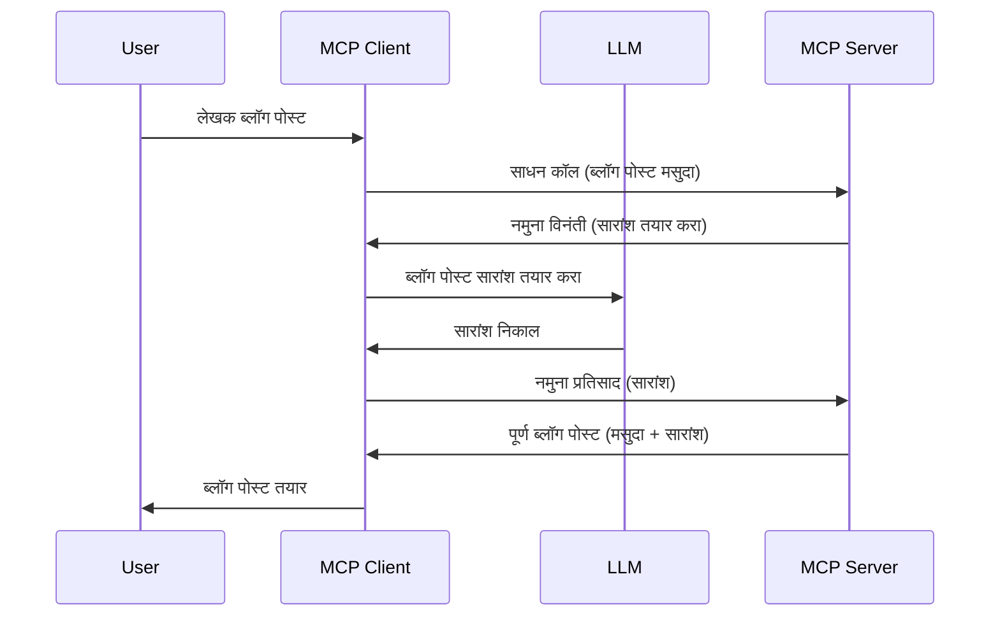

# सॅम्पलिंग - क्लायंटकडे वैशिष्ट्ये प्रतिनिधीत्व करा

> **डिप्रिकेशन सूचना:** `2026-07-28` MCP स्पेसिफिकेशन रिलीज उमेदवार सॅम्पलिंग ला थेट LLM प्रदाता API सह समाकलनासाठी प्रतिबंधित करतो. सॅम्पलिंग `2025-11-25` मध्ये आणि कोणत्याही औपचारिक डिप्रिकेशन नंतर किमान एक वर्षासाठी कार्यरत राहते, त्यामुळे या धड्यातील सर्वकाही वैध आहे — परंतु नव्या सर्व्हर डिझाइन्सने या बदललेल्या पद्धतीचे मूल्यांकन केले पाहिजे. पहा [MCP मध्ये काय बदल होत आहे: 2026-07-28 रिलीज उमेदवार](../../01-CoreConcepts/mcp-2026-07-28-release-candidate.md).

कधी कधी, आपल्याला सामान्य उद्दिष्ट साध्य करण्यासाठी MCP क्लायंट आणि MCP सर्व्हरने सहकार्य करावे लागते. आपल्याला अशी परिस्थिती असू शकते जिथे सर्व्हरला क्लायंटवर असलेल्या LLM ची मदत आवश्यक असते. अश्या परिस्थितीसाठी, सॅम्पलिंग वापरणे योग्य आहे.

चला काही वापर प्रकरणे आणि सॅम्पलिंगचा वापर करून उपाय कसा तयार करावा हे पाहूया.

## आढावा

या धड्यात, आपण सॅम्पलिंग कधी आणि कुठे वापरायचे हे समजून घेऊ आणि त्याची संरचना कशी करायची ते शिकू.

## शिक्षण उद्दिष्टे

या प्रकरणात आपण:

- सॅम्पलिंग काय आहे आणि कधी वापरायचे ते स्पष्ट करू.
- MCP मध्ये सॅम्पलिंग कसे संरचित करायचे ते दाखवू.
- सॅम्पलिंग च्या क्रियेत उदाहरणे देऊ.

## सॅम्पलिंग काय आहे आणि का वापरायचे?

सॅम्पलिंग ही एक प्रगत वैशिष्ट्य आहे जी खालीलप्रमाणे कार्य करते:



### सॅम्पलिंग विनंती

ठीक आहे, आता आपल्याकडे संभाव्य परिस्थितीचा एक उंच-दृष्य आहे, चला सर्व्हर क्लायंटकडे पाठवते ते सॅम्पलिंग विनंती कशी दिसू शकते ते पाहू. JSON-RPC स्वरूपात अशी विनंती कशी दिसते इथे आहे:

```json
{
  "jsonrpc": "2.0",
  "id": 1,
  "method": "sampling/createMessage",
  "params": {
    "messages": [
      {
        "role": "user",
        "content": {
          "type": "text",
          "text": "Create a blog post summary of the following blog post: <BLOG POST>"
        }
      }
    ],
    "modelPreferences": {
      "hints": [
        {
          "name": "claude-3-sonnet"
        }
      ],
      "intelligencePriority": 0.8,
      "speedPriority": 0.5
    },
    "systemPrompt": "You are a helpful assistant.",
    "maxTokens": 100
  }
}
```

येथे काही महत्त्वाच्या गोष्टी लक्षात घेण्याजोग्या आहेत:

- कंटेंट अंतर्गत -> टेक्स्ट, आपली प्रॉम्प्ट आहे जी LLM ला ब्लॉग पोस्ट सामग्रीचा सारांश देण्यासाठी सूचना आहे.

- **modelPreferences**. हा विभाग फक्त एक प्राधान्य आहे, LLM सह कोणती संरचना वापरावी याबाबत शिफारस आहे. वापरकर्ता या शिफारसींसह जाऊ शकतो किंवा त्यांना बदलू शकतो. या प्रकरणात मॉडेल वापरणे आणि गती व बुद्धिमत्ता प्राधान्य शिफारसी आहेत.
- **systemPrompt**, हा आपला सामान्य सिस्टम प्रॉम्प्ट आहे ज्यामुळे आपला LLM ला एक व्यक्तिमत्व मिळते आणि मार्गदर्शन सूचनांचा समावेश असतो.
- **maxTokens**, ही अजून एक संपत्ती आहे जी या कार्यासाठी किती टोकन वापरावीत हे सांगते.

### सॅम्पलिंग प्रतिसाद

हा प्रतिसाद MCP क्लायंटकडून MCP सर्व्हरकडे पाठविला जातो, जो क्लायंट LLM कॉल करतो, त्या प्रतिसादाची वाट पाहतो आणि मग हा संदेश तयार करतो. JSON-RPC मध्ये हा असा दिसू शकतो:

```json
{
  "jsonrpc": "2.0",
  "id": 1,
  "result": {
    "role": "assistant",
    "content": {
      "type": "text",
      "text": "Here's your abstract <ABSTRACT>"
    },
    "model": "gpt-5",
    "stopReason": "endTurn"
  }
}
```

लक्षात घ्या की प्रतिसाद हा ब्लॉग पोस्टचा सारांश आहे जशा आपण मागितले होते तसेच वापरलेले `model` "claude-3-sonnet" वर "gpt-5" आहे. हे दर्शवण्यासाठी आहे की वापरकर्ता काय वापरायचे हे बदलू शकतो आणि आपण पाठवलेली सॅम्पलिंग विनंती एक शिफारस आहे.

ठीक आहे, आता मुख्य प्रवाह आणि उपयुक्त कार्य "ब्लॉग पोस्ट निर्मिती + सारांश" कसा वापरायचा ते समजले, तर त्याला कार्यरत कसे करायचे ते पाहू.

### संदेश प्रकार

सॅम्पलिंग संदेश फक्त टेक्स्टपुरते मर्यादित नाहीत तर आपण प्रतिमा आणि ऑडिओ देखील पाठवू शकता. JSON-RPC कसा वेगळा दिसतो ते येथे आहे:

**टेक्स्ट**

```json
{
  "type": "text",
  "text": "The message content"
}
```

**प्रतिमा सामग्री**

```json
{
  "type": "image",
  "data": "base64-encoded-image-data",
  "mimeType": "image/jpeg"
}
```

**ऑडिओ सामग्री**

```json
{
  "type": "audio",
  "data": "base64-encoded-audio-data",
  "mimeType": "audio/wav"
}
```

> NOTE: सॅम्पलिंग बाबत अधिक सविस्तर माहिती साठी, [अधिकृत दस्तऐवज](https://modelcontextprotocol.io/specification/2025-11-25/client/sampling) पहा

## क्लायंटमध्ये सॅम्पलिंग कसे संरचित करावे

> टीप: आपण फक्त सर्व्हर तयार करत असाल तर येथे जास्त काही करण्याची गरज नाही.

क्लायंटमध्ये, आपल्याला खालील वैशिष्ट्य असे संरचित करावे लागेल:

```json
{
  "capabilities": {
    "sampling": {}
  }
}
```

मग जेव्हा आपला निवडलेला क्लायंट सर्व्हरशी कनेक्ट होईल तेव्हा हे स्वीकारले जाईल.

## सॅम्पलिंग चे उदाहरण - ब्लॉग पोस्ट तयार करा

चला एक सॅम्पलिंग सर्व्हर कोड करूया, आपल्याला हे करावे लागेल:

1. सर्व्हरवर एक टूल तयार करा.
1. त्या टूलने सॅम्पलिंग विनंती तयार केली पाहिजे.
1. टूल क्लायंटच्या सॅम्पलिंग विनंतीचे उत्तर येईपर्यंत वाट पाहा.
1. मग टूल परिणाम तयार केला पाहिजे.

चला चरणांनुसार कोड पाहूया:

### -1- टूल तयार करा

**python**

```python
@mcp.tool()
async def create_blog(title: str, content: str, ctx: Context[ServerSession, None]) -> str:
    """Create a blog post and generate a summary"""

```

### -2- सॅम्पलिंग विनंती तयार करा

खालील कोडसह आपले टूल विस्तृत करा:

**python**

```python
post = BlogPost(
        id=len(posts) + 1,
        title=title,
        content=content,
        abstract=""
    )

prompt = f"Create an abstract of the following blog post: title: {title} and draft: {content} "

result = await ctx.session.create_message(
        messages=[
            SamplingMessage(
                role="user",
                content=TextContent(type="text", text=prompt),
            )
        ],
        max_tokens=100,
)

```

### -3- प्रतिसाद येईपर्यंत प्रतीक्षा करा आणि प्रतिसाद परत करा

**python**

```python
post.abstract = result.content.text

posts.append(post)

# पूर्ण उत्पादन परत करा
return json.dumps({
    "id": post.title,
    "abstract": post.abstract
})
```

### -4- संपूर्ण कोड

**python**

```python
from starlette.applications import Starlette
from starlette.routing import Mount, Host

from mcp.server.fastmcp import Context, FastMCP

from mcp.server.session import ServerSession
from mcp.types import SamplingMessage, TextContent

import json


from uuid import uuid4
from typing import List
from pydantic import BaseModel


mcp = FastMCP("Blog post generator")

# अॅप = FastAPI()

posts = []

class BlogPost(BaseModel):
    id: int
    title: str
    content: str
    abstract: str

posts: List[BlogPost] = []

@mcp.tool()
async def create_blog(title: str, content: str, ctx: Context[ServerSession, None]) -> str:
    """Create a blog post and generate a summary"""

    post = BlogPost(
        id=len(posts) + 1,
        title=title,
        content=content,
        abstract=""
    )

    prompt = f"Create an abstract of the following blog post: title: {title} and draft: {content} "

    result = await ctx.session.create_message(
        messages=[
            SamplingMessage(
                role="user",
                content=TextContent(type="text", text=prompt),
            )
        ],
        max_tokens=100,
    )

    post.abstract = result.content.text

    posts.append(post)

    # संपूर्ण ब्लॉग पोस्ट परत करा
    return json.dumps({
        "id": post.title,
        "abstract": post.abstract
    })

if __name__ == "__main__":
    print("Starting server...")
    # mcp.run()
    mcp.run(transport="streamable-http")

# अॅप चालवा: python server.py
```

### -5- Visual Studio Code मध्ये परीक्षण

Visual Studio Code मध्ये याचा परीक्षण करण्यासाठी, हे करा:

1. टर्मिनलमध्ये सर्व्हर सुरू करा
1. *mcp.json* मध्ये हे जोडा (आणि ते सुरू असल्याची खात्री करा) काही असे:

   ```json
   "servers": {
      "blog-server": {
        "type": "http",
        "url": "http://localhost:8000/mcp"
      }
   }
   ```

1. एक प्रॉम्प्ट टाइप करा:

   ```text
   create a blog post named "Where Python comes from", the content is "Python is actually named after Monty Python Flying Circus"
   ```

1. सॅम्पलिंग होऊ द्या. प्रथम वेळी जेव्हा आपण हे तपासाल तेव्हा आपल्याला एक अतिरिक्त संवाद दिसेल जो मान्य करावा लागेल, नंतर आपल्याला टूल चालवण्याचा सामान्य संवाद दिसेल

1. परिणाम तपासा. आपण निकाल GitHub Copilot Chat मध्ये नीट रेंडर केलेले तसेच कच्च्या JSON प्रतिसादामध्ये देखील पाहू शकता.

**बोनस**. Visual Studio Code टूलिंग सॅम्पलिंगसाठी छान समर्थन देतो. आपण स्थापित केलेल्या सर्व्हरवर सॅम्पलिंग प्रवेश संरचीत करू शकता अशा प्रकारे:

1. विस्तार विभागाकडे जा.
1. "MCP SERVERS - INSTALLED" विभागात आपल्या स्थापित सर्व्हरवरील गियर आयकॉन निवडा.
1 "Configure Model Access" निवडा, येथे आपण निवडू शकता की जेव्हा GitHub Copilot सॅम्पलिंग करत आहे तेव्हा कोणते मॉडेल वापरू शकते. "Show Sampling requests" निवडून अलीकडील सगळ्या सॅम्पलिंग विनंत्या देखील पाहू शकता.

## असाइनमेंट

या असाइनमेंटमध्ये, आपण थोडे वेगळे सॅम्पलिंग तयार कराल म्हणजेच एक सॅम्पलिंग समाकलन ज्याद्वारे उत्पादन वर्णन तयार करता येईल. खाली आपली परिस्थिती आहे:

**परिस्थिती**: ई-कॉमर्समधील बॅक ऑफिस कामगाराला मदत हवी आहे, उत्पादन वर्णने तयार करण्यास खूप वेळ जातो. त्यामुळे आपण असे एक उपाय तयार करणार आहात जिथे आपण "title" आणि "keywords" हा आर्ग्युमेंट्स घेणारा "create_product" टूल कॉल करू शकता आणि ते पूर्ण उत्पादन तयार करेल ज्यामध्ये "description" क्षेत्रही असावे जे क्लायंटच्या LLM ने भरले जाईल.

टीप: जे काही आपण यापूर्वी शिकलात ते वापरून हा सर्व्हर आणि त्याचा टूल सॅम्पलिंग विनंतीने तयार करा.

## उपाय

[उपाय](./solution/README.md)

## मुख्य मुद्दे

सॅम्पलिंग हे एक सामर्थ्यशाली वैशिष्ट्य आहे जे सर्व्हरला आवश्यक असल्यास क्लायंटकडे LLM मदतीसाठी कार्ये प्रतिनिधीत्व करण्याची परवानगी देते.

## पुढे काय

- [प्रकरण 4 - व्यावहारिक अंमलबजावणी](../../04-PracticalImplementation/README.md)

---

<!-- CO-OP TRANSLATOR DISCLAIMER START -->
**अस्वीकरण**:
हा दस्तऐवज AI भाषांतर सेवा [Co-op Translator](https://github.com/Azure/co-op-translator) चा वापर करून अनुवादित केला आहे. जरी आम्ही अचूकतेसाठी प्रयत्न करतो, तरी कृपया लक्षात घ्या की स्वयंचलित भाषांतरांमध्ये त्रुटी किंवा अचूकतेची कमतरता असू शकते. मूळ दस्तऐवज त्याच्या मूळ भाषेत अधिकृत स्रोत मानला पाहिजे. महत्त्वाची माहिती असल्यास, व्यावसायिक मानवी भाषांतराची शिफारस केली जाते. या भाषांतराच्या वापरामुळे उद्भवणाऱ्या कोणत्याही गैरसमज किंवा चुकीच्या अर्थलावणीसाठी आम्ही जबाबदार नाही.
<!-- CO-OP TRANSLATOR DISCLAIMER END -->