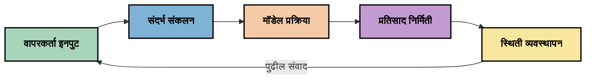
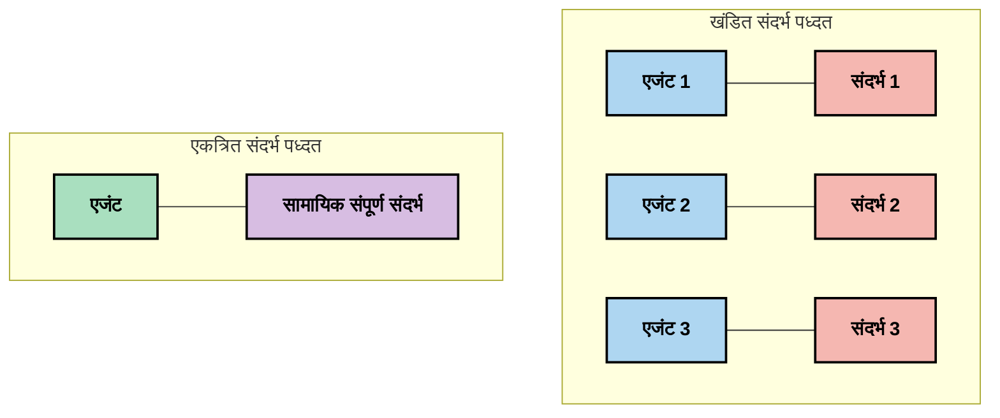
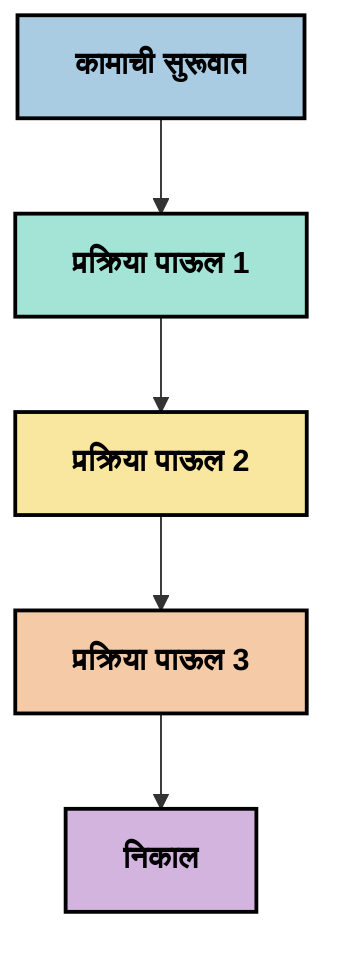
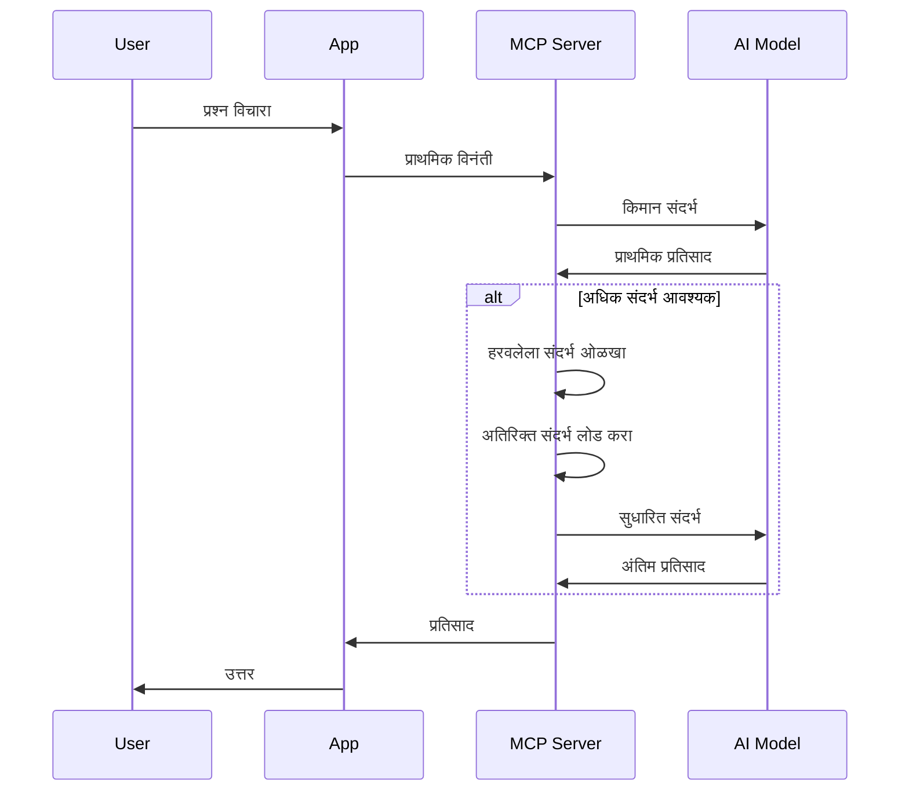
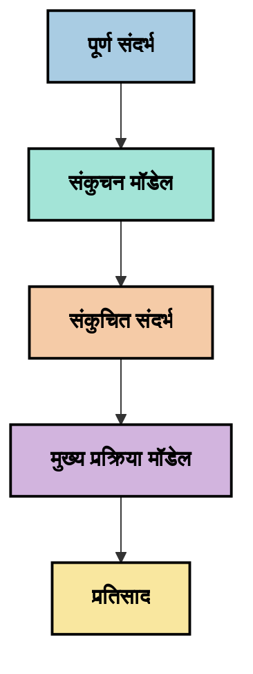
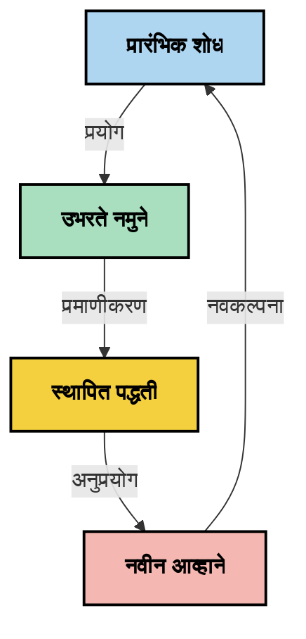

# संदर्भ अभियांत्रिकी: एमसीपी परिसंस्थेमध्ये एक उदयोन्मुख संकल्पना

## आढावा

संदर्भ अभियांत्रिकी ही एआय क्षेत्रातील एक उदयोन्मुख संकल्पना आहे जी ग्राहक आणि एआय सेवांमधील संवादादरम्यान माहिती कशी रचना केली जाते, वितरीत केली जाते आणि राखली जाते याचा शोध घेते. मॉडेल संदर्भ प्रोटोकॉल (एमसीपी) परिसंस्था विकसित होत असताना, संदर्भ प्रभावीपणे कसा व्यवस्थापित करायचा हे समजून घेणे अधिक महत्वाचे होते आहे. हा विभाग संदर्भ अभियांत्रिकीची संकल्पना परिचित करतो आणि एमसीपी अंमलबजावणींमध्ये त्याच्या संभाव्य उपयोगांचा शोध घेतो.

## शिक्षण उद्दिष्टे

या विभागाच्या शेवटी, तुम्ही खालील गोष्टी करण्यास सक्षम असाल:

- संदर्भ अभियांत्रिकीची उदयोन्मुख संकल्पना आणि एमसीपी अनुप्रयोगांमध्ये त्याची संभाव्य भूमिका समजून घ्या
- संदर्भ व्यवस्थापनातील मुख्य आव्हाने ओळखा ज्यावर एमसीपी प्रोटोकॉल डिझाइन मार्गदर्शन करते
- चांगल्या संदर्भ हाताळणीद्वारे मॉडेल कामगिरी सुधारण्यासाठी तंत्रे तपासा
- संदर्भाच्या कार्यक्षमतेचे मोजमाप आणि मूल्यांकन करण्याचे पर्याय विचारात घ्या
- एमसीपी चौकटीतून एआय अनुभव सुधारण्यासाठी या उदयोन्मुख संकल्पनांचा वापर करा

## संदर्भ अभियांत्रिकीपरिचय

संदर्भ अभियांत्रिकी ही एका उदयोन्मुख संकल्पनेवर आधारित आहे जिला वापरकर्ते, अनुप्रयोग आणि एआय मॉडेल्स यांच्यातील माहिती प्रवाह यांच्या जबाबदारीपूर्वक डिझाइन आणि व्यवस्थापनावर लक्ष केंद्रित केले जाते. प्रॉम्प्ट अभियांत्रिकीसारख्या स्थापन झालेल्या क्षेत्रांपेक्षा वेगळी, संदर्भ अभियांत्रिकी अजूनही व्यावसायिकांद्वारे निश्चित केली जात आहे जी एआय मॉडेल्सना योग्य वेळी योग्य माहिती पुरवण्याच्या अनोख्या आव्हानांची सोडवणूक करत आहेत.

मोठ्या भाषा मॉडेल्स (एलएलएम) विकसित झाल्याने, संदर्भाची महत्त्वपूर्णता अधिक स्पष्ट झाली आहे. दिलेल्या संदर्भाचा दर्जा, संबंधितता आणि रचना थेट मॉडेल आउटपुटवर प्रभाव टाकतात. संदर्भ अभियांत्रिकी या संबंधाचा अभ्यास करते आणि प्रभावी संदर्भ व्यवस्थापनासाठी तत्त्वे विकसित करण्याचा प्रयत्न करते.

> " वर्ष 2025 मध्ये, उपलब्ध मॉडेल्स अत्यंत बुद्धिमान आहेत. पण सर्वात हुशार माणूस देखील त्यांना काय करायचे आहे याचा संदर्भ न मिळाल्यास त्यांचे काम प्रभावीपणे करू शकणार नाही ... 'संदर्भ अभियांत्रिकी' ही प्रॉम्प्ट अभियांत्रिकीची पुढील पायरी आहे. ही एक गतिशील प्रणालीत स्वयंचलितपणे ही प्रक्रिया करणे आहे." — वॉल्डेन यान, कग्निशन एआय

संदर्भ अभियांत्रिकीमध्ये हे समाविष्ट असू शकते:

1. **संदर्भ निवड**: कोणती माहिती दिलेल्या कार्यासाठी संबंधित आहे हे ठरवणे
2. **संदर्भ रचना**: मॉडेलच्या समजुतीसाठी माहितीचे आयोजन करणे
3. **संदर्भ वितरण**: माहिती मॉडेल्सना कशी आणि केव्हा पाठवायची याचे ऑप्टिमायझेशन करणे
4. **संदर्भ देखभाल**: वेळोवेळी संदर्भाची स्थिती आणि विकास व्यवस्थापित करणे
5. **संदर्भ मूल्यांकन**: संदर्भाच्या कार्यक्षमतेचे मोजमाप आणि सुधारणा करणे

ही लक्षवेधी क्षेत्रे विशेषतः एमसीपी परिसंस्थेसाठी संबंधित आहेत, जी अनुप्रयोगांना एलएलएमना संदर्भ प्रदान करण्याचा एक प्रमाणित मार्ग देते.


## संदर्भ प्रवास दृष्टीकोन

संदर्भ अभियांत्रिकीचे एक दृष्टीकोन म्हणजे एमसीपी प्रणालीमधून माहिती कोणत्या प्रवासात जाते हे पहाणे:



### संदर्भ प्रवासातील मुख्य टप्पे:

1. **वापरकर्ता इनपुट**: वापरकर्त्यांकडून कच्ची माहिती (मजकूर, प्रतिमा, दस्ताऐवज)
2. **संदर्भ संकलन**: वापरकर्ता इनपुट, प्रणाली संदर्भ, संभाषण इतिहास आणि इतर प्राप्त माहिती एकत्र करणे
3. **मॉडेल प्रक्रिया**: एआय मॉडेल संकलित संदर्भ प्रक्रिया करते
4. **प्रतिसाद निर्मिती**: मॉडेल दिलेल्या संदर्भावर आधारित आउटपुट तयार करते
5. **स्थिती व्यवस्थापन**: संवादाद्वारे प्रणालीची अंतर्गत स्थिती अद्ययावत करते

हा दृष्टीकोन एआय प्रणालीतील संदर्भाच्या गतिशील नैसर्गिकतेवर प्रकाश टाकतो आणि प्रत्येक टप्प्यावर माहिती कशी प्रभावीपणे व्यवस्थापित करायची याबाबत महत्त्वाचे प्रश्न उपस्थित करतो.

## संदर्भ अभियांत्रिकीतील उदयोन्मुख तत्त्वे

संदर्भ अभियांत्रिकी क्षेत्र विकसित होत असताना, काही सुरुवातीच्या तत्त्वांची व्यावसायिकांकडून मांडणी होऊ लागली आहे. ही तत्त्वे एमसीपी अंमलबजावणीच्या निवडींमध्ये मदत करू शकतात:

### तत्त्व 1: संदर्भ पूर्णपणे शेअर करा

संदर्भ कोणत्याही प्रणालीच्या सर्व घटकांमध्ये संपूर्णपणे सामायिक केला पाहिजे, अनेक एजंट किंवा प्रक्रियांमध्ये तुटलेला नाही. जेव्हा संदर्भ वितरित केला जातो, तेव्हा प्रणालीच्या एका भागात घेतलेले निर्णय इतरत्र घेतलेल्या निर्णयांशी विरोध करू शकतात.



एमसीपी अनुप्रयोगांमध्ये, याचा अर्थ असा आहे की संदर्भ संपूर्ण पाईपलाइनमध्ये सहजगत्या वाहावा, वेगळा विभाग केला जाऊ नये.

### तत्त्व 2: कृतींमध्ये अंतर्निहित निर्णय असतात हे ओळखा

प्रत्येक कृतीत संदर्भ कसा समजून घ्यायचा याबाबत अंतर्निहित निर्णय नसतात. जेव्हा विविध घटक वेगवेगळ्या संदर्भांवर कार्य करतात, तेव्हा हे अंतर्निहित निर्णय विरोध करु शकतात, जो असुसंगत परिणामांपर्यंत नेतात.

या तत्त्वाचे एमसीपी अनुप्रयोगांसाठी महत्त्वाचे परिणाम आहेत:
- एकाच वेळेस तुटलेला संदर्भ वापरण्यापेक्षा जटिल कार्यांची रेषीय प्रक्रिया पसंत करा
- वस्तुनिष्ठ माहिती सर्व निर्णय बिंदूंना उपलब्ध असावी याची खात्री करा
- अशी प्रणाली डिझाइन करा ज्यात नंतरचे टप्पे पूर्वीच्या निर्णयांचा पूर्ण संदर्भ पाहू शकतील

### तत्त्व 3: संदर्भ खोलीचा विंडो मर्यादांसह संतुलन ठेवा

संभाषणे आणि प्रक्रिया जितक्या जास्त वाढतात, संदर्भ विंडो पूर्णपणे ओलांडतात. प्रभावी संदर्भ अभियांत्रिकी या साखळीतील समग्र संदर्भ आणि तांत्रिक मर्यादांमधील संघर्ष सांभाळण्याच्या पद्धती शोधते.

शोधनशील पद्धतींमध्ये समाविष्ट आहे:
- संदर्भ संपीडन जे आवश्यक माहिती राखून टोकन वापर कमी करते
- चालू गरजेनुसार संदर्भ प्रगतीशीलपणे लोड करणे
- महत्त्वाच्या निर्णयांची आणि तथ्यांची राखण करत आधीच्या संवादाचा सारांश तयार करणे

## संदर्भ आव्हाने आणि एमसीपी प्रोटोकॉल डिझाइन

मॉडेल संदर्भ प्रोटोकॉल (एमसीपी) संदर्भ व्यवस्थापनाच्या अनोख्या आव्हानांविषयी विचार करून डिझाइन केला गेला आहे. या आव्हानांची समज एमसीपी प्रोटोकॉल डिझाइनसाठी महत्त्वाच्या मुद्द्यांची स्पष्टीकरण करते:


### आव्हान 1: संदर्भ विंडो मर्यादा
प्रसंगी, अनेक एआय मॉडेल्सना निश्चित संदर्भ विंडो साइज असतात, त्यामुळे ते बऱ्याच माहितीला एकाच वेळी प्रक्रिया करू शकत नाहीत.

**एमसीपी डिझाइन प्रतिसाद:** 
- प्रोटोकॉल संरचित, संसाधन-आधारित संदर्भासाठी समर्थन देतो जे कार्यक्षम रीतीने संदर्भित केला जाऊ शकतो
- संसाधने पृष्ठीकरण केले जाऊ शकतात आणि प्रगतीशीलपणे लोड केली जाऊ शकतात

### आव्हान 2: संबंधितता निर्धारण
संदर्भात कोणती माहिती सर्वात संबंधित आहे हे ठरवणे कठीण आहे.

**एमसीपी डिझाइन प्रतिसाद:**
- लवचिक उपकरणे गरजेनुसार माहिती गतिशीलपणे प्राप्त करण्यास सक्षम करतात
- संरचित प्रॉम्प्टस संदर्भ विश्वसनीयपणे संघटित करतात

### आव्हान 3: संदर्भ टिकवणूक
संवादांमध्ये स्थिती व्यवस्थापित करणे म्हणजे संदर्भाचा काळजीपूर्वक मागोवा घेणे आवश्यक आहे.

**एमसीपी डिझाइन प्रतिसाद:**
- प्रमाणित सत्र व्यवस्थापन
- संदर्भ विकासासाठी स्पष्ट संवाद नमुने

### आव्हान 4: बहु-मिनिमली संदर्भ
वेगवेगळ्या प्रकारच्या डेटांसाठी (मजकूर, प्रतिमा, संरचित माहिती) वेगळ्या हाताळणीची गरज आहे.

**एमसीपी डिझाइन प्रतिसाद:**
- प्रोटोकॉल डिझाइन विविध सामग्री प्रकारांना समाविष्ट करते
- बहु-मोडल माहितीचे प्रमाणित सादरीकरण

### आव्हान 5: सुरक्षा आणि गोपनीयता
संदर्भामध्ये अनेकदा संवेदनशील माहिती असते जी सुरक्षित ठेवली पाहिजे.

**एमसीपी डिझाइन प्रतिसाद:**
- क्लायंट आणि सर्व्हर जबाबदाऱ्यांमधील स्पष्ट सीमे
- डेटा उघडकी कमी करण्यासाठी स्थानिक प्रक्रिया पर्याय

या आव्हानांची समज आणि एमसीपी त्यांना कसे संबोधित करतो हे अधिक प्रगत संदर्भ अभियांत्रिकी तंत्रांचा संशोधनासाठी पाया तयार करते.

## उदयोन्मुख संदर्भ अभियांत्रिकी पद्धती

संदर्भ अभियांत्रिकी क्षेत्र विकसित होत असताना, काही आशादायक पद्धती उदयास आल्या आहेत. या पद्धती सध्याच्या विचारांचे प्रतिनिधित्व करतात, स्थापन झालेली सर्वोत्तम प्रथा नाहीत आणि अनुभव वाढल्याने विकास अपेक्षित आहे.

### 1. एकसंध रेषीय प्रक्रिया

संदर्भ वितरित करणाऱ्या मल्टी-एजंट संरचनांच्या तुलनेत, काही व्यावसायिकांना आढळले आहे की एकसंध रेषीय प्रक्रिया अधिक स्थिर परिणाम देते. हे एकत्रित संदर्भ राखण्याच्या तत्त्वाशी जुळते.



या पद्धतीद्वारे कदाचित एकत्रित प्रक्रियेपेक्षा कमी कार्यक्षम वाटू शकते, पण प्रत्येक टप्पा पूर्वीच्या निर्णयांच्या पूर्ण समजुतीवर आधारित असल्याने अधिक सुसंगत आणि विश्वासार्ह परिणाम देते.

### 2. संदर्भ तुकडे करणे आणि प्राधान्यक्रम ठरवणे

मोठ्या संदर्भांना व्यवस्थापनक्षम तुकड्यात विभागणे आणि सर्वाधिक महत्त्वाच्या गोष्टींना प्राधान्य देणे.

```python
# संकल्पनात्मक उदाहरण: संदर्भ चंकिंग आणि प्राधान्यक्रम
def process_with_chunked_context(documents, query):
    # 1. दस्तऐवजांना लहान चंक मध्ये विभागा
    chunks = chunk_documents(documents)
    
    # 2. प्रत्येक चंकसाठी सापेक्षता गुणांकन करा
    scored_chunks = [(chunk, calculate_relevance(chunk, query)) for chunk in chunks]
    
    # 3. सापेक्षता गुणांकनानुसार चंक क्रमवारी लावा
    sorted_chunks = sorted(scored_chunks, key=lambda x: x[1], reverse=True)
    
    # 4. सर्वात संबंधित चंक संदर्भ म्हणून वापरा
    context = create_context_from_chunks([chunk for chunk, score in sorted_chunks[:5]])
    
    # 5. प्राधान्यक्रमित संदर्भासह प्रक्रिया करा
    return generate_response(context, query)
```

वरील कल्पना मोठे दस्तऐवज व्यवस्थापनक्षम तुकड्यात विभागून संदर्भासाठी केवळ सर्वाधिक संबंधित भाग निवडण्याची कशी शक्यता असू शकते हे दाखवते. हि पद्धत संदर्भ विंडोच्या मर्यादेत कार्य करण्यास मदत करू शकते आणि मोठ्या ज्ञान स्रोतांचा वापर करु शकते.

### 3. प्रगतीशील संदर्भ लोडिंग

सगळे संदर्भ एकाच वेळी लोड करण्याऐवजी गरजेनुसार प्रगतीशीलपणे लोड करणे.



प्रगतीशील संदर्भ लोडिंग आवश्यकतांनुसार किमान संदर्भाने सुरू होते आणि आवश्यकतेनुसार विस्तारते. हे सोप्या प्रश्नांसाठी टोकन वापर फार कमी करते आणि क्लिष्ट प्रश्नांची हाताळणी करण्याची क्षमता राखते.

### 4. संदर्भ संपीडन आणि सारांश

आवश्यक माहिती राखून संदर्भ आकार कमी करणे.



संदर्भ संपीडनावर लक्ष केंद्रित करते:
- पुनरावृत्ती माहिती काढून टाकणे
- लांब सामग्रीचे सारांश तयार करणे
- मुख्य तथ्ये आणि तपशील काढून घेणे
- महत्वाचा संदर्भ घटक राखणे
- टोकन कार्यक्षमता साठी ऑप्टिमायझेशन करणे

ही पद्धत संदर्भ विंडोमधील दीर्घ संभाषण टिकवण्यासाठी किंवा मोठ्या दस्तऐवज प्रक्रिया करण्यासाठी विशेषतः उपयुक्त ठरू शकते. काही व्यावसायिक विशेषतः संभाषण इतिहासाचा संदर्भ संपीडन आणि सारांशासाठी विशिष्ट मॉडेल्स वापरत आहेत.


## संदर्भ अभियांत्रिकी संदर्भातील अन्वेषणीय बाबी

संदर्भ अभियांत्रिकीच्या उदयोन्मुख क्षेत्राचा अन्वेषण करताना, एमसीपी अंमलबजावणींसह काम करताना लक्षात ठेवण्यासारख्या काही बाबी आहेत. या नियम नाहीत परंतु तुमच्या विशिष्ट वापर केसमध्ये सुधारणा देणाऱ्या अन्वेषण क्षेत्र आहेत.

### तुमचे संदर्भ उद्दिष्टे तपासा

जटिल संदर्भ व्यवस्थापन उपाय अंमलात आणण्यापूर्वी, स्पष्टपणे सांगा की तुम्हाला काय साध्य करायचे आहे:
- मॉडेल यशस्वी होण्यासाठी कोणती विशिष्ट माहिती आवश्यक आहे?
- कोणती माहिती आवश्यक आहे आणि कोणती सहायक?
- तुमच्या कार्यक्षमता मर्यादा काय आहेत (प्रतिक्रिया वेळ, टोकन मर्यादा, खर्च)?

### स्तरित संदर्भ पद्धतींवर लक्ष ठेवा

काही व्यावसायिक संकल्पनात्मक स्तरांमध्ये व्यवस्था केलेल्या संदर्भाबाबत यशस्वी होतात:
- **मुख्य स्तर**: मॉडेलला नेहमी लागणारी आवश्यक माहिती
- **परिस्थितिजन्य स्तर**: चालू संवादासाठी संदर्भ विशिष्ट
- **समर्थन स्तर**: सहाय्यक माहिती जी उपयुक्त ठरू शकते
- **अर्थसंकल्प स्तर**: फक्त गरजेनुसार प्रवेश केली जाणारी माहिती

### प्राप्ती धोरणांचा अभ्यास करा

संदर्भाची कार्यक्षमता कशी आहे हे तुम्ही माहिती कशी मिळवता यावर अवलंबून असते:
- संकल्पनात्मकदृष्ट्या संबंधित माहिती शोधण्यासाठी सेमॅंटिक शोध आणि एम्बेडिंग्ज
- विशिष्ट तथ्यांवर आधारित कीवर्ड-आधारित शोध
- एकाधिक प्राप्ती पद्धती एकत्र करणार्या संमिश्र पद्धती
- श्रेणी, तारीख किंवा स्रोतांनुसार कक्षा कमी करण्यासाठी मेटाडेटा फिल्टरिंग

### संदर्भ सुसंगतीसह प्रयोग करा

संदर्भाचा रचना आणि प्रवाह मॉडेल समजुतीवर परिणाम करू शकतो:
- संबंधित माहिती एकत्र गटबद्ध करणे
- सुसंगत फॉरमॅटिंग आणि आयोजन वापरणे
- लागू असल्यास लॉजिक किंवा कालक्रमानुसार क्रमवार ठेवणे
- विरोधाभासी माहिती टाळणे

### मल्टी-एजंट संरचना यांच्या व्यापार समतोलांचे वजन करा

अनेक एआय चौकटींमध्ये मल्टी-एजंट आर्किटेक्चर लोकप्रिय आहेत, पण ते संदर्भ व्यवस्थापनासाठी सखोल आव्हाने आणतात:
- संदर्भ तुटणे एजंट्समध्ये असुसंगत निर्णयांना कारणीभूत ठरू शकते
- समांतर प्रक्रिया करणे मतभेद निर्माण करू शकतात जे संमिश्र करणे कठीण आहे
- एजंट्समधील संवाद खर्चामुळे कार्यक्षमतेचे फायदे कमी होऊ शकतात
- सुसंगती राखण्यासाठी जटिल स्थिती व्यवस्थापन आवश्यक आहे

अनेक प्रकरणांत, व्यापक संदर्भ व्यवस्थापनासह एकल-एजंट पद्धत तुटलेल्या संदर्भ असलेल्या अनेक विशेष एजंट्सच्या तुलनेत अधिक विश्वासार्ह परिणाम देऊ शकते.

### मूल्यांकन पद्धती विकसित करा

संदर्भ अभियांत्रिकी सुधारण्यासाठी, यश कसे मोजाल हे विचार करा:
- विविध संदर्भ संरचना A/B चाचणी करा
- टोकन वापर आणि प्रतिसाद वेळेचे निरीक्षण करा
- वापरकर्ता समाधानीपणा आणि कार्य पूर्णतेच्या दरांची नोंद ठेवा
- संदर्भ धोरणे का आणि केव्हा अयशस्वी होतात त्याचे विश्लेषण करा

हे विचार संदर्भ अभियांत्रिकी क्षेत्रातील सक्रिय अन्वेषण क्षेत्राचे प्रतिनिधित्व करतात. क्षेत्र प्रौढ होत असतानाच अधिक ठोस नमुने आणि पद्धती उदयास येतील.

## संदर्भ कार्यक्षमतेचे मोजमाप: एक विकसित होत असलेले चौकट

संदर्भ अभियांत्रिकी ही संकल्पना म्हणून उदयास आल्यानंतर व्यावसायिक संदर्भ कार्यक्षमतेचे मोजमाप कसे करावे याचा शोध घेत आहेत. स्थापन झालेले चौकट नाही, पण विविध मेट्रिक्स विचारले जात आहेत जे भविष्यातील कामासाठी मार्गदर्शन करू शकतात.

### संभाव्य मोजमाप परिमाणे


#### 1. इनपुट कार्यक्षमता विचार

- **संदर्भ-प्रतिसाद अनुपात**: प्रतिसादाच्या आकाराच्या तुलनेत किती संदर्भ आवश्यक आहे?
- **टोकन वापर**: दिलेल्या संदर्भ टोकनचा किती टक्के प्रतिसादावर परिणाम करतो?
- **संदर्भ कमी करणे**: कच्ची माहिती कितपत प्रभावीपणे संपीडन केली जाऊ शकते?

#### 2. कामगिरी विचार

- **प्रतिक्रिया वेळेवर परिणाम**: संदर्भ व्यवस्थापन प्रतिसाद वेळेवर कसा परिणाम करतो?
- **टोकन अर्थव्यवस्था**: आम्ही टोकन वापर प्रभावीपणे ऑप्टिमाइझ करतोय का?
- **मागणीची अचूकता**: प्राप्त केलेली माहिती कितपत संबंधित आहे?
- **संसाधन वापर**: कोणते संगणकीय संसाधने आवश्यक आहेत?

#### 3. गुणवत्ता विचार

- **प्रतिक्रिया संबंधितता**: प्रतिसाद प्रश्नाला कितपत सूटतो?
- **तथ्यात्मक अचूकता**: संदर्भ व्यवस्थापनाने तथ्यात्मक अचूकता वाढवते का?
- **सुसंगती**: समान प्रश्नांसाठी प्रतिसाद सुसंगत आहेत का?
- **तर्कभ्रंश दर**: चांगल्या संदर्भामुळे मॉडेल तर्कभ्रंश कमी होतात का?

#### 4. वापरकर्ता अनुभव विचार

- **फॉलो-अप दर**: वापरकर्त्यांना किती वेळा स्पष्टता हवी असते?
- **कार्य पूर्णता**: वापरकर्ते त्यांचे उद्दिष्ट यशस्वीरीत्या साध्य करतात का?
- **समाधान निर्देशांक**: वापरकर्ते त्यांचा अनुभव कसा मोजतात?

### मोजमापासाठी अन्वेषणीय पद्धती

एमसीपी अंमलबजावणींमध्ये संदर्भ अभियांत्रिकीचा प्रयोग करताना, हे अन्वेषणीय पद्धती विचार करा:

1. **मूलभूत तुलना**: अधिक जटिल पद्धती तपासण्यापूर्वी सोप्या संदर्भ पद्धतींसह मूळ तुलना करा

2. **आंशिक बदल**: संदर्भ व्यवस्थापनाच्या एका पैलूचा प्रभाव वेगळ्याने तपासा

3. **वापरकर्ता-केंद्रित मूल्यांकन**: परिमाणात्मक मेट्रिक्सला गुणात्मक वापरकर्ता अभिप्राय सह संयोजित करा

4. **अपयश विश्लेषण**: संदर्भ धोरणे का अयशस्वी ठरतात याची तपासणी करा ज्याने संभाव्य सुधारणा समजतील

5. **बहुप्रवलीय मूल्यमापन**: कार्यक्षमता, गुणवत्ता आणि वापरकर्ता अनुभव यामध्ये व्यापार समतोल विचार करा

मापनासाठी हा प्रयोगशील, बहुआयामी दृष्टिकोन संदर्भ अभियांत्रिकीच्या उदयोन्मुख स्वरूपाशी जुळतो.

## शेवटचे विचार

संदर्भ अभियांत्रिकी ही एक उदयोन्मुख अन्वेषण क्षेत्र आहे जी प्रभावी एमसीपी अनुप्रयोगांसाठी केंद्रस्थानी ठरू शकते. तुमच्या प्रणालीमध्ये माहिती कशी वाहते याचा विचार करून, तुम्ही अधिक कार्यक्षम, अचूक आणि वापरकर्त्यांसाठी मौल्यवान एआय अनुभव निर्माण करू शकता.

या विभागात मांडलेले तंत्र आणि पद्धती या क्षेत्रातील सुरुवातीच्या विचारांचे प्रतिनिधित्व करतात, स्थापन प्रथा नव्हेत. एआय क्षमता विकसित होत राहिल्या आणि आपली समज खोलावत गेल्या, संदर्भ अभियांत्रिकी अधिक निश्चित विषय बनू शकते. सध्या, प्रयोग आणि काळजीपूर्वक मापन एकत्रित करणे सर्वात उत्पादक दृष्टिकोन वाटते.

## संभाव्य भविष्यातील दिशा

संदर्भ अभियांत्रिकी क्षेत्र अजून सुरुवातीच्या टप्प्यात आहे, पण काही आशादायक दिशा उदयास येत आहेत:

- संदर्भ अभियांत्रिकी तत्त्वांमुळे मॉडेल कार्यक्षमता, कार्यक्षमता, वापरकर्ता अनुभव आणि विश्वासार्हतेवर महत्त्वाचा परिणाम होऊ शकतो
- सर्वसमावेशक संदर्भ व्यवस्थापनासह एकसंध पद्धती अनेक वापर केसांसाठी बहु-एजंट संरचनांपेक्षा चांगले काम करू शकतात
- विशेष संदर्भ संपीडन मॉडेल्स एआय पाईपलाइन्समध्ये मानक घटक बनू शकतात
- संदर्भ पूर्णते आणि टोकन मर्यादेतील संघर्ष संदर्भ हाताळणीतील नवप्रवर्तनाला चालना देईल
- जेव्हा मॉडेल्स अधिक कार्यक्षम मानव-समान संवादात सक्षम होतील, तेव्हा खरा मल्टी-एजंट सहकार्य अधिक व्यवहार्य होईल
- एमसीपी अंमलबजावण्या सध्या प्रयोगातून निर्माण झालेल्या संदर्भ व्यवस्थापन नमुन्यांना प्रमाणित करण्यासाठी विकसित होऊ शकतात



## साधने

### अधिकृत एमसीपी साधने
- [Model Context Protocol Website](https://modelcontextprotocol.io/)
- [Model Context Protocol Specification](https://github.com/modelcontextprotocol/modelcontextprotocol)

- [MCP दस्तऐवजीकरण](https://modelcontextprotocol.io/docs)
- [MCP C# SDK](https://github.com/modelcontextprotocol/csharp-sdk)
- [MCP Python SDK](https://github.com/modelcontextprotocol/python-sdk)
- [MCP TypeScript SDK](https://github.com/modelcontextprotocol/typescript-sdk)
- [MCP निरीक्षक](https://github.com/modelcontextprotocol/inspector) - MCP सर्व्हरसाठी व्हिज्युअल चाचणी साधन

### संदर्भ अभियांत्रिकी लेख
- [मल्टी-एजंट तयार करू नका: संदर्भ अभियांत्रिकीच्या तत्त्वांवर](https://cognition.ai/blog/dont-build-multi-agents) - संदर्भ अभियांत्रिकी तत्त्वांवर वाल्डन यानचे अंतर्दृष्टी
- [एजंट तयार करण्यासाठी व्यावहारिक मार्गदर्शक](https://cdn.openai.com/business-guides-and-resources/a-practical-guide-to-building-agents.pdf) - प्रभावी एजंट डिझाइनसाठी OpenAI चे मार्गदर्शन
- [प्रभावी एजंट तयार करणे](https://www.anthropic.com/engineering/building-effective-agents) - एजंट विकासासाठी Anthropic चा दृष्टिकोन

### संबंधित संशोधन
- [मोठ्या भाषा मॉडेलसाठी डायनॅमिक पुनर्प्राप्ती वाढ](https://arxiv.org/abs/2310.01487) - डायनॅमिक पुनर्प्राप्ती पद्धतींवरील संशोधन
- [मध्यभागी हरवले: भाषा मॉडेल्स लांब संदर्भ कसे वापरतात](https://arxiv.org/abs/2307.03172) - संदर्भ प्रक्रिया पद्धतीवर महत्त्वाचे संशोधन
- [CLIP लेटेंट्स सह श्रेणीबद्ध मजकूर-आधारित प्रतिमा निर्मिती](https://arxiv.org/abs/2204.06125) - DALL-E 2 पेपर संदर्भ रचनेवर अंतर्दृष्टीसह
- [मोठ्या भाषा मॉडेल आर्किटेक्चरमध्ये संदर्भाचा भूमिका एक्सप्लोर करणे](https://aclanthology.org/2023.findings-emnlp.124/) - संदर्भ हाताळणीवर अलीकडील संशोधन
- [मल्टी-एजंट सहकार्य: एक सर्वेक्षण](https://arxiv.org/abs/2304.03442) - मल्टी-एजंट प्रणाली व त्यांच्या आव्हानांवर संशोधन

### अतिरिक्त स्रोत
- [संदर्भ विंडो ऑप्टिमायझेशन तंत्र](https://learn.microsoft.com/en-us/azure/ai-services/openai/concepts/context-window)
- [उन्नत RAG तंत्रे](https://www.microsoft.com/en-us/research/blog/retrieval-augmented-generation-rag-and-frontier-models/)
- [सिमँटिक कर्नेल दस्तऐवजीकरण](https://github.com/microsoft/semantic-kernel)
- [संदर्भ व्यवस्थापनासाठी AI उपकरणसेट](https://github.com/microsoft/aitoolkit)

## पुढे काय

- [5.15 MCP कस्टम ट्रान्सपोर्ट](../mcp-transport/README.md)

---

<!-- CO-OP TRANSLATOR DISCLAIMER START -->
**अस्वीकरण**:
हा दस्तऐवज AI भाषांतर सेवा [Co-op Translator](https://github.com/Azure/co-op-translator) चा वापर करून अनुवादित केला आहे. जरी आम्ही अचूकतेसाठी प्रयत्न करतो, तरी कृपया लक्षात घ्या की स्वयंचलित भाषांतरांमध्ये त्रुटी किंवा अचूकतेची कमतरता असू शकते. मूळ दस्तऐवज त्याच्या मूळ भाषेत अधिकृत स्रोत मानला पाहिजे. महत्त्वाची माहिती असल्यास, व्यावसायिक मानवी भाषांतराची शिफारस केली जाते. या भाषांतराच्या वापरामुळे उद्भवणाऱ्या कोणत्याही गैरसमज किंवा चुकीच्या अर्थलावणीसाठी आम्ही जबाबदार नाही.
<!-- CO-OP TRANSLATOR DISCLAIMER END -->