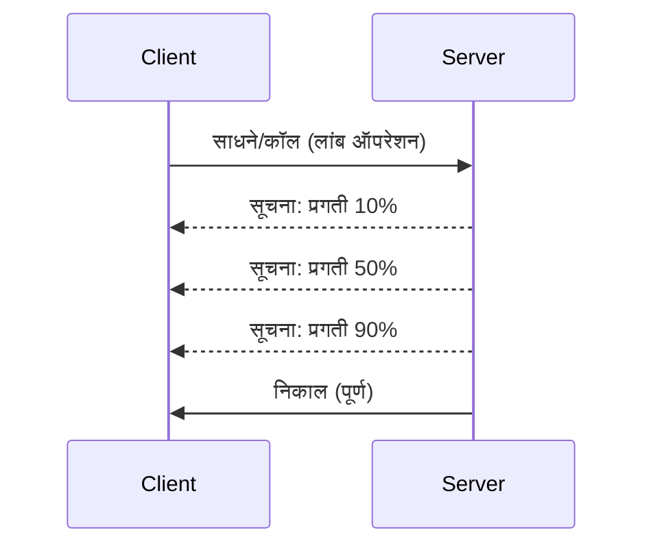

# MCP प्रोटोकॉल वैशिष्ट्ये सखोल अभ्यास

हा मार्गदर्शक प्राथमिक उपकरणे आणि संसाधन हाताळणीच्या बाहेर जाऊन प्रगत MCP प्रोटोकॉल वैशिष्ट्ये तपासतो. या वैशिष्ट्यांचा समज तुम्हाला अधिक मजबूत, वापरकर्ता-अनुकूल आणि उत्पादन-तयार MCP सर्व्हर तयार करण्यात मदत करतो.

> **पुढे बघताना:** `2026-07-28` रिलीज उमेदवार लॉगिंग मूलभूत तत्त्वाला निराकरण करतो (stdio साठी `stderr` आणि संरचित निरीक्षणासाठी OpenTelemetry ला प्राधान्य देतो), खालील Server Lifecycle Events मध्ये उल्लेख केलेली `initialize`/सत्र मॉडेल काढून टाकतो, आणि प्रायोगिक Tasks वैशिष्ट्याला नवीन `tasks/get`/`tasks/update`/`tasks/cancel` जीवनचक्रासह समर्पित Tasks विस्तारात हलवतो. पाहा [MCP मध्ये काय बदल होत आहे: 2026-07-28 रिलीज उमेदवार](../../01-CoreConcepts/mcp-2026-07-28-release-candidate.md).

## कव्हर केलेली वैशिष्ट्ये

1. **प्रगती नोटिफिकेशन्स** - दीर्घकालीन ऑपरेशन्ससाठी प्रगती नोंदविणे
2. **रिक्वेस्ट रद्द करणे** - क्लायंटना इन-फ्लाइट रिक्वेस्ट रद्द करण्याची परवानगी देणे
3. **संसाधन टेम्पलेट्स** - पॅरामिटर्ससह डायनॅमिक संसाधन URI
4. **सर्व्हर जीवनचक्र घटना** - योग्य प्रारंभ आणि बंद करणे
5. **लॉगिंग नियंत्रण** - सर्व्हर-बाजू लॉगिंग कॉन्फिगरेशन
6. **त्रुटी हाताळणी नमुने** - सुसंगत त्रुटी प्रतिसाद

---

## 1. प्रगती नोटिफिकेशन्स

वेळ घेत असलेल्या ऑपरेशन्ससाठी (डेटा प्रक्रिया, फाइल डाउनलोड, API कॉल्स), प्रगती नोटिफिकेशन्स वापरकर्त्यांना माहिती ठेऊन ठेवतात.

### हे कसे कार्य करते



### पाइथन अंमलबजावणी

```python
from mcp.server import Server, NotificationOptions
from mcp.types import ProgressNotification
import asyncio

app = Server("progress-server")

@app.tool()
async def process_large_file(file_path: str, ctx) -> str:
    """Process a large file with progress updates."""
    
    # प्रगतीची गणना करण्यासाठी फाइलचा आकार मिळवा
    file_size = os.path.getsize(file_path)
    processed = 0
    
    with open(file_path, 'rb') as f:
        while chunk := f.read(8192):
            # तुकडा प्रक्रिया करा
            await process_chunk(chunk)
            processed += len(chunk)
            
            # प्रगतीची सूचना पाठवा
            progress = (processed / file_size) * 100
            await ctx.send_notification(
                ProgressNotification(
                    progressToken=ctx.request_id,
                    progress=progress,
                    total=100,
                    message=f"Processing: {progress:.1f}%"
                )
            )
    
    return f"Processed {file_size} bytes"

@app.tool()
async def batch_operation(items: list[str], ctx) -> str:
    """Process multiple items with progress."""
    
    results = []
    total = len(items)
    
    for i, item in enumerate(items):
        result = await process_item(item)
        results.append(result)
        
        # प्रत्येक आयटमनंतर प्रगतीचा अहवाल द्या
        await ctx.send_notification(
            ProgressNotification(
                progressToken=ctx.request_id,
                progress=i + 1,
                total=total,
                message=f"Processed {i + 1}/{total}: {item}"
            )
        )
    
    return f"Completed {total} items"
```

### टायपस्क्रिप्ट अंमलबजावणी

```typescript
import { Server } from "@modelcontextprotocol/sdk/server/index.js";

server.setRequestHandler(CallToolSchema, async (request, extra) => {
  const { name, arguments: args } = request.params;
  
  if (name === "process_data") {
    const items = args.items as string[];
    const results = [];
    
    for (let i = 0; i < items.length; i++) {
      const result = await processItem(items[i]);
      results.push(result);
      
      // प्रगती सूचना पाठवा
      await extra.sendNotification({
        method: "notifications/progress",
        params: {
          progressToken: request.id,
          progress: i + 1,
          total: items.length,
          message: `Processing item ${i + 1}/${items.length}`
        }
      });
    }
    
    return { content: [{ type: "text", text: JSON.stringify(results) }] };
  }
});
```

### क्लायंट हँडलिंग (पाइथन)

```python
async def handle_progress(notification):
    """Handle progress notifications from server."""
    params = notification.params
    print(f"Progress: {params.progress}/{params.total} - {params.message}")

# हँडलर नोंदणी करा
session.on_notification("notifications/progress", handle_progress)

# साधन कॉल करा (प्रगती अद्यतने हँडलरद्वारे येतील)
result = await session.call_tool("process_large_file", {"file_path": "/data/large.csv"})
```

---

## 2. रिक्वेस्ट रद्द करणे

क्लायंटना ज्या रिक्वेस्ट्सची गरज नाही किंवा ज्या खूप वेळ घेत आहेत, त्या रद्द करण्याची अनुमती द्या.

### पाइथन अंमलबजावणी

```python
from mcp.server import Server
from mcp.types import CancelledError
import asyncio

app = Server("cancellable-server")

@app.tool()
async def long_running_search(query: str, ctx) -> str:
    """Search that can be cancelled."""
    
    results = []
    
    try:
        for page in range(100):  # अनेक पानांमधून शोधा
            # रद्द करण्याचा विनंती झाला आहे का ते तपासा
            if ctx.is_cancelled:
                raise CancelledError("Search cancelled by user")
            
            # पान शोधाचे अनुकरण करा
            page_results = await search_page(query, page)
            results.extend(page_results)
            
            # लहान विलंब रद्द पूर्तता तपासणीस अनुमती देतो
            await asyncio.sleep(0.1)
            
    except CancelledError:
        # अपूर्ण निकाल परत करा
        return f"Cancelled. Found {len(results)} results before cancellation."
    
    return f"Found {len(results)} total results"

@app.tool()
async def download_file(url: str, ctx) -> str:
    """Download with cancellation support."""
    
    async with aiohttp.ClientSession() as session:
        async with session.get(url) as response:
            total_size = int(response.headers.get('content-length', 0))
            downloaded = 0
            chunks = []
            
            async for chunk in response.content.iter_chunked(8192):
                if ctx.is_cancelled:
                    return f"Download cancelled at {downloaded}/{total_size} bytes"
                
                chunks.append(chunk)
                downloaded += len(chunk)
            
            return f"Downloaded {downloaded} bytes"
```

### रद्द करण्याचा संदर्भ अंमलात आणणे

```python
class CancellableContext:
    """Context object that tracks cancellation state."""
    
    def __init__(self, request_id: str):
        self.request_id = request_id
        self._cancelled = asyncio.Event()
        self._cancel_reason = None
    
    @property
    def is_cancelled(self) -> bool:
        return self._cancelled.is_set()
    
    def cancel(self, reason: str = "Cancelled"):
        self._cancel_reason = reason
        self._cancelled.set()
    
    async def check_cancelled(self):
        """Raise if cancelled, otherwise continue."""
        if self.is_cancelled:
            raise CancelledError(self._cancel_reason)
    
    async def sleep_or_cancel(self, seconds: float):
        """Sleep that can be interrupted by cancellation."""
        try:
            await asyncio.wait_for(
                self._cancelled.wait(),
                timeout=seconds
            )
            raise CancelledError(self._cancel_reason)
        except asyncio.TimeoutError:
            pass  # सामान्य टाइमआउट, पुढे सुरू ठेवा
```

### क्लायंट-साइड रद्द करणे

```python
import asyncio

async def search_with_timeout(session, query, timeout=30):
    """Search with automatic cancellation on timeout."""
    
    task = asyncio.create_task(
        session.call_tool("long_running_search", {"query": query})
    )
    
    try:
        result = await asyncio.wait_for(task, timeout=timeout)
        return result
    except asyncio.TimeoutError:
        # विनंती रद्द करणे
        await session.send_notification({
            "method": "notifications/cancelled",
            "params": {"requestId": task.request_id, "reason": "Timeout"}
        })
        return "Search timed out"
```

---

## 3. संसाधन टेम्पलेट्स

संसाधन टेम्पलेट्स पॅरामिटर्ससह डायनॅमिक URI निर्मितीस अनुमती देतात, हे API आणि डेटाबेससाठी उपयुक्त आहे.

### टेम्पलेटस परिभाषित करणे

```python
from mcp.server import Server
from mcp.types import ResourceTemplate

app = Server("template-server")

@app.list_resource_templates()
async def list_templates() -> list[ResourceTemplate]:
    """Return available resource templates."""
    return [
        ResourceTemplate(
            uriTemplate="db://users/{user_id}",
            name="User Profile",
            description="Fetch user profile by ID",
            mimeType="application/json"
        ),
        ResourceTemplate(
            uriTemplate="api://weather/{city}/{date}",
            name="Weather Data",
            description="Historical weather for city and date",
            mimeType="application/json"
        ),
        ResourceTemplate(
            uriTemplate="file://{path}",
            name="File Content",
            description="Read file at given path",
            mimeType="text/plain"
        )
    ]

@app.read_resource()
async def read_resource(uri: str) -> str:
    """Read resource, expanding template parameters."""
    
    # पॅरामीटर्स काढण्यासाठी URI पार्स करा
    if uri.startswith("db://users/"):
        user_id = uri.split("/")[-1]
        return await fetch_user(user_id)
    
    elif uri.startswith("api://weather/"):
        parts = uri.replace("api://weather/", "").split("/")
        city, date = parts[0], parts[1]
        return await fetch_weather(city, date)
    
    elif uri.startswith("file://"):
        path = uri.replace("file://", "")
        return await read_file(path)
    
    raise ValueError(f"Unknown resource URI: {uri}")
```

### टायपस्क्रिप्ट अंमलबजावणी

```typescript
server.setRequestHandler(ListResourceTemplatesSchema, async () => {
  return {
    resourceTemplates: [
      {
        uriTemplate: "github://repos/{owner}/{repo}/issues/{issue_number}",
        name: "GitHub Issue",
        description: "Fetch a specific GitHub issue",
        mimeType: "application/json"
      },
      {
        uriTemplate: "db://tables/{table}/rows/{id}",
        name: "Database Row",
        description: "Fetch a row from a database table",
        mimeType: "application/json"
      }
    ]
  };
});

server.setRequestHandler(ReadResourceSchema, async (request) => {
  const uri = request.params.uri;
  
  // GitHub समस्या URI पार्स करा
  const githubMatch = uri.match(/^github:\/\/repos\/([^/]+)\/([^/]+)\/issues\/(\d+)$/);
  if (githubMatch) {
    const [_, owner, repo, issueNumber] = githubMatch;
    const issue = await fetchGitHubIssue(owner, repo, parseInt(issueNumber));
    return {
      contents: [{
        uri,
        mimeType: "application/json",
        text: JSON.stringify(issue, null, 2)
      }]
    };
  }
  
  throw new Error(`Unknown resource URI: ${uri}`);
});
```

---

## 4. सर्व्हर जीवनचक्र घटना

योग्य प्रारंभ आणि बंद करणे स्वच्छ संसाधन व्यवस्थापन सुनिश्चित करते.

### पाइथन जीवनचक्र व्यवस्थापन

```python
from mcp.server import Server
from contextlib import asynccontextmanager

app = Server("lifecycle-server")

# सामायिक स्थिती
db_connection = None
cache = None

@asynccontextmanager
async def lifespan(server: Server):
    """Manage server lifecycle."""
    global db_connection, cache
    
    # स्टार्टअप
    print("🚀 Server starting...")
    db_connection = await create_database_connection()
    cache = await create_cache_client()
    print("✅ Resources initialized")
    
    yield  # सर्व्हर इथे चालतो
    
    # शटडाऊन
    print("🛑 Server shutting down...")
    await db_connection.close()
    await cache.close()
    print("✅ Resources cleaned up")

app = Server("lifecycle-server", lifespan=lifespan)

@app.tool()
async def query_database(sql: str) -> str:
    """Use the shared database connection."""
    result = await db_connection.execute(sql)
    return str(result)
```

### टायपस्क्रिप्ट जीवनचक्र

```typescript
import { Server } from "@modelcontextprotocol/sdk/server/index.js";

class ManagedServer {
  private server: Server;
  private dbConnection: DatabaseConnection | null = null;
  
  constructor() {
    this.server = new Server({
      name: "lifecycle-server",
      version: "1.0.0"
    });
    
    this.setupHandlers();
  }
  
  async start() {
    // स्रोत प्रारंभ करा
    console.log("🚀 Server starting...");
    this.dbConnection = await createDatabaseConnection();
    console.log("✅ Database connected");
    
    // सर्व्हर सुरू करा
    await this.server.connect(transport);
  }
  
  async stop() {
    // स्रोत स्वच्छ करा
    console.log("🛑 Server shutting down...");
    if (this.dbConnection) {
      await this.dbConnection.close();
    }
    await this.server.close();
    console.log("✅ Cleanup complete");
  }
  
  private setupHandlers() {
    this.server.setRequestHandler(CallToolSchema, async (request) => {
      // हे.dbConnection सुरक्षितपणे वापरा
      // ...
    });
  }
}

// सौम्य बंदीसह वापर
const server = new ManagedServer();

process.on('SIGINT', async () => {
  await server.stop();
  process.exit(0);
});

await server.start();
```

---

## 5. लॉगिंग नियंत्रण

MCP सर्व्हर-बाजू लॉगिंग पातळ्यांचे समर्थन करते ज्यावर क्लायंट नियंत्रण ठेवू शकतात.

### लॉगिंग पातळ्या अंमलात आणणे

```python
from mcp.server import Server
from mcp.types import LoggingLevel
import logging

app = Server("logging-server")

# MCP पातळ्या Python लॉगिंग पातळ्यांशी मॅप करा
LEVEL_MAP = {
    LoggingLevel.DEBUG: logging.DEBUG,
    LoggingLevel.INFO: logging.INFO,
    LoggingLevel.WARNING: logging.WARNING,
    LoggingLevel.ERROR: logging.ERROR,
}

logger = logging.getLogger("mcp-server")

@app.set_logging_level()
async def set_logging_level(level: LoggingLevel) -> None:
    """Handle client request to change logging level."""
    python_level = LEVEL_MAP.get(level, logging.INFO)
    logger.setLevel(python_level)
    logger.info(f"Logging level set to {level}")

@app.tool()
async def debug_operation(data: str) -> str:
    """Tool with various logging levels."""
    logger.debug(f"Processing data: {data}")
    
    try:
        result = process(data)
        logger.info(f"Successfully processed: {result}")
        return result
    except Exception as e:
        logger.error(f"Processing failed: {e}")
        raise
```

### क्लायंटकडे लॉग संदेश पाठविणे

```python
@app.tool()
async def complex_operation(input: str, ctx) -> str:
    """Operation that logs to client."""
    
    # ग्राहकाला लॉग सूचना पाठवा
    await ctx.send_log(
        level="info",
        message=f"Starting complex operation with input: {input}"
    )
    
    # काम करा...
    result = await do_work(input)
    
    await ctx.send_log(
        level="debug",
        message=f"Operation complete, result size: {len(result)}"
    )
    
    return result
```

---

## 6. त्रुटी हाताळणी नमुने

सुसंगत त्रुटी हाताळणी डिबगिंग आणि वापरकर्ता अनुभव सुधारते.

### MCP त्रुटी कोड्स

```python
from mcp.types import McpError, ErrorCode

class ToolError(McpError):
    """Base class for tool errors."""
    pass

class ValidationError(ToolError):
    """Invalid input parameters."""
    def __init__(self, message: str):
        super().__init__(ErrorCode.INVALID_PARAMS, message)

class NotFoundError(ToolError):
    """Requested resource not found."""
    def __init__(self, resource: str):
        super().__init__(ErrorCode.INVALID_REQUEST, f"Not found: {resource}")

class PermissionError(ToolError):
    """Access denied."""
    def __init__(self, action: str):
        super().__init__(ErrorCode.INVALID_REQUEST, f"Permission denied: {action}")

class InternalError(ToolError):
    """Internal server error."""
    def __init__(self, message: str):
        super().__init__(ErrorCode.INTERNAL_ERROR, message)
```

### संरचित त्रुटी प्रतिसाद

```python
@app.tool()
async def safe_operation(input: str) -> str:
    """Tool with comprehensive error handling."""
    
    # इनपुट वैधता तपासा
    if not input:
        raise ValidationError("Input cannot be empty")
    
    if len(input) > 10000:
        raise ValidationError(f"Input too large: {len(input)} chars (max 10000)")
    
    try:
        # परवानग्या तपासा
        if not await check_permission(input):
            raise PermissionError(f"read {input}")
        
        # ऑपरेशन करा
        result = await perform_operation(input)
        
        if result is None:
            raise NotFoundError(input)
        
        return result
        
    except ConnectionError as e:
        raise InternalError(f"Database connection failed: {e}")
    except TimeoutError as e:
        raise InternalError(f"Operation timed out: {e}")
    except Exception as e:
        # अपेक्षित नसलेल्या त्रुटी नोंदवा
        logger.exception(f"Unexpected error in safe_operation")
        raise InternalError(f"Unexpected error: {type(e).__name__}")
```

### टायपस्क्रिप्टमधील त्रुटी हाताळणी

```typescript
import { McpError, ErrorCode } from "@modelcontextprotocol/sdk/types.js";

function validateInput(data: unknown): asserts data is ValidInput {
  if (typeof data !== "object" || data === null) {
    throw new McpError(
      ErrorCode.InvalidParams,
      "Input must be an object"
    );
  }
  // अधिक प्रमाणीकरण...
}

server.setRequestHandler(CallToolSchema, async (request) => {
  try {
    validateInput(request.params.arguments);
    
    const result = await performOperation(request.params.arguments);
    
    return {
      content: [{ type: "text", text: JSON.stringify(result) }]
    };
    
  } catch (error) {
    if (error instanceof McpError) {
      throw error;  // आधीच MCP त्रुटी
    }
    
    // इतर त्रुटी रूपांतरित करा
    if (error instanceof NotFoundError) {
      throw new McpError(ErrorCode.InvalidRequest, error.message);
    }
    
    // अज्ञात त्रुटी
    console.error("Unexpected error:", error);
    throw new McpError(
      ErrorCode.InternalError,
      "An unexpected error occurred"
    );
  }
});
```

---

## प्रायोगिक वैशिष्ट्ये (MCP 2025-11-25)

ह्या वैशिष्ट्यांना तपशीलिकेत प्रायोगिक म्हणून चिन्हांकित केले आहे:

### Tasks (दीर्घकालीन ऑपरेशन्स)

```python
# कार्यांद्वारे स्थितीसह दीर्घकालीन ऑपरेशन्सचा मागोवा ठेवता येतो
@app.task()
async def training_task(model_id: str, data_path: str, ctx) -> str:
    """Long-running ML training task."""
    
    # कार्य सुरू असल्याची नोंद करा
    await ctx.report_status("running", "Initializing training...")
    
    # प्रशिक्षण लूप
    for epoch in range(100):
        await train_epoch(model_id, data_path, epoch)
        await ctx.report_status(
            "running",
            f"Training epoch {epoch + 1}/100",
            progress=epoch + 1,
            total=100
        )
    
    await ctx.report_status("completed", "Training finished")
    return f"Model {model_id} trained successfully"
```

### टूल अ‍ॅनोटेशन्स

```python
# अ‍ॅनो्टेशन साधनाच्या वर्तनाबद्दल मेटाडेटा प्रदान करतात
@app.tool(
    annotations={
        "destructive": False,      # डेटा बदलत नाही
        "idempotent": True,        # पुन्हा प्रयत्न करणे सुरक्षित आहे
        "timeout_seconds": 30,     # अपेक्षित कमाल कालावधी
        "requires_approval": False # वापरकर्ता मंजुरी आवश्यक नाही
    }
)
async def safe_query(query: str) -> str:
    """A read-only database query tool."""
    return await execute_read_query(query)
```

---

## पुढे काय

- [मॉड्यूल 8 - सर्वोत्तम पद्धती](../../08-BestPractices/README.md)
- [5.14 - संदर्भ अभियांत्रिकी](../mcp-contextengineering/README.md)
- [MCP तपशीलिका चँजलॉग](https://spec.modelcontextprotocol.io/)

---

## अतिरिक्त संसाधने

- [MCP तपशीलिका 2025-11-25](https://spec.modelcontextprotocol.io/specification/2025-11-25/)
- [JSON-RPC 2.0 त्रुटी कोड्स](https://www.jsonrpc.org/specification#error_object)
- [पाइथन SDK उदाहरणे](https://github.com/modelcontextprotocol/python-sdk/tree/main/examples)
- [टायपस्क्रिप्ट SDK उदाहरणे](https://github.com/modelcontextprotocol/typescript-sdk/tree/main/examples)

---

<!-- CO-OP TRANSLATOR DISCLAIMER START -->
**अस्वीकरण**:
हा दस्तऐवज AI भाषांतर सेवा [Co-op Translator](https://github.com/Azure/co-op-translator) चा वापर करून अनुवादित केला आहे. जरी आम्ही अचूकतेसाठी प्रयत्न करतो, तरी कृपया लक्षात घ्या की स्वयंचलित भाषांतरांमध्ये त्रुटी किंवा अचूकतेची कमतरता असू शकते. मूळ दस्तऐवज त्याच्या मूळ भाषेत अधिकृत स्रोत मानला पाहिजे. महत्त्वाची माहिती असल्यास, व्यावसायिक मानवी भाषांतराची शिफारस केली जाते. या भाषांतराच्या वापरामुळे उद्भवणाऱ्या कोणत्याही गैरसमज किंवा चुकीच्या अर्थलावणीसाठी आम्ही जबाबदार नाही.
<!-- CO-OP TRANSLATOR DISCLAIMER END -->