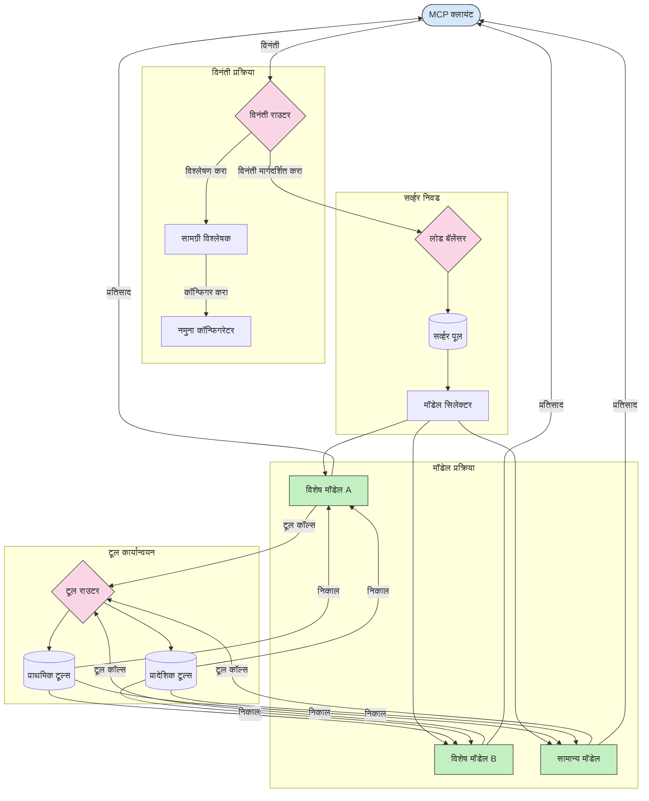

# मॉडेल संदर्भ प्रोटोकॉलमधील राऊटिंग  

राऊटिंग हे MCP परिसंस्थेमध्ये विनंत्या योग्य मॉडेल्स, साधने किंवा सेवा यांना निर्देशित करण्यासाठी आवश्यक आहे.  

## परिचय  

मॉडेल संदर्भ प्रोटोकॉल (MCP) मधील राऊटिंग म्हणजे विविध निकषांवर आधारित, जसे की सामग्रीचा प्रकार, वापरकर्त्याचा संदर्भ, आणि प्रणालीचा भार, त्यानुसार विनंत्या सर्वात योग्य मॉडेल्स किंवा सेवांकडे निर्देशित करणे. हे कार्यक्षम प्रक्रिया आणि संसाधनांचा उत्कृष्ट वापर सुनिश्चित करते.  

## शिकण्याचे उद्दिष्ट  

या धड्याच्या शेवटी, तुम्ही सक्षम असाल:  

- MCP मधील राऊटिंगच्या तत्त्वांची समज प्राप्त करणे.  
- विशेषीकृत सेवांकडे विनंत्या निर्देशित करण्यासाठी सामग्री-आधारित राऊटिंगची अंमलबजावणी करणे.  
- संसाधनांचा उत्कृष्ट वापर करण्यासाठी बुद्धिमान लोड बॅलन्सिंग धोरणं वापरणे.  
- विनंतीच्या संदर्भावर आधारित डायनॅमिक टूल राऊटिंगची अंमलबजावणी करणे.  

## सामग्री-आधारित राऊटिंग  

सामग्री-आधारित राऊटिंगमध्ये विनंत्या त्या विनंतीच्या सामग्रीच्या आधारे विशेषीकृत सेवांकडे निर्देशित केल्या जातात. उदाहरणार्थ, कोड निर्मितीशी संबंधित विनंत्या एका विशेष कोड मॉडेलकडे राऊट केल्या जाऊ शकतात, तर सर्जनशील लेखनासाठीची विनंत्या सर्जनशील लेखन मॉडेलकडे पाठविता येतात.  

चला वेगवेगळ्या प्रोग्रामिंग भाषांमधील उदाहरण अंमलबजावणी पाहूया.  

<details>
<summary>.NET</summary>

```csharp
// .NET Example: Content-based routing in MCP
public class ContentBasedRouter
{
    private readonly Dictionary<string, McpClient> _specializedClients;
    private readonly RoutingClassifier _classifier;
    
    public ContentBasedRouter()
    {
        // Initialize specialized clients for different domains
        _specializedClients = new Dictionary<string, McpClient>
        {
            ["code"] = new McpClient("https://code-specialized-mcp.com"),
            ["creative"] = new McpClient("https://creative-specialized-mcp.com"),
            ["scientific"] = new McpClient("https://scientific-specialized-mcp.com"),
            ["general"] = new McpClient("https://general-mcp.com")
        };
        
        // Initialize content classifier
        _classifier = new RoutingClassifier();
    }
    
    public async Task<McpResponse> RouteAndProcessAsync(string prompt, IDictionary<string, object> parameters = null)
    {
        // Classify the prompt to determine the best specialized service
        string category = await _classifier.ClassifyPromptAsync(prompt);
        
        // Get the appropriate client or fall back to general
        var client = _specializedClients.ContainsKey(category) 
            ? _specializedClients[category] 
            : _specializedClients["general"];
            
        Console.WriteLine($"Routing request to {category} specialized service");
        
        // Send request to the selected service
        return await client.SendPromptAsync(prompt, parameters);
    }
    
    // Simple classifier for routing decisions
    private class RoutingClassifier
    {
        public Task<string> ClassifyPromptAsync(string prompt)
        {
            prompt = prompt.ToLowerInvariant();
            
            if (prompt.Contains("code") || prompt.Contains("function") || 
                prompt.Contains("program") || prompt.Contains("algorithm"))
            {
                return Task.FromResult("code");
            }
            
            if (prompt.Contains("story") || prompt.Contains("creative") || 
                prompt.Contains("imagine") || prompt.Contains("design"))
            {
                return Task.FromResult("creative");
            }
            
            if (prompt.Contains("science") || prompt.Contains("research") || 
                prompt.Contains("analyze") || prompt.Contains("study"))
            {
                return Task.FromResult("scientific");
            }
            
            return Task.FromResult("general");
        }
    }
}
```

वरील कोडमध्ये, आम्ही:  

- `ContentBasedRouter` वर्ग तयार केला आहे जो प्रॉम्प्टच्या सामग्रीच्या आधारे विनंत्यांचे राऊटिंग करतो.  
- वेगवेगळ्या डोमेनसाठी (कोड, सर्जनशील, वैज्ञानिक, सामान्य) विशेष क्लायंट्स सुरू केले आहेत.  
- एक साधा वर्गीकरणकार तयार केला आहे जो प्रॉम्प्टची श्रेणी ठरवतो आणि विनंत्या योग्य विशेषीकृत सेवांकडे राऊट करतो.  
- कोणतीही विशेषीकृत सेवा उपलब्ध नसल्यास सामान्य सेवांकडे विनंत्या पाठवण्यासाठी फallback यंत्रणा वापरली आहे.  
- विनंत्या कार्यक्षमतेने हाताळण्यासाठी असिंक्रोनस प्रक्रिया राबवली आहे.  
- सामग्री श्रेणींना विशेषीकृत MCP क्लायंट्सशी मैप करण्यासाठी शब्दकोशाचा वापर केला आहे.  
- प्रॉम्प्टचे विश्लेषण करून योग्य श्रेणी परत करणारा साधा वर्गीकरणकार वापरला आहे.  
- विनंती पाठवण्यासाठी आणि प्रतिसाद मिळवण्यासाठी विशेषीकृत क्लायंटचा वापर केला आहे.  
- प्रॉम्प्ट कोणत्याही विशेष श्रेणीत न बसल्यास सामान्य सेवांकडे राऊटिंग केली आहे.  

</details>

## बुद्धिमान लोड बॅलन्सिंग  

लोड बॅलन्सिंग संसाधनांचा उत्कृष्ट वापर करते आणि MCP सेवांसाठी उच्च उपलब्धता सुनिश्चित करते. लोड बॅलन्सिंग अंमलबजावणीचे विविध प्रकार आहेत, जसे की राउंड-रॉबिन, वेटेड रिस्पॉन्स टाइम, किंवा सामग्री-आधारित धोरणे.  

खाली दिलेल्या उदाहरणात खालील धोरणांचा वापर केला आहे:  

- **राउंड रॉबिन**: विनंत्या सर्व उपलब्ध सर्व्हर्समध्ये समप्रमाणात विभागणं.  
- **वेटेड रिस्पॉन्स टाइम**: सरासरी प्रतिसाद वेळेनुसार सर्व्हर्सकडे विनंत्या राऊट करणं.  
- **सामग्री-आधारित**: विनंतीच्या सामग्रीवर आधारित विशेषीकृत सर्व्हर्सकडे विनंत्या राऊट करणं.  

<details>
<summary>Java</summary>

```java
// Java उदाहरण: MCP सर्व्हरसाठी बुद्धिमान लोड बॅलन्सिंग
public class McpLoadBalancer {
    private final List<McpServerNode> serverNodes;
    private final LoadBalancingStrategy strategy;
    
    public McpLoadBalancer(List<McpServerNode> nodes, LoadBalancingStrategy strategy) {
        this.serverNodes = new ArrayList<>(nodes);
        this.strategy = strategy;
    }
    
    public McpResponse processRequest(McpRequest request) {
        // धोरणावर आधारित सर्वात चांगला सर्व्हर निवडा
        McpServerNode selectedNode = strategy.selectNode(serverNodes, request);
        
        try {
            // निवडलेल्या नोडकडे विनंती पाठवा
            return selectedNode.processRequest(request);
        } catch (Exception e) {
            // अपयश हाताळा - पुनःप्रयत्न किंवा फallback लॉजिक अंमलात आणा
            System.err.println("Error processing request on node " + selectedNode.getId() + ": " + e.getMessage());
            
            // नोडला संभाव्य आरोग्यहीन म्हणून चिन्हांकित करा
            selectedNode.recordFailure();
            
            // फallback म्हणून पुढील सर्वोत्तम नोड वापरून पहा
            List<McpServerNode> remainingNodes = new ArrayList<>(serverNodes);
            remainingNodes.remove(selectedNode);
            
            if (!remainingNodes.isEmpty()) {
                McpServerNode fallbackNode = strategy.selectNode(remainingNodes, request);
                return fallbackNode.processRequest(request);
            } else {
                throw new RuntimeException("All MCP server nodes failed to process the request");
            }
        }
    }
    
    // नोड आरोग्य तपासणी कार्य
    public void startHealthChecks(Duration interval) {
        ScheduledExecutorService scheduler = Executors.newScheduledThreadPool(1);
        scheduler.scheduleAtFixedRate(() -> {
            for (McpServerNode node : serverNodes) {
                try {
                    boolean isHealthy = node.checkHealth();
                    System.out.println("Node " + node.getId() + " health status: " + 
                                      (isHealthy ? "HEALTHY" : "UNHEALTHY"));
                } catch (Exception e) {
                    System.err.println("Health check failed for node " + node.getId());
                    node.setHealthy(false);
                }
            }
        }, 0, interval.toMillis(), TimeUnit.MILLISECONDS);
    }
    
    // लोड बॅलन्सिंग धोरणांसाठी इंटरफेस
    public interface LoadBalancingStrategy {
        McpServerNode selectNode(List<McpServerNode> nodes, McpRequest request);
    }
    
    // राउंड-रॉबिन धोरण
    public static class RoundRobinStrategy implements LoadBalancingStrategy {
        private AtomicInteger counter = new AtomicInteger(0);
        
        @Override
        public McpServerNode selectNode(List<McpServerNode> nodes, McpRequest request) {
            List<McpServerNode> healthyNodes = nodes.stream()
                .filter(McpServerNode::isHealthy)
                .collect(Collectors.toList());
            
            if (healthyNodes.isEmpty()) {
                throw new RuntimeException("No healthy nodes available");
            }
            
            int index = counter.getAndIncrement() % healthyNodes.size();
            return healthyNodes.get(index);
        }
    }
    
    // वजन दिलेले प्रतिसाद वेळ धोरण
    public static class ResponseTimeStrategy implements LoadBalancingStrategy {
        @Override
        public McpServerNode selectNode(List<McpServerNode> nodes, McpRequest request) {
            return nodes.stream()
                .filter(McpServerNode::isHealthy)
                .min(Comparator.comparing(McpServerNode::getAverageResponseTime))
                .orElseThrow(() -> new RuntimeException("No healthy nodes available"));
        }
    }
    
    // सामग्री-आधारित धोरण
    public static class ContentAwareStrategy implements LoadBalancingStrategy {
        @Override
        public McpServerNode selectNode(List<McpServerNode> nodes, McpRequest request) {
            // विनंतीची वैशिष्ट्ये ठरवा
            boolean isCodeRequest = request.getPrompt().contains("code") || 
                                   request.getAllowedTools().contains("codeInterpreter");
            
            boolean isCreativeRequest = request.getPrompt().contains("creative") || 
                                       request.getPrompt().contains("story");
            
            // विशेषीकृत नोड शोधा
            Optional<McpServerNode> specializedNode = nodes.stream()
                .filter(McpServerNode::isHealthy)
                .filter(node -> {
                    if (isCodeRequest && node.getSpecialization().equals("code")) {
                        return true;
                    }
                    if (isCreativeRequest && node.getSpecialization().equals("creative")) {
                        return true;
                    }
                    return false;
                })
                .findFirst();
            
            // विशेषीकृत नोड किंवा सर्वात कमी लोड असलेला नोड परत करा
            return specializedNode.orElse(
                nodes.stream()
                    .filter(McpServerNode::isHealthy)
                    .min(Comparator.comparing(McpServerNode::getCurrentLoad))
                    .orElseThrow(() -> new RuntimeException("No healthy nodes available"))
            );
        }
    }
}
```

वरील कोडमध्ये, आम्ही:  

- `McpLoadBalancer` वर्ग तयार केला आहे जो MCP सर्व्हर नोड्सची यादी व्यवस्थापित करतो आणि निवडलेल्या लोड बॅलन्सिंग धोरणानुसार विनंत्या राऊट करतो.  
- वेगवेगळ्या लोड बॅलन्सिंग धोरणांची अंमलबजावणी केली आहे: `RoundRobinStrategy`, `ResponseTimeStrategy`, आणि `ContentAwareStrategy`.  
- `ScheduledExecutorService` वापरून सर्व्हर नोड्सच्या हेल्थची नियमित चाचणी केली आहे.  
- हेल्थ चाचण्यांच्या प्रतिसादावरून नोड्सला हेल्दी किंवा अनहेल्दी म्हणून मार्क करणारी हेल्थ चेक यंत्रणा लागू केली आहे.  
- त्रुटी हाताळणी आणि फallback लॉजिकसह विनंती प्रक्रिया करून उच्च उपलब्धता सुनिश्चित केली आहे.  
- `McpServerNode` वर्ग वापरून प्रत्येक MCP सर्व्हर नोडचे हेल्थ स्टेटस, सरासरी प्रतिसाद वेळ, आणि वर्तमान लोड दर्शविला आहे.  
- विनंती तपशील (प्रॉम्प्ट आणि परवानगी दिलेली साधने) साठवण्यासाठी `McpRequest` वर्ग तयार केला आहे.  
- हेल्थ स्टेटस आणि विशेषीकरणानुसार नोड्स फिल्टर आणि निवडण्यासाठी Java Streams वापरले आहेत.  

</details>

## डायनॅमिक टूल राऊटिंग  

टूल राऊटिंगमध्ये टूल कॉल्सला संदर्भानुसार सर्वात योग्य सेवांकडे निर्देशित केले जाते. उदाहरणार्थ, हवामान टूल कॉलला वापरकर्त्याच्या स्थानानुसार प्रादेशिक एंडपॉइंटकडे राऊट करणे आवश्यक असू शकते, किंवा कॅल्क्युलेटर टूलना API चा विशिष्ट आवृत्ती वापरावासा लागू शकतो.  

खालील उदाहरण अंमलबजावणीमध्ये विनंती विश्लेषण, प्रादेशिक एंडपॉइंट्स, आणि आवृत्ती समर्थनावर आधारित डायनॅमिक टूल राऊटिंग दाखविली आहे.  

<details>
<summary>Python</summary>

```python
# पायथन उदाहरण: विनंती विश्लेषणावर आधारित डायनॅमिक टूल राउटिंग
class McpToolRouter:
    def __init__(self):
        # उपलब्ध टूल एंडपॉइंट्स नोंदणी करा
        self.tool_endpoints = {
            "weatherTool": "https://weather-service.example.com/api",
            "calculatorTool": "https://calculator-service.example.com/compute",
            "databaseTool": "https://database-service.example.com/query",
            "searchTool": "https://search-service.example.com/search"
        }
        
        # जागतिक वितरणासाठी प्रादेशिक एंडपॉइंट्स
        self.regional_endpoints = {
            "us": {
                "weatherTool": "https://us-west.weather-service.example.com/api",
                "searchTool": "https://us.search-service.example.com/search"
            },
            "europe": {
                "weatherTool": "https://eu.weather-service.example.com/api",
                "searchTool": "https://eu.search-service.example.com/search"
            },
            "asia": {
                "weatherTool": "https://asia.weather-service.example.com/api",
                "searchTool": "https://asia.search-service.example.com/search"
            }
        }
        
        # टूल आवृत्ती समर्थन
        self.tool_versions = {
            "weatherTool": {
                "default": "v2",
                "v1": "https://weather-service.example.com/api/v1",
                "v2": "https://weather-service.example.com/api/v2",
                "beta": "https://weather-service.example.com/api/beta"
            }
        }
    
    async def route_tool_request(self, tool_name, parameters, user_context=None):
        """Route a tool request to the appropriate endpoint based on context"""
        endpoint = self._select_endpoint(tool_name, parameters, user_context)
        
        if not endpoint:
            raise ValueError(f"No endpoint available for tool: {tool_name}")
        
        # निवडलेल्या एंडपॉइंटवर वास्तविक विनंती करा
        return await self._execute_tool_request(endpoint, tool_name, parameters)
    
    def _select_endpoint(self, tool_name, parameters, user_context=None):
        """Select the most appropriate endpoint based on context"""
        # नोंदणीतील बेस एंडपॉइंट
        if tool_name not in self.tool_endpoints:
            return None
            
        base_endpoint = self.tool_endpoints[tool_name]
        
        # विशिष्ट टूल आवृत्ती वापरायची का ते तपासा
        if tool_name in self.tool_versions:
            version_info = self.tool_versions[tool_name]
            
            # निर्दिष्ट आवृत्ती किंवा डीफॉल्ट वापरा
            requested_version = parameters.get("_version", version_info["default"])
            if requested_version in version_info:
                base_endpoint = version_info[requested_version]
        
        # वापरकर्त्याचा प्रदेश माहित असल्यास प्रादेशिक राउटिंग तपासा
        if user_context and "region" in user_context:
            user_region = user_context["region"]
            
            if user_region in self.regional_endpoints:
                regional_tools = self.regional_endpoints[user_region]
                
                if tool_name in regional_tools:
                    # प्रदेश-विशिष्ट एंडपॉइंट वापरा
                    return regional_tools[tool_name]
        
        # डेटा रेजिडेन्सी आवश्यकता तपासा
        if user_context and "data_residency" in user_context:
            # हे विशिष्ट अधिकारक्षेत्रात डेटा राहील यासाठी लॉजिक अंमलात आणेल
            pass
        
        # लेटन्सी-आधारित राउटिंग तपासा
        if user_context and "latency_sensitive" in user_context and user_context["latency_sensitive"]:
            # सर्वात कमी लेटन्सी असलेला एंडपॉइंट निवडण्यासाठी लॉजिक लागू करेल
            pass
            
        return base_endpoint
        
    async def _execute_tool_request(self, endpoint, tool_name, parameters):
        """Execute the actual tool request to the selected endpoint"""
        try:
            async with aiohttp.ClientSession() as session:
                async with session.post(
                    endpoint,
                    json={"toolName": tool_name, "parameters": parameters},
                    headers={"Content-Type": "application/json"}
                ) as response:
                    if response.status == 200:
                        result = await response.json()
                        return result
                    else:
                        error_text = await response.text()
                        raise Exception(f"Tool execution failed: {error_text}")
        except Exception as e:
            # पुनःप्रयत्न लॉजिक किंवा फॉलबॅक धोरण लागू करा
            print(f"Error executing tool {tool_name} at {endpoint}: {str(e)}")
            raise
```

वरील कोडमध्ये, आम्ही:  

- `McpToolRouter` वर्ग तयार केला आहे जो विनंती विश्लेषण, प्रादेशिक एंडपॉइंट्स, आणि आवृत्ती समर्थनाच्या आधारे टूल राऊटिंग करते.  
- उपलब्ध टूल एंडपॉइंट्स आणि जागतिक वितरणासाठी प्रादेशिक एंडपॉइंट्स नोंदविले आहेत.  
- वापरकर्त्याच्या संदर्भावरून (जसे की प्रदेश आणि डेटा रहिवासी आवश्यकतांनुसार) योग्य एंडपॉइंट निवडून डायनॅमिक राऊटिंग लॉजिक लागू केले आहे.  
- टूलसाठी आवृत्ती समर्थन अंमलात आणले आहे, ज्यामुळे वापरकर्ते टूलची कोणती आवृत्ती वापरायची आहे ते ठरवू शकतात.  
- टूल कॉल्स पार पाडण्यासाठी आणि प्रतिसाद हाताळण्यासाठी असिंक्रोनस HTTP विनंत्यांचा वापर केला आहे.  

</details>

## MCP मधील सॅम्पलिंग आणि राऊटिंग आर्किटेक्चर  

सॅम्पलिंग मॉडेल संदर्भ प्रोटोकॉल (MCP) मधील महत्वाचा भाग आहे जो कार्यक्षम विनंती प्रक्रिया आणि राऊटिंगची परवानगी देतो. यात येणाऱ्या विनंत्यांचे विश्लेषण करून, त्यांना हाताळण्यासाठी सर्वात योग्य मॉडेल किंवा सेवा ठरविली जाते, जसे की सामग्रीचा प्रकार, वापरकर्त्याचा संदर्भ, आणि प्रणालीचा भार विचारात घेऊन.  

सॅम्पलिंग आणि राऊटिंग एकत्र करून एक ठोस आर्किटेक्चर तयार केले जाऊ शकते जे संसाधनांचा सर्वोत्तम वापर करेल आणि उच्च उपलब्धता सुनिश्चित करेल. सॅम्पलिंग प्रक्रिया विनंत्या वर्गीकृत करते, तर राऊटिंग त्या योग्य मॉडेल्स किंवा सेवांकडे निर्देशित करते.  

खाली चित्र दर्शविते की सॅम्पलिंग आणि राऊटिंग कशी एकत्र कार्य करतात संपूर्ण MCP आर्किटेक्चरमध्ये:  



## पुढे काय  

- [5.6 सॅम्पलिंग](../mcp-sampling/README.md)

---

<!-- CO-OP TRANSLATOR DISCLAIMER START -->
**अस्वीकरण**:
हा दस्तऐवज AI भाषांतर सेवा [Co-op Translator](https://github.com/Azure/co-op-translator) चा वापर करून अनुवादित केला आहे. जरी आम्ही अचूकतेसाठी प्रयत्न करतो, तरी कृपया लक्षात घ्या की स्वयंचलित भाषांतरांमध्ये त्रुटी किंवा अचूकतेची कमतरता असू शकते. मूळ दस्तऐवज त्याच्या मूळ भाषेत अधिकृत स्रोत मानला पाहिजे. महत्त्वाची माहिती असल्यास, व्यावसायिक मानवी भाषांतराची शिफारस केली जाते. या भाषांतराच्या वापरामुळे उद्भवणाऱ्या कोणत्याही गैरसमज किंवा चुकीच्या अर्थलावणीसाठी आम्ही जबाबदार नाही.
<!-- CO-OP TRANSLATOR DISCLAIMER END -->