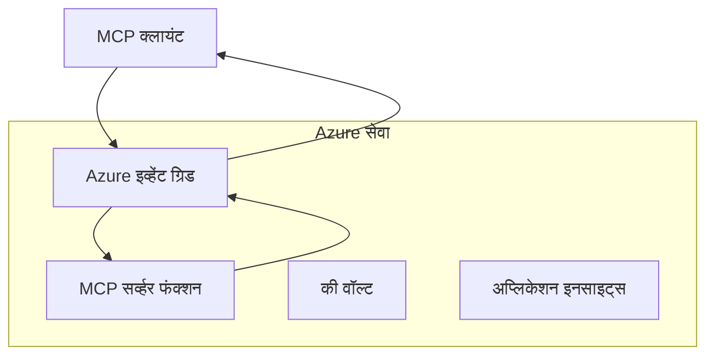
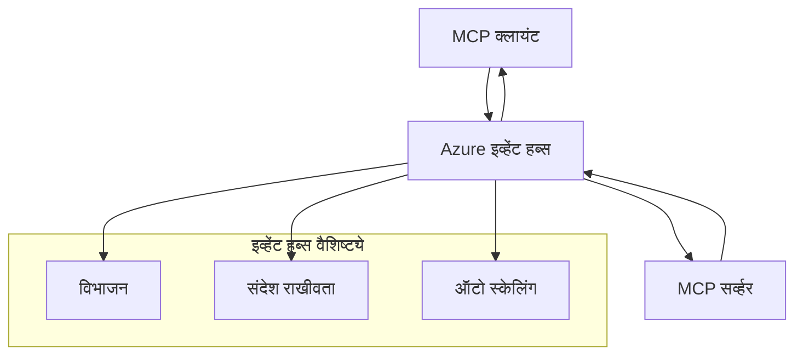

# MCP कस्टम ट्रान्सपोर्ट्स - प्रगत अंमलबजावणी मार्गदर्शक

मॉडेल कॉन्टेक्स्ट प्रोटोकॉल (MCP) ट्रान्सपोर्ट मेकॅनिझममध्ये लवचिकता प्रदान करते, विशेषीकृत एंटरप्राइझ वातावरणासाठी कस्टम रचना सक्षम करते. हा प्रगत मार्गदर्शक Azure Event Grid आणि Azure Event Hubs यांचा वापर करत कस्टम ट्रान्सपोर्ट अंमलबजावण्या कशा करायच्या ह्यांचे व्यावहारिक उदाहरणे सादर करतो, ज्याद्वारे प्रमाणवाढ करणारी, क्लाउड-नेटिव्ह MCP सोल्यूशन्स तयार करता येतात.

> **पुढे पाहणे:** हा मार्गदर्शक **MCP Specification 2025-11-25** च्या अनुषंगे लिहिला आहे, जिथे सेशन ऑर्डरिंग प्रत्येक सेशनसाठी जपली पाहिजे (खाली मेसेज प्रोटोकॉल पहा). `2026-07-28` रिलीज उमेदवार पूर्णपणे प्रोटोकॉल-स्तरीय सेशन काढून टाकतो आणि `Mcp-Method`/`Mcp-Name` हेडर्सची आवश्यकता असते ज्यामुळे गेटवे आणि कस्टम ट्रान्सपोर्ट्स प्रति-रिक्वेस्ट मार्गदर्शित करू शकतात प्रति-सेशनऐवजी. पाहा [MCP मधील काय बदलले आहे: 2026-07-28 रिलीज उमेदवार](../../01-CoreConcepts/mcp-2026-07-28-release-candidate.md).

## परिचय

जरी MCP चे मानक ट्रान्सपोर्ट्स (stdio आणि HTTP स्ट्रीमिंग) बहुतेक वापर प्रकरणे पूर्ण करतात, एंटरप्राइझ वातावरणांना सहसा प्रमाणवाढ, विश्वासार्हता आणि विद्यमान क्लाउड इन्फ्रास्ट्रक्चरशी एकत्रीकरणासाठी विशेषीकृत ट्रान्सपोर्ट मेकॅनिझमची गरज असते. कस्टम ट्रान्सपोर्ट्स MCP ला क्लाउड-नेटिव्ह मेसेजिंग सेवा वापरून असिंक्रोनस कम्युनिकेशन, इव्हेंट-चालित आर्किटेक्चर आणि वितरित प्रक्रियेसाठी अनुकूल बनवतात.

हा धडा नवीनतम MCP तपशील (2025-11-25), Azure मेसेजिंग सेवा आणि स्थापित एंटरप्राइझ एकत्रीकरण पॅटर्न्सवर आधारित प्रगत ट्रान्सपोर्ट अंमलबजावणींचा अभ्यास करतो.

### **MCP ट्रान्सपोर्ट आर्किटेक्चर**

**MCP तपशील (2025-11-25) मधून:**

- **मानक ट्रान्सपोर्ट्स**: stdio (शिफारस केलेले), HTTP स्ट्रीमिंग (रिमोट परिस्थितीसाठी)
- **कस्टम ट्रान्सपोर्ट्स**: कोणताही ट्रान्सपोर्ट जो MCP मेसेज एक्सचेंज प्रोटोकॉल अंमलात आणतो
- **मेसेज फॉर्मॅट**: JSON-RPC 2.0 MCP-विशिष्ट विस्तारांसह
- **द्विमुखी संवाद**: सूचना आणि प्रतिसादांसाठी पूर्ण डुप्लेक्स संवाद आवश्यक

## शिकण्याचे उद्दिष्ट

या प्रगत धड्याच्या शेवटी, तुम्ही सक्षम असाल:

- **कस्टम ट्रान्सपोर्ट गरजा समजून घेणे**: कोणत्याही ट्रान्सपोर्ट लेयरवर MCP प्रोटोकॉल लागू करताना अनुपालन राखणे
- **Azure Event Grid ट्रान्सपोर्ट तयार करणे**: Azure Event Grid वापरुन इव्हेंट-चालित MCP सर्व्हर्स तयार करणे जे सर्व्हरलेस प्रमाणवाढ सक्षम करतात
- **Azure Event Hubs ट्रान्सपोर्ट अंमलबजावणी**: Azure Event Hubs वापरून उच्च-थ्रूपुट MCP सोल्यूशन्स तयार करणे जे रिअल-टाइम स्ट्रीमिंगसाठी आहेत
- **एंटरप्राइझ पॅटर्न्स लागू करणे**: विद्यमान Azure इन्फ्रास्ट्रक्चर आणि सुरक्षा मॉडेल्ससह कस्टम ट्रान्सपोर्ट्सचे एकत्रीकरण करणे
- **ट्रान्सपोर्ट विश्वासार्हता हाताळणे**: एंटरप्राइझ परिस्थितींसाठी मेसेज टिकाऊपणा, ऑर्डरिंग, आणि त्रुटी हाताळणी अंमलबजावणे
- **कार्यक्षमता ऑप्टिमायझेशन**: प्रमाण, विलंब आणि थ्रूपुट आवश्यकतांसाठी ट्रान्सपोर्ट सोल्यूशन्स डिझाइन करणे

## **ट्रान्सपोर्ट गरजा**

### **MCP तपशील (2025-11-25) मधील मुख्य गरजा:**

```yaml
Message Protocol:
  format: "JSON-RPC 2.0 with MCP extensions"
  bidirectional: "Full duplex communication required"
  ordering: "Message ordering must be preserved per session"
  
Transport Layer:
  reliability: "Transport MUST handle connection failures gracefully"
  security: "Transport MUST support secure communication"
  identification: "Each session MUST have unique identifier"
  
Custom Transport:
  compliance: "MUST implement complete MCP message exchange"
  extensibility: "MAY add transport-specific features"
  interoperability: "MUST maintain protocol compatibility"
```

## **Azure Event Grid ट्रान्सपोर्ट अंमलबजावणी**

Azure Event Grid एक सर्व्हरलेस इव्हेंट रूटिंग सेवा प्रदान करते जी इव्हेंट-चालित MCP आर्किटेक्चरसाठी आदर्श आहे. ही अंमलबजावणी कशी प्रमाणवाढ करणाऱ्या, हलक्या-संबंधित MCP सिस्टम्स तयार करायची ते दर्शवते.

### **आर्किटेक्चर सारांश**



### **C# अंमलबजावणी - Event Grid ट्रान्सपोर्ट**

```csharp
using Azure.Messaging.EventGrid;
using Microsoft.Extensions.Azure;
using System.Text.Json;

public class EventGridMcpTransport : IMcpTransport
{
    private readonly EventGridPublisherClient _publisher;
    private readonly string _topicEndpoint;
    private readonly string _clientId;
    
    public EventGridMcpTransport(string topicEndpoint, string accessKey, string clientId)
    {
        _publisher = new EventGridPublisherClient(
            new Uri(topicEndpoint), 
            new AzureKeyCredential(accessKey));
        _topicEndpoint = topicEndpoint;
        _clientId = clientId;
    }
    
    public async Task SendMessageAsync(McpMessage message)
    {
        var eventGridEvent = new EventGridEvent(
            subject: $"mcp/{_clientId}",
            eventType: "MCP.MessageReceived",
            dataVersion: "1.0",
            data: JsonSerializer.Serialize(message))
        {
            Id = Guid.NewGuid().ToString(),
            EventTime = DateTimeOffset.UtcNow
        };
        
        await _publisher.SendEventAsync(eventGridEvent);
    }
    
    public async Task<McpMessage> ReceiveMessageAsync(CancellationToken cancellationToken)
    {
        // Event Grid is push-based, so implement webhook receiver
        // This would typically be handled by Azure Functions trigger
        throw new NotImplementedException("Use EventGridTrigger in Azure Functions");
    }
}

// Azure Function for receiving Event Grid events
[FunctionName("McpEventGridReceiver")]
public async Task<IActionResult> HandleEventGridMessage(
    [EventGridTrigger] EventGridEvent eventGridEvent,
    ILogger log)
{
    try
    {
        var mcpMessage = JsonSerializer.Deserialize<McpMessage>(
            eventGridEvent.Data.ToString());
        
        // Process MCP message
        var response = await _mcpServer.ProcessMessageAsync(mcpMessage);
        
        // Send response back via Event Grid
        await _transport.SendMessageAsync(response);
        
        return new OkResult();
    }
    catch (Exception ex)
    {
        log.LogError(ex, "Error processing Event Grid MCP message");
        return new BadRequestResult();
    }
}
```

### **TypeScript अंमलबजावणी - Event Grid ट्रान्सपोर्ट**

```typescript
import { EventGridPublisherClient, AzureKeyCredential } from "@azure/eventgrid";
import { McpTransport, McpMessage } from "./mcp-types";

export class EventGridMcpTransport implements McpTransport {
    private publisher: EventGridPublisherClient;
    private clientId: string;
    
    constructor(
        private topicEndpoint: string,
        private accessKey: string,
        clientId: string
    ) {
        this.publisher = new EventGridPublisherClient(
            topicEndpoint,
            new AzureKeyCredential(accessKey)
        );
        this.clientId = clientId;
    }
    
    async sendMessage(message: McpMessage): Promise<void> {
        const event = {
            id: crypto.randomUUID(),
            source: `mcp-client-${this.clientId}`,
            type: "MCP.MessageReceived",
            time: new Date(),
            data: message
        };
        
        await this.publisher.sendEvents([event]);
    }
    
    // Azure Functions द्वारे घटना-चालित प्राप्ती
    onMessage(handler: (message: McpMessage) => Promise<void>): void {
        // अंमलबजावणी Azure Functions Event Grid ट्रिगर वापरेल
        // हे वेबहूक रिसीव्हरसाठी संकल्पनात्मक इंटरफेस आहे
    }
}

// Azure Functions अंमलबजावणी
import { app, InvocationContext, EventGridEvent } from "@azure/functions";

app.eventGrid("mcpEventGridHandler", {
    handler: async (event: EventGridEvent, context: InvocationContext) => {
        try {
            const mcpMessage = event.data as McpMessage;
            
            // MCP संदेश प्रक्रिया करा
            const response = await mcpServer.processMessage(mcpMessage);
            
            // Event Grid द्वारे प्रतिसाद पाठवा
            await transport.sendMessage(response);
            
        } catch (error) {
            context.error("Error processing MCP message:", error);
            throw error;
        }
    }
});
```

### **Python अंमलबजावणी - Event Grid ट्रान्सपोर्ट**

```python
from azure.eventgrid import EventGridPublisherClient, EventGridEvent
from azure.core.credentials import AzureKeyCredential
import asyncio
import json
from typing import Callable, Optional
import uuid
from datetime import datetime

class EventGridMcpTransport:
    def __init__(self, topic_endpoint: str, access_key: str, client_id: str):
        self.client = EventGridPublisherClient(
            topic_endpoint, 
            AzureKeyCredential(access_key)
        )
        self.client_id = client_id
        self.message_handler: Optional[Callable] = None
    
    async def send_message(self, message: dict) -> None:
        """Send MCP message via Event Grid"""
        event = EventGridEvent(
            data=message,
            subject=f"mcp/{self.client_id}",
            event_type="MCP.MessageReceived",
            data_version="1.0"
        )
        
        await self.client.send(event)
    
    def on_message(self, handler: Callable[[dict], None]) -> None:
        """Register message handler for incoming events"""
        self.message_handler = handler

# Azure Functions अंमलबजावणी
import azure.functions as func
import logging

def main(event: func.EventGridEvent) -> None:
    """Azure Functions Event Grid trigger for MCP messages"""
    try:
        # Event Grid इव्हेंट मधून MCP संदेश पार्स करा
        mcp_message = json.loads(event.get_body().decode('utf-8'))
        
        # MCP संदेश प्रक्रिया करा
        response = process_mcp_message(mcp_message)
        
        # Event Grid द्वारे प्रतिसाद परत पाठवा
        # (अंमलबजावणी नवीन Event Grid क्लायंट तयार करेल)
        
    except Exception as e:
        logging.error(f"Error processing MCP Event Grid message: {e}")
        raise
```

## **Azure Event Hubs ट्रान्सपोर्ट अंमलबजावणी**

Azure Event Hubs उच्च-थ्रूपुट, रिअल-टाइम स्ट्रीमिंग क्षमता प्रदान करते जी कमी विलंब आणि उच्च मेसेज व्हॉल्यूम आवश्यक असलेल्या MCP परिस्थितीसाठी उपयुक्त आहे.

### **आर्किटेक्चर सारांश**



### **C# अंमलबजावणी - Event Hubs ट्रान्सपोर्ट**

```csharp
using Azure.Messaging.EventHubs;
using Azure.Messaging.EventHubs.Producer;
using Azure.Messaging.EventHubs.Consumer;
using System.Text;

public class EventHubsMcpTransport : IMcpTransport, IDisposable
{
    private readonly EventHubProducerClient _producer;
    private readonly EventHubConsumerClient _consumer;
    private readonly string _consumerGroup;
    private readonly CancellationTokenSource _cancellationTokenSource;
    
    public EventHubsMcpTransport(
        string connectionString, 
        string eventHubName,
        string consumerGroup = "$Default")
    {
        _producer = new EventHubProducerClient(connectionString, eventHubName);
        _consumer = new EventHubConsumerClient(
            consumerGroup, 
            connectionString, 
            eventHubName);
        _consumerGroup = consumerGroup;
        _cancellationTokenSource = new CancellationTokenSource();
    }
    
    public async Task SendMessageAsync(McpMessage message)
    {
        var messageBody = JsonSerializer.Serialize(message);
        var eventData = new EventData(Encoding.UTF8.GetBytes(messageBody));
        
        // Add MCP-specific properties
        eventData.Properties.Add("MessageType", message.Method ?? "response");
        eventData.Properties.Add("MessageId", message.Id);
        eventData.Properties.Add("Timestamp", DateTimeOffset.UtcNow);
        
        await _producer.SendAsync(new[] { eventData });
    }
    
    public async Task StartReceivingAsync(
        Func<McpMessage, Task> messageHandler)
    {
        await foreach (PartitionEvent partitionEvent in _consumer.ReadEventsAsync(
            _cancellationTokenSource.Token))
        {
            try
            {
                var messageBody = Encoding.UTF8.GetString(
                    partitionEvent.Data.EventBody.ToArray());
                var mcpMessage = JsonSerializer.Deserialize<McpMessage>(messageBody);
                
                await messageHandler(mcpMessage);
            }
            catch (Exception ex)
            {
                // Handle deserialization or processing errors
                Console.WriteLine($"Error processing message: {ex.Message}");
            }
        }
    }
    
    public void Dispose()
    {
        _cancellationTokenSource?.Cancel();
        _producer?.DisposeAsync().AsTask().Wait();
        _consumer?.DisposeAsync().AsTask().Wait();
        _cancellationTokenSource?.Dispose();
    }
}
```

### **TypeScript अंमलबजावणी - Event Hubs ट्रान्सपोर्ट**

```typescript
import { 
    EventHubProducerClient, 
    EventHubConsumerClient, 
    EventData 
} from "@azure/event-hubs";

export class EventHubsMcpTransport implements McpTransport {
    private producer: EventHubProducerClient;
    private consumer: EventHubConsumerClient;
    private isReceiving = false;
    
    constructor(
        private connectionString: string,
        private eventHubName: string,
        private consumerGroup: string = "$Default"
    ) {
        this.producer = new EventHubProducerClient(
            connectionString, 
            eventHubName
        );
        this.consumer = new EventHubConsumerClient(
            consumerGroup,
            connectionString,
            eventHubName
        );
    }
    
    async sendMessage(message: McpMessage): Promise<void> {
        const eventData: EventData = {
            body: JSON.stringify(message),
            properties: {
                messageType: message.method || "response",
                messageId: message.id,
                timestamp: new Date().toISOString()
            }
        };
        
        await this.producer.sendBatch([eventData]);
    }
    
    async startReceiving(
        messageHandler: (message: McpMessage) => Promise<void>
    ): Promise<void> {
        if (this.isReceiving) return;
        
        this.isReceiving = true;
        
        const subscription = this.consumer.subscribe({
            processEvents: async (events, context) => {
                for (const event of events) {
                    try {
                        const messageBody = event.body as string;
                        const mcpMessage: McpMessage = JSON.parse(messageBody);
                        
                        await messageHandler(mcpMessage);
                        
                        // किमान एकदा वितरणासाठी चेकपॉइंट अद्यतनित करा
                        await context.updateCheckpoint(event);
                    } catch (error) {
                        console.error("Error processing Event Hubs message:", error);
                    }
                }
            },
            processError: async (err, context) => {
                console.error("Event Hubs error:", err);
            }
        });
    }
    
    async close(): Promise<void> {
        this.isReceiving = false;
        await this.producer.close();
        await this.consumer.close();
    }
}
```

### **Python अंमलबजावणी - Event Hubs ट्रान्सपोर्ट**

```python
from azure.eventhub import EventHubProducerClient, EventHubConsumerClient
from azure.eventhub import EventData
import json
import asyncio
from typing import Callable, Dict, Any
import logging

class EventHubsMcpTransport:
    def __init__(
        self, 
        connection_string: str, 
        eventhub_name: str,
        consumer_group: str = "$Default"
    ):
        self.producer = EventHubProducerClient.from_connection_string(
            connection_string, 
            eventhub_name=eventhub_name
        )
        self.consumer = EventHubConsumerClient.from_connection_string(
            connection_string,
            consumer_group=consumer_group,
            eventhub_name=eventhub_name
        )
        self.is_receiving = False
    
    async def send_message(self, message: Dict[str, Any]) -> None:
        """Send MCP message via Event Hubs"""
        event_data = EventData(json.dumps(message))
        
        # MCP-विशिष्ट वैशिष्ट्ये जोडा
        event_data.properties = {
            "messageType": message.get("method", "response"),
            "messageId": message.get("id"),
            "timestamp": "2025-01-14T10:30:00Z"  # प्रत्यक्ष टाइमस्टँप वापरा
        }
        
        async with self.producer:
            event_data_batch = await self.producer.create_batch()
            event_data_batch.add(event_data)
            await self.producer.send_batch(event_data_batch)
    
    async def start_receiving(
        self, 
        message_handler: Callable[[Dict[str, Any]], None]
    ) -> None:
        """Start receiving MCP messages from Event Hubs"""
        if self.is_receiving:
            return
        
        self.is_receiving = True
        
        async with self.consumer:
            await self.consumer.receive(
                on_event=self._on_event_received(message_handler),
                starting_position="-1"  # सुरुवातीपासून प्रारंभ करा
            )
    
    def _on_event_received(self, handler: Callable):
        """Internal event handler wrapper"""
        async def handle_event(partition_context, event):
            try:
                # इव्हेंट हब्स इव्हेंटमधून MCP संदेश पार्स करा
                message_body = event.body_as_str(encoding='UTF-8')
                mcp_message = json.loads(message_body)
                
                # MCP संदेश प्रक्रिया करा
                await handler(mcp_message)
                
                # कमीतकमी-एकदा वितरणासाठी चेकपॉइंट अद्यतनित करा
                await partition_context.update_checkpoint(event)
                
            except Exception as e:
                logging.error(f"Error processing Event Hubs message: {e}")
        
        return handle_event
    
    async def close(self) -> None:
        """Clean up transport resources"""
        self.is_receiving = False
        await self.producer.close()
        await self.consumer.close()
```

## **प्रगत ट्रान्सपोर्ट पॅटर्न्स**

### **मेसेज टिकाऊपणा आणि विश्वासार्हता**

```csharp
// Implementing message durability with retry logic
public class ReliableTransportWrapper : IMcpTransport
{
    private readonly IMcpTransport _innerTransport;
    private readonly RetryPolicy _retryPolicy;
    
    public async Task SendMessageAsync(McpMessage message)
    {
        await _retryPolicy.ExecuteAsync(async () =>
        {
            try
            {
                await _innerTransport.SendMessageAsync(message);
            }
            catch (TransportException ex) when (ex.IsRetryable)
            {
                // Log and retry
                throw;
            }
        });
    }
}
```

### **ट्रान्सपोर्ट सुरक्षा एकत्रीकरण**

```csharp
// Integrating Azure Key Vault for transport security
public class SecureTransportFactory
{
    private readonly SecretClient _keyVaultClient;
    
    public async Task<IMcpTransport> CreateEventGridTransportAsync()
    {
        var accessKey = await _keyVaultClient.GetSecretAsync("EventGridAccessKey");
        var topicEndpoint = await _keyVaultClient.GetSecretAsync("EventGridTopic");
        
        return new EventGridMcpTransport(
            topicEndpoint.Value.Value,
            accessKey.Value.Value,
            Environment.MachineName
        );
    }
}
```

### **ट्रान्सपोर्ट निरीक्षण आणि दृश्यता**

```csharp
// Adding telemetry to custom transports
public class ObservableTransport : IMcpTransport
{
    private readonly IMcpTransport _transport;
    private readonly ILogger _logger;
    private readonly TelemetryClient _telemetryClient;
    
    public async Task SendMessageAsync(McpMessage message)
    {
        using var activity = Activity.StartActivity("MCP.Transport.Send");
        activity?.SetTag("transport.type", "EventGrid");
        activity?.SetTag("message.method", message.Method);
        
        var stopwatch = Stopwatch.StartNew();
        
        try
        {
            await _transport.SendMessageAsync(message);
            
            _telemetryClient.TrackDependency(
                "EventGrid",
                "SendMessage",
                DateTime.UtcNow.Subtract(stopwatch.Elapsed),
                stopwatch.Elapsed,
                true
            );
        }
        catch (Exception ex)
        {
            _telemetryClient.TrackException(ex);
            throw;
        }
    }
}
```

## **एंटरप्राइझ एकत्रीकरण परिस्थिती**

### **परिस्थिती 1: वितरित MCP प्रक्रिया**

Azure Event Grid वापरून MCP विनंत्या अनेक प्रक्रिया नोड्समध्ये वितरित करणे:

```yaml
Architecture:
  - MCP Client sends requests to Event Grid topic
  - Multiple Azure Functions subscribe to process different tool types
  - Results aggregated and returned via separate response topic
  
Benefits:
  - Horizontal scaling based on message volume
  - Fault tolerance through redundant processors
  - Cost optimization with serverless compute
```

### **परिस्थिती 2: रिअल-टाइम MCP स्ट्रीमिंग**

उच्च-वारंवार MCP संवादांसाठी Azure Event Hubs वापरणे:

```yaml
Architecture:
  - MCP Client streams continuous requests via Event Hubs
  - Stream Analytics processes and routes messages
  - Multiple consumers handle different aspect of processing
  
Benefits:
  - Low latency for real-time scenarios
  - High throughput for batch processing
  - Built-in partitioning for parallel processing
```

### **परिस्थिती 3: हायब्रिड ट्रान्सपोर्ट आर्किटेक्चर**

वेगवेगळ्या वापर प्रकरणांसाठी अनेक ट्रान्सपोर्ट्सचे संयोजन:

```csharp
public class HybridMcpTransport : IMcpTransport
{
    private readonly IMcpTransport _realtimeTransport; // Event Hubs
    private readonly IMcpTransport _batchTransport;    // Event Grid
    private readonly IMcpTransport _fallbackTransport; // HTTP Streaming
    
    public async Task SendMessageAsync(McpMessage message)
    {
        // Route based on message characteristics
        var transport = message.Method switch
        {
            "tools/call" when IsRealtime(message) => _realtimeTransport,
            "resources/read" when IsBatch(message) => _batchTransport,
            _ => _fallbackTransport
        };
        
        await transport.SendMessageAsync(message);
    }
}
```

## **कार्यक्षमता ऑप्टिमायझेशन**

### **Event Grid साठी मेसेज बॅचिंग**

```csharp
public class BatchingEventGridTransport : IMcpTransport
{
    private readonly List<McpMessage> _messageBuffer = new();
    private readonly Timer _flushTimer;
    private const int MaxBatchSize = 100;
    
    public async Task SendMessageAsync(McpMessage message)
    {
        lock (_messageBuffer)
        {
            _messageBuffer.Add(message);
            
            if (_messageBuffer.Count >= MaxBatchSize)
            {
                _ = Task.Run(FlushMessages);
            }
        }
    }
    
    private async Task FlushMessages()
    {
        List<McpMessage> toSend;
        lock (_messageBuffer)
        {
            toSend = new List<McpMessage>(_messageBuffer);
            _messageBuffer.Clear();
        }
        
        if (toSend.Any())
        {
            var events = toSend.Select(CreateEventGridEvent);
            await _publisher.SendEventsAsync(events);
        }
    }
}
```

### **Event Hubs साठी विभाजन धोरण**

```csharp
public class PartitionedEventHubsTransport : IMcpTransport
{
    public async Task SendMessageAsync(McpMessage message)
    {
        // Partition by client ID for session affinity
        var partitionKey = ExtractClientId(message);
        
        var eventData = new EventData(JsonSerializer.SerializeToUtf8Bytes(message))
        {
            PartitionKey = partitionKey
        };
        
        await _producer.SendAsync(new[] { eventData });
    }
}
```

## **कस्टम ट्रान्सपोर्ट्स चाचणी**

### **टेस्ट डबल्ससह युनिट चाचणी**

```csharp
[Test]
public async Task EventGridTransport_SendMessage_PublishesCorrectEvent()
{
    // Arrange
    var mockPublisher = new Mock<EventGridPublisherClient>();
    var transport = new EventGridMcpTransport(mockPublisher.Object);
    var message = new McpMessage { Method = "tools/list", Id = "test-123" };
    
    // Act
    await transport.SendMessageAsync(message);
    
    // Assert
    mockPublisher.Verify(
        x => x.SendEventAsync(
            It.Is<EventGridEvent>(e => 
                e.EventType == "MCP.MessageReceived" &&
                e.Subject == "mcp/test-client"
            )
        ),
        Times.Once
    );
}
```

### **Azure टेस्ट कंटेनर्ससह एकत्रीकरण चाचणी**

```csharp
[Test]
public async Task EventHubsTransport_IntegrationTest()
{
    // Using Testcontainers for integration testing
    var eventHubsContainer = new EventHubsContainer()
        .WithEventHub("test-hub");
    
    await eventHubsContainer.StartAsync();
    
    var transport = new EventHubsMcpTransport(
        eventHubsContainer.GetConnectionString(),
        "test-hub"
    );
    
    // Test message round-trip
    var sentMessage = new McpMessage { Method = "test", Id = "123" };
    McpMessage receivedMessage = null;
    
    await transport.StartReceivingAsync(msg => {
        receivedMessage = msg;
        return Task.CompletedTask;
    });
    
    await transport.SendMessageAsync(sentMessage);
    await Task.Delay(1000); // Allow for message processing
    
    Assert.That(receivedMessage?.Id, Is.EqualTo("123"));
}
```

## **सर्वोत्तम सराव व मार्गदर्शक तत्त्वे**

### **ट्रान्सपोर्ट डिझाइन तत्त्वे**

1. **आयडंपोटेंसी**: मेसेज प्रक्रिया आयडंपोटेंट असणे आवश्यक म्हणजे डुप्लिकेट हाताळता येतील
2. **त्रुटी हाताळणी**: सर्वसमावेशक त्रुटी हाताळणी आणि डेड लेटर क्यूज लागू करा
3. **निरीक्षण**: सखोल टेलिमेट्री आणि आरोग्य तपासणी जोडा
4. **सुरक्षा**: व्यवस्थापित ओळखपत्रे आणि कमीतकमी विशेषाधिकार प्रवेश वापरा
5. **कार्यक्षमता**: तुमच्या विशिष्ट विलंब आणि थ्रूपुट आवश्यकतांसाठी डिझाइन करा

### **Azure-विशिष्ट शिफारसी**

1. **व्यवस्थापित ओळखपत्र वापरा**: उत्पादनात कनेक्शन स्ट्रिंग्ज वापरू नका
2. **सर्किट ब्रेकर्स लागू करा**: Azure सेवा अडथळ्यांपासून संरक्षण करा
3. **खर्च निरीक्षण करा**: मेसेज व्हॉल्यूम आणि प्रक्रिया खर्च ट्रॅक करा
4. **प्रमाणासाठी योजना करा**: विभाजन आणि प्रमाण वाढ धोरणे लवकर ठरवा
5. **संपूर्णपणे चाचणी करा**: Azure DevTest Labs वापरून सखोल चाचणी करा

## **निष्कर्ष**

कस्टम MCP ट्रान्सपोर्ट्स वापरून Azure ची मेसेजिंग सेवा वापरून शक्यतो शक्तिशाली एंटरप्राइझ परिस्थिती निर्माण करता येतात. Event Grid किंवा Event Hubs ट्रान्सपोर्ट्स लागू करून तुम्ही प्रमाणवाढ करणारी, विश्वसनीय MCP सोल्यूशन्स तयार करू शकता जे विद्यमान Azure इन्फ्रास्ट्रक्चरशी अखंड एकत्र होतात.

दिलेली उदाहरणे कस्टम ट्रान्सपोर्ट्स अंमलात आणण्यासाठी उत्पादन-तैयार पॅटर्न दाखवतात जे MCP प्रोटोकॉल अनुपालन आणि Azure सर्वोत्तम पद्धती राखतात.

## **अतिरिक्त संसाधने**

- [MCP Specification 2025-11-25](https://modelcontextprotocol.io/specification/2025-11-25/)
- [Azure Event Grid Documentation](https://docs.microsoft.com/azure/event-grid/)
- [Azure Event Hubs Documentation](https://docs.microsoft.com/azure/event-hubs/)
- [Azure Functions Event Grid Trigger](https://docs.microsoft.com/azure/azure-functions/functions-bindings-event-grid)
- [Azure SDK for .NET](https://github.com/Azure/azure-sdk-for-net)
- [Azure SDK for TypeScript](https://github.com/Azure/azure-sdk-for-js)
- [Azure SDK for Python](https://github.com/Azure/azure-sdk-for-python)

---

> *हा मार्गदर्शक उत्पादन MCP सिस्टिमसाठी व्यावहारिक अंमलबजावणी पॅटर्नवर लक्ष केंद्रित करतो. आपल्या विशिष्ट गरजा आणि Azure सेवा मर्यादांनुसार ट्रान्सपोर्ट अंमलबजावण्या सदैव पडताळा.*
> **सध्याचा मानक:** हा मार्गदर्शक [MCP Specification 2025-11-25](https://modelcontextprotocol.io/specification/2025-11-25/) चे ट्रान्सपोर्ट गरजा आणि एंटरप्राइझ वातावरणासाठी प्रगत ट्रान्सपोर्ट पॅटर्न प्रतिबिंबित करतो.


## पुढे काय
- [6. समुदाय योगदान](../../06-CommunityContributions/README.md)

---

<!-- CO-OP TRANSLATOR DISCLAIMER START -->
**अस्वीकरण**:
हा दस्तऐवज AI भाषांतर सेवा [Co-op Translator](https://github.com/Azure/co-op-translator) चा वापर करून अनुवादित केला आहे. जरी आम्ही अचूकतेसाठी प्रयत्न करतो, तरी कृपया लक्षात घ्या की स्वयंचलित भाषांतरांमध्ये त्रुटी किंवा अचूकतेची कमतरता असू शकते. मूळ दस्तऐवज त्याच्या मूळ भाषेत अधिकृत स्रोत मानला पाहिजे. महत्त्वाची माहिती असल्यास, व्यावसायिक मानवी भाषांतराची शिफारस केली जाते. या भाषांतराच्या वापरामुळे उद्भवणाऱ्या कोणत्याही गैरसमज किंवा चुकीच्या अर्थलावणीसाठी आम्ही जबाबदार नाही.
<!-- CO-OP TRANSLATOR DISCLAIMER END -->