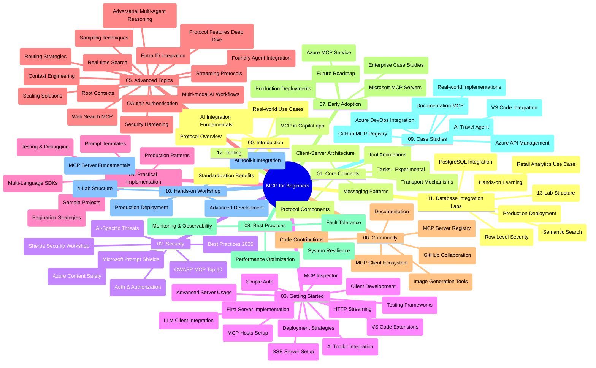

# नवशिकल्यांसाठी मॉडेल कॉन्टेक्स्ट प्रोटोकॉल (MCP) - अभ्यास मार्गदर्शक

हा अभ्यास मार्गदर्शक "नवशिकल्यांसाठी मॉडेल कॉन्टेक्स्ट प्रोटोकॉल (MCP)" अभ्यासक्रमासाठी रेपॉझिटरी संरचना आणि विषय याचे एक आढावा प्रदान करतो. रेपॉझिटरीमध्ये कार्यक्षमतेने नेव्हिगेट करण्यासाठी आणि उपलब्ध संसाधनांचा सर्वोत्तम फायदा घेण्यासाठी हा मार्गदर्शक वापरा.

## रेपॉझिटरीचा आढावा

मॉडेल कॉन्टेक्स्ट प्रोटोकॉल (MCP) हा एआय मॉडेल्स आणि क्लायंट अनुप्रयोगांमधील संवादांसाठी एक मानकीकृत फ्रेमवर्क आहे. मूलत: अँथ्रोपिकने तयार केलेला, आता MCP अधिकृत GitHub संघटनेद्वारे व्यापक MCP समुदायाद्वारे देखभाल केली जाते. ही रेपॉझिटरी C#, Java, JavaScript, Python, आणि TypeScript मध्ये व्यावहारिक कोड उदाहरणांसह एक सर्वसमावेशक अभ्यासक्रम प्रदान करते, जी एआय डेव्हलपर, प्रणाली वास्तुविद, आणि सॉफ्टवेअर अभियंत्यांसाठी तयार केली गेली आहे.

## दृश्य अभ्यासक्रम नकाशा

## रेपॉझिटरी संरचना

रेपॉझिटरी बार मुख्य विभागांमध्ये आयोजित केली गेली आहे, प्रत्येक MCP च्या विविध पैलूवर लक्ष केंद्रित करते:

1. **परिचय (00-Introduction/)**
   - मॉडेल कॉन्टेक्स्ट प्रोटोकॉलचा आढावा
   - एआय पाइपलाइन्समध्ये मानकीकरण का महत्त्वाचे आहे
   - व्यावहारिक उपयोग प्रकरणे आणि फायदे

2. **कोर संकल्पना (01-CoreConcepts/)**
   - क्लायंट-सर्व्हर आर्किटेक्चर
   - मुख्य प्रोटोकॉल घटक
   - MCP मधील मेसेजिंग पॅटर्न
   - पुढे पहाणे: [MCP मध्ये काय बदलत आहे: 2026-07-28 रिलीज़ कँडिडेट](./01-CoreConcepts/mcp-2026-07-28-release-candidate.md) — स्टेटलेस प्रोटोकॉल कोर, एक्स्टेंशन्स फ्रेमवर्क, आणि पुढील निर्दिष्टीकरण आवृत्तीत अपेक्षित Roots/Sampling/Logging डिप्रिकेटशन्स

3. **सुरक्षा (02-Security/)**
   - MCP-आधारित प्रणालीतील सुरक्षा धोके
   - अमलात आणण्यासाठी सर्वोत्तम पद्धती
   - प्रमाणीकरण आणि अधिकृतरण धोरणे
   - **संपूर्ण सुरक्षा दस्तऐवज**:
     - MCP सुरक्षा सर्वोत्तम पद्धती 2025
     - Azure सामग्री सुरक्षा अंमलबजावणी मार्गदर्शक
     - MCP सुरक्षा नियंत्रण आणि तंत्र
     - MCP सर्वोत्तम पद्धती त्वरित संदर्भ
   - **महत्त्वाचे सुरक्षा विषय**:
     - प्रॉम्प्ट इंजेक्शन आणि टूल विषबाधा हल्ले
     - सेशन हायजॅकिंग आणि भ्रमित डिप्युटी समस्या
     - टोकन पासथ्रू कमकुवतपणा
     - अत्यधिक परवानग्या आणि प्रवेश नियंत्रण
     - एआय घटकांसाठी पुरवठा साखळी सुरक्षा
     - मायक्रोसॉफ्ट प्रॉम्प्ट शील्ड्स समाकलन

4. **प्रारंभ करणे (03-GettingStarted/)**
   - पर्यावरण सेटअप आणि कॉन्फिगरेशन
   - मूलभूत MCP सर्व्हर आणि क्लायंट तयार करणे
   - विद्यमान अनुप्रयोगांशी समाकलन
   - या विभागांमध्ये समाविष्ट:
     - प्रथम सर्व्हर अंमलबजावणी
     - क्लायंट विकास
     - LLM क्लायंट समाकलन
     - VS कोड समाकलन
     - सर्व्हर-सेंट इव्हेंट्स (SSE) सर्व्हर
     - प्रगत सर्व्हर वापर
     - HTTP स्ट्रिमिंग
     - AI टूलकिट समाकलन
     - चाचणी धोरणे
     - तैनाती मार्गदर्शक तत्त्वे

5. **व्यावहारिक अंमलबजावणी (04-PracticalImplementation/)**
   - विविध प्रोग्रामिंग भाषांमध्ये SDK वापरणे
   - डिबगिंग, चाचणी आणि प्रमाणीकरण तंत्रे
   - पुनर्वापरयोग्य प्रॉम्प्ट साचे आणि वर्कफ्लोज तयार करणे
   - अंमलबजावणीच्या उदाहरणांसह नमुना प्रकल्प

6. **प्रगत विषय (05-AdvancedTopics/)**
   - कॉन्टेक्स्ट अभियांत्रिकी तंत्र
   - Foundry एजंट समाकलन
   - बहुउपयोगी AI वर्कफ्लोज
   - OAuth2 प्रमाणीकरण डेमो
   - रिअल-टाइम शोध क्षमता
   - रिअल-टाइम स्ट्रिमिंग
   - Root कॉन्टेक्स्ट्सची अंमलबजावणी
   - रूटिंग धोरणे
   - सॅम्पलिंग तंत्र
   - स्केलिंग पद्धती
   - सुरक्षा विचार
   - Entra ID सुरक्षा समाकलन
   - वेब शोध समाकलन
   - प्रतिस्पर्धी बहु-एजंट तर्कशास्त्र (वाद पॅटर्न)

7. **समुदाय योगदान (06-CommunityContributions/)**
   - कोड आणि दस्तऐवज कसे द्यायचे
   - GitHub द्वारे सहकार्य करणे
   - समुदाय प्रेरित सुधारणा आणि अभिप्राय
   - विविध MCP क्लायंट वापर (Claude Desktop, Cline, VSCode)
   - प्रसिद्ध MCP सर्व्हरसोबत काम करणे, ज्यात प्रतिमा निर्मिती समाविष्ट आहे

8. **प्रारंभिक स्वीकृतीचे धडे (07-LessonsfromEarlyAdoption/)**
   - वास्तविक अंमलबजावणी आणि यशोगाथा
   - MCP-आधारित उपाय तयार करणे आणि तैनात करणे
   - ट्रेंड्स आणि भविष्यातील रोडमॅप
   - **मायक्रोसॉफ्ट MCP सर्व्हर मार्गदर्शक**: 10 उत्पादन-तयार मायक्रोसॉफ्ट MCP सर्व्हर यांचा संपूर्ण मार्गदर्शक ज्यात:
     - Microsoft Learn Docs MCP Server
     - Azure MCP Server (15+ विशेष कनेक्टर्स)
     - GitHub MCP Server
     - Azure DevOps MCP Server
     - MarkItDown MCP Server
     - SQL Server MCP Server
     - Playwright MCP Server
     - Dev Box MCP Server
     - Microsoft Foundry MCP Server
     - Microsoft 365 Agents Toolkit MCP Server

9. **सर्वोत्तम पद्धती (08-BestPractices/)**
   - कार्यक्षमता ट्यूनिंग आणि अनुकूलन
   - दोष-प्रतिरोधक MCP प्रणाली डिझाइन करणे
   - तपासणी आणि लवचीकता धोरणे

10. **केस स्टडीज (09-CaseStudy/)**
    - विविध परिस्थितींमध्ये MCP चा बहुमुखीपणा दर्शवणाऱ्या **सात व्यापक केस स्टडीज**:
    - **Azure AI प्रवास एजंट्स**: Azure OpenAI आणि AI शोधासह बहु-एजंट समन्वय
    - **Azure DevOps समाकलन**: YouTube डेटा अद्यतनांसह वर्कफ्लो प्रक्रियेचे स्वयंचलितीकरण
    - **रिअल-टाइम दस्तऐवज प्राप्ती**: Python कन्सोल क्लायंट HTTP स्ट्रिमिंगसह
    - **इंटरॅक्टिव्ह अभ्यास योजना निर्मिती करणारा**: Chainlit वेब अ‍ॅप संभाषणात्मक AI सह
    - **इन-एडिटर दस्तऐवज**: GitHub Copilot वर्कफ्लोजसह VS कोड समाकलन
    - **Azure API व्यवस्थापन**: MCP सर्व्हर तयार करण्यासह एंटरप्राइझ API समाकलन
    - **GitHub MCP नोंदणी**: परिसंस्था विकास आणि एजंटिक समाकलन प्लॅटफॉर्म
    - एंटरप्राइझ समाकलन, डेव्हलपर उत्पादकता, आणि परिसंस्था विकासामध्ये विस्तारलेली अंमलबजावणी उदाहरणे

11. **हँड्स-ऑन कार्यशाळा (10-StreamliningAIWorkflowsBuildingAnMCPServerWithAIToolkit/)**
    - MCP आणि AI टूलकिट एकत्र करणारी संपूर्ण हँड्स-ऑन कार्यशाळा
    - एआय मॉडेल्सला वास्तविक विश्वातील साधनांशी जोडणाऱ्या बुद्धिमान अनुप्रयोगांची निर्मिती
    - मूलतत्त्वे, कस्टम सर्व्हर विकास, आणि उत्पादन तैनाती धोरणे या व्यावहारिक मॉड्यूल्सचा समावेश
    - **प्रयोगशाळेची रचना**:
      - प्रयोगशाळा 1: MCP सर्व्हर मूलतत्त्वे
      - प्रयोगशाळा 2: प्रगत MCP सर्व्हर विकास
      - प्रयोगशाळा 3: AI टूलकिट समाकलन
      - प्रयोगशाळा 4: उत्पादन तैनाती आणि स्केलिंग
    - चरण-दर-चरण सूचनांसह प्रायोगिक शिकण्याची पद्धत

12. **MCP सर्व्हर डेटाबेस समाकलन प्रयोगशाळा (11-MCPServerHandsOnLabs/)**
    - पोस्टग्रेएसक्यूएल समाकलनासहित उत्पादन-तयार MCP सर्व्हर तयार करण्यासाठी **संपूर्ण 13-प्रयोगशाळा शिक्षण मार्ग**
    - झावा रिटेल वापर प्रकरणासह **वास्तविक-विश्व किरकोळ विश्लेषण अंमलबजावणी**
    - **एंटरप्राइझ-ग्रेड पद्धती** ज्यात रो लेव्हल सुरक्षा (RLS), सांगीतिक शोध, आणि बहु-टेनंट डेटा प्रवेश समाविष्ट आहे
    - **पूर्ण प्रयोगशाळेची रचना**:
      - **प्रयोगशाळा 00-03: मूलभूत तत्त्वे** - परिचय, आर्किटेक्चर, सुरक्षा, पर्यावरण सेटअप
      - **प्रयोगशाळा 04-06: MCP सर्व्हर तयार करणे** - डेटाबेस डिझाइन, MCP सर्व्हर अंमलबजावणी, साधन विकास
      - **प्रयोगशाळा 07-09: प्रगत वैशिष्ट्ये** - सांगीतिक शोध, चाचणी व डिबगिंग, VS कोड समाकलन
      - **प्रयोगशाळा 10-12: उत्पादन आणि सर्वोत्तम पद्धती** - तैनाती, देखरेख, अनुकूलन
    - **समाविष्ट तंत्रज्ञान**: FastMCP फ्रेमवर्क, पोस्टग्रेएसक्यूएल, Azure OpenAI, Azure कंटेनर अ‍ॅप्स, अ‍ॅप्लिकेशन इनसाइट्स
    - **शिकण्याचे परिणाम**: उत्पादन-तयार MCP सर्व्हर, डेटाबेस समाकलन पद्धती, एआय-संचालित विश्लेषण, एंटरप्राइझ सुरक्षा

13. **साधने (12-tooling/)**
    - MCP कसे वापरायचे ते Copilot अ‍ॅप आणि इतर साधनांमध्ये शिका

## अतिरिक्त संसाधने

रेपॉझिटरीमध्ये सहाय्यक संसाधने समाविष्ट आहेत:

- **इमेजेस फोल्डर**: अभ्यासक्रमभर वापरलेली आकृत्या आणि चित्रे समाविष्ट आहेत
- **भाषांतर**: दस्तऐवजांचे बहुभाषिक समर्थन व स्वयंचलित भाषांतर
- **अधिकृत MCP संसाधने**:
  - [MCP Documentation](https://modelcontextprotocol.io/)
  - [MCP Specification](https://spec.modelcontextprotocol.io/)
  - [MCP GitHub Repository](https://github.com/modelcontextprotocol)

## ही रेपॉझिटरी कशी वापरावी

1. **क्रमवार शिक्षण**: सुसंगत शिकण्याचा अनुभवासाठी तक्त्यांनुसार (00 ते 11) अध्यायांचे अनुसरण करा.
2. **भाषा-विशिष्ट लक्ष**: तुम्हाला एखाद्या प्रोग्रामिंग भाषेत अधिक रस असल्यास, तुमच्या पसंतीच्या भाषेमध्ये अंमलबजावणीसाठी नमुना डिरेक्टरीज तपासा.
3. **व्यावहारिक अंमलबजावणी**: तुमचे पर्यावरण सेट करण्यासाठी आणि प्रथम MCP सर्व्हर आणि क्लायंट तयार करण्यासाठी "प्रारंभ करणे" विभागातून सुरू करा.
4. **प्रगत अन्वेषण**: मूलभूत गोष्टींचा आत्मसात केल्यावर, तुमचे ज्ञान वाढवण्यासाठी प्रगत विषयांमध्ये डुबकी मारा.
5. **समुदाय सहभाग**: GitHub चर्चा आणि Discord चॅनेल्स मधून MCP समुदायात सहभागी व्हा, तज्ञ आणि अन्य डेव्हलपरशी संपर्क साधा.

## MCP क्लायंट्स आणि साधने

अभ्यासक्रम विविध MCP क्लायंट्स आणि साधने समाविष्ट करतो:

1. **अधिकृत क्लायंट्स**:
   - Visual Studio Code 
   - Visual Studio Code मध्ये MCP
   - Claude Desktop
   - VSCode मध्ये Claude 
   - Claude API

2. **समुदाय क्लायंट्स**:
   - Cline (टर्मिनल-आधारित)
   - Cursor (कोड संपादक)
   - ChatMCP
   - Windsurf

3. **MCP व्यवस्थापन साधने**:
   - MCP CLI
   - MCP Manager
   - MCP Linker
   - MCP Router

## लोकप्रिय MCP सर्व्हर

रेपॉझिटरी विविध MCP सर्व्हर ओळखून देते, ज्यात समाविष्ट आहे:

1. **अधिकृत Microsoft MCP सर्व्हर**:
   - Microsoft Learn Docs MCP Server
   - Azure MCP Server (15+ विशेष कनेक्टर्स)
   - GitHub MCP Server
   - Azure DevOps MCP Server
   - MarkItDown MCP Server
   - SQL Server MCP Server
   - Playwright MCP Server
   - Dev Box MCP Server
   - Microsoft Foundry MCP Server
   - Microsoft 365 Agents Toolkit MCP Server

2. **अधिकृत संदर्भ सर्व्हर**:
   - Filesystem
   - Fetch
   - Memory
   - Sequential Thinking

3. **प्रतिमा निर्मिती**:
   - Azure OpenAI DALL-E 3
   - Stable Diffusion WebUI
   - Replicate

4. **विकास साधने**:
   - Git MCP
   - Terminal Control
   - Code Assistant

5. **विशेषत: तयार केलेले सर्व्हर**:
   - Salesforce
   - Microsoft Teams
   - Jira & Confluence

## योगदान देणे

ही रेपॉझिटरी समुदायाकडून योगदानांचे स्वागत करते. MCP परिसंस्थेसाठी प्रभावीपणे योगदान देण्यासाठी मार्गदर्शनासाठी समुदाय योगदान विभाग पहा.

----

*हा अभ्यास मार्गदर्शक शेवटचा अद्यतन ५ फेब्रुवारी २०२६ रोजी करण्यात आला, ज्यात नवीनतम MCP तपशील २०२५-११-२५ प्रतिबिंबित केले आहे आणि त्या तारखेपर्यंतची रेपॉझिटरीची एकूण माहिती प्रदान करतो. रेपॉझिटरीची सामग्री या तारखेनंतर अद्यतनित केली जाऊ शकते.*

*पुरवणी (२ जुलै २०२६): `2026-07-28` MCP तपशील रिलीज कँडिडेटवर एक धडा [01-CoreConcepts](./01-CoreConcepts/mcp-2026-07-28-release-candidate.md) अंतर्गत जोडला गेला; अभ्यासक्रमाची आधाररेषा २०२५-११-२५ पर्यंत नवीन तपशील पोहोचत नाही तोपर्यंत आहे.*

---

<!-- CO-OP TRANSLATOR DISCLAIMER START -->
**अस्वीकरण**:
हा दस्तऐवज AI भाषांतर सेवा [Co-op Translator](https://github.com/Azure/co-op-translator) चा वापर करून अनुवादित केला आहे. जरी आम्ही अचूकतेसाठी प्रयत्न करतो, तरी कृपया लक्षात घ्या की स्वयंचलित भाषांतरांमध्ये त्रुटी किंवा अचूकतेची कमतरता असू शकते. मूळ दस्तऐवज त्याच्या मूळ भाषेत अधिकृत स्रोत मानला पाहिजे. महत्त्वाची माहिती असल्यास, व्यावसायिक मानवी भाषांतराची शिफारस केली जाते. या भाषांतराच्या वापरामुळे उद्भवणाऱ्या कोणत्याही गैरसमज किंवा चुकीच्या अर्थलावणीसाठी आम्ही जबाबदार नाही.
<!-- CO-OP TRANSLATOR DISCLAIMER END -->