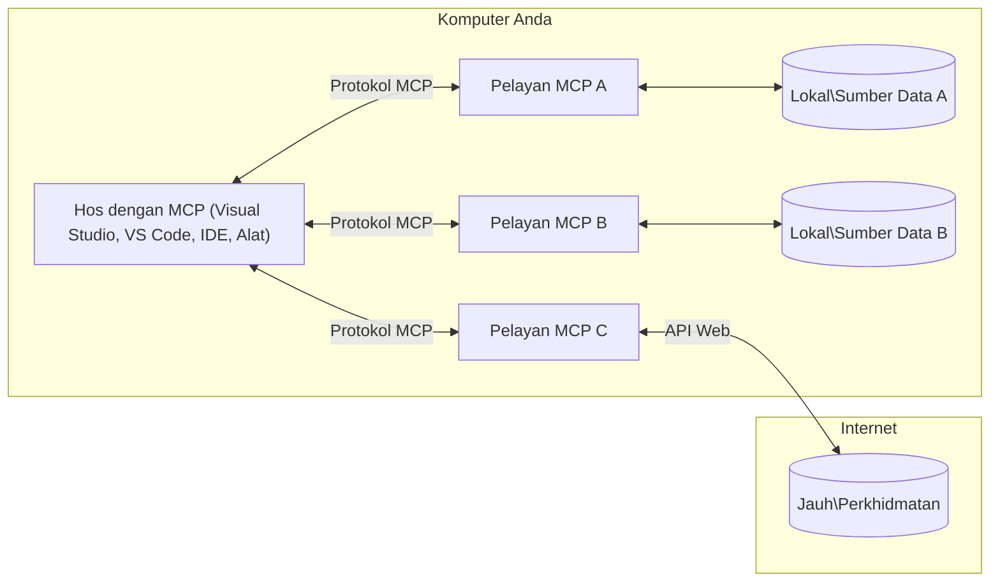

# Konsep Teras MCP: Menguasai Protokol Konteks Model untuk Integrasi AI

[](https://youtu.be/earDzWGtE84)

_(Klik imej di atas untuk menonton video pelajaran ini)_

[Model Context Protocol (MCP)](https://github.com/modelcontextprotocol) adalah rangka kerja berstandard yang berkuasa yang mengoptimumkan komunikasi antara Large Language Models (LLM) dan alat luaran, aplikasi, serta sumber data. 
Panduan ini akan membawa anda meneroka konsep teras MCP. Anda akan mempelajari mengenai seni bina klien-pelayan, komponen penting, mekanisme komunikasi, dan amalan terbaik pelaksanaan.

- **Persetujuan Pengguna Secara Eksplisit**: Semua akses data dan operasi memerlukan kelulusan eksplisit pengguna sebelum dijalankan. Pengguna mesti memahami dengan jelas data apa yang akan diakses dan tindakan apa yang akan dilakukan, dengan kawalan terperinci ke atas kebenaran dan kuasa.

- **Perlindungan Privasi Data**: Data pengguna hanya didedahkan dengan persetujuan eksplisit dan mesti dilindungi oleh kawalan akses yang kukuh sepanjang kitaran interaksi. Pelaksanaan mesti menghalang penghantaran data yang tidak sah dan mengekalkan sempadan privasi yang ketat.

- **Keselamatan Pelaksanaan Alat**: Setiap panggilan alat memerlukan persetujuan pengguna yang jelas dengan pemahaman fungsi alat, parameter, dan impak berpotensi. Sempadan keselamatan yang kukuh mesti menghalang pelaksanaan alat yang tidak diingini, tidak selamat, atau berniat jahat.

- **Keselamatan Lapisan Penghantaran**: Semua saluran komunikasi harus menggunakan penyulitan dan mekanisme pengesahan yang sesuai. Sambungan jauh harus melaksanakan protokol penghantaran yang selamat dan pengurusan kelayakan yang betul.

#### Garis Panduan Pelaksanaan:

- **Pengurusan Kebenaran**: Laksanakan sistem kebenaran terperinci yang membenarkan pengguna mengawal pelayan, alat, dan sumber mana yang boleh diakses
- **Pengesahan & Kebenaran**: Gunakan kaedah pengesahan yang selamat (OAuth, kunci API) dengan pengurusan token dan tamat tempoh yang betul  
- **Pengesahan Input**: Sahkan semua parameter dan input data mengikut skema yang ditetapkan untuk mengelakkan serangan suntikan
- **Log Audit**: Simpan log komprehensif semua operasi untuk pemantauan keselamatan dan pematuhan

## Gambaran Keseluruhan

Pelajaran ini meneroka seni bina dan komponen asas yang membentuk ekosistem Model Context Protocol (MCP). Anda akan mempelajari seni bina klien-pelayan, komponen utama, dan mekanisme komunikasi yang menggerakkan interaksi MCP.

## Objektif Pembelajaran Utama

Pada akhir pelajaran ini, anda akan:

- Memahami seni bina klien-pelayan MCP.
- Mengenal pasti peranan dan tanggungjawab Hos, Klien, dan Pelayan.
- Menganalisis ciri utama yang menjadikan MCP lapisan integrasi yang fleksibel.
- Mempelajari bagaimana aliran maklumat dalam ekosistem MCP.
- Mendapatkan pandangan praktikal melalui contoh kod dalam .NET, Java, Python, dan JavaScript.

## Seni Bina MCP: Tinjauan Mendalam

Ekosistem MCP dibina pada model klien-pelayan. Struktur modular ini membolehkan aplikasi AI berinteraksi dengan alat, pangkalan data, API, dan sumber kontekstual dengan cekap. Mari kita pecahkan seni bina ini kepada komponen terasnya.

Pada terasnya, MCP mengikuti seni bina klien-pelayan di mana aplikasi hos boleh menyambung ke beberapa pelayan:



- **Hos MCP**: Program seperti VSCode, Claude Desktop, IDE, atau alat AI yang ingin mengakses data melalui MCP
- **Klien MCP**: Klien protokol yang mengekalkan sambungan 1:1 dengan pelayan
- **Pelayan MCP**: Program ringan yang masing-masing mendedahkan kebolehan tertentu melalui Model Context Protocol yang distandardkan
- **Sumber Data Tempatan**: Fail komputer, pangkalan data, dan perkhidmatan yang boleh diakses dengan selamat oleh pelayan MCP
- **Perkhidmatan Jauh**: Sistem luaran yang tersedia melalui internet yang boleh disambungkan oleh pelayan MCP melalui API.

Protokol MCP adalah standard yang berkembang menggunakan versi berasaskan tarikh (format YYYY-MM-DD). Versi protokol semasa ialah **2025-11-25**. Anda boleh melihat kemas kini terkini pada [spesifikasi protokol](https://modelcontextprotocol.io/specification/2025-11-25/)

> **Melihat ke hadapan:** calon pelepasan untuk versi spesifikasi seterusnya, **2026-07-28**, telah diumumkan pada Mei 2026 dan dijadualkan dilancarkan pada 28 Julai 2026. Ia menjadikan protokol tanpa status pada lapisan pengangkutan (menghapuskan jabat tangan `initialize` dan ID sesi), memformalkan rangka kerja Sambungan, dan menghentikan Roots, Sampling, dan Logging demi corak yang lebih baru. Lihat [Apa Yang Berubah dalam MCP: Calon Pelepasan 2026-07-28](./mcp-2026-07-28-release-candidate.md) untuk pecahan penuh.

### 1. Hos

Dalam Model Context Protocol (MCP), **Hos** adalah aplikasi AI yang berfungsi sebagai antara muka utama di mana pengguna berinteraksi dengan protokol. Hos menyelaras dan mengurus sambungan kepada beberapa pelayan MCP dengan mencipta klien MCP khusus untuk setiap sambungan pelayan. Contoh Hos termasuk:

- **Aplikasi AI**: Claude Desktop, Visual Studio Code, Claude Code
- **Persekitaran Pembangunan**: IDE dan penyunting kod dengan integrasi MCP  
- **Aplikasi Khusus**: Ejen dan alat AI yang dibina khas

**Hos** adalah aplikasi yang menyelaras interaksi model AI. Mereka:

- **Mengorkestrakan Model AI**: Melaksanakan atau berinteraksi dengan LLM untuk menjana respons dan menyelaras aliran kerja AI
- **Mengurus Sambungan Klien**: Mencipta dan mengekalkan satu klien MCP bagi setiap sambungan pelayan MCP
- **Mengawal Antara Muka Pengguna**: Mengendalikan aliran perbualan, interaksi pengguna, dan penyampaian respons  
- **Menguatkuasakan Keselamatan**: Mengawal kebenaran, kekangan keselamatan, dan pengesahan
- **Mengendalikan Persetujuan Pengguna**: Mengurus kelulusan pengguna untuk perkongsian data dan pelaksanaan alat


### 2. Klien

**Klien** adalah komponen penting yang mengekalkan sambungan khusus satu-ke-satu antara Hos dan pelayan MCP. Setiap klien MCP dihasilkan oleh Hos untuk menyambung ke pelayan MCP tertentu, memastikan saluran komunikasi yang teratur dan selamat. Beberapa klien membolehkan Hos menyambung ke beberapa pelayan secara serentak.

**Klien** adalah komponen penyambung dalam aplikasi hos. Mereka:

- **Komunikasi Protokol**: Menghantar permintaan JSON-RPC 2.0 kepada pelayan dengan arahan dan stimuli
- **Perundingan Kebolehan**: Rundingan ciri yang disokong dan versi protokol dengan pelayan semasa inisialisasi
- **Pelaksanaan Alat**: Mengurus permintaan pelaksanaan alat daripada model dan memproses respons
- **Kemas Kini Masa Nyata**: Mengendalikan notifikasi dan kemas kini masa nyata daripada pelayan
- **Pemprosesan Respons**: Memproses dan memformat respons pelayan untuk dipaparkan kepada pengguna

### 3. Pelayan

**Pelayan** adalah program yang menyediakan konteks, alat, dan kebolehan kepada klien MCP. Mereka boleh dijalankan secara tempatan (di mesin yang sama dengan Hos) atau jauh (di platform luaran), dan bertanggungjawab mengendalikan permintaan klien serta menyediakan respons berstruktur. Pelayan mendedahkan fungsi tertentu melalui Model Context Protocol yang distandardkan.

**Pelayan** adalah perkhidmatan yang menyediakan konteks dan kebolehan. Mereka:

- **Pendaftaran Ciri**: Mendaftar dan mendedahkan primitif yang tersedia (sumber, isyarat, alat) kepada klien
- **Pemprosesan Permintaan**: Menerima dan melaksanakan panggilan alat, permintaan sumber, dan permintaan isyarat daripada klien
- **Penyediaan Konteks**: Menyediakan maklumat dan data kontekstual untuk meningkatkan respons model
- **Pengurusan Keadaan**: Mengekalkan keadaan sesi dan mengendalikan interaksi berkeadaan bila perlu
- **Notifikasi Masa Nyata**: Menghantar notifikasi tentang perubahan kebolehan dan kemas kini kepada klien yang disambungkan

Pelayan boleh dibangunkan oleh sesiapa untuk meluaskan kebolehan model dengan fungsi khusus, dan menyokong kedua-dua senario pelaksanaan lokal dan jauh.

### 4. Primitif Pelayan

Pelayan dalam Model Context Protocol (MCP) menyediakan tiga **primitif** teras yang mentakrifkan blok bangunan asas untuk interaksi kaya antara klien, hos, dan model bahasa. Primitif ini menentukan jenis maklumat kontekstual dan tindakan yang tersedia melalui protokol.

Pelayan MCP boleh mendedahkan mana-mana gabungan daripada tiga primitif teras berikut:

#### Sumber 

**Sumber** adalah sumber data yang menyediakan maklumat kontekstual kepada aplikasi AI. Mereka mewakili kandungan statik atau dinamik yang boleh meningkatkan pemahaman dan pembuatan keputusan model:

- **Data Kontekstual**: Maklumat berstruktur dan konteks untuk penggunaan model AI
- **Pangkalan Pengetahuan**: Repositori dokumen, artikel, manual, dan kertas penyelidikan
- **Sumber Data Tempatan**: Fail, pangkalan data, dan maklumat sistem tempatan  
- **Data Luaran**: Respons API, perkhidmatan web, dan data sistem jauh
- **Kandungan Dinamik**: Data masa nyata yang dikemas kini berdasarkan keadaan luaran

Sumber dikenal pasti oleh URI dan menyokong penemuan melalui metode `resources/list` dan pengambilan melalui metode `resources/read`:

```text
file://documents/project-spec.md
database://production/users/schema
api://weather/current
```

#### Isyarat

**Isyarat** adalah templat semula yang membantu menyusun interaksi dengan model bahasa. Mereka menyediakan corak interaksi berstandard dan aliran kerja berformat:

- **Interaksi Berasaskan Templat**: Mesej praterstruktur dan permulaan perbualan
- **Templat Aliran Kerja**: Urutan standard untuk tugas dan interaksi biasa
- **Contoh Few-shot**: Templat berasaskan contoh untuk arahan model
- **Isyarat Sistem**: Isyarat asas yang mentakrifkan tingkah laku dan konteks model
- **Templat Dinamik**: Isyarat berparameter yang menyesuaikan dengan konteks tertentu

Isyarat menyokong penggantian pemboleh ubah dan boleh ditemui melalui `prompts/list` dan diambil dengan `prompts/get`:

```markdown
Generate a {{task_type}} for {{product}} targeting {{audience}} with the following requirements: {{requirements}}
```

#### Alat

**Alat** adalah fungsi yang boleh dilaksanakan yang boleh dipanggil oleh model AI untuk melaksanakan tindakan tertentu. Mereka mewakili "kata kerja" ekosistem MCP, membolehkan model berinteraksi dengan sistem luaran:

- **Fungsi Boleh Dilaksanakan**: Operasi diskret yang boleh dipanggil model dengan parameter tertentu
- **Integrasi Sistem Luaran**: Panggilan API, pertanyaan pangkalan data, operasi fail, pengiraan
- **Identiti Unik**: Setiap alat mempunyai nama, penerangan, dan skema parameter tersendiri
- **I/O Berstruktur**: Alat menerima parameter yang disahkan dan mengembalikan respons yang berstruktur dan bertipe
- **Kebolehan Tindakan**: Membolehkan model melaksanakan tindakan dunia sebenar dan mengambil data langsung

Alat ditakrifkan dengan JSON Schema untuk pengesahan parameter dan ditemui melalui `tools/list` serta dilaksanakan melalui `tools/call`. Alat juga boleh termasuk **ikon** sebagai metadata tambahan untuk penyampaian UI yang lebih baik.

**Anotasi Alat**: Alat menyokong anotasi tingkah laku (contohnya, `readOnlyHint`, `destructiveHint`) yang menerangkan sama ada alat itu hanya baca atau destruktif, membantu klien membuat keputusan termaklum tentang pelaksanaan alat.

Contoh definisi alat:

```typescript
server.tool(
  "search_products", 
  {
    query: z.string().describe("Search query for products"),
    category: z.string().optional().describe("Product category filter"),
    max_results: z.number().default(10).describe("Maximum results to return")
  }, 
  async (params) => {
    // Laksanakan carian dan pulangkan hasil terstruktur
    return await productService.search(params);
  }
);
```

## Primitif Klien

Dalam Model Context Protocol (MCP), **klien** boleh mendedahkan primitif yang membolehkan pelayan memohon kebolehan tambahan daripada aplikasi hos. Primitif sisi klien ini membolehkan pelaksanaan pelayan yang lebih kaya dan interaktif yang boleh mengakses kebolehan model AI dan interaksi pengguna.

### Sampling

> **Notis penghapusan:** calon pelepasan `2026-07-28` menandakan Sampling sebagai dihentikan demi integrasi terus dengan API pembekal LLM. Ia terus berfungsi pada `2025-11-25` dan sekurang-kurangnya setahun selepas apa-apa penghapusan, tetapi reka bentuk baru harus mengutamakan corak penggantian. Lihat [Apa Yang Berubah dalam MCP: Calon Pelepasan 2026-07-28](./mcp-2026-07-28-release-candidate.md).

**Sampling** membolehkan pelayan memohon penyelesaian model bahasa daripada aplikasi AI klien. Primitif ini membolehkan pelayan mengakses kebolehan LLM tanpa menyematkan pergantungan model sendiri:

- **Akses Bebas Model**: Pelayan boleh memohon penyelesaian tanpa memasukkan SDK LLM atau mengurus akses model
- **AI Inisiatif Pelayan**: Membolehkan pelayan menjana kandungan secara autonomi menggunakan model AI klien
- **Interaksi LLM Bersiri**: Menyokong senario kompleks di mana pelayan memerlukan bantuan AI untuk pemprosesan
- **Penjanaan Kandungan Dinamik**: Membolehkan pelayan membuat respons kontekstual menggunakan model hos
- **Sokongan Panggilan Alat**: Pelayan boleh memasukkan parameter `tools` dan `toolChoice` untuk membolehkan model klien memanggil alat semasa sampling

Sampling dimulakan melalui metode `sampling/complete`, di mana pelayan menghantar permintaan penyelesaian ke klien.

### Roots

> **Notis penghapusan:** calon pelepasan `2026-07-28` menandakan Roots sebagai dihentikan demi parameter alat, URI sumber, atau konfigurasi pelayan. Ia terus berfungsi pada `2025-11-25` dan sekurang-kurangnya setahun selepas apa-apa penghapusan. Lihat [Apa Yang Berubah dalam MCP: Calon Pelepasan 2026-07-28](./mcp-2026-07-28-release-candidate.md).

**Roots** menyediakan cara standard untuk klien mendedahkan sempadan sistem fail kepada pelayan, membantu pelayan faham direktori dan fail mana yang boleh diakses:

- **Sempadan Sistem Fail**: Mentakrifkan sempadan di mana pelayan boleh beroperasi dalam sistem fail
- **Kawalan Akses**: Membantu pelayan faham direktori dan fail mana yang mereka ada kebenaran untuk akses
- **Kemas Kini Dinamik**: Klien boleh memberitahu pelayan apabila senarai roots berubah
- **Pengenalpastian Berasaskan URI**: Roots menggunakan URI `file://` untuk mengenal pasti direktori dan fail yang boleh diakses

Roots ditemui melalui metode `roots/list`, dengan klien menghantar `notifications/roots/list_changed` apabila roots berubah.

### Elicitation  

**Elicitation** membolehkan pelayan memohon maklumat tambahan atau pengesahan daripada pengguna melalui antara muka klien:

- **Permintaan Input Pengguna**: Pelayan boleh meminta maklumat tambahan apabila diperlukan untuk pelaksanaan alat
- **Dialog Pengesahan**: Memohon kelulusan pengguna untuk operasi sensitif atau berimpak
- **Aliran Kerja Interaktif**: Membolehkan pelayan mencipta interaksi pengguna secara langkah demi langkah
- **Pengumpulan Parameter Dinamik**: Mengumpul parameter yang hilang atau pilihan semasa pelaksanaan alat

Permintaan elicitation dibuat menggunakan metode `elicitation/request` untuk mengumpulkan input pengguna melalui antara muka klien.

**Mod Elicitation URL**: Pelayan juga boleh memohon interaksi pengguna berasaskan URL, membolehkan pelayan mengarahkan pengguna ke halaman web luaran untuk pengesahan, pengesahan identiti, atau masukan data.

### Logging


> **Notis pemansuhan:** calon keluaran `2026-07-28` menandakan Pencatatan sebagai sudah lapuk demi `stderr` untuk pengangkutan stdio dan OpenTelemetry untuk pemerhatian berstruktur. Ia terus berfungsi dalam `2025-11-25` dan sekurang-kurangnya setahun selepas sebarang pemansuhan. Lihat [Apa yang Berubah dalam MCP: Calon Keluaran 2026-07-28](./mcp-2026-07-28-release-candidate.md).

**Pencatatan** membolehkan pelayan menghantar mesej log berstruktur kepada klien untuk penyahpepijatan, pemantauan dan keterlihatan operasi:

- **Sokongan Penyahpepijatan**: Membolehkan pelayan menyediakan log pelaksanaan terperinci untuk penyelesaian masalah
- **Pemantauan Operasi**: Menghantar kemaskini status dan metrik prestasi kepada klien
- **Pelaporan Ralat**: Menyediakan konteks ralat terperinci dan maklumat diagnostik
- **Jejak Audit**: Membuat log komprehensif bagi operasi dan keputusan pelayan

Mesej pencatatan dihantar kepada klien untuk menyediakan ketelusan dalam operasi pelayan dan memudahkan penyahpepijatan.

## Aliran Maklumat dalam MCP

Protokol Konteks Model (MCP) mentakrifkan aliran maklumat berstruktur antara hos, klien, pelayan, dan model. Memahami aliran ini membantu menjelaskan bagaimana permintaan pengguna diproses dan bagaimana alat serta data luar diintegrasikan ke dalam respons model.

- **Hos Memulakan Sambungan**  
  Aplikasi hos (seperti IDE atau antara muka sembang) mewujudkan sambungan ke pelayan MCP, biasanya melalui STDIO, WebSocket, atau pengangkutan lain yang disokong.

- **Perundingan Keupayaan**  
  Klien (terbenam dalam hos) dan pelayan bertukar maklumat tentang ciri, alat, sumber, dan versi protokol yang disokong. Ini memastikan kedua-dua pihak memahami keupayaan yang tersedia untuk sesi.

- **Permintaan Pengguna**  
  Pengguna berinteraksi dengan hos (contoh: memasukkan prompt atau arahan). Hos mengumpul input ini dan menghantarnya kepada klien untuk pemprosesan.

- **Penggunaan Sumber atau Alat**  
  - Klien mungkin meminta konteks tambahan atau sumber daripada pelayan (seperti fail, entri pangkalan data, atau artikel pangkalan pengetahuan) untuk memerkaya pemahaman model.
  - Jika model menentukan bahawa alat diperlukan (contohnya, untuk mendapatkan data, melakukan pengiraan, atau memanggil API), klien menghantar permintaan panggilan alat kepada pelayan, menyatakan nama alat dan parameter.

- **Pelaksanaan Pelayan**  
  Pelayan menerima permintaan sumber atau alat, menjalankan operasi yang diperlukan (seperti menjalankan fungsi, membuat pertanyaan pangkalan data, atau mendapatkan fail), dan mengembalikan hasil ke klien dalam format berstruktur.

- **Penjanaan Respons**  
  Klien mengintegrasikan respons pelayan (data sumber, output alat, dll.) ke dalam interaksi model yang sedang berjalan. Model menggunakan maklumat ini untuk menjana respons yang menyeluruh dan relevan secara kontekstual.

- **Pembentangan Keputusan**  
  Hos menerima output akhir dari klien dan membentangkannya kepada pengguna, biasanya termasuk teks yang dijana model serta sebarang hasil daripada pelaksanaan alat atau pencarian sumber.

Aliran ini membolehkan MCP menyokong aplikasi AI yang maju, interaktif, dan peka konteks dengan menghubungkan model secara lancar dengan alat dan sumber data luar.

## Seni Bina & Lapisan Protokol

MCP terdiri daripada dua lapisan seni bina berbeza yang bekerjasama untuk menyediakan rangka kerja komunikasi lengkap:

### Lapisan Data

**Lapisan Data** melaksanakan protokol MCP teras menggunakan **JSON-RPC 2.0** sebagai asasnya. Lapisan ini mentakrifkan struktur mesej, semantik, dan corak interaksi:

#### Komponen Teras:

- **Protokol JSON-RPC 2.0**: Semua komunikasi menggunakan format mesej JSON-RPC 2.0 yang standard untuk panggilan kaedah, respons, dan notifikasi
- **Pengurusan Kitaran Hayat**: Mengendalikan inisialisasi sambungan, perundingan keupayaan, dan penamatan sesi antara klien dan pelayan
- **Primitif Pelayan**: Membolehkan pelayan menyediakan fungsi teras melalui alat, sumber, dan prompt
- **Primitif Klien**: Membolehkan pelayan meminta pensampeyan dari LLM, mendapatkan input pengguna, dan menghantar mesej log
- **Notifikasi Masa Nyata**: Menyokong notifikasi tak segerak untuk kemaskini dinamik tanpa pengundian

#### Ciri Utama:

- **Perundingan Versi Protokol**: Menggunakan versi berasaskan tarikh (YYYY-MM-DD) untuk memastikan keserasian
- **Penemuan Keupayaan**: Klien dan pelayan bertukar maklumat ciri yang disokong semasa inisialisasi
- **Sesi Berstatus**: Mengekalkan keadaan sambungan merentas pelbagai interaksi untuk kesinambungan konteks

### Lapisan Pengangkutan

**Lapisan Pengangkutan** menguruskan saluran komunikasi, pembingkaian mesej, dan pengesahan antara peserta MCP:

#### Mekanisme Pengangkutan yang Disokong:

1. **Pengangkutan STDIO**:
   - Menggunakan aliran input/output standard untuk komunikasi proses langsung
   - Optimum untuk proses tempatan pada mesin yang sama tanpa overhead rangkaian
   - Sering digunakan untuk pelaksanaan pelayan MCP tempatan

2. **Pengangkutan HTTP Boleh Alir**:
   - Menggunakan HTTP POST untuk mesej klien-ke-pelayan  
   - Pilihan Server-Sent Events (SSE) untuk aliran pelayan-ke-klien
   - Membolehkan komunikasi pelayan jauh merentas rangkaian
   - Menyokong pengesahan HTTP standard (token pembawa, kunci API, header tersuai)
   - MCP mengesyorkan OAuth untuk pengesahan berasaskan token yang selamat

#### Abstraksi Pengangkutan:

Lapisan pengangkutan mengabstrakkan butiran komunikasi daripada lapisan data, membolehkan format mesej JSON-RPC 2.0 yang sama merentas semua mekanisme pengangkutan. Abstraksi ini membolehkan aplikasi bertukar antara pelayan tempatan dan jauh dengan lancar.

### Pertimbangan Keselamatan

Pelaksanaan MCP mesti mematuhi beberapa prinsip keselamatan kritikal untuk memastikan interaksi yang selamat, boleh dipercayai, dan terjamin di seluruh operasi protokol:

- **Persetujuan dan Kawalan Pengguna**: Pengguna mesti memberikan persetujuan jelas sebelum sebarang data diakses atau operasi dilakukan. Mereka harus mempunyai kawalan jelas terhadap data yang dikongsi dan tindakan yang dibenarkan, disokong oleh antara muka pengguna intuitif untuk menyemak dan meluluskan aktiviti.

- **Privasi Data**: Data pengguna hanya boleh didedahkan dengan persetujuan jelas dan mesti dilindungi oleh kawalan akses yang sesuai. Pelaksanaan MCP mesti melindungi daripada penghantaran data tanpa kebenaran dan memastikan privasi dikekalkan sepanjang interaksi.

- **Keselamatan Alat**: Sebelum memanggil mana-mana alat, persetujuan pengguna yang jelas diperlukan. Pengguna mesti memahami dengan jelas fungsi setiap alat, dan sempadan keselamatan kukuh mesti dikuatkuasakan untuk mengelakkan pelaksanaan alat yang tidak sengaja atau tidak selamat.

Dengan mengikuti prinsip keselamatan ini, MCP memastikan kepercayaan pengguna, privasi, dan keselamatan dikekalkan di seluruh interaksi protokol sambil membolehkan integrasi AI yang berkuasa.

## Contoh Kod: Komponen Utama

Di bawah adalah contoh kod dalam beberapa bahasa pengaturcaraan popular yang menggambarkan cara melaksanakan komponen pelayan MCP utama dan alat.

### Contoh .NET: Mewujudkan Pelayan MCP Ringkas dengan Alat

Berikut adalah contoh kod .NET praktikal yang menunjukkan bagaimana melaksanakan pelayan MCP ringkas dengan alat tersuai. Contoh ini memaparkan cara mentakrif dan mendaftar alat, mengendalikan permintaan, dan menyambung pelayan menggunakan Protokol Konteks Model.

```csharp
using System;
using System.Threading.Tasks;
using ModelContextProtocol.Server;
using ModelContextProtocol.Server.Transport;
using ModelContextProtocol.Server.Tools;

public class WeatherServer
{
    public static async Task Main(string[] args)
    {
        // Create an MCP server
        var server = new McpServer(
            name: "Weather MCP Server",
            version: "1.0.0"
        );
        
        // Register our custom weather tool
        server.AddTool<string, WeatherData>("weatherTool", 
            description: "Gets current weather for a location",
            execute: async (location) => {
                // Call weather API (simplified)
                var weatherData = await GetWeatherDataAsync(location);
                return weatherData;
            });
        
        // Connect the server using stdio transport
        var transport = new StdioServerTransport();
        await server.ConnectAsync(transport);
        
        Console.WriteLine("Weather MCP Server started");
        
        // Keep the server running until process is terminated
        await Task.Delay(-1);
    }
    
    private static async Task<WeatherData> GetWeatherDataAsync(string location)
    {
        // This would normally call a weather API
        // Simplified for demonstration
        await Task.Delay(100); // Simulate API call
        return new WeatherData { 
            Temperature = 72.5,
            Conditions = "Sunny",
            Location = location
        };
    }
}

public class WeatherData
{
    public double Temperature { get; set; }
    public string Conditions { get; set; }
    public string Location { get; set; }
}
```

### Contoh Java: Komponen Pelayan MCP

Contoh ini menunjukkan pelayan MCP yang sama dan pendaftaran alat seperti contoh .NET di atas, tetapi dilaksanakan dalam Java.

```java
import io.modelcontextprotocol.server.McpServer;
import io.modelcontextprotocol.server.McpToolDefinition;
import io.modelcontextprotocol.server.transport.StdioServerTransport;
import io.modelcontextprotocol.server.tool.ToolExecutionContext;
import io.modelcontextprotocol.server.tool.ToolResponse;

public class WeatherMcpServer {
    public static void main(String[] args) throws Exception {
        // Cipta pelayan MCP
        McpServer server = McpServer.builder()
            .name("Weather MCP Server")
            .version("1.0.0")
            .build();
            
        // Daftar alat cuaca
        server.registerTool(McpToolDefinition.builder("weatherTool")
            .description("Gets current weather for a location")
            .parameter("location", String.class)
            .execute((ToolExecutionContext ctx) -> {
                String location = ctx.getParameter("location", String.class);
                
                // Dapatkan data cuaca (dipermudahkan)
                WeatherData data = getWeatherData(location);
                
                // Pulangkan respons yang diformat
                return ToolResponse.content(
                    String.format("Temperature: %.1f°F, Conditions: %s, Location: %s", 
                    data.getTemperature(), 
                    data.getConditions(), 
                    data.getLocation())
                );
            })
            .build());
        
        // Sambungkan pelayan menggunakan pengangkutan stdio
        try (StdioServerTransport transport = new StdioServerTransport()) {
            server.connect(transport);
            System.out.println("Weather MCP Server started");
            // Kekalkan pelayan berjalan sehingga proses ditamatkan
            Thread.currentThread().join();
        }
    }
    
    private static WeatherData getWeatherData(String location) {
        // Pelaksanaan akan memanggil API cuaca
        // Dipermudahkan untuk tujuan contoh
        return new WeatherData(72.5, "Sunny", location);
    }
}

class WeatherData {
    private double temperature;
    private String conditions;
    private String location;
    
    public WeatherData(double temperature, String conditions, String location) {
        this.temperature = temperature;
        this.conditions = conditions;
        this.location = location;
    }
    
    public double getTemperature() {
        return temperature;
    }
    
    public String getConditions() {
        return conditions;
    }
    
    public String getLocation() {
        return location;
    }
}
```

### Contoh Python: Membina Pelayan MCP

Contoh ini menggunakan fastmcp, jadi pastikan anda memasangnya terlebih dahulu:

```python
pip install fastmcp
```
Contoh Kod:

```python
#!/usr/bin/env python3
import asyncio
from fastmcp import FastMCP
from fastmcp.transports.stdio import serve_stdio

# Cipta pelayan FastMCP
mcp = FastMCP(
    name="Weather MCP Server",
    version="1.0.0"
)

@mcp.tool()
def get_weather(location: str) -> dict:
    """Gets current weather for a location."""
    return {
        "temperature": 72.5,
        "conditions": "Sunny",
        "location": location
    }

# Pendekatan alternatif menggunakan kelas
class WeatherTools:
    @mcp.tool()
    def forecast(self, location: str, days: int = 1) -> dict:
        """Gets weather forecast for a location for the specified number of days."""
        return {
            "location": location,
            "forecast": [
                {"day": i+1, "temperature": 70 + i, "conditions": "Partly Cloudy"}
                for i in range(days)
            ]
        }

# Daftarkan alat kelas
weather_tools = WeatherTools()

# Mula pelayan
if __name__ == "__main__":
    asyncio.run(serve_stdio(mcp))
```

### Contoh JavaScript: Mewujudkan Pelayan MCP

Contoh ini menunjukkan penciptaan pelayan MCP dalam JavaScript dan cara mendaftarkan dua alat berkaitan cuaca.

```javascript
// Menggunakan SDK Protokol Konteks Model rasmi
import { McpServer } from "@modelcontextprotocol/sdk/server/mcp.js";
import { StdioServerTransport } from "@modelcontextprotocol/sdk/server/stdio.js";
import { z } from "zod"; // Untuk pengesahan parameter

// Cipta pelayan MCP
const server = new McpServer({
  name: "Weather MCP Server",
  version: "1.0.0"
});

// Tentukan alat cuaca
server.tool(
  "weatherTool",
  {
    location: z.string().describe("The location to get weather for")
  },
  async ({ location }) => {
    // Ini biasanya akan memanggil API cuaca
    // Dipermudahkan untuk demonstrasi
    const weatherData = await getWeatherData(location);
    
    return {
      content: [
        { 
          type: "text", 
          text: `Temperature: ${weatherData.temperature}°F, Conditions: ${weatherData.conditions}, Location: ${weatherData.location}` 
        }
      ]
    };
  }
);

// Tentukan alat ramalan
server.tool(
  "forecastTool",
  {
    location: z.string(),
    days: z.number().default(3).describe("Number of days for forecast")
  },
  async ({ location, days }) => {
    // Ini biasanya akan memanggil API cuaca
    // Dipermudahkan untuk demonstrasi
    const forecast = await getForecastData(location, days);
    
    return {
      content: [
        { 
          type: "text", 
          text: `${days}-day forecast for ${location}: ${JSON.stringify(forecast)}` 
        }
      ]
    };
  }
);

// Fungsi pembantu
async function getWeatherData(location) {
  // Menyimulasikan panggilan API
  return {
    temperature: 72.5,
    conditions: "Sunny",
    location: location
  };
}

async function getForecastData(location, days) {
  // Menyimulasikan panggilan API
  return Array.from({ length: days }, (_, i) => ({
    day: i + 1,
    temperature: 70 + Math.floor(Math.random() * 10),
    conditions: i % 2 === 0 ? "Sunny" : "Partly Cloudy"
  }));
}

// Sambungkan pelayan menggunakan pengangkutan stdio
const transport = new StdioServerTransport();
server.connect(transport).catch(console.error);

console.log("Weather MCP Server started");
```

Contoh JavaScript ini menunjukkan cara mewujudkan pelayan MCP menggunakan SDK Protokol Konteks Model. Ia menunjukkan cara mendaftarkan dua alat bernama `weatherTool` dan `forecastTool` dan menjadikan ia tersedia kepada klien MCP melalui `StdioServerTransport`.

## Keselamatan dan Kebenaran

MCP merangkumi beberapa konsep dan mekanisme terbina dalam untuk mengurus keselamatan dan kebenaran sepanjang protokol:

1. **Kawalan Kebenaran Alat**:  
  Klien boleh menentukan alat mana yang dibenarkan untuk digunakan oleh model semasa sesi. Ini memastikan hanya alat yang diluluskan secara jelas dapat diakses, mengurangkan risiko operasi tidak sengaja atau tidak selamat. Kebenaran boleh dikonfigurasi secara dinamik berdasarkan keutamaan pengguna, dasar organisasi, atau konteks interaksi.

2. **Pengesahan**:  
  Pelayan boleh memerlukan pengesahan sebelum memberikan akses kepada alat, sumber, atau operasi sensitif. Ini mungkin melibatkan kunci API, token OAuth, atau skim pengesahan lain. Pengesahan yang betul memastikan hanya klien dan pengguna dipercayai dapat memanggil keupayaan pelayan.

3. **Pengesahan Parameter**:  
  Pengesahan parameter dikuatkuasakan untuk semua panggilan alat. Setiap alat mentakrifkan jenis, format, dan sekatan yang dijangka untuk parameternya, dan pelayan mengesahkan permintaan masuk dengan sewajarnya. Ini menghalang input yang rosak atau berniat jahat daripada mencapai pelaksanaan alat dan membantu mengekalkan integriti operasi.

4. **Pengehadkan Kadar**:  
  Untuk mengelakkan penyalahgunaan dan memastikan penggunaan sumber pelayan yang adil, pelayan MCP boleh melaksanakan pengehadkan kadar untuk panggilan alat dan akses sumber. Had kadar boleh dikenakan per pengguna, per sesi, atau secara global, dan membantu melindungi daripada serangan penafian perkhidmatan atau penggunaan sumber berlebihan.

Dengan menggabungkan mekanisme ini, MCP menyediakan asas selamat untuk mengintegrasi model bahasa dengan alat dan sumber data luar, sambil memberikan kawalan terperinci kepada pengguna dan pembangun terhadap akses dan penggunaan.

## Mesej Protokol & Aliran Komunikasi

Komunikasi MCP menggunakan mesej berstruktur **JSON-RPC 2.0** untuk memudahkan interaksi yang jelas dan boleh dipercayai antara hos, klien, dan pelayan. Protokol mentakrifkan corak mesej khusus untuk pelbagai jenis operasi:

### Jenis Mesej Teras:

#### **Mesej Inisialisasi**
- **Permintaan `initialize`**: Membina sambungan dan merunding versi protokol dan keupayaan
- **Respons `initialize`**: Mengesahkan ciri dan maklumat pelayan yang disokong  
- **`notifications/initialized`**: Menandakan bahawa inisialisasi selesai dan sesi sedia

#### **Mesej Penemuan**
- **Permintaan `tools/list`**: Meneroka alat yang tersedia dari pelayan
- **Permintaan `resources/list`**: Senaraikan sumber yang tersedia (sumber data)
- **Permintaan `prompts/list`**: Mendapatkan templat prompt yang tersedia

#### **Mesej Pelaksanaan**  
- **Permintaan `tools/call`**: Melaksanakan alat tertentu dengan parameter yang diberikan
- **Permintaan `resources/read`**: Mendapatkan kandungan dari sumber tertentu
- **Permintaan `prompts/get`**: Mendapatkan templat prompt dengan parameter pilihan

#### **Mesej Pihak Klien**
- **Permintaan `sampling/complete`**: Pelayan meminta lengkap LLM dari klien
- **Permintaan `elicitation/request`**: Pelayan meminta input pengguna melalui antara muka klien
- **Mesej Pencatatan**: Pelayan menghantar mesej log berstruktur kepada klien

#### **Mesej Notifikasi**
- **`notifications/tools/list_changed`**: Pelayan memberitahu klien perubahan alat
- **`notifications/resources/list_changed`**: Pelayan memberitahu klien perubahan sumber  
- **`notifications/prompts/list_changed`**: Pelayan memberitahu klien perubahan prompt

### Struktur Mesej:

Semua mesej MCP mengikuti format JSON-RPC 2.0 dengan:
- **Mesej Permintaan**: Termasuk `id`, `method`, dan `params` pilihan
- **Mesej Respons**: Termasuk `id` dan sama ada `result` atau `error`  
- **Mesej Notifikasi**: Termasuk `method` dan `params` pilihan (tiada `id` atau respons dijangka)

Komunikasi berstruktur ini memastikan interaksi yang boleh dipercayai, dapat dijejak, dan boleh dikembangkan yang menyokong senario maju seperti kemaskini masa nyata, rantai alat, dan pengendalian ralat yang mantap.

### Tugasan (Eksperimen)

> **Melihat ke hadapan:** calon keluaran `2026-07-28` mengalihkan Tugasan dari spesifikasi teras eksperimen ke sambungan Tugasan khusus dengan kitaran hayat reka semula (`tasks/get`, `tasks/update`, `tasks/cancel`; `tasks/list` dipadam). Jika anda membina menggunakan API eksperimen yang diterangkan di bawah, rancang untuk migrasi. Lihat [Apa yang Berubah dalam MCP: Calon Keluaran 2026-07-28](./mcp-2026-07-28-release-candidate.md).

**Tugasan** adalah ciri eksperimen yang menyediakan pembungkus pelaksanaan tahan lama membolehkan pengambilan keputusan tertunda dan penjejakan status untuk permintaan MCP:

- **Operasi Berlaku Lama**: Menjejaki pengiraan mahal, automasi aliran kerja, dan pemprosesan kelompok
- **Keputusan Tertunda**: Menyemak status tugasan dan mendapatkan keputusan apabila operasi selesai
- **Penjejakan Status**: Memantau kemajuan tugasan melalui keadaan kitaran hayat yang ditakrifkan
- **Operasi Berbilang Langkah**: Menyokong aliran kerja kompleks yang merangkumi pelbagai interaksi

Tugasan membungkus permintaan MCP standard untuk membolehkan corak pelaksanaan tak segerak bagi operasi yang tidak boleh diselesaikan segera.

## Pokok-Pokok Penting

- **Seni Bina**: MCP menggunakan seni bina klien-pelayan di mana hos menguruskan pelbagai sambungan klien ke pelayan
- **Peserta**: Ekosistem merangkumi hos (aplikasi AI), klien (penyambung protokol), dan pelayan (penyedia keupayaan)
- **Mekanisme Pengangkutan**: Komunikasi menyokong STDIO (tempatan) dan HTTP Boleh Alir dengan SSE pilihan (jauh)
- **Primitif Teras**: Pelayan mendedahkan alat (fungsi boleh laksana), sumber (sumber data), dan prompt (templat)
- **Primitif Klien**: Pelayan boleh meminta pensampeyan (lengkap LLM dengan sokongan panggilan alat), pemintaan (input pengguna termasuk mod URL), root (sempadan sistem fail), dan pencatatan dari klien
- **Ciri Eksperimen**: Tugasan menyediakan pembungkus pelaksanaan tahan lama untuk operasi berlalu lama
- **Asas Protokol**: Dibina atas JSON-RPC 2.0 dengan versi berasaskan tarikh (semasa: 2025-11-25)
- **Keupayaan Masa Nyata**: Menyokong notifikasi untuk kemaskini dinamik dan penyegerakan masa nyata
- **Keutamaan Keselamatan**: Persetujuan jelas pengguna, perlindungan privasi data, dan pengangkutan selamat adalah keperluan teras

## Latihan

Reka bentuk alat MCP ringkas yang berguna dalam domain anda. Takrifkan:
1. Apakah nama alat tersebut
2. Parameter apa yang akan diterima
3. Apakah output yang akan diberikan
4. Bagaimana model boleh menggunakan alat ini untuk menyelesaikan masalah pengguna


---

## Apa seterusnya

Seterusnya: [Bab 2: Keselamatan](../02-Security/README.md)


Ingin tahu apa yang akan datang selepas `2025-11-25`? Baca [Apa Yang Berubah dalam MCP: Calon Keluaran 2026-07-28](./mcp-2026-07-28-release-candidate.md).

---

<!-- CO-OP TRANSLATOR DISCLAIMER START -->
**Penafian**:
Dokumen ini telah diterjemahkan menggunakan perkhidmatan terjemahan AI [Co-op Translator](https://github.com/Azure/co-op-translator). Walaupun kami berusaha untuk ketepatan, sila ambil maklum bahawa terjemahan automatik mungkin mengandungi kesilapan atau ketidaktepatan. Dokumen asal dalam bahasa asalnya harus dianggap sebagai sumber yang sahih. Untuk maklumat penting, terjemahan oleh manusia profesional adalah disyorkan. Kami tidak bertanggungjawab terhadap sebarang salah faham atau salah tafsir yang timbul daripada penggunaan terjemahan ini.
<!-- CO-OP TRANSLATOR DISCLAIMER END -->