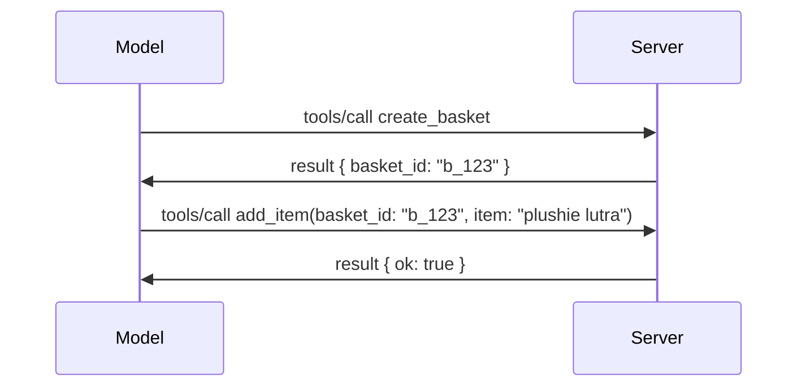

# Apa yang Berubah dalam MCP: Calon Pelepasan 2026-07-28

> **Status:** Calon Pelepasan. Spesifikasi `2026-07-28` tidak muktamad pada masa penulisan. Ia diumumkan pada 21 Mei 2026, dan dijadualkan untuk dihantar pada 28 Julai 2026. Segala yang terdapat dalam pelajaran ini menerangkan calon pelepasan; semak [draf spesifikasi](https://modelcontextprotocol.io/specification/draft) dan [catatan perubahan](https://modelcontextprotocol.io/specification/draft/changelog) untuk status terkini sebelum anda membina dengannya. Kurikulum selebihnya ditulis mengikut pelepasan stabil semasa, **Spesifikasi MCP 2025-11-25**, dan akan dikemas kini selepas `2026-07-28` dihantar.

## Gambaran Keseluruhan

`2026-07-28` adalah pindaan terbesar MCP sejak ia dilancarkan. Enam Cadangan Peningkatan Spesifikasi (SEP) menghapuskan sesi pada tahap protokol dan menjadikan MCP tanpa keadaan pada lapisan pengangkutan, sambungan menjadi mekanisme versi majmuk yang utama, dan beberapa ciri yang anda pelajari sebelum ini dalam kurikulum ini (Roots, Sampling, Logging) ditandakan usang di bawah polisi kitar hayat baru. Pelajaran ini merangkum apa yang berubah, mengapa ia penting, dan apa maksudnya untuk kod yang telah anda tulis mengikut `2025-11-25`.

Sumber: [Calon Pelepasan Spesifikasi MCP 2026-07-28](https://blog.modelcontextprotocol.io/posts/2026-07-28-release-candidate/) (Blog Model Context Protocol, David Soria Parra dan Den Delimarsky).

## Objektif Pembelajaran

Pada akhir pelajaran ini, anda akan dapat:

- Terangkan mengapa MCP beralih ke teras protokol tanpa keadaan dan masalah apa yang diselesaikan untuk penyebaran skala mendatar.
- Huraikan bagaimana jabat tangan `initialize`/`initialized` dan pengepala `Mcp-Session-Id` digantikan.
- Kenal pasti pengepala baru `Mcp-Method` dan `Mcp-Name` serta metadata caching `ttlMs`/`cacheScope`.
- Kenali rangka kerja Sambungan dan dua sambungan yang dihantar bersama pelepasan ini: MCP Apps dan Tasks.
- Senaraikan enam SEP kebenaran yang menguatkan penjajaran OAuth 2.0 / OIDC.
- Kenal pasti ciri teras (Roots, Sampling, Logging) yang kini usang, dan maksudnya dalam praktik.
- Terangkan perubahan Skema JSON Penuh 2020-12 untuk alat `inputSchema`/`outputSchema`.

## Protokol Tanpa Keadaan

Perubahan utama: MCP menjadi tanpa keadaan pada lapisan protokol.

### Sebelum (2025-11-25): sesi memaksa anda kepada satu contoh pelayan

Memanggil alat melalui HTTP Streamable bermula dengan jabat tangan `initialize`. Pelayan membalas dengan pengepala `Mcp-Session-Id` yang mesti dibawa setiap permintaan seterusnya:

```http
POST /mcp HTTP/1.1
Mcp-Session-Id: 1868a90c-3a3f-4f5b
Content-Type: application/json

{"jsonrpc":"2.0","id":2,"method":"tools/call",
 "params":{"name":"search","arguments":{"q":"otters"}}}
```

Kerana sesi terikat pada contoh pelayan yang mengeluarkannya, penyebaran skala mendatar memerlukan **routing melekat** pada penimbang beban dan **penyimpanan sesi berkongsi** merentasi contoh pelayan.

### Selepas (2026-07-28): setiap permintaan berdiri sendiri

```http
POST /mcp HTTP/1.1
MCP-Protocol-Version: 2026-07-28
Mcp-Method: tools/call
Mcp-Name: search
Content-Type: application/json

{"jsonrpc":"2.0","id":1,"method":"tools/call",
 "params":{"name":"search","arguments":{"q":"otters"},
           "_meta":{"io.modelcontextprotocol/clientInfo":{"name":"my-app","version":"1.0"}}}}
```

Mana-mana contoh pelayan boleh mengendalikan permintaan ini. Perubahan utama:

- **Jabat tangan `initialize`/`initialized` dihapuskan** ([SEP-2575](https://github.com/modelcontextprotocol/modelcontextprotocol/pull/2575)). Versi protokol, maklumat klien, dan kemampuan klien berpindah ke `_meta` dalam setiap permintaan. Kaedah baru `server/discover` membolehkan klien mendapatkan kemampuan pelayan terlebih dahulu apabila memerlukannya.
- **Pengepala `Mcp-Session-Id` dan sesi pada tahap protokol dihapuskan** ([SEP-2567](https://github.com/modelcontextprotocol/modelcontextprotocol/pull/2567)). Routing melekat dan penyimpanan sesi berkongsi tidak lagi diperlukan pada lapisan protokol.

### Protokol tanpa keadaan, aplikasi berkeadaan

Mengeluarkan sesi pada tahap protokol tidak bermaksud pelayan anda tidak boleh berkeadaan. Corak yang disyorkan adalah sama seperti yang selalu digunakan oleh API HTTP: cipta pemegang khusus (seperti `basket_id`, `browser_id`) dari satu panggilan alat, dan biarkan model memulangkan pemegang itu sebagai argumen biasa pada panggilan berikut.



Ini menjadikan keadaan kelihatan dan boleh diterima oleh model dan tidak disembunyikan dalam metadata pengangkutan, dan membenarkan mana-mana contoh pelayan mengendalikan mana-mana panggilan.

### Permintaan dari pelayan ke klien, disusun semula

Protokol tanpa keadaan masih memerlukan cara untuk pelayan meminta sesuatu dari klien semasa panggilan (contohnya, prompt elicitation):

- **Permintaan yang dimulakan pelayan hanya boleh dikeluarkan semasa pelayan sedang memproses permintaan klien secara aktif** ([SEP-2260](https://github.com/modelcontextprotocol/modelcontextprotocol/pull/2260)) — sebelum ini adalah saranan, kini diwajibkan. Pengguna tidak akan diprompt secara tiba-tiba.
- **Permintaan Bulat Balik Berganda** ([SEP-2322](https://github.com/modelcontextprotocol/modelcontextprotocol/pull/2322)) menggantikan memegang aliran SSE terbuka. Sebaliknya, pelayan mengembalikan `InputRequiredResult`:

  ```json
  {
    "resultType": "inputRequired",
    "inputRequests": {
      "confirm": {
        "type": "elicitation",
        "message": "Delete 3 files?",
        "schema": { "type": "boolean" }
      }
    },
    "requestState": "eyJzdGVwIjoxLCJmaWxlcyI6WyJhIiwiYiIsImMiXX0="
  }
  ```

  Klien mengumpul jawapan dan mengulangi panggilan asal dengan `inputResponses` serta `requestState` yang dipantulkan. Mana-mana contoh pelayan boleh mengambil semula cuba kerana segala yang diperlukan ada dalam beban.

### Boleh diarahkan, boleh disimpan dalam cache, dan boleh dijejak

Tiga perubahan kecil menjadikan trafik tanpa keadaan lebih mudah diurus:

- **Pengepala `Mcp-Method` dan `Mcp-Name` diwajibkan pada HTTP Streamable** ([SEP-2243](https://github.com/modelcontextprotocol/modelcontextprotocol/pull/2243)), jadi penimbang beban, pintu gerbang, dan pengehad kadar boleh mengarahkan atas operasi tanpa memeriksa badan JSON. Pelayan menolak permintaan apabila pengepala dan badan tidak sepadan.
- **`tools/list` dan hasil bacaan sumber membawa `ttlMs` dan `cacheScope`** ([SEP-2549](https://github.com/modelcontextprotocol/modelcontextprotocol/pull/2549)), dimodelkan pada `Cache-Control` HTTP. Klien tahu berapa lama hasil senarai masih segar dan sama ada selamat dikongsi merentasi pengguna tanpa memerlukan aliran SSE berumur panjang untuk mempelajari perubahan.
- **Propagasi Konteks Jejak W3C dalam `_meta` didokumentasikan** ([SEP-414](https://github.com/modelcontextprotocol/modelcontextprotocol/pull/414)), memperbetulkan nama kunci `traceparent`, `tracestate`, dan `baggage` supaya jejak diedarkan boleh mengikuti panggilan merentasi SDK klien, pelayan MCP, dan sistem hiliran dalam backend yang serasi [OpenTelemetry](https://opentelemetry.io/).

## Sambungan Menjadi Kelas Utama

Sambungan wujud secara tidak formal dalam `2025-11-25`. [SEP-2133](https://github.com/modelcontextprotocol/modelcontextprotocol/pull/2133) meresmikannya:

- Sambungan dikenal pasti dengan ID reverse-DNS.
- Mereka dinilai melalui peta `extensions` pada kemampuan klien dan pelayan.
- Mereka tinggal dalam repositori `ext-*` sendiri dengan penyelenggara yang diberi kuasa dan versi bebas daripada spesifikasi teras.
- Laluan Sambungan baru dalam proses SEP memberi mereka laluan dari eksperimen ke rasmi.

Pelepasan ini menghantar dua sambungan rasmi.

### MCP Apps: antara muka pengguna yang dirender pelayan

[MCP Apps](https://blog.modelcontextprotocol.io/posts/2026-01-26-mcp-apps/) ([SEP-1865](https://github.com/modelcontextprotocol/modelcontextprotocol/pull/1865)) membenarkan pelayan menghantar antara muka HTML interaktif yang hos render dalam iframe yang diasingkan. Alat mengisytiharkan templat UI mereka terlebih dahulu supaya hos boleh prefetch, cache, dan mengkaji keselamatan mereka sebelum apa-apa dijalankan. Anda sudah menutup asas ini dalam [Pelajaran 15: MCP Apps](../03-GettingStarted/15-mcp-apps/README.md) — di bawah rangka kerja Sambungan, MCP Apps kini secara rasmi adalah sambungan dan bukan ciri teras eksperimen.

### Tasks menjadi sambungan

Tasks dihantar sebagai ciri teras eksperimen dalam `2025-11-25`. Penggunaan sebenar menampakkan reka bentuk semula yang mencukupi sehingga tempat yang betul untuknya adalah sambungan: [sambungan Tasks](https://github.com/modelcontextprotocol/modelcontextprotocol/pull/2663) membentuk semula kitar hayat mengikut model tanpa keadaan — pelayan boleh menjawab `tools/call` dengan pemegang tugas, dan klien mengendalikan kemajuannya dengan `tasks/get`, `tasks/update`, dan `tasks/cancel`. Penciptaan tugas dikawal pelayan: klien mengiklankan sambungan, dan pelayan memutuskan bila panggilan perlu dijalankan sebagai tugas. `tasks/list` dihapus sepenuhnya kerana tidak boleh dijamin selamat tanpa sesi.

> **Nota migrasi:** jika anda melaksanakan API Tasks `2025-11-25` eksperimen, anda perlu migrasi ke kitar hayat sambungan baru — ia tidak serasi mundur.

## Penguatan Kebenaran

Enam SEP menguatkan [spesifikasi kebenaran](https://modelcontextprotocol.io/specification/draft/basic/authorization) untuk menyerasikan lebih dekat dengan penyebaran OAuth 2.0 / OpenID Connect dunia nyata:

| SEP | Perubahan |
|---|---|
| [SEP-2468](https://github.com/modelcontextprotocol/modelcontextprotocol/pull/2468) | Klien mesti mengesahkan parameter `iss` pada respons kebenaran mengikut [RFC 9207](https://www.rfc-editor.org/rfc/rfc9207), mengurangkan serangan pencampur yang biasa dalam pola klien tunggal, banyak pelayan MCP. Versi akan datang akan memerlukan penolakan respons yang tiada `iss`. |
| [SEP-837](https://github.com/modelcontextprotocol/modelcontextprotocol/pull/837) | Klien mengisytiharkan `application_type` OpenID Connect semasa Pendaftaran Klien Dinamik, mengelakkan pelayan kebenaran menetapkan klien desktop/CLI secara default kepada `"web"` dan menolak URI pengalihan localhostnya. |
| [SEP-2352](https://github.com/modelcontextprotocol/modelcontextprotocol/pull/2352) | Klien mengikat kelayakan yang didaftarkan kepada `issuer` pelayan kebenaran yang mengeluarkan dan mendaftar semula apabila sumber berpindah antara pelayan kebenaran. |
| [SEP-2207](https://github.com/modelcontextprotocol/modelcontextprotocol/pull/2207) | Mendokumentasikan cara meminta token penyegaran dari pelayan kebenaran gaya OpenID Connect. |
| [SEP-2350](https://github.com/modelcontextprotocol/modelcontextprotocol/pull/2350) | Menjelaskan pengumpulan skop semasa kebenaran tahap tinggi. |
| [SEP-2351](https://github.com/modelcontextprotocol/modelcontextprotocol/pull/2351) | Menjelaskan akhiran penemuan `.well-known`. |

Jika anda membina pelayan kebenaran untuk MCP hari ini, mula sediakan `iss` pada respons kebenaran sekarang — lihat [02-Security](../02-Security/README.md) untuk panduan kebenaran semasa yang akan dibina di atasnya.

## Roots, Sampling, dan Logging Tidak Digalakkan

Di bawah [polisi kitar hayat ciri](https://github.com/modelcontextprotocol/modelcontextprotocol/pull/2577) baru ([SEP-2577](https://github.com/modelcontextprotocol/modelcontextprotocol/pull/2577)), tiga primitif klien teras yang anda pelajari dalam [Konsep Teras](./README.md#roots) menjadi status **Usang**:

| Ciri | Pengganti yang Disyorkan |
|---|---|
| Roots | Parameter alat, URI sumber, atau konfigurasi pelayan |
| Sampling | Integrasi langsung dengan API pembekal LLM |
| Logging | `stderr` untuk pengangkutan stdio; OpenTelemetry untuk kebolehamatan berstruktur |

Ini adalah **penasihat usang sahaja**: kaedah, jenis, dan bendera keupayaan terus berfungsi dalam pelepasan ini dan setiap versi spesifikasi yang diterbitkan dalam tempoh setahun dari tarikh ini. Penghapusan mana-mana daripadanya secara mutlak memerlukan SEP berasingan di bawah polisi kitar hayat — jadi tiada apa yang rosak dalam sampel [Sampling](../03-GettingStarted/14-sampling/README.md) anda hari ini, tetapi pelayan baru harus memilih corak pengganti di atas.

## Skema JSON Penuh 2020-12 untuk Alat

Skema input dan output alat dinaik taraf ke [Skema JSON 2020-12 penuh](https://json-schema.org/draft/2020-12) ([SEP-2106](https://github.com/modelcontextprotocol/modelcontextprotocol/pull/2106)):

- Skema input mengekalkan kekangan akar `type: "object"` tetapi kini membenarkan komposisi (`oneOf`, `anyOf`, `allOf`), bersyarat, dan rujukan (`$ref`, `$defs`).
- Skema output tidak dikehadkan, dan `structuredContent` kini boleh menjadi apa-apa nilai JSON berbanding sebelumnya hanya objek.
- Pelaksanaan tidak boleh merujuk URI `$ref` luaran secara automatik dan harus mengehadkan kedalaman skema dan masa pengesahan (pertimbangan penafian perkhidmatan jika anda mengesahkan skema di pelayan).

Secara berasingan, kod ralat untuk sumber hilang berubah dari MCP khusus `-32002` ke piawaian JSON-RPC `-32602` (Invalid Params) ([SEP-2164](https://github.com/modelcontextprotocol/modelcontextprotocol/pull/2164)). Jika klien anda padan dengan nilai literal `-32002`, anda perlu mengemas kini.

## Bagaimana Protokol Berkembang Dari Sini

Pelepasan ini mengandungi perubahan pemutus, yang tidak dimaksudkan oleh penyelenggara MCP sebagai norma akan datang. Tiga SEP tadbir urus bertujuan mengelakkan pengulangan:

- **Polisi kitar hayat ciri** memberikan setiap ciri laluan Aktif → Usang → Dihapus dengan sekurang-kurangnya dua belas bulan antara usang dan penghapusan awal.
- **Rangka kerja Sambungan** membenarkan keupayaan baru dihantar sebagai sambungan opt-in dan distabilkan sebelum (jika pernah) dimasukkan ke dalam spesifikasi teras.

- SEP Jejak Standard tidak lagi boleh mencapai status Akhir sehingga senario yang sepadan dimasukkan dalam [suite kesesuaian](https://github.com/modelcontextprotocol/conformance) ([SEP-2484](https://github.com/modelcontextprotocol/modelcontextprotocol/pull/2484)) — suite yang sama di mana [sistem tier SDK](https://github.com/modelcontextprotocol/modelcontextprotocol/pull/1777) menilai SDK rasmi.

## Garis Masa Pelepasan dan Pengesahan

- Calon pelepasan telah dikunci pada 21 Mei 2026.
- Spesifikasi akhir dijadualkan pada 28 Julai 2026.
- Jendela sepuluh minggu antara kedua-duanya membolehkan penyelenggara SDK dan pelaksana klien mengesahkan perubahan terhadap beban kerja sebenar; SDK Tier 1 dijangka menyokong di dalam jendela ini di bawah [sistem tier SDK](https://modelcontextprotocol.io/docs/sdk).
- Jejaki set lengkap perubahan dalam [draf spesifikasi](https://modelcontextprotocol.io/specification/draft) dan [log perubahan](https://modelcontextprotocol.io/specification/draft/changelog).

## Apa Maksud Ini untuk Kurikulum Ini

Semua yang anda pelajari setakat ini dalam kursus ini mensasarkan **2025-11-25**, yang kekal sebagai spesifikasi stabil semasa sehingga `2026-07-28` dikeluarkan. Secara konkrit:

- **Sesi dan jabat tangan `initialize`** (diliputi dalam [Konsep Teras](./README.md) dan [Pelajaran 6: Penstriman HTTP](../03-GettingStarted/06-http-streaming/README.md)) masih berfungsi seperti yang didokumentasi hari ini, tetapi jangkaan ia akan digantikan oleh model permintaan tanpa keadaan di atas apabila anda menaik taraf ke SDK yang serasi dengan `2026-07-28`.
- **Persampelan dan Akar** (juga diliputi dalam [Konsep Teras](./README.md)) kekal berfungsi sepenuhnya tetapi telah dihentikan — reka bentuk baru harus mengutamakan corak penggantian yang disenaraikan di atas.
- **Ciri Tugas eksperimen**, jika anda menggunakannya, perlu dipindahkan ke kitar hayat baharu sambungan Tugas.
- **Aplikasi MCP** ([Pelajaran 15](../03-GettingStarted/15-mcp-apps/README.md)) tidak terjejas dalam amalan; ia hanya berpindah di bawah kerangka Sambungan yang formal.

## Sumber Tambahan

- [Calon Pelepasan Spesifikasi MCP 2026-07-28 (catatan blog)](https://blog.modelcontextprotocol.io/posts/2026-07-28-release-candidate/)
- [Masa Depan Pengangkutan MCP](https://blog.modelcontextprotocol.io/posts/2025-12-19-mcp-transport-future/)
- [Draf Spesifikasi MCP](https://modelcontextprotocol.io/specification/draft)
- [Log Perubahan Draf MCP](https://modelcontextprotocol.io/specification/draft/changelog)
- [Garis Panduan SEP](https://modelcontextprotocol.io/community/sep-guidelines)
- [Sistem Tier SDK MCP](https://modelcontextprotocol.io/docs/sdk)

## Langkah Seterusnya

Kembali ke [Konsep Teras](./README.md) atau teruskan ke [Keselamatan](../02-Security/README.md) untuk melihat bagaimana panduan `2025-11-25` hari ini dipetakan kepada apa yang akan datang.

---

<!-- CO-OP TRANSLATOR DISCLAIMER START -->
**Penafian**:
Dokumen ini telah diterjemahkan menggunakan perkhidmatan terjemahan AI [Co-op Translator](https://github.com/Azure/co-op-translator). Walaupun kami berusaha untuk ketepatan, sila ambil maklum bahawa terjemahan automatik mungkin mengandungi kesilapan atau ketidaktepatan. Dokumen asal dalam bahasa asalnya harus dianggap sebagai sumber yang sahih. Untuk maklumat penting, terjemahan oleh manusia profesional adalah disyorkan. Kami tidak bertanggungjawab terhadap sebarang salah faham atau salah tafsir yang timbul daripada penggunaan terjemahan ini.
<!-- CO-OP TRANSLATOR DISCLAIMER END -->