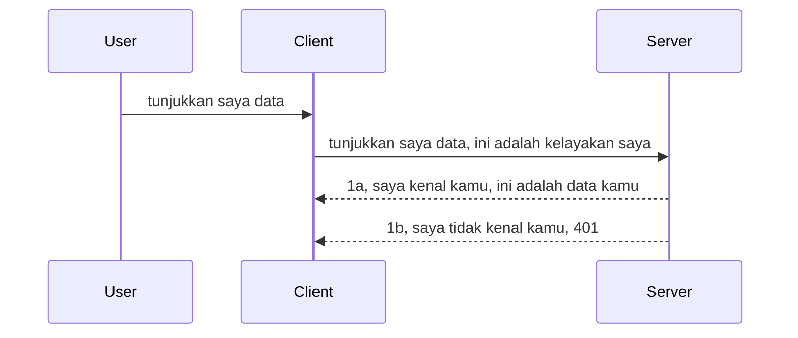

# Auth mudah

SDK MCP menyokong penggunaan OAuth 2.1 yang sebenarnya adalah proses yang agak rumit melibatkan konsep seperti pelayan pengesahan, pelayan sumber, menghantar kelayakan, mendapatkan kod, menukar kod itu kepada token pembawa sehingga akhirnya anda boleh mendapatkan data sumber anda. Jika anda tidak biasa dengan OAuth yang merupakan sesuatu yang bagus untuk dilaksanakan, adalah idea yang baik untuk bermula dengan tahap asas pengesahan dan membangunkannya ke tahap keselamatan yang lebih baik dan lebih baik. Itulah sebabnya bab ini wujud, untuk membina anda kepada pengesahan yang lebih maju.

## Auth, apa maksud kita?

Auth adalah singkatan kepada pengesahan dan kebenaran. Idenya adalah kita perlu melakukan dua perkara:

- **Pengesahan (Authentication)**, iaitu proses mengenal pasti sama ada kita membenarkan seseorang memasuki rumah kita, bahawa mereka mempunyai hak untuk "berada di sini," iaitu mempunyai akses ke pelayan sumber kita di mana ciri MCP Server kita berada.
- **Kebenaran (Authorization)**, adalah proses untuk mengetahui sama ada pengguna sepatutnya mempunyai akses kepada sumber-sumber tertentu yang mereka minta, sebagai contoh pesanan ini atau produk ini atau sama ada mereka dibenarkan membaca kandungan tapi tidak memadamkan sebagai contoh lain.

## Kelayakan: bagaimana kita memberitahu sistem siapa kita

Kebanyakan pembangun web biasanya mula berfikir dari segi memberikan kelayakan kepada pelayan, biasanya suatu rahsia yang mengatakan sama ada mereka dibenarkan berada di sini "Pengesahan". Kelayakan ini biasanya adalah versi kod base64 bagi nama pengguna dan kata laluan atau kunci API yang mengenal pasti pengguna tertentu secara unik.

Ini melibatkan penghantarannya melalui header yang dipanggil "Authorization" seperti berikut:

```json
{ "Authorization": "secret123" }
```

Ini biasanya dirujuk sebagai pengesahan asas. Bagaimana aliran keseluruhan berfungsi adalah seperti berikut:



Sekarang kita faham bagaimana ia berfungsi dari sudut aliran, bagaimana kita melaksanakannya? Kebanyakan pelayan web mempunyai konsep yang dipanggil middleware, iaitu sekeping kod yang berjalan sebagai sebahagian daripada permintaan yang boleh mengesahkan kelayakan, dan jika kelayakan itu sah boleh membenarkan permintaan itu melalui. Jika permintaan tidak mempunyai kelayakan sah maka anda akan mendapat ralat auth. Mari kita lihat bagaimana ini boleh dilaksanakan:

**Python**

```python
class AuthMiddleware(BaseHTTPMiddleware):
    async def dispatch(self, request, call_next):

        has_header = request.headers.get("Authorization")
        if not has_header:
            print("-> Missing Authorization header!")
            return Response(status_code=401, content="Unauthorized")

        if not valid_token(has_header):
            print("-> Invalid token!")
            return Response(status_code=403, content="Forbidden")

        print("Valid token, proceeding...")
       
        response = await call_next(request)
        # tambah sebarang pengepala pelanggan atau ubah dalam respons dengan cara tertentu
        return response


starlette_app.add_middleware(CustomHeaderMiddleware)
```

Di sini kita ada:

- Mencipta middleware yang dipanggil `AuthMiddleware` di mana kaedah `dispatch`nya dipanggil oleh pelayan web.
- Menambah middleware ke pelayan web:

    ```python
    starlette_app.add_middleware(AuthMiddleware)
    ```

- Menulis logik pengesahan yang memeriksa jika header Authorization ada dan jika rahsia yang dihantar adalah sah:

    ```python
    has_header = request.headers.get("Authorization")
    if not has_header:
        print("-> Missing Authorization header!")
        return Response(status_code=401, content="Unauthorized")

    if not valid_token(has_header):
        print("-> Invalid token!")
        return Response(status_code=403, content="Forbidden")
    ```

    jika rahsia itu ada dan sah maka kita membenarkan permintaan itu melalui dengan memanggil `call_next` dan memulangkan respons.

    ```python
    response = await call_next(request)
    # tambah sebarang pengepala pelanggan atau ubah dalam respons dengan cara tertentu
    return response
    ```

Cara kerjanya adalah jika permintaan web dibuat ke pelayan middleware akan dipanggil dan dengan pelaksanannya ia akan sama ada membenarkan permintaan itu melalui atau mengembalikan ralat yang menunjukkan klien tidak dibenarkan meneruskan.

**TypeScript**

Di sini kita mencipta middleware dengan framework popular Express dan menyekat permintaan sebelum ia sampai ke MCP Server. Berikut adalah kodnya:

```typescript
function isValid(secret) {
    return secret === "secret123";
}

app.use((req, res, next) => {
    // 1. Header kebenaran hadir?
    if(!req.headers["Authorization"]) {
        res.status(401).send('Unauthorized');
    }
    
    let token = req.headers["Authorization"];

    // 2. Semak kesahihan.
    if(!isValid(token)) {
        res.status(403).send('Forbidden');
    }

   
    console.log('Middleware executed');
    // 3. Hantar permintaan ke langkah seterusnya dalam saluran permintaan.
    next();
});
```

Dalam kod ini kita:

1. Memeriksa jika header Authorization ada pada mulanya, jika tidak, kita hantar ralat 401.
2. Memastikan kelayakan/token itu sah, jika tidak, kita hantar ralat 403.
3. Akhir sekali meneruskan permintaan dalam saluran permintaan dan mengembalikan sumber yang diminta.

## Latihan: Melaksanakan pengesahan

Mari kita gunakan pengetahuan kita dan cuba melaksanakannya. Berikut adalah rancangannya:

Pelayan

- Cipta pelayan web dan instans MCP.
- Melaksanakan middleware untuk pelayan.

Klien

- Hantar permintaan web, dengan kelayakan, melalui header.

### -1- Cipta pelayan web dan instans MCP

> **Melihat ke hadapan:** contoh TypeScript di bawah menjejaki penghantaran HTTP dalam peta `transports` yang dikunci oleh `mcp-session-id`, mengikut **Spesifikasi MCP 2025-11-25**. Calon pelepasan `2026-07-28` menghapuskan proses handshake `initialize` dan ID sesi sepenuhnya, jadi peta penghantaran per sesi ini akan hilang bagi permintaan bebas status. Lihat [Apa yang Berubah dalam MCP: Calon Pelepasan 2026-07-28](../../01-CoreConcepts/mcp-2026-07-28-release-candidate.md).

Dalam langkah pertama kita, kita perlu mencipta instans pelayan web dan MCP Server.

**Python**

Di sini kita mencipta instans MCP Server, mencipta aplikasi web starlette dan menghoskannya dengan uvicorn.

```python
# mencipta Pelayan MCP

app = FastMCP(
    name="MCP Resource Server",
    instructions="Resource Server that validates tokens via Authorization Server introspection",
    host=settings["host"],
    port=settings["port"],
    debug=True
)

# mencipta aplikasi web starlette
starlette_app = app.streamable_http_app()

# menyajikan aplikasi melalui uvicorn
async def run(starlette_app):
    import uvicorn
    config = uvicorn.Config(
            starlette_app,
            host=app.settings.host,
            port=app.settings.port,
            log_level=app.settings.log_level.lower(),
        )
    server = uvicorn.Server(config)
    await server.serve()

run(starlette_app)
```

Dalam kod ini kita:

- Mencipta MCP Server.
- Membina aplikasi web starlette dari MCP Server, `app.streamable_http_app()`.
- Menghoskan dan menjalankan aplikasi web menggunakan uvicorn `server.serve()`.

**TypeScript**

Di sini kita mencipta instans MCP Server.

```typescript
const server = new McpServer({
      name: "example-server",
      version: "1.0.0"
    });

    // ... sediakan sumber pelayan, alat, dan arahan ...
```

Penciptaan MCP Server ini perlu berlaku dalam definisi laluan POST /mcp kita, jadi mari kita ambil kod di atas dan pindahkan seperti berikut:

```typescript
import express from "express";
import { randomUUID } from "node:crypto";
import { McpServer } from "@modelcontextprotocol/sdk/server/mcp.js";
import { StreamableHTTPServerTransport } from "@modelcontextprotocol/sdk/server/streamableHttp.js";
import { isInitializeRequest } from "@modelcontextprotocol/sdk/types.js"

const app = express();
app.use(express.json());

// Peta untuk menyimpan pengangkutan mengikut ID sesi
const transports: { [sessionId: string]: StreamableHTTPServerTransport } = {};

// Mengendalikan permintaan POST untuk komunikasi klien-ke-pelayan
app.post('/mcp', async (req, res) => {
  // Semak untuk ID sesi yang sedia ada
  const sessionId = req.headers['mcp-session-id'] as string | undefined;
  let transport: StreamableHTTPServerTransport;

  if (sessionId && transports[sessionId]) {
    // Gunakan semula pengangkutan yang sedia ada
    transport = transports[sessionId];
  } else if (!sessionId && isInitializeRequest(req.body)) {
    // Permintaan inisialisasi baru
    transport = new StreamableHTTPServerTransport({
      sessionIdGenerator: () => randomUUID(),
      onsessioninitialized: (sessionId) => {
        // Simpan pengangkutan mengikut ID sesi
        transports[sessionId] = transport;
      },
      // Perlindungan DNS rebinding dilumpuhkan secara lalai untuk keserasian ke belakang. Jika anda menjalankan pelayan ini
      // secara tempatan, pastikan untuk menetapkan:
      // enableDnsRebindingProtection: true,
      // allowedHosts: ['127.0.0.1'],
    });

    // Bersihkan pengangkutan apabila ditutup
    transport.onclose = () => {
      if (transport.sessionId) {
        delete transports[transport.sessionId];
      }
    };
    const server = new McpServer({
      name: "example-server",
      version: "1.0.0"
    });

    // ... sediakan sumber pelayan, alat, dan arahan ...

    // Sambung ke pelayan MCP
    await server.connect(transport);
  } else {
    // Permintaan tidak sah
    res.status(400).json({
      jsonrpc: '2.0',
      error: {
        code: -32000,
        message: 'Bad Request: No valid session ID provided',
      },
      id: null,
    });
    return;
  }

  // Mengendalikan permintaan
  await transport.handleRequest(req, res, req.body);
});

// Pengendali boleh guna untuk permintaan GET dan DELETE
const handleSessionRequest = async (req: express.Request, res: express.Response) => {
  const sessionId = req.headers['mcp-session-id'] as string | undefined;
  if (!sessionId || !transports[sessionId]) {
    res.status(400).send('Invalid or missing session ID');
    return;
  }
  
  const transport = transports[sessionId];
  await transport.handleRequest(req, res);
};

// Mengendalikan permintaan GET untuk pemberitahuan pelayan-ke-klien melalui SSE
app.get('/mcp', handleSessionRequest);

// Mengendalikan permintaan DELETE untuk penamatan sesi
app.delete('/mcp', handleSessionRequest);

app.listen(3000);
```

Sekarang anda lihat bagaimana penciptaan MCP Server dipindahkan dalam `app.post("/mcp")`.

Mari kita teruskan ke langkah seterusnya iaitu mencipta middleware supaya kita boleh mengesahkan kelayakan yang datang.

### -2- Melaksanakan middleware untuk pelayan

Mari kita buat bahagian middleware seterusnya. Di sini kita akan mencipta middleware yang mencari kelayakan dalam header `Authorization` dan mengesahkannya. Jika ia boleh diterima maka permintaan akan diteruskan melakukan apa yang perlu (contohnya menyenaraikan alat, membaca sumber atau apa sahaja fungsi MCP yang diminta klien).

**Python**

Untuk mencipta middleware, kita perlu mencipta kelas yang mewarisi dari `BaseHTTPMiddleware`. Ada dua perkara menarik:

- Permintaan `request`, yang kita baca maklumat header darinya.
- `call_next` iaitu pemanggil balik yang kita perlu panggil jika klien membawa kelayakan yang kita terima.

Pertama, kita perlu mengendalikan kasus jika header `Authorization` tidak ada:

```python
has_header = request.headers.get("Authorization")

# tiada pengepala, gagal dengan 401, jika tidak teruskan.
if not has_header:
    print("-> Missing Authorization header!")
    return Response(status_code=401, content="Unauthorized")
```

Di sini kita hantar mesej tidak dibenarkan 401 kerana klien gagal pengesahan.

Seterusnya, jika kelayakan dihantar, kita perlu periksa kesahihannya seperti berikut:

```python
 if not valid_token(has_header):
    print("-> Invalid token!")
    return Response(status_code=403, content="Forbidden")
```

Perhatikan bagaimana kita menghantar mesej terlarang 403 di atas. Mari lihat middleware penuh di bawah melaksanakan segala yang kita sebutkan tadi:

```python
class AuthMiddleware(BaseHTTPMiddleware):
    async def dispatch(self, request, call_next):

        has_header = request.headers.get("Authorization")
        if not has_header:
            print("-> Missing Authorization header!")
            return Response(status_code=401, content="Unauthorized")

        if not valid_token(has_header):
            print("-> Invalid token!")
            return Response(status_code=403, content="Forbidden")

        print("Valid token, proceeding...")
        print(f"-> Received {request.method} {request.url}")
        response = await call_next(request)
        response.headers['Custom'] = 'Example'
        return response

```

Bagus, tapi bagaimana dengan fungsi `valid_token`? Berikut di bawah:

```python
# JANGAN gunakan untuk pengeluaran - tingkatkan ia !!
def valid_token(token: str) -> bool:
    # buang awalan "Bearer "
    if token.startswith("Bearer "):
        token = token[7:]
        return token == "secret-token"
    return False
```

Ini tentunya boleh diperbaiki.

PENTING: Anda TIDAK BOLEH menyimpan rahsia seperti ini dalam kod. Anda sebaiknya dapatkan nilai untuk dibandingkan dari sumber data atau dari IDP (penyedia perkhidmatan identiti) atau lebih baik lagi, biar IDP yang mengendali pengesahan.

**TypeScript**

Untuk melaksanakan ini dengan Express, kita perlu memanggil kaedah `use` yang mengambil fungsi middleware.

Kita perlu:

- Berinteraksi dengan pembolehubah permintaan untuk memeriksa kelayakan yang dihantar dalam sifat `Authorization`.
- Sahkan kelayakan, dan jika sah benarkan permintaan berterusan dan biarkan permintaan MCP klien lakukan apa yang sepatutnya (contohnya senarai alat, baca sumber atau apa sahaja yang berkaitan MCP).

Di sini, kita memeriksa jika header `Authorization` ada dan jika tidak, kita hentikan permintaan daripada diteruskan:

```typescript
if(!req.headers["authorization"]) {
    res.status(401).send('Unauthorized');
    return;
}
```

Jika header tidak dihantar dari awal, anda akan menerima 401.

Seterusnya, kita periksa jika kelayakan sah, jika tidak kita sekali lagi hentikan permintaan tetapi dengan mesej yang sedikit berbeza:

```typescript
if(!isValid(token)) {
    res.status(403).send('Forbidden');
    return;
} 
```

Perhatikan bagaimana anda kini mendapat ralat 403.

Berikut adalah kod penuh:

```typescript
app.use((req, res, next) => {
    console.log('Request received:', req.method, req.url, req.headers);
    console.log('Headers:', req.headers["authorization"]);
    if(!req.headers["authorization"]) {
        res.status(401).send('Unauthorized');
        return;
    }
    
    let token = req.headers["authorization"];

    if(!isValid(token)) {
        res.status(403).send('Forbidden');
        return;
    }  

    console.log('Middleware executed');
    next();
});
```

Kita telah menyediakan pelayan web untuk menerima middleware bagi memeriksa kelayakan yang klien harap-harapnya hantar kepada kita. Bagaimana pula dengan klien itu sendiri?

### -3- Hantar permintaan web dengan kelayakan melalui header

Kita perlu memastikan klien menghantar kelayakan melalui header. Oleh kerana kita akan menggunakan klien MCP untuk itu, kita perlu faham bagaimana ia dilakukan.

**Python**

Untuk klien, kita perlu hantar header dengan kelayakan kita seperti berikut:

```python
# JANGAN kodkan nilai secara keras, simpan sekurang-kurangnya dalam pembolehubah persekitaran atau penyimpanan yang lebih selamat
token = "secret-token"

async with streamablehttp_client(
        url = f"http://localhost:{port}/mcp",
        headers = {"Authorization": f"Bearer {token}"}
    ) as (
        read_stream,
        write_stream,
        session_callback,
    ):
        async with ClientSession(
            read_stream,
            write_stream
        ) as session:
            await session.initialize()
      
            # TODO, apa yang anda mahu dilakukan di klien, contohnya senaraikan alat, panggil alat dan lain-lain.
```

Perhatikan bagaimana kita mengisi sifat `headers` seperti ` headers = {"Authorization": f"Bearer {token}"}`.

**TypeScript**

Kita boleh selesaikan ini dalam dua langkah:

1. Isikan objek konfigurasi dengan kelayakan kita.
2. Hantar objek konfigurasi kepada pengangkut (transport).

```typescript

// JANGAN tetapkan nilai secara keras seperti yang ditunjukkan di sini. Sekurang-kurangnya jadikan ia sebagai pembolehubah persekitaran dan gunakan sesuatu seperti dotenv (dalam mod pembangun).
let token = "secret123"

// takrifkan objek pilihan pengangkutan klien
let options: StreamableHTTPClientTransportOptions = {
  sessionId: sessionId,
  requestInit: {
    headers: {
      "Authorization": "secret123"
    }
  }
};

// serahkan objek pilihan kepada pengangkutan
async function main() {
   const transport = new StreamableHTTPClientTransport(
      new URL(serverUrl),
      options
   );
```

Di sini anda lihat di atas bagaimana kita perlu mencipta objek `options` dan letakkan header kita di bawah sifat `requestInit`.

PENTING: Bagaimana kita memperbaikinya dari sini? Baiklah, pelaksanaan sekarang ada beberapa isu. Pertama, menghantar kelayakan seperti ini agak berisiko kecuali anda mempunyai HTTPS sekurang-kurangnya. Walaupun begitu, kelayakan boleh dicuri jadi anda perlukan sistem di mana anda boleh dengan mudah membatalkan token dan tambah pemeriksaan tambahan seperti dari mana ia datang di dunia, adakah permintaan berlaku terlalu kerap (tingkah laku bot), ringkasnya, banyak kebimbangan.

Walaupun begitu, untuk API yang sangat mudah di mana anda tidak mahu sesiapa pun memanggil API anda tanpa diautentikasi dan apa yang kita ada di sini adalah permulaan yang baik.

Dengan itu, mari cuba kuatkan keselamatan sedikit dengan menggunakan format piawai seperti JSON Web Token, juga dikenali sebagai JWT atau token "JOT".

## JSON Web Tokens, JWT

Jadi, kita cuba memperbaiki perkara daripada menghantar kelayakan yang sangat mudah. Apakah peningkatan segera yang kita dapat dengan mengamalkan JWT?

- **Peningkatan keselamatan**. Dalam auth asas, anda hantar nama pengguna dan kata laluan sebagai token base64 yang berulang-ulang (atau anda hantar kunci API) yang meningkatkan risiko. Dengan JWT, anda hantar nama pengguna dan kata laluan dan dapat token sebagai balasan dan ia juga terikat masa bermakna ia akan tamat tempoh. JWT membolehkan anda menggunakan kawalan akses terperinci menggunakan peranan, skop dan kebenaran.
- **Tanpa status dan boleh skala**. JWT adalah sendiri terkandung, ia membawa semua maklumat pengguna dan menghapuskan keperluan untuk simpanan sesi pelayan. Token juga boleh disahkan secara tempatan.
- **Interoperabiliti dan federasi**. JWT adalah teras Open ID Connect dan digunakan dengan penyedia identiti yang dikenali seperti Entra ID, Google Identity dan Auth0. Ia juga membolehkan menggunakan log masuk tunggal dan banyak lagi menjadikannya setaraf perusahaan.
- **Modulariti dan fleksibiliti**. JWT juga boleh digunakan dengan API Gateways seperti Azure API Management, NGINX dan lain-lain. Ia juga menyokong senario pengesahan penggunaan dan komunikasi pelayan-ke-perkhidmatan termasuk penyamaran dan pendelegasian.
- **Prestasi dan caching**. JWT boleh di-cache selepas penyahkodan yang mengurangkan keperluan untuk penguraian. Ini membantu terutamanya dengan aplikasi trafik tinggi kerana ia meningkatkan throughput dan mengurangkan beban pada infrastruktur pilihan anda.
- **Ciri-ciri lanjutan**. Ia juga menyokong introspeksi (semak kesahihan di pelayan) dan pembatalan (membuat token tidak sah).

Dengan semua manfaat ini, mari lihat bagaimana kita boleh bawa pelaksanaan kita ke tahap seterusnya.

## Menukar auth asas menjadi JWT

Jadi, perubahan yang perlu kita buat pada tahap tinggi adalah untuk:

- **Belajar membina token JWT** dan sediakan ia untuk dihantar dari klien ke pelayan.
- **Sahkan token JWT**, dan jika sah, benarkan klien akses sumber kita.
- **Simpan token dengan selamat**. Bagaimana kita simpan token ini.
- **Lindungi laluan**. Kita perlu lindungi laluan, dalam kes kita, kita perlu lindungi laluan dan ciri MCP tertentu.
- **Tambah token segar**. Pastikan kita cipta token yang hayatnya pendek tetapi token segar yang hayatnya panjang yang boleh digunakan untuk dapatkan token baru jika tamat tempoh. Juga pastikan ada titik akhir segar dan strategi pusingan.

### -1- Membina token JWT

Pertama sekali, token JWT ada bahagian berikut:

- **header**, algoritma yang digunakan dan jenis token.
- **payload**, tuntutan, seperti sub (pengguna atau entiti yang token wakili. Dalam senario auth ini biasanya id pengguna), exp (masa tamat tempoh) role (peranan)
- **tandatangan**, ditandatangani dengan rahsia atau kunci peribadi.

Untuk ini, kita perlu membina header, payload dan token yang dikodkan.

**Python**

```python

import jwt
import jwt
from jwt.exceptions import ExpiredSignatureError, InvalidTokenError
import datetime

# Kunci rahsia digunakan untuk menandatangani JWT
secret_key = 'your-secret-key'

header = {
    "alg": "HS256",
    "typ": "JWT"
}

# maklumat pengguna dan tuntutan serta masa luputnya
payload = {
    "sub": "1234567890",               # Subjek (ID pengguna)
    "name": "User Userson",                # Tuntutan khusus
    "admin": True,                     # Tuntutan khusus
    "iat": datetime.datetime.utcnow(),# Dikeluarkan pada
    "exp": datetime.datetime.utcnow() + datetime.timedelta(hours=1)  # Tamat tempoh
}

# mengekodnya
encoded_jwt = jwt.encode(payload, secret_key, algorithm="HS256", headers=header)
```

Dalam kod di atas kita telah:

- Mendefinisikan header menggunakan HS256 sebagai algoritma dan jenis sebagai JWT.
- Membina payload yang mengandungi subjek atau id pengguna, nama pengguna, peranan, bila ia dikeluarkan dan bila ia diatur untuk tamat tempoh dengan itu melaksanakan aspek terikat masa yang kita sebut tadi.

**TypeScript**

Di sini kita memerlukan beberapa kebergantungan yang akan membantu kita membina token JWT.

Kebergantungan

```sh

npm install jsonwebtoken
npm install --save-dev @types/jsonwebtoken
```

Sekarang kita ada itu, mari cipta header, payload dan melalui itu cipta token yang dikodkan.

```typescript
import jwt from 'jsonwebtoken';

const secretKey = 'your-secret-key'; // Gunakan pembolehubah persekitaran dalam pengeluaran

// Takrifkan muatan
const payload = {
  sub: '1234567890',
  name: 'User usersson',
  admin: true,
  iat: Math.floor(Date.now() / 1000), // Dikeluarkan pada
  exp: Math.floor(Date.now() / 1000) + 60 * 60 // Luput dalam 1 jam
};

// Takrifkan pengepala (pilihan, jsonwebtoken menetapkan lalai)
const header = {
  alg: 'HS256',
  typ: 'JWT'
};

// Cipta token
const token = jwt.sign(payload, secretKey, {
  algorithm: 'HS256',
  header: header
});

console.log('JWT:', token);
```

Token ini adalah:

Ditandatangani menggunakan HS256
Sah untuk 1 jam
Termasuk tuntutan seperti sub, name, admin, iat, dan exp.

### -2- Sahkan token

Kita juga perlu mengesahkan token, ini sesuatu yang sepatutnya kita lakukan di pelayan untuk memastikan apa yang klien hantar kepada kita adalah benar-benar sah. Terdapat banyak pemeriksaan yang perlu kita buat di sini dari sahkan strukturnya hingga kesahihannya. Anda juga digalakkan untuk tambah pemeriksaan lain untuk lihat jika pengguna berada dalam sistem anda dan banyak lagi.

Untuk mengesahkan token, kita perlu menyahkodnya supaya kita boleh membacanya dan kemudian mula memeriksa kesahihannya:

**Python**

```python

# Nyahkod dan sahkan JWT
try:
    decoded = jwt.decode(token, secret_key, algorithms=["HS256"])
    print("✅ Token is valid.")
    print("Decoded claims:")
    for key, value in decoded.items():
        print(f"  {key}: {value}")
except ExpiredSignatureError:
    print("❌ Token has expired.")
except InvalidTokenError as e:
    print(f"❌ Invalid token: {e}")

```


Dalam kod ini, kami memanggil `jwt.decode` menggunakan token, kunci rahsia dan algoritma yang dipilih sebagai input. Perhatikan bagaimana kami menggunakan konstruksi try-catch kerana kegagalan pengesahan akan menyebabkan ralat dibangkitkan.

**TypeScript**

Di sini kami perlu memanggil `jwt.verify` untuk mendapatkan versi token yang telah diterjemah yang boleh kami analisis lebih lanjut. Jika panggilan ini gagal, itu bermakna struktur token tidak betul atau ia tidak lagi sah.

```typescript

try {
  const decoded = jwt.verify(token, secretKey);
  console.log('Decoded Payload:', decoded);
} catch (err) {
  console.error('Token verification failed:', err);
}
```

CATATAN: seperti yang dinyatakan sebelum ini, kita perlu melakukan pemeriksaan tambahan untuk memastikan token ini menunjukkan pengguna dalam sistem kita dan memastikan pengguna mempunyai hak yang didakwa.

Seterusnya, mari lihat kawalan akses berasaskan peranan, juga dikenali sebagai RBAC.

## Menambah kawalan akses berasaskan peranan

Idenya ialah kita ingin menyatakan bahawa peranan yang berbeza mempunyai kebenaran yang berbeza. Contohnya, kita anggap seorang admin boleh melakukan segala-galanya dan pengguna biasa boleh melakukan baca/tulis dan tetamu hanya boleh membaca. Oleh itu, berikut adalah beberapa tahap kebenaran yang mungkin:

- Admin.Tulis
- Pengguna.Baca
- Tetamu.Baca

Mari kita lihat bagaimana kita boleh melaksanakan kawalan sedemikian dengan middleware. Middleware boleh ditambah bagi setiap laluan serta untuk semua laluan.

**Python**

```python
from starlette.middleware.base import BaseHTTPMiddleware
from starlette.responses import JSONResponse
import jwt

# JANGAN letakkan rahsia dalam kod seperti ini, ini hanya untuk tujuan demonstrasi. Baca ia dari tempat yang selamat.
SECRET_KEY = "your-secret-key" # letakkan ini dalam pembolehubah env
REQUIRED_PERMISSION = "User.Read"

class JWTPermissionMiddleware(BaseHTTPMiddleware):
    async def dispatch(self, request, call_next):
        auth_header = request.headers.get("Authorization")
        if not auth_header or not auth_header.startswith("Bearer "):
            return JSONResponse({"error": "Missing or invalid Authorization header"}, status_code=401)

        token = auth_header.split(" ")[1]
        try:
            decoded = jwt.decode(token, SECRET_KEY, algorithms=["HS256"])
        except jwt.ExpiredSignatureError:
            return JSONResponse({"error": "Token expired"}, status_code=401)
        except jwt.InvalidTokenError:
            return JSONResponse({"error": "Invalid token"}, status_code=401)

        permissions = decoded.get("permissions", [])
        if REQUIRED_PERMISSION not in permissions:
            return JSONResponse({"error": "Permission denied"}, status_code=403)

        request.state.user = decoded
        return await call_next(request)


```

Terdapat beberapa cara berbeza untuk menambah middleware seperti di bawah:

```python

# Alt 1: tambah middleware semasa membina aplikasi starlette
middleware = [
    Middleware(JWTPermissionMiddleware)
]

app = Starlette(routes=routes, middleware=middleware)

# Alt 2: tambah middleware selepas aplikasi starlette telah dibina
starlette_app.add_middleware(JWTPermissionMiddleware)

# Alt 3: tambah middleware bagi setiap laluan
routes = [
    Route(
        "/mcp",
        endpoint=..., # pengendali
        middleware=[Middleware(JWTPermissionMiddleware)]
    )
]
```

**TypeScript**

Kita boleh menggunakan `app.use` dan middleware yang akan berjalan untuk semua permintaan.

```typescript
app.use((req, res, next) => {
    console.log('Request received:', req.method, req.url, req.headers);
    console.log('Headers:', req.headers["authorization"]);

    // 1. Semak jika header kebenaran telah dihantar

    if(!req.headers["authorization"]) {
        res.status(401).send('Unauthorized');
        return;
    }
    
    let token = req.headers["authorization"];

    // 2. Semak jika token adalah sah
    if(!isValid(token)) {
        res.status(403).send('Forbidden');
        return;
    }  

    // 3. Semak jika pengguna token wujud dalam sistem kami
    if(!isExistingUser(token)) {
        res.status(403).send('Forbidden');
        console.log("User does not exist");
        return;
    }
    console.log("User exists");

    // 4. Sahkan token mempunyai kebenaran yang betul
    if(!hasScopes(token, ["User.Read"])){
        res.status(403).send('Forbidden - insufficient scopes');
    }

    console.log("User has required scopes");

    console.log('Middleware executed');
    next();
});

```

Terdapat beberapa perkara yang boleh kita benarkan middleware kita lakukan dan middleware kita SEPATUTNYA lakukan, iaitu:

1. Semak jika header pengesahan wujud
2. Semak jika token sah, kita panggil `isValid` yang merupakan kaedah yang kami tulis untuk memeriksa integriti dan kesahan token JWT.
3. Sahkan pengguna wujud dalam sistem kita, kita perlu memeriksa ini.

   ```typescript
    // pengguna dalam DB
   const users = [
     "user1",
     "User usersson",
   ]

   function isExistingUser(token) {
     let decodedToken = verifyToken(token);

     // TODO, periksa jika pengguna wujud dalam DB
     return users.includes(decodedToken?.name || "");
   }
   ```

   Di atas, kami telah mencipta senarai `users` yang sangat ringkas, yang sepatutnya berada dalam pangkalan data sudah tentu.

4. Selain itu, kami juga perlu memeriksa token mempunyai kebenaran yang betul.

   ```typescript
   if(!hasScopes(token, ["User.Read"])){
        res.status(403).send('Forbidden - insufficient scopes');
   }
   ```

   Dalam kod di atas daripada middleware, kami menyemak bahawa token mengandungi kebenaran User.Read, jika tidak kami menghantar ralat 403. Di bawah ialah kaedah pembantu `hasScopes`.

   ```typescript
   function hasScopes(scope: string, requiredScopes: string[]) {
     let decodedToken = verifyToken(scope);
    return requiredScopes.every(scope => decodedToken?.scopes.includes(scope));
  }
   ```

Have a think which additional checks you should be doing, but these are the absolute minimum of checks you should be doing.

Using Express as a web framework is a common choice. There are helpers library when you use JWT so you can write less code.

- `express-jwt`, helper library that provides a middleware that helps decode your token.
- `express-jwt-permissions`, this provides a middleware `guard` that helps check if a certain permission is on the token.

Here's what these libraries can look like when used:

```typescript
const express = require('express');
const jwt = require('express-jwt');
const guard = require('express-jwt-permissions')();

const app = express();
const secretKey = 'your-secret-key'; // put this in env variable

// Decode JWT and attach to req.user
app.use(jwt({ secret: secretKey, algorithms: ['HS256'] }));

// Check for User.Read permission
app.use(guard.check('User.Read'));

// multiple permissions
// app.use(guard.check(['User.Read', 'Admin.Access']));

app.get('/protected', (req, res) => {
  res.json({ message: `Welcome ${req.user.name}` });
});

// Error handler
app.use((err, req, res, next) => {
  if (err.code === 'permission_denied') {
    return res.status(403).send('Forbidden');
  }
  next(err);
});

```

Kini anda telah melihat bagaimana middleware boleh digunakan untuk pengesahan dan kebenaran, bagaimana pula dengan MCP, adakah ia mengubah cara kita melakukan pengesahan? Mari kita ketahui di bahagian seterusnya.

### -3- Tambah RBAC ke MCP

Anda telah melihat setakat ini bagaimana anda boleh menambah RBAC melalui middleware, namun, untuk MCP tiada cara mudah untuk menambah RBAC per ciri MCP, jadi apa yang kita lakukan? Baiklah, kita hanya perlu menambah kod seperti ini yang menyemak dalam kes ini sama ada klien mempunyai hak untuk memanggil alat tertentu:

Anda mempunyai beberapa pilihan berbeza tentang bagaimana untuk melaksanakan RBAC per ciri, berikut adalah beberapa pilihan:

- Tambah semakan untuk setiap alat, sumber, prompt di mana anda perlu semak tahap kebenaran.

   **python**

   ```python
   @tool()
   def delete_product(id: int):
      try:
          check_permissions(role="Admin.Write", request)
      catch:
        pass # pelanggan gagal kebenaran, tingkatkan ralat kebenaran
   ```

   **typescript**

   ```typescript
   server.registerTool(
    "delete-product",
    {
      title: Delete a product",
      description: "Deletes a product",
      inputSchema: { id: z.number() }
    },
    async ({ id }) => {
      
      try {
        checkPermissions("Admin.Write", request);
        // todo, hantar id ke productService dan entri jauh
      } catch(Exception e) {
        console.log("Authorization error, you're not allowed");  
      }

      return {
        content: [{ type: "text", text: `Deletected product with id ${id}` }]
      };
    }
   );
   ```


- Gunakan pendekatan pelayan maju dan pengendali permintaan supaya anda meminimumkan berapa banyak tempat anda perlu membuat semakan.

   **Python**

   ```python
   
   tool_permission = {
      "create_product": ["User.Write", "Admin.Write"],
      "delete_product": ["Admin.Write"]
   }

   def has_permission(user_permissions, required_permissions) -> bool:
      # user_permissions: senarai kebenaran yang dimiliki pengguna
      # required_permissions: senarai kebenaran yang diperlukan untuk alat
      return any(perm in user_permissions for perm in required_permissions)

   @server.call_tool()
   async def handle_call_tool(
     name: str, arguments: dict[str, str] | None
   ) -> list[types.TextContent]:
    # Anggap request.user.permissions adalah senarai kebenaran untuk pengguna
     user_permissions = request.user.permissions
     required_permissions = tool_permission.get(name, [])
     if not has_permission(user_permissions, required_permissions):
        # Timbulkan ralat "Anda tidak mempunyai kebenaran untuk memanggil alat {name}"
        raise Exception(f"You don't have permission to call tool {name}")
     # teruskan dan panggil alat
     # ...
   ```   
   

   **TypeScript**

   ```typescript
   function hasPermission(userPermissions: string[], requiredPermissions: string[]): boolean {
       if (!Array.isArray(userPermissions) || !Array.isArray(requiredPermissions)) return false;
       // Kembalikan benar jika pengguna mempunyai sekurang-kurangnya satu kebenaran yang diperlukan
       
       return requiredPermissions.some(perm => userPermissions.includes(perm));
   }
  
   server.setRequestHandler(CallToolRequestSchema, async (request) => {
      const { params: { name } } = request;
  
      let permissions = request.user.permissions;
  
      if (!hasPermission(permissions, toolPermissions[name])) {
         return new Error(`You don't have permission to call ${name}`);
      }
  
      // teruskan..
   });
   ```

   Nota, anda perlu memastikan middleware anda menetapkan token yang telah diterjemah kepada sifat user permintaan supaya kod di atas menjadi mudah.

### Ringkasan

Kini kita telah bincangkan bagaimana untuk menambah sokongan untuk RBAC secara umum dan untuk MCP khususnya, sudah tiba masanya untuk mencuba melaksanakan keselamatan sendiri untuk memastikan anda memahami konsep yang telah dibentangkan.

## Tugasan 1: Bina pelayan mcp dan klien mcp menggunakan pengesahan asas

Di sini anda akan menggunakan apa yang telah anda pelajari dalam menghantar kelayakan melalui header.

## Penyelesaian 1

[Penyelesaian 1](./code/basic/README.md)

## Tugasan 2: Tingkatkan penyelesaian dari Tugasan 1 untuk menggunakan JWT

Ambil penyelesaian pertama tetapi kali ini, mari kita perbaiki.

Daripada menggunakan Basic Auth, mari kita gunakan JWT.

## Penyelesaian 2

[Penyelesaian 2](./solution/jwt-solution/README.md)

## Cabaran

Tambah RBAC per alat yang kami terangkan dalam bahagian "Tambah RBAC ke MCP".

## Ringkasan

Harapnya anda telah belajar banyak dalam bab ini, dari tiada keselamatan langsung, kepada keselamatan asas, kepada JWT dan bagaimana ia boleh ditambah ke MCP.

Kami telah membina asas yang kukuh dengan JWT tersuai, tetapi apabila kami skala, kami bergerak menuju model identiti berasaskan piawaian. Menggunakan IdP seperti Entra atau Keycloak membolehkan kami menyerahkan pengeluaran token, pengesahan, dan pengurusan kitar hayat kepada platform yang dipercayai — membebaskan kami untuk memberi tumpuan kepada logik aplikasi dan pengalaman pengguna.

Untuk itu, kami mempunyai bab yang lebih [maju tentang Entra](../../05-AdvancedTopics/mcp-security-entra/README.md)

## Apa Seterusnya

- Seterusnya: [Menyediakan Host MCP](../12-mcp-hosts/README.md)

---

<!-- CO-OP TRANSLATOR DISCLAIMER START -->
**Penafian**:
Dokumen ini telah diterjemahkan menggunakan perkhidmatan terjemahan AI [Co-op Translator](https://github.com/Azure/co-op-translator). Walaupun kami berusaha untuk ketepatan, sila ambil maklum bahawa terjemahan automatik mungkin mengandungi kesilapan atau ketidaktepatan. Dokumen asal dalam bahasa asalnya harus dianggap sebagai sumber yang sahih. Untuk maklumat penting, terjemahan oleh manusia profesional adalah disyorkan. Kami tidak bertanggungjawab terhadap sebarang salah faham atau salah tafsir yang timbul daripada penggunaan terjemahan ini.
<!-- CO-OP TRANSLATOR DISCLAIMER END -->