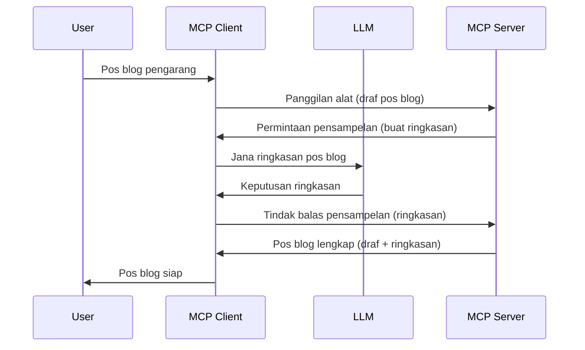

# Persampelan - mendelegasikan ciri kepada Klien

> **Notis penghapusan:** calon pelepasan spesifikasi MCP `2026-07-28` menandakan Persampelan sebagai tidak digalakkan demi integrasi langsung dengan API pembekal LLM. Persampelan terus berfungsi dalam `2025-11-25` dan sekurang-kurangnya setahun selepas sebarang penghapusan rasmi, jadi segala yang ada dalam pelajaran ini masih sah — tetapi reka bentuk pelayan baru harus menilai corak penggantian tersebut. Lihat [Apa Yang Berubah dalam MCP: Calon Pelepasan 2026-07-28](../../01-CoreConcepts/mcp-2026-07-28-release-candidate.md).

Kadang-kadang, anda memerlukan Klien MCP dan Pelayan MCP untuk bekerjasama bagi mencapai matlamat bersama. Anda mungkin mempunyai kes di mana Pelayan memerlukan bantuan LLM yang terletak pada klien. Untuk situasi ini, persampelan adalah apa yang harus anda gunakan.

Mari kita terokai beberapa kes penggunaan dan bagaimana membina penyelesaian yang melibatkan persampelan.

## Gambaran Keseluruhan

Dalam pelajaran ini, kita memberi tumpuan kepada menerangkan bila dan di mana untuk menggunakan Persampelan dan bagaimana untuk mengkonfigurasinya.

## Objektif Pembelajaran

Dalam bab ini, kita akan:

- Terangkan apa itu Persampelan dan bila hendak menggunakannya.
- Tunjukkan bagaimana mengkonfigurasi Persampelan dalam MCP.
- Berikan contoh Persampelan dalam tindakan.

## Apa itu Persampelan dan kenapa menggunakannya?

Persampelan adalah ciri lanjutan yang berfungsi dengan cara berikut:



### Permintaan persampelan

Baik, sekarang kita ada pandangan am tentang senario yang dipercayai, mari kita bincangkan tentang permintaan persampelan yang dihantar balik oleh pelayan kepada klien. Berikut adalah bagaimana permintaan sedemikian boleh kelihatan dalam format JSON-RPC:

```json
{
  "jsonrpc": "2.0",
  "id": 1,
  "method": "sampling/createMessage",
  "params": {
    "messages": [
      {
        "role": "user",
        "content": {
          "type": "text",
          "text": "Create a blog post summary of the following blog post: <BLOG POST>"
        }
      }
    ],
    "modelPreferences": {
      "hints": [
        {
          "name": "claude-3-sonnet"
        }
      ],
      "intelligencePriority": 0.8,
      "speedPriority": 0.5
    },
    "systemPrompt": "You are a helpful assistant.",
    "maxTokens": 100
  }
}
```

Terdapat beberapa perkara yang patut diberi perhatian di sini:

- Prompt, di bawah content -> text, ialah arahan kita untuk LLM merumuskan kandungan pos blog.

- **modelPreferences**. Bahagian ini hanyalah sebagai keutamaan, satu cadangan konfigurasi yang perlu digunakan dengan LLM. Pengguna boleh memilih sama ada untuk mengikuti cadangan ini atau mengubahnya. Dalam kes ini terdapat cadangan model yang hendak digunakan serta keutamaan kepantasan dan kecerdasan.
- **systemPrompt**, ini ialah prompt sistem biasa anda yang memberikan LLM anda personaliti dan mengandungi arahan panduan.
- **maxTokens**, ini adalah satu lagi sifat yang digunakan untuk menyatakan berapa banyak token yang disyorkan untuk digunakan dalam tugas ini.

### Respon persampelan

Respon ini adalah apa yang Klien MCP akhirnya hantar balik kepada Pelayan MCP dan merupakan hasil klien memanggil LLM, menunggu respon itu dan kemudian membina mesej ini. Berikut adalah bagaimana ia boleh kelihatan dalam JSON-RPC:

```json
{
  "jsonrpc": "2.0",
  "id": 1,
  "result": {
    "role": "assistant",
    "content": {
      "type": "text",
      "text": "Here's your abstract <ABSTRACT>"
    },
    "model": "gpt-5",
    "stopReason": "endTurn"
  }
}
```

Perhatikan bagaimana respon itu adalah abstrak pos blog seperti yang kita minta. Juga perhatikan bagaimana `model` yang digunakan bukan apa yang kita minta tetapi "gpt-5" berbanding "claude-3-sonnet". Ini untuk menggambarkan bahawa pengguna boleh menukar fikiran mengenai apa yang hendak digunakan dan permintaan persampelan anda adalah cadangan.

Baik, sekarang kita faham aliran utama, dan tugas berguna untuk menggunakannya ialah "penciptaan pos blog + abstrak", mari kita lihat apa yang perlu dilakukan agar ia berfungsi.

### Jenis mesej

Mesej persampelan tidak terhad kepada teks sahaja tetapi anda juga boleh menghantar imej dan audio. Berikut adalah bagaimana JSON-RPC kelihatan berbeza:

**Teks**

```json
{
  "type": "text",
  "text": "The message content"
}
```

**Kandungan imej**

```json
{
  "type": "image",
  "data": "base64-encoded-image-data",
  "mimeType": "image/jpeg"
}
```

**Kandungan audio**

```json
{
  "type": "audio",
  "data": "base64-encoded-audio-data",
  "mimeType": "audio/wav"
}
```

> NOTA: untuk maklumat lebih terperinci tentang Persampelan, semak [dokumen rasmi](https://modelcontextprotocol.io/specification/2025-11-25/client/sampling)

## Cara Mengkonfigurasi Persampelan dalam Klien

> Nota: jika anda hanya membina pelayan, anda tidak perlu melakukan banyak di sini.

Dalam klien, anda perlu menentukan ciri berikut seperti berikut:

```json
{
  "capabilities": {
    "sampling": {}
  }
}
```

Ini kemudian akan diambil apabila klien yang anda pilih memulakan dengan pelayan.

## Contoh Persampelan dalam Tindakan - Cipta Pos Blog

Mari kita kodkan pelayan persampelan bersama-sama, kita perlu melakukan perkara berikut:

1. Cipta alat pada Pelayan.
1. Alat tersebut harus mencipta permintaan persampelan.
1. Alat harus menunggu permintaan persampelan klien dijawab.
1. Kemudian hasil alat harus dihasilkan.

Mari kita lihat kod langkah demi langkah:

### -1- Cipta alat

**python**

```python
@mcp.tool()
async def create_blog(title: str, content: str, ctx: Context[ServerSession, None]) -> str:
    """Create a blog post and generate a summary"""

```

### -2- Cipta permintaan persampelan

Luaskan alat anda dengan kod berikut:

**python**

```python
post = BlogPost(
        id=len(posts) + 1,
        title=title,
        content=content,
        abstract=""
    )

prompt = f"Create an abstract of the following blog post: title: {title} and draft: {content} "

result = await ctx.session.create_message(
        messages=[
            SamplingMessage(
                role="user",
                content=TextContent(type="text", text=prompt),
            )
        ],
        max_tokens=100,
)

```

### -3- Tunggu respon dan pulangkan respon

**python**

```python
post.abstract = result.content.text

posts.append(post)

# pulangkan produk lengkap
return json.dumps({
    "id": post.title,
    "abstract": post.abstract
})
```

### -4- Kod penuh

**python**

```python
from starlette.applications import Starlette
from starlette.routing import Mount, Host

from mcp.server.fastmcp import Context, FastMCP

from mcp.server.session import ServerSession
from mcp.types import SamplingMessage, TextContent

import json


from uuid import uuid4
from typing import List
from pydantic import BaseModel


mcp = FastMCP("Blog post generator")

# app = FastAPI()

posts = []

class BlogPost(BaseModel):
    id: int
    title: str
    content: str
    abstract: str

posts: List[BlogPost] = []

@mcp.tool()
async def create_blog(title: str, content: str, ctx: Context[ServerSession, None]) -> str:
    """Create a blog post and generate a summary"""

    post = BlogPost(
        id=len(posts) + 1,
        title=title,
        content=content,
        abstract=""
    )

    prompt = f"Create an abstract of the following blog post: title: {title} and draft: {content} "

    result = await ctx.session.create_message(
        messages=[
            SamplingMessage(
                role="user",
                content=TextContent(type="text", text=prompt),
            )
        ],
        max_tokens=100,
    )

    post.abstract = result.content.text

    posts.append(post)

    # kembalikan pos blog lengkap
    return json.dumps({
        "id": post.title,
        "abstract": post.abstract
    })

if __name__ == "__main__":
    print("Starting server...")
    # mcp.run()
    mcp.run(transport="streamable-http")

# jalankan aplikasi dengan: python server.py
```

### -5- Uji di Visual Studio Code

Untuk menguji ini di Visual Studio Code, lakukan berikut:

1. Mula pelayan dalam terminal
1. Tambahkannya ke *mcp.json* (dan pastikan ia dimulakan) contohnya seperti berikut:

   ```json
   "servers": {
      "blog-server": {
        "type": "http",
        "url": "http://localhost:8000/mcp"
      }
   }
   ```

1. Taipkan prompt:

   ```text
   create a blog post named "Where Python comes from", the content is "Python is actually named after Monty Python Flying Circus"
   ```

1. Benarkan persampelan berlaku. Kali pertama anda menguji ini anda akan dipersembahkan dengan dialog tambahan yang perlu anda terima, kemudian anda akan melihat dialog biasa untuk meminta anda menjalankan alat

1. Periksa hasil. Anda akan melihat keputusan dipaparkan dengan kemas dalam GitHub Copilot Chat tetapi anda juga boleh memeriksa respon JSON mentah.

**Bonus**. Alat Visual Studio Code mempunyai sokongan hebat untuk persampelan. Anda boleh mengkonfigurasi akses Persampelan pada pelayan yang dipasang anda dengan melayarinya seperti berikut:

1. Layari bahagian ekstensi.
1. Pilih ikon cog untuk pelayan yang dipasang dalam bahagian "MCP SERVERS - INSTALLED".
1 Pilih "Configure Model Access", di sini anda boleh memilih model yang GitHub Copilot dibenarkan gunakan semasa melakukan persampelan. Anda juga boleh melihat semua permintaan persampelan yang berlaku baru-baru ini dengan memilih "Show Sampling requests".

## Tugasan

Dalam tugasan ini, anda akan membina persampelan yang sedikit berbeza iaitu integrasi persampelan yang menyokong menghasilkan deskripsi produk. Berikut adalah senario anda:

**Senario**: Pekerja pejabat belakang di sebuah e-dagang memerlukan bantuan, ia mengambil masa yang terlalu lama untuk menghasilkan deskripsi produk. Oleh itu, anda perlu membina penyelesaian di mana anda boleh memanggil alat "create_product" dengan "title" dan "keywords" sebagai argumen dan ia harus menghasilkan produk lengkap termasuk medan "description" yang mesti diisi oleh LLM klien.

TIP: gunakan apa yang anda pelajari sebelum ini untuk membina pelayan ini dan alatnya menggunakan permintaan persampelan.

## Penyelesaian

[Penyelesaian](./solution/README.md)

## Intipati Utama

Persampelan adalah ciri yang hebat membolehkan pelayan mendelegasikan tugasan kepada klien apabila ia memerlukan bantuan LLM.

## Apa Seterusnya

- [Bab 4 - Pelaksanaan Praktikal](../../04-PracticalImplementation/README.md)

---

<!-- CO-OP TRANSLATOR DISCLAIMER START -->
**Penafian**:
Dokumen ini telah diterjemahkan menggunakan perkhidmatan terjemahan AI [Co-op Translator](https://github.com/Azure/co-op-translator). Walaupun kami berusaha untuk ketepatan, sila ambil maklum bahawa terjemahan automatik mungkin mengandungi kesilapan atau ketidaktepatan. Dokumen asal dalam bahasa asalnya harus dianggap sebagai sumber yang sahih. Untuk maklumat penting, terjemahan oleh manusia profesional adalah disyorkan. Kami tidak bertanggungjawab terhadap sebarang salah faham atau salah tafsir yang timbul daripada penggunaan terjemahan ini.
<!-- CO-OP TRANSLATOR DISCLAIMER END -->