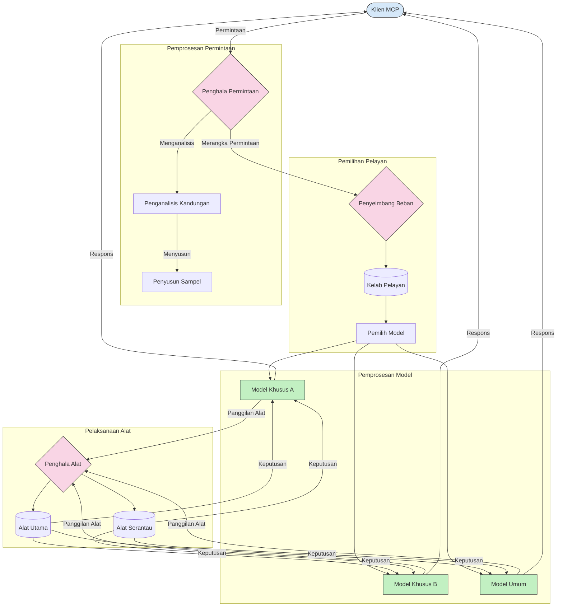

# Penghalaan dalam Protokol Konteks Model

Penghalaan adalah penting untuk mengarahkan permintaan ke model, alat, atau perkhidmatan yang sesuai dalam ekosistem MCP.

## Pengenalan

Penghalaan dalam Protokol Konteks Model (MCP) melibatkan pengarahan permintaan kepada model atau perkhidmatan yang paling sesuai berdasarkan pelbagai kriteria seperti jenis kandungan, konteks pengguna, dan beban sistem. Ini memastikan pemprosesan yang cekap dan penggunaan sumber yang optimum.

## Objektif Pembelajaran

Pada akhir pelajaran ini, anda akan dapat:

- Memahami prinsip penghalaan dalam MCP.
- Melaksanakan penghalaan berasaskan kandungan untuk mengarahkan permintaan ke perkhidmatan khusus.
- Mengaplikasikan strategi seimbang beban pintar untuk mengoptimumkan penggunaan sumber.
- Melaksanakan penghalaan alat dinamik berdasarkan konteks permintaan.

## Penghalaan Berasaskan Kandungan

Penghalaan berasaskan kandungan mengarahkan permintaan ke perkhidmatan khusus berdasarkan kandungan permintaan tersebut. Sebagai contoh, permintaan berkaitan penjanaan kod boleh dihantar ke model kod khusus, manakala permintaan penulisan kreatif boleh dihantar ke model penulisan kreatif.

Mari kita lihat contoh pelaksanaan dalam pelbagai bahasa pengaturcaraan.

<details>
<summary>.NET</summary>

```csharp
// .NET Example: Content-based routing in MCP
public class ContentBasedRouter
{
    private readonly Dictionary<string, McpClient> _specializedClients;
    private readonly RoutingClassifier _classifier;
    
    public ContentBasedRouter()
    {
        // Initialize specialized clients for different domains
        _specializedClients = new Dictionary<string, McpClient>
        {
            ["code"] = new McpClient("https://code-specialized-mcp.com"),
            ["creative"] = new McpClient("https://creative-specialized-mcp.com"),
            ["scientific"] = new McpClient("https://scientific-specialized-mcp.com"),
            ["general"] = new McpClient("https://general-mcp.com")
        };
        
        // Initialize content classifier
        _classifier = new RoutingClassifier();
    }
    
    public async Task<McpResponse> RouteAndProcessAsync(string prompt, IDictionary<string, object> parameters = null)
    {
        // Classify the prompt to determine the best specialized service
        string category = await _classifier.ClassifyPromptAsync(prompt);
        
        // Get the appropriate client or fall back to general
        var client = _specializedClients.ContainsKey(category) 
            ? _specializedClients[category] 
            : _specializedClients["general"];
            
        Console.WriteLine($"Routing request to {category} specialized service");
        
        // Send request to the selected service
        return await client.SendPromptAsync(prompt, parameters);
    }
    
    // Simple classifier for routing decisions
    private class RoutingClassifier
    {
        public Task<string> ClassifyPromptAsync(string prompt)
        {
            prompt = prompt.ToLowerInvariant();
            
            if (prompt.Contains("code") || prompt.Contains("function") || 
                prompt.Contains("program") || prompt.Contains("algorithm"))
            {
                return Task.FromResult("code");
            }
            
            if (prompt.Contains("story") || prompt.Contains("creative") || 
                prompt.Contains("imagine") || prompt.Contains("design"))
            {
                return Task.FromResult("creative");
            }
            
            if (prompt.Contains("science") || prompt.Contains("research") || 
                prompt.Contains("analyze") || prompt.Contains("study"))
            {
                return Task.FromResult("scientific");
            }
            
            return Task.FromResult("general");
        }
    }
}
```

Dalam kod di atas, kami telah:

- Membuat kelas `ContentBasedRouter` yang mengarahkan permintaan berdasarkan kandungan arahan.
- Memulakan klien khusus untuk domain yang berbeza (kod, kreatif, saintifik, umum).
- Melaksanakan pengelasan ringkas yang menentukan kategori arahan dan mengarahkannya ke perkhidmatan khusus yang sesuai.
- Menggunakan mekanisme fallback untuk mengarahkan permintaan ke perkhidmatan umum jika tiada perkhidmatan khusus tersedia.
- Melaksanakan pemprosesan asinkron untuk menangani permintaan dengan cekap.
- Menggunakan kamus untuk memetakan kategori kandungan kepada klien MCP khusus.
- Melaksanakan pengelasan ringkas yang menganalisis arahan dan mengembalikan kategori yang sesuai.
- Menggunakan klien khusus untuk menghantar permintaan dan menerima respons.
- Menangani kes di mana arahan tidak sepadan dengan mana-mana kategori khusus dengan mengarahkannya ke perkhidmatan umum.

</details>

## Seimbang Beban Pintar

Seimbang beban mengoptimumkan penggunaan sumber dan memastikan ketersediaan tinggi bagi perkhidmatan MCP. Terdapat pelbagai cara untuk melaksanakan seimbang beban, seperti pusingan bulat, masa respons berbobot, atau strategi peka kandungan.

Mari kita lihat contoh pelaksanaan di bawah yang menggunakan strategi berikut:

- **Pusingan Bulat**: Mengedarkan permintaan secara seimbang ke semua pelayan yang tersedia.
- **Masa Respons Berbobot**: Mengarahkan permintaan ke pelayan berdasarkan purata masa respons mereka.
- **Peka Kandungan**: Mengarahkan permintaan ke pelayan khusus berdasarkan kandungan permintaan.

<details>
<summary>Java</summary>

```java
// Contoh Java: Pengimbangan beban pintar untuk pelayan MCP
public class McpLoadBalancer {
    private final List<McpServerNode> serverNodes;
    private final LoadBalancingStrategy strategy;
    
    public McpLoadBalancer(List<McpServerNode> nodes, LoadBalancingStrategy strategy) {
        this.serverNodes = new ArrayList<>(nodes);
        this.strategy = strategy;
    }
    
    public McpResponse processRequest(McpRequest request) {
        // Pilih pelayan terbaik berdasarkan strategi
        McpServerNode selectedNode = strategy.selectNode(serverNodes, request);
        
        try {
            // Halakan permintaan ke nod yang dipilih
            return selectedNode.processRequest(request);
        } catch (Exception e) {
            // Tangani kegagalan - laksanakan logik cuba semula atau fallback
            System.err.println("Error processing request on node " + selectedNode.getId() + ": " + e.getMessage());
            
            // Tandakan nod sebagai berpotensi tidak sihat
            selectedNode.recordFailure();
            
            // Cuba nod terbaik seterusnya sebagai fallback
            List<McpServerNode> remainingNodes = new ArrayList<>(serverNodes);
            remainingNodes.remove(selectedNode);
            
            if (!remainingNodes.isEmpty()) {
                McpServerNode fallbackNode = strategy.selectNode(remainingNodes, request);
                return fallbackNode.processRequest(request);
            } else {
                throw new RuntimeException("All MCP server nodes failed to process the request");
            }
        }
    }
    
    // Tugas pemeriksaan kesihatan nod
    public void startHealthChecks(Duration interval) {
        ScheduledExecutorService scheduler = Executors.newScheduledThreadPool(1);
        scheduler.scheduleAtFixedRate(() -> {
            for (McpServerNode node : serverNodes) {
                try {
                    boolean isHealthy = node.checkHealth();
                    System.out.println("Node " + node.getId() + " health status: " + 
                                      (isHealthy ? "HEALTHY" : "UNHEALTHY"));
                } catch (Exception e) {
                    System.err.println("Health check failed for node " + node.getId());
                    node.setHealthy(false);
                }
            }
        }, 0, interval.toMillis(), TimeUnit.MILLISECONDS);
    }
    
    // Antara muka untuk strategi pengimbangan beban
    public interface LoadBalancingStrategy {
        McpServerNode selectNode(List<McpServerNode> nodes, McpRequest request);
    }
    
    // Strategi round-robin
    public static class RoundRobinStrategy implements LoadBalancingStrategy {
        private AtomicInteger counter = new AtomicInteger(0);
        
        @Override
        public McpServerNode selectNode(List<McpServerNode> nodes, McpRequest request) {
            List<McpServerNode> healthyNodes = nodes.stream()
                .filter(McpServerNode::isHealthy)
                .collect(Collectors.toList());
            
            if (healthyNodes.isEmpty()) {
                throw new RuntimeException("No healthy nodes available");
            }
            
            int index = counter.getAndIncrement() % healthyNodes.size();
            return healthyNodes.get(index);
        }
    }
    
    // Strategi masa respons berbobot
    public static class ResponseTimeStrategy implements LoadBalancingStrategy {
        @Override
        public McpServerNode selectNode(List<McpServerNode> nodes, McpRequest request) {
            return nodes.stream()
                .filter(McpServerNode::isHealthy)
                .min(Comparator.comparing(McpServerNode::getAverageResponseTime))
                .orElseThrow(() -> new RuntimeException("No healthy nodes available"));
        }
    }
    
    // Strategi peka kandungan
    public static class ContentAwareStrategy implements LoadBalancingStrategy {
        @Override
        public McpServerNode selectNode(List<McpServerNode> nodes, McpRequest request) {
            // Tentukan ciri-ciri permintaan
            boolean isCodeRequest = request.getPrompt().contains("code") || 
                                   request.getAllowedTools().contains("codeInterpreter");
            
            boolean isCreativeRequest = request.getPrompt().contains("creative") || 
                                       request.getPrompt().contains("story");
            
            // Cari nod khusus
            Optional<McpServerNode> specializedNode = nodes.stream()
                .filter(McpServerNode::isHealthy)
                .filter(node -> {
                    if (isCodeRequest && node.getSpecialization().equals("code")) {
                        return true;
                    }
                    if (isCreativeRequest && node.getSpecialization().equals("creative")) {
                        return true;
                    }
                    return false;
                })
                .findFirst();
            
            // Kembalikan nod khusus atau nod yang paling sedikit beban
            return specializedNode.orElse(
                nodes.stream()
                    .filter(McpServerNode::isHealthy)
                    .min(Comparator.comparing(McpServerNode::getCurrentLoad))
                    .orElseThrow(() -> new RuntimeException("No healthy nodes available"))
            );
        }
    }
}
```

Dalam kod di atas, kami telah:

- Membuat kelas `McpLoadBalancer` yang mengurus senarai nod pelayan MCP dan mengarahkan permintaan berdasarkan strategi seimbang beban yang dipilih.
- Melaksanakan pelbagai strategi seimbang beban: `RoundRobinStrategy`, `ResponseTimeStrategy`, dan `ContentAwareStrategy`.
- Menggunakan `ScheduledExecutorService` untuk memeriksa kesihatan nod pelayan secara berkala.
- Melaksanakan mekanisme pemeriksaan kesihatan yang menandakan nod sebagai sihat atau tidak berdasarkan respons mereka terhadap pemeriksaan.
- Mengendalikan pemprosesan permintaan dengan pengendalian ralat dan logik fallback untuk memastikan ketersediaan tinggi.
- Menggunakan kelas `McpServerNode` untuk mewakili nod pelayan MCP individu, termasuk status kesihatan, purata masa respons, dan beban semasa.
- Melaksanakan kelas `McpRequest` untuk mengemas kini butiran permintaan seperti arahan dan alat yang dibenarkan.
- Menggunakan Java Streams untuk menapis dan memilih nod berdasarkan status kesihatan dan pengkhususan.

</details>

## Penghalaan Alat Dinamik

Penghalaan alat memastikan panggilan alat diarahkan ke perkhidmatan yang paling sesuai berdasarkan konteks. Contohnya, panggilan alat cuaca mungkin perlu diarahkan ke titik akhir wilayah berdasarkan lokasi pengguna, atau alat kalkulator mungkin perlu menggunakan versi API tertentu.

Mari kita lihat contoh pelaksanaan yang menunjukkan penghalaan alat dinamik berdasarkan analisis permintaan, titik akhir wilayah, dan sokongan versi.

<details>
<summary>Python</summary>

```python
# Contoh Python: Penghalaan alat dinamik berdasarkan analisis permintaan
class McpToolRouter:
    def __init__(self):
        # Daftar titik akhir alat yang tersedia
        self.tool_endpoints = {
            "weatherTool": "https://weather-service.example.com/api",
            "calculatorTool": "https://calculator-service.example.com/compute",
            "databaseTool": "https://database-service.example.com/query",
            "searchTool": "https://search-service.example.com/search"
        }
        
        # Titik akhir serantau untuk pengedaran global
        self.regional_endpoints = {
            "us": {
                "weatherTool": "https://us-west.weather-service.example.com/api",
                "searchTool": "https://us.search-service.example.com/search"
            },
            "europe": {
                "weatherTool": "https://eu.weather-service.example.com/api",
                "searchTool": "https://eu.search-service.example.com/search"
            },
            "asia": {
                "weatherTool": "https://asia.weather-service.example.com/api",
                "searchTool": "https://asia.search-service.example.com/search"
            }
        }
        
        # Sokongan versi alat
        self.tool_versions = {
            "weatherTool": {
                "default": "v2",
                "v1": "https://weather-service.example.com/api/v1",
                "v2": "https://weather-service.example.com/api/v2",
                "beta": "https://weather-service.example.com/api/beta"
            }
        }
    
    async def route_tool_request(self, tool_name, parameters, user_context=None):
        """Route a tool request to the appropriate endpoint based on context"""
        endpoint = self._select_endpoint(tool_name, parameters, user_context)
        
        if not endpoint:
            raise ValueError(f"No endpoint available for tool: {tool_name}")
        
        # Melaksanakan permintaan sebenar ke titik akhir yang dipilih
        return await self._execute_tool_request(endpoint, tool_name, parameters)
    
    def _select_endpoint(self, tool_name, parameters, user_context=None):
        """Select the most appropriate endpoint based on context"""
        # Titik akhir asas dari daftar
        if tool_name not in self.tool_endpoints:
            return None
            
        base_endpoint = self.tool_endpoints[tool_name]
        
        # Semak jika kita perlu menggunakan versi alat tertentu
        if tool_name in self.tool_versions:
            version_info = self.tool_versions[tool_name]
            
            # Gunakan versi yang ditetapkan atau lalai
            requested_version = parameters.get("_version", version_info["default"])
            if requested_version in version_info:
                base_endpoint = version_info[requested_version]
        
        # Semak penghalaan serantau jika wilayah pengguna diketahui
        if user_context and "region" in user_context:
            user_region = user_context["region"]
            
            if user_region in self.regional_endpoints:
                regional_tools = self.regional_endpoints[user_region]
                
                if tool_name in regional_tools:
                    # Gunakan titik akhir khusus wilayah
                    return regional_tools[tool_name]
        
        # Semak keperluan kediaman data
        if user_context and "data_residency" in user_context:
            # Ini akan melaksanakan logik untuk memastikan data kekal dalam bidang kuasa yang ditetapkan
            pass
        
        # Semak untuk penghalaan berdasarkan latensi
        if user_context and "latency_sensitive" in user_context and user_context["latency_sensitive"]:
            # Ini akan melaksanakan logik untuk memilih titik akhir dengan latensi terendah
            pass
            
        return base_endpoint
        
    async def _execute_tool_request(self, endpoint, tool_name, parameters):
        """Execute the actual tool request to the selected endpoint"""
        try:
            async with aiohttp.ClientSession() as session:
                async with session.post(
                    endpoint,
                    json={"toolName": tool_name, "parameters": parameters},
                    headers={"Content-Type": "application/json"}
                ) as response:
                    if response.status == 200:
                        result = await response.json()
                        return result
                    else:
                        error_text = await response.text()
                        raise Exception(f"Tool execution failed: {error_text}")
        except Exception as e:
            # Laksanakan logik cuba semula atau strategi fallback
            print(f"Error executing tool {tool_name} at {endpoint}: {str(e)}")
            raise
```

Dalam kod di atas, kami telah:

- Membuat kelas `McpToolRouter` yang mengurus penghalaan alat berdasarkan analisis permintaan, titik akhir wilayah, dan sokongan versi.
- Mendaftarkan titik akhir alat yang tersedia dan titik akhir wilayah untuk pengedaran global.
- Melaksanakan logik penghalaan dinamik yang memilih titik akhir yang sesuai berdasarkan konteks pengguna, seperti wilayah dan keperluan kediaman data.
- Melaksanakan sokongan versi untuk alat, membolehkan pengguna menentukan versi alat yang ingin digunakan.
- Menggunakan permintaan HTTP asinkron untuk melaksanakan panggilan alat dan menangani respons.

</details>

## Sampel dan Seni Bina Penghalaan dalam MCP

Sampel adalah komponen kritikal dalam Protokol Konteks Model (MCP) yang membolehkan pemprosesan dan penghalaan permintaan dengan cekap. Ia melibatkan analisis permintaan masuk untuk menentukan model atau perkhidmatan yang paling sesuai untuk mengendalikannya, berdasarkan pelbagai kriteria seperti jenis kandungan, konteks pengguna, dan beban sistem.

Sampel dan penghalaan boleh digabungkan untuk mencipta seni bina yang kukuh yang mengoptimumkan penggunaan sumber dan memastikan ketersediaan tinggi. Proses sampel boleh digunakan untuk mengklasifikasikan permintaan, manakala penghalaan mengarahkan mereka ke model atau perkhidmatan yang sesuai.

Rajah di bawah menggambarkan bagaimana sampel dan penghalaan bekerjasama dalam seni bina MCP yang menyeluruh:



## Apa seterusnya

- [5.6 Sampel](../mcp-sampling/README.md)

---

<!-- CO-OP TRANSLATOR DISCLAIMER START -->
**Penafian**:
Dokumen ini telah diterjemahkan menggunakan perkhidmatan terjemahan AI [Co-op Translator](https://github.com/Azure/co-op-translator). Walaupun kami berusaha untuk ketepatan, sila ambil maklum bahawa terjemahan automatik mungkin mengandungi kesilapan atau ketidaktepatan. Dokumen asal dalam bahasa asalnya harus dianggap sebagai sumber yang sahih. Untuk maklumat penting, terjemahan oleh manusia profesional adalah disyorkan. Kami tidak bertanggungjawab terhadap sebarang salah faham atau salah tafsir yang timbul daripada penggunaan terjemahan ini.
<!-- CO-OP TRANSLATOR DISCLAIMER END -->