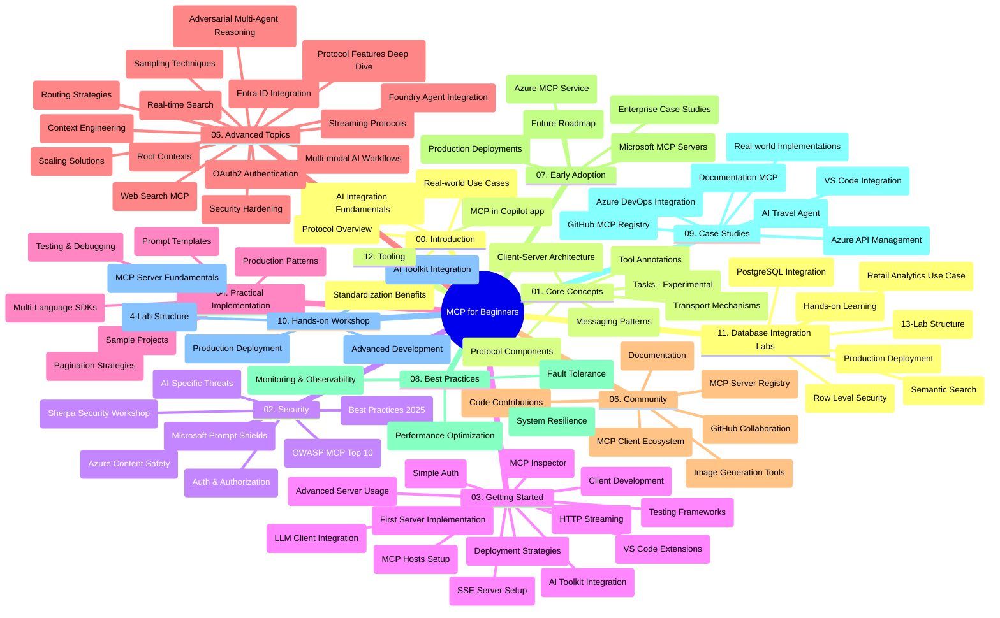

# Protokol Konteks Model (MCP) untuk Pemula - Panduan Kajian

Panduan kajian ini memberikan gambaran keseluruhan tentang struktur dan kandungan repositori untuk kurikulum "Protokol Konteks Model (MCP) untuk Pemula". Gunakan panduan ini untuk menavigasi repositori dengan cekap dan memanfaatkan sumber yang tersedia sepenuhnya.

## Gambaran Keseluruhan Repositori

Protokol Konteks Model (MCP) adalah kerangka kerja standard untuk interaksi antara model AI dan aplikasi pelanggan. Pada asalnya dicipta oleh Anthropic, MCP kini dikekalkan oleh komuniti MCP yang lebih luas melalui organisasi GitHub rasmi. Repositori ini menyediakan kurikulum menyeluruh dengan contoh kod praktikal dalam C#, Java, JavaScript, Python, dan TypeScript, direka untuk pembangun AI, arkitek sistem, dan jurutera perisian.

## Peta Kurikulum Visual

## Struktur Repositori

Repositori ini disusun ke dalam dua belas bahagian utama, masing-masing memfokuskan pada aspek berbeza MCP:

1. **Pengenalan (00-Introduction/)**
   - Gambaran keseluruhan Protokol Konteks Model
   - Kenapa penstandardan penting dalam saluran AI
   - Kes penggunaan praktikal dan manfaat

2. **Konsep Teras (01-CoreConcepts/)**
   - Seni bina klien-pelayan
   - Komponen utama protokol
   - Corak penghantaran mesej dalam MCP
   - Melihat ke hadapan: [Apa yang Berubah dalam MCP: Calon Pelepasan 2026-07-28](./01-CoreConcepts/mcp-2026-07-28-release-candidate.md) — teras protokol tanpa keadaan, rangka kerja Sambungan, dan penarikan balik Roots/Sampling/Logging yang dijangka dalam versi spesifikasi seterusnya

3. **Keselamatan (02-Security/)**
   - Ancaman keselamatan dalam sistem berasaskan MCP
   - Amalan terbaik untuk mengamankan pelaksanaan
   - Strategi pengesahan dan kebenaran
   - **Dokumentasi Keselamatan Komprehensif**:
     - Amalan Terbaik Keselamatan MCP 2025
     - Panduan Pelaksanaan Keselamatan Kandungan Azure
     - Kawalan dan Teknik Keselamatan MCP
     - Rujukan Pantas Amalan Terbaik MCP
   - **Topik Utama Keselamatan**:
     - Serangan suntikan arahan dan keracunan alat
     - Pengambilalihan sesi dan masalah pembantu yang keliru
     - Kelemahan laluan token
     - Kebenaran berlebihan dan kawalan akses
     - Keselamatan rantaian bekalan untuk komponen AI
     - Integrasi Pelindung Arahan Microsoft

4. **Memulakan (03-GettingStarted/)**
   - Persediaan dan konfigurasi persekitaran
   - Membina pelayan dan klien MCP asas
   - Integrasi dengan aplikasi sedia ada
   - Termasuk seksyen untuk:
     - Pelaksanaan pelayan pertama
     - Pembangunan klien
     - Integrasi klien LLM
     - Integrasi VS Code
     - Pelayan Acara Dihantar Server (SSE)
     - Penggunaan pelayan lanjutan
     - Penstriman HTTP
     - Integrasi Perkakas AI
     - Strategi pengujian
     - Panduan penghantaran

5. **Pelaksanaan Praktikal (04-PracticalImplementation/)**
   - Menggunakan SDK dalam pelbagai bahasa pengaturcaraan
   - Teknik debugging, pengujian, dan pengesahan
   - Membina templat arahan dan alur kerja yang boleh digunakan semula
   - Projek contoh dengan contoh pelaksanaan

6. **Topik Lanjutan (05-AdvancedTopics/)**
   - Teknik kejuruteraan konteks
   - Integrasi agen Foundry
   - Alur kerja AI pelbagai mod
   - Demo pengesahan OAuth2
   - Keupayaan carian masa nyata
   - Penstriman masa nyata
   - Pelaksanaan konteks akar
   - Strategi penghalaan
   - Teknik pensampelan
   - Pendekatan penalaan skala
   - Pertimbangan keselamatan
   - Integrasi keselamatan Entra ID
   - Integrasi carian web
   - Penalaran multi-agen adversarial (corak perdebatan)

7. **Sumbangan Komuniti (06-CommunityContributions/)**
   - Cara menyumbang kod dan dokumentasi
   - Bekerjasama melalui GitHub
   - Penambahbaikan dan maklum balas oleh komuniti
   - Menggunakan pelbagai klien MCP (Claude Desktop, Cline, VSCode)
   - Bekerja dengan pelayan MCP popular termasuk generasi imej

8. **Pengajaran dari Penerimaan Awal (07-LessonsfromEarlyAdoption/)**
   - Pelaksanaan sebenar dan kisah kejayaan
   - Membina dan menerapkan penyelesaian berasaskan MCP
   - Tren dan peta jalan masa depan
   - **Panduan Pelayan MCP Microsoft**: Panduan komprehensif untuk 10 pelayan MCP Microsoft sedia produksi termasuk:
     - Pelayan MCP Microsoft Learn Docs
     - Pelayan MCP Azure (15+ penyambung khusus)
     - Pelayan MCP GitHub
     - Pelayan MCP Azure DevOps
     - Pelayan MCP MarkItDown
     - Pelayan MCP SQL Server
     - Pelayan MCP Playwright
     - Pelayan MCP Dev Box
     - Pelayan MCP Microsoft Foundry
     - Pelayan MCP Toolkit Agen Microsoft 365

9. **Amalan Terbaik (08-BestPractices/)**
   - Penalaan prestasi dan pengoptimuman
   - Reka bentuk sistem MCP tahan ralat
   - Strategi pengujian dan ketahanan

10. **Kajian Kes (09-CaseStudy/)**
    - **Tujuh kajian kes komprehensif** yang menunjukkan kepelbagaian MCP merentas pelbagai senario:
    - **Ejen Pelancongan Azure AI**: Orkestrasi multi-agen dengan Azure OpenAI dan Carian AI
    - **Integrasi Azure DevOps**: Automasi proses alur kerja dengan kemas kini data YouTube
    - **Perolehan Dokumentasi Masa Nyata**: Klien konsol Python dengan penstriman HTTP
    - **Penjana Pelan Kajian Interaktif**: Aplikasi web Chainlit dengan AI perbualan
    - **Dokumentasi Dalam Penyunting**: Integrasi VS Code dengan alur kerja GitHub Copilot
    - **Pengurusan API Azure**: Integrasi API perusahaan dengan penciptaan pelayan MCP
    - **Pendaftaran MCP GitHub**: Pembangunan ekosistem dan platform integrasi agen
    - Contoh pelaksanaan merangkumi integrasi perusahaan, produktiviti pembangun, dan pembangunan ekosistem

11. **Bengkel Praktikal (10-StreamliningAIWorkflowsBuildingAnMCPServerWithAIToolkit/)**
    - Bengkel praktikal komprehensif yang menggabungkan MCP dengan Perkakas AI
    - Membina aplikasi pintar yang menghubungkan model AI dengan alat dunia nyata
    - Modul praktikal merangkumi asas, pembangunan pelayan tersuai, dan strategi pengeluaran
    - **Struktur Makmal**:
      - Makmal 1: Asas Pelayan MCP
      - Makmal 2: Pembangunan Pelayan MCP Lanjutan
      - Makmal 3: Integrasi Perkakas AI
      - Makmal 4: Pengeluaran dan Penalaan Skala
    - Pendekatan pembelajaran berasaskan makmal dengan arahan langkah demi langkah

12. **Makmal Integrasi Pangkalan Data Pelayan MCP (11-MCPServerHandsOnLabs/)**
    - **Jalur pembelajaran 13-makmal komprehensif** untuk membina pelayan MCP sedia produksi dengan integrasi PostgreSQL
    - **Pelaksanaan analitik runcit dunia nyata** menggunakan kes penggunaan Zava Retail
    - **Corak gred perusahaan** termasuk Keselamatan Tahap Baris (RLS), carian semantik, dan akses data pelbagai penyewa
    - **Struktur Makmal Lengkap**:
      - **Makmal 00-03: Asas** - Pengenalan, Seni Bina, Keselamatan, Persediaan Persekitaran
      - **Makmal 04-06: Membangun Pelayan MCP** - Reka Bentuk Pangkalan Data, Pelaksanaan Pelayan MCP, Pembangunan Alat
      - **Makmal 07-09: Ciri Lanjutan** - Carian Semantik, Pengujian & Debugging, Integrasi VS Code
      - **Makmal 10-12: Pengeluaran & Amalan Terbaik** - Penghantaran, Pemantauan, Pengoptimuman
    - **Teknologi Diliputi**: Rangka kerja FastMCP, PostgreSQL, Azure OpenAI, Azure Container Apps, Application Insights
    - **Hasil Pembelajaran**: Pelayan MCP sedia produksi, corak integrasi pangkalan data, analitik berkuasa AI, keselamatan perusahaan

13. **Peralatan (12-tooling/)**
    - Ketahui cara menggunakan MCP dalam aplikasi Copilot dan alat lain

## Sumber Tambahan

Repositori ini termasuk sumber sokongan:

- **Folder Imej**: Mengandungi rajah dan ilustrasi yang digunakan sepanjang kurikulum
- **Terjemahan**: Sokongan pelbagai bahasa dengan terjemahan automatik dokumentasi
- **Sumber MCP Rasmi**:
  - [Dokumentasi MCP](https://modelcontextprotocol.io/)
  - [Spesifikasi MCP](https://spec.modelcontextprotocol.io/)
  - [Repositori GitHub MCP](https://github.com/modelcontextprotocol)

## Cara Menggunakan Repositori Ini

1. **Pembelajaran Berurutan**: Ikuti bab secara berurutan (00 hingga 11) untuk pengalaman pembelajaran yang terstruktur.
2. **Fokus Bahasa Tertentu**: Jika anda berminat dengan bahasa pengaturcaraan tertentu, terokai direktori sampel untuk pelaksanaan dalam bahasa pilihan anda.
3. **Pelaksanaan Praktikal**: Mula dengan bahagian "Memulakan" untuk menyediakan persekitaran anda dan mencipta pelayan dan klien MCP pertama anda.
4. **Eksplorasi Lanjutan**: Setelah mahir dengan asas, selami topik lanjutan untuk memperluas pengetahuan anda.
5. **Penglibatan Komuniti**: Sertai komuniti MCP melalui perbincangan GitHub dan saluran Discord untuk berhubung dengan pakar dan pembangun lain.

## Klien dan Alat MCP

Kurikulum merangkumi pelbagai klien dan alat MCP:

1. **Klien Rasmi**:
   - Visual Studio Code 
   - MCP dalam Visual Studio Code
   - Claude Desktop
   - Claude dalam VSCode 
   - Claude API

2. **Klien Komuniti**:
   - Cline (berasaskan terminal)
   - Cursor (penyunting kod)
   - ChatMCP
   - Windsurf

3. **Alat Pengurusan MCP**:
   - MCP CLI
   - MCP Manager
   - MCP Linker
   - MCP Router

## Pelayan MCP Popular

Repositori memperkenalkan pelbagai pelayan MCP, termasuk:

1. **Pelayan MCP Microsoft Rasmi**:
   - Pelayan MCP Microsoft Learn Docs
   - Pelayan MCP Azure (15+ penyambung khusus)
   - Pelayan MCP GitHub
   - Pelayan MCP Azure DevOps
   - Pelayan MCP MarkItDown
   - Pelayan MCP SQL Server
   - Pelayan MCP Playwright
   - Pelayan MCP Dev Box
   - Pelayan MCP Microsoft Foundry
   - Pelayan MCP Toolkit Agen Microsoft 365

2. **Pelayan Rujukan Rasmi**:
   - Sistem fail
   - Fetch
   - Memori
   - Pemikiran Berurutan

3. **Generasi Imej**:
   - Azure OpenAI DALL-E 3
   - Stable Diffusion WebUI
   - Replicate

4. **Alat Pembangunan**:
   - Git MCP
   - Kawalan Terminal
   - Pembantu Kod

5. **Pelayan Khusus**:
   - Salesforce
   - Microsoft Teams
   - Jira & Confluence

## Menyumbang

Repositori ini mengalu-alukan sumbangan daripada komuniti. Lihat bahagian Sumbangan Komuniti untuk panduan bagaimana menyumbang secara berkesan kepada ekosistem MCP.

----

*Panduan kajian ini dikemas kini terakhir pada 5 Februari 2026, mencerminkan Spesifikasi MCP terkini 2025-11-25 dan memberikan gambaran keseluruhan repositori setakat tarikh tersebut. Kandungan repositori mungkin dikemas kini selepas tarikh ini.*

*Tambahan (2 Julai 2026): satu pelajaran mengenai Calon Pelepasan Spesifikasi MCP `2026-07-28` ditambah di bawah [01-CoreConcepts](./01-CoreConcepts/mcp-2026-07-28-release-candidate.md); asas kurikulum kekal 2025-11-25 sehingga spesifikasi baru dihantar.*

---

<!-- CO-OP TRANSLATOR DISCLAIMER START -->
**Penafian**:
Dokumen ini telah diterjemahkan menggunakan perkhidmatan terjemahan AI [Co-op Translator](https://github.com/Azure/co-op-translator). Walaupun kami berusaha untuk ketepatan, sila ambil maklum bahawa terjemahan automatik mungkin mengandungi kesilapan atau ketidaktepatan. Dokumen asal dalam bahasa asalnya harus dianggap sebagai sumber yang sahih. Untuk maklumat penting, terjemahan oleh manusia profesional adalah disyorkan. Kami tidak bertanggungjawab terhadap sebarang salah faham atau salah tafsir yang timbul daripada penggunaan terjemahan ini.
<!-- CO-OP TRANSLATOR DISCLAIMER END -->