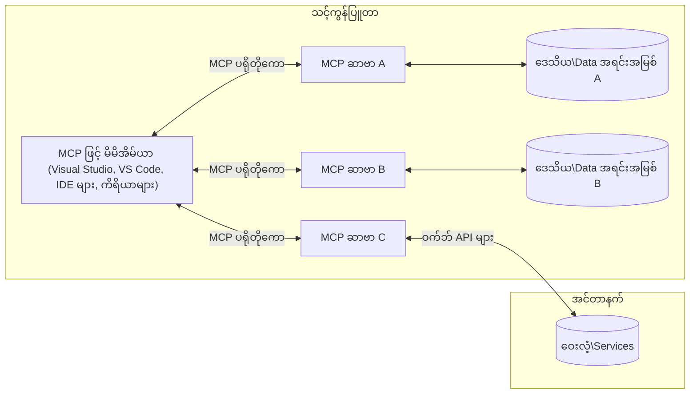

# MCP အဓိကသဘောတရားများ - AI ပေါင်းစည်းမှုအတွက် Model Context Protocol ကိုကျွမ်းကျင်ခြင်း

[](https://youtu.be/earDzWGtE84)

_(ဤသင်ခန်းစာ၏ ဗီဒီယိုကိုကြည့်ရန် အပေါ်ပုံကို နှိပ်ပါ)_

[Model Context Protocol (MCP)](https://github.com/modelcontextprotocol) သည် ကြီးမားသောဘာသာစကားမော်ဒယ်များ (LLMs) နှင့် အပြင်ရိုက်များ၊ အက်ပလီကေးရှင်းများ ၊ ဒေတာရင်းမြစ်များအကြား ဆက်သွယ်မှုကို စံပြဖြစ်စေသည့် အင်အားကြီး၊ စံနှုန်းတစ်ခုဖြစ်သော ဒီဇိုင်းဖြစ်သည်။
ဤလမ်းညွှန်သည် MCP ၏ အဓိကသဘောတရားများအား လမ်းညွှန်ပါမည်။ သင်သည် ၎င်း၏ client-server ဖွဲ့စည်းပုံ၊ အရေးကြီးသောအစိတ်အပိုင်းများ၊ ဆက်သွယ်မှုလုပ်ငန်းစဉ်များနှင့် အကောင်အထည်ဖော်မှုအကောင်းဆုံးအလေ့အကျင့်များကို လေ့လာသွားမည်ဖြစ်သည်။

- **အသုံးပြုသူ၏ ထိပ်တိုက်အတည်ပြုချက်**: ဒေတာသုံးမြှောက်ခြင်းနှင့် လုပ်ဆောင်ချက်များ အားလုံးသည် ဖော်ပြချက်ရရှိသောအသုံးပြုသူ၏ ခွင့်ပြုချက်ဖြင့်သာ လုပ်ဆောင်ခွင့်ရသည်။ အသုံးပြုသူများသည် ရရှိမည့်ဒေတာနှင့် ပြုလုပ်မည့်ဆောင်ရွက်ချက်များကို ရှင်းလင်းစွာနားလည်ထားရမည်၊ ခွင့်ပြုချက်များနှင့် ခွင့်ပြုမှုများကို အသေးစိတ်ထိန်းချုပ်နိုင်ရန် လိုအပ်သည်။

- **ဒေတာပုဂ္ဂိုလိကကာကွယ်မှု**: အသုံးပြုသူဒေတာကို ဖော်ပြချက်ရရှိသောခွင့်ပြုချက်ဖြင့်သာ ထုတ်ဖော်ထားပြီး သီးသန့်အရင်းအမြစ် အသုံးပြုမှုလမ်းကြောင်းတစ်လျှောက်တွင် ခိုင်ခံ့သောアクセスコントロールများဖြင့် ကာကွယ်ထားရမည်။ မလိုလားအပ်သော ဒေတာစနစ်ပြောင်းလဲမှုများမှကာကွယ်ရန် နှင့် အရပ်ဖက်အချက်အလက်လုံခြုံရေးကို တင်းကျပ်စွာထိန်းသိမ်းရမည်။

- **ကိရိယာအသုံးပြုမှုလုံခြုံမှု**: ကိရိယာတိုက်ခိုက်ရာတိုင်းသည် အသုံးပြုသူ၏ထိပ်တိုက်ခွင့်ပြုချက်တွင် အခြေခံပြီး ကိရိယာ၏ လုပ်ဆောင်ချက်များ၊ ပါရာမီတာများနှင့် ထိခိုက်မှုရှိနိုင်ခြေများကို ဖော်ပြသည်။ မလိုလားအပ်သော၊ ပျက်စီးမှုရှိနိုင်သည့် ကိရိယာလုပ်ဆောင်မှုများမှ ကာကွယ်ရန်ခိုင်မာသော လုံခြုံရေးနယ်မြေများရှိရမည်။

- **သယ်ယူပို့ဆောင်ရေးအဆင့် လုံခြုံရေး**: ဆက်သွယ်မှုလမ်းကြောင်းအားလုံးတွင် သင့်တော်သော စာရင်းဇယားနှင့် အတည်ပြုမှု့နည်းများကို အသုံးပြုသင့်သည်။ ဝေးလံရာကွန်ယက်ချိတ်ဆက်မှုများတွင်လည်း လုံခြုံသယ်ယူပို့ဆောင်ရေးစနစ်များနှင့် သင့်တော်သော ကိုယ်စားလှယ်စီမံခန့်ခွဲမှုကို တပ်ဆင်ရမည်။

#### အကောင်အထည်ဖော်မှု လမ်းညွှန်ချက်များ

- **ခွင့်ပြုမှု စီမံခန့်ခွဲမှု**: အသုံးပြုသူများသည် မည်သည့် ဆာဗာများ၊ ကိရိယာများနှင့် အရင်းအမြစ်များကို ဝင်ရောက်ခွင့်ရှိမည်ကို ထိန်းချုပ်နိုင်သော အသေးစိတ်ခွင့်ပြုမှုစနစ်များ ဖန်တီးပါ
- **အတည်ပြုမှုနှင့် ခွင့်ပြုမှုချထားမှု**: လုံခြုံသော အတည်ပြုမှု နည်းလမ်းများ (OAuth, API Keys) ကို သင့်တော်သော တိုကင်စီမံခန့်ခွဲမှုနှင့် သက်တမ်းကုန်ဆုံးမှု နည်းလမ်းများဖြင့် အသုံးပြုပါ  
- **အချက်အလက် မှန်ကန်မှု စစ်ဆေးခြင်း**: ဖော်ပြထားသော စံနမူနာများအရ ပါရာမီတာများနှင့် ဒေတာထည့်သွင်းချက်များကို စစ်ဆေးခြင်းဖြင့် ထိုးပေါက်မှုတိုက်ဖျက်ရန်  
- **စစ်ဆေး မှတ်တမ်းတင်မှု**: လုံခြုံရေး စောင့်ကြည့်မှုနှင့် ကိုက်ညီမှုအတွက် လုပ်ဆောင်ချက် အားလုံး၏ မှတ်တမ်းများကိုအသေးစိတ် ထားရှိပါ

## အနှစ်ချုပ်

ဤသင်ခန်းစာသည် Model Context Protocol (MCP) ၏ အခြေခံဖွဲ့စည်းပုံနှင့် အစိတ်အပိုင်းများအား အကွာအဝေးရှင်းလင်း စိတ်ဝင်စားဖွယ်ရှင်းပြသည်။ သင်သည် client-server ဖွဲ့စည်းပုံ၊ အဓိကအစိတ်အပိုင်းများနှင့် MCP ဆက်သွယ်မှုလုပ်ငန်းစဉ်များကို လေ့လာသွားမည်။

## သင်ယူရန်အဓိကရည်မှန်းချက်များ

သင်ခန်းစာအဆုံးတွင် သင်သည်

- MCP client-server ဖွဲ့စည်းပုံကိုနားလည်မည်။
- Hosts, Clients နှင့် Servers ၏ တာဝန်များကို သတ်မှတ်နိုင်မည်။
- MCP ကို တည်ဆောက်ရာတွင် အင်အားရှိသော အဓိကလုပ်ဆောင်ချက်များကို ခွဲခြမ်းစိတ်ဖြာနိုင်မည်။
- MCP စနစ်အတွင်းအချက်အလက် ပြင်ဆင်ပုံများကို သိရှိနိုင်မည်။
- .NET, Java, Python နှင့် JavaScript ကွန်ပျူတာဗေဒအပိုင်းများမှတဆင့် လက်တွေ့ သင်ကြားချက်များ ရယူနိုင်မည်။

## MCP ဖွဲ့စည်းပုံ - နက်ရှိုင်းစွာကြည့်ရှုခြင်း

MCP စနစ်သည် client-server မော်ဒယ်၌ တည်ဆောက်ထားသည်။ ၎င်းသည် AI အက်ပလီကေးရှင်းများအား ကိရိယာများ၊ ဒေတာဘေ့စ်များ၊ API များနှင့် ဆက်စပ်ရင်းမြစ်များနှင့် ထိရောက်စွာ ဆက်သွယ်နိုင်စေသည့် module ပေါင်းစည်းမှု ဖြစ်သည်။ ဤဖွဲ့စည်းပုံ၏ အဓိကအစိတ်အပိုင်းများကို မျှဝေပေးပါမည်။

MCP သည် client-server ဖွဲ့စည်းပုံကိုလိုက်နာပြီး host application တစ်ခုသည် ဆာဗারများစွာနှင့် ချိတ်ဆက်နိုင်ပါသည်။



- **MCP Hosts**: VSCode, Claude Desktop, IDE များ သို့မဟုတ် MCP ဖြင့် ဒေတာဝင်ရောက်ချိတ်ဆက်လိုသည့် AI ကိရိယာများ
- **MCP Clients**: ဆာဗာများနှင့် 1:1 ချိတ်ဆက်မှုကို ထိန်းသိမ်းသော Protocol clients များ
- **MCP Servers**: တစ်ခုချင်းစီသည် Model Context Protocol စံနှုန်းဖြင့် အရည်အချင်းသတ်မှတ်ချက်များကို ထုတ်ပြန်သော ပရိုဂရမ်မြှင့်မားမှု အလွယ်တကူ
- **Local Data Sources**: သင့်ကွန်ပြူတာ၏ ဖိုင်များ၊ ဒေတာဘေ့စ်များ၊ MCP ဆာဗာများမှ လုံခြုံစွာ ဝင်ရောက်နိုင်သည့် ဝန်ဆောင်မှုများ  
- **Remote Services**: အင်တာနက်ပေါ်တွင် ရရှိနိုင်ပြီး MCP ဆာဗာများမှ API အားဖြင့် ချိတ်ဆက်နိုင်သည့် အပြင်အစွန်းစနစ်များ

MCP Protocol သည် ရက်စွဲဖြင့် ဗားရှင်းစနစ် (YYYY-MM-DD format) ကို အသုံးပြုသည်။ လက်ရှိ protocol ဗားရှင်းမှာ **2025-11-25** ဖြစ်သည်။ [protocol specification ကို](https://modelcontextprotocol.io/specification/2025-11-25/) ကြည့်နိုင်ပါသည်။

> **အနာဂတ် ကြည့်ရှုခြင်း**: နောက်တစ်ကြိမ် specification ဗားရှင်းဖြစ်သည့် **2026-07-28** အတွက် release candidate သည် 2026 မေတွင် ကြေညာပြီး 2026 ဇူလိုင် 28 တွင် ထုတ်ပြန်မည်ဖြစ်သည်။ သည်ဗားရှင်းတွင် transportation layer တွင် stateless ဖြစ်အောင်ပြင်ဆင်ထားပြီး (`initialize` handshake နဲ့ session ID မရှိတော့), Extensions framework ကို တရားဝင်ပြုလုပ်တင်သွင်းထားသည်၊ အစားထိုးသစ်များအနေဖြင့် Roots, Sampling, Logging များကို ချွတ်သိမ်းထားသည်။ စုံလင်စွာသိရှိလိုပါက [What's Changing in MCP: The 2026-07-28 Release Candidate](./mcp-2026-07-28-release-candidate.md) ကို ကြည့်ပါ။

### ၁။ Hosts

Model Context Protocol (MCP) တွင် **Hosts** ဆိုသည်မှာ အသုံးပြုသူများ Protocol နှင့် ဆက်သွယ်ရာအဓိက အင်တာဖေ့စ်ပေးသည့် AI အက်ပလီကေးရှင်းများဖြစ်သည်။ Hosts များသည် MCP ဆာဗာများစွာသို့ ချိတ်ဆက်ရာ Client များကို သီးခြားဖန်တီးပြီး စီမံခန့်ခွဲသည်။ Hosts အဖြစ် ဥပမာများမှာ

- **AI Applications**: Claude Desktop, Visual Studio Code, Claude Code
- **ဆော့ဖ်ဝဲဖန်တီးရေးပတ်ဝန်းကျင်များ**: MCP ပါဝင်သော IDE များနှင့် ကုဒ်အယ်ဒီတာများ  
- **စိတ်ကြိုက် အက်ပလီကေးရှင်းများ**: ခေါင်းဆောင် AI အေးဂျင့်များနှင့် ကိရိယာအသုံးပြုမှုများ

**Hosts** သည် AI မော်ဒယ်နှင့် ဆက်သွယ်မှုများကို စီမံခန့်ခွဲခြင်း ဖြစ်သည်။ ၎င်းတို့သည်

- **AI မော်ဒယ်ခေါ်ယူမှု စီမံခန့်ခွဲခြင်း**: LLM များကို ဖိတ်ခေါ်ပြီး အဖြေများ ထုတ်လုပ်ခြင်းနှင့် AI လုပ်ငန်းစဉ်များ ကို စနစ်တကျ စုစည်းခြင်း
- **Client ချိတ်ဆက်မှု စီမံခန့်ခွဲမှု**: MCP server တစ်ခုလျှင် MCP client တစ်ခုကို ဖန်တီးပြီး ထိန်းသိမ်းထားခြင်း
- **အသုံးပြုသူ အင်တာဖေ့စ် စီမံခန့်ခွဲမှု**: စကားပြောလမ်းကြောင်း၊ အသုံးပြုသူ အပြန်အလှန်ဆက်သွယ်မှုနှင့် တုံ့ပြန်မှု များကို စီမံခြင်း  
- **လုံခြုံရေး အကန့်အသတ်များ ထိန်းသိမ်းမှု**: ခွင့်ပြုချက်များ၊ လုံခြုံရေးကန့်သတ်ချက်များနှင့် အတည်ပြုမှုများ လုပ်ဆောင်ခြင်း
- **အသုံးပြုသူ ခွင့်ပြုချက် စီမံခန့်ခွဲမှု**: ဒေတာမျှဝေမှုနှင့် ကိရိယာဖိတ်ခေါ်မှု မတိုင်ခင် အသုံးပြုသူ၏ အတည်ပြုချက်ကို စီမံခြင်း


### ၂။ Clients

**Clients** သည် Hosts နှင့် MCP ဆာဗာများအကြား သီးသန့် ၁:၁ ချိတ်ဆက်မှုများ ထိန်းသိမ်းသည့် အရေးပါတဲ့အစိတ်အပိုင်းဖြစ်သည်။ MCP client တစ်ခုစီကို Host မှ တစ်ခုချင်းဆာဗာတစ်ခုချင်း ချိတ်ဆက်ရန် ဖန်တီးပြီး စနစ်တကျ လုံခြုံစွာ ဆက်သွယ်မှု လုပ်ကိုင်နိုင်စေသဖြင့် Clients များစွာဖြင့် ရွှေ့ပြောင်းခြင်း လုပ်ဆောင်နိုင်သည်။

**Clients** သည် host application တွင် ချိတ်ဆက်သူအစိတ်အပိုင်းများဖြစ်သည်။ ၎င်းတို့သည်

- **Protocol ဆက်သွယ်မှု**: JSON-RPC 2.0 အမိန့်များကို ဆာဗာသို့ ပေးပို့ခြင်း (prompt များနှင့် သတ်မှတ်ချက်များနှင့်အတူ)
- **အင်အားညှိနှိုင်းခြင်း**: စတင်ချိန်တွင် ဆာဗာနှင့် ပါဝင်နိုင်သော လုပ်ဆောင်ချက်များနှင့် protocol ဗားရှင်းများကို ညှိနှိုင်းခြင်း
- **ကိရိယာဖိတ်ခေါ်မှု**: မော်ဒယ်မှ ကိရိယာအသုံးပြုမှုအတွက် တောင်းဆိုမှုများကို စီမံခန့်ခွဲပြီး တုံ့ပြန်မှုများကို ကိုင်တွယ်သည်
- **ကာလနှင့် တပြိုင်နက် အသွားအလာ**: ဆာဗာမှ သတင်းအချက်အလက် နှင့် real-time အပ်ဒိတ်များကို ကိုင်တွယ်သည်
- **တုံ့ပြန်မှုကို ပြင်ဆင်ခြင်း**: အသုံးပြုသူများအား ပြသရန် ဆာဗာတုံ့ပြန်ချက်များကို စီစစ် ပြင်ဆင်သည်

### ၃။ Servers

**Servers** သည် MCP clients များအားအခြေခံအချက်အလက်၊ ကိရိယာများ နှင့် အင်အားများပေးသော ပရိုဂရမ်များဖြစ်သည်။ တိုင်းပြည်အတွင်း (Host နှင့် တူညီသော ကွန်ပျူတာ) သို့မဟုတ် အပြင်ဘက်စနစ်များ၌ လည်း ဆာဗာများ လုပ်ဆောင်နိုင်ပြီး client တောင်းဆိုချက်များကို ကိုင်တွယ်ပြီး စနစ်တကျ တုံ့ပြန်ချက်များ ပေးတတ်သည်။ ထို Servers များသည် standardized Model Context Protocol ဖြင့် အတည်သတ်မှတ်ထားသော လုပ်ဆောင်ချက်များကို ထုတ်ပြန်သည်။

**Servers** သည် အောက်ပါတာဝန်များကို ထမ်းဆောင်သည်။

- **အင်အားများ မှတ်ပုံတင်ခြင်း**: ကုန်ပစ္စည်းများ၊ စကားပုံများ၊ ကိရိယာများကို clients များထံ မိတ်ဆက်အသုံးပြုခွင့်ပေးခြင်း
- **တောင်းဆိုမှု ကိုင်တွယ်ခြင်း**: ကိရိယာခေါ်ဆိုမှုများ၊ အရင်းအမြစ်တောင်းဆိုမှုများ၊ စကားပုံတောင်းဆိုမှုများကို လက်ခံ ဆောင်ရွက်ခြင်း
- **အခြေခံအချက်အလက် ပေးပို့ခြင်း**: မော်ဒယ်တုံ့ပြန်ချက်များအား အကောင်းမြင်သာစေဖို့တ် အချက်အလက်နှင့် သဘောတရားများ ပံ့ပိုးပေးခြင်း
- **အခြေအနေ စီမံခန့်ခွဲမှု**: စနစ်အသုံးပြုမှုအခြေအနေများကို ထိန်းသိမ်းပြီး လိုအပ်သလောက် အခြေအနေတစ်ဖက်စီမှ လုပ်ဆောင်မှုများ ဆောင်ရွက်ခြင်း
- **real-time အသိပေးချက်များ**: အင်အားပြောင်းလဲမှုများ၊ အပ်ဒိတ္များအား သတိပေးချက်များပေးပို့ခြင်း

ဆာဗာများကို မည်သူမဆို ဖန်တီးနိုင်ပြီး ကီရိယာအင်အားများကို တိုးချဲ့နိုင်ပြီး ဒေသခံနှင့်ဝေးလံ ချိတ်ဆက်မှုများနှစ်မျိုးလုံးကို ထောက်ပံ့သည်။

### ၄။ Server primitives

Model Context Protocol (MCP) ၌ Servers များမှာ clients, hosts နှင့် ဘာသာစကားမော်ဒယ်များအကြား ရိုးရှင်းပြီး သက်ကျွမ်းသော ဆက်သွယ်မှုအတွက် အဓိက **primitives** သုံးမျိုးကို ပံ့ပိုးပေးသည်။ ၎င်း primitives များသည် protocol ၏ စနစ်တကျ သတ်မှတ်ထားသော အချက်အလက်နှင့် လုပ်ဆောင်ချက်များကို ဖော်ပြသည်။

MCP ဆာဗာများသည် အောက်ပါ primitives သုံးမျိုးကို မည်သည့်ပေါင်းစပ်မှုဖြင့်မဆို ထုတ်ဖော်နိုင်သည်။

#### Resources 

**Resources** သည် AI အက်ပလီကေးရှင်းများအား အခြေခံအချက်အလက်ပံ့ပိုးမှု ပေးသည့် ဒေတာရင်းမြစ်များ ဖြစ်သည်။ ၎င်းတို့သည် မော်ဒယ် နားလည်မှုနှင့် ဆုံးဖြတ်ချက် ရရှိမှုတွင် မြှင့်တင်ပေးသော ကိုယ်စားပြုပစ္စည်းများဖြစ်သည်။

- **အခြေခံအချက်အလက်**: AI မော်ဒယ် အသုံးပြုမှုအတွက် ဖွဲ့စည်းထားသော အချက်အလက်နှင့် အခြေခံ သဘောတရားများ
- **အသိပညာ အခြေခံ**: စာရွက်စာတမ်းများ၊ ဆောင်းပါးများ၊ လက်စွဲစာအုပ်များနှင့် သုတေသနစာတမ်းများ
- **ဒေသခံ ဒေတာရင်းမြစ်များ**: ဖိုင်များ၊ ဒေတာဘေ့စ်များနှင့် ဒေသခံစနစ် အချက်အလက်များ  
- **ပြင်ပ ဒေတာ**: API တုံ့ပြန်ချက်များ၊ ဝက်ဘ်ဝန်ဆောင်မှုများနှင့် ဝေးလံစနစ် ဒေတာများ
- **တက်ကြွသော အကြောင်းအရာများ**: ပြင်ပအခြေအနေများအပေါ်မူတည်၍ အချိန်နှင့်တပြေးညီ ပြောင်းလဲနေသောဒေတာများ

Resources များကို URI များဖြင့် သတ်မှတ်ပြီး `resources/list` ဖြင့် ရှာဖွေရန်နှင့် `resources/read` ဖြင့် ရယူနိုင်သည်။

```text
file://documents/project-spec.md
database://production/users/schema
api://weather/current
```

#### Prompts

**Prompts** သည် ဘာသာစကားမော်ဒယ်များနှင့် ဆက်လက်ဆက်သွယ်မှုများကို ဖွဲ့စည်းပုံဖြစ်စေသည့် Template များဖြစ်သည်။ ၎င်းတို့သည် စံပုံစံအဆင့်မြင့် စကားလုံးများဖြင့် ပြဿနာအမျိုးမျိုးကို ဖြေရှင်းရန် အပုံစံလုပ်ငန်းစဉ်များ ပံ့ပိုးပေးသည်။

- **ပုံစံဖြင့် ဆက်သွယ်မှုများ**: ကြိုတင်ဖွဲ့ထားသော စာစွဲများ နှင့် စကားပြော စတင်ချက်များ
- **လုပ်ငန်းစဉ်ပုံစံများ**: ပုံမှန်လုပ်ငန်းများနှင့် ဆက်သွယ်မှုအတွက် စံသတ်မှတ်သော လုပ်ထုံးလုပ်နည်းများ
- **နမူနာအနည်းငယ်ဖြင့်**: မော်ဒယ်ညွှန်ကြားမှုအတွက် နမူနာအပေါ် အခြေခံ Template များ
- **စနစ် ပြုလုပ်ချက်များ**: မော်ဒယ် လုပ်ဆောင်ချက်နှင့် အခြေခံအချက်အလက် သတ်မှတ်သော ဖွဲ့စည်းမှု Prompts များ
- **လှုပ်ရှားမှု Template များ**: တိကျသော Context များအတွက် အပိုဆောင်း Parameter များပါဝင်သော Prompts များ

Prompts များသည် အကွာအဝေး ပြောင်းလဲနိုင်ပြီး `prompts/list` ဖြင့် ရှာဖွေ၊ `prompts/get` ဖြင့် ရယူနိုင်သည်။

```markdown
Generate a {{task_type}} for {{product}} targeting {{audience}} with the following requirements: {{requirements}}
```

#### Tools

**Tools** သည် AI မော်ဒယ်မှ သတ်မှတ်ထားသော လုပ်ဆောင်ချက်များကို လုပ်ဆောင်ရန် ဖိတ်ခေါ်နိုင်သည့် အလုပ်လုပ်နိုင်သော ဟာလစ်များ ဖြစ်သည်။ ၎င်းတို့သည် MCP စနစ်၏ "ကြိယာ" များဖြစ်ပြီး မော်ဒယ်များအား ပြင်ပ စနစ်နှင့် ဆက်သွယ်ရန် အခွင့်ပြုသည်။

- **လိုင်းတန်း အလုပ်လုပ်နိုင်သော လုပ်ဆောင်ချက်များ**: မော်ဒယ်များတွက် သတ်မှတ်ချက်နှင့်တပြိုင်နက် ဖိတ်ခေါ်နိုင်သည့် လုပ်ဆောင်ချက်များ
- **ပြင်ပစနစ် ပေါင်းစည်းမှု**: API ခေါ်ဆိုမှုများ၊ ဒေတာဘေ့စ် မေးလ်များ၊ ဖိုင်လုပ်ဆောင်မှုများ၊ တွက်ချက်မှုများ
- **တစ်ခုထူးခြားသော အမည်**: ကိရိယာတိုင်းတွင် ထူးခြားသော အမည်၊ ဖော်ပြချက်နှင့် ပါရာမီတာ စံနမူနာရှိသည်
- **ဖွဲ့စည်းပုံ I/O**: ကိရိယာသည် စစ်ဆေးပြီးသော ပါရာမီတာများကို လက်ခံပြီး ဖော်ပြထားသော ပုံစံနှင့် အမျိုးအစားတွင် တုံ့ပြန်သည်
- **လုပ်ဆောင်ချက် အင်အားများ**: မော်ဒယ်များအား လက်တွေ့လုပ်ဆောင်ချက်များ ဆောင်ရွက်ရန်နှင့် တိုက်ရိုက် ဒေတာရယူရန် ခွင့်ပြုသည်

Tools များကို parameter validation အတွက် JSON Schema ဖြင့် သတ်မှတ်ထားပြီး `tools/list` ဖြင့် ရှာဖွေ၊ `tools/call` ဖြင့် ဖိတ်ခေါ်နိုင်သည်။ UI တင်ဆက်မှုအတွက် ကောင်းမွန်စေရန် အပို metadata အနေနှင့် **icon** များပါဝင်နိုင်သည်။

**Tool annotation များ**: Tools များသည် `readOnlyHint`, `destructiveHint` ကဲ့သို့သာလုပ်ဆောင်နိုင်ခြင်း သို့မဟုတ် ဖျက်စီးမှုရှိနိုင်ခြင်းကို ဖော်ပြသည့် behavioral annotation များထောက်ပံ့ကူညီပြီး client များကို ကိရိယာအသုံးပြုမှု ဆုံးဖြတ်ခြင်းတွင် ကူညီသည်။

ကိရိယာအသေးစိတ် ဖော်ပြချက် ဥပမာ

```typescript
server.tool(
  "search_products", 
  {
    query: z.string().describe("Search query for products"),
    category: z.string().optional().describe("Product category filter"),
    max_results: z.number().default(10).describe("Maximum results to return")
  }, 
  async (params) => {
    // ရှာဖွေမှုကို အကောင်အထည်ဖော်ပြီး ဖွဲ့စည်းထားသော ရလဒ်များကို ပြန်လည်ပေးပါ။
    return await productService.search(params);
  }
);
```

## Client Primitives

Model Context Protocol (MCP) တွင် **clients** များသည် hosts application တွင် ပိုမိုတိုးတက်သော functionalities များရနိုင်ရန် ဆာဗာများမှ ပိုမိုအချက်အလက် တောင်းခံနိုင်သော primitives များ ထုတ်ဖော်နိုင်သည်။ ဒီ client-side primitives များကြောင့် ဆာဗာအပိုင်းများသည် AI မော်ဒယ်အင်အားနှင့် အသုံးပြုသူဆက်သွယ်မှုကို ဝင်ရောက်အသုံးပြုနိုင်သော ပိုမိုအင်တာအက်တက်တက် စနစ်များ ဖြစ်ပေါ်စေသည်။

### Sampling

> **ဖျက်သိမ်းခြင်း သတိပေးချက်**: `2026-07-28` ဗားရှင်း release candidate သည် Sampling ကို LLM ထောက်ပံ့သူ API များနှင့် တိုက်ရိုက် ပေါင်းစည်းမှုအတွက် ပေါ်လာမည့်အစားထိုး နည်းလမ်းအဖြစ် ဖျက်သိမ်းကြောင်း သတိပေးသည်။ ၎င်းသည် `2025-11-25` နှင့် ကြာလတမ်းတစ်နှစ်ကာလအတွင်း ခေတ္တလုပ်ဆောင်နိုင်မည်ဖြစ်သော်လည်း သစ်မှတ်တမ်းဒီဇိုင်းများတွင် အစားထိုးမည့် နည်းလမ်းကို ဦးစားပေးရန် လိုအပ်သည်။ [What's Changing in MCP: The 2026-07-28 Release Candidate](./mcp-2026-07-28-release-candidate.md) တွင် အသေးစိတ် ကြည့်ရှုနိုင်ပါသည်။

**Sampling** သည် ဆာဗာများမှ Host များ၏ AI application မှာ LLM လုပ်ဆောင်ချက်များကို တောင်းဆိုနိုင်ခြင်းကို ခွင့်ပြုသည်။ ၎င်းသည် ဆာဗာများကို မိမိတို့၏ မော်ဒယ် ပေါင်းစည်းမှု ခလုတ်မပါ အခြားအစိတ်အပိုင်းကနေ LLM လုပ်ဆောင်ချက်ကို ရယူနိုင်သည်။

- **မော်ဒယ် မဟုတ်သော ဝင်ရောက်မှု**: LLM SDK များထည့်သွင်းခြင်းမရှိဘဲ လုပ်ဆောင်ချက်များ တောင်းဆိုနိုင်သည်
- **ဆာဗာ အလိုအလျောက် AI စနစ်**: ဆာဗာများသည် Client ၏ AI မော်ဒယ်ကို အသုံးပြု content တည်ဆောက်နိုင်သည်
- **အကြိမ်ကြိမ် LLM ဆက်သွယ်မှုများ**: ဆာဗာများအတွက် AI ကူညီမှု လိုအပ်သည့် ပထမတန်းမျိုးစုံကိစ္စများကို ထောက်ပံ့သည်
- **မော်ဒယ်နှင့် ချိတ်ဆက်မှု ကောင်းမွန်မှု**: Host ၏ မော်ဒယ်ဖြင့် အခြေခံ Context အား ဖန်တီးတုံ့ပြန်ချက် စာရင်းများ ပြုလုပ်နိုင်သည်
- **ကိရိယာ ဖိတ်ခေါ်မှု ပံ့ပိုးမှု**: `tools` နှင့် `toolChoice` ပါရာမီတာများကနေ Sampling အတွင်း မော်ဒယ်တစ်ခုကို ကိရိယာများကို ခေါ်ပေးရန် ခွင့်ပြုသည်

Sampling ကို `sampling/complete` ဟုခေါ်သော method မှတဆင့် စတင်ပြီး ဆာဗာများမှ Client များသို့ completion တောင်းဆိုချက် ပို့သည်။

### Roots

> **ဖျက်သိမ်းခြင်း သတိပေးချက်**: `2026-07-28` release candidate သည် Roots ကို tool parameter များ၊ resource URI များ သို့မဟုတ် ဆာဗာ ကြားဖြတ်ချက်ဖြင့် ဖျက်သိမ်းကြောင်း သတိပေးသည်။ ၎င်းသည် `2025-11-25` နှင့် ဖျက်သိမ်းပြီးနောက်နှစ်တစ်နှစ်အထိ အသုံးပြုနိုင်သည်။ [What's Changing in MCP: The 2026-07-28 Release Candidate](./mcp-2026-07-28-release-candidate.md) တွင် အသေးစိတ် ကြည့်ရှုနိုင်သည်။

**Roots** သည် clients များမှ ဆာဗာများသို့ ဖိုင်စနစ် အကန့်အသတ်များကို စံနှုန်းတစ်ခုအဖြစ် ထုတ်ဖော်ပေးပြီး ဆာဗာများသည် ဝင်ရောက် ခွင့်ရှိသော ဒါရိုက်တာများနှင့် ဖိုင်များကို နားလည်နိုင်ရန် ကူညီပေးသည်။

- **ဖိုင်စနစ် အကန့်အသတ်များ**: ဆာဗာများ အဖြစ် ဖိုင်စနစ်အတွင်း လုပ်ဆောင်နိုင်သော နယ်နိမိတ်များ သတ်မှတ်သည်
- **ဝင်ရောက်ခွင့်ထိန်းချုပ်မှု**: ဆာဗာများသည် ဝင်ရောက်ခွင့်ရှိသည့် ဒါရိုက်တာ ဂျူးနှင့် ဖိုင်များကို နားလည်နိုင်စေရန် ကူညီသည်
- **လှုပ်ရှားမှု အပ်ဒိတ်များ**: Roots များ ပြောင်းလဲသွားမှ ဆာဗာများကို အသိပေးနိုင်သည်
- **URI အခြေပြု အမှတ်အသား**: Roots များကို `file://` URI များဖြင့် သတ်မှတ်သည်

Roots များကို `roots/list` method ဖြင့် ရှာဖွေပြီး roots များပြောင်းလဲသည့်အခါ `notifications/roots/list_changed` ကို Client များမှ ဆာဗာသို့ ပေးပို့သည်။

### Elicitation  

**Elicitation** သည် ဆာဗာများမှ အသုံးပြုသူများထံ အပိုအချက်အလက်မေးခြင်း သို့မဟုတ် အတည်ပြုချက်ရယူခြင်းတို့ကို Client အင်တာဖေ့စ်မှတဆင့် ဖိတ်ခေါ်နိုင်သည်။

- **အသုံးပြုသူ ထည့်သွင်းရန် တောင်းဆိုမှု**: ကိရိယာဖိတ်ခေါ်မှုအတွက် အပိုအချက်အလက်လိုအပ်ပါက ဆာဗာမှမေးမြန်းနိုင်သည်
- **အတည်ပြုချက် မက်ဆေ့ခ်ျ**: ထိခိုက်နိုင်သော သို့မဟုတ် အကျိုးသက်ရောက်မှုရှိသည့် လုပ်ဆောင်ချက်များအတွက် အသုံးပြုသူ ခွင့်ပြုချက် တောင်းဆိုသည်
- **ဆက်သွယ်မှုအဆင့်များ**: အသုံးပြုသူကို အဆင့်ဆင့် လမ်းညွှန် ရှင်းလင်း စေသည်
- ** dynamic parameter စုဆောင်းခြင်း**: ကိရိယာ လုပ်ဆောင်မှုအတွင်း လိုအပ်သော အပို parameter များကို စုဆောင်းသည်

Elicitation ကို `elicitation/request` method ဖြင့် အသုံးပြုသူထံ အချက်အလက် စုဆောင်းရန် အသုံးပြုသည်။

**URL Mode Elicitation**: ဆာဗာများသည် URL ပုံစံ အသုံးပြုသူဆက်သွယ်မှုကို ဖိတ်ခေါ်ပြီး အသုံးပြုသူများကို အထူး ဝက်ဘ်စာမျက်နှာများသို့ ဦးတည် ချိတ်ဆက်ခြင်း (အတည်ပြုခြင်း၊ အချက်အလက်ထည့်သွင်းခြင်း) ပြုလုပ်နိုင်သည်။

### Logging


> **အသိပေးချက် ပျက်ကွက်ခြင်း:** `2026-07-28` အထုတ်ပြန်ခြင်းလျှောက်လွှာသည် stdio သယ်ယူပို့ဆောင်မှုများအတွက် `stderr` နှင့် စုစည်းသတင်းအချက်အလက်မြင်သာမှုအတွက် OpenTelemetry ကို ဦးစားပေးရန် Logging ကို Deprecated အဖြစ် သတ်မှတ်သည်။ ၎င်းနှင့် ပတ်သက်ပြီး `2025-11-25` တွင် သုံးဆောင်နိုင်ပြီး deprecated ဖြစ်သည့်အချိန်မှ အနည်းဆုံး တစ်နှစ်ကြာ အလုပ်လုပ်ဆောင်နိုင်ပါသည်။ အသေးစိတ်အသိပေးချက်များကို [What's Changing in MCP: The 2026-07-28 Release Candidate](./mcp-2026-07-28-release-candidate.md) တွင် ကြည့်ရှုပါ။

**Logging** သည် ဆာဗာများထံမှ ဖောက်သည်များအတွက် ဖွဲ့စည်းထားသော log မက်ဆေ့ခ်ျများကို Debugging၊ မော်နည့်တာနှင့် လုပ်ငန်းဆောင်ရွက်မှု မြင်သာမှုအတွက် ပို့ဆောင်ခွင့်ပြုသည်။

- **Debugging Support**: ချွေတာဖြေရှင်းနိုင်ရေးအတွက် ဆာဗာများမှ အပြည့်အစုံ အကောင်အထည်ဖော်မှု log များကို ပေးပို့ခြင်း
- **Operational Monitoring**: ဖောက်သည်များထံ status update နှင့် ထိရောက်မှု တိုင်းတာချက်များပို့ခြင်း
- **Error Reporting**: အမှားအကြောင်းအရာနှင့် စိစစ်ချက် ကတ်တောက်ချက်များ ပေးဆောင်ခြင်း
- **Audit Trails**: ဆာဗာ လုပ်ဆောင်ချက်များနှင့် ဆုံးဖြတ်ချက်များရှိသော logs များကို တိကျပြည့်စုံ ဖန်တီးခြင်း

Logging မက်ဆေ့ချ်များကို ဆာဗာလုပ်ဆောင်ချက်များကို ဖော်ပြပေးရန် နှင့် ပြဿနာရှာဖွေရေး အကူအညီပြုရန် ဖောက်သည်များထံ ပို့ဆောင်သည်။

## MCP သတင်းအချက်အလက် သိုလှောင်မှုလည်ပတ်မှု

Model Context Protocol (MCP) သည် ဟုတ်၊ ဖောက်သည်များ၊ ဆာဗာများနှင့် မော်ဒယ်များအကြား ဖွဲ့စည်းထားသော သတင်းအချက်အလက်လည်ပတ်မှုကို သတ်မှတ်ထားသည်။ ဤလည်ပတ်မှုနားလည်ခြင်းဖြင့် အသုံးပြုသူ မေးခွန်းများကို ဘယ်လိုပြုလုပ်သည်၊ ပြင်ပကိရိယာများနှင့် ဒေတာများကို မော်ဒယ်တုံ့ပြန်ချက်များ၌ ဘယ်လိုဆက်သွယ်သုံးဆောင်သည်ကို နားလည်ရန် ကူညီသည်။

- **ဟုတ်သည် ဆက်သွယ်မှုကို စတင်သည်**  
  ဟုတ်အပ်ပလီ케ရှင်း (ဥပမာ: IDE သို့မဟုတ် စကားပြောမျက်နှာပြင်) သည် MCP ဆာဗာနှင့် ဆက်သွယ်မှုကို သတ်မှတ်သည်။ ပုံမှန်အားဖြင့် STDIO၊ WebSocket သို့မဟုတ် ပံ့ပိုးထားသည့် သယ်ယူပို့ဆောင်မှုတစ်ခုဖြင့်။

- **စွမ်းဆောင်ရည်ညှိနှိုင်းခြင်း**  
  ဟုတ်အတွင်းဖြစ်သော ဖောက်သည်နှင့် ဆာဗာသည် သူတို့ပံ့ပိုးသော လင်ခွင်ထောက်ပံ့မှုများ၊ ကိရိယာများ၊ အရင်းအနှီးများနှင့် protocol ဗားရှင်းများအားလွဲပြင်လဲညှိနှိုင်းသွားသည်။ ဤကာလထက် အမြန်ဆုံး အတူတူနိုင်ငံခြားမဟုတ်စေရန်။

- **အသုံးပြုသူ အမိန့်**  
  အသုံးပြုသူသည် ဟုတ်နှင့် အပြန်အလှန် ဆက်လုပ်တတ်သည် (ဥပမာ: စကားကောက် သို့မဟုတ် အမိန့် ထည့်သွင်းခြင်း)။ ဟုတ်သည် ဤအထောက်အထားများကို စုဆောင်းပြီး ဖောက်သည်ထံ ပို့သည်။

- **အရင်းအနှီး သို့မဟုတ် ကိရိယာ အသုံးပြုမှု**  
  - ဖောက်သည်သည် ဆာဗာထံမှ ထပ်ဆောင်းအချက်အလက် သို့မဟုတ် အရင်းအနှီးများ (ဖိုင်၊ ဒေတာဗေ့စ်အချက်အလက်များ သို့မဟုတ် သတင်းအချက်အလက် ဘေ့စ်များ) တောင်းဆိုနိုင်သည်။
  - မော်ဒယ်သည် ကိရိယာတစ်ခုလိုအပ်သည်ဟု သတ်မှတ်ပါက (ဥပမာ: ဒေတာ ရယူခြင်း၊ တွက်ချက်ခြင်း သို့မဟုတ် API ခေါ်သုံးခြင်း) ဖောက်သည်က ကိရိယာအသုံးပြုမှု တောင်းဆိုချက်ကို ဆာဗာထံ ပို့သည်။ ကိရိယာအမည်နှင့် ပါရာမီတာများပါဝင်သည်။

- **ဆာဗာ အလေ့အထ တည်ဆောင်မှု**  
  ဆာဗာသည် အရင်းအနှီး သို့မဟုတ် ကိရိယာ တောင်းဆိုချက်ကို လက်ခံပြီး လိုအပ်သည့် လုပ်ငန်းစဉ်များ (လုပ်ဆောင်ချက် ပြုလုပ်ခြင်း၊ ဒေတာဗေ့စ် မေးခြင်း သို့မဟုတ် ဖိုင် ရယူခြင်း) ကို အကောင်အထည်ဖော်ပြီး ရလဒ်များကို ဖောက်သည်ထံ ဖွဲ့စည်းထားသော ပုံစံဖြင့် ပြန်ပို့သည်။

- **တုံ့ပြန်ချက် ဖန်တီးခြင်း**  
  ဖောက်သည်သည် ဆာဗာ၏ တုံ့ပြန်ချက်များ (အရင်းအနှီး ဒေတာ၊ ကိရိယာ ရလဒ်များ စသည်) ကို မော်ဒယ် လည်ပတ်မှုတွင် ထည့်သွင်းပြီး ယင်းအချက်အလက်များကို အသုံးပြု၍ ပြည့်စုံပြီး ပတ်ဝန်းကျင်နှင့် သင့်တော်သော တုံ့ပြန်ချက်တစ်ခု ဖန်တီးသည်။

- **ရလဒ် ပြသခြင်း**  
  ဟုတ်သည် ဖောက်သည်ထံမှ နောက်ဆုံးထွက်လာသည့် အချက်အလက်ကို လက်ခံပြီး အသုံးပြုသူထံ တင်ပြသည်။ ၎င်းတွင် မော်ဒယ်ထုတ်လုပ်ထားသော စာသားနှင့် ကိရိယာ လုပ်ဆောင်မှု သို့မဟုတ် အရင်းအနှီး ရှာဖွေမှု ရလဒ်များပါဝင်နိုင်သည်။

ဤလည်ပတ်မှုဖြင့် MCP သည် မော်ဒယ်များကို ပြင်ပကိရိယာများနှင့် ဒေတာရင်းမြစ်များနှင့် အဆက်အသွယ်ရှိစေကာ တိုးတက်ပြောင်းလဲသော၊ တုံ့ပြန်မှုမြန်ဆန်ပြီး ပတ်ဝန်းကျင်သိရှိမှုရှိသော AI အက်ပလီကေးရှင်းများအား ပံ့ပိုးပေးသည်။

## Protocol ဖွဲ့စည်းပုံနှင့် အလွှာများ

MCP သည် ပြည့်စုံသော ဆက်သွယ်မှုကွန်ဖရန့်ဝမ်ကို ပံ့ပိုးပေးရန် နှစ်ခုသော ခွဲခြားသော ဖွဲ့စည်းမှုပေါ်တည်သည်။

### ဒေတာ အလွှာ

**ဒေတာ အလွှာ** သည် MCP protocol အခြေခံထားသော **JSON-RPC 2.0** အသုံးပြု၍ အသုံးပြုသည်။ ဤအလွှာသည် မက်ဆေ့ခ်ျ ဖွဲ့စည်းမှု၊ အဓိပ္ပာယ်နှင့် လုပ်ဆောင်မှု ညွှန်ကြားမှုများကို သတ်မှတ်သည်။

#### အဓိက အစိတ်အပိုင်းများ

- **JSON-RPC 2.0 Protocol**: မက်ဆေ့ချ်အားလုံးသည် method call၊ တုံ့ပြန်ချက်နှင့် အသိပေးချက် အတွက် စံထား JSON-RPC 2.0 ဖွဲ့စည်းမှုကို အသုံးပြုသည်။
- **အသက်တာစီးဆင်းမှု စီမံခန့်ခွဲမှု**: ဖောက်သည်နှင့် ဆာဗာအကြား မမ်းချိတ်ဖွင့်ခြင်း၊ စွမ်းဆောင်ရည်ညှိနှိုင်းခြင်းနှင့် session ပိတ်သိမ်းခြင်းကို ကိုင်တွယ်သည်။
- **ဆာဗာ ပရင်မစ်**: ကိရိယာများ၊ အရင်းအနှီးများနှင့် မော်ဒယ် အကြံပြုချက်များမှတဆင့် အဓိက လုပ်ဆောင်ချက်များ ပေးဆောင်နိုင်စေရန်။
- **ဖောက်သည် ပရင်မစ်**: LLM စင်ပလ်၊ အသုံးပြုသူ input တောင်းဆိုခြင်း၊ ဓာတ်မှတ်တိုင်များပို့ခြင်းအား ဆာဗာတောင်းဆိုနိုင်စေရန်။
- **တိတိကျကျ အသိပေးချက်များ**: Polling မလိုအပ်ဘဲ ကွဲပြားနေသော update များအတွက် နောက်ဖြစ် asynchronous အသိပေးချက်ကို ပံ့ပိုးသည်။

#### အဓိက လက္ခဏာများ

- **Protocol ဗားရှင်း စံချိန်ညှိခြင်း**: compatibility ဆိုင်ရာကို အာမခံရန် ရက်စွဲအရ ဗားရှင်း သတ်မှတ်သည် (YYYY-MM-DD)
- **စွမ်းဆောင်ရည် ရှာဖွေမှု**: ဖောက်သည်နှင့် ဆာဗာတို့သည် စတင်ရာတွင် ပံ့ပိုးသော အင်္ဂါရပ်များကို လဲလှယ်သည်။
- **Stateful Session**: အခြေအနေထိန်းသိမ်းပြီး အတူဆက်လုပ်နိုင်မှုကို ကြာရှည်ထားရှိသည်။

### သယ်ယူပို့ဆောင်မှု အလွှာ

**သယ်ယူပို့ဆောင်မှု အလွှာ** သည် MCP ပါဝင်သူများအကြား ဆက်သွယ်မှုချန်နယ်များ၊ မက်ဆေ့ချ် ကြမ်းဖျင်းခြင်းနှင့် မှတ်ပုံတင်ခြင်းများကို စီမံခန့်ခွဲသည်။

#### ပံ့ပိုးသော သယ်ယူပို့ဆောင်မှု မော်ဒယ်များ

1. **STDIO သယ်ယူပို့ဆောင်မှု**:
   - တိုက်ရိုက်ဖြစ်သော လုပ်ငန်းစဉ်ဆက်သွယ်မှုအတွက် standard input/output streams ကို အသုံးပြုသည်။
   - ကွန်ပျူတာတစ်လုံးတွင် ပြုလုပ်သော local လုပ်ငန်းစဉ်များအတွက် အကောင်းတကာ။
   - ဒါကြောင့် MCP ဆာဗာ local အသုံးပြုမှု အတွက် သာ စံချိန် நிறுவလေ့ရှိသည်။

2. **Streamable HTTP သယ်ယူပို့ဆောင်မှု**:
   - Client မှ Server သို့ မက်ဆေ့ချ်များအတွက် HTTP POST ကို အသုံးပြုသည်။
   - Server-Sent Events (SSE) ကို optional အဖြစ် အသုံးပြု၍ Server မှ Client သို့ Streaming ပေးနိုင်သည်။
   - ကွန်ယက်ကြား remote ဆာဗာဆက်သွယ်မှုတို့ကို ခွင့်ပြုသည်။
   - standard HTTP authentication များ (bearer token များ၊ API key များ၊ custom header များ) ကို ထောက်ပံ့သည်။
   - MCP သည် လုံခြုံမှု ဆိုင်ရာ token အတွက် OAuth ကို အကြံပြုသည်။

#### သယ်ယူပို့ဆောင်မှု ဖော်ပြချက်

သယ်ယူပို့ဆောင်မှု အလွှာသည် ဒေတာအလွှာ၏ ဆက်သွယ်မှု အသေးစိတ်များကို ဖုံးကွယ်ပေးပြီး သယ်ယူပို့ဆောင်မှု မော်ဒယ်တိုင်းတွင် တူညီသော JSON-RPC 2.0 မက်ဆေ့ခ်ျ ပုံစံကိုအသုံးပြုနိုင်စေသည်။ ဤဖုံးကွယ်မှုသည် အက်ပလီကေးရှင်းများကို မြို့နယ်နှင့် ဝေးလံသော ဆာဗာများအကြား ချောမွေ့စွာ လဲလှယ်သွားလာနိုင်စေပါသည်။

### လုံခြုံရေး စဉ်းစားချက်များ

MCP အကောင်အထည်ဖော်မှုများသည် protocol လုပ်ငန်းစဉ်တို့အတွင်း လုံခြုံ၊ ယုံကြည်မှုရှိ၊ လုံခြုံမှု ပြည့်ဝအောင် မူလကျသော လုံခြုံရေး စိတ်ကူးများကို တိကျစွာ လိုက်နာရမည်။

- **အသုံးပြုသူ သဘောတူညီမှုနှင့် ထိန်းချုပ်မှု**: ဒေတာရယူခြင်း သို့မဟုတ် လုပ်ဆောင်မှုများ ပြုလုပ်မှုမတိုင်မီ အသုံးပြုသူထံမှ ပြည့်စုံသည့် သဘောတူညီမှု ရယူရမည်။ အသုံးပြုသူသည် မည်သည့်ဒေတာမျှ ပြန်လည်မျှဝေမည်နှင့် မည်သည့်လုပ်ဆောင်မှုများကို အတည်ပြုခွင့်ရှိသည်ကို ပိုမိုမြင်သာလွယ်ကူစေရန် ရိုးရှင်းသက်သေပြသည့် user interface များရှိသင့်သည်။

- **ဒေတာ အရှုပ်ထပ်မှု**: အသုံးပြုသူ ဒေတာများကို ပြည့်စုံသည့် သဘောတူညီမှုဖြင့်သာ ဖော်ပြထားသင့်ပြီး သင့်တော်သော ကြည့်ရှုခွင့်ထိန်းချုပ်မှုဖြင့် ကာကွယ်ထားသင့်သည်။ MCP အကောင်အထည်ဖော်မှုများသည် မနားမတ် ဒေတာ ပို့ဆောင်မှုများကို ကာကွယ်ရမည်ဖြစ်ပြီး ယုံကြည်မှုကို ဖော်ထုတ်ထားသင့်သည်။

- **ကိရိယာ လုံခြုံမှု**: ကိရိယာ တစ်ခုအား အသုံးပြုရန်မတိုင်ခင်၊ အသုံးပြုသူ၏ သဘောတူညီမှုကို ကြေငြာရမည်။ အသုံးပြုသူသည် ကိရိယာတစ်ခု၏ လုပ်ဆောင်ချက်ကို သိရှိနားလည်ရှိရမည်ဖြစ်ပြီး မလိုလားအပ်သည့် ကိရိယာ အသုံးပြုမှုမှ ကာကွယ်ရန် ခိုင်မာသော လုံခြုံရေး နယ်ပယ်များအတွက် တိကျစွာ ဆောင်ရွက်ရမည်။

ဒီလုံခြုံရေး စိတ်ကူးများအား လိုက်နာခြင်းဖြင့် MCP သည် အသုံးပြုသူလုံခြုံမှု၊ ကိုယ်ရေးအချက်အလက် ကာကွယ်မှုနှင့် လုံခြုံမှုကို ထိန်းသိမ်းထားနိုင်ပြီး စွမ်းအားကြီး AI ပေါင်းစည်းမှုများအတွက် ခိုင်မာသော အခြေခံအစားထိုးဖြစ်သည်။

## ကုဒ် နမူနာများ: အဓိက အစိတ်အပိုင်းများ

အောက်တွင် နာမည်ကြီးသော Programming ဘာသာစကားအနည်းငယ်ဖြင့် MCP ဆာဗာ အဓိကအစိတ်အပိုင်းများနှင့် ကိရိယာများ ပြုလုပ်ရန် နမူနာများ ဖော်ပြထားသည်။

### .NET နမူနာ: ကိရိယာများနှင့် တစ်ခုခြင်း MCP ဆာဗာ တည်ဆောက်ခြင်း

ဒါဟာ .NET ကုဒ်နမူနာက တစ်ခုသော MCP ဆာဗာကို မူရင်း ကိရိယာဖြင့် တည်ဆောက်နည်းကို ဖြည့်သွင်းပြသသည်။ ဤနမူနာသည် ကိရိယာ သတ်မှတ်ခြင်းနှင့် မှတ်ပုံတင်ခြင်း၊ တောင်းဆိုချက်များ ကိုက်ညီစီမံခြင်းနှင့် Model Context Protocol ဖြင့် ဆာဗာချိတ်ဆက်ခြင်းကို ပြသသည်။

```csharp
using System;
using System.Threading.Tasks;
using ModelContextProtocol.Server;
using ModelContextProtocol.Server.Transport;
using ModelContextProtocol.Server.Tools;

public class WeatherServer
{
    public static async Task Main(string[] args)
    {
        // Create an MCP server
        var server = new McpServer(
            name: "Weather MCP Server",
            version: "1.0.0"
        );
        
        // Register our custom weather tool
        server.AddTool<string, WeatherData>("weatherTool", 
            description: "Gets current weather for a location",
            execute: async (location) => {
                // Call weather API (simplified)
                var weatherData = await GetWeatherDataAsync(location);
                return weatherData;
            });
        
        // Connect the server using stdio transport
        var transport = new StdioServerTransport();
        await server.ConnectAsync(transport);
        
        Console.WriteLine("Weather MCP Server started");
        
        // Keep the server running until process is terminated
        await Task.Delay(-1);
    }
    
    private static async Task<WeatherData> GetWeatherDataAsync(string location)
    {
        // This would normally call a weather API
        // Simplified for demonstration
        await Task.Delay(100); // Simulate API call
        return new WeatherData { 
            Temperature = 72.5,
            Conditions = "Sunny",
            Location = location
        };
    }
}

public class WeatherData
{
    public double Temperature { get; set; }
    public string Conditions { get; set; }
    public string Location { get; set; }
}
```

### Java နမူနာ: MCP ဆာဗာ အစိတ်အပိုင်းများ

၎င်းနမူနာသည် .NET နမူနာဖြင့်တူ MCP ဆာဗာနှင့် ကိရိယာမှတ်ပုံတင်ခြင်းကို Java တွင် တည်ဆောက်ထားသည်။

```java
import io.modelcontextprotocol.server.McpServer;
import io.modelcontextprotocol.server.McpToolDefinition;
import io.modelcontextprotocol.server.transport.StdioServerTransport;
import io.modelcontextprotocol.server.tool.ToolExecutionContext;
import io.modelcontextprotocol.server.tool.ToolResponse;

public class WeatherMcpServer {
    public static void main(String[] args) throws Exception {
        // MCP ဆာဗာတစ်ခု ဖန်တီးပါ
        McpServer server = McpServer.builder()
            .name("Weather MCP Server")
            .version("1.0.0")
            .build();
            
        // မိုးလေဝသကိရိယာတစ်ခုပြုလုပ်ပါ
        server.registerTool(McpToolDefinition.builder("weatherTool")
            .description("Gets current weather for a location")
            .parameter("location", String.class)
            .execute((ToolExecutionContext ctx) -> {
                String location = ctx.getParameter("location", String.class);
                
                // မိုးလေဝသဒေတာ (ရိုးရှင်းစွာ) ရယူပါ
                WeatherData data = getWeatherData(location);
                
                // ဖော်မတ်လုပ်ထားသောတုံ့ပြန်ချက်ကိုပြန်ပေးပါ
                return ToolResponse.content(
                    String.format("Temperature: %.1f°F, Conditions: %s, Location: %s", 
                    data.getTemperature(), 
                    data.getConditions(), 
                    data.getLocation())
                );
            })
            .build());
        
        // stdio သယ်ဆောင်မှုအားအသုံးပြုပြီး ဆာဗာကွန်နက်ရှင်ချပါ
        try (StdioServerTransport transport = new StdioServerTransport()) {
            server.connect(transport);
            System.out.println("Weather MCP Server started");
            // ပြုပြင်မှုဆုံးရှုံးသည်အထိ ဆာဗာအလုပ်လုပ်နေစေပါ
            Thread.currentThread().join();
        }
    }
    
    private static WeatherData getWeatherData(String location) {
        // အကောင်အထည်ဖော်ခြင်းသည် မိုးလေဝသ API တစ်ခုကို ခေါ်ယူမည်ဖြစ်သည်
        // ဥပမာအတွက် ရိုးရှင်းမှုရှိသည်
        return new WeatherData(72.5, "Sunny", location);
    }
}

class WeatherData {
    private double temperature;
    private String conditions;
    private String location;
    
    public WeatherData(double temperature, String conditions, String location) {
        this.temperature = temperature;
        this.conditions = conditions;
        this.location = location;
    }
    
    public double getTemperature() {
        return temperature;
    }
    
    public String getConditions() {
        return conditions;
    }
    
    public String getLocation() {
        return location;
    }
}
```

### Python နမူနာ: MCP ဆာဗာ တည်ဆောက်ခြင်း

ဤနမူနာသည် fastmcp ကို အသုံးပြုထားပြီး အရင်ဆုံး တပ်ဆင်ရန် လိုအပ်ပါသည်။

```python
pip install fastmcp
```
Code Sample:

```python
#!/usr/bin/env python3
import asyncio
from fastmcp import FastMCP
from fastmcp.transports.stdio import serve_stdio

# FastMCP ဆာဗာတစ်ခု ဖန်တီးပါ
mcp = FastMCP(
    name="Weather MCP Server",
    version="1.0.0"
)

@mcp.tool()
def get_weather(location: str) -> dict:
    """Gets current weather for a location."""
    return {
        "temperature": 72.5,
        "conditions": "Sunny",
        "location": location
    }

# class ကို အသုံးပြုသည့် အစားထိုးနည်းလမ်း
class WeatherTools:
    @mcp.tool()
    def forecast(self, location: str, days: int = 1) -> dict:
        """Gets weather forecast for a location for the specified number of days."""
        return {
            "location": location,
            "forecast": [
                {"day": i+1, "temperature": 70 + i, "conditions": "Partly Cloudy"}
                for i in range(days)
            ]
        }

# class tools များကို မှတ်ပုံတင်ပါ
weather_tools = WeatherTools()

# ဆာဗာကို စတင်ပါ
if __name__ == "__main__":
    asyncio.run(serve_stdio(mcp))
```

### JavaScript နမူနာ: MCP ဆာဗာ တည်ဆောက်ခြင်း

ဤနမူနာသည် JavaScript ဖြင့် MCP ဆာဗာ တည်ဆောက်နည်းနှင့် ရာသီဥတုဆိုင်ရာ ကိရိယာနှစ်ခု မှတ်ပုံတင်နည်းကို ပြသသည်။

```javascript
// တရားဝင် Model Context Protocol SDK ကို အသုံးပြုခြင်း
import { McpServer } from "@modelcontextprotocol/sdk/server/mcp.js";
import { StdioServerTransport } from "@modelcontextprotocol/sdk/server/stdio.js";
import { z } from "zod"; // ပါရာမီတာ အတည်ပြုခြင်းအတွက်

// MCP ဆာဗာတစ်ခု ဖန်တီးပါ
const server = new McpServer({
  name: "Weather MCP Server",
  version: "1.0.0"
});

// အနောင်အလေ့ အစုအစည်းအား သတ်မှတ်ပါ
server.tool(
  "weatherTool",
  {
    location: z.string().describe("The location to get weather for")
  },
  async ({ location }) => {
    // ဤကို အမြဲတမ်း ရာသီဥတု API ကို ခေါ်ရန် ဖြစ်ပါသည်
    // ပြသမှုအတွက် ရိုးရှင်းစွာ ပြုလုပ်ထားသည်
    const weatherData = await getWeatherData(location);
    
    return {
      content: [
        { 
          type: "text", 
          text: `Temperature: ${weatherData.temperature}°F, Conditions: ${weatherData.conditions}, Location: ${weatherData.location}` 
        }
      ]
    };
  }
);

// မိုးလေဝသခန့်မှန်းခြေ စနစ်ကို သတ်မှတ်ပါ
server.tool(
  "forecastTool",
  {
    location: z.string(),
    days: z.number().default(3).describe("Number of days for forecast")
  },
  async ({ location, days }) => {
    // ဤကို အမြဲတမ်း ရာသီဥတု API ကို ခေါ်ရန် ဖြစ်ပါသည်
    // ပြသမှုအတွက် ရိုးရှင်းစွာ ပြုလုပ်ထားသည်
    const forecast = await getForecastData(location, days);
    
    return {
      content: [
        { 
          type: "text", 
          text: `${days}-day forecast for ${location}: ${JSON.stringify(forecast)}` 
        }
      ]
    };
  }
);

// အကူအညီလုပ်ဆောင်ချက်များ
async function getWeatherData(location) {
  // API ခေါ်ဆိုမှုကို မိတ်ဆက်ပြသ
  return {
    temperature: 72.5,
    conditions: "Sunny",
    location: location
  };
}

async function getForecastData(location, days) {
  // API ခေါ်ဆိုမှုကို မိတ်ဆက်ပြသ
  return Array.from({ length: days }, (_, i) => ({
    day: i + 1,
    temperature: 70 + Math.floor(Math.random() * 10),
    conditions: i % 2 === 0 ? "Sunny" : "Partly Cloudy"
  }));
}

// stdio သယ်ယူပို့ဆောင်မှုဖြင့် ဆာဗာကို ချိတ်ဆက်ပါ
const transport = new StdioServerTransport();
server.connect(transport).catch(console.error);

console.log("Weather MCP Server started");
```

ဤ JavaScript နမူနာသည် Model Context Protocol SDK ကို အသုံးပြု၍ MCP ဆာဗာ တည်ဆောက်နည်းကို ပြသသည်။ `weatherTool` နှင့် `forecastTool` ဟုအမည်ရ ကိရိယာနှစ်ခုကို မှတ်ပုံတင်ပြီး MCP ဖောက်သည်များအား `StdioServerTransport` မှတဆင့် အသုံးပြုခွင့်ပေးသည်။

## လုံခြုံရေးနှင့် ခွင့်ပြုချက်

MCP သည် protocol တလျှောက် လုံခြုံရေးနှင့် ခွင့်ပြုချက် စီမံခန့်ခွဲမှုအတွက် အောက်ပါ အယူအဆများနှင့် နည်းစနစ်များ ပါဝင်သည်။

1. **ကိရိယာ ခွင့်ပြုချက် ထိန်းချုပ်မှု**:  
  ဖောက်သည်များသည် မော်ဒယ်တို့ ဆွဲဆောင်နိုင်သည့် ကိရိယာများကို တုံ့ပြန်မှုကာလတွင် သတ်မှတ်နိုင်သည်။ ဒါက အတည်ပြုထားသော ကိရိယာများမှသာ အသုံးပြုခွင့်ရှိသည်ကို အာမခံလုပ်ပေးပြီး မလိုလားအပ်သော၊ လုံခြုံမှုမရှိသော လုပ်ဆောင်ချက်ကင်းသောကြောင်း ကာကွယ်ပေးသည်။ ခွင့်ပြုချက်များကို အသုံးပြုသူ ကျိန်းသေ၊ အဖွဲ့အစည်း မူဝါဒ သို့မဟုတ် လုပ်ဆောင်မှု ကာလအရ အလိုအလျောက်ပြောင်းလဲနိုင်သည်။

2. **အသိအမှတ်ပြုခြင်း**:  
  ဆာဗာများသည် ကိရိယာများ၊ အရင်းအနှီးများ သို့မဟုတ် အထူးသင့်တော်သော လုပ်ဆောင်ချက်များကို ခွင့်ပြုမှ ဖြစ်အောင် အသိအမှတ်ပြုမှုလိုအပ်သည်။ API key များ၊ OAuth token များ၊ ဒါမှမဟုတ် အခြားအသိအမှတ်ပြုစနစ်များဖြင့် ဖြည့်ဆည်းနိုင်သည်။ မိမိယုံကြည်ထားသော ဖောက်သည်နှင့် အသုံးပြုသူသာ ဆာဗာ ဘက် လုပ်ဖော်ကိုင်ဖက် လုပ်ဆောင်ခွင့်ရရှိစေရန်ဖြစ်သည်။

3. **အတည်ပြုချက်**:  
  ကိရိယာများအားလုံးစွဲချက်များ ပြုလုပ်ရာတွင် ပါရာမီတာများကို စနစ်တကျစစ်ဆေးသည်။ ကိရိယာတစ်ခုစီသည် အမျိုးအစား၊ ပုံစံနှင့် ကန့်သတ်ချက်များကို သတ်မှတ်ပြီး ဆာဗာသည် လာမည့် တောင်းဆိုချက်များကို စနစ်တကျ တုံ့ပြန်အတည်ပြုသည်။ ယင်းသည် မကောင်းမွန်သော သို့မဟုတ် မတရားသော အချက်အလက်များ ကိရိယာ အကောင်အထည်ဖော်မှု မရောက်ရှိစေရန် ကာကွယ်ပြီး လုပ်ငန်းစဉ်များ တည်ငြိမ်မှုကို ထိန်းသိမ်းပေးသည်။

4. **မြန်နှုန်း ကန့်သတ်ခြင်း**:  
  ဆာဗာ အရင်းအနှီးများ အသုံးပြုမှု တရားမျှတမှုအတွက် MCP ဆာဗာများသည် ကိရိယာခေါ်ဆိုမှုများနှင့် အရင်းအနှီး အထောက်အပံ့များအား မြန်နှုန်းကန့်သတ်မှု ထားနိုင်သည်။ အတိအကျသတ်မှတ်သည်မှာ အသုံးပြုသူ တစ်ဦး၊ session တစ်ခု၊ သို့မဟုတ် အားလုံးအတွက် ဖြစ်နိုင်ပြီး Denial-of-Service လုပ်ရပ်များနှင့် အရင်းအနှီး မထိုက်တန်သော တာဝန်ကျယ်ပြန့်ခြင်းကို ကာကွယ်ပေးသည်။

ဤနည်းစနစ်များ ပေါင်းစပ်မှုဖြင့် MCP သည် စကားလုံးမော်ဒယ်များနှင့် ပြင်ပကိရိယာများ၊ ဒေတာရင်းမြစ်များကို ခိုင်မာပြီး လုံခြုံစိတ်ချရသော နေရာတွင် ပေါင်းစည်းဆက်သွယ်နိုင်စေပြီး အသုံးပြုသူများနှင့် ဖွံ့ဖြိုးသူများကို လက်လှမ်းမီကြီးကြပ်မှု လုပ်ဆောင်ခွင့်ကို ပေးထားသည်။

## Protocol မက်ဆေ့ချ်များနှင့် ဆက်သွယ်မှု လည်ပတ်မှု

MCP ဆက်သွယ်မှုသည် ဟုတ်၊ ဖောက်သည်နှင့် ဆာဗာတို့အကြား သဘောတူညီချက် ရှိသော၊ ယုံကြည်စိတ်ချရသော ဆက်သွယ်မှုများအတွက် ဖွဲ့စည်းထားသော **JSON-RPC 2.0** မက်ဆေ့ခ်ျများကို အသုံးပြုသည်။ Protocol သည် လုပ်ငန်းစဉ် အမျိုးအစားအလိုက် မက်ဆေ့ခ်ျ ပုံစံများကို သတ်မှတ်ထားသည်။

### အဓိက မက်ဆေ့ချ် အမျိုးအစားများ

#### **စတင်မှု မက်ဆေ့ခ်ျများ**
- **`initialize` တောင်းဆိုမှု**: ဆက်သွယ်မှု စတင်ပြီး protocol ဗားရှင်းနှင့် စွမ်းဆောင်ချက်များကို ညှိနှိုင်းသည်။
- **`initialize` တုံ့ပြန်ချက်**: ပံ့ပိုးသော အင်္ဂါရပ်များနှင့် ဆာဗာ အချက်အလက်ကို အတည်ပြုသည်။  
- **`notifications/initialized`**: စတင်ခြင်း ပြည့်စုံပြီး session ပြင်ဆင်ထား၍ အသုံးပြုရန် အသိပေးသည်။

#### **ရှာဖွေမှု မက်ဆေ့ချ်များ**
- **`tools/list` တောင်းဆိုမှု**: ဆာဗာတွင် ရနိုင်သော ကိရိယာများကို ရှာမည်။
- **`resources/list` တောင်းဆိုမှု**: ရနိုင်သော အရင်းအနှီးများ (ဒေတာရင်းမြစ်များ) ကို စာရင်းပြုစုမည်။
- **`prompts/list` တောင်းဆိုမှု**: ရရှိနိုင်သော အကြံပြု ချမ်းသာပီးဆုံးနည်းပညာ များကို ရယူမည်။

#### **အကောင်အထမ်း မက်ဆေ့ချ်များ**  
- **`tools/call` တောင်းဆိုမှု**: ပေးထားသော ပါရာမီတာများဖြင့် အတိအကျကိရိယာတစ်ခုကို လုပ်ဆောင်သည်။
- **`resources/read` တောင်းဆိုမှု**: သတ်မှတ်ထားသော အရင်းအနှီးမှ အကြောင်းအရာ ရယူသည်။
- **`prompts/get` တောင်းဆိုမှု**: ရရှိနိုင်သော အကြံပြု ချမ်းသာပီးနည်းပညာ တစ်ခုကို (ရွေးချယ်မှုပါရှိသည့်) ပါရာမီတာများနှင့် ရယူသည်။

#### **ဖောက်သည်ဘက် မက်ဆေ့ခ််များ**
- **`sampling/complete` တောင်းဆိုမှု**: ဆာဗာသည် ဖောက်သည်ထံမှ LLM အပြီးသတ်မှု တောင်းဆိုသည်။
- **`elicitation/request`**: ဆာဗာသည် ဖောက်သည် မျက်နှာပြင်မှ အသုံးပြုသူ input တောင်းဆိုသည်။
- **Logging မက်ဆေ့ချ်များ**: ဆာဗာသည် ဖောက်သည် ထံ သတင်းအချက်အလက် စုပုံထားသော log မက်ဆေ့ချ်များ ပို့သည်။

#### **အသိပေး မက်ဆေ့ချ်များ**
- **`notifications/tools/list_changed`**: ကိရိယာ များ ပြောင်းလဲမှုကို ဆာဗာသည် ဖောက်သည်ပြသသည်။
- **`notifications/resources/list_changed`**: အရင်းအနှီးများ ပြောင်းလဲမှုကို ဆာဗာသည် ဖောက်သည် ကြားစေသည်။  
- **`notifications/prompts/list_changed`**: အကြံပြု ချမ်းသာပီးနည်းပညာ ပြောင်းလဲမှု ပြသသည်။

### မက်ဆေ့ချ် ဖွဲ့စည်းပုံ

MCP မက်ဆေ့ချ်အားလုံးသည် JSON-RPC 2.0 ပုံစံနှင့်လိုက်နာသည်။
- **တောင်းဆိုချက် မက်ဆေ့ချ်များ**: `id`, `method` နှင့် ရွေးချယ်စရာ `params` ပါဝင်သည်။
- **တုံ့ပြန်မက်ဆေ့ချ်များ**: `id` နှင့် `result` သို့မဟုတ် `error` ပါဝင်သည်။  
- **အသိပေး မက်ဆေ့ချ်များ**: `method` နှင့် ရွေးချယ်စရာ `params` ပါဝင်သည် (`id` မပါဝင်၊ တုံ့ပြန်မှုပေးရန် မလိုအပ်)။

ဤဖွဲ့စည်းထားသော ဆက်သွယ်မှုသည် တရားဝင်၊ ခြေရာခံနိုင်ပြီး ဖွံ့ဖြိုးတိုးတက်မှုများနှင့် ကိုက်ညီသော ပြောင်းလဲမှုများအတွက် ထောက်ပံ့ပေးသည်။ ၎င်းတို့တွင် တစ်ချက်တည်း update များ၊ ကိရိယာဆက်စပ်မှုနှင့် ခိုင်မာသော အမှားထိန်းချုပ်မှုများ ပါဝင်သည်။

### အလုပ်များ (အတွေ့အကြုံ)

> **ရှေ့ဆက်ကြည့်ခြင်း:** `2026-07-28` အထုတ်ပြန်ခြင်းလျှောက်လွှာသည် အလုပ်များကို စမ်းသပ်မှု မူဝါဒမှ ခွဲထွက်ပြီး အသစ်ပြန်လုပ်ထားသော လည်ပတ်မှုနှင့် အတူ ရည်ရွယ်သော အလုပ်များ ဆက်တိုက် (extension) အဖြစ် ထုတ်ပြန်သည် (`tasks/get`, `tasks/update`, `tasks/cancel`; `tasks/list` ကို ဖယ်ရှားသည်)။ အောက်ပါ စမ်းသပ် API ဖြင့် အလုပ်လုပ်ပါက နောက်မှ ပွဲဦးပြောင်းရန် စီစဉ်ပါ။ အသေးစိတ် [What's Changing in MCP: The 2026-07-28 Release Candidate](./mcp-2026-07-28-release-candidate.md) တွင် ကြည့်ရှုနိုင်ပါသည်။

**အလုပ်များ** သည် MCP တောင်းဆိုချက်များအတွက် တာရှည်တည်တံ့သော လည်ပတ်မှု ထုပ်ပိုးမှုများကို ပံ့ပိုးပေးပြီး deferred ရလဒ်ရယူခြင်းနှင့် အခြေအနေ ဂရုစိုက်ခြင်းကို ခွင့်ပြုသည်။

- **ရှည်လျားသော လုပ်ငန်းစဉ်များ**: အဖိုးတန်တွက်ချက်မှုများ၊ လက်တွေ့အလုပ်စဉ်များနှင့် အစုလိုက်လုပ်ငန်းများ တိုက်ရိုက်ထိန်းသိမ်းခြင်း။
- **ရလဒ်များ နောက်မှ ရယူခြင်း**: အလုပ်အခြေအနေကို မေးမြန်းပြီး လုပ်ငန်းစီးဆင်းပြီးလျှင် ရလဒ်များကို ရယူခြင်း။
- **အခြေအနေ ကြည့်ရှုခြင်း**: သတ်မှတ်ထားသော အသက်တာစီးဆင်းမှုအခြေအနေများစောင့်ကြပ်ခြင်း။
- **အဆင့်မြင့် လုပ်ငန်းစဉ်များ**: အဆင့်ကြောင်းများစွာ ပါဝင်ပြီးစီးမှု လုပ်ငန်းစဉ်များ ပံ့ပိုးခြင်း။

အလုပ်များသည် မျှောမှန်းထားသည့်အချိန်တွင် စီးဆင်းမပြီးနိုင်သော လုပ်ငန်းများအတွက် asynchronous လည်ပတ်မှုနည်းစနစ်ကို ရရှိစေရန် စံ MCP တောင်းဆိုချက်များကို ထုပ်ပိုးသည်။

## အဓိက ထုတ်ယူချက်များ

- **ဖွဲ့စည်းပုံ**: MCP သည် client-server ဖွဲ့စည်းပုံဖြင့် ဟုတ်ကဲ့များသည် ဆာဗာများစွာသို့ ဖောက်သည်များ ဆက်သွယ်မှုများကို စီမံခန့်ခွဲသည်။
- **ပါဝင်သူများ**: စနစ်တွင် ဟုတ်များ (AI applications), ဖောက်သည်များ (protocol connectors) နှင့် ဆာဗာများ (စွမ်းဆောင်ရည် ပေးသူများ) ပါဝင်သည်။
- **သယ်ယူပို့ဆောင်မှု မော်ဒယ်များ**: STDIO (တည်နေရာပိုင်း) နှင့် Streamable HTTP နှင့် SSE (အဝေးမှ) ကို ပံ့ပိုးသည်။
- **အဓိက ပရင်မစ်များ**: ဆာဗာများသည် ကိရိယာများ (လုပ်ဆောင်နိုင်သော function များ), အရင်းအနှီးများ (ဒေတာရင်းမြစ်များ), နှင့် အကြံပြုချက်များ (ပုံစံများ) ကို ထုတ်ပြန်သည်။
- **ဖောက်သည် ပရင်မစ်များ**: ဆာဗာများသည် LLM များမှ sampling (tool ခေါ်ဆိုမှု support ပါ ပါ), elicitation (အသုံးပြုသူ input, URL mode ပါဝင်သည့်), roots (filesystem နယ်နိမ့်) နှင့် logging မက်ဆေ့ချ်များကို သတင်းပို့ခိုင်းနိုင်သည်။
- **စမ်းသပ်မှု လက္ခဏာများ**: အလုပ်များသည် ရှည်လျားသော လုပ်ငန်းစဉ်များအတွက် တာရှည်တည်တံ့သော လည်ပတ်မှု ထုပ်ပိုးမှုများ ပံ့ပိုးသည်။
- **Protocol အခြေခံခြင်း**: JSON-RPC 2.0 ကို ရက်စွဲအရ ဗားရှင်းသတ်မှတ်မှုဖြင့် တည်ဆောက်ထားသည် (လက်ရှိ 2025-11-25)။
- **အချိန်နှင့် တပြိုင်နက် ထောက်ပံ့မှု**: တီထွင်မှု အပ်ဒိတ်များနှင့် တပြိုင်နက် သဟဇာတမှုများအတွက် အသိပေးချက်များ ပံ့ပိုးသည်။
- **လုံခြုံရေး ဦးစားပေးမှု**: အသုံးပြုသူ၏ သဘောတူညီချက်၊ ဒေတာ ကိုယ်ရေးအချက်အလက် ကာကွယ်မှုနှင့် လုံခြုံသော သယ်ယူပို့ဆောင်မှု ကော်မရှင်များမှ အဓိကလိုအပ်ချက်များ ဖြစ်သည်။

## လေ့ကျင့်ခန်း

သင့် အလုပ်လုပ်သည့် နယ်ပယ်တွင် အသုံးဝင်မည့် ရိုးရှင်းသော MCP ကိရိယာ တစ်ခုဒီဇိုင်းဆွဲပါ။ သတ်မှတ်ပါ။
1. ကိရိယာ၏ အမည်
2. လက်ခံမည့် ပါရာမီတာများ
3. ပြန်လည်ထုတ်ပေးမည့် ရလဒ်
4. အသုံးပြုသူပြဿနာများ ဖြေရှင်းရန် မော်ဒယ်သည် ဤကိရိယာကို ဘယ်လောက်ထိ အရောက်အသုံးချနိုင်သည်


---

## နောက်တစ်ခုမှာ

နောက်တစ်ခန်း: [အခန်း ၂: လုံခြုံရေး](../02-Security/README.md)


`2025-11-25` ရက်ပြီးနောက် ဘာတွေမလာလဲ စိတ်ဝင်စားသလား? [MCP တွင်မျက်မှောက် အတွက် ဘာတွေပြောင်းလဲနေသနည်း: 2026-07-28 ထွက်ရှိမည့် အကြိုပြင်ဆင်မှု](./mcp-2026-07-28-release-candidate.md) ကိုဖတ်ပါ။

---

<!-- CO-OP TRANSLATOR DISCLAIMER START -->
**ပြောကြားချက်**
ဤစာတမ်းကို AI ဘာသာပြန်ဝန်ဆောင်မှု [Co-op Translator](https://github.com/Azure/co-op-translator) အသုံးပြု၍ ဘာသာပြန်ထားပါသည်။ ကျွန်ုပ်တို့သည် တိကျမှန်ကန်မှုအတွက် ကြိုးပမ်းနေသော်လည်း၊ စက်ကိရိယာဘာသာပြန်ခြင်းများတွင် အမှားများ သို့မဟုတ် မှားယွင်းချက်များ ပါဝင်နိုင်ကြောင်း သတိပြုပါရန် လိုအပ်ပါသည်။ မူလစာတမ်းကို မူရင်းဘာသာဖြင့်သာ ယုံကြည်စိတ်ချရသော အချက်အလက်အဖြစ် သတ်မှတ်သင့်သည်။ အရေးကြီးသည့် သတင်းအချက်အလက်များအတွက် ပရော်ဖက်ရှင်နယ် လူသားဘာသာပြန်သူဝန်ဆောင်မှုကို အကြံပြုပါသည်။ ဤဘာသာပြန်ချက်ကို အသုံးပြုခြင်းမှ ဖြစ်ပေါ်လာသော နားလည်မှုကွာခြားမှုများ သို့မဟုတ် မမှန်ကန်သော အသုံးပြုမှုများအတွက် ကျွန်ုပ်တို့ တာဝန်မခံပါ။
<!-- CO-OP TRANSLATOR DISCLAIMER END -->