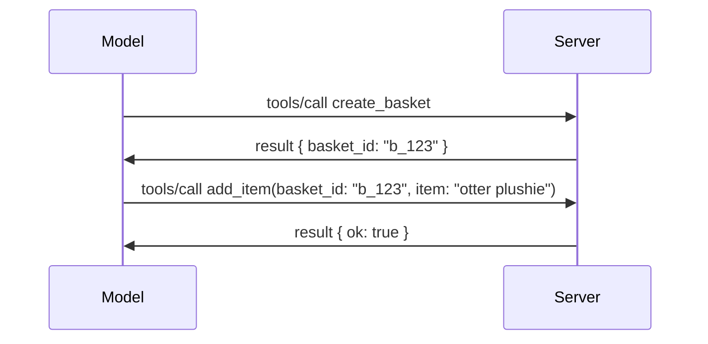

# MCP ထဲမှာ ဘာတွေပြောင်းလဲနေသလဲ: 2026-07-28 Release Candidate

> **အခြေအနေ:** Release Candidate။ `2026-07-28` သတ်မှတ်ချက်သည် ရေးသားချိန်တွင် အဆုံးသတ် မဖြစ်သေးပါ။ ၂၀၂၆ ခုနှစ် မေ ၂၁ ရက်နေ့တွင် ကြေညာခဲ့ပြီး၊ ၂၀၂၆ ခုနှစ် ဇူလိုင် ၂၈ ရက်နေ့တွင် ထုတ်လုပ်ရန် စီစဉ်ထားသည်။ ဤသင်ခန်းစာထဲရှိ အရာအားလုံးသည် release candidate ကိုဖော်ပြထားသည်။ build ပြုလုပ်ရန်မတိုင်မီ မကြာသေးမီအချိန်အခြေအနေများအတွက် [draft specification](https://modelcontextprotocol.io/specification/draft) နှင့် ၎င်း၏ [changelog](https://modelcontextprotocol.io/specification/draft/changelog) ကို စစ်ဆေးပါ။ သင်ယူမှုအခြားအစိတ်အပိုင်းများအားလုံးကို လက်ရှိတည်ငြိမ်သောအထွက်ဖြစ်သော **MCP Specification 2025-11-25** ပေါ်တွင်ရေးသားထားပြီး၊ `2026-07-28` ထွက်ရှိလာသည်နှင့်အမျှ ဖြည့်စွက်တိုးပြောင်းချက်များ ရေးသားသွားမည်ဖြစ်သည်။

## အနှစ်ချုပ်

`2026-07-28` သည် MCP စတင်ထုတ်လုပ်ခြင်းမှ စ၍ အကြီးမားဆုံး ပြင်ဆင်မှုဖြစ်သည်။ Specification Enhancement Proposals (SEPs) ခြောက်ခုက protocol အလွှာတွင် sessions များကို ဖယ်ရှားပြီး transport လွှာတွင် MCP ကို stateless ဖြစ်စေသည်၊ extensions များကို ပထမတန်းစား versioned စနစ်အဖြစ် ပြောင်းလဲသည်။ ဒီသင်ခန်းစာတွင်၎င်းပြောင်းလဲမှုများ၊ အကြောင်းအရင်းများနှင့် `2025-11-25` ကိုအခြေခံ၍ သင့်ရဲ့ ရေးသားထားသောကုဒ်ဖြင့် ဘာဖြစ်မယ်ဆိုတာ အကျဉ်းချုပ်ထားသည်။

အရင်းအမြစ်: [The 2026-07-28 MCP Specification Release Candidate](https://blog.modelcontextprotocol.io/posts/2026-07-28-release-candidate/) (Model Context Protocol Blog, David Soria Parra နှင့် Den Delimarsky)။

## သင်ယူရမည့် ရည်မှန်းချက်များ

ဤသင်ခန်းစာ အဆုံးသတ်သောအခါတွင် သင်သည် အောက်ပါအရာများကို ပြောပြနိုင်ပါမည်။

- MCP ကို stateless protocol core သို့ရွှေ့ခြင်းအကြောင်းနှင့် horizontal scale ပြုလုပ်ထားသော deployments တွင် မည်သို့ပြဿနာဖြေရှင်းနည်းဖြင့် အသိပညာပေးပါ။
- `initialize`/`initialized` handshake နှင့် `Mcp-Session-Id` header များပြောင်းလဲသည့်နည်းလမ်းကို ဖေါ်ပြပါ။
- အသစ်ထွက်သော `Mcp-Method` နှင့် `Mcp-Name` headers များ၊ `ttlMs`/`cacheScope` caching metadata များကို သတ်မှတ်ပါ။
- Extensions framework နှင့် ဤထုတ်လွှင့်ချက်တွင်ပါသော Extensions နှစ်ခုဖြစ်သော MCP Apps နှင့် Tasks ကို လက်မှတ်ရယူပါ။
- OAuth 2.0 / OIDC ကို ကျဉ်းလောင်းပုံစံဖြင့် harden လုပ်သော authorization SEPs ခြောက်ခုစာရင်းပြပါ။
- မည်သည် core လက္ခဏာများ (Roots, Sampling, Logging) သည် ဇာတိထားခဲ့ပြီးဖြစ်ပြီး၊ ၎င်း၏ဆောင်ရွက်ချက်နှင့်တကွဘာဆိုတာဖော်ပြပါ။
- Tool `inputSchema`/`outputSchema` အတွက် Full JSON Schema 2020-12 ပြောင်းလဲမှုကို ရှင်းလင်းပြပါ။

## Stateless Protocol

အဓိကပြောင်းလဲမှု: MCP သည် protocol လွှာတွင် stateless ဖြစ်လာသည်။

### မပြီးခင် (2025-11-25): Sessions သည် တစ်ဦးတည်းသော server instance မှ ပြောကြားသည်

Streamable HTTP ဖြင့် tool ကို ခေါ်ဆိုသောအခါ `initialize` handshake ဖြင့် စတင်သည်။ Server သည် နောက်ထပ် request များစွာ Carry ရမည့် `Mcp-Session-Id` header ဖြင့် ပြန်လည်ကြားသည်။

```http
POST /mcp HTTP/1.1
Mcp-Session-Id: 1868a90c-3a3f-4f5b
Content-Type: application/json

{"jsonrpc":"2.0","id":2,"method":"tools/call",
 "params":{"name":"search","arguments":{"q":"otters"}}}
```

Session သည် မည်သည့် server instance မှ ထုတ်ပေးသည်ကို ချိတ်ဆက်ထားသောကြောင့်၊ horizontal scale ဒါမဟုတ်သော deployment များမှာ **sticky routing** (load balancer တွင်) နှင့် **shared session store** (instance တွေကြား) လိုအပ်သည်။

### ပြီးပါပြီ (2026-07-28): request ငါးခုလုံးသည် မိမိကိုယ်တိုင်လုံလောက်သည်

```http
POST /mcp HTTP/1.1
MCP-Protocol-Version: 2026-07-28
Mcp-Method: tools/call
Mcp-Name: search
Content-Type: application/json

{"jsonrpc":"2.0","id":1,"method":"tools/call",
 "params":{"name":"search","arguments":{"q":"otters"},
           "_meta":{"io.modelcontextprotocol/clientInfo":{"name":"my-app","version":"1.0"}}}}
```

မည်သည့် server instance မဆို request ကို ပြန်လည်လုပ်ဆောင်နိုင်သည်။ အဓိကပြောင်းလဲချက်များမှာ -

- **`initialize`/`initialized` handshake များဖယ်ရှားပြီး** ([SEP-2575](https://github.com/modelcontextprotocol/modelcontextprotocol/pull/2575)) protocol version, client info, client capabilities များကို request တစ်ခုချင်းစီတွင် `_meta` ထဲသို့ ရွှေ့ထားသည်။ အသစ်ဖြစ်သည့် `server/discover` method သည် client သည် server capabilities များကို ရယူနိုင်စေသည်။
- **`Mcp-Session-Id` header နှင့် protocol-level session များ ဖယ်ရှားထားသည်** ([SEP-2567](https://github.com/modelcontextprotocol/modelcontextprotocol/pull/2567)) sticky routing နှင့် shared session store များ protocol လွှာတွင် မလိုအပ်တော့ပါ။

### Stateless protocol, stateful applications

Protocol-level session ကို ဖယ်ရှားခြင်းသည် သင့် server သည် stateful မဖြစ်နိုင်လို့ မဟုတ်ပါ။ HTTP APIs တွင် အမြဲအသုံးပြုသော နားလည်မှု pattern မျိုး - လက်ခံထားသော handle တစ်ခု ( `basket_id`, `browser_id`) ကို tool call မှ ရယူပြီး နောက်ဆုံးခေါ်ဆိုမှုတွင် မော်ဒယ်သည် အဲဒီ handle ကို ရိုးရိုး argument အဖြစ်ပြန်ပေးပို့သည်။



၎င်းက state ကို transport metadata ထဲတွင် ပစ်မထားဘဲ မြင်ရတတ်၍ မော်ဒယ်ထံ ဆင်ခြင်နိုင်ကျိုးပေးသည်၊ server instance မည်သည့်အခါမှမဆို call များကို လက်ခံနိုင်စေသည်။

### Server-to-client requests ပြန်လည်လုပ်ဆောင်မှု ပြင်ဆင်ထားသည်

Stateless protocol သည် server မှ client ကို request အတည်ပြုမှုတောင်းနိုင်ရန်(ဥပမာ elicitation prompt) နည်းလမ်းတစ်ခုလိုအပ်သည်။

- **Server-initiated requests များသည် server သည် client request ကို စီမံဆောင်ရွက်နေစဉ်သာ ထုတ်ပေးနိုင်သည်** ([SEP-2260](https://github.com/modelcontextprotocol/modelcontextprotocol/pull/2260)) — ယခင်တွင် အကြံပြုချက်သာဖြစ်ခဲ့ပြီး၊ ယခုမှာ အတင်းအကျပ်လိုအပ်သည်။ အသုံးပြုသူကို မတော်တဆမေးမြန်းခြင်း မရှိပေ။
- **Multi Round-Trip Requests** ([SEP-2322](https://github.com/modelcontextprotocol/modelcontextprotocol/pull/2322)) သည် SSE stream ကို ဖွင့်ထားခြင်း စနစ်ကို အစားထိုးသည်။ အစားတစ်ခုက server သည် `InputRequiredResult` ကို ပြန်ပေးသည်။

  ```json
  {
    "resultType": "inputRequired",
    "inputRequests": {
      "confirm": {
        "type": "elicitation",
        "message": "Delete 3 files?",
        "schema": { "type": "boolean" }
      }
    },
    "requestState": "eyJzdGVwIjoxLCJmaWxlcyI6WyJhIiwiYiIsImMiXX0="
  }
  ```

client သည် အဖြေများ ကို စုဆောင်းပြီး `inputResponses` နှင့် `requestState` ကို စုံစမ်း၍ ပြန်ခေါ်ဆိုသည်။ ဤ data မှာ server instance မည်သည့်နေနိုင်သည်။

### Routable, cacheable, traceable

အသေးစား ပြင်ဆင်မှု  သုံးချက်က stateless traffic ပိုမိုထိန်းချုပ်ရအောင် ကူညီသည်။

- **Streamable HTTP တွင် `Mcp-Method` နှင့် `Mcp-Name` headers များ လိုအပ်သည်** ([SEP-2243](https://github.com/modelcontextprotocol/modelcontextprotocol/pull/2243))၊ load balancers, gateways, rate limiters များသည် operation အပေါ်မူတည်၍ JSON body ကို မစစ်ပါ။ header နှင့် body မကိုက်ညီသော request များ server မှ ပိတ်ပင်သည်။
- **`tools/list` နှင့် resource read ရလဒ်များတွင် `ttlMs` နှင့် `cacheScope` ပါရှိသည်** ([SEP-2549](https://github.com/modelcontextprotocol/modelcontextprotocol/pull/2549))၊ HTTP `Cache-Control` ကို ထောက်ပြသည်။ clients များသည် list result ၏ သစ်လွင်မှု သက်တမ်းနှင့် မည်သူများနှင့် မဟုတ်မရှုံး မျှဝေခြင်း လုံခြုံမှုကို သိရှိနိုင်သည်၊ SSE stream ရှိရန် မလိုအပ်တော့ပါ။
- **`_meta` တွင် W3C Trace Context ပြန်လည်ပွားဖော်ပြမှုရှိသည်** ([SEP-414](https://github.com/modelcontextprotocol/modelcontextprotocol/pull/414))၊ `traceparent`, `tracestate`, နှင့် `baggage` များ၏ key name များပြင်ဆင်ပြီး၊ distributed trace တစ်ခုသည် client SDK, MCP server နှင့် downstream system များ (OpenTelemetry နည်းလမ်းနှင့်) အတွင်း ညှိနှိုင်း လိုက်နာနိုင်သည်။

## Extensions များ ပထမတန်းစား ဖြစ်လာသည်

Extensions များသည် `2025-11-25` တွင် တရားဝင်မဟုတ်ဘဲ ရှိခဲ့သည်။ [SEP-2133](https://github.com/modelcontextprotocol/modelcontextprotocol/pull/2133) က တရားဝင်စနစ် ပြုလုပ်သည်။

- Extensions များသည် reverse-DNS ID များဖြင့် သတ်မှတ်သည်။
- Client နှင့် server capabilities တွင် ရှိသော `extensions` မြေပုံမှ စကားဝိုင်းဖြင့်ညှိနှိုင်းသည်။
- ၎င်းတို့သည် ကိုယ်ပိုင် `ext-*` repository များတွင် တည်ရှိပြီး maintainers လည်း delegated ဖြစ်ကြ၊ core specification နှင့် version မတူညီစွာ တည်ပေါ်ပါသည်။
- SEP လမ်းကြောင်း Extensions Track အသစ်က experimental မှ official သို့ ရောက်နိုင်သော လမ်းကြောင်းပေးသည်။

ဤထုတ်လွှင့်ချက်တွင် တရားဝင် Extensions နှစ်ခုပါဝင်သည်။

### MCP Apps: server-rendered user interfaces

[MCP Apps](https://blog.modelcontextprotocol.io/posts/2026-01-26-mcp-apps/) ([SEP-1865](https://github.com/modelcontextprotocol/modelcontextprotocol/pull/1865)) သည် server များမှ interactive HTML interface များကို sandboxed iframe အတွင်း အိမ်ဆောင်များတွင် ပြသနိုင်စေသည်။ Tools များသည် UI template များကို အစောပိုင်းကြေညာ၍ hosts များသည် အနာဂတ်ငွေ့မှု၊ cache ပြုလုပ်ခြင်းနှင့် လုံခြုံရေး သုံးသပ်မှုများ ပြုနိုင်ရန် ခွင့်ပြုသည်။ သင်သည် [Lesson 15: MCP Apps](../03-GettingStarted/15-mcp-apps/README.md) တွင် အခြေခံအချက်များကို ရှာဖွေပြီးသားဖြစ်သည်။ Extensions framework မှာ MCP Apps သည် အခုတစ်ခါ တရားဝင် extension ဖြစ်လာပြီး အတွေ့အကြုံ core လက္ခဏာ မဟုတ်တော့ပါ။

### Tasks သည် extension အဖြစ် ဂရပ်ရွက်ထွက်ရှိသည်

Tasks ကို `2025-11-25` တွင် experimental core feature အဖြစ် ထုတ်ပေးခဲ့သည်။ ထုတ်လုပ်မှုအသုံးပြုမှုတွင် ပြင်ဆင်ရန်အနည်းအကျဉ်းများ ဖြစ်ပေါ်ခဲ့သောကြောင့် တားမြစ်ရာ extension ဖြစ်လာသည်။ [Tasks extension](https://github.com/modelcontextprotocol/modelcontextprotocol/pull/2663) သည် stateless model ကိုပတ်သက်ပြီး lifecycle ကို ပြန်လည်တည်ဆောက်သည်။ Server သည် `tools/call` ဖြင့် task handle ကို ထုတ်ပေးသွားပြီး client သည် `tasks/get`, `tasks/update`, `tasks/cancel` ဖြင့် ဆောင်ရွက်သည်။ Task ဖန်တီးခြင်းသည် server နယ်မြေမှ ဖြစ်သည်။ Client သည် extension ကို ကြေညာပြီး server သည် call တစ်ခု task အဖြစ် လည်ပတ်သင့်စဉ်ဆုံးဖြတ်သည်။ `tasks/list` သည် sessions မလိုအပ်သည့် scope မရှိသောကြောင့် အကုန်ဖယ်ရှားထားသည်။

> **ပြောင်းရွှေ့မှု မှတ်ချက်:** experimental `2025-11-25` Tasks API ကို အသုံးပြုခဲ့သူများသည် extension lifecycle အသစ်သို့ ပြောင်းရွှေ့ရမည် — ပြန်လည်လိုက်နာမှု မရှိပါ။

## authorization Hardening

SEPs ခြောက်ခုက [authorization specification](https://modelcontextprotocol.io/specification/draft/basic/authorization) ကို OAuth 2.0 / OpenID Connect နှင့် စည်းရုံးခြင်း ပို၍ မျှော်လင့်ချက်သင့်အောင်လုပ်ကြောင်း။

| SEP | ပြောင်းလဲမှု |
|---|---|
| [SEP-2468](https://github.com/modelcontextprotocol/modelcontextprotocol/pull/2468) | Clients များသည် authorization response များတွင် `iss` parameter ကို [RFC 9207](https://www.rfc-editor.org/rfc/rfc9207) အတိုင်း သတ်မှတ်စစ်ဆေးရမည်၊ MCP ၏ single-client, many-server pattern တွင်ဖြစ်ရပ်လေးပေါင်းအားဖြင့်ဖြစ်သော mix-up attacks များကို ရှောင်ရှားနိုင်သည်။ နောင်ဗားရှင်းတွင် `iss` လက်မခံသော response များကို ပိတ်ပင်မည်။ |
| [SEP-837](https://github.com/modelcontextprotocol/modelcontextprotocol/pull/837) | Clients များသည် Dynamic Client Registration အတွင်း OpenID Connect `application_type` ကို ဖော်ပြရမည်၊ authorization servers များ desktop/CLI client ကို "web" အဖြစ်မြင်ရန် နှင့် localhost redirect URI ပိတ်ဆို့ခြင်း ကာကွယ်ရန်။ |
| [SEP-2352](https://github.com/modelcontextprotocol/modelcontextprotocol/pull/2352) | Clients များသည် authorized server `issuer` နှင့် နှိုင်းယှဉ်ပြီး အရင်းအမြစ် servers မပြောင်းလဲပါက Re-register ပြုလုပ်ရမည်။ |
| [SEP-2207](https://github.com/modelcontextprotocol/modelcontextprotocol/pull/2207) | OpenID Connect-style authorization servers မှ Refresh tokens မည်သို့တောင်းယူရမည်ကိုစာတမ်းတင်သည်။ |
| [SEP-2350](https://github.com/modelcontextprotocol/modelcontextprotocol/pull/2350) | Step-up authorization အတွင်း scope ညွှန်ပြမှုပိုမိုရှင်းလင်းသည်။ |
| [SEP-2351](https://github.com/modelcontextprotocol/modelcontextprotocol/pull/2351) | `.well-known` discovery suffix ကိုရှင်းလင်းပြီသည်။ |

MCP အတွက် authorization server တည်ဆောက်ပါက ယခုအခါ `iss` parameter ကို authorization response များတွင် ထည့်သွင်းပေးရန်စတင်ပါ။ လတ်တလော authorization လမ်းညွန်ချက်များအတွက် [02-Security](../02-Security/README.md) ကို ကြည့်ပါ။

## Roots, Sampling, နှင့် Logging ကို Deprecated လုပ်ထားသည်

အသစ်သော [feature lifecycle policy](https://github.com/modelcontextprotocol/modelcontextprotocol/pull/2577) ([SEP-2577](https://github.com/modelcontextprotocol/modelcontextprotocol/pull/2577)) အရ၊ သင် [Core Concepts](./README.md#roots) မှ သင်ယူခဲ့သော client primitives သုံးခုသည် **Deprecated** အဆင့်သို့ ရောက်ရှိသည်။

| လက္ခဏာ | အကြံပြုအစားထိုး |
|---|---|
| Roots | Tool parameters, resource URIs, သို့မဟုတ် server configuration |
| Sampling | LLM provider APIs နှင့်တိုက်ရိုက် ပေါင်းသင်းမှု |
| Logging | `stderr` for stdio transports; OpenTelemetry for structured observability |

ဤသည် **annotation-only deprecations** များ ဖြစ်သည်။ method, type များနှင့် capability flags များသည် ဤထုတ်လွှင့်မှုတွင် နှစ်ပတ်လည်အတွင်း ထွက်ရှိသည့် specification version အားလုံးတွင် လည်ပတ်နေမည်။ ၎င်းတို့အား တစ်ခါတည်း ဖယ်ရှားရန် feature lifecycle policy အောက်တွင် SEP အသစ်တစ်ခုလိုအပ်မည်။ ၎င်းကြောင့် သင့်ရဲ့ မျှော်မှန်းထားသော [Sampling](../03-GettingStarted/14-sampling/README.md) နမူနာများသည် ယခုတောင် တောင်မှ ပျက်စီးမည်မဟုတ်ခြင်း၊ သို့သော် server အသစ်များသည် အစားထိုးနည်းလမ်းကို အသုံးချသင့်သည်။

## Tools အတွက် Full JSON Schema 2020-12

Tool `inputSchema` နှင့် `outputSchema` ကို Full [JSON Schema 2020-12](https://json-schema.org/draft/2020-12) ([SEP-2106](https://github.com/modelcontextprotocol/modelcontextprotocol/pull/2106)) သို့ တိုးမြှင့်သွားသည်။

- Input schemas တွင် `type: "object"` အခြေခံကို ထိန်းသိမ်းထားပြီး ပေါင်းစပ်မှု (`oneOf`, `anyOf`, `allOf`), conditional များနှင့် reference (`$ref`, `$defs`) များ ထည့်သွင်းခြင်းခွင့်ပြုသည်။
- Output schemas တွင် ကန့်သတ်ချက်မရှိတော့၊ `structuredContent` သည် object မဖြစ်ဘဲ JSON value မည်သို့မျှဖြစ်နိုင်သည်။
- Implementation များသည် external `$ref` URI များကို ထောက်ပြောင်ခြင်း မပြုလုပ်ရ၊ schema အနက်နက်နှင့် ညွှန်ကြားချိန်ကို ကန့်သတ်ရမည် ဖြစ်သည် (server-side schema validate လုပ်စဉ် denial-of-service တားဆီးမှုကာကွယ်မှုဖြစ်သည်)။

ထိုအပြင်၊ resource မရှိသောအခါ error code သည် MCP-custom `-32002` မှ JSON-RPC မြိုင် `-32602` (Invalid Params) သို့ ပြောင်းလဲသည် ([SEP-2164](https://github.com/modelcontextprotocol/modelcontextprotocol/pull/2164))။ Client သည် literal `-32002` ကိုသတ္တိပြုပါက update လုပ်ရန် လိုအပ်ပါမည်။

## Protocol အနေနဲ့ ဒီနောက် ဘယ်လို တိုးတက်မလဲ

ဤထုတ်လွှင့်မှုတွင် breaking changes များပါဝင်ပြီး MCP ဖြင့်သာ မျှော်လင့်ချက်မဟုတ်ဘဲတောင် ဖြစ်နိုင်ပါသည်။ သုံးခုသော governance SEPs သည် ထပ်ဖြစ်ခြင်းကို တားဆီးရန် ရည်ရွယ်သည်။

- **feature lifecycle policy** သည် feature တစ်ခုစီအတွက် Active → Deprecated → Removed အဆင့်ဖြင့် နှစ်တစ်နှစ်အတွင်း deprecated နှင့် ပထမဆုံးဖြတ်နိုင်သည့်အဆင့်ကြား အနည်းဆုံး ၁၂ လ ကြာမြင့်ချိန်ပေးသည်။
- **Extensions framework** သည် capability များကို opt-in extension အဖြစ် ထုတ်ပြန်ပြီး stable ဖြစ်ကြမှ core specification သို့ (မဖြစ်လျှင်) ရောက်အောင်လုပ်သည်။

- A Standards Track SEP can no longer reach Final status until a matching scenario lands in the [conformance suite](https://github.com/modelcontextprotocol/conformance) ([SEP-2484](https://github.com/modelcontextprotocol/modelcontextprotocol/pull/2484)) — the same suite the [SDK tier system](https://github.com/modelcontextprotocol/modelcontextprotocol/pull/1777) scores official SDKs against.

## ထုတ်ပြန်ချိန်ဇယားနှင့် အတည်ပြုမှု

- ထုတ်ပြန်ရန်လျှောက်လွှာကို ၂၀၂၆ ခုနှစ်၊ မေလ ၂၁ ရက်တွင် ပိတ်သိမ်းခဲ့သည်။
- နောက်ဆုံးအသေးစိတ်ဖော်ပြချက်ကို ၂၀၂၆ ခုနှစ်၊ ဇူလိုင် ၂၈ ရက်တွင် လုပ်ဆောင်ရန် သတ်မှတ်ထားသည်။
- နှစ်ပတ်အတွင်းရှိ အချိန်ကာလက SDK ထိန်းသိမ်းသူများနှင့် ဖောက်သည်ဆော့ဖ်ဝဲဖန်တီးသူများအား ပြောင်းလဲမှုများကို အမှန်တကယ် အသုံးပြုဆောင်ရွက်မှုများနှင့် အတည်ပြုရန်ခွင့်ပြုသည်။ အဆင့် ၁ SDK များကို [SDK tier system](https://modelcontextprotocol.io/docs/sdk) အောက်တွင် ထောက်ပံ့မှုပေးရန် မျှော်လင့်ထားသည်။
- ပြုပြင်ပြောင်းလဲမှုများ၏ စုစုပေါင်းကို [draft specification](https://modelcontextprotocol.io/specification/draft) နှင့် ၎င်း၏ [changelog](https://modelcontextprotocol.io/specification/draft/changelog) တွင် တင်ပြထားသည်။

## ဤ သင်ရိုးမှာ ဆိုလိုတာက

သင့်အား ဤသင်တန်းတွင် ယခုအထိ သင့်တော်ပြီးသား သင်ရိုးသည် **2025-11-25** ကို ရည်ညွှန်းသည်၊ ၎င်းသည်  `2026-07-28` ထွက်ရှိသည်အထိ လက်ရှိတည်ငြိမ်သော အသေးစိတ်ဖော်ပြချက် ဖြစ်သည်။ ထူးခြားစွာ:

- **ကစိန်းများနှင့် `initialize` လက်ခံမှု** ([Core Concepts](./README.md) နှင့် [Lesson 6: HTTP Streaming](../03-GettingStarted/06-http-streaming/README.md) တွင်ဖော်ပြထားသည်) သည် ယနေ့တွင် သိရှိထားသလို ဆက်လက်လုပ်ဆောင်နိုင်သော်လည်း `2026-07-28` နှင့် ကိုက်ညီသော SDK များသို့ အဆင့်မြှင့်တင်သွားသောအခါ မူဝါဒတစ်လုံးအနေဖြင့် ပြောင်းလဲသွားမည်ဖြစ်သည်။
- **Sampling နှင့် Roots** ([Core Concepts](./README.md) တွင်လည်း ဖြည့်စွက်ဖော်ပြထားသည်) သည် လုံးဝ အလုပ်လုပ်နိုင်သော်လည်း အတင်းအကျပ် ရပ်တန့်ခြင်းခံထားရပြီး — အစားထိုးနည်းပေါင်းများကို အထက်ဖော်ပြလိုက်သော ပုံစံများနှင့် မြှင့်တင်ရန် သင့်တော်သည်။
- **စမ်းသပ်မှု Tasks လက္ခဏာ** ကိုအသုံးပြုခဲ့ပါက အဲဒီကို Tasks extension ၏ အသစ်သော ဘဝကြာမြင့်ချိန်သို့ ပြောင်းရွှေ့ရန်လိုအပ်သည်။
- **MCP Apps** ([Lesson 15](../03-GettingStarted/15-mcp-apps/README.md)) သည် လက်တွေ့လုပ်ဆောင်ချက်တွင် ထိခိုက်မှုမရှိဘဲ; ၎င်းသည် ဖွဲ့စည်းပုံ Extensions အောက်သို့ ရွှေ့ထားသွားသည်။

## ထပ်ဆောင်းအရင်းအမြစ်များ

- [The 2026-07-28 MCP Specification Release Candidate (blog post)](https://blog.modelcontextprotocol.io/posts/2026-07-28-release-candidate/)
- [The Future of MCP Transports](https://blog.modelcontextprotocol.io/posts/2025-12-19-mcp-transport-future/)
- [MCP Draft Specification](https://modelcontextprotocol.io/specification/draft)
- [MCP Draft Changelog](https://modelcontextprotocol.io/specification/draft/changelog)
- [SEP Guidelines](https://modelcontextprotocol.io/community/sep-guidelines)
- [MCP SDK Tier System](https://modelcontextprotocol.io/docs/sdk)

## နောက်တစ်ဆင့်များ

သွားပါ [Core Concepts](./README.md) ဆီသို့ ဒါမှမဟုတ် ဆက်လက်လေ့လာရန် [Security](../02-Security/README.md) ထံသို့ သွားပြီး ယနေ့ `2025-11-25` ညွှန်ကြားချက်များမှာ မကြာမီ လာမည့် အရာများနှင့် မည်သို့ ကိုက်ညီနေကြောင်း ကြည့်ရှုနိုင်ပါသည်။

---

<!-- CO-OP TRANSLATOR DISCLAIMER START -->
**ပြောကြားချက်**
ဤစာတမ်းကို AI ဘာသာပြန်ဝန်ဆောင်မှု [Co-op Translator](https://github.com/Azure/co-op-translator) အသုံးပြု၍ ဘာသာပြန်ထားပါသည်။ ကျွန်ုပ်တို့သည် တိကျမှန်ကန်မှုအတွက် ကြိုးပမ်းနေသော်လည်း၊ စက်ကိရိယာဘာသာပြန်ခြင်းများတွင် အမှားများ သို့မဟုတ် မှားယွင်းချက်များ ပါဝင်နိုင်ကြောင်း သတိပြုပါရန် လိုအပ်ပါသည်။ မူလစာတမ်းကို မူရင်းဘာသာဖြင့်သာ ယုံကြည်စိတ်ချရသော အချက်အလက်အဖြစ် သတ်မှတ်သင့်သည်။ အရေးကြီးသည့် သတင်းအချက်အလက်များအတွက် ပရော်ဖက်ရှင်နယ် လူသားဘာသာပြန်သူဝန်ဆောင်မှုကို အကြံပြုပါသည်။ ဤဘာသာပြန်ချက်ကို အသုံးပြုခြင်းမှ ဖြစ်ပေါ်လာသော နားလည်မှုကွာခြားမှုများ သို့မဟုတ် မမှန်ကန်သော အသုံးပြုမှုများအတွက် ကျွန်ုပ်တို့ တာဝန်မခံပါ။
<!-- CO-OP TRANSLATOR DISCLAIMER END -->