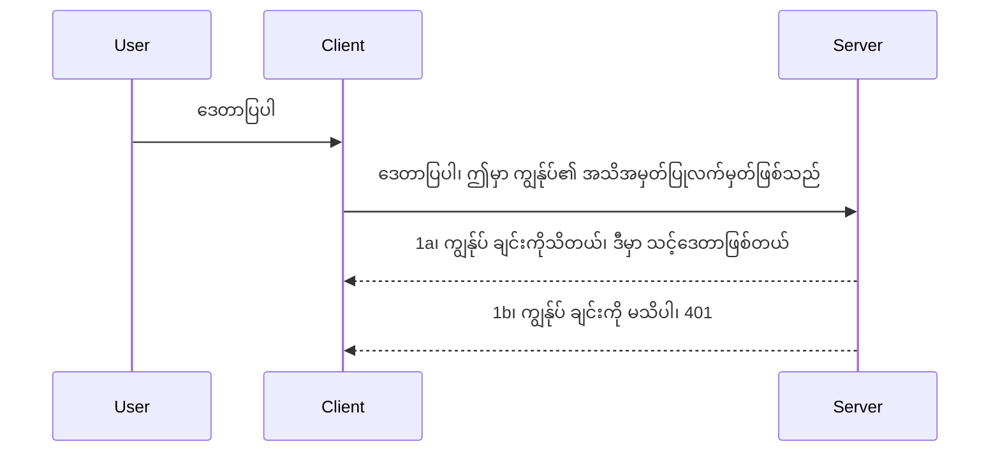

# ရိုးရှင်းသော အထောက်အထား

MCP SDK များသည် OAuth 2.1 ကို အသုံးပြုနိုင်စေရန် ထောက်ပံ့ပေးသည်။ ဤကဲ့သို့သော OAuth သည် auth server, resource server, ကိုးဒ်ရယူခြင်း၊ bearer token အစားထိုးခြင်းများကဲ့သို့သော အတွေးအခေါ်များ ပါဝင်သည့် ရိုးရှင်းမဟုတ်သော ကိစ္စဖြစ်သည်။ သင်သည် OAuth အသုံးပြုဖူးခြင်းမရှိသေးလျှင်၊ အထောက်အထားအခြေခံ အဆင့်မှ စတင်၍ လုံခြုံမှု ပိုမိုကောင်းမွန်အောင် ဆောက်လုပ်သင့်သည်။ ဒီကဏ္ဍသည် သင့်အား ပိုမိုတိုးတက်သော အထောက်အထားဆိုင်ရာ နည်းပညာများသို့ ရောက်ရှိစေရန် ရည်ရွယ်သည်။

## အထောက်အထားဆိုတာ ဘာလဲ?

အထောက်အထားသည် authentication နှင့် authorization ၏ အတိုကောက်ဖြစ်သည်။ ၎င်း၏ အဓိပ္ပါယ်မှာ သင်တစ်ခုခုလုပ်ရန်လိုသည်မှာ -

- **Authentication** က စစ်ဆေးခြင်းဖြစ်သည်။ လူတစ်ဦးကို ဝင်ခွင့်ပေးရန် ကြားစစ်ဆေးခြင်းဖြစ်ပြီး၊ MCP Server feature များ ထိန်းချုပ်ထားသော resource server တွင် ဝင်ခွင့် ရှိ/မရှိ စစ်ဆေးခြင်းဖြစ်သည်။
- **Authorization** သည် အသုံးပြုသူ၏ တောင်းဆိုလိုသော အရင်းအမြစ်များအပေါ် ဝင်ခွင့် ရှိ/မရှိစစ်ဆေးခြင်းဖြစ်သည်။ ဥပမာအားဖြင့် အော်ဒါများ၊ ထုတ်ကုန်များအား ဖတ်ရန်ခွင့်ရှိသော်လည်း ဖျက်ရန်ခွင့်မရှိခြင်းစသော ကိစ္စ။

## ချွတ်ချက်များ (Credentials): စနစ်ကို ကျွန်ုပ်တို့ ဘယ်သူလဲ ဆိုတာ ဘယ်လို ပြောပြမလဲ

အများအားဖြင့် web developer များသည် ဟိုး username နှင့် password ၏ base64 encode ဖြစ်သော ကုဒ်အဖြစ် သို့မဟုတ် အသုံးပြုသူအား သီးသန့်သိရှိစေသော API key တစ်ခုအဖြစ် အထောက်အထား တစ်ခု ဖော်ပြပေးရန် စဉ်းစားကြသည်။

၎င်းကို ပုံမှန်အားဖြင့် "Authorization" ဟူသော header မှတဆင့် ပို့ဆောင်သည်။

```json
{ "Authorization": "secret123" }
```

ဤဖြစ်စဉ်ကို basic authentication ဟု တခေါ်ဆိုသည်။ စနစ်လည်ပတ်ပုံမှာ အောက်ပါအတိုင်း ဖြစ်သည်။



ယခု flow ကို နားလည်ပြီးနောက်၊ ထိုအတိုင်း မည်သို့ ဆောင်ရွက်မည်နည်း? web server များတွင် middleware အဆိုပါ အမှတ်တံဆိပ်တစ်ခုရှိပြီး၊ အဲဒီ middleware က လိုအပ်သော credential များအား စစ်ဆေးနိုင်ပြီး မှန်ကန်လျှင် request ကို ဆက်လက် ခွင့်ပြုသည်။ မမှန်ကန်လျှင် auth error ပေးသည်။ အမှတ်တရပါက အောက်ပါအတိုင်း ဆောင်ရွက်နိုင်သည်။

**Python**

```python
class AuthMiddleware(BaseHTTPMiddleware):
    async def dispatch(self, request, call_next):

        has_header = request.headers.get("Authorization")
        if not has_header:
            print("-> Missing Authorization header!")
            return Response(status_code=401, content="Unauthorized")

        if not valid_token(has_header):
            print("-> Invalid token!")
            return Response(status_code=403, content="Forbidden")

        print("Valid token, proceeding...")
       
        response = await call_next(request)
        # ပြန်လာသောတုံ့ပြန်ချက်တွင် မည်သည့်ဖောက်သည်ခေါင်းစီးများကိုမဆို ထည့်သွင်းရန် သို့မဟုတ် ပြောင်းလဲရန်
        return response


starlette_app.add_middleware(CustomHeaderMiddleware)
```

ဤမှာပါသည် -

- `AuthMiddleware` ဟု middleware တစ်ခု ဖန်တီးပြီး ၎င်း၏ `dispatch` method ကို web server က ခေါ်ဆောင်သည်။
- middleware ကို web server တွင် ထည့်သွင်းသည်။

    ```python
    starlette_app.add_middleware(AuthMiddleware)
    ```

- Authorization header ရှိမရှိနှင့် ပို့ပို့သော secret မှန်ကန်/မမှန်ကန် စစ်ဆေးသည့် logic ကိုရေးသားသည်

    ```python
    has_header = request.headers.get("Authorization")
    if not has_header:
        print("-> Missing Authorization header!")
        return Response(status_code=401, content="Unauthorized")

    if not valid_token(has_header):
        print("-> Invalid token!")
        return Response(status_code=403, content="Forbidden")
    ```

    secret ရှိပြီးမှန်ကန်လျှင် `call_next` ကို ခေါ်ပြီး request ကို ဆက်လက် ခွင့်ပြုကာ ပြန်လည်ဖြေရှင်းချက် Return ပြန်သည်။

    ```python
    response = await call_next(request)
    # ဖောက်သည်ထည့်သွင်းထားသောခေါင်းစဉ်များကိုထည့်လိုက်ပါ သို့မဟုတ် တုံ့ပြန်မှုတွင်တစ်စုံတစ်ရာပြောင်းလဲမှုအကြောင်းပြုပါ
    return response
    ```

web request တစ်ခုကို server သို့ တောင်းဆိုလာသောအခါ middleware ကိုခေါ်သောကြောင့် implementation အရ ခွင့်ပြုရန် သို့မဟုတ် error message ပေးပြီးဆက်လက်မလုပ်ခွင့်ပေးခြင်း ဖြစ်သည်။

**TypeScript**

Express framework အသုံးပြုပြီး middleware ဖန်တီး၍ MCP Server ကို မရောက်မီ request ကို အတားအဆီး ထားသည်။ အောက်ပါ code ဖြစ်သည်။

```typescript
function isValid(secret) {
    return secret === "secret123";
}

app.use((req, res, next) => {
    // 1. Authorization ခေါင်းစဉ်ရှိပါသလား။
    if(!req.headers["Authorization"]) {
        res.status(401).send('Unauthorized');
    }
    
    let token = req.headers["Authorization"];

    // 2. တရားဝင်မှုကိုစစ်ဆေးပါ။
    if(!isValid(token)) {
        res.status(403).send('Forbidden');
    }

   
    console.log('Middleware executed');
    // 3. အဆိုပြုချက်ကို အလျှောက်လိုက်သောအဆင့်မှ တစ်ဆင့်ကို ပေးပို့သည်။
    next();
});
```

အသေးစိတ်မှာ -

1. Authorization header ရှိ/မရှိ စစ်ဆေးခြင်း၊ မရှိခဲ့ရင် 401 error ပို့သည်။
2. credential/token မှန်ကန်မှု စစ်ဆေး၍ မမှန်လျှင် 403 error ပို့သည်။
3. တောင်းဆိုမှု pipeline ထဲသို့ ဆက်လက်သွားပြီး လိုအပ်သည့် resource ကို ပြန်ပေးသည်။

## လေ့ကျင့်မှု: Authentication ကို ကုဒ်ပြုလုပ်ခြင်း

ကျွန်ုပ်တို့ သင်ယူထားသော အကြောင်းအရာများကို အသုံးပြုပြီး ခန့်မှန်း အောက်ပါအစီအစဉ်အတိုင်း ဆောင်ရွက်ကြပါစို့။

Server

- web server နှင့် MCP instance တစ်ခုဖန်တီးပါ။
- server အတွက် middleware တစ်ခု တည်ဆောက်ပါ။

Client 

- header မှတစ်ဆင့် credential ဖြင့် web request ပေးပို့ပါ။

### -1- web server နှင့် MCP instance ဖန်တီးခြင်း

> **ရှေ့ဆက်ကြည့်ရန်:** အောက်တွင် TypeScript နမူနာတွင် HTTP transports များကို `mcp-session-id` ကို key အဖြစ် သတ်မှတ်ထားသော `transports` map မှာ စောင့်ကြည့်ထားသည်။ **MCP Specification 2025-11-25** အရ ဖြစ်သည်။ `2026-07-28` release candidate မှာ `initialize` handshake နှင့် session ID ကို လုံးဝ ဖယ်ရှားသွားပြီး stateless ပုံစံနှင့် အလိုအလျောက် contain လုပ်ထားသော request များအဖြစ် လည်ပတ်ပါမည်။ [MCP တွင် ဘာပြောင်းလဲနေသနည်း: 2026-07-28 Release Candidate](../../01-CoreConcepts/mcp-2026-07-28-release-candidate.md) ကို ကြည့်ပါ။

ပထမတစ်ဆင့်တွင် web server instance နှင့် MCP Server ကို ဖန်တီးရမည်။

**Python**

MCP server instance ဖန်တီး၍ starlette web app တစ်ခု ဖန်တီးကာ uvicorn ဖြင့် အားပေးထားသည်။

```python
# MCP ဆာဗာ ဖန်တီးနေသည်

app = FastMCP(
    name="MCP Resource Server",
    instructions="Resource Server that validates tokens via Authorization Server introspection",
    host=settings["host"],
    port=settings["port"],
    debug=True
)

# starlette web app ဖန်တီးနေသည်
starlette_app = app.streamable_http_app()

# uvicorn ဖြင့် app ကို ဆာဗ်လုပ်နေသည်
async def run(starlette_app):
    import uvicorn
    config = uvicorn.Config(
            starlette_app,
            host=app.settings.host,
            port=app.settings.port,
            log_level=app.settings.log_level.lower(),
        )
    server = uvicorn.Server(config)
    await server.serve()

run(starlette_app)
```

နမူနာ code တွင် -

- MCP Server တစ်ခု ဖန်တီးသည်။
- MCP Server မှ starlette web app တည်ဆောက်သည်`app.streamable_http_app()`။
- uvicorn ဖြင့် web app ကို host ပြုလုပ်သော `server.serve()`။

**TypeScript**

MCP Server instance တစ်ခု ဖန်တီးသည်။

```typescript
const server = new McpServer({
      name: "example-server",
      version: "1.0.0"
    });

    // ... ဆာဗာ အရင်းအမြစ်များ၊ ကိရိယာများနှင့် မှတ်ချက်များကို စီစဉ်ပါ ...
```

MCP Server ဖန်တီးခြင်းကို POST /mcp route ထဲတွင် တာ၀န်ပေးရန်လိုသဖြင့် အထက်က code ကို အောက်ပါအတိုင်း ပြောင်းရွှေ့လိုက်သည်။

```typescript
import express from "express";
import { randomUUID } from "node:crypto";
import { McpServer } from "@modelcontextprotocol/sdk/server/mcp.js";
import { StreamableHTTPServerTransport } from "@modelcontextprotocol/sdk/server/streamableHttp.js";
import { isInitializeRequest } from "@modelcontextprotocol/sdk/types.js"

const app = express();
app.use(express.json());

// အစည်းအဝေး ID အလိုက် သယ်ယူပို့ဆောင်မှုများကို သိမ်းဆည်းရန် မြေပုံ
const transports: { [sessionId: string]: StreamableHTTPServerTransport } = {};

// Client မှ Server ဆီသို့ ဆက်သွယ်ရန် POST တောင်းဆိုချက်များကို ကိုင်တွယ်ပါ
app.post('/mcp', async (req, res) => {
  // ရှိပြီးသား အစည်းအဝေး ID ကို စစ်ဆေးပါ
  const sessionId = req.headers['mcp-session-id'] as string | undefined;
  let transport: StreamableHTTPServerTransport;

  if (sessionId && transports[sessionId]) {
    // ရှိပြီးသား သယ်ယူပို့ဆောင်မှုကို ထပ်မံအသုံးပြုပါ
    transport = transports[sessionId];
  } else if (!sessionId && isInitializeRequest(req.body)) {
    // အသစ် စတင်တောင်းဆိုမှု
    transport = new StreamableHTTPServerTransport({
      sessionIdGenerator: () => randomUUID(),
      onsessioninitialized: (sessionId) => {
        // အစည်းအဝေး ID အလိုက် သယ်ယူပို့ဆောင်မှုကို သိမ်းဆည်းပါ
        transports[sessionId] = transport;
      },
      // DNS ပြန်လည်ချိတ်ဆက်ခြင်းအား ကာကွယ်မှုအား ရှေ့ပြေးသိမ်းဆည်းမှုအတွက် မျှသုံး ထားပါသည်။ သင်သည် ဒီ ဆာဗာကို
      // ဒေသခံတွင် ဆောင်ရွက်နေပါက အောက်ပါအတိုင်း သတ်မှတ်ပါ
      // enableDnsRebindingProtection: true,
      // allowedHosts: ['127.0.0.1'],
    });

    // ပိတ်လှောင်သည့်အခါ သယ်ယူပို့ဆောင်မှုကို သန့်ရှင်းစင်ကြယ်ပါ
    transport.onclose = () => {
      if (transport.sessionId) {
        delete transports[transport.sessionId];
      }
    };
    const server = new McpServer({
      name: "example-server",
      version: "1.0.0"
    });

    // ... ဆာဗာ ရင်းမြစ်များ၊ ကိရိယာများနှင့် အကြံပြုချက်များကို စီစဉ်ထားသည် ...

    // MCP ဆာဗာနှင့် ချိတ်ဆက်ပါ
    await server.connect(transport);
  } else {
    // မမှန်ကန်သော တောင်းဆိုချက်
    res.status(400).json({
      jsonrpc: '2.0',
      error: {
        code: -32000,
        message: 'Bad Request: No valid session ID provided',
      },
      id: null,
    });
    return;
  }

  // တောင်းဆိုချက်ကို ကိုင်တွယ်ပါ
  await transport.handleRequest(req, res, req.body);
});

// GET နှင့် DELETE တောင်းဆိုချက်များအတြက္ ထပ်မံအသုံးပြုနိုင်သည့် ကိုင်တွယ်မှု
const handleSessionRequest = async (req: express.Request, res: express.Response) => {
  const sessionId = req.headers['mcp-session-id'] as string | undefined;
  if (!sessionId || !transports[sessionId]) {
    res.status(400).send('Invalid or missing session ID');
    return;
  }
  
  const transport = transports[sessionId];
  await transport.handleRequest(req, res);
};

// Server မှ client သို့ သတင်းပေးပို့ခြင်းအတွက် GET တောင်းဆိုချက်များကို SSE ဖြင့် ကိုင်တွယ်ပါ
app.get('/mcp', handleSessionRequest);

// အစည်းအဝေး ပိတ်သိမ်းခြင်းအတွက် DELETE တောင်းဆိုချက်များ ကိုင်တွယ်ပါ
app.delete('/mcp', handleSessionRequest);

app.listen(3000);
```

ယခုမှာ MCP Server ဖန်တီးခြင်းသည် `app.post("/mcp")` အတွင်းတွင် ရှိနေသည်။

မနောက်တစ်ဆင့်ဖြစ်သော middleware ကို ဖန်တီး၍ ရောက်ရှိသော credential ကို စစ်ဆေးမည်။

### -2- server အတွက် middleware တည်ဆောက်ခြင်း

middleware များအား ဖန်တီးရာတွင် `Authorization` header တွင် credential ရှိ/မရှိ ဆန်းစစ်ပြီး မှန်ကန်လျှင် အသုံးပြုသူ၏ MCP တောင်းဆိုမှုအတိုင်း ဆက်လက်လုပ်ဆောင်ရန် ခွင့်ပြုသည်။

**Python**

middleware ဖန်တီးရန် `BaseHTTPMiddleware` မှ အတန်းတစ်ခု ဆင်းသက် ဖန်တီးရမည်။ အောက်ပါအချက် နှစ်ခုပါသည်။

- ရရှိသော request `request`  မှ header အချက်အလက်ကို ဖတ်ရှုရန်။
- client မှ လက်ခံရရှိသည့် credential ကို ပြန်လည်စစ်ဆေးရန် `call_next` callback ကို ခေါ်ရန်။

အရင်ဆုံး `Authorization` header မရှိပါက ပြုလုပ်စရာ။

```python
has_header = request.headers.get("Authorization")

# header မရှိပါ, 401 ဖြင့် မအောင်မြင်ပါ, အခြားwise ဆက်လက်ဆောင်ရွက်ပါ။
if not has_header:
    print("-> Missing Authorization header!")
    return Response(status_code=401, content="Unauthorized")
```

client သည် authentication မအောင်မြင်သောကြောင့် 401 unauthorized message ပေးပို့သည်။

credential တစ်ခု ရှိလျှင် ၎င်း၏ တရားဝင်မှုကို စစ်ဆေးရမည်။

```python
 if not valid_token(has_header):
    print("-> Invalid token!")
    return Response(status_code=403, content="Forbidden")
```

အထက်မှာ 403 forbidden message ပေးပို့သည်။ middleware တစ်ခုလုံးကို အောက်တွင် လိုက်နာညွှန်ပြပါသည်။

```python
class AuthMiddleware(BaseHTTPMiddleware):
    async def dispatch(self, request, call_next):

        has_header = request.headers.get("Authorization")
        if not has_header:
            print("-> Missing Authorization header!")
            return Response(status_code=401, content="Unauthorized")

        if not valid_token(has_header):
            print("-> Invalid token!")
            return Response(status_code=403, content="Forbidden")

        print("Valid token, proceeding...")
        print(f"-> Received {request.method} {request.url}")
        response = await call_next(request)
        response.headers['Custom'] = 'Example'
        return response

```

အရမ်းကောင်းပြီ၊ `valid_token` function ဆိုတာ ဘာလဲ? အောက်မှာပါ။

```python
# ထုတ်လုပ်မှုအတွက် မသုံးပါနဲ့ - တိုးတက်အောင် ပြုပြင်ပါ !!
def valid_token(token: str) -> bool:
    # "Bearer " prefix ကို ဖယ်ရှားပါ
    if token.startswith("Bearer "):
        token = token[7:]
        return token == "secret-token"
    return False
```

၎င်းကို ပိုမိုတိုးတက်အောင် ပြုလုပ်သင့်သည်။

လိုအပ်ချက်: ဒီလို secret များကို code ထဲတွင် ဘယ်တော့မှ မထည့်သင့်ပါ။ အကောင်းဆုံးဖြစ်ရန် data source သို့မဟုတ် IDP (identity service provider) မှ ရယူ၍ စစ်ဆေးသင့်သည်၊ သို့မဟုတ် IDP ကို ယုံကြည်ထောက်ခံရေး လုပ်ပါ။

**TypeScript**

Express ဖြင့် အကောင်အထည်ဖော်ရာတွင် `use` method ဖြင့် middleware functions များ ခေါ်ယူရမည်။

လုပ်ဆောင်ရမည့်အချက်များမှာ

- request ကို ထိတွေ့ဆက်ဆံ၍ Authorization ကို စစ်ဆေးရမည်။
- credential ကို မှန်ကန်/မမှန်ကန် စစ်ဆေးပြီးမှ request ကို ဆက်လက်ခွင့်ပြုရန်။

ဒီနေရာတွင် Authorization header က မရှိပါက request ကို ရပ်ထားသည်။

```typescript
if(!req.headers["authorization"]) {
    res.status(401).send('Unauthorized');
    return;
}
```

header မပါက 401 error ပေးပို့သည်။

credential မှန်/မမှန်စစ်ဆေးပြီး မမှန်လျှင် အားပြန်တစ်ပတ်တူးတယ်။ 

```typescript
if(!isValid(token)) {
    res.status(403).send('Forbidden');
    return;
} 
```

ယခုမှာ 403 error ကို မျှော်မှန်းပါ။

middleware တစ်ခုလုံးအတွက် code များမှာ -

```typescript
app.use((req, res, next) => {
    console.log('Request received:', req.method, req.url, req.headers);
    console.log('Headers:', req.headers["authorization"]);
    if(!req.headers["authorization"]) {
        res.status(401).send('Unauthorized');
        return;
    }
    
    let token = req.headers["authorization"];

    if(!isValid(token)) {
        res.status(403).send('Forbidden');
        return;
    }  

    console.log('Middleware executed');
    next();
});
```

middleware ဖြင့် client မှ ပေးပို့မည့် credential များကို စစ်ဆေးရေး Web server ကို ပြင်ဆင်ထားသည်။ Client ကို ဘယ်လိုလုပ်ကြမလဲ?

### -3- Header မှတဆင့် credential ပို့ခြင်း

client မှ credential ကို header တွင် ပေးပို့နေသည်ကို သေချာစေရန်လိုသည်။ MCP client အသုံးပြုပြီး ပြုလုပ်သည်မှာ ဘယ်လိုလဲကို သိရန်လိုသည်။

**Python**

client အတွက် header ဖြင့် credential ပေးပို့သည့်နည်း -

```python
# တန်ဖိုးကို တိုက်ရိုက်ရေးထည့်ခြင်း မပြုလုပ်ပါနဲ့၊ အနည်းဆုံး ပတ်ဝန်းကျင် အပြောင်းအလဲတစ်ခုတွင် သို့မဟုတ် ပိုမိုလုံခြုံသည့် သိမ်းဆည်းရာတွင် ထားပါ။
token = "secret-token"

async with streamablehttp_client(
        url = f"http://localhost:{port}/mcp",
        headers = {"Authorization": f"Bearer {token}"}
    ) as (
        read_stream,
        write_stream,
        session_callback,
    ):
        async with ClientSession(
            read_stream,
            write_stream
        ) as session:
            await session.initialize()
      
            # လုပ်ဆောင်ရန်ရှိသည်၊ client တွင် ဘာလုပ်ချင်သည်ကိုရေးပါ၊ ဥပမာ - tools များစာရင်းပြပါ၊ tools များခေါ်ပါ စသည်တို့။
```

`headers = {"Authorization": f"Bearer {token}"}` အတိုင်း headers ကို ပြုလုပ်ထားသည်ကို သတိထားပါ။

**TypeScript**

နှစ်ဆင့်ဖြင့် ပြုလုပ်နိုင်သည် -

1. credential ဖြင့် configuration object တစ်ခု ပြုလုပ်ပါ။
2. သတ်မှတ် configuration object ကို transport ထဲသို့ ပေးပို့ပါ။

```typescript

// ဒီမှာပြထားသလို တန်ဖိုးကို ခိုင်ခန့်ရေးမလုပ်ပါနဲ့။ အနည်းဆုံး env variable အဖြစ်ထားပြီး development mode မှာ dotenv တို့လို အသုံးပြုပါ။
let token = "secret123"

// client transport option object ကို သတ်မှတ်ပါ
let options: StreamableHTTPClientTransportOptions = {
  sessionId: sessionId,
  requestInit: {
    headers: {
      "Authorization": "secret123"
    }
  }
};

// options object ကို transport သို့ ပေးပို့ပါ
async function main() {
   const transport = new StreamableHTTPClientTransport(
      new URL(serverUrl),
      options
   );
```

မှတ်ချက်: အထက်က code တွင် `options` object အတွင်း `requestInit` property အောက်တွင် header များထားသည်ကို တွေ့ရသည်။

လုံခြုံမှု ပိုမိုတိုးတက်စေရန် ဘယ်လို ပြင်ဆင်ကြမလဲ? လက်ရှိ implementation တွင်ပြဿနာတစ်ချို့ ရှိသည်။ အကြောင်းအားဖြင့် credential ကို ဒီလို ပေးပို့ခြင်းမှာ HTTPS မမရှိခဲ့လျှင် အန္တရာယ်ရှိသည်။ ထို့နောက် credential ကို ခိုးယူခြင်း ဖြစ်နိုင်သည်။ ထို့ကြောင့် token ကို လွယ်ကူစွာ ပယ်ဖျက်နိုင်ပြီး နောက်ထပ် စစ်ဆေးမှုများဖြည့်စွက် ရမည်၊ မည်သည့်ဒေသမှ တောင်းဆိုမှုပြုလုပ်သည်၊ တောင်းဆိုမှုများ အဆမတူ မကြာခဏ ဖြစ်သည် (bot ဆန်သောလုပ်ဆောင်ချက်များ), အကျဉ်းချုပ်အားဖြင့် စိုးရိမ်ရသည့် အချက်များ များပြားသည်။

သို့သော် API များ ရိုးရှင်းပြီး authentication မလိုအပ်သောနေရာများတွင် ဒီနည်းလမ်းက စတင်ရန် ကောင်းသည်။

ထို့ကြောင့်လည်း၊ security ကို နည်းနည်းပိုမြင့်စေရန် JSON Web Token (JWT) ဖြင့်အသုံးပြုခြင်းကို စူးစမ်းကြည့်ကြရအောင်။

## JSON Web Token (JWT)

ရိုးရှင်းသော credential ပို့ခြင်းမှ ပြောင်းလဲတိုးတက်စေရန် ကြိုးစားနေသည်။ JWT ကို အသုံးပြုခြင်းဖြင့် ရရှိနိုင်သော အမြန်ဆုံးတိုးတက်မှုများမှာ -

- **လုံခြုံမှုတိုးတက်မှုများ**။ basic auth တွင် username နှင့် password ကို base64 သို့ encode လုပ်ပြီး မကြာခဏပို့သည်။ JWT တွင် username နှင့် password ကို တစ်ကြိမ်လက်ခံပြီး token ထုတ်ပေးသည်။ ထို့အပြင် သက်တမ်းကန့်သတ်ချက် ရှိသည်။ JWT က role, scope နှင့် permission များဖြင့် အသေးစိတ် access control ပေးနိုင်သည်။
- **stateless ဖြစ်ခြင်းနှင့် scalable ဖြစ်စေခြင်း**။ JWT ကို self-contained ဖြစ်သည်။ အသုံးပြုသူ အချက်အလက်များအားလုံး ထည့်သွင်းထားပြီး session storage ကို သိမ်းဆို့ရန် မလိုအပ်တော့ပါ။ token ကို ဒေသိယအဆင့်တွင် validate ပြုလုပ်နိုင်ပါသည်။
- **အဖွဲ့အစည်းချိတ်ဆက်မှုနှင့် federation**။ JWT သည် Open ID Connect ၏ အထူးအင်္ဂါရပ် ဖြစ်ပြီး Entra ID, Google Identity, Auth0 ကဲ့သို့သော တည်ရှိချက်ပံ့ပိုးသူများနှင့် အသုံးပြုသည်။ single sign on နှင့် အခြားလုပ်ဆောင်ချက်များကို လွယ်ကူစေသည်။
- **ကုမ္ပဏီအဆင့် modularity နှင့် အသုံးပြုမှုများ**။ Azure API Management, NGINX နှင့် အခြား API Gateway များတွင် အသုံးပြုနိုင်သည်။ authentication စနစ်များနှင့် server-to-service အပြောင်းအလဲ များမှာ ပြုလုပ်နိုင်သည်။
- **လျင်မြန်မှုနှင့် cache မှတ်သားမှု**။ JWT ကို decode ပြီးနောက် cache လုပ်နိုင်သည်ဖြင့် ထပ်မံ parse လုပ်သည့်လိုအပ်ချက် လျော့ပေါ့သည်။ အထူးသဖြင့် traffic ကြီးမားသော အက်ပလီကေးရှင်းများတွင် throughput တိုးတက်မှုတွင် အထောက်အကူဖြစ်သည်။
- **တိုးတက်သော လုပ်ဆောင်ချက်များ**။ introspection (server တွင် token မှန်မှုသိမ်းဆည်းခြင်း) နှင့် revocation (token မမှန်ကန်ကြောင်း သတ်မှတ်ခြင်း) ကို ထောက်ပံ့သည်။

ဤအားလုံးကို ဖြည့်စွက်၍ အောက်ပါနည်းလမ်းဖြင့် ကုဒ်ကို တိုးတက်အောင် ပြုလုပ်နိုင်မည်ကို ကြည့်ကြရအောင်။

## basic auth ကို JWT အဖြစ် ပြောင်းလဲထားခြင်း

အောက်ပါ အပြင်အဆင်များ လုပ်ရန်လိုသည် -

- **JWT token ဖန်တီးခြင်း**။ client မှ server သို့ ပို့ရန်သင့်လျော်သော JWT token ကို တည်ဆောက်ခြင်း။
- **JWT token ကို မှန်ကန်မှု စစ်ဆေးခြင်း**။ ဒါမှမဟုတ်မှ client ကို စနစ်တွင် မရှိသည်ဖြစ်လျှင် ဝင်ခွင့် မပြုပါ။
- **token ကို လုံခြုံစွာ သိမ်းဆည်းခြင်း**။
- **လမ်းကြောင်းများကို ကာကွယ်ခြင်း**။ MCP အင်္ဂါရပ်များနှင့် လမ်းကြောင်းများကို လုံခြုံစွာ ကာကွယ်ရန်။
- **refresh token များ ထည့်သွင်းခြင်း**။ ငယ်ရွယ်သက်တမ်းရှိ token များ ပြန်ပြင်နိုင်ရန် သက်တမ်းကြာ token များ ရှိစေရန်၊ refresh endpoint နှင့် rotation strategy ရှိရမည်။

### -1- JWT token တည်ဆောက်ခြင်း

JWT token တွင် အောက်ပါ အစိတ်အပိုင်းများ ရှိသည်။

- **header**, အသုံးပြုသည့် algorithm နှင့် token အမျိုးအစား။
- **payload**, claims များ၊ ဥပမာ sub (token မှ ကိုယ်စားပြုသည့်အသုံးပြုသူ/အရာ), exp (သက်တမ်းကုန်ဆုံးချိန်), role (တာဝန်) စသည်။
- **signature**, secret သို့မဟုတ် private key ဖြင့် လက်မှတ်ရေးထိုးထားခြင်း။

header, payload နှင့် encode လုပ်ရမည့် token ကို တည်ဆောက်ရန် လိုအပ်သည်။

**Python**

```python

import jwt
import jwt
from jwt.exceptions import ExpiredSignatureError, InvalidTokenError
import datetime

# JWT ကိုလက်မှတ်ခြယ်ရန် အသုံးပြုသော လျှို့ဝှက်သောသော့
secret_key = 'your-secret-key'

header = {
    "alg": "HS256",
    "typ": "JWT"
}

# အသုံးပြုသူအချက်အလက်များ၊ ၎င်း၏ ဆိုင်ရာအချက်အလက်များနှင့် သက်တမ်းကုန်ဆုံးချိန်
payload = {
    "sub": "1234567890",               # အကြောင်းအရာ (အသုံးပြုသူအမှတ်စဉ်)
    "name": "User Userson",                # စိတ်ကြိုက်လိုအပ်ချက်
    "admin": True,                     # စိတ်ကြိုက်လိုအပ်ချက်
    "iat": datetime.datetime.utcnow(),# ထုတ်ပေးချိန်
    "exp": datetime.datetime.utcnow() + datetime.timedelta(hours=1)  # သက်တမ်းကုန်ဆုံးချိန်
}

# အင်ကုဒ်လုပ်ပါ
encoded_jwt = jwt.encode(payload, secret_key, algorithm="HS256", headers=header)
```

အထက်တွင် -

- algorithm ကို HS256 ဖြင့် သတ်မှတ်ပြီး type ကို JWT ဟု သတ်မှတ်ထားသည်။
- payload တွင် subject (user id), username, role, create time နှင့် သက်တမ်းကုန်ချိန် ပါဝင်ပြီး အချိန်ကန့်သတ်မှုကို အကောင်အထည်ဖော်ထားသည်။

**TypeScript**

JWT token ဖန်တီးကူညီပေးမည့် dependency များ လိုအပ်သည်။

Dependencies

```sh

npm install jsonwebtoken
npm install --save-dev @types/jsonwebtoken
```

အထက်ပါအတိုင်း၊ header, payload တည်ဆောက်၍ encode token အဖြစ် ဖန်တီးသည်။

```typescript
import jwt from 'jsonwebtoken';

const secretKey = 'your-secret-key'; // ထုတ်လုပ်မှုတွင် ပတ်ဝန်းကျင်အလားအလာများကို အသုံးပြုပါ

// လုပ်ဆောင်ချက်ကို သတ်မှတ်ပါ
const payload = {
  sub: '1234567890',
  name: 'User usersson',
  admin: true,
  iat: Math.floor(Date.now() / 1000), // ထုတ်ပေးသည့် အချိန်
  exp: Math.floor(Date.now() / 1000) + 60 * 60 // ၁ နာရီအတွင်း သက်တမ်းကုန်ပါမည်
};

// Header ကို သတ်မှတ်ပါ (ရွေးချယ်စရာ၊ jsonwebtoken သည် ပုံမှန်တန်ဖိုးများထားရှိသည်)
const header = {
  alg: 'HS256',
  typ: 'JWT'
};

// Token ဖန်တီးပါ
const token = jwt.sign(payload, secretKey, {
  algorithm: 'HS256',
  header: header
});

console.log('JWT:', token);
```

token အချက်များဖြစ်သည် -

HS256 ဖြင့် လက်မှတ်ရေးထိုးထားခြင်း
၁ နာရီအထိ သက်တမ်းရှိခြင်း
sub, name, admin, iat, exp claims များ ပါဝင်သည်။

### -2- token ပြန်လည်စစ်ဆေးခြင်း

token ကို decode ဖြင့် ပြန်လည်ကြည့်ရမည်ဖြစ်ပြီး client ပေးပို့သော token သည် မှန်ကန်/မမှန်ကန်ကြောင်း server တွင် စစ်ဆေးရန်လိုသည်။ structure, validity စတာများစစ်ဆေးရမည်။ အသုံးပြုသူနှင့် ဆက်စပ်မှုများကိုလည်း စစ်ဆေးရန် အကြံပြုသည်။

token ကို စစ်ဆေးရန် အောက်ပါအတိုင်း decode ပြီး validity စစ်ဆေးသည်။

**Python**

```python

# JWT ကိုဖော်ထုတ်ပြီးအတည်ပြုပါ
try:
    decoded = jwt.decode(token, secret_key, algorithms=["HS256"])
    print("✅ Token is valid.")
    print("Decoded claims:")
    for key, value in decoded.items():
        print(f"  {key}: {value}")
except ExpiredSignatureError:
    print("❌ Token has expired.")
except InvalidTokenError as e:
    print(f"❌ Invalid token: {e}")

```


ဒီကုဒ်မှာ ကျွန်တော်တို့က `jwt.decode` ကို token, တိုက်ဖျက်သော key နှင့် ရွေးချယ်ထားသော algorithm ကို input အနေနဲ့ အသုံးပြုပါတယ်။ Validation မအောင်မြင်ခဲ့ရင် error ထွက်လာတာကြောင့် try-catch construct ကို ဘယ်လို သုံးထားတယ်ဆိုတာကို ဂရုစိုက်ကြည့်ပါ။

**TypeScript**

ဒီမှာ `jwt.verify` ကို ခေါ်သုံးရမှာဖြစ်ပြီး ဒီ token ကို ပြန် decoded လုပ်ပြီး နောက်ထပ် 분석 လုပ်ဖို့လိုပါတယ်။ ဒီခေါ်ဆိုခြင်း မအောင်မြင်ရင် token ပြသနာရှိတာဖြစ်နိုင်သလို သက်တမ်းကုန်သွားတာလည်း ဖြစ်နိုင်ပါတယ်။

```typescript

try {
  const decoded = jwt.verify(token, secretKey);
  console.log('Decoded Payload:', decoded);
} catch (err) {
  console.error('Token verification failed:', err);
}
```

NOTE: အကယ်၍ အရင်ပြောခဲ့သလို ဒီ token ဟာ ကျွန်တော်တို့စနစ်ထဲမှာ user ကိုညွှန်ပြတယ်၊ user က တောင်းဆိုထားတဲ့ အခွင့်အရေးတွေ ရှိတယ်ဆိုတာကို ပိုမိုစစ်ဆေးသင့်တာဖြစ်ပါတယ်။

နောက်တစ်ခုတော့ role based access control ဟုခေါ်သော RBAC ကို ကြည့်ကြရအောင်။

## Role based access control ထည့်ခြင်း

အကြောင်းအရင်းမှာ role တိုင်းက အခွင့်အရေး မတူကြောင်း ဖော်ပြချင်တာပါ။ ဥပမာအားဖြင့် admin က အားလုံးလုပ်နိုင်ပြီး normal user က ဖတ်/ရေးလုပ်နိုင်ကာ guest က ဖတ်နိုင်သောင်သာ လိုထားပါတယ်။ ထို့ကြောင့် အခွင့်အရေး အဆင့်တွေကဒီပါပဲ။

- Admin.Write 
- User.Read
- Guest.Read

ဒီလိုအမျိုးအစား control ကို middleware နဲ့ စီမံရမှာကို ကြည့်ကြရအောင်။ Middleware ကို route တစ်ခုချင်းစီအတွက်နဲ့ route အားလုံးအတွက် အပြည့်အ၀ ထည့်နိုင်ပါတယ်။

**Python**

```python
from starlette.middleware.base import BaseHTTPMiddleware
from starlette.responses import JSONResponse
import jwt

# လျှို့ဝှက်ချက်ကို ကုဒ်ထဲမှာ မထားပါနဲ့၊ ဒါက ပြသမှုအတွက်သာ ဖြစ်ပါတယ်။ ဘေးကင်းလုံခြုံတဲ့နေရာကနေ ဖတ်ပါ။
SECRET_KEY = "your-secret-key" # ဤကို env variable ထဲ ထားပါ။
REQUIRED_PERMISSION = "User.Read"

class JWTPermissionMiddleware(BaseHTTPMiddleware):
    async def dispatch(self, request, call_next):
        auth_header = request.headers.get("Authorization")
        if not auth_header or not auth_header.startswith("Bearer "):
            return JSONResponse({"error": "Missing or invalid Authorization header"}, status_code=401)

        token = auth_header.split(" ")[1]
        try:
            decoded = jwt.decode(token, SECRET_KEY, algorithms=["HS256"])
        except jwt.ExpiredSignatureError:
            return JSONResponse({"error": "Token expired"}, status_code=401)
        except jwt.InvalidTokenError:
            return JSONResponse({"error": "Invalid token"}, status_code=401)

        permissions = decoded.get("permissions", [])
        if REQUIRED_PERMISSION not in permissions:
            return JSONResponse({"error": "Permission denied"}, status_code=403)

        request.state.user = decoded
        return await call_next(request)


```

Middleware ထည့်ရတဲ့ နည်းလမ်း တချို့ က ဒီအတိုင်း ဖြစ်နိုင်ပါတယ်။

```python

# Alt 1: starlette app ကိုတည်ဆောက်နေစဉ် middleware ထည့်ပါ
middleware = [
    Middleware(JWTPermissionMiddleware)
]

app = Starlette(routes=routes, middleware=middleware)

# Alt 2: starlette app ပြီးပြီးလျှင် middleware ထည့်ပါ
starlette_app.add_middleware(JWTPermissionMiddleware)

# Alt 3: route တစ်ခုချင်းစီအတွက် middleware ထည့်ပါ
routes = [
    Route(
        "/mcp",
        endpoint=..., # handler
        middleware=[Middleware(JWTPermissionMiddleware)]
    )
]
```

**TypeScript**

`app.use` ကို သုံးပြီး request အားလုံးအတွက် run ရမယ့် middleware ကို သုံးနိုင်ပါတယ်။

```typescript
app.use((req, res, next) => {
    console.log('Request received:', req.method, req.url, req.headers);
    console.log('Headers:', req.headers["authorization"]);

    // ၁။ authorization header ပို့ပြီးသား ဖြစ်သလား စစ်ဆေးပါ

    if(!req.headers["authorization"]) {
        res.status(401).send('Unauthorized');
        return;
    }
    
    let token = req.headers["authorization"];

    // ၂။ token မှန်ကန်မှု ရှိ/မရှိ စစ်ဆေးပါ
    if(!isValid(token)) {
        res.status(403).send('Forbidden');
        return;
    }  

    // ၃။ token user သည် ဤစနစ်တွင်ရှိ/မရှိ စစ်ဆေးပါ
    if(!isExistingUser(token)) {
        res.status(403).send('Forbidden');
        console.log("User does not exist");
        return;
    }
    console.log("User exists");

    // ၄။ token တွင် မှန်ကန်သော ခွင့်ပြုခွင့်များ ရှိ/မရှိ စစ်ဆေးပါ
    if(!hasScopes(token, ["User.Read"])){
        res.status(403).send('Forbidden - insufficient scopes');
    }

    console.log("User has required scopes");

    console.log('Middleware executed');
    next();
});

```

Middleware မှာ ပါဝင်သင့်တဲ့ အချက်အချို့ကတော့ အောက်ပါအတိုင်း ဖြစ်ပါတယ်။

1. authorization header ရှိမရှိ စစ်ဆေးခြင်း
2. token မှန်ကန်မှု စစ်ဆေးခြင်း၊ ကျွန်တော်တို့ရေးသားထားတဲ့ `isValid` method ကို ခေါ်ပြီး JWT token integrity နဲ့ validity ကို စစ်ဆေးပါတယ်။
3. user က ကျွန်တော်တို့စနစ်ထဲမှာ ရှိတယ်မရှိတာ စစ်ဆေးခြင်း။

   ```typescript
    // ဘေ့စ်ဒေတာထဲရှိ အသုံးပြုသူများ
   const users = [
     "user1",
     "User usersson",
   ]

   function isExistingUser(token) {
     let decodedToken = verifyToken(token);

     // ပြုလုပ်ရန်၊ အသုံးပြုသူ ဘေ့စ်ဒေတာထဲရှိမရှိ စစ်ဆေးပါ
     return users.includes(decodedToken?.name || "");
   }
   ```

   အထက်မှာ ကျွန်တော်တို့ အရမ်းရိုးရှင်းတဲ့ `users` စာရင်းကို ဖန်တီးထားပြီး ထိုစာရင်းဟာ database ထဲမှာ တင်သွင်းထားတာ ဖြစ်ရမယ်။

4. ထပ်ပြီး token ဟာ ရှိသင့်တဲ့ permissions တွေ လည်းရှိမှုကို စစ်ဆေးသင့်တယ်။

   ```typescript
   if(!hasScopes(token, ["User.Read"])){
        res.status(403).send('Forbidden - insufficient scopes');
   }
   ```

   အထက်က middleware ကုဒ်ထဲမှာ token မှာ User.Read permission ရှိတယ်ဆိုတာကို စစ်ဆေးပြီး မရှိရင် 403 error ပို့ပါတယ်။ အောက်မှာ `hasScopes` helper method ရှိပါတယ်။

   ```typescript
   function hasScopes(scope: string, requiredScopes: string[]) {
     let decodedToken = verifyToken(scope);
    return requiredScopes.every(scope => decodedToken?.scopes.includes(scope));
  }
   ```

Have a think which additional checks you should be doing, but these are the absolute minimum of checks you should be doing.

Using Express as a web framework is a common choice. There are helpers library when you use JWT so you can write less code.

- `express-jwt`, helper library that provides a middleware that helps decode your token.
- `express-jwt-permissions`, this provides a middleware `guard` that helps check if a certain permission is on the token.

Here's what these libraries can look like when used:

```typescript
const express = require('express');
const jwt = require('express-jwt');
const guard = require('express-jwt-permissions')();

const app = express();
const secretKey = 'your-secret-key'; // put this in env variable

// Decode JWT and attach to req.user
app.use(jwt({ secret: secretKey, algorithms: ['HS256'] }));

// Check for User.Read permission
app.use(guard.check('User.Read'));

// multiple permissions
// app.use(guard.check(['User.Read', 'Admin.Access']));

app.get('/protected', (req, res) => {
  res.json({ message: `Welcome ${req.user.name}` });
});

// Error handler
app.use((err, req, res, next) => {
  if (err.code === 'permission_denied') {
    return res.status(403).send('Forbidden');
  }
  next(err);
});

```

မှားယွင်းခြင်းနဲ့ တရားဝင်ခြင်းနှစ်ခုလုံးအတွက် middleware ကို ဘယ်လိုအသုံးပြုလဲ ဆိုတာ ကြည့်ပြီးပြီ ဖြစ်ပါတယ်။ MCP အတွက် auth ကို ဘယ်လိုပြောင်းလဲသလဲ၊ ထိုအကြောင်းကို နောက်ပိုင်းမှာ ရှင်းပြပေးပါမယ်။

### -3- MCP အတွက် RBAC ထည့်ခြင်း

Middleware ဖြင့် RBAC ထည့်ပုံကို နားလည်သွားပြီ ဖြစ်လို့ MCP အတွက်တော့ feature တစ်ခုချင်းစီအတွက် RBAC ထည့်ဖို့ လွယ်ကူစွာ မလုပ်နိုင်တာမို့ ဘာလုပ်ကြမလဲ? ဒီနေ့မှာတော့ client က ရှိတဲ့ tool တစ်ခုခုကို ခေါ်ဆိုရန်အတွက် ခွင့်ရှိနေတာ စစ်ဆေးဖို့ အာမခံဘို့ ဒီလိုကုဒ်ထည့်ရပါမယ်။

Feature အလိုက် RBAC ပြုလုပ်ဖို့ နည်းချက် တချို့ ရှိပါတယ်၊ အဲဒီမှာ အချို့ကတော့ -

- စစ်ဆေးရမယ့် tool, resource, prompt တစ်ခုချင်းစီအတွက် permission level စစ်စစ်ခြင်း ထည့်သွင်းပါ။

   **python**

   ```python
   @tool()
   def delete_product(id: int):
      try:
          check_permissions(role="Admin.Write", request)
      catch:
        pass # client ခွင့်ပြုထားမှု မအောင်မြင်ပါ၊ ခွင့်ပြုမှု အမှား ထုတ်ပြပါ
   ```

   **typescript**

   ```typescript
   server.registerTool(
    "delete-product",
    {
      title: Delete a product",
      description: "Deletes a product",
      inputSchema: { id: z.number() }
    },
    async ({ id }) => {
      
      try {
        checkPermissions("Admin.Write", request);
        // လုပ်ရန်ရှိသည်၊ id ကို productService နှင့် remote entry သို့ ပို့ရန်
      } catch(Exception e) {
        console.log("Authorization error, you're not allowed");  
      }

      return {
        content: [{ type: "text", text: `Deletected product with id ${id}` }]
      };
    }
   );
   ```


- server advanced နည်းစနစ်တို့နှင့် request handlers အသုံးပြု၍ စစ်ဆေးရမယ့်နေရာများကို လျော့ချပေးပါ။

   **Python**

   ```python
   
   tool_permission = {
      "create_product": ["User.Write", "Admin.Write"],
      "delete_product": ["Admin.Write"]
   }

   def has_permission(user_permissions, required_permissions) -> bool:
      # user_permissions: အသုံးပြုသူမှာရှိသော ခွင့်ပြုချက်များ စာရင်း
      # required_permissions: ကိရိယာအတွက် လိုအပ်သော ခွင့်ပြုချက်များ စာရင်း
      return any(perm in user_permissions for perm in required_permissions)

   @server.call_tool()
   async def handle_call_tool(
     name: str, arguments: dict[str, str] | None
   ) -> list[types.TextContent]:
    # request.user.permissions သည် အသုံးပြုသူ၏ ခွင့်ပြုချက်များ စာရင်း ဖြစ်သည်ဟု ထင်မြင်ပါ
     user_permissions = request.user.permissions
     required_permissions = tool_permission.get(name, [])
     if not has_permission(user_permissions, required_permissions):
        # ဖုန်းခေါ်ရန် ခွင့်မရှိပါကြောင်း "You don't have permission to call tool {name}" အမှားထုတ်ပါ
        raise Exception(f"You don't have permission to call tool {name}")
     # ဆက်လုပ်ပြီး ကိရိယာကိုခေါ်ပါ
     # ...
   ```   
   

   **TypeScript**

   ```typescript
   function hasPermission(userPermissions: string[], requiredPermissions: string[]): boolean {
       if (!Array.isArray(userPermissions) || !Array.isArray(requiredPermissions)) return false;
       // အသုံးပြုသူတွင် လိုအပ်သောခွင့်ပြုချက်တစ်ခုမှ လုံးရှိပါက true ပြန်ပေးပါ
       
       return requiredPermissions.some(perm => userPermissions.includes(perm));
   }
  
   server.setRequestHandler(CallToolRequestSchema, async (request) => {
      const { params: { name } } = request;
  
      let permissions = request.user.permissions;
  
      if (!hasPermission(permissions, toolPermissions[name])) {
         return new Error(`You don't have permission to call ${name}`);
      }
  
      // ဆက်လက်လုပ်ဆောင်ပါ..
   });
   ```

   မှတ်ချက်၊ middleware သည် decoded token ကို request ရဲ့ user property ထဲသို့ ထည့်သွင်းပေးရမည်ကို သေချာ စေလို့ အထက်ပါကုဒ် ရိုးရှင်းစေပါသည်။

### အနှစ်ချုပ်

ယခုတော့ RBAC ကို အထွေထွေ နှင့် MCP အတွက် မည်သို့ ထည့်သွင်းရမယ်ဆိုတာ ဆွေးနွေးပြီးသားဖြစ်ပါသည်၊ သင့်ကိုယ်တိုင် လုံခြုံရေးကို အကောင်အထည်ဖော်ကာ ထပ်မံ နားလည်မှုရှိမှုကို သေချာစေဖို့အချိန်ဖြစ်ပါပြီ။

## Assignment 1: Basic authentication ဖြင့် mcp server နှင့် mcp client တည်ဆောက်ခြင်း

ဒီမှာ သင်သည် header မှတဆင့် credentials ပို့ပုံကို သင်ယူခဲ့တာကို အသုံးချပါမယ်။

## Solution 1

[Solution 1](./code/basic/README.md)

## Assignment 2: Assignment 1 မှ လုပ်ထားသော Solution ကို JWT အသုံးပြုစေခြင်း

ပထမဆုံး Solution ကိုယူပြီး ဒီတစ်ခေါက်မှာတော့ တိုးတက်ကောင်းမွန်စေပါမယ်။

Basic Auth အစား JWT ကို သုံးကြည့်ပါမယ်။

## Solution 2

[Solution 2](./solution/jwt-solution/README.md)

## စိန်ခေါ်မှု

"Add RBAC to MCP" အပိုင်းမှာ ဖေါ်ပြထားသည့် အတိုင်း tool အလိုက် RBAC ထည့်သွင်းပါ။

## အနှစ်ချုပ်

ဒီအခန်းမှာ လုံခြုံရေးမရှိခြင်း၊ basic security, JWT နှင့် MCP သို့ ထည့်သွင်းနည်းတို့ကို လေ့လာသင်ယူနိုင်ခဲ့မယ်လို့ ယုံကြည်ပါတယ်။

ကျွန်ုပ်တို့သည် custom JWT များဖြင့် အခြေခံမတည်ခဲ့ပြီး သုံးစွဲသူ အသိအမှတ်ပြု မော်ဒယ်ကို စံအတိုင်းအတာသို့ သွားပြောင်းနေပါသည်။ Entra သို့မဟုတ် Keycloak ကဲ့သို့ IdP ကို လက်ခံအသုံးပြုခြင်းဖြင့် token ထုတ်ပေးခြင်း၊ စစ်ဆေးခြင်းနှင့် အသက်တမ်း စီမံခန့်ခွဲမှုကို ယုံကြည်စိတ်ချရသော ပလက်ဖောင်းသို့ ပေးပို့နိုင်ပြီး app logic နှင့် အသုံးပြုသူအတွေ့အကြုံ၊ ပို၍ အာရုံစိုက်နိုင်ပါသည်။

အဲဒါအတွက် ကျွန်တော်တို့မှာ ပိုပြီး [အဆင့်မြင့် သင်ခန်းစာတစ်ခုရှိတယ် Entra နဲ့ ပတ်သက်ပြီး](../../05-AdvancedTopics/mcp-security-entra/README.md)

## နောက်တစ်ဆင့်

- နောက်တစ်ခု: [MCP Hosts သတ်မှတ်ခြင်း](../12-mcp-hosts/README.md)

---

<!-- CO-OP TRANSLATOR DISCLAIMER START -->
**ပြောကြားချက်**
ဤစာတမ်းကို AI ဘာသာပြန်ဝန်ဆောင်မှု [Co-op Translator](https://github.com/Azure/co-op-translator) အသုံးပြု၍ ဘာသာပြန်ထားပါသည်။ ကျွန်ုပ်တို့သည် တိကျမှန်ကန်မှုအတွက် ကြိုးပမ်းနေသော်လည်း၊ စက်ကိရိယာဘာသာပြန်ခြင်းများတွင် အမှားများ သို့မဟုတ် မှားယွင်းချက်များ ပါဝင်နိုင်ကြောင်း သတိပြုပါရန် လိုအပ်ပါသည်။ မူလစာတမ်းကို မူရင်းဘာသာဖြင့်သာ ယုံကြည်စိတ်ချရသော အချက်အလက်အဖြစ် သတ်မှတ်သင့်သည်။ အရေးကြီးသည့် သတင်းအချက်အလက်များအတွက် ပရော်ဖက်ရှင်နယ် လူသားဘာသာပြန်သူဝန်ဆောင်မှုကို အကြံပြုပါသည်။ ဤဘာသာပြန်ချက်ကို အသုံးပြုခြင်းမှ ဖြစ်ပေါ်လာသော နားလည်မှုကွာခြားမှုများ သို့မဟုတ် မမှန်ကန်သော အသုံးပြုမှုများအတွက် ကျွန်ုပ်တို့ တာဝန်မခံပါ။
<!-- CO-OP TRANSLATOR DISCLAIMER END -->