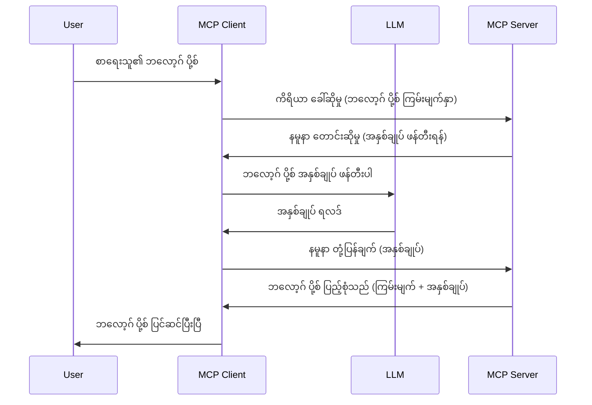

# စမ်းသပ်ခြင်း - Client သို့ အင်္ဂါရပ်များကို Delegate ပြုလုပ်ခြင်း

> **အမှတ်ပြုချက် အကြောင်းကြားချက်:** `2026-07-28` MCP specification release candidate သည် စမ်းသပ်ခြင်းကို LLM ပံ့ပိုးရေး API များနှင့် တိုက်ရိုက်ပေါင်းစည်းမှုဖြစ်စေရန် deprecated လုပ်ထားသည်။ စမ်းသပ်ခြင်းသည် `2025-11-25` တွင်နှင့် formal deprecation ပြုလုပ်ပြီးနောက် တစ်နှစ်အထိ ဆက်လက်အသုံးပြုနိုင်ပါသည်၊ သို့ကြောင့် ဤသင်ခန်းစာမှ အရာအားလုံး မှန်ကန်သေးသည် — သို့သော် server အသစ်များသည် အစားထိုးပုံစံကို သုံးသပ်သင့်သည်။ [What's Changing in MCP: The 2026-07-28 Release Candidate](../../01-CoreConcepts/mcp-2026-07-28-release-candidate.md) ကိုကြည့်ပါ။

တခါတလေ MCP Client နှင့် MCP Server တို့သည် ပူးပေါင်း၍ ရည်ရောက်မှုတူသော ရည်မှန်းချက်တစ်ခုကို ပြုလုပ်ရန် လိုအပ်သည်။ Server သည် Client ပေါ်တွင်ရှိသော LLM ၏ ကူညီမှု လိုအပ်နိုင်သည့် အခါတွင် စမ်းသပ်ခြင်းကို အသုံးပြုသင့်ပါသည်။

စမ်းသပ်ခြင်းနှင့် ပတ်သက်သော အသုံးချမှုများနှင့် ဖြေရှင်းချက် တည်ဆောက်နည်းကို စူးစမ်းကြည့်ပါမည်။

## အနှစ်ချုပ်

ဤသင်ခန်းစာတွင် စမ်းသပ်ခြင်းအဘယ်အချိန်များတွင်၊ အဘယ်နေရာများတွင် အသုံးပြုရမည် ဖြစ်ပြီး မည်သို့ ဖွင့်ာဆွဲရမည်ဆိုသည်ကို လေ့လာသည်။

## သင်ယူရမည့် ရည်မှန်းချက်များ

ဤအခန်းတွင် ကျွန်ုပ်တို့သည်:

- စမ်းသပ်ခြင်းဆိုသည်မှာ ဘာလဲ၊ ဘယ်အချိန်တွင် အသုံးပြုရမည်ကို ရှင်းပြမည်။
- MCP တွင် စမ်းသပ်ခြင်းကို မည်သို့ ဖွင့်တည်ဆဲြရမည်ကို ပြမည်။
- စမ်းသပ်ခြင်းကို လက်တွေ့ တွေ့ကြုံနည်းများ ဖော်ပြမည်။

## စမ်းသပ်ခြင်း ဆိုသည်မှာ မည်သည်နှင့် ထူးခြားသနည်း?

စမ်းသပ်ခြင်းသည် အဆင့်မြင့် အင်္ဂါရပ်တစ်ခုဖြစ်ပြီး အောက်ဖော်ပြပါနည်းဖြင့် လုပ်ဆောင်သည်။



### စမ်းသပ်ခြင်း တောင်းဆိုမှု

လက်ရှိတွင် ယုံကြည်စိတ်ချရသော ဇာတ်ကောင်တစ်ခု၏ မြင်ကွင်းကျယ် ကြည့်ရာမှ စမ်းသပ်ခြင်း တောင်းဆိုမှုကို Server က Client သို့ ပို့သည့် JSON-RPC ဖော်မတ်တွင် မည်သို့ ဖြစ်နိုင်သည်ဆိုတာ ဝေှငးကြရအောင်။

```json
{
  "jsonrpc": "2.0",
  "id": 1,
  "method": "sampling/createMessage",
  "params": {
    "messages": [
      {
        "role": "user",
        "content": {
          "type": "text",
          "text": "Create a blog post summary of the following blog post: <BLOG POST>"
        }
      }
    ],
    "modelPreferences": {
      "hints": [
        {
          "name": "claude-3-sonnet"
        }
      ],
      "intelligencePriority": 0.8,
      "speedPriority": 0.5
    },
    "systemPrompt": "You are a helpful assistant.",
    "maxTokens": 100
  }
}
```

ဒီမှာ တွေ့ရသော အချက်အလက်အနည်းငယ်ကို ဖော်ပြပါမည်။

- Prompt သည် content -> text အောက်တွင် ရှိပြီး LLM ကို ဘလော့ဂ်စာကို အကျဉ်းချုပ်ဖော်ပြရန် ညွှန်ကြားချက် ဖြစ်သည်။

- **modelPreferences**။ ဤအပိုင်းသည် ကြိုက်နှစ်သက်ချက်ဖြစ်ပြီး LLM နှင့် သုံးရန် ညွှန်ကြားချက်များဖြစ်သည်။ အသုံးပြုသူသည် ဤအကြံပြုချက်များကို လက်ခံသွားရန် သို့မဟုတ် ပြောင်းလဲသွားနိုင်ပါသည်။ ဤကိစ္စတွင် မော်ဒယ် အသုံးပြုမှု၊ အမြန်နှုန်းနှင့် ဉာဏ်ရည် အရေးပါမှု စသည့် အကြံပြုချက်များ ပါဝင်သည်။
- **systemPrompt**, ၎င်းသည် သင့် LLM ကို ကိုယ်ပိုင်လက္ခဏာ များပေးသည့် နေရာတစ်ခုဖြစ်ပြီး လမ်းညွှန်ချက်များ ပါရှိသည်။
- **maxTokens**, ၎င်းသည် ဤလုပ်ငန်းဆောင်တာအတွက် အသုံးပြုသင့်သည့် token အရေအတွက်ကို ဖော်ပြရန် အသုံးပြုသည်။

### စမ်းသပ်ခြင်း တုံ့ပြန်မှု

၎င်း တုံ့ပြန်မှုသည် MCP Client မှ MCP Server သို့ ပို့သော တုံ့ပြန်မှုဖြစ်ပြီး client က LLM ကို ခေါ်ယူပြီး တုံ့ပြန်ချက်ကို ရရှိသည်နှင့်အတူ ယခု စာကို ဖန်တီးသည်။ ဤသည် JSON-RPC ဖော်မတ်တွင် မည်သို့ မြင်ကွင်းသည်။

```json
{
  "jsonrpc": "2.0",
  "id": 1,
  "result": {
    "role": "assistant",
    "content": {
      "type": "text",
      "text": "Here's your abstract <ABSTRACT>"
    },
    "model": "gpt-5",
    "stopReason": "endTurn"
  }
}
```

တုံ့ပြန်မှုသည် အကယ်၍ ကျွန်ုပ်တို့ တောင်းဆိုလိုသည့် ဘလော့ဂ်ပိုစ့် အကျဉ်းချုပ်တစ်ခုဖြစ်သည့်အတိုင်းလည်း ဖြစ်သည်။ သင်ကြည့်မည်မှာ သုံးသည့် `model` သည် ကျွန်ုပ်တို့ တောင်းဆိုသည့် `claude-3-sonnet` မဟုတ်ဘဲ "gpt-5" ဖြစ်သည်။ ၎င်းသည် အသုံးပြုသူသည် မိမိစိတ်ကြိုက် မော်ဒယ်ရွေးချယ်နိုင်ခြင်းနှင့် သင်၏ စမ်းသပ်ခြင်း တောင်းဆိုမှုသည် အကြံပြုချက် ဖြစ်ကြောင်း ဖော်ပြရန် ရည်ရွယ်ပါသည်။

အခု ကျွန်ုပ်တို့၏ အဓိက လမ်းကြောင်းကို နားလည်ပြီဖြစ်ပြီး၊ အသုံးခ်ရန် အလုပ်အသုံးဆုံး "ဘလော့ဂ်စာရေး + အကျဉ်းချုပ်" ဖြစ်သော လုပ်ငန်းဆောင်တာတစ်ခုဖြစ်သည်ကို သိရှိပြီးဖြစ်သည်၊ ထို့ကြောင့် ၎င်းကို လည်ပတ်အောင် မည်သို့လုပ်ရမည်ဆိုတာကြည့်ပါစို့။

### စာတိုက်အမျိုးအစားများ

စမ်းသပ်ခြင်း ပေးပို့သည့် မက်ဆေ့ခ်ျ များသည် စာသားပင်မမဟုတ်ဘဲ ဓာတ်ပုံများ၊ အသံများလည်း ပို့နိုင်သည်။ JSON-RPC မည်သို့ကွဲပြားကြောင်း အောက်တွင်ပြပါသည်။

**စာသား**

```json
{
  "type": "text",
  "text": "The message content"
}
```

**ဓာတ်ပုံအကြောင်းအရာ**

```json
{
  "type": "image",
  "data": "base64-encoded-image-data",
  "mimeType": "image/jpeg"
}
```

**အသံအကြောင်းအရာ**

```json
{
  "type": "audio",
  "data": "base64-encoded-audio-data",
  "mimeType": "audio/wav"
}
```

> အမှတ်ပြုချက်: စမ်းသပ်ခြင်းအကြောင်း ဆက်လက်သိရှိရန် [တရားဝင်စာတမ်းများ](https://modelcontextprotocol.io/specification/2025-11-25/client/sampling) ကိုကြည့်ပါ။

## Client တွင် စမ်းသပ်ခြင်း ပြင်ဆင်နည်း

> မှတ်ချက်: သင်သည် server တစ်ခုတည်းသာ တည်ဆောက်နေပါက ဒီမှာ မလုပ္ရပါ။

Client တွင် အောက်ဖော်ပြပါ အင်္ဂါရပ်ကို ဖော်ပြပေးရန် လိုအပ်သည်။

```json
{
  "capabilities": {
    "sampling": {}
  }
}
```

ပြီးနောက် သင့်ရွေးချယ်ထားသော client သည် server နှင့် စတင်ချိန်တွင် ယင်းကို ဆွဲယူပါမည်။

## စမ်းသပ်ခြင်း လက်တွေ့နမူနာ - ဘလော့ဂ်စာတစ်စောင် ဖန်တီးခြင်း

စမ်းသပ်ခြင်း server ကို တစ်ပြိုင်နက် Coding ပြုလုပ်ကြမည်။ အောက်ပါအချက်များ လုပ်ရန် လိုအပ်ပါသည်။

1. Server ပေါ်တွင် tool တစ်ခု ဖန်တီးပါ။
1. ထို tool သည် စမ်းသပ်ခြင်း တောင်းဆိုမှု တစ်ခု ဖန်တီးရမည်။
1. Tool သည် client ၏ စမ်းသပ်ခြင်း တုံ့ပြန်ချက် ရရှိရန် စောင့်ဆိုင်းရမည်။
1. ထိုပြီးနောက် tool ရလဒ် ထုတ်ပေးရမည်။

လိုက်တမ်း စတင်ကိုယ်တိုင် Coding အဆင့်ဆင့် ကြည့်ကြပါစို့။

### -1- Tool ကို ဖန်တီးခြင်း

**python**

```python
@mcp.tool()
async def create_blog(title: str, content: str, ctx: Context[ServerSession, None]) -> str:
    """Create a blog post and generate a summary"""

```

### -2- စမ်းသပ်ခြင်း တောင်းဆိုမှု ဖန်တီးခြင်း

အောက်ပါကုဒ်ဖြင့် သင့် tool ကို ဖြည်းဖြည်းချင်း တိုးချဲ့ပါ။

**python**

```python
post = BlogPost(
        id=len(posts) + 1,
        title=title,
        content=content,
        abstract=""
    )

prompt = f"Create an abstract of the following blog post: title: {title} and draft: {content} "

result = await ctx.session.create_message(
        messages=[
            SamplingMessage(
                role="user",
                content=TextContent(type="text", text=prompt),
            )
        ],
        max_tokens=100,
)

```

### -3- တုံ့ပြန်ချက် စောင့်ဆိုင်းပြီး ပြန်လည်ပေးပို့ခြင်း

**python**

```python
post.abstract = result.content.text

posts.append(post)

# တစ်ခုလုံးထုတ်ကုန်ကိုပြန်ပေးပါ
return json.dumps({
    "id": post.title,
    "abstract": post.abstract
})
```

### -4- အပြည့်အစုံကုဒ်

**python**

```python
from starlette.applications import Starlette
from starlette.routing import Mount, Host

from mcp.server.fastmcp import Context, FastMCP

from mcp.server.session import ServerSession
from mcp.types import SamplingMessage, TextContent

import json


from uuid import uuid4
from typing import List
from pydantic import BaseModel


mcp = FastMCP("Blog post generator")

# app = FastAPI()

posts = []

class BlogPost(BaseModel):
    id: int
    title: str
    content: str
    abstract: str

posts: List[BlogPost] = []

@mcp.tool()
async def create_blog(title: str, content: str, ctx: Context[ServerSession, None]) -> str:
    """Create a blog post and generate a summary"""

    post = BlogPost(
        id=len(posts) + 1,
        title=title,
        content=content,
        abstract=""
    )

    prompt = f"Create an abstract of the following blog post: title: {title} and draft: {content} "

    result = await ctx.session.create_message(
        messages=[
            SamplingMessage(
                role="user",
                content=TextContent(type="text", text=prompt),
            )
        ],
        max_tokens=100,
    )

    post.abstract = result.content.text

    posts.append(post)

    # အပြည့်အစုံ ဘလော့ဂ်ပို့စ်ကို ပြန်ပေးသည်။
    return json.dumps({
        "id": post.title,
        "abstract": post.abstract
    })

if __name__ == "__main__":
    print("Starting server...")
    # mcp.run()
    mcp.run(transport="streamable-http")

# app ကို အောက်ပါနည်းဖြင့် ပြေးရန်: python server.py
```

### -5- Visual Studio Code တွင် စမ်းသပ်ခြင်း

Visual Studio Code တွင် စမ်းသပ်အား ပြုလုပ်ရန် အောက်ပါအတိုင်း ဆောင်ရွက်ပါ။

1. Terminal မှ Server ကို စတင်ပါ။
1. *mcp.json* ထဲတွင် ထည့်သွင်းပြီး (စတင်ထားကြောင်း သေချာစေပါ) ဥပမာ အောက်ပါအတိုင်း:

   ```json
   "servers": {
      "blog-server": {
        "type": "http",
        "url": "http://localhost:8000/mcp"
      }
   }
   ```

1. Prompt တစ်ခု ရိုက်ထည့်ပါ။

   ```text
   create a blog post named "Where Python comes from", the content is "Python is actually named after Monty Python Flying Circus"
   ```

1. စမ်းသပ်ခြင်း ပြုလုပ်ခွင့် သတ်မှတ်ပေးပါ။ ပထမဆုံး စမ်းသပ်စဉ်တွင် အသစ် Dialog တစ်ခု မျက်နှာပြင်ပေါ်လာပြီး သင် သဘောတူရမည်။ ထို့နောက် ပုံမှန် Dialog ကို တွေ့ရ၍ tool ကို အလုပ်လုပ်ရန် တောင်းဆိုပါမည်။

1. ရလဒ်များအား လေ့လာကြည့်ပါ။ ရလဒ်များကို GitHub Copilot Chat တွင် လှပစွာ ပြပါမည်၊ raw JSON တုံ့ပြန်မှုကိုလည်း စစ်ဆေးနိုင်သည်။

**အပိုဆောင်း**။ Visual Studio Code သည် စမ်းသပ်ခြင်းကို ကောင်းစွာ ပံ့ပိုးပါသည်။ သင်၏ထည့်သွင်းထားသော server တွင် စမ်းသပ်ခြင်း အသုံးပြုခွင့် ကွန်ဖန်ဂျူရေးရှင်း ပြုလုပ်နိုင်ရန် အောက်ပါ အဆင့်များဖြင့် သွားရောက်နိုင်သည်။

1. Extension ဌာနသို့ သွားပါ။
1. "MCP SERVERS - INSTALLED" ဌာနတွင် အတည်ပြုထားသော server အတွက် Cog ပုံစံ icon ကို ရွေးချယ်ပါ။
1 "Configure Model Access" ကို ရွေးချယ်ပြီး GitHub Copilot သည် စမ်းသပ်ခြင်း ပြုလုပ်ရာတွင် မည်သည့် မော်ဒယ်များ အသုံးပြုခွင့်ရှိမည်ကို သတ်မှတ်နိုင်သည်။ နောက်ဆုံးတွင် ဖြစ်ပျက်ခဲ့သည့် စမ်းသပ်ခြင်း တောင်းဆိုမှုများအား "Show Sampling requests" ဖြင့် ကြည့်ရှုနိုင်သည်။

## အလုပ်အပ်တာ

ဤအလုပ်အပ်တာတွင် သင်သည် အနည်းငယ်ကွဲပြားသော စမ်းသပ်ခြင်း တည်ဆောက်မည်ဖြစ်သည်။ ထို့အတွက် product description များ ထုတ်ပေးနိုင်သော sampling စနစ် တစ်ခု ဖြစ်မည်။ သင့် ဇာတ်လမ်းမှာ အောက်ပါအတိုင်းဖြစ်သည်။

**ဇာတ်လမ်း:** အီးကောမွတ်စ် ပြန်လည်ဆောင်ရွက်သူများသည် ပစ္စည်း ဖော်ပြချက်များ ဖန်တီးရာတွင် အချိန် ဗလေသည်။ ထို့ကြောင့် "create_product" tool ကို "title" နှင့် "keywords" အဖြစ် argument တန်ဆာများဖြင့်ခေါ်ဆိုနိုင်ပြီး client ၏ LLM က "description" အကွက် ဖြည့်ပေးသော ပစ္စည်းလုံးဝအား ဖန်တီးပေးသည့် ဖြေရှင်းချက် တစ်ခု တည်ဆောက်ရန် လိုအပ်သည်။

TIP: ယခင်သင်ခဲ့သည့် ကိန်းဂဏန်းများ အသုံးပြု၍ တည်ဆောက်ပါ။

## ဖြေရှင်းနည်း

[ဖြေရှင်းချက်](./solution/README.md)

## အဓိကယူဆချက်များ

စမ်းသပ်ခြင်းသည် Server မှ Client သို့ LLM ၏ကူညီမှု လိုအပ်ချိန်တွင် လုပ်ဆောင်မှုများကို Delegate လုပ်နိုင်သော အင်အားကြီး အင်္ဂါရပ်ဖြစ်သည်။

## နောက်တစ်ဆင့်

- [အခန်း 4 - လက်တွေ့ အကောင်အထည်ဖော်မှု](../../04-PracticalImplementation/README.md)

---

<!-- CO-OP TRANSLATOR DISCLAIMER START -->
**ပြောကြားချက်**
ဤစာတမ်းကို AI ဘာသာပြန်ဝန်ဆောင်မှု [Co-op Translator](https://github.com/Azure/co-op-translator) အသုံးပြု၍ ဘာသာပြန်ထားပါသည်။ ကျွန်ုပ်တို့သည် တိကျမှန်ကန်မှုအတွက် ကြိုးပမ်းနေသော်လည်း၊ စက်ကိရိယာဘာသာပြန်ခြင်းများတွင် အမှားများ သို့မဟုတ် မှားယွင်းချက်များ ပါဝင်နိုင်ကြောင်း သတိပြုပါရန် လိုအပ်ပါသည်။ မူလစာတမ်းကို မူရင်းဘာသာဖြင့်သာ ယုံကြည်စိတ်ချရသော အချက်အလက်အဖြစ် သတ်မှတ်သင့်သည်။ အရေးကြီးသည့် သတင်းအချက်အလက်များအတွက် ပရော်ဖက်ရှင်နယ် လူသားဘာသာပြန်သူဝန်ဆောင်မှုကို အကြံပြုပါသည်။ ဤဘာသာပြန်ချက်ကို အသုံးပြုခြင်းမှ ဖြစ်ပေါ်လာသော နားလည်မှုကွာခြားမှုများ သို့မဟုတ် မမှန်ကန်သော အသုံးပြုမှုများအတွက် ကျွန်ုပ်တို့ တာဝန်မခံပါ။
<!-- CO-OP TRANSLATOR DISCLAIMER END -->