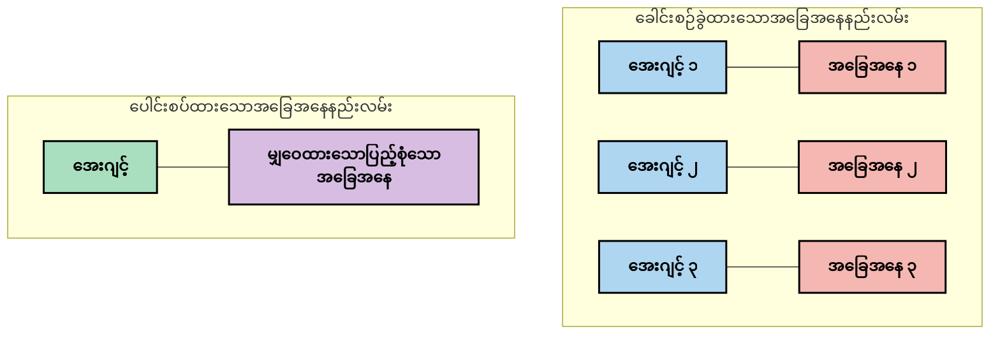
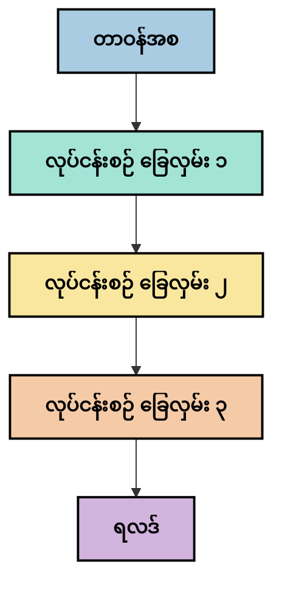
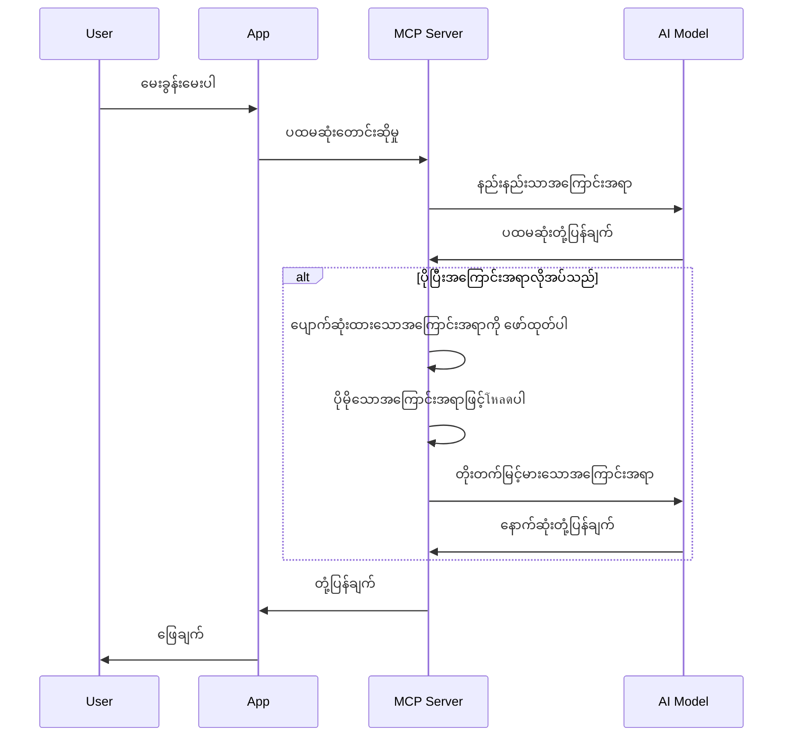
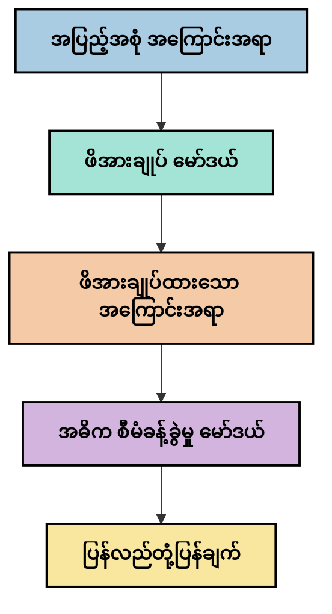
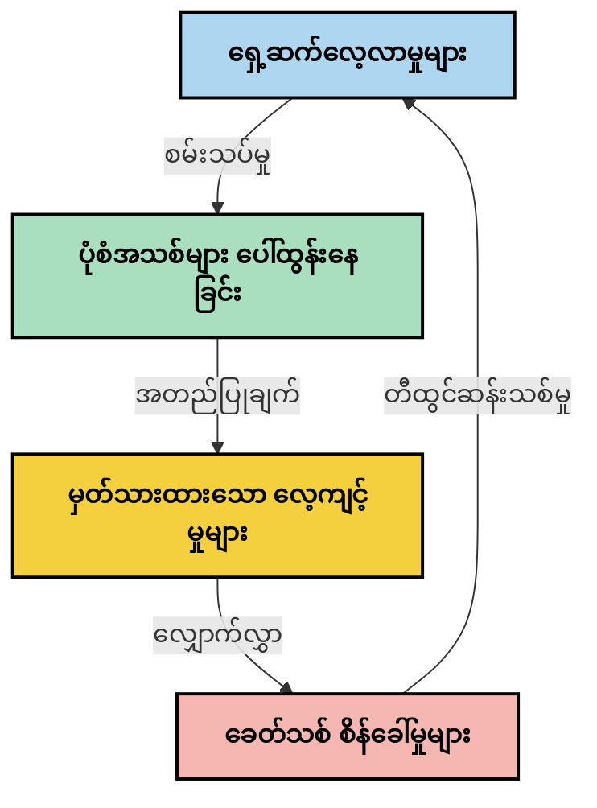

# အကြောင်းအရာအင်ဂျင်နီယာ링: MCP ပတ်ဝန်းကျင်ရှိ အသစ်မြင့်တက်လာသော ယူဆချက်တစ်ခု

## အနှစ်ချုပ်

အကြောင်းအရာအင်ဂျင်နီယာ링သည် AI လောက၌ အသစ်မြင့်တက်လာသော ယူဆချက်တစ်ခုဖြစ်ပြီး၊ အသုံးပြုသူများနှင့် AI ဝန်ဆောင်မှုများကြား အချက်အလက်များကို မည်သို့ ဖွဲ့စည်းပေးပြီး၊ ပေးပို့ပြီး၊ ထိန်းသိမ်းတပ်ဆင်ကြောင်း လေ့လာသည်။ Model Context Protocol (MCP) ပတ်ဝန်းကျင် တိုးတက်လာသည်နှင့်အမွီ၊ အကြောင်းအရာကို ထိရောက်စွာ စီမံခန့်ခွဲသည့် နည်းလမ်းများကို နားလည်ရရှိခြင်းမှာ ပိုမိုအရေးပါလာသည်။ ဤ module သည် context engineering ၏ ယူဆချက်ကို မိတ်ဆက်ပြီး MCP ထည့်သွင်းမှုများတွင် အသုံးအနှုန်းများကို ခန့်မှန်းလေ့လာသည်။

## သင်ယူရန်ရည်ရွယ်ချက်များ

ဤ module ၏ အဆုံးတွင် သင်သည် အောက်ပါအရာများကို ပြုလုပ်နိုင်ရန် ရှိပါမည် -

- Context engineering ၏ အသစ်မြင့်တက်လာသည့် ယူဆချက်နှင့် MCP ၌ ၎င်း၏ နေရာကို နားလည်ခြင်း
- MCP protocol ချမှတ်မှုက ဖယ်ရှားပေးသည့် context စီမံခန့်ခွဲမှု၏ အဓိက စိန်ခေါ်မှုများကို ဖော်ထုတ်ခြင်း
- Context ကိုပိုမိုကောင်းမွန်စွာ စီမံရန် နည်းလမ်းများကို စူးစမ်းတင်ပြခြင်း
- Context ထိရောက်မှုကိုတိုင်းတာသုံးသပ်ရန် နည်းလမ်းများကိုစဉ်းစားခြင်း
- MCP framework မှတဆင့် AI အတွေ့အကြုံများကို ကောင်းမွန်စေဖို့ ယူဆချက်အသစ်များကို အသုံးချခြင်း

## အကြောင်းအရာအင်ဂျင်နီယာ링 မိတ်ဆက်

အကြောင်းအရာအင်ဂျင်နီယာ링သည် အသုံးပြုသူများ၊ အက်ပလီကေးရှင်းများနှင့် AI မော်ဒယ်များအကြား သတင်းအချက်အလက်လည်ပတ်မှုကို ရည်ရွယ်သတ်မှတ်ပြီး ဒီဇိုင်းရေးဆွဲခြင်းနှင့် စီမံခန့်ခွဲခြင်းကို အထူးတလည် လေ့လာခြင်းဖြစ်သည်။ prompt engineering ကဲ့သို့ နာမည်ကျပြီးသား နယ်ပယ်များနှင့်မတူဘဲ၊ context engineering ကို လက်တွေ့သုံးသူများက အထူးလေ့လာကာ AI မော်ဒယ်များအတွက် တိကျတဲ့ အချက်အလက်များကို မှန်ကန်ချိန်မီ ပေးပို့ပေးရန် ထူးခြားသော စိန်ခေါ်မှုများကို ဖြေရှင်းရန် အဆင့်ဆင့် ဖွဲ့စည်းနေဆဲ ဖြစ်သည်။

LLM များ တိုးတက်လာခြင်းနှင့်အမျှ အကြောင်းအရာအရေးပါတော့သည်။ သင့်အကြောင်းအရာ၏ အရည်အသွေး၊ သက်ဆိုင်မှုနှင့် ဖွဲ့စည်းမှုသည် မော်ဒယ်ထုတ်လွှင့်ချက်များကို တိုက်ရိုက် သက်ရောက်သည်။ Context engineering သည် ဤဆက်ဆံရေးကို ရှာဖွေကာ ထိရောက်သော context စီမံခန့်ခွဲမှုအတွက် နည်းလမ်းများ ဖန်တီးခြင်းကို လေ့လာသည်။

> "၂၀၂၅ ခုနှစ်တွင် မော်ဒယ်များသည် အလွန်အသိပညာရှိကြသည်။ သို့သော် လူသားထက် များမြန်ပြီး ကျွမ်းကျင်သူမှ တစ်ဆင့် context မပါဘဲ မိမိတာဝန်ကို ထိရောက်စွာ ဆောင်ရွက်၍ မရပါ... ‘Context engineering’ သည် prompt engineering ၏ နောက်တန်းအဆင့်ဖြစ်သည်။ ၎င်းသည် ဒီနည်းကို မှန်ကန်စွာ dynamic system တစ်ခုတွင် အလိုအလျောက်ဆောင်ရွက်ခြင်း ဖြစ်သည်။" — Walden Yan, Cognition AI

Context engineering တွင်ပါသည့် အချက်အလက်များမှာ -

1. **Context ရွေးချယ်ခြင်း**: တာဝန်တစ်ခုအတွက် သက်ဆိုင်သော အချက်အလက်တွေရွေးချယ်ခြင်း
2. **Context ဖွဲ့စည်းခြင်း**: မော်ဒယ်နားလည်မှုအတွက် အချက်အလက်များကို စနစ်တကျ ပရော်ဖက်ရှင်နယ်စွာ စီစဉ်ခြင်း
3. **Context ပေးပို့ခြင်း**: မော်ဒယ်သို့ အချက်အလက်ပေးပို့မည့် နေရာနှင့် အချိန်အား ထိရောက်စွာ ကျင့်သုံးခြင်း
4. **Context ထိန်းသိမ်းခြင်း**: အချိန်အတည့်အတွင်း context ၏ အခြေအနေ နှင့် ဖွံ့ဖြိုးတိုးတတ်မှုကို စီမံခြင်း
5. **Context သုံးသပ်ခြင်း**: context ထိရောက်မှုကို တိုင်းတာပြီး ကောင်းမွန်သွားစေခြင်း

ဤအာရုံစူးစိုက်ရမည့်နေရာများမှာ MCP ပတ်ဝန်းကျင်တွင် အံဝင်မြောက်သည်။ MCP သည် application များ အကြောင်းအရာများကို LLM များသို့ ပေးပို့ရန် စံနှုန်းတစ်ရပ်ကို ပေးသည်။


## အကြောင်းအရာခရီးစဉ် အမြင်

context engineering ကို မြင်သာစေခဲ့သည့်နည်းလမ်းတစ်ခုမှာ MCP စနစ်အတွင်း အချက်အလက်များ ခရီးစဉ်ကို လိုက်လံ နေရာချခြင်းဖြစ်သည်။


### အကြောင်းအရာခရီးစဉ်၏ အဓိကအဆင့်များ:

1. **အသုံးပြုသူ ထည့်သွင်းချက်**: အသုံးပြုသူထံမှ သဘာဝအချက်အလက်များ (စာသား၊ ဓာတ်ပုံ၊ စာရွက်စာတမ်း)
2. **Context စုပေါင်းခြင်း**: အသုံးပြုသူ input ကို စနစ်အကြောင်းအရာ၊ ဆွေးနွေးမှုသမိုင်းနှင့် နှိုင်းယှဉ်ပြီး အချက်အလက်များ ပေါင်းစည်းခြင်း
3. **မော်ဒယ် ပြုလုပ်ခြင်း**: AI မော်ဒယ်သည် စုပေါင်းထားသော အကြောင်းအရာကို ဖြေရှင်းသည်
4. **တုံ့ပြန်ချက် ထုတ်လုပ်မှု**: ပေးပို့သော context အပေါ် မော်ဒယ်မှ output များ ထုတ်ပေးခြင်း
5. **အခြေအနေ စီမံခန့်ခွဲမှု**: ဆက်ဆံမှုအရ စနစ်၏ အတွင်းအခြေအနေကို update ပြုလုပ်ခြင်း

ဤအမြင်သည် AI စနစ်ရှိ context ၏ dynamic ကို ဖော်ပြကာ အဆင့်တိုင်းတွင် အချက်အလက်များကို အကောင်းဆုံး စီမံရန် အရေးပါတဲ့ မေးခွန်းများအား ဖော်ထုတ်သည်။

## Context Engineering တွင် အသစ်မြင့်လာသော မူဝါဒများ

context engineering နယ်ပယ်ဖွံ့ဖြိုးသည့်အခါ လက်တွေ့လုပ်ကိုင်သူများမှ စတင်ဖော်ထုတ်လာသော မူဝါဒအချို့ရှိသည်။ ဤမူဝါဒများက MCP ထုတ်လုပ်မှုရွေးချယ်မှုများကို အထောက်အပံ့ဖြစ်စေပါလိမ့်မည်။

### မူဝါဒ ၁: Context ပမာဏကို တစ်စိတ်တစ်ပိုင်း မဖြစ်စေဘဲ မပြတ်မပျက် မျှဝေပါ

context တွေကို စနစ်၏ ပါဝင်န့် များအားလုံးအကြား မဖောက်ပစ်ဘဲ အပြည့်အစုံ မျှဝေရန် လိုသည်။ context များ ခွဲခြားထားလျှင် ကျဆုံးမှုများ၊ မှားယွင်းမှုများ ကျရောက်နိုင်သည်။



MCP application များတွင် context သည် စနစ်လုံးရှိ pipeline အသီးသီးမှတဆင့် ချောမွေ့စွာ ကူးပြောင်းနေသင့်သည်ဟု ဒီအယူအဆကို ဖော်ပြသည်။

### မူဝါဒ ၂: လုပ်ဆောင်ချက်များတွင် implicit ဆုံးဖြတ်ချက်များပါဝင်ကြောင်း သဘောပေါက်ပါ

မော်ဒယ်၏ လုပ်ဆောင်ချက်တစ်ခုချင်းစီမှာ context ကို ဘယ်လိုအသုံးပြုရမည်ဆိုသည့် implicit ဆုံးဖြတ်ချက်များကို ထိန်းသိမ်းသည်။ context မကွဲပြားသော ပါဝင်ခန်းများက အတုယူဆောင်ထားသော implicit ဆုံးဖြတ်ချက်များကြောင့် တညီတညွတ် မဖြစ်စေနိုင်ပါ။

ဤမူဝါဒသည် MCP application များအတွက် အရေးပါတဲ့ အချက်များပါရှိသည်။
- စပ်စုထားသော context များနှင့်အတူ လုပ်ငန်းခွဲ များကို လိုက်လံချဲ့ထွင်ခြင်းထက် စမ်းသပ်ခြင်း ဖြင့် တိုးတက်စွာ လုပ်သားသော ထိန်းချုပ်မှု ရရှိစေရန်
- ဆုံးဖြတ်ချက် အချက်တိုင်းသည် တူညီသော context အချက်အလက်များကို ရယူထားရှိရန် တာဝန်ယူရန်
- နောက်ကွယ်မှ အဆင့်များသည် အစောပိုင်း ဆုံးဖြတ်ချက်များ၏ အပြည့်အစုံ context ကို မြင်နိုင်ရန် စနစ်များ ဒီဇိုင်းရေးဆွဲရန်

### မူဝါဒ ၃: Context အနက်အရှည္နှင့် Window ကန့်သတ်မှုများကို ဖြေရှင်းအညီ ညှိနှိုင်းပါ

ဆွေးနွေးမှုများနှင့် လုပ်ငန်းစဉ်များ တိုးလာသည်ဖြင့် context window များ ပြည့်လျှင် overflow ဖြစ်ကာ ဖြစ်ပါသည်။ ထိရောက်စွာ context engineering သည် context အပြည့်အစုံနှင့် စက်တင်နည်းကျ ကန့်သတ်မှုများ ကြား ဆင်ခြေညှိနှိုင်းမှုများကို လေ့လာသည်။

စမ်းသပ်နေသည့်နည်းလမ်းများမှာ -
- မလိုအပ်သော token များလျှော့ချရန် တိုက်ရိုက်လိုအပ်သော အချက်အလက်များကို ပုံဖော်ထားသော context ကွပ်စုခြင်း
- လိုအပ်ချက်အတိုင်း ပိသဖြစ်မှုများအပေါ် အခြေခံ၍ context ကို တိုးချဲ့ပြ Loading  ပြုခြင်း
- အရေးပါဆုံးဆုံးဖြတ်ချက်များနှင့် အချက်တို့ကို ကြည့်ရှုရင်း မပြီးဆုံးသေးသော ဆွေးနွေးမှုများကို အကျဉ်းချုပ်ပေးခြင်း

## Context စိန်ခေါ်မှုများနှင့် MCP protocol ချမှတ်ချက်များ

Model Context Protocol (MCP) ကို context စီမံခန့်ခွဲမှု၏ ထူးခြားသော စိန်ခေါ်မှုများကို သိရှိပြီးပို၍ ထိရောက်စေရန် ဒီဇိုင်းရေးဆွဲထားသည်။ ၎င်း စိန်ခေါ်မှုများကို နားလည်ခြင်းဖြင့် MCP protocol ၏ အဓိက အင်္ဂါရပ်များကို ရှင်းပြနိုင်သည်။


### စိန်ခေါ်မှု ၁: Context Window ကန့်သတ်မှုများ
အများဆုံး AI မော်ဒယ်များတွင် context window အရွယ်အစား သတ်မှတ်ထားရှိပြီး တစ်ကြိမ်လျှင် ဆက်သွယ်ရန်အချက်အလက်ပမာဏကို ကန့်သတ်ထားသည်။

**MCP Design ပြန်ကြားချက်:** 
- protocol တွင် ဖွဲ့စည်းထားသော၊ resource-based  context အသုံးပြုမှု လွယ်ကူစေရန် အသုံးပြုနိုင်သည်
- resource များကို pagination ဖြင့် တိုက်ရိုက် တိုးချဲ့ပြီး ဖော်ထုတ်နိုင်သည်

### စိန်ခေါ်မှု ၂: သက်ဆိုင်မှု သတ်မှတ်ခြင်း
context ထဲသို့ ထည့်သင့်သော အချက်အလက်များကို ရွေးချယ်သည်မှာ ခက်ခဲသည်။

**MCP Design ပြန်ကြားချက်:**
- လိုအပ်ချက်အပေါ် မူတည်၍ အချက်အလက်များ dynamic retrieval လုပ်ခြင်း အတွက် နည်းလမ်းများ ပေးသည်
- ဖွဲ့စည်းပုံရှိသော prompt များဖြင့် context organization ကို တည်ငြိမ်စေသည်

### စိန်ခေါ်မှု ၃: Context တည်တံ့မှု
ဆက်ဆံမှုများ အသီးသီးအတွင်း ပထမဆုံးအခြေအနေကို ထိန်းသိမ်းထားရန်လိုသည်။

**MCP Design ပြန်ကြားချက်:**
- စံနှုန်းပြည့်နိုင်သည့် session management ကို ထောက်ပံ့သည်
- context အပြောင်းအလဲအတွက် interaction pattern များ သေချာသတ်မှတ်ထားသည်

### စိန်ခေါ်မှု ၄: မူလမျိုးစုံသော Context
စာသား၊ ဓာတ်ပုံ၊ ဖွဲ့စည်းတည်ဆောက်ထားသော ဒေတာ စသည်တို့သည် ကွဲပြားခြားနားသော xử lý လိုအပ်သည်။

**MCP Design ပြန်ကြားချက်:**
- protocol ဒီဇိုင်းမှာ အမျိုးအစားအများအတွက်သက်ဆိုင်မှုကို လက်ခံနိုင်သည်
- မူလမျိုးစုံအချက်အလက်ကို စားသုံးလာသော စံသတ်မှတ်ချက်ရှိသည်

### စိန်ခေါ်မှု ၅: လုံခြုံရေးနှင့် ကိုယ်ရေးကိုယ်တာ အချက်အလက် ကာကွယ်မှု
context တွင် အထူးသဖြင့် လုံခြုံရေးလိုအပ်ချက်ရှိသော အချက်အလက်များပါဝင်သည်။

**MCP Design ပြန်ကြားချက်:**
- client နှင့် server တာဝန်များကြား ပြတ်သားသော နယ်နိမိတ်များထားရှိသည်
- ဒေတာ ထုတ်ဖော်မှုကို လျော့ချပေးရန် တိုင်းပြည်တွင်း လုပ်ဆောင်မှုရွေးချယ်မှုရှိသည်

ယင်းစိန်ခေါ်မှုများနှင့် MCP ဖြေရှင်းမှုများကို နားလည်ခြင်းသည် ဖွန့်ဖြိုးလာသော context engineering နည်းကျ ကွက်ခွဲမှုများကို စမ်းစစ်ရာတွင် အခြေခံဖြစ်သည်။

## အကြောင်းအရာအင်ဂျင်နီယာ링 ၏ အသစ်မြင့်လာသော နည်းလမ်းများ

context engineering နယ်ပယ်တိုးတက်လာသည့်အခါ သဘောတူညီချက်အချို့သည် စတင်ပေါ်ပေါက်လာသည်။ ၎င်းတို့သည် သတ်မှတ်ထားသော အကောင်းဆုံးလေ့လာမှု မဟုတ်သော်လည်း MCP ထည့်သွင်းမှုများနှင့် အတူ ဖွံ့ဖြိုးလာမည့် ယူဆချက်များကို ကိုယ်စားပြုသည်။

### ၁။ တစ်မျိုးတည်း သန်းခေါင်လိုက် ပြုလုပ်ခြင်း

context များကို ခွဲဝေသည့် multi-agent အဆောက်အအုံများနှင့်မတူဘဲ၊ တစ်မျိုးတည်း သန်းခေါင်လိုက် ပြုလုပ်ခြင်းသည် ပိုမို တည်ငြိမ်သော ရလဒ်များ ပေးနိုင်မည်ဟု လက်တွေ့သုံးသူများ စမ်းသပ်တွေ့ရှိနေကြသည်။ ၎င်းသည် ညီညွတ်သော context ထိန်းသိမ်းထားစေရန် အရေးကြီးသော ယူဆချက်နှင့် ကိုက်ညီသည်။



parallel processing များထက် ထိရောက်မှု နည်းသော်လည်း တစ်ဆင့်ချင်းစီသည် ယခင်ဆုံးဖြတ်ချက်တို့ကို အပြည့်အဝ နားလည်မှုဖြင့် ဖွဲ့စည်းသွားသောကြောင့် ပိုမို သာမန်နှင့် ယုံကြည်စိတ်ချရသောရလဒ်များပေးသည်။

### ၂။ Context အပိုင်းစိတ်ခြင်းနှင့် အရေးပါမှု ဦးစားပေးချက်

များပြားသော context များကို စီမံနိုင်လောက်သော အပိုင်းခွဲခြင်းဖြင့် အရေးပါဆုံး အစိတ်အပိုင်းများကို ဦးစားပေးရွေးချယ်ခြင်း။

```python
# အယူအဆ နမူနာ - ပုံစံတစ်ခု: သဘောတရား ခွဲခြမ်းခြင်းနှင့် ဦးစားပေးမှု
def process_with_chunked_context(documents, query):
    # ၁။ စာရွက်စာတမ်းများကို ခွဲခြမ်း၍ အပိုင်းသေးသေးများဖြင့် ဖွဲ့စည်းပါ။
    chunks = chunk_documents(documents)
    
    # ၂။ အပိုင်းတိုင်းအတွက် သက်ဆိုင်မှု အဆင့်များတွက်ချက်ပါ။
    scored_chunks = [(chunk, calculate_relevance(chunk, query)) for chunk in chunks]
    
    # ၃။ သက်ဆိုင်မှု အဆင့်အလိုက် အပိုင်းများကို စီစဥ်ပါ။
    sorted_chunks = sorted(scored_chunks, key=lambda x: x[1], reverse=True)
    
    # ၄။ အဓိက သက်ဆိုင်မှုရှိသော အပိုင်းများကို အခြေအနေအဖြစ် အသုံးပြုပါ။
    context = create_context_from_chunks([chunk for chunk, score in sorted_chunks[:5]])
    
    # ၅။ ဦးစားပေးထားသော အခြေအနေဖြင့် ကိုင်တွယ်ဆောင်ရွက်ပါ။
    return generate_response(context, query)
```

အထက်ပါ အယူအဆသည် ကြီးမားသော စာရွက်စာတမ်းများကို စီမံနိုင်သော အပိုင်းများ ခွဲခြားခြင်းနှင့် အရေးပါဆုံးပိုင်းများကိုသာ Context အတွက် ရွေးချယ်သုံးစွဲနိုင်ခြင်းကို ဖော်ပြသည်။ ၎င်းသည် context window ကန့်သတ်မှုများကို ကျော်လွှားကာ ကြီးမားသော ဗဟုသုတ အချက်အလက်များ အသုံးချမှု ကို ကူညီသည်။

### ၃။ Context တိုးတက်တည်တံ့စွာ တင်သွင်းခြင်း

context ကို အပြည့်အစုံ တစ်ပြိုင်နက်တည်းမဟုတ်ဘဲ လိုအပ်သောအချိန်အတိုင်း တိုးတတ်ကာ တင်ပေးခြင်း။



တိုးတက်တည်တံ့၍ context ဖြည့်တင်းမှုမှာ အနည်းဆုံး context ဖြင့် စတင်ကာ လိုအပ်သည့်အချိန်တွင်သာ အချက်အလက်များ တိုးချဲ့ထည့်သွင်းသည်။ ၎င်းသည် ရိုးရှင်းသည့် မေးခွန်းများအတွက် token သုံးစွဲမှုကို လျော့နည်းစေပြီး ပြင်းထန်သော မေးခွန်းများကို နှင့်တကွ ကိုင်တွယ်နိုင်စွမ်း ထိန်းသိမ်းသည်။

### ၄။ Context သေးငယ်အောင် ဖွဲ့စည်းခြင်းနှင့် အကျဉ်းချုပ်ခြင်း

အဓိကအချက်များကို ထိန်းသိမ်းထား၍ context အရွယ်အစားကို လျော့ဖွဲ့စည်းခြင်း။



context compression က အဓိကအားဖြင့် -
- တူညီနေသော သတင်းအချက်အလက်များ ဖယ်ရှားခြင်း
- ရှည်လျားသော အကြောင်းအရာများ ကို တိုတောင်းအကျဉ်းချုပ်ခြင်း
- အဓိက အချက်အလက်များ နှင့် အကြောင်းအရာ ချုပ်ဆိုချက်များ ရွေးချယ်ခြင်း
- အရေးကြီးသော context အချက်များ ထိန်းသိမ်းထားခြင်း
- token ထိရောက်မှုအတွက် ရှု့ရှာခြင်း

ဤနည်းလမ်းသည် context window တွင် ရှည်လျားသော ဆွေးနွေးမှုများ ထိန်းသိမ်းရန် သို့မဟုတ် ကြီးမားသောစာရွက်စာတမ်းများကို ထိရောက်စွာ စီမံရန် အထူးအသုံးဝင်သည်။ context compression နှင့် ဆွေးနွေးမှုပုံမှန်အကြောင်းအရာ အကျဉ်းချုပ်ခြင်းအတွက် အထူးသီးသန့် မော်ဒယ်များကိုလည်း အသုံးပြုသူများ ရှိပါသည်။


## စူးစမ်းသုံးသပ်ရန် Context Engineering တွင် သတိပြုရန်အချက်များ

context engineering ကို စဉ်းစားလေ့လာသည့်အခါ MCP ထည့်သွင်းမှုများကို လုပ်ဆောင်ရာတွင် သတိပြုမှုပေးသင့်သော အချက်များ ရှိသည်။ ၎င်းတို့မှာ အကောင်းဆုံး လေ့လာမှုများ မဟုတ်ဘဲ သင့်အခြေအနေအတွက် တိုးတက်မှုများ ရရှိရန် ကြိုးပမ်းရန် အပိုင်းများ ဖြစ်ပါသည်။

### သင့်အကြောင်းအရာ ရည်မှန်းချက်များကို သတိပြုပါ

ပြတ်သားစွာ သတ်မှတ်ပါ -
- မော်ဒယ်အောင်မြင်ရန်မည်သည့် အချက်အလက်များ လိုအပ်ပါသလဲ?
- မည်သည်က အချက်အလက်များ မရှိမဖြစ်လိုအပ်ပြီး မည်သည်က ပံ့ပိုးကူညီမှုအဆင့်ဖြစ်သနည်း?
- သင့် ရလဒ်အတွက် ထိန်းချုပ်မှုကန့်သတ်ချက်များ (နောက်ကျချိန်၊ token ကန့်သတ်မှုများ၊ အသုံးစရိတ်များ) ဘာတွေလဲ?

### အဆင့်ခွဲ context နည်းလမ်းများကို စူးစမ်းကြည့်ပါ

အချို့အတွေ့အကြုံရှိသူများသည် အောက်ပါ အဆင့်များအတိုင်း context စီမံထားနိုင်ကြသည်။
- **အဓိက အဆင့်**: မော်ဒယ်အမြဲလိုအပ်သော အချက်အလက်များ
- **အခြေအနေဆိုင်ရာ အဆင့်**: လက်ရှိ ဆက်ဆံမှုအတွက် သက်ဆိုင်သည့် context
- **ပံ့ပိုး အဆင့်**: အထောက်အကူဖြစ်နိုင်သော အချက်အလက်များ
- **Fallback အဆင့်**: လိုအပ်သည်နှင့် တွဲနေသော အချက်အလက်များ

### ရယူနည်းလမ်းများကို လေ့လာပါ

context ထိရောက်မှုသည် သင်အချက်အလက်များ ရယူပုံကို ပေါ်မူတည်သည် –
- အဓိက ချဉ်းကပ်မှုနှင့် ကွဲပြားမှုများအတွက် semantic search နှင့် embeddings
- သတ်မှတ်ချက် အချက်အလက်များအတွက် keyword-based search
- နည်းလမ်းပေါင်းများစွာကို ပေါင်းစပ်အသုံးပြုခြင်း
- အမျိုးအစား၊ နေ့စွဲ၊ မှတ်တမ်းများအလိုက် metadata filtering ဖြင့် သန့်ရှင်းခြင်း

### Context တစ်ရပ်တည်း များစွာ စုစည်းမှုအား စမ်းသပ်ပါ

သင့် context ဖွဲ့စည်းပုံနှင့် လည်ပတ်မှုသည် မော်ဒယ်နားလည်မှု၌ သက်ရောက်မှုရှိနိုင်သည်။
- ဆက်စပ်နေသော အချက်အလက်များ ကို အုပ်စုဖွဲ့ခြင်း
- တူညီသော ပုံစံနှင့် အုပ်ချုပုံစံ အသုံးပြုခြင်း
- လိုအပ်သည့် နေရာတွင် ရှုထောင့်မတူ အချိန်တစ်ဆင့်စီ ချုပ်ဆိုဖို့
- သဘောမတူညီသော အချက်အလက်များ ရှောင်ရှားခြင်း

### Multi-Agent အဆောက်အအုံများ၏ အားနည်းချက်များကို သုံးသပ်ပါ

Multi-agent architecture များသည် AI framework များတော်တော်များများတွင် လူကြိုက်များသည်။ သို့သော် context စီမံခန့်ခွဲမှုတွင် စိန်ခေါ်မှုများကြုံတွေ့ရသည်။
- context များ ခွဲခြားခြင်းကြောင့် agent အလိုက် ဆုံးဖြတ်ချက် မတူညီမှုဖြစ်နိုင်သည်
- အချုပ်အခြာများ၏ parallel လုပ်ဆောင်မှုကြောင့် ပဋိပက္ခ ဖြစ်နိုင်သည်
- agent များအကြား ဆက်သွယ်မှုကြီးမားမှုကြောင့် စွမ်းဆောင်ရည် ကောင်းမွန်မှု မှီခိုမှု ပြတ်တောက်နိုင်သည်
- အသေးစိတ်အချက်အလက်များ ဆက်လုပ်ရန် စနစ်များ လိုအပ်သည်

တော်တော်များများအတွက် context ပေါင်းစုံအသုံးပြုသော single-agent approach သည် အပိုင်းခွဲခြားထားသော multi-agent များထက် အသုံးပြုရန် ယုံကြည်စိတ်ချမှု ပို၍ မြင့်မားနိုင်သည်။

### သုံးသပ်မှု နည်းလမ်းများ ဖွံ့ဖြိုးပါ

context engineering ကို တိုးတက်ကောင်းမွန်စေရန် အောင်မြင်မှုအတိုင်းအတာကို တိုင်းတာရန် သင် စဉ်းစားရန်။
- မတူညီသော context ဖွဲ့စည်းမှုများ ကို A/B စမ်းသပ်ခြင်း
- token သုံးစွဲမှုနှင့် တုံ့ပြန်မှု အချိန်ကို လာရီဝိုင်းစစ်ဆေးခြင်း
- အသုံးပြုသူ စိတ်တိုင်းကျမှုနှင့် တာဝန်ပြည့်စုံမှု ရှာဖွေခြင်း
- context များ ပျက်ကွက်မှုအချိန်များနှင့် အကြောင်းအရင်းများကို ခွဲခြမ်းစိတ်ဖြာခြင်း

ဤစဉ်းစားချက်များသည် context engineering အတွင်း စူးစမ်းရွေးချယ်မှု ဝန်းကျင်များကို ဖော်ပြသည်။ နယ်ပယ် ကြီးထွားလာသည့်အခါ ပိုမို သပ်သပ်မှိန်မှိန် နည်းလမ်းများ ထွက်ပေါ်လာမည်ဖြစ်သည်။

## context ထိရောက်မှုတိုင်းတာခြင်း: တိုးတက်လာသော အခြေခံဖွဲ့စည်းမှု

context engineering အဖြစ် ထွက်ပေါ်လာသည်နှင့်အမျှ ၎င်း၏ ထိရောက်မှုကို မည်သို့တိုင်းတာရမည်ကို လက်တွေ့လုပ်ငန်းရှင်များ စတင်စဉ်းစားနေကြသည်။ သတ်မှတ်ထားသော ဖွဲ့စည်းမှု မရှိသေးပေမယ့် အနာဂတ် လုပ်ငန်းများအတွက် လမ်းညွှန်ဖို့ စာရင်းပေးအပ်နေသည်။

### တိုင်းတာမှု အင်္ဂါရပ်များ


#### ၁။ ထည့်သွင်းမှု ထိရောက်မှု အခြေခံစဉ်းစားချက်များ

- **Context-to-Response အချိုးအစား**: ပြန်တုံ့ပြန်မှု အရွယ်အစားနှင့် နှိုင်းယှဉ်၍ မည်မျှ context လိုအပ်သည်?
- **Token အသုံးပြုမှု**: ပေးအပ်သော context tokens များ၏ မည်မျှ ရိုးရာ ပြန်တုံ့ပြန်မှုကို သက်ရောက်စေသနည်း?
- **Context လျော့ချမှု**: သက်ဆိုင်သော အချက်အလက်များကို မူရင်းအချက်အလက်မှ မည်မျှ ထိရောက်စွာ ဖျော့ချနိုင်သနည်း?

#### ၂။ စွမ်းဆောင်ရည် အခြေခံစဉ်းစားချက်များ

- **နောက်ကျမှု သက်ရောက်မှု**: context စီမံမှုသည် ပြန်တုံ့ပြန်ရမည့် အချိန်ကို မည်မျှ သက်ရောက်စေသနည်း?
- **Token စီမံချက်**: token အသုံးပြုပုံ မည်မျှ ထိရောက်စွာ ထိန်းသိမ်းပြီး ပြုစုထားသနည်း?
- **ထုတ်ဖော်မှု တိကျမှု**: ရရှိသော အချက်အလက်သည် မည်မျှ သက်ဆိုင်မှုရှိသနည်း?
- **ရင်းမြစ်အသုံးပြုမှု**: ဝါရင့်စွဲရန် လိုအပ်သော စက်ရုပ်ဆိုင်ရာ အရင်းအမြစ်များ ဖြည့်ဆည်းခြင်း

#### ၃။ အရည်အသွေး အခြေခံစဉ်းစားချက်များ

- **တုံ့ပြန်မှု သက်ဆိုင်မှု**: မေးခွန်းများကို မည်မျှ ကောင်းမွန်စွာ ဖြေကြားပေးသနည်း?
- **အချက်အလက် မှန်ကန်မှု**: context စီမံမှုက အချက်အလက်မှန်ကန်မှု ဆက်လက် ကောင်းမွန်စေသလား?
- **တုန့်ပြန်မှုတူညီမှု**: မေးခွန်းတူညီသောအခြေအနေများတွင် တုံ့ပြန်မှုများ တူညီရော?
- **မော်ဒယ်အမှားထင်ခြင်းနှုန်း**: သာမန်သဘောရောက်သော context က မော်ဒယ် အမှားထင်ခြင်းများကို လျော့နည်းစေသလား?

#### ၄။ အသုံးပြုသူ အတွေ့အကြုံအခြေခံ စဉ်းစားချက်များ

- **နောက်တိုး မေးခွန်းများ ဖြစ်ပေါ်မှု**: မေးလွှန်းသူများ မေးချင်သေးသော စကားများ မည်မျှရှိသနည်း?
- **တာဝန် ပြီးစီးမှု**: အသုံးပြုသူများသည် သူတို့ရည်မှန်းချက်များအောင်မြင်စွာ ပြီးစီးနိုင်ခြင်း
- **ဖြည့်ကျယ် မှတ်ချက်များ**: အသုံးပြုသူများ ၎င်းတို့၏ အတွေ့အကြုံကို မည်မျှ ဖြည့်တင်းသုံးသပ်သနည်း?

### တိုင်းတာမှု အတွက် စူးစမ်းသုံးသပ်သော နည်းလမ်းများ

MCP ထည့်သွင်းမှုများတွင် context engineering စမ်းသပ်ရာတွင် အောက်ပါ စမ်းသပ်နည်းလမ်းများကို စဉ်းစားပါ:

1. **အခြေခံ ရိုက်နှိပ်မှု**: ရိုးရှင်းသော context နည်းလမ်းများဖြင့် အခြေခံကို ပေါ်ထွက် စပြီး ဖြည့်စွက်နည်းများ စမ်းသပ်ခြင်း

2. **ပိုမိုတိုးတက်မှုများ လေ့လာခြင်း**: context စီမံခန့်ခွဲမှု၏ အစိတ်အပိုင်းတစ်ခုချင်းစီကို လေ့လာနေ၍ ၎င်း၏ အသက်သာမှု ကို ခွဲခြမ်းစိတ်ဖြာခြင်း

3. **အသုံးပြုသူစိတ်ကျေနပ်မှု အခြေပြု သုံးသပ်မှု**: သို့မဟုတ် အရေအတွက်တန်းချိန်အချက်အလက်များနှင့် စိတ်ခံစားချက်ဆိုင်ရာ တုံ့ပြန်ချက်များ ပေါင်းစပ်သုံးသပ်ခြင်း

4. **အလုပ်မလုပ်မီ စစ်ဆေးခြင်း**: context နည်းလမ်းများ မအောင်မြင်သော အခြေအနေများကို စူးစမ်းစစ်ဆေးကာ ကျုပ်ဖြည့်နိုင်စေရေး

5. **စြမ်းဆောင်ရည်၊ အရည်အသွေးနှင့် အသုံးပြုသူ အတွေ့အကြုံ မတူညီမှုကျော်လွန်မှု များကို ျပန်လည် ဆန်းစစ်ခြင်း**

ဤ စမ်းသပ်မှုများ၊ စိတ်ကူးအမျိုးမျိုးပေါင်းစပ်ခြင်းသည် context engineering ၏ အသစ်မြင့်လာနေသော လောကနှင့် ကိုက်ညီသည်။

## နိဂုံးချုပ်အတွေးအခေါ်များ

context engineering သည် MCP application များတွင် အရေးပါသော နယ်ပယ်အသစ်ဖြစ်လာနိုင်သည်။ သင့်စနစ်တွင် အချက်အလက်လည်ပတ်မှုကို စိတ်နားလည်စွာ ကျင်လည်ကာ AI အတွေ့အကြုံများကို ပိုမိုထိရောက်၊ မှန်ကန်ပြီး အသုံးဝင်စေရန် ဖန်တီးနိုင်သည်။

ဤ module တွင် ဖော်ပြထားသော နည်းလမ်းများနှင့် ယူဆချက်များသည် လောက၌ ဦးတည်ချက်ပမာဏဖြစ်ပြီး သတ်မှတ်ထားသော နည်းလမ်းများ မဟုတ်ပါ။ AI စွမ်းအားတိုးတက်မှုနှင့် နားလည်မှုမြင့်မားလာသောအခါ context engineering သည် ပိုမိုသေချာတဲ့ နယ်ပယ်တစ်ခု ဖြစ်လာနိုင်သည်။ ယခုအခါတွင် စမ်းသပ်ခြင်းနှင့် သေချာစိတ်ရှည်တိုင်းတာခြင်းသည် ပိုမို ထိရောက်သော နည်းလမ်းဖြစ်သည်။

## အနာဂတ် မျှော်မှန်းချက်များ

context engineering ၏ နယ်ပယ်သည် စတင်ဖွံ့ဖြိုးနေစဉ်မှာ အောက်ပါ ရှေ့ဆက်လမ်းများကို အားထားဖြစ်နေသည်။

- context engineering ၏ မူဝါဒများသည် မော်ဒယ်စွမ်းဆောင်ရည်၊ ထိရောက်မှု၊ အသုံးပြုသူအတွေ့အကြုံနှင့် ယုံကြည်စိတ်ချမှုတို့ကို အရေးကြီးစွာ အကျိုးသက်ရောက်စေနိုင်သည်။
- ကျယ်ပြန့်သော context management ပါဝင်သည့် single-threaded နည်းလမ်းသည် များစွာသောအသုံးပြုမှုများအတွက် multi-agent architecture များထက် ပိုမိုကောင်းမွန်စွာ ဆောင်ရွက်နိုင်မည်။
- context compression ဂုဏ်သတ္တိရှိသည့် မော်ဒယ်များသည် AI pipeline များတွင် စံတော်ချိန်အစိတ်အပိုင်းများ ဖြစ်လာနိုင်သည်။
- context ပြည့်စုံမှုနှင့် token ကန့်သတ်မှုများကြား စိန့်ပွားမှုသည် context ကိုင်တွယ်မှုတွင် တီထွင်မှုများကို အားတိုးပေးမည်။
- မော်ဒယ်များသည် လူစွယ်စုံစကားနှင့် ထိရောက်စွာ ဆက်သွယ်နိုင်လာသည်နှင့်အမျှ တကယ့် multi-agent ပူးတွဲလုပ်ဆောင်မှုများ တိုးတက်လာနိုင်သည်။
- MCP ထည့်သွင်းမှုများသည် လတ်တလော စမ်းသပ်မှုများမှ ပေါ်ပေါက်လာသော context စီမံခန့်ခွဲမှု ပုံစံများကို စံတော်ချိန် စနစ်တကျ ပြုလုပ်သွားနိုင်သည်။



## အရင်းအမြစ်များ

### MCP အတည်រនာ အရင်းအမြစ်များ
- [Model Context Protocol Website](https://modelcontextprotocol.io/)
- [Model Context Protocol Specification](https://github.com/modelcontextprotocol/modelcontextprotocol)

- [MCP စာရွက်စာတမ်းများ](https://modelcontextprotocol.io/docs)
- [MCP C# SDK](https://github.com/modelcontextprotocol/csharp-sdk)
- [MCP Python SDK](https://github.com/modelcontextprotocol/python-sdk)
- [MCP TypeScript SDK](https://github.com/modelcontextprotocol/typescript-sdk)
- [MCP Inspector](https://github.com/modelcontextprotocol/inspector) - MCP ဆာဗာများအတွက် မျက်နှာပြင်စမ်းသပ်မှုပြုသည့်ကိရိယာ

### Context Engineering ဆောင်းပါးများ
- [Multi-Agents မတည်ဆောက်ပါနဲ့: Context Engineering သဘောတရားများ](https://cognition.ai/blog/dont-build-multi-agents) - Walden Yan ၏ context engineering သဘောတရားများအပေါ် အမြင်များ
- [Agents တည်ဆောက်ရန် လက်တွေ့လမ်းညွှန်](https://cdn.openai.com/business-guides-and-resources/a-practical-guide-to-building-agents.pdf) - OpenAI ၏ ထိရောက်သော agent ဖန်တီးမှု လမ်းညွှန်
- [ထိရောက်သော Agents တည်ဆောက်ခြင်း](https://www.anthropic.com/engineering/building-effective-agents) - Anthropic ၏ agent ဖန်တီးမှု နည်းလမ်း

### ဆက်စပ်သုတေသန
- [ကြီးမားသော ဘာသာစကားမော်ဒယ်များအတွက် Dynamic Retrieval Augmentation](https://arxiv.org/abs/2310.01487) - dynamic retrieval နည်းလမ်းများအပေါ် သုတေသန
- [အလယ်ပိုင်းတွင် လိုက်လျောခြင်း: ဘာသာစကားမော်ဒယ်များ၏ ကြာရှည် context အသုံးပြုမှု](https://arxiv.org/abs/2307.03172) - context ကို စီမံခြင်း နမူနာများအပေါ် အရေးပါသော သုတေသန
- [CLIP Latents ဖြင့် အဆင့်ဆင့် စာသား-အခြေခံ ပုံဖန်တီးခြင်း](https://arxiv.org/abs/2204.06125) - DALL-E 2 စာတမ်းတွင် context ဖွဲ့စည်းမှုအပေါ် အမြင်များ
- [ကြီးမားသော ဘာသာစကားမော်ဒယ် ဖွဲ့စည်းမှုများတွင် Context တာဝန်ရှိမှု လေ့လာခြင်း](https://aclanthology.org/2023.findings-emnlp.124/) - context ကို ကိုင်တွယ်မှုအပေါ် ဆန်းစစ်သုတေသနအသစ်
- [Multi-Agent ပူးပေါင်းဆောင်ရွက်မှု: စစ်တမ်း](https://arxiv.org/abs/2304.03442) - multi-agent စနစ်များနှင့် ၎င်းတို့၏ စိန်ခေါ်မှုများအပေါ် သုတေသန

### ပိုမိုလေ့လာနိုင်သော အရင်းအမြစ်များ
- [Context Window ပြုပြင်သင့်တဲ့ နည်းလမ်းများ](https://learn.microsoft.com/en-us/azure/ai-services/openai/concepts/context-window)
- [တိုးတက်သော RAG နည်းလမ်းများ](https://www.microsoft.com/en-us/research/blog/retrieval-augmented-generation-rag-and-frontier-models/)
- [Semantic Kernel စာရွက်စာတမ်းများ](https://github.com/microsoft/semantic-kernel)
- [Context စီမံခန့်ခွဲမှုအတွက် AI ကိရိယာစုစည်း](https://github.com/microsoft/aitoolkit)

## နောက်တက်မှာ ဘာများရှိမလဲ

- [5.15 MCP Custom Transport](../mcp-transport/README.md)

---

<!-- CO-OP TRANSLATOR DISCLAIMER START -->
**ပြောကြားချက်**
ဤစာတမ်းကို AI ဘာသာပြန်ဝန်ဆောင်မှု [Co-op Translator](https://github.com/Azure/co-op-translator) အသုံးပြု၍ ဘာသာပြန်ထားပါသည်။ ကျွန်ုပ်တို့သည် တိကျမှန်ကန်မှုအတွက် ကြိုးပမ်းနေသော်လည်း၊ စက်ကိရိယာဘာသာပြန်ခြင်းများတွင် အမှားများ သို့မဟုတ် မှားယွင်းချက်များ ပါဝင်နိုင်ကြောင်း သတိပြုပါရန် လိုအပ်ပါသည်။ မူလစာတမ်းကို မူရင်းဘာသာဖြင့်သာ ယုံကြည်စိတ်ချရသော အချက်အလက်အဖြစ် သတ်မှတ်သင့်သည်။ အရေးကြီးသည့် သတင်းအချက်အလက်များအတွက် ပရော်ဖက်ရှင်နယ် လူသားဘာသာပြန်သူဝန်ဆောင်မှုကို အကြံပြုပါသည်။ ဤဘာသာပြန်ချက်ကို အသုံးပြုခြင်းမှ ဖြစ်ပေါ်လာသော နားလည်မှုကွာခြားမှုများ သို့မဟုတ် မမှန်ကန်သော အသုံးပြုမှုများအတွက် ကျွန်ုပ်တို့ တာဝန်မခံပါ။
<!-- CO-OP TRANSLATOR DISCLAIMER END -->