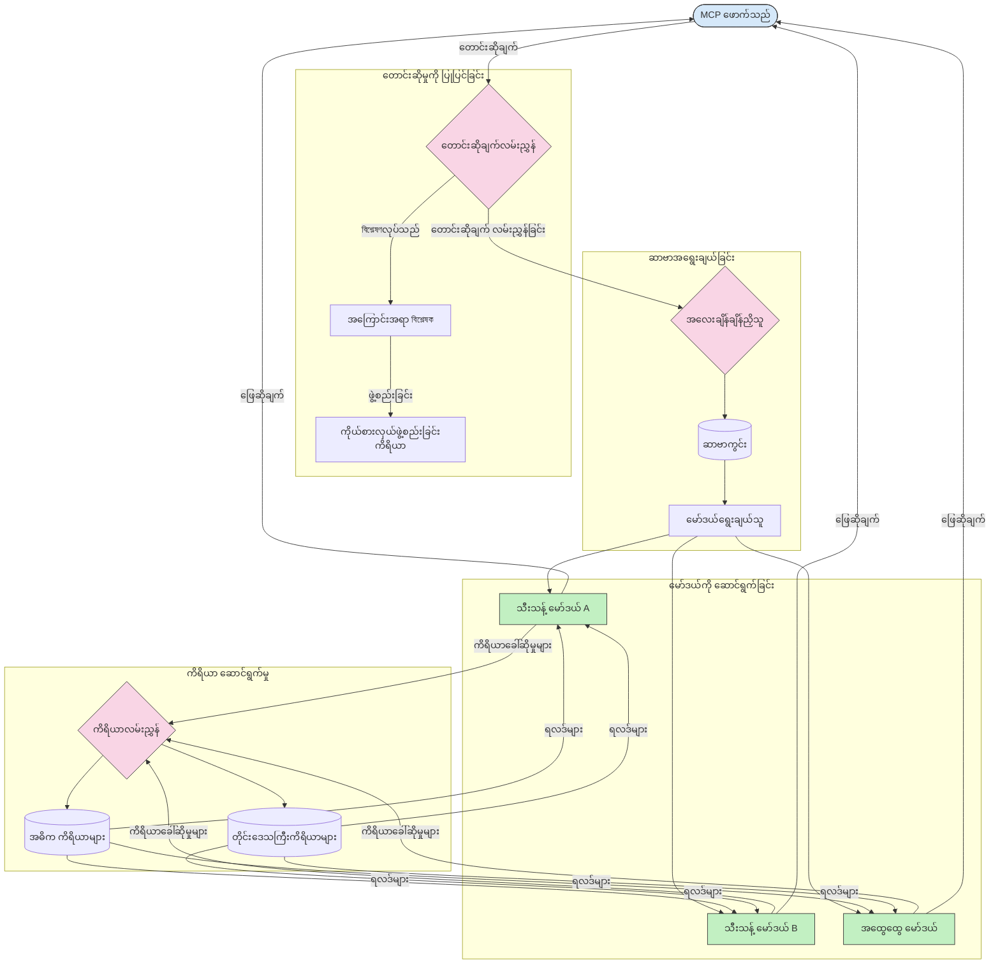

# မော်ဒယ်အကြောင်းအရာပေါ် မူတည်သော အချက်ပြနည်း

Routing သည် MCP စနစ်အတွင်း အချက်ပေးမည့် မော်ဒယ်များ၊ ကိရိယာများ သို့မဟုတ် ဝန်ဆောင်မှုများကို မှန်ကန်စွာ ဦးတည်ပေးရန် အရေးကြီးသည်။

## နိဒါန်း

Model Context Protocol (MCP) တွင် routing သည် အကြောင်းအရာအမျိုးအစား၊ အသုံးပြုသူအခြေအနေ နှင့် စနစ်၏ အမြတ်တိမ်းအလမ်းလိုက် တို့အရ အကောင်းဆုံးသင့်လျော်သော မော်ဒယ် သို့မဟုတ် ဝန်ဆောင်မှုကို မှာယူချက်များ ဦးတည်ပေးခြင်းဖြစ်သည်။ ၎င်းကောင်းစွာ လုပ်ဆောင်မှုနှင့် အရင်းအမြစ်များကို ထိရောက်စွာ အသုံးချနိုင်မှုကို သေချာစေသည်။

## သင်ယူရန်ရည်မှန်းချက်များ

ဤသင်ခန်းစာ၏ အဆုံးသတ်တွင် သင်သည် အောက်ပါအရာများကို ပြုလုပ်နိုင်မည်။

- MCP တွင် routing ၏ စံအချက်များကို နားလည်နိုင်ခြင်း။
- အကြောင်းအရာအပေါ် မူတည်၍ အထူးပြုဝန်ဆောင်မှုများသို့ မှာယူချက်များ ဦးတည်ပေးနိုင်ခြင်း။
- အရင်းအမြစ်အသုံးချမှု ကိုတိုးတက်အောင် အသုံးချနိုင်သည့် ရောဂါလျှော့ခြင်းနည်းဗျူဟာများကို အကောင်အထည်ဖော်နိုင်ခြင်း။
- မှာယူချက်အခြေအနေအပေါ် မူတည်၍ ကိရိယာ routing ကို လက်တွေ့ကျကျ ပြုလုပ်နိုင်ခြင်း။

## အကြောင်းအရာအပေါ် မူတည်သော Routing

အကြောင်းအရာအပေါ် မူတည်သော routing သည် မှာယူချက်၏ အကြောင်းအရာအပေါ် အခြေခံ၍ အထူးပြု ဝန်ဆောင်မှုများသို့ ဦးတည်ပေးသည်။ ဥပမာအားဖြင့် ကုဒ်ထုတ်လုပ်ခြင်းများနှင့် သက်ဆိုင်သော မှာယူချက်များကို အထူးပြုကုဒ်မော်ဒယ်သို့ ဦးတည်ပေးနိုင်ပြီး၊ ဖန်တီးမှုရေးသားခြင်း ဆိုင်ရာ အမိန့်များကို ဖန်တီးမှုရေးသားမှု မော်ဒယ်သို့ ပို့နိုင်သည်။

မတူညီသော ပရိုဂရမ်းမင်းဘာသာစကားများတွင် ဒီဇိုင်းစနစ်အကောင်အထည်ဖော်မှုအတွက် ဥပမာကို ကြည့်မည်။

<details>
<summary>.NET</summary>

```csharp
// .NET Example: Content-based routing in MCP
public class ContentBasedRouter
{
    private readonly Dictionary<string, McpClient> _specializedClients;
    private readonly RoutingClassifier _classifier;
    
    public ContentBasedRouter()
    {
        // Initialize specialized clients for different domains
        _specializedClients = new Dictionary<string, McpClient>
        {
            ["code"] = new McpClient("https://code-specialized-mcp.com"),
            ["creative"] = new McpClient("https://creative-specialized-mcp.com"),
            ["scientific"] = new McpClient("https://scientific-specialized-mcp.com"),
            ["general"] = new McpClient("https://general-mcp.com")
        };
        
        // Initialize content classifier
        _classifier = new RoutingClassifier();
    }
    
    public async Task<McpResponse> RouteAndProcessAsync(string prompt, IDictionary<string, object> parameters = null)
    {
        // Classify the prompt to determine the best specialized service
        string category = await _classifier.ClassifyPromptAsync(prompt);
        
        // Get the appropriate client or fall back to general
        var client = _specializedClients.ContainsKey(category) 
            ? _specializedClients[category] 
            : _specializedClients["general"];
            
        Console.WriteLine($"Routing request to {category} specialized service");
        
        // Send request to the selected service
        return await client.SendPromptAsync(prompt, parameters);
    }
    
    // Simple classifier for routing decisions
    private class RoutingClassifier
    {
        public Task<string> ClassifyPromptAsync(string prompt)
        {
            prompt = prompt.ToLowerInvariant();
            
            if (prompt.Contains("code") || prompt.Contains("function") || 
                prompt.Contains("program") || prompt.Contains("algorithm"))
            {
                return Task.FromResult("code");
            }
            
            if (prompt.Contains("story") || prompt.Contains("creative") || 
                prompt.Contains("imagine") || prompt.Contains("design"))
            {
                return Task.FromResult("creative");
            }
            
            if (prompt.Contains("science") || prompt.Contains("research") || 
                prompt.Contains("analyze") || prompt.Contains("study"))
            {
                return Task.FromResult("scientific");
            }
            
            return Task.FromResult("general");
        }
    }
}
```

အထက်ပါကုဒ်တွင်၊ 

- `ContentBasedRouter` ကိုယ်စားလှယ်တစ်ခုကို ဖန်တီးပြီး မှာယူချက်များကို မေးခွန်း၏ အကြောင်းအရာအပေါ် မူတည်၍ ဦးတည်ပေးသည်။
- ကဏ္ဍအလိုက် အထူးပြု client များ (ကုဒ်၊ ဖန်တီးမှု၊ သိပ္ပံ၊ စုံစမ်းမှု) ကို စတင်ချိန်ညှိထားသည်။
- မေးခွန်း၏ အမျိုးအစားကို သတ်မှတ်ပေးသော ရိုးရှင်းသည့် သတ်မှတ်စနစ်ကို ထည့်သွင်းပြီး အထူးပြု ဝန်ဆောင်မှုမှကိုယ်စား ပို့ဆောင်သည်။
- အထူးပြုဝန်ဆောင်မှုမရှိသောအခါ အထွေထွေဝန်ဆောင်မှုသို့ ပြန်လည် ဦးတည်ပေးရန် နောက်ခံစနစ်ကို အသုံးပြုသည်။
- မှာယူချက်များကို ထိရောက်စွာ စီမံရန် အချိန်နှင့်တပြေးညီ လုပ်ဆောင်ချက်များကို ပြုလုပ်ထားသည်။
- အကြောင်းအရာ အမျိုးအစားများကို အထူးပြု MCP client များနှင့် သတ်မှတ်ရန် dictionary ကို အသုံးပြုသည်။
- မေးခွန်းကို စိစစ်သုံးသပ်ကာ ကိုက်ညီသော အမျိုးအစားကို ပြန်လည် ထုတ်ပေးသည့် ရိုးရှင်းသည့် သတ်မှတ်စနစ်ကို ထပ်မံ ထည့်သွင်းထားသည်။
- အထူးပြု client ကို အသုံးပြုကာ မှာယူချက်ကို ပို့၍ အဖြေကို လက်ခံသည်။
- မေးခွန်းသည် အသီးသီးသော အထူးပြုအမျိုးအစားနှင့် ကိုက်ညီမှုမရှိပါက အထွေထွေ ဝန်ဆောင်မှုသို့ ဦးတည်ပေးသည်။

</details>

## ဆေးလိပ်ထိုးမှု (Intelligent Load Balancing)

ဆေးလိပ်ထိုးမှုသည် အရင်းအမြစ်အသုံးချမှုကို ထိရောက်စွာ တိုက်ရိုက် စီမံပြီး MCP ဝန်ဆောင်မှုများအတွက် ကြီးမားသော အချက်ပြမှု ဘေးကင်းချ safety ကို သေချာစေသည်။ ဆေးလိပ်ထိုးမှုကို ကိုယ်စားအသုံးပြုရန် မတူညီသောနည်းလမ်းများ ရှိပြီး၊ round-robin၊ အလေးချိန်ဖြင့် တုံ့ပြန်ချိန်တတ်မှု စသည်တို့ပါဝင်သည်။

အောက်ပါ အညွှန်းငယ်တွင် ဒီစတက်ဂျီများကို အသုံးပြုထားသည်။

- **Round Robin**: ရရှိနိုင်သည့် ဆာဗာများတွင် တန်းတူ ချခြားပေးသည်။
- **Weighted Response Time**: ဆာဗာများ၏ ပျမ်းမျှ တုံ့ပြန်ချိန်အပေါ် မူတည်၍ မှာယူချက်များကို ဦးတည်ပေးသည်။
- **Content-Aware**: မှာယူချက်၏ အကြောင်းအရာအပေါ် ပေါ် မူတည်ကာ အထူးပြု ဆာဗာများကို ဦးတည်ပေးသည်။

<details>
<summary>Java</summary>

```java
// Java ဥပမာ: MCP စာဗာများအတွက် အတတ်ပညာဖြင့် ဘလွမ်းလေးရှင်းချထားခြင်း
public class McpLoadBalancer {
    private final List<McpServerNode> serverNodes;
    private final LoadBalancingStrategy strategy;
    
    public McpLoadBalancer(List<McpServerNode> nodes, LoadBalancingStrategy strategy) {
        this.serverNodes = new ArrayList<>(nodes);
        this.strategy = strategy;
    }
    
    public McpResponse processRequest(McpRequest request) {
        // သတ်မှတ်ချက်အရ အကောင်းဆုံး စာဗာကို ရွေးချယ်ပါ
        McpServerNode selectedNode = strategy.selectNode(serverNodes, request);
        
        try {
            // တောင်းဆိုမှုကို ရွေးချယ်ထားသော node သို့ လမ်းညွှန်ပါ
            return selectedNode.processRequest(request);
        } catch (Exception e) {
            // ဖျက်ဆီးမှုကို ကိုင်တွယ်ပါ - ပြန်ကြိုးစားခြင်း သို့မဟုတ် fallback ဒြပ်ပွင့်ကို အကောင်အထည်ဖော်ပါ
            System.err.println("Error processing request on node " + selectedNode.getId() + ": " + e.getMessage());
            
            // node ကို အခြေအနေမကောင်းဖြစ်နိုင်ခြေရှိဟု သတ်မှတ်ပါ
            selectedNode.recordFailure();
            
            // အစားထိုးအနေဖြင့် နောက်ထပ် အကောင်းဆုံး node ကို ကြိုးစားပါ
            List<McpServerNode> remainingNodes = new ArrayList<>(serverNodes);
            remainingNodes.remove(selectedNode);
            
            if (!remainingNodes.isEmpty()) {
                McpServerNode fallbackNode = strategy.selectNode(remainingNodes, request);
                return fallbackNode.processRequest(request);
            } else {
                throw new RuntimeException("All MCP server nodes failed to process the request");
            }
        }
    }
    
    // Node ကျန်းမာရေး စစ်ဆေးခြင်း အလုပ်
    public void startHealthChecks(Duration interval) {
        ScheduledExecutorService scheduler = Executors.newScheduledThreadPool(1);
        scheduler.scheduleAtFixedRate(() -> {
            for (McpServerNode node : serverNodes) {
                try {
                    boolean isHealthy = node.checkHealth();
                    System.out.println("Node " + node.getId() + " health status: " + 
                                      (isHealthy ? "HEALTHY" : "UNHEALTHY"));
                } catch (Exception e) {
                    System.err.println("Health check failed for node " + node.getId());
                    node.setHealthy(false);
                }
            }
        }, 0, interval.toMillis(), TimeUnit.MILLISECONDS);
    }
    
    // ဘလွမ်းလေးရှင်း မဟာဗျူဟာများအတွက် အင်တာဖေ့စ်
    public interface LoadBalancingStrategy {
        McpServerNode selectNode(List<McpServerNode> nodes, McpRequest request);
    }
    
    // လှည့်စဉ်စနစ် မဟာဗျူဟာ
    public static class RoundRobinStrategy implements LoadBalancingStrategy {
        private AtomicInteger counter = new AtomicInteger(0);
        
        @Override
        public McpServerNode selectNode(List<McpServerNode> nodes, McpRequest request) {
            List<McpServerNode> healthyNodes = nodes.stream()
                .filter(McpServerNode::isHealthy)
                .collect(Collectors.toList());
            
            if (healthyNodes.isEmpty()) {
                throw new RuntimeException("No healthy nodes available");
            }
            
            int index = counter.getAndIncrement() % healthyNodes.size();
            return healthyNodes.get(index);
        }
    }
    
    // အလေးချိန်ပြုထားသော တုံ့ပြန်ချိန် မဟာဗျူဟာ
    public static class ResponseTimeStrategy implements LoadBalancingStrategy {
        @Override
        public McpServerNode selectNode(List<McpServerNode> nodes, McpRequest request) {
            return nodes.stream()
                .filter(McpServerNode::isHealthy)
                .min(Comparator.comparing(McpServerNode::getAverageResponseTime))
                .orElseThrow(() -> new RuntimeException("No healthy nodes available"));
        }
    }
    
    // အကြောင်းအရာအသိအမှတ်ပြု မဟာဗျူဟာ
    public static class ContentAwareStrategy implements LoadBalancingStrategy {
        @Override
        public McpServerNode selectNode(List<McpServerNode> nodes, McpRequest request) {
            // တောင်းဆိုမှု's လက္ခဏာများကို သတ်မှတ်ပါ
            boolean isCodeRequest = request.getPrompt().contains("code") || 
                                   request.getAllowedTools().contains("codeInterpreter");
            
            boolean isCreativeRequest = request.getPrompt().contains("creative") || 
                                       request.getPrompt().contains("story");
            
            // အထူးပြု node များကို ရှာဖွေပါ
            Optional<McpServerNode> specializedNode = nodes.stream()
                .filter(McpServerNode::isHealthy)
                .filter(node -> {
                    if (isCodeRequest && node.getSpecialization().equals("code")) {
                        return true;
                    }
                    if (isCreativeRequest && node.getSpecialization().equals("creative")) {
                        return true;
                    }
                    return false;
                })
                .findFirst();
            
            // အထူးပြု node သို့မဟုတ် အနည်းဆုံး လုပ်ငန်းပမာဏရှိသော node ကို ပြန်အမ်းပါ
            return specializedNode.orElse(
                nodes.stream()
                    .filter(McpServerNode::isHealthy)
                    .min(Comparator.comparing(McpServerNode::getCurrentLoad))
                    .orElseThrow(() -> new RuntimeException("No healthy nodes available"))
            );
        }
    }
}
```

အထက်ဖော်ပြပါကုဒ်တွင်၊ 

- MCP ဆာဗာ node များစာရင်းကို စီမံ၍ ရွေးချယ်ထားသည့် ဆေးလိပ်ထိုးမှု စနစ်အပေါ် မူတည်ကာ မှာယူချက်များကို ဦးတည်ပေးသည့် `McpLoadBalancer` အတန်းကို ဖန်တီးထားသည်။
- အမျိုးမျိုးသော ဆေးလိပ်ထိုးမှု စနစ်များကို အကောင်အထည်ဖော်ထားသည်။ `RoundRobinStrategy`, `ResponseTimeStrategy`, နှင့် `ContentAwareStrategy` ဖြစ်သည်။
- ဆာဗာ node များ၏ ကျန်းမာမှုကို အချိန်နှင့်တပြေးညီ စစ်ဆေးနိုင်ရန် `ScheduledExecutorService` ကို အသုံးပြုထားသည်။
- ကျန်းမာမှု စစ်ဆေးမှု သည် node များကို ကြားဖြတ် အခြေအနေများအရ ကျန်းမာ/မကျန်းမာဟု မှတ်ထားသည်။
- မှာယူချက် ကိစ္စများကို အမှားထိန်းချုပ်မှုနှင့် နောက်ခံလုပ်ငန်းဖြင့် တာ၀န်ယူ၍ ကြီးမားသော အဆင့်မြင့် ဝန်ဆောင်မှုကို သေချာစေသည်။
- MCP ဆာဗာ node တစ်ခုချင်းစီ၏ ကျန်းမာရေးအခြေအနေ၊ ပျမ်းမျှ တုံ့ပြန်ချိန်၊ လတ်တလော လုပ်ဆောင်မှုကို ကိုယ်စားပြုရန် `McpServerNode` အတန်းကို အသုံးပြုသည်။
- မှာယူချက်အသေးစိတ်များကို ထုပ်ဖော်ရန် `McpRequest` အတန်းကို ဖန်တီးထားသည်။ ၎င်းမှာ မေးခွန်းနှင့် ခွင့်ပြုကိရိယာများ ပါဝင်သည်။
- ကျန်းမာခြင်းနှင့် အထူးပြုခြင်း ကို အခြေခံ၍ node များကို ရွေးချယ်ရန် Java Streams ကို အသုံးပြုသည်။

</details>

## ကိရိယာ routing ပါဝင်ပါသည်

ကိရိယာ routing သည် ကိရိယာခေါ်ဆိုမှုများကို အခြေအနေအခြေခံ၍ အကောင်းဆုံးဝန်ဆောင်မှုသို့ ဦးတည်စေသည်။ ဥပမာအားဖြင့် ပြည်နယ်အလိုက် ကာလသတင်းကိရိယာက စိတ်ပိုင်းဆိုင်ရာ endpoint ကိုရည်ညွှန်းပေးရန်လိုအပ်နိုင်ပြီး တွက်ချက်ကိရိယာသည် API ဗားရှင်းအထူးသီးသန့်ကို အသုံးပြုရမည် ဖြစ်နိုင်သည်။

မှာယူချက် စစ်တမ်း၊ ပြည်နယ်အဆင့် endpoint များ၊ နှင့် ဗားရှင်း ထောက်ပံ့မှု တို့ပေါ် မူတည်၍ ကိရိယာ routing ကို ပြသထားသော ဥပမာ ဖော်ပြချက်ကို ကြည့်ပါ။

<details>
<summary>Python</summary>

```python
# Python ဥပမာ: တောင်းဆိုချက်စိစစ်ခြင်းအတွက် စက်ရုပ်လမ်းကြောင်း ပြောင်းလဲမှု
class McpToolRouter:
    def __init__(self):
        # ရနိုင်သော ကိရိယာ အပြီးအစီးများကို မှတ်ပုံတင်ပါ
        self.tool_endpoints = {
            "weatherTool": "https://weather-service.example.com/api",
            "calculatorTool": "https://calculator-service.example.com/compute",
            "databaseTool": "https://database-service.example.com/query",
            "searchTool": "https://search-service.example.com/search"
        }
        
        # ကမ္ဘာတစ်ဝှမ်း ပြန်လည်ဖြန့်ချိမှုအတွက် တိုင်းဒေသ အပြီးအစီးများ
        self.regional_endpoints = {
            "us": {
                "weatherTool": "https://us-west.weather-service.example.com/api",
                "searchTool": "https://us.search-service.example.com/search"
            },
            "europe": {
                "weatherTool": "https://eu.weather-service.example.com/api",
                "searchTool": "https://eu.search-service.example.com/search"
            },
            "asia": {
                "weatherTool": "https://asia.weather-service.example.com/api",
                "searchTool": "https://asia.search-service.example.com/search"
            }
        }
        
        # ကိရိယာ ဗားရှင်းများ အထောက်အပံ့
        self.tool_versions = {
            "weatherTool": {
                "default": "v2",
                "v1": "https://weather-service.example.com/api/v1",
                "v2": "https://weather-service.example.com/api/v2",
                "beta": "https://weather-service.example.com/api/beta"
            }
        }
    
    async def route_tool_request(self, tool_name, parameters, user_context=None):
        """Route a tool request to the appropriate endpoint based on context"""
        endpoint = self._select_endpoint(tool_name, parameters, user_context)
        
        if not endpoint:
            raise ValueError(f"No endpoint available for tool: {tool_name}")
        
        # ရွေးချယ်ထားသော အပြီးအစီးထံ တောင်းဆိုချက်ကို အကောင်အထည် ဖော်ပါ
        return await self._execute_tool_request(endpoint, tool_name, parameters)
    
    def _select_endpoint(self, tool_name, parameters, user_context=None):
        """Select the most appropriate endpoint based on context"""
        # မှတ်ပုံတင် စာရင်းမှ အခြေခံ အပြီးအစီး
        if tool_name not in self.tool_endpoints:
            return None
            
        base_endpoint = self.tool_endpoints[tool_name]
        
        # အထူးကိရိယာဗားရှင်း အသုံးပြုရန် လိုအပ်မှု ရှိမရှိ စစ်ဆေးပါ
        if tool_name in self.tool_versions:
            version_info = self.tool_versions[tool_name]
            
            # သတ်မှတ်ထားသော ဗားရှင်း သို့မဟုတ် ပုံမှန် အသုံးပြုပါ
            requested_version = parameters.get("_version", version_info["default"])
            if requested_version in version_info:
                base_endpoint = version_info[requested_version]
        
        # အသုံးပြုသူ ဒေသ အချက်အလက်ရှိပါက တိုင်းဒေသ လမ်းကြောင်း စစ်ဆေးပါ
        if user_context and "region" in user_context:
            user_region = user_context["region"]
            
            if user_region in self.regional_endpoints:
                regional_tools = self.regional_endpoints[user_region]
                
                if tool_name in regional_tools:
                    # ဒေသအလိုက် အပြီးအစီး အသုံးပြုပါ
                    return regional_tools[tool_name]
        
        # ဒေတာ အိမ်နေရပ်လိုအပ်ချက်များ စစ်ဆေးပါ
        if user_context and "data_residency" in user_context:
            # ဒေတာကို သတ်မှတ်ထားသော ဥပဒေအောက်တွင် ထားရှိရန် ဆောင်ရွက်မည့် မှတ်ချက်များ
            pass
        
        # နောက်ကျမှုအခြေခံ လမ်းကြောင်း စစ်ဆေးပါ
        if user_context and "latency_sensitive" in user_context and user_context["latency_sensitive"]:
            # အနည်းဆုံး နောက်ကျမှုရှိသော အပြီးအစီးကို ရွေးချယ်မည့် မှတ်ချက်များ
            pass
            
        return base_endpoint
        
    async def _execute_tool_request(self, endpoint, tool_name, parameters):
        """Execute the actual tool request to the selected endpoint"""
        try:
            async with aiohttp.ClientSession() as session:
                async with session.post(
                    endpoint,
                    json={"toolName": tool_name, "parameters": parameters},
                    headers={"Content-Type": "application/json"}
                ) as response:
                    if response.status == 200:
                        result = await response.json()
                        return result
                    else:
                        error_text = await response.text()
                        raise Exception(f"Tool execution failed: {error_text}")
        except Exception as e:
            # ထပ်မံကြိုးစားမှု သို့မဟုတ် အစားထိုးနည်းလမ်း ထည့်သွင်းဆောင်ရွက်ပါ
            print(f"Error executing tool {tool_name} at {endpoint}: {str(e)}")
            raise
```

အထက်ဖေါ်ပြပါကုဒ်တွင်၊ 

- မှာယူချက် စစ်တမ်း၊ ပြည်နယ်အဆင့် endpointများနှင့် ဗားရှင်းထောက်ပံ့မှုအပေါ် မူတည်၍ ကိရိယာ routing ကို စီမံရာ `McpToolRouter` အတန်းကို ဖန်တီးထားသည်။
- ရရှိနိုင်သော ကိရိယာ endpoint များနှင့် ပြည်နယ်အဆင့် endpoint များကို ကမ္ဘာတစ်ဝှမ်း ထုတ်ပေးထားသည်။
- အသုံးပြုသူ အခြေအနေ (ဒေသ၊ ဒေတာတွင်းပွားမှုလိုအပ်ချက်များစသဖြင့်) အပေါ် မူတည်ကာ သင့်လျော်သော endpoint ကို ရွေးချယ်သည့် အပြောင်းအလဲရှိသော routing ရဲ့ အချက်အလက် လုပ်ဆောင်ချက် ထည့်သွင်းထားသည်။
- ကိရိယာ အတွက် ဗားရှင်းထောက်ပံ့မှုကို ထည့်သွင်းထားပြီး အသုံးပြုသူများ သေချာစွာ ရွေးချယ်အသုံးပြုနိုင်သည်။
- အမျှတ HTTP မှာယူချက်များကို အသုံးပြုပြီး ကိရိယာခေါ်ဆိုမှုများကို အကောင်အထည်ဖော်၍ အဖြေများကို ကိုင်တွယ်သည်။

</details>

## MCP တွင် Sampling နှင့် Routing ၏ ပန်းကန်ဆောက်လုပ်မှု

Sampling သည် Model Context Protocol (MCP) ၏ အရေးပါတဲ့ အစိတ်အပိုင်းဖြစ်ပြီး မှာယူချက်များကို ထိရောက်စွာ လုပ်ဆောင်ခြင်းနှင့် routing ပြုလုပ်ရာတွင် ဘယ်မော်ဒယ် သို့ ဝန်ဆောင်မှုကို တာဝန်ပေးမည်ကို သတ်မှတ်ပေးသည်။ ၎င်းသည် အကြောင်းအရာအမျိုးအစား၊ အသုံးပြုသူအခြေအနေ နှင့် စနစ်၏ အမြတ်တိမ်းအချိန်တိုင်းတို့ပေါ် မူတည်သည်။

Sampling နှင့် routing ကို ပေါင်းစည်း၍ အရင်းအမြစ်ထိရောက်မှုကို တိုးတက်ကောင်းမွန်စေပြီး ကြီးမားသော ဝန်ဆောင်မှုရရှိစေရန် သေချာစေသော ပန်းကန်ဆောက်လုပ်မှု တစ်ခုကို ဖန်တီးနိုင်သည်။ Sampling လုပ်ငန်းစဉ်ကို မှာယူချက် သတ်မှတ်ခြင်းအတွက် အသုံးပြုနိုင်ပြီး routing သည် လိုအပ်သည့် မော်ဒယ် သို့ဝန်ဆောင်မှု သို့ ဦးတည်ပေးသည်။

အောက်ပါ ပုံက MCP ၏ ဖွဲ့စည်းပုံ၌ sampling နှင့် routing တို့က ဘယ်လိုပေါင်းစည်း လုပ်ဆောင်သည်ကို ဖော်ပြထားသည်။



## နောက်တစ်ဆင့်မှာ

- [5.6 Sampling](../mcp-sampling/README.md)

---

<!-- CO-OP TRANSLATOR DISCLAIMER START -->
**ပြောကြားချက်**
ဤစာတမ်းကို AI ဘာသာပြန်ဝန်ဆောင်မှု [Co-op Translator](https://github.com/Azure/co-op-translator) အသုံးပြု၍ ဘာသာပြန်ထားပါသည်။ ကျွန်ုပ်တို့သည် တိကျမှန်ကန်မှုအတွက် ကြိုးပမ်းနေသော်လည်း၊ စက်ကိရိယာဘာသာပြန်ခြင်းများတွင် အမှားများ သို့မဟုတ် မှားယွင်းချက်များ ပါဝင်နိုင်ကြောင်း သတိပြုပါရန် လိုအပ်ပါသည်။ မူလစာတမ်းကို မူရင်းဘာသာဖြင့်သာ ယုံကြည်စိတ်ချရသော အချက်အလက်အဖြစ် သတ်မှတ်သင့်သည်။ အရေးကြီးသည့် သတင်းအချက်အလက်များအတွက် ပရော်ဖက်ရှင်နယ် လူသားဘာသာပြန်သူဝန်ဆောင်မှုကို အကြံပြုပါသည်။ ဤဘာသာပြန်ချက်ကို အသုံးပြုခြင်းမှ ဖြစ်ပေါ်လာသော နားလည်မှုကွာခြားမှုများ သို့မဟုတ် မမှန်ကန်သော အသုံးပြုမှုများအတွက် ကျွန်ုပ်တို့ တာဝန်မခံပါ။
<!-- CO-OP TRANSLATOR DISCLAIMER END -->