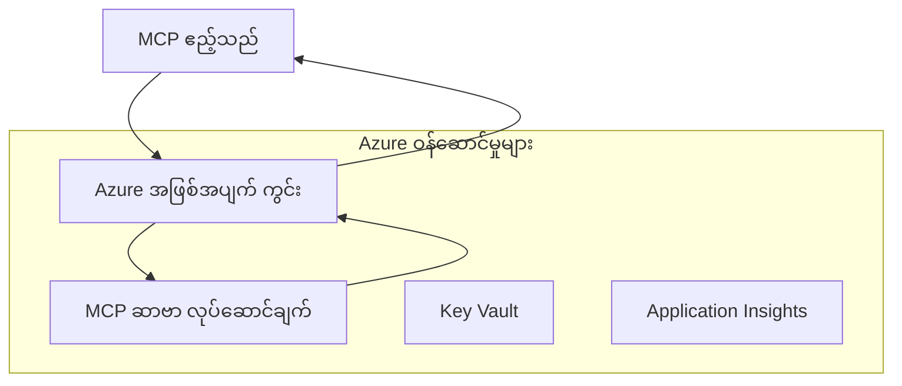
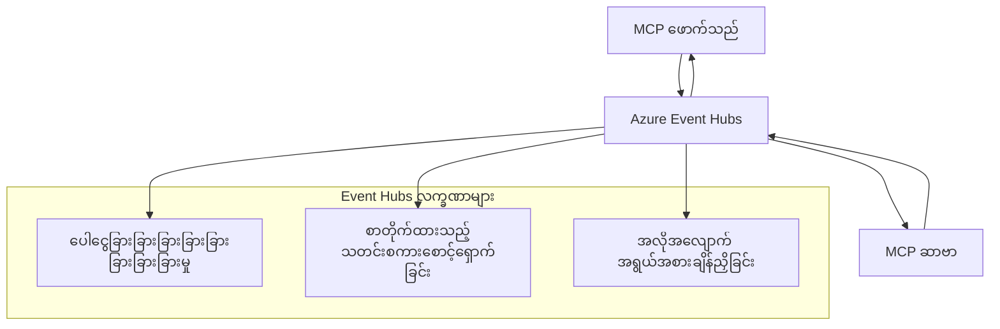

# MCP အထူးသတ်မှတ်ထားသော သယ်ယူပို့ဆောင်ရေးများ - အဆင့်မြင့် သက်ဆိုင်ရာ လမ်းညွှန်ချက်

Model Context Protocol (MCP) သည် သယ်ယူပို့ဆောင်ရေးနည်းဗျူဟာများတွင် အသုံးပြုသူအလိုက် ပြုပြင်နိုင်မှုကို ပေးသောကြောင့် အထူးသဖြင့် စီးပွားရေးလုပ်ငန်းပတ်ဝန်းကျင်များအတွက် ထူးခြားသော တပ်ဆင်မှုများကို ခွင့်ပြုသည်။ ဤအဆင့်မြင့် လမ်းညွှန်ချက်တွင် Azure Event Grid နှင့် Azure Event Hubs ကို အသုံးပြုထားပြီး ထိရောက်စွာ မြှင့်တင်နိုင်သော၊ cloud-native MCP ဖြေရှင်းမှုများ တည်ဆောက်ရာတွင် အထူးသဖြင့် ထူးခြားသည့် သယ်ယူပို့ဆောင်ရေးတပ်ဆင်မှုများကို လေ့လာပါမည်။

> **ရှေ့ဆက်ကြည့်ခြင်း**: ဤလမ်းညွှန်ချက်ကို **MCP Specification 2025-11-25** အပေါ် မူတည်၍ ရေးသားထားပြီး၊ ဆက်စပ်မှုအစဉ်အတိုင်းကို တစ်ခုချင်းစီသော session တစ်ခုစီအလိုက် ထိန်းသိမ်းရန်လိုအပ်သည် (အောက်ပါ Message Protocol ကို ကြည့်ပါ)။ `2026-07-28` ထုတ်ပြန်ချက် စမ်းသပ်သူသည် protocol-level session ကို အဖြတ်ကာ ပယ်ဖျက်ပြီး `Mcp-Method`/`Mcp-Name` ခေါင်းစဉ်များကို တောင်းဆိုချက်တစ်ထပ်စီအလိုက် လမ်းညွှန်ရန် နုတ်ထွက်ဝေဟင်များနှင့် ထူးခြား သယ်ယူပို့ဆောင်ရေးများ အသုံးပြုစေသည်။ [MCP တွင် ပြောင်းလဲနေသော အချက်များ: 2026-07-28 Release Candidate](../../01-CoreConcepts/mcp-2026-07-28-release-candidate.md) ကို ကြည့်ပါ။

## နိဒါန်း

MCP ၏ ပုံမှန်သယ်ယူပို့ဆောင်ရေးများ (stdio နှင့် HTTP streaming) သည် အများစု သုံးစွဲမှုများအတွက် သင့်လျော်သော်လည်း၊ စီးပွားရေးလုပ်ငန်းတွင် ဒေတာမြှင့်တင်မှု၊ ယုံကြည်စိတ်ချရမှု နှင့် လက်ရှိ cloud အခြေခံအဆောက်အအုံနှင့် ပေါင်းစည်းမှုအတွက် အထူးသတ်မှတ်ထားသည့် သယ်ယူပို့ဆောင်ရေးနည်းလမ်းများ လိုအပ်လေ့ရှိသည်။ ထူးခြားသယ်ယူပို့ဆောင်ရေးများသည် MCP ကို asynchronouse ဆက်သွယ်ရေး၊ event-driven ပုံစံများနှင့် ဖန်တီးထားသော အသေးစား စီမံခန့်ခွဲမှုများတွင် cloud-native မက်ဆေ့ခ်ျ စနစ်များကို အသုံးပြုနိုင်စေတာဖြစ်သည်။

ဤဟောပြောချက်တွင် အောက်ပါအချက်များပါဝင်သည် - MCP ၏ နောက်ဆုံးထွက် MCP သတ်မှတ်ချက် (2025-11-25), Azure မက်ဆေ့ခ်ျမင့်ဝန်ဆောင်မှုများ နှင့် စံပုံစံတည်ဆောက်နေသော စီးပွားရေးပေါင်းသင်းမှု ပုံစံများအပေါ် အခြေခံ၍ သယ်ယူပို့ဆောင်ရေးအဆင့်မြင့် တပ်ဆင်မှုများ။

### **MCP သယ်ယူပို့ဆောင်ရေးဖွဲ့စည်းပုံ**

**MCP သတ်မှတ်ချက် (2025-11-25) မှ:**

- **ပုံမှန်သယ်ယူပို့ဆောင်ရေးများ**: stdio (အကြံပြု), HTTP streaming (ခရံ့ရှားချက်အတွက်)
- **ထူးခြားသယ်ယူပို့ဆောင်ရေးများ**: MCP မက်ဆေ့ခ်ျ လဲလှယ်မှု လမ်းစဉ်ကို အကောင်အထည်ဖော်နိုင်သည့် သယ်ယူပို့ဆောင်ရေးဟာလုံးဝ
- **မက်ဆေ့ခ်ျ ပုံစံ**: MCP အထူးပိုင်းဆိုင်ရာ ရပ်တည်ချက်ဖြင့် JSON-RPC 2.0
- **နှစ်ဖက်စလုံး ဆက်သွယ်ရေး**: အကြောင်းကြားချက်များနှင့် တုံ့ပြန်ချက်များအတွက် အပြည့်အဝဆက်သွယ်နိုင်ရန်လိုအပ်သည်

## သင်ယူရမည့် ရည်မှန်းချက်များ

ဤအဆင့်မြင့် သင်ခန်းစာပြီးဆုံးပါက၊ သင်သည် အောက်ပါအရာများကို ပြုချက်လုပ်နိုင်မည်ဖြစ်သည်။

- **ထူးခြားသယ်ယူပို့ဆောင်ရေး လိုအပ်ချက်များကို သိရှိနားလည်ခြင်း**: MCP protocol ကို မည်သည့် သယ်ယူပို့ဆောင်ရေးအပေါ်မဆို လိုက်နာအောင် တပ်ဆင်ခြင်း
- **Azure Event Grid သယ်ယူပို့ဆောင်ရေး တည်ဆောက်ခြင်း**: Serverless မြှင့်တင်မှုအတွက် Azure Event Grid အသုံးပြုပြီး event-driven MCP ဆာဗာများ ဖန်တီးခြင်း
- **Azure Event Hubs သယ်ယူပို့ဆောင်ရေး တပ်ဆင်ခြင်း**: အချိန်အစစ်အမှန် ရောင်းချမှုအတွက် Azure Event Hubs အသုံးပြုသည့် မြှင့်တင်ထားသော MCP ဖြေရှင်းချက်များဒီဇိုင်းခြင်း
- **စီးပွားရေးပုံစံများအသုံးပြုခြင်း**: အခြေအနေရှိ Azure အဆောက်အအုံနှင့် လုံခြုံရေးမော်ဒယ်များနှင့် ထူးခြားသယ်ယူပို့ဆောင်ရေးများပေါင်းစည်းခြင်း
- **သယ်ယူပို့ဆောင်မှု ရေရှည်ယုံကြည်မှုများကို ကိုင်တွယ်ခြင်း**: စီးပွားရေးအခြေအနေများအတွက် မက်ဆေ့ခ်ျထိန်းသိမ်းမှု၊ စဉ်တန်း မရှိခြင်းနှင့် အမှားများကို ကိုင်တွယ်ခြင်းစနစ် တပ်ဆင်ခြင်း
- **ဆောင်ရွက်မှုမြှင့်တင်ခြင်း**: မူလအတိုင်း အရွယ်အစား၊ စောင့်ကြည့်မှုနှင့် ရေပမာဏ လိုအပ်ချက်များအတွက် သယ်ယူပို့ဆောင်ရေးဖြေရှင်းချက်များ ဒီဇိုင်းခြင်း

## **သယ်ယူပို့ဆောင်ရေး လိုအပ်ချက်များ**

### **MCP သတ်မှတ်ချက် (2025-11-25) မှ အဓိကလိုအပ်ချက်များ:**

```yaml
Message Protocol:
  format: "JSON-RPC 2.0 with MCP extensions"
  bidirectional: "Full duplex communication required"
  ordering: "Message ordering must be preserved per session"
  
Transport Layer:
  reliability: "Transport MUST handle connection failures gracefully"
  security: "Transport MUST support secure communication"
  identification: "Each session MUST have unique identifier"
  
Custom Transport:
  compliance: "MUST implement complete MCP message exchange"
  extensibility: "MAY add transport-specific features"
  interoperability: "MUST maintain protocol compatibility"
```

## **Azure Event Grid သယ်ယူပို့ဆောင်ရေး တပ်ဆင်မှု**

Azure Event Grid သည် serverless event routing ဝန်ဆောင်မှုဖြစ်ပြီး event-driven MCP ဖွဲ့စည်းပုံအတွက် သင့်လျော်သည်။ ဤတပ်ဆင်မှုက scalable နှင့် loosely-coupled MCP စနစ်များ ဖန်တီးရန် ပြသထားသည်။

### **ဖွဲ့စည်းပုံအနှစ်ချုပ်**



### **C# တပ်ဆင်မှု - Event Grid သယ်ယူပို့ဆောင်ရေး**

```csharp
using Azure.Messaging.EventGrid;
using Microsoft.Extensions.Azure;
using System.Text.Json;

public class EventGridMcpTransport : IMcpTransport
{
    private readonly EventGridPublisherClient _publisher;
    private readonly string _topicEndpoint;
    private readonly string _clientId;
    
    public EventGridMcpTransport(string topicEndpoint, string accessKey, string clientId)
    {
        _publisher = new EventGridPublisherClient(
            new Uri(topicEndpoint), 
            new AzureKeyCredential(accessKey));
        _topicEndpoint = topicEndpoint;
        _clientId = clientId;
    }
    
    public async Task SendMessageAsync(McpMessage message)
    {
        var eventGridEvent = new EventGridEvent(
            subject: $"mcp/{_clientId}",
            eventType: "MCP.MessageReceived",
            dataVersion: "1.0",
            data: JsonSerializer.Serialize(message))
        {
            Id = Guid.NewGuid().ToString(),
            EventTime = DateTimeOffset.UtcNow
        };
        
        await _publisher.SendEventAsync(eventGridEvent);
    }
    
    public async Task<McpMessage> ReceiveMessageAsync(CancellationToken cancellationToken)
    {
        // Event Grid is push-based, so implement webhook receiver
        // This would typically be handled by Azure Functions trigger
        throw new NotImplementedException("Use EventGridTrigger in Azure Functions");
    }
}

// Azure Function for receiving Event Grid events
[FunctionName("McpEventGridReceiver")]
public async Task<IActionResult> HandleEventGridMessage(
    [EventGridTrigger] EventGridEvent eventGridEvent,
    ILogger log)
{
    try
    {
        var mcpMessage = JsonSerializer.Deserialize<McpMessage>(
            eventGridEvent.Data.ToString());
        
        // Process MCP message
        var response = await _mcpServer.ProcessMessageAsync(mcpMessage);
        
        // Send response back via Event Grid
        await _transport.SendMessageAsync(response);
        
        return new OkResult();
    }
    catch (Exception ex)
    {
        log.LogError(ex, "Error processing Event Grid MCP message");
        return new BadRequestResult();
    }
}
```

### **TypeScript တပ်ဆင်မှု - Event Grid သယ်ယူပို့ဆောင်ရေး**

```typescript
import { EventGridPublisherClient, AzureKeyCredential } from "@azure/eventgrid";
import { McpTransport, McpMessage } from "./mcp-types";

export class EventGridMcpTransport implements McpTransport {
    private publisher: EventGridPublisherClient;
    private clientId: string;
    
    constructor(
        private topicEndpoint: string,
        private accessKey: string,
        clientId: string
    ) {
        this.publisher = new EventGridPublisherClient(
            topicEndpoint,
            new AzureKeyCredential(accessKey)
        );
        this.clientId = clientId;
    }
    
    async sendMessage(message: McpMessage): Promise<void> {
        const event = {
            id: crypto.randomUUID(),
            source: `mcp-client-${this.clientId}`,
            type: "MCP.MessageReceived",
            time: new Date(),
            data: message
        };
        
        await this.publisher.sendEvents([event]);
    }
    
    // Azure Functions ဖြင့် ပြုလုပ်သော အဖြစ်အပျက် အခြေပြု လက်ခံမှု
    onMessage(handler: (message: McpMessage) => Promise<void>): void {
        // အကောင်အထည် ဖော်မှုတွင် Azure Functions Event Grid trigger ကို အသုံးပြုမည်
        // webhook လက်ခံသူအတွက် တိုင်းတာချက် အင်တာဖေ့စ် ဖြစ်သည်
    }
}

// Azure Functions အကောင်အထည်ဖော်မှု
import { app, InvocationContext, EventGridEvent } from "@azure/functions";

app.eventGrid("mcpEventGridHandler", {
    handler: async (event: EventGridEvent, context: InvocationContext) => {
        try {
            const mcpMessage = event.data as McpMessage;
            
            // MCP မက်ဆေ့ခ်ျ ကို 처리 ပြုလုပ်ရန်
            const response = await mcpServer.processMessage(mcpMessage);
            
            // Event Grid မှတဆင့် တုံ့ပြန်ချက်ပို့ရန်
            await transport.sendMessage(response);
            
        } catch (error) {
            context.error("Error processing MCP message:", error);
            throw error;
        }
    }
});
```

### **Python တပ်ဆင်မှု - Event Grid သယ်ယူပို့ဆောင်ရေး**

```python
from azure.eventgrid import EventGridPublisherClient, EventGridEvent
from azure.core.credentials import AzureKeyCredential
import asyncio
import json
from typing import Callable, Optional
import uuid
from datetime import datetime

class EventGridMcpTransport:
    def __init__(self, topic_endpoint: str, access_key: str, client_id: str):
        self.client = EventGridPublisherClient(
            topic_endpoint, 
            AzureKeyCredential(access_key)
        )
        self.client_id = client_id
        self.message_handler: Optional[Callable] = None
    
    async def send_message(self, message: dict) -> None:
        """Send MCP message via Event Grid"""
        event = EventGridEvent(
            data=message,
            subject=f"mcp/{self.client_id}",
            event_type="MCP.MessageReceived",
            data_version="1.0"
        )
        
        await self.client.send(event)
    
    def on_message(self, handler: Callable[[dict], None]) -> None:
        """Register message handler for incoming events"""
        self.message_handler = handler

# Azure Functions အကောင်အထည်ဖော်ခြင်း
import azure.functions as func
import logging

def main(event: func.EventGridEvent) -> None:
    """Azure Functions Event Grid trigger for MCP messages"""
    try:
        # Event Grid အဖြစ် MCP စာတိုက်ကို ဖော်ထုတ်ပါ
        mcp_message = json.loads(event.get_body().decode('utf-8'))
        
        # MCP စာတိုက်ကို လုပ်ဆောင်ပါ
        response = process_mcp_message(mcp_message)
        
        # Event Grid မှတဆင့် ပြန်လည်တုံ့ပြန်မှု ပို့ပါ
        # (အကောင်အထည်ဖော်မှုသည် အထွက် Event Grid client အသစ်ဖန်တီးမည်)
        
    except Exception as e:
        logging.error(f"Error processing MCP Event Grid message: {e}")
        raise
```

## **Azure Event Hubs သယ်ယူပို့ဆောင်ရေး တပ်ဆင်မှု**

Azure Event Hubs သည် သက်ິ္တောင့်လျှောက်သော, အချိန်အစစ်အမှန် မက်ဆေ့ခ်ျများကို တင်ပို့ရာတွင် မကျင့်သုံးထားမှု၊ မြင့်မားသော မက်ဆေ့ခ်ျ အရေအတွက်စီစဉ်မှုများအတွက် သင့်လျော်သော အသွင်ဓါတ်ပေးသည်။

### **ဖွဲ့စည်းပုံအနှစ်ချုပ်**



### **C# တပ်ဆင်မှု - Event Hubs သယ်ယူပို့ဆောင်ရေး**

```csharp
using Azure.Messaging.EventHubs;
using Azure.Messaging.EventHubs.Producer;
using Azure.Messaging.EventHubs.Consumer;
using System.Text;

public class EventHubsMcpTransport : IMcpTransport, IDisposable
{
    private readonly EventHubProducerClient _producer;
    private readonly EventHubConsumerClient _consumer;
    private readonly string _consumerGroup;
    private readonly CancellationTokenSource _cancellationTokenSource;
    
    public EventHubsMcpTransport(
        string connectionString, 
        string eventHubName,
        string consumerGroup = "$Default")
    {
        _producer = new EventHubProducerClient(connectionString, eventHubName);
        _consumer = new EventHubConsumerClient(
            consumerGroup, 
            connectionString, 
            eventHubName);
        _consumerGroup = consumerGroup;
        _cancellationTokenSource = new CancellationTokenSource();
    }
    
    public async Task SendMessageAsync(McpMessage message)
    {
        var messageBody = JsonSerializer.Serialize(message);
        var eventData = new EventData(Encoding.UTF8.GetBytes(messageBody));
        
        // Add MCP-specific properties
        eventData.Properties.Add("MessageType", message.Method ?? "response");
        eventData.Properties.Add("MessageId", message.Id);
        eventData.Properties.Add("Timestamp", DateTimeOffset.UtcNow);
        
        await _producer.SendAsync(new[] { eventData });
    }
    
    public async Task StartReceivingAsync(
        Func<McpMessage, Task> messageHandler)
    {
        await foreach (PartitionEvent partitionEvent in _consumer.ReadEventsAsync(
            _cancellationTokenSource.Token))
        {
            try
            {
                var messageBody = Encoding.UTF8.GetString(
                    partitionEvent.Data.EventBody.ToArray());
                var mcpMessage = JsonSerializer.Deserialize<McpMessage>(messageBody);
                
                await messageHandler(mcpMessage);
            }
            catch (Exception ex)
            {
                // Handle deserialization or processing errors
                Console.WriteLine($"Error processing message: {ex.Message}");
            }
        }
    }
    
    public void Dispose()
    {
        _cancellationTokenSource?.Cancel();
        _producer?.DisposeAsync().AsTask().Wait();
        _consumer?.DisposeAsync().AsTask().Wait();
        _cancellationTokenSource?.Dispose();
    }
}
```

### **TypeScript တပ်ဆင်မှု - Event Hubs သယ်ယူပို့ဆောင်ရေး**

```typescript
import { 
    EventHubProducerClient, 
    EventHubConsumerClient, 
    EventData 
} from "@azure/event-hubs";

export class EventHubsMcpTransport implements McpTransport {
    private producer: EventHubProducerClient;
    private consumer: EventHubConsumerClient;
    private isReceiving = false;
    
    constructor(
        private connectionString: string,
        private eventHubName: string,
        private consumerGroup: string = "$Default"
    ) {
        this.producer = new EventHubProducerClient(
            connectionString, 
            eventHubName
        );
        this.consumer = new EventHubConsumerClient(
            consumerGroup,
            connectionString,
            eventHubName
        );
    }
    
    async sendMessage(message: McpMessage): Promise<void> {
        const eventData: EventData = {
            body: JSON.stringify(message),
            properties: {
                messageType: message.method || "response",
                messageId: message.id,
                timestamp: new Date().toISOString()
            }
        };
        
        await this.producer.sendBatch([eventData]);
    }
    
    async startReceiving(
        messageHandler: (message: McpMessage) => Promise<void>
    ): Promise<void> {
        if (this.isReceiving) return;
        
        this.isReceiving = true;
        
        const subscription = this.consumer.subscribe({
            processEvents: async (events, context) => {
                for (const event of events) {
                    try {
                        const messageBody = event.body as string;
                        const mcpMessage: McpMessage = JSON.parse(messageBody);
                        
                        await messageHandler(mcpMessage);
                        
                        // အနည်းဆုံးတစ်ကြိမ်ပေးပို့မှုအတွက် checkpoint ကိုအပ်ဒိတ်လုပ်ပါ
                        await context.updateCheckpoint(event);
                    } catch (error) {
                        console.error("Error processing Event Hubs message:", error);
                    }
                }
            },
            processError: async (err, context) => {
                console.error("Event Hubs error:", err);
            }
        });
    }
    
    async close(): Promise<void> {
        this.isReceiving = false;
        await this.producer.close();
        await this.consumer.close();
    }
}
```

### **Python တပ်ဆင်မှု - Event Hubs သယ်ယူပို့ဆောင်ရေး**

```python
from azure.eventhub import EventHubProducerClient, EventHubConsumerClient
from azure.eventhub import EventData
import json
import asyncio
from typing import Callable, Dict, Any
import logging

class EventHubsMcpTransport:
    def __init__(
        self, 
        connection_string: str, 
        eventhub_name: str,
        consumer_group: str = "$Default"
    ):
        self.producer = EventHubProducerClient.from_connection_string(
            connection_string, 
            eventhub_name=eventhub_name
        )
        self.consumer = EventHubConsumerClient.from_connection_string(
            connection_string,
            consumer_group=consumer_group,
            eventhub_name=eventhub_name
        )
        self.is_receiving = False
    
    async def send_message(self, message: Dict[str, Any]) -> None:
        """Send MCP message via Event Hubs"""
        event_data = EventData(json.dumps(message))
        
        # MCP-အထူးပစ္စည်းများ ထည့်ပါ
        event_data.properties = {
            "messageType": message.get("method", "response"),
            "messageId": message.get("id"),
            "timestamp": "2025-01-14T10:30:00Z"  # အမှန်တည့်တဲ့ အချိန်မူတည်ချက်ကို အသုံးပြုပါ
        }
        
        async with self.producer:
            event_data_batch = await self.producer.create_batch()
            event_data_batch.add(event_data)
            await self.producer.send_batch(event_data_batch)
    
    async def start_receiving(
        self, 
        message_handler: Callable[[Dict[str, Any]], None]
    ) -> None:
        """Start receiving MCP messages from Event Hubs"""
        if self.is_receiving:
            return
        
        self.is_receiving = True
        
        async with self.consumer:
            await self.consumer.receive(
                on_event=self._on_event_received(message_handler),
                starting_position="-1"  # စတင်မှုအဖြစ် မစတင်ခင်မှစတင်ပါ
            )
    
    def _on_event_received(self, handler: Callable):
        """Internal event handler wrapper"""
        async def handle_event(partition_context, event):
            try:
                # Event Hubs အဖြစ်မှ MCP စာတိုက်ကို ဖြေကြားပါ
                message_body = event.body_as_str(encoding='UTF-8')
                mcp_message = json.loads(message_body)
                
                # MCP စာတိုက်ကို ဆောင်ရွက်ပါ
                await handler(mcp_message)
                
                # အနည်းဆုံးတစ်ကြိမ်ပို့ဆောင်မှုအတွက် စစ်ဆေးချက်ကို ပြောင်းလဲပါ
                await partition_context.update_checkpoint(event)
                
            except Exception as e:
                logging.error(f"Error processing Event Hubs message: {e}")
        
        return handle_event
    
    async def close(self) -> None:
        """Clean up transport resources"""
        self.is_receiving = False
        await self.producer.close()
        await self.consumer.close()
```

## **အဆင့်မြင့် သယ်ယူပို့ဆောင်ရေး ပုံစံများ**

### **မက်ဆေ့ခ်ျ တည်မြဲမှုနှင့် ယုံကြည်စိတ်ချရမှု**

```csharp
// Implementing message durability with retry logic
public class ReliableTransportWrapper : IMcpTransport
{
    private readonly IMcpTransport _innerTransport;
    private readonly RetryPolicy _retryPolicy;
    
    public async Task SendMessageAsync(McpMessage message)
    {
        await _retryPolicy.ExecuteAsync(async () =>
        {
            try
            {
                await _innerTransport.SendMessageAsync(message);
            }
            catch (TransportException ex) when (ex.IsRetryable)
            {
                // Log and retry
                throw;
            }
        });
    }
}
```

### **သယ်ယူပို့ဆောင်ရေး လုံခြုံရေး ပေါင်းစည်းမှု**

```csharp
// Integrating Azure Key Vault for transport security
public class SecureTransportFactory
{
    private readonly SecretClient _keyVaultClient;
    
    public async Task<IMcpTransport> CreateEventGridTransportAsync()
    {
        var accessKey = await _keyVaultClient.GetSecretAsync("EventGridAccessKey");
        var topicEndpoint = await _keyVaultClient.GetSecretAsync("EventGridTopic");
        
        return new EventGridMcpTransport(
            topicEndpoint.Value.Value,
            accessKey.Value.Value,
            Environment.MachineName
        );
    }
}
```

### **သယ်ယူပို့ဆောင်ရေး စောင့်ကြည့်ခြင်းနှင့် တွေ့မြင်နိုင်မှု**

```csharp
// Adding telemetry to custom transports
public class ObservableTransport : IMcpTransport
{
    private readonly IMcpTransport _transport;
    private readonly ILogger _logger;
    private readonly TelemetryClient _telemetryClient;
    
    public async Task SendMessageAsync(McpMessage message)
    {
        using var activity = Activity.StartActivity("MCP.Transport.Send");
        activity?.SetTag("transport.type", "EventGrid");
        activity?.SetTag("message.method", message.Method);
        
        var stopwatch = Stopwatch.StartNew();
        
        try
        {
            await _transport.SendMessageAsync(message);
            
            _telemetryClient.TrackDependency(
                "EventGrid",
                "SendMessage",
                DateTime.UtcNow.Subtract(stopwatch.Elapsed),
                stopwatch.Elapsed,
                true
            );
        }
        catch (Exception ex)
        {
            _telemetryClient.TrackException(ex);
            throw;
        }
    }
}
```

## **စီးပွားရေး ပေါင်းသင်းမှု အခြေအနေများ**

### **အခြေအနေ ၁: MCP ဖြန့်ဝေ စီမံခန့်ခွဲမှု**

Azure Event Grid ကို အသုံးပြု၍ MCP တောင်းဆိုချက်များကို အနည်းဆုံး node အနည်းမဲ့ ပိုင်းခြား ဖြန့်ဝေခြင်း:

```yaml
Architecture:
  - MCP Client sends requests to Event Grid topic
  - Multiple Azure Functions subscribe to process different tool types
  - Results aggregated and returned via separate response topic
  
Benefits:
  - Horizontal scaling based on message volume
  - Fault tolerance through redundant processors
  - Cost optimization with serverless compute
```

### **အခြေအနေ ၂: အချိန်အစစ်အမှန် MCP စတ্রীမီးင်း**

Azure Event Hubs ကို အသုံးပြု၍ မကြာခဏ ဖြစ်သော MCP ဆက်သွယ်မှုများ:

```yaml
Architecture:
  - MCP Client streams continuous requests via Event Hubs
  - Stream Analytics processes and routes messages
  - Multiple consumers handle different aspect of processing
  
Benefits:
  - Low latency for real-time scenarios
  - High throughput for batch processing
  - Built-in partitioning for parallel processing
```

### **အခြေအနေ ၃: ဟိုက်ဘရီသယ်ယူပို့ဆောင်ရေး ဖွဲ့စည်းပုံ**

သုံးစွဲမှုအမျိုးမျိုးအတွက် သယ်ယူပို့ဆောင်ရေး အမျိုးမျိုး ပေါင်းစပ်ခြင်း:

```csharp
public class HybridMcpTransport : IMcpTransport
{
    private readonly IMcpTransport _realtimeTransport; // Event Hubs
    private readonly IMcpTransport _batchTransport;    // Event Grid
    private readonly IMcpTransport _fallbackTransport; // HTTP Streaming
    
    public async Task SendMessageAsync(McpMessage message)
    {
        // Route based on message characteristics
        var transport = message.Method switch
        {
            "tools/call" when IsRealtime(message) => _realtimeTransport,
            "resources/read" when IsBatch(message) => _batchTransport,
            _ => _fallbackTransport
        };
        
        await transport.SendMessageAsync(message);
    }
}
```

## **ဆောင်ရွက်မှု မြှင့်တင်ခြင်း**

### **Event Grid အတွက် မက်ဆေ့ခ်ျ ဗျူဟာပုံစံ**

```csharp
public class BatchingEventGridTransport : IMcpTransport
{
    private readonly List<McpMessage> _messageBuffer = new();
    private readonly Timer _flushTimer;
    private const int MaxBatchSize = 100;
    
    public async Task SendMessageAsync(McpMessage message)
    {
        lock (_messageBuffer)
        {
            _messageBuffer.Add(message);
            
            if (_messageBuffer.Count >= MaxBatchSize)
            {
                _ = Task.Run(FlushMessages);
            }
        }
    }
    
    private async Task FlushMessages()
    {
        List<McpMessage> toSend;
        lock (_messageBuffer)
        {
            toSend = new List<McpMessage>(_messageBuffer);
            _messageBuffer.Clear();
        }
        
        if (toSend.Any())
        {
            var events = toSend.Select(CreateEventGridEvent);
            await _publisher.SendEventsAsync(events);
        }
    }
}
```

### **Event Hubs အတွက် ပိုင်းခြားမှု မူဝါဒ**

```csharp
public class PartitionedEventHubsTransport : IMcpTransport
{
    public async Task SendMessageAsync(McpMessage message)
    {
        // Partition by client ID for session affinity
        var partitionKey = ExtractClientId(message);
        
        var eventData = new EventData(JsonSerializer.SerializeToUtf8Bytes(message))
        {
            PartitionKey = partitionKey
        };
        
        await _producer.SendAsync(new[] { eventData });
    }
}
```

## **ထူးခြားသယ်ယူပို့ဆောင်ရေး များ စမ်းသပ်ခြင်း**

### **Test Doubles ဖြင့် ယူနစ်စမ်းသပ်ခြင်း**

```csharp
[Test]
public async Task EventGridTransport_SendMessage_PublishesCorrectEvent()
{
    // Arrange
    var mockPublisher = new Mock<EventGridPublisherClient>();
    var transport = new EventGridMcpTransport(mockPublisher.Object);
    var message = new McpMessage { Method = "tools/list", Id = "test-123" };
    
    // Act
    await transport.SendMessageAsync(message);
    
    // Assert
    mockPublisher.Verify(
        x => x.SendEventAsync(
            It.Is<EventGridEvent>(e => 
                e.EventType == "MCP.MessageReceived" &&
                e.Subject == "mcp/test-client"
            )
        ),
        Times.Once
    );
}
```

### **Azure Test Containers ဖြင့် ပေါင်းစပ်စမ်းသပ်ခြင်း**

```csharp
[Test]
public async Task EventHubsTransport_IntegrationTest()
{
    // Using Testcontainers for integration testing
    var eventHubsContainer = new EventHubsContainer()
        .WithEventHub("test-hub");
    
    await eventHubsContainer.StartAsync();
    
    var transport = new EventHubsMcpTransport(
        eventHubsContainer.GetConnectionString(),
        "test-hub"
    );
    
    // Test message round-trip
    var sentMessage = new McpMessage { Method = "test", Id = "123" };
    McpMessage receivedMessage = null;
    
    await transport.StartReceivingAsync(msg => {
        receivedMessage = msg;
        return Task.CompletedTask;
    });
    
    await transport.SendMessageAsync(sentMessage);
    await Task.Delay(1000); // Allow for message processing
    
    Assert.That(receivedMessage?.Id, Is.EqualTo("123"));
}
```

## **အကောင်းဆုံး လမ်းညွှန်ချက်များနှင့် ညွှန်ကြားချက်များ**

### **သယ်ယူပို့ဆောင်ရေး ဒီဇိုင်းသဘောထားများ**

1. **Idempotency**: မက်ဆေ့ခ်ျကို ထပ်တူထပ်မံ လုပ်ဆောင်ရခြင်းမှ ကာကွယ်ရန် idempotent အဖြစ်သတ်မှတ်ရန်
2. **အမှား ကိုင်တွယ်မှု**: အပြည့်အစုံ အမှား ကိုင်တွယ်မှုနှင့် dead letter queue များ တပ်ဆင်ရန်
3. **စောင့်ကြည့်မှု**: အသေးစိတ် telemetry နှင့် ကျန်းမာရေး စစ်ဆေးမှုများ ထည့်ရန်
4. **လုံခြုံမှု**: managed identities နှင့် အနည်းဆုံး ခွင့်ပြုချက်များ အသုံးပြုရန်
5. **ဆောင်ရွက်မှု**: သင့်ဘာသာ သတ်မှတ်ထားသော စောင့်ကြည့်မှု နှင့် ရေပမာဏလိုအပ်ချက်များအတွက် ဒီဇိုင်းဆွဲရန်

### **Azure-အထူး အကြံပြုချက်များ**

1. **Managed Identity အသုံးပြုခြင်း**: ထုတ်လုပ်မှုတွင် ချိတ်ဆက်မှုကြိုးများ မသုံးရန်
2. **Circuit Breakers တပ်ဆင်ခြင်း**: Azure ဝန်ဆောင်မှု မရရှိနိုင်မှုများမှ ကာကွယ်ရန်
3. **ကုန်ကျစရိတ် စောင့်ကြည့်ခြင်း**: မက်ဆေ့ခ်ျအရေအတွက်နှင့် ဆောင်ရွက်မှုကုန်ကျစရိတ် များကို မှတ်တမ်းတင်ရန်
4. **အရွယ်အစားအတွက် စီမံချက် ပြုလုပ်ခြင်း**: ပိုင်းခြားမှုနှင့် မြှင့်တင်မှု မူဝါဒများကို မကြာခင်က စီစဉ်ရန်
5. **ပြည့်စုံစမ်းသပ်မှု**: Azure DevTest Labs ကို အသုံးပြု၍ စမ်းသပ်မှု အပြည့်အစုံ ပြုလုပ်ရန်

## **သုံးသပ်ချက်**

ထူးခြား MCP သယ်ယူပို့ဆောင်ရေးများသည် Azure ၏ မက်ဆေ့ချ်ဝန်ဆောင်မှုများအား အသုံးချပြီး စွမ်းအားအပြည့်အ၀ရှိသော စီးပွားရေးအခြေအနေများကို ဖြစ်ထွန်းစေသည်။ Event Grid သို့မဟုတ် Event Hubs သယ်ယူပို့ဆောင်ရေးများတပ်ဆင်ခြင်းဖြင့် သင်သည် ဆက်လက်တည်ဆောက်ရန် လွယ်ကူပြီး ယုံကြည်စိတ်ချရသော MCP ဖြေရှင်းမှုများကို လက်ရှိ Azure အခြေခံအဆောက်အအုံနှင့် ပေါင်းစည်းနိုင်ပါသည်။

ဥပမာများအနေဖြင့် MCP protocol လိုက်နာမှုနှင့် Azure မှ ထုတ်ပြန်သည့် အကောင်းဆုံး လုပ်ထုံးလုပ်နည်းများကို လိုက်နာကာ ထူးခြားသယ်ယူပို့ဆောင်ရေးများ အကောင်အထည်ဖော်သည့် ထုတ်လုပ်မှုအဆင်သင့် ပုံစံများကို ပြသသည်။

## **ထပ်ဆောင်းရင်းမြစ်များ**

- [MCP Specification 2025-11-25](https://modelcontextprotocol.io/specification/2025-11-25/)
- [Azure Event Grid Documentation](https://docs.microsoft.com/azure/event-grid/)
- [Azure Event Hubs Documentation](https://docs.microsoft.com/azure/event-hubs/)
- [Azure Functions Event Grid Trigger](https://docs.microsoft.com/azure/azure-functions/functions-bindings-event-grid)
- [Azure SDK for .NET](https://github.com/Azure/azure-sdk-for-net)
- [Azure SDK for TypeScript](https://github.com/Azure/azure-sdk-for-js)
- [Azure SDK for Python](https://github.com/Azure/azure-sdk-for-python)

---

> *ဤလမ်းညွှန်ချက်သည် ထုတ်လုပ်မှုအဆင့် MCP စနစ်များအတွက် အကောင်အထည်ဖော်သည့် ပုံစံများအပေါ် အာရုံစိုက်ထားသည်။ သယ်ယူပို့ဆောင်ရေး တပ်ဆင်မှုများကို သင့်လိုအပ်ချက်နှင့် Azure ဝန်ဆောင်မှု ကန့်သတ်ချက်များနှင့် ကိုက်ညီမှုရှိကြောင်း အမြဲစစ်ဆေးပါ။*
> **ပုံမှန်အခြေနေ**: ဤလမ်းညွှန်ချက်မှာ [MCP Specification 2025-11-25](https://modelcontextprotocol.io/specification/2025-11-25/) ၏ သယ်ယူပို့ဆောင်ရေး လိုအပ်ချက်များနှင့် စီးပွားရေးပတ်ဝန်းကျင်အတွက် အဆင့်မြင့် သယ်ယူပို့ဆောင်ရေးပုံစံများကို ပြသသည်။


## နောက်တွင်ဘာရှိနေလဲ
- [6. အသိုင်းအဝိုင်း ပံ့ပိုးမှုများ](../../06-CommunityContributions/README.md)

---

<!-- CO-OP TRANSLATOR DISCLAIMER START -->
**ပြောကြားချက်**
ဤစာတမ်းကို AI ဘာသာပြန်ဝန်ဆောင်မှု [Co-op Translator](https://github.com/Azure/co-op-translator) အသုံးပြု၍ ဘာသာပြန်ထားပါသည်။ ကျွန်ုပ်တို့သည် တိကျမှန်ကန်မှုအတွက် ကြိုးပမ်းနေသော်လည်း၊ စက်ကိရိယာဘာသာပြန်ခြင်းများတွင် အမှားများ သို့မဟုတ် မှားယွင်းချက်များ ပါဝင်နိုင်ကြောင်း သတိပြုပါရန် လိုအပ်ပါသည်။ မူလစာတမ်းကို မူရင်းဘာသာဖြင့်သာ ယုံကြည်စိတ်ချရသော အချက်အလက်အဖြစ် သတ်မှတ်သင့်သည်။ အရေးကြီးသည့် သတင်းအချက်အလက်များအတွက် ပရော်ဖက်ရှင်နယ် လူသားဘာသာပြန်သူဝန်ဆောင်မှုကို အကြံပြုပါသည်။ ဤဘာသာပြန်ချက်ကို အသုံးပြုခြင်းမှ ဖြစ်ပေါ်လာသော နားလည်မှုကွာခြားမှုများ သို့မဟုတ် မမှန်ကန်သော အသုံးပြုမှုများအတွက် ကျွန်ုပ်တို့ တာဝန်မခံပါ။
<!-- CO-OP TRANSLATOR DISCLAIMER END -->