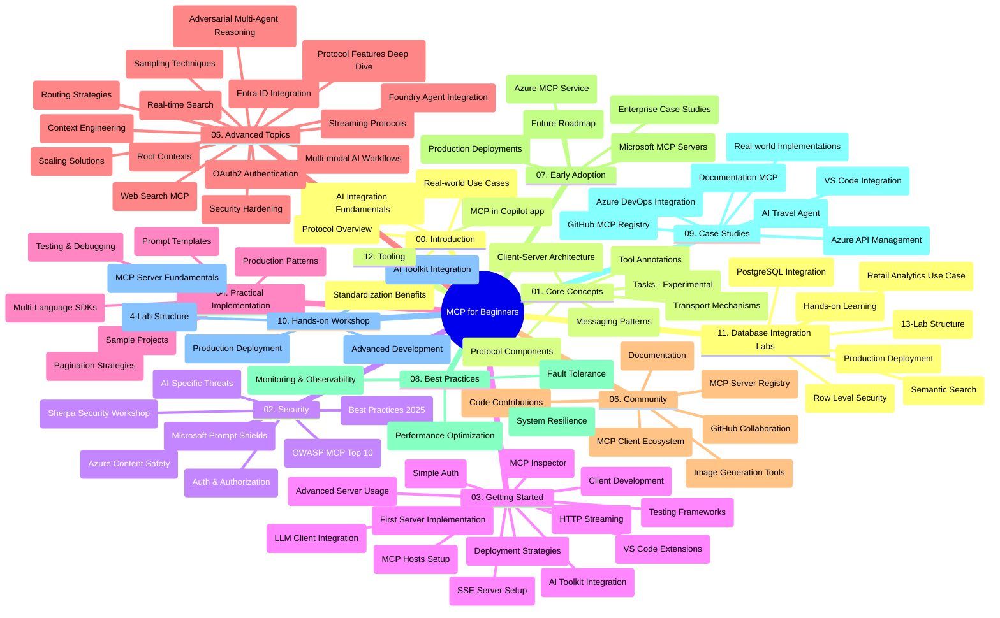

# စတင်သင်ယူသူများအတွက် Model Context Protocol (MCP) - သင်ယူလမ်းညွှန်

"စတင်သင်ယူသူများအတွက် Model Context Protocol (MCP)" သင်ရိုးညွှန်းတမ်းအတွက် repository သည် တည်ဆောက်မှုနှင့် အကြောင်းအရာ ကြည့်ရှုသုံးသပ်ချက်ကို ပေးသည်။ ဤလမ်းညွှန်ကို အသုံးပြု၍ repository ကို ထိရောက်စွာ ရှာဖွေကာ လူမှုရင်းမြစ်များကို အများဆုံးအသုံးချနိုင်ပါစေ။

## Repository အကျဉ်းချုပ်

Model Context Protocol (MCP) သည် AI မော်ဒယ်များနှင့် client application များအကြား ဆက်သွယ်ဆောင်ရွက်မှုအတွက် စံပြစနစ်တစ်ခုဖြစ်သည်။ အစပိုင်းတွင် Anthropic မှ ဖန်တီးခဲ့ပြီး ယခုတွင် MCP ရဲ့ ပိုမိုထွန်းကားသော ကွန်ယူနစ်တီမှ တရားဝင် GitHub အဖွဲ့အစည်းမှ ထိန်းသိမ်းထုတ်ပြန်နေသည်။ ဤ repository သည် AI တီထွင်သူများ၊ စနစ်ပိုင်ဆိုင်သူများနှင့် ဆော့ဖ်ဝဲအင်ဂျင်နီယာများအတွက် C#, Java, JavaScript, Python နှင့် TypeScript တို့ဖြင့် လက်တွေ့ ကိုးဒ်နမူနာများပါ ရှိသော ပြည့်စုံသော သင်ရိုးညွှန်းတမ်း တစ်ခုပါဝင်သည်။

## Visual Curriculum Map

## Repository တည်ဆောက်မှု

Repository တွင် MCP ၏ မတူကွဲပြားသော အချက်များအား လူမူဆိုင်ရာ/ပိုင်းခြား  တဆင့်ခွဲကာ ၁၂ ခုသော အဓိက အပိုင်းများ ပါရှိသည်။

1. **နိဒါန်း (00-Introduction/)**
   - Model Context Protocol ၏ အကျဉ်းချုပ်
   - AI pipeline များတွင် စံကျသောအရေးကြီးမှု
   - လက်တွေ့သုံးပြီးမှုနှင့် အကျိုးကျေးဇူးများ

2. **အခြေခံအယူအဆများ (01-CoreConcepts/)**
   - Client-server ဖွဲ့စည်းမှု
   - အဓိက protocol အစိတ်အပိုင်းများ
   - MCP တွင် စနစ်ရောနှောသည့် ပုံစံများ
   - ရှေ့ဆက်ကြည့်ခြင်းနှင့် အရောက်လမ်းညွန် - [MCP တွင် ပြောင်းလဲနေသည့်အချက်များ: ၂၀၂၆-၀၇-၂၈ ရုပ်သံ Candidate](./01-CoreConcepts/mcp-2026-07-28-release-candidate.md) — Stateless protocol core, Extensions framework နှင့် Roots/Sampling/Logging များ အနာဂတ် spesification မှာ ရှောင်ထွက်ရန် မျှော်လင့်ချက်များ

3. **လုံခြုံရေး (02-Security/)**
   - MCP အခြေပြု စနစ်များတွင် လုံခြုံရေး အန္တရာယ်များ
   - လုံခြုံရေး အသုံးချမှုများအတွက် အကောင်းဆုံးနည်းလမ်းများ
   - အတည်ပြုခြင်းနှင့် အာဏာပေးမှု နည်းဗေဒများ
   - **လုံခြုံရေး လက်တွေ့စာတမ်း အသီးသီး**:
     - MCP Security Best Practices 2025
     - Azure Content Safety Implementation Guide
     - MCP Security Controls and Techniques
     - MCP Best Practices Quick Reference
   - **အဓိက လုံခြုံရေး ခေါင်းစဉ်များ**:
     - Prompt injection နှင့် tool poisoning တိုက်ခိုက်မှုများ
     - Session hijacking နှင့် confused deputy ပြဿနာများ
     - Token passthrough အားနည်းချက်များ
     - ဘယ်လိုရာဇဝတ်မှုများ နှင့် လက်ဝါးကွာခြင်းများ
     - AI အစိတ်အပိုင်းများအတွက် Supply chain security
     - Microsoft Prompt Shields ပေါင်းစပ်မှု

4. **စတင်လေ့လာခြင်း (03-GettingStarted/)**
   - ပတ်ဝန်းကျင် တပ်ဆင်မှုနှင့် အတည်ပြုခြင်း
   - အခြေခံ MCP စာServer နှင့် Client စတင်ဖန်တီးခြင်း
   - ရှိပြီးသား application များနှင့် ပေါင်းစပ်ခြင်း
   - အပိုင်းများမှာ ပါဝင်သည်:
     - ပထမဆုံး server ဖန်တီးခြင်း
     - Client တီထွင်ခြင်း
     - LLM client ပေါင်းစည်းခြင်း
     - VS Code ပေါင်းစည်းခြင်း
     - Server-Sent Events (SSE) server
     - အဆင့်မြင့် server အသုံးပြုမှု
     - HTTP streaming
     - AI Toolkit ပေါင်းစည်းခြင်း
     - စမ်းသပ်မှုနည်းလမ်းများ
     - မိတ်ဆက်ရာတွင် အသုံးပြုမှုလမ်းညွှန်ချက်များ

5. **လက်တွေ့ အကောင်အထည်ဖော်ခြင်း (04-PracticalImplementation/)**
   - မတူညီသော programming language များဖြင့် SDK အသုံးပြုပုံ
   - အမှားရှာဖွေရေး၊ စမ်းသပ်ခြင်း၊ အတည်ပြုခြင်းနည်းပညာများ
   - ပြန်အသုံးပြုနိုင်သော prompt template များနှင့် workflow များဖန်တီးခြင်း
   - လုပ်ငန်းခွင်နမူနာများနှင့် အကောင်အထည်ဖော်မှု ဥပမာများ

6. **အဆင့်မြင့် ခေါင်းစဉ်များ (05-AdvancedTopics/)**
   - Context engineering နည်းပညာများ
   - Foundry agent ပေါင်းစပ်ခြင်း
   - Multi-modal AI workflow များ
   - OAuth2 အတည်ပြုမှု စမ်းသပ်ရန်
   - တိုက်ရိုက်ရှာဖွေရေး
   - တိုက်ရိုက် စတီးရီမင်း
   - Root context များ အကောင်အထည်ဖော်ခြင်း
   - Routing နည်းဗေဒများ
   - Sampling နည်းလမ်းများ
   - Scale ပုံစံများ
   - လုံခြုံရေးစဉ်းစားချက်များ
   - Entra ID လုံခြုံရေး ပေါင်းစပ်ခြင်း
   - web search ပေါင်းစည်းခြင်း
   - အန္တရာယ်ရှိသော multi-agent reasoning (debate pattern များ)

7. **Community ဆန်လျောက်မှုများ (06-CommunityContributions/)**
   - ကိုးဒ်နှင့် စာတမ်း ထည့်သွင်းပုံ
   - GitHub မှတဆင့် ပူးပေါင်းဆောင်ရွက်ခြင်း
   - လူမှုဒေသကျိန်းပိုင်း ဆန်းသစ်တိုးတက်မှုများနှင့် တုံ့ပြန်မှုများ
   - အမျိုးမျိုးသော MCP client များ အသုံးပြုခြင်း (Claude Desktop, Cline, VSCode)
   - အထင်ကရ MCP server များနှင့် အမြုပ်ပုံစံ ပေါင်းစပ်ဆောင်ရွက်ခြင်း

8. **အစောပိုင်း အသုံးချမှုမှ သင်ခန်းစာများ (07-LessonsfromEarlyAdoption/)**
   - အမှန်တန်း လုပ်ငန်းနယ်ပယ်တွင် အကောင်အထည်ဖော်မှုများ နှင့် အောင်မြင်မှုများ
   - MCP အခြေပြုဖြေရှင်းနည်းများ ဖန်တီးခြင်းနှင့် တပ်ဆင်ခြင်း
   - မြင်သာမှုနှင့် အနာဂတ်လမ်းပြ
   - **Microsoft MCP Server များ လမ်းညွှန်ချက်**: ထုတ်လုပ်မှုအဆင့် အသင့်ရှိသော Microsoft MCP server ၁၀ မျိုး၏ အပြည့်အစုံ လမ်းညွှန်မှု - 
     - Microsoft Learn Docs MCP Server
     - Azure MCP Server (ဆာဗာတပ်ဆင်မှု အတွက် အထူးပြု ချိတ်ဆက်သူ ၁၅+)
     - GitHub MCP Server
     - Azure DevOps MCP Server
     - MarkItDown MCP Server
     - SQL Server MCP Server
     - Playwright MCP Server
     - Dev Box MCP Server
     - Microsoft Foundry MCP Server
     - Microsoft 365 Agents Toolkit MCP Server

9. **အကောင်းဆုံးသော လုပ်သုံးနည်းများ (08-BestPractices/)**
   - စွမ်းဆောင်ရည် မြှင့်တင်ခြင်းနှင့် တိုးတက်မှု လုပ်ဆောင်မှုများ
   - အမှားတားဆီးနိုင်သော MCP စနစ်များ ဒီဇိုင်းဆွဲခြင်း
   - စမ်းသပ်ခြင်းနှင့် သဲလွန်ခြင်း များအတွက် နည်းဗေဒများ

10. **ဖြစ်ရပ်လေ့လာမှုများ (09-CaseStudy/)**
    - MCP ၏ အမျိုးမျိုးသော စကားဝိုင်းများတွင် အသုံးပြုနိုင်မှု ကို အသေးစိတ် ချပြထားသော စုံလင်သော ဖြစ်ရပ်လေ့လာမှု ခုနှစ်ခု
    - **Azure AI Travel Agents**: Azure OpenAI နှင့် AI Search နှစ်ခုလုံး အများပြည်သူ multi-agent စီမံခန့်ခွဲခြင်း
    - **Azure DevOps ပေါင်းစပ်မှု**: YouTube ဒေတာ နောက်ဆုံးတည်းဖြတ်မှုများနှင့် workflow လုပ်ငန်းများကို အလိုအလျောက် ဆောင်ရွက်ခြင်း
    - **တိုက်ရိုက် စာရွက်စု စုံလင်စွာ ရယူခြင်း**: Python console client နှင့် HTTP streaming
    - **ဆက်သွယ် နောက်ခံ စာအုပ်ဂျင်နီယာ**: Chainlit web app နှင့် အပြောအဆို AI
    - **Edit မှာ စာရွက်စု**: VS Code ပေါင်းစည်းပြီး GitHub Copilot workflow များနှင့်
    - **Azure API မန်နေဂျ်မင့်**: MCP server ဖန်တီးခြင်းဖြင့် အဖွဲ့အစည်း API ပေါင်းစပ်မှု
    - **GitHub MCP မှတ်တမ်းစာမျက်နှာ**: Ecosystem တိုးတက်မှုနှင့် agent ပေါင်းစပ်မှု ဖလက်ဖောင်း
    - အဖွဲ့အစည်း ပေါင်းစပ်မှု၊ တီထွင်သူ ထိရောက်မှုနှင့် ecosystem တိုးတက်မှုဆိုင်ရာ ဥပမာများ ပါရှိသည်

11. **လက်တွေ့ အလုပ်ရုံပွဲ (10-StreamliningAIWorkflowsBuildingAnMCPServerWithAIToolkit/)**
    - MCP နှင့် AI Toolkit ပေါင်းစပ်ထားသော လက်တွေ့အလုပ်ရုံပွဲ စုံလင်စွာ ပြုလုပ်ခြင်း
    - AI မော်ဒယ်များနှင့် လောကီကိရိယာများ ချိတ်ဆက်ထားသည့် ပညာရှင် အပလီကေးရှင်းများ တည်ဆောက်ခြင်း
    - အခြေခံ၊ မိတ်ဆက် စာServer ဖန်တီးခြင်းနှင့် ထုတ်လုပ်မှုအဆင့် deployment နည်းဗေဒများ ပါဝင်သည့် လက်တွေ့မော်ဂျူးများ
    - **Lab ဖွဲ့စည်းမှု**:
      - Lab 1: MCP Server အခြေခံဆိုင်ရာ
      - Lab 2: အဆင့်မြင့် MCP Server ဖန်တီးခြင်း
      - Lab 3: AI Toolkit ပေါင်းစည်းခြင်း
      - Lab 4: ထုတ်လုပ်မှု deployment နှင့် စိမ့်ရှင်ခြင်း
    - Lab အခြေပြု သင်ယူမှု၊ အဆင့်ဆင့် ညွှန်ကြားမှုများနှင့်

12. **MCP Server အချက်အလက် စုပေါင်းဘေ့စ်နှင့် ပတ်သက်သော လေ့ကျင့်ရေး (11-MCPServerHandsOnLabs/)**
    - PostgreSQL ပေါင်းစည်းမှုဖြင့် ထုတ်လုပ်မှုအဆင့် MCP servers တည်ဆောက်ခြင်းအတွက် **လက်တွေ့ ၁၃-ခုလေ့ကျင့်ရေး လမ်းကြောင်း**
    - **အမှန်တကယ် လက်တွေ့ ကုန်သွယ်ရေး ဆိုင်ရာ analytics သုံးရုံ။** Zava Retail အသုံးပြုမှုအကြောင်း
    - **လုပ်ငန်းအဆင့် Patterns များ** - Row Level Security (RLS), semantic search နဲ့ multi-tenant data access ထည့်သွင်းထားသည့်
    - **Lab ဖွဲ့စည်းမှု အပြည့်အစုံ**:
      - **Lab များ ၀၀-၀၃: အခြေခံများ** - နိဒါန်း, ဖွဲ့စည်းမှု, လုံခြုံရေး, ပတ်ဝန်းကျင် တပ်ဆင်ခြင်း
      - **Lab များ ၀၄-၀၆: MCP Server တည်ဆောက်ခြင်း** - Database ဒီဇိုင်း, MCP Server မှာ ယူ့တာ, ကိရိယာဖန်တီးရေး
      - **Lab များ ၀၇-၀၉: အဆင့်မြင့် အင်္ဂါရပ်များ** - Semantic Search, စမ်းသပ်မှု & အမှားရှာဖွေခြင်း, VS Code ပေါင်းစည်းခြင်း

      - **Labs 10-12: ထုတ်လုပ်မှုနှင့်အကောင်းဆုံးလေ့လာမှုများ** - တပ်ဆင်ခြင်း၊ မျှဝေခြင်း၊ အောင်မြင်မှုဆန်းစစ်ခြင်း
    - **ဖုံးလွှမ်းထားသော နည်းပညာများ**: FastMCP ဖရိမ်ဝတ်၊ PostgreSQL, Azure OpenAI, Azure Container Apps, Application Insights
    - **လေ့လာပြီးရရှိမည့် အကျိုးအမြတ်များ**: ထုတ်လုပ်နိုင်သည့် MCP စက်များ၊ ဒေတာဘေ့စ်ပေါင်းစည်းမှု ပုံစံများ၊ AI ကိုအသုံးပြုသည့် विश्लेषणများ၊ စီးပွားရေးလုံခြုံရေး

13. **ကိရိယာအသုံးပြုခြင်း (12-tooling/)**
    - MCP ကို Copilot အက်ပ်နှင့် ဘယ်သူ့ ကိရိယာများတွင် တတ်မြောက်သုံးစွဲနည်း လေ့လာပါ

## အပိုဆောင်း စာကြောင်းများ

များသောအားဖြင့် ဖိုင်သိုလှောင်ရာတွင် ပါဝင်သောအရင်းအမြစ်များမှာ -

- **ပုံများ ဖိုလ်ဒါ**: သင်ခန်းစာလမ်းညွှန်အတွင်း သုံးသော ပုံနှင့် အခြား တိုက်ဆိုင်ဖော်ပြထားချက်များ ပါဝင်သည်
- **ဘာသာပြန်ခြင်းများ**: အများပြည်သူဘာသာများအတွက် အလိုအလျောက် ဘာသာပြန်ထားမှုများပါ
- **တရားဝင် MCP အရင်းအမြစ်များ**:
  - [MCP စာတမ်းများ](https://modelcontextprotocol.io/)
  - [MCP ဖြတ်တောက်ချက်](https://spec.modelcontextprotocol.io/)
  - [MCP GitHub မှ ရှာဖွေမှု](https://github.com/modelcontextprotocol)

## ဒီ သိမ်းဆည်းမှုကို မည်သို့ အသုံးပြုရမည်နည်း

1. **တစ်ဆင့်ချင်း လေ့လာမှု**: အခန်းများ (00 မှ 11 အထိ) ကို အဆုံးစီလိုက်ပြီး လေ့လာပါ။
2. **ဘာသာစကားအလိုက် အာရုံစိုက်မှု**: သင်စိတ်ဝင်စားသော programming language ရှိလျှင် အဲဒီဘာသာစကားနဲ့ အလုပ်လုပ်ထားသော ရိုးရာ example folder များကို ရှာဖွေပါ။
3. **လက်တွေ့ အကောင်အထည်ဖော်ခြင်း**: "Getting Started" ဌာနက တစ်ကိုယ်ရေ môi trường ထားပြီး ပထမဆုံး MCP server နဲ့ client ဖန်တီးမှု များ စတင်လေ့လာပါ။
4. **မြင့်မားသော အဓိပ္ပာယ်ဖွင့်ခြင်း**: အခြေခံအကြောင်းများကို လေ့လာပြီးနောက် ကြှနျုပ်တို့၏ သဘောတူနားလည်မှုကို မြှင့်တင်ရန် ရှုထောင့်ရှာဖွေပါ။
5. **အသိုင်းအဝိုင်း ပါဝင်ဆောင်ရွက်ခြင်း**: GitHub ဆွေးနွေးပွဲများ၊ Discord ချန်နယ်များမှတဆင့် MCP အသိုင်းအဝိုင်းနှင့် ဆက်သွယ်ပါ။

## MCP Clients နှင့် ကိရိယာများ

သင်ခန်းစာအတွင်း MCP clients နှင့် tools အမျိုးမျိုးပါဝင်သည်။

1. **တရားဝင် Clients**:
   - Visual Studio Code 
   - Visual Studio Code ထဲမှ MCP
   - Claude Desktop
   - VSCode ထဲမှ Claude
   - Claude API

2. **အသိုင်းအဝိုင်း Clients**:
   - Cline (terminal အခြေပြု)
   - Cursor (code တည်းဖြတ်ကိရိယာ)
   - ChatMCP
   - Windsurf

3. **MCP စီမံခန့်ခွဲမှု ကိရိယာများ**:
   - MCP CLI
   - MCP Manager
   - MCP Linker
   - MCP Router

## လူကြိုက်များသော MCP Servers

တည်နေရာတွင် အမျိုးမျိုးသော MCP servers များဖော်ပြပါသည် -

1. **တရားဝင် Microsoft MCP Servers**:
   - Microsoft Learn Docs MCP Server
   - Azure MCP Server (ဆူးစိတ်စွဲထားသော ချိတ်ဆက်ကိရိယာ ၁၅ ကျော်)
   - GitHub MCP Server
   - Azure DevOps MCP Server
   - MarkItDown MCP Server
   - SQL Server MCP Server
   - Playwright MCP Server
   - Dev Box MCP Server
   - Microsoft Foundry MCP Server
   - Microsoft 365 Agents Toolkit MCP Server

2. **တရားဝင် အတွင်းခံ Servers**:
   - Filesystem
   - Fetch
   - Memory
   - Sequential Thinking

3. **ပုံရိပ် ဖန်တီးမှု**:
   - Azure OpenAI DALL-E 3
   - Stable Diffusion WebUI
   - Replicate

4. **ဖွံ့ဖြိုးတိုးတက်ရေး ကိရိယာများ**:
   - Git MCP
   - Terminal Control
   - Code Assistant

5. **အထူးပြု Servers**:
   - Salesforce
   - Microsoft Teams
   - Jira & Confluence

## အလှူအတန်းပေးခြင်း

ဒီ သိမ်းဆည်းမှုတွင် အသိုင်းအဝိုင်းမှ ပါဝင်ဆောင်ရွက်မှုများကို လှမ်းကြိုဆိုပါသည်။ MCP စနစ်တွင် ထိရောက်စွာ ပံ့ပိုးရန်အတွက် အသိုင်းအဝိုင်း အလှူအတန်း များကို ကြည့်ရှုပါ။

----

*ဒီသင်ခန်းစာ ဉာဏ်ကောင်းမြင့်ဆုံးပြောင်းလဲကို 2026 ခုနှစ် ဖေဖော်ဝါရီလ ၅ ရက်နေ့တွင် MCP Specification 2025-11-25 အခြေခံ၍ ပြောင်းလဲထားပြီး၊ ထိုနေ့အချိန်အထိ သိမ်းဆည်းမှု အကျဉ်းချုပ် ကို ပေးထားသည်။ သိမ်းဆည်းမှု အကြောင်းအရာများမှ ပြောင်းလဲမှု ရှိနိုင်ပါသည်။*

*ထပ်ထည့်ချက် (2026 ခုနှစ် ဇူလိုင်လ ၂ ရက်): `2026-07-28` MCP Specification Release Candidate အတွက် သင်ခန်းစာတစ်ခုကို [01-CoreConcepts](./01-CoreConcepts/mcp-2026-07-28-release-candidate.md) အောက်တွင် ထပ်မံ ထည့်သွင်းခဲ့ပြီး၊ သင်ခန်းစာ အခြေခံနိယာမများကို 2025-11-25 သော Specification အရ ဆက်လက် အသုံးပြုနေဆဲ ဖြစ်သည်။*

---

<!-- CO-OP TRANSLATOR DISCLAIMER START -->
**ပြောကြားချက်**
ဤစာတမ်းကို AI ဘာသာပြန်ဝန်ဆောင်မှု [Co-op Translator](https://github.com/Azure/co-op-translator) အသုံးပြု၍ ဘာသာပြန်ထားပါသည်။ ကျွန်ုပ်တို့သည် တိကျမှန်ကန်မှုအတွက် ကြိုးပမ်းနေသော်လည်း၊ စက်ကိရိယာဘာသာပြန်ခြင်းများတွင် အမှားများ သို့မဟုတ် မှားယွင်းချက်များ ပါဝင်နိုင်ကြောင်း သတိပြုပါရန် လိုအပ်ပါသည်။ မူလစာတမ်းကို မူရင်းဘာသာဖြင့်သာ ယုံကြည်စိတ်ချရသော အချက်အလက်အဖြစ် သတ်မှတ်သင့်သည်။ အရေးကြီးသည့် သတင်းအချက်အလက်များအတွက် ပရော်ဖက်ရှင်နယ် လူသားဘာသာပြန်သူဝန်ဆောင်မှုကို အကြံပြုပါသည်။ ဤဘာသာပြန်ချက်ကို အသုံးပြုခြင်းမှ ဖြစ်ပေါ်လာသော နားလည်မှုကွာခြားမှုများ သို့မဟုတ် မမှန်ကန်သော အသုံးပြုမှုများအတွက် ကျွန်ုပ်တို့ တာဝန်မခံပါ။
<!-- CO-OP TRANSLATOR DISCLAIMER END -->