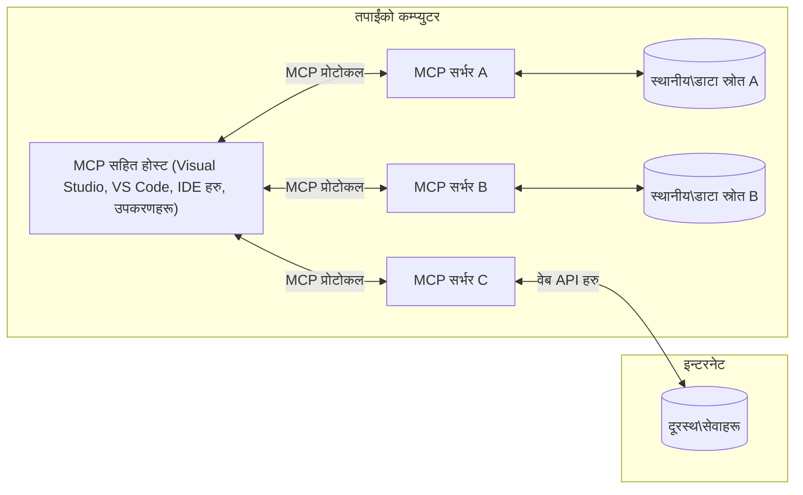

# MCP कोर अवधारणाहरू: AI एकीकरणका लागि मोडेल कन्टेक्स्ट प्रोटोकलमा दक्षता हासिल गर्नुहोस्

[](https://youtu.be/earDzWGtE84)

_(यस पाठको भिडियो हेर्न माथिको छवि क्लिक गर्नुहोस्)_

[Model Context Protocol (MCP)](https://github.com/modelcontextprotocol) एक शक्तिशाली, मानकीकृत फ्रेमवर्क हो जसले ठूला भाषा मोडेलहरू (LLMs) र बाह्य उपकरणहरू, अनुप्रयोगहरू, तथा डाटा स्रोतहरू बीचको सञ्चारलाई प्रभावकारी बनाउँछ। 
यस मार्गदर्शनले तपाईंलाई MCP का कोर अवधारणाहरू बारे जान्ने मौका दिनेछ। तपाईं यसको क्लाइन्ट-सर्वर वास्तुकला, आवश्यक कम्पोनेन्टहरू, सञ्चार प्रक्रिया, र कार्यान्वयनका उत्कृष्ट अभ्यासहरूबारे सिक्नुहुनेछ।

- **स्पष्ट प्रयोगकर्ता सहमति**: सबै डाटा पहुँच र अपरेशनहरूले कार्यान्वयनअघि स्पष्ट प्रयोगकर्ता अनुमोदन आवश्यक पर्दछ। प्रयोगकर्ताहरूले कुन डाटामा पहुँच हुने र के कस्तो काम गरिने हो स्पष्ट रूपमा बुझ्नुपर्छ, र अनुमति तथा प्राधिकरणहरुमा स-साना नियन्त्रणहरू पाउनुपर्छ।

- **डाटा गोपनीयता सुरक्षा**: प्रयोगकर्ता डाटालाई मात्र स्पष्ट सहमतिको साथमा प्रदर्शन गरिनुपर्छ र सम्पूर्ण अन्तरक्रिया अवधिभर मजबुत पहुँच नियन्त्रणले सुरक्षा गर्नुपर्छ। अवैध डाटा सञ्चार रोक्न र कडा गोपनीयता सीमाहरू कायम गर्न कार्यान्वयनहरूले ध्यान दिनुपर्छ।

- **उपकरण सञ्चालन सुरक्षा**: हरेक उपकरण कलले स्पष्ट प्रयोगकर्ता सहमति चाहन्छ जसले उपकरणको कार्यक्षमता, प्यारामिटरहरू, र सम्भावित प्रभावहरूको स्पष्ट बुझाइ दिन्छ। कडा सुरक्षा सीमाहरूले अनपेक्षित, असुरक्षित वा दुष्ट उपकरण सञ्चालन रोक्नुपर्दछ।

- **परिवहन तह सुरक्षा**: सबै सञ्चार च्यानलहरूले उचित इन्क्रिप्सन र प्रमाणीकरण संयन्त्रहरू प्रयोग गर्नुपर्छ। दूरस्थ जडानहरूले सुरक्षित ट्रान्सपोर्ट प्रोटोकलहरू र उचित प्रमाणपत्र व्यवस्थापन लागू गर्नुपर्दछ।

#### कार्यान्वयन मार्गनिर्देशनहरू:

- **अनुमति व्यवस्थापन**: प्रयोगकर्ताहरूलाई कुन सर्भर, उपकरण र स्रोतहरू पहुँचयोग्य छन् भन्ने सूक्ष्म नियन्त्रण प्रणाली कार्यान्वयन गर्नुहोस्
- **प्रमाणीकरण र प्राधिकरण**: सुरक्षित प्रमाणीकरण विधिहरू (OAuth, API कुञ्जीहरू) प्रयोग गर्नुहोस् जसमा उचित टोकन व्यवस्थापन र म्याद सक्ने व्यवस्था होस्  
- **इनपुट प्रमाणीकरण**: सबै प्यारामिटर र डाटा इनपुटहरू परिभाषित स्किमाहरू अनुसार प्रमाणीकरण गर्नुहोस् जसले इन्जेक्सन आक्रमण रोक्छ
- **लेखा परीक्षण**: सुरक्षा अनुगमन र अनुपालनका लागि सबै अपरेसनहरूको व्यापक लगहरू कायम गर्नुहोस्

## अवलोकन

यस पाठले Model Context Protocol (MCP) पारिस्थितिकी तन्त्रका आधारभूत वास्तुकला र कम्पोनेन्टहरू अन्वेषण गर्नेछ। तपाईंले क्लाइन्ट-सर्वर वास्तुकला, प्रमुख कम्पोनेन्टहरू, र सञ्चार प्रक्रिया सिक्नुहुनेछ जसले MCP अन्तरक्रियाहरूलाई सशक्त बनाउँछ।

## मुख्य सिकाइ उद्देश्यहरू

यस पाठको अन्त्यसम्म, तपाईंले:

- MCP क्लाइन्ट-सर्वर वास्तुकला बुझ्नुहोस्।
- होस्टहरू, क्लाइन्टहरू, र सर्भरहरूको भूमिका र जिम्मेवारीहरू चिन्हित गर्नुहोस्।
- MCP लाई लचिलो एकीकरण तह बनाउने आधारभूत विशेषताहरू विश्लेषण गर्नुहोस्।
- MCP पारिस्थितिकी तन्त्रमा सूचना कसरी प्रवाह हुन्छ जान्नुहोस्।
- .NET, Java, Python, र JavaScript मा कोड उदाहरणमार्फत व्यावहारिक अन्तर्दृष्टिहरू प्राप्त गर्नुहोस्।

## MCP वास्तुकला: अझ गहिरो दृष्टि

MCP पारिस्थितिकी तन्त्र एक क्लाइन्ट-सर्भर मोडेलमा आधारित छ। यो मोड्युलर संरचनाले AI अनुप्रयोगहरूलाई उपकरणहरू, डाटाबेसहरू, API र सन्दर्भ स्रोतहरूसँग दक्षतापूर्वक अन्तरक्रिया गर्न सक्षम बनाउँछ। आउनुहोस्, यो वास्तुकलालाई यसको कोर कम्पोनेन्टहरूमा टुक्र्याउँ।

यसको मूलमा MCP एक क्लाइन्ट-सर्भर वास्तुकला अनुसरण गर्छ जहाँ होस्ट अनुप्रयोगले धेरै सर्भरहरूसँग जडान गर्न सक्छ:



- **MCP होस्टहरू**: VSCode, Claude Desktop, IDE वा AI उपकरणहरू जस्ता प्रोग्रामहरू, जसले MCP मार्फत डाटामा पहुँच चाहन्छन्
- **MCP क्लाइन्टहरू**: सर्भरसँग 1:1 जडानहरू कायम राख्ने प्रोटोकल क्लाइन्टहरू
- **MCP सर्भरहरू**: प्रत्येकले मानकीकृत Model Context Protocol मार्फत विशिष्ट क्षमता प्रदर्शन गर्ने हल्का प्रोग्रामहरू
- **स्थानीय डाटा स्रोतहरू**: कम्प्युटरका फाइलहरू, डाटाबेसहरू, र सेवाहरू जसमा MCP सर्भरहरूले सुरक्षित पहुँच पाउँछन्
- **दूरस्थ सेवा**: इन्टरनेटमा उपलब्ध बाह्य प्रणालीहरू, जसमा MCP सर्भरहरू API मार्फत जडान हुन सक्छन्।

MCP प्रोटोकल एक विकासशील मानक हो जुन मिति-आधारित संस्करण (YYYY-MM-DD ढाँचा) प्रयोग गर्छ। वर्तमान प्रोटोकल संस्करण **2025-11-25** हो। तपाईं [प्रोटोकल स्पेसिफिकेशन](https://modelcontextprotocol.io/specification/2025-11-25/) मा पछिल्ला अपडेटहरू देख्न सक्नुहुन्छ।

> **आगामी दृष्टि:** अर्को विशिष्टता संस्करण, **2026-07-28** को रिलिज क्यान्डिडेट मे २०२६ मा घोषणा भइसकेको छ र जुलाई २८, २०२६ मा वितरण हुने तय छ। यसले ट्रान्सपोर्ट तहलाई स्टेटलेस बनाउँछ (`initialize` ह्यान्डशेक र सेसन ID हरू हटाई), एक्सटेन्सन्स फ्रेमवर्कलाई औपचारिक बनाउँछ, र रुट्स, स्याम्पलिङ, र लगिङलाई नयाँ ढाँचाहरूको पक्षमा अवहेलना गर्दछ। पूर्ण विवरणका लागि [MCP मा के परिवर्तन हुँदै छ: 2026-07-28 रिलिज क्यान्डिडेट](./mcp-2026-07-28-release-candidate.md) हेर्नुहोस्।

### 1. होस्टहरू

Model Context Protocol (MCP) मा, **होस्टहरू** ती AI अनुप्रयोगहरू हुन् जसले प्रोटोकलसँग प्रयोगकर्ताहरूको अन्तरक्रियाको लागि प्राथमिक इन्टरफेसको रूपमा काम गर्छन्। होस्टहरूले प्रत्येक सर्भर जडानका लागि समर्पित MCP क्लाइन्टहरू सिर्जना गरेर धेरै MCP सर्भरहरूसँग जडानहरू समन्वय र व्यवस्थापन गर्छन्। होस्टहरूको उदाहरणहरू हुन्:

- **AI अनुप्रयोगहरू**: Claude Desktop, Visual Studio Code, Claude Code
- **विकास वातावरणहरू**: MCP एकीकरण भएक र IDEs तथा कोड सम्पादकहरू  
- **कस्टम अनुप्रयोगहरू**: उद्देश्य-निर्मित AI एजेन्टहरू र उपकरणहरू

**होस्टहरू** ती अनुप्रयोगहरू हुन् जसले AI मोडेल अन्तरक्रियाहरू समन्वय गर्छन्। ती:

- **AI मोडेलहरूको सञ्चालन**: LLMs सँग अन्तरक्रिया वा सञ्चालन गरेर प्रतिक्रिया उत्पन्न गर्ने र AI कार्यप्रवाहहरू समन्वय गर्ने
- **क्लाइन्ट जडान व्यवस्थापन**: प्रत्येक MCP सर्भर जडानको लागि एउटा MCP क्लाइन्ट सिर्जना र कायम राख्ने
- **प्रयोगकर्ता इन्टरफेस नियन्त्रण**: संवादको प्रवाह, प्रयोगकर्ता अन्तरक्रियाहरू, र प्रतिक्रिया प्रदर्शन ह्यान्डल गर्ने  
- **सुरक्षा लागू गर्ने**: अनुमति, सुरक्षा सीमाहरू, र प्रमाणीकरण नियन्त्रण गर्ने
- **प्रयोगकर्ता सहमति व्यवस्थापन**: डाटा साझेदारी र उपकरण सञ्चालनको लागि प्रयोगकर्ता अनुमोदन व्यवस्थापन गर्ने


### 2. क्लाइन्टहरू

**क्लाइन्टहरू** आधारभूत कम्पोनेन्टहरू हुन् जुन होस्टहरू र MCP सर्भरहरू बीच समर्पित एक-देखि-एक जडानहरू कायम राख्छन्। प्रत्येक MCP क्लाइन्ट होस्टले विशिष्ट MCP सर्भरसँग जडान गर्न सिर्जना गर्छ, जसले व्यवस्थित र सुरक्षित सञ्चार च्यानल सुनिश्चित गर्छ। धेरै क्लाइन्टहरूले होस्टहरूलाई एकै समयमा धेरै सर्भरहरूसँग जडान हुन सक्षम बनाउँछ।

**क्लाइन्टहरू** होस्ट अनुप्रयोगका कनेक्टर कम्पोनेन्टहरू हुन्। ती:

- **प्रोटोकल सञ्चार**: JSON-RPC 2.0 अनुरोधहरू सर्भरलाई पठाउने, प्रॉम्प्ट र निर्देशनहरू सहित
- **क्षमता वार्ता**: सर्भरसँग प्रारम्भिक चरणमा समर्थन गरिएका विशेषताहरू र प्रोटोकल संस्करणहरू वार्ता गर्ने
- **उपकरण सञ्चालन**: मोडेलहरूबाट उपकरण सञ्चालन अनुरोधहरू व्यवस्थापन गर्ने र प्रतिक्रियाहरू प्रशोधन गर्ने
- **रियल-टाइम अपडेट**: सर्भरहरूबाट सूचना र रियल-टाइम अपडेटहरू ह्यान्डल गर्ने
- **प्रतिक्रिया प्रशोधन**: प्रयोगकर्तालाई देखाउनको लागि सर्भर प्रतिक्रिया प्रक्रिया गर्ने र ढाँचाबद्ध गर्ने

### 3. सर्भरहरू

**सर्भरहरू** कार्यक्रमहरू हुन् जसले MCP क्लाइन्टहरूलाई सन्दर्भ, उपकरण, र क्षमता प्रदान गर्छन्। ती स्थानीय रूपमा (होस्टकै मेसिनमा) वा दूरस्थ रूपमा (बाह्य प्लेटफर्महरूमा) सञ्चालन गर्न सक्छन्, र क्लाइन्ट अनुरोधहरू ह्यान्डल गर्ने तथा संरचित प्रतिक्रियाहरू प्रदान गर्ने जिम्मेवारी लिन्छन्। सर्भरहरूले मानकीकृत Model Context Protocol मार्फत विशिष्ट कार्यक्षमता प्रदर्शन गर्छन्।

**सर्भरहरू** सन्दर्भ र क्षमता प्रदान गर्ने सेवा हुन्। ती:

- **विशेषता दर्ता**: क्लाइन्टहरूलाई उपलब्ध प्रिमिटिभ (स्रोतहरू, प्रॉम्प्टहरू, उपकरणहरू) दर्ता र प्रदर्शन गर्ने
- **अनुरोध प्रक्रिया**: क्लाइन्टबाट उपकरण कल, स्रोत अनुरोधहरू, र प्रॉम्प्ट अनुरोध प्राप्त गर्ने र सञ्चालन गर्ने
- **सन्दर्भ प्रबन्धन**: मोडेल प्रतिक्रियाहरू सुधार गर्न सन्दर्भ जानकारी र डाटा प्रदान गर्ने
- **राज्य व्यवस्थापन**: सेसन स्थिति कायम राख्ने र आवश्यक परेमा राज्यव्यवस्थित अन्तरक्रियाहरू ह्यान्डल गर्ने
- **रियल-टाइम सूचनाहरू**: क्षमता परिवर्तन र अपडेटहरूका बारेमा जडित क्लाइन्टहरूलाई सूचनाहरू पठाउने

सर्भरहरू कुनै पनि व्यक्तिले मोडेल क्षमताहरूलाई बृद्धि गर्न विशेष कार्यक्षमतासहित विकास गर्न सक्छन्, र तिनीहरूले स्थानीय तथा दूरस्थ परिनियोजन परिदृश्यहरू समर्थन गर्छन्।

### 4. सर्भर प्रिमिटिभहरू

Model Context Protocol (MCP) मा सर्भरहरूले तीन मुख्य **प्रिमिटिभहरू** प्रदान गर्छन् जसले क्लाइन्ट, होस्ट, र भाषा मोडेलहरू बीच धनी अन्तरक्रियाहरूको आधारभूत निर्माण ब्लकहरू परिभाषित गर्छन्। यी प्रिमिटिभहरूले प्रोटोकल मार्फत उपलब्ध सन्दर्भीय जानकारी र क्रियाहरूको प्रकारहरू निर्दिष्ट गर्छन्।

MCP सर्भरहरूले तलका तीन मुख्य प्रिमिटिभहरूको कुनै पनि संयोजन प्रदर्शन गर्न सक्छन्:

#### स्रोतहरू 

**स्रोतहरू** ती डाटा स्रोतहरू हुन् जसले AI अनुप्रयोगहरूलाई सन्दर्भीय जानकारी प्रदान गर्छन्। ती स्थिर वा गतिशील सामग्रीहरू हुन् जसले मोडेल बुझाइ र निर्णय प्रक्रियालाई सुधार गर्छन्:

- **सन्दर्भीय डाटा**: AI मोडेल उपभोगका लागि संरचित जानकारी र सन्दर्भ
- **ज्ञान आधारहरू**: कागजात भण्डार, लेखहरू, म्यानुअलहरू, र अनुसन्धान पत्रहरू
- **स्थानीय डाटा स्रोतहरू**: फाइलहरू, डाटाबेसहरू, र स्थानीय प्रणाली जानकारी  
- **बाह्य डाटा**: API प्रतिक्रियाहरू, वेब सेवा, र दूरस्थ प्रणाली डाटा
- **गतिशील सामग्री**: बाह्य अवस्थाहरूको आधारमा अपडेट हुने रियल-टाइम डाटा

स्रोतहरू URI द्वारा पहिचान गरिन्छ र `resources/list` मार्फत पत्ता लगाउन सकिन्छ र `resources/read` विधिबाट प्राप्त गर्न सकिन्छ:

```text
file://documents/project-spec.md
database://production/users/schema
api://weather/current
```

#### प्रॉम्प्टहरू

**प्रॉम्प्टहरू** पुनःप्रयोगयोग्य टेम्प्लेटहरू हुन् जसले भाषा मोडेलहरूसँगको अन्तरक्रियालाई संरचित गर्न मद्दत गर्छन्। ती मानकीकृत अन्तरक्रिया ढाँचा र टेम्प्लेट कार्यप्रवाहहरू प्रदान गर्छन्:

- **टेम्प्लेट-आधारित अन्तरक्रियाहरू**: पूर्व-संरचित सन्देशहरू र संवाद सुरु गर्नेहरू
- **कार्यप्रवाह टेम्प्लेटहरू**: सामान्य कार्यहरू र अन्तरक्रियाका लागि मानकीकृत अनुक्रमहरू
- **थोरै-शट उदाहरणहरू**: मोडेललाई निर्देशन दिन उदाहरण-आधारित टेम्प्लेटहरू
- **प्रणाली प्रॉम्प्टहरू**: मोडेल व्यवहार र सन्दर्भ परिभाषित गर्ने आधारभूत प्रॉम्प्टहरू
- **गतिशील टेम्प्लेटहरू**: विशेष सन्दर्भहरू अनुसार अनुकूल हुने प्यारामिटरयुक्त प्रॉम्प्टहरू

प्रॉम्प्टहरूले भेरिएबल प्रतिस्थापन समर्थन गर्छन् र `prompts/list` बाट पत्ता लगाउन र `prompts/get` बाट प्राप्त गर्न सकिन्छ:

```markdown
Generate a {{task_type}} for {{product}} targeting {{audience}} with the following requirements: {{requirements}}
```

#### उपकरणहरू

**उपकरणहरू** कार्यान्वयनयोग्य फंक्शन्स हुन् जुन AI मोडेलहरूले निर्दिष्ट क्रियाहरू गर्न कल गर्न सक्छन्। तिनीहरूले MCP पारिस्थितिकी तन्त्रका "क्रियापद" प्रतिनिधित्व गर्छन्, मोडेलहरूलाई बाह्य प्रणालीसँग अन्तरक्रिया गर्न सक्षम पार्छन्:

- **कार्यान्वयन योग्य फंक्शन्स**: विशेष प्यारामिटरहरू सहित मोडेलहरूले सञ्चालन गर्न सक्ने पृथक अपरेसनहरू
- **बाह्य प्रणाली एकीकरण**: API कलहरू, डाटाबेस प्रश्नहरू, फाइल अपरेसनहरू, गणना
- **अद्वितीय पहिचान**: प्रत्येक उपकरणको फरक नाम, विवरण, र प्यारामिटर स्किमा हुन्छ
- **संरचित इनपुट/आउटपुट**: उपकरणहरूले प्रमाणीकरण गरिएका प्यारामिटरहरू स्वीकार्छन् र संरचित, टाइप गरिएका प्रतिक्रियाहरू फर्काउँछन्
- **क्रिया क्षमता**: मोडेलहरूलाई वास्तविक-विश्व क्रियाहरू गर्ने र प्रत्यक्ष डाटा प्राप्त गर्ने अवसर दिन्छ

उपकरणहरू प्यारामिटर प्रमाणीकरणको लागि JSON स्किमा प्रयोग गरी परिभाषित गरिन्छ र `tools/list` बाट पत्ता लगाउन र `tools/call` मार्फत सञ्चालन गर्न सकिन्छ। उपकरणहरूले उत्तम UI प्रस्तुतिका लागि अतिरिक्त मेटाडाटा रूपमा **आइकनहरू** पनि समावेश गर्न सक्छन्।

**उपकरण टिप्पणीहरू**: उपकरणहरूले व्यवहारात्मक टिप्पणीहरू (जस्तै, `readOnlyHint`, `destructiveHint`) समर्थन गर्छन् जसले उपकरण पढ्न मात्र हो वा विनाशकारी छ भनी व्याख्या गर्छ, जसले क्लाइन्टहरूलाई उपकरण सञ्चालनका बारेमा सूचित निर्णय लिन मद्दत गर्दछ।

उदाहरण उपकरण परिभाषा:

```typescript
server.tool(
  "search_products", 
  {
    query: z.string().describe("Search query for products"),
    category: z.string().optional().describe("Product category filter"),
    max_results: z.number().default(10).describe("Maximum results to return")
  }, 
  async (params) => {
    // खोज कार्यान्वयन गर्नुहोस् र संरचित परिणामहरू फर्काउनुहोस्
    return await productService.search(params);
  }
);
```

## क्लाइन्ट प्रिमिटिभहरू

Model Context Protocol (MCP) मा, **क्लाइन्टहरूले** त्यस्ता प्रिमिटिभहरू प्रदर्शन गर्न सक्छन् जसले सर्भरहरूलाई होस्ट अनुप्रयोगबाट थप क्षमता अनुरोध गर्न अनुमति दिन्छ। यी क्लाइन्ट-पक्ष प्रिमिटिभहरूले server पारिस्थितिकीमा धनी, अझ अन्तरक्रियात्मक कार्यान्वयनहरू सक्षम पार्छन् जसले AI मोडेल क्षमताहरू र प्रयोगकर्ता अन्तरक्रियाहरूमा पहुँच दिन्छ।

### स्याम्पलिङ

> **अवहेलन सूचना:** `2026-07-28` रिलिज क्यान्डिडेटले स्याम्पलिङलाई LLM प्रदायक API सँग प्रत्यक्ष एकीकरणको पक्षमा अवहेलना गरेको छ। यो `2025-11-25` मा र कम्तीमा अवहेलनाको एक वर्षपछि पनि काम गर्दछ, तर नयाँ डिजाइनहरूले प्रतिस्थापन ढाँचा प्राथमिकता दिनुपर्छ। [MCP मा के परिवर्तन हुँदै छ: 2026-07-28 रिलिज क्यान्डिडेट](./mcp-2026-07-28-release-candidate.md) हेर्नुहोस्।

**स्याम्पलिङ** सर्भरहरूले क्लाइन्टको AI अनुप्रयोगबाट भाषा मोडेल पूर्णता अनुरोध गर्न सक्षम पार्छ। यो प्रिमिटिभले सर्भरहरूलाई आफ्नै मोडेल निर्भरता समावेश नगरी LLM क्षमताहरू पहुँच गर्न दिनेछ:

- **मोडेल-स्वतन्त्र पहुँच**: सर्भरहरूले LLM SDKs बिना वा मोडेल पहुँच व्यवस्थापन नगरी पूर्णताहरू अनुरोध गर्न सक्छन्
- **सर्भर-प्रेरित AI**: सर्भरहरूलाई स्वतन्त्र रूपमा क्लाइन्टको AI मोडेल प्रयोग गरेर सामग्री उत्पन्न गर्न सक्षम पार्छ
- **पुनरावर्ती LLM अन्तरक्रिया**: जटिल परिदृश्य जसमा सर्भरहरूले प्रक्रिया मद्दतको लागि AI चाहिन्छ समर्थन गर्छ
- **गतिशील सामग्री निर्माण**: होस्टको मोडेल प्रयोग गरेर सन्दर्भीय प्रतिक्रियाहरू सिर्जना गर्न सर्भरहरूलाई अनुमति दिन्छ
- **उपकरण कल समर्थन**: सर्भरहरूले `tools` र `toolChoice` प्यारामिटरहरू समावेश गर्न सक्छन् जसले क्लाइन्टको मोडेललाई स्याम्पलिङको क्रममा उपकरणहरू कल गर्न सक्षम पार्छ

स्याम्पलिङ `sampling/complete` विधिमार्फत सुरु हुन्छ जहाँ सर्भरहरूले पूर्णता अनुरोधहरू क्लाइन्टहरूलाई पठाउँछन्।

### रुट्स

> **अवहेलन सूचना:** `2026-07-28` रिलिज क्यान्डिडेटले रुट्सलाई उपकरण प्यारामिटरहरू, स्रोत URI, वा सर्भर कन्फिगरेसनको पक्षमा अवहेलना गरेको छ। यो `2025-11-25` मा र कम्तीमा अवहेलनाको एक वर्षपछि पनि काम गर्दछ। [MCP मा के परिवर्तन हुँदै छ: 2026-07-28 रिलिज क्यान्डिडेट](./mcp-2026-07-28-release-candidate.md) हेर्नुहोस्।

**रुट्स** क्लाइन्टहरूले सर्भरहरूलाई फाइल सिस्टम सिमानाहरू प्रदर्शन गर्न मानकीकृत तरिका प्रदान गर्छन्, जसले सर्भरहरूले कुन डाइरेक्टोरीहरू र फाइलहरूमा पहुँच छ बुझ्न मद्दत गर्दछ:

- **फाइल सिस्टम सिमानाहरू**: फाइल सिस्टमभित्र सर्भरहरू कहाँ सञ्चालन गर्न सक्छन् भनी सीमाना परिभाषित गर्ने
- **पहुँच नियन्त्रण**: सर्भरहरूलाई कुन डाइरेक्टोरी र फाइलहरूमा पहुँच अनुमति छ बुझ्न सहयोग गर्ने
- **गतिशील अपडेट**: रुटहरूको सूची परिवर्तन हुँदा क्लाइन्टहरूले सर्भरहरूलाई सूचना दिन सक्छन्
- **URI-आधारित पहिचान**: रुटहरूले `file://` URI प्रयोग गरी पहुँचयोग्य डाइरेक्टोरीहरू र फाइलहरू चिन्हित गर्छन्

रुटहरू `roots/list` विधिबाट पत्ता लगाइन्छन्, र क्लाइन्टहरूले रुट परिवर्तन हुँदा `notifications/roots/list_changed` पठाउँछन्।

### प्रचार  

**प्रचार** ले सर्भरहरूलाई क्लाइन्ट इन्टरफेस मार्फत प्रयोगकर्ताबाट थप जानकारी वा पुष्टि अनुरोध गर्न सक्षम बनाउँछ:

- **प्रयोगकर्ता इनपुट अनुरोधहरू**: उपकरण सञ्चालनका लागि आवश्यक परे थप जानकारी माग्न सर्भरहरू सक्षम हुन्छन्
- **पुष्टि संवादहरू**: संवेदनशील वा प्रभावशाली अपरेशनका लागि प्रयोगकर्ताको अनुमोदन अनुरोध गर्ने
- **इंटरएक्टिव कार्यप्रवाहहरू**: चरण-दर-चरण प्रयोगकर्ता अन्तरक्रियाहरू सिर्जना गर्न सर्भरहरूलाई सक्षम गर्ने
- **गतिशील प्यारामिटर सङ्कलन**: उपकरण सञ्चालनको क्रममा अभाव वा ऐच्छिक प्यारामिटरहरू सङ्कलन गर्ने

प्रचार अनुरोधहरू `elicitation/request` विधिको प्रयोग गरेर क्लाइन्टको इन्टरफेसबाट प्रयोगकर्ता इनपुट सङ्कलन गर्न गरिन्छ।

**URL मोड प्रचार**: सर्भरहरूले URL-आधारित प्रयोगकर्ता अन्तरक्रियाहरू पनि अनुरोध गर्न सक्छन् जसले प्रयोगकर्ताहरूलाई प्रामाणीकरण, पुष्टि, वा डाटा प्रविष्टिका लागि बाह्य वेब पृष्ठमा निर्देशन दिन अनुमति दिन्छ।

### लगिङ


> **अप्रचलन सूचना:** `2026-07-28` रिलिज क्यान्डिडेटले Logging लाई stdio यातायातहरूको लागि `stderr` र संरचित अवलोकनका लागि OpenTelemetry को पक्षमा अप्रचलित घोषित गरेको छ। यो `2025-11-25` मा र कुनै पनि अप्रचलन पछि कम्तीमा एक वर्षसम्म काम गर्न जारी राख्छ। हेर्नुहोस् [MCP मा के कुरा परिवर्तन भैरहेको छ: 2026-07-28 रिलिज क्यान्डिडेट](./mcp-2026-07-28-release-candidate.md)।

**Logging** ले सर्भरहरूलाई डिबगिङ, अनुगमन, र सञ्चालन दृश्यताका लागि संरचित लग सन्देशहरू क्लाइन्टहरूमा पठाउन अनुमति दिन्छ:

- **डिबगिङ समर्थन**: समस्याहरू समाधान गर्न सर्भरहरूलाई विस्तृत कार्यान्वयन लगहरू प्रदान गर्ने सक्षम पार्ने
- **सञ्चालन अनुगमन**: क्लाइन्टहरूलाई स्थिति अद्यावधिकहरू र प्रदर्शन मेट्रिक्स पठाउने
- **त्रुटि रिपोर्टिङ**: विस्तृत त्रुटि सन्दर्भ र डायग्नोस्टिक जानकारी प्रदान गर्ने
- **अडिट ट्रेल्स**: सर्भर सञ्चालन र निर्णयहरूको व्यापक लगहरू सिर्जना गर्ने

लगिङ सन्देशहरू क्लाइन्टहरूमा पठाइन्छ ताकि सर्भर सञ्चालनहरूमा पारदर्शिता प्रदान गर्न र डिबगिङलाई सहज बनाउन सकियोस्।

## MCP मा सूचना प्रवाह

मोडल सन्दर्भ प्रोटोकल (MCP) होष्टहरू, क्लाइन्टहरू, सर्भरहरू, र मोडेलहरू बीच संरचित सूचना प्रवाह परिभाषित गर्दछ। यो प्रवाह बुझ्नले प्रयोगकर्ता अनुरोधहरू कसरी प्रशोधन हुन्छन र कसरी बाह्य उपकरणहरू र डाटाहरू मोडेल प्रतिक्रियामा समावेश हुन्छन् भन्ने स्पष्ट पार्छ।

- **होष्टले जडान सुरु गर्दछ**  
  होष्ट एप्लिकेशन (जस्तै IDE वा च्याट इन्टरफेस) ले प्रायः STDIO, वेब्सकेट, वा अरु समर्थन गरिएको यातायातमार्फत MCP सर्भरसँग जडान स्थापित गर्छ।

- **क्षमता वार्ता**  
  होष्टमा एम्बेड गरिएको क्लाइन्ट र सर्भरले आफूहरू समर्थित सुविधाहरू, उपकरणहरू, स्रोतहरू, र प्रोटोकल संस्करणहरूमा जानकारी साटासाट गर्छन्। यसले दुबै पक्षलाई सत्रका लागि उपलब्ध क्षमताहरू बुझ्न सुनिश्चित गर्छ।

- **प्रयोगकर्ता अनुरोध**  
  प्रयोगकर्ताले होष्टसँग अन्तर्क्रिया गर्छ (जस्तै, प्रॉम्प्ट वा कमाण्ड प्रविष्टि)। होष्टले यो इनपुट सङ्कलन गरी प्रशोधनका लागि क्लाइन्टलाई पास गर्छ।

- **स्रोत वा उपकरण प्रयोग**  
  - क्लाइन्टले मोडेलको बुझाइ समृद्ध पार्न अतिरिक्त सन्दर्भ वा स्रोतहरू (जस्तै फाइलहरू, डाटाबेस प्रविष्टिहरू, वा ज्ञान आधार लेखहरू) सर्भरबाट अनुरोध गर्न सक्छ।
  - यदि मोडेलले कुनै उपकरण आवश्यक ठाने (जस्तै, डाटा ल्याउन, गणना गर्न, वा API कल गर्न), क्लाइन्टले उपकरण आह्वान अनुरोध सर्भरमा पठाउँछ, उपकरणको नाम र प्यारामिटरहरू निर्दिष्ट गर्दै।

- **सर्भर कार्यान्वयन**  
  सर्भरले स्रोत वा उपकरण अनुरोध प्राप्त गरी आवश्यक सञ्चालनहरू (जस्तै, कार्य चलाउने, डाटाबेस सोधपुछ गर्ने, वा फाइल पुन:प्राप्त गर्ने) चलाउँछ र नतिजा संरचित रूपमा क्लाइन्टलाई फिर्ता गर्छ।

- **प्रतिक्रिया निर्माण**  
  क्लाइन्टले सर्भरका प्रतिक्रियाहरू (स्रोत डाटा, उपकरण उत्पादनहरू आदि) चलिरहेको मोडेल अन्तर्क्रियामा समाहित गर्छ। मोडेलले यस जानकारी प्रयोग गरी समग्र र सान्दर्भिक प्रतिक्रिया उत्पन्न गर्छ।

- **नतिजा प्रस्तुति**  
  होष्टले क्लाइन्टबाट अन्तिम आउटपुट प्राप्त गरी प्रयोगकर्तालाई प्रस्तुत गर्छ, प्राय: मोडेलले सिर्जना गरेको पाठ र उपकरण कार्यान्वयन वा स्रोत खोजीका कुनै पनि नतिजाहरू सहित।

यो प्रवाहले MCP लाई उन्नत, अन्तरक्रियात्मक, र सन्दर्भ-सचेत AI अनुप्रयोगहरूलाई मोडेलहरूलाई बाह्य उपकरणहरू र डाटास्रोतहरूसँग सहज रूपमा जोडेर समर्थन गर्न सक्षम बनाउँछ।

## प्रोटोकल वास्तुकला र तहहरू

MCP दुई फरक वास्तुकला तहहरूको संयोजन हो जुन एक पूर्ण सञ्चार फ्रेमवर्क प्रदान गर्न सँगै काम गर्छन्:

### डेटा तह

**डेटा तह** ले मूल MCP प्रोटोकल कार्यान्वयन गर्छ **JSON-RPC 2.0** लाई आधार मानेर। यो तहले सन्देश संरचना, अर्थहरू र अन्तरक्रिया ढाँचाहरू परिभाषित गर्छ:

#### मुख्य कम्पोनेन्टहरू:

- **JSON-RPC 2.0 प्रोटोकल**: सबै सञ्चारले विधि कल, जवाफहरू, र सूचना लागि मानकीकृत JSON-RPC 2.0 सन्देश ढाँचा प्रयोग गर्छ
- **जीवनचक्र व्यवस्थापन**: क्लाइन्ट र सर्भरबीच जडान शुरु, क्षमता वार्ता, र सत्र समाप्ति व्यवस्थापन गर्दछ
- **सर्भर प्रिमिटिभहरू**: सर्भरहरूलाई उपकरणहरू, स्रोतहरू, र प्रॉम्प्टमार्फत मूल कार्यक्षमता प्रदान गर्न सक्षम पार्छ
- **क्लाइन्ट प्रिमिटिभहरू**: सर्भरहरूले LLM को नमूना लिन, प्रयोगकर्ता इनपुट माग गर्न, र लग सन्देशहरू पठाउन सक्षम पार्छ
- **रियल-टाइम सूचना**: प Poll नगरीकन गतिशील अपडेटहरूको लागि असिंक्रोनस सूचना समर्थन गर्दछ

#### मुख्य विशेषताहरू:

- **प्रोटोकल संस्करण वार्ता**: मिति-आधारित संस्करणिङ (YYYY-MM-DD) प्रयोग गरी अनुकूलता सुनिश्चित गर्छ
- **क्षमता खोज**: सुरुवातमा क्लाइन्ट र सर्भरले समर्थित सुविधा जानकारी साटासाट गर्छन्
- **राज्यपूर्ण सत्रहरू**: सन्दर्भ निरन्तरताका लागि धेरै अन्तरक्रियाहरूमा जडान अवस्था कायम राख्छ

### यातायात तह

**यातायात तह** MCP सहभागीहरूबीच सञ्चार च्यानलहरू, सन्देश फ्रेमिङ, र प्रमाणीकरण व्यवस्थापन गर्छ:

#### समर्थित यातायात विधिहरू:

1. **STDIO यातायात**:
   - सिधा प्रक्रिया सञ्चारका लागि मानक इनपुट/आउटपुट स्ट्रिमहरू प्रयोग गर्छ
   - एउटै मेसिनमा स्थानीय प्रक्रियाहरूका लागि उत्तम, कुनै नेटवर्क ओभरहेड बिना
   - प्राय: स्थानीय MCP सर्भर कार्यान्वयनमा प्रयोग गरिन्छ

2. **स्ट्रीमयोग्य HTTP यातायात**:
   - क्लाइन्ट-देखि-सर्भर सन्देशका लागि HTTP POST प्रयोग गर्छ  
   - सर्भर-देखि-क्लाइन्ट स्ट्रीमिङका लागि वैकल्पिक सर्भर-सेंट इभेन्ट्स (SSE)
   - नेटवर्क मार्फत टाढाको सर्भर सञ्चार सक्षम बनाउँछ
   - मानक HTTP प्रमाणीकरण समर्थन गर्छ (बियरर टोकनहरू, API कुञ्जीहरू, कस्टम हेडरहरू)
   - MCP ले सुरक्षित टोकन-आधारित प्रमाणीकरणका लागि OAuth सिफारिस गर्छ

#### यातायात अमूर्तन:

यातायात तहले सञ्चार विवरणहरू डेटा तहबाट अमूर्त पार्छ, जसले सबै यातायात विधिहरूमा एउटै JSON-RPC 2.0 सन्देश ढाँचा प्रयोग गर्न सक्षम बनाउँछ। यस अमूर्तनले अनुप्रयोगहरूलाई स्थानीय र टाढा सर्भरहरू बीच सहजै स्विच गर्न अनुमति दिन्छ।

### सुरक्षा विचारहरू

MCP कार्यान्वयनहरूले सबै प्रोटोकल संचालनहरूमा सुरक्षित, विश्वासयोग्य, र सुरक्षित अन्तर्क्रियाको सुनिश्चितताका लागि केही महत्वपूर्ण सुरक्षा सिद्धान्तहरू अनुसरण गर्नुपर्छ:

- **प्रयोगकर्ता सहमति र नियन्त्रण**: कुनै पनि डेटा पहुँच वा सञ्चालन अघि प्रयोगकर्ताले स्पष्ट सहमति दिनुपर्छ। उनीहरूलाई साझेदारी गर्ने डेटा र अधिकारप्राप्त क्रियाहरूमा स्पष्ट नियन्त्रण हुनु पर्दछ, समीक्षा र स्वीकृतिका लागि सहज प्रयोगकर्ता इन्टरफेसले सहयोग गर्छ।

- **डेटा गोपनीयता**: प्रयोगकर्ता डेटा केवल स्पष्ट सहमति सहित देखाइएको हुनुपर्छ र उचित पहुँच नियन्त्रणद्वारा सुरक्षित हुनु पर्छ। MCP कार्यान्वयनहरूले अनधिकृत डेटा प्रसारण विरुद्ध सुरक्षा गर्नुपर्छ र सम्पूर्ण अन्तर्क्रियाहरूमा गोपनीयता सुनिश्चित गर्नु पर्छ।

- **उपकरण सुरक्षा**: कुनै पनि उपकरण आह्वान गर्नु अघि स्पष्ट प्रयोगकर्ता सहमति आवश्यक छ। प्रयोगकर्ताहरूले प्रत्येक उपकरणको कार्यक्षमता राम्ररी बुझ्नुपर्नेछ, र अनैच्छिक वा असुरक्षित उपकरण कार्यान्वयन रोक्न कडा सुरक्षा सीमाहरू लागू गर्नुपर्छ।

यी सुरक्षा सिद्धान्तहरू पालना गरेर, MCP ले प्रयोगकर्ता विश्वास, गोपनीयता, र सुरक्षा कायम राख्दै सबै प्रोटोकल अन्तर्क्रियाहरूमा शक्तिशाली AI एकीकरणहरू सक्षम बनाउँछ।

## कोड उदाहरणहरू: मुख्य कम्पोनेन्टहरू

तल केहि लोकप्रिय प्रोग्रामिङ भाषाहरूमा कोड उदाहरणहरू छन् जसले कसरि मुख्य MCP सर्भर कम्पोनेन्टहरू र उपकरणहरू कार्यान्वयन गर्ने देखाउँछन्।

### .NET उदाहरण: साधारण MCP सर्भर उपकरणहरूसँग सिर्जना

यहाँ एउटा व्यावहारिक .NET कोड उदाहरण छ जसले कसरि व्यक्तिगत उपकरणहरूसँग साधारण MCP सर्भर कार्यान्वयन गर्ने देखाउँछ। यसले कसरि उपकरणहरू परिभाषित र दर्ता गर्ने, अनुरोधहरू व्यवस्थापन गर्ने, र मोडल सन्दर्भ प्रोटोकल प्रयोग गरी सर्भर जडान गर्ने देखाउँछ।

```csharp
using System;
using System.Threading.Tasks;
using ModelContextProtocol.Server;
using ModelContextProtocol.Server.Transport;
using ModelContextProtocol.Server.Tools;

public class WeatherServer
{
    public static async Task Main(string[] args)
    {
        // Create an MCP server
        var server = new McpServer(
            name: "Weather MCP Server",
            version: "1.0.0"
        );
        
        // Register our custom weather tool
        server.AddTool<string, WeatherData>("weatherTool", 
            description: "Gets current weather for a location",
            execute: async (location) => {
                // Call weather API (simplified)
                var weatherData = await GetWeatherDataAsync(location);
                return weatherData;
            });
        
        // Connect the server using stdio transport
        var transport = new StdioServerTransport();
        await server.ConnectAsync(transport);
        
        Console.WriteLine("Weather MCP Server started");
        
        // Keep the server running until process is terminated
        await Task.Delay(-1);
    }
    
    private static async Task<WeatherData> GetWeatherDataAsync(string location)
    {
        // This would normally call a weather API
        // Simplified for demonstration
        await Task.Delay(100); // Simulate API call
        return new WeatherData { 
            Temperature = 72.5,
            Conditions = "Sunny",
            Location = location
        };
    }
}

public class WeatherData
{
    public double Temperature { get; set; }
    public string Conditions { get; set; }
    public string Location { get; set; }
}
```

### Java उदाहरण: MCP सर्भर कम्पोनेन्टहरू

यो उदाहरण .NET माथिको जस्तै MCP सर्भर र उपकरण दर्ता देखाउँछ, तर Java मा कार्यान्वयन गरिएको।

```java
import io.modelcontextprotocol.server.McpServer;
import io.modelcontextprotocol.server.McpToolDefinition;
import io.modelcontextprotocol.server.transport.StdioServerTransport;
import io.modelcontextprotocol.server.tool.ToolExecutionContext;
import io.modelcontextprotocol.server.tool.ToolResponse;

public class WeatherMcpServer {
    public static void main(String[] args) throws Exception {
        // एउटा MCP सर्भर सिर्जना गर्नुहोस्
        McpServer server = McpServer.builder()
            .name("Weather MCP Server")
            .version("1.0.0")
            .build();
            
        // मौसम उपकरण दर्ता गर्नुहोस्
        server.registerTool(McpToolDefinition.builder("weatherTool")
            .description("Gets current weather for a location")
            .parameter("location", String.class)
            .execute((ToolExecutionContext ctx) -> {
                String location = ctx.getParameter("location", String.class);
                
                // मौसम डेटा प्राप्त गर्नुहोस् (सजिलो बनाइएको)
                WeatherData data = getWeatherData(location);
                
                // ढाँचाबद्ध प्रतिक्रिया फर्काउनुहोस्
                return ToolResponse.content(
                    String.format("Temperature: %.1f°F, Conditions: %s, Location: %s", 
                    data.getTemperature(), 
                    data.getConditions(), 
                    data.getLocation())
                );
            })
            .build());
        
        // stdio ट्रान्सपोर्ट प्रयोग गरी सर्भरसँग जडान गर्नुहोस्
        try (StdioServerTransport transport = new StdioServerTransport()) {
            server.connect(transport);
            System.out.println("Weather MCP Server started");
            // प्रक्रिया समाप्त नभएसम्म सर्भर चलाइराख्नुहोस्
            Thread.currentThread().join();
        }
    }
    
    private static WeatherData getWeatherData(String location) {
        // कार्यान्वयनले मौसम API कल गर्नेछ
        // उदाहरणका लागि सजिलो बनाइएको
        return new WeatherData(72.5, "Sunny", location);
    }
}

class WeatherData {
    private double temperature;
    private String conditions;
    private String location;
    
    public WeatherData(double temperature, String conditions, String location) {
        this.temperature = temperature;
        this.conditions = conditions;
        this.location = location;
    }
    
    public double getTemperature() {
        return temperature;
    }
    
    public String getConditions() {
        return conditions;
    }
    
    public String getLocation() {
        return location;
    }
}
```

### Python उदाहरण: MCP सर्भर निर्माण

यो उदाहरण fastmcp प्रयोग गर्छ, कृपया पहिले यो इन्स्टल गर्नुहोस्:

```python
pip install fastmcp
```
कोड नमूना:

```python
#!/usr/bin/env python3
import asyncio
from fastmcp import FastMCP
from fastmcp.transports.stdio import serve_stdio

# FastMCP सर्भर सिर्जना गर्नुहोस्
mcp = FastMCP(
    name="Weather MCP Server",
    version="1.0.0"
)

@mcp.tool()
def get_weather(location: str) -> dict:
    """Gets current weather for a location."""
    return {
        "temperature": 72.5,
        "conditions": "Sunny",
        "location": location
    }

# कक्षा प्रयोग गरेर वैकल्पिक उपाय
class WeatherTools:
    @mcp.tool()
    def forecast(self, location: str, days: int = 1) -> dict:
        """Gets weather forecast for a location for the specified number of days."""
        return {
            "location": location,
            "forecast": [
                {"day": i+1, "temperature": 70 + i, "conditions": "Partly Cloudy"}
                for i in range(days)
            ]
        }

# कक्षा उपकरणहरू दर्ता गर्नुहोस्
weather_tools = WeatherTools()

# सर्भर सुरु गर्नुहोस्
if __name__ == "__main__":
    asyncio.run(serve_stdio(mcp))
```

### JavaScript उदाहरण: MCP सर्भर सिर्जना

यो उदाहरणले MCP सर्भर JavaScript मा कसरी सिर्जना गर्ने र दुई मौसम सम्बन्धित उपकरण कसरी दर्ता गर्ने देखाउँछ।

```javascript
// आधिकारिक मोडल कन्टेक्स्ट प्रोटोकल SDK प्रयोग गर्दै
import { McpServer } from "@modelcontextprotocol/sdk/server/mcp.js";
import { StdioServerTransport } from "@modelcontextprotocol/sdk/server/stdio.js";
import { z } from "zod"; // प्यारामिटर मान्यताको लागि

// MCP सर्भर सिर्जना गर्नुहोस्
const server = new McpServer({
  name: "Weather MCP Server",
  version: "1.0.0"
});

// मौसम उपकरण परिभाषित गर्नुहोस्
server.tool(
  "weatherTool",
  {
    location: z.string().describe("The location to get weather for")
  },
  async ({ location }) => {
    // यो सामान्यतया मौसम API कल गर्ने थियो
    // प्रदर्शनको लागि सरल बनाइएको
    const weatherData = await getWeatherData(location);
    
    return {
      content: [
        { 
          type: "text", 
          text: `Temperature: ${weatherData.temperature}°F, Conditions: ${weatherData.conditions}, Location: ${weatherData.location}` 
        }
      ]
    };
  }
);

// पूर्वानुमान उपकरण परिभाषित गर्नुहोस्
server.tool(
  "forecastTool",
  {
    location: z.string(),
    days: z.number().default(3).describe("Number of days for forecast")
  },
  async ({ location, days }) => {
    // यो सामान्यतया मौसम API कल गर्ने थियो
    // प्रदर्शनको लागि सरल बनाइएको
    const forecast = await getForecastData(location, days);
    
    return {
      content: [
        { 
          type: "text", 
          text: `${days}-day forecast for ${location}: ${JSON.stringify(forecast)}` 
        }
      ]
    };
  }
);

// सहायक कार्यहरू
async function getWeatherData(location) {
  // API कल अनुकरण गर्नुहोस्
  return {
    temperature: 72.5,
    conditions: "Sunny",
    location: location
  };
}

async function getForecastData(location, days) {
  // API कल अनुकरण गर्नुहोस्
  return Array.from({ length: days }, (_, i) => ({
    day: i + 1,
    temperature: 70 + Math.floor(Math.random() * 10),
    conditions: i % 2 === 0 ? "Sunny" : "Partly Cloudy"
  }));
}

// stdio ट्रान्सपोर्ट प्रयोग गरी सर्भर जडान गर्नुहोस्
const transport = new StdioServerTransport();
server.connect(transport).catch(console.error);

console.log("Weather MCP Server started");
```

यस JavaScript उदाहरणले मोडल सन्दर्भ प्रोटोकल SDK प्रयोग गरी MCP सर्भर कसरी सिर्जना गर्ने देखाउँछ। यसले दुई उपकरण `weatherTool` र `forecastTool` का नामले दर्ता गर्ने र `StdioServerTransport` मार्फत MCP क्लाइन्टहरूलाई उपलब्ध गराउने देखाउँछ।

## सुरक्षा र प्राधिकरण

MCP ले प्रोटोकलभर व्याप्त सुरक्षा र प्राधिकरण व्यवस्थापनका लागि केही built-in अवधारणाहरू र संयन्त्रहरू समावेश गर्छ:

१. **उपकरण अनुमति नियन्त्रण**:  
  क्लाइन्टहरूले सत्र अवधिमा कुन उपकरण मोडेलले प्रयोग गर्न सक्छ निर्दिष्ट गर्न सक्दछन्। यसले केवल स्पष्ट प्राधिकृत उपकरणहरूलाई पहुँच योग्य बनाउँछ, अनैच्छिक वा असुरक्षित सञ्चालनको जोखिम घटाउँछ। अनुमति प्रयोगकर्ता प्राथमिकता, सङ्गठन नीतिहरू, वा अन्तरक्रियाको सन्दर्भमा गतिशील रूपमा कन्फिगर गर्न सकिन्छ।

२. **प्रमाणीकरण**:  
  सर्भरहरूले उपकरण, स्रोत, वा संवेदनशील सञ्चालनहरूको पहुँच दिनेअघि प्रमाणीकरण आवश्यक गर्न सक्छन्। यसमा API कुञ्जीहरू, OAuth टोकनहरू, वा अरु प्रमाणीकरण योजना समावेश हुन सक्छ। उचित प्रमाणीकरणले विश्वसनीय क्लाइन्टहरू र प्रयोगकर्ताहरूले मात्र सर्भर क्षमताहरू आह्वान गर्न सकून् सुनिश्चित गर्छ।

३. **प्रमाणीकरण**:  
  सबै उपकरण आह्वानहरूका लागि प्यारामिटर प्रमाणीकरण अनिवार्य छ। प्रत्येक उपकरणले आफ्नो प्यारामिटरहरूको अपेक्षित प्रकार, ढाँचा, र प्रतिबन्धहरू परिभाषित गर्छ, र सर्भरले सो अनुरोधहरूको प्रमाणीकरण गर्छ। यसले विकृत वा दुर्भावनापूर्ण इनपुट उपकरण कार्यान्वयनसम्म पुग्नबाट रोक्छ र सञ्चालनहरूको अखण्डता कायम राख्छ।

४. **दर सीमांकन**:  
  दुर्व्यवहार रोक्न र सर्भर स्रोतहरूको उचित प्रयोग सुनिश्चित गर्न, MCP सर्भरहरूले उपकरण कल र स्रोत पहुँचको लागि दर सीमांकन कार्यान्वयन गर्न सक्छन्। दर सीमा प्रयोगकर्ता, सत्र, वा विश्वव्यापी रूपमा लागू गर्न सकिन्छ, र सेवा अस्वीकृति आक्रमण वा अत्यधिक स्रोत उपभोगबाट सुरक्षा गर्छ।

यी संयन्त्रहरू संयोजन गरेर, MCP ले भाषा मोडेलहरूलाई बाह्य उपकरण र डाटास्रोतहरूसँग सुरक्षित रूपमा एकीकृत गर्ने आधार प्रदान गर्दछ, साथै प्रयोगकर्ता र विकासकर्तालाई पहुँच र प्रयोगमा सूक्ष्म नियन्त्रण दिन्छ।

## प्रोटोकल सन्देशहरू र सञ्चार प्रवाह

MCP सञ्चार संरचित **JSON-RPC 2.0** सन्देशहरू प्रयोग गरेर होष्ट, क्लाइन्ट, र सर्भरहरूबीच स्पष्ट र भरपर्दो अन्तरक्रियाहरू सहज बनाउँछ। प्रोटोकल विभिन्न प्रकारका अपरेसनहरूका लागि निश्चित सन्देश ढाँचाहरू परिभाषित गर्छ:

### मुख्य सन्देश प्रकारहरू:

#### **शुरुआती सन्देशहरू**
- **`initialize` अनुरोध**: जडान स्थापना र प्रोटोकल संस्करण तथा क्षमताहरू वार्ता गर्दछ
- **`initialize` प्रतिक्रिया**: समर्थित सुविधा र सर्भर जानकारी पुष्टि गर्छ  
- **`notifications/initialized`**: संकेत गर्छ कि शुरुवात पूरा भइसकेको छ र सत्र तयार छ

#### **खोजी सन्देशहरू**
- **`tools/list` अनुरोध**: सर्भरबाट उपलब्ध उपकरणहरू पत्ता लगाउँछ
- **`resources/list` अनुरोध**: उपलब्ध स्रोतहरू (डेटा स्रोतहरू) सूचीबद्ध गर्दछ
- **`prompts/list` अनुरोध**: उपलब्ध प्रॉम्प्ट ढाँचाहरू प्राप्त गर्दछ

#### **कार्यान्वयन सन्देशहरू**  
- **`tools/call` अनुरोध**: प्रदान गरिएका प्यारामिटरहरूसहित निर्दिष्ट उपकरण चलाउँछ
- **`resources/read` अनुरोध**: कुनै विशिष्ट स्रोतबाट सामग्री प्राप्त गर्दछ
- **`prompts/get` अनुरोध**: वैकल्पिक प्यारामिटरहरूसहित प्रॉम्प्ट ढाँचा लिन्छ

#### **क्लाइन्ट-पक्ष सन्देशहरू**
- **`sampling/complete` अनुरोध**: क्लाइन्टबाट LLM पूर्णता सर्भरले अनुरोध गर्दछ
- **`elicitation/request`**: क्लाइन्ट इन्टरफेस मार्फत प्रयोगकर्ता इनपुटको लागि सर्भर अनुरोध गर्दछ
- **लगिंग सन्देशहरू**: सर्भरले क्लाइन्टलाई संरचित लग सन्देशहरू पठाउँछ

#### **सूचना सन्देशहरू**
- **`notifications/tools/list_changed`**: उपकरण परिवर्तनमा क्लाइन्टलाई सर्भरले जानकारी दिन्छ
- **`notifications/resources/list_changed`**: स्रोत परिवर्तनमा क्लाइन्टलाई सर्भरले जानकारी दिन्छ  
- **`notifications/prompts/list_changed`**: प्रॉम्प्ट परिवर्तनमा क्लाइन्टलाई सर्भरले जानकारी दिन्छ

### सन्देश संरचना:

सबै MCP सन्देशहरूले JSON-RPC 2.0 ढाँचा पालना गर्छन् जसमा:
- **अनुरोध सन्देशहरू**: `id`, `method`, र वैकल्पिक `params` समावेश छन्
- **प्रतिक्रिया सन्देशहरू**: `id` र वा त `result` वा `error` समावेश छन्  
- **सूचना सन्देशहरू**: `method` र वैकल्पिक `params` (कुनै `id` वा प्रतिक्रिया अपेक्षित हुँदैन)

यस संरचित सञ्चारले भरपर्दो, ट्रेसयोग्य, र विस्तारयोग्य अन्तरक्रियाहरू सुनिश्चित गर्छ जसले वास्तविक-समय अपडेटहरू, उपकरण श्रृंखला, र कडा त्रुटि ह्यान्डलिङ जस्ता उन्नत परिदृश्यहरू समर्थन गर्दछ।

### कार्यहरू (प्रायोगिक)

> **अगाडि हेर्दै:** `2026-07-28` रिलिज क्यान्डिडेटले कार्यहरूलाई प्रायोगिक मूल विशेषताबाट अलग गरी पुनःडिजाइन गरिएको जीवनचक्रसहित समर्पित कार्य विस्तारमा लगेको छ (`tasks/get`, `tasks/update`, `tasks/cancel`; `tasks/list` हटाइएको छ)। तल वर्णन गरिएको प्रायोगिक API सँग निर्माण गर्दा, माइग्रेट गर्ने योजना बनाउनूहोस्। हेर्नुहोस् [MCP मा के कुरा परिवर्तन भैरहेको छ: 2026-07-28 रिलिज क्यान्डिडेट](./mcp-2026-07-28-release-candidate.md)।

**कार्यहरू** एक प्रायोगिक सुविधा हो जसले MCP अनुरोधहरूको लागि स्थायी कार्यान्वयन आवरणहरू प्रदान गर्दछ जसले परिणामको ढिलाइ प्राप्ति र स्थिति ट्र्याकिङ सक्षम बनाउँछ:

- **दीर्घकालीन अपरेसनहरू**: महँगो गणनाहरू, कार्यप्रवाह स्वचालन, र ब्याच प्रक्रिया ट्र्याक गर्छ
- **ढिलाइ परिणामहरू**: कार्य स्थितिको पोल गरी अपरेसन पूरा भएपछि परिणामहरू प्राप्त गर्छ
- **स्थिति ट्र्याकिङ**: परिभाषित जीवनचक्र अवस्थाहरूमा कार्य प्रगति अनुगमन गर्छ
- **बहु-चरण अपरेसनहरू**: धेरै अन्तरक्रियाहरूमा फैलिएका जटिल कार्यप्रवाहहरू समर्थन गर्छ

कार्यहरूले त्यस्ता MCP अनुरोधहरूलाई आवरण गर्छन् जसले तुरुन्त पूरा हुन सक्दैनन् र असिंक्रोनस कार्यान्वयन ढाँचाहरू सक्षम पार्दछन्।

## मुख्य बुँदाहरू

- **वास्तुकला**: MCP ले क्लाइन्ट-सर्भर वास्तुकला प्रयोग गर्छ जहाँ होष्टहरूले सर्भरहरूमा धेरै क्लाइन्ट जडानहरूको प्रबन्ध गर्छन्
- **भागीदारहरू**: पारिस्थितिकी तन्त्रमा होष्टहरू (AI अनुप्रयोगहरू), क्लाइन्टहरू (प्रोटोकल कनेक्टर्स), र सर्भरहरू (क्षमता प्रदायकहरू) समावेश छन्
- **यातायात विधिहरू**: सञ्चार STDIO (स्थानीय) र स्ट्रीमयोग्य HTTP, वैकल्पिक SSE सहित (टाढाको) लाई समर्थन गर्छ
- **मूल प्रिमिटिभहरू**: सर्भरहरूले उपकरणहरू (कार्ययोग्य फङ्सनहरू), स्रोतहरू (डेटा स्रोतहरू), र प्रॉम्प्ट (ढाँचाहरू) प्रकाशन गर्छन्
- **क्लाइन्ट प्रिमिटिभहरू**: सर्भरहरूले नमूना (उपकरण कल समर्थन सहित LLM पूर्णता), इक्लिसिटेशन (URL मोड सहित प्रयोगकर्ता इनपुट), रूटहरू (फाइल सिस्टम सीमाहरू), र लगिङ क्लाइन्टहरूबाट अनुरोध गर्न सक्छन्
- **प्रायोगिक विशेषताहरू**: कार्यहरूले दीर्घकालीन अपरेसनहरूको लागि स्थायी कार्यान्वयन आवरणहरू प्रदान गर्छन्
- **प्रोटोकल आधार**: JSON-RPC 2.0 मा आधारित, मिति-आधारित संस्करणिङ (हाल: 2025-11-25)
- **रियल-टाइम क्षमताहरू**: गतिशील अपडेट र वास्तविक-समय समन्वयका लागि सूचना समर्थन गर्दछ
- **सुरक्षा प्रथम**: स्पष्ट प्रयोगकर्ता सहमति, डेटा गोपनीयता संरक्षण, र सुरक्षित यातायात मूल आवश्यकताहरू हुन्

## अभ्यास

तपाईँको क्षेत्रमा उपयोगी हुने एक साधारण MCP उपकरण डिजाइन गर्नुहोस्। परिभाषित गर्नुहोस्:
१. उपकरणको नाम के हुनेछ
२. यसले के के प्यारामिटरहरू स्वीकार्नेछ
३. यसले के नतिजा फिर्ता गर्नेछ
४. मोडेलले प्रयोगकर्ता समस्याहरू समाधान गर्न यो उपकरण कसरी प्रयोग गर्न सक्छ


---

## अब के

अर्को: [अध्याय २: सुरक्षा](../02-Security/README.md)


`2025-11-25` पछि के आउने हो चासो छ? पढ्नुहोस् [MCP मा के बदलिँदैछ: 2026-07-28 रिलिज क्यान्डिडेट](./mcp-2026-07-28-release-candidate.md)।

---

<!-- CO-OP TRANSLATOR DISCLAIMER START -->
**अस्वीकरण**:
यो दस्तावेज़ AI अनुवाद सेवा [Co-op Translator](https://github.com/Azure/co-op-translator) प्रयोग गरेर अनुवाद गरिएको हो। हामी सही हुन प्रयास गर्छौं, तर कृपया जानकार हुनुस् कि स्वचालित अनुवादमा त्रुटिहरू वा अशुद्धताहरू हुन सक्छन्। मूल दस्तावेज़ यसको मूल भाषामा आधिकारिक स्रोत मानिनुपर्छ। महत्वपूर्ण जानकारीका लागि व्यावसायिक मानव अनुवाद सिफारिस गरिन्छ। यस अनुवादको प्रयोगबाट उत्पन्न कुनै पनि गलत बुझाइ वा त्रुटिको लागि हामी जिम्मेवार छैनौं।
<!-- CO-OP TRANSLATOR DISCLAIMER END -->