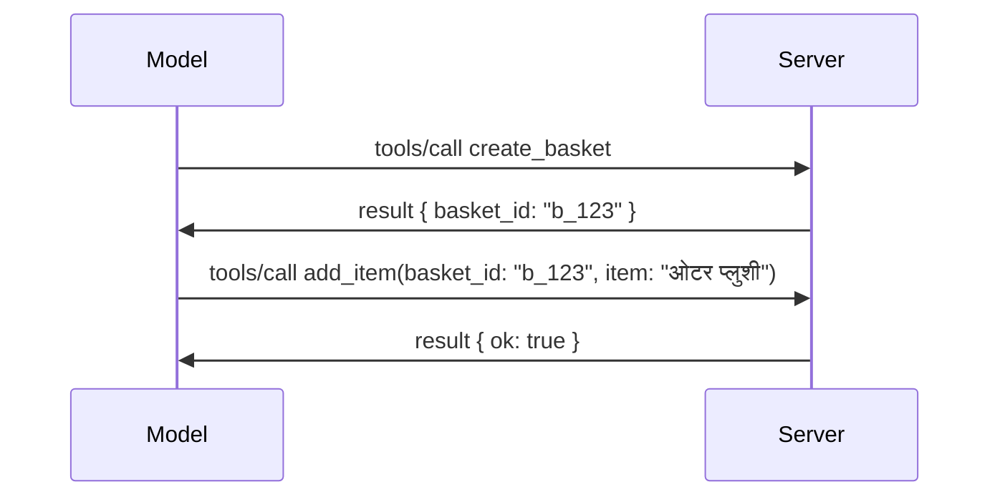

# MCP मा के परिवर्तन हुँदैछ: 2026-07-28 रिलिज क्याण्डिडेट

> **स्थिति:** रिलिज क्याण्डिडेट। `2026-07-28` स्पेसिफिकेसन लेख्ने समयमा अन्तिम छैन। यो मे २१, २०२६ मा घोषणा गरिएको थियो, र जुलाई २८, २०२६ मा शिप गर्न अनुसूची गरिएको छ। यस पाठ मा सबै कुरा रिलिज क्याण्डिडेटलाई वर्णन गर्दछ; निर्माण गर्नु अघि नवीनतम स्थितिका लागि [ड्राफ्ट स्पेसिफिकेसन](https://modelcontextprotocol.io/specification/draft) र यसको [चेंजलाग](https://modelcontextprotocol.io/specification/draft/changelog) जाँच गर्नुहोस्। बाँकी पाठ्यक्रम हालको स्थिर रिलिज, **MCP स्पेसिफिकेसन 2025-11-25** माथि लेखिएको छ, र `2026-07-28` शिप भएपछि अपडेट गरिनेछ।

## अवलोकन

`2026-07-28` MCP को सबैभन्दा ठूलो संशोधन हो जबदेखि यो सुरु भएको थियो। छवटा स्पेसिफिकेसन इन्हान्समेन्ट प्रस्तावहरूले (SEPs) प्रोटोकल-स्तर सत्रहरू हटाउँछन् र MCP लाई ट्रान्सपोर्ट तहमा स्टेटलेस बनाउँछन्, एक्सटेन्सनहरू पहिलो श्रेणीका, संस्करण गरिएको यन्त्र बन्न्छन्, र यस पाठ्यक्रममा पहिले सिकेका केही सुविधाहरू (रुटहरू, स्याम्पलिङ, लगिङ) नयाँ जीवनचक्र नीतिमा परिचालनमा नपर्ने (deprecated) घोषणा गरिएको छ। यो पाठमा के परिवर्तन हुँदैछ, किन महत्वपूर्ण छ, र `2025-11-25` विरुद्ध तपाईंले पहिले लेखेको कोडका लागि यसको अर्थ के हो भनेर संक्षेपमा वर्णन गरिएको छ।

स्रोत: [The 2026-07-28 MCP Specification Release Candidate](https://blog.modelcontextprotocol.io/posts/2026-07-28-release-candidate/) (Model Context Protocol Blog, डेविड सोरिया पार्रा र डेन डेलिमार्स्की).

## सिकाइका उद्देश्यहरू

यस पाठको अन्त्यसम्म, तपाईं सक्षम हुनुहुनेछ:

- MCP किन स्टेटलेस प्रोटोकल कोरमा सर्नु परेको छ र यो क्षैतिज स्केल गरिएको डिप्लोयमेण्टहरूका लागि कुन समस्या समाधान गर्छ व्याख्या गर्नुहोस्।
- `initialize`/`initialized` ह्याण्डशेक र `Mcp-Session-Id` हेडर कसरी प्रतिस्थापित हुन्छ भन्नुहोस्।
- नयाँ `Mcp-Method` र `Mcp-Name` हेडरहरू र `ttlMs`/`cacheScope` क्याचिङ मेटाडेटा पहिचान गर्नुहोस्।
- एक्सटेन्सन फ्रेमवर्क र यस रिलिजसँग आउँदै गरेको दुई एक्सटेन्सनहरू: MCP Apps र Tasks चिन्हित गर्नुहोस्।
- OAuth 2.0 / OIDC मेल खाने ६ वटा प्रामाणिकरण SEP हरू सूचीबद्ध गर्नुहोस्।
- कुन कोर सुविधाहरू (रुटहरू, स्याम्पलिङ, लगिङ) अहिले डिप्रिकेटेड छन् र व्यवहारमा यसको अर्थ के हो भन्नुहोस्।
- टुलको `inputSchema`/`outputSchema` को लागि फुल JSON Schema 2020-12 परिवर्तन वर्णन गर्नुहोस्।

## एक स्टेटलेस प्रोटोकल

मुख्य परिवर्तन: MCP प्रोटोकल तहमा स्टेटलेस हुन्छ।

### पहिले (2025-11-25): सत्रहरूले तपाईंलाई एउटै सर्भर इन्स्ट्यान्समा बाँध्छ

Streamable HTTP मार्फत टुल कल गर्दा `initialize` ह्याण्डशेकबाट शुरू हुन्छ। सर्भरले `Mcp-Session-Id` हेडर प्रतिक्रिया दिन्छ जुन प्रत्येक पछिल्लो अनुरोधले लैजानु पर्छ:

```http
POST /mcp HTTP/1.1
Mcp-Session-Id: 1868a90c-3a3f-4f5b
Content-Type: application/json

{"jsonrpc":"2.0","id":2,"method":"tools/call",
 "params":{"name":"search","arguments":{"q":"otters"}}}
```

किनकि सत्र जुन सर्भर इन्स्ट्यान्सले जारी गरेको छ, त्यसमा बाँधिएको हुन्छ, क्षैतिज रूपमा स्केल गरिएको डिप्लोयमेण्टले लोड ब्यालेन्सरमा **स्टिकी राउटिङ** र इन्स्ट्यान्सहरूमा साझा सत्र स्टोर आवश्यक पर्छ।

### पछि (2026-07-28): हरेक अनुरोध आफैँमा पूर्ण हुन्छ

```http
POST /mcp HTTP/1.1
MCP-Protocol-Version: 2026-07-28
Mcp-Method: tools/call
Mcp-Name: search
Content-Type: application/json

{"jsonrpc":"2.0","id":1,"method":"tools/call",
 "params":{"name":"search","arguments":{"q":"otters"},
           "_meta":{"io.modelcontextprotocol/clientInfo":{"name":"my-app","version":"1.0"}}}}
```

कुनै पनि सर्भर इन्स्ट्यान्स यो अनुरोध व्यवस्थापन गर्न सक्छ। प्रमुख परिवर्तनहरू:

- **`initialize`/`initialized` ह्याण्डशेक हटाइएको छ** ([SEP-2575](https://github.com/modelcontextprotocol/modelcontextprotocol/pull/2575)). प्रोटोकल संस्करण, क्लाइन्ट सूचना, र क्लाइन्ट क्षमता प्रत्येक अनुरोधमा `_meta` मा जान्छ। नयाँ `server/discover` मेथडले क्लाइन्टलाई आवश्यक हुँदा सर्भर क्षमताहरू सुरुमा फेच गर्न दिन्छ।
- **`Mcp-Session-Id` हेडर र प्रोटोकल-स्तर सत्र हटाइएको छ** ([SEP-2567](https://github.com/modelcontextprotocol/modelcontextprotocol/pull/2567)). प्रोटोकल तहमा स्टिकी राउटिङ र साझा सत्र स्टोर अब आवश्यक छैन।

### स्टेटलेस प्रोटोकल, स्टेटफुल एप्लिकेसनहरू

प्रोटोकल-स्तरको सत्र हटाए पनि तपाईंको सर्भर स्टेटफुल हुन सक्दैन भनेर अर्थ हुँदैन। सिफारिस गरिएको ढाँचा जुन HTTP API हरूले सदैव प्रयोग गर्दै आएका छन्: एउटा टुल कलबाट एउटा स्पष्ट ह्यान्डल (जस्तै `basket_id`, `browser_id`) बनाएर, मोडलले त्यो ह्यान्डललाई पछि कलहरूमा सामान्य आर्गुमेन्ट रूपमा फर्काइदिन्छ।



यसले राज्य मोडललाई देखिने र तर्कसंगत बनाउँछ बजाए ट्रान्सपोर्ट मेटाडेटामा लुकाएको भन्दा, र कुनै पनि सर्भर इन्स्ट्यान्सले कुनै पनि कल सम्बोधन गर्न सक्छ।

### सर्भर-देखि-क्लाइन्ट अनुरोधहरू, पुनः संरचित

स्टेटलेस प्रोटोकलले अझै सर्भरलाई कल धरिकै समयमा क्लाइन्टलाई केहि सोध्न सक्ने उपाय चाहिन्छ (जस्तै, उठाएको प्रम्प्ट):

- **सर्भर-प्रेरित अनुरोधहरू केवल जब सर्भर सक्रिय रूपमा क्लाइन्ट अनुरोध प्रक्रिया गरिरहेको हुन्छ तब मात्र जारी गर्न सकिन्छ** ([SEP-2260](https://github.com/modelcontextprotocol/modelcontextprotocol/pull/2260)) — पहिले यो सुझाव थियो, अब आवश्यक छ। प्रयोगकर्तालाई अचानक प्रम्प्ट दिइँदैन।
- **मल्टि राउन्ड-ट्रिप अनुरोधहरू** ([SEP-2322](https://github.com/modelcontextprotocol/modelcontextprotocol/pull/2322)) SSE स्ट्रिम खोलिराख्ने प्रक्रियाको सट्टा आउँछन्। सर्भरले `InputRequiredResult` फर्काउँछ:

  ```json
  {
    "resultType": "inputRequired",
    "inputRequests": {
      "confirm": {
        "type": "elicitation",
        "message": "Delete 3 files?",
        "schema": { "type": "boolean" }
      }
    },
    "requestState": "eyJzdGVwIjoxLCJmaWxlcyI6WyJhIiwiYiIsImMiXX0="
  }
  ```

  क्लाइन्ट जवाफहरू सङ्कलन गर्छ र मूल कललाई `inputResponses` र इको गरिएको `requestState` सहित फेरि पठाउँछ। कुनै पनि सर्भर इन्स्ट्यान्सले पुन: प्रयास लिन सक्छ किनकि आवश्यक सबै कुरा प्यालोडमा हुन्छ।

### मार्गयोग्य, क्यासयोग्य, ट्रेसयोग्य

तीन साना परिवर्तनहरूले स्टेटलेस ट्राफिक सजिलै सञ्चालन गर्न मद्दत गर्छन्:

- **Streamable HTTP मा `Mcp-Method` र `Mcp-Name` हेडरहरू आवश्यक हुन्छन्** ([SEP-2243](https://github.com/modelcontextprotocol/modelcontextprotocol/pull/2243)) ताकि लोड ब्यालेन्सर, गेटवे, र रेट लिमिटरहरूले JSON बडी नहेरी अपरेसनको आधारमा राउट गर्न सकून्। सर्भरहरूले हेडर र बडी मेल नखाने अनुरोधहरू अस्वीकृत गर्छन्।
- **`tools/list` र स्रोत पढ्ने नतिजाहरू `ttlMs` र `cacheScope` लिएर आउँछन्** ([SEP-2549](https://github.com/modelcontextprotocol/modelcontextprotocol/pull/2549)), HTTP `Cache-Control` लाई मोडेल गर्दै। क्लाइन्टहरूले थाहा पाउँछन् कति समयसम्म लिस्ट नतिजा ताजा हुन्छ र के यो प्रयोगकर्ताहरू बीच सुरक्षित रूपमा साझा गर्न मिल्छ, लामो समयको SSE स्ट्रिम बिना।
- **`_meta` भित्र W3C ट्रेस कन्टेक्स्ट प्रचार गरिएको छ** ([SEP-414](https://github.com/modelcontextprotocol/modelcontextprotocol/pull/414)), `traceparent`, `tracestate`, र `baggage` कुञ्जी नामहरूको दस्तावेजीकरण गर्दै ताकि एक वितरित ट्रेसले क्लाइन्ट SDK, MCP सर्भर, र डाउनस्ट्रीम प्रणालीहरूमा [OpenTelemetry](https://opentelemetry.io/) संगत ब्याकएन्डमा कललाई पछ्याउन सकोस्।

## एक्सटेन्सनहरू पहिलो श्रेणीका बन्छन्

एक्सटेन्सनहरू `2025-11-25` मा अनौपचारिक रूपमा थिए। [SEP-2133](https://github.com/modelcontextprotocol/modelcontextprotocol/pull/2133) ले यसलाई औपचारिक बनाउँछ:

- एक्सटेन्सनहरू रिभर्स-DNS ID द्वारा चिनिन्छ।
- तिनीहरू क्लाइन्ट र सर्भर क्षमताहरूमा `extensions` नक्साको माध्यमबाट निगोसिएट गरिन्छ।
- तिनीहरू आफ्नै `ext-*` रिपोजिटरीहरूमा बाँच्छन् जसमा प्रतिनिधि मेन्टेनरहरू हुन्छन् र कोर स्पेसिफिकेसनको स्वतन्त्र संस्करण हुन्छ।
- SEP प्रक्रियामा नयाँ एक्सटेन्सन ट्र्याकले तिनीहरूलाई प्रयोगात्मकबाट आधिकारिकसम्म लैजान मार्ग दिन्छ।

यस रिलिजमा दुई आधिकारिक एक्सटेन्सन पठाइन्छ।

### MCP Apps: सर्भर-रेन्डर्ड प्रयोगकर्ता इन्टरफेसहरू

[MCP Apps](https://blog.modelcontextprotocol.io/posts/2026-01-26-mcp-apps/) ([SEP-1865](https://github.com/modelcontextprotocol/modelcontextprotocol/pull/1865)) ले सर्भरहरूलाई अन्तरक्रियात्मक HTML इन्टरफेसहरू पठाउन दिन्छ जुन होस्टहरूले स्यान्डबक्स्ड iframe मा रेन्डर गर्छन्। टुलहरूले आफ्नो UI टेम्प्लेटहरू पहिल्यै घोषणा गर्छन् ताकि होस्टहरूले तिनीहरूलाई प्रिफेच, क्यास, र सुरक्षा समीक्षा गर्न सकून्। तपाईंले पहिले नै [पाठ १५: MCP Apps](../03-GettingStarted/15-mcp-apps/README.md)मा यसका आधारभूत कुरा सिकिसक्नु भएको छ — एक्सटेन्सन फ्रेमवर्क अन्तर्गत, MCP Apps अब औपचारिक रूपमा एउटा एक्सटेन्सन हो न कि प्रयोगात्मक कोर सुविधा।

### Tasks एक एक्सटेन्सनमा प्रतिष्ठित हुन्छ

Tasks लाई `2025-11-25` मा प्रयोगात्मक कोर सुविधाको रूपमा पठाइएको थियो। उत्पादन प्रयोगले पुनः डिजाइन आवश्यक भएको देखायो र यसको उचित घर एक एक्सटेन्सन हो: [Tasks एक्सटेन्सन](https://github.com/modelcontextprotocol/modelcontextprotocol/pull/2663)ले जीवनचक्रलाई स्टेटलेस मोडेल वरिपरि पुन:आकार दिन्छ — सर्भरले `tools/call` सँग टास्क ह्यान्डल जवाफ दिन सक्छ, र क्लाइन्टले `tasks/get`, `tasks/update`, र `tasks/cancel` सँग यसलाई अगाडि बढाउँछ। टास्क सिर्जना सर्भरले निर्देशित गर्छ: क्लाइन्टले एक्सटेन्सन प्रचार गर्छ, र सर्भरले निर्णय गर्छ कहिले कल टास्क रूपमा चलाउनु। `tasks/list` पूर्ण रूपमा हटाइन्छ किनकि सुरक्षित स्कोपिङ सत्र बिना सम्भव छैन।

> **स्थानान्तरण नोट:** यदि तपाईंले प्रयोगात्मक `2025-11-25` Tasks API लागू गर्नुभएको छ भने, तपाईंले नयाँ एक्सटेन्सन जीवनचक्रमा माइग्रेट गर्नु पर्छ — यो पछाडि मिल्दोजुल्दो छैन।

## प्रामाणिकरणलाई कडा बनाइएको

छवटा SEP हरूले [प्रामाणिकरण स्पेसिफिकेसन](https://modelcontextprotocol.io/specification/draft/basic/authorization) लाई कडा बनाउँछन् ताकि वास्तविक ओथ २.० / ओपनआईडी कनेक्त डिप्लोयमेन्टसँग अधिक मेल खान सकोस्:

| SEP | परिवर्तन |
|---|---|
| [SEP-2468](https://github.com/modelcontextprotocol/modelcontextprotocol/pull/2468) | क्लाइन्टहरूले प्रामाणिकरण प्रतिक्रियाहरूमा `iss` प्यारामिटरलाई [RFC 9207](https://www.rfc-editor.org/rfc/rfc9207) अनुसार मान्य गर्नुपर्छ, MCP को एकल-क्लाइन्ट, धेरै-सर्भर ढाँचामा प्रचलित मिक्स-अप आक्रमणहरू कम गर्न। भविष्यको संस्करणले `iss` नभएका प्रतिक्रियाहरू अस्वीकृत गर्नुपर्नेछ। |
| [SEP-837](https://github.com/modelcontextprotocol/modelcontextprotocol/pull/837) | क्लाइन्टहरूले डायनामिक क्लाइन्ट दर्ताकरणको दौरान आफ्नो OpenID Connect `application_type` घोषणा गर्नुपर्छ, जसले प्रामाणिकरण सर्भरहरूलाई डेस्कटप/CLI क्लाइन्टलाई `"web"` बनाउने र यसको localhost रिडाइरेक्ट URI अस्वीकृत गर्ने पूर्वानुमानबाट बचाउँछ। |
| [SEP-2352](https://github.com/modelcontextprotocol/modelcontextprotocol/pull/2352) | क्लाइन्टहरूले दर्ता गरिएको प्रमाणपत्रहरू जारी गर्ने प्रामाणिकरण सर्भरको `issuer` संग बाँध्ने र स्रोतहरू प्रामाणिकरण सर्भरहरूको बीचमा सर्नाले फेरि दर्ता गर्ने। |
| [SEP-2207](https://github.com/modelcontextprotocol/modelcontextprotocol/pull/2207) | OpenID Connect-शैली प्रामाणिकरण सर्भरहरूबाट रिफ्रेस टोकन कसरी माग गर्ने भन्ने दस्तावेज बनाउँछ। |
| [SEP-2350](https://github.com/modelcontextprotocol/modelcontextprotocol/pull/2350) | स्टेप-अप प्रामाणिकरणको क्रममा स्कोप संकलन स्पष्ट गर्छ। |
| [SEP-2351](https://github.com/modelcontextprotocol/modelcontextprotocol/pull/2351) | `.well-known` डिस्कभरी सुफिक्स स्पष्ट पार्छ। |

आज MCP का लागि प्रामाणिकरण सर्भर निर्माण गर्दै हुनुहुन्छ भने, अहिले नै प्रामाणिकरण प्रतिक्रियामा `iss` आपूर्ति गर्न सुरु गर्नुहोस् — वर्तमान प्रामाणिकरण निर्देशनको लागि [02-Security](../02-Security/README.md) हेर्नुस् जसमा यो आधारित हुनेछ।

## Roots, Sampling, र Logging डिप्रिकेटेड छन्

नयाँ [फिचर जीवनचक्र नीतिअन्तर्गत](https://github.com/modelcontextprotocol/modelcontextprotocol/pull/2577) ([SEP-2577](https://github.com/modelcontextprotocol/modelcontextprotocol/pull/2577)), तपाइँले [Core Concepts](./README.md#roots) मा सिकेका तीन कोर क्लाइन्ट प्रिमिटिभहरूले **Deprecated** स्थिति पाउँछन्:

| सुविधा | सिफारिस गरिएको प्रतिस्थापन |
|---|---|
| Roots | टुल प्यारामिटरहरू, स्रोत URI हरू, वा सर्भर कन्फिगरेसन |
| Sampling | प्रत्यक्ष LLM प्रदायक API हरूसँग एकीकरण |
| Logging | stdio ट्रान्सपोर्टहरूका लागि `stderr`; संरचित अवलोकनका लागि OpenTelemetry |

यी केवल **एनोटेशन मात्र डिप्रिकेटेड** हुन्: मेथडहरू, प्रकारहरू, र क्षमता झण्डाहरू यस रिलिज र त्यसका एक वर्ष भित्र प्रकाशित सबै संस्करणहरूमा काम गर्नेछन्। तिनीहरूलाई पूर्ण रूपमा हटाउन जीवनचक्र नीतिअनुसार अर्को SEP आवश्यक पर्छ — त्यसैले तपाईंको विद्यमान [Sampling](../03-GettingStarted/14-sampling/README.md) नमूनाहरू आजको लागि कुनै समस्या हुँदैन, तर नयाँ सर्भरहरूले माथिका प्रतिस्थापन प्याटर्नहरू प्राथमिकता दिनुपर्छ।

## टुलहरूको लागि पूर्ण JSON Schema 2020-12

टुल `inputSchema` र `outputSchema` फुल [JSON Schema 2020-12](https://json-schema.org/draft/2020-12) मा उन्नत गरिएको छ ([SEP-2106](https://github.com/modelcontextprotocol/modelcontextprotocol/pull/2106)):

- इनपुट स्किमाहरूले `type: "object"` मूल प्रतिबन्ध राख्छन् तर अब संरचना (`oneOf`, `anyOf`, `allOf`), सर्तहरू, र सन्दर्भहरू (`$ref`, `$defs`) अनुमति दिन्छन्।
- आउटपुट स्किमाहरू अनियन्त्रित छन्, र `structuredContent` अब कुनै JSON मान पनि हुन सक्छ Object मात्रै नभएर।
- कार्यान्वयनहरूले बाह्य `$ref` URI हरूलाई स्वतः-डिरेफरेन्स गर्नुहुँदैन र स्किमा गहिराई र मान्यताको समय सिमित गर्नुपर्छ (यदि तपाईंले सर्भर-साइड स्किमा मान्यता गर्नुहुन्छ भने यो denial-of-service विचार हो)।

अलग्गै, स्रोत नभएको त्रुटि कोड MCP-विशेष `-32002` बाट JSON-RPC मापदण्ड `-32602` (अमान्य प्याराम) मा परिवर्तन भएको छ ([SEP-2164](https://github.com/modelcontextprotocol/modelcontextprotocol/pull/2164))। यदि तपाईंको क्लाइन्टले literal `-32002` को आधारमा मेल गर्छ भने, यसलाई अपडेट गर्न आवश्यक छ।

## प्रोटोकल यहाँबाट कसरी विकास हुँदैछ

यस रिलिजमा भत्काउने परिवर्तनहरू छन्, जुन MCP मर्मतकर्ताहरूले भविष्यमा सामान्य हुने उम्मीद गर्दैनन्। तीन शासन SEPs यसलाई दोहोरो हुनबाट रोक्ने प्रयास गर्दछ:

- **फिचर जीवनचक्र नीति** प्रत्येक सुविधालाई सक्रिय → डिप्रिकेटेड → हटाइएको बाटो दिन्छ, जहाँ डिप्रिकेट र सबैभन्दा पहिले हटाउने बीच कम्तीमा बारह महिना हुन्छ।
- **एक्सटेन्सन फ्रेमवर्क** ले नयाँ क्षमता opt-in एक्सटेन्सनको रूपमा पठाउन दिन्छ र त्यहाँ स्थिर बनाउँछ, यदि कहिल्यै कोर स्पेसिफिकेसनमा जान्छ भने।

- एउटा स्ट्यान्डर्ड ट्र्याक SEP अन्तिम स्थिति सम्म पुग्न सक्दैन जबसम्म मेल खाने परिस्थिति [conformance suite](https://github.com/modelcontextprotocol/conformance) मा राखिएको हुँदैन ([SEP-2484](https://github.com/modelcontextprotocol/modelcontextprotocol/pull/2484)) — सोही सुइटमा [SDK स्तर प्रणाली](https://github.com/modelcontextprotocol/modelcontextprotocol/pull/1777) ले आधिकारिक SDK हरूलाई स्कोर गर्दछ।

## रिलिज समयरेखा र प्रमाणीकरण

- रिलिज उम्मेदवार मे 21, 2026 मा लक गरिएको थियो।
- अन्तिम विशिष्टता जुलाई 28, 2026 मा तय गरिएको छ।
- यी दुई बीचको दस हप्ता लामो विन्डोले SDK मेन्टेनरहरू र क्लाइन्ट कार्यान्वयनकर्ताहरूलाई वास्तविक कार्यभारहरूसँग परिवर्तनहरू प्रमाणीकरण गर्न अनुमति दिन्छ; स्तर 1 SDK हरूलाई [SDK स्तर प्रणाली](https://modelcontextprotocol.io/docs/sdk) अन्तर्गत यो विन्डो भित्र समर्थन पठाउने अपेक्षा गरिन्छ।
- सम्पूर्ण परिवर्तनहरू ट्र्याक गर्न [ड्राफ्ट विशिष्टता](https://modelcontextprotocol.io/specification/draft) र यसको [चेंजलग](https://modelcontextprotocol.io/specification/draft/changelog) मा हेर्नुहोस्।

## यस पाठ्यक्रमका लागि यसको अर्थ के हो

अहिलेसम्म तपाईंले यो पाठमा सिक्नुभएको सबै कुरा **2025-11-25** लक्षित छ, जुन `2026-07-28` रिलिज नभएसम्म वर्तमान स्थिर विशिष्टता रहन्छ। स्पष्ट रूपमा:

- **सत्रहरू र `initialize` हैंडशेक** ([Core Concepts](./README.md) र [Lesson 6: HTTP Streaming](../03-GettingStarted/06-http-streaming/README.md) मा समेटिएको) अझै आजको अनुसार कार्य गर्छ, तर तपाईं `2026-07-28`-संगत SDK हरूमा अपग्रेड गरेपछि माथिको स्टेटलेस अनुरोध मोडलले तिनीहरूलाई प्रतिस्थापन गर्ने अपेक्षा गर्नुहोस्।
- **स्याम्प्लिंग र रूटहरू** ([Core Concepts](./README.md) मा पनि समेटिएको) पूर्ण रूपमा कार्यरत छन् तर अब डिप्रिकेट गरिएको छ — नयाँ डिजाइनहरूले माथि उल्लिखित प्रतिस्थापन ढाँचाहरूलाई प्राथमिकता दिनुपर्छ।
- **प्रयोगात्मक टास्क सुविधा**, यदि तपाईले यसलाई प्रयोग गर्नुभएको छ भने, टास्क विस्तारको नयाँ जीवनचक्रमा स्थानान्तरण गर्न आवश्यक पर्छ।
- **MCP एपहरू** ([Lesson 15](../03-GettingStarted/15-mcp-apps/README.md)) व्यवहारमा प्रभावित छैन; यो केवल औपचारिक एक्सटेन्सन फ्रेमवर्क भित्र सारिएको हो।

## थप स्रोतहरू

- [२०२६-०७-२८ MCP विशिष्टता रिलिज उम्मेदवार (ब्लग पोस्ट)](https://blog.modelcontextprotocol.io/posts/2026-07-28-release-candidate/)
- [MCP यातायातहरूको भविष्य](https://blog.modelcontextprotocol.io/posts/2025-12-19-mcp-transport-future/)
- [MCP ड्राफ्ट विशिष्टता](https://modelcontextprotocol.io/specification/draft)
- [MCP ड्राफ्ट चेंजलग](https://modelcontextprotocol.io/specification/draft/changelog)
- [SEP दिशानिर्देशहरू](https://modelcontextprotocol.io/community/sep-guidelines)
- [MCP SDK स्तर प्रणाली](https://modelcontextprotocol.io/docs/sdk)

## अर्को चरणहरू

[Core Concepts](./README.md) मा फर्कनुहोस् वा [Security](../02-Security/README.md) तर्फ जानुहोस् र हेर्नुहोस् आजको `2025-11-25` मार्गदर्शन आउँदै गरेको के मा म्याप हुन्छ।

---

<!-- CO-OP TRANSLATOR DISCLAIMER START -->
**अस्वीकरण**:
यो दस्तावेज़ AI अनुवाद सेवा [Co-op Translator](https://github.com/Azure/co-op-translator) प्रयोग गरेर अनुवाद गरिएको हो। हामी सही हुन प्रयास गर्छौं, तर कृपया जानकार हुनुस् कि स्वचालित अनुवादमा त्रुटिहरू वा अशुद्धताहरू हुन सक्छन्। मूल दस्तावेज़ यसको मूल भाषामा आधिकारिक स्रोत मानिनुपर्छ। महत्वपूर्ण जानकारीका लागि व्यावसायिक मानव अनुवाद सिफारिस गरिन्छ। यस अनुवादको प्रयोगबाट उत्पन्न कुनै पनि गलत बुझाइ वा त्रुटिको लागि हामी जिम्मेवार छैनौं।
<!-- CO-OP TRANSLATOR DISCLAIMER END -->