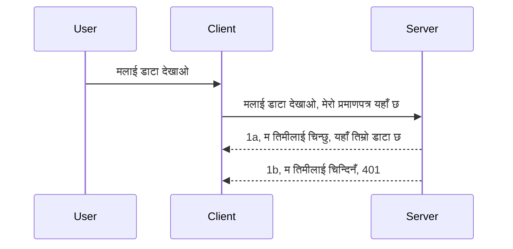

# सरल प्रमाणीकरण

MCP SDK हरूले OAuth 2.1 को प्रयोग समर्थन गर्दछ जुन एक साँच्चै संलग्न प्रक्रिया हो जसले प्रमाणीकरण सर्भर, स्रोत सर्भर, प्रमाणपत्रहरू पोष्ट गर्ने, कोड प्राप्त गर्ने, कोडलाई बिअरर टोकनमा साटासाट गर्ने सम्मको अवधारणा समावेश गर्दछ जबसम्म तपाईं अन्त्यमा आफ्नो स्रोत डेटा प्राप्त गर्न सक्नुहुन्न। यदि तपाईं OAuth मा नयाँ हुनुहुन्छ जुन कार्यान्वयन गर्ने एक राम्रो कुरा हो भने, आधारभूत स्तरको प्रमाणीकरणबाट सुरु गर्न र राम्रो सुरक्षा सम्म विस्तार गर्न सल्लाह दिइन्छ। त्यसैले यो अध्याय छ, तपाईंलाई थप उन्नत प्रमाणीकरणसम्म निर्माण गर्न।

## प्रमाणीकरण भन्नाले के बुझाउँछौं?

प्रमाणीकरण र अनुमति को छोटकरी हो प्रमाणीकरण। विचार हो हामीले दुई कुराहरू गर्न आवश्यक छ:

- **प्रमाणीकरण**, जसले पत्ता लगाउँछ कि हामीले कसैलाई हाम्रो घरमा प्रवेश गर्न दिनुपर्छ कि छैन, अर्थात् उनीहरूसँग "यहाँ" रहने अधिकार छ कि छैन, जहाँ हाम्रो MCP सर्भरका फिचरहरू छन्।
- **अनुमति**, यो प्रक्रिया हो पत्ता लगाउन यदि कुनै प्रयोगकर्ताले ती विशिष्ट स्रोतहरू पहुँच गर्नु पर्छ कि छैन जुन उनीहरू माग गर्दैछन्, उदाहरणका लागि ती अर्डरहरू वा ती उत्पादनहरू वा उनीहरूलाई सामग्री पढ्न अनुमति छ तर मेटाउन होइन भने जस्ता उदाहरणहरू।

## प्रमाणपत्रहरू: हामीले सिस्टमलाई कसरी आफूलाई बताउँछौं

ठिकै छ, धेरै वेब विकासकर्ताहरू प्रायः सर्भरलाई प्रमाणपत्र प्रदान गर्ने, प्रायः एउटा गोप्य कुञ्जी जुन उनीहरूलाई यहाँ आउन अनुमति छ भन्ने बोलेर "प्रमाणीकरण" सोच्न थाल्छन्। यो प्रमाणपत्र प्रायः प्रयोगकर्ता नाम र पासवर्डको base64 इन्कोडेड संस्करण वा कुनै API कुञ्जी हुन्छ जुन विशिष्ट प्रयोगकर्तालाई अनौठो तरिकाले चिन्हित गर्दछ।

यसलाई "Authorization" भनेर चिनिने हेडरबाट पठाइन्छ यसरी:

```json
{ "Authorization": "secret123" }
```

यसलाई प्रायः आधारभूत प्रमाणीकरण भनिन्छ। त्यसपछि समग्र फ्लो यसरी काम गर्छ:



अब हामीले प्रवाहको आधारमा कसरी काम गर्छ बुझ्यौं, यसको कार्यान्वयन कसरी गर्ने? प्रायः वेब सर्भरहरूमा 'middleware' भनिने कोडको एउटा भाग हुन्छ जुन अनुरोधको हिस्साको रूपमा चल्छ, जसले प्रमाणपत्रहरू जाँच गर्छ र यदि प्रमाणपत्र मान्य छ भने अनुरोधलाई पास हुन दिन्छ। यदि प्रमाणपत्रहरू मान्य छैनन् भने प्रमाणीकरण त्रुटि प्राप्त हुन्छ। हेर्नुहोस् कसरी यो कार्यान्वयन गर्न सकिन्छ:

**Python**

```python
class AuthMiddleware(BaseHTTPMiddleware):
    async def dispatch(self, request, call_next):

        has_header = request.headers.get("Authorization")
        if not has_header:
            print("-> Missing Authorization header!")
            return Response(status_code=401, content="Unauthorized")

        if not valid_token(has_header):
            print("-> Invalid token!")
            return Response(status_code=403, content="Forbidden")

        print("Valid token, proceeding...")
       
        response = await call_next(request)
        # कुनै पनि ग्राहक हेडर थप्नुहोस् वा जवाफमा कुनै पनि तरिकाले परिवर्तन गर्नुहोस्
        return response


starlette_app.add_middleware(CustomHeaderMiddleware)
```

यहाँ हामीले:

- `AuthMiddleware` नामक middleware सिर्जना गरेका छौं जहाँ यसको `dispatch` विधि वेब सर्भरद्वारा बोलाइन्छ।
- middleware वेब सर्भरमा थपिएको छ:

    ```python
    starlette_app.add_middleware(AuthMiddleware)
    ```

- जाँच गर्ने प्रमाणीकरण लॉजिक लेखिएको छ कि Authorization हेडर छ कि छैन र पठाइएको गोप्य कुञ्जी मान्य छ कि छैन:

    ```python
    has_header = request.headers.get("Authorization")
    if not has_header:
        print("-> Missing Authorization header!")
        return Response(status_code=401, content="Unauthorized")

    if not valid_token(has_header):
        print("-> Invalid token!")
        return Response(status_code=403, content="Forbidden")
    ```

    यदि गोप्य कुञ्जी छ र मान्य छ भने, हामी `call_next` कल गरेर अनुरोधलाई पास गर्छौं र प्रतिक्रिया फर्काउँछौं।

    ```python
    response = await call_next(request)
    # कुनै पनि ग्राहक हेडर थप्नुहोस् वा प्रतिक्रिया फरक तरिकाले परिवर्तन गर्नुहोस्
    return response
    ```

यसरी यदि वेब अनुरोध सर्भरमा गरिन्छ भने middleware बोलाइनेछ र यसको कार्यान्वयन अनुसार अनुरोधलाई पास गर्न वा क्लाइन्ट अनुमति प्राप्त नगरेको त्रुटि फर्काउन सक्छ।

**TypeScript**

यहाँ हामी लोकप्रिय फ्रेमवर्क Express सँग middleware सिर्जना गर्छौं र MCP सर्भर पुग्नु अघि अनुरोधलाई इंटरसिप्ट गर्छौं। यसको लागि कोड यस प्रकार छ:

```typescript
function isValid(secret) {
    return secret === "secret123";
}

app.use((req, res, next) => {
    // १. प्राधिकरण हेडर छ कि छैन?
    if(!req.headers["Authorization"]) {
        res.status(401).send('Unauthorized');
    }
    
    let token = req.headers["Authorization"];

    // २. वैधता जाँच गर्नुहोस्।
    if(!isValid(token)) {
        res.status(403).send('Forbidden');
    }

   
    console.log('Middleware executed');
    // ३. अनुरोधलाई अनुरोध पाइपलाइनको अर्को चरणमा पास गर्दछ।
    next();
});
```

यस कोडमा हामीले:

1. पहिले Authorization हेडर छ कि छैन जाँच गर्छौं, नभए 401 त्रुटि पठाउँछौं।
2. प्रमाणपत्र/टोकन मान्य छ कि छैन जाँच गर्छौं, नभए 403 त्रुटि पठाउँछौं।
3. अन्ततः अनुरोधलाई अनुरोध पाइपलाइनमा पास गर्छौं र माग गरिएको स्रोत फर्काउँछौं।

## अभ्यास: प्रमाणीकरण कार्यान्वयन गर्नुहोस्

हाम्रो ज्ञान लिएर कार्यान्वयन गर्ने प्रयास गरौं। योजनाः

सर्भर

- वेब सर्भर र MCP उदाहरण सिर्जना गर्नुहोस्।
- सर्भरका लागि middleware कार्यान्वयन गर्नुहोस्।

क्लाइन्ट 

- हेडरमार्फत प्रमाणपत्र सहित वेब अनुरोध पठाउनुहोस्।

### -1- वेब सर्भर र MCP उदाहरण सिर्जना गर्नुहोस्

> **अगाडि हेर्दै:** तलको TypeScript उदाहरणले `mcp-session-id` द्वारा कुञ्जी गरिएको `transports` नक्सामा HTTP ट्रान्सपोर्टहरू ट्र्याक गर्दछ, **MCP Specification 2025-11-25** अनुसार। `2026-07-28` रिलिज कैंडिडेटले `initialize` ह्याण्डशेक र सेसन ID पूर्ण रूपमा हटाउँछ, त्यसैले प्रत्येक सेसन ट्रान्सपोर्ट नक्शा हटेर स्टेटलेस, आत्मनिर्भर अनुरोधमा परिणत हुन्छ। हेर्नुहोस् [MCP मा के परिवर्तन हुँदैछ: 2026-07-28 रिलिज कैंडिडेट](../../01-CoreConcepts/mcp-2026-07-28-release-candidate.md)।

हाम्रो पहिलो चरणमा, हामीले वेब सर्भर र MCP सर्भर उदाहरण सिर्जना गर्नुपर्छ।

**Python**

यहाँ हामी MCP सर्भर उदाहरण सिर्जना गर्छौं, starlette वेब एप सिर्जना गर्छौं र uvicorn सँग होस्ट गर्छौं।

```python
# MCP सर्भर बनाउँदै

app = FastMCP(
    name="MCP Resource Server",
    instructions="Resource Server that validates tokens via Authorization Server introspection",
    host=settings["host"],
    port=settings["port"],
    debug=True
)

# starlette वेब अनुप्रयोग बनाउँदै
starlette_app = app.streamable_http_app()

# uvicorn मार्फत अनुप्रयोग सेवा गर्दै
async def run(starlette_app):
    import uvicorn
    config = uvicorn.Config(
            starlette_app,
            host=app.settings.host,
            port=app.settings.port,
            log_level=app.settings.log_level.lower(),
        )
    server = uvicorn.Server(config)
    await server.serve()

run(starlette_app)
```

यस कोडमा हामीले:

- MCP सर्भर सिर्जना गर्‍यो।
- MCP सर्भरबाट starlette वेब एप बनायो, `app.streamable_http_app()`।
- uvicorn प्रयोग गरी वेब एप होस्ट र सर्भ गर्‍यो `server.serve()`.

**TypeScript**

यहाँ हामी MCP सर्भर उदाहरण सिर्जना गर्छौं।

```typescript
const server = new McpServer({
      name: "example-server",
      version: "1.0.0"
    });

    // ... सर्भर स्रोतहरू, उपकरणहरू, र संकेतहरू सेट अप गर्नुहोस् ...
```

यो MCP सर्भर सिर्जना हाम्रो POST /mcp रुट परिभाषामा हुनु पर्छ, त्यसैले माथिको कोडलाई यसरी सारौं:

```typescript
import express from "express";
import { randomUUID } from "node:crypto";
import { McpServer } from "@modelcontextprotocol/sdk/server/mcp.js";
import { StreamableHTTPServerTransport } from "@modelcontextprotocol/sdk/server/streamableHttp.js";
import { isInitializeRequest } from "@modelcontextprotocol/sdk/types.js"

const app = express();
app.use(express.json());

// सत्र ID द्वारा ट्रान्सपोर्टहरू भण्डारण गर्न नक्सा
const transports: { [sessionId: string]: StreamableHTTPServerTransport } = {};

// क्लाइन्ट-देखि-सर्भर संचारका लागि POST अनुरोधहरू प्रबन्ध गर्नुहोस्
app.post('/mcp', async (req, res) => {
  // अवस्थित सत्र ID जाँच गर्नुहोस्
  const sessionId = req.headers['mcp-session-id'] as string | undefined;
  let transport: StreamableHTTPServerTransport;

  if (sessionId && transports[sessionId]) {
    // अवस्थित ट्रान्सपोर्ट पुन: प्रयोग गर्नुहोस्
    transport = transports[sessionId];
  } else if (!sessionId && isInitializeRequest(req.body)) {
    // नयाँ पहल अनुरोध
    transport = new StreamableHTTPServerTransport({
      sessionIdGenerator: () => randomUUID(),
      onsessioninitialized: (sessionId) => {
        // सत्र ID द्वारा ट्रान्सपोर्ट भण्डारण गर्नुहोस्
        transports[sessionId] = transport;
      },
      // DNS पुनःबंधन सुरक्षा पूर्वनिर्धारित रूपमा पछिल्लो संगतताका लागि अक्षम गरिएको छ। यदि तपाईं यो सर्भर
      // स्थानीय रूपमा चलाउँदै हुनुहुन्छ भने, निश्चित गर्नुहोस् कि सेट गर्नुहोस्:
      // enableDnsRebindingProtection: true,
      // allowedHosts: ['127.0.0.1'],
    });

    // ट्रान्सपोर्ट बन्द हुँदा सफा गर्नुहोस्
    transport.onclose = () => {
      if (transport.sessionId) {
        delete transports[transport.sessionId];
      }
    };
    const server = new McpServer({
      name: "example-server",
      version: "1.0.0"
    });

    // ... सर्भर स्रोतहरू, उपकरणहरू, र प्रॉम्प्टहरू सेट अप गर्नुहोस् ...

    // MCP सर्भरसँग जडान गर्नुहोस्
    await server.connect(transport);
  } else {
    // अमान्य अनुरोध
    res.status(400).json({
      jsonrpc: '2.0',
      error: {
        code: -32000,
        message: 'Bad Request: No valid session ID provided',
      },
      id: null,
    });
    return;
  }

  // अनुरोध प्रबन्ध गर्नुहोस्
  await transport.handleRequest(req, res, req.body);
});

// GET र DELETE अनुरोधहरूको लागि पुन: प्रयोग योग्य ह्यान्डलर
const handleSessionRequest = async (req: express.Request, res: express.Response) => {
  const sessionId = req.headers['mcp-session-id'] as string | undefined;
  if (!sessionId || !transports[sessionId]) {
    res.status(400).send('Invalid or missing session ID');
    return;
  }
  
  const transport = transports[sessionId];
  await transport.handleRequest(req, res);
};

// SSE मार्फत सर्भर-देखि-क्लाइन्ट सूचना हरूका लागि GET अनुरोधहरू प्रबन्ध गर्नुहोस्
app.get('/mcp', handleSessionRequest);

// सत्र समाप्तिको लागि DELETE अनुरोधहरू प्रबन्ध गर्नुहोस्
app.delete('/mcp', handleSessionRequest);

app.listen(3000);
```

अब तपाईं देख्न सक्नुहुन्छ कि MCP सर्भर सिर्जना `app.post("/mcp")` भित्र सारिएको छ।

अब हामी आउँदा चरणमा जान्छौं: middleware सिर्जना जसले आउने प्रमाणपत्रको जाँच गर्नेछ।

### -2- सर्भरको लागि middleware कार्यान्वयन गर्नुहोस्

अब middleware भागमा जाऔं। यहाँ हामीले `Authorization` हेडरमा प्रमाणपत्र खोज्ने र त्यसलाई मान्य गर्ने middleware सिर्जना गर्नेछौं। यदि स्वीकार्य छ भने अनुरोध आफ्नो गन्तव्यतर्फ अघि बढ्नेछ (जस्तै उपकरण सूची, स्रोत पढ्न वा क्लाइन्टले मागेको MCP फिचर जे भए पनि)।

**Python**

middleware बनाउन, हामीले `BaseHTTPMiddleware` बाट इनहेरिट गर्ने क्लास बनाउनुपर्छ। दुई रोचक कुरा छन्:

- `request` अनुरोध जसबाट हामीले हेडर जानकारी पढ्छौं।
- `call_next`, कलब्याक जुन हामीले कल गर्नुपर्छ यदि क्लाइन्टले ल्याएको प्रमाणपत्र हामीले स्वीकार्य छ भने।

पहिलो, हामीले `Authorization` हेडर नभएको अवस्थामा ह्यान्डल गर्नु पर्छ:

```python
has_header = request.headers.get("Authorization")

# शीर्षक उपस्थित छैन, 401 को साथ असफल हुनुहोस्, अन्यथा अगाडि बढ्नुहोस्।
if not has_header:
    print("-> Missing Authorization header!")
    return Response(status_code=401, content="Unauthorized")
```

यहाँ हामी 401 unauthorized सन्देश पठाउँछौं किनकि क्लाइन्ट प्रमाणीकरणमा असफल हुँदैछ।

त्यसपछि, यदि प्रमाणपत्र पेश गरिएको छ भने हामी यसलाई यसरी मान्य गर्नु पर्छ:

```python
 if not valid_token(has_header):
    print("-> Invalid token!")
    return Response(status_code=403, content="Forbidden")
```

माथि देखाउनुभयो 403 forbidden सन्देश कस्तो पठाइन्छ। सबै middleware कोड तल हेर्नुहोस्:

```python
class AuthMiddleware(BaseHTTPMiddleware):
    async def dispatch(self, request, call_next):

        has_header = request.headers.get("Authorization")
        if not has_header:
            print("-> Missing Authorization header!")
            return Response(status_code=401, content="Unauthorized")

        if not valid_token(has_header):
            print("-> Invalid token!")
            return Response(status_code=403, content="Forbidden")

        print("Valid token, proceeding...")
        print(f"-> Received {request.method} {request.url}")
        response = await call_next(request)
        response.headers['Custom'] = 'Example'
        return response

```

राम्रो छ, तर `valid_token` फंक्शन के हो? यहाँ छ तल:

```python
# उत्पादनका लागि प्रयोग नगर्नुहोस् - यसलाई सुधार गर्नुहोस् !!
def valid_token(token: str) -> bool:
    # "Bearer " उपसर्ग हटाउनुहोस्
    if token.startswith("Bearer "):
        token = token[7:]
        return token == "secret-token"
    return False
```

यसलाई स्पष्ट रूपमा सुध्रयाउन आवश्यक छ।

महत्त्वपूर्ण: तपाईंले कहिल्यै यस्तो गोप्य कुञ्जी कोडमा नराख्नु पर्छ। उक्त मान तुलना गर्न डेटा स्रोत वा IDP (पहिचान सेवा प्रदायक) बाट प्राप्त गर्नु वा अझ राम्रो, IDP लाई प्रमाणीकरण गर्दा गराउनु राम्रो हुन्छ।

**TypeScript**

Express सँग यसको कार्यान्वयन गर्न हामीले `use` मेथड कल गर्नुपर्छ जुन middleware फंक्शनहरू लिन्छ।

हामीले गर्नु पर्ने छ:

- Request भेरिएबलसँग अन्तरक्रिया गरेर `Authorization` प्रोपर्टीमा पास प्रमाणपत्र जाँच गर्नु।
- प्रमाणपत्र मान्य छ कि छैन जाँच गर्नु, यदि हो भने अनुरोधलाई जारी राख्न र क्लाइन्टको MCP अनुरोधले आवश्यक काम गर्न दिनु (जस्तै उपकरण सूची, स्रोत पढ्ने वा अन्य MCP सम्बन्धित कार्य)।

यहाँ हामी जाँच गर्दैछौं कि `Authorization` हेडर छ कि छैन, छैन भने अनुरोध रोक्छौं:

```typescript
if(!req.headers["authorization"]) {
    res.status(401).send('Unauthorized');
    return;
}
```

यदि हेडर नै पठाइएको छैन भने 401 प्राप्त हुन्छ।

त्यसपछि हामी प्रमाणपत्र मान्य छ कि छैन जाँच गर्छौं, छैन भने पुनः अनुरोध रोक्छौं तर फरक सन्देशसहित:

```typescript
if(!isValid(token)) {
    res.status(403).send('Forbidden');
    return;
} 
```

यहाँ तपाईंले 403 त्रुटि पाउनुहुन्छ।

पूरा कोड यस प्रकार छ:

```typescript
app.use((req, res, next) => {
    console.log('Request received:', req.method, req.url, req.headers);
    console.log('Headers:', req.headers["authorization"]);
    if(!req.headers["authorization"]) {
        res.status(401).send('Unauthorized');
        return;
    }
    
    let token = req.headers["authorization"];

    if(!isValid(token)) {
        res.status(403).send('Forbidden');
        return;
    }  

    console.log('Middleware executed');
    next();
});
```

हामीले वेब सर्भरलाई middleware स्वीकार्न सेटअप गरायौं जो क्लाइन्टले पठाउने प्रमाणपत्र जाँच गर्छ। क्लाइन्ट त के छ?

### -3- हेडरमार्फत प्रमाणपत्रसहित वेब अनुरोध पठाउनुहोस्

हामीले सुनिश्चित गर्नुपर्छ क्लाइन्टले हेडरमा प्रमाणपत्र पठाइ रहेको छ। MCP क्लाइन्ट प्रयोग गर्दैछौं भने यो कसरी गर्ने बुझ्नुपर्छ।

**Python**

क्लाइन्टका लागि हेडरमा प्रमाणपत्र यसरी पठाउनुहोस्:

```python
# मान कडा नथप्नुहोस्, कम्तीमा यो वातावरण चर मा वा बढी सुरक्षित भण्डारण मा राख्नुहोस्
token = "secret-token"

async with streamablehttp_client(
        url = f"http://localhost:{port}/mcp",
        headers = {"Authorization": f"Bearer {token}"}
    ) as (
        read_stream,
        write_stream,
        session_callback,
    ):
        async with ClientSession(
            read_stream,
            write_stream
        ) as session:
            await session.initialize()
      
            # TODO, क्लाइन्टमा के गर्न चाहनुहुन्छ, जस्तै उपकरणहरूको सूची बनाउने, उपकरणहरू कल गर्ने आदि।
```

तपाईंले हेडर भर्न कसरी `headers = {"Authorization": f"Bearer {token}"}` लेखेको देख्नुहुन्छ।

**TypeScript**

हामी यसलाई दुई चरणमा समाधान गर्न सक्छौं:

1. कन्फिगरेसन वस्तुमा प्रमाणपत्र राख्नुहोस्।
2. कन्फिगरेसन वस्तु ट्रान्सपोर्टलाई पास गर्नुहोस्।

```typescript

// यहाँ देखाइएझैं मान कडा रूपमा कोडमा नलेख्नुहोस्। कम्तिमा यसलाई env भेरिएबलको रूपमा राख्नुहोस् र विकास मोडमा dotenv जस्तो केहि प्रयोग गर्नुहोस्।
let token = "secret123"

// क्लाइन्ट ट्रान्सपोर्ट विकल्प वस्तु परिभाषित गर्नुहोस्
let options: StreamableHTTPClientTransportOptions = {
  sessionId: sessionId,
  requestInit: {
    headers: {
      "Authorization": "secret123"
    }
  }
};

// विकल्प वस्तु ट्रान्सपोर्टमा पास गर्नुहोस्
async function main() {
   const transport = new StreamableHTTPClientTransport(
      new URL(serverUrl),
      options
   );
```

माथि तपाईंले देख्नुहुन्छ हामीले `options` वस्तु सिर्जना गरी हेडरलाई `requestInit` प्रोपर्टीमा राख्यौं।

महत्त्वपूर्णः यहाँबाट कसरी सुधार गर्ने? हालको कार्यान्वयनमा केही समस्या छन्। एउटा कुरा, प्रमाणपत्र यसरी पास गर्नु जोखिमपूर्ण छ यदि तपाईंमा कम्तिमा HTTPS छैन भने। HTTPS भए पनि प्रमाणपत्र चोरी हुन सक्छ त्यसैले तपाईंलाई यस्तो प्रणाली चाहिन्छ जसले सजिलै टोकन रद्द गर्न पाओस् र थप जाँचहरू जस्तै टोकन कहाँबाट आएको हो, अनुरोध धेरै पटक भइरहेको छ कि छैन (बोट जस्तो व्यवहार), आदि।

यद्यपि, धेरै सरल APIहरूका लागि जहाँ तपाईंले प्रमाणीकरण बिना अरू कसैले पनि तपाईंको API कल नगर्नु पर्ने हो त्यहाँ यो राम्रो सुरुवात हो।

यसलाई ध्यानमा राख्दै, आइपुगौँ सुरक्षा सुधार्न JSON Web Token, जसलाई JWT वा "JOT" टोकन पनि भनिन्छ, प्रयोग गरौँ।

## JSON Web Tokens, JWT

त्यसैले, हामी धेरै सरल प्रमाणपत्र पठाउनुभन्दा थप सुधार ल्याउन खोजिरहेका छौं। JWT अपनाउँदा तुरुन्तै के सुधार हुन्छ?

- **सुरक्षा सुधार**। बेसिक auth मा, तपाईं username र password base64 इन्कोडेड टोकन (वा API कुञ्जी) पटक-पटक पठाउनुहुन्छ, जसले जोखिम बढाउँछ। JWT सँग, तपाईं username र password पठाउनुहुन्छ र टोकन प्राप्त गर्नुहुन्छ जुन समयसीमा सहित हुन्छ। JWT ले भूमिका, स्कोप र अनुमति प्रयोग गरेर सूक्ष्म पहुँच नियन्त्रण सजिलै गर्न दिन्छ।
- **स्टेटलेस र स्केलेबिलिटी**। JWT स्व-समेटिएको हुन्छ, जसमा सबै प्रयोगकर्ता सूचना हुन्छ र सर्भर साइड सेसन स्टोरेजको आवश्यकता हटाउँछ। टोकन स्थानीय रूपमा पनि मान्य पार्न सकिन्छ।
- **इंटरअपरेबिलिटी र फेडेरेशन**। JWT Open ID Connect को केन्द्र हो र स्थापित पहिचान प्रदायकहरू जस्तै Entra ID, Google Identity र Auth0 सँग प्रयोग हुन्छ। यसले सिंगल साइन-ऑन र अन्य धेरै कुराहरू सम्भव बनाउँछ जुन यसलाई उद्यम-स्तरको बनाउँछ।
- **मड्युलरिटी र लचकता**। JWT API गेटवेहरू जस्तै Azure API Management, NGINX आदि सँग पनि प्रयोग गर्न सकिन्छ। यसले प्रयोगकर्ता प्रमाणीकरण परिदृश्यहरू र सर्भर-देखि-सर्भिससम्मको संचार, जस्तै इम्पर्सनेसन र डेलिगेसनलाइ पनि समर्थन गर्दछ।
- **प्रदर्शन र क्यासिङ**। JWT डिकोड गरेपछि क्यास गर्न सकिन्छ जसले पार्सिंगको आवश्यकता घटाउँछ। यो उच्च-ट्राफिक एपहरूमा थ्रूपुट सुधार गरेर र संरचनामा लोड कम गरेर मद्दत गर्छ।
- **उन्नत सुविधाहरू**। यसले इंट्रोस्पेक्सन (सर्भरमा मान्यता जाँच) र रद्दीकरण (टोकन अमान्य बनाउने) पनि समर्थन गर्दछ।

यी सबै फाइदाहरूको साथ, अब हेरौं हाम्रो कार्यान्वयनलाई कसरी अर्को स्तरमा लैजान सक्छौं।

## आधारभूत प्रमाणीकरणलाई JWT मा परिणत गर्दै

उच्च-स्तरमा आवश्यक परिवर्तनहरू:

- **JWT टोकन निर्माण गर्न सिक्नुहोस्** र यसलाई क्लाइन्टबाट सर्भरमा पठाउन तयार पार्नुहोस्।
- **JWT टोकन मान्य पार्नुहोस्**, र यदि मान्य छ भने क्लाइन्टलाई स्रोतहरू उपलब्ध गराउनुहोस्।
- **सुरक्षित टोकन भण्डारण**। हामी यस टोकनलाई कसरी भण्डारण गर्ने।
- **रुटहरू संरक्षण गर्नुहोस्**। हामीले रुटहरू र विशेष MCP फिचरहरू संरक्षण गर्न आवश्यक छ।
- **रिफ्रेश टोकनहरू थप्नुहोस्**। छोटो-अवधि टोकनहरू सिर्जना गर्नुहोस् र लामो-अवधि रिफ्रेश टोकनहरू जसले टोकनहरू समाप्त हुँदा नयाँ टोकन प्राप्त गर्न प्रयोग गर्न सकिन्छ। साथै रिफ्रेश अन्तबिन्दु र रोटेशन रणनीति सुनिश्चित गर्नुहोस्।

### -1- JWT टोकन निर्माण गर्नुहोस्

सर्वप्रथम, JWT टोकनका यस्ता भागहरू हुन्छन्:

- **हेडर**, प्रयोग गरिएको अल्गोरिदम र टोकन प्रकार।
- **पेलोड**, दावीहरू, जस्तै sub (टोकनले प्रतिनिधित्व गर्ने प्रयोगकर्ता वा इकाई; प्रमाणीकरणमा प्रायः userid), exp (कहिले समाप्त हुन्छ), role (भूमिका)
- **हस्ताक्षर**, गोप्य कुञ्जी वा निजी कुञ्जीसँग हस्ताक्षर गरिएको।

यसका लागि, हामीले हेडर, पेलोड बनाउनु र इन्कोड गरिएको टोकन सिर्जना गर्नु पर्छ।

**Python**

```python

import jwt
import jwt
from jwt.exceptions import ExpiredSignatureError, InvalidTokenError
import datetime

# JWT साइन गर्न प्रयोग गरिएको गोप्य कुञ्जी
secret_key = 'your-secret-key'

header = {
    "alg": "HS256",
    "typ": "JWT"
}

# प्रयोगकर्ता जानकारी र यसको दाबीहरू र समाप्ति समय
payload = {
    "sub": "1234567890",               # विषय (प्रयोगकर्ता ID)
    "name": "User Userson",                # अनुकूलित दाबी
    "admin": True,                     # अनुकूलित दाबी
    "iat": datetime.datetime.utcnow(),# जारी गरिएको समय
    "exp": datetime.datetime.utcnow() + datetime.timedelta(hours=1)  # समाप्ति
}

# यसलाई इन्कोड गर्नुहोस्
encoded_jwt = jwt.encode(payload, secret_key, algorithm="HS256", headers=header)
```

माथिको कोडमा हामीले:

- HS256 अल्गोरिद्म र JWT प्रकार सहित हेडर परिभाषित गर्‍यौं।
- पेलोड बनायौं जसले sub वा प्रयोगकर्ता id, प्रयोगकर्ता नाम, भूमिका, जारी मिति र समाप्ति समय समावेश गर्दछ जसले पूर्व उल्लेखित समयसीमा लागू गर्दछ।

**TypeScript**

यहाँ हामीलाई JWT टोकन निर्माण गर्न केही निर्भरता चाहिन्छ।

निर्भरता

```sh

npm install jsonwebtoken
npm install --save-dev @types/jsonwebtoken
```

अब त्यो भइसक्यो, हेडर, पेलोड तयार पारेर इन्कोड गरिएको टोकन बनाऔं।

```typescript
import jwt from 'jsonwebtoken';

const secretKey = 'your-secret-key'; // उत्पादनमा env भेरिएबलहरू प्रयोग गर्नुहोस्

// पेलोड परिभाषित गर्नुहोस्
const payload = {
  sub: '1234567890',
  name: 'User usersson',
  admin: true,
  iat: Math.floor(Date.now() / 1000), // जारी गरिएको मिति
  exp: Math.floor(Date.now() / 1000) + 60 * 60 // १ घण्टामा समाप्त हुन्छ
};

// हेडर परिभाषित गर्नुहोस् (वैकल्पिक, jsonwebtoken ले पूर्वनिर्धारित सेटिङ गर्दछ)
const header = {
  alg: 'HS256',
  typ: 'JWT'
};

// टोकन सिर्जना गर्नुहोस्
const token = jwt.sign(payload, secretKey, {
  algorithm: 'HS256',
  header: header
});

console.log('JWT:', token);
```

यो टोकन:

HS256 प्रयोग गरेर हस्ताक्षर गरिएको छ
1 घण्टाको लागि मान्य छ
sub, name, admin, iat, र exp जस्ता दावीहरू समावेश गर्दछ।

### -2- टोकन मान्य पार्नुहोस्

हामीलाई टोकन मान्य पार्नुपर्छ, जुन सर्भरमा गर्नुपर्छ ताकि क्लाइन्टले पठाएको कुरा साँच्चि मान्य हो कि होइन सुनिश्चित गर्न। धेरै जाँचहरू हुनुपर्छ, ढाँचा र वैधता जाँच्न। तपाईंलाई थप पनि प्रयोगकर्ताले हाम्रो सिस्टममा छ कि छैन भन्नेजस्ता जाँचहरू थप्न प्रोत्साहित गरिन्छ।

टोकन मान्य पार्न हामीले यसलाई डिकोड गर्नुपर्छ त्यसपछि यसको वैधता जाँच्न थाल्नुपर्छ:

**Python**

```python

# JWT डिकोड र प्रमाणित गर्नुहोस्
try:
    decoded = jwt.decode(token, secret_key, algorithms=["HS256"])
    print("✅ Token is valid.")
    print("Decoded claims:")
    for key, value in decoded.items():
        print(f"  {key}: {value}")
except ExpiredSignatureError:
    print("❌ Token has expired.")
except InvalidTokenError as e:
    print(f"❌ Invalid token: {e}")

```


यस कोडमा, हामी `jwt.decode` लाई टोकन, गोप्य कुञ्जी र रोजिएको एल्गोरिदमलाई इनपुटको रूपमा प्रयोग गरेर कल गर्छौं। ध्यान दिनुहोस् कि हामीले try-catch संरचना प्रयोग गरेका छौं किनकि असफल प्रमाणीकरणले त्रुटि उठाउँछ।

**TypeScript**

यहाँ हामीले `jwt.verify` कल गर्नुपर्ने हुन्छ जसले टोकनको डिकोड गरिएको संस्करण प्राप्त गर्छ जुन हामीले थप विश्लेषण गर्न सक्दछौं। यदि यो कल असफल हुन्छ भने त्यो भनेको टोकनको संरचना गलत छ वा यो अब मान्य छैन।

```typescript

try {
  const decoded = jwt.verify(token, secretKey);
  console.log('Decoded Payload:', decoded);
} catch (err) {
  console.error('Token verification failed:', err);
}
```

नोट: पहिले भनिएको अनुसार, हामीले थप जाँचहरू गर्नुपर्छ ताकि यो टोकन हाम्रो प्रणालीमा प्रयोगकर्तालाई जनाउँछ र प्रयोगकर्तासँग यसले दाबी गरेको अधिकारहरू छन् भनी सुनिश्चित गर्न सकियोस्।

अब, रोल आधारित पहुँच नियन्त्रण हेर्नुहोस्, जसलाई RBAC पनि भनिन्छ।

## रोल आधारित पहुँच नियन्त्रण थप्दै

विचार यो हो कि हामीले देखाउन चाहन्छौं कि विभिन्न रोलहरूका फरक अधिकारहरू हुन्छन्। उदाहरणका लागि, हामीले मान्छौं एक एडमिनले सबै गर्न सक्छ र सामान्य प्रयोगकर्ताले पढ्न/लेख्न सक्छ र गेष्टले मात्र पढ्न सक्छ। त्यसैले, यी केही सम्भावित अनुमति स्तरहरू हुन:

- Admin.Write 
- User.Read
- Guest.Read

अब हामी कस्तो गरी यस्तो नियन्त्रण मिडलवेयरबाट कार्यान्वयन गर्न सकिन्छ हेर्नुहोस्। मिडलवेयरहरू विशेष मार्गका लागि वा सबै मार्गहरूका लागि थप्न सकिन्छ।

**Python**

```python
from starlette.middleware.base import BaseHTTPMiddleware
from starlette.responses import JSONResponse
import jwt

# कोडमा गोप्य कुरा नहाल्नुहोस्, यो केवल प्रदर्शनको लागि हो। यसलाई सुरक्षित ठाउँबाट पढ्नुहोस्।
SECRET_KEY = "your-secret-key" # यसलाई env चरमा राख्नुहोस्।
REQUIRED_PERMISSION = "User.Read"

class JWTPermissionMiddleware(BaseHTTPMiddleware):
    async def dispatch(self, request, call_next):
        auth_header = request.headers.get("Authorization")
        if not auth_header or not auth_header.startswith("Bearer "):
            return JSONResponse({"error": "Missing or invalid Authorization header"}, status_code=401)

        token = auth_header.split(" ")[1]
        try:
            decoded = jwt.decode(token, SECRET_KEY, algorithms=["HS256"])
        except jwt.ExpiredSignatureError:
            return JSONResponse({"error": "Token expired"}, status_code=401)
        except jwt.InvalidTokenError:
            return JSONResponse({"error": "Invalid token"}, status_code=401)

        permissions = decoded.get("permissions", [])
        if REQUIRED_PERMISSION not in permissions:
            return JSONResponse({"error": "Permission denied"}, status_code=403)

        request.state.user = decoded
        return await call_next(request)


```

मिडलवेयर थप्ने केही तरिकाहरू तल उल्लेख गरिएको छ:

```python

# विकल्प 1: स्टारलेट एप्लिकेशन निर्माण गर्दा मिडलवेयर थप्नुहोस्
middleware = [
    Middleware(JWTPermissionMiddleware)
]

app = Starlette(routes=routes, middleware=middleware)

# विकल्प 2: स्टारलेट एप्लिकेशन पहिले नै निर्माण गरिसकेपछि मिडलवेयर थप्नुहोस्
starlette_app.add_middleware(JWTPermissionMiddleware)

# विकल्प 3: प्रत्येक मार्गमा मिडलवेयर थप्नुहोस्
routes = [
    Route(
        "/mcp",
        endpoint=..., # ह्यान्डलर
        middleware=[Middleware(JWTPermissionMiddleware)]
    )
]
```

**TypeScript**

हामी `app.use` प्रयोग गरी सबै अनुरोधका लागि चल्ने मिडलवेयर बनाउन सक्दछौं।

```typescript
app.use((req, res, next) => {
    console.log('Request received:', req.method, req.url, req.headers);
    console.log('Headers:', req.headers["authorization"]);

    // 1. जाँच गर्नुहोस् कि प्रमाणिकरण हेडर पठाइएको छ वा छैन

    if(!req.headers["authorization"]) {
        res.status(401).send('Unauthorized');
        return;
    }
    
    let token = req.headers["authorization"];

    // 2. जाँच गर्नुहोस् कि टोकन मान्य छ वा छैन
    if(!isValid(token)) {
        res.status(403).send('Forbidden');
        return;
    }  

    // 3. जाँच गर्नुहोस् कि टोकन प्रयोगकर्ता हाम्रो प्रणालीमा अवस्थित छ वा छैन
    if(!isExistingUser(token)) {
        res.status(403).send('Forbidden');
        console.log("User does not exist");
        return;
    }
    console.log("User exists");

    // 4. टोकनले सही अनुमति छ कि छैन भेरिफाई गर्नुहोस्
    if(!hasScopes(token, ["User.Read"])){
        res.status(403).send('Forbidden - insufficient scopes');
    }

    console.log("User has required scopes");

    console.log('Middleware executed');
    next();
});

```

हामीले मिडलवेयरमार्फत के गर्न सक्छौं र के गर्नुपर्छ, अर्थात्:

1. चेक गर्नुहोस् कि authorization header उपस्थित छ कि छैन
2. टोकन मान्य छ कि छैन जाँच्नुहोस्, हामीले `isValid` कल गर्छौं जुन हाम्रो लेखिएको विधि हो र JWT टोकनको अखण्डता र वैधता जाँच्छ।
3. प्रयोगकर्ता हाम्रो प्रणालीमा छ कि छैन जाँच्नुहोस्, यो जाँच्नुपर्छ।

   ```typescript
    // DB मा प्रयोगकर्ताहरू
   const users = [
     "user1",
     "User usersson",
   ]

   function isExistingUser(token) {
     let decodedToken = verifyToken(token);

     // TODO, जाँच गर्नुहोस् यदि उपयोगकर्ता DB मा अवस्थित छ
     return users.includes(decodedToken?.name || "");
   }
   ```

   माथि, हामीले धेरै सरल `users` सूची सिर्जना गरेका छौं, जुन जाहिरै डेटाबेसमा हुनुपर्छ।

4. साथै, टोकनमा सही अनुमति छ कि छैन जाँच्नुपर्छ।

   ```typescript
   if(!hasScopes(token, ["User.Read"])){
        res.status(403).send('Forbidden - insufficient scopes');
   }
   ```

   माथिको मिडलवेयर कोडमा, हामीले जाँच गरेका छौं कि टोकनमा User.Read अनुमति छ, छैन भने 403 त्रुटि पठाउँछौं। तल `hasScopes` सहायक विधि छ।

   ```typescript
   function hasScopes(scope: string, requiredScopes: string[]) {
     let decodedToken = verifyToken(scope);
    return requiredScopes.every(scope => decodedToken?.scopes.includes(scope));
  }
   ```

Have a think which additional checks you should be doing, but these are the absolute minimum of checks you should be doing.

Using Express as a web framework is a common choice. There are helpers library when you use JWT so you can write less code.

- `express-jwt`, helper library that provides a middleware that helps decode your token.
- `express-jwt-permissions`, this provides a middleware `guard` that helps check if a certain permission is on the token.

Here's what these libraries can look like when used:

```typescript
const express = require('express');
const jwt = require('express-jwt');
const guard = require('express-jwt-permissions')();

const app = express();
const secretKey = 'your-secret-key'; // put this in env variable

// Decode JWT and attach to req.user
app.use(jwt({ secret: secretKey, algorithms: ['HS256'] }));

// Check for User.Read permission
app.use(guard.check('User.Read'));

// multiple permissions
// app.use(guard.check(['User.Read', 'Admin.Access']));

app.get('/protected', (req, res) => {
  res.json({ message: `Welcome ${req.user.name}` });
});

// Error handler
app.use((err, req, res, next) => {
  if (err.code === 'permission_denied') {
    return res.status(403).send('Forbidden');
  }
  next(err);
});

```

अब तपाईंले देख्नुभएको छ कि मिडलवेयरले प्रमाणीकरण र प्राधिकरण दुबैका लागि कसरी प्रयोग गर्न सकिन्छ, MCP मा के हुन्छ? के यसले हामीले मानेर गर्ने प्रमाणीकरणमा परिवर्तन ल्याउँछ? आउनुहोस् अर्को भागमा हेर्नुहोस्।

### -3- MCP मा RBAC थप्नुहोस्

तपाईंसँग माथि देख्नुभएको छ कि RBAC मिडलवेयर मार्फत कसरी थप्ने, तर MCP को लागि विशिष्ट MCP फीचर RBAC जोड्न सजिलो तरिका छैन, त्यसो भए हामी के गर्छौं? यस केसमा हामीले यो कोड जस्तो जाँच गर्नु पर्ने हुन्छ कि क्लाइन्टसँग कुनै विशेष उपकरण कल गर्ने अधिकार छ कि छैन:

तपाईंसँग फरक-फरक तरिकाहरू छन् जुन तपाईले प्रति फीचर RBAC पुरा गर्न सक्नुहुन्छ, यहाँ केही छन्:

- प्रत्येक उपकरण, स्रोत, प्रॉम्प्टमा जाँच थप्नुहोस् जहाँ अनुमति स्तर जाँच्नु आवश्यक छ।

   **python**

   ```python
   @tool()
   def delete_product(id: int):
      try:
          check_permissions(role="Admin.Write", request)
      catch:
        pass # ग्राहकले अनुमति असफल भयो, अनुमति त्रुटि उठाउनुहोस्
   ```

   **typescript**

   ```typescript
   server.registerTool(
    "delete-product",
    {
      title: Delete a product",
      description: "Deletes a product",
      inputSchema: { id: z.number() }
    },
    async ({ id }) => {
      
      try {
        checkPermissions("Admin.Write", request);
        // गर्न बाँकी, productService र remote entry लाई id पठाउनुहोस्
      } catch(Exception e) {
        console.log("Authorization error, you're not allowed");  
      }

      return {
        content: [{ type: "text", text: `Deletected product with id ${id}` }]
      };
    }
   );
   ```


- उन्नत सर्भर दृष्टिकोण र अनुरोध ह्यान्डलरहरू प्रयोग गरेर तपाईले छान्ने ठाउँहरू कम गर्नुहोस् जहाँ तपाईंले जाँच गर्नु पर्छ।

   **Python**

   ```python
   
   tool_permission = {
      "create_product": ["User.Write", "Admin.Write"],
      "delete_product": ["Admin.Write"]
   }

   def has_permission(user_permissions, required_permissions) -> bool:
      # user_permissions: प्रयोगकर्तासँग भएका अनुमतिहरूको सूची
      # required_permissions: उपकरणका लागि आवश्यक अनुमतिहरूको सूची
      return any(perm in user_permissions for perm in required_permissions)

   @server.call_tool()
   async def handle_call_tool(
     name: str, arguments: dict[str, str] | None
   ) -> list[types.TextContent]:
    # request.user.permissions प्रयोगकर्ताका लागि अनुमतिहरूको सूची हो भनी मानौं
     user_permissions = request.user.permissions
     required_permissions = tool_permission.get(name, [])
     if not has_permission(user_permissions, required_permissions):
        # त्रुटि उठाउनुहोस् "तपाईंलाई उपकरण {name} कल गर्ने अनुमति छैन"
        raise Exception(f"You don't have permission to call tool {name}")
     # जारी राख्नुहोस् र उपकरण कल गर्नुहोस्
     # ...
   ```   
   

   **TypeScript**

   ```typescript
   function hasPermission(userPermissions: string[], requiredPermissions: string[]): boolean {
       if (!Array.isArray(userPermissions) || !Array.isArray(requiredPermissions)) return false;
       // यदि प्रयोगकर्तासँग कम्तिमा एउटै आवश्यक अनुमति छ भने सत्य फर्काउनुहोस्
       
       return requiredPermissions.some(perm => userPermissions.includes(perm));
   }
  
   server.setRequestHandler(CallToolRequestSchema, async (request) => {
      const { params: { name } } = request;
  
      let permissions = request.user.permissions;
  
      if (!hasPermission(permissions, toolPermissions[name])) {
         return new Error(`You don't have permission to call ${name}`);
      }
  
      // जारी राख्नुहोस्..
   });
   ```

   नोट गर्नुहोस्, तपाईँले सुनिश्चित गर्नुपर्नेछ कि तपाइँको मिडलवेयरले डिकोड गरिएको टोकनलाई अनुरोधको user गुणमा आबद्ध गर्दछ ताकि माथिको कोड सरल बनेको छ।

### समापन

अब जब हामीले RBAC कसरी सामान्य रूपमा र MCP विशेष रूपमा थप्ने हेर्छौं, स्वयम् सुरक्षा कार्यान्वयन गर्ने प्रयास गर्ने बेला आयो ताकि तपाईंले प्रस्तुत अवधारणाहरूलाई बुझ्नुभएको छ भनी सुनिश्चित गर्न सकियोस्।

## असाइनमेन्ट १: आधारभूत प्रमाणीकरण प्रयोग गर्दै mcp सर्भर र mcp क्लाइन्ट बनाउनुहोस्

यहाँ तपाईंले हेडरहरू मार्फत प्रमाणपत्र पठाउने तरिका सिक्नुभएको कुरा प्रयोग गर्नुहुनेछ।

## समाधान १

[Solution 1](./code/basic/README.md)

## असाइनमेन्ट २: असाइनमेन्ट १ को समाधानलाई JWT प्रयोग गर्न सुधार गर्नुहोस्

पहिलेको समाधान लिनुहोस् तर यसपटक, यसलाई सुधार गरौं।

Basic Auth सट्टा JWT प्रयोग गरौं।

## समाधान २

[Solution 2](./solution/jwt-solution/README.md)

## चुनौती

"Add RBAC to MCP" खंडमा वर्णित प्रति उपकरण RBAC थप्नुहोस्।

## सारांश

आशा छ तपाईंले यस अध्यायमा धेरै कुरा सिक्नुभयो, कुनै सुरक्षा नहुँदासम्म, आधारभूत सुरक्षा, JWT र यसलाई MCP मा कसरी थप्न सकिन्छ भनेर।

हामीले कस्टम JWT सँग बलियो आधार तयार पारेका छौं, तर स्केल गर्दा, हामी मानकमा आधारित परिचय मोडेल तर्फ बढ्दैछौं। Entra वा Keycloak जस्ता IdP अपनाउनुले हामीलाई टोकन जारी, प्रमाणीकरण र जीवनचक्र व्यवस्थापन विश्वासिलो प्लेटफर्ममा सार्न सक्छ— जुनले हामीलाई एप्लिकेसन तर्क र प्रयोगकर्ता अनुभवमा केन्द्रित हुन स्वतन्त्र बनाउँछ।

त्यसका लागि, हाम्रोसँग अझ [उन्नत अध्याय Entra को](../../05-AdvancedTopics/mcp-security-entra/README.md) छ

## के छ अगाडि

- अर्को: [MCP होस्टहरू सेटअप गर्दै](../12-mcp-hosts/README.md)

---

<!-- CO-OP TRANSLATOR DISCLAIMER START -->
**अस्वीकरण**:
यो दस्तावेज़ AI अनुवाद सेवा [Co-op Translator](https://github.com/Azure/co-op-translator) प्रयोग गरेर अनुवाद गरिएको हो। हामी सही हुन प्रयास गर्छौं, तर कृपया जानकार हुनुस् कि स्वचालित अनुवादमा त्रुटिहरू वा अशुद्धताहरू हुन सक्छन्। मूल दस्तावेज़ यसको मूल भाषामा आधिकारिक स्रोत मानिनुपर्छ। महत्वपूर्ण जानकारीका लागि व्यावसायिक मानव अनुवाद सिफारिस गरिन्छ। यस अनुवादको प्रयोगबाट उत्पन्न कुनै पनि गलत बुझाइ वा त्रुटिको लागि हामी जिम्मेवार छैनौं।
<!-- CO-OP TRANSLATOR DISCLAIMER END -->