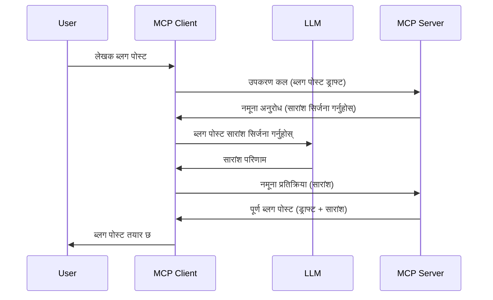

# नमूना गर्ने - क्लाइन्टलाई सुविधाहरू प्रतिनिधित्व गर्नुहोस्

> **अवमूल्यन सूचना:** `2026-07-28` MCP विशिष्टता रिलीज क्यान्डिडेटले नमूना गर्ने सुविधा अप्रचलित भएको संकेत गर्दछ र सिधा LLM प्रदायक API हरूसँग एकीकरणलाई प्राथमिकता दिन्छ। नमूना गर्ने `2025-11-25` मा र कम्तिमा एक वर्षसम्मको औपचारिक अवमूल्यन पछि पनि काम गर्नेछ, त्यसैले यस पाठको सबै कुरा मान्य छ — तर नयाँ सर्भर डिजाइनहरूले प्रतिस्थापन ढाँचालाई मूल्यांकन गर्नु पर्छ। हेर्नुहोस् [MCP मा के परिवर्तन हुँदैछ: 2026-07-28 रिलीज क्यान्डिडेट](../../01-CoreConcepts/mcp-2026-07-28-release-candidate.md)।

कहिलेकाहीँ, तपाईलाई MCP क्लाइन्ट र MCP सर्भरले साझा लक्ष्य प्राप्त गर्न सहकार्य गर्न आवश्यक पर्छ। तपाईंसँग यस्तो अवस्था हुन सक्छ जहाँ सर्भरलाई क्लाइन्टमा रहेको LLM को सहयोग चाहिन्छ। यस्तो अवस्थामा, नमूना गर्ने प्रयोग गर्नुहोस्।

केही प्रयोग केसहरू अन्वेषण गरौं र नमूना प्रयोग गरेर समाधान कसरी निर्माण गर्ने भनी हेरौं।

## अवलोकन

यस पाठमा, हामी नमूना कहिले र कहाँ प्रयोग गर्ने र यसलाई कसरी कन्फिगर गर्ने बुझाउनेछौं।

## सिकाइ उद्देश्यहरू

यस अध्यायमा, हामी:

- नमूना के हो र कहिले प्रयोग गर्ने स्पष्ट पार्नेछौं।
- MCP मा नमूना कसरी कन्फिगर गर्ने देखाउनेछौं।
- नमूना प्रयोगका उदाहरणहरू दिनेछौं।

## नमूना के हो र किन प्रयोग गर्ने?

नमूना एक उन्नत सुविधा हो जुन यसरी काम गर्छ:



### नमूना अनुरोध

ठीक छ, अब हामीसँग सम्भावित परिदृश्यको माइला अग्लो दृष्य छ, सर्भरले क्लाइन्टमा पठाउने नमूना अनुरोध कस्तो देखिन्छ भन्ने कुरा कुरा गरौं। JSON-RPC ढाँचामा यस्तो अनुरोध यसरी देखिन सक्छ:

```json
{
  "jsonrpc": "2.0",
  "id": 1,
  "method": "sampling/createMessage",
  "params": {
    "messages": [
      {
        "role": "user",
        "content": {
          "type": "text",
          "text": "Create a blog post summary of the following blog post: <BLOG POST>"
        }
      }
    ],
    "modelPreferences": {
      "hints": [
        {
          "name": "claude-3-sonnet"
        }
      ],
      "intelligencePriority": 0.8,
      "speedPriority": 0.5
    },
    "systemPrompt": "You are a helpful assistant.",
    "maxTokens": 100
  }
}
```

यहाँ केही कुराहरू उल्लेख गर्ने योग्य छन्:

- Prompt, content अन्तर्गत -> text, हाम्रो प्रॉम्प्ट हो जुन LLM लाई ब्लग पोस्ट सामग्री संक्षेप गर्न निर्देशन हो।

- **modelPreferences**। यो भाग केवल एक प्राथमिकता हो, LLM सँग प्रयोग गर्ने कन्फिगरेसनको सिफारिस हो। प्रयोगकर्ताले यी सिफारिसहरू अनुसरण गर्ने वा परिवर्तन गर्ने चयन गर्न सक्छ। यस अवस्थामा मोडेल, गति र बुद्धिमत्ता प्राथमिकताको सिफारिस छन्।
- **systemPrompt**, यो तपाईंको सामान्य प्रणाली प्रॉम्प्ट हो जसले तपाईंको LLM लाई व्यक्तित्व दिन्छ र मार्गदर्शन निर्देशनहरू समेट्छ।
- **maxTokens**, यो अर्को विशेषता हो जुन कति टोकनहरू प्रयोग गर्ने सिफारिस छ भनी जनाउँछ।

### नमूना प्रतिक्रिया

यो प्रतिक्रिया MCP क्लाइन्टले MCP सर्भरलाई फर्काउने हो र क्लाइन्टले LLM कल गरेपछि प्राप्त प्रतिक्रिया हो जुन यस सन्देशलाई तयार पार्छ। JSON-RPC मा यसरी देखिन सक्छ:

```json
{
  "jsonrpc": "2.0",
  "id": 1,
  "result": {
    "role": "assistant",
    "content": {
      "type": "text",
      "text": "Here's your abstract <ABSTRACT>"
    },
    "model": "gpt-5",
    "stopReason": "endTurn"
  }
}
```

प्रतिक्रिया ब्लग पोस्टको सारांश जस्तै छ जुन हामीले चाहेका थियौं। साथै प्रयोग गरिएको `model` हाम्रो अनुरोध अनुसार नभई "gpt-5" छ, "claude-3-sonnet" भन्दा। यसले देखाउँछ कि प्रयोगकर्ताले प्रयोग गर्ने मोडेलमा निर्णय परिवर्तन गर्न सक्छ र तपाईंको नमूना अनुरोध सिफारिस मात्र हो।

अब मुख्य प्रवाह बुझिसकेकोले र यसलाई उपयोगी कामका लागि "ब्लग पोस्ट सिर्जना + सारांश" मा प्रयोग गर्ने कुरा सम्झेर, यो कसरी काम गर्ने बनाउने आवश्यक छ हेर्नुहोस्।

### सन्देश प्रकारहरू

नमूना सन्देशहरू केवल टेक्स्टमा सीमित छैनन्, तपाईंले इमेज र अडियो पनि पठाउन सक्नुहुन्छ। JSON-RPC कसरी फरक देखिन्छ यहाँ छ:

**टेक्स्ट**

```json
{
  "type": "text",
  "text": "The message content"
}
```

**छवि सामग्री**

```json
{
  "type": "image",
  "data": "base64-encoded-image-data",
  "mimeType": "image/jpeg"
}
```

**अडियो सामग्री**

```json
{
  "type": "audio",
  "data": "base64-encoded-audio-data",
  "mimeType": "audio/wav"
}
```

> [!NOTE] थप विस्तृत जानकारीको लागि नमूना बारे, [आधिकारिक कागजात](https://modelcontextprotocol.io/specification/2025-11-25/client/sampling) हेर्नुहोस्

## क्लाइन्टमा नमूना कसरी कन्फिगर गर्ने

> नोट: यदि तपाईं केवल सर्भर मात्र बनाउँदै हुनुहुन्छ भने यहाँ धेरै गर्नु पर्ने छैन।

क्लाइन्टमा, तपाईंले यसरी निम्न सुविधा निर्दिष्ट गर्न आवश्यक छ:

```json
{
  "capabilities": {
    "sampling": {}
  }
}
```

त्यसपछि तपाईंले चयन गरेको क्लाइन्ट सर्भरसँग सुरुवात गर्दा यसलाई उठाइनेछ।

## नमूनाको क्रियान्वयन उदाहरण - ब्लग पोस्ट सिर्जना गर्नुहोस्

हामी संगै नमूना सर्भर कोड गरौं, निम्न कार्यहरू गर्नुपर्नेछ:

1. सर्भरमा एउटा टूल सिर्जना गर्नुहोस्।
1. उक्त टूलले नमूना अनुरोध बनाउनेछ
1. टूलले क्लाइन्टको नमूना अनुरोधको जवाफ पर्खनुपर्छ।
1. त्यसपछि टूलले परिणाम उत्पादन गर्नेछ।

कोड चरणबद्ध हेर्नुहोस्:

### -1- टूल सिर्जना गर्नुहोस्

**python**

```python
@mcp.tool()
async def create_blog(title: str, content: str, ctx: Context[ServerSession, None]) -> str:
    """Create a blog post and generate a summary"""

```

### -2- नमूना अनुरोध सिर्जना गर्नुहोस्

तपाईंको टूलमा निम्न कोड थप्नुहोस्:

**python**

```python
post = BlogPost(
        id=len(posts) + 1,
        title=title,
        content=content,
        abstract=""
    )

prompt = f"Create an abstract of the following blog post: title: {title} and draft: {content} "

result = await ctx.session.create_message(
        messages=[
            SamplingMessage(
                role="user",
                content=TextContent(type="text", text=prompt),
            )
        ],
        max_tokens=100,
)

```

### -3- जवाफको लागि पर्खनुहोस् र जवाफ फर्काउनुहोस्

**python**

```python
post.abstract = result.content.text

posts.append(post)

# पूर्ण उत्पादन फिर्ता गर्नुहोस्
return json.dumps({
    "id": post.title,
    "abstract": post.abstract
})
```

### -4- पूर्ण कोड

**python**

```python
from starlette.applications import Starlette
from starlette.routing import Mount, Host

from mcp.server.fastmcp import Context, FastMCP

from mcp.server.session import ServerSession
from mcp.types import SamplingMessage, TextContent

import json


from uuid import uuid4
from typing import List
from pydantic import BaseModel


mcp = FastMCP("Blog post generator")

# app = FastAPI()

posts = []

class BlogPost(BaseModel):
    id: int
    title: str
    content: str
    abstract: str

posts: List[BlogPost] = []

@mcp.tool()
async def create_blog(title: str, content: str, ctx: Context[ServerSession, None]) -> str:
    """Create a blog post and generate a summary"""

    post = BlogPost(
        id=len(posts) + 1,
        title=title,
        content=content,
        abstract=""
    )

    prompt = f"Create an abstract of the following blog post: title: {title} and draft: {content} "

    result = await ctx.session.create_message(
        messages=[
            SamplingMessage(
                role="user",
                content=TextContent(type="text", text=prompt),
            )
        ],
        max_tokens=100,
    )

    post.abstract = result.content.text

    posts.append(post)

    # पूर्ण ब्लग पोष्ट फर्काउनुहोस्
    return json.dumps({
        "id": post.title,
        "abstract": post.abstract
    })

if __name__ == "__main__":
    print("Starting server...")
    # mcp.run()
    mcp.run(transport="streamable-http")

# python server.py सँग एप्लिकेसन चलाउनुहोस्
```

### -5- Visual Studio Code मा परीक्षण गर्नुहोस्

Visual Studio Code मा यसलाई परीक्षण गर्नका लागि निम्न गर्नुहोस्:

1. टर्मिनलमा सर्भर सुरु गर्नुहोस्
1. यसलाई *mcp.json* मा थप्नुहोस् (र सुरु भएको पक्का गर्नुहोस्) जस्तै:

   ```json
   "servers": {
      "blog-server": {
        "type": "http",
        "url": "http://localhost:8000/mcp"
      }
   }
   ```

1. एक प्रॉम्प्ट टाइप गर्नुहोस्:

   ```text
   create a blog post named "Where Python comes from", the content is "Python is actually named after Monty Python Flying Circus"
   ```

1. नमूना प्रक्रियालाई अनुमति दिनुहोस्। पहिलो पटक तपाईँले परीक्षण गर्दा अतिरिक्त संवाद तपाईँले स्वीकार गर्नु पर्ने हुनेछ, त्यसपछि उपकरण चलाउन आमन्त्रण गर्ने सामान्य संवाद देखिनेछ।

1. नतिजा निरीक्षण गर्नुहोस्। तपाईंले दुवै GitHub Copilot Chat मा राम्रोसँग प्रस्तुत परिणामहरू र कच्चा JSON प्रतिक्रिया देख्न सक्नुहुन्छ।

**बोनस**। Visual Studio Code उपकरणीकरणमा नमूना ठूलो समर्थन छ। तपाईंले यसरी स्थापना गरेको सर्भरमा नमूना पहुँच कन्फिगर गर्न सक्नुहुन्छ:

1. विस्तार खण्डमा जानुहोस्।
1. "MCP SERVERS - INSTALLED" खण्डमा स्थापना गरिएको सर्भरको कग आइकन छान्नुहोस्।
1 "Configure Model Access" चयन गर्नुहोस्, यहाँ तपाईंले कुन मोडेलहरू GitHub Copilot प्रसारण गर्दा प्रयोग गर्न सक्ने अनुमति दिन सक्नुहुन्छ। साथै हालै भएका सबै नमूना अनुरोधहरू "Show Sampling requests" छानेर हेर्न सक्नुहुन्छ।

## असाइनमेन्ट

यस असाइनमेन्टमा, तपाईंले थोरै फरक नमूना बनाउनु हुनेछ अर्थात् एउटा नमूना एकीकरण जुन उत्पादन विवरण उत्पादन गर्ने सर्मथन गर्छ। यो तपाईंको परिदृश्य हो:

**परिदृश्य**: ई-कॉमर्समा ब्याक अफिस कर्मचारीलाई सजिलो चाहिन्छ, उत्पादन विवरण बनाउन धेरै समय लाग्छ। त्यसैले, तपाईंले "create_product" नामको टूल बनाउनु पर्छ जुन "title" र "keywords" लाई तर्कको रूपमा लिएर एक पूर्ण उत्पादन सिर्जना गर्छ जसमा "description" क्षेत्र क्लाइन्टको LLM द्वारा भर्नु पर्नेछ।

सुझाव: यसअघि सिकेका कुरा प्रयोग गरेर यो सर्भर र यसको टूल नमूना अनुरोध प्रयोग गरी निर्माण गर्नुहोस्।

## समाधान

[Solution](./solution/README.md)

## मुख्य निष्कर्षहरू

नमूना एउटा शक्तिशाली सुविधा हो जसले सर्भरलाई ग्राहकको LLM सहायता आवश्यक पर्दा काम क्लाइन्टलाई प्रतिनिधित्व गर्न अनुमति दिन्छ।

## के गर्ने

- [अध्याय ४ - व्यवहारिक कार्यान्वयन](../../04-PracticalImplementation/README.md)

---

<!-- CO-OP TRANSLATOR DISCLAIMER START -->
**अस्वीकरण**:
यो दस्तावेज़ AI अनुवाद सेवा [Co-op Translator](https://github.com/Azure/co-op-translator) प्रयोग गरेर अनुवाद गरिएको हो। हामी सही हुन प्रयास गर्छौं, तर कृपया जानकार हुनुस् कि स्वचालित अनुवादमा त्रुटिहरू वा अशुद्धताहरू हुन सक्छन्। मूल दस्तावेज़ यसको मूल भाषामा आधिकारिक स्रोत मानिनुपर्छ। महत्वपूर्ण जानकारीका लागि व्यावसायिक मानव अनुवाद सिफारिस गरिन्छ। यस अनुवादको प्रयोगबाट उत्पन्न कुनै पनि गलत बुझाइ वा त्रुटिको लागि हामी जिम्मेवार छैनौं।
<!-- CO-OP TRANSLATOR DISCLAIMER END -->