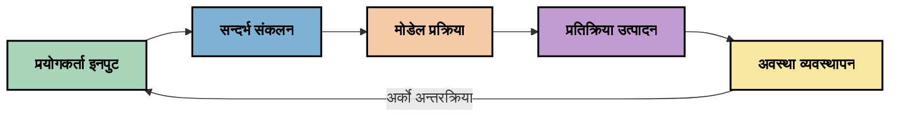
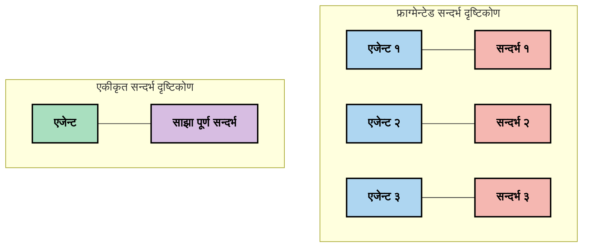
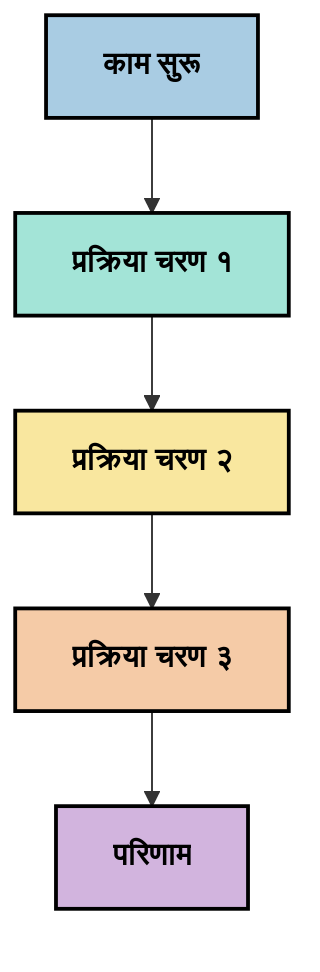
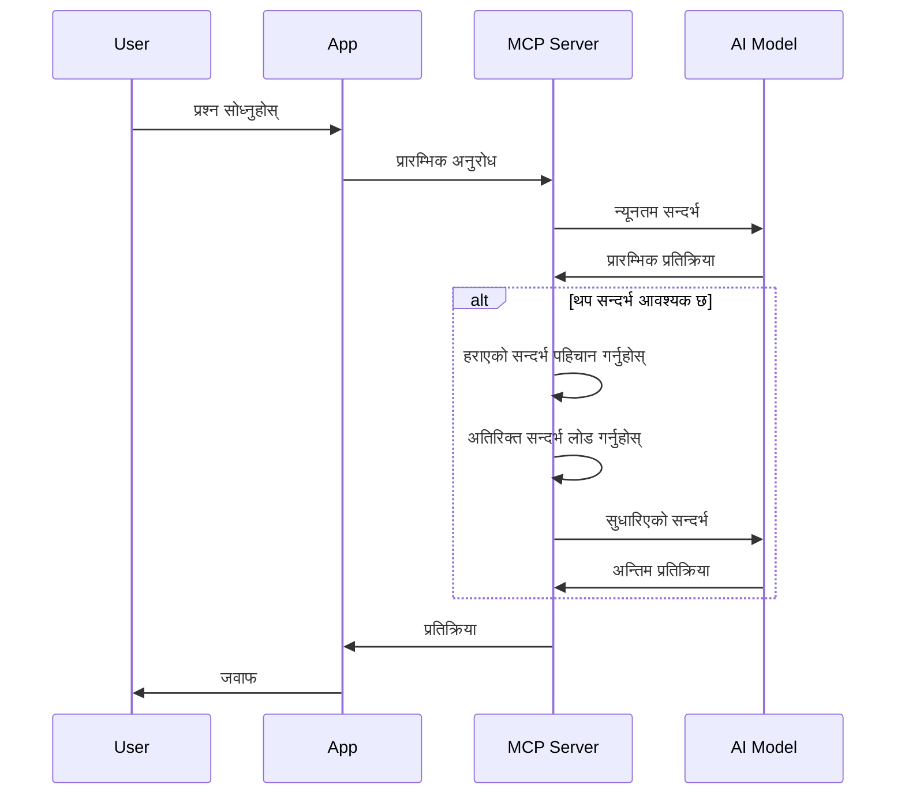
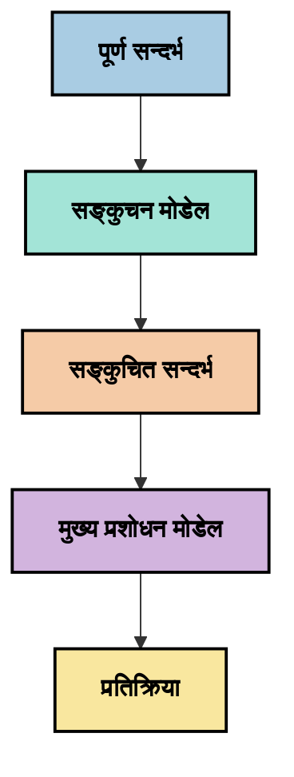
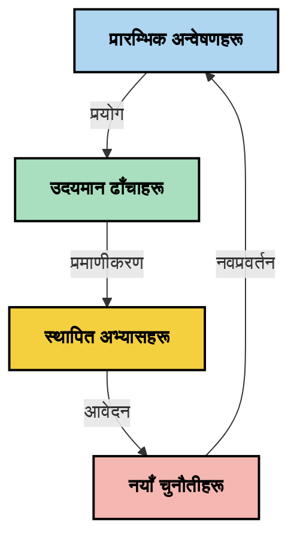

# सन्दर्भ इन्जिनियरिङ: MCP इकोसिस्टममा एक उदीयमान अवधारणा

## अवलोकन

सन्दर्भ इन्जिनियरिङ AI क्षेत्रमा एक उदीयमान अवधारणा हो जसले अनुसन्धान गर्छ कि कसरी सूचना संरचित, प्रदान गरिएको, र ग्राहक र AI सेवाहरूको बीच अन्तर्क्रियामा कायम गरिन्छ। मोडेल सन्दर्भ प्रोटोकल (MCP) इकोसिस्टम विकास हुँदै जाँदा, प्रभावकारी रूपमा सन्दर्भ व्यवस्थापन कसरी गर्ने बुझ्ने कुरा धेरै महत्वपूर्ण हुँदै गएको छ। यस मोड्युलले सन्दर्भ इन्जिनियरिङको अवधारणा परिचय गराउँछ र यसको सम्भावित प्रयोगहरू MCP कार्यान्वयनहरूमा अन्वेषण गर्छ।

## सिकाइ लक्ष्यहरू

यस मोड्युलको अन्त्यमा, तपाईं सक्षम हुनुहुनेछ:

- सन्दर्भ इन्जिनियरिङको उदीयमान अवधारणा र यसको सम्भावित भूमिका MCP अनुप्रयोगहरूमा बुझ्न
- सन्दर्भ व्यवस्थापनका प्रमुख चुनौतीहरू पहिचान गर्न जुन MCP प्रोटोकल डिजाइनले सम्बोधन गर्छ
- राम्रो सन्दर्भ ह्यान्डलिङमार्फत मोडेल प्रदर्शन सुधार गर्ने प्रविधिहरू अन्वेषण गर्न
- सन्दर्भ प्रभावकारिता मापन र मूल्याङ्कन गर्ने दृष्टिकोणहरू विचार गर्न
- MCP फ्रेमवर्क मार्फत AI अनुभवहरू सुधार गर्न यी उदीयमान अवधारणाहरू लागू गर्न

## सन्दर्भ इन्जिनियरिङ परिचय

सन्दर्भ इन्जिनियरिङ एक उदीयमान अवधारणा हो जुन प्रयोगकर्ताहरू, एप्लिकेसनहरू, र AI मोडेलहरू बीच जानकारिको प्रवाहको जानाजानी डिजाइन र व्यवस्थापनमा केन्द्रित छ। प्रॉम्प्ट इन्जिनियरिङ जस्ता स्थापित क्षेत्रहरू भन्दा फरक, सन्दर्भ इन्जिनियरिङ अझै अभ्यासकर्ताहरू द्वारा परिभाषित हुँदैछ किनभने उनीहरू AI मोडेलहरूलाई सही समयमा सही जानकारी प्रदान गर्ने विशिष्ट चुनौतीहरू समाधान गर्न काम गरिरहेका छन्।

ठूला भाषा मोडेलहरू (LLMs) विकाससँगै, सन्दर्भको महत्त्व बढ्दै गएको छ। हामीले उपलब्ध गराउने सन्दर्भको गुणस्तर, सान्दर्भिकता, र संरचनाले मोडेल आउटपुटहरूमा सिधा प्रभाव पार्दछ। सन्दर्भ इन्जिनियरिङले यस सम्बन्धलाई अनुसन्धान गर्छ र प्रभावकारी सन्दर्भ व्यवस्थापनका सिद्धान्तहरू विकास गर्ने खोजी गर्छ।

> "2025 मा, त्यहाँका मोडेलहरू अत्यन्त बुद्धिमान छन्। तर सबैभन्दा बुद्दिमान मान्छे पनि आफूले सोधिएको के हो भनेर सन्दर्भ बिना प्रभावकारी काम गर्न सक्दैन... 'सन्दर्भ इन्जिनियरिङ' प्रॉम्प्ट इन्जिनियरिङको अर्को स्तर हो। यो गतिशील प्रणालीमा स्वचालित रूपमा गर्ने कुरा हो।" — वाल्डेन यान, कग्निशन AI

सन्दर्भ इन्जिनियरिङले समावेश गर्न सक्छ:

1. **सन्दर्भ चयन**: कुनै कार्यका लागि कुन जानकारी सान्दर्भिक हो निर्धारण गर्नु
2. **सन्दर्भ संरचना**: मोडेलले राम्रोसँग बुझ्न सक्ने गरी जानकारी व्यवस्थापन गर्नु
3. **सन्दर्भ वितरण**: जानकारी मोडेलहरूलाई कसरी र कहिले पठाउने अनुकूलन गर्नु
4. **सन्दर्भ मर्मत**: समयसँग सन्दर्भको अवस्था र विकास व्यवस्थापन गर्नु
5. **सन्दर्भ मूल्याङ्कन**: सन्दर्भको प्रभावकारिता मापन र सुधार गर्नु

यी फोकस क्षेत्रहरू विशेषगरी MCP इकोसिस्टमसँग सान्दर्भिक छन्, जसले एप्लिकेसनहरूलाई LLMs लाई सन्दर्भ प्रदान गर्ने एक मानकीकृत तरिका दिन्छ।


## सन्दर्भ यात्रा दृष्टिकोण

सन्दर्भ इन्जिनियरिङलाई बुझ्ने एउटा तरिका MCP प्रणालीमा जानकारीले यात्रा गर्ने चरणहरू ट्रेस गर्नु हो:



### सन्दर्भ यात्राका प्रमुख चरणहरू:

1. **प्रयोगकर्ता इनपुट**: प्रयोगकर्ताबाट कच्चा सूचना (पाठ, चित्रहरू, कागजातहरू)
2. **सन्दर्भ संयोजन**: प्रयोगकर्ता इनपुटलाई प्रणाली सन्दर्भ, संवाद इतिहास, र अन्य प्राप्त जानकारीसँग मिलाउनु
3. **मोडेल प्रोसेसिङ**: AI मोडेलले संयोजित सन्दर्भ प्रक्रियाकरण गर्दछ
4. **प्रतिक्रिया उत्पादन**: प्रदान गरिएको सन्दर्भ अनुसार मोडेलले आउटपुट उत्पादन गर्दछ
5. **राज्य व्यवस्थापन**: प्रणालीले अन्तर्क्रियाको आधारमा आन्तरिक अवस्था अपडेट गर्दछ

यो दृष्टिकोणले AI प्रणालीहरूमा सन्दर्भको गतिशील स्वभावलाई प्रकाश पार्छ र प्रत्येक चरणमा सूचनाको उत्कृष्ट व्यवस्थापन बारे महत्वपूर्ण प्रश्नहरू उठाउँछ।

## सन्दर्भ इन्जिनियरिङका उदीयमान सिद्धान्तहरू

सन्दर्भ इन्जिनियरिङ क्षेत्र आकार लिन थालेसँगै, केही प्रारम्भिक सिद्धान्तहरू अभ्यासकर्ताबाट उदाउँछन्। यी सिद्धान्तहरूले MCP कार्यान्वयन छनोटहरूलाई सूचित गर्न मद्दत गर्न सक्छन्:

### सिद्धान्त १: सन्दर्भ पूर्ण रूपमा साझेदारी गर्नुहोस्

सन्दर्भ प्रणालीका सबै कम्पोनेन्टबीच पूर्ण रूपमा साझा गरिनुपर्छ, न कि धेरै एजेण्ट वा प्रक्रियाहरूमा टुक्र्याएर। जब सन्दर्भ वितरित हुन्छ, प्रणालीको एउटै भागमा लिइएका निर्णयहरूले अन्य ठाउँमा लिएका निर्णयहरूसँग द्वन्द्व गर्न सक्छन्।



MCP अनुप्रयोगहरूमा, यसको अर्थ यस्तो प्रणाली डिजाइन गर्नु हो जहाँ सन्दर्भ सम्पूर्ण पाइपलाइनमा सहज रूपमा प्रवाहित हुन्छ, न कि पृथक खण्डहरूमा।

### सिद्धान्त २: कार्यहरूले निहित निर्णयहरू बोकेको हुन्छन् बुझ्नुस्

मोडेलले गर्ने प्रत्येक क्रियाले सन्दर्भ कसरी व्याख्या गर्ने बारे निहित निर्णयहरू समेटेको हुन्छ। जब धेरै कम्पोनेन्टहरूले फरक फरक सन्दर्भमा काम गर्छन्, ती निहित निर्णयहरूले असंगत नतिजाहरू निम्त्याउन सक्छन्।

यस सिद्धान्तले MCP अनुप्रयोगहरूको लागि महत्वपूर्ण प्रभावहरू राख्छ:
- टुक्र्याइएको सन्दर्भसंग समानान्तर कार्यान्वयनको सट्टा जटिल कार्यहरूको रैखिक प्रक्रियालाई प्राथमिकता दिनुहोस्
- सबै निर्णय बिन्दुहरूमा उही सन्दर्भ जानकारी पहुँचयोग्य हुनु सुनिश्चित गर्नुहोस्
- यस्तो प्रणाली डिजाइन गर्नुहोस् जहाँ पछि आउने चरणहरूले पहिलेका निर्णयहरूको पूर्ण सन्दर्भ देख्न सक्छन्

### सिद्धान्त ३: सन्दर्भ गहिराइलाई विन्डो सीमाहरू सँग सन्तुलन गर्नुस्

संवादहरू र प्रक्रियाहरू लामो हुँदै जाँदा, सन्दर्भ विन्डोहरू अन्ततः ओभरफ्लो हुन्छन्। प्रभावकारी सन्दर्भ इन्जिनियरिङले सम्पूर्ण सन्दर्भ र प्राविधिक सीमाहरू बीचको तनाव व्यवस्थापनका तरिका अनुसन्धान गर्छ।

सम्भावित तरिकाहरू समावेश हुन सक्छन्:
- आवश्यक जानकारी कायम राख्दै टोकन प्रयोग कम गर्ने सन्दर्भ संकुचन
- वर्तमान आवश्यकताका आधारमा सन्दर्भ प्रगतिशील रूपमा लोड गर्ने
- मुख्य निर्णय र तथ्यहरू जोगाउँदै अघिल्ला अन्तर्क्रियाको सारांश

## सन्दर्भ चुनौतीहरू र MCP प्रोटोकल डिजाइन

मोडेल सन्दर्भ प्रोटोकल (MCP) सन्दर्भ व्यवस्थापनका अनौठा चुनौतीहरूलाई ध्यानमा राख्दै डिजाइन गरिएको थियो। यी चुनौतीहरू बुझ्दा MCP प्रोटोकल डिजाइनका मुख्य पक्षहरू स्पष्ट हुन्छन्:


### चुनौती १: सन्दर्भ विन्डो सीमाहरू
अधिकांश AI मोडेलहरूसँग निश्चित सन्दर्भ विन्डो आकार हुन्छ, जसले उनीहरूले एक पटकमा प्रक्रिया गर्न सक्ने जानकारीको मात्रा सीमित गर्दछ।

**MCP डिजाइन जवाफ:** 
- प्रोटोकलले संरचित, स्रोत-आधारित सन्दर्भ समर्थन गर्छ जुन कुशलसँग सन्दर्भित गर्न सकिन्छ
- स्रोतहरू पृष्ठांकन गर्न र प्रगतिशील रूपमा लोड गर्न सकिन्छ

### चुनौती २: सान्दर्भिकता निर्धारण
कुन सूचना सबैभन्दा सान्दर्भिक छ निर्णय गर्नु कठिन छ।

**MCP डिजाइन जवाफ:**
- आवश्यकताका आधारमा गतिशील रूपमा सूचना प्राप्त गर्न लचिलो उपकरण
- सुसंरचित प्रॉम्प्टहरूले सन्दर्भ संगठनमा स्थिरता दिन्छ

### चुनौती ३: सन्दर्भ कायम राख्ने
अन्तरक्रियाहरूमा राज्य व्यवस्थापनको लागि सन्दर्भको सावधानीपूर्वक ट्र्याकिङ आवश्यक छ।

**MCP डिजाइन जवाफ:**
- मानकीकृत सत्र व्यवस्थापन
- सन्दर्भ विकासका लागि स्पष्ट परिभाषित अन्तरक्रिया ढाँचाहरू

### चुनौती ४: बहु-मोडल सन्दर्भ
फरक प्रकारका डाटा (पाठ, चित्रहरू, संरचित डाटा) फरक ह्यान्डलिङ आवश्यक पर्छ।

**MCP डिजाइन जवाफ:**
- प्रोटोकल डिजाइनले विभिन्न सामग्री प्रकारहरूलाई समायोजित गर्छ
- बहु-मोडल जानकारीको मानकीकृत प्रतिनिधित्व

### चुनौती ५: सुरक्षा र गोपनीयता
सन्दर्भमा अक्सर संवेदनशील जानकारी हुन्छ जुन सुरक्षित गर्नुपर्छ।

**MCP डिजाइन जवाफ:**
- ग्राहक र सर्भर जिम्मेवारीहरूबीच स्पष्ट सिमाना
- डाटा एक्सपोसर कम गर्न स्थानीय प्रक्रियाकरण विकल्पहरू

यी चुनौतीहरू बुझेर र MCP कसरी त्यसको समाधान गर्छ थाहा पाइएपछि, अधिक उन्नत सन्दर्भ इन्जिनियरिङ प्रविधिहरू अन्वेषण गर्न आधार तयार हुन्छ।

## उदीयमान सन्दर्भ इन्जिनियरिङ दृष्टिकोणहरू

सन्दर्भ इन्जिनियरिङ क्षेत्र विकास हुँदै गर्दा, केही आशाजनक दृष्टिकोणहरू उदीयमान छन्। ती हालको सोचाइ जनाउँछन्, स्थिर अभ्यासहरू होइनन्, र MCP कार्यान्वयनमा अनुभव प्राप्तिसँगै यसको विकास हुनेछ।

### १. एकल-थ्रेडेड रैखिक प्रक्रिया

सन्दर्भ वितरण गर्ने बहु-एजेन्ट वास्तुकलाको विपरीत, केहि अभ्यासकर्ताहरूले एकल-थ्रेडेड रैखिक प्रक्रिया अधिक स्थिर नतिजा दिन्छ पत्ता लगाइरहेका छन्। यसले एकीकृत सन्दर्भ कायम राख्ने सिद्धान्तसँग मेल खान्छ।



यो दृष्टिकोण समानान्तर प्रक्रियाभन्दा कम द्रुत देखिए पनि, प्रत्येक चरणले अघिल्ला निर्णयहरूको पूर्ण बुझाइमा आधारित भएर अधिक सुसंगत र विश्वसनीय नतिजा उत्पादन गर्दछ।

### २. सन्दर्भ टुक्र्याउने र प्राथमिकता निर्धारण

ठूला सन्दर्भलाई व्यवस्थापनयोग्य टुक्रामा विभाजन गरी सबैभन्दा महत्त्वपूर्ण भागहरू प्राथमिकता दिनु।

```python
# अवधारणात्मक उदाहरण: सन्दर्भ टुक्र्याउने र प्राथमिकता दिने
def process_with_chunked_context(documents, query):
    # 1. कागजातहरूलाई साना टुक्रामा विभाजन गर्नुहोस्
    chunks = chunk_documents(documents)
    
    # 2. प्रत्येक टुक्राको सान्दर्भिकता स्कोर गणना गर्नुहोस्
    scored_chunks = [(chunk, calculate_relevance(chunk, query)) for chunk in chunks]
    
    # 3. सान्दर्भिकता स्कोर अनुसार टुक्राहरू छाँट्नुहोस्
    sorted_chunks = sorted(scored_chunks, key=lambda x: x[1], reverse=True)
    
    # 4. सबैभन्दा सान्दर्भिक टुक्राहरूलाई सन्दर्भको रूपमा प्रयोग गर्नुहोस्
    context = create_context_from_chunks([chunk for chunk, score in sorted_chunks[:5]])
    
    # 5. प्राथमिकता दिइएको सन्दर्भसँग प्रक्रिया गर्नुहोस्
    return generate_response(context, query)
```

माथिको अवधारणाले देखाउँछ कि हामी कसरी ठूला कागजातहरूलाई टुक्र्याएर सान्दर्भिक भागहरू मात्र सन्दर्भका लागि छनोट गर्न सक्छौं। यसले सन्दर्भ विन्डो सीमाभित्र काम गर्न मद्दत गर्छ र ठूलो ज्ञान आधारहरूका फाइदा लिन पनि सक्छ।

### ३. प्रगतिशील सन्दर्भ लोडिङ

आवश्यकताअनुसार सन्दर्भलाई एकैपटक होइन क्रमिक रूपमा लोड गर्ने।



प्रगतिशील सन्दर्भ लोडिङ न्यूनतम सन्दर्भबाट सुरु भई आवश्यक पर्दा मात्र विस्तार हुन्छ। यसले सरल प्रश्नहरूको टोकन प्रयोगलाई उल्लेख्य रूपमा कम गर्न सक्छ र जटिल प्रश्नहरू ह्यान्डल गर्न सक्ने क्षमता राख्दछ।

### ४. सन्दर्भ संकुचन र सारांश

आवश्यक जानकारी जोगाउँदै सन्दर्भको आकार घटाउने।



सन्दर्भ संकुचनमा केन्द्रित हुन्छ:
- पुनरावृत्त सूचना हटाउने
- लामौती सामग्रीको सारांश दिने
- मुख्य तथ्यहरू र विवरण निकाल्ने
- महत्वपूर्ण सन्दर्भ तत्वहरू जोगाउने
- टोकन कुशलताका लागि अनुकूलन गर्ने

यस तरिकाले सन्दर्भ विन्डोभित्र लामो संवाद कायम राख्न वा ठूलो कागजातहरू प्रभावकारी रूपमा प्रक्रिया गर्न विशेष लाभदायक हुन सक्छ। केही अभ्यासकर्ताहरू विशेषीकृत मोडेलहरू प्रयोग गरेर वार्तालाप इतिहासको सन्दर्भ संकुचन र सारांश बनाउदै छन्।


## अन्वेषणशील सन्दर्भ इन्जिनियरिङ विचारहरू

हामी उदीयमान सन्दर्भ इन्जिनियरिङ क्षेत्र अन्वेषण गर्दा, MCP कार्यान्वयनसँग काम गर्दा ध्यान दिनु पर्ने केही विचारहरू छन्। यी निर्देशात्मक सबैभन्दा राम्रो अभ्यासहरू होइनन् तर अन्वेषणका क्षेत्र हुन् जसले तपाईंको विशेष प्रयोग केसमा सुधार ल्याउन सक्छन्।

### आफ्नो सन्दर्भ लक्ष्यहरू विचार गर्नुहोस्

जटिल सन्दर्भ व्यवस्थापन समाधान लागू गर्नुअघि, स्पष्ट रूपमा के हासिल गर्न खोज्दै हुनुहुन्छ वर्णन गर्नुहोस्:
- मोडेल सफल हुन कुन विशिष्ट जानकारी आवश्यक छ?
- कुन जानकारी अनिवार्य छ र कुन पूरक?
- प्रदर्शनका सीमाहरू के के छन् (विलम्बता, टोकन सीमा, लागत)?

### स्तरबद्ध सन्दर्भ दृष्टिकोणहरू अन्वेषण गर्नुहोस्

केहि अभ्यासकर्ताहरूले सन्दर्भलाई धारणा स्तरहरूमा व्यवस्थित गरेर सफलता पाएका छन्:
- **मुख्य स्तर**: मोडेलले सधैं चाहिने आवश्यक जानकारी
- **परिस्थितिजन्य स्तर**: वर्तमान अन्तरक्रियामा विशेष सन्दर्भ
- **समर्थन गर्ने स्तर**: अतिरिक्त जानकारी जुन उपयोगी हुन सक्छ
- **पछाडि हट्ने स्तर**: आवश्यक परे मात्र पहुँचयोग्य जानकारी

### पुनःप्राप्ति रणनीतिहरू अनुसन्धान गर्नुहोस्

तपाईंको सन्दर्भ प्रभावकारिता प्रायः कस्तो तरिकाले जानकारी पुनःप्राप्त गर्छ त्यसमा निर्भर हुन्छ:
- अवधारणागत सान्दर्भिक जानकारी फेला पार्न सेमेन्टिक खोज र एम्बेडिङहरू
- विशिष्ट तथ्याङ्कका लागि कुञ्जीशब्द-आधारित खोज
- धेरै पुनःप्राप्ति विधिहरू संयोजन गर्ने हाइब्रिड दृष्टिकोणहरू
- वर्गीकरण, मिति, वा स्रोतका आधारमा मेटाडाटा फिल्टरिङले क्षेत्र सीमित पार्ने

### सन्दर्भ समन्वयता सँग प्रयोग गर्नुहोस्

तपाईंको सन्दर्भको संरचना र प्रवाहले मोडेल बुझाइमा असर पार्न सक्छ:
- सान्दर्भिक जानकारीलाई सँगै समूह बनाउने
- स्थिर फर्म्याटिङ र संगठन प्रयोग गर्ने
- उचित ठाउँमा तार्किक वा कालानुक्रमिक क्रमबद्धता कायम राख्ने
- विपरित जानकारीबाट बच्ने

### बहु-एजेन्ट वास्तुकलाका tradeoffs तौल गर्नुहोस्

धेरै AI फ्रेमवर्कहरूमा बहु-एजेन्ट वास्तुकला लोकप्रिय भए पनि, सन्दर्भ व्यवस्थापनका लागि पर्याप्त चुनौतीहरू हुन्छन्:
- सन्दर्भ टुक्र्याउँदा एजेण्टहरूसँग असंगत निर्णयहरू हुन सक्छन्
- समानान्तर प्रक्रिया द्वन्द्वहरू ल्याउन सक्छ जुन सुल्झाउन गाह्रो हुन्छ
- एजेण्टहरूबीच सञ्चार ओभरहेडले प्रदर्शन लाभलाई किने सक्छ
- समन्वय कायम राख्न जटिल अवस्था व्यवस्थापन आवश्यक पर्छ

धेरै अवस्थामा एकल-एजेण्ट दृष्टिकोण जसले व्यापक सन्दर्भ व्यवस्थापन गर्छ, टुक्र्याइएको सन्दर्भ भएको धेरै विशिष्ट एजेन्टहरू भन्दा बढी विश्वसनीय नतिजा दिन सक्छ।

### मूल्याङ्कन विधिहरू विकास गर्नुहोस्

समय साथ सन्दर्भ इन्जिनियरिङ सुधार गर्न, सफलता कसरी मापन गर्ने विचार गर्नुहोस्:
- विभिन्न सन्दर्भ संरचनाहरूको A/B परीक्षण
- टोकन प्रयोग र प्रतिक्रिया समयहरूको अनुगमन
- प्रयोगकर्ता सन्तुष्टि र कार्य सम्पन्नता दरहरूको ट्र्याकिङ
- कहिले र किन सन्दर्भ रणनीतिहरू असफल हुन्छन् विश्लेषण

यी विचारहरू सन्दर्भ इन्जिनियरिङ क्षेत्रमा सक्रिय अन्वेषणका क्षेत्रहरू हुन्। क्षेत्र विकास भइरहेका क्रममा थप निश्चित नियमहरू र अभ्यासहरू उदाउन सक्छन्।

## सन्दर्भ प्रभावकारिता मापन: विकासशील फ्रेमवर्क

सन्दर्भ इन्जिनियरिङ उदाउँदो अवधारणा भएकाले, अभ्यासकर्ताहरू यसको प्रभावकारिता कसरी मापन गर्ने खोजिरहेका छन्। अहिलेसम्म कुनै स्थिर फ्रेमवर्क छैन, तर विभिन्न मेट्रिक्स विचार गरिदैं छन् जसले भविष्यको कामलाई मार्गनिर्देशन गर्न सक्छ।

### सम्भावित मापन आयामहरू


#### १. इनपुट दक्षता विचारहरू

- **सन्दर्भ-देखि-प्रतिक्रियाको अनुपात**: प्रतिक्रियाको आकारको सापेक्ष कति सन्दर्भ आवश्यक छ?
- **टोकन प्रयोग**: दिइएको सन्दर्भका टोकनमध्ये कति भागले प्रतिक्रिया प्रभाव पार्छ?
- **सन्दर्भ संक्षेपण**: कच्चा जानकारीलाई कत्तिको प्रभावकारी रूपमा संकुचन गर्न सकिन्छ?

#### २. प्रदर्शन विचारहरू

- **विलम्ब असर**: सन्दर्भ व्यवस्थापनले प्रतिक्रिया समयमा कस्तो प्रभाव पर्छ?
- **टोकन अर्थव्यवस्था**: के हामी टोकन प्रयोगलाई प्रभावकारी रूपमा अनुकूलन गर्दैछौं?
- **पुनःप्राप्ति सटीकता**: प्राप्त जानकारी कति सान्दर्भिक छ?
- **स्रोत उपयोग**: कति कम्प्युटेसनल स्रोतहरू आवश्यक पर्छ?

#### ३. गुणस्तर विचारहरू

- **प्रतिक्रिया सान्दर्भिकता**: प्रतिक्रिया कत्तिको राम्रो प्रश्नलाई सम्बोधन गर्छ?
- **वास्तविकता शुद्धता**: के सन्दर्भ व्यवस्थापनले तथ्यात्मक सटीकतामा सुधार गर्छ?
- **सुसंगतता**: समान प्रश्नहरूमा प्रतिक्रियाहरू कत्तिको स्थिर छन्?
- **भ्रम दर**: राम्रो सन्दर्भले मोडेल भ्रम कम गर्छ?

#### ४. प्रयोगकर्ता अनुभव विचारहरू

- **पश्चात्-अनुगमन दर**: प्रयोगकर्ताहरूलाई कति पटक स्पष्टिकरण चाहिन्छ?
- **कार्य सम्पन्नता**: के प्रयोगकर्ताहरू सफलतापूर्वक लक्ष्य पुरा गर्छन्?
- **सन्तुष्टि संकेतकहरू**: प्रयोगकर्ताहरू आफ्नो अनुभवलाई कसरी मूल्याङ्कन गर्छन्?

### मापनका अन्वेषणशील दृष्टिकोणहरू

MCP कार्यान्वयनमा सन्दर्भ इन्जिनियरिङको प्रयोग गर्दा यी अन्वेषणशील दृष्टिकोणहरू विचार गर्नुहोस्:

1. **बेसलाइन तुलना**: सभ्य सन्दर्भ दृष्टिकोणहरूसँग बेसलाइन स्थापना गरेर बढी जटिल विधिहरू परीक्षण गर्नुहोस्

2. **क्रमिक परिवर्तनहरू**: एक पटकमा एउटा मात्र पक्ष परिवर्तन गरेर यसको प्रभाव अलग गर्नुहोस्

3. **प्रयोगकर्ता केन्द्रित मूल्याङ्कन**: मात्रात्मक मेट्रिक्सलाई गुणात्मक प्रयोगकर्ता प्रतिक्रिया संग जोड्नुहोस्

4. **विफलता विश्लेषण**: जहाँ सन्दर्भ रणनीतिहरू असफल छन् त्यस्ता केसहरूको परीक्षण गरेर सुधार खोज्नुहोस्

5. **बहु-आयामक मूल्याङ्कन**: दक्षता, गुणस्तर, र प्रयोगकर्ता अनुभव बीचको trade-off विचार गर्नुहोस्

यो प्रयोगात्मक, बहुआयामिक मापन दृष्टिकोण उदीयमान सन्दर्भ इन्जिनियरिङसँग मेल खान्छ।

## समापन विचारहरू

सन्दर्भ इन्जिनियरिङ एक उदीयमान अन्वेषण क्षेत्र हो जुन प्रभावकारी MCP अनुप्रयोगहरूका लागि केन्द्रिय हुन सक्छ। तपाईंको प्रणालीमा जानकारीको प्रवाहलाई सोचविचारपूर्वक सञ्‍चालन गरेर, तपाईं बढी दक्ष, ठिक, र प्रयोगकर्ताका लागि मूल्यवान AI अनुभव सिर्जना गर्न सक्नुहुन्छ।

यस मोड्युलमा वर्णन गरिएका प्रविधि र दृष्टिकोणहरू यस क्षेत्रमा प्रारम्भिक सोच हो, स्थिर अभ्यास होइन। AI क्षमताहरू विकास हुँदै जाँदा र हाम्रो बुझाइ गहिरिँदै जाँदा सन्दर्भ इन्जिनियरिङ थप परिभाषित अनुशासनमा विकास हुन सक्छ। अहिलेको लागि, प्रयोगसँगै सावधानीपूर्ण मापन सबैभन्दा उपजाउ तरिका देखिन्छ।

## सम्भावित भविष्यका दिशा

सन्दर्भ इन्जिनियरिङ क्षेत्र अझै प्रारम्भिक अवस्थामा छ, तर केही आशाजनक दिशाहरू देखिन थालेका छन्:

- सन्दर्भ इन्जिनियरिङका सिद्धान्तहरूले मोडेल प्रदर्शन, दक्षता, प्रयोगकर्ता अनुभव, र विश्वसनीयतामा उल्लेख्य प्रभाव पार्न सक्छ
- विस्तारपूर्ण सन्दर्भ व्यवस्थापनसहित एकल-थ्रेडेड दृष्टिकोण धेरै प्रयोग केसहरूमा बहु-एजेन्ट वास्तुकलालाई पछाडि पार्न सक्छ
- विशेषीकृत सन्दर्भ संकुचन मोडेलहरू AI पाइपलाइनका मानक कम्पोनेन्ट बन्नसक्छन्
- सन्दर्भ पूर्णता र टोकन सीमाहरूबीचको तनाव सन्दर्भ ह्यान्डलिङमा नवप्रवर्तन बढाउने सम्भावना छ
- मोडेलहरू मानवजस्तै प्रभावकारी संचार गर्न सक्षम हुँदै गएसँगै, साँच्चिकै बहु-एजेन्ट साझा कार्य सम्भव हुन सक्छ
- MCP कार्यान्वयनहरू मानकीकृत सन्दर्भ व्यवस्थापन ढाँचाहरू विकास गर्ने छन् जुन हालको प्रयोगबाट उत्पन्न हुन्छ



## स्रोतहरू

### आधिकारिक MCP स्रोतहरू
- [Model Context Protocol Website](https://modelcontextprotocol.io/)
- [Model Context Protocol Specification](https://github.com/modelcontextprotocol/modelcontextprotocol)

- [MCP दस्तावेजीकरण](https://modelcontextprotocol.io/docs)
- [MCP C# SDK](https://github.com/modelcontextprotocol/csharp-sdk)
- [MCP Python SDK](https://github.com/modelcontextprotocol/python-sdk)
- [MCP TypeScript SDK](https://github.com/modelcontextprotocol/typescript-sdk)
- [MCP इन्स्पेक्टर](https://github.com/modelcontextprotocol/inspector) - MCP सर्भरहरूको लागि भिजुअल परीक्षण उपकरण

### सन्दर्भ इन्जिनियरिङ लेखहरू
- [मल्टि-एजेन्टहरू निर्माण नगर्नुहोस्: सन्दर्भ इन्जिनियरिङका सिद्धान्तहरू](https://cognition.ai/blog/dont-build-multi-agents) - वाल्डेन यानका सन्दर्भ इन्जिनियरिङ सिद्धान्तहरूमा विचारहरू
- [एजेन्टहरू निर्माण गर्ने व्यावहारिक गाइड](https://cdn.openai.com/business-guides-and-resources/a-practical-guide-to-building-agents.pdf) - OpenAI को प्रभावकारी एजेन्ट डिजाइनमा गाइड
- [प्रभावकारी एजेन्टहरू निर्माण](https://www.anthropic.com/engineering/building-effective-agents) - एनथ्रोपिकको एजेन्ट विकासमा दृष्टिकोण

### सम्बन्धित अनुसन्धान
- [ठूलो भाषा मोडेलहरूको लागि गतिशील पुन:प्राप्ति बृद्धि](https://arxiv.org/abs/2310.01487) - गतिशील पुन:प्राप्ति दृष्टिकोणहरूको अनुसन्धान
- [बीचमा हराएको: भाषा मोडेलहरूले लामो सन्दर्भ कसरी प्रयोग गर्छन्](https://arxiv.org/abs/2307.03172) - सन्दर्भ प्रशोधन ढाँचाहरूमा महत्त्वपूर्ण अनुसन्धान
- [CLIP लैटेन्टहरूसँग समानानुक्रमिक पाठ-आधारित छवि उत्पादन](https://arxiv.org/abs/2204.06125) - DALL-E 2 कागज सन्दर्भ संरचनामा विचारहरूसँग
- [ठूला भाषा मोडेल संरचनाहरूमा सन्दर्भको भूमिका अन्वेषण](https://aclanthology.org/2023.findings-emnlp.124/) - सन्दर्भ व्यवस्थापनमा हालैको अनुसन्धान
- [मल्टि-एजेन्ट सहयोग: एक सर्वेक्षण](https://arxiv.org/abs/2304.03442) - मल्टि-एजेन्ट प्रणाली र तिनका चुनौतीहरूको अनुसन्धान

### अतिरिक्त स्रोतहरू
- [सन्दर्भ विन्डो अनुकूलन प्रविधिहरू](https://learn.microsoft.com/en-us/azure/ai-services/openai/concepts/context-window)
- [उन्नत RAG प्रविधिहरू](https://www.microsoft.com/en-us/research/blog/retrieval-augmented-generation-rag-and-frontier-models/)
- [सेमेन्टिक कर्नेल दस्तावेजीकरण](https://github.com/microsoft/semantic-kernel)
- [सन्दर्भ व्यवस्थापनका लागि AI उपकरण](https://github.com/microsoft/aitoolkit)

## के छ अर्को 

- [5.15 MCP कस्टम ट्रान्स्पोर्ट](../mcp-transport/README.md)

---

<!-- CO-OP TRANSLATOR DISCLAIMER START -->
**अस्वीकरण**:
यो दस्तावेज़ AI अनुवाद सेवा [Co-op Translator](https://github.com/Azure/co-op-translator) प्रयोग गरेर अनुवाद गरिएको हो। हामी सही हुन प्रयास गर्छौं, तर कृपया जानकार हुनुस् कि स्वचालित अनुवादमा त्रुटिहरू वा अशुद्धताहरू हुन सक्छन्। मूल दस्तावेज़ यसको मूल भाषामा आधिकारिक स्रोत मानिनुपर्छ। महत्वपूर्ण जानकारीका लागि व्यावसायिक मानव अनुवाद सिफारिस गरिन्छ। यस अनुवादको प्रयोगबाट उत्पन्न कुनै पनि गलत बुझाइ वा त्रुटिको लागि हामी जिम्मेवार छैनौं।
<!-- CO-OP TRANSLATOR DISCLAIMER END -->