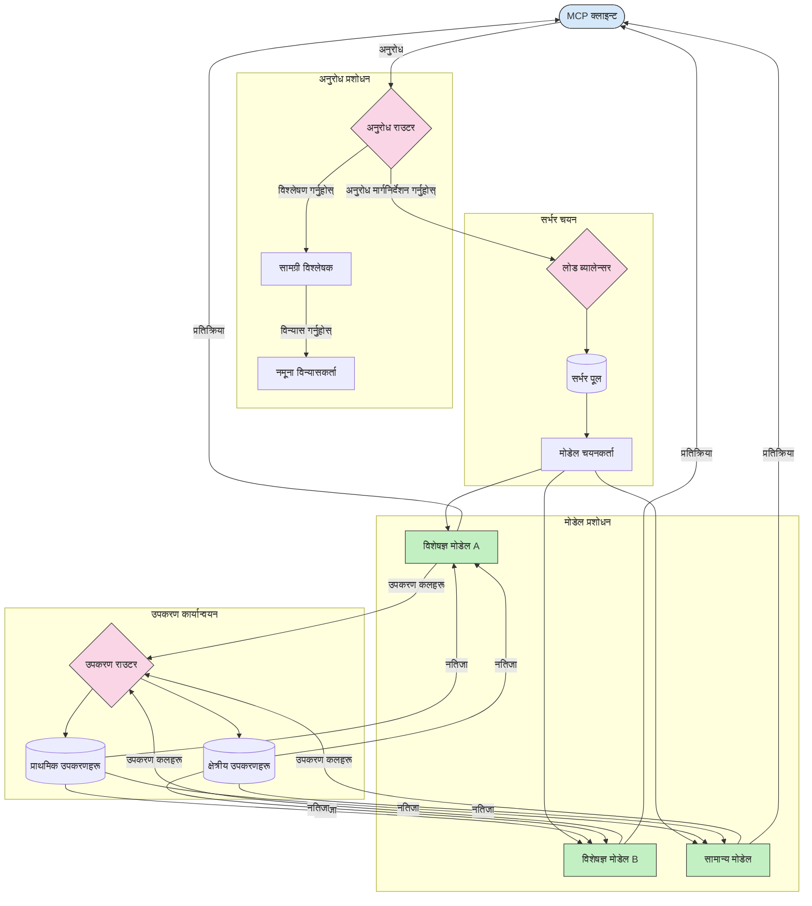

# मोडेल सन्दर्भ प्रोटोकलमा राउटिङ

राउटिङ MCP पारिस्थितिकी प्रणालीभित्र अनुरोधहरूलाई उपयुक्त मोडेल, उपकरण, वा सेवामा निर्देशित गर्न आवश्यक हुन्छ।

## परिचय

मोडेल सन्दर्भ प्रोटोकल (MCP) मा राउटिङले सामग्री प्रकार, प्रयोगकर्ता सन्दर्भ, र प्रणाली लोडजस्ता विभिन्न मापदण्डहरूमा आधारित भएर सबैभन्दा उपयुक्त मोडेल वा सेवामा अनुरोधहरूलाई निर्देशित गर्ने समावेश गर्छ। यसले कुशल प्रशोधन र स्रोतहरूको उत्तम उपयोग सुनिश्चित गर्दछ।

## सिक्ने उद्देश्यहरू

यस पाठको अन्त्यसम्म, तपाईं सक्षम हुनुहुनेछ:

- MCP मा राउटिङका सिद्धान्तहरू बुझ्न।
- विशेषज्ञ सेवाहरूमा अनुरोधहरू निर्देशित गर्न सामग्री-आधारित राउटिङ लागू गर्न।
- स्रोत उपयोगलाई अप्टिमाइज गर्न बौद्धिक लोड ब्यालेन्सिङ रणनीतिहरू लागू गर्न।
- अनुरोध सन्दर्भमा आधारित गतिशील उपकरण राउटिङ लागू गर्न।

## सामग्री-आधारित राउटिङ

सामग्री-आधारित राउटिङले अनुरोधको सामग्रीमा आधारित भएर विशेषज्ञ सेवाहरूमा अनुरोधहरू निर्देशित गर्छ। उदाहरणका लागि, कोड उत्पादनसँग सम्बन्धित अनुरोधहरूलाई विशेषज्ञ कोड मोडेलमा र रचनात्मक लेखन अनुरोधहरूलाई रचनात्मक लेखन मोडेलमा पठाउन सकिन्छ।

आउनुहोस्, विभिन्न प्रोग्रामिङ भाषाहरूमा एक उदाहरण कार्यान्वयन हेरौं।

<details>
<summary>.NET</summary>

```csharp
// .NET Example: Content-based routing in MCP
public class ContentBasedRouter
{
    private readonly Dictionary<string, McpClient> _specializedClients;
    private readonly RoutingClassifier _classifier;
    
    public ContentBasedRouter()
    {
        // Initialize specialized clients for different domains
        _specializedClients = new Dictionary<string, McpClient>
        {
            ["code"] = new McpClient("https://code-specialized-mcp.com"),
            ["creative"] = new McpClient("https://creative-specialized-mcp.com"),
            ["scientific"] = new McpClient("https://scientific-specialized-mcp.com"),
            ["general"] = new McpClient("https://general-mcp.com")
        };
        
        // Initialize content classifier
        _classifier = new RoutingClassifier();
    }
    
    public async Task<McpResponse> RouteAndProcessAsync(string prompt, IDictionary<string, object> parameters = null)
    {
        // Classify the prompt to determine the best specialized service
        string category = await _classifier.ClassifyPromptAsync(prompt);
        
        // Get the appropriate client or fall back to general
        var client = _specializedClients.ContainsKey(category) 
            ? _specializedClients[category] 
            : _specializedClients["general"];
            
        Console.WriteLine($"Routing request to {category} specialized service");
        
        // Send request to the selected service
        return await client.SendPromptAsync(prompt, parameters);
    }
    
    // Simple classifier for routing decisions
    private class RoutingClassifier
    {
        public Task<string> ClassifyPromptAsync(string prompt)
        {
            prompt = prompt.ToLowerInvariant();
            
            if (prompt.Contains("code") || prompt.Contains("function") || 
                prompt.Contains("program") || prompt.Contains("algorithm"))
            {
                return Task.FromResult("code");
            }
            
            if (prompt.Contains("story") || prompt.Contains("creative") || 
                prompt.Contains("imagine") || prompt.Contains("design"))
            {
                return Task.FromResult("creative");
            }
            
            if (prompt.Contains("science") || prompt.Contains("research") || 
                prompt.Contains("analyze") || prompt.Contains("study"))
            {
                return Task.FromResult("scientific");
            }
            
            return Task.FromResult("general");
        }
    }
}
```

माथिको कोडमा, हामीले:

- `ContentBasedRouter` क्लास सिर्जना गर्यौं जसले प्राँप्टको सामग्रीको आधारमा अनुरोधहरू राउट गर्छ।
- विभिन्न डोमेन्स (कोड, रचनात्मक, वैज्ञा­निक, सामान्य) का लागि विशेषज्ञ क्लाइन्टहरू इन्स्ट्यान्स गर्यौं।
- सरल वर्गीकरण गर्ने मेकानिज्म लागू गर्यौं जसले प्राँप्टको वर्ग निर्धारण गर्दै उपयुक्त विशेषज्ञ सेवामा राउट गर्छ।
- कुनै विशेषज्ञ सेवा उपलब्ध नभएमा अनुरोधहरूलाई सामान्य सेवामा राउट गर्न फ्यालब्याक मेकानिज्म प्रयोग गर्यौं।
- अनुरोधहरूलाई प्रभावकारी रूपमा ह्यान्डल गर्न असिंक्रोनस प्रशोधन लागू गर्यौं।
- सामग्री वर्गहरूलाई विशेषज्ञ MCP क्लाइन्टहरूसँग मिलाउन डिक्सनरी प्रयोग गर्यौं।
- प्राँप्टलाई विश्लेषण गर्ने र उपयुक्त वर्ग फर्काउने सरल वर्गीकरण लागू गर्यौं।
- विशेषज्ञ क्लाइन्ट प्रयोग गरेर अनुरोध पठाउने र जवाफ पाउने काम गर्यौं।
- प्राँप्ट कुनै विशेषज्ञ वर्गमा नपरेका केसहरूलाई सामान्य सेवामा राउट गरेर व्यवस्थापन गर्यौं।

</details>

## बौद्धिक लोड ब्यालेन्सिङ

लोड ब्यालेन्सिङले स्रोत उपयोगलाई अप्टिमाइज गर्छ र MCP सेवाहरूको उच्च उपलब्धता सुनिश्चित गर्छ। लोड ब्यालेन्सिङ कार्यान्वयन गर्ने विभिन्न तरिका छन्, जस्तै राउन्ड-रबिन, वजनयुक्त प्रतिक्रिया समय, या सामग्री-जानकारी रणनीतिहरू।

तलको उदाहरणमा तलका रणनीतिहरू प्रयोग गरिएको छ:

- **राउन्ड रोबिन**: उपलब्ध सर्भरहरूमा अनुरोधहरू समान रुपमा वितरण गर्छ।
- **वेटेड रिस्पोन्स टाइम**: सर्भरहरूको औसत प्रतिक्रिया समयमा आधारित भएर अनुरोधहरू राउट गर्छ।
- **सामग्री-जानकारी**: अनुरोधको सामग्रीको आधारमा विशेषज्ञ सर्भरहरूमा अनुरोधहरू राउट गर्छ।

<details>
<summary>Java</summary>

```java
// Java उदाहरण: MCP सर्भरहरूको लागि बौद्धिक लोड ब्यालेन्सिंग
public class McpLoadBalancer {
    private final List<McpServerNode> serverNodes;
    private final LoadBalancingStrategy strategy;
    
    public McpLoadBalancer(List<McpServerNode> nodes, LoadBalancingStrategy strategy) {
        this.serverNodes = new ArrayList<>(nodes);
        this.strategy = strategy;
    }
    
    public McpResponse processRequest(McpRequest request) {
        // रणनीति आधारित सबैभन्दा राम्रो सर्भर चयन गर्नुहोस्
        McpServerNode selectedNode = strategy.selectNode(serverNodes, request);
        
        try {
            // अनुरोध चयनित नोडमा पठाउनुहोस्
            return selectedNode.processRequest(request);
        } catch (Exception e) {
            // असफलता व्यवस्थापन गर्नुहोस् - पुन: प्रयास वा फ्यालब्याक तर्क लागू गर्नुहोस्
            System.err.println("Error processing request on node " + selectedNode.getId() + ": " + e.getMessage());
            
            // नोडलाई सम्भावित रूपमा अस्वस्थ रूपमा चिन्ह लगाउनुहोस्
            selectedNode.recordFailure();
            
            // फ्यालब्याकको रूपमा अर्को सबैभन्दा राम्रो नोड प्रयास गर्नुहोस्
            List<McpServerNode> remainingNodes = new ArrayList<>(serverNodes);
            remainingNodes.remove(selectedNode);
            
            if (!remainingNodes.isEmpty()) {
                McpServerNode fallbackNode = strategy.selectNode(remainingNodes, request);
                return fallbackNode.processRequest(request);
            } else {
                throw new RuntimeException("All MCP server nodes failed to process the request");
            }
        }
    }
    
    // नोड स्वास्थ्य जाँच कार्य
    public void startHealthChecks(Duration interval) {
        ScheduledExecutorService scheduler = Executors.newScheduledThreadPool(1);
        scheduler.scheduleAtFixedRate(() -> {
            for (McpServerNode node : serverNodes) {
                try {
                    boolean isHealthy = node.checkHealth();
                    System.out.println("Node " + node.getId() + " health status: " + 
                                      (isHealthy ? "HEALTHY" : "UNHEALTHY"));
                } catch (Exception e) {
                    System.err.println("Health check failed for node " + node.getId());
                    node.setHealthy(false);
                }
            }
        }, 0, interval.toMillis(), TimeUnit.MILLISECONDS);
    }
    
    // लोड ब्यालेन्सिङ रणनीतिहरूको लागि इन्टरफेस
    public interface LoadBalancingStrategy {
        McpServerNode selectNode(List<McpServerNode> nodes, McpRequest request);
    }
    
    // राउन्ड-रोबिन रणनीति
    public static class RoundRobinStrategy implements LoadBalancingStrategy {
        private AtomicInteger counter = new AtomicInteger(0);
        
        @Override
        public McpServerNode selectNode(List<McpServerNode> nodes, McpRequest request) {
            List<McpServerNode> healthyNodes = nodes.stream()
                .filter(McpServerNode::isHealthy)
                .collect(Collectors.toList());
            
            if (healthyNodes.isEmpty()) {
                throw new RuntimeException("No healthy nodes available");
            }
            
            int index = counter.getAndIncrement() % healthyNodes.size();
            return healthyNodes.get(index);
        }
    }
    
    // तौलयुक्त प्रतिक्रिया समय रणनीति
    public static class ResponseTimeStrategy implements LoadBalancingStrategy {
        @Override
        public McpServerNode selectNode(List<McpServerNode> nodes, McpRequest request) {
            return nodes.stream()
                .filter(McpServerNode::isHealthy)
                .min(Comparator.comparing(McpServerNode::getAverageResponseTime))
                .orElseThrow(() -> new RuntimeException("No healthy nodes available"));
        }
    }
    
    // सामग्री-चेतन रणनीति
    public static class ContentAwareStrategy implements LoadBalancingStrategy {
        @Override
        public McpServerNode selectNode(List<McpServerNode> nodes, McpRequest request) {
            // अनुरोधका विशेषताहरू निर्धारण गर्नुहोस्
            boolean isCodeRequest = request.getPrompt().contains("code") || 
                                   request.getAllowedTools().contains("codeInterpreter");
            
            boolean isCreativeRequest = request.getPrompt().contains("creative") || 
                                       request.getPrompt().contains("story");
            
            // विशेषीकृत नोडहरू फेला पार्नुहोस्
            Optional<McpServerNode> specializedNode = nodes.stream()
                .filter(McpServerNode::isHealthy)
                .filter(node -> {
                    if (isCodeRequest && node.getSpecialization().equals("code")) {
                        return true;
                    }
                    if (isCreativeRequest && node.getSpecialization().equals("creative")) {
                        return true;
                    }
                    return false;
                })
                .findFirst();
            
            // विशेषीकृत नोड वा सबैभन्दा कम लोड भएको नोड फर्काउनुहोस्
            return specializedNode.orElse(
                nodes.stream()
                    .filter(McpServerNode::isHealthy)
                    .min(Comparator.comparing(McpServerNode::getCurrentLoad))
                    .orElseThrow(() -> new RuntimeException("No healthy nodes available"))
            );
        }
    }
}
```

माथिको कोडमा, हामीले:

- `McpLoadBalancer` क्लास सिर्जना गर्यौं जसले MCP सर्भर नोडहरूको सूची व्यवस्थापन गर्छ र चयनित लोड ब्यालेन्सिङ रणनीतिमा आधारित अनुरोधहरू राउट गर्छ।
- विभिन्न लोड ब्यालेन्सिङ रणनीतिहरू लागू गर्यौं: `RoundRobinStrategy`, `ResponseTimeStrategy`, र `ContentAwareStrategy`।
- सर्भर नोडहरूको स्वास्थ्य जाँच गर्न `ScheduledExecutorService` प्रयोग गर्यौं।
- स्वास्थ्य जाँच प्रतिक्रिया आधारमा नोडहरूलाई स्वस्थ वा अस्वस्थको रूपमा मार्क गर्ने मेकानिज्म लागू गर्यौं।
- उच्च उपलब्धता सुनिश्चित गर्न त्रुटि ह्यान्डलिङ र फ्यालब्याक लॉजिकसहित अनुरोध प्रक्रिया व्यवस्थापन गर्यौं।
- व्यक्तिगत MCP सर्भर नोडहरू प्रतिनिधित्व गर्न `McpServerNode` क्लास प्रयोग गर्यौं, जसमा स्वास्थ्य स्थिति, औसत प्रतिक्रिया समय, र वर्तमान लोड समावेश छन्।
- अनुरोध विवरणहरू समेट्न `McpRequest` क्लास लागू गर्यौं जस्तै प्राँप्ट र अनुमति प्राप्त उपकरणहरू।
- स्वास्थ्य स्थिति र विशेषज्ञता आधारमा नोडहरू फिल्टर र चयन गर्न Java Streams प्रयोग गर्यौं।

</details>

## गतिशील उपकरण राउटिङ

उपकरण राउटिङले उपकरण कलहरूलाई सन्दर्भको आधारमा सबैभन्दा उपयुक्त सेवामा निर्देशित गर्छ। उदाहरणका लागि, मौसम उपकरण कललाई प्रयोगकर्ताको स्थानअनुसार क्षेत्रीय अन्तबिन्दुमा र नयाँ संस्करणको API प्रयोग गर्नुपर्ने क्याल्कुलेटर उपकरण कलमा निश्चित संस्करण प्रयोग गर्नुपर्ने हुन सक्छ।

अनुरोध विश्लेषण, क्षेत्रीय अन्तबिन्दुहरू, र संस्करण समर्थनमा आधारित गतिशील उपकरण राउटिङ देखाउने उदाहरण कार्यान्वयन हेरौं।

<details>
<summary>Python</summary>

```python
# Python उदाहरण: अनुरोध विश्लेषणमा आधारित गतिशील उपकरण मार्गनिर्देशन
class McpToolRouter:
    def __init__(self):
        # उपलब्ध उपकरण अन्तबिन्दुहरू दर्ता गर्नुहोस्
        self.tool_endpoints = {
            "weatherTool": "https://weather-service.example.com/api",
            "calculatorTool": "https://calculator-service.example.com/compute",
            "databaseTool": "https://database-service.example.com/query",
            "searchTool": "https://search-service.example.com/search"
        }
        
        # विश्वव्यापी वितरणका लागि क्षेत्रीय अन्तबिन्दुहरू
        self.regional_endpoints = {
            "us": {
                "weatherTool": "https://us-west.weather-service.example.com/api",
                "searchTool": "https://us.search-service.example.com/search"
            },
            "europe": {
                "weatherTool": "https://eu.weather-service.example.com/api",
                "searchTool": "https://eu.search-service.example.com/search"
            },
            "asia": {
                "weatherTool": "https://asia.weather-service.example.com/api",
                "searchTool": "https://asia.search-service.example.com/search"
            }
        }
        
        # उपकरण संस्करण समर्थन
        self.tool_versions = {
            "weatherTool": {
                "default": "v2",
                "v1": "https://weather-service.example.com/api/v1",
                "v2": "https://weather-service.example.com/api/v2",
                "beta": "https://weather-service.example.com/api/beta"
            }
        }
    
    async def route_tool_request(self, tool_name, parameters, user_context=None):
        """Route a tool request to the appropriate endpoint based on context"""
        endpoint = self._select_endpoint(tool_name, parameters, user_context)
        
        if not endpoint:
            raise ValueError(f"No endpoint available for tool: {tool_name}")
        
        # चयन गरिएको अन्तबिन्दुमा वास्तविक अनुरोध प्रदर्शन गर्नुहोस्
        return await self._execute_tool_request(endpoint, tool_name, parameters)
    
    def _select_endpoint(self, tool_name, parameters, user_context=None):
        """Select the most appropriate endpoint based on context"""
        # दर्ता बाट आधार अन्तबिन्दु
        if tool_name not in self.tool_endpoints:
            return None
            
        base_endpoint = self.tool_endpoints[tool_name]
        
        # के हामीलाई विशेष उपकरण संस्करण प्रयोग गर्न आवश्यक छ जाँच गर्नुहोस्
        if tool_name in self.tool_versions:
            version_info = self.tool_versions[tool_name]
            
            # निर्दिष्ट संस्करण वा पूर्वनिर्धारित प्रयोग गर्नुहोस्
            requested_version = parameters.get("_version", version_info["default"])
            if requested_version in version_info:
                base_endpoint = version_info[requested_version]
        
        # प्रयोगकर्ता क्षेत्र थाहा भएमा क्षेत्रीय मार्गनिर्देशन जाँच गर्नुहोस्
        if user_context and "region" in user_context:
            user_region = user_context["region"]
            
            if user_region in self.regional_endpoints:
                regional_tools = self.regional_endpoints[user_region]
                
                if tool_name in regional_tools:
                    # क्षेत्र-विशिष्ट अन्तबिन्दु प्रयोग गर्नुहोस्
                    return regional_tools[tool_name]
        
        # डाटा आवास आवश्यकताहरू जाँच गर्नुहोस्
        if user_context and "data_residency" in user_context:
            # यसले निर्दिष्ट क्षेत्रमा डाटा रहिरहने सुनिश्चित गर्न तर्क लागू गर्नेछ
            pass
        
        # ढिलाइ-आधारित मार्गनिर्देशन जाँच गर्नुहोस्
        if user_context and "latency_sensitive" in user_context and user_context["latency_sensitive"]:
            # यसले कमतम-ढिलाइ अन्तबिन्दु चयन गर्न तर्क लागू गर्नेछ
            pass
            
        return base_endpoint
        
    async def _execute_tool_request(self, endpoint, tool_name, parameters):
        """Execute the actual tool request to the selected endpoint"""
        try:
            async with aiohttp.ClientSession() as session:
                async with session.post(
                    endpoint,
                    json={"toolName": tool_name, "parameters": parameters},
                    headers={"Content-Type": "application/json"}
                ) as response:
                    if response.status == 200:
                        result = await response.json()
                        return result
                    else:
                        error_text = await response.text()
                        raise Exception(f"Tool execution failed: {error_text}")
        except Exception as e:
            # पुन: प्रयास तर्क वा फ्यालब्याक रणनीति लागू गर्नुहोस्
            print(f"Error executing tool {tool_name} at {endpoint}: {str(e)}")
            raise
```

माथिको कोडमा, हामीले:

- `McpToolRouter` क्लास सिर्जना गर्यौं जसले अनुरोध विश्लेषण, क्षेत्रीय अन्तबिन्दुहरू, र संस्करण समर्थनमा आधारित उपकरण राउटिङ व्यवस्थापन गर्छ।
- उपलब्ध उपकरण अन्तबिन्दुहरू र विश्वव्यापी वितरणका लागि क्षेत्रीय अन्तबिन्दुहरू दर्ता गर्यौं।
- प्रयोगकर्ता सन्दर्भजस्तै क्षेत्र र डेटा आवास आवश्यकतामा आधारित उपयुक्त अन्तबिन्दु चयन गर्ने गतिशील राउटिङ लॉजिक लागू गर्यौं।
- उपकरणहरूका लागि संस्करण समर्थन लागू गर्यौं जसले प्रयोगकर्तालाई प्रयोग गर्न चाहेको उपकरण संस्करण निर्दिष्ट गर्न अनुमति दिन्छ।
- उपकरण कलहरू निष्पादन गर्न र प्रतिक्रियाहरू ह्यान्डल गर्न असिंक्रोनस HTTP अनुरोधहरू प्रयोग गर्यौं।

</details>

## MCP मा नमुना र राउटिङ आर्किटेक्चर

नमुना मोडेल सन्दर्भ प्रोटोकल (MCP) को एउटा महत्वपूर्ण भाग हो जसले प्रभावकारी अनुरोध प्रशोधन र राउटिङ सम्भव बनाउँछ। यसले विभिन्न मापदण्डहरू जस्तै सामग्री प्रकार, प्रयोगकर्ता सन्दर्भ, र प्रणाली लोडमा आधारित सबैभन्दा उपयुक्त मोडेल वा सेवा निर्धारण गर्न आउने अनुरोधहरू विश्लेषण गर्दछ।

नमुना र राउटिङलाई संयोजन गरेर स्रोत उपयोग अनुकूल गर्ने र उच्च उपलब्धता सुनिश्चित गर्ने एक बलियो आर्किटेक्चर सिर्जना गर्न सकिन्छ। नमुना प्रक्रिया अनुरोधहरू वर्गीकरण गर्न प्रयोग गरिन्छ भने राउटिङले तिनीहरूलाई उपयुक्त मोडेल वा सेवामा निर्देशित गर्छ।

तलको आरेखले कसरी नमुना र राउटिङले व्यापक MCP आर्किटेक्चरमा सँगै काम गर्छ भन्ने देखाउँछ:



## अब के

- [5.6 Sampling](../mcp-sampling/README.md)

---

<!-- CO-OP TRANSLATOR DISCLAIMER START -->
**अस्वीकरण**:
यो दस्तावेज़ AI अनुवाद सेवा [Co-op Translator](https://github.com/Azure/co-op-translator) प्रयोग गरेर अनुवाद गरिएको हो। हामी सही हुन प्रयास गर्छौं, तर कृपया जानकार हुनुस् कि स्वचालित अनुवादमा त्रुटिहरू वा अशुद्धताहरू हुन सक्छन्। मूल दस्तावेज़ यसको मूल भाषामा आधिकारिक स्रोत मानिनुपर्छ। महत्वपूर्ण जानकारीका लागि व्यावसायिक मानव अनुवाद सिफारिस गरिन्छ। यस अनुवादको प्रयोगबाट उत्पन्न कुनै पनि गलत बुझाइ वा त्रुटिको लागि हामी जिम्मेवार छैनौं।
<!-- CO-OP TRANSLATOR DISCLAIMER END -->