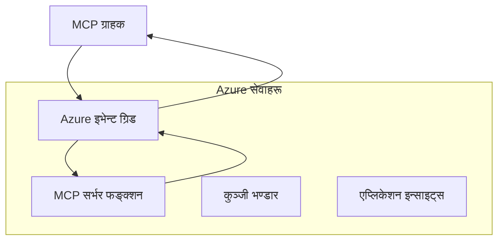
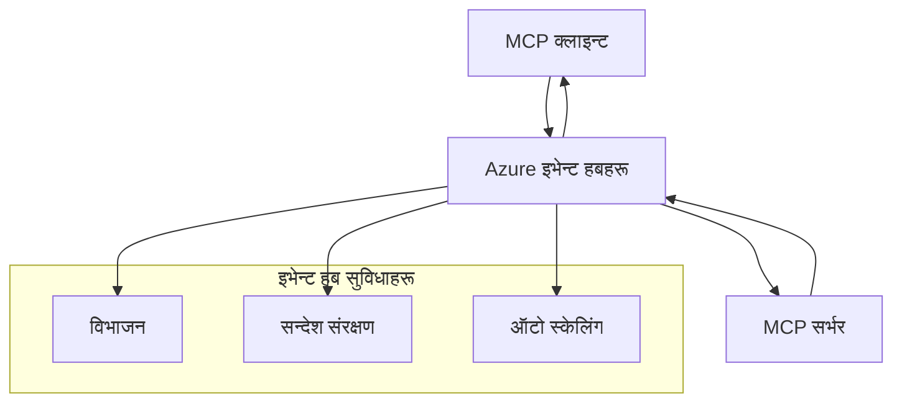

# MCP कस्टम ट्रान्सपोर्टहरू - उन्नत कार्यान्वयन मार्गदर्शन

मोडेल सन्दर्भ प्रोटोकल (MCP) ले ट्रान्सपोर्ट मेकानिजमहरूमा लचीलापन प्रदान गर्दछ, जसले विशेष एण्टरप्राइज वातावरणहरूका लागि कस्टम कार्यान्वयनहरू अनुमति दिन्छ। यो उन्नत मार्गदर्शन Azure Event Grid र Azure Event Hubs प्रयोग गरेर कस्टम ट्रान्सपोर्ट कार्यान्वयनहरूलाई व्यावहारिक उदाहरणको रूपमा अन्वेषण गर्दछ जसले स्केलेबल, क्लाउड-नेटिभ MCP समाधानहरू बनाउँछ।

> **अगाडि हेर्दै:** यो मार्गदर्शन **MCP विनिर्देश 2025-11-25** को आधारमा लेखिएको छ, जहाँ सेसन अर्डरिंगलाई प्रति सेसन कायम राख्नुपर्छ (मेस्सेज प्रोटोकल तल हेर्नुहोस्)। `2026-07-28` रिलीज क्यान्डिडेटले प्रोटोकल-स्तर सेसनलाई पूर्ण रूपमा हटाएको छ र `Mcp-Method`/`Mcp-Name` हेडरहरू आवश्यक बनाउँछ ताकि गेटवे र कस्टम ट्रान्सपोर्टहरूले प्रति अनुरोध राउटिङ गर्न सकून् ना कि प्रति सेसन। [MCP मा के बदलिंदैछ: 2026-07-28 रिलिज क्यान्डिडेट](../../01-CoreConcepts/mcp-2026-07-28-release-candidate.md) हेर्नुहोस्।

## परिचय

जबकि MCP का मानक ट्रान्सपोर्टहरू (stdio र HTTP स्ट्रिमिङ) धेरै प्रयोगहरूका लागि सेवा गर्दछन्, एण्टरप्राइज वातावरणहरूले सुधारिएको स्केलेबिलिटी, विश्वसनीयता, र अवस्थित क्लाउड पूर्वाधारसँग एकीकरणका लागि विशेष ट्रान्सपोर्ट मेकानिजमहरू आवश्यक पर्दछन्। कस्टम ट्रान्सपोर्टहरूले MCP लाई क्लाउड-नेटिभ मेसेजिङ सेवाहरूको लाभ उठाउन सक्षम गर्दछ, जसले एसिंक्रोनस सञ्चार, घटनाप्रेरित संरचनाहरू, र वितरित प्रशोधनमा सहयोग पुर्याउँछ।

यस पाठले नवीनतम MCP विनिर्देश (2025-11-25), Azure मेसेजिङ सेवाहरू, र स्थापित एण्टरप्राइज एकीकरण नमूनाहरूमा आधारित उन्नत ट्रान्सपोर्ट कार्यान्वयनहरू अन्वेषण गर्दछ।

### **MCP ट्रान्सपोर्ट आर्किटेक्चर**

**MCP विनिर्देश (2025-11-25) बाट:**

- **मानक ट्रान्सपोर्टहरू**: stdio (सिफारिस गरिएको), HTTP स्ट्रिमिङ (दूरस्थ परिदृश्यहरूका लागि)
- **कस्टम ट्रान्सपोर्टहरू**: कुनै पनि ट्रान्सपोर्ट जसले MCP मेसेज एक्सचेन्ज प्रोटोकल कार्यान्वयन गर्दछ
- **मेसेज ढाँचा**: JSON-RPC 2.0 MCP-विशिष्ट विस्तारहरूसँग
- **द्वि-दिशात्मक सञ्चार**: सूचना र प्रतिक्रियाहरूको लागि पूर्ण डुप्लेक्स सञ्चार आवश्यक

## सिकाइ लक्ष्यहरू

यस उन्नत पाठको अन्त्यसम्म, तपाईं सक्षम हुनुहुनेछ:

- **कस्टम ट्रान्सपोर्ट आवश्यकताहरू बुझ्न**: कुनै पनि ट्रान्सपोर्ट तहमा MCP प्रोटोकल कार्यान्वयन गर्नुहोस् र अनुपालन कायम राख्नुहोस्
- **Azure Event Grid ट्रान्सपोर्ट निर्माण**: Azure Event Grid प्रयोग गरी एमसीपी सर्वरहरू घटना-प्रेरित रूपमा सिर्जना गर्नुहोस्, सर्वररहित स्केलेबिलिटीका लागि
- **Azure Event Hubs ट्रान्सपोर्ट कार्यान्वयन गर्नुहोस्**: वास्तविक-समय स्ट्रिमिङका लागि Azure Event Hubs प्रयोग गरी उच्च-थ्रूपुट MCP समाधानहरू डिजाइन गर्नुहोस्
- **एण्टरप्राइज नमूनाहरू लागू गर्नुहोस्**: अवस्थित Azure पूर्वाधार र सुरक्षा मोडेलहरूसँग कस्टम ट्रान्सपोर्टहरू एकीकृत गर्नुहोस्
- **ट्रान्सपोर्ट विश्वसनीयता ह्यान्डल गर्नुहोस्**: एण्टरप्राइज परिदृश्यहरूका लागि मेसेज टिकाउपन, अर्डरिंग, र त्रुटि ह्यान्डलिङ कार्यान्वयन गर्नुहोस्
- **प्रदर्शन सुधार गर्नुहोस्**: स्केल, लेटेन्सी, र थ्रूपुट आवश्यकताहरूका लागि ट्रान्सपोर्ट समाधानहरू डिजाइन गर्नुहोस्

## **ट्रान्सपोर्ट आवश्यकताहरू**

### **MCP विनिर्देश (2025-11-25) बाट मूल आवश्यकताहरू:**

```yaml
Message Protocol:
  format: "JSON-RPC 2.0 with MCP extensions"
  bidirectional: "Full duplex communication required"
  ordering: "Message ordering must be preserved per session"
  
Transport Layer:
  reliability: "Transport MUST handle connection failures gracefully"
  security: "Transport MUST support secure communication"
  identification: "Each session MUST have unique identifier"
  
Custom Transport:
  compliance: "MUST implement complete MCP message exchange"
  extensibility: "MAY add transport-specific features"
  interoperability: "MUST maintain protocol compatibility"
```

## **Azure Event Grid ट्रान्सपोर्ट कार्यान्वयन**

Azure Event Grid ले घटना-प्रेरित MCP संरचनाहरूका लागि उपयुक्त सर्वररहित घटना राउटिङ सेवा प्रदान गर्दछ। यस कार्यान्वयनले कसरी स्केलेबल, कम सम्बन्धित MCP प्रणालीहरू निर्माण गर्ने देखाउँछ।

### **आर्किटेक्चर अवलोकन**



### **C# कार्यान्वयन - Event Grid ट्रान्सपोर्ट**

```csharp
using Azure.Messaging.EventGrid;
using Microsoft.Extensions.Azure;
using System.Text.Json;

public class EventGridMcpTransport : IMcpTransport
{
    private readonly EventGridPublisherClient _publisher;
    private readonly string _topicEndpoint;
    private readonly string _clientId;
    
    public EventGridMcpTransport(string topicEndpoint, string accessKey, string clientId)
    {
        _publisher = new EventGridPublisherClient(
            new Uri(topicEndpoint), 
            new AzureKeyCredential(accessKey));
        _topicEndpoint = topicEndpoint;
        _clientId = clientId;
    }
    
    public async Task SendMessageAsync(McpMessage message)
    {
        var eventGridEvent = new EventGridEvent(
            subject: $"mcp/{_clientId}",
            eventType: "MCP.MessageReceived",
            dataVersion: "1.0",
            data: JsonSerializer.Serialize(message))
        {
            Id = Guid.NewGuid().ToString(),
            EventTime = DateTimeOffset.UtcNow
        };
        
        await _publisher.SendEventAsync(eventGridEvent);
    }
    
    public async Task<McpMessage> ReceiveMessageAsync(CancellationToken cancellationToken)
    {
        // Event Grid is push-based, so implement webhook receiver
        // This would typically be handled by Azure Functions trigger
        throw new NotImplementedException("Use EventGridTrigger in Azure Functions");
    }
}

// Azure Function for receiving Event Grid events
[FunctionName("McpEventGridReceiver")]
public async Task<IActionResult> HandleEventGridMessage(
    [EventGridTrigger] EventGridEvent eventGridEvent,
    ILogger log)
{
    try
    {
        var mcpMessage = JsonSerializer.Deserialize<McpMessage>(
            eventGridEvent.Data.ToString());
        
        // Process MCP message
        var response = await _mcpServer.ProcessMessageAsync(mcpMessage);
        
        // Send response back via Event Grid
        await _transport.SendMessageAsync(response);
        
        return new OkResult();
    }
    catch (Exception ex)
    {
        log.LogError(ex, "Error processing Event Grid MCP message");
        return new BadRequestResult();
    }
}
```

### **TypeScript कार्यान्वयन - Event Grid ट्रान्सपोर्ट**

```typescript
import { EventGridPublisherClient, AzureKeyCredential } from "@azure/eventgrid";
import { McpTransport, McpMessage } from "./mcp-types";

export class EventGridMcpTransport implements McpTransport {
    private publisher: EventGridPublisherClient;
    private clientId: string;
    
    constructor(
        private topicEndpoint: string,
        private accessKey: string,
        clientId: string
    ) {
        this.publisher = new EventGridPublisherClient(
            topicEndpoint,
            new AzureKeyCredential(accessKey)
        );
        this.clientId = clientId;
    }
    
    async sendMessage(message: McpMessage): Promise<void> {
        const event = {
            id: crypto.randomUUID(),
            source: `mcp-client-${this.clientId}`,
            type: "MCP.MessageReceived",
            time: new Date(),
            data: message
        };
        
        await this.publisher.sendEvents([event]);
    }
    
    // ईभेन्ट-ड्राइभन रीसिभ Azure Functions मार्फत
    onMessage(handler: (message: McpMessage) => Promise<void>): void {
        // कार्यान्वयनले Azure Functions Event Grid ट्रिगर प्रयोग गर्नेछ
        // यो वेबहुक रिसिभरको लागि एक वैचारिक इन्टरफेस हो
    }
}

// Azure Functions कार्यान्वयन
import { app, InvocationContext, EventGridEvent } from "@azure/functions";

app.eventGrid("mcpEventGridHandler", {
    handler: async (event: EventGridEvent, context: InvocationContext) => {
        try {
            const mcpMessage = event.data as McpMessage;
            
            // MCP सन्देश प्रक्रिया गर्नुहोस्
            const response = await mcpServer.processMessage(mcpMessage);
            
            // Event Grid मार्फत प्रतिक्रिया पठाउनुहोस्
            await transport.sendMessage(response);
            
        } catch (error) {
            context.error("Error processing MCP message:", error);
            throw error;
        }
    }
});
```

### **Python कार्यान्वयन - Event Grid ट्रान्सपोर्ट**

```python
from azure.eventgrid import EventGridPublisherClient, EventGridEvent
from azure.core.credentials import AzureKeyCredential
import asyncio
import json
from typing import Callable, Optional
import uuid
from datetime import datetime

class EventGridMcpTransport:
    def __init__(self, topic_endpoint: str, access_key: str, client_id: str):
        self.client = EventGridPublisherClient(
            topic_endpoint, 
            AzureKeyCredential(access_key)
        )
        self.client_id = client_id
        self.message_handler: Optional[Callable] = None
    
    async def send_message(self, message: dict) -> None:
        """Send MCP message via Event Grid"""
        event = EventGridEvent(
            data=message,
            subject=f"mcp/{self.client_id}",
            event_type="MCP.MessageReceived",
            data_version="1.0"
        )
        
        await self.client.send(event)
    
    def on_message(self, handler: Callable[[dict], None]) -> None:
        """Register message handler for incoming events"""
        self.message_handler = handler

# अजुर फंक्शन्स कार्यान्वयन
import azure.functions as func
import logging

def main(event: func.EventGridEvent) -> None:
    """Azure Functions Event Grid trigger for MCP messages"""
    try:
        # इभेन्ट ग्रिड इभेन्टबाट MCP सन्देश पार्स गर्नुहोस्
        mcp_message = json.loads(event.get_body().decode('utf-8'))
        
        # MCP सन्देश प्रक्रिया गर्नुहोस्
        response = process_mcp_message(mcp_message)
        
        # इभेन्ट ग्रिड मार्फत प्रतिक्रिया फर्काउनुहोस्
        # (कार्यान्वयनले नयाँ इभेन्ट ग्रिड क्लाइन्ट सिर्जना गर्नेछ)
        
    except Exception as e:
        logging.error(f"Error processing MCP Event Grid message: {e}")
        raise
```

## **Azure Event Hubs ट्रान्सपोर्ट कार्यान्वयन**

Azure Event Hubs ले कम लेटेन्सी र उच्च मेसेज भोल्युम आवश्यक पर्ने MCP परिदृश्यहरूको लागि उच्च-थ्रूपुट, वास्तविक-समय स्ट्रिमिङ क्षमता प्रदान गर्दछ।

### **आर्किटेक्चर अवलोकन**



### **C# कार्यान्वयन - Event Hubs ट्रान्सपोर्ट**

```csharp
using Azure.Messaging.EventHubs;
using Azure.Messaging.EventHubs.Producer;
using Azure.Messaging.EventHubs.Consumer;
using System.Text;

public class EventHubsMcpTransport : IMcpTransport, IDisposable
{
    private readonly EventHubProducerClient _producer;
    private readonly EventHubConsumerClient _consumer;
    private readonly string _consumerGroup;
    private readonly CancellationTokenSource _cancellationTokenSource;
    
    public EventHubsMcpTransport(
        string connectionString, 
        string eventHubName,
        string consumerGroup = "$Default")
    {
        _producer = new EventHubProducerClient(connectionString, eventHubName);
        _consumer = new EventHubConsumerClient(
            consumerGroup, 
            connectionString, 
            eventHubName);
        _consumerGroup = consumerGroup;
        _cancellationTokenSource = new CancellationTokenSource();
    }
    
    public async Task SendMessageAsync(McpMessage message)
    {
        var messageBody = JsonSerializer.Serialize(message);
        var eventData = new EventData(Encoding.UTF8.GetBytes(messageBody));
        
        // Add MCP-specific properties
        eventData.Properties.Add("MessageType", message.Method ?? "response");
        eventData.Properties.Add("MessageId", message.Id);
        eventData.Properties.Add("Timestamp", DateTimeOffset.UtcNow);
        
        await _producer.SendAsync(new[] { eventData });
    }
    
    public async Task StartReceivingAsync(
        Func<McpMessage, Task> messageHandler)
    {
        await foreach (PartitionEvent partitionEvent in _consumer.ReadEventsAsync(
            _cancellationTokenSource.Token))
        {
            try
            {
                var messageBody = Encoding.UTF8.GetString(
                    partitionEvent.Data.EventBody.ToArray());
                var mcpMessage = JsonSerializer.Deserialize<McpMessage>(messageBody);
                
                await messageHandler(mcpMessage);
            }
            catch (Exception ex)
            {
                // Handle deserialization or processing errors
                Console.WriteLine($"Error processing message: {ex.Message}");
            }
        }
    }
    
    public void Dispose()
    {
        _cancellationTokenSource?.Cancel();
        _producer?.DisposeAsync().AsTask().Wait();
        _consumer?.DisposeAsync().AsTask().Wait();
        _cancellationTokenSource?.Dispose();
    }
}
```

### **TypeScript कार्यान्वयन - Event Hubs ट्रान्सपोर्ट**

```typescript
import { 
    EventHubProducerClient, 
    EventHubConsumerClient, 
    EventData 
} from "@azure/event-hubs";

export class EventHubsMcpTransport implements McpTransport {
    private producer: EventHubProducerClient;
    private consumer: EventHubConsumerClient;
    private isReceiving = false;
    
    constructor(
        private connectionString: string,
        private eventHubName: string,
        private consumerGroup: string = "$Default"
    ) {
        this.producer = new EventHubProducerClient(
            connectionString, 
            eventHubName
        );
        this.consumer = new EventHubConsumerClient(
            consumerGroup,
            connectionString,
            eventHubName
        );
    }
    
    async sendMessage(message: McpMessage): Promise<void> {
        const eventData: EventData = {
            body: JSON.stringify(message),
            properties: {
                messageType: message.method || "response",
                messageId: message.id,
                timestamp: new Date().toISOString()
            }
        };
        
        await this.producer.sendBatch([eventData]);
    }
    
    async startReceiving(
        messageHandler: (message: McpMessage) => Promise<void>
    ): Promise<void> {
        if (this.isReceiving) return;
        
        this.isReceiving = true;
        
        const subscription = this.consumer.subscribe({
            processEvents: async (events, context) => {
                for (const event of events) {
                    try {
                        const messageBody = event.body as string;
                        const mcpMessage: McpMessage = JSON.parse(messageBody);
                        
                        await messageHandler(mcpMessage);
                        
                        // कम्तिमा एक पटक वितरणका लागि चेकिन्ट अपडेट गर्नुहोस्
                        await context.updateCheckpoint(event);
                    } catch (error) {
                        console.error("Error processing Event Hubs message:", error);
                    }
                }
            },
            processError: async (err, context) => {
                console.error("Event Hubs error:", err);
            }
        });
    }
    
    async close(): Promise<void> {
        this.isReceiving = false;
        await this.producer.close();
        await this.consumer.close();
    }
}
```

### **Python कार्यान्वयन - Event Hubs ट्रान्सपोर्ट**

```python
from azure.eventhub import EventHubProducerClient, EventHubConsumerClient
from azure.eventhub import EventData
import json
import asyncio
from typing import Callable, Dict, Any
import logging

class EventHubsMcpTransport:
    def __init__(
        self, 
        connection_string: str, 
        eventhub_name: str,
        consumer_group: str = "$Default"
    ):
        self.producer = EventHubProducerClient.from_connection_string(
            connection_string, 
            eventhub_name=eventhub_name
        )
        self.consumer = EventHubConsumerClient.from_connection_string(
            connection_string,
            consumer_group=consumer_group,
            eventhub_name=eventhub_name
        )
        self.is_receiving = False
    
    async def send_message(self, message: Dict[str, Any]) -> None:
        """Send MCP message via Event Hubs"""
        event_data = EventData(json.dumps(message))
        
        # MCP-विशिष्ट गुणहरू थप्नुहोस्
        event_data.properties = {
            "messageType": message.get("method", "response"),
            "messageId": message.get("id"),
            "timestamp": "2025-01-14T10:30:00Z"  # वास्तविक समयचिह्न प्रयोग गर्नुहोस्
        }
        
        async with self.producer:
            event_data_batch = await self.producer.create_batch()
            event_data_batch.add(event_data)
            await self.producer.send_batch(event_data_batch)
    
    async def start_receiving(
        self, 
        message_handler: Callable[[Dict[str, Any]], None]
    ) -> None:
        """Start receiving MCP messages from Event Hubs"""
        if self.is_receiving:
            return
        
        self.is_receiving = True
        
        async with self.consumer:
            await self.consumer.receive(
                on_event=self._on_event_received(message_handler),
                starting_position="-1"  # सुरुबाट सुरु गर्नुहोस्
            )
    
    def _on_event_received(self, handler: Callable):
        """Internal event handler wrapper"""
        async def handle_event(partition_context, event):
            try:
                # Event Hubs घटनाबाट MCP सन्देश पार्स गर्नुहोस्
                message_body = event.body_as_str(encoding='UTF-8')
                mcp_message = json.loads(message_body)
                
                # MCP सन्देश प्रशोधन गर्नुहोस्
                await handler(mcp_message)
                
                # कम्तिमा एक पटक डेलिभरीका लागि जाँचबिन्दु अपडेट गर्नुहोस्
                await partition_context.update_checkpoint(event)
                
            except Exception as e:
                logging.error(f"Error processing Event Hubs message: {e}")
        
        return handle_event
    
    async def close(self) -> None:
        """Clean up transport resources"""
        self.is_receiving = False
        await self.producer.close()
        await self.consumer.close()
```

## **उन्नत ट्रान्सपोर्ट नमूनाहरू**

### **मेसेज टिकाउपन र विश्वसनीयता**

```csharp
// Implementing message durability with retry logic
public class ReliableTransportWrapper : IMcpTransport
{
    private readonly IMcpTransport _innerTransport;
    private readonly RetryPolicy _retryPolicy;
    
    public async Task SendMessageAsync(McpMessage message)
    {
        await _retryPolicy.ExecuteAsync(async () =>
        {
            try
            {
                await _innerTransport.SendMessageAsync(message);
            }
            catch (TransportException ex) when (ex.IsRetryable)
            {
                // Log and retry
                throw;
            }
        });
    }
}
```

### **ट्रान्सपोर्ट सुरक्षा एकीकरण**

```csharp
// Integrating Azure Key Vault for transport security
public class SecureTransportFactory
{
    private readonly SecretClient _keyVaultClient;
    
    public async Task<IMcpTransport> CreateEventGridTransportAsync()
    {
        var accessKey = await _keyVaultClient.GetSecretAsync("EventGridAccessKey");
        var topicEndpoint = await _keyVaultClient.GetSecretAsync("EventGridTopic");
        
        return new EventGridMcpTransport(
            topicEndpoint.Value.Value,
            accessKey.Value.Value,
            Environment.MachineName
        );
    }
}
```

### **ट्रान्सपोर्ट अनुगमन र अवलोकनयोग्य**

```csharp
// Adding telemetry to custom transports
public class ObservableTransport : IMcpTransport
{
    private readonly IMcpTransport _transport;
    private readonly ILogger _logger;
    private readonly TelemetryClient _telemetryClient;
    
    public async Task SendMessageAsync(McpMessage message)
    {
        using var activity = Activity.StartActivity("MCP.Transport.Send");
        activity?.SetTag("transport.type", "EventGrid");
        activity?.SetTag("message.method", message.Method);
        
        var stopwatch = Stopwatch.StartNew();
        
        try
        {
            await _transport.SendMessageAsync(message);
            
            _telemetryClient.TrackDependency(
                "EventGrid",
                "SendMessage",
                DateTime.UtcNow.Subtract(stopwatch.Elapsed),
                stopwatch.Elapsed,
                true
            );
        }
        catch (Exception ex)
        {
            _telemetryClient.TrackException(ex);
            throw;
        }
    }
}
```

## **एण्टरप्राइज एकीकरण परिदृश्यहरू**

### **परिदृश्य १: वितरित MCP प्रशोधन**

Azure Event Grid प्रयोग गरी MCP अनुरोधहरू बहु प्रशोधन नोडहरूमा वितरण गर्दै:

```yaml
Architecture:
  - MCP Client sends requests to Event Grid topic
  - Multiple Azure Functions subscribe to process different tool types
  - Results aggregated and returned via separate response topic
  
Benefits:
  - Horizontal scaling based on message volume
  - Fault tolerance through redundant processors
  - Cost optimization with serverless compute
```

### **परिदृश्य २: वास्तविक-समय MCP स्ट्रिमिङ**

उच्च आवृत्तिमा MCP अन्तर्क्रियाहरूको लागि Azure Event Hubs प्रयोग गर्दै:

```yaml
Architecture:
  - MCP Client streams continuous requests via Event Hubs
  - Stream Analytics processes and routes messages
  - Multiple consumers handle different aspect of processing
  
Benefits:
  - Low latency for real-time scenarios
  - High throughput for batch processing
  - Built-in partitioning for parallel processing
```

### **परिदृश्य ३: हाइब्रिड ट्रान्सपोर्ट आर्किटेक्चर**

विभिन्न प्रयोग केसहरूका लागि धेरै ट्रान्सपोर्टहरू संयुक्त गर्दै:

```csharp
public class HybridMcpTransport : IMcpTransport
{
    private readonly IMcpTransport _realtimeTransport; // Event Hubs
    private readonly IMcpTransport _batchTransport;    // Event Grid
    private readonly IMcpTransport _fallbackTransport; // HTTP Streaming
    
    public async Task SendMessageAsync(McpMessage message)
    {
        // Route based on message characteristics
        var transport = message.Method switch
        {
            "tools/call" when IsRealtime(message) => _realtimeTransport,
            "resources/read" when IsBatch(message) => _batchTransport,
            _ => _fallbackTransport
        };
        
        await transport.SendMessageAsync(message);
    }
}
```

## **प्रदर्शन सुधार**

### **Event Grid का लागि मेसेज ब्याचिङ**

```csharp
public class BatchingEventGridTransport : IMcpTransport
{
    private readonly List<McpMessage> _messageBuffer = new();
    private readonly Timer _flushTimer;
    private const int MaxBatchSize = 100;
    
    public async Task SendMessageAsync(McpMessage message)
    {
        lock (_messageBuffer)
        {
            _messageBuffer.Add(message);
            
            if (_messageBuffer.Count >= MaxBatchSize)
            {
                _ = Task.Run(FlushMessages);
            }
        }
    }
    
    private async Task FlushMessages()
    {
        List<McpMessage> toSend;
        lock (_messageBuffer)
        {
            toSend = new List<McpMessage>(_messageBuffer);
            _messageBuffer.Clear();
        }
        
        if (toSend.Any())
        {
            var events = toSend.Select(CreateEventGridEvent);
            await _publisher.SendEventsAsync(events);
        }
    }
}
```

### **Event Hubs को लागि पार्टिशनिङ रणनीति**

```csharp
public class PartitionedEventHubsTransport : IMcpTransport
{
    public async Task SendMessageAsync(McpMessage message)
    {
        // Partition by client ID for session affinity
        var partitionKey = ExtractClientId(message);
        
        var eventData = new EventData(JsonSerializer.SerializeToUtf8Bytes(message))
        {
            PartitionKey = partitionKey
        };
        
        await _producer.SendAsync(new[] { eventData });
    }
}
```

## **कस्टम ट्रान्सपोर्टहरूको परीक्षण**

### **टेस्ट डबल्ससँग युनिट परीक्षण**

```csharp
[Test]
public async Task EventGridTransport_SendMessage_PublishesCorrectEvent()
{
    // Arrange
    var mockPublisher = new Mock<EventGridPublisherClient>();
    var transport = new EventGridMcpTransport(mockPublisher.Object);
    var message = new McpMessage { Method = "tools/list", Id = "test-123" };
    
    // Act
    await transport.SendMessageAsync(message);
    
    // Assert
    mockPublisher.Verify(
        x => x.SendEventAsync(
            It.Is<EventGridEvent>(e => 
                e.EventType == "MCP.MessageReceived" &&
                e.Subject == "mcp/test-client"
            )
        ),
        Times.Once
    );
}
```

### **Azure टेस्ट कन्टेनरहरूसँग एकीकरण परीक्षण**

```csharp
[Test]
public async Task EventHubsTransport_IntegrationTest()
{
    // Using Testcontainers for integration testing
    var eventHubsContainer = new EventHubsContainer()
        .WithEventHub("test-hub");
    
    await eventHubsContainer.StartAsync();
    
    var transport = new EventHubsMcpTransport(
        eventHubsContainer.GetConnectionString(),
        "test-hub"
    );
    
    // Test message round-trip
    var sentMessage = new McpMessage { Method = "test", Id = "123" };
    McpMessage receivedMessage = null;
    
    await transport.StartReceivingAsync(msg => {
        receivedMessage = msg;
        return Task.CompletedTask;
    });
    
    await transport.SendMessageAsync(sentMessage);
    await Task.Delay(1000); // Allow for message processing
    
    Assert.That(receivedMessage?.Id, Is.EqualTo("123"));
}
```

## **श्रेष्ठ अभ्यासहरू र दिशानिर्देशहरू**

### **ट्रान्सपोर्ट डिजाइन सिद्धान्तहरू**

1. **आइडेम्पोटेन्सी**: डुप्लिकेटहरू ह्यान्डल गर्न मेसेज प्रशोधनलाई आइडेम्पोटेण्ट बनाउन सुनिश्चित गर्नुहोस्
2. **त्रुटि ह्यान्डलिङ**: व्यापक त्रुटि ह्यान्डलिङ र डेड लेटर कतारहरू कार्यान्वयन गर्नुहोस्
3. **अनुगमन**: विस्तृत टेलीमेट्री र स्वास्थ्य जाँचहरू थप्नुहोस्
4. **सुरक्षा**: व्यवस्थापित आइडेन्टिटीहरू र न्यूनतम विशेषाधिकार पहुँच प्रयोग गर्नुहोस्
5. **प्रदर्शन**: तपाईंको विशेष लेटेन्सी र थ्रूपुट आवश्यकताहरूका लागि डिजाइन गर्नुहोस्

### **Azure-विशेष सिफारिसहरू**

1. **व्यवस्थापित आइडेन्टिटी प्रयोग गर्नुहोस्**: उत्पादनमा कनेक्शन स्ट्रिङहरूबाट बच्नुहोस्
2. **सर्किट ब्रेकरहरू लागू गर्नुहोस्**: Azure सेवा अवरोधहरू विरुद्ध सुरक्षा गर्नुहोस्
3. **खर्च अनुगमन गर्नुहोस्**: मेसेज भोल्युम र प्रशोधन खर्चहरू ट्र्याक गर्नुहोस्
4. **स्केलको लागि योजना बनाउनुहोस्**: शुरुमा पार्टिशनिङ र स्केलिंग रणनीतिहरू डिजाइन गर्नुहोस्
5. **पूर्ण परीक्षण गर्नुहोस्**: व्यापक परीक्षणका लागि Azure DevTest Labs प्रयोग गर्नुहोस्

## **निष्कर्ष**

कस्टम MCP ट्रान्सपोर्टहरूले Azure का मेसेजिङ सेवाहरू प्रयोग गरेर शक्तिशाली एण्टरप्राइज परिदृश्यहरू सक्षम पार्दछन्। Event Grid वा Event Hubs ट्रान्सपोर्ट कार्यान्वयन गरेर, तपाईं स्केलेबल, विश्वसनीय MCP समाधानहरू निर्माण गर्न सक्नुहुन्छ जुन अवस्थित Azure पूर्वाधारसँग सहज रूपमा एकीकृत हुन्छ।

दिइएका उदाहरणहरूले उत्पादन तयार नमूनाहरू प्रदर्शन गर्छन् जसले कस्टम ट्रान्सपोर्टहरू कार्यान्वयन गर्दा MCP प्रोटोकल अनुपालन र Azure को उत्कृष्ट अभ्यासहरू कायम राख्दछन्।

## **थप स्रोतहरू**

- [MCP विनिर्देश 2025-11-25](https://modelcontextprotocol.io/specification/2025-11-25/)
- [Azure Event Grid दस्तावेजीकरण](https://docs.microsoft.com/azure/event-grid/)
- [Azure Event Hubs दस्तावेजीकरण](https://docs.microsoft.com/azure/event-hubs/)
- [Azure Functions Event Grid ट्रिगर](https://docs.microsoft.com/azure/azure-functions/functions-bindings-event-grid)
- [Azure SDK for .NET](https://github.com/Azure/azure-sdk-for-net)
- [Azure SDK for TypeScript](https://github.com/Azure/azure-sdk-for-js)
- [Azure SDK for Python](https://github.com/Azure/azure-sdk-for-python)

---

> *यस मार्गदर्शनले उत्पादन MCP प्रणालीहरूको लागि व्यावहारिक कार्यान्वयन नमूनाहरूमा केन्द्रित छ। कृपया तपाईंका विशेष आवश्यकताहरू र Azure सेवा सीमाहरू विरुद्ध ट्रान्सपोर्ट कार्यान्वयनहरू सधैं प्रमाणीकरण गर्नुहोस्।*
> **वर्तमान मानक**: यो मार्गदर्शन [MCP विनिर्देश 2025-11-25](https://modelcontextprotocol.io/specification/2025-11-25/) ट्रान्सपोर्ट आवश्यकताहरू र एण्टरप्राइज वातावरणहरूका लागि उन्नत ट्रान्सपोर्ट नमूनाहरूलाई प्रतिबिम्बित गर्दछ।


## के आउँदैछ
- [6. समुदाय योगदानहरू](../../06-CommunityContributions/README.md)

---

<!-- CO-OP TRANSLATOR DISCLAIMER START -->
**अस्वीकरण**:
यो दस्तावेज़ AI अनुवाद सेवा [Co-op Translator](https://github.com/Azure/co-op-translator) प्रयोग गरेर अनुवाद गरिएको हो। हामी सही हुन प्रयास गर्छौं, तर कृपया जानकार हुनुस् कि स्वचालित अनुवादमा त्रुटिहरू वा अशुद्धताहरू हुन सक्छन्। मूल दस्तावेज़ यसको मूल भाषामा आधिकारिक स्रोत मानिनुपर्छ। महत्वपूर्ण जानकारीका लागि व्यावसायिक मानव अनुवाद सिफारिस गरिन्छ। यस अनुवादको प्रयोगबाट उत्पन्न कुनै पनि गलत बुझाइ वा त्रुटिको लागि हामी जिम्मेवार छैनौं।
<!-- CO-OP TRANSLATOR DISCLAIMER END -->