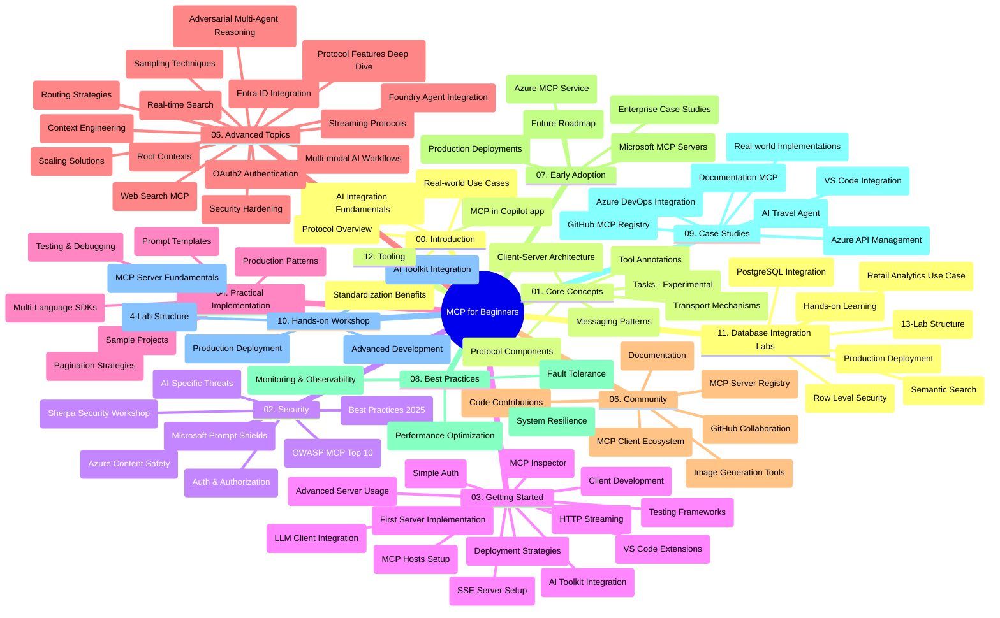

# शुरुवातीका लागि मोडेल सन्दर्भ प्रोटोकल (MCP) - अध्ययन मार्गदर्शन

यो अध्ययन मार्गदर्शनले "शुरुवातीका लागि मोडेल सन्दर्भ प्रोटोकल (MCP)" पाठ्यक्रमको रिपोजिटरी संरचना र सामग्रीको अवलोकन प्रदान गर्दछ। रिपोजिटरीलाई कुशलतापूर्वक नेभिगेट गर्न र उपलब्ध स्रोतहरूको अधिकतम उपयोग गर्न यो मार्गदर्शन प्रयोग गर्नुहोस्।

## रिपोजिटरी अवलोकन

मोडेल सन्दर्भ प्रोटोकल (MCP) कृत्रिम बौद्धिक मोडेलहरू र क्लाइन्ट एप्लिकेशनहरूबीच अन्तरक्रिया गर्नको लागि मानकीकृत फ्रेमवर्क हो। सुरुमा Anthropic द्वारा सिर्जना गरिएको MCP अहिले आधिकारिक GitHub संगठनमार्फत व्यापक MCP समुदायद्वारा मर्मत गरिएको छ। यो रिपोजिटरीले C#, Java, JavaScript, Python, र TypeScript मा हस्तगत कोड उदाहरणहरू सहित पूर्ण पाठ्यक्रम प्रदान गर्दछ, जुन AI विकासकर्ता, प्रणाली वास्तुकार, र सफ्टवेयर इन्जिनियरहरूको लागि डिजाइन गरिएको हो।

## दृश्यात्मक पाठ्यक्रम नक्सा

## रिपोजिटरी संरचना

रिपोजिटरी बारह मुख्य खण्डहरूमा व्यवस्थित गरिएको छ, प्रत्येक MCP का विभिन्न पक्षमा केन्द्रित:

1. **परिचय (00-Introduction/)**
   - मोडेल सन्दर्भ प्रोटोकलको अवलोकन
   - AI पाइपलाइनहरूमा मानकीकरण किन आवश्यक छ
   - व्यावहारिक प्रयोगका केसहरू र फाइदाहरू

2. **मूल अवधारणाहरू (01-CoreConcepts/)**
   - क्लाइन्ट-सर्भर वास्तुकला
   - प्रमुख प्रोटोकल अवयवहरू
   - MCP मा सन्देश आदानप्रदानका ढाँचाहरू
   - भविष्य दृष्टिकोण: [MCP मा के परिवर्तन हुँदैछ: 2026-07-28 रिलिज क्यान्डिडेट](./01-CoreConcepts/mcp-2026-07-28-release-candidate.md) — Stateless प्रोटोकल कोर, एक्स्टेन्सन फ्रेमवर्क, र Roots/Sampling/Logging मा आउँदो विशिष्ट संस्करणमा अपेक्षित अवमूल्यनहरू

3. **सुरक्षा (02-Security/)**
   - MCP-आधारित प्रणालीहरूमा सुरक्षा खतराहरू
   - कार्यान्वयन सुरक्षा गर्नका लागि उत्कृष्ट अभ्यासहरू
   - प्रमाणीकरण र अधिकारिकरण रणनीतिहरू
   - **सम्पूर्ण सुरक्षा दस्तावेजीकरण**:
     - MCP सुरक्षा उत्कृष्ट अभ्यास 2025
     - Azure सामग्री सुरक्षा कार्यान्वयन मार्गदर्शन
     - MCP सुरक्षा नियन्त्रण र प्रविधिहरू
     - MCP उत्कृष्ट अभ्यास छिटो संदर्भ
   - **प्रमुख सुरक्षा विषयहरू**:
     - प्रॉम्प्ट इंजेक्शन र उपकरण विषाक्तता आक्रमणहरू
     - सत्र अपहरण र भ्रमित डिप्युटी समस्याहरू
     - टोकन पासथ्रु कमजोरिहरू
     - अत्यधिक अनुमति र पहुँच नियन्त्रण
     - AI कम्पोनेन्टहरूको लागि आपूर्ति श्रृंखला सुरक्षा
     - Microsoft प्रॉम्प्ट शिल्ड्स एकीकरण

4. **सुरु गर्ने (03-GettingStarted/)**
   - वातावरण सेटअप र कन्फिगरेसन
   - आधारभूत MCP सर्भर र क्लाइन्ट सिर्जना
   - विद्यमान अनुप्रयोगहरूसँग एकीकरण
   - यसमा निम्न खण्डहरू समावेश छन्:
     - पहिलो सर्भर कार्यान्वयन
     - क्लाइन्ट विकास
     - LLM क्लाइन्ट एकीकरण
     - VS कोड एकीकरण
     - सर्भर-सेन्ट इभेन्ट (SSE) सर्भर
     - उन्नत सर्भर प्रयोग
     - HTTP स्ट्रिमिङ
     - AI टुलकिट एकीकरण
     - परीक्षण रणनीतिहरू
     - परिनियोजन मार्गनिर्देशन

5. **व्यावहारिक कार्यान्वयन (04-PracticalImplementation/)**
   - विभिन्न प्रोग्रामिङ भाषाहरूमा SDK को प्रयोग
   - डीबगिङ, परीक्षण, र मान्यकरण प्रविधिहरू
   - पुन: प्रयोग गर्न मिल्ने प्रॉम्प्ट टेम्प्लेट र कार्यप्रवाह तयार पार्ने
   - कार्यान्वयन उदाहरणसहित नमूना परियोजनाहरू

6. **उन्नत विषयहरू (05-AdvancedTopics/)**
   - सन्दर्भ इन्जिनियरिङ प्रविधिहरू
   - Foundry एजेन्ट एकीकरण
   - बहु-मोडल AI कार्यप्रवाहहरू 
   - OAuth2 प्रमाणीकरण डेमोहरू
   - रियल-टाइम खोज क्षमताहरू
   - रियल-टाइम स्ट्रिमिङ
   - Root सन्दर्भहरूको कार्यान्वयन
   - राउटिङ रणनीतिहरू
   - स्याम्प्लिङ प्रविधिहरू
   - स्केलिङ विधिहरू
   - सुरक्षा विचारहरू
   - Entra ID सुरक्षा एकीकरण
   - वेब खोज एकीकरण
   - प्रतिद्वन्द्वी बहु-एजेन्ट तर्क (वाद ढाँचाहरू)

7. **समुदाय योगदानहरू (06-CommunityContributions/)**
   - कोड र दस्तावेजीकरणमा कसरी योगदान गर्ने
   - GitHub मार्फत सहकार्य
   - समुदायद्वारा प्रेरित सुधार र प्रतिक्रिया
   - विभिन्न MCP क्लाइन्टहरू प्रयोग गर्दा (Claude Desktop, Cline, VSCode)
   - लोकप्रिय MCP सर्भरहरूसँग काम गर्दा जसमा छवि उत्पादन पनि समावेश छ

8. **पहिलो उपयोगबाट सिकाइ (07-LessonsfromEarlyAdoption/)**
   - वास्तविक-विश्व कार्यान्वयन र सफलताको कथाहरू
   - MCP-आधारित समाधान निर्माण र परिनियोजन
   - प्रवृत्ति र भविष्य रोडमेप
   - **Microsoft MCP सर्भर गाइड**: १० उत्पादन-तयार Microsoft MCP सर्भरहरूको समग्र गाइड जसमा समावेश छन्:
     - Microsoft Learn Docs MCP सर्भर
     - Azure MCP सर्भर (१५+ विशेष कननेक्टरहरू)
     - GitHub MCP सर्भर
     - Azure DevOps MCP सर्भर
     - MarkItDown MCP सर्भर
     - SQL सर्भर MCP सर्भर
     - Playwright MCP सर्भर
     - Dev Box MCP सर्भर
     - Microsoft Foundry MCP सर्भर
     - Microsoft 365 एजेन्ट टुलकिट MCP सर्भर

9. **श्रेष्ठ अभ्यासहरू (08-BestPractices/)**
   - प्रदर्शन ट्यूनिङ र अप्टिमाइजेशन
   - गल्ती-प्रतिरोधी MCP प्रणाली डिजाइन
   - परीक्षण र सहनशीलता रणनीतिहरू

10. **केस अध्ययनहरू (09-CaseStudy/)**
    - विभिन्न परिदृश्यहरूमा MCP को बहुमुखीतालाई देखाउने **सात पूर्ण केस अध्ययनहरू**:
    - **Azure AI यात्रा एजेन्टहरू**: Azure OpenAI र AI खोजसँग बहु-एजेन्ट समन्वय
    - **Azure DevOps एकीकरण**: YouTube डाटा अपडेटहरूको साथ कार्यप्रवाह प्रक्रियाहरू स्वचालित गर्ने
    - **रियल-टाइम दस्तावेज पुनप्राप्ति**: HTTP स्ट्रिमिङ सहितको Python कन्सोल क्लाइन्ट
    - **इंटरेक्टिभ अध्ययन योजना जेनेरेटर**: Chainlit वेब एप्लिकेशन संग संवादात्मक AI
    - **इन-एडिटर दस्तावेजीकरण**: VS कोड एकीकरण GitHub Copilot कार्यप्रवाहहरूसँग
    - **Azure API प्रबंधन**: MCP सर्भर सिर्जनासहितको उद्यम API एकीकरण
    - **GitHub MCP रजिष्ट्रि**: पारिस्थितिकी तन्त्र विकास र एजेन्टिक एकीकरण प्लेटफर्म
    - कार्यान्वयन उदाहरणहरू जुन उद्यम एकीकरण, विकासकर्ता उत्पादकता, र पारिस्थितिकी तन्त्र विकासलाई समेट्छ

11. **हात-देखि-हात कार्यशाला (10-StreamliningAIWorkflowsBuildingAnMCPServerWithAIToolkit/)**
    - MCP र AI टुलकिटलाई एक साथ संयोजन गर्ने व्यापक हात-देखि-हात कार्यशाला
    - वास्तविक-विश्व उपकरणहरू सँग AI मोडेलहरूलाई जोड्ने बुद्धिमान अनुप्रयोगहरू निर्माण
    - आधारभूत कुरा, अनुकूलित सर्भर विकास, र उत्पादन परिनियोजन रणनीतिहरू समेट्ने व्यावहारिक मोड्युलहरू
    - **प्रयोगशाला संरचना**:
      - प्रयोगशाला १: MCP सर्भर आधारभूत कुरा
      - प्रयोगशाला २: उन्नत MCP सर्भर विकास
      - प्रयोगशाला ३: AI टुलकिट एकीकरण
      - प्रयोगशाला ४: उत्पादन परिनियोजन र स्केलिङ
    - चरण-दर-चरण निर्देशनसहितका प्रयोगशाला आधारित सिकाइ दृष्टिकोण

12. **MCP सर्भर डाटाबेस एकीकरण प्रयोगशालाहरू (11-MCPServerHandsOnLabs/)**
    - PostgreSQL एकीकरणसहित उत्पादन-तयार MCP सर्भरहरू निर्माणको लागि **दुईधार्मिक १३-प्रयोगशाला सिकाइ पथ**
    - Zava Retail प्रयोग केसको प्रयोग गरी वास्तविक-विश्व खुद्रा विश्लेषण कार्यान्वयन
    - **उद्यम-स्तर ढाँचाहरू** जसमध्ये Row Level Security (RLS), सेम्यान्टिक खोज, र बहु-प्रयोगकर्ता डेटा पहुँच समावेश छन्
    - **पूर्ण प्रयोगशाला संरचना**:
      - **प्रयोगशाला ००-०३: आधारहरू** - परिचय, वास्तुकला, सुरक्षा, वातावरण सेटअप
      - **प्रयोगशाला ०४-०६: MCP सर्भर निर्माण** - डाटाबेस डिजाइन, MCP सर्भर कार्यान्वयन, उपकरण विकास
      - **प्रयोगशाला ०७-०९: उन्नत सुविधाहरू** - सेम्यान्टिक खोज, परीक्षण र डीबगिङ, VS कोड एकीकरण
      - **प्रयोगशाला १०-१२: उत्पादन र उत्कृष्ट अभ्यासहरू** - परिनियोजन, अनुगमन, अनुकूलन
    - **समेटिएका प्रविधिहरू**: FastMCP फ्रेमवर्क, PostgreSQL, Azure OpenAI, Azure कन्टेनर एप्लिकेशन, एप्लिकेसन इन्साइट्स
    - **सिकाइ नतिजाहरू**: उत्पादन-तयार MCP सर्भरहरू, डाटाबेस एकीकरण ढाँचाहरू, AI-संचालित विश्लेषण, उद्यम सुरक्षा

13. **उपकरणहरू (12-tooling/)**
    - Copilot एप र अन्य उपकरणहरूमा MCP कसरी प्रयोग गर्ने जान्नुहोस्

## थप स्रोतहरू

रिपोजिटरीले सहयोगी स्रोतहरू समावेश गर्दछ:

- **छविहरू फोल्डर**: पाठ्यक्रमभर प्रयोग गरिएका चित्र र आरेखहरू समावेश गर्दछ
- **अनुवादहरू**: दस्तावेजीकरणको बहुभाषी समर्थन र स्वचालित अनुवादहरू
- **आधिकारिक MCP स्रोतहरू**:
  - [MCP Documentation](https://modelcontextprotocol.io/)
  - [MCP Specification](https://spec.modelcontextprotocol.io/)
  - [MCP GitHub Repository](https://github.com/modelcontextprotocol)

## यस रिपोजिटरीलाई कसरी प्रयोग गर्ने

1. **क्रमिक सिकाइ**: संरचित सिकाइ अनुभवका लागि अध्यायहरूलाई क्रमशः (०० देखि ११ सम्म) पालन गर्नुहोस्।
2. **भाषा-विशिष्ट केन्द्रित**: यदि तपाईं कुनै विशेष प्रोग्रामिङ भाषामा रुचि राख्नुहुन्छ भने, आफ्नै रोजाइको भाषामा कार्यान्वयनका लागि नमूना निर्देशिकाहरू अन्वेषण गर्नुहोस्।
3. **व्यावहारिक कार्यान्वयन**: आफ्नो वातावरण सेटअप गर्न र पहिलो MCP सर्भर तथा क्लाइन्ट सिर्जना गर्न "सुरु गर्ने" खण्डबाट आरम्भ गर्नुहोस्।
4. **उन्नत अन्वेषण**: आधारभूत कुराहरूमा सहज भएपछि, उन्नत विषयहरूमा डुबुल्की मारेर आफ्नो ज्ञान विस्तार गर्नुहोस्।
5. **समुदाय सहभागीकरण**: GitHub छलफल र Discord च्यानल मार्फत MCP समुदायमा सहभागी भएर विशेषज्ञ र सह-विकासकर्तासँग जडान हुनुहोस्।

## MCP क्लाइन्टहरू र उपकरणहरू

पाठ्यक्रमले विभिन्न MCP क्लाइन्टहरू र उपकरणहरू समेट्छ:

1. **आधिकारिक क्लाइन्टहरू**:
   - Visual Studio Code 
   - Visual Studio Code मा MCP
   - Claude Desktop
   - VSCode मा Claude 
   - Claude API

2. **समुदाय क्लाइन्टहरू**:
   - Cline (टर्मिनल-आधारित)
   - Cursor (कोड सम्पादक)
   - ChatMCP
   - Windsurf

3. **MCP व्यवस्थापन उपकरणहरू**:
   - MCP CLI
   - MCP म्यानेजर
   - MCP लिंककर
   - MCP राउटर

## लोकप्रिय MCP सर्भरहरू

रिपोजिटरीले विभिन्न MCP सर्भरहरू परिचय गराउँछ, जसमा समावेश छन्:

1. **आधिकारिक Microsoft MCP सर्भरहरू**:
   - Microsoft Learn Docs MCP सर्भर
   - Azure MCP सर्भर (१५+ विशेष कननेक्टरहरू)
   - GitHub MCP सर्भर
   - Azure DevOps MCP सर्भर
   - MarkItDown MCP सर्भर
   - SQL सर्भर MCP सर्भर
   - Playwright MCP सर्भर
   - Dev Box MCP सर्भर
   - Microsoft Foundry MCP सर्भर
   - Microsoft 365 एजेन्ट टुलकिट MCP सर्भर

2. **आधिकारिक रिफरेन्स सर्भरहरू**:
   - फाइल सिस्टम
   - Fetch
   - मेमोरी
   - अनुक्रमिक सोच

3. **छवि उत्पादन**:
   - Azure OpenAI DALL-E 3
   - Stable Diffusion WebUI
   - Replicate

4. **विकास उपकरणहरू**:
   - Git MCP
   - टर्मिनल नियन्त्रण
   - कोड सहायक

5. **विशेष सर्भरहरू**:
   - Salesforce
   - Microsoft Teams
   - Jira र Confluence

## योगदान

यो रिपोजिटरी समुदायबाट योगदानहरूलाई स्वागत गर्दछ। MCP पारिस्थितिकी तन्त्रमा प्रभावकारी रूपमा योगदान गर्न मार्गदर्शनको लागि समुदाय योगदानहरू खण्ड हेर्नुहोस्।

----

*यो अध्ययन मार्गदर्शन अन्तिम पटक ५ फेब्रुअरी २०२६ मा अपडेट गरिएको हो, जसले पछिल्लो MCP विशिष्टता २०२५-११-२५ प्रतिबिम्बित गर्दछ र त्यस मितिसम्मको रिपोजिटरीको अवलोकन प्रदान गर्दछ। सो मिति पछि सामग्री अद्यावधिक हुनसक्छ।*

*परिशिष्ट (२ जुलाई २०२६): `2026-07-28` MCP विशिष्टता रिलिज क्यान्डिडेटमा एउटा पाठ [01-CoreConcepts](./01-CoreConcepts/mcp-2026-07-28-release-candidate.md) अन्तर्गत थपियो; पाठ्यक्रम आधार रेखा २०२५-११-२५ मा कायम छ जबसम्म नयाँ विशिष्टता जारी हुँदैन।*

---

<!-- CO-OP TRANSLATOR DISCLAIMER START -->
**अस्वीकरण**:
यो दस्तावेज़ AI अनुवाद सेवा [Co-op Translator](https://github.com/Azure/co-op-translator) प्रयोग गरेर अनुवाद गरिएको हो। हामी सही हुन प्रयास गर्छौं, तर कृपया जानकार हुनुस् कि स्वचालित अनुवादमा त्रुटिहरू वा अशुद्धताहरू हुन सक्छन्। मूल दस्तावेज़ यसको मूल भाषामा आधिकारिक स्रोत मानिनुपर्छ। महत्वपूर्ण जानकारीका लागि व्यावसायिक मानव अनुवाद सिफारिस गरिन्छ। यस अनुवादको प्रयोगबाट उत्पन्न कुनै पनि गलत बुझाइ वा त्रुटिको लागि हामी जिम्मेवार छैनौं।
<!-- CO-OP TRANSLATOR DISCLAIMER END -->