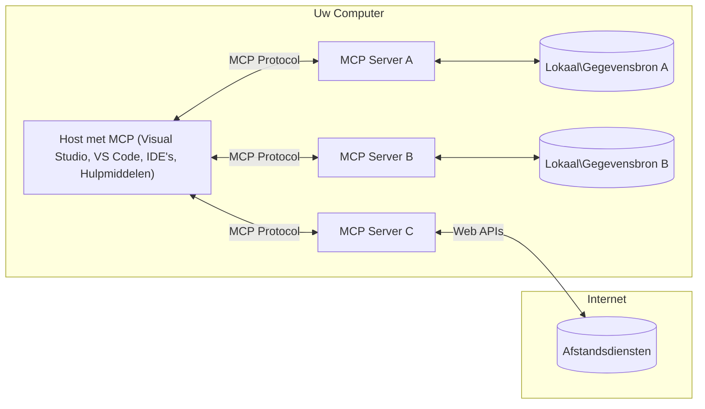

# MCP Kernconcepten: Het Model Context Protocol Beheersen voor AI-integratie

[](https://youtu.be/earDzWGtE84)

_(Klik op de afbeelding hierboven om de video van deze les te bekijken)_

Het [Model Context Protocol (MCP)](https://github.com/modelcontextprotocol) is een krachtig, gestandaardiseerd kader dat de communicatie tussen Large Language Models (LLM's) en externe tools, applicaties en databronnen optimaliseert.  
Deze gids leidt je door de kernconcepten van MCP. Je leert over de client-serverarchitectuur, essentiële componenten, communicatie-mechanismen en implementatiebest practices.

- **Expliciete gebruikersinstemming**: Alle data-toegang en operaties vereisen expliciete goedkeuring van de gebruiker vóór uitvoering. Gebruikers moeten duidelijk begrijpen welke data wordt geraadpleegd en welke acties worden uitgevoerd, met gedetailleerde controle over toestemmingen en autorisaties.

- **Bescherming van gegevensprivacy**: Gebruikersdata wordt alleen blootgesteld met expliciete toestemming en moet worden beschermd door robuuste toegangcontroles gedurende de volledige interactiecyclus. Implementaties moeten ongeautoriseerde data-transmissie voorkomen en strikte privacygrenzen handhaven.

- **Veiligheid bij tooluitvoering**: Elke tool-aanroep vereist expliciete toestemming van de gebruiker met duidelijk begrip van de functionaliteit, parameters en potentieel effect van de tool. Robuuste beveiligingsgrenzen moeten onbedoelde, onveilige of kwaadaardige tooluitvoering voorkomen.

- **Transportlaagbeveiliging**: Alle communicatiekanalen dienen geschikte encryptie- en authenticatiemechanismen te gebruiken. Externe verbindingen moeten beveiligde transportprotocollen implementeren en correct omgang met inloggegevens.

#### Implementatierichtlijnen:

- **Toestemmingsbeheer**: Implementeer fijnmazige toestemmingssystemen waarmee gebruikers kunnen bepalen welke servers, tools en bronnen toegankelijk zijn  
- **Authenticatie & Autorisatie**: Gebruik veilige authenticatiemethoden (OAuth, API-sleutels) met correcte tokenbeheer en verlopen  
- **Inputvalidatie**: Valideer alle parameters en data-inputs volgens de gedefinieerde schemas om injectie-aanvallen te voorkomen  
- **Audit Logging**: Houd uitgebreide logboeken bij van alle operaties voor beveiligingsmonitoring en compliance

## Overzicht

Deze les verkent de fundamentele architectuur en componenten die het Model Context Protocol (MCP)-ecosysteem vormen. Je leert over de client-serverarchitectuur, kerncomponenten en communicatie-mechanismen die MCP-interacties aandrijven.

## Belangrijkste Leerdoelen

Aan het einde van deze les zul je:

- De MCP client-serverarchitectuur begrijpen.  
- Rollen en verantwoordelijkheden van Hosts, Clients en Servers identificeren.  
- De kernfeatures analyseren die MCP een flexibele integratielaag maken.  
- Leren hoe informatie binnen het MCP-ecosysteem stroomt.  
- Praktische inzichten verkrijgen via codevoorbeelden in .NET, Java, Python en JavaScript.

## MCP Architectuur: Een Diepere Kijk

Het MCP-ecosysteem is gebouwd op een client-servermodel. Deze modulaire structuur stelt AI-applicaties in staat efficiënt te interacteren met tools, databases, API's en contextuele bronnen. Laten we deze architectuur opsplitsen in de kerncomponenten.

MCP volgt in de kern een client-serverarchitectuur waarbij een hostapplicatie kan verbinden met meerdere servers:



- **MCP Hosts**: Programma’s zoals VSCode, Claude Desktop, IDE’s of AI-tools die via MCP toegang tot data willen  
- **MCP Clients**: Protocolclients die 1:1 verbindingen onderhouden met servers  
- **MCP Servers**: Lichtgewicht programma’s die elk specifieke mogelijkheden aanbieden via het gestandaardiseerde Model Context Protocol  
- **Lokale Datasources**: Bestanden, databases en services van jouw computer waar MCP-servers veilig toegang toe kunnen krijgen  
- **Externe Services**: Externe systemen beschikbaar via internet waarmee MCP-servers via API’s kunnen verbinden.

Het MCP Protocol is een evoluerende standaard die versiebeheer gebruikt op basis van datums (YYYY-MM-DD-formaat). De huidige protocolversie is **2025-11-25**. Je kunt de laatste updates zien in de [protocolspecificatie](https://modelcontextprotocol.io/specification/2025-11-25/)

> **Vooruitblik:** een releasekandidaat voor de volgende specificatieversie, **2026-07-28**, werd aangekondigd in mei 2026 en staat gepland voor release op 28 juli 2026. Het maakt het protocol stateless op transportlaag (verwijdert de `initialize`-handshake en sessie-ID’s), formaliseert het Extensies-framework, en deprecieert Roots, Sampling en Logging ten gunste van nieuwere patronen. Zie [Wat verandert er in MCP: De 2026-07-28 Release Candidate](./mcp-2026-07-28-release-candidate.md) voor een volledige analyse.

### 1. Hosts

In het Model Context Protocol (MCP) zijn **Hosts** AI-toepassingen die de primaire interface vormen waarlangs gebruikers met het protocol interacteren. Hosts coördineren en beheren verbindingen met meerdere MCP-servers door voor elke serververbinding een dedicated MCP-client aan te maken. Voorbeelden van Hosts zijn:

- **AI Toepassingen**: Claude Desktop, Visual Studio Code, Claude Code  
- **Ontwikkelomgevingen**: IDE’s en code-editors met MCP-integratie  
- **Aangepaste Applicaties**: Speciaal gebouwde AI-agenten en tools

**Hosts** zijn applicaties die AI-modelinteracties coördineren. Ze:

- **Orkestreren AI-modellen**: Voeren LLM’s uit of interacteren ermee om reacties te genereren en AI-workflows te coördineren  
- **Beheren clientverbindingen**: Maken en onderhouden één MCP-client per MCP-serververbinding  
- **Beheersen gebruikersinterface**: Handelen conversatiestromen, gebruikersinteracties en responsweergave af  
- **Handhaven beveiliging**: Controleren toestemming, beveiligingsbeperkingen en authenticatie  
- **Behandelen gebruikersinstemming**: Beheren goedkeuring van gebruikers voor datadeling en tooluitvoering

### 2. Clients

**Clients** zijn essentiële componenten die dedicated één-op-één verbindingen onderhouden tussen Hosts en MCP-servers. Elke MCP-client wordt door de Host geïnitieerd om verbinding te maken met een specifieke MCP-server, zodat georganiseerde en beveiligde communicatiekanalen worden gegarandeerd. Meerdere clients maken het voor Hosts mogelijk om gelijktijdig met meerdere servers te verbinden.

**Clients** zijn connectorcomponenten binnen de hostapplicatie. Ze:

- **Protocolcommunicatie**: Verzenden JSON-RPC 2.0-verzoeken naar servers met prompts en instructies  
- **Capabiliteitsonderhandeling**: Onderhandelen ondersteunde features en protocolversies met servers bij initialisatie  
- **Tooluitvoering**: Beheren tooluitvoeringsverzoeken van modellen en verwerken de reacties  
- **Real-time Updates**: Handelen notificaties en realtime updates van servers af  
- **Verwerkingsantwoorden**: Verwerken en formatteren serverantwoorden voor presentatie aan gebruikers

### 3. Servers

**Servers** zijn programma’s die context, tools en mogelijkheden aan MCP-clients leveren. Ze kunnen lokaal draaien (op dezelfde machine als de Host) of extern (op externe platforms) en zijn verantwoordelijk voor het afhandelen van clientverzoeken en het aanbieden van gestructureerde antwoorden. Servers bieden specifieke functionaliteiten aan via het gestandaardiseerde Model Context Protocol.

**Servers** zijn services die context en mogelijkheden leveren. Ze:

- **Feature-registratie**: Registreren en tonen beschikbare primitieve elementen (resources, prompts, tools) aan clients  
- **Verzoekverwerking**: Ontvangen en voeren tool-aanroepen, resource-verzoeken en promptverzoeken van clients uit  
- **Contextvoorziening**: Bieden contextuele informatie en data die modelantwoorden verbeteren  
- **Statusbeheer**: Onderhouden sessiestatus en behandelen stateful interacties indien nodig  
- **Real-time Notificaties**: Verzenden notificaties over veranderingen in capaciteiten en updates aan verbonden clients

Servers kunnen door iedereen worden ontwikkeld om modelmogelijkheden uit te breiden met gespecialiseerde functionaliteit, en ondersteunen zowel lokale als externe inzetscenario’s.

### 4. Serverprimitieven

Servers in het Model Context Protocol (MCP) bieden drie kern-**primitieven** die de fundamentele bouwstenen definiëren voor rijke interacties tussen clients, hosts en taalmodellen. Deze primitieven specificeren welke soorten contextuele informatie en acties via het protocol beschikbaar zijn.

MCP-servers kunnen elke combinatie van onderstaande drie kernprimitieven exposen:

#### Resources 

**Resources** zijn databronnen die contextuele informatie leveren aan AI-toepassingen. Ze vertegenwoordigen statische of dynamische inhoud die het modelbegrip en de besluitvorming kan verbeteren:

- **Contextuele Data**: Gestructureerde informatie en context voor AI-modellen  
- **Kennisbases**: Documentreplicaties, artikelen, handleidingen en onderzoeksdocumenten  
- **Lokale Datasources**: Bestanden, databases en lokale systeeminformatie  
- **Externe Data**: API-antwoorden, webservices en data van externe systemen  
- **Dynamische Inhoud**: Real-time data die bijgewerkt wordt op basis van externe condities

Resources worden geïdentificeerd met URI’s en ondersteund via de `resources/list`- en `resources/read`-methoden:

```text
file://documents/project-spec.md
database://production/users/schema
api://weather/current
```

#### Prompts

**Prompts** zijn herbruikbare sjablonen die helpen interacties met taalmodellen te structureren. Ze bieden gestandaardiseerde interactiepatronen en voorgedefinieerde workflows:

- **Op sjablonen gebaseerde interacties**: Vooraf gestructureerde berichten en gespreksstarters  
- **Workflow-sjablonen**: Gestandaardiseerde sequenties voor gangbare taken en interacties  
- **Few-shot voorbeelden**: Voorbeeldgebaseerde templates voor modelinstructie  
- **Systeemprompts**: Fundamentele prompts die het gedrag en de context van het model definiëren  
- **Dynamische sjablonen**: Gepersonaliseerde prompts die zich aanpassen aan specifieke contexten

Prompts ondersteunen variabele substitutie en kunnen worden ontdekt via `prompts/list` en opgevraagd worden met `prompts/get`:

```markdown
Generate a {{task_type}} for {{product}} targeting {{audience}} with the following requirements: {{requirements}}
```

#### Tools

**Tools** zijn uitvoerbare functies die AI-modellen kunnen aanroepen om specifieke acties uit te voeren. Ze vertegenwoordigen de "werkwoorden" van het MCP-ecosysteem en stellen modellen in staat externe systemen te bedienen:

- **Uitvoerbare functies**: Afgebakende operaties die modellen kunnen aanroepen met specifieke parameters  
- **Integratie met externe systemen**: API-aanroepen, databasequery’s, bestandshandelingen, berekeningen  
- **Unieke identiteit**: Elke tool heeft een unieke naam, beschrijving en parameterschema  
- **Gestructureerde I/O**: Tools accepteren gevalideerde parameters en leveren gestructureerde, getypeerde antwoorden terug  
- **Actiemogelijkheden**: Stellen modellen in staat real-world acties uit te voeren en live data te verkrijgen

Tools worden gedefinieerd met JSON Schema voor parametervalidatie, gevonden via `tools/list` en aangeroepen via `tools/call`. Tools kunnen ook **iconen** bevatten als extra metadata voor betere UI-presentatie.

**Toolannotaties**: Tools ondersteunen gedragsannotaties (bijv. `readOnlyHint`, `destructiveHint`) die aangeven of een tool alleen-lezen of destructief is, wat clients helpt geïnformeerde beslissingen te nemen over tooluitvoering.

Voorbeeld van een tooldefinitie:

```typescript
server.tool(
  "search_products", 
  {
    query: z.string().describe("Search query for products"),
    category: z.string().optional().describe("Product category filter"),
    max_results: z.number().default(10).describe("Maximum results to return")
  }, 
  async (params) => {
    // Voer zoekopdracht uit en retourneer gestructureerde resultaten
    return await productService.search(params);
  }
);
```

## Clientprimitieven

In het Model Context Protocol (MCP) kunnen **clients** primitieve functies exposen die servers in staat stellen aanvullende mogelijkheden van de hostapplicatie op te vragen. Deze client-side primitieven maken rijkere, interactieve serverimplementaties mogelijk die toegang hebben tot AI-modelmogelijkheden en gebruikersinteracties.

### Sampling

> **Deprecated melding:** de `2026-07-28` releasekandidaat markeert Sampling als verouderd ten gunste van directe integratie met LLM-provider API’s. Het blijft werken in `2025-11-25` en minstens een jaar daarna, maar nieuwe ontwerpen dienen het vervangende patroon te verkiezen. Zie [Wat verandert er in MCP: De 2026-07-28 Release Candidate](./mcp-2026-07-28-release-candidate.md).

**Sampling** stelt servers in staat om completions van taalmodellen aan te vragen van de AI-applicatie van de client. Deze primitive stelt servers in staat LLM-mogelijkheden te gebruiken zonder eigen modelafhankelijkheden:

- **Modelonafhankelijke toegang**: Servers kunnen completions opvragen zonder LLM-SDK’s mee te leveren of modeltoegang te beheren  
- **Server-geïnitieerde AI**: Staat servers toe autonoom content te genereren met het AI-model van de client  
- **Recursieve LLM-interacties**: Ondersteunt complexe scenario’s waarin servers AI-hulp nodig hebben voor verwerking  
- **Dynamische contentgeneratie**: Laat servers contextuele antwoorden creëren met het model van de host  
- **Ondersteuning voor toolaanroepen**: Servers kunnen `tools` en `toolChoice` parameters meesturen om toe te staan dat het clientmodel tools aanroept tijdens sampling

Sampling wordt geïnitieerd via de `sampling/complete`-methode, waarbij servers completion-aanvragen naar clients sturen.

### Roots

> **Deprecated melding:** de `2026-07-28` releasekandidaat markeert Roots als verouderd ten gunste van toolparameters, resource-URI’s of serverconfiguraties. Het blijft werken in `2025-11-25` en minstens een jaar daarna. Zie [Wat verandert er in MCP: De 2026-07-28 Release Candidate](./mcp-2026-07-28-release-candidate.md).

**Roots** bieden een gestandaardiseerde manier voor clients om bestandsysteemgrenzen aan servers bloot te stellen, waardoor servers begrijpen welke mappen en bestanden toegankelijk zijn:

- **Bestandssysteemgrenzen**: Definiëren de grenzen waarbinnen servers kunnen opereren in het bestandssysteem  
- **Toegangscontrole**: Helpen servers te begrijpen tot welke mappen en bestanden ze toegang hebben  
- **Dynamische updates**: Clients kunnen servers op de hoogte brengen wanneer de lijst met roots verandert  
- **URI-gebaseerde identificatie**: Roots gebruiken `file://` URI’s om toegankelijke directories en bestanden te identificeren

Roots worden ontdekt via de `roots/list`-methode, waarbij clients `notifications/roots/list_changed` sturen als roots veranderen.

### Elicitation  

**Elicitation** stelt servers in staat aanvullende informatie of bevestiging van gebruikers aan te vragen via de interface van de client:

- **Verzoeken om gebruikersinput**: Servers kunnen aanvullende informatie vragen indien nodig voor tooluitvoering  
- **Bevestigingsdialogen**: Vragen om goedkeuring van gebruikers voor gevoelige of impactvolle handelingen  
- **Interactieve workflows**: Stellen servers in staat stapsgewijze gebruikersinteracties te creëren  
- **Dynamische parameterverzameling**: Verzamel ontbrekende of optionele parameters tijdens tooluitvoering

Elicitation-verzoeken gebeuren via de `elicitation/request`-methode om gebruikersinput via de clientinterface te verzamelen.

**URL-modus Elicitation**: Servers kunnen ook URL-gebaseerde gebruikersinteracties aanvragen, waardoor ze gebruikers naar externe webpagina’s kunnen sturen voor authenticatie, bevestiging of data-invoer.

### Logging
> **Kennisgeving van veroudering:** de release candidate `2026-07-28` markeert Logging als verouderd ten gunste van `stderr` voor stdio-transports en OpenTelemetry voor gestructureerde observeerbaarheid. Het blijft werken in `2025-11-25` en minstens een jaar na iedere veroudering. Zie [Wat verandert er in MCP: De release candidate 2026-07-28](./mcp-2026-07-28-release-candidate.md).

**Logging** stelt servers in staat gestructureerde logberichten naar clients te sturen voor debugging, monitoring en operationele zichtbaarheid:

- **Ondersteuning voor debugging**: Staat servers toe gedetailleerde uitvoeringslogboeken te verstrekken voor probleemoplossing
- **Operationele monitoring**: Verstuur statusupdates en prestatiestatistieken naar clients
- **Foutenrapportage**: Biedt gedetailleerde foutcontext en diagnostische informatie
- **Auditsporen**: Maak uitgebreide logboeken van serveractiviteiten en beslissingen

Logging-berichten worden naar clients gestuurd om transparantie te bieden in serveractiviteiten en debugging te vergemakkelijken.

## Informatiestroom in MCP

Het Model Context Protocol (MCP) definieert een gestructureerde informatiestroom tussen hosts, clients, servers en modellen. Begrip van deze stroom helpt verduidelijken hoe gebruikersverzoeken worden verwerkt en hoe externe hulpmiddelen en data worden geïntegreerd in modelantwoorden.

- **Host initieert verbinding**  
  De hostapplicatie (zoals een IDE of chatinterface) maakt een verbinding met een MCP-server, doorgaans via STDIO, WebSocket, of een andere ondersteunde transportmethode.

- **Mogelijkhedenonderhandeling**  
  De client (ingebed in de host) en de server wisselen informatie uit over hun ondersteunde functies, tools, bronnen en protocolversies. Dit zorgt ervoor dat beide kanten begrijpen welke mogelijkheden beschikbaar zijn voor de sessie.

- **Gebruikersverzoek**  
  De gebruiker interageert met de host (bijv. een prompt of commando invoeren). De host verzamelt deze invoer en geeft deze door aan de client voor verwerking.

- **Gebruik van bron of tool**  
  - De client kan aanvullende context of bronnen van de server opvragen (zoals bestanden, database-items, of kennisbankartikelen) om het begrip van het model te verrijken.  
  - Als het model bepaalt dat een tool nodig is (bijv. om data op te halen, een berekening uit te voeren, of een API aan te roepen), stuurt de client een toolaanroepverzoek naar de server, met specificatie van toolnaam en parameters.

- **Serveruitvoering**  
  De server ontvangt het bron- of toolverzoek, voert de benodigde bewerkingen uit (zoals het draaien van een functie, queryen van een database, of ophalen van een bestand) en retourneert de resultaten aan de client in een gestructureerd formaat.

- **Generatie van antwoord**  
  De client verwerkt de reacties van de server (brongegevens, tooluitvoer, enz.) in de lopende modelinteractie. Het model gebruikt deze informatie om een uitgebreid en contextueel relevant antwoord te genereren.

- **Presentatie van resultaat**  
  De host ontvangt de uiteindelijke output van de client en presenteert deze aan de gebruiker, vaak inclusief zowel de door het model gegenereerde tekst als eventuele resultaten van tooluitvoeringen of bronopvragingen.

Deze stroom maakt het MCP mogelijk om geavanceerde, interactieve en contextbewuste AI-toepassingen te ondersteunen door modellen naadloos te verbinden met externe tools en gegevensbronnen.

## Protocolarchitectuur & Lagen

MCP bestaat uit twee verschillende architecturale lagen die samenwerken om een complete communicatie-infrastructuur te bieden:

### Datalayer

De **datalayer** implementeert het kern-MCP-protocol met **JSON-RPC 2.0** als basis. Deze laag definieert de berichtstructuur, semantiek en interactiepatronen:

#### Kerncomponenten:

- **JSON-RPC 2.0 Protocol**: Alle communicatie gebruikt het gestandaardiseerde JSON-RPC 2.0 berichtformaat voor methodeaanroepen, reacties en notificaties  
- **Levenscyclusbeheer**: Behandelt initiële verbinding, mogelijkhedenonderhandeling en sessiebeëindiging tussen clients en servers  
- **Serverprimitieven**: Maakt het mogelijk dat servers kernfunctionaliteit leveren via tools, bronnen en prompts  
- **Clientprimitieven**: Staat servers toe verzoeken te doen om sampling van LLM's, gebruikersinvoer op te vangen, en logberichten te versturen  
- **Realtime notificaties**: Ondersteunt asynchrone notificaties voor dynamische updates zonder polling

#### Belangrijkste kenmerken:

- **Protocolversieonderhandeling**: Gebruikt datum-gebaseerde versiebeheer (JJJJ-MM-DD) om compatibiliteit te waarborgen  
- **Mogelijkhedendetectie**: Clients en servers wisselen tijdens initialisatie ondersteunde functies uit  
- **Stateful sessies**: Houdt verbindingsstatus vast over meerdere interacties voor contextcontinuïteit

### Transportlaag

De **transportlaag** beheert communicatiekanalen, berichtafbakening en authenticatie tussen MCP-deelnemers:

#### Ondersteunde transportmechanismen:

1. **STDIO-transport**:
   - Gebruikt standaard in-/uitvoerstromen voor directe procescommunicatie  
   - Ideaal voor lokale processen op dezelfde machine zonder netwerkoverhead  
   - Veelgebruikt voor lokale MCP-serverimplementaties

2. **Streamable HTTP-transport**:
   - Gebruikt HTTP POST voor berichten van client naar server  
   - Optioneel Server-Sent Events (SSE) voor server-naar-client streaming  
   - Maakt communicatie met externe servers over netwerken mogelijk  
   - Ondersteunt standaard HTTP-authenticatie (bearer tokens, API-sleutels, aangepaste headers)  
   - MCP beveelt OAuth aan voor veilige tokengebaseerde authenticatie

#### Transportabstractie:

De transportlaag abstracteert communicatiedetails van de datalaag, waardoor hetzelfde JSON-RPC 2.0-berichtformaat gebruikt kan worden over alle transportsystemen. Deze abstractie maakt het mogelijk om naadloos te schakelen tussen lokale en externe servers.

### Beveiligingsoverwegingen

MCP-implementaties moeten zich houden aan verschillende kritieke beveiligingsprincipes om veilige, betrouwbare en beveiligde interacties te waarborgen bij alle protocoloperaties:

- **Toestemming en controle van gebruiker**: Gebruikers moeten expliciete toestemming geven voordat gegevens worden geraadpleegd of operaties worden uitgevoerd. Ze moeten duidelijke controle hebben over welke data wordt gedeeld en welke acties zijn toegestaan, ondersteund door intuïtieve gebruikersinterfaces voor het beoordelen en goedkeuren van activiteiten.

- **Gegevensprivacy**: Gebruikersgegevens mogen alleen met expliciete toestemming worden onthuld en moeten worden beschermd door passende toegangscontroles. MCP-implementaties moeten ongeautoriseerde overdracht van data voorkomen en privacy tijdens alle interacties waarborgen.

- **Veiligheid van tools**: Voor het aanroepen van een tool is expliciete toestemming van de gebruiker vereist. Gebruikers moeten duidelijk begrijpen wat elke tool doet, en er moeten stevige beveiligingsgrenzen worden gehandhaafd om onbedoelde of onveilige uitvoering van tools te voorkomen.

Door deze beveiligingsprincipes te volgen, zorgt MCP ervoor dat gebruikersvertrouwen, privacy en veiligheid gehandhaafd blijven bij alle protocolinteracties en tegelijkertijd krachtige AI-integraties mogelijk worden gemaakt.

## Codevoorbeelden: Kerncomponenten

Hieronder staan codevoorbeelden in verschillende populaire programmeertalen die illustreren hoe belangrijke MCP-servercomponenten en tools kunnen worden geïmplementeerd.

### .NET voorbeeld: Een eenvoudige MCP-server maken met tools

Hier is een praktisch .NET-codevoorbeeld dat laat zien hoe je een eenvoudige MCP-server met aangepaste tools implementeert. Dit voorbeeld toont hoe je tools definieert en registreert, verzoeken afhandelt en de server verbindt via het Model Context Protocol.

```csharp
using System;
using System.Threading.Tasks;
using ModelContextProtocol.Server;
using ModelContextProtocol.Server.Transport;
using ModelContextProtocol.Server.Tools;

public class WeatherServer
{
    public static async Task Main(string[] args)
    {
        // Create an MCP server
        var server = new McpServer(
            name: "Weather MCP Server",
            version: "1.0.0"
        );
        
        // Register our custom weather tool
        server.AddTool<string, WeatherData>("weatherTool", 
            description: "Gets current weather for a location",
            execute: async (location) => {
                // Call weather API (simplified)
                var weatherData = await GetWeatherDataAsync(location);
                return weatherData;
            });
        
        // Connect the server using stdio transport
        var transport = new StdioServerTransport();
        await server.ConnectAsync(transport);
        
        Console.WriteLine("Weather MCP Server started");
        
        // Keep the server running until process is terminated
        await Task.Delay(-1);
    }
    
    private static async Task<WeatherData> GetWeatherDataAsync(string location)
    {
        // This would normally call a weather API
        // Simplified for demonstration
        await Task.Delay(100); // Simulate API call
        return new WeatherData { 
            Temperature = 72.5,
            Conditions = "Sunny",
            Location = location
        };
    }
}

public class WeatherData
{
    public double Temperature { get; set; }
    public string Conditions { get; set; }
    public string Location { get; set; }
}
```

### Java voorbeeld: MCP-servercomponenten

Dit voorbeeld toont dezelfde MCP-server en toolregistratie als het .NET-voorbeeld hierboven, maar dan geïmplementeerd in Java.

```java
import io.modelcontextprotocol.server.McpServer;
import io.modelcontextprotocol.server.McpToolDefinition;
import io.modelcontextprotocol.server.transport.StdioServerTransport;
import io.modelcontextprotocol.server.tool.ToolExecutionContext;
import io.modelcontextprotocol.server.tool.ToolResponse;

public class WeatherMcpServer {
    public static void main(String[] args) throws Exception {
        // Maak een MCP-server
        McpServer server = McpServer.builder()
            .name("Weather MCP Server")
            .version("1.0.0")
            .build();
            
        // Registreer een weergereedschap
        server.registerTool(McpToolDefinition.builder("weatherTool")
            .description("Gets current weather for a location")
            .parameter("location", String.class)
            .execute((ToolExecutionContext ctx) -> {
                String location = ctx.getParameter("location", String.class);
                
                // Haal weergegevens op (vereenvoudigd)
                WeatherData data = getWeatherData(location);
                
                // Retourneer geformatteerd antwoord
                return ToolResponse.content(
                    String.format("Temperature: %.1f°F, Conditions: %s, Location: %s", 
                    data.getTemperature(), 
                    data.getConditions(), 
                    data.getLocation())
                );
            })
            .build());
        
        // Verbind de server met stdio-transmissie
        try (StdioServerTransport transport = new StdioServerTransport()) {
            server.connect(transport);
            System.out.println("Weather MCP Server started");
            // Houd de server actief totdat het proces wordt beëindigd
            Thread.currentThread().join();
        }
    }
    
    private static WeatherData getWeatherData(String location) {
        // Implementatie zou een weer-API aanroepen
        // Vereenvoudigd voor voorbeelddoeleinden
        return new WeatherData(72.5, "Sunny", location);
    }
}

class WeatherData {
    private double temperature;
    private String conditions;
    private String location;
    
    public WeatherData(double temperature, String conditions, String location) {
        this.temperature = temperature;
        this.conditions = conditions;
        this.location = location;
    }
    
    public double getTemperature() {
        return temperature;
    }
    
    public String getConditions() {
        return conditions;
    }
    
    public String getLocation() {
        return location;
    }
}
```

### Python voorbeeld: Een MCP-server bouwen

Dit voorbeeld gebruikt fastmcp, zorg dat je deze eerst installeert:

```python
pip install fastmcp
```
Codevoorbeeld:

```python
#!/usr/bin/env python3
import asyncio
from fastmcp import FastMCP
from fastmcp.transports.stdio import serve_stdio

# Maak een FastMCP-server
mcp = FastMCP(
    name="Weather MCP Server",
    version="1.0.0"
)

@mcp.tool()
def get_weather(location: str) -> dict:
    """Gets current weather for a location."""
    return {
        "temperature": 72.5,
        "conditions": "Sunny",
        "location": location
    }

# Alternatieve benadering met behulp van een klasse
class WeatherTools:
    @mcp.tool()
    def forecast(self, location: str, days: int = 1) -> dict:
        """Gets weather forecast for a location for the specified number of days."""
        return {
            "location": location,
            "forecast": [
                {"day": i+1, "temperature": 70 + i, "conditions": "Partly Cloudy"}
                for i in range(days)
            ]
        }

# Registreer klassehulpmiddelen
weather_tools = WeatherTools()

# Start de server
if __name__ == "__main__":
    asyncio.run(serve_stdio(mcp))
```

### JavaScript voorbeeld: Een MCP-server maken

Dit voorbeeld laat zien hoe een MCP-server in JavaScript wordt gemaakt en hoe twee weergerelateerde tools worden geregistreerd.

```javascript
// Gebruikmakend van de officiële Model Context Protocol SDK
import { McpServer } from "@modelcontextprotocol/sdk/server/mcp.js";
import { StdioServerTransport } from "@modelcontextprotocol/sdk/server/stdio.js";
import { z } from "zod"; // Voor parameter validatie

// Maak een MCP-server aan
const server = new McpServer({
  name: "Weather MCP Server",
  version: "1.0.0"
});

// Definieer een weerhulpmiddel
server.tool(
  "weatherTool",
  {
    location: z.string().describe("The location to get weather for")
  },
  async ({ location }) => {
    // Dit zou normaal gesproken een weer-API aanroepen
    // Vereenvoudigd ter demonstratie
    const weatherData = await getWeatherData(location);
    
    return {
      content: [
        { 
          type: "text", 
          text: `Temperature: ${weatherData.temperature}°F, Conditions: ${weatherData.conditions}, Location: ${weatherData.location}` 
        }
      ]
    };
  }
);

// Definieer een voorspellingstool
server.tool(
  "forecastTool",
  {
    location: z.string(),
    days: z.number().default(3).describe("Number of days for forecast")
  },
  async ({ location, days }) => {
    // Dit zou normaal gesproken een weer-API aanroepen
    // Vereenvoudigd ter demonstratie
    const forecast = await getForecastData(location, days);
    
    return {
      content: [
        { 
          type: "text", 
          text: `${days}-day forecast for ${location}: ${JSON.stringify(forecast)}` 
        }
      ]
    };
  }
);

// Hulpfuncties
async function getWeatherData(location) {
  // Simuleer API-aanroep
  return {
    temperature: 72.5,
    conditions: "Sunny",
    location: location
  };
}

async function getForecastData(location, days) {
  // Simuleer API-aanroep
  return Array.from({ length: days }, (_, i) => ({
    day: i + 1,
    temperature: 70 + Math.floor(Math.random() * 10),
    conditions: i % 2 === 0 ? "Sunny" : "Partly Cloudy"
  }));
}

// Verbind de server met behulp van stdio-transport
const transport = new StdioServerTransport();
server.connect(transport).catch(console.error);

console.log("Weather MCP Server started");
```

Dit JavaScript-voorbeeld demonstreert hoe je een MCP-server maakt met behulp van de Model Context Protocol SDK. Het toont hoe je twee tools met de namen `weatherTool` en `forecastTool` registreert en beschikbaar maakt voor MCP-clients via de `StdioServerTransport`.

## Beveiliging en autorisatie

MCP bevat verschillende ingebouwde concepten en mechanismen voor het beheren van beveiliging en autorisatie door het hele protocol:

1. **Controle op toolpermissies**:  
  Clients kunnen specificeren welke tools een model mag gebruiken gedurende een sessie. Dit zorgt ervoor dat alleen expliciet geautoriseerde tools toegankelijk zijn, waardoor het risico op onbedoelde of onveilige handelingen wordt verminderd. Permissies kunnen dynamisch worden geconfigureerd op basis van gebruikersvoorkeuren, organisatorische beleidslijnen, of de context van de interactie.

2. **Authenticatie**:  
  Servers kunnen authenticatie vereisen voordat toegang wordt verleend tot tools, bronnen of gevoelige operaties. Dit kan API-sleutels, OAuth-tokens of andere authenticatiemechanismen omvatten. Adequate authenticatie waarborgt dat alleen vertrouwde clients en gebruikers servermogelijkheden kunnen aanroepen.

3. **Validatie**:  
  Parametervalidatie wordt afgedwongen voor alle toolaanroepen. Elke tool definieert de verwachte types, formaten en beperkingen van zijn parameters, en de server valideert binnenkomende verzoeken dienovereenkomstig. Dit voorkomt dat onjuiste of kwaadaardige invoer bij toolimplementaties terechtkomt en helpt de integriteit van operaties te waarborgen.

4. **Rate limiting**:  
  Om misbruik te voorkomen en eerlijk gebruik van serverbronnen te garanderen, kunnen MCP-servers rate limiting toepassen op toolaanroepen en resource-toegang. Limieten kunnen per gebruiker, per sessie of globaal worden ingesteld en helpen beschermen tegen denial-of-service-aanvallen of overmatig gebruik van resources.

Door deze mechanismen te combineren, biedt MCP een veilig fundament voor het integreren van taalmodellen met externe tools en gegevensbronnen, terwijl gebruikers en ontwikkelaars gedetailleerde controle krijgen over toegang en gebruik.

## Protocolberichten & Communicatiestroom

MCP-communicatie gebruikt gestructureerde **JSON-RPC 2.0**-berichten om duidelijke en betrouwbare interacties tussen hosts, clients en servers te faciliteren. Het protocol definieert specifieke berichtpatronen voor verschillende typen bewerkingen:

### Kernberichttypen:

#### **Initialisatiieberichten**
- **`initialize` Request**: Legt verbinding vast en onderhandelt over protocolversie en mogelijkheden  
- **`initialize` Response**: Bevestigt ondersteunde functies en serverinformatie  
- **`notifications/initialized`**: Geeft aan dat initialisatie voltooid is en de sessie klaar is

#### **Ontdekkingsberichten**
- **`tools/list` Request**: Ontdekt beschikbare tools van de server  
- **`resources/list` Request**: Lijst van beschikbare bronnen (datasources)  
- **`prompts/list` Request**: Haalt beschikbare prompttemplates op

#### **Uitvoeringsberichten**  
- **`tools/call` Request**: Voert een specifieke tool uit met meegegeven parameters  
- **`resources/read` Request**: Haalt inhoud op uit een specifieke bron  
- **`prompts/get` Request**: Haalt een prompttemplate op met optionele parameters

#### **Client-side berichten**
- **`sampling/complete` Request**: Server vraagt een LLM-completion van de client  
- **`elicitation/request`**: Server vraagt gebruikersinvoer via de clientinterface  
- **Logging-berichten**: Server stuurt gestructureerde logberichten naar de client

#### **Notificatieberichten**
- **`notifications/tools/list_changed`**: Server informeert client over wijzigingen in tools  
- **`notifications/resources/list_changed`**: Server informeert client over wijzigingen in bronnen  
- **`notifications/prompts/list_changed`**: Server informeert client over wijzigingen in prompts

### Berichtstructuur:

Alle MCP-berichten volgen JSON-RPC 2.0-formaat met:  
- **Requestberichten**: Bevatten `id`, `method` en optionele `params`  
- **Responseberichten**: Bevatten `id` en ofwel `result` of `error`  
- **Notificatieberichten**: Bevatten `method` en optionele `params` (geen `id` en geen antwoord verwacht)

Deze gestructureerde communicatie zorgt voor betrouwbare, traceerbare en uitbreidbare interacties die geavanceerde scenario’s ondersteunen zoals realtime updates, tool chaining en robuuste foutafhandeling.

### Taken (experimenteel)

> **Vooruitblik:** de release candidate `2026-07-28` brengt Taken uit de experimentele kernspecificatie naar een aparte Taken-uitbreiding met een herontworpen levenscyclus (`tasks/get`, `tasks/update`, `tasks/cancel`; `tasks/list` wordt verwijderd). Als je ontwikkelt met de hieronder beschreven experimentele API, plan dan een migratie. Zie [Wat verandert er in MCP: De release candidate 2026-07-28](./mcp-2026-07-28-release-candidate.md).

**Taken** zijn een experimentele functie die duurzame uitvoeringswrappers biedt waarmee uitgestelde resultaten kunnen worden opgehaald en status kunnen worden gevolgd voor MCP-verzoeken:

- **Langdurige operaties**: Volgt kostbare berekeningen, workflowautomatisering, en batchverwerking  
- **Uitgestelde resultaten**: Poll status van taken en haal resultaten op wanneer operaties klaar zijn  
- **Statusmonitoring**: Houd voortgang van taken bij via gedefinieerde levenscyclusstatussen  
- **Meer-fasige operaties**: Ondersteunt complexe workflows die meerdere interacties omvatten

Taken wikkelen standaard MCP-verzoeken in om asynchrone uitvoeringspatronen mogelijk te maken voor operaties die niet direct kunnen worden afgerond.

## Belangrijkste conclusies

- **Architectuur**: MCP gebruikt een client-serverarchitectuur waarbij hosts meerdere clientverbindingen naar servers beheren  
- **Deelnemers**: Het ecosysteem omvat hosts (AI-applicaties), clients (protocolkoppelingen), en servers (mogelijkheidsaanbieders)  
- **Transportmechanismen**: Communicatie ondersteunt STDIO (lokaal) en Streamable HTTP met optionele SSE (extern)  
- **Kernprimitieven**: Servers bieden tools (uitvoerbare functies), bronnen (datasources) en prompts (templates)  
- **Clientprimitieven**: Servers kunnen sampling (LLM-completions met tools aanroepen), elicitation (gebruikersinvoer inclusief URL-modus), roots (bestandssysteemgrenzen) en logging van clients aanvragen  
- **Experimentele functies**: Taken bieden duurzame uitvoeringswrappers voor langlopende operaties  
- **Protocolbasis**: Gebouwd op JSON-RPC 2.0 met datum-gebaseerde versiebeheer (huidig: 2025-11-25)  
- **Realtime mogelijkheden**: Ondersteunt notificaties voor dynamische updates en realtime synchronisatie  
- **Beveiliging eerst**: Expliciete gebruikersvergoeding, dataprivacybescherming en veilige transport zijn kernvereisten

## Oefening

Ontwerp een eenvoudige MCP-tool die nuttig zou zijn in jouw domein. Definieer:  
1. Hoe de tool genoemd zou worden  
2. Welke parameters hij accepteert  
3. Welke output hij teruggeeft  
4. Hoe een model deze tool zou kunnen gebruiken om gebruikersproblemen op te lossen


---

## Wat volgt

Vervolg: [Hoofdstuk 2: Beveiliging](../02-Security/README.md)
Benieuwd wat er komt na `2025-11-25`? Lees [Wat verandert er in MCP: De 2026-07-28 Release Candidate](./mcp-2026-07-28-release-candidate.md).

---

<!-- CO-OP TRANSLATOR DISCLAIMER START -->
**Disclaimer**:
Dit document is vertaald met behulp van de AI vertaaldienst [Co-op Translator](https://github.com/Azure/co-op-translator). Hoewel we streven naar nauwkeurigheid, dient u er rekening mee te houden dat geautomatiseerde vertalingen fouten of onnauwkeurigheden kunnen bevatten. Het originele document in de oorspronkelijke taal moet worden beschouwd als de gezaghebbende bron. Voor kritieke informatie wordt professionele menselijke vertaling aanbevolen. Wij zijn niet aansprakelijk voor eventuele misverstanden of verkeerde interpretaties die voortvloeien uit het gebruik van deze vertaling.
<!-- CO-OP TRANSLATOR DISCLAIMER END -->