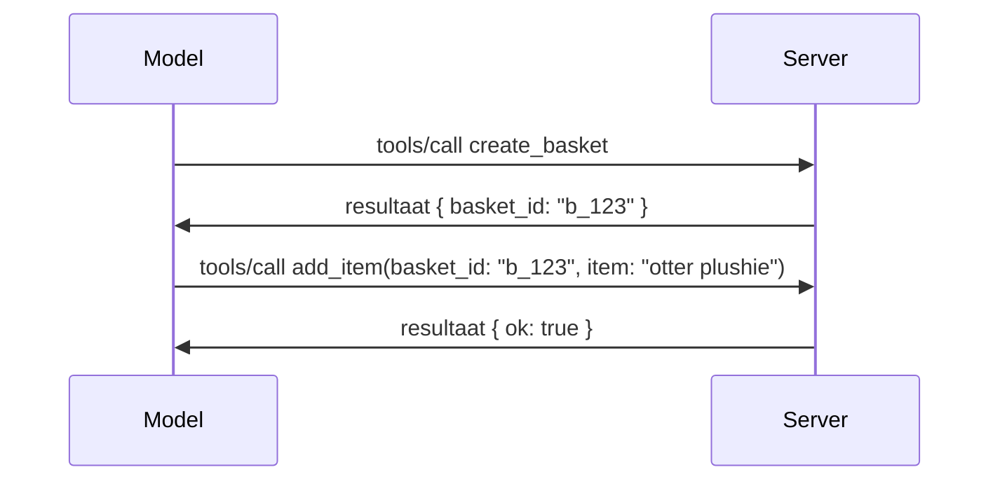

# Wat verandert er in MCP: De Release Candidate van 2026-07-28

> **Status:** Release Candidate. De `2026-07-28` specificatie is niet definitief op het moment van schrijven. Deze werd aangekondigd op 21 mei 2026 en staat gepland voor release op 28 juli 2026. Alles in deze les beschrijft de release candidate; controleer de [conceptspecificatie](https://modelcontextprotocol.io/specification/draft) en de bijbehorende [wijzigingslijst](https://modelcontextprotocol.io/specification/draft/changelog) voor de laatste status voordat je hiertegen bouwt. De rest van deze cursus is geschreven tegen de huidige stabiele release, **MCP Specificatie 2025-11-25**, en zal worden bijgewerkt zodra `2026-07-28` uitkomt.

## Overzicht

`2026-07-28` is de grootste revisie van MCP sinds de lancering. Zes Specificatie Verbetervoorstellen (SEPs) verwijderen protocolniveau-sessies en maken MCP stateless op het transportniveau, extensies worden een volwaardige, versiebeheerste mechaniek, en verschillende functies die je eerder in deze cursus hebt geleerd (Roots, Sampling, Logging) worden als verouderd gemarkeerd volgens een nieuw levenscyclusbeleid. Deze les vat samen wat er verandert, waarom het belangrijk is en wat het betekent voor de code die je al hebt geschreven tegen `2025-11-25`.

Bron: [De 2026-07-28 MCP Specificatie Release Candidate](https://blog.modelcontextprotocol.io/posts/2026-07-28-release-candidate/) (Model Context Protocol Blog, David Soria Parra en Den Delimarsky).

## Leerdoelen

Aan het einde van deze les kun je:

- Uitleggen waarom MCP overschakelt naar een stateless protocolkern en welk probleem dit oplost voor horizontaal geschaalde implementaties.
- Beschrijven hoe de `initialize`/`initialized` handshake en de `Mcp-Session-Id` header worden vervangen.
- De nieuwe `Mcp-Method` en `Mcp-Name` headers en de `ttlMs`/`cacheScope` caching metadata herkennen.
- Het Extensions-framework herkennen en de twee extensies die bij deze release worden meegeleverd: MCP Apps en Tasks.
- De zes autorisatie SEPs opnoemen die OAuth 2.0 / OIDC-afstemming verstevigen.
- Aangeven welke kernfuncties (Roots, Sampling, Logging) nu verouderd zijn verklaard, en wat dat in de praktijk betekent.
- De verandering in Full JSON Schema 2020-12 voor tool `inputSchema`/`outputSchema` uitleggen.

## Een Stateloos Protocol

De kopregelwijziging: MCP wordt stateless op het protocolniveau.

### Voorheen (2025-11-25): sessies binden je aan één serverinstantie

Een tool aanroepen via Streamable HTTP start met een `initialize` handshake. De server reageert met een `Mcp-Session-Id` header die elke volgende aanvraag moet bevatten:

```http
POST /mcp HTTP/1.1
Mcp-Session-Id: 1868a90c-3a3f-4f5b
Content-Type: application/json

{"jsonrpc":"2.0","id":2,"method":"tools/call",
 "params":{"name":"search","arguments":{"q":"otters"}}}
```

Omdat de sessie gebonden is aan de serverinstantie die hem uitgaf, vereisen horizontaal geschaalde implementaties **sticky routing** bij de load balancer en een **gedeelde sessieopslag** over de instanties heen.

### Nu (2026-07-28): elke aanvraag is zelfstandige

```http
POST /mcp HTTP/1.1
MCP-Protocol-Version: 2026-07-28
Mcp-Method: tools/call
Mcp-Name: search
Content-Type: application/json

{"jsonrpc":"2.0","id":1,"method":"tools/call",
 "params":{"name":"search","arguments":{"q":"otters"},
           "_meta":{"io.modelcontextprotocol/clientInfo":{"name":"my-app","version":"1.0"}}}}
```

Elke serverinstantie kan deze aanvraag verwerken. Belangrijke veranderingen:

- **De `initialize`/`initialized` handshake is verwijderd** ([SEP-2575](https://github.com/modelcontextprotocol/modelcontextprotocol/pull/2575)). Protocolversie, clientinformatie en clientmogelijkheden worden in `_meta` op elke aanvraag meegegeven. Een nieuwe `server/discover` methode laat een client vooraf servermogelijkheden ophalen wanneer ze nodig zijn.
- **De `Mcp-Session-Id` header en protocolniveau-sessie zijn verwijderd** ([SEP-2567](https://github.com/modelcontextprotocol/modelcontextprotocol/pull/2567)). Sticky routing en gedeelde sessieopslag zijn niet langer vereist op protocolniveau.

### Stateloos protocol, stateful applicaties

Het verwijderen van de protocolniveau-sessie betekent niet dat je server niet stateful kan zijn. Het aanbevolen patroon is hetzelfde als dat wat HTTP-API’s altijd hebben gebruikt: mint een expliciete handle (een `basket_id`, een `browser_id`) van één toolaanroep, en laat het model die handle als een gewone parameter teruggeven bij latere aanroepen.



Dit maakt de staat zichtbaar en redelijk voor het model in plaats van deze te verbergen in transpoortmetadata, en het laat elke serverinstantie elke aanroep afhandelen.

### Server-naar-client verzoeken, herstructurering

Een stateless protocol heeft nog steeds een manier nodig voor een server om de client iets te vragen halverwege een aanroep (bijvoorbeeld een elicitatiep prompt):

- **Server-geïnitiëerde verzoeken mogen alleen worden uitgegeven terwijl de server actief een clientverzoek verwerkt** ([SEP-2260](https://github.com/modelcontextprotocol/modelcontextprotocol/pull/2260)) — voorheen een aanbeveling, nu verplicht. Een gebruiker wordt nooit zomaar ongevraagd om input gevraagd.
- **Multi Round-Trip Requests** ([SEP-2322](https://github.com/modelcontextprotocol/modelcontextprotocol/pull/2322)) vervangen het openhouden van een SSE-stroom. In plaats daarvan retourneert de server een `InputRequiredResult`:

  ```json
  {
    "resultType": "inputRequired",
    "inputRequests": {
      "confirm": {
        "type": "elicitation",
        "message": "Delete 3 files?",
        "schema": { "type": "boolean" }
      }
    },
    "requestState": "eyJzdGVwIjoxLCJmaWxlcyI6WyJhIiwiYiIsImMiXX0="
  }
  ```

  De client verzamelt de antwoorden en doet de originele oproep opnieuw met `inputResponses` plus de geëchoëerde `requestState`. Elke serverinstantie kan de retry overnemen omdat alles wat nodig is in de payload zit.

### Routable, cachebaar, traceerbaar

Drie kleinere veranderingen maken stateless verkeer makkelijker te beheren:

- **`Mcp-Method` en `Mcp-Name` headers zijn verplicht bij Streamable HTTP** ([SEP-2243](https://github.com/modelcontextprotocol/modelcontextprotocol/pull/2243)), zodat load balancers, gateways en rate limiters kunnen routeren op de operatie zonder de JSON-body te inspecteren. Servers weigeren aanvragen waarbij headers en body niet overeenkomen.
- **`tools/list` en resource leesresultaten bevatten `ttlMs` en `cacheScope`** ([SEP-2549](https://github.com/modelcontextprotocol/modelcontextprotocol/pull/2549)), gemodelleerd naar HTTP `Cache-Control`. Clients weten hoe lang een lijstresultaat vers is en of het veilig is te delen tussen gebruikers, zonder een langelevende SSE-stroom om over veranderingen te leren.
- **W3C Trace Context propagatie in `_meta` is gedocumenteerd** ([SEP-414](https://github.com/modelcontextprotocol/modelcontextprotocol/pull/414)), waardoor de keynamen `traceparent`, `tracestate` en `baggage` vastliggen zodat een gedistribueerde trace een oproep kan volgen over de client SDK, de MCP-server en downstream systemen in een [OpenTelemetry](https://opentelemetry.io/)-compatibele backend.

## Extensies Worden Volwaardige

Extensies bestonden informeel in `2025-11-25`. [SEP-2133](https://github.com/modelcontextprotocol/modelcontextprotocol/pull/2133) formaliseert ze:

- Extensies worden geïdentificeerd door reverse-DNS IDs.
- Ze worden onderhandeld via een `extensions` map in client- en servermogelijkheden.
- Ze leven in eigen `ext-*` repositories met gedelegeerde onderhouders en versiebeheer onafhankelijk van de core-specificatie.
- Een nieuw Extensions Track in het SEP-proces geeft ze een pad van experimenteel naar officieel.

Deze release bevat twee officiële extensies.

### MCP Apps: server-gerenderde gebruikersinterfaces

[MCP Apps](https://blog.modelcontextprotocol.io/posts/2026-01-26-mcp-apps/) ([SEP-1865](https://github.com/modelcontextprotocol/modelcontextprotocol/pull/1865)) laat servers interactieve HTML-interfaces leveren die hosts renderen in een sandboxed iframe. Tools declareren hun UI-sjablonen vooraf zodat hosts ze kunnen prefetch’en, cachen en veiligheidsreviews uitvoeren voordat er iets draait. Je hebt de fundamenten hiervan al behandeld in [Les 15: MCP Apps](../03-GettingStarted/15-mcp-apps/README.md) — onder het Extensions-framework is MCP Apps nu formeel een extensie en geen experimentele core-functie meer.

### Tasks wordt een extensie

Tasks verscheen als experimentele core-functie in `2025-11-25`. Gebruik in productie resulteerde in voldoende herontwerpen dat de juiste plek een extensie is: de [Tasks extensie](https://github.com/modelcontextprotocol/modelcontextprotocol/pull/2663) herstructureert de levenscyclus rond het stateless model — een server kan `tools/call` beantwoorden met een task-handle, en de client stuwt het verder met `tasks/get`, `tasks/update` en `tasks/cancel`. Taakcreatie is servergestuurd: de client adverteert de extensie en de server bepaalt wanneer een call als taak moet lopen. `tasks/list` is volledig verwijderd omdat het zonder sessies niet veilig gescopeerd kan worden.

> **Migratienoot:** als je de experimentele `2025-11-25` Tasks API hebt geïmplementeerd, zul je moeten migreren naar de nieuwe extensie-levenscyclus — deze is niet achterwaarts compatibel.

## Autorisatie Versteviging

Zes SEPs verstevigen de [autorisatiespecificatie](https://modelcontextprotocol.io/specification/draft/basic/authorization) om nauwer aan te sluiten bij reële OAuth 2.0 / OpenID Connect implementaties:

| SEP | Verandering |
|---|---|
| [SEP-2468](https://github.com/modelcontextprotocol/modelcontextprotocol/pull/2468) | Clients moeten de `iss` parameter op autorisatie-antwoorden valideren volgens [RFC 9207](https://www.rfc-editor.org/rfc/rfc9207), ter mitigatie van mix-up attacks die vaak zijn in MCP’s single-client, vele-server patroon. Een toekomstige versie zal antwoorden zonder `iss` moeten afwijzen. |
| [SEP-837](https://github.com/modelcontextprotocol/modelcontextprotocol/pull/837) | Clients geven hun OpenID Connect `application_type` op tijdens Dynamische Clientregistratie, en voorkomen zo dat autorisatieservers een desktop/CLI client standaard op `"web"` zetten en zijn localhost redirect URI weigeren. |
| [SEP-2352](https://github.com/modelcontextprotocol/modelcontextprotocol/pull/2352) | Clients binden geregistreerde referenties aan de `issuer` van de uitgevende autorisatieserver en registreren opnieuw bij migratie van een resource tussen autorisatieservers. |
| [SEP-2207](https://github.com/modelcontextprotocol/modelcontextprotocol/pull/2207) | Documenteert hoe refresh tokens aangevraagd kunnen worden bij OpenID Connect-achtige autorisatieservers. |
| [SEP-2350](https://github.com/modelcontextprotocol/modelcontextprotocol/pull/2350) | Verheldert de accumulatie van scopes tijdens step-up autorisatie. |
| [SEP-2351](https://github.com/modelcontextprotocol/modelcontextprotocol/pull/2351) | Verheldert de suffix voor `.well-known` discovery. |

Als je vandaag een autorisatieserver voor MCP bouwt, begin dan nu met het meesturen van `iss` op autorisatie-antwoorden — zie [02-Security](../02-Security/README.md) voor de huidige autorisatie-richtlijnen waarop dit voortbouwt.

## Roots, Sampling, en Logging Zijn Verouderd

Onder het nieuwe [feature lifecycle beleid](https://github.com/modelcontextprotocol/modelcontextprotocol/pull/2577) ([SEP-2577](https://github.com/modelcontextprotocol/modelcontextprotocol/pull/2577)) gaan drie kern-clientprimitieven die je geleerd hebt in [Core Concepts](./README.md#roots) naar de **Verouderde** status:

| Feature | Aanbevolen vervanging |
|---|---|
| Roots | Toolparameters, resource-URIs, of serverconfiguratie |
| Sampling | Directe integratie met LLM-provider API’s |
| Logging | `stderr` voor stdio transports; OpenTelemetry voor gestructureerde observability |

Dit zijn **annotatie-enkelvoudige verouderingen**: de methoden, types en capabilityflags blijven in deze release en in elke specificatieversie die binnen een jaar daarna wordt uitgegeven functioneren. Het verwijderen van een van deze vereist een aparte SEP onder het levenscyclusbeleid — dus niets breekt in je bestaande [Sampling](../03-GettingStarted/14-sampling/README.md) voorbeelden vandaag, maar nieuwe servers doen er verstandig aan de hierboven genoemde vervangingspatronen te gebruiken.

## Volledig JSON Schema 2020-12 voor Tools

Tool `inputSchema` en `outputSchema` zijn uitgebreid naar de volledige [JSON Schema 2020-12](https://json-schema.org/draft/2020-12) ([SEP-2106](https://github.com/modelcontextprotocol/modelcontextprotocol/pull/2106)):

- Inputschemas behouden de root-constraint `type: "object"` maar staan nu compositie (`oneOf`, `anyOf`, `allOf`), conditionals en referenties (`$ref`, `$defs`) toe.
- Outputschemas zijn onbeperkt, en `structuredContent` kan nu elke JSON-waarde zijn, niet alleen een object.
- Implementaties moeten externe `$ref` URI’s niet automatisch derefereren en dienen schema-diepte en validatietijd te begrenzen (een Denial-of-Service-overweging als je schemas server-side valideert).

Daarnaast verandert de foutcode voor een ontbrekende resource van het MCP-specifieke `-32002` naar de JSON-RPC standaard `-32602` (Invalid Params) ([SEP-2164](https://github.com/modelcontextprotocol/modelcontextprotocol/pull/2164)). Als je client op het letterlijke `-32002`-waarde matched, moet je dit bijwerken.

## Hoe het Protocol Vanaf Hier Verder Evolueert

Deze release bevat brekende veranderingen, wat de MCP-onderhouders niet als norm voor de toekomst beschouwen. Drie governance SEPs zijn bedoeld om een herhaling te voorkomen:

- Het **feature lifecycle beleid** geeft elke feature een traject Active → Deprecated → Removed met minstens twaalf maanden tussen veroudering en de vroegste mogelijke verwijdering.
- Het **Extensions-framework** laat nieuwe mogelijkheden leveren als opt-in extensies en stabiliseren die daar voordat ze (voor het geval) in de core-specificatie worden opgenomen.
- Een Standards Track SEP kan niet langer de eindstatus bereiken totdat een bijpassend scenario is opgenomen in de [conformiteitssuite](https://github.com/modelcontextprotocol/conformance) ([SEP-2484](https://github.com/modelcontextprotocol/modelcontextprotocol/pull/2484)) — dezelfde suite waartegen het [SDK tiersysteem](https://github.com/modelcontextprotocol/modelcontextprotocol/pull/1777) officiële SDK's beoordeelt.

## Vrijgaveplanning en Validatie

- De release candidate werd vergrendeld op 21 mei 2026.
- De definitieve specificatie staat gepland voor 28 juli 2026.
- Het venster van tien weken tussen beide stelt SDK-beheerders en client-ontwikkelaars in staat om de wijzigingen te valideren tegen echte workloads; Tier 1 SDK's moeten binnen dit venster ondersteuning leveren onder het [SDK tiersysteem](https://modelcontextprotocol.io/docs/sdk).
- Volg het volledige overzicht van wijzigingen in de [conceptspecificatie](https://modelcontextprotocol.io/specification/draft) en de [wijzigingslijst](https://modelcontextprotocol.io/specification/draft/changelog).

## Wat Dit Betekent voor Deze Curriculum

Alles wat je tot nu toe in deze cursus hebt geleerd, is gericht op **2025-11-25**, wat de huidige stabiele specificatie blijft tot `2026-07-28` uitkomt. Concreet:

- **Sessies en de `initialize` handshake** (behandeld in [Core Concepts](./README.md) en [Les 6: HTTP Streaming](../03-GettingStarted/06-http-streaming/README.md)) werken nog steeds zoals vandaag gedocumenteerd, maar verwacht dat ze worden vervangen door het stateloze verzoekmodel hierboven zodra je upgradet naar `2026-07-28`-compatibele SDK's.
- **Sampling en Roots** (ook behandeld in [Core Concepts](./README.md)) blijven volledig functioneel, maar zijn verouderd — nieuwe ontwerpen moeten de vervangingspatronen hierboven prefereren.
- **De experimentele Tasks-functie**, als je die hebt gebruikt, moet worden gemigreerd naar de nieuwe levenscyclus van de Tasks-extensie.
- **MCP Apps** ([Les 15](../03-GettingStarted/15-mcp-apps/README.md)) worden in de praktijk niet beïnvloed; ze vallen eenvoudig onder het formele Extensions-framework.

## Aanvullende Bronnen

- [De 2026-07-28 MCP Specificatie Release Candidate (blogpost)](https://blog.modelcontextprotocol.io/posts/2026-07-28-release-candidate/)
- [De Toekomst van MCP Transports](https://blog.modelcontextprotocol.io/posts/2025-12-19-mcp-transport-future/)
- [MCP Conceptspecificatie](https://modelcontextprotocol.io/specification/draft)
- [MCP Concept Wijzigingslijst](https://modelcontextprotocol.io/specification/draft/changelog)
- [SEP Richtlijnen](https://modelcontextprotocol.io/community/sep-guidelines)
- [MCP SDK Tier Systeem](https://modelcontextprotocol.io/docs/sdk)

## Volgende Stappen

Ga terug naar [Core Concepts](./README.md) of ga door naar [Security](../02-Security/README.md) om te zien hoe de huidige `2025-11-25` richtlijnen aansluiten bij wat er komt.

---

<!-- CO-OP TRANSLATOR DISCLAIMER START -->
**Disclaimer**:
Dit document is vertaald met behulp van de AI vertaaldienst [Co-op Translator](https://github.com/Azure/co-op-translator). Hoewel we streven naar nauwkeurigheid, dient u er rekening mee te houden dat geautomatiseerde vertalingen fouten of onnauwkeurigheden kunnen bevatten. Het originele document in de oorspronkelijke taal moet worden beschouwd als de gezaghebbende bron. Voor kritieke informatie wordt professionele menselijke vertaling aanbevolen. Wij zijn niet aansprakelijk voor eventuele misverstanden of verkeerde interpretaties die voortvloeien uit het gebruik van deze vertaling.
<!-- CO-OP TRANSLATOR DISCLAIMER END -->