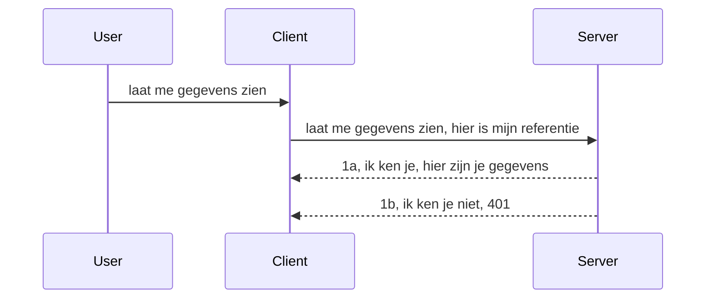

# Eenvoudige authenticatie

MCP SDK's ondersteunen het gebruik van OAuth 2.1 wat eerlijk gezegd een behoorlijk complex proces is, met concepten zoals auth server, resource server, het posten van referenties, het verkrijgen van een code, het omwisselen van de code voor een bearer token totdat je uiteindelijk je resourcegegevens kunt krijgen. Als je ongebruikelijk bent met OAuth, wat een geweldig iets is om te implementeren, is het een goed idee om te beginnen met een basisniveau van authenticatie en op te bouwen naar steeds betere beveiliging. Daarom bestaat dit hoofdstuk, om je op te bouwen naar meer geavanceerde authenticatie.

## Authenticatie, wat bedoelen we?

Auth is een afkorting voor authenticatie en autorisatie. Het idee is dat we twee dingen moeten doen:

- **Authenticatie**, het proces om uit te zoeken of we iemand onze deur laten binnenkomen, dat die persoon het recht heeft om "hier" te zijn, dat wil zeggen toegang heeft tot onze resource server waar onze MCP Server-functies draaien.
- **Autorisatie**, is het proces om uit te zoeken of een gebruiker toegang zou moeten hebben tot de specifieke bronnen die hij opvraagt, bijvoorbeeld deze bestellingen of deze producten of of hij alleen de inhoud mag lezen maar bijvoorbeeld niet mag verwijderen.

## Referenties: hoe we het systeem vertellen wie we zijn

De meeste webontwikkelaars denken meestal in termen van het verstrekken van een referentie aan de server, meestal een geheim dat zegt of ze hier mogen zijn "Authenticatie". Deze referentie is meestal een base64-gecodeerde versie van gebruikersnaam en wachtwoord of een API-sleutel die een specifieke gebruiker uniek identificeert.

Dit houdt in dat je het via een header verstuurt genaamd "Authorization" zoals:

```json
{ "Authorization": "secret123" }
```
  
Dit wordt meestal aangeduid als basic authentication. Hoe de algemene flow dan werkt is op de volgende manier:


  
Nu we begrijpen hoe het werkt vanuit een flow-perspectief, hoe implementeren we het? De meeste webservers hebben een concept dat middleware heet, een stuk code dat wordt uitgevoerd als onderdeel van de verzoekverwerking die referenties kan verifiëren, en als de referenties geldig zijn, kan het verzoek doorgelaten worden. Als het verzoek geen geldige referenties heeft, krijg je een auth-fout. Laten we zien hoe dit geïmplementeerd kan worden:

**Python**

```python
class AuthMiddleware(BaseHTTPMiddleware):
    async def dispatch(self, request, call_next):

        has_header = request.headers.get("Authorization")
        if not has_header:
            print("-> Missing Authorization header!")
            return Response(status_code=401, content="Unauthorized")

        if not valid_token(has_header):
            print("-> Invalid token!")
            return Response(status_code=403, content="Forbidden")

        print("Valid token, proceeding...")
       
        response = await call_next(request)
        # voeg eventuele klantheaders toe of wijzig op een bepaalde manier de reactie
        return response


starlette_app.add_middleware(CustomHeaderMiddleware)
```
  
Hier hebben we:

- Een middleware gemaakt genaamd `AuthMiddleware` waarbij de `dispatch`-methode wordt aangeroepen door de webserver.
- De middleware toegevoegd aan de webserver:

    ```python
    starlette_app.add_middleware(AuthMiddleware)
    ```
  
- Validatielogica geschreven die controleert of de Authorization-header aanwezig is en of het verzonden geheim geldig is:

    ```python
    has_header = request.headers.get("Authorization")
    if not has_header:
        print("-> Missing Authorization header!")
        return Response(status_code=401, content="Unauthorized")

    if not valid_token(has_header):
        print("-> Invalid token!")
        return Response(status_code=403, content="Forbidden")
    ```
  
    als het geheim aanwezig en geldig is, laten we het verzoek door door `call_next` aan te roepen en retourneren we de response.

    ```python
    response = await call_next(request)
    # voeg eventuele klantheaders toe of wijzig de respons op een of andere manier
    return response
    ```
  
Hoe het werkt is dat als een webverzoek naar de server wordt gedaan, de middleware wordt aangeroepen en afhankelijk van de implementatie het verzoek laat passeren of een fout retourneert die aangeeft dat de client niet mag doorgaan.

**TypeScript**

Hier maken we een middleware met het populaire framework Express en onderscheppen we het verzoek voordat het de MCP Server bereikt. Hier is de code daarvoor:

```typescript
function isValid(secret) {
    return secret === "secret123";
}

app.use((req, res, next) => {
    // 1. Autorisatieheader aanwezig?
    if(!req.headers["Authorization"]) {
        res.status(401).send('Unauthorized');
    }
    
    let token = req.headers["Authorization"];

    // 2. Controleer geldigheid.
    if(!isValid(token)) {
        res.status(403).send('Forbidden');
    }

   
    console.log('Middleware executed');
    // 3. Geeft het verzoek door aan de volgende stap in de verzoekpijplijn.
    next();
});
```
  
In deze code:

1. Controleren we of de Authorization-header er überhaupt is, zo niet, sturen we een 401 fout.
2. Controleren we of de referentie/token geldig is, zo niet, sturen we een 403 fout.
3. Uiteindelijk wordt het verzoek doorgestuurd in de verzoekpijplijn en wordt de gevraagde resource teruggegeven.

## Oefening: Implementeer authenticatie

Laten we onze kennis gebruiken en proberen het te implementeren. Dit is het plan:

Server

- Maak een webserver en MCP instantie.
- Implementeer een middleware voor de server.

Client

- Verstuur een webverzoek met referentie via header.

### -1- Maak een webserver en MCP instantie

> **Vooruitblik:** het onderstaande TypeScript voorbeeld houdt HTTP-transports bij in een `transports` map geordend op `mcp-session-id`, volgens **MCP Specification 2025-11-25**. De release candidate `2026-07-28` verwijdert de `initialize` handshake en sessie-ID volledig, dus deze per-sessie transport map verdwijnt ten gunste van stateless, zelf-bevatte verzoeken. Zie [Wat verandert er in MCP: De 2026-07-28 release candidate](../../01-CoreConcepts/mcp-2026-07-28-release-candidate.md).

In onze eerste stap moeten we een webserver instantie aanmaken en de MCP Server.

**Python**

Hier maken we een MCP server instantie, creëren we een starlette webapp en hosten die met uvicorn.

```python
# MCP-server aan het maken

app = FastMCP(
    name="MCP Resource Server",
    instructions="Resource Server that validates tokens via Authorization Server introspection",
    host=settings["host"],
    port=settings["port"],
    debug=True
)

# starlette webapp aan het maken
starlette_app = app.streamable_http_app()

# app serveren via uvicorn
async def run(starlette_app):
    import uvicorn
    config = uvicorn.Config(
            starlette_app,
            host=app.settings.host,
            port=app.settings.port,
            log_level=app.settings.log_level.lower(),
        )
    server = uvicorn.Server(config)
    await server.serve()

run(starlette_app)
```
  
In deze code:

- Maken we de MCP Server aan.
- Bouwen we de starlette webapp van de MCP Server met `app.streamable_http_app()`.
- Host en serveert de webapp met uvicorn `server.serve()`.

**TypeScript**

Hier maken we een MCP Server instantie aan.

```typescript
const server = new McpServer({
      name: "example-server",
      version: "1.0.0"
    });

    // ... stel serverbronnen, tools en prompts in ...
```
  
Deze MCP Server creatie moet binnen onze POST /mcp route definitie gebeuren, dus verplaatsen we bovenstaande code als volgt:

```typescript
import express from "express";
import { randomUUID } from "node:crypto";
import { McpServer } from "@modelcontextprotocol/sdk/server/mcp.js";
import { StreamableHTTPServerTransport } from "@modelcontextprotocol/sdk/server/streamableHttp.js";
import { isInitializeRequest } from "@modelcontextprotocol/sdk/types.js"

const app = express();
app.use(express.json());

// Map om transports op te slaan per sessie-ID
const transports: { [sessionId: string]: StreamableHTTPServerTransport } = {};

// Verwerk POST-verzoeken voor communicatie van client naar server
app.post('/mcp', async (req, res) => {
  // Controleer op bestaande sessie-ID
  const sessionId = req.headers['mcp-session-id'] as string | undefined;
  let transport: StreamableHTTPServerTransport;

  if (sessionId && transports[sessionId]) {
    // Hergebruik bestaand transport
    transport = transports[sessionId];
  } else if (!sessionId && isInitializeRequest(req.body)) {
    // Nieuwe initialisatieaanvraag
    transport = new StreamableHTTPServerTransport({
      sessionIdGenerator: () => randomUUID(),
      onsessioninitialized: (sessionId) => {
        // Sla het transport op per sessie-ID
        transports[sessionId] = transport;
      },
      // DNS rebinding-bescherming is standaard uitgeschakeld voor achterwaartse compatibiliteit. Als je deze server lokaal draait
      // zorg er dan voor dat je instelt:
      // enableDnsRebindingProtection: true,
      // allowedHosts: ['127.0.0.1'],
    });

    // Ruim transport op bij sluiten
    transport.onclose = () => {
      if (transport.sessionId) {
        delete transports[transport.sessionId];
      }
    };
    const server = new McpServer({
      name: "example-server",
      version: "1.0.0"
    });

    // ... stel serverbronnen, tools en prompts in ...

    // Maak verbinding met de MCP-server
    await server.connect(transport);
  } else {
    // Ongeldig verzoek
    res.status(400).json({
      jsonrpc: '2.0',
      error: {
        code: -32000,
        message: 'Bad Request: No valid session ID provided',
      },
      id: null,
    });
    return;
  }

  // Verwerk het verzoek
  await transport.handleRequest(req, res, req.body);
});

// Herbruikbare handler voor GET- en DELETE-verzoeken
const handleSessionRequest = async (req: express.Request, res: express.Response) => {
  const sessionId = req.headers['mcp-session-id'] as string | undefined;
  if (!sessionId || !transports[sessionId]) {
    res.status(400).send('Invalid or missing session ID');
    return;
  }
  
  const transport = transports[sessionId];
  await transport.handleRequest(req, res);
};

// Verwerk GET-verzoeken voor server-naar-client notificaties via SSE
app.get('/mcp', handleSessionRequest);

// Verwerk DELETE-verzoeken voor sessiebeëindiging
app.delete('/mcp', handleSessionRequest);

app.listen(3000);
```
  
Nu zie je hoe de creatie van de MCP Server binnen `app.post("/mcp")` is geplaatst.

Laten we doorgaan naar de volgende stap van het maken van de middleware zodat we de binnenkomende referentie kunnen valideren.

### -2- Implementeer een middleware voor de server

Laten we doorgaan met de middleware. Hier maken we een middleware die zoekt naar een referentie in de `Authorization` header en deze valideert. Als het acceptabel is, gaat het verzoek verder om te doen wat het moet doen (bijvoorbeeld tools op lijst zetten, een resource lezen of welke MCP functionaliteit de client ook vroeg).

**Python**

Om de middleware te maken, moeten we een klasse maken die overerft van `BaseHTTPMiddleware`. Er zijn twee interessante onderdelen:

- Het verzoek `request`, waar we de headerinformatie van lezen.
- `call_next` de callback die we moeten aanroepen als de client een referentie heeft gebracht die we accepteren.

Eerst moeten we de situatie behandelen dat de `Authorization` header ontbreekt:

```python
has_header = request.headers.get("Authorization")

# geen header aanwezig, faal met 401, anders ga verder.
if not has_header:
    print("-> Missing Authorization header!")
    return Response(status_code=401, content="Unauthorized")
```
  
Hier sturen we een 401 unauthorized bericht omdat de client faalt in authenticatie.

Vervolgens, als er een referentie is meegegeven, controleren we de geldigheid zo:

```python
 if not valid_token(has_header):
    print("-> Invalid token!")
    return Response(status_code=403, content="Forbidden")
```
  
Merk op dat hier een 403 forbidden bericht wordt gestuurd. Hieronder de complete middleware die alles implementeert wat we hierboven noemden:

```python
class AuthMiddleware(BaseHTTPMiddleware):
    async def dispatch(self, request, call_next):

        has_header = request.headers.get("Authorization")
        if not has_header:
            print("-> Missing Authorization header!")
            return Response(status_code=401, content="Unauthorized")

        if not valid_token(has_header):
            print("-> Invalid token!")
            return Response(status_code=403, content="Forbidden")

        print("Valid token, proceeding...")
        print(f"-> Received {request.method} {request.url}")
        response = await call_next(request)
        response.headers['Custom'] = 'Example'
        return response

```
  
Prima, maar wat doet de functie `valid_token`? Die zie je hieronder:

```python
# NIET gebruiken voor productie - verbeter het !!
def valid_token(token: str) -> bool:
    # verwijder het "Bearer " voorvoegsel
    if token.startswith("Bearer "):
        token = token[7:]
        return token == "secret-token"
    return False
```
  
Dit kan natuurlijk verbeterd worden.

BELANGRIJK: Je zou NOOIT geheimen zoals dit in code moeten have. Idealiter haal je de waarde om te vergelijken op uit een gegevensbron of van een IDP (identity service provider) of nog beter, laat de IDP de validatie verzorgen.

**TypeScript**

Om dit met Express te implementeren, moeten we de `use` methode aanroepen die middleware functies accepteert.

We moeten:

- Interageren met het request object om de doorgegeven referentie te controleren in de `Authorization` eigenschap.
- De referentie valideren, en als die klopt de request laten doorgaan zodat de MCP request van de client zijn werk kan doen (bijv. tools op lijst zetten, resource lezen of iets anders MCP-gerelateerd).

Hier controleren we of de `Authorization` header aanwezig is en als dat niet zo is, stoppen we het verzoek:

```typescript
if(!req.headers["authorization"]) {
    res.status(401).send('Unauthorized');
    return;
}
```
  
Als de header er helemaal niet in zit, krijg je een 401.

Vervolgens checken we of de referentie geldig is, zo niet stoppen we het verzoek weer maar met een iets andere boodschap:

```typescript
if(!isValid(token)) {
    res.status(403).send('Forbidden');
    return;
} 
```
  
Je krijgt nu een 403 foutmelding.

Hier is de volledige code:

```typescript
app.use((req, res, next) => {
    console.log('Request received:', req.method, req.url, req.headers);
    console.log('Headers:', req.headers["authorization"]);
    if(!req.headers["authorization"]) {
        res.status(401).send('Unauthorized');
        return;
    }
    
    let token = req.headers["authorization"];

    if(!isValid(token)) {
        res.status(403).send('Forbidden');
        return;
    }  

    console.log('Middleware executed');
    next();
});
```
  
We hebben de webserver zo ingesteld dat hij een middleware accepteert om de referentie te controleren die de client hopelijk meestuurt. Wat doen we met de client zelf?

### -3- Verstuur webverzoek met referentie via header

We moeten ervoor zorgen dat de client de referentie via de header meestuurt. Omdat we een MCP client daarvoor willen gebruiken, moeten we uitzoeken hoe dat gaat.

**Python**

Voor de client moeten we een header meegeven met onze referentie zoals:

```python
# CODEER DE WAARDE NIET HARD, bewaar deze minimaal in een omgevingsvariabele of een veiliger opslag
token = "secret-token"

async with streamablehttp_client(
        url = f"http://localhost:{port}/mcp",
        headers = {"Authorization": f"Bearer {token}"}
    ) as (
        read_stream,
        write_stream,
        session_callback,
    ):
        async with ClientSession(
            read_stream,
            write_stream
        ) as session:
            await session.initialize()
      
            # TODO, wat je wil dat er in de client gedaan wordt, bijv lijst met tools, tools aanroepen etc.
```
  
Let erop hoe we de `headers` property invullen als ` headers = {"Authorization": f"Bearer {token}"}`.

**TypeScript**

We kunnen dit in twee stappen oplossen:

1. Een configuratie-object vullen met onze referentie.
2. Het configuratie-object aan de transport geven.

```typescript

// HARDcode de waarde niet zoals hier getoond. Gebruik minimaal een omgevingsvariabele en iets als dotenv (in ontwikkelmodus).
let token = "secret123"

// definieer een client transportoptie-object
let options: StreamableHTTPClientTransportOptions = {
  sessionId: sessionId,
  requestInit: {
    headers: {
      "Authorization": "secret123"
    }
  }
};

// geef het opties-object door aan de transport
async function main() {
   const transport = new StreamableHTTPClientTransport(
      new URL(serverUrl),
      options
   );
```
  
Hierboven zie je hoe we een `options` object moesten aanmaken en onze headers onder de `requestInit` eigenschap moesten plaatsen.

BELANGRIJK: Hoe verbeteren we dit vanaf hier? De huidige implementatie heeft wat problemen. Ten eerste is het doorgesturen van een referentie zo risicovol, tenzij je tenminste HTTPS hebt. Toch kan de referentie gestolen worden, dus heb je een systeem nodig waarbij je gemakkelijk het token kunt intrekken en extra checks kunt toevoegen zoals waar het vandaan komt, of het verzoek te vaak komt (bot-gedrag), kortom, er zijn veel aandachtspunten.

Het moet wel gezegd worden dat voor hele eenvoudige API’s waar je niet wil dat iedereen zonder authenticatie je API kan aanroepen, wat we hier hebben een goed begin is.

Dat gezegd hebbende, laten we proberen de beveiliging wat te versterken door een standaard formaat te gebruiken zoals JSON Web Token, ook bekend als JWT of "JOT" tokens.

## JSON Web Tokens, JWT

We proberen dus zaken te verbeteren ten opzichte van het sturen van zeer eenvoudige referenties. Wat zijn de directe verbeteringen als je JWT gebruikt?

- **Beveiligingsverbeteringen**. Bij basic auth stuur je gebruikersnaam en wachtwoord als een base64-gecodeerd token (of je gebruikt een API key) steeds opnieuw wat het risico verhoogt. Met JWT stuur je gebruikersnaam en wachtwoord en krijg je een token terug, dat ook tijdgebonden is wat betekent dat het verloopt. JWT laat je ook fijnmazige toegangscontrole gebruiken met rollen, scopes en permissies.
- **Stateloosheid en schaalbaarheid**. JWT's zijn zelfbevat, ze bevatten alle gebruikersinfo en elimineren de noodzaak van server-side sessieopslag. Tokens kunnen ook lokaal gevalideerd worden.
- **Interoperabiliteit en federatie**. JWTs zijn het hart van Open ID Connect en worden gebruikt met bekende identiteitsproviders zoals Entra ID, Google Identity en Auth0. Ze maken ook single sign-on en meer mogelijk, waardoor ze enterprise-grade zijn.
- **Modulariteit en flexibiliteit**. JWTs kunnen ook worden gebruikt met API-gateways zoals Azure API Management, NGINX en meer. Het ondersteunt ook authenticatiescenario's en server-naar-service communicatie inclusief impersonatie en delegatie.
- **Prestaties en caching**. JWTs kunnen gecacht worden na decoderen wat de noodzaak voor parsing vermindert. Dit helpt vooral bij hoge traffic apps omdat het doorvoer verbetert en de belasting op de infrastructuur verlaagt.
- **Geavanceerde functies**. Het ondersteunt ook introspectie (controleren op geldigheid op server) en intrekking (token ongeldig maken).

Met al deze voordelen, laten we kijken hoe we onze implementatie naar het volgende niveau kunnen tillen.

## Basic auth veranderen naar JWT

De veranderingen die we op hoog niveau moeten doen zijn:

- **Leren een JWT token op te bouwen** en gereed te maken om te versturen van client naar server.
- **Een JWT token valideren**, en zo ja, de client toegang geven tot onze resources.
- **Veilige tokenopslag**. Hoe we dit token bewaren.
- **Routes beschermen**. We moeten routes beschermen, in ons geval MCP routes en specifieke MCP functionaliteiten.
- **Refresh tokens toevoegen**. Zorg dat we tokens maken die kortlevend zijn, maar met refresh tokens die langlevend zijn en gebruikt kunnen worden om nieuwe tokens te verkrijgen als deze verlopen zijn. Zorg ook voor een refresh endpoint en een rotatiestrategie.

### -1- Bouw een JWT token

Allereerst heeft een JWT token de volgende delen:

- **header**, gebruikte algoritme en token type.
- **payload**, claims zoals sub (de gebruiker of entiteit die het token vertegenwoordigt, typisch userid in auth scenario), exp (wanneer het verloopt), role (de rol).
- **signature**, ondertekend met een secret of private key.

Hiervoor moeten we de header, payload en het gecodeerde token samenstellen.

**Python**

```python

import jwt
import jwt
from jwt.exceptions import ExpiredSignatureError, InvalidTokenError
import datetime

# Geheime sleutel gebruikt om de JWT te ondertekenen
secret_key = 'your-secret-key'

header = {
    "alg": "HS256",
    "typ": "JWT"
}

# de gebruikersinformatie en de claims en vervaltijd
payload = {
    "sub": "1234567890",               # Onderwerp (gebruikers-ID)
    "name": "User Userson",                # Aangepaste claim
    "admin": True,                     # Aangepaste claim
    "iat": datetime.datetime.utcnow(),# Uitgegeven op
    "exp": datetime.datetime.utcnow() + datetime.timedelta(hours=1)  # Verloopt
}

# codeer het
encoded_jwt = jwt.encode(payload, secret_key, algorithm="HS256", headers=header)
```
  
In bovenstaande code hebben we:

- Een header gedefinieerd met HS256 als algoritme en type JWT.
- Een payload samengesteld met een subject of userid, een gebruikersnaam, een rol, wanneer het is uitgegeven en wanneer het verloopt waardoor het tijdgebonden aspect geïmplementeerd is.

**TypeScript**

Hiervoor hebben we wat dependencies nodig die ons helpen het JWT token te maken.

Dependencies

```sh

npm install jsonwebtoken
npm install --save-dev @types/jsonwebtoken
```
  
Nu we dat hebben, maken we de header, payload en creëren daarmee het gecodeerde token.

```typescript
import jwt from 'jsonwebtoken';

const secretKey = 'your-secret-key'; // Gebruik omgevingsvariabelen in productie

// Definieer de payload
const payload = {
  sub: '1234567890',
  name: 'User usersson',
  admin: true,
  iat: Math.floor(Date.now() / 1000), // Uitgegeven op
  exp: Math.floor(Date.now() / 1000) + 60 * 60 // Verloopt over 1 uur
};

// Definieer de header (optioneel, jsonwebtoken stelt standaardwaarden in)
const header = {
  alg: 'HS256',
  typ: 'JWT'
};

// Maak de token aan
const token = jwt.sign(payload, secretKey, {
  algorithm: 'HS256',
  header: header
});

console.log('JWT:', token);
```
  
Dit token is:

Ondertekend met HS256  
Geldig voor 1 uur  
Bevat claims zoals sub, name, admin, iat en exp.

### -2- Valideer een token

We moeten ook een token valideren, dit doen we op de server om te zorgen dat hetgeen de client ons stuurt geldig is. Er zijn veel controles die we moeten doen, van de structuur tot validiteit. Het is ook aan te raden extra controles toe te voegen om te checken of de gebruiker in je systeem zit en meer.

Om te valideren moeten we het token decoderen zodat we het kunnen lezen en dan beginnen met de validiteitscontrole:

**Python**

```python

# Decodeer en verifieer de JWT
try:
    decoded = jwt.decode(token, secret_key, algorithms=["HS256"])
    print("✅ Token is valid.")
    print("Decoded claims:")
    for key, value in decoded.items():
        print(f"  {key}: {value}")
except ExpiredSignatureError:
    print("❌ Token has expired.")
except InvalidTokenError as e:
    print(f"❌ Invalid token: {e}")

```

In deze code roepen we `jwt.decode` aan met de token, de geheime sleutel en het gekozen algoritme als invoer. Let erop dat we een try-catch-constructie gebruiken, omdat een mislukte validatie leidt tot een foutmelding.

**TypeScript**

Hier moeten we `jwt.verify` aanroepen om een gedecodeerde versie van de token te krijgen die we verder kunnen analyseren. Als deze aanroep faalt, betekent dat dat de structuur van de token onjuist is of niet meer geldig is.

```typescript

try {
  const decoded = jwt.verify(token, secretKey);
  console.log('Decoded Payload:', decoded);
} catch (err) {
  console.error('Token verification failed:', err);
}
```

NOTE: zoals eerder vermeld, moeten we extra controles uitvoeren om te garanderen dat deze token verwijst naar een gebruiker in ons systeem en ervoor zorgen dat de gebruiker de rechten heeft die het beweert te hebben.

Laten we nu kijken naar role-based access control, ook wel RBAC genoemd.

## Role-based access control toevoegen

Het idee is dat we willen aangeven dat verschillende rollen verschillende permissies hebben. Bijvoorbeeld, we gaan ervan uit dat een admin alles kan doen, een normale gebruiker kan lezen/schrijven en een gast alleen kan lezen. Daarom zijn hier enkele mogelijke permissieniveaus:

- Admin.Write  
- User.Read  
- Guest.Read  

Laten we bekijken hoe we zo'n controle kunnen implementeren met middleware. Middleware kan per route worden toegevoegd, maar ook voor alle routes.

**Python**

```python
from starlette.middleware.base import BaseHTTPMiddleware
from starlette.responses import JSONResponse
import jwt

# HEB het geheim NIET in de code zoals deze, dit is alleen voor demonstratiedoeleinden. Lees het uit een veilige plaats.
SECRET_KEY = "your-secret-key" # zet dit in een omgevingsvariabele
REQUIRED_PERMISSION = "User.Read"

class JWTPermissionMiddleware(BaseHTTPMiddleware):
    async def dispatch(self, request, call_next):
        auth_header = request.headers.get("Authorization")
        if not auth_header or not auth_header.startswith("Bearer "):
            return JSONResponse({"error": "Missing or invalid Authorization header"}, status_code=401)

        token = auth_header.split(" ")[1]
        try:
            decoded = jwt.decode(token, SECRET_KEY, algorithms=["HS256"])
        except jwt.ExpiredSignatureError:
            return JSONResponse({"error": "Token expired"}, status_code=401)
        except jwt.InvalidTokenError:
            return JSONResponse({"error": "Invalid token"}, status_code=401)

        permissions = decoded.get("permissions", [])
        if REQUIRED_PERMISSION not in permissions:
            return JSONResponse({"error": "Permission denied"}, status_code=403)

        request.state.user = decoded
        return await call_next(request)


```

Er zijn een paar verschillende manieren om de middleware toe te voegen zoals hieronder:

```python

# Alternatief 1: voeg middleware toe tijdens het bouwen van de starlette-app
middleware = [
    Middleware(JWTPermissionMiddleware)
]

app = Starlette(routes=routes, middleware=middleware)

# Alternatief 2: voeg middleware toe nadat de starlette-app al is gebouwd
starlette_app.add_middleware(JWTPermissionMiddleware)

# Alternatief 3: voeg middleware toe per route
routes = [
    Route(
        "/mcp",
        endpoint=..., # handler
        middleware=[Middleware(JWTPermissionMiddleware)]
    )
]
```

**TypeScript**

We kunnen `app.use` gebruiken met een middleware die voor alle verzoeken wordt uitgevoerd.

```typescript
app.use((req, res, next) => {
    console.log('Request received:', req.method, req.url, req.headers);
    console.log('Headers:', req.headers["authorization"]);

    // 1. Controleer of de autorisatie-header is verzonden

    if(!req.headers["authorization"]) {
        res.status(401).send('Unauthorized');
        return;
    }
    
    let token = req.headers["authorization"];

    // 2. Controleer of het token geldig is
    if(!isValid(token)) {
        res.status(403).send('Forbidden');
        return;
    }  

    // 3. Controleer of de tokengebruiker bestaat in ons systeem
    if(!isExistingUser(token)) {
        res.status(403).send('Forbidden');
        console.log("User does not exist");
        return;
    }
    console.log("User exists");

    // 4. Verifieer of het token de juiste permissies heeft
    if(!hasScopes(token, ["User.Read"])){
        res.status(403).send('Forbidden - insufficient scopes');
    }

    console.log("User has required scopes");

    console.log('Middleware executed');
    next();
});

```

Er zijn nogal wat dingen die we onze middleware kunnen laten doen en die onze middleware MOET doen, namelijk:

1. Controleren of de autorisatie-header aanwezig is  
2. Controleren of de token geldig is, we roepen `isValid` aan, een methode die we hebben geschreven die de integriteit en geldigheid van de JWT-token controleert.  
3. Verifiëren dat de gebruiker bestaat in ons systeem, dit moeten we controleren.

   ```typescript
    // gebruikers in DB
   const users = [
     "user1",
     "User usersson",
   ]

   function isExistingUser(token) {
     let decodedToken = verifyToken(token);

     // TODO, controleren of gebruiker bestaat in DB
     return users.includes(decodedToken?.name || "");
   }
   ```

   Bovenstaand hebben we een heel eenvoudige `users` lijst gemaakt, die uiteraard in een database moet staan.

4. Daarnaast moeten we ook controleren of de token de juiste permissies heeft.

   ```typescript
   if(!hasScopes(token, ["User.Read"])){
        res.status(403).send('Forbidden - insufficient scopes');
   }
   ```

   In deze code hierboven uit de middleware controleren we of de token User.Read permissie bevat; zo niet, sturen we een 403-fout. Hieronder staat de helpermethode `hasScopes`.

   ```typescript
   function hasScopes(scope: string, requiredScopes: string[]) {
     let decodedToken = verifyToken(scope);
    return requiredScopes.every(scope => decodedToken?.scopes.includes(scope));
  }
   ```

Have a think which additional checks you should be doing, but these are the absolute minimum of checks you should be doing.

Using Express as a web framework is a common choice. There are helpers library when you use JWT so you can write less code.

- `express-jwt`, helper library that provides a middleware that helps decode your token.
- `express-jwt-permissions`, this provides a middleware `guard` that helps check if a certain permission is on the token.

Here's what these libraries can look like when used:

```typescript
const express = require('express');
const jwt = require('express-jwt');
const guard = require('express-jwt-permissions')();

const app = express();
const secretKey = 'your-secret-key'; // put this in env variable

// Decode JWT and attach to req.user
app.use(jwt({ secret: secretKey, algorithms: ['HS256'] }));

// Check for User.Read permission
app.use(guard.check('User.Read'));

// multiple permissions
// app.use(guard.check(['User.Read', 'Admin.Access']));

app.get('/protected', (req, res) => {
  res.json({ message: `Welcome ${req.user.name}` });
});

// Error handler
app.use((err, req, res, next) => {
  if (err.code === 'permission_denied') {
    return res.status(403).send('Forbidden');
  }
  next(err);
});

```

Je hebt nu gezien hoe middleware kan worden gebruikt voor zowel authenticatie als autorisatie, maar hoe zit het met MCP? Verandert dat hoe we authenticatie doen? Laten we dat ontdekken in de volgende sectie.

### -3- RBAC toevoegen aan MCP

Je hebt tot nu toe gezien hoe je RBAC kunt toevoegen via middleware, maar voor MCP is er geen gemakkelijke manier om per MCP-functie RBAC toe te voegen, wat doen we dan? Nou, we moeten gewoon code zoals deze toevoegen, die in dit geval controleert of de client het recht heeft een specifieke tool aan te roepen:

Je hebt een paar verschillende opties om per functie RBAC te realiseren, hier zijn er enkele:

- Voeg een controle toe voor elke tool, resource, prompt waar je het permissieniveau moet controleren.

   **python**

   ```python
   @tool()
   def delete_product(id: int):
      try:
          check_permissions(role="Admin.Write", request)
      catch:
        pass # client mislukte autorisatie, genereer autorisatiefout
   ```

   **typescript**

   ```typescript
   server.registerTool(
    "delete-product",
    {
      title: Delete a product",
      description: "Deletes a product",
      inputSchema: { id: z.number() }
    },
    async ({ id }) => {
      
      try {
        checkPermissions("Admin.Write", request);
        // todo, stuur id naar productService en remote entry
      } catch(Exception e) {
        console.log("Authorization error, you're not allowed");  
      }

      return {
        content: [{ type: "text", text: `Deletected product with id ${id}` }]
      };
    }
   );
   ```


- Gebruik een geavanceerde serverbenadering en de request handlers, zodat je minimaliseert op hoeveel plaatsen je de controle hoeft uit te voeren.

   **Python**

   ```python
   
   tool_permission = {
      "create_product": ["User.Write", "Admin.Write"],
      "delete_product": ["Admin.Write"]
   }

   def has_permission(user_permissions, required_permissions) -> bool:
      # user_permissions: lijst met rechten die de gebruiker heeft
      # required_permissions: lijst met rechten die vereist zijn voor het gereedschap
      return any(perm in user_permissions for perm in required_permissions)

   @server.call_tool()
   async def handle_call_tool(
     name: str, arguments: dict[str, str] | None
   ) -> list[types.TextContent]:
    # Ga ervan uit dat request.user.permissions een lijst is met rechten voor de gebruiker
     user_permissions = request.user.permissions
     required_permissions = tool_permission.get(name, [])
     if not has_permission(user_permissions, required_permissions):
        # Foutmelding geven "Je hebt geen toestemming om het gereedschap {name} aan te roepen"
        raise Exception(f"You don't have permission to call tool {name}")
     # doorgaan en het gereedschap aanroepen
     # ...
   ```   
   

   **TypeScript**

   ```typescript
   function hasPermission(userPermissions: string[], requiredPermissions: string[]): boolean {
       if (!Array.isArray(userPermissions) || !Array.isArray(requiredPermissions)) return false;
       // Retourneer true als de gebruiker ten minste één vereiste toestemming heeft
       
       return requiredPermissions.some(perm => userPermissions.includes(perm));
   }
  
   server.setRequestHandler(CallToolRequestSchema, async (request) => {
      const { params: { name } } = request;
  
      let permissions = request.user.permissions;
  
      if (!hasPermission(permissions, toolPermissions[name])) {
         return new Error(`You don't have permission to call ${name}`);
      }
  
      // ga door..
   });
   ```

   Let op, je moet ervoor zorgen dat je middleware een gedecodeerde token toekent aan de user-eigenschap van het verzoek zodat de bovenstaande code eenvoudig is.

### Samenvatting

Nu we hebben besproken hoe je ondersteuning voor RBAC in het algemeen en voor MCP in het bijzonder kunt toevoegen, is het tijd om beveiliging zelf te implementeren om te zorgen dat je de gepresenteerde concepten hebt begrepen.

## Opdracht 1: Bouw een mcp-server en mcp-client met basis-authenticatie

Hier ga je toepassen wat je hebt geleerd over het doorsturen van inloggegevens via headers.

## Oplossing 1

[Solution 1](./code/basic/README.md)

## Opdracht 2: Upgrade de oplossing van Opdracht 1 naar gebruik van JWT

Neem de eerste oplossing, maar verbeter deze nu.

In plaats van Basic Auth, gebruiken we JWT.

## Oplossing 2

[Solution 2](./solution/jwt-solution/README.md)

## Uitdaging

Voeg de RBAC per tool toe zoals beschreven in de sectie "Add RBAC to MCP".

## Samenvatting

Je hebt hopelijk veel geleerd in dit hoofdstuk, van geen beveiliging, naar basisbeveiliging, tot JWT en hoe dat kan worden toegevoegd aan MCP.

We hebben een solide basis gelegd met aangepaste JWT's, maar naarmate we opschalen, bewegen we richting een standaardgebaseerd identiteitsmodel. Het adopteren van een IdP zoals Entra of Keycloak stelt ons in staat om tokenuitgifte, validatie en levenscyclusbeheer uit te besteden aan een vertrouwd platform — zodat wij ons kunnen richten op applicatielogica en gebruikerservaring.

Daarvoor hebben we een meer [gevorderd hoofdstuk over Entra](../../05-AdvancedTopics/mcp-security-entra/README.md)

## Wat is het volgende

- Volgende: [MCP hosts opzetten](../12-mcp-hosts/README.md)

---

<!-- CO-OP TRANSLATOR DISCLAIMER START -->
**Disclaimer**:
Dit document is vertaald met behulp van de AI vertaaldienst [Co-op Translator](https://github.com/Azure/co-op-translator). Hoewel we streven naar nauwkeurigheid, dient u er rekening mee te houden dat geautomatiseerde vertalingen fouten of onnauwkeurigheden kunnen bevatten. Het originele document in de oorspronkelijke taal moet worden beschouwd als de gezaghebbende bron. Voor kritieke informatie wordt professionele menselijke vertaling aanbevolen. Wij zijn niet aansprakelijk voor eventuele misverstanden of verkeerde interpretaties die voortvloeien uit het gebruik van deze vertaling.
<!-- CO-OP TRANSLATOR DISCLAIMER END -->