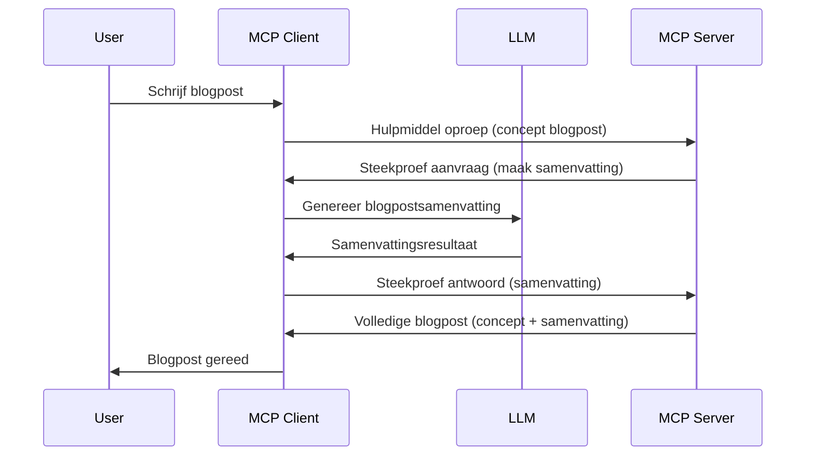

# Sampling - delegeer functies aan de Client

> **Afloopmelding:** de `2026-07-28` MCP specificatie release candidate markeert Sampling als verouderd ten gunste van directe integratie met LLM-provider-API's. Sampling blijft werken in `2025-11-25` en minstens een jaar na enige formele veroudering, dus alles in deze les blijft geldig — maar nieuwe serverontwerpen moeten het vervangingspatroon evalueren. Zie [Wat verandert in MCP: De 2026-07-28 Release Candidate](../../01-CoreConcepts/mcp-2026-07-28-release-candidate.md).

Soms moeten de MCP Client en MCP Server samenwerken om een gemeenschappelijk doel te bereiken. Je kunt een situatie hebben waarin de Server de hulp nodig heeft van een LLM die op de client draait. Voor deze situatie is sampling hetgeen wat je moet gebruiken.

Laten we enkele use cases verkennen en hoe je een oplossing met sampling bouwt.

## Overzicht

In deze les richten we ons op het uitleggen wanneer en waar Sampling te gebruiken en hoe het te configureren.

## Leerdoelen

In dit hoofdstuk zullen we:

- Uitleggen wat Sampling is en wanneer het te gebruiken.
- Tonen hoe Sampling te configureren in MCP.
- Voorbeelden geven van Sampling in actie.

## Wat is Sampling en waarom gebruiken?

Sampling is een geavanceerde functie die op de volgende wijze werkt:



### Sampling-verzoek

Oké, nu hebben we een helikopterview van een geloofwaardig scenario, laten we praten over het sampling-verzoek dat de server terugstuurt naar de client. Zo kan zo'n verzoek eruitzien in JSON-RPC-formaat:

```json
{
  "jsonrpc": "2.0",
  "id": 1,
  "method": "sampling/createMessage",
  "params": {
    "messages": [
      {
        "role": "user",
        "content": {
          "type": "text",
          "text": "Create a blog post summary of the following blog post: <BLOG POST>"
        }
      }
    ],
    "modelPreferences": {
      "hints": [
        {
          "name": "claude-3-sonnet"
        }
      ],
      "intelligencePriority": 0.8,
      "speedPriority": 0.5
    },
    "systemPrompt": "You are a helpful assistant.",
    "maxTokens": 100
  }
}
```

Er zijn hier een paar dingen die het benoemen waard zijn:

- Prompt, onder content -> text, is onze prompt die een instructie is voor de LLM om content van een blogpost samen te vatten.

- **modelPreferences**. Dit onderdeel is precies dat, een voorkeur, een aanbeveling welke configuratie te gebruiken met de LLM. De gebruiker kan kiezen of hij deze aanbevelingen volgt of aanpast. In dit geval zijn er aanbevelingen over het te gebruiken model en prioriteit voor snelheid en intelligentie.
- **systemPrompt**, dit is je normale system prompt die je LLM een persoonlijkheid geeft en richtlijnen bevat.
- **maxTokens**, dit is een andere eigenschap die aangeeft hoeveel tokens aanbevolen zijn voor deze taak.

### Sampling-antwoord

Dit antwoord is wat de MCP Client uiteindelijk terugstuurt naar de MCP Server en het is het resultaat van de client die de LLM aanroept, wacht op dat antwoord en dan dit bericht opstelt. Zo kan het eruitzien in JSON-RPC:

```json
{
  "jsonrpc": "2.0",
  "id": 1,
  "result": {
    "role": "assistant",
    "content": {
      "type": "text",
      "text": "Here's your abstract <ABSTRACT>"
    },
    "model": "gpt-5",
    "stopReason": "endTurn"
  }
}
```

Let op hoe het antwoord een samenvatting van de blogpost is, precies zoals gevraagd. Let ook op dat het gebruikte `model` niet is wat we vroegen maar "gpt-5" in plaats van "claude-3-sonnet". Dit illustreert dat de gebruiker van gedachten kan veranderen over wat te gebruiken en dat jouw sampling-verzoek een aanbeveling is.

Oké, nu we de hoofdflow begrijpen, en de nuttige taak waarvoor het te gebruiken "blogpostcreatie + samenvatting", laten we zien wat we moeten doen om het te laten werken.

### Berichttypes

Samplingberichten zijn niet beperkt tot alleen tekst, maar je kunt ook afbeeldingen en audio verzenden. Zo ziet de JSON-RPC er anders uit:

**Tekst**

```json
{
  "type": "text",
  "text": "The message content"
}
```

**Afbeeldingsinhoud**

```json
{
  "type": "image",
  "data": "base64-encoded-image-data",
  "mimeType": "image/jpeg"
}
```

**Audio-inhoud**

```json
{
  "type": "audio",
  "data": "base64-encoded-audio-data",
  "mimeType": "audio/wav"
}
```

> NOTE: voor gedetailleerdere informatie over Sampling, bekijk de [officiële docs](https://modelcontextprotocol.io/specification/2025-11-25/client/sampling)

## Hoe Sampling te Configureren in de Client

> Let op: als je alleen een server bouwt, hoef je hier niet veel te doen.

In een client moet je de volgende feature als volgt specificeren:

```json
{
  "capabilities": {
    "sampling": {}
  }
}
```

Dit wordt vervolgens opgepikt wanneer je gekozen client initieert met de server.

## Voorbeeld van Sampling in Actie - Maak een Blogpost

Laten we samen een sampling-server coderen, we moeten het volgende doen:

1. Maak een tool op de Server.
1. Die tool moet een sampling-verzoek maken.
1. De tool wacht tot het sampling-verzoek van de client beantwoord is.
1. Dan wordt het resultaat van de tool geproduceerd.

Laten we de code stap voor stap bekijken:

### -1- Maak de tool

**python**

```python
@mcp.tool()
async def create_blog(title: str, content: str, ctx: Context[ServerSession, None]) -> str:
    """Create a blog post and generate a summary"""

```

### -2- Maak een sampling-verzoek

Breid je tool uit met de volgende code:

**python**

```python
post = BlogPost(
        id=len(posts) + 1,
        title=title,
        content=content,
        abstract=""
    )

prompt = f"Create an abstract of the following blog post: title: {title} and draft: {content} "

result = await ctx.session.create_message(
        messages=[
            SamplingMessage(
                role="user",
                content=TextContent(type="text", text=prompt),
            )
        ],
        max_tokens=100,
)

```

### -3- Wacht op het antwoord en retourneer antwoord

**python**

```python
post.abstract = result.content.text

posts.append(post)

# retourneer het complete product
return json.dumps({
    "id": post.title,
    "abstract": post.abstract
})
```

### -4- Volledige code

**python**

```python
from starlette.applications import Starlette
from starlette.routing import Mount, Host

from mcp.server.fastmcp import Context, FastMCP

from mcp.server.session import ServerSession
from mcp.types import SamplingMessage, TextContent

import json


from uuid import uuid4
from typing import List
from pydantic import BaseModel


mcp = FastMCP("Blog post generator")

# app = FastAPI()

posts = []

class BlogPost(BaseModel):
    id: int
    title: str
    content: str
    abstract: str

posts: List[BlogPost] = []

@mcp.tool()
async def create_blog(title: str, content: str, ctx: Context[ServerSession, None]) -> str:
    """Create a blog post and generate a summary"""

    post = BlogPost(
        id=len(posts) + 1,
        title=title,
        content=content,
        abstract=""
    )

    prompt = f"Create an abstract of the following blog post: title: {title} and draft: {content} "

    result = await ctx.session.create_message(
        messages=[
            SamplingMessage(
                role="user",
                content=TextContent(type="text", text=prompt),
            )
        ],
        max_tokens=100,
    )

    post.abstract = result.content.text

    posts.append(post)

    # retourneer de volledige blogpost
    return json.dumps({
        "id": post.title,
        "abstract": post.abstract
    })

if __name__ == "__main__":
    print("Starting server...")
    # mcp.run()
    mcp.run(transport="streamable-http")

# start de app met: python server.py
```

### -5- Test het in Visual Studio Code

Om dit te testen in Visual Studio Code, doe het volgende:

1. Start server in terminal
1. Voeg het toe aan *mcp.json* (en zorg dat het gestart is), bijvoorbeeld zo:

   ```json
   "servers": {
      "blog-server": {
        "type": "http",
        "url": "http://localhost:8000/mcp"
      }
   }
   ```

1. Typ een prompt:

   ```text
   create a blog post named "Where Python comes from", the content is "Python is actually named after Monty Python Flying Circus"
   ```

1. Sta sampling toe. De eerste keer dat je dit test, verschijnt er een extra dialoog die je moet accepteren, daarna zie je de normale dialoog die je vraagt een tool uit te voeren.

1. Inspecteer resultaten. Je ziet de resultaten mooi gerenderd in GitHub Copilot Chat, maar je kunt ook de ruwe JSON-antwoord inspecteren.

**Bonus**. Visual Studio Code tooling heeft uitstekende ondersteuning voor sampling. Je kunt Sampling-toegang configureren op je geïnstalleerde server door er als volgt naartoe te navigeren:

1. Navigeer naar het extensiegedeelte.
1. Selecteer het tandwielicoon voor je geïnstalleerde server in de sectie "MCP SERVERS - INSTALLED".
1. Selecteer "Configure Model Access", hier kun je kiezen welke modellen GitHub Copilot mag gebruiken bij het uitvoeren van sampling. Je kunt ook alle recente sampling-verzoeken zien door op "Show Sampling requests" te klikken.

## Opdracht

In deze opdracht bouw je een iets andere Sampling, namelijk een sampling-integratie die een productbeschrijving genereert. Dit is je scenario:

**Scenario**: De medewerker backoffice van een e-commerce heeft hulp nodig, het kost veel te veel tijd om productbeschrijvingen te maken. Daarom bouw je een oplossing waarbij je een tool "create_product" aanroept met "title" en "keywords" als argumenten en het moet een compleet product opleveren inclusief een "description" veld dat wordt gevuld door de LLM van een client.

TIP: gebruik wat je eerder hebt geleerd om deze server en zijn tool te bouwen met een sampling-verzoek.

## Oplossing

[Oplossing](./solution/README.md)

## Belangrijkste punten

Sampling is een krachtige functie die de server toestaat taken te delegeren aan de client wanneer deze de hulp van een LLM nodig heeft.

## Wat Nu?

- [Hoofdstuk 4 - Praktische implementatie](../../04-PracticalImplementation/README.md)

---

<!-- CO-OP TRANSLATOR DISCLAIMER START -->
**Disclaimer**:
Dit document is vertaald met behulp van de AI vertaaldienst [Co-op Translator](https://github.com/Azure/co-op-translator). Hoewel we streven naar nauwkeurigheid, dient u er rekening mee te houden dat geautomatiseerde vertalingen fouten of onnauwkeurigheden kunnen bevatten. Het originele document in de oorspronkelijke taal moet worden beschouwd als de gezaghebbende bron. Voor kritieke informatie wordt professionele menselijke vertaling aanbevolen. Wij zijn niet aansprakelijk voor eventuele misverstanden of verkeerde interpretaties die voortvloeien uit het gebruik van deze vertaling.
<!-- CO-OP TRANSLATOR DISCLAIMER END -->